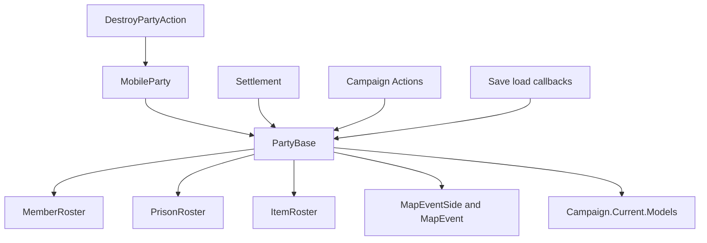

# PartyBase

**Namespace:** `TaleWorlds.CampaignSystem.Party`  
**Module:** `TaleWorlds.CampaignSystem`  
**Type:** `public sealed class PartyBase : IBattleCombatant, IRandomOwner, IInteractablePoint`  
**Base:** `System.Object`  
**Source:** `bin/TaleWorlds.CampaignSystem/TaleWorlds.CampaignSystem.Party/PartyBase.cs`

## One-line responsibility

`PartyBase` is the common campaign-map shell for something that can fight, be interacted with, and carry rosters. A [MobileParty](../MobileParty) or [Settlement](../Settlement) creates and owns it so encounters, rosters, and Models can use one parameter type for both kinds of host.

## Mental model: a host's runtime boundary, not a freely created party

This is neither an independent world object nor a base class for a mod to extend. The `MobileParty` constructor executes `Party = new PartyBase(this)` and the `Settlement` constructor does the same. The host then owns registration, position, map visibility, entering a settlement, destruction, and save restoration. PartyBase puts those host-backed map properties beside its member, prisoner, and item rosters.

The normal acquisition paths are therefore:

- the player party: `MobileParty.MainParty.Party`, or `PartyBase.MainParty` when the Campaign might not exist yet; the latter returns `null` when `Campaign.Current` is `null`;
- an existing mobile party: `mobileParty.Party`;
- a settlement garrison or settlement encounter participant: `settlement.Party`.

Do not `new PartyBase(...)`, and do not retain a hostless instance as campaign state. Its constructor asks `Campaign.Current.GeneratePartyId(this)` and creates the three rosters, but it cannot register a mobile party, create a settlement component, enter a locator, or attach destruction events. It may temporarily expose a roster, yet remains an orphan with no map lifetime.

#### Lifecycle

1. **Host creation:** a `MobileParty` or `Settlement` constructs and stores its single `Party`; `MemberRoster`, `PrisonRoster`, and `ItemRoster` exist from then on.
2. **Map runtime:** `Position`, `IsVisible`, `IsActive`, `SiegeEvent`, `Banner`, and the default owner delegate to the host. When a mobile host enters an encounter, `MapEventSide` connects it to a side of a `MapEvent`.
3. **Encounter resolution:** `MapEventSide` is short-lived membership. Its setter removes the old side, adds the new one, cancels an in-progress mobile navigation transition, and gives attached parties the same side.
4. **Load repair:** load initialization clears cached capacity, horse, tier, and estimated-strength data. Both `MobileParty.AfterLoad` and `Settlement.AfterLoad` call `Party.AfterLoad()`; version migration repairs inconsistent player/hero prisoner rosters, old zero entries, and an obsolete caravan custom owner.
5. **Destruction:** [DestroyPartyAction](../../campaign-ext/DestroyPartyAction) removes only a non-`MobileParty.MainParty` mobile host; its guard leaves the main party untouched and does not call `RemoveParty()` for it. For a party that is actually destroyed, the Action dispatches mobile-party and map-interactable destruction events before removing the host; any previously cached `MobileParty` or `PartyBase` must no longer be treated as a live map actor.

## When to use it, and when not to

**Use it when:**

- a Behavior, Model, or event already supplies a `PartyBase` and you need a host-neutral read of rosters, owner, position, capacity, strength, or the current encounter;
- one read-only rule must process `MobileParty.Party` and `Settlement.Party` uniformly;
- UI needs a `PartySizeLimitExplainer`, healing explanation, or roster-derived statistic.

**Do not use it to:**

- create a new world party. Use the appropriate `MobileParty`/party-component creation path, or get the existing `Settlement.Party`.
- access a host-specific member before checking `IsMobile` or `IsSettlement`; the other host reference is `null`.
- replace hero membership, hero capture, prisoner transfer, or party destruction with `AddMember` or `AddPrisoner`. They are roster-count wrappers: Hero count changes trigger `PartyBase.OnHeroAdded`/`OnHeroRemoved`; a mobile host's member-roster callbacks update `PartyBelongedTo`, prisoner-roster callbacks update `PartyBelongedToAsPrisoner`, and a settlement-hosted member roster does not establish mobile-party membership. They still do not perform the complete Action responsibilities such as captivity time, player captivity, settlement stay, governorship, or the full event cascade.
- assign `MapEventSide` to force an actor into battle. Use [StartBattleAction](../../campaign-ext/StartBattleAction) or the encounter flow to create the event.

## Dependency graph



#### Upstream, downstream, and real consumers

- [MobileParty](../MobileParty) and [Settlement](../Settlement) are the ownership boundary. `PartyBase.MainParty` is only the convenience path to `Campaign.Current.MainParty.Party`, not a second player party.
- `MemberRoster`, `PrisonRoster`, and `ItemRoster` belong to the saved object graph. Roster changes advance `VersionNo`, which invalidates capacity and statistic caches.
- [SaveManager](../../save-system/SaveManager) serializes and restores that graph; a custom Behavior should save a stable host ID rather than copy a live `PartyBase` reference into its own data.
- [EncounterModel](../EncounterModel) consumes PartyBase for player-command checks, interaction distances, and encounter creation. [StartBattleAction](../../campaign-ext/StartBattleAction) receives two PartyBase instances and delegates MapEvent creation to the EncounterModel.
- [PartySizeLimitModel](../PartySizeLimitModel), [PartyHealingModel](../PartyHealingModel), [MilitaryPowerModel](../MilitaryPowerModel), and [MapVisibilityModel](../MapVisibilityModel) consume the PartyBase plus host state to calculate rules. A Model is a calculation boundary, not a substitute for writing its result back into PartyBase.
- [TakePrisonerAction](../../campaign-ext/TakePrisonerAction), [TransferPrisonerAction](../../campaign-ext/TransferPrisonerAction), and [AddHeroToPartyAction](../../campaign-ext/AddHeroToPartyAction) own hero-state transitions; [DestroyPartyAction](../../campaign-ext/DestroyPartyAction) owns the mobile host's end of life.

## Key members, timing, and side effects

#### Host, identity, and owner

| Member | Meaning and timing |
| --- | --- |
| `IsMobile` / `IsSettlement` | Use these before selecting a host branch. A normal PartyBase maps to exactly one host, but code should still tolerate the exceptional hostless/loading interval. |
| `MobileParty` / `Settlement` | The corresponding host. The reference for the other form is `null`. |
| `MainParty` | `null` without `Campaign.Current`; otherwise the player `MobileParty.Party`. It is suitable for delayed campaign queries, not a static cache created during module loading. |
| `Id` / `Index` / `IsValid` | `Id` comes from the mobile party or settlement `StringId`; `Index >= 0` is validity. Custom saves should keep a stable host ID, not an Index or live object reference. |
| `Owner` / `LeaderHero` | `Owner` prefers `_customOwner`, then delegates to the settlement or mobile party owner. `LeaderHero` exists only through a mobile host. A custom owner does not change party leadership or political affiliation. |
| `MapFaction` / `Culture` | The host supplies MapFaction. `Culture` dereferences `MapFaction.Culture`, so do not read it unconditionally during a no-faction transition. |
| `Position` / `IsActive` / `IsVisible` / `SiegeEvent` | All delegate to the current host. In particular, after inactive state or destruction events, an old reference is not a usable map actor. |

#### Rosters, limits, and caches

| Member | Meaning and timing |
| --- | --- |
| `MemberRoster` / `PrisonRoster` / `ItemRoster` | Saved members of the PartyBase graph. Small local changes for ordinary troops can use the wrappers; Hero or world movement must go through an Action. |
| `PartySizeLimit` / `PrisonerSizeLimit` | Cache `PartySizeLimitModel` results against the matching roster `VersionNo`. They require an initialized Campaign and Models; never persist the returned limit as a permanent fact. |
| `PartySizeLimitExplainer` / `PrisonerSizeLimitExplainer` | Request a descriptive `ExplainedNumber` from the Model for UI or diagnosis. |
| `NumberOfHealthyMembers` / `NumberOfAllMembers` / `NumberOfPrisoners` | Roster-derived counts. They are not the final immediately-deployable count in every encounter context. |
| `NumberOfMenWithHorse` / `GetNumberOfHealthyMenOfTier` | Cached against `MemberRoster.VersionNo`. Replacing a roster or bypassing its count API invalidates the assumptions behind that cache. |
| `EstimatedStrength` / `CalculateCurrentStrength()` | The former caches an estimated value from roster, ships, and current battle side; the latter uses position and MapEvent context. Both require `MilitaryPowerModel` and should not be persisted or retained across ticks as facts. |

#### Encounter, visuals, and roster wrappers

| Member | Meaning and timing |
| --- | --- |
| `MapEvent` / `MapEventSide` / `Side` | Current map-event membership only. The `MapEventSide` setter removes, adds, cancels navigation, and synchronizes attached parties; encounter/Action flows must own it. |
| `SetCustomName` / `SetCustomBanner` | Change saved display overrides and mark visuals dirty; a settlement name also refreshes settlement text properties. They do not change host ID, faction, or owner. |
| `OnVisibilityChanged` | Notifies the current MapEvent, CampaignEventDispatcher, and visuals. It belongs to the engine map-visibility flow, not a manual roster refresh hook. |
| `AddMember` / `AddPrisoner` / `AddMembers` / `AddPrisoners` | `TroopRoster` count calls. Hero count changes trigger `PartyBase.OnHeroAdded`/`OnHeroRemoved`; a mobile host's member-roster callbacks update `PartyBelongedTo`, prisoner-roster callbacks update `PartyBelongedToAsPrisoner`, and a settlement-hosted member roster does not establish mobile-party membership. The wrappers still do not replace Action responsibilities such as `CaptivityStartTime`, player captivity, settlement stay, governorship, or the full event cascade. |

## Action boundary

| Goal | Correct entry point | Why PartyBase alone is insufficient |
| --- | --- | --- |
| Start a field battle, raid, sally-out, or siege assault | `StartBattleAction.ApplyStartBattle`, `ApplyStartRaid`, `ApplyStartSallyOut`, or `ApplyStartAssaultAgainstWalls` | The Action asks the EncounterModel to create or reuse a MapEvent and selects the event type. |
| Make a Hero a prisoner | `TakePrisonerAction.Apply` | Removes prior membership, sets captivity time and Hero state, handles player captivity/ships, clears settlement stay, and dispatches an event. |
| Transfer one ordinary Hero prisoner | `TransferPrisonerAction.Apply` | An ordinary Hero is removed from the old roster and added to the new one. If `prisonerTroop.HeroObject == Hero.MainHero`, the Action only updates `PlayerCaptivity.CaptorParty` and returns without moving either roster entry. |
| Add a Hero to a mobile party | `AddHeroToPartyAction.Apply` | Clears prior member and settlement stay, removes governorship, adds the roster entry, and dispatches the joined event. Its target is a `MobileParty`, not an arbitrary settlement PartyBase. |
| Destroy a non-main mobile party | `DestroyPartyAction.Apply` or `ApplyForDisbanding` | The Action skips `MobileParty.MainParty`; for a non-main party it dispatches destruction/disbanding events, handles caravan insurance, then lets `MobileParty.RemoveParty()` remove the map object. |

## Real examples

### Acquire the PartyBase from the player mobile party and current settlement

```csharp
using TaleWorlds.CampaignSystem;
using TaleWorlds.CampaignSystem.Party;
using TaleWorlds.CampaignSystem.Settlements;

PartyBase playerParty = MobileParty.MainParty.Party;
int healthyMembers = playerParty.NumberOfHealthyMembers;
int memberLimit = playerParty.PartySizeLimit;

Settlement settlement = MobileParty.MainParty.CurrentSettlement;
if (settlement != null)
{
    PartyBase settlementParty = settlement.Party;
    bool isSettlementHost = settlementParty.IsSettlement;
    int prisoners = settlementParty.NumberOfPrisoners;
}
```

Both paths return an already registered host instance. This is read-only; a settlement party is not a container whose PartyBase may be replaced.

### Read an existing mobile party and transfer an actual prisoner through an Action

```csharp
using System.Linq;
using TaleWorlds.CampaignSystem;
using TaleWorlds.CampaignSystem.Actions;
using TaleWorlds.CampaignSystem.Party;

PartyBase source = MobileParty.MainParty.Party;
MobileParty recipientMobileParty = MobileParty.All.FirstOrDefault(
    party => party != MobileParty.MainParty && party.IsActive);
CharacterObject prisoner = source.PrisonerHeroes.FirstOrDefault(
    character => character.HeroObject != Hero.MainHero);

if (recipientMobileParty != null && prisoner != null && source.MapEvent == null)
{
    TransferPrisonerAction.Apply(prisoner, source, recipientMobileParty.Party);
}
```

`PrisonerHeroes` comes from the source roster, and this example explicitly excludes `Hero.MainHero` because `TransferPrisonerAction` only updates `PlayerCaptivity.CaptorParty` for the main Hero and does not move roster entries. The destination is an existing active mobile host; a mod must still decide whether transfer is allowed by its own gameplay rules.

## Save, cache, and destruction risks

1. **Saved relationships are not cached facts.** Rosters, host references, custom owner, map-event side, food state, and ships are in the save graph; capacity, horse/tier statistics, and estimated strength are `[CachedData]` and reset on load. Do not save a `PartySizeLimit`, `EstimatedStrength`, or MapEvent-derived result and write it back after loading.
2. **Old-save repair can change rosters.** During version migration, `PartyBase.AfterLoad()` reconciles player and Hero prisoner relationships, removes invalid Hero prisoner entries and makes Heroes fugitives, and removes old zero roster entries. A custom Behavior should save the host `StringId`, reacquire it after Campaign loading, then validate the roster again.
3. **Map-event references expire.** `MapEvent` and `MapEventSide` can disconnect at settlement, siege, transition, or destruction resolution. Do not use them as long-lived identity outside an event callback; keep a party/settlement ID and reacquire the host.
4. **Destruction is not roster clearing.** `DestroyPartyAction` accepts a `MobileParty` but skips `MobileParty.MainParty`; for non-main parties it raises events before host removal. Clearing rosters, setting inactive state, or detaching `MapEventSide` cannot replace the flow and can leave locators, encounters, or listeners dangling.
5. **Campaign phase matters.** MainParty, limits, healing, strength, visibility, and interaction read `Campaign.Current` or Models. Delay reads during the main menu, Campaign construction/destruction, and unfinished loading; null-check at the use site.

## Version note

This page is based on the v1.4.5 decompiled `PartyBase.cs`, `MobileParty.cs`, `Settlement.cs`, and the five Action implementations. They show persisted host/roster relationships beside `[CachedData]` results; recheck migration branches, MapEvent-side behavior, and Action parameters when targeting another version.

## Navigation

- ↑ Parent: [Campaign API](../)
- ↔ Siblings: [MobileParty](../MobileParty) · [Settlement](../Settlement) · [Hero](../Hero) · [CampaignEvents](../CampaignEvents)
- Related: [Campaign](../Campaign) · [MapEvent](../MapEvent) · [SiegeEvent](../SiegeEvent) · [EncounterModel](../EncounterModel) · [PartySizeLimitModel](../PartySizeLimitModel) · [PartyHealingModel](../PartyHealingModel) · [StartBattleAction](../../campaign-ext/StartBattleAction) · [TakePrisonerAction](../../campaign-ext/TakePrisonerAction) · [TransferPrisonerAction](../../campaign-ext/TransferPrisonerAction) · [AddHeroToPartyAction](../../campaign-ext/AddHeroToPartyAction) · [DestroyPartyAction](../../campaign-ext/DestroyPartyAction) · [Campaign roadmap](../../../architecture/roadmap)
