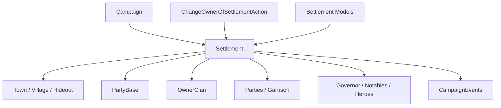

# Settlement

**Namespace:** `TaleWorlds.CampaignSystem.Settlements`  
**Module:** `TaleWorlds.CampaignSystem`  
**Type:** `public sealed class Settlement : MBObjectBase, ILocatable<Settlement>, ITrackableCampaignObject, ITrackableBase, IRandomOwner`  
**Base:** [MBObjectBase](../../core/MBObjectBase)  
**Source:** `bin/TaleWorlds.CampaignSystem/TaleWorlds.CampaignSystem.Settlements/Settlement.cs`

## Overview

`Settlement` is the campaign map node that contains a Town, Village, or Hideout component, a PartyBase, resident parties and heroes, ownership, and siege state.

## Mental Model

### What it is

`Settlement` is the stable map node; `Town`, `Village`, or `Hideout` supplies the specialized gameplay component. It also owns a [PartyBase](../PartyBase), allowing the settlement to participate in encounters, garrison, and item storage. `Parties`, `HeroesWithoutParty`, `Notables`, `BoundVillages`, and `SiegeEvent` describe its changing contents.

The settlement's `Owner` is derived from `OwnerClan.Leader`. Changing an owner is therefore not a single Hero or Clan field write: use [ChangeOwnerOfSettlementAction](../../campaign-ext/ChangeOwnerOfSettlementAction) so fiefs, garrisons, governors, bound villages, map events, and notifications update together.

### Lifecycle and owners

- **Creation and registration:** the constructor creates the settlement PartyBase; XML loading then binds the `SettlementComponent` and its Town/Village/Hideout.
- **Runtime ownership:** `Clan` owns the fief relationship, `MobileParty` enters and leaves, `Hero` can be a governor, resident hero, or prisoner, and siege/map events read settlement state.
- **Economy and military:** wall health, loyalty, security, militia, prosperity, and economy are calculated by their Models or components. Settlement exposes state and relationships; it is not the calculator for every rule.
- **Loading and migration:** components, Party, ownership, and caches are rebuilt in load order. Custom Behavior data should save a stable ID rather than a `Settlement.Party` or cache instance.

### When to use it, and when not to

- **Use it** to read the current settlement, type, owner, garrison/resident parties, bound villages, heroes, and siege state.
- **Use it** through `Settlement.CurrentSettlement`, `Settlement.All`, `Settlement.Find`, or `MobileParty.CurrentSettlement` for registered objects.
- **Do not write `OwnerClan` directly:** use `ChangeOwnerOfSettlementAction`; a direct setter cannot complete garrison, governor, map-event, or fief-cache synchronization.
- **Do not treat Town, Village, and Hideout as interchangeable:** check `IsTown`, `IsVillage`, and `IsHideout` before using a specialized component.
- **Do not read `CurrentSettlement` before Campaign/map state exists:** the static entry point depends on the active Campaign and player map position.

## Dependencies



### Upstream and owners

- [Campaign](../Campaign) provides the `Settlements` collection, time, Models, and map events; use `Settlement.All` only in an active Campaign.
- [Clan](../Clan) connects ownership through `OwnerClan`; [MobileParty](../MobileParty) connects the mobile layer through `CurrentSettlement`, garrison, and siege state.
- [PartyBase](../PartyBase) provides the settlement interaction shell, items, and garrison roster; Town/Village/Hideout provide specialized rules.

### Downstream and mutation boundaries

- Settlement-entry, owner-change, encounter, and siege events in [CampaignEvents](../CampaignEvents) are observation points for Behaviors.
- [ChangeOwnerOfSettlementAction](../../campaign-ext/ChangeOwnerOfSettlementAction) owns the ownership cascade; [EnterSettlementAction](../../campaign-ext/EnterSettlementAction) and [LeaveSettlementAction](../../campaign-ext/LeaveSettlementAction) own party movement in and out.
- `SettlementEconomyModel`, `SettlementLoyaltyModel`, `SettlementSecurityModel`, and `SettlementMilitiaModel` calculate rules; they do not replace Actions.

## Key members and timing

### Type, identity, and ownership

| Member | Purpose, side effects, and timing |
| --- | --- |
| `CurrentSettlement`, `All`, `Find`, `FindFirst` | Acquire the player's current settlement, collections, or a stable-ID lookup. They can be empty during loading or map transitions; check the result at the point of use. |
| `Town`, `Village`, `Hideout`, `IsTown`, `IsVillage`, `IsHideout` | Identify the specialized component. Read town economy, village production, or hideout state only when that component exists. |
| `OwnerClan`, `Owner`, `MapFaction` | Read political ownership and map faction. `Owner` depends on `OwnerClan.Leader`; do not assume it is valid during rebellion or loading transitions. |
| `Party`, `ItemRoster` | Read the settlement PartyBase and items. Garrison and item changes have roster, economy, and event effects; do not replace the Party. |

### Dynamic contents and status

| Member | Purpose, side effects, and timing |
| --- | --- |
| `Parties`, `HeroesWithoutParty`, `Notables` | Read resident parties, unassigned heroes, and notable caches. They change with entry/exit, governors, captivity, and loading. |
| `BoundVillages` | Read villages bound to a town. Ownership flows maintain this relationship; do not edit the list yourself. |
| `IsUnderRaid`, `IsUnderSiege`, `SiegeEvent`, `LastAttackerParty` | Inspect raid, siege, and attacker state. Map-event objects may be gone after the callback, so keep stable IDs and reacquire them. |
| `MaxWallHitPoints`, `Prosperity`, `Security`, `Loyalty`, `Militia` | Read component/Model results. Daily ticks can change them; they are not general-purpose write entry points. |

## Action, event, and Model boundaries

| Goal | Correct entry point | Risk |
| --- | --- | --- |
| Transfer a town or village | `ChangeOwnerOfSettlementAction.ApplyByDefault` or a reason-specific Apply | A direct `OwnerClan` write skips garrison, governor, bound-village, and event updates. |
| Move a party in or out | `EnterSettlementAction` and `LeaveSettlementAction` | Direct `Parties` or position changes break PartyBase and map locator state. |
| Read economy, loyalty, or militia | The settlement Models in `Campaign.Current.Models` | A Model calculates a result; do not write it into a second state each tick. |
| Handle a siege | `SiegeEvent`, Campaign events, and the corresponding Actions | While `IsUnderSiege` is true, owner, party, and map-event objects may not be safe to destroy immediately. |

## Risk boundary

- **Null owner:** the source's `Owner` reads `OwnerClan.Leader`; rebellion, fief transfer, and loading transitions can leave no usable owner. Check `OwnerClan` first.
- **Direct ownership setter:** a `Town.OwnerClan`-style setter maintains only part of the cache; it does not replace the owner Action's governor, garrison, map-event, and notification chain.
- **Party relationship:** the Settlement PartyBase and resident/garrison parties are synchronized. Clearing rosters or party lists directly can leave a party pointing at a removed settlement.
- **Siege/map-event timing:** `SiegeEvent`, `MapEvent`, and `LastAttackerParty` can become `null` after the callback. Never store these runtime references in long-lived Campaign state.
- **Calculated results are not save fields:** prosperity, security, loyalty, militia, wall health, and economy are updated by Models and ticks. Change a rule through a Model and a world through an Action.
- **Save order:** SettlementComponent, Town/Village/Hideout, Party, and OwnerClan are restored in stages. Save a `Settlement.StringId` in custom data and call `Settlement.Find` after loading completes.

## Real examples

### Read settlement state at the player's current location

```csharp
using TaleWorlds.CampaignSystem;

Settlement settlement = Settlement.CurrentSettlement;
if (settlement != null)
{
    bool underSiege = settlement.IsUnderSiege;
    Clan ownerClan = settlement.OwnerClan;
    int residentParties = settlement.Parties.Count;
}
```

The settlement comes from the player's current map position. `OwnerClan` can be null during rebellion or ownership transitions, and `Parties` changes with map ticks.

### Find a settlement by stable ID and read its component

```csharp
using TaleWorlds.CampaignSystem;

Settlement town = Settlement.Find("town_1");
if (town != null && town.IsTown && town.Town != null)
{
    float prosperity = town.Town.Prosperity;
    var boundVillages = town.BoundVillages;
}
```

`Find` returns the registered object from the current Campaign and the component check is intentional. To transfer ownership, pass the object to `ChangeOwnerOfSettlementAction` instead of writing `OwnerClan`.

## Version note

This page uses the v1.4.5 `TaleWorlds.CampaignSystem.Settlements/Settlement.cs`, Town, Village, Hideout, PartyBase, and ownership Action sources as its semantic authority. Cross-version mods should recheck component initialization, ownership setters, and siege event parameters.

## See Also

- ↑ Parent: [Campaign API](../)
- ↔ Siblings: [Hero](../Hero) · [Clan](../Clan) · [Kingdom](../Kingdom) · [MobileParty](../MobileParty) · [PartyBase](../PartyBase)
- Children / related: [Town](../Town) · [Village](../Village) · [Hideout](../Hideout) · [CampaignEvents](../CampaignEvents) · [ChangeOwnerOfSettlementAction](../../campaign-ext/ChangeOwnerOfSettlementAction) · [EnterSettlementAction](../../campaign-ext/EnterSettlementAction) · [SettlementEconomyModel](../SettlementEconomyModel) · [SettlementLoyaltyModel](../SettlementLoyaltyModel)
