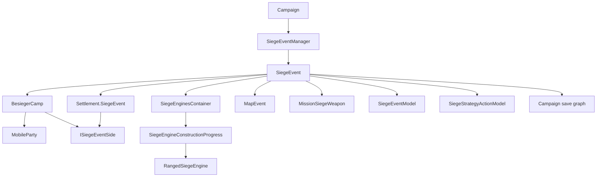

# SiegeEvent

**Namespace:** `TaleWorlds.CampaignSystem.Siege`
**Module:** `TaleWorlds.CampaignSystem`
**Type:** `public class SiegeEvent`
**Base:** none; this is not an `MBObjectBase`
**Source:** `bin/TaleWorlds.CampaignSystem/TaleWorlds.CampaignSystem.Siege/SiegeEvent.cs`

## Responsibility

It stores and advances the campaign truth that a settlement is under siege: the besieged settlement, besieger camp, both sides' engines and bombardment state, and the boundary between the siege, `MapEvent`, and a player siege mission.

## Mental model

`SiegeEvent` is the campaign-map record of a siege, not a Mission and not the `MapEvent` itself. One instance represents one besieged settlement. Construction assigns `Settlement.SiegeEvent` to that instance and creates a `BesiegerCamp` for the attacking side. The besieged `Settlement` implements `ISiegeEventSide`, so both sides can be accessed through the same side contract.

Ownership and lifetime belong to `Campaign.Current.SiegeEventManager`. The normal creation path is `SiegeEventManager.StartSiegeEvent(settlement, besiegerParty)`, which constructs the object, adds it to the manager list, and refreshes settlement visuals. Encounter code also uses this entry point when a party reaches a settlement that is not already under siege. A mod normally reads a siege through `Settlement.SiegeEvent`, `PlayerSiege.PlayerSiegeEvent`, or `Campaign.Current.SiegeEventManager.SiegeEvents`; it should **not call the `SiegeEvent` constructor directly**.

The campaign tick advances the siege. Each `Campaign` `RealTick` lets `SiegeEventManager.Tick` inspect its list. When the time delta is non-zero and neither the besieger leader nor the settlement party has an active `MapEvent`, `SiegeEvent.Tick` runs the following sequence for the attacker and defender:

1. `AdvanceStrategy` asks `SiegeStrategyActionModel` whether to construct, deploy, return, remove, or hold.
2. `ConstructionTick` advances construction and redeployment.
3. `BombardTick` consumes arrived missiles and creates new bombardment decisions for ready ranged engines.

This makes the siege and battle separate layers. Assaults, sally-outs, and blockade battles are individual `MapEvent` instances. A battle pauses siege-engine ticking, then writes its result back to the siege during settlement. When the player enters a siege mission, campaign engines are projected into `MissionSiegeWeapon`; the mission's health and destruction state must be reconciled back to the campaign layer through the public callback provided for that purpose.

## The two sides

| `BattleSideEnum` | Actual object | Side responsibility |
| --- | --- | --- |
| `Attacker` | `BesiegerCamp` | Holds besieging parties, leader, faction, strategy, attacker engines, and attacker missiles. |
| `Defender` | `BesiegedSettlement`, which is the `Settlement` itself | Holds defender strategy, defender engines and missiles, defender casualties, and settlement defenders supplied through `EncounterModel`. |

Use `GetSiegeEventSide` to select a side rather than casting the settlement to a separate defender type:

```csharp
SiegeEvent siegeEvent = PlayerSiege.PlayerSiegeEvent;
if (siegeEvent != null && !siegeEvent.ReadyToBeRemoved)
{
    ISiegeEventSide attacker = siegeEvent.GetSiegeEventSide(BattleSideEnum.Attacker);
    ISiegeEventSide defender = siegeEvent.GetSiegeEventSide(BattleSideEnum.Defender);

    Dictionary<SiegeEngineType, int> attackerEngines =
        siegeEvent.GetPreparedSiegeEnginesAsDictionary(attacker);
    Dictionary<SiegeEngineType, int> defenderEngines =
        siegeEvent.GetPreparedSiegeEnginesAsDictionary(defender);
}
```

The shared `ISiegeEventSide` contract covers `SiegeEngines`, `SiegeEngineMissiles`, `SiegeStrategy`, party enumeration, casualty accumulation, target selection, and side finalization. `BesiegerCamp` filters its internal `MobileParty` list by battle type; blockade battles include only besieging parties with naval navigation capability. `Settlement` delegates defender-party lookup to `Campaign.Current.Models.EncounterModel`.

## Dependency graph



- [Campaign](../Campaign) owns `SiegeEventManager` and drives it as campaign time advances.
- [SiegeEventManager](../SiegeEventManager) creates, owns, ticks, and post-loads the active list; `SiegeEvent` is not an `MBObjectBase` managed by the object manager.
- [SaveManager](../../save-system/SaveManager) serializes and restores the siege save graph; a Behavior should let Campaign load rebuild siege objects instead of serializing runtime references itself.
- [Settlement](../Settlement) exposes `SiegeEvent`, the most direct answer to “is this settlement under siege?” Construction and finalization maintain the reference; a mod should not clear it directly.
- [BesiegerCamp](../BesiegerCamp) is the attacker `ISiegeEventSide` and reflects party joins, departures, and leader changes into the siege.
- [MapEvent](../MapEvent) represents an assault, sally-out, or blockade battle inside the siege; it is not the siege record.
- [SiegeEventModel](../SiegeEventModel) supplies construction, hit points, damage, hit chance, reload, and prebuilt-engine rules; `SiegeEvent` orchestrates the state transitions.
- [SiegeStrategyActionModel](../SiegeStrategyActionModel) supplies the next logical engine action; `AdvanceStrategy` passes that result to `DoSiegeAction`.
- [CampaignEvents](../CampaignEvents) and [CampaignEventDispatcher](../CampaignEventDispatcher) receive start, end, engine-built, bombardment-hit, engine-destroyed, and blockade notifications.
- [CampaignMission](../CampaignMission) and [MissionSiegeWeapon](../../core-extra/MissionSiegeWeapon) are the campaign-to-siege-mission projection boundary; a Mission object must not be stored in Campaign state.

## Acquisition paths

The most useful read path starts from a player-related party or the player siege singleton and checks for `null`:

```csharp
using TaleWorlds.CampaignSystem.Party;
using TaleWorlds.CampaignSystem.Settlements;
using TaleWorlds.CampaignSystem.Siege;

Settlement besieged = MobileParty.MainParty.BesiegedSettlement;
SiegeEvent siegeEvent = besieged?.SiegeEvent;
if (siegeEvent != null && !siegeEvent.ReadyToBeRemoved)
{
    string label = siegeEvent.ToString();
}
```

`MobileParty.BesiegedSettlement` resolves through the party's `BesiegerCamp` for an attacking party. Defender logic and menu code should usually use `PlayerSiege.PlayerSiegeEvent`. To scan the current campaign, iterate the manager's read-only list:

```csharp
using System.Linq;
using TaleWorlds.CampaignSystem;
using TaleWorlds.CampaignSystem.Siege;

SiegeEvent siegeEvent = Campaign.Current.SiegeEventManager.SiegeEvents
    .FirstOrDefault(item => !item.ReadyToBeRemoved);
if (siegeEvent != null)
{
    Settlement settlement = siegeEvent.BesiegedSettlement;
    BesiegerCamp camp = siegeEvent.BesiegerCamp;
}
```

`Campaign.Current`, `SiegeEventManager`, and `Settlement.SiegeEvent` require a live Campaign and a completed load phase. Do not look up a `SiegeEvent` through `MBObjectManager`, and do not cache an object from the previous save in a custom Behavior.

## Lifetime and the MapEvent boundary

### Creation

`SiegeEventManager.StartSiegeEvent` calls the constructor. The constructor:

- assigns `settlement.SiegeEvent` and points `besiegerParty.BesiegerCamp` at the new camp;
- initializes the attacker and defender `SiegeEnginesContainer`, strategies, and missile lists;
- records `SiegeStartTime = CampaignTime.Now`;
- applies a relation change between the besieger leader and the settlement clan leader when the source conditions allow it, so construction is not side-effect free;
- calls `ActivateBlockade` when the settlement has a port and the besieger side has ships;
- publishes `OnSiegeEventStarted` and marks settlement visuals and party level masks dirty.

This is why direct construction or manually assigning `Settlement.SiegeEvent` breaks reverse references, relation events, engine initialization, and the manager list.

### `Tick(float dt)`

`SiegeEventManager.Tick` calls `Tick` only for objects that are not `ReadyToBeRemoved`. `Tick` requires `CampaignTime.DeltaTime != CampaignTime.Zero`, `BesiegerCamp.LeaderParty.MapEvent == null`, and `BesiegedSettlement.Party.MapEvent == null`. It first removes besieging parties whose default behavior no longer keeps them in the siege, then advances attacker and defender.

The `dt` parameter is not the source of construction speed; construction and redeployment use global `CampaignTime.DeltaTime`. Do not add your own `dt` accumulation outside the Campaign tick, and do not manually run a second tick while a `MapEvent` is active.

### `ConstructionTick(ISiegeEventSide)`

Each call chooses one construction item. For the attacker, an inactive `SiegePreparations` item has priority. Otherwise it selects the first deployed engine that is not constructed and is not being redeployed. `Campaign.Current.Models.SiegeEventModel.GetConstructionProgressPerHour` supplies the rate; the result is applied using campaign hours and clamped to `0` through `1`.

When `Progress >= 1` and redeployment is complete, the item becomes `IsActive`. `CreateSiegeObject` creates a `RangedSiegeEngine` for ranged engines, publishes the built event, and dirties settlement visuals. A constructed engine being redeployed advances at `0.5` progress per campaign hour, so it needs two hours to become active again. Expired `RemovedSiegeEngine` records are also cleared here.

### `BombardTick(ISiegeEventSide)`

The method returns immediately when time is paused. It then consumes arrived, successful `SiegeEngineMissile` records. A missile can target a wall or an opposing ranged engine. A hit calls `SiegeEventModel.GetSiegeEngineDamage`, may remove a destroyed engine from its deployment slot, and dispatches bombardment and destruction events. Expired missiles are removed from both side lists.

It then examines active ranged engines that are ready to fire and still have hit points. The engine is reloaded, its side chooses a target, and `OnFireDecisionTaken` records the current and previous target plus the next reload time. `GetSiegeEngineHitChance` determines the hit flag, and a `SiegeEngineMissile` is created with a future collision time. This is discrete campaign bombardment, not the per-frame projectile simulation inside a Mission.

### `MapEvent` and finalization

`MapEventManager.StartSiegeMapEvent`, `StartSiegeOutsideMapEvent`, and the blockade battle entry create the concrete map battle. `MapEvent.FinishBattleAndKeepSiegeEvent` can finish the battle while preserving the siege. During normal finalization, assault, sally-out, and blockade-related battle types call `SiegeEvent.OnBeforeSiegeEventEnd`.

That callback only records the besieger-defeat flag for `SallyOut`, `Siege`, and `SiegeOutside`. It does not clear `Settlement.SiegeEvent`. The battle can end while the siege continues, or the battle result and party departures can lead into `FinalizeSiegeEvent`.

## Strategy and engine actions

### `AdvanceStrategy` and `SiegeStrategyActionModel`

`AdvanceStrategy` does not choose an engine layout itself. It calls:

```csharp
Campaign.Current.Models.SiegeStrategyActionModel
    .GetLogicalActionForStrategy(
        side,
        out SiegeStrategyActionModel.SiegeAction action,
        out SiegeEngineType engineType,
        out int deploymentIndex,
        out int reserveIndex);
```

It then passes the four outputs to `DoSiegeAction`. The default model returns `Hold` for `DefaultSiegeStrategies.Custom`; attacker and defender support different strategy sets, so a strategy name cannot be applied to either side blindly. `SiegeStrategyActionModel` is the replaceable decision boundary. `SiegeEvent` is the execution boundary.

### `DoSiegeAction`

It executes five `SiegeAction` values:

| Action | Actual side effect |
| --- | --- |
| `ConstructNewSiegeEngine` | Uses `SiegeEventModel.GetSiegeEngineHitPoints` to create a `Progress = 0` engine and deploys it into a slot. |
| `DeploySiegeEngineFromReserve` | Takes `ReservedSiegeEngines[reserveIndex]`, deploys it, and moves the engine currently in that slot back to reserve for redeployment. |
| `MoveSiegeEngineToReserve` | Removes an engine from a slot and starts redeployment. |
| `RemoveDeployedSiegeEngine` | Removes an engine from a slot without returning it to reserve. |
| `Hold` | Leaves the layout unchanged. |

Construction and deployment dirty settlement visuals. `deploymentIndex` and `reserveIndex` must be valid for the relevant array or list; the container indexes its arrays directly and does not provide mod-facing range protection. An unknown enum value throws `ArgumentOutOfRangeException`.

### `BreakSiegeEngine`

This method finds one **active** engine of the requested type on the requested side. `DefaultSiegeEngineTypes.Preparations` resets attacker preparation progress; ranged and melee types are removed from their respective deployed arrays without being returned to reserve. Engine destruction during bombardment uses the same removal path.

Perform a programmatic removal from a Campaign callback or another point that cannot race the normal tick:

```csharp
using TaleWorlds.CampaignSystem.Party;
using TaleWorlds.CampaignSystem.Siege;
using TaleWorlds.Core;

Settlement besieged = MobileParty.MainParty.BesiegedSettlement;
SiegeEvent siegeEvent = besieged?.SiegeEvent;
if (siegeEvent != null && !siegeEvent.ReadyToBeRemoved)
{
    ISiegeEventSide attacker = siegeEvent.GetSiegeEventSide(BattleSideEnum.Attacker);
    siegeEvent.BreakSiegeEngine(attacker, DefaultSiegeEngineTypes.SiegeTower);
}
```

When no active engine matches, the method does nothing. That does not make a null side or an ended siege safe to use.

## Nested state types

### `SiegeEngineConstructionProgress`

This is the campaign record for one engine. Its constructor initializes `Hitpoints` to `MaxHitPoints`, `RedeploymentProgress` to `1`, and keeps the supplied `Progress`. The important derived states are:

- `IsConstructed`: `Progress >= 1f`.
- `IsBeingRedeployed`: `RedeploymentProgress < 1f`.
- `IsActive`: constructed and not being redeployed.
- `SiegeEngine` and `MaxHitPoints`: the engine type and the maximum health calculated for this siege.
- `Hitpoints`: current campaign health, changed by bombardment and mission reconciliation.
- `RangedSiegeEngine`: created by `CreateSiegeObject` after a ranged engine is active; normally `null` for melee engines.

`SetProgress`, `SetHitpoints`, `SetRedeploymentProgress`, and `SetRangedSiegeEngine` are public mutators with no range validation. Normal progress changes belong to `ConstructionTick`; normal removal belongs to `DoSiegeAction` or `BreakSiegeEngine`. Directly writing negative health, progress above `1`, or an incorrect ranged substate can make `IsActive`, strategy counts, and mission projection disagree.

### `RangedSiegeEngine`

This is the bombardment substate of a ranged engine, not a scene object. `EngineType` identifies the engine. `NextTimeEngineCanBombard`, `LastBombardTime`, and `IsReadyToFire` describe the reload window. `CurrentTargetType`/`CurrentTargetIndex` hold the current target, while `PreviousDamagedTargetType`/`PreviousTargetIndex` hold the last damaged target. `AlreadyFired` prevents a second decision in one reload window. `NextProjectileCollisionTime` exposes the next collision time to campaign/UI consumers.

`Hold` clears the current target, `Reload` clears `AlreadyFired`, and `OnFireDecisionTaken` records the previous target, current target, fire time, and the next reload time from the model. These methods are part of the `BombardTick` protocol; do not call them from UI or per-frame custom logic, or the siege can create duplicate missiles or skip reload rules.

### `SiegeEnginesContainer`

Each `ISiegeEventSide` has one container. The attacker has `3` melee slots and `4` ranged slots; the defender has `0` melee slots and `4` ranged slots. The defender's `SiegePreparations` is `null`; the attacker has a `DefaultSiegeEngineTypes.Preparations` record for the preparation phase.

| State | Read through | Meaning |
| --- | --- | --- |
| Deployed | `DeployedSiegeEngines`, `DeployedRangedSiegeEngines`, `DeployedMeleeSiegeEngines` | Projects occupying slots; the list and arrays can contain engines that are not built or are being redeployed. |
| Reserved | `ReservedSiegeEngines` | Owned engines not occupying a deployment slot. A prebuilt engine is marked constructed but starts with `RedeploymentProgress = 0`. |
| Counts | `DeployedSiegeEngineTypesCount`, `ReservedSiegeEngineTypesCount` | Type counts maintained for strategy decisions. |
| Removed | `RemovedSiegeEngines` | Delayed cleanup records with removal time and former slot; they are not returned by `AllSiegeEngines()`. |

`AllSiegeEngines()` enumerates preparation, deployed, and reserved projects in that order. `AddPrebuiltEngineToReserve`, `DeploySiegeEngineAtIndex`, `RemoveDeployedSiegeEngine`, `RemovedSiegeEngineFromReservedSiegeEngines`, `FindDeploymentIndexOfDeployedEngine`, and `ClearRemovedEnginesIfNecessary` are public container operations; prefer having `SiegeEvent` orchestrate them through `DoSiegeAction`. The public `readonly` deployment arrays still allow element mutation. Editing an array directly bypasses list membership, type counts, and visual updates.

### `SiegeEngineMissile`

This is an immutable campaign snapshot of one bombardment: shooter type and slot, target type and slot, target-engine reference, hit result, collision time, and fire-decision time. `BombardTick` creates it and stores it in the side's `SiegeEngineMissiles`; both sides consume and clean their lists during ticking. Do not cache its `TargetSiegeEngine` reference beyond the siege lifecycle.

## Siege state and blockade

- `BesiegedSettlement` and `BesiegerCamp` are the two fixed ends assigned during construction; they are not replaceable temporary views.
- `SiegeStartTime` is the start time. `SiegeWallSeed` and `SiegePeopleSeed` use it, the settlement StringId, wall health, and side casualties to create deterministic seeds for simulation and display. They are not save identifiers.
- `IsPlayerSiegeEvent` uses whether the camp leader is the main party or whether `PlayerSiege.PlayerSiegeEvent == this`. The leader and player menus can change during finalization, so this is not a permanent cross-frame identity.
- `ReadyToBeRemoved` is `BesiegedSettlement.Party.SiegeEvent == null`. The manager removes the object from its list on a later tick after this becomes true.
- `GetCurrentBattleType` returns the leader's `MapEvent.EventType` while one exists, otherwise `MapEvent.BattleTypes.Siege`; `IsPartyInvolved` combines both sides using that type.
- `CanPartyJoinSide` uses `IFaction.IsAtWarWith`: every party on the requested side must not be at war with the candidate, while the opposite side must be at war with it. It is a query and does not add the party.

`ActivateBlockade` and `DeactivateBlockade` control naval blockade state. A new siege activates it when the settlement has a port and the besieger side has at least one ship. Activation publishes `OnBlockadeActivated`, refreshes naval visuals, and disables `MobileParty.MainParty.Anchor` when the main party belongs to the besieger side. Deactivation restores that anchor and publishes `OnBlockadeDeactivated`. `BlockadeShouldBeActivated` means “should be active but has not completed activation”; it is not the same as `IsBlockadeActive`. `OnAfterLoad` uses that persisted marker to repair old saves when the source version requires it.

## Mission synchronization

`GetPreparedAndActiveSiegeEngines` returns only deployed projects that are `IsActive`, have `Hitpoints > 0`, and are not `Preparations`. Each is converted with `MissionSiegeWeapon.CreateCampaignWeapon(type, index, health, maxHealth)`.

`PlayerSiege.StartSiegeMission` and the siege-ambush entry obtain both side lists at `Settlement.SiegeState.OnTheWalls` and pass them to `CampaignMission.OpenSiegeMissionWithDeployment`. The Mission therefore receives a campaign snapshot at entry; it does not replace the continuing `SiegeEvent` state.

After the mission, `SetSiegeEngineStatesAfterSiegeMission(attackerData, defenderData)` is the public reconciliation entry that accepts `IEnumerable<IMissionSiegeWeapon>` for both sides. Positive health is written back for ranged engines; destroyed engines go through `BreakSiegeEngine`. Normal missions and siege ambushes have different conditions for melee-engine health, so all mission weapons must not be treated as one identical category.

The v1.4.5 decompiled source confirms that the campaign layer provides this reconciliation method. In the visible `PlayerSiege` and `PlayerEncounter` startup paths, the calls export data into the Mission, but no general automatic call to the reconciliation method is present. A custom siege mission that bypasses native resolution must call it after obtaining the `IMissionSiegeWeapon` collections; otherwise campaign health remains at the pre-mission value and later bombardment or mission entry uses stale state.

## `SiegeEventModel` and strategy-model boundary

`Campaign.Current.Models.SiegeEventModel` is a rule provider, not a replacement for `SiegeEvent` storage. The source uses it for at least:

- `GetConstructionProgressPerHour`: construction speed from effective parties, engineering, settlement buildings, and perks;
- `GetSiegeEngineHitPoints`: maximum health for a siege, type, and side;
- `GetSiegeEngineDamage`, `GetSiegeEngineHitChance`, and `GetRangedSiegeEngineReloadTime`: bombardment result and cadence;
- `GetPrebuiltSiegeEnginesOfSettlement` and `GetPrebuiltSiegeEnginesOfSiegeCamp`: initial defender and attacker engines;
- `GetAvailableManDayPower`, effective siege-party lookup, and available-engine queries used as model inputs.

`Campaign.Current.Models.SiegeStrategyActionModel` only translates the current side `SiegeStrategy` into a `SiegeAction`, engine type, deployment index, and reserve index. `AdvanceStrategy` then calls `DoSiegeAction`. A model replacement must be registered before the Campaign is running and must be non-null and contract-compatible. Negative indexes, missing reserve entries, out-of-range slots, negative construction rates, or invalid health values will surface later in ticking, bombardment, or mission projection.

## Finalization and loading

### `FinalizeSiegeEvent`

This is not a lightweight “set one field to null” cleanup. It publishes `OnSiegeEventEnded`, handles player siege state and menus, finalizes both the besieger camp and settlement side, finalizes an attached `MapEvent` when the event type allows it, and restores the settlement garrison behavior when needed. `BesiegerCamp.FinalizeSiegeEvent` removes besieging parties. `Settlement.FinalizeSiegeEvent` resets its siege state, sets its own `SiegeEvent` to `null`, and dirties the Party state.

Do not force it while an assault `MapEvent` is not finalized, and do not clear only `Settlement.SiegeEvent`. The former can hit the phase assertion in `BesiegerCamp.RemoveAllSiegeParties`; the latter leaves `MobileParty.BesiegerCamp`, the manager list, and the map event with dangling relationships. Let native retreat and battle-resolution flows perform finalization, or reproduce the same phase ordering in a custom workflow.

### `OnAfterLoad`

During Campaign session start, map events are post-loaded first and `SiegeEventManager.OnAfterLoad` then visits each `SiegeEvent`. The siege calls `BesiegerCamp.OnAfterLoad` to repair old-version leader and faction references. For a save loaded from before `v1.3.13.105378`, a pending blockade is activated when `BlockadeShouldBeActivated` is true. The container load callback rebuilds its read-only count wrappers.

`Settlement.AfterLoad` also handles the invalid state where a siege exists without a camp leader: if the settlement party has a `MapEvent`, it finalizes that event; otherwise it finalizes the siege. A post-load mod callback must not assume `LeaderParty` is already non-null or reuse a pre-load object reference.

## Error, null, and save boundaries

- **No Campaign:** `Campaign.Current`, `Campaign.Current.Models`, `PlayerSiege.PlayerSiegeEvent`, and `CampaignTime.Now` require campaign context. Do not access them from module loading, the main menu, or after Campaign teardown.
- **Null entry:** `Settlement.SiegeEvent` is `null` when the settlement is not under siege or has entered finalization. Do not read engines or advance strategy after `ReadyToBeRemoved` becomes true.
- **Leader during load:** `Tick` reads `BesiegerCamp.LeaderParty.MapEvent`; native `Settlement.AfterLoad` handles the invalid state. A custom load callback must not drive a tick before leader repair.
- **Wrong battle phase:** `Tick` is supposed to pause while either side has a `MapEvent`. `ConstructionTick`, `BombardTick`, `AdvanceStrategy`, and `BreakSiegeEngine` are manager or protocol entry points. Calling them manually can double construction, duplicate missiles, or race battle resolution.
- **Wrong Mission state:** the siege-mission preparation path is valid for `Settlement.SiegeState.OnTheWalls`; reusing it in another stage can hit a native assertion or pass mismatched scene data.
- **Indexes and arrays:** `DeploySiegeEngineAtIndex` and `RemoveDeployedSiegeEngine` index arrays directly. Do not confuse a reserved-list index with a deployment-slot index.
- **Bypassing the container:** editing a deployment array does not refresh type counts, list membership, or visuals. Editing progress or health directly does not publish engine-built, hit, or destruction events.
- **Mission data length:** `SetSiegeEngineStatesAfterSiegeMission` reads mission data backward for each active deployed project. A collection shorter than the active engine set can cause an index exception. A custom Mission must preserve the corresponding side collections and their order.
- **Persistent references:** `SiegeEvent`, `BesiegerCamp`, `SiegeEngineConstructionProgress`, `RangedSiegeEngine`, and missiles are part of the Campaign save graph restored through [SaveManager](../../save-system/SaveManager). A Behavior should not persist their runtime references as its own long-lived state. Save stable IDs, scalars, and your own serializable data, then reacquire objects from `Campaign.Current` after load.

## Navigation

- ↑ Parent: [Campaign API](../)
- ↔ Siblings: [SiegeEventManager](../SiegeEventManager) · [BesiegerCamp](../BesiegerCamp) · [ISiegeEventSide](../ISiegeEventSide) · [Settlement](../Settlement) · [MapEvent](../MapEvent)
- Internal types: `SiegeEngineConstructionProgress` · `RangedSiegeEngine` · `SiegeEnginesContainer` · `SiegeEngineMissile`
- Related models: [SiegeEventModel](../SiegeEventModel) · [DefaultSiegeEventModel](../DefaultSiegeEventModel) · [SiegeStrategyActionModel](../SiegeStrategyActionModel) · [DefaultSiegeStrategyActionModel](../DefaultSiegeStrategyActionModel)
- Related campaign and mission APIs: [Campaign](../Campaign) · [CampaignMission](../CampaignMission) · [CampaignEvents](../CampaignEvents) · [CampaignEventDispatcher](../CampaignEventDispatcher) · [Mission](../../mission/Mission) · [MissionSiegeWeapon](../../core-extra/MissionSiegeWeapon) · [IMissionSiegeWeapon](../../core-extra/IMissionSiegeWeapon)
- Related entities: [MobileParty](../MobileParty) · [PartyBase](../PartyBase) · [Town](../Town) · [DefaultSiegeEngineTypes](../../core-extra/DefaultSiegeEngineTypes) · [SiegeBombardTargets](../SiegeBombardTargets)
