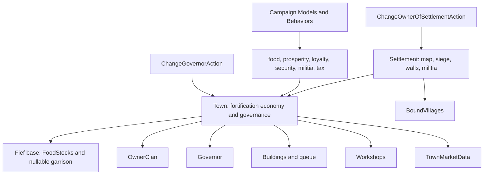

# Town

**Namespace:** `TaleWorlds.CampaignSystem.Settlements`  
**Module:** `TaleWorlds.CampaignSystem`  
**Type:** `public class Town : Fief`  
**Base:** `Fief`  
**Source:** `bin/TaleWorlds.CampaignSystem/TaleWorlds.CampaignSystem.Settlements/Town.cs`  
**Persistence role:** the town/castle component of a `Settlement`; its principal fields and object references live in the Campaign save graph.

## Overview

`Town` is not the map settlement itself. It is the fortification-economy and governance layer attached to one [Settlement](../Settlement/). The same type represents towns and castles: use `IsTown` / `IsCastle` to distinguish them, and enter from the spatial, party, and siege entity through `Settlement.Town`.

## Mental Model

Read the ownership boundary as three layers. `Settlement` owns map position, `Party`, `BoundVillages`, siege state, wall state, and the actual `Militia` value with its party-spawn/transfer side effects. The [Fief](../Fief/) base contributes saved `FoodStocks` plus a cached, nullable `GarrisonPartyComponent` exposed as `GarrisonParty`. `Town` contributes fortification economy and governance: owner clan, governor, building queue, workshops, market, prosperity, loyalty, security, and trade-tax accumulator. Thus `Town.Militia` is an inherited read-through to `Settlement.Militia`, not Town-owned stored state, and the food value written by `Town.DailyTick` is `Fief.FoodStocks`.

Inside a started campaign event or Campaign Behavior, locate an object through `Settlement.All` or `Campaign.Current.AllTowns` / `AllCastles`, then read `settlement.Town`. `Town.AllFiefs` combines towns and castles; all are views of the current `Campaign.Current`. Do not access those static collections at the main menu, before Campaign creation, while a save is unfinished, or after Campaign teardown, and do not `new Town()` in place of native settlement XML/object-manager initialization.

## Dependencies



| Relationship | Boundary |
| --- | --- |
| [Settlement](../Settlement/) | `Settlement.Town` enters the component and `Town.Settlement` returns its host. It owns map/siege/wall state and the mutable militia lifecycle; `Settlement.OwnerClan` delegates to `Town.OwnerClan` for a fortification, but resolves a village through its `Bound` settlement. |
| [Fief](../Fief/) | The base owns saved `FoodStocks` and the cached `GarrisonPartyComponent`; `GarrisonParty` can be null. Treat it as a live party acquired from the current Town, not as a Town scalar or a persistent roster reference. |
| [Village](../Village/) | `Town.Villages` views the host's `BoundVillages`. `TradeBoundVillages` is a runtime cache of villages trading to this Town, not the same set as all bound villages. |
| [Building](../Building/) and [Workshop](../Workshop/) | `Buildings`, `BuildingsInProgress`, and `Workshops` are managed assets. The queued project takes precedence over the default project. `AddEffectOfBuildings` supplies model inputs; do not add those effects independently. |
| [Campaign](../Campaign/) | `Campaign.Current.Models` supplies economy, food, [loyalty](../SettlementLoyaltyModel/), [security](../SettlementSecurityModel/), militia, construction, [tax](../SettlementTaxModel/), [finance](../ClanFinanceModel/), and [governor-eligibility](../ClanPoliticsModel/) models. Their results are current rules, not constants. |
| [Hero](../Hero/) | `Governor` is the fief governor and is kept reciprocal with `Hero.GovernorOf`. Eligibility is decided by `ClanPoliticsModel`; placement and its events belong behind [ChangeGovernorAction](../../campaign-ext/ChangeGovernorAction/). |
| Behaviors and campaign-ext Actions | Garrison recruitment creates and fills the nullable party through `Settlement.AddGarrisonParty()` in [GarrisonRecruitmentCampaignBehavior](../GarrisonRecruitmentCampaignBehavior/). Ownership belongs behind [ChangeOwnerOfSettlementAction](../../campaign-ext/ChangeOwnerOfSettlementAction/), governor placement behind [ChangeGovernorAction](../../campaign-ext/ChangeGovernorAction/), and sales behind [SellItemsAction](../../campaign-ext/SellItemsAction/). These lifecycles notify Behaviors through the dispatcher. |
| [SaveManager](../../save-system/SaveManager/) | Town, buildings, workshops, owner, governor, and market data participate in the save graph. Custom state belongs in a Behavior's `SyncData` and must be serializable. |

## Daily economy and state

`Campaign.DailyTickSettlement` calls `Village.DailyTick()` for villages and `Town.DailyTick()` for settlements with a Town. Mods normally read the result after the daily event or replace the appropriate GameModel to change a formula. Do not manually call `DailyTick`, or every state change will be applied twice.

The actual Town order is: add model-derived loyalty and security; notify the owner that food was consumed when food existed; add food, clamp it to `0..FoodStocksUpperLimit()`, and update `RemainingFoodPercentage`; grant governor relation effects when the relevant perks fire; add prosperity and militia; then repair walls from the garrison model. `Prosperity` has a floor of 0; `Loyalty` and `Security` are clamped to 0..100. `GetProsperityLevel` uses 2,000 and 5,000 as its thresholds.

| Query | Source and timing | Important effect |
| --- | --- | --- |
| `ProsperityChange` / `ProsperityChangeExplanation` | `SettlementProsperityModel.CalculateProsperityChange`; the explanation variant is for UI and diagnostics | The daily tick writes `Prosperity`. |
| `FoodChange`, `FoodChangeWithoutMarketStocks` | `SettlementFoodModel.CalculateTownFoodStocksChange` | The latter excludes market stocks and is not the live daily settlement result; it is applied to the inherited `Fief.FoodStocks`, whose cap also includes building food-stock effects. |
| `LoyaltyChange`, `SecurityChange`, `MilitiaChange` | Their Settlement Models | Culture, policies, issues, buildings, garrison, governor perks, and market sales can contribute. `MilitiaChange` is applied to `Settlement.Militia`; reading any result does not change the world. |
| `Construction` | `BuildingConstructionModel.CalculateDailyConstructionPower` | This is daily construction power; native building flow advances the project. |
| `MarketData`, `GetItemPrice`, `GetItemCategoryPriceIndex` | TownMarketData | `GetItemPrice` is a quote. Inventory updates notify market data through `OnInventoryUpdated`. |
| `SoldItems` | Read-only sale log | The militia model counts sales in a bonus-to-militia category; `SetSoldItems` changes a later model input. |

The default militia model uses prosperity, qualifying market sales, buildings, policies, issues, governor perks, and rebellious loyalty for a town. For a village, hearths are the main input. Do not cache `Militia` as a bare number: `Settlement.Militia` combines an active militia party with ready militia and can spawn or transfer parties.

## Read queries versus world changes

Reading `OwnerClan`, `Governor`, `Buildings`, `Workshops`, `MarketData`, `TradeBoundVillages`, and the `*Change` values is a query. A public setter is not automatically a complete world operation:

- **Ownership:** do not assign `Town.OwnerClan` directly. Its internal work only adds/removes the fief from the clan and dirties village visuals. `ChangeOwnerOfSettlementAction` also handles conquest garrison work, removes the governor, stops invalid objectives, refreshes bound villages and parties, and emits `OnSettlementOwnerChanged`. Workshop, trade-bound, diplomacy, prisoner, and patrol Behaviors rely on that event.
- **Governor:** do not assign `Governor` directly. Callers must first apply the active `Campaign.Current.Models.ClanPoliticsModel.CanHeroBeGovernor` rule, their intended-owner constraint, and `hero.GovernorOf == null || hero.GovernorOf == town`. [ChangeGovernorAction.Apply](../../campaign-ext/ChangeGovernorAction/) only chooses immediate versus delayed placement and cleans the target fief's former governor; it does not remove the supplied hero from another governed Town. Relocation therefore requires an explicit `ChangeGovernorAction.RemoveGovernorOf` before assigning the new fief.
- **Buildings, workshops, and tax:** `Buildings` / `BuildingsInProgress` are saved internal work queues and `Workshops` has a protected setter. Replacing them with constructed objects bypasses construction, ownership, and post-load repair. Use native menus, Behaviors, or the relevant Action/model extension instead.
- **Garrison:** `town.GarrisonParty` is an optional live `MobileParty`. `GarrisonRecruitmentCampaignBehavior` creates it through `Settlement.AddGarrisonParty()` when recruitment needs it; capture, rebellion, party destruction, and player management have their own Behavior/Action paths. Do not instantiate a garrison component or replace its roster to simulate those lifecycles.

## Real acquisition and safe examples

This read-only inspection belongs in a started Campaign Behavior or campaign event. It acquires the component from real collections and does not invent a service or mutate state:

```csharp
using System.Linq;
using TaleWorlds.CampaignSystem;
using TaleWorlds.CampaignSystem.Settlements;

public static class FiefInspection
{
    public static float ReadFirstPlayerTownProsperity()
    {
        Settlement settlement = Settlement.All.FirstOrDefault(
            candidate => candidate.IsTown && candidate.OwnerClan == Clan.PlayerClan);
        Town town = settlement?.Town;

        return town == null ? 0f : town.Prosperity;
    }

    public static float ReadCurrentLoyaltyDelta(Town town)
    {
        if (town == null)
        {
            return 0f;
        }

        return Campaign.Current.Models.SettlementLoyaltyModel
            .CalculateLoyaltyChange(town, includeDescriptions: true)
            .ResultNumber;
    }

    public static int ReadGarrisonMemberCount(Town town)
    {
        return town?.GarrisonParty?.MemberRoster.TotalManCount ?? 0;
    }
}
```

The second query is deliberately model-backed: it asks the active `SettlementLoyaltyModel` for the current calculation and does not write `Loyalty`. The garrison query follows the nullable `Fief.GarrisonParty` path, so zero means no current garrison party or no members. Use the matching security model or `town.SecurityChangeExplanation` for a diagnostic breakdown; do not turn a displayed delta into a manual setter update.

Assign a governor through the Action so teleportation, former-governor cleanup, and notifications are preserved:

```csharp
using System.Linq;
using TaleWorlds.CampaignSystem;
using TaleWorlds.CampaignSystem.Actions;
using TaleWorlds.CampaignSystem.Settlements;

public static class GovernorAssignment
{
    public static void AssignPlayerClanGovernor()
    {
        Town town = Campaign.Current.AllTowns.FirstOrDefault(
            candidate => candidate.OwnerClan == Clan.PlayerClan);
        Clan intendedOwner = town?.OwnerClan;
        Hero candidate = intendedOwner?.Heroes.FirstOrDefault(
            hero => hero.Clan == intendedOwner
                && Campaign.Current.Models.ClanPoliticsModel.CanHeroBeGovernor(hero)
                && (hero.GovernorOf == null || hero.GovernorOf == town));

        if (town != null && intendedOwner == Clan.PlayerClan && candidate != null)
        {
            ChangeGovernorAction.Apply(town, candidate);
        }
    }
}
```

`CanHeroBeGovernor` and the native target/null `GovernorOf` guard are deliberately evaluated by the caller before the Action runs. That keeps the intended clan policy explicit, prevents an ineligible or cross-fief governor from reaching an Action that only decides how to place the supplied hero, and does not imply that relocation is safe. To relocate a current governor, explicitly call `ChangeGovernorAction.RemoveGovernorOf` for the old assignment before applying the new one.

## Trade tax, rebellion, and capture lifecycle

`TradeTaxAccumulated` is a readable accumulator, not a tax formula. [SellItemsAction](../../campaign-ext/SellItemsAction/) mutates it during a settlement sale: it obtains the town tax ratio and security-adjusted commission from [SettlementTaxModel](../SettlementTaxModel/), then adds that commission. Calling the active [ClanFinanceModel](../ClanFinanceModel/)'s `CalculateTownIncomeFromTariffs(ownerClan, town, applyWithdrawals: false)` is a read-only preview. With `applyWithdrawals: true`, the default finance implementation subtracts the smoothed base withdrawal from `TradeTaxAccumulated` and may emit the player asset-income event. Do not use the withdrawing form for UI or diagnostics, and do not replace the sale Action with a direct accumulator write.

[RebellionsCampaignBehavior](../RebellionsCampaignBehavior/) owns the daily rebellious-state threshold/event transition and the rebellion workflow. Before starting a rebellion it compares settlement militia against the nullable garrison's strength and supporting defenders; the workflow then changes ownership through [ChangeOwnerOfSettlementAction.ApplyByRebellion](../../campaign-ext/ChangeOwnerOfSettlementAction/), rebuilds garrison/militia/prisoner state, assigns a governor, and starts the new faction's war. Never toggle the public `InRebelliousState` field directly: that skips the threshold notification and the capture/rebellion lifecycle. For an ordinary capture or transfer, use the reason-specific `ChangeOwnerOfSettlementAction` entry instead of assigning `OwnerClan`.

## Load, cache, and save risks

- **A cache is not save truth:** `TradeBoundVillages` is `CachedData`. Town's load callback recreates it; village deserialization and `VillageTradeBoundCampaignBehavior` rebuild relations. Do not persist an old `MBReadOnlyList`, Town reference, or assume the cache is ready before `OnGameLoaded` work completes.
- **Loading repairs assets:** `AfterLoad` invokes `AfterLoad()` on each workshop, removes missing or unready building types, may clear the construction queue, and clears the governor only when `Governor != null && Governor.GovernorOf == null`. After a save upgrade, reacquire components and building objects instead of retaining pre-load references.
- **Market and inventory:** normal mutations of the settlement `ItemRoster` raise its roster-updated event and therefore reach `TownMarketData`. A raw roster change is still not a sale: it does not reproduce payment, tax/commission, sold-item logging, or related events. Use [SellItemsAction](../../campaign-ext/SellItemsAction/) for a sale, and do not write `SoldItems` or market internals directly.
- **Lifecycle:** `OnInit` seeds loyalty, security, trade tax, and fief gold; `OnSessionStart` gets siege-camp frames. Do not depend on camp positions earlier, or use model properties outside a Campaign.
- **Mutating while enumerating:** ownership and siege Actions can affect parties, villages, workshops, and event listeners. Materialize candidates first, then apply an Action instead of changing ownership inside an `AllTowns` / `AllFiefs` enumeration.

## Version note

This page describes the decompiled Bannerlord v1.4.5 implementation. Key cross-checks come from `bin/TaleWorlds.CampaignSystem/TaleWorlds.CampaignSystem.GameComponents/DefaultClanPoliticsModel.cs`, `bin/TaleWorlds.CampaignSystem/TaleWorlds.CampaignSystem.Actions/SellItemsAction.cs`, `bin/TaleWorlds.CampaignSystem/TaleWorlds.CampaignSystem.GameComponents/DefaultClanFinanceModel.cs`, and `bin/TaleWorlds.CampaignSystem/TaleWorlds.CampaignSystem.CampaignBehaviors/RebellionsCampaignBehavior.cs`. Recheck model thresholds, Action side effects, Behavior order, and save callbacks before carrying this guidance to another release or a total-conversion model set.

## See Also

- ↑ Parent: [Campaign API](../)
- ↔ Siblings: [Settlement](../Settlement/) · [Fief](../Fief/) · [Village](../Village/) · [Building](../Building/) · [Workshop](../Workshop/) · [Hero](../Hero/)
- Related: [GarrisonRecruitmentCampaignBehavior](../GarrisonRecruitmentCampaignBehavior/) · [RebellionsCampaignBehavior](../RebellionsCampaignBehavior/) · [SettlementTaxModel](../SettlementTaxModel/) · [ClanFinanceModel](../ClanFinanceModel/) · [ClanPoliticsModel](../ClanPoliticsModel/) · [ChangeOwnerOfSettlementAction](../../campaign-ext/ChangeOwnerOfSettlementAction/) · [ChangeGovernorAction](../../campaign-ext/ChangeGovernorAction/) · [SellItemsAction](../../campaign-ext/SellItemsAction/) · [SaveManager](../../save-system/SaveManager/)
