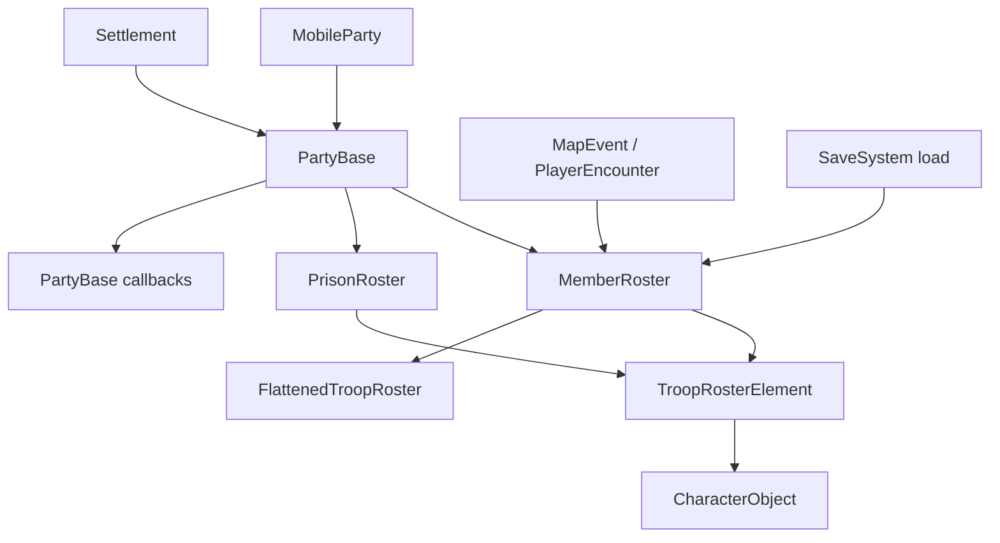

# TroopRoster

**Namespace:** `TaleWorlds.CampaignSystem.Roster`  
**Module:** `TaleWorlds.CampaignSystem`  
**Type:** `public class TroopRoster : ISerializableObject`  
**Base:** `ISerializableObject`  
**Source:** `bin/TaleWorlds.CampaignSystem/TaleWorlds.CampaignSystem.Roster/TroopRoster.cs`  
**Version note:** This page follows the v1.4.5 `TroopRoster.cs` implementation and its live Campaign call sites.

## One-line responsibility

`TroopRoster` is a `CharacterObject`-grouped troop state container: it tracks counts, wounded state, troop experience, and cached totals, while notifying its owning [PartyBase](../PartyBase) when roster state changes.

## Mental model: a Party ledger, not an independent party

`TroopRoster` describes which troops exist and what state each troop type has. It does not move, fight, register, or destroy a party. Its normal host is the `PartyBase` owned by a [MobileParty](../MobileParty) or [Settlement](../Settlement):

```text
MobileParty / Settlement
  -> PartyBase
      -> MemberRoster / PrisonRoster : TroopRoster
          -> TroopRosterElement(CharacterObject, Number, WoundedNumber, Xp)
```

An existing party's `MemberRoster` and `PrisonRoster` are world state owned by that host. `OwnerParty` is an internal saveable property in the source. A mod normally obtains the roster from `mobileParty.MemberRoster`, `mobileParty.PrisonRoster`, `partyBase.MemberRoster`, or `settlement.Party.MemberRoster`; it does not construct a roster and attach it to a half-built party.

### Lifecycle and ownership

1. `PartyBase` creates its member, prisoner, and item rosters and sets their owner; after the party enters the Campaign, the roster becomes part of world state.
2. `AddToCounts`, `RemoveTroop`, `WoundTroop`, and related methods update counts and `VersionNo`, and call `OwnerParty.OnHeroAdded`, `OnHeroRemoved`, `OnRosterSizeChanged`, or `OnXpChanged` when applicable.
3. `GetTroopRoster()` rebuilds an internal `MBList<TroopRosterElement>` cache when `VersionNo` changes. It is a read/iteration path, not a supported way to bypass the owner callbacks.
4. During save loading, the serialization layer restores the element array, count, and version. `OnLoad` discards the old derived-list cache, and `CalculateCachedStatsOnLoad()` recomputes cached totals for rosters loaded in that pass.
5. Party destruction, prisoner release, and encounter resolution belong to their Actions or Campaign flows. A roster reference does not extend the lifetime of a party that has been removed.

### Party rosters versus temporary rosters

- `MobileParty.MainParty.MemberRoster`, `MobileParty.MainParty.PrisonRoster`, and `Settlement.Party.MemberRoster` are host rosters whose changes affect the game world.
- `TroopRoster.CreateDummyTroopRoster()` returns a temporary container with no owner. The source uses it for random casualties, encounter rewards, and pending transfers. It is not registered with the Campaign and does not place troops into a party.
- `CloneRosterData()` also returns an ownerless copy. It copies character, count, and wounded count, but not experience. Treat it as an intermediate calculation or transfer value, not as a writable view of the source roster.

## When to use it and when not to

### Use it for

- Reading members, prisoners, wounded troops, hero counts, and troop experience from a `MobileParty`, `PartyBase`, or `Settlement`.
- Modifying a known Campaign roster with `AddToCounts`, `RemoveTroop`, `WoundTroop`, or `AddXpToTroop` after the owning flow has decided that the world change is valid.
- Reading `GetTroopRoster()` for battle, UI, or custom rules, then resolving each `TroopRosterElement.Character` to a registered [CharacterObject](../CharacterObject).
- Collecting temporary troops with `CreateDummyTroopRoster()` before a higher-level Action or transfer flow consumes them.

### Do not treat it as

- **A party creation API.** Create and register a mobile party through `MobileParty.CreateParty` and its component initialization. Do not put a dummy roster into a half-built `PartyBase`.
- **A hero migration API.** Adding a Hero to a party, imprisoning or releasing one, or removing one from a party belongs to [AddHeroToPartyAction](../../campaign-ext/AddHeroToPartyAction), [TakePrisonerAction](../../campaign-ext/TakePrisonerAction), or the relevant Action. Adding a hero count alone does not complete that migration.
- **A battle result API.** Battle casualties and loot are coordinated by [MapEvent](../MapEvent), encounter flows, and [CampaignBattleRecoveryBehavior](../CampaignBattleRecoveryBehavior). Roster methods perform only the state change they are called for.
- **A rules Model.** `TotalManCount` and `TotalWounded` expose current roster state, while wages and combat power are Model inputs. Change a rule by extending or replacing the relevant Model, not by overwriting roster results every tick.

## Dependencies and data flow



- **Host:** [MobileParty](../MobileParty) and [PartyBase](../PartyBase) establish which party, encounter, or settlement owns the roster; settlement garrisons follow the same container contract.
- **Elements and objects:** [TroopRosterElement](../TroopRosterElement) stores `Character`, `Number`, `WoundedNumber`, and `Xp`. `CharacterObject` must be a registered ObjectSystem object, not a temporary replacement.
- **Consumers:** [FlattenedTroopRoster](../FlattenedTroopRoster) expands grouped entries into a per-person view. Party capacity, battle, and AI Models read roster totals but do not manage the roster's host lifetime.
- **Events and flows:** [PlayerEncounter](../PlayerEncounter), [MapEvent](../MapEvent), `CampaignBattleRecoveryBehavior`, and party-screen flows read or change rosters at encounter or battle boundaries. Those call sites are why `AddToCounts` owner callbacks matter.
- **Save boundary:** `data`, `_count`, and `OwnerParty` participate in the `ISerializableObject`/SaveSystem restoration path. After load, caches must be rebuilt; a mod should not store the runtime list returned by `GetTroopRoster()` as its own long-lived save format.

## Members and call timing

### Statistics

| Member | Purpose, effects, and timing |
| --- | --- |
| `Count` | Number of distinct `TroopRosterElement` slots, not total people. Use it for current-index traversal and reread it after mutations. |
| `VersionNo` | Roster state version. Count, wounded, or experience changes update it, and `GetTroopRoster()` uses it to detect a stale cache. It can key a derived cache but is not a replacement for a gameplay event. |
| `TotalRegulars` / `TotalHeroes` | Counts regular troops and hero slots. Hero counts are maintained from the element count, while hero wounds are derived from `HeroObject.IsWounded`. |
| `TotalWoundedRegulars` / `TotalWoundedHeroes` / `TotalWounded` | Wounded totals. Regular wounded counts come from elements; a hero's wounded count reflects its current Hero state. Do not treat hero wounds as an ordinary troop number. |
| `TotalManCount` / `TotalHealthyCount` | Total regulars plus heroes, and that total minus regular and hero wounded counts. These are current-state reads for existing Campaign rules. |

### Read and copy paths

| Member | Purpose, effects, and timing |
| --- | --- |
| `GetTroopRoster()` | Returns an `MBList<TroopRosterElement>` maintained from `VersionNo` for iteration and LINQ queries. Elements are structs; changing a `foreach` copy is not a reliable way to write the source roster. |
| `GetElementCopyAtIndex(int)` / `GetCharacterAtIndex(int)` | Read an element or character by slot. The index must come from the current `Count`; do not carry it across an operation that removes or reorders slots. |
| `FindIndexOfTroop(CharacterObject)` / `Contains(CharacterObject)` | Map a registered character object to a current slot. Validate the object and Campaign lifetime before using it in a mutation. |
| `GetTroopCount(CharacterObject)` | Returns the current count for one character, or 0 when absent. Do not turn an absent result into an unconditional `RemoveTroop` call. |
| `ToFlattenedRoster()` | Creates a [FlattenedTroopRoster](../FlattenedTroopRoster) from current totals. It is a new expanded result, not a live write-through view. |
| `CloneRosterData()` | Creates an ownerless copy with character, count, and wounded values but no experience. Use it for temporary calculation, never to replace a party's real roster. |
| `RostersAreIdentical(TroopRoster, TroopRoster)` | Compares owners, slots, versions, and character/count relationships for validation. It does not merge rosters. |

### Supported mutation paths

| Member | Purpose, effects, and timing |
| --- | --- |
| `AddToCounts(CharacterObject, int, bool, int, int, bool, int)` | Preferred add/remove entry point. It finds or creates a slot, maintains regular/hero totals, updates the version, and invokes owner Hero/roster callbacks. A new slot cannot have a non-positive count plus wounded count. |
| `AddToCounts(TroopRosterElement)` / `Add(TroopRoster)` | Adds an element or every element from another roster. The source is not reduced; these are additions, not transfers. |
| `AddToCountsAtIndex(int, int, int, int, bool)` | Changes count, wounded count, and experience for an existing slot. It clamps a wounded-count adjustment that would exceed the new total and invokes owner callbacks. Use only with a current index. |
| `RemoveTroop(CharacterObject, int, UniqueTroopDescriptor, int)` | Decreases a character's count. During `PlayerEncounter.CurrentBattleSimulation`, non-hero zero-count slots can be retained for the simulation. Confirm that the character exists first. |
| `WoundTroop(CharacterObject, int, UniqueTroopDescriptor)` | Increases wounded count without reducing total people. The battle or recovery flow decides when it is appropriate; it does not represent a death. |
| `AddXpToTroop(CharacterObject, int)` / `AddXpToTroopAtIndex(int, int)` | Adds troop experience; the indexed entry also calls `OwnerParty.OnXpChanged`. Do not pass negative values or stale indexes. |
| `RemoveIf(Predicate<TroopRosterElement>)` / `Clear()` / `RemoveZeroCounts()` | Removes matching elements, clears the roster, or compacts zero-count slots. These change the version/cache; finish processing returned elements before mutating the source again. |

### Narrow structural operations

`SetElementNumber`, `SetElementWoundedNumber`, and `SetElementXp` write one current slot by index; `SwapTroopsAtIndices` and `ShiftTroopToIndex` change slot order. These are used by encounter, party-screen, and internal flows. They are not equivalent to safely adding or removing a troop from a Party. When Hero ownership, party totals, or experience notifications matter, prefer `AddToCounts`, `RemoveTroop`, and `AddXpToTroop`.

`RemoveNumberOfNonHeroTroopsRandomly(int)` returns an ownerless random regular-troop roster and removes healthy regular troops from the source. `WoundNumberOfNonHeroTroopsRandomly(int)` only wounds random regular troops. Both depend on current cached totals and input bounds; they belong in casualty flows, not as general recruitment/deletion helpers.

## Real acquisition and mutation examples

### Read healthy regulars from the current player party

This path obtains the player's current mobile party from the Campaign facade, matching the Party/Encounter access pattern in the source. It reads only; it creates no roster and changes no Party:

```csharp
using System.Linq;
using TaleWorlds.CampaignSystem;
using TaleWorlds.CampaignSystem.Party;
using TaleWorlds.CampaignSystem.Roster;

public int CountHealthyRegularsInPlayerParty()
{
    if (Campaign.Current == null || MobileParty.MainParty == null)
    {
        return 0;
    }

    TroopRoster roster = MobileParty.MainParty.MemberRoster;
    return roster.GetTroopRoster()
        .Where(element => element.Character != null && !element.Character.IsHero)
        .Sum(element => element.Number - element.WoundedNumber);
}
```

### Safely add one troop to an existing slot

A real party mutation first obtains `MobileParty.MainParty.MemberRoster`, then uses `AddToCounts` so the Party receives version and roster callbacks. This example increments the first existing regular-troop slot, avoiding a fabricated troop ID:

```csharp
using TaleWorlds.CampaignSystem;
using TaleWorlds.CampaignSystem.Party;
using TaleWorlds.CampaignSystem.Roster;

public bool AddOneExistingRegularTroop()
{
    if (Campaign.Current == null || MobileParty.MainParty == null)
    {
        return false;
    }

    TroopRoster roster = MobileParty.MainParty.MemberRoster;
    for (int index = 0; index < roster.Count; index++)
    {
        CharacterObject character = roster.GetCharacterAtIndex(index);
        if (character != null && !character.IsHero)
        {
            roster.AddToCounts(character, 1);
            return true;
        }
    }

    return false;
}
```

To transfer troops between parties, do not only call `AddToCounts` on the target. The relevant transfer, encounter, or prisoner flow must reduce the source and apply the same `TroopRosterElement` semantics to the destination.

## Risks and crash boundaries

- **Orphan roster:** Treating `CreateDummyTroopRoster()` or `CloneRosterData()` as a real party roster loses `OwnerParty` callbacks, which can desynchronize Hero ownership, party totals, or map state. Obtain real rosters from their host.
- **Invalid index:** `GetCharacterAtIndex`, `SetElement*`, `AddToCountsAtIndex`, and some `GetElement*` overloads access the backing array directly. Negative, stale, or empty-roster indexes can throw `IndexOutOfRangeException`; reread the index after removing a slot.
- **Invalid counts:** `TroopRosterElement.Number`, `WoundedNumber`, and `Xp` reject negative values, and wounded counts must remain consistent with total count. Prefer the delta semantics of `AddToCounts` over editing a struct copied from the cached list.
- **Skipped Party callbacks:** `SetElementNumber` or direct element edits do not perform the complete Hero add/remove, `OnRosterSizeChanged`, XP notification, or higher-level Action cascade. Hero, prisoner, battle-casualty, and party-transfer changes belong to their Campaign flows.
- **Hero wound confusion:** A hero's `WoundedNumber` reads `HeroObject.IsWounded`. Repeatedly treating a Hero as a regular troop produces totals inconsistent with the Hero lifecycle.
- **Stale cache:** `GetTroopRoster()` is maintained through `VersionNo`. Keeping its list or an old roster reference across ticks, encounters, or save loading can read stale party state. Store stable `CharacterObject.Id` or host identifiers in custom state and resolve them again in the current Campaign.
- **Load timing:** Between `OnLoad` and `CalculateCachedStatsOnLoad`, derived totals and the expanded list may not be ready. Do not start custom battle/UI or batch roster mutations while SaveSystem is restoring a roster.
- **Object registration:** `TroopRosterElement` serializes a `CharacterObject` object ID. A custom troop must be registered through the ObjectSystem and available during load, or the roster can resolve a null character and fail in later reads.
- **Campaign lifetime:** `MemberRoster`, `PrisonRoster`, `MapEvent`, and `PlayerEncounter` ownership changes during battles, captivity, and party destruction. Do not use a roster reference after its host has entered a teardown path.

## Version and implementation boundary

In v1.4.5, `TroopRoster` uses `ISerializableObject` to restore its element array and version, while `TroopRosterElement` participates in the SaveSystem contract for each element. Versions can change cache fields, wound handling, or Party callbacks. Mod code should depend on the public semantics of `MobileParty.MemberRoster`, `PartyBase.MemberRoster`, `AddToCounts`, `GetTroopRoster`, and `TroopRosterElement`, not on the decompiled private array layout.

## Navigation

- **Up Parent:** [Campaign API index](../) · [Campaign](../Campaign)
- **Siblings:** [PartyBase](../PartyBase) · [MobileParty](../MobileParty) · [FlattenedTroopRoster](../FlattenedTroopRoster) · [TroopRosterElement](../TroopRosterElement)
- **Related:** [CharacterObject](../CharacterObject) · [Settlement](../Settlement) · [MapEvent](../MapEvent) · [PlayerEncounter](../PlayerEncounter) · [AddHeroToPartyAction](../../campaign-ext/AddHeroToPartyAction) · [TakePrisonerAction](../../campaign-ext/TakePrisonerAction) · [CampaignBattleRecoveryBehavior](../CampaignBattleRecoveryBehavior)
