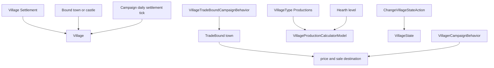
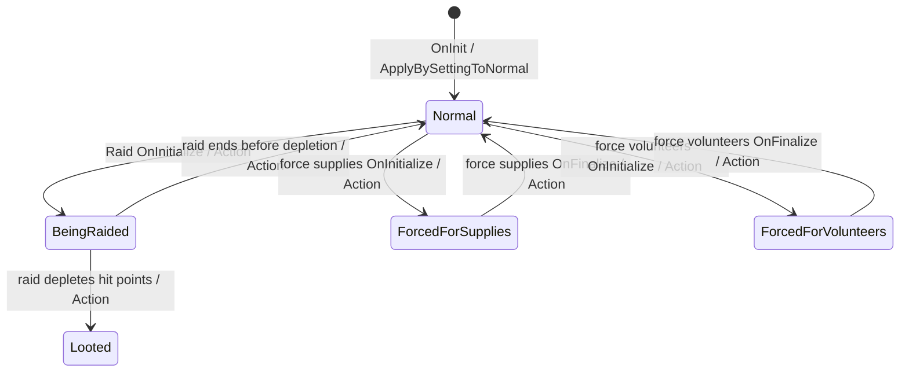

# Village

**Namespace:** `TaleWorlds.CampaignSystem.Settlements`  
**Module:** `TaleWorlds.CampaignSystem`  
**Type:** `public class Village : SettlementComponent`  
**Base:** `SettlementComponent`  
**Source:** `bin/TaleWorlds.CampaignSystem/TaleWorlds.CampaignSystem.Settlements/Village.cs`  
**Persistence role:** the economy component attached to a village `Settlement`; hearth, state, bound settlement, market, and tax participate in the Campaign save graph.

## Overview

`Village` is the production and livelihood state of one village Settlement, not an independent faction or fief. Enter it from map position, village party, and raid state through `Settlement.Village`; return to the entity through `Village.Settlement`. Its political ownership comes from `Bound`, so `Village.MapFaction` delegates to `Bound.MapFaction`, and a village `Settlement.OwnerClan` resolves through that bound settlement as well.

## Mental Model

`Bound` is the administrative/fief link. Its setter keeps `Settlement.BoundVillages` reciprocal. When that settlement is a town, `TradeBound` is necessarily the same town. When it is a castle, `TradeBound` is a mutable trade destination selected by native behavior from nearby, reachable towns permitted by political state. Do not treat the two links as interchangeable or treat `TradeBound` as permanent save configuration.

In a started Campaign Behavior, settlement/village event, or after daily settlement work, acquire a village through `Village.All`, `Settlement.All`, or a `Town.Villages` collection. Those static collections need `Campaign.Current`, so they are unsafe at the main menu, during an incomplete load, or during campaign teardown. Do not construct a `Village`, `VillageMarketData`, or villager party to splice into the world.

## When to use it, and when to stop at the Settlement boundary

Use `Village` when the question is "what can this village currently produce, which raid state is it in, which fief is it bound to, or which town prices its goods?" Start with a `Settlement`, verify `settlement.IsVillage`, then read `settlement.Village`. That path retains the map position, `Party`, inventory, and militia instead of confusing a town or castle `Town` component with a village.

Do not start world changes from `Village` in these cases:

- **Fief ownership or the bound-village list:** the host settlement and its ownership Action maintain lords, ownership, and `Settlement.BoundVillages`. `Bound` has no public setter; reconnecting it would break Town's village view and trade cache.
- **Raids, coercion, or recovery:** these are [MapEvent](../MapEvent/) outcomes, not an enum assignment. [RaidEventComponent](../RaidEventComponent/) sets `BeingRaided` at the start, then settles to `Looted` or `Normal`; the volunteer and supplies components use their respective forced states. A mod should use [ChangeVillageStateAction](../../campaign-ext/ChangeVillageStateAction/) only when it owns an equivalent complete workflow.
- **Caravans and army gathering:** when native caravan creation receives a village, it uses `Village.TradeBound` only as a candidate departure town; that does not make the village a caravan market. An army's `FindBestGatheringSettlementAndMoveTheLeader` selects a general `Settlement`, not Village's economy component. Pass the current `Settlement` to those systems; do not invent a location from `Village` or replace an AI target.
- **Economic rules:** change daily output by replacing/extending the active [VillageProductionCalculatorModel](../VillageProductionCalculatorModel/). Let the [VillageTradeModel](../VillageTradeModel/) and the native Behavior's recomputation path decide where a castle-bound village trades. Reading a model result does not replace either mechanism.

## Dependencies



| Relationship | Actual responsibility |
| --- | --- |
| [Settlement](../Settlement/) | Holds the village entity, `Party`, inventory, militia, and `IsRaided`; `Settlement.Village` / `Village.Settlement` are the bidirectional component entry points. |
| [Town](../Town/) | `Bound` determines ownership. If `Bound.IsTown`, that Town is also the trade bound. A castle-bound village has its `TradeBound` recalculated by trade behavior. |
| [Campaign](../Campaign/) | `Campaign.DailyTickSettlement` calls `Village.DailyTick`; `Campaign.Current.Models` calculates hearth, production, militia, and trade rules. |
| [VillageType](../VillageType/) | `Productions` defines the items and base amounts this village can produce. `IsProducing(item)` only tests that configuration. |
| [VillageTradeBoundCampaignBehavior](../VillageTradeBoundCampaignBehavior/) / [VillagerCampaignBehavior](../VillagerCampaignBehavior/) | The first recomputes `TradeBound` for castle-bound villages; the second maintains villager trade parties from stock and state. Both own lifecycle work and are not substitutes for a Village setter. |
| campaign-ext Actions | [ChangeVillageStateAction](../../campaign-ext/ChangeVillageStateAction/) owns state changes, publishes the state event, and dirties the settlement level mask. Ownership remains behind `ChangeOwnerOfSettlementAction`, not a Village setter. |
| [SaveManager](../../save-system/SaveManager/) | Cross-load extension state belongs in a Behavior's `SyncData`; never persist an old villager-party or price-cache reference. |

## Hearths, production, stock, and militia

`Hearth` is a continuous measure of village scale, not currency. `GetHearthLevel()` splits it at 200 and 600: below 200 is level 0, 200 through 599 is level 1, and at least 600 is level 2. `GetProsperityLevel()` directly maps that level. `HearthChange` comes from the active `SettlementProsperityModel.CalculateHearthChange`; its explanation variant shows the model's daily reasons. The v1.4.5 default model gives base growth only to `Normal`, adds a -1 raided term to `Looted`, and, for a normal village, reads governor perks and fortification building effects through `Bound` before policy, culture, and issue effects. This is a model observation, not an increment command waiting to be applied.

Native `DailyTick` records the previous hearth level, adds `HearthChange`, dirties the Settlement Party level mask on a level transition, clamps hearth to at least 10, adds the militia-model result to the host `Settlement.Militia`, and finally resets village gold down to 1,000. Do not call it in addition to the Campaign tick, and do not manually add the `HearthChange` you read.

The default production model produces only while `VillageState.Normal`. Each item in [VillageType](../VillageType/) `Productions` first needs a valid `TradeBound` for its base amount to be added, then scales by `(hearth level + 1) * 0.5` and receives trade-bound-town governor perks, cultural feats, and the bound fief's `VillageProduction` building effect. Without a trade bound, default item output remains zero. Food output does not require a trade bound, but still requires Normal, starts at hearth level plus one, and is affected by active village issues. `GetWarehouseCapacity()` asks the active [VillageProductionCalculatorModel](../VillageProductionCalculatorModel/) for `CalculateDailyFoodProductionAmount` and each `CalculateDailyProductionAmount`, totals them, and returns five days of capacity with a minimum of one. It is the threshold used by villager trade behavior, not a fixed warehouse field.

| Member | Safe meaning |
| --- | --- |
| `HearthChange` / `HearthChangeExplanation` | Read-only model queries; daily settlement work writes `Hearth`. |
| `Militia` / `MilitiaChange` | `Militia` reads the host `Settlement.Militia`; the default village delta contains base 0.5, retired militia, and `Hearth / 400`. |
| `MarketData` / `GetItemPrice` | Village prices delegate to `TradeBound.Town.MarketData`; without a trade bound the price methods return 1, not a real market price. |
| `TradeTaxAccumulated` | The saveable pool of accumulated village tariffs. The default `ClanFinanceModel.CalculateVillageIncome` returns no income for `Looted` / `BeingRaided`; other states first smooth the pool through `RevenueSmoothenFraction()`, then apply policy and governor-perk adjustments. Only a finance call with `applyWithdrawals: true` subtracts the unadjusted base share from the pool. A preview read does not withdraw it, and manual subtraction bypasses that settlement path. |
| `GetWarehouseCapacity` / `IsProducing` | The first is model-driven stock capacity; the second only tests production configuration, not whether the village is producing now. |

## State, trade binding, and Action boundary

`VillageStates` contains `Normal`, `BeingRaided`, `ForcedForVolunteers`, `ForcedForSupplies`, and `Looted`. `IsDeserted` is true only for `Looted`, and `Settlement.IsRaided` is derived from the same state. The `VillageState` setter itself emits limited dispatcher callbacks for Normal, BeingRaided, and Looted, but a complete transition also needs `ChangeVillageStateAction` to publish old/new state plus raider and dirty the level mask. Therefore:



The graph shows native [MapEvent](../MapEvent/) component paths, not a table of arbitrary legal jumps. [RaidEventComponent](../RaidEventComponent/) enters `BeingRaided` during initialization, changes to `Looted` or `Normal` from settlement hit points in `OnBeforeFinalize`, and only then dispatches its raid-completed callback. The two coercion components dispatch their supplies/volunteers-completed callback in `OnBeforeFinalize`, but do not use the Action to restore `Normal` until `OnFinalize`; a completion listener therefore cannot assume the state has already recovered.

The direct setter emits dedicated callbacks only for `Normal`, `BeingRaided`, and `Looted`; it has no corresponding branch for either forced state. [ChangeVillageStateAction](../../campaign-ext/ChangeVillageStateAction/) uniformly dispatches the old state, new state, and raider observed through [CampaignEvents](../CampaignEvents/) `VillageStateChanged` after every actual transition and dirties the settlement level mask. Bypassing the Action makes forced transitions especially easy for general listeners to miss.

- Use `ChangeVillageStateAction.ApplyBySettingToBeingRaided`, `ChangeVillageStateAction.ApplyBySettingToBeingForcedForSupplies`, `ChangeVillageStateAction.ApplyBySettingToBeingForcedForVolunteers`, `ChangeVillageStateAction.ApplyBySettingToLooted`, or `ChangeVillageStateAction.ApplyBySettingToNormal`; do not assign `VillageState` directly.
- `Bound` has a private setter and must not be rewired. Its setter removes from the old settlement and adds to the new settlement's bound-village collection.
- Do not assign `TradeBound` yourself. `VillageTradeBoundCampaignBehavior` recalculates every castle-bound village on new game, load, war/peace, clan kingdom change, clan destruction, and settlement owner change. It prefers the nearest same-faction town, then a non-hostile foreign town, each inside the distance limit.

Villager trade is not a call that sells goods. `VillagerCampaignBehavior` considers it only when a village is Normal, has no map event, and its stock reaches `GetWarehouseCapacity()`. It probabilistically creates or reinforces a villager party, loads goods from village inventory, and sends it to `TradeBound`. Raid state, no bound target, a villager in battle/on a raft, or a map event involving the village owner can stop that path.

`GetDefenderParties` and `GetNextDefenderParty` are MapEvent read paths, not party-management APIs. Both yield the host `Settlement.Party` first and then inspect same-faction, non-caravan resident mobile parties, but their filters are not identical: `GetDefenderParties` includes militia and villagers only for Raid / IsForcingSupplies / IsForcingVolunteers, while the cursor-based `GetNextDefenderParty` does not use `battleType` for that exclusion. Callers must follow the enumeration protocol expected by their MapEvent; do not merge the results or mutate `Settlement.Parties` during traversal. Let `EncounterModel` and MapEvent select defenders, and never create a villager or insert a caravan to "add a defender."

## Real acquisition and safe examples

This read belongs in a started Campaign Behavior or village-related event. `Settlement.CurrentSettlement` resolves, in order, the settlement holding the captive player, the current encounter settlement, or the main party's resident settlement, and may return `null`. The example starts from that live `Settlement`, verifies that it is a village, and enters through `settlement.Village`; it constructs nothing and does not use an out-of-context ID lookup:

```csharp
using TaleWorlds.CampaignSystem;
using TaleWorlds.CampaignSystem.Settlements;

public static class VillageInspection
{
    public static int ReadCurrentVillageHearthLevel()
    {
        Settlement settlement = Settlement.CurrentSettlement;
        Village village = settlement != null && settlement.IsVillage
            ? settlement.Village
            : null;

        return village == null ? 0 : village.GetHearthLevel();
    }
}
```

Recover a state through the Action so state receivers and level visuals are updated together:

```csharp
using TaleWorlds.CampaignSystem.Actions;
using TaleWorlds.CampaignSystem.Settlements;

public static class VillageRecovery
{
    public static void MarkCurrentLootedVillageNormal()
    {
        Settlement settlement = Settlement.CurrentSettlement;
        Village village = settlement != null && settlement.IsVillage
            ? settlement.Village
            : null;

        if (village != null && village.VillageState == Village.VillageStates.Looted)
        {
            ChangeVillageStateAction.ApplyBySettingToNormal(village.Settlement);
        }
    }
}
```

The example demonstrates the Action boundary; it is not permission to skip the game's raid consequences. A mod should use the matching Action only when its own event/task makes that transition meaningful.

## Load, cache, and save risks

- **Bindings rebuild after load:** new-game XML deserialization reads `Bound` and synchronizes the Town trade cache; a saved Campaign retains graph references. `VillageTradeBoundCampaignBehavior.OnGameLoaded` then reselects `TradeBound` for castle-bound villages. Do not use an old TradeBound/Town/Village reference as a cross-load handle.
- **State controls output:** Looted, BeingRaided, and forced states do not meet the default production model's Normal requirement. Directly changing hearth, stock, or state can leave production, capacity, villager parties, and UI in conflict.
- **Militia has party side effects:** writing a change through `Settlement.Militia` can spawn or fill a militia party. Do not mutate militia while enumerating `Settlement.Parties`, and do not cache `Village.Militia` detached from its Settlement.
- **Price is not an independent market:** price 1 without `TradeBound` is a fallback. Permit `TradeBound` to be null before reaching `TradeBound.Town`; do not create independent market data to bypass trade behavior.
- **Market data belongs to the save graph:** `MarketData` is a saved `VillageMarketData` bound to this Village, while item quotes still delegate to the current `TradeBound.Town.MarketData`. Do not retain an old market object or its price result across a load. Re-enter through the current `settlement.Village` and allow the trade bound to be recomputed.
- **Capture and removal stale references:** village faction and owner resolve through `Bound`; capture of that bound settlement triggers trade behavior to recompute castle villages' `TradeBound`. After raid settlement, capture, removal of a village, or Campaign teardown, do not operate on cached Village, Bound, TradeBound, or defender-party references from the earlier event. Reacquire them from the current Settlement/collections inside a still-valid campaign callback.
- **Lifecycle:** `OnInit` uses an Action to set Normal and grants 1,000 gold. Villager and trade-bound behavior depend on registered events and a loaded world; production/state work earlier in the lifecycle has incomplete relationships.
- **Writable fields are not an operation protocol:** `Hearth` and `TradeTaxAccumulated` are publicly writable because they are part of the save graph, but native daily work, raid/settlement, and economy paths keep their dependent data coherent. Treating them as ordinary setters desynchronizes hearth level masks, militia, stock, tax, and UI observations. Put custom rules in a compatible Model/Behavior and persist only your own data through `SyncData`.

## Version note

This page describes the decompiled Bannerlord v1.4.5 implementation. `Village.cs`, `Settlement.cs`, `Town.cs`, `DefaultVillageTradeModel.cs`, `DefaultVillageProductionCalculatorModel.cs`, `VillageTradeBoundCampaignBehavior.cs`, `VillagerCampaignBehavior.cs`, and the three village MapEvent components establish the boundaries above. When moving to another release or replacing models wholesale, recheck the state enum, trade-distance rules, daily order, and Action side effects; neither the thresholds nor Behavior subscription order here is a stable extension contract.

## See Also

- ↑ Parent: [Campaign API](../)
- ↔ Siblings: [Settlement](../Settlement/) · [Town](../Town/) · [Campaign](../Campaign/)
- Related: [VillageType](../VillageType/) · [VillageTradeModel](../VillageTradeModel/) · [VillageProductionCalculatorModel](../VillageProductionCalculatorModel/) · [MapEvent](../MapEvent/) · [RaidEventComponent](../RaidEventComponent/) · [CampaignEvents](../CampaignEvents/) · [ChangeVillageStateAction](../../campaign-ext/ChangeVillageStateAction/) · [SaveManager](../../save-system/SaveManager/)
