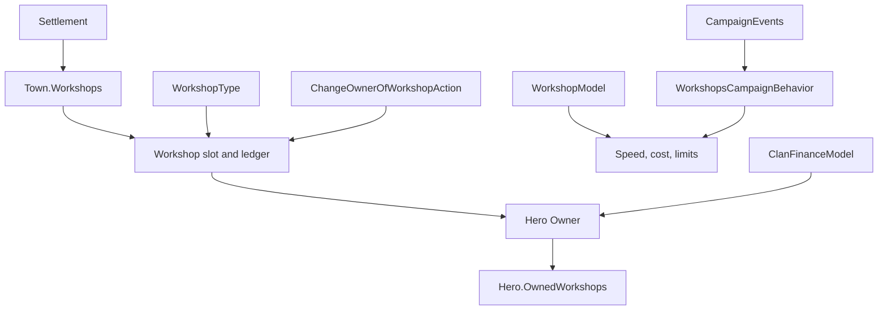

# Workshop

**Namespace:** `TaleWorlds.CampaignSystem.Settlements.Workshops`  
**Module:** `TaleWorlds.CampaignSystem`  
**Type:** `public class Workshop : SettlementArea`  
**Base:** `SettlementArea`  
**Source:** `bin/TaleWorlds.CampaignSystem/TaleWorlds.CampaignSystem.Settlements.Workshops/Workshop.cs`  
**Persistence role:** a saveable production area in a town; its host settlement, owner, type, capital, production progress, and last-run time are part of the Campaign object graph.

## Overview and mental model: what a workshop represents

`Workshop` is one fixed production slot in a town. It connects four different concerns that should not be collapsed into one object:

- **Place:** `Settlement` and `Tag` identify the slot. The collection that actually holds the slots is `Settlement.Town.Workshops`, so a workshop is not an independent map party or a free-standing settlement.
- **Person:** `Owner` is a [Hero](../Hero), not a [Clan](../Clan). `Hero.OwnedWorkshops` is the saved reverse collection. A clan reaches workshop income through its leader's assets; it does not directly own a workshop list.
- **Recipe:** `WorkshopType` is the XML/object-manager definition that supplies one or more production recipes. Its input/output categories and base conversion speeds are shared definition data, not per-workshop mutable data.
- **Ledger:** `Capital`, `InitialCapital`, progress, and `LastRunCampaignTime` describe the running business state. They are not player gold and they are not a transaction log.

Use `Workshop` to inspect an existing town business or to give the native Campaign flow a real target. Do not construct one to add a business to a settlement. Town initialization, Hero reverse ownership, workshop behavior data, save registration, and Campaign events form one lifecycle.

## Dependencies and lifecycle boundary

The upstream entities and rule entry points are [Settlement](../Settlement), [Town](../Town), [Hero](../Hero), and [WorkshopType](../WorkshopType); together they define the workshop's place, owner, definition, and active rules. The downstream [ClanFinanceModel](../ClanFinanceModel) only withdraws income during the finance workflow and does not replace the workshop's daily behavior.



## Find a real workshop first

Choose the route that matches the question. Both routes are valid only after a Campaign has started.

| Question | Real route | Why it matters |
| --- | --- | --- |
| "Which workshop is at this town?" | `Settlement.CurrentSettlement -> Town -> Workshops` | A workshop belongs to a town component; a village or a settlement without a `Town` has no workshop array. |
| "Which businesses does this hero own?" | `Hero.MainHero.OwnedWorkshops` or another live hero's `OwnedWorkshops` | This is the owner-side reverse view used by the finance model. |
| "Which definition is this?" | `workshop.WorkshopType`, then `WorkshopType.Find(id)` or `WorkshopType.All` | `WorkshopType.All` delegates to the active `Campaign`; it is not available before Campaign initialization. |
| "What are the current rules?" | `Campaign.Current.Models.WorkshopModel` and `ClanFinanceModel` | Models supply the active rules and may differ from the native default implementation. |

The inspection below deliberately starts at the current settlement, then confirms that the selected workshop is really player-owned. It also demonstrates the native `WorkshopType.Find` lookup with the `artisans` id used during new-game workshop setup.

```csharp
using System.Linq;
using TaleWorlds.CampaignSystem;
using TaleWorlds.CampaignSystem.Settlements;
using TaleWorlds.CampaignSystem.Settlements.Workshops;

public static class WorkshopInspection
{
    public static string ReadCurrentPlayerWorkshop()
    {
        Town town = Settlement.CurrentSettlement?.Town;
        Workshop workshop = town?.Workshops.FirstOrDefault(
            candidate => candidate.Owner == Hero.MainHero);

        if (workshop == null)
        {
            return "No player-owned workshop at the current settlement.";
        }

        WorkshopType artisans = WorkshopType.Find("artisans");
        int purchaseCost = Campaign.Current.Models.WorkshopModel
            .GetCostForPlayer(workshop);

        return $"{workshop.Name}: {workshop.WorkshopType.Name}; " +
               $"capital={workshop.Capital}; price={purchaseCost}; " +
               $"artisansRegistered={artisans != null}";
    }
}
```

`WorkshopType.Find` can return `null` when an id was not registered by the current module set. Check it before using the result. Do not cache a `WorkshopType`, `Workshop`, `Town`, or `Hero` across a save-load boundary; reacquire it from the current Campaign graph.

## Production is a daily behavior, not an `IsRunning` flag

There is no public `Workshop.IsRunning` property in 1.4.5. Do not invent one from capital, type, or the presence of a production recipe. The native `WorkshopsCampaignBehavior` subscribes to `DailyTickTownEvent`; for each `Town.Workshops` entry it:

1. runs the production loop when the town is not rebellious;
2. advances each `WorkshopType.Productions` entry by `WorkshopModel.GetEffectiveConversionSpeedOfProduction`;
3. attempts input consumption and output production through the town market or the player warehouse path; and
4. handles the daily expense even when production was skipped because the town is rebellious.

`LastRunCampaignTime` is updated by the behavior only after its successful-run condition. It is useful diagnostic evidence, but it is not a general boolean answer to "is this workshop producing right now?" A recipe may exist yet have insufficient inputs, no affordable capital, a rebellious town, or a warehouse/market constraint. For an inspection UI, show the current type, each production's inputs/outputs, capital, and last-run time; describe that as state, not as a guaranteed production result.

| Member | Read it for | Do not infer or do |
| --- | --- | --- |
| `WorkshopType.Productions` | configured input/output categories and base `ConversionSpeed` | Do not use a progress index after the type changes; the progress array is rebuilt to the new production count. |
| `GetProductionProgress(index)` | per-recipe accumulated progress | Do not call with an index from an old type or assume progress `>= 1` guarantees a completed market transaction. |
| `LastRunCampaignTime` | behavior-maintained execution evidence | Do not manually call `UpdateLastRunTime` to mark a workshop as running. |
| `Expense` | the current `WorkshopModel.DailyExpense` | It is model-backed, not a saved per-workshop wage setting. |
| `Capital` / `InitialCapital` | workshop ledger and its baseline | Neither is the owner's gold balance or a final profit report. |

## Profit, expenses, and when income reaches a hero

`ProfitMade` is exactly `max(Capital - InitialCapital, 0)`. It is an amount currently above the initial capital baseline, not a daily payout and not proof that the owner has already received gold.

The default [ClanFinanceModel](../ClanFinanceModel) calculates owner income as the non-negative workshop profit divided by `RevenueSmoothenFraction()` (5 in the default implementation). During the clan's daily finance application, `ClanVariablesCampaignBehavior` asks `CalculateClanGoldChange(..., applyWithdrawals: true)`, the finance model withdraws a positive workshop share with `workshop.ChangeGold(-income)`, and the resulting clan total is transferred to the clan leader through `GiveGoldAction`. For the main hero, that withdrawal also raises the player asset-income event.

This creates two separate daily paths:

- **Town production and expense:** `DailyTickTownEvent` changes the workshop ledger. The player workshop normally pays its daily expense from capital while above the active low-capital limit; otherwise the behavior can use the owner's gold, fall back to capital, or transfer the workshop through bankruptcy. Notable workshops use their own capital and can also bankrupt.
- **Clan finance withdrawal:** the finance behavior turns a positive part of the owner's workshop ledger into daily clan income and reduces that ledger when withdrawals are being applied.

Consequently, a workshop can have positive `ProfitMade` before the finance pass, can lose capital to expense without producing, and can display a different value after the finance pass. Use `Campaign.Current.Models.ClanFinanceModel.CalculateOwnerIncomeFromWorkshop(workshop)` for the active-model estimate; do not pay the result yourself after also letting native daily finance run.

## Mutation boundaries: Actions own the transaction and events

The public low-level methods on `Workshop` are not a replacement for Campaign transactions. `ChangeOwnerOfWorkshop` does synchronize the old and new `Hero.OwnedWorkshops` collections, but it does not calculate the transaction, move gold, or broadcast the owner-change event. `ChangeWorkshopProduction` resets the progress array, but does not charge conversion cost or broadcast the type-change event. `ChangeGold` changes only the workshop ledger.

| Intent | Use | What the Action preserves |
| --- | --- | --- |
| Player purchase | [ChangeOwnerOfWorkshopAction.ApplyByPlayerBuying](../../campaign-ext/ChangeOwnerOfWorkshopAction) | model purchase cost, initial capital, Hero reverse ownership, gold transfer, and `WorkshopOwnerChangedEvent` |
| Player sale | `ApplyByPlayerSelling` after selecting a valid notable owner | notable sale value, reset capital, ownership lists, gold transfer, and the event |
| Bankruptcy, war, or owner death | the matching `ApplyByBankruptcy`, `ApplyByWar`, or `ApplyByDeath` path | the scenario's capital/type policy plus ownership and event processing |
| Production conversion | `ChangeProductionTypeOfWorkshopAction.Apply` | active-model conversion cost, progress reset, owner payment, and `WorkshopTypeChangedEvent` |
| Native new-game initialization | `InitializeWorkshopAction.ApplyByNewGame` | initial capital, owner reverse list, generated owner name, and `WorkshopInitializedEvent` |

These Actions are mutation mechanisms, not eligibility validators. The native conversation UI checks player gold and `GetMaxWorkshopCountForClanTier` before purchase, and uses `WorkshopModel.CanPlayerSellWorkshop`/`GetNotableOwnerForWorkshop` before a sale. A mod calling an Action directly must make equivalent phase and eligibility checks; otherwise the Action itself will still execute its limited transaction logic.

This conversion example uses an existing player asset and a registered type. It pays the active model's cost through the Action, rather than trying to adjust capital or owner gold separately.

```csharp
using System.Linq;
using TaleWorlds.CampaignSystem;
using TaleWorlds.CampaignSystem.Actions;
using TaleWorlds.CampaignSystem.Settlements.Workshops;

public static class WorkshopConversion
{
    public static bool ConvertFirstPlayerWorkshopToArtisans()
    {
        Workshop workshop = Hero.MainHero.OwnedWorkshops.FirstOrDefault();
        WorkshopType targetType = WorkshopType.Find("artisans");

        if (workshop == null || targetType == null ||
            workshop.WorkshopType == targetType)
        {
            return false;
        }

        int cost = Campaign.Current.Models.WorkshopModel
            .GetConvertProductionCost(targetType);
        if (Hero.MainHero.Gold < cost)
        {
            return false;
        }

        ChangeProductionTypeOfWorkshopAction.Apply(workshop, targetType);
        return true;
    }
}
```

Run such a world change from a valid Campaign interaction or behavior, not while enumerating a live ownership collection or inside an unrelated save/load callback. A type or ownership listener may rebuild player workshop/warehouse data immediately.

## Save, event, and lifecycle risks

- **Saved graph, not detached data:** `Workshop` saves its settlement, owner, type, capital, initial capital, progress, and last-run time. `Town.Workshops` and `Hero.OwnedWorkshops` are saved from the other side. The workshop Campaign behavior separately saves player warehouse/workshop behavior data. Creating or replacing objects by hand can leave one of those structures absent.
- **Load repair:** `Workshop.AfterLoad` resizes progress to the current `WorkshopType.Productions.Count` and gives a zero run time a current timestamp. The workshop behavior also rebuilds or removes player-specific data on game load. Reacquire references after loading instead of holding pre-load lists or production indices.
- **Event observers:** owner and type Actions publish [CampaignEvents](../CampaignEvents) notifications. `WorkshopsCampaignBehavior` listens to both: when the player gains an asset it installs warehouse/workshop data; when ownership or type changes it refreshes or removes that data. Bypassing the Action can leave UI and warehouse state stale even if a field-level change appears correct.
- **Settlement events can transfer assets:** the behavior also reacts to settlement ownership, war, clan-kingdom changes, and hero death. A player workshop in hostile territory can be transferred by the war path, and a dead notable owner is replaced through the death path. Do not assume `Owner` remains stable across one event callback or one daily tick.
- **There is no independent destroy slot:** the v1.4.5 source exposes no public `DestroyWorkshopAction` or Workshop removal lifecycle. `Town.Workshops` is a fixed slot collection initialized by Town and included in the save graph; do not remove, null, or replace entries to simulate destruction. Use the native owner-change, bankruptcy, war, death, or production-change Action/Behavior for the relevant state transition so reverse collections, events, and save data stay coherent.
- **No direct profitability write:** `Capital` has a private setter, but public `ChangeGold` is still a low-level ledger mutation. Writing a bonus directly skips the economic source, finance withdrawal timing, and any transaction semantics. Put a new economic rule in a suitable Model or controlled Campaign behavior and decide explicitly how it is saved.

## Navigation

- ↑ Parent: [Campaign API](../)
- ↔ Siblings: [Settlement](../Settlement) · [Town](../Town) · [Village](../Village) · [Clan](../Clan) · [Hero](../Hero)
- Related: [WorkshopType](../WorkshopType) · [WorkshopModel](../WorkshopModel) · [ClanFinanceModel](../ClanFinanceModel) · [ChangeOwnerOfWorkshopAction](../../campaign-ext/ChangeOwnerOfWorkshopAction) · [CampaignEvents](../CampaignEvents) · [SaveManager](../../save-system/SaveManager)
