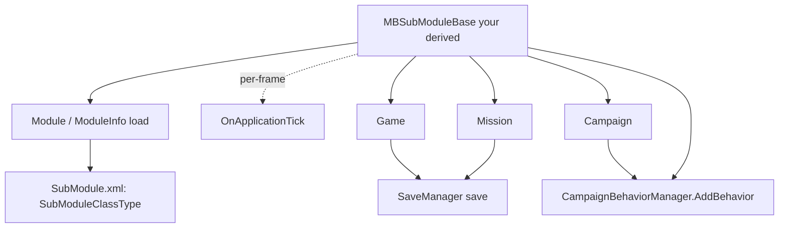

# MBSubModuleBase

**Namespace:** `TaleWorlds.MountAndBlade`
**Module:** `TaleWorlds.MountAndBlade`
**Type:** `public abstract class MBSubModuleBase`
**Base:** none (top-level abstract class)
**Source file:** `bin/TaleWorlds.MountAndBlade/TaleWorlds.MountAndBlade/MBSubModuleBase.cs`

## One-line responsibility

It is the *lifecycle entry point* of every loadable Module: the engine calls the virtual methods you override at well-defined moments — module load, game start/load/end, and every frame — but it holds no game state itself; it only hands control to you at the right time.

## Mental model

**Lifecycle and ownership.** Your derived instance is created by the engine during module load and kept alive inside `Module.CurrentModule`'s `_subModuleBases` collection until the process exits or the module unloads. `MBSubModuleBase` itself stores almost no fields — the real game state lives in [Game](./Game), [Campaign](../campaign/Campaign) and [Mission](../mission/Mission). Your subclass is better understood as a set of time-triggered hooks, not a state object.

**Call chain (verified in source).** At module load, `Module.InitializeSubModuleBases()` (`Module.cs:201`) walks `_subModuleBases` and calls `OnSubModuleLoad()` once per submodule. Every frame, `Module.OnApplicationTick()` (`Module.cs:463/523`) iterates and calls `OnApplicationTick(dt)`. When a game starts, the distributor is `MBGameManager` (the campaign game manager): it pulls every submodule via `Module.CurrentModule.CollectSubModules()` and fires the lifecycle methods in a fixed order (`MBGameManager.cs:102–171`): `InitializeGameStarter` → `OnGameStart` → `BeginGameStart`/`OnCampaignStart` → `OnGameInitializationFinished` → `OnAfterGameInitializationFinished`. Crucially, `OnGameInitializationFinished` runs *after* `Campaign` has already built its `CampaignBehaviorManager` (`Campaign.cs:1422` and `1452`).

**Which layer.** It sits at the outermost "module / application" layer: it exists earlier than [Game](./Game) and gets control before any [CampaignBehaviorBase](../campaign/Campaign). It is the right place for one-time registration and cross-game-boundary bridging, not for in-game logic.

**When to use / when not to.**
- Use it to: register conversation lines, custom types, config; hook a [CampaignBehaviorBase](../campaign/Campaign) during the game-start window (see Real Example below); subscribe/unsubscribe to global, cross-module events.
- Do *not* write campaign logic directly inside `OnApplicationTick`. Prefer `*Action.Apply` or subscribe to `CampaignEvents` from within a [CampaignBehaviorBase](../campaign/Campaign) instead of hand-rolling per-frame polling and field writes here. Do *not* touch `Campaign.Current`/`Game.Current` during `OnSubModuleLoad` — there is no game yet (see [Crash boundaries](../../architecture/crash-boundary)).

## Dependencies



- **Upstream (who creates / holds):** `Module` (in the [core index](./)) reads each module's `SubModule.xml` (`<SubModuleClassType value="Namespace.ClassName"/>`, DLL must be built into `bin/Win64_Shipping_Client/`), instantiates and holds your submodule; `MBGameManager` fires its callbacks at game start. See [doc-contract](../../architecture/doc-contract).
- **Downstream (what it drives / plugs into):** [Game](./Game), [Campaign](../campaign/Campaign), [Mission](../mission/Mission). Campaign logic is attached via `CampaignBehaviorManager.AddBehavior` (non-generic) on the [Campaign](../campaign/Campaign).
- **Events:** you normally take the `IGameStarter` (`CampaignGameStarter`) handed to you in `OnGameStart` and `AddBehavior`; the behavior then subscribes via `CampaignEvents.*` (`DailyTickEvent`, `OnGameLoadedEvent`, …).
- **Behaviors / Actions:** behaviors derive `CampaignBehaviorBase`; to mutate game state prefer the engine's `*Action.Apply` rather than writing fields directly.
- **Save points:** a [CampaignBehaviorBase](../campaign/Campaign) registered through `CampaignBehaviorManager` is automatically pulled into the save via `CampaignBehaviorDataStore`; before `OnGameEnd` the engine fires `OnBeforeSave` to collect behavior data.

## Risks (can crash or corrupt saves)

1. **Accessing `Campaign.Current` / `Game.Current` inside `OnSubModuleLoad` / `OnBeforeInitialModuleScreenSetAsRoot`.** These hooks fire before any game exists; the references are `null` and dereferencing them throws `NullReferenceException`, crashing at the main-menu stage. Keep them to one-time static registration (dialogue, types, config).
2. **Registering a `CampaignBehaviorBase` in the wrong place.** If you `new` a behavior in `OnSubModuleLoad` but never attach it through `IGameStarter.AddBehavior` / `CampaignBehaviorManager.AddBehavior`, it is never reached by `RegisterEvents`, `SyncData` or the save flow — effectively nonexistent. Behaviors must be registered inside the game-start window (see Real Example).
3. **Touching game objects in `OnApplicationTick` without guards.** The main menu, campaign map and option screens all share this per-frame callback; if `Game.Current == null` or the current `GameState` is not what you expect, calling `Mission`/`MBActionSet` APIs crashes. Always check `if (Game.Current != null)` and the game state first.
4. **Heavy work or exceptions in `OnApplicationTick`.** It runs on the render main loop; blocking or throwing stalls or crashes the whole frame. Defer expensive work to a coroutine / background thread.
5. **Subscribing to engine/global events (e.g. `EngineController.ConfigChange`) in `OnSubModuleLoad` but never unsubscribing in `OnSubModuleUnloaded`.** Module hot-reload then double-subscribes and leaks methods.
6. **Wrong `SubModuleClassType` in `SubModule.xml`, or DLL not built into `Win64_Shipping_Client`.** The exception from `SubModuleInfo.LoadFrom` is swallowed and prints "Cannot load a submodule", so your submodule is silently never loaded and all its hooks stay dead.
7. **Duplicate `StringId` on a behavior.** `CampaignBehaviorDataStore` keys saved data by behavior instance; two behaviors sharing a `StringId` overwrite each other's fields on save/load, corrupting save contents.

## Member notes (grouped by theme, not a signature wall)

### A. Module-load phase (process / module level, before any game)
- **`OnSubModuleLoad()`** — called **once** when the module loads. Purpose: register conversation lines, custom `MBObjectBase` subtypes, static config. Side effect: no [Game](./Game) / [Campaign](../campaign/Campaign) yet. Override when you need something that is active merely because the module is present.
- **`OnSubModuleUnloaded()`** — called on module unload. Purpose: unsubscribe the global/engine events you took in `OnSubModuleLoad` to avoid leaks.
- **`OnBeforeInitialModuleScreenSetAsRoot()`** — before the initial module screen becomes root. Purpose: tweak UI/localization before the first screen; still must not assume a game exists.
- **`OnNewModuleLoad()`** — fired when another module is loaded at runtime.
- **`OnConfigChanged()`** — after graphics/config change. Purpose: refresh cached render/option state.
- **`OnSubModuleActivated()` / `OnSubModuleDeactivated()`** — when this module is toggled on/off in the launcher.

### B. Game-start phase (the correct behavior-registration window)
- **`OnBeforeGameStart(MBGameManager, List<string> disabledModules)`** — before the game truly starts; you can read the disabled-modules list to adjust your behavior.
- **`InitializeGameStarter(Game, IGameStarter)`** — when the engine builds the game starter. One of the earliest safe points to register a `CampaignBehaviorBase` (cast `IGameStarter` to `CampaignGameStarter`, then `AddBehavior`).
- **`OnGameStart(Game game, IGameStarter gameStarterObject)`** — fired by the campaign game manager for every submodule. **The most common and recommended registration point:** cast `gameStarterObject` to `CampaignGameStarter` and `AddBehavior(new YourBehavior())`; that behavior flows with `CampaignGameStarter.CampaignBehaviors` into `CampaignBehaviorManager` and automatically joins events and save/load (see Real Example). Side effect: [Campaign](../campaign/Campaign) already exists here.
- **`BeginGameStart(Game)` / `OnCampaignStart(Game, object)`** — around campaign start; good for reading campaign parameters.
- **`OnMultiplayerGameStart(Game, object)`** — multiplayer start; separate from the campaign path — do not register campaign behaviors here.
- **`RegisterSubModuleObjects(bool isSavedCampaign)` / `AfterRegisterSubModuleObjects(bool)`** — register / deserialize game objects your module needs; `isSavedCampaign` distinguishes new vs loaded save.

### C. Initialization finished and load
- **`OnGameInitializationFinished(Game game)`** — fired *after* `Campaign` has built its `CampaignBehaviorManager`. **You can also register here via `Campaign.Current.CampaignBehaviorManager.AddBehavior(new YourBehavior())`**: that method (`CampaignBehaviorManager.cs:76`) additionally calls `RegisterEvents()`, and the behavior is included in later save/load. Caveat: in a load-game flow, `LoadBehaviorData()` (`Campaign.cs:1429`) has already run *before* this callback, so a late-added behavior has no "old save state" to load — fine for a brand-new behavior, but do not expect it to restore loaded data. For new campaigns prefer registering in `OnGameStart`.
- **`OnAfterGameInitializationFinished(Game, object)`** — after init is fully done; good for finalization that depends on all behaviors being ready.
- **`OnGameLoaded(Game, object)` / `OnAfterGameLoaded(Game)`** — after a save is loaded; only here is it safe to read loaded [Campaign](../campaign/Campaign) state.
- **`OnNewGameCreated(Game, object)`** — after a new game is created.
- **`DoLoading(Game) : bool`** — return `true` to drive the loading flow from this submodule.
- **`InitializeSubModuleGameObjects(Game)`** — initialize this module's GameObjects in the game.

### D. Per-frame runtime
- **`OnApplicationTick(float dt)`** — called every frame; `dt` is the frame delta in seconds. Purpose: poll input, light timers; **always** guard with `Game.Current != null` first. Side effect: runs on the menu too — never do heavy work or touch game objects unguarded here.
- **`AfterAsyncTickTick(float dt)`** — after the async tick.
- **`OnNetworkTick(float dt)`** — network frame.

### E. End and Mission
- **`OnGameEnd(Game)`** — on game end; clean up global state you created (note: non-serialized listeners inside behaviors are auto-cleaned by `CampaignBehaviorManager`, no manual unsubscribe needed).
- **`OnBeforeMissionBehaviorInitialize(Mission)` / `OnMissionBehaviorInitialize(Mission)`** — around entering a [Mission](../mission/Mission); inject a custom `MissionBehavior` onto `mission` here.
- **`OnInitialState()`** — when the initial game state is established.

## Real Example

Compilable C# below: derive `MBSubModuleBase`, and in `OnGameStart` — the correct window — register a custom `CampaignBehaviorBase` via `CampaignGameStarter.AddBehavior` (real API names, checked against source).

```csharp
using TaleWorlds.CampaignSystem;
using TaleWorlds.CampaignSystem.CampaignBehaviors; // namespace hint only
using TaleWorlds.Core;
using TaleWorlds.MountAndBlade;

namespace MyMod
{
    // Declared in SubModule.xml: <SubModuleClassType value="MyMod.MySubModule" />
    public class MySubModule : MBSubModuleBase
    {
        // Called once at module load: do NOT touch Campaign.Current / Game.Current here
        protected override void OnSubModuleLoad()
        {
            // one-time static registration (dialogue, config) — left empty here
        }

        // Recommended entry: attach the behavior during game construction
        public override void OnGameStart(Game game, IGameStarter gameStarterObject)
        {
            // Only for single-player campaign; multiplayer uses OnMultiplayerGameStart
            if (game.GameType == GameType.Single)
            {
                var starter = (CampaignGameStarter)gameStarterObject;
                starter.AddBehavior(new DailyGoldBehavior());
            }
        }

        // Alternative entry (only valid once Campaign exists):
        // register in OnGameInitializationFinished with the real non-generic API.
        // CampaignBehaviorManager.AddBehavior also calls the behavior's RegisterEvents().
        // public override void OnGameInitializationFinished(Game game)
        // {
        //     Campaign.Current.CampaignBehaviorManager.AddBehavior(new DailyGoldBehavior());
        // }
    }

    // Real behavior: derives TaleWorlds.CampaignSystem.CampaignBehaviorBase
    public class DailyGoldBehavior : CampaignBehaviorBase
    {
        private int _daysSinceBonus;

        public override void RegisterEvents()
        {
            // Real event name (see native BanditSpawnCampaignBehavior usage)
            CampaignEvents.DailyTickEvent.AddNonSerializedListener(this, OnDailyTick);
        }

        public override void SyncData(IDataStore dataStore)
        {
            // Save/load: fields are auto-pulled into the save via CampaignBehaviorDataStore
            dataStore.SyncData("DaysSinceBonus", ref _daysSinceBonus);
        }

        private void OnDailyTick()
        {
            _daysSinceBonus++;
            if (_daysSinceBonus >= 7)
            {
                _daysSinceBonus = 0;
                // Prefer engine Actions over direct field writes to change state;示意 only
                GiveGoldToMainHero(1000);
            }
        }

        private void GiveGoldToMainHero(int amount)
        {
            if (Hero.MainHero != null)
            {
                Hero.MainHero.ChangeHeroGold(amount);
            }
        }
    }
}
```

Corresponding `SubModule.xml` (module root; `DLLName` points at the assembly under `bin/Win64_Shipping_Client`):

```xml
<Module>
  <SubModules>
    <SubModule>
      <Name value="MyMod" />
      <DLLName value="MyMod.dll" />
      <SubModuleClassType value="MyMod.MySubModule" />
    </SubModule>
  </SubModules>
</Module>
```

## Navigation

- ↑ Parent: [core index](./)
- ↔ Sibling: [Game](./Game), [MBObjectBase](./MBObjectBase)
- Related: [doc-contract](../../architecture/doc-contract) · [Crash boundaries](../../architecture/crash-boundary) · [Campaign](../campaign/Campaign) · [Mission](../mission/Mission)

## See Also

- ↑ Upstream hub: [Doc contract](../../architecture/doc-contract) (top constraint for the submodule/behavior lifecycle entry)
- ↓ Downstream / related: [Game](./Game) (the game object a submodule plugs into) · [Campaign](../campaign/Campaign) (where behaviors are actually attached) · [Mission](../mission/Mission) (mission-level behavior entry)
