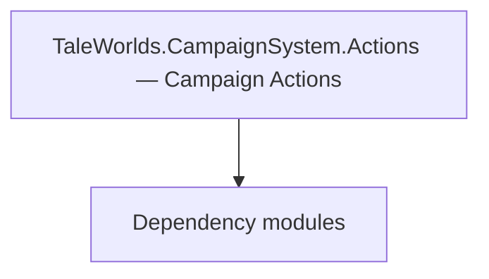

# TaleWorlds.CampaignSystem.Actions — Campaign Actions

**One-line responsibility:** This page covers all 74 business types under `TaleWorlds.CampaignSystem.Actions — Campaign Actions` as a family index, giving each type its namespace, responsibility, and typical timing so you can browse by module instead of alphabetically.

## Mental Model

Actions are the canonical, safe way to mutate campaign-world state. Each *Action encapsulates one state change (kill a hero, change relation, start a war, give gold) and executes it through the Action system, firing the matching event cascade. Using Apply instead of editing fields is what prevents corrupted or desynced saves.

## When to Use

Always prefer the matching *Action.Apply(...) over directly assigning fields. This is the single most important rule for save safety.

## Dependencies

The types under `TaleWorlds.CampaignSystem.Actions — Campaign Actions` depend on the following modules; missing any of them causes compile- or run-time failure.

- [Campaign](../../campaign/Campaign)
- [API Overview](../../_index)

## Type Catalog

| Type | Namespace | Purpose | Timing |
| --- | --- | --- | --- |
| `AddCompanionAction` | TaleWorlds.CampaignSystem.Actions | Game action that encapsulates a single state change and executes it through the Action system. You must use Apply rather than mutating fields directly, otherwise you skip event cascades and corrupt saves. | Campaign init |
| `AddHeroToPartyAction` | TaleWorlds.CampaignSystem.Actions | Game action that encapsulates a single state change and executes it through the Action system. You must use Apply rather than mutating fields directly, otherwise you skip event cascades and corrupt saves. | Campaign init |
| `AdoptHeroAction` | TaleWorlds.CampaignSystem.Actions | Game action that encapsulates a single state change and executes it through the Action system. You must use Apply rather than mutating fields directly, otherwise you skip event cascades and corrupt saves. | Campaign init |
| `ApplyHeirSelectionAction` | TaleWorlds.CampaignSystem.Actions | Game action that encapsulates a single state change and executes it through the Action system. You must use Apply rather than mutating fields directly, otherwise you skip event cascades and corrupt saves. | Campaign init |
| `BeHostileAction` | TaleWorlds.CampaignSystem.Actions | Game action that encapsulates a single state change and executes it through the Action system. You must use Apply rather than mutating fields directly, otherwise you skip event cascades and corrupt saves. | Campaign init |
| `BreakInOutBesiegedSettlementAction` | TaleWorlds.CampaignSystem.Actions | Game action that encapsulates a single state change and executes it through the Action system. You must use Apply rather than mutating fields directly, otherwise you skip event cascades and corrupt saves. | Campaign init |
| `BribeGuardsAction` | TaleWorlds.CampaignSystem.Actions | Game action that encapsulates a single state change and executes it through the Action system. You must use Apply rather than mutating fields directly, otherwise you skip event cascades and corrupt saves. | Campaign init |
| `ChangeClanInfluenceAction` | TaleWorlds.CampaignSystem.Actions | Game action that encapsulates a single state change and executes it through the Action system. You must use Apply rather than mutating fields directly, otherwise you skip event cascades and corrupt saves. | Campaign init |
| `ChangeClanLeaderAction` | TaleWorlds.CampaignSystem.Actions | Game action that encapsulates a single state change and executes it through the Action system. You must use Apply rather than mutating fields directly, otherwise you skip event cascades and corrupt saves. | Campaign init |
| `ChangeCrimeRatingAction` | TaleWorlds.CampaignSystem.Actions | Game action that encapsulates a single state change and executes it through the Action system. You must use Apply rather than mutating fields directly, otherwise you skip event cascades and corrupt saves. | Campaign init |
| `ChangeGovernorAction` | TaleWorlds.CampaignSystem.Actions | Game action that encapsulates a single state change and executes it through the Action system. You must use Apply rather than mutating fields directly, otherwise you skip event cascades and corrupt saves. | Campaign init |
| `ChangeKingdomAction` | TaleWorlds.CampaignSystem.Actions | Game action that encapsulates a single state change and executes it through the Action system. You must use Apply rather than mutating fields directly, otherwise you skip event cascades and corrupt saves. | Campaign init |
| `ChangeKingdomActionDetail` | TaleWorlds.CampaignSystem.Actions | AI decision implementation that must be interruptible and serializable to support saving and undo. Search must be depth/time bounded to avoid stalls. | Campaign init |
| `ChangeOwnerOfSettlementAction` | TaleWorlds.CampaignSystem.Actions | Game action that encapsulates a single state change and executes it through the Action system. You must use Apply rather than mutating fields directly, otherwise you skip event cascades and corrupt saves. | Campaign init |
| `ChangeOwnerOfSettlementDetail` | TaleWorlds.CampaignSystem.Actions | AI decision implementation that must be interruptible and serializable to support saving and undo. Search must be depth/time bounded to avoid stalls. | Campaign init |
| `ChangeOwnerOfWorkshopAction` | TaleWorlds.CampaignSystem.Actions | Game action that encapsulates a single state change and executes it through the Action system. You must use Apply rather than mutating fields directly, otherwise you skip event cascades and corrupt saves. | Campaign init |
| `ChangePlayerCharacterAction` | TaleWorlds.CampaignSystem.Actions | Game action that encapsulates a single state change and executes it through the Action system. You must use Apply rather than mutating fields directly, otherwise you skip event cascades and corrupt saves. | Campaign init |
| `ChangeProductionTypeOfWorkshopAction` | TaleWorlds.CampaignSystem.Actions | Game action that encapsulates a single state change and executes it through the Action system. You must use Apply rather than mutating fields directly, otherwise you skip event cascades and corrupt saves. | Campaign init |
| `ChangeRelationAction` | TaleWorlds.CampaignSystem.Actions | Game action that encapsulates a single state change and executes it through the Action system. You must use Apply rather than mutating fields directly, otherwise you skip event cascades and corrupt saves. | Campaign init |
| `ChangeRelationDetail` | TaleWorlds.CampaignSystem.Actions | AI decision implementation that must be interruptible and serializable to support saving and undo. Search must be depth/time bounded to avoid stalls. | Campaign init |
| `ChangeRomanticStateAction` | TaleWorlds.CampaignSystem.Actions | Game action that encapsulates a single state change and executes it through the Action system. You must use Apply rather than mutating fields directly, otherwise you skip event cascades and corrupt saves. | Campaign init |
| `ChangeRulingClanAction` | TaleWorlds.CampaignSystem.Actions | Game action that encapsulates a single state change and executes it through the Action system. You must use Apply rather than mutating fields directly, otherwise you skip event cascades and corrupt saves. | Campaign init |
| `ChangeShipOwnerAction` | TaleWorlds.CampaignSystem.Actions | Game action that encapsulates a single state change and executes it through the Action system. You must use Apply rather than mutating fields directly, otherwise you skip event cascades and corrupt saves. | Campaign init |
| `ChangeVillageStateAction` | TaleWorlds.CampaignSystem.Actions | Game action that encapsulates a single state change and executes it through the Action system. You must use Apply rather than mutating fields directly, otherwise you skip event cascades and corrupt saves. | Campaign init |
| `ClaimSettlementAction` | TaleWorlds.CampaignSystem.Actions | Game action that encapsulates a single state change and executes it through the Action system. You must use Apply rather than mutating fields directly, otherwise you skip event cascades and corrupt saves. | Campaign init |
| `DeclareWarAction` | TaleWorlds.CampaignSystem.Actions | Game action that encapsulates a single state change and executes it through the Action system. You must use Apply rather than mutating fields directly, otherwise you skip event cascades and corrupt saves. | Campaign init |
| `DeclareWarDetail` | TaleWorlds.CampaignSystem.Actions | AI decision implementation that must be interruptible and serializable to support saving and undo. Search must be depth/time bounded to avoid stalls. | Campaign init |
| `DestroyClanAction` | TaleWorlds.CampaignSystem.Actions | Game action that encapsulates a single state change and executes it through the Action system. You must use Apply rather than mutating fields directly, otherwise you skip event cascades and corrupt saves. | Campaign init |
| `DestroyKingdomAction` | TaleWorlds.CampaignSystem.Actions | Game action that encapsulates a single state change and executes it through the Action system. You must use Apply rather than mutating fields directly, otherwise you skip event cascades and corrupt saves. | Campaign init |
| `DestroyPartyAction` | TaleWorlds.CampaignSystem.Actions | Game action that encapsulates a single state change and executes it through the Action system. You must use Apply rather than mutating fields directly, otherwise you skip event cascades and corrupt saves. | Campaign init |
| `DestroyShipAction` | TaleWorlds.CampaignSystem.Actions | Game action that encapsulates a single state change and executes it through the Action system. You must use Apply rather than mutating fields directly, otherwise you skip event cascades and corrupt saves. | Campaign init |
| `DisableHeroAction` | TaleWorlds.CampaignSystem.Actions | Game action that encapsulates a single state change and executes it through the Action system. You must use Apply rather than mutating fields directly, otherwise you skip event cascades and corrupt saves. | Campaign init |
| `DisbandArmyAction` | TaleWorlds.CampaignSystem.Actions | Game action that encapsulates a single state change and executes it through the Action system. You must use Apply rather than mutating fields directly, otherwise you skip event cascades and corrupt saves. | Campaign init |
| `DisbandPartyAction` | TaleWorlds.CampaignSystem.Actions | Game action that encapsulates a single state change and executes it through the Action system. You must use Apply rather than mutating fields directly, otherwise you skip event cascades and corrupt saves. | Campaign init |
| `EndCaptivityAction` | TaleWorlds.CampaignSystem.Actions | Game action that encapsulates a single state change and executes it through the Action system. You must use Apply rather than mutating fields directly, otherwise you skip event cascades and corrupt saves. | Campaign init |
| `EndCaptivityDetail` | TaleWorlds.CampaignSystem.Actions | AI decision implementation that must be interruptible and serializable to support saving and undo. Search must be depth/time bounded to avoid stalls. | Campaign init |
| `EndMercenaryServiceAction` | TaleWorlds.CampaignSystem.Actions | Game action that encapsulates a single state change and executes it through the Action system. You must use Apply rather than mutating fields directly, otherwise you skip event cascades and corrupt saves. | Campaign init |
| `EndMercenaryServiceActionDetails` | TaleWorlds.CampaignSystem.Actions | AI decision implementation that must be interruptible and serializable to support saving and undo. Search must be depth/time bounded to avoid stalls. | Campaign init |
| `GainKingdomInfluenceAction` | TaleWorlds.CampaignSystem.Actions | Game action that encapsulates a single state change and executes it through the Action system. You must use Apply rather than mutating fields directly, otherwise you skip event cascades and corrupt saves. | Campaign init |
| `GainRenownAction` | TaleWorlds.CampaignSystem.Actions | Game action that encapsulates a single state change and executes it through the Action system. You must use Apply rather than mutating fields directly, otherwise you skip event cascades and corrupt saves. | Campaign init |
| `GatherArmyAction` | TaleWorlds.CampaignSystem.Actions | Game action that encapsulates a single state change and executes it through the Action system. You must use Apply rather than mutating fields directly, otherwise you skip event cascades and corrupt saves. | Campaign init |
| `GiveGoldAction` | TaleWorlds.CampaignSystem.Actions | Game action that encapsulates a single state change and executes it through the Action system. You must use Apply rather than mutating fields directly, otherwise you skip event cascades and corrupt saves. | Campaign init |
| `GiveItemAction` | TaleWorlds.CampaignSystem.Actions | Game action that encapsulates a single state change and executes it through the Action system. You must use Apply rather than mutating fields directly, otherwise you skip event cascades and corrupt saves. | Campaign init |
| `IncreaseSettlementHealthAction` | TaleWorlds.CampaignSystem.Actions | Game action that encapsulates a single state change and executes it through the Action system. You must use Apply rather than mutating fields directly, otherwise you skip event cascades and corrupt saves. | Campaign init |
| `InitializeWorkshopAction` | TaleWorlds.CampaignSystem.Actions | Game action that encapsulates a single state change and executes it through the Action system. You must use Apply rather than mutating fields directly, otherwise you skip event cascades and corrupt saves. | Campaign init |
| `KillCharacterAction` | TaleWorlds.CampaignSystem.Actions | Game action that encapsulates a single state change and executes it through the Action system. You must use Apply rather than mutating fields directly, otherwise you skip event cascades and corrupt saves. | Campaign init |
| `KillCharacterActionDetail` | TaleWorlds.CampaignSystem.Actions | AI decision implementation that must be interruptible and serializable to support saving and undo. Search must be depth/time bounded to avoid stalls. | Campaign init |
| `LeaveSettlementAction` | TaleWorlds.CampaignSystem.Actions | Game action that encapsulates a single state change and executes it through the Action system. You must use Apply rather than mutating fields directly, otherwise you skip event cascades and corrupt saves. | Campaign init |
| `LiftSiegeAction` | TaleWorlds.CampaignSystem.Actions | Game action that encapsulates a single state change and executes it through the Action system. You must use Apply rather than mutating fields directly, otherwise you skip event cascades and corrupt saves. | Campaign init |
| `MakeHeroFugitiveAction` | TaleWorlds.CampaignSystem.Actions | Game action that encapsulates a single state change and executes it through the Action system. You must use Apply rather than mutating fields directly, otherwise you skip event cascades and corrupt saves. | Campaign init |
| `MakePeaceAction` | TaleWorlds.CampaignSystem.Actions | Game action that encapsulates a single state change and executes it through the Action system. You must use Apply rather than mutating fields directly, otherwise you skip event cascades and corrupt saves. | Campaign init |
| `MakePeaceDetail` | TaleWorlds.CampaignSystem.Actions | AI decision implementation that must be interruptible and serializable to support saving and undo. Search must be depth/time bounded to avoid stalls. | Campaign init |
| `MakePregnantAction` | TaleWorlds.CampaignSystem.Actions | Game action that encapsulates a single state change and executes it through the Action system. You must use Apply rather than mutating fields directly, otherwise you skip event cascades and corrupt saves. | Campaign init |
| `MarriageAction` | TaleWorlds.CampaignSystem.Actions | Game action that encapsulates a single state change and executes it through the Action system. You must use Apply rather than mutating fields directly, otherwise you skip event cascades and corrupt saves. | Campaign init |
| `PayForCrimeAction` | TaleWorlds.CampaignSystem.Actions | Game action that encapsulates a single state change and executes it through the Action system. You must use Apply rather than mutating fields directly, otherwise you skip event cascades and corrupt saves. | Campaign init |
| `RaftStateChangeAction` | TaleWorlds.CampaignSystem.Actions | Game action that encapsulates a single state change and executes it through the Action system. You must use Apply rather than mutating fields directly, otherwise you skip event cascades and corrupt saves. | Campaign init |
| `RemoveCompanionAction` | TaleWorlds.CampaignSystem.Actions | Game action that encapsulates a single state change and executes it through the Action system. You must use Apply rather than mutating fields directly, otherwise you skip event cascades and corrupt saves. | Campaign init |
| `RemoveCompanionDetail` | TaleWorlds.CampaignSystem.Actions | AI decision implementation that must be interruptible and serializable to support saving and undo. Search must be depth/time bounded to avoid stalls. | Campaign init |
| `RepairShipAction` | TaleWorlds.CampaignSystem.Actions | Game action that encapsulates a single state change and executes it through the Action system. You must use Apply rather than mutating fields directly, otherwise you skip event cascades and corrupt saves. | Campaign init |
| `SellGoodsForTradeAction` | TaleWorlds.CampaignSystem.Actions | Game action that encapsulates a single state change and executes it through the Action system. You must use Apply rather than mutating fields directly, otherwise you skip event cascades and corrupt saves. | Campaign init |
| `SellItemsAction` | TaleWorlds.CampaignSystem.Actions | Game action that encapsulates a single state change and executes it through the Action system. You must use Apply rather than mutating fields directly, otherwise you skip event cascades and corrupt saves. | Campaign init |
| `SellPrisonersAction` | TaleWorlds.CampaignSystem.Actions | Game action that encapsulates a single state change and executes it through the Action system. You must use Apply rather than mutating fields directly, otherwise you skip event cascades and corrupt saves. | Campaign init |
| `SetPartyAiAction` | TaleWorlds.CampaignSystem.Actions | Game action that encapsulates a single state change and executes it through the Action system. You must use Apply rather than mutating fields directly, otherwise you skip event cascades and corrupt saves. | Campaign init |
| `ShipDestroyDetail` | TaleWorlds.CampaignSystem.Actions | AI decision implementation that must be interruptible and serializable to support saving and undo. Search must be depth/time bounded to avoid stalls. | Campaign init |
| `ShipOwnerChangeDetail` | TaleWorlds.CampaignSystem.Actions | AI decision implementation that must be interruptible and serializable to support saving and undo. Search must be depth/time bounded to avoid stalls. | Campaign init |
| `SiegeAftermath` | TaleWorlds.CampaignSystem.Actions | A business type under this namespace that carries its derived convention responsibility. Confirm its lifecycle and owning system before calling; do not reference an unready instance at the wrong phase. World-state changes should go through the corresponding Action/Behavior, not direct field mutation. | Campaign init |
| `SiegeAftermathAction` | TaleWorlds.CampaignSystem.Actions | Game action that encapsulates a single state change and executes it through the Action system. You must use Apply rather than mutating fields directly, otherwise you skip event cascades and corrupt saves. | Campaign init |
| `StartBattleAction` | TaleWorlds.CampaignSystem.Actions | Game action that encapsulates a single state change and executes it through the Action system. You must use Apply rather than mutating fields directly, otherwise you skip event cascades and corrupt saves. | Campaign init |
| `StartMercenaryServiceAction` | TaleWorlds.CampaignSystem.Actions | Game action that encapsulates a single state change and executes it through the Action system. You must use Apply rather than mutating fields directly, otherwise you skip event cascades and corrupt saves. | Campaign init |
| `StartMercenaryServiceActionDetails` | TaleWorlds.CampaignSystem.Actions | AI decision implementation that must be interruptible and serializable to support saving and undo. Search must be depth/time bounded to avoid stalls. | Campaign init |
| `TakePrisonerAction` | TaleWorlds.CampaignSystem.Actions | Game action that encapsulates a single state change and executes it through the Action system. You must use Apply rather than mutating fields directly, otherwise you skip event cascades and corrupt saves. | Campaign init |
| `TeleportationDetail` | TaleWorlds.CampaignSystem.Actions | AI decision implementation that must be interruptible and serializable to support saving and undo. Search must be depth/time bounded to avoid stalls. | Campaign init |
| `TeleportHeroAction` | TaleWorlds.CampaignSystem.Actions | Game action that encapsulates a single state change and executes it through the Action system. You must use Apply rather than mutating fields directly, otherwise you skip event cascades and corrupt saves. | Campaign init |
| `TransferPrisonerAction` | TaleWorlds.CampaignSystem.Actions | Game action that encapsulates a single state change and executes it through the Action system. You must use Apply rather than mutating fields directly, otherwise you skip event cascades and corrupt saves. | Campaign init |

## Risk & Boundaries

Calling an Action at the wrong phase (e.g. during load/deserialize) skips or double-fires cascades. Never call Apply from inside a save/load path. Event subscribers must be idempotent.

## See Also

- [Campaign](../../campaign/Campaign)
- [API Overview](../../_index)
