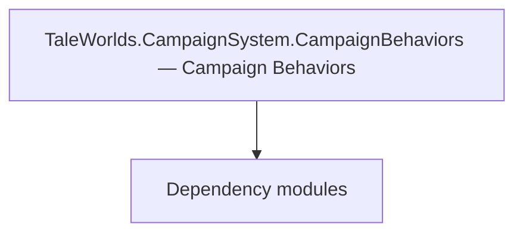

# TaleWorlds.CampaignSystem.CampaignBehaviors — Campaign Behaviors

**One-line responsibility:** This page covers all 204 business types under `TaleWorlds.CampaignSystem.CampaignBehaviors — Campaign Behaviors` as a family index, giving each type its namespace, responsibility, and typical timing so you can browse by module instead of alphabetically.

## Mental Model

CampaignBehaviors is the campaign-system layer where TaleWorlds and mods hook gameplay logic: settlement/party/diplomacy behaviors, AI party logic, comment behaviors, and barter behaviors. Each behavior listens to CampaignEvents and runs on the campaign tick; it is the primary injection point for mod gameplay and the place where world-state mutations must be channeled through Actions rather than direct field writes.

## When to Use

When you need to react to a campaign event, add a daily/periodic tick, or inject a new campaign system, inherit CampaignBehaviorBase and register it in CampaignGameStarter. Keep all world mutations inside Actions.

## Dependencies

The types under `TaleWorlds.CampaignSystem.CampaignBehaviors — Campaign Behaviors` depend on the following modules; missing any of them causes compile- or run-time failure.

- [Campaign](../../campaign/Campaign)
- [MBSubModuleBase](../../core/MBSubModuleBase)
- [API Overview](../../_index)

## Type Catalog

| Type | Namespace | Purpose | Timing |
| --- | --- | --- | --- |
| `AgingCampaignBehavior` | TaleWorlds.CampaignSystem.CampaignBehaviors | Campaign-system behavior that listens to global events to drive that system’s initialization and periodic updates. It is the main entry point for mods to inject gameplay; do not mutate world state directly outside a behavior. | Campaign init |
| `Alliance` | TaleWorlds.CampaignSystem.CampaignBehaviors | A business type under this namespace that carries its derived convention responsibility. Confirm its lifecycle and owning system before calling; do not reference an unready instance at the wrong phase. World-state changes should go through the corresponding Action/Behavior, not direct field mutation. | Campaign init |
| `AllianceCampaignBehavior` | TaleWorlds.CampaignSystem.CampaignBehaviors | Campaign-system behavior that listens to global events to drive that system’s initialization and periodic updates. It is the main entry point for mods to inject gameplay; do not mutate world state directly outside a behavior. | Campaign init |
| `AllianceCampaignBehaviorTypeDefiner` | TaleWorlds.CampaignSystem.CampaignBehaviors | Campaign-system behavior that listens to global events to drive that system’s initialization and periodic updates. It is the main entry point for mods to inject gameplay; do not mutate world state directly outside a behavior. | Campaign init |
| `BackstoryCampaignBehavior` | TaleWorlds.CampaignSystem.CampaignBehaviors | Campaign-system behavior that listens to global events to drive that system’s initialization and periodic updates. It is the main entry point for mods to inject gameplay; do not mutate world state directly outside a behavior. | Campaign init |
| `BanditInteractionsCampaignBehavior` | TaleWorlds.CampaignSystem.CampaignBehaviors | Campaign-system behavior that listens to global events to drive that system’s initialization and periodic updates. It is the main entry point for mods to inject gameplay; do not mutate world state directly outside a behavior. | Campaign init |
| `BanditInteractionsCampaignBehaviorTypeDefiner` | TaleWorlds.CampaignSystem.CampaignBehaviors | Campaign-system behavior that listens to global events to drive that system’s initialization and periodic updates. It is the main entry point for mods to inject gameplay; do not mutate world state directly outside a behavior. | Campaign init |
| `BanditSpawnCampaignBehavior` | TaleWorlds.CampaignSystem.CampaignBehaviors | Campaign-system behavior that listens to global events to drive that system’s initialization and periodic updates. It is the main entry point for mods to inject gameplay; do not mutate world state directly outside a behavior. | Campaign init |
| `BannerCampaignBehavior` | TaleWorlds.CampaignSystem.CampaignBehaviors | Campaign-system behavior that listens to global events to drive that system’s initialization and periodic updates. It is the main entry point for mods to inject gameplay; do not mutate world state directly outside a behavior. | Campaign init |
| `BattleCampaignBehavior` | TaleWorlds.CampaignSystem.CampaignBehaviors | Campaign-system behavior that listens to global events to drive that system’s initialization and periodic updates. It is the main entry point for mods to inject gameplay; do not mutate world state directly outside a behavior. | Campaign init |
| `BuildingsCampaignBehavior` | TaleWorlds.CampaignSystem.CampaignBehaviors | Campaign-system behavior that listens to global events to drive that system’s initialization and periodic updates. It is the main entry point for mods to inject gameplay; do not mutate world state directly outside a behavior. | Campaign init |
| `CallToWarAgreement` | TaleWorlds.CampaignSystem.CampaignBehaviors | A business type under this namespace that carries its derived convention responsibility. Confirm its lifecycle and owning system before calling; do not reference an unready instance at the wrong phase. World-state changes should go through the corresponding Action/Behavior, not direct field mutation. | Campaign init |
| `CampaignBattleRecoveryBehavior` | TaleWorlds.CampaignSystem.CampaignBehaviors | AI decision implementation that must be interruptible and serializable to support saving and undo. Search must be depth/time bounded to avoid stalls. | Campaign init |
| `CampaignBehaviorManager` | TaleWorlds.CampaignSystem.CampaignBehaviors | Campaign-system behavior that listens to global events to drive that system’s initialization and periodic updates. It is the main entry point for mods to inject gameplay; do not mutate world state directly outside a behavior. | Campaign init |
| `CampaignFactionManagerBehaviour` | TaleWorlds.CampaignSystem.CampaignBehaviors | AI decision implementation that must be interruptible and serializable to support saving and undo. Search must be depth/time bounded to avoid stalls. | Campaign init |
| `CampaignWarManagerBehavior` | TaleWorlds.CampaignSystem.CampaignBehaviors | AI decision implementation that must be interruptible and serializable to support saving and undo. Search must be depth/time bounded to avoid stalls. | Campaign init |
| `CaravanConversationsCampaignBehavior` | TaleWorlds.CampaignSystem.CampaignBehaviors | Campaign-system behavior that listens to global events to drive that system’s initialization and periodic updates. It is the main entry point for mods to inject gameplay; do not mutate world state directly outside a behavior. | Campaign init |
| `CaravansCampaignBehavior` | TaleWorlds.CampaignSystem.CampaignBehaviors | Campaign-system behavior that listens to global events to drive that system’s initialization and periodic updates. It is the main entry point for mods to inject gameplay; do not mutate world state directly outside a behavior. | Campaign init |
| `CaravansCampaignBehaviorTypeDefiner` | TaleWorlds.CampaignSystem.CampaignBehaviors | Campaign-system behavior that listens to global events to drive that system’s initialization and periodic updates. It is the main entry point for mods to inject gameplay; do not mutate world state directly outside a behavior. | Campaign init |
| `CharacterCreationCampaignBehavior` | TaleWorlds.CampaignSystem.CampaignBehaviors | Campaign-system behavior that listens to global events to drive that system’s initialization and periodic updates. It is the main entry point for mods to inject gameplay; do not mutate world state directly outside a behavior. | Campaign init |
| `CharacterDevelopmentCampaignBehavior` | TaleWorlds.CampaignSystem.CampaignBehaviors | Campaign-system behavior that listens to global events to drive that system’s initialization and periodic updates. It is the main entry point for mods to inject gameplay; do not mutate world state directly outside a behavior. | Campaign init |
| `CharacterRelationCampaignBehavior` | TaleWorlds.CampaignSystem.CampaignBehaviors | Campaign-system behavior that listens to global events to drive that system’s initialization and periodic updates. It is the main entry point for mods to inject gameplay; do not mutate world state directly outside a behavior. | Campaign init |
| `ClanVariablesCampaignBehavior` | TaleWorlds.CampaignSystem.CampaignBehaviors | Campaign-system behavior that listens to global events to drive that system’s initialization and periodic updates. It is the main entry point for mods to inject gameplay; do not mutate world state directly outside a behavior. | Campaign init |
| `CompanionGrievanceBehavior` | TaleWorlds.CampaignSystem.CampaignBehaviors | A business type under this namespace that carries its derived convention responsibility. Confirm its lifecycle and owning system before calling; do not reference an unready instance at the wrong phase. World-state changes should go through the corresponding Action/Behavior, not direct field mutation. | Campaign init |
| `CompanionGrievanceBehaviorTypeDefiner` | TaleWorlds.CampaignSystem.CampaignBehaviors | Save-type definer that declares which fields of the type enter the save. Any new field must carry a default value, otherwise old saves fail to deserialize. | Campaign init |
| `CompanionRolesCampaignBehavior` | TaleWorlds.CampaignSystem.CampaignBehaviors | Campaign-system behavior that listens to global events to drive that system’s initialization and periodic updates. It is the main entry point for mods to inject gameplay; do not mutate world state directly outside a behavior. | Campaign init |
| `CompanionsCampaignBehavior` | TaleWorlds.CampaignSystem.CampaignBehaviors | Campaign-system behavior that listens to global events to drive that system’s initialization and periodic updates. It is the main entry point for mods to inject gameplay; do not mutate world state directly outside a behavior. | Campaign init |
| `CraftedItemInitializationData` | TaleWorlds.CampaignSystem.CampaignBehaviors | A business type under this namespace that carries its derived convention responsibility. Confirm its lifecycle and owning system before calling; do not reference an unready instance at the wrong phase. World-state changes should go through the corresponding Action/Behavior, not direct field mutation. | Campaign init |
| `CraftingCampaignBehavior` | TaleWorlds.CampaignSystem.CampaignBehaviors | Campaign-system behavior that listens to global events to drive that system’s initialization and periodic updates. It is the main entry point for mods to inject gameplay; do not mutate world state directly outside a behavior. | Campaign init |
| `CraftingCampaignBehaviorTypeDefiner` | TaleWorlds.CampaignSystem.CampaignBehaviors | Campaign-system behavior that listens to global events to drive that system’s initialization and periodic updates. It is the main entry point for mods to inject gameplay; do not mutate world state directly outside a behavior. | Campaign init |
| `CraftingOrderSlots` | TaleWorlds.CampaignSystem.CampaignBehaviors | Battle order / formation sequence describing a unit’s formation and movement intent, interpreted and executed by the Order system. | Campaign init |
| `CrimeCampaignBehavior` | TaleWorlds.CampaignSystem.CampaignBehaviors | Campaign-system behavior that listens to global events to drive that system’s initialization and periodic updates. It is the main entry point for mods to inject gameplay; do not mutate world state directly outside a behavior. | Campaign init |
| `DefaultLogsCampaignBehavior` | TaleWorlds.CampaignSystem.CampaignBehaviors | Campaign-system behavior that listens to global events to drive that system’s initialization and periodic updates. It is the main entry point for mods to inject gameplay; do not mutate world state directly outside a behavior. | Campaign init |
| `DesertersCampaignBehavior` | TaleWorlds.CampaignSystem.CampaignBehaviors | Campaign-system behavior that listens to global events to drive that system’s initialization and periodic updates. It is the main entry point for mods to inject gameplay; do not mutate world state directly outside a behavior. | Campaign init |
| `DesertionCampaignBehavior` | TaleWorlds.CampaignSystem.CampaignBehaviors | Campaign-system behavior that listens to global events to drive that system’s initialization and periodic updates. It is the main entry point for mods to inject gameplay; do not mutate world state directly outside a behavior. | Campaign init |
| `DisbandPartyCampaignBehavior` | TaleWorlds.CampaignSystem.CampaignBehaviors | Campaign-system behavior that listens to global events to drive that system’s initialization and periodic updates. It is the main entry point for mods to inject gameplay; do not mutate world state directly outside a behavior. | Campaign init |
| `DiscardItemsCampaignBehavior` | TaleWorlds.CampaignSystem.CampaignBehaviors | Campaign-system behavior that listens to global events to drive that system’s initialization and periodic updates. It is the main entry point for mods to inject gameplay; do not mutate world state directly outside a behavior. | Campaign init |
| `DisorganizedStateCampaignBehavior` | TaleWorlds.CampaignSystem.CampaignBehaviors | Campaign-system behavior that listens to global events to drive that system’s initialization and periodic updates. It is the main entry point for mods to inject gameplay; do not mutate world state directly outside a behavior. | Campaign init |
| `DynamicBodyCampaignBehavior` | TaleWorlds.CampaignSystem.CampaignBehaviors | Campaign-system behavior that listens to global events to drive that system’s initialization and periodic updates. It is the main entry point for mods to inject gameplay; do not mutate world state directly outside a behavior. | Campaign init |
| `EducationCampaignBehavior` | TaleWorlds.CampaignSystem.CampaignBehaviors | Campaign-system behavior that listens to global events to drive that system’s initialization and periodic updates. It is the main entry point for mods to inject gameplay; do not mutate world state directly outside a behavior. | Campaign init |
| `EducationCharacterProperties` | TaleWorlds.CampaignSystem.CampaignBehaviors | A business type under this namespace that carries its derived convention responsibility. Confirm its lifecycle and owning system before calling; do not reference an unready instance at the wrong phase. World-state changes should go through the corresponding Action/Behavior, not direct field mutation. | Campaign init |
| `EmissarySystemCampaignBehavior` | TaleWorlds.CampaignSystem.CampaignBehaviors | Campaign-system behavior that listens to global events to drive that system’s initialization and periodic updates. It is the main entry point for mods to inject gameplay; do not mutate world state directly outside a behavior. | Campaign init |
| `EncounterGameMenuBehavior` | TaleWorlds.CampaignSystem.CampaignBehaviors | A business type under this namespace that carries its derived convention responsibility. Confirm its lifecycle and owning system before calling; do not reference an unready instance at the wrong phase. World-state changes should go through the corresponding Action/Behavior, not direct field mutation. | Campaign init |
| `FactionDiscontinuationCampaignBehavior` | TaleWorlds.CampaignSystem.CampaignBehaviors | Campaign-system behavior that listens to global events to drive that system’s initialization and periodic updates. It is the main entry point for mods to inject gameplay; do not mutate world state directly outside a behavior. | Campaign init |
| `FindingItemOnMapBehavior` | TaleWorlds.CampaignSystem.CampaignBehaviors | A business type under this namespace that carries its derived convention responsibility. Confirm its lifecycle and owning system before calling; do not reference an unready instance at the wrong phase. World-state changes should go through the corresponding Action/Behavior, not direct field mutation. | Campaign init |
| `FoodConsumptionBehavior` | TaleWorlds.CampaignSystem.CampaignBehaviors | A business type under this namespace that carries its derived convention responsibility. Confirm its lifecycle and owning system before calling; do not reference an unready instance at the wrong phase. World-state changes should go through the corresponding Action/Behavior, not direct field mutation. | Campaign init |
| `GarrisonRecruitmentCampaignBehavior` | TaleWorlds.CampaignSystem.CampaignBehaviors | Campaign-system behavior that listens to global events to drive that system’s initialization and periodic updates. It is the main entry point for mods to inject gameplay; do not mutate world state directly outside a behavior. | Campaign init |
| `GarrisonTroopsCampaignBehavior` | TaleWorlds.CampaignSystem.CampaignBehaviors | Campaign-system behavior that listens to global events to drive that system’s initialization and periodic updates. It is the main entry point for mods to inject gameplay; do not mutate world state directly outside a behavior. | Campaign init |
| `GovernorCampaignBehavior` | TaleWorlds.CampaignSystem.CampaignBehaviors | Campaign-system behavior that listens to global events to drive that system’s initialization and periodic updates. It is the main entry point for mods to inject gameplay; do not mutate world state directly outside a behavior. | Campaign init |
| `Grievance` | TaleWorlds.CampaignSystem.CampaignBehaviors | A business type under this namespace that carries its derived convention responsibility. Confirm its lifecycle and owning system before calling; do not reference an unready instance at the wrong phase. World-state changes should go through the corresponding Action/Behavior, not direct field mutation. | Campaign init |
| `GrievanceType` | TaleWorlds.CampaignSystem.CampaignBehaviors | A business type under this namespace that carries its derived convention responsibility. Confirm its lifecycle and owning system before calling; do not reference an unready instance at the wrong phase. World-state changes should go through the corresponding Action/Behavior, not direct field mutation. | Campaign init |
| `HeroAgentSpawnCampaignBehavior` | TaleWorlds.CampaignSystem.CampaignBehaviors | Campaign-system behavior that listens to global events to drive that system’s initialization and periodic updates. It is the main entry point for mods to inject gameplay; do not mutate world state directly outside a behavior. | Campaign init |
| `HeroCraftingRecord` | TaleWorlds.CampaignSystem.CampaignBehaviors | A business type under this namespace that carries its derived convention responsibility. Confirm its lifecycle and owning system before calling; do not reference an unready instance at the wrong phase. World-state changes should go through the corresponding Action/Behavior, not direct field mutation. | Campaign init |
| `HeroKnownInformationCampaignBehavior` | TaleWorlds.CampaignSystem.CampaignBehaviors | Campaign-system behavior that listens to global events to drive that system’s initialization and periodic updates. It is the main entry point for mods to inject gameplay; do not mutate world state directly outside a behavior. | Campaign init |
| `HeroSpawnCampaignBehavior` | TaleWorlds.CampaignSystem.CampaignBehaviors | Campaign-system behavior that listens to global events to drive that system’s initialization and periodic updates. It is the main entry point for mods to inject gameplay; do not mutate world state directly outside a behavior. | Campaign init |
| `HideoutCampaignBehavior` | TaleWorlds.CampaignSystem.CampaignBehaviors | Campaign-system behavior that listens to global events to drive that system’s initialization and periodic updates. It is the main entry point for mods to inject gameplay; do not mutate world state directly outside a behavior. | Campaign init |
| `IAlleyCampaignBehavior` | TaleWorlds.CampaignSystem.CampaignBehaviors | Campaign-system behavior that listens to global events to drive that system’s initialization and periodic updates. It is the main entry point for mods to inject gameplay; do not mutate world state directly outside a behavior. | Campaign init |
| `IAllianceCampaignBehavior` | TaleWorlds.CampaignSystem.CampaignBehaviors | Campaign-system behavior that listens to global events to drive that system’s initialization and periodic updates. It is the main entry point for mods to inject gameplay; do not mutate world state directly outside a behavior. | Campaign init |
| `ICaptivityCampaignBehavior` | TaleWorlds.CampaignSystem.CampaignBehaviors | Campaign-system behavior that listens to global events to drive that system’s initialization and periodic updates. It is the main entry point for mods to inject gameplay; do not mutate world state directly outside a behavior. | Campaign init |
| `ICraftingCampaignBehavior` | TaleWorlds.CampaignSystem.CampaignBehaviors | Campaign-system behavior that listens to global events to drive that system’s initialization and periodic updates. It is the main entry point for mods to inject gameplay; do not mutate world state directly outside a behavior. | Campaign init |
| `IDisbandPartyCampaignBehavior` | TaleWorlds.CampaignSystem.CampaignBehaviors | Campaign-system behavior that listens to global events to drive that system’s initialization and periodic updates. It is the main entry point for mods to inject gameplay; do not mutate world state directly outside a behavior. | Campaign init |
| `IEducationLogic` | TaleWorlds.CampaignSystem.CampaignBehaviors | A business type under this namespace that carries its derived convention responsibility. Confirm its lifecycle and owning system before calling; do not reference an unready instance at the wrong phase. World-state changes should go through the corresponding Action/Behavior, not direct field mutation. | Campaign init |
| `IFacegenCampaignBehavior` | TaleWorlds.CampaignSystem.CampaignBehaviors | Campaign-system behavior that listens to global events to drive that system’s initialization and periodic updates. It is the main entry point for mods to inject gameplay; do not mutate world state directly outside a behavior. | Campaign init |
| `IGarrisonRecruitmentBehavior` | TaleWorlds.CampaignSystem.CampaignBehaviors | A business type under this namespace that carries its derived convention responsibility. Confirm its lifecycle and owning system before calling; do not reference an unready instance at the wrong phase. World-state changes should go through the corresponding Action/Behavior, not direct field mutation. | Campaign init |
| `IHideoutCampaignBehavior` | TaleWorlds.CampaignSystem.CampaignBehaviors | Campaign-system behavior that listens to global events to drive that system’s initialization and periodic updates. It is the main entry point for mods to inject gameplay; do not mutate world state directly outside a behavior. | Campaign init |
| `IMapTracksCampaignBehavior` | TaleWorlds.CampaignSystem.CampaignBehaviors | Campaign-system behavior that listens to global events to drive that system’s initialization and periodic updates. It is the main entry point for mods to inject gameplay; do not mutate world state directly outside a behavior. | Campaign init |
| `IMarriageOfferCampaignBehavior` | TaleWorlds.CampaignSystem.CampaignBehaviors | Campaign-system behavior that listens to global events to drive that system’s initialization and periodic updates. It is the main entry point for mods to inject gameplay; do not mutate world state directly outside a behavior. | Campaign init |
| `IncidentsCampaignBehaviour` | TaleWorlds.CampaignSystem.CampaignBehaviors | AI decision implementation that must be interruptible and serializable to support saving and undo. Search must be depth/time bounded to avoid stalls. | Campaign init |
| `IncidentTrigger` | TaleWorlds.CampaignSystem.CampaignBehaviors | A business type under this namespace that carries its derived convention responsibility. Confirm its lifecycle and owning system before calling; do not reference an unready instance at the wrong phase. World-state changes should go through the corresponding Action/Behavior, not direct field mutation. | Campaign init |
| `IncidentType` | TaleWorlds.CampaignSystem.CampaignBehaviors | A business type under this namespace that carries its derived convention responsibility. Confirm its lifecycle and owning system before calling; do not reference an unready instance at the wrong phase. World-state changes should go through the corresponding Action/Behavior, not direct field mutation. | Campaign init |
| `InfluenceGainCampaignBehavior` | TaleWorlds.CampaignSystem.CampaignBehaviors | Campaign-system behavior that listens to global events to drive that system’s initialization and periodic updates. It is the main entry point for mods to inject gameplay; do not mutate world state directly outside a behavior. | Campaign init |
| `InitialChildGenerationCampaignBehavior` | TaleWorlds.CampaignSystem.CampaignBehaviors | Campaign-system behavior that listens to global events to drive that system’s initialization and periodic updates. It is the main entry point for mods to inject gameplay; do not mutate world state directly outside a behavior. | Campaign init |
| `INonReadyObjectHandler` | TaleWorlds.CampaignSystem.CampaignBehaviors | A business type under this namespace that carries its derived convention responsibility. Confirm its lifecycle and owning system before calling; do not reference an unready instance at the wrong phase. World-state changes should go through the corresponding Action/Behavior, not direct field mutation. | Campaign init |
| `IParleyCampaignBehavior` | TaleWorlds.CampaignSystem.CampaignBehaviors | Campaign-system behavior that listens to global events to drive that system’s initialization and periodic updates. It is the main entry point for mods to inject gameplay; do not mutate world state directly outside a behavior. | Campaign init |
| `IPatrolPartiesCampaignBehavior` | TaleWorlds.CampaignSystem.CampaignBehaviors | Campaign-system behavior that listens to global events to drive that system’s initialization and periodic updates. It is the main entry point for mods to inject gameplay; do not mutate world state directly outside a behavior. | Campaign init |
| `IRetrainOutlawPartyMembersCampaignBehavior` | TaleWorlds.CampaignSystem.CampaignBehaviors | Campaign-system behavior that listens to global events to drive that system’s initialization and periodic updates. It is the main entry point for mods to inject gameplay; do not mutate world state directly outside a behavior. | Campaign init |
| `IssuesCampaignBehavior` | TaleWorlds.CampaignSystem.CampaignBehaviors | Campaign-system behavior that listens to global events to drive that system’s initialization and periodic updates. It is the main entry point for mods to inject gameplay; do not mutate world state directly outside a behavior. | Campaign init |
| `IStatisticsCampaignBehavior` | TaleWorlds.CampaignSystem.CampaignBehaviors | Campaign-system behavior that listens to global events to drive that system’s initialization and periodic updates. It is the main entry point for mods to inject gameplay; do not mutate world state directly outside a behavior. | Campaign init |
| `ITeleportationCampaignBehavior` | TaleWorlds.CampaignSystem.CampaignBehaviors | Campaign-system behavior that listens to global events to drive that system’s initialization and periodic updates. It is the main entry point for mods to inject gameplay; do not mutate world state directly outside a behavior. | Campaign init |
| `ItemConsumptionBehavior` | TaleWorlds.CampaignSystem.CampaignBehaviors | A business type under this namespace that carries its derived convention responsibility. Confirm its lifecycle and owning system before calling; do not reference an unready instance at the wrong phase. World-state changes should go through the corresponding Action/Behavior, not direct field mutation. | Campaign init |
| `ItemTradeData` | TaleWorlds.CampaignSystem.CampaignBehaviors | A business type under this namespace that carries its derived convention responsibility. Confirm its lifecycle and owning system before calling; do not reference an unready instance at the wrong phase. World-state changes should go through the corresponding Action/Behavior, not direct field mutation. | Campaign init |
| `ITradeAgreementsCampaignBehavior` | TaleWorlds.CampaignSystem.CampaignBehaviors | Campaign-system behavior that listens to global events to drive that system’s initialization and periodic updates. It is the main entry point for mods to inject gameplay; do not mutate world state directly outside a behavior. | Campaign init |
| `ITradeRumorCampaignBehavior` | TaleWorlds.CampaignSystem.CampaignBehaviors | Campaign-system behavior that listens to global events to drive that system’s initialization and periodic updates. It is the main entry point for mods to inject gameplay; do not mutate world state directly outside a behavior. | Campaign init |
| `IVassalAndMercenaryOfferCampaignBehavior` | TaleWorlds.CampaignSystem.CampaignBehaviors | Campaign-system behavior that listens to global events to drive that system’s initialization and periodic updates. It is the main entry point for mods to inject gameplay; do not mutate world state directly outside a behavior. | Campaign init |
| `IWorkshopWarehouseCampaignBehavior` | TaleWorlds.CampaignSystem.CampaignBehaviors | Campaign-system behavior that listens to global events to drive that system’s initialization and periodic updates. It is the main entry point for mods to inject gameplay; do not mutate world state directly outside a behavior. | Campaign init |
| `JournalLogsCampaignBehavior` | TaleWorlds.CampaignSystem.CampaignBehaviors | Campaign-system behavior that listens to global events to drive that system’s initialization and periodic updates. It is the main entry point for mods to inject gameplay; do not mutate world state directly outside a behavior. | Campaign init |
| `KingdomDecisionProposalBehavior` | TaleWorlds.CampaignSystem.CampaignBehaviors | A business type under this namespace that carries its derived convention responsibility. Confirm its lifecycle and owning system before calling; do not reference an unready instance at the wrong phase. World-state changes should go through the corresponding Action/Behavior, not direct field mutation. | Campaign init |
| `LordConversationsCampaignBehavior` | TaleWorlds.CampaignSystem.CampaignBehaviors | Campaign-system behavior that listens to global events to drive that system’s initialization and periodic updates. It is the main entry point for mods to inject gameplay; do not mutate world state directly outside a behavior. | Campaign init |
| `LordDefectionCampaignBehavior` | TaleWorlds.CampaignSystem.CampaignBehaviors | Campaign-system behavior that listens to global events to drive that system’s initialization and periodic updates. It is the main entry point for mods to inject gameplay; do not mutate world state directly outside a behavior. | Campaign init |
| `LordDefectionCampaignBehaviorTypeDefiner` | TaleWorlds.CampaignSystem.CampaignBehaviors | Campaign-system behavior that listens to global events to drive that system’s initialization and periodic updates. It is the main entry point for mods to inject gameplay; do not mutate world state directly outside a behavior. | Campaign init |
| `MapTracksCampaignBehavior` | TaleWorlds.CampaignSystem.CampaignBehaviors | Campaign-system behavior that listens to global events to drive that system’s initialization and periodic updates. It is the main entry point for mods to inject gameplay; do not mutate world state directly outside a behavior. | Campaign init |
| `MapWeatherCampaignBehavior` | TaleWorlds.CampaignSystem.CampaignBehaviors | Campaign-system behavior that listens to global events to drive that system’s initialization and periodic updates. It is the main entry point for mods to inject gameplay; do not mutate world state directly outside a behavior. | Campaign init |
| `MarriageOfferCampaignBehavior` | TaleWorlds.CampaignSystem.CampaignBehaviors | Campaign-system behavior that listens to global events to drive that system’s initialization and periodic updates. It is the main entry point for mods to inject gameplay; do not mutate world state directly outside a behavior. | Campaign init |
| `MilitiasCampaignBehavior` | TaleWorlds.CampaignSystem.CampaignBehaviors | Campaign-system behavior that listens to global events to drive that system’s initialization and periodic updates. It is the main entry point for mods to inject gameplay; do not mutate world state directly outside a behavior. | Campaign init |
| `MobilePartyTrainingBehavior` | TaleWorlds.CampaignSystem.CampaignBehaviors | AI decision implementation that must be interruptible and serializable to support saving and undo. Search must be depth/time bounded to avoid stalls. | Campaign init |
| `NotableHelperCharacterCampaignBehavior` | TaleWorlds.CampaignSystem.CampaignBehaviors | Campaign-system behavior that listens to global events to drive that system’s initialization and periodic updates. It is the main entry point for mods to inject gameplay; do not mutate world state directly outside a behavior. | Campaign init |
| `NotablePowerManagementBehavior` | TaleWorlds.CampaignSystem.CampaignBehaviors | A business type under this namespace that carries its derived convention responsibility. Confirm its lifecycle and owning system before calling; do not reference an unready instance at the wrong phase. World-state changes should go through the corresponding Action/Behavior, not direct field mutation. | Campaign init |
| `NotablesCampaignBehavior` | TaleWorlds.CampaignSystem.CampaignBehaviors | Campaign-system behavior that listens to global events to drive that system’s initialization and periodic updates. It is the main entry point for mods to inject gameplay; do not mutate world state directly outside a behavior. | Campaign init |
| `NotableSupportersCampaignBehavior` | TaleWorlds.CampaignSystem.CampaignBehaviors | Campaign-system behavior that listens to global events to drive that system’s initialization and periodic updates. It is the main entry point for mods to inject gameplay; do not mutate world state directly outside a behavior. | Campaign init |
| `NPCEquipmentsCampaignBehavior` | TaleWorlds.CampaignSystem.CampaignBehaviors | Campaign-system behavior that listens to global events to drive that system’s initialization and periodic updates. It is the main entry point for mods to inject gameplay; do not mutate world state directly outside a behavior. | Campaign init |
| `Number` | TaleWorlds.CampaignSystem.CampaignBehaviors | A business type under this namespace that carries its derived convention responsibility. Confirm its lifecycle and owning system before calling; do not reference an unready instance at the wrong phase. World-state changes should go through the corresponding Action/Behavior, not direct field mutation. | Campaign init |
| `OrderOfBattleCampaignBehavior` | TaleWorlds.CampaignSystem.CampaignBehaviors | Campaign-system behavior that listens to global events to drive that system’s initialization and periodic updates. It is the main entry point for mods to inject gameplay; do not mutate world state directly outside a behavior. | Campaign init |
| `OrderOfBattleFormationData` | TaleWorlds.CampaignSystem.CampaignBehaviors | Battle order / formation sequence describing a unit’s formation and movement intent, interpreted and executed by the Order system. | Campaign init |
| `ParleyCampaignBehavior` | TaleWorlds.CampaignSystem.CampaignBehaviors | Campaign-system behavior that listens to global events to drive that system’s initialization and periodic updates. It is the main entry point for mods to inject gameplay; do not mutate world state directly outside a behavior. | Campaign init |
| `PartiesBuyFoodCampaignBehavior` | TaleWorlds.CampaignSystem.CampaignBehaviors | Campaign-system behavior that listens to global events to drive that system’s initialization and periodic updates. It is the main entry point for mods to inject gameplay; do not mutate world state directly outside a behavior. | Campaign init |
| `PartiesBuyHorseCampaignBehavior` | TaleWorlds.CampaignSystem.CampaignBehaviors | Campaign-system behavior that listens to global events to drive that system’s initialization and periodic updates. It is the main entry point for mods to inject gameplay; do not mutate world state directly outside a behavior. | Campaign init |
| `PartiesSellLootCampaignBehavior` | TaleWorlds.CampaignSystem.CampaignBehaviors | Campaign-system behavior that listens to global events to drive that system’s initialization and periodic updates. It is the main entry point for mods to inject gameplay; do not mutate world state directly outside a behavior. | Campaign init |
| `PartiesSellPrisonerCampaignBehavior` | TaleWorlds.CampaignSystem.CampaignBehaviors | Campaign-system behavior that listens to global events to drive that system’s initialization and periodic updates. It is the main entry point for mods to inject gameplay; do not mutate world state directly outside a behavior. | Campaign init |
| `PartyDiplomaticHandlerCampaignBehavior` | TaleWorlds.CampaignSystem.CampaignBehaviors | Campaign-system behavior that listens to global events to drive that system’s initialization and periodic updates. It is the main entry point for mods to inject gameplay; do not mutate world state directly outside a behavior. | Campaign init |
| `PartyHealCampaignBehavior` | TaleWorlds.CampaignSystem.CampaignBehaviors | Campaign-system behavior that listens to global events to drive that system’s initialization and periodic updates. It is the main entry point for mods to inject gameplay; do not mutate world state directly outside a behavior. | Campaign init |
| `PartyRolesCampaignBehavior` | TaleWorlds.CampaignSystem.CampaignBehaviors | Campaign-system behavior that listens to global events to drive that system’s initialization and periodic updates. It is the main entry point for mods to inject gameplay; do not mutate world state directly outside a behavior. | Campaign init |
| `PartyUpgraderCampaignBehavior` | TaleWorlds.CampaignSystem.CampaignBehaviors | Campaign-system behavior that listens to global events to drive that system’s initialization and periodic updates. It is the main entry point for mods to inject gameplay; do not mutate world state directly outside a behavior. | Campaign init |
| `PatrolPartiesCampaignBehavior` | TaleWorlds.CampaignSystem.CampaignBehaviors | Campaign-system behavior that listens to global events to drive that system’s initialization and periodic updates. It is the main entry point for mods to inject gameplay; do not mutate world state directly outside a behavior. | Campaign init |
| `PeaceOfferCampaignBehavior` | TaleWorlds.CampaignSystem.CampaignBehaviors | Campaign-system behavior that listens to global events to drive that system’s initialization and periodic updates. It is the main entry point for mods to inject gameplay; do not mutate world state directly outside a behavior. | Campaign init |
| `PerkActivationHandlerCampaignBehavior` | TaleWorlds.CampaignSystem.CampaignBehaviors | Campaign-system behavior that listens to global events to drive that system’s initialization and periodic updates. It is the main entry point for mods to inject gameplay; do not mutate world state directly outside a behavior. | Campaign init |
| `PerkResetCampaignBehavior` | TaleWorlds.CampaignSystem.CampaignBehaviors | Campaign-system behavior that listens to global events to drive that system’s initialization and periodic updates. It is the main entry point for mods to inject gameplay; do not mutate world state directly outside a behavior. | Campaign init |
| `PlayerArmyWaitBehavior` | TaleWorlds.CampaignSystem.CampaignBehaviors | AI decision implementation that must be interruptible and serializable to support saving and undo. Search must be depth/time bounded to avoid stalls. | Campaign init |
| `PlayerCaptivityCampaignBehavior` | TaleWorlds.CampaignSystem.CampaignBehaviors | Campaign-system behavior that listens to global events to drive that system’s initialization and periodic updates. It is the main entry point for mods to inject gameplay; do not mutate world state directly outside a behavior. | Campaign init |
| `PlayerTownVisitCampaignBehavior` | TaleWorlds.CampaignSystem.CampaignBehaviors | Campaign-system behavior that listens to global events to drive that system’s initialization and periodic updates. It is the main entry point for mods to inject gameplay; do not mutate world state directly outside a behavior. | Campaign init |
| `PlayerTrackCompanionBehavior` | TaleWorlds.CampaignSystem.CampaignBehaviors | A business type under this namespace that carries its derived convention responsibility. Confirm its lifecycle and owning system before calling; do not reference an unready instance at the wrong phase. World-state changes should go through the corresponding Action/Behavior, not direct field mutation. | Campaign init |
| `PlayerVariablesBehavior` | TaleWorlds.CampaignSystem.CampaignBehaviors | A business type under this namespace that carries its derived convention responsibility. Confirm its lifecycle and owning system before calling; do not reference an unready instance at the wrong phase. World-state changes should go through the corresponding Action/Behavior, not direct field mutation. | Campaign init |
| `PoliticalStagnationAndBorderIncidentCampaignBehavior` | TaleWorlds.CampaignSystem.CampaignBehaviors | Campaign-system behavior that listens to global events to drive that system’s initialization and periodic updates. It is the main entry point for mods to inject gameplay; do not mutate world state directly outside a behavior. | Campaign init |
| `Pregnancy` | TaleWorlds.CampaignSystem.CampaignBehaviors | A business type under this namespace that carries its derived convention responsibility. Confirm its lifecycle and owning system before calling; do not reference an unready instance at the wrong phase. World-state changes should go through the corresponding Action/Behavior, not direct field mutation. | Campaign init |
| `PregnancyCampaignBehavior` | TaleWorlds.CampaignSystem.CampaignBehaviors | Campaign-system behavior that listens to global events to drive that system’s initialization and periodic updates. It is the main entry point for mods to inject gameplay; do not mutate world state directly outside a behavior. | Campaign init |
| `PregnancyCampaignBehaviorTypeDefiner` | TaleWorlds.CampaignSystem.CampaignBehaviors | Campaign-system behavior that listens to global events to drive that system’s initialization and periodic updates. It is the main entry point for mods to inject gameplay; do not mutate world state directly outside a behavior. | Campaign init |
| `PrisonerCaptureCampaignBehavior` | TaleWorlds.CampaignSystem.CampaignBehaviors | Campaign-system behavior that listens to global events to drive that system’s initialization and periodic updates. It is the main entry point for mods to inject gameplay; do not mutate world state directly outside a behavior. | Campaign init |
| `PrisonerRecruitCampaignBehavior` | TaleWorlds.CampaignSystem.CampaignBehaviors | Campaign-system behavior that listens to global events to drive that system’s initialization and periodic updates. It is the main entry point for mods to inject gameplay; do not mutate world state directly outside a behavior. | Campaign init |
| `PrisonerReleaseCampaignBehavior` | TaleWorlds.CampaignSystem.CampaignBehaviors | Campaign-system behavior that listens to global events to drive that system’s initialization and periodic updates. It is the main entry point for mods to inject gameplay; do not mutate world state directly outside a behavior. | Campaign init |
| `RansomOfferCampaignBehavior` | TaleWorlds.CampaignSystem.CampaignBehaviors | Campaign-system behavior that listens to global events to drive that system’s initialization and periodic updates. It is the main entry point for mods to inject gameplay; do not mutate world state directly outside a behavior. | Campaign init |
| `RebellionsCampaignBehavior` | TaleWorlds.CampaignSystem.CampaignBehaviors | Campaign-system behavior that listens to global events to drive that system’s initialization and periodic updates. It is the main entry point for mods to inject gameplay; do not mutate world state directly outside a behavior. | Campaign init |
| `RecruitingDetail` | TaleWorlds.CampaignSystem.CampaignBehaviors | AI decision implementation that must be interruptible and serializable to support saving and undo. Search must be depth/time bounded to avoid stalls. | Campaign init |
| `RecruitmentCampaignBehavior` | TaleWorlds.CampaignSystem.CampaignBehaviors | Campaign-system behavior that listens to global events to drive that system’s initialization and periodic updates. It is the main entry point for mods to inject gameplay; do not mutate world state directly outside a behavior. | Campaign init |
| `RecruitmentCampaignBehaviorTypeDefiner` | TaleWorlds.CampaignSystem.CampaignBehaviors | Campaign-system behavior that listens to global events to drive that system’s initialization and periodic updates. It is the main entry point for mods to inject gameplay; do not mutate world state directly outside a behavior. | Campaign init |
| `RecruitPrisonersCampaignBehavior` | TaleWorlds.CampaignSystem.CampaignBehaviors | Campaign-system behavior that listens to global events to drive that system’s initialization and periodic updates. It is the main entry point for mods to inject gameplay; do not mutate world state directly outside a behavior. | Campaign init |
| `RetrainOutlawPartyMembersBehavior` | TaleWorlds.CampaignSystem.CampaignBehaviors | AI decision implementation that must be interruptible and serializable to support saving and undo. Search must be depth/time bounded to avoid stalls. | Campaign init |
| `RomanceCampaignBehavior` | TaleWorlds.CampaignSystem.CampaignBehaviors | Campaign-system behavior that listens to global events to drive that system’s initialization and periodic updates. It is the main entry point for mods to inject gameplay; do not mutate world state directly outside a behavior. | Campaign init |
| `RomanticPreference` | TaleWorlds.CampaignSystem.CampaignBehaviors | A business type under this namespace that carries its derived convention responsibility. Confirm its lifecycle and owning system before calling; do not reference an unready instance at the wrong phase. World-state changes should go through the corresponding Action/Behavior, not direct field mutation. | Campaign init |
| `SallyOutsCampaignBehavior` | TaleWorlds.CampaignSystem.CampaignBehaviors | Campaign-system behavior that listens to global events to drive that system’s initialization and periodic updates. It is the main entry point for mods to inject gameplay; do not mutate world state directly outside a behavior. | Campaign init |
| `SettlementClaimantCampaignBehavior` | TaleWorlds.CampaignSystem.CampaignBehaviors | Campaign-system behavior that listens to global events to drive that system’s initialization and periodic updates. It is the main entry point for mods to inject gameplay; do not mutate world state directly outside a behavior. | Campaign init |
| `SettlementVariablesBehavior` | TaleWorlds.CampaignSystem.CampaignBehaviors | A business type under this namespace that carries its derived convention responsibility. Confirm its lifecycle and owning system before calling; do not reference an unready instance at the wrong phase. World-state changes should go through the corresponding Action/Behavior, not direct field mutation. | Campaign init |
| `SiegeAftermathCampaignBehavior` | TaleWorlds.CampaignSystem.CampaignBehaviors | Campaign-system behavior that listens to global events to drive that system’s initialization and periodic updates. It is the main entry point for mods to inject gameplay; do not mutate world state directly outside a behavior. | Campaign init |
| `SiegeAmbushCampaignBehavior` | TaleWorlds.CampaignSystem.CampaignBehaviors | Campaign-system behavior that listens to global events to drive that system’s initialization and periodic updates. It is the main entry point for mods to inject gameplay; do not mutate world state directly outside a behavior. | Campaign init |
| `SiegeEventCampaignBehavior` | TaleWorlds.CampaignSystem.CampaignBehaviors | Campaign-system behavior that listens to global events to drive that system’s initialization and periodic updates. It is the main entry point for mods to inject gameplay; do not mutate world state directly outside a behavior. | Campaign init |
| `TeleportationCampaignBehavior` | TaleWorlds.CampaignSystem.CampaignBehaviors | Campaign-system behavior that listens to global events to drive that system’s initialization and periodic updates. It is the main entry point for mods to inject gameplay; do not mutate world state directly outside a behavior. | Campaign init |
| `TeleportationCampaignBehaviorTypeDefiner` | TaleWorlds.CampaignSystem.CampaignBehaviors | Campaign-system behavior that listens to global events to drive that system’s initialization and periodic updates. It is the main entry point for mods to inject gameplay; do not mutate world state directly outside a behavior. | Campaign init |
| `TeleportationData` | TaleWorlds.CampaignSystem.CampaignBehaviors | A business type under this namespace that carries its derived convention responsibility. Confirm its lifecycle and owning system before calling; do not reference an unready instance at the wrong phase. World-state changes should go through the corresponding Action/Behavior, not direct field mutation. | Campaign init |
| `TownMercenaryData` | TaleWorlds.CampaignSystem.CampaignBehaviors | A business type under this namespace that carries its derived convention responsibility. Confirm its lifecycle and owning system before calling; do not reference an unready instance at the wrong phase. World-state changes should go through the corresponding Action/Behavior, not direct field mutation. | Campaign init |
| `TownSecurityCampaignBehavior` | TaleWorlds.CampaignSystem.CampaignBehaviors | Campaign-system behavior that listens to global events to drive that system’s initialization and periodic updates. It is the main entry point for mods to inject gameplay; do not mutate world state directly outside a behavior. | Campaign init |
| `TradeActionLog` | TaleWorlds.CampaignSystem.CampaignBehaviors | A business type under this namespace that carries its derived convention responsibility. Confirm its lifecycle and owning system before calling; do not reference an unready instance at the wrong phase. World-state changes should go through the corresponding Action/Behavior, not direct field mutation. | Campaign init |
| `TradeActionLogPool` | TaleWorlds.CampaignSystem.CampaignBehaviors | A business type under this namespace that carries its derived convention responsibility. Confirm its lifecycle and owning system before calling; do not reference an unready instance at the wrong phase. World-state changes should go through the corresponding Action/Behavior, not direct field mutation. | Campaign init |
| `TradeAgreement` | TaleWorlds.CampaignSystem.CampaignBehaviors | A business type under this namespace that carries its derived convention responsibility. Confirm its lifecycle and owning system before calling; do not reference an unready instance at the wrong phase. World-state changes should go through the corresponding Action/Behavior, not direct field mutation. | Campaign init |
| `TradeAgreementsCampaignBehavior` | TaleWorlds.CampaignSystem.CampaignBehaviors | Campaign-system behavior that listens to global events to drive that system’s initialization and periodic updates. It is the main entry point for mods to inject gameplay; do not mutate world state directly outside a behavior. | Campaign init |
| `TradeAgreementsCampaignBehaviorTypeDefiner` | TaleWorlds.CampaignSystem.CampaignBehaviors | Campaign-system behavior that listens to global events to drive that system’s initialization and periodic updates. It is the main entry point for mods to inject gameplay; do not mutate world state directly outside a behavior. | Campaign init |
| `TradeCampaignBehavior` | TaleWorlds.CampaignSystem.CampaignBehaviors | Campaign-system behavior that listens to global events to drive that system’s initialization and periodic updates. It is the main entry point for mods to inject gameplay; do not mutate world state directly outside a behavior. | Campaign init |
| `TradeGoodType` | TaleWorlds.CampaignSystem.CampaignBehaviors | A business type under this namespace that carries its derived convention responsibility. Confirm its lifecycle and owning system before calling; do not reference an unready instance at the wrong phase. World-state changes should go through the corresponding Action/Behavior, not direct field mutation. | Campaign init |
| `TradeRumorsCampaignBehavior` | TaleWorlds.CampaignSystem.CampaignBehaviors | Campaign-system behavior that listens to global events to drive that system’s initialization and periodic updates. It is the main entry point for mods to inject gameplay; do not mutate world state directly outside a behavior. | Campaign init |
| `TradeSkillCampaignBehavior` | TaleWorlds.CampaignSystem.CampaignBehaviors | Campaign-system behavior that listens to global events to drive that system’s initialization and periodic updates. It is the main entry point for mods to inject gameplay; do not mutate world state directly outside a behavior. | Campaign init |
| `TradeSkillCampaignBehaviorTypeDefiner` | TaleWorlds.CampaignSystem.CampaignBehaviors | Campaign-system behavior that listens to global events to drive that system’s initialization and periodic updates. It is the main entry point for mods to inject gameplay; do not mutate world state directly outside a behavior. | Campaign init |
| `TributesCampaignBehaviour` | TaleWorlds.CampaignSystem.CampaignBehaviors | AI decision implementation that must be interruptible and serializable to support saving and undo. Search must be depth/time bounded to avoid stalls. | Campaign init |
| `VassalAndMercenaryOfferCampaignBehavior` | TaleWorlds.CampaignSystem.CampaignBehaviors | Campaign-system behavior that listens to global events to drive that system’s initialization and periodic updates. It is the main entry point for mods to inject gameplay; do not mutate world state directly outside a behavior. | Campaign init |
| `ViewDataTrackerCampaignBehavior` | TaleWorlds.CampaignSystem.CampaignBehaviors | Campaign-system behavior that listens to global events to drive that system’s initialization and periodic updates. It is the main entry point for mods to inject gameplay; do not mutate world state directly outside a behavior. | Campaign init |
| `VillageGoodProductionCampaignBehavior` | TaleWorlds.CampaignSystem.CampaignBehaviors | Campaign-system behavior that listens to global events to drive that system’s initialization and periodic updates. It is the main entry point for mods to inject gameplay; do not mutate world state directly outside a behavior. | Campaign init |
| `VillageHealCampaignBehavior` | TaleWorlds.CampaignSystem.CampaignBehaviors | Campaign-system behavior that listens to global events to drive that system’s initialization and periodic updates. It is the main entry point for mods to inject gameplay; do not mutate world state directly outside a behavior. | Campaign init |
| `VillageHostileActionCampaignBehavior` | TaleWorlds.CampaignSystem.CampaignBehaviors | Campaign-system behavior that listens to global events to drive that system’s initialization and periodic updates. It is the main entry point for mods to inject gameplay; do not mutate world state directly outside a behavior. | Campaign init |
| `VillagerCampaignBehavior` | TaleWorlds.CampaignSystem.CampaignBehaviors | Campaign-system behavior that listens to global events to drive that system’s initialization and periodic updates. It is the main entry point for mods to inject gameplay; do not mutate world state directly outside a behavior. | Campaign init |
| `VillagerCampaignBehaviorTypeDefiner` | TaleWorlds.CampaignSystem.CampaignBehaviors | Campaign-system behavior that listens to global events to drive that system’s initialization and periodic updates. It is the main entry point for mods to inject gameplay; do not mutate world state directly outside a behavior. | Campaign init |
| `VillageTradeBoundCampaignBehavior` | TaleWorlds.CampaignSystem.CampaignBehaviors | Campaign-system behavior that listens to global events to drive that system’s initialization and periodic updates. It is the main entry point for mods to inject gameplay; do not mutate world state directly outside a behavior. | Campaign init |
| `VolunteerTroop` | TaleWorlds.CampaignSystem.CampaignBehaviors | A business type under this namespace that carries its derived convention responsibility. Confirm its lifecycle and owning system before calling; do not reference an unready instance at the wrong phase. World-state changes should go through the corresponding Action/Behavior, not direct field mutation. | Campaign init |
| `WorkshopData` | TaleWorlds.CampaignSystem.CampaignBehaviors | A business type under this namespace that carries its derived convention responsibility. Confirm its lifecycle and owning system before calling; do not reference an unready instance at the wrong phase. World-state changes should go through the corresponding Action/Behavior, not direct field mutation. | Campaign init |
| `WorkshopsCampaignBehavior` | TaleWorlds.CampaignSystem.CampaignBehaviors | Campaign-system behavior that listens to global events to drive that system’s initialization and periodic updates. It is the main entry point for mods to inject gameplay; do not mutate world state directly outside a behavior. | Campaign init |
| `WorkshopsCampaignBehaviorTypeDefiner` | TaleWorlds.CampaignSystem.CampaignBehaviors | Campaign-system behavior that listens to global events to drive that system’s initialization and periodic updates. It is the main entry point for mods to inject gameplay; do not mutate world state directly outside a behavior. | Campaign init |
| `WorkshopsCharactersCampaignBehavior` | TaleWorlds.CampaignSystem.CampaignBehaviors | Campaign-system behavior that listens to global events to drive that system’s initialization and periodic updates. It is the main entry point for mods to inject gameplay; do not mutate world state directly outside a behavior. | Campaign init |
| `AiArmyMemberBehavior` | TaleWorlds.CampaignSystem.CampaignBehaviors.AiBehaviors | AI decision implementation that must be interruptible and serializable to support saving and undo. Search must be depth/time bounded to avoid stalls. | Campaign init |
| `AiEngagePartyBehavior` | TaleWorlds.CampaignSystem.CampaignBehaviors.AiBehaviors | AI decision implementation that must be interruptible and serializable to support saving and undo. Search must be depth/time bounded to avoid stalls. | Campaign init |
| `AiLandBanditPatrollingBehavior` | TaleWorlds.CampaignSystem.CampaignBehaviors.AiBehaviors | AI decision implementation that must be interruptible and serializable to support saving and undo. Search must be depth/time bounded to avoid stalls. | Campaign init |
| `AiMilitaryBehavior` | TaleWorlds.CampaignSystem.CampaignBehaviors.AiBehaviors | AI decision implementation that must be interruptible and serializable to support saving and undo. Search must be depth/time bounded to avoid stalls. | Campaign init |
| `AIMoveToNearestLandBehavior` | TaleWorlds.CampaignSystem.CampaignBehaviors.AiBehaviors | AI decision implementation that must be interruptible and serializable to support saving and undo. Search must be depth/time bounded to avoid stalls. | Campaign init |
| `AiPartyThinkBehavior` | TaleWorlds.CampaignSystem.CampaignBehaviors.AiBehaviors | AI decision implementation that must be interruptible and serializable to support saving and undo. Search must be depth/time bounded to avoid stalls. | Campaign init |
| `AiPatrollingBehavior` | TaleWorlds.CampaignSystem.CampaignBehaviors.AiBehaviors | AI decision implementation that must be interruptible and serializable to support saving and undo. Search must be depth/time bounded to avoid stalls. | Campaign init |
| `AiVisitSettlementBehavior` | TaleWorlds.CampaignSystem.CampaignBehaviors.AiBehaviors | AI decision implementation that must be interruptible and serializable to support saving and undo. Search must be depth/time bounded to avoid stalls. | Campaign init |
| `DiplomaticBartersBehavior` | TaleWorlds.CampaignSystem.CampaignBehaviors.BarterBehaviors | A business type under this namespace that carries its derived convention responsibility. Confirm its lifecycle and owning system before calling; do not reference an unready instance at the wrong phase. World-state changes should go through the corresponding Action/Behavior, not direct field mutation. | Campaign init |
| `FiefBarterBehavior` | TaleWorlds.CampaignSystem.CampaignBehaviors.BarterBehaviors | A business type under this namespace that carries its derived convention responsibility. Confirm its lifecycle and owning system before calling; do not reference an unready instance at the wrong phase. World-state changes should go through the corresponding Action/Behavior, not direct field mutation. | Campaign init |
| `GoldBarterBehavior` | TaleWorlds.CampaignSystem.CampaignBehaviors.BarterBehaviors | A business type under this namespace that carries its derived convention responsibility. Confirm its lifecycle and owning system before calling; do not reference an unready instance at the wrong phase. World-state changes should go through the corresponding Action/Behavior, not direct field mutation. | Campaign init |
| `ItemBarterBehavior` | TaleWorlds.CampaignSystem.CampaignBehaviors.BarterBehaviors | A business type under this namespace that carries its derived convention responsibility. Confirm its lifecycle and owning system before calling; do not reference an unready instance at the wrong phase. World-state changes should go through the corresponding Action/Behavior, not direct field mutation. | Campaign init |
| `LiftSiegeBarterBehavior` | TaleWorlds.CampaignSystem.CampaignBehaviors.BarterBehaviors | A business type under this namespace that carries its derived convention responsibility. Confirm its lifecycle and owning system before calling; do not reference an unready instance at the wrong phase. World-state changes should go through the corresponding Action/Behavior, not direct field mutation. | Campaign init |
| `SetPrisonerFreeBarterBehavior` | TaleWorlds.CampaignSystem.CampaignBehaviors.BarterBehaviors | A business type under this namespace that carries its derived convention responsibility. Confirm its lifecycle and owning system before calling; do not reference an unready instance at the wrong phase. World-state changes should go through the corresponding Action/Behavior, not direct field mutation. | Campaign init |
| `TransferPrisonerBarterBehavior` | TaleWorlds.CampaignSystem.CampaignBehaviors.BarterBehaviors | A business type under this namespace that carries its derived convention responsibility. Confirm its lifecycle and owning system before calling; do not reference an unready instance at the wrong phase. World-state changes should go through the corresponding Action/Behavior, not direct field mutation. | Campaign init |
| `CommentCharacterBornBehavior` | TaleWorlds.CampaignSystem.CampaignBehaviors.CommentBehaviors | A business type under this namespace that carries its derived convention responsibility. Confirm its lifecycle and owning system before calling; do not reference an unready instance at the wrong phase. World-state changes should go through the corresponding Action/Behavior, not direct field mutation. | Campaign init |
| `CommentChildbirthBehavior` | TaleWorlds.CampaignSystem.CampaignBehaviors.CommentBehaviors | A business type under this namespace that carries its derived convention responsibility. Confirm its lifecycle and owning system before calling; do not reference an unready instance at the wrong phase. World-state changes should go through the corresponding Action/Behavior, not direct field mutation. | Campaign init |
| `CommentOnChangeRomanticStateBehavior` | TaleWorlds.CampaignSystem.CampaignBehaviors.CommentBehaviors | A business type under this namespace that carries its derived convention responsibility. Confirm its lifecycle and owning system before calling; do not reference an unready instance at the wrong phase. World-state changes should go through the corresponding Action/Behavior, not direct field mutation. | Campaign init |
| `CommentOnChangeSettlementOwnerBehavior` | TaleWorlds.CampaignSystem.CampaignBehaviors.CommentBehaviors | A business type under this namespace that carries its derived convention responsibility. Confirm its lifecycle and owning system before calling; do not reference an unready instance at the wrong phase. World-state changes should go through the corresponding Action/Behavior, not direct field mutation. | Campaign init |
| `CommentOnChangeVillageStateBehavior` | TaleWorlds.CampaignSystem.CampaignBehaviors.CommentBehaviors | A business type under this namespace that carries its derived convention responsibility. Confirm its lifecycle and owning system before calling; do not reference an unready instance at the wrong phase. World-state changes should go through the corresponding Action/Behavior, not direct field mutation. | Campaign init |
| `CommentOnCharacterKilledBehavior` | TaleWorlds.CampaignSystem.CampaignBehaviors.CommentBehaviors | A business type under this namespace that carries its derived convention responsibility. Confirm its lifecycle and owning system before calling; do not reference an unready instance at the wrong phase. World-state changes should go through the corresponding Action/Behavior, not direct field mutation. | Campaign init |
| `CommentOnClanDestroyedBehavior` | TaleWorlds.CampaignSystem.CampaignBehaviors.CommentBehaviors | A business type under this namespace that carries its derived convention responsibility. Confirm its lifecycle and owning system before calling; do not reference an unready instance at the wrong phase. World-state changes should go through the corresponding Action/Behavior, not direct field mutation. | Campaign init |
| `CommentOnClanLeaderChangedBehavior` | TaleWorlds.CampaignSystem.CampaignBehaviors.CommentBehaviors | A business type under this namespace that carries its derived convention responsibility. Confirm its lifecycle and owning system before calling; do not reference an unready instance at the wrong phase. World-state changes should go through the corresponding Action/Behavior, not direct field mutation. | Campaign init |
| `CommentOnDeclareWarBehavior` | TaleWorlds.CampaignSystem.CampaignBehaviors.CommentBehaviors | A business type under this namespace that carries its derived convention responsibility. Confirm its lifecycle and owning system before calling; do not reference an unready instance at the wrong phase. World-state changes should go through the corresponding Action/Behavior, not direct field mutation. | Campaign init |
| `CommentOnDefeatCharacterBehavior` | TaleWorlds.CampaignSystem.CampaignBehaviors.CommentBehaviors | A business type under this namespace that carries its derived convention responsibility. Confirm its lifecycle and owning system before calling; do not reference an unready instance at the wrong phase. World-state changes should go through the corresponding Action/Behavior, not direct field mutation. | Campaign init |
| `CommentOnDestroyMobilePartyBehavior` | TaleWorlds.CampaignSystem.CampaignBehaviors.CommentBehaviors | A business type under this namespace that carries its derived convention responsibility. Confirm its lifecycle and owning system before calling; do not reference an unready instance at the wrong phase. World-state changes should go through the corresponding Action/Behavior, not direct field mutation. | Campaign init |
| `CommentOnEndPlayerBattleBehavior` | TaleWorlds.CampaignSystem.CampaignBehaviors.CommentBehaviors | A business type under this namespace that carries its derived convention responsibility. Confirm its lifecycle and owning system before calling; do not reference an unready instance at the wrong phase. World-state changes should go through the corresponding Action/Behavior, not direct field mutation. | Campaign init |
| `CommentOnKingdomDestroyedBehavior` | TaleWorlds.CampaignSystem.CampaignBehaviors.CommentBehaviors | A business type under this namespace that carries its derived convention responsibility. Confirm its lifecycle and owning system before calling; do not reference an unready instance at the wrong phase. World-state changes should go through the corresponding Action/Behavior, not direct field mutation. | Campaign init |
| `CommentOnLeaveFactionBehavior` | TaleWorlds.CampaignSystem.CampaignBehaviors.CommentBehaviors | A business type under this namespace that carries its derived convention responsibility. Confirm its lifecycle and owning system before calling; do not reference an unready instance at the wrong phase. World-state changes should go through the corresponding Action/Behavior, not direct field mutation. | Campaign init |
| `CommentOnMakePeaceBehavior` | TaleWorlds.CampaignSystem.CampaignBehaviors.CommentBehaviors | A business type under this namespace that carries its derived convention responsibility. Confirm its lifecycle and owning system before calling; do not reference an unready instance at the wrong phase. World-state changes should go through the corresponding Action/Behavior, not direct field mutation. | Campaign init |
| `CommentOnPlayerMeetLordBehavior` | TaleWorlds.CampaignSystem.CampaignBehaviors.CommentBehaviors | A business type under this namespace that carries its derived convention responsibility. Confirm its lifecycle and owning system before calling; do not reference an unready instance at the wrong phase. World-state changes should go through the corresponding Action/Behavior, not direct field mutation. | Campaign init |
| `CommentPregnancyBehavior` | TaleWorlds.CampaignSystem.CampaignBehaviors.CommentBehaviors | A business type under this namespace that carries its derived convention responsibility. Confirm its lifecycle and owning system before calling; do not reference an unready instance at the wrong phase. World-state changes should go through the corresponding Action/Behavior, not direct field mutation. | Campaign init |

## Risk & Boundaries

Behaviors live for the whole campaign but are loaded at a specific phase; querying systems that are not yet ready returns null. Mutating state outside an Action skips event cascades and can corrupt saves. Remember to unsubscribe on unload.

## See Also

- [Campaign](../../campaign/Campaign)
- [MBSubModuleBase](../../core/MBSubModuleBase)
- [API Overview](../../_index)
