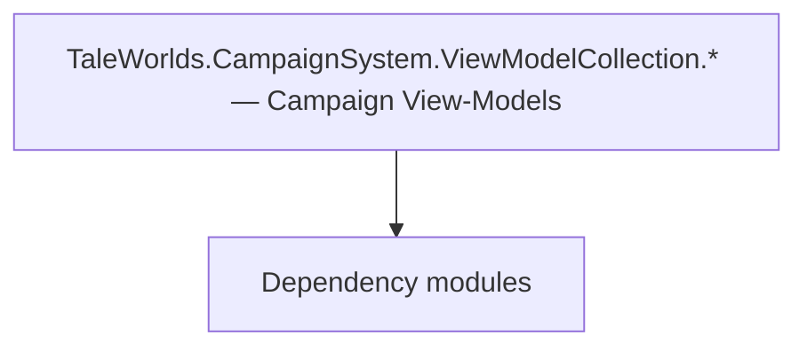

# TaleWorlds.CampaignSystem.ViewModelCollection.* — Campaign View-Models

**One-line responsibility:** This page covers all 442 business types under `TaleWorlds.CampaignSystem.ViewModelCollection.* — Campaign View-Models` as a family index, giving each type its namespace, responsibility, and typical timing so you can browse by module instead of alphabetically.

## Mental Model

TaleWorlds.CampaignSystem.ViewModelCollection.* is the large set of view-models projecting campaign subsystems (clan management, kingdom, inventory, map notifications, character creation, encyclopedia, diplomacy, army, party, crafting) into bindable UI data. VMs are only state projections; commands should only trigger Actions/Behaviors.

## When to Use

To customize the data behind any campaign interface, derive from the relevant ViewModelCollection VM; collection VMs (map elements, nameplates) should virtualize and load on demand to control memory. Commands only trigger logic.

## Dependencies

The types under `TaleWorlds.CampaignSystem.ViewModelCollection.* — Campaign View-Models` depend on the following modules; missing any of them causes compile- or run-time failure.

- [ViewModel](../../core-extra/ViewModel)
- [Campaign](../../campaign/Campaign)
- [API Overview](../../_index)

## Type Catalog

| Type | Namespace | Purpose | Timing |
| --- | --- | --- | --- |
| `ActionCampaignOptionData` | TaleWorlds.CampaignSystem.ViewModelCollection | AI decision implementation that must be interruptible and serializable to support saving and undo. Search must be depth/time bounded to avoid stalls. | Campaign init |
| `BannerEditorVM` | TaleWorlds.CampaignSystem.ViewModelCollection | Gauntlet UI data view-model that exposes properties and commands to the interface, reacts to input and notifies refreshes. A VM is only a projection of state; commands should only trigger Actions or Behaviors. | Campaign init |
| `BooleanCampaignOptionData` | TaleWorlds.CampaignSystem.ViewModelCollection | AI decision implementation that must be interruptible and serializable to support saving and undo. Search must be depth/time bounded to avoid stalls. | Campaign init |
| `CampaignOptionData` | TaleWorlds.CampaignSystem.ViewModelCollection | AI decision implementation that must be interruptible and serializable to support saving and undo. Search must be depth/time bounded to avoid stalls. | Campaign init |
| `CampaignOptionDataType` | TaleWorlds.CampaignSystem.ViewModelCollection | AI decision implementation that must be interruptible and serializable to support saving and undo. Search must be depth/time bounded to avoid stalls. | Campaign init |
| `CampaignOptionDisableStatus` | TaleWorlds.CampaignSystem.ViewModelCollection | AI decision implementation that must be interruptible and serializable to support saving and undo. Search must be depth/time bounded to avoid stalls. | Campaign init |
| `CampaignOptionEnableState` | TaleWorlds.CampaignSystem.ViewModelCollection | AI decision implementation that must be interruptible and serializable to support saving and undo. Search must be depth/time bounded to avoid stalls. | Campaign init |
| `CampaignOptionItemVM` | TaleWorlds.CampaignSystem.ViewModelCollection | Gauntlet UI data view-model that exposes properties and commands to the interface, reacts to input and notifies refreshes. A VM is only a projection of state; commands should only trigger Actions or Behaviors. | Campaign init |
| `CampaignOptionsControllerVM` | TaleWorlds.CampaignSystem.ViewModelCollection | Gauntlet UI data view-model that exposes properties and commands to the interface, reacts to input and notifies refreshes. A VM is only a projection of state; commands should only trigger Actions or Behaviors. | Campaign init |
| `CampaignOptionsDifficultyPresets` | TaleWorlds.CampaignSystem.ViewModelCollection | AI decision implementation that must be interruptible and serializable to support saving and undo. Search must be depth/time bounded to avoid stalls. | Campaign init |
| `CampaignOptionSelectorVM` | TaleWorlds.CampaignSystem.ViewModelCollection | Gauntlet UI data view-model that exposes properties and commands to the interface, reacts to input and notifies refreshes. A VM is only a projection of state; commands should only trigger Actions or Behaviors. | Campaign init |
| `CampaignOptionsManager` | TaleWorlds.CampaignSystem.ViewModelCollection | AI decision implementation that must be interruptible and serializable to support saving and undo. Search must be depth/time bounded to avoid stalls. | Campaign init |
| `CampaignOptionsVM` | TaleWorlds.CampaignSystem.ViewModelCollection | Gauntlet UI data view-model that exposes properties and commands to the interface, reacts to input and notifies refreshes. A VM is only a projection of state; commands should only trigger Actions or Behaviors. | Campaign init |
| `CampaignUIHelper` | TaleWorlds.CampaignSystem.ViewModelCollection | AI decision implementation that must be interruptible and serializable to support saving and undo. Search must be depth/time bounded to avoid stalls. | Campaign init |
| `CharacterAttributeComparer` | TaleWorlds.CampaignSystem.ViewModelCollection | A business type under this namespace that carries its derived convention responsibility. Confirm its lifecycle and owning system before calling; do not reference an unready instance at the wrong phase. World-state changes should go through the corresponding Action/Behavior, not direct field mutation. | Campaign init |
| `DefaultCampaignOptionsProvider` | TaleWorlds.CampaignSystem.ViewModelCollection | AI decision implementation that must be interruptible and serializable to support saving and undo. Search must be depth/time bounded to avoid stalls. | Campaign init |
| `HeroViewModel` | TaleWorlds.CampaignSystem.ViewModelCollection | Gauntlet UI data view-model that exposes properties and commands to the interface, reacts to input and notifies refreshes. A VM is only a projection of state; commands should only trigger Actions or Behaviors. | Campaign init |
| `HeroVM` | TaleWorlds.CampaignSystem.ViewModelCollection | Gauntlet UI data view-model that exposes properties and commands to the interface, reacts to input and notifies refreshes. A VM is only a projection of state; commands should only trigger Actions or Behaviors. | Campaign init |
| `ICampaignOptionData` | TaleWorlds.CampaignSystem.ViewModelCollection | AI decision implementation that must be interruptible and serializable to support saving and undo. Search must be depth/time bounded to avoid stalls. | Campaign init |
| `ICampaignOptionProvider` | TaleWorlds.CampaignSystem.ViewModelCollection | AI decision implementation that must be interruptible and serializable to support saving and undo. Search must be depth/time bounded to avoid stalls. | Campaign init |
| `IssueQuestFlags` | TaleWorlds.CampaignSystem.ViewModelCollection | Issue (lord/fief affair) related type describing an accept-and-settle fief problem. Completion must be idempotent. | Campaign init |
| `MobilePartyPrecedenceComparer` | TaleWorlds.CampaignSystem.ViewModelCollection | A business type under this namespace that carries its derived convention responsibility. Confirm its lifecycle and owning system before calling; do not reference an unready instance at the wrong phase. World-state changes should go through the corresponding Action/Behavior, not direct field mutation. | Campaign init |
| `NumericCampaignOptionData` | TaleWorlds.CampaignSystem.ViewModelCollection | AI decision implementation that must be interruptible and serializable to support saving and undo. Search must be depth/time bounded to avoid stalls. | Campaign init |
| `PlayerInspectedPartySpeedEvent` | TaleWorlds.CampaignSystem.ViewModelCollection | Event or event handler carrying the data of something that happened once. Remember to unsubscribe on unload to avoid leaks. | Campaign init |
| `ProductInputOutputEqualityComparer` | TaleWorlds.CampaignSystem.ViewModelCollection | A business type under this namespace that carries its derived convention responsibility. Confirm its lifecycle and owning system before calling; do not reference an unready instance at the wrong phase. World-state changes should go through the corresponding Action/Behavior, not direct field mutation. | Campaign init |
| `ProfitItemPropertyVM` | TaleWorlds.CampaignSystem.ViewModelCollection | Gauntlet UI data view-model that exposes properties and commands to the interface, reacts to input and notifies refreshes. A VM is only a projection of state; commands should only trigger Actions or Behaviors. | Campaign init |
| `PropertyType` | TaleWorlds.CampaignSystem.ViewModelCollection | A business type under this namespace that carries its derived convention responsibility. Confirm its lifecycle and owning system before calling; do not reference an unready instance at the wrong phase. World-state changes should go through the corresponding Action/Behavior, not direct field mutation. | Campaign init |
| `SelectableFiefItemPropertyVM` | TaleWorlds.CampaignSystem.ViewModelCollection | Gauntlet UI data view-model that exposes properties and commands to the interface, reacts to input and notifies refreshes. A VM is only a projection of state; commands should only trigger Actions or Behaviors. | Campaign init |
| `SelectableItemPropertyVM` | TaleWorlds.CampaignSystem.ViewModelCollection | Gauntlet UI data view-model that exposes properties and commands to the interface, reacts to input and notifies refreshes. A VM is only a projection of state; commands should only trigger Actions or Behaviors. | Campaign init |
| `SelectionCampaignOptionData` | TaleWorlds.CampaignSystem.ViewModelCollection | AI decision implementation that must be interruptible and serializable to support saving and undo. Search must be depth/time bounded to avoid stalls. | Campaign init |
| `SkillObjectComparer` | TaleWorlds.CampaignSystem.ViewModelCollection | A business type under this namespace that carries its derived convention responsibility. Confirm its lifecycle and owning system before calling; do not reference an unready instance at the wrong phase. World-state changes should go through the corresponding Action/Behavior, not direct field mutation. | Campaign init |
| `SortState` | TaleWorlds.CampaignSystem.ViewModelCollection | A business type under this namespace that carries its derived convention responsibility. Confirm its lifecycle and owning system before calling; do not reference an unready instance at the wrong phase. World-state changes should go through the corresponding Action/Behavior, not direct field mutation. | Campaign init |
| `TooltipRefresherCollection` | TaleWorlds.CampaignSystem.ViewModelCollection | A business type under this namespace that carries its derived convention responsibility. Confirm its lifecycle and owning system before calling; do not reference an unready instance at the wrong phase. World-state changes should go through the corresponding Action/Behavior, not direct field mutation. | Campaign init |
| `UIColors` | TaleWorlds.CampaignSystem.ViewModelCollection | A business type under this namespace that carries its derived convention responsibility. Confirm its lifecycle and owning system before calling; do not reference an unready instance at the wrong phase. World-state changes should go through the corresponding Action/Behavior, not direct field mutation. | Campaign init |
| `ArmyCohesionBoostedByPlayerEvent` | TaleWorlds.CampaignSystem.ViewModelCollection.ArmyManagement | Event or event handler carrying the data of something that happened once. Remember to unsubscribe on unload to avoid leaks. | Campaign init |
| `ArmyManagementBoostEventVM` | TaleWorlds.CampaignSystem.ViewModelCollection.ArmyManagement | Gauntlet UI data view-model that exposes properties and commands to the interface, reacts to input and notifies refreshes. A VM is only a projection of state; commands should only trigger Actions or Behaviors. | Campaign init |
| `ArmyManagementItemVM` | TaleWorlds.CampaignSystem.ViewModelCollection.ArmyManagement | Gauntlet UI data view-model that exposes properties and commands to the interface, reacts to input and notifies refreshes. A VM is only a projection of state; commands should only trigger Actions or Behaviors. | Campaign init |
| `ArmyManagementSortControllerVM` | TaleWorlds.CampaignSystem.ViewModelCollection.ArmyManagement | Gauntlet UI data view-model that exposes properties and commands to the interface, reacts to input and notifies refreshes. A VM is only a projection of state; commands should only trigger Actions or Behaviors. | Campaign init |
| `ArmyManagementVM` | TaleWorlds.CampaignSystem.ViewModelCollection.ArmyManagement | Gauntlet UI data view-model that exposes properties and commands to the interface, reacts to input and notifies refreshes. A VM is only a projection of state; commands should only trigger Actions or Behaviors. | Campaign init |
| `BoostCurrency` | TaleWorlds.CampaignSystem.ViewModelCollection.ArmyManagement | A business type under this namespace that carries its derived convention responsibility. Confirm its lifecycle and owning system before calling; do not reference an unready instance at the wrong phase. World-state changes should go through the corresponding Action/Behavior, not direct field mutation. | Campaign init |
| `ItemClanComparer` | TaleWorlds.CampaignSystem.ViewModelCollection.ArmyManagement | A business type under this namespace that carries its derived convention responsibility. Confirm its lifecycle and owning system before calling; do not reference an unready instance at the wrong phase. World-state changes should go through the corresponding Action/Behavior, not direct field mutation. | Campaign init |
| `ItemComparerBase` | TaleWorlds.CampaignSystem.ViewModelCollection.ArmyManagement | A business type under this namespace that carries its derived convention responsibility. Confirm its lifecycle and owning system before calling; do not reference an unready instance at the wrong phase. World-state changes should go through the corresponding Action/Behavior, not direct field mutation. | Campaign init |
| `ItemCostComparer` | TaleWorlds.CampaignSystem.ViewModelCollection.ArmyManagement | A business type under this namespace that carries its derived convention responsibility. Confirm its lifecycle and owning system before calling; do not reference an unready instance at the wrong phase. World-state changes should go through the corresponding Action/Behavior, not direct field mutation. | Campaign init |
| `ItemDistanceComparer` | TaleWorlds.CampaignSystem.ViewModelCollection.ArmyManagement | A business type under this namespace that carries its derived convention responsibility. Confirm its lifecycle and owning system before calling; do not reference an unready instance at the wrong phase. World-state changes should go through the corresponding Action/Behavior, not direct field mutation. | Campaign init |
| `ItemNameComparer` | TaleWorlds.CampaignSystem.ViewModelCollection.ArmyManagement | A business type under this namespace that carries its derived convention responsibility. Confirm its lifecycle and owning system before calling; do not reference an unready instance at the wrong phase. World-state changes should go through the corresponding Action/Behavior, not direct field mutation. | Campaign init |
| `ItemShipCountComparer` | TaleWorlds.CampaignSystem.ViewModelCollection.ArmyManagement | A business type under this namespace that carries its derived convention responsibility. Confirm its lifecycle and owning system before calling; do not reference an unready instance at the wrong phase. World-state changes should go through the corresponding Action/Behavior, not direct field mutation. | Campaign init |
| `ItemStrengthComparer` | TaleWorlds.CampaignSystem.ViewModelCollection.ArmyManagement | A business type under this namespace that carries its derived convention responsibility. Confirm its lifecycle and owning system before calling; do not reference an unready instance at the wrong phase. World-state changes should go through the corresponding Action/Behavior, not direct field mutation. | Campaign init |
| `ManagementItemComparer` | TaleWorlds.CampaignSystem.ViewModelCollection.ArmyManagement | A business type under this namespace that carries its derived convention responsibility. Confirm its lifecycle and owning system before calling; do not reference an unready instance at the wrong phase. World-state changes should go through the corresponding Action/Behavior, not direct field mutation. | Campaign init |
| `PartyAddedToArmyByPlayerEvent` | TaleWorlds.CampaignSystem.ViewModelCollection.ArmyManagement | Event or event handler carrying the data of something that happened once. Remember to unsubscribe on unload to avoid leaks. | Campaign init |
| `BarterItemVM` | TaleWorlds.CampaignSystem.ViewModelCollection.Barter | Gauntlet UI data view-model that exposes properties and commands to the interface, reacts to input and notifies refreshes. A VM is only a projection of state; commands should only trigger Actions or Behaviors. | Campaign init |
| `BarterVM` | TaleWorlds.CampaignSystem.ViewModelCollection.Barter | Gauntlet UI data view-model that exposes properties and commands to the interface, reacts to input and notifies refreshes. A VM is only a projection of state; commands should only trigger Actions or Behaviors. | Campaign init |
| `BirthAndDeathOptionsProvider` | TaleWorlds.CampaignSystem.ViewModelCollection.BirthAndDeath | Gauntlet image-source abstraction that resolves an entity/concept into an actual texture and caches it. The first frame may be empty; handle the loading state. | Campaign init |
| `BirthAndDeathSubModule` | TaleWorlds.CampaignSystem.ViewModelCollection.BirthAndDeath | Module entry base class that registers behaviors and override points. Its lifetime spans the whole session; do not fetch systems that are not yet ready (e.g. before loading) at the wrong phase. | Campaign init |
| `CharacterCreationClanNamingStageVM` | TaleWorlds.CampaignSystem.ViewModelCollection.CharacterCreation | Gauntlet UI data view-model that exposes properties and commands to the interface, reacts to input and notifies refreshes. A VM is only a projection of state; commands should only trigger Actions or Behaviors. | Campaign init |
| `CharacterCreationCultureFeatVM` | TaleWorlds.CampaignSystem.ViewModelCollection.CharacterCreation | Gauntlet UI data view-model that exposes properties and commands to the interface, reacts to input and notifies refreshes. A VM is only a projection of state; commands should only trigger Actions or Behaviors. | Campaign init |
| `CharacterCreationCultureStageVM` | TaleWorlds.CampaignSystem.ViewModelCollection.CharacterCreation | Gauntlet UI data view-model that exposes properties and commands to the interface, reacts to input and notifies refreshes. A VM is only a projection of state; commands should only trigger Actions or Behaviors. | Campaign init |
| `CharacterCreationCultureVM` | TaleWorlds.CampaignSystem.ViewModelCollection.CharacterCreation | Gauntlet UI data view-model that exposes properties and commands to the interface, reacts to input and notifies refreshes. A VM is only a projection of state; commands should only trigger Actions or Behaviors. | Campaign init |
| `CharacterCreationGainedAttributeItemVM` | TaleWorlds.CampaignSystem.ViewModelCollection.CharacterCreation | Gauntlet UI data view-model that exposes properties and commands to the interface, reacts to input and notifies refreshes. A VM is only a projection of state; commands should only trigger Actions or Behaviors. | Campaign init |
| `CharacterCreationGainedPropertiesVM` | TaleWorlds.CampaignSystem.ViewModelCollection.CharacterCreation | Gauntlet UI data view-model that exposes properties and commands to the interface, reacts to input and notifies refreshes. A VM is only a projection of state; commands should only trigger Actions or Behaviors. | Campaign init |
| `CharacterCreationGainedSkillItemVM` | TaleWorlds.CampaignSystem.ViewModelCollection.CharacterCreation | Gauntlet UI data view-model that exposes properties and commands to the interface, reacts to input and notifies refreshes. A VM is only a projection of state; commands should only trigger Actions or Behaviors. | Campaign init |
| `CharacterCreationGainGroupItemVM` | TaleWorlds.CampaignSystem.ViewModelCollection.CharacterCreation | Gauntlet UI data view-model that exposes properties and commands to the interface, reacts to input and notifies refreshes. A VM is only a projection of state; commands should only trigger Actions or Behaviors. | Campaign init |
| `CharacterCreationNarrativeStageVM` | TaleWorlds.CampaignSystem.ViewModelCollection.CharacterCreation | Gauntlet UI data view-model that exposes properties and commands to the interface, reacts to input and notifies refreshes. A VM is only a projection of state; commands should only trigger Actions or Behaviors. | Campaign init |
| `CharacterCreationOptionVM` | TaleWorlds.CampaignSystem.ViewModelCollection.CharacterCreation | Gauntlet UI data view-model that exposes properties and commands to the interface, reacts to input and notifies refreshes. A VM is only a projection of state; commands should only trigger Actions or Behaviors. | Campaign init |
| `CharacterCreationReviewStageItemVM` | TaleWorlds.CampaignSystem.ViewModelCollection.CharacterCreation | Gauntlet UI data view-model that exposes properties and commands to the interface, reacts to input and notifies refreshes. A VM is only a projection of state; commands should only trigger Actions or Behaviors. | Campaign init |
| `CharacterCreationReviewStageVM` | TaleWorlds.CampaignSystem.ViewModelCollection.CharacterCreation | Gauntlet UI data view-model that exposes properties and commands to the interface, reacts to input and notifies refreshes. A VM is only a projection of state; commands should only trigger Actions or Behaviors. | Campaign init |
| `CharacterCreationStageBaseVM` | TaleWorlds.CampaignSystem.ViewModelCollection.CharacterCreation | Gauntlet UI data view-model that exposes properties and commands to the interface, reacts to input and notifies refreshes. A VM is only a projection of state; commands should only trigger Actions or Behaviors. | Campaign init |
| `CharacterCreationOptionsStageVM` | TaleWorlds.CampaignSystem.ViewModelCollection.CharacterCreation.OptionsStage | Gauntlet UI data view-model that exposes properties and commands to the interface, reacts to input and notifies refreshes. A VM is only a projection of state; commands should only trigger Actions or Behaviors. | Campaign init |
| `AttributeBoundSkillItemVM` | TaleWorlds.CampaignSystem.ViewModelCollection.CharacterDeveloper | Gauntlet UI data view-model that exposes properties and commands to the interface, reacts to input and notifies refreshes. A VM is only a projection of state; commands should only trigger Actions or Behaviors. | Campaign init |
| `CharacterAttributeItemVM` | TaleWorlds.CampaignSystem.ViewModelCollection.CharacterDeveloper | Gauntlet UI data view-model that exposes properties and commands to the interface, reacts to input and notifies refreshes. A VM is only a projection of state; commands should only trigger Actions or Behaviors. | Campaign init |
| `CharacterDeveloperHeroItemVM` | TaleWorlds.CampaignSystem.ViewModelCollection.CharacterDeveloper | Gauntlet UI data view-model that exposes properties and commands to the interface, reacts to input and notifies refreshes. A VM is only a projection of state; commands should only trigger Actions or Behaviors. | Campaign init |
| `CharacterDeveloperVM` | TaleWorlds.CampaignSystem.ViewModelCollection.CharacterDeveloper | Gauntlet UI data view-model that exposes properties and commands to the interface, reacts to input and notifies refreshes. A VM is only a projection of state; commands should only trigger Actions or Behaviors. | Campaign init |
| `FocusAddedByPlayerEvent` | TaleWorlds.CampaignSystem.ViewModelCollection.CharacterDeveloper | Event or event handler carrying the data of something that happened once. Remember to unsubscribe on unload to avoid leaks. | Campaign init |
| `PerkAlternativeType` | TaleWorlds.CampaignSystem.ViewModelCollection.CharacterDeveloper | A business type under this namespace that carries its derived convention responsibility. Confirm its lifecycle and owning system before calling; do not reference an unready instance at the wrong phase. World-state changes should go through the corresponding Action/Behavior, not direct field mutation. | Campaign init |
| `PerkStates` | TaleWorlds.CampaignSystem.ViewModelCollection.CharacterDeveloper | A business type under this namespace that carries its derived convention responsibility. Confirm its lifecycle and owning system before calling; do not reference an unready instance at the wrong phase. World-state changes should go through the corresponding Action/Behavior, not direct field mutation. | Campaign init |
| `PerkVM` | TaleWorlds.CampaignSystem.ViewModelCollection.CharacterDeveloper | Gauntlet UI data view-model that exposes properties and commands to the interface, reacts to input and notifies refreshes. A VM is only a projection of state; commands should only trigger Actions or Behaviors. | Campaign init |
| `SkillVM` | TaleWorlds.CampaignSystem.ViewModelCollection.CharacterDeveloper | Gauntlet UI data view-model that exposes properties and commands to the interface, reacts to input and notifies refreshes. A VM is only a projection of state; commands should only trigger Actions or Behaviors. | Campaign init |
| `PerkSelectedByPlayerEvent` | TaleWorlds.CampaignSystem.ViewModelCollection.CharacterDeveloper.PerkSelection | Event or event handler carrying the data of something that happened once. Remember to unsubscribe on unload to avoid leaks. | Campaign init |
| `PerkSelectionItemVM` | TaleWorlds.CampaignSystem.ViewModelCollection.CharacterDeveloper.PerkSelection | Gauntlet UI data view-model that exposes properties and commands to the interface, reacts to input and notifies refreshes. A VM is only a projection of state; commands should only trigger Actions or Behaviors. | Campaign init |
| `PerkSelectionToggleEvent` | TaleWorlds.CampaignSystem.ViewModelCollection.CharacterDeveloper.PerkSelection | Event or event handler carrying the data of something that happened once. Remember to unsubscribe on unload to avoid leaks. | Campaign init |
| `PerkSelectionVM` | TaleWorlds.CampaignSystem.ViewModelCollection.CharacterDeveloper.PerkSelection | Gauntlet UI data view-model that exposes properties and commands to the interface, reacts to input and notifies refreshes. A VM is only a projection of state; commands should only trigger Actions or Behaviors. | Campaign init |
| `CardSelectionItemSpriteType` | TaleWorlds.CampaignSystem.ViewModelCollection.ClanManagement | Election / voting mechanism used for collective decisions such as kingdom votes. Mind voting timing and tie handling. | Campaign init |
| `ClanCardSelectionInfo` | TaleWorlds.CampaignSystem.ViewModelCollection.ClanManagement | Election / voting mechanism used for collective decisions such as kingdom votes. Mind voting timing and tie handling. | Campaign init |
| `ClanCardSelectionItemInfo` | TaleWorlds.CampaignSystem.ViewModelCollection.ClanManagement | Election / voting mechanism used for collective decisions such as kingdom votes. Mind voting timing and tie handling. | Campaign init |
| `ClanCardSelectionItemPropertyInfo` | TaleWorlds.CampaignSystem.ViewModelCollection.ClanManagement | Election / voting mechanism used for collective decisions such as kingdom votes. Mind voting timing and tie handling. | Campaign init |
| `ClanCardSelectionPopupItemPropertyVM` | TaleWorlds.CampaignSystem.ViewModelCollection.ClanManagement | Gauntlet UI data view-model that exposes properties and commands to the interface, reacts to input and notifies refreshes. A VM is only a projection of state; commands should only trigger Actions or Behaviors. | Campaign init |
| `ClanCardSelectionPopupItemVM` | TaleWorlds.CampaignSystem.ViewModelCollection.ClanManagement | Gauntlet UI data view-model that exposes properties and commands to the interface, reacts to input and notifies refreshes. A VM is only a projection of state; commands should only trigger Actions or Behaviors. | Campaign init |
| `ClanCardSelectionPopupVM` | TaleWorlds.CampaignSystem.ViewModelCollection.ClanManagement | Gauntlet UI data view-model that exposes properties and commands to the interface, reacts to input and notifies refreshes. A VM is only a projection of state; commands should only trigger Actions or Behaviors. | Campaign init |
| `ClanFinanceExpenseItemVM` | TaleWorlds.CampaignSystem.ViewModelCollection.ClanManagement | Gauntlet UI data view-model that exposes properties and commands to the interface, reacts to input and notifies refreshes. A VM is only a projection of state; commands should only trigger Actions or Behaviors. | Campaign init |
| `ClanFinanceIncomeItemBaseVM` | TaleWorlds.CampaignSystem.ViewModelCollection.ClanManagement | Gauntlet UI data view-model that exposes properties and commands to the interface, reacts to input and notifies refreshes. A VM is only a projection of state; commands should only trigger Actions or Behaviors. | Campaign init |
| `ClanLordItemVM` | TaleWorlds.CampaignSystem.ViewModelCollection.ClanManagement | Gauntlet UI data view-model that exposes properties and commands to the interface, reacts to input and notifies refreshes. A VM is only a projection of state; commands should only trigger Actions or Behaviors. | Campaign init |
| `ClanLordStatusItemVM` | TaleWorlds.CampaignSystem.ViewModelCollection.ClanManagement | Gauntlet UI data view-model that exposes properties and commands to the interface, reacts to input and notifies refreshes. A VM is only a projection of state; commands should only trigger Actions or Behaviors. | Campaign init |
| `ClanManagementVM` | TaleWorlds.CampaignSystem.ViewModelCollection.ClanManagement | Gauntlet UI data view-model that exposes properties and commands to the interface, reacts to input and notifies refreshes. A VM is only a projection of state; commands should only trigger Actions or Behaviors. | Campaign init |
| `ClanPartyBehaviorSelectorVM` | TaleWorlds.CampaignSystem.ViewModelCollection.ClanManagement | Gauntlet UI data view-model that exposes properties and commands to the interface, reacts to input and notifies refreshes. A VM is only a projection of state; commands should only trigger Actions or Behaviors. | Campaign init |
| `ClanPartyItemVM` | TaleWorlds.CampaignSystem.ViewModelCollection.ClanManagement | Gauntlet UI data view-model that exposes properties and commands to the interface, reacts to input and notifies refreshes. A VM is only a projection of state; commands should only trigger Actions or Behaviors. | Campaign init |
| `ClanPartyMemberItemVM` | TaleWorlds.CampaignSystem.ViewModelCollection.ClanManagement | Gauntlet UI data view-model that exposes properties and commands to the interface, reacts to input and notifies refreshes. A VM is only a projection of state; commands should only trigger Actions or Behaviors. | Campaign init |
| `ClanPartyType` | TaleWorlds.CampaignSystem.ViewModelCollection.ClanManagement | A business type under this namespace that carries its derived convention responsibility. Confirm its lifecycle and owning system before calling; do not reference an unready instance at the wrong phase. World-state changes should go through the corresponding Action/Behavior, not direct field mutation. | Campaign init |
| `ClanRoleAssignedThroughClanScreenEvent` | TaleWorlds.CampaignSystem.ViewModelCollection.ClanManagement | Event or event handler carrying the data of something that happened once. Remember to unsubscribe on unload to avoid leaks. | Campaign init |
| `ClanRoleItemVM` | TaleWorlds.CampaignSystem.ViewModelCollection.ClanManagement | Gauntlet UI data view-model that exposes properties and commands to the interface, reacts to input and notifies refreshes. A VM is only a projection of state; commands should only trigger Actions or Behaviors. | Campaign init |
| `ClanRoleMemberItemVM` | TaleWorlds.CampaignSystem.ViewModelCollection.ClanManagement | Gauntlet UI data view-model that exposes properties and commands to the interface, reacts to input and notifies refreshes. A VM is only a projection of state; commands should only trigger Actions or Behaviors. | Campaign init |
| `ClanSettlementItemVM` | TaleWorlds.CampaignSystem.ViewModelCollection.ClanManagement | Gauntlet UI data view-model that exposes properties and commands to the interface, reacts to input and notifies refreshes. A VM is only a projection of state; commands should only trigger Actions or Behaviors. | Campaign init |
| `IncomeTypes` | TaleWorlds.CampaignSystem.ViewModelCollection.ClanManagement | A business type under this namespace that carries its derived convention responsibility. Confirm its lifecycle and owning system before calling; do not reference an unready instance at the wrong phase. World-state changes should go through the corresponding Action/Behavior, not direct field mutation. | Campaign init |
| `LordStatus` | TaleWorlds.CampaignSystem.ViewModelCollection.ClanManagement | A business type under this namespace that carries its derived convention responsibility. Confirm its lifecycle and owning system before calling; do not reference an unready instance at the wrong phase. World-state changes should go through the corresponding Action/Behavior, not direct field mutation. | Campaign init |
| `TaxType` | TaleWorlds.CampaignSystem.ViewModelCollection.ClanManagement | A business type under this namespace that carries its derived convention responsibility. Confirm its lifecycle and owning system before calling; do not reference an unready instance at the wrong phase. World-state changes should go through the corresponding Action/Behavior, not direct field mutation. | Campaign init |
| `AlleyItemComparerBase` | TaleWorlds.CampaignSystem.ViewModelCollection.ClanManagement.Categories | A business type under this namespace that carries its derived convention responsibility. Confirm its lifecycle and owning system before calling; do not reference an unready instance at the wrong phase. World-state changes should go through the corresponding Action/Behavior, not direct field mutation. | Campaign init |
| `AlleyItemIncomeComparer` | TaleWorlds.CampaignSystem.ViewModelCollection.ClanManagement.Categories | A business type under this namespace that carries its derived convention responsibility. Confirm its lifecycle and owning system before calling; do not reference an unready instance at the wrong phase. World-state changes should go through the corresponding Action/Behavior, not direct field mutation. | Campaign init |
| `AlleyItemLocationComparer` | TaleWorlds.CampaignSystem.ViewModelCollection.ClanManagement.Categories | A business type under this namespace that carries its derived convention responsibility. Confirm its lifecycle and owning system before calling; do not reference an unready instance at the wrong phase. World-state changes should go through the corresponding Action/Behavior, not direct field mutation. | Campaign init |
| `AlleyItemNameComparer` | TaleWorlds.CampaignSystem.ViewModelCollection.ClanManagement.Categories | A business type under this namespace that carries its derived convention responsibility. Confirm its lifecycle and owning system before calling; do not reference an unready instance at the wrong phase. World-state changes should go through the corresponding Action/Behavior, not direct field mutation. | Campaign init |
| `ClanFiefsSortControllerVM` | TaleWorlds.CampaignSystem.ViewModelCollection.ClanManagement.Categories | Gauntlet UI data view-model that exposes properties and commands to the interface, reacts to input and notifies refreshes. A VM is only a projection of state; commands should only trigger Actions or Behaviors. | Campaign init |
| `ClanFiefsVM` | TaleWorlds.CampaignSystem.ViewModelCollection.ClanManagement.Categories | Gauntlet UI data view-model that exposes properties and commands to the interface, reacts to input and notifies refreshes. A VM is only a projection of state; commands should only trigger Actions or Behaviors. | Campaign init |
| `ClanIncomeSortControllerVM` | TaleWorlds.CampaignSystem.ViewModelCollection.ClanManagement.Categories | Gauntlet UI data view-model that exposes properties and commands to the interface, reacts to input and notifies refreshes. A VM is only a projection of state; commands should only trigger Actions or Behaviors. | Campaign init |
| `ClanIncomeVM` | TaleWorlds.CampaignSystem.ViewModelCollection.ClanManagement.Categories | Gauntlet UI data view-model that exposes properties and commands to the interface, reacts to input and notifies refreshes. A VM is only a projection of state; commands should only trigger Actions or Behaviors. | Campaign init |
| `ClanMembersSortControllerVM` | TaleWorlds.CampaignSystem.ViewModelCollection.ClanManagement.Categories | Gauntlet UI data view-model that exposes properties and commands to the interface, reacts to input and notifies refreshes. A VM is only a projection of state; commands should only trigger Actions or Behaviors. | Campaign init |
| `ClanMembersVM` | TaleWorlds.CampaignSystem.ViewModelCollection.ClanManagement.Categories | Gauntlet UI data view-model that exposes properties and commands to the interface, reacts to input and notifies refreshes. A VM is only a projection of state; commands should only trigger Actions or Behaviors. | Campaign init |
| `ClanPartiesSortControllerVM` | TaleWorlds.CampaignSystem.ViewModelCollection.ClanManagement.Categories | Gauntlet UI data view-model that exposes properties and commands to the interface, reacts to input and notifies refreshes. A VM is only a projection of state; commands should only trigger Actions or Behaviors. | Campaign init |
| `ClanPartiesVM` | TaleWorlds.CampaignSystem.ViewModelCollection.ClanManagement.Categories | Gauntlet UI data view-model that exposes properties and commands to the interface, reacts to input and notifies refreshes. A VM is only a projection of state; commands should only trigger Actions or Behaviors. | Campaign init |
| `ItemComparerBase` | TaleWorlds.CampaignSystem.ViewModelCollection.ClanManagement.Categories | A business type under this namespace that carries its derived convention responsibility. Confirm its lifecycle and owning system before calling; do not reference an unready instance at the wrong phase. World-state changes should go through the corresponding Action/Behavior, not direct field mutation. | Campaign init |
| `ItemGovernorComparer` | TaleWorlds.CampaignSystem.ViewModelCollection.ClanManagement.Categories | A business type under this namespace that carries its derived convention responsibility. Confirm its lifecycle and owning system before calling; do not reference an unready instance at the wrong phase. World-state changes should go through the corresponding Action/Behavior, not direct field mutation. | Campaign init |
| `ItemLocationComparer` | TaleWorlds.CampaignSystem.ViewModelCollection.ClanManagement.Categories | A business type under this namespace that carries its derived convention responsibility. Confirm its lifecycle and owning system before calling; do not reference an unready instance at the wrong phase. World-state changes should go through the corresponding Action/Behavior, not direct field mutation. | Campaign init |
| `ItemNameComparer` | TaleWorlds.CampaignSystem.ViewModelCollection.ClanManagement.Categories | A business type under this namespace that carries its derived convention responsibility. Confirm its lifecycle and owning system before calling; do not reference an unready instance at the wrong phase. World-state changes should go through the corresponding Action/Behavior, not direct field mutation. | Campaign init |
| `ItemProfitComparer` | TaleWorlds.CampaignSystem.ViewModelCollection.ClanManagement.Categories | A business type under this namespace that carries its derived convention responsibility. Confirm its lifecycle and owning system before calling; do not reference an unready instance at the wrong phase. World-state changes should go through the corresponding Action/Behavior, not direct field mutation. | Campaign init |
| `ItemShipCountComparer` | TaleWorlds.CampaignSystem.ViewModelCollection.ClanManagement.Categories | A business type under this namespace that carries its derived convention responsibility. Confirm its lifecycle and owning system before calling; do not reference an unready instance at the wrong phase. World-state changes should go through the corresponding Action/Behavior, not direct field mutation. | Campaign init |
| `ItemSizeComparer` | TaleWorlds.CampaignSystem.ViewModelCollection.ClanManagement.Categories | A business type under this namespace that carries its derived convention responsibility. Confirm its lifecycle and owning system before calling; do not reference an unready instance at the wrong phase. World-state changes should go through the corresponding Action/Behavior, not direct field mutation. | Campaign init |
| `SupporterItemComparerBase` | TaleWorlds.CampaignSystem.ViewModelCollection.ClanManagement.Categories | A business type under this namespace that carries its derived convention responsibility. Confirm its lifecycle and owning system before calling; do not reference an unready instance at the wrong phase. World-state changes should go through the corresponding Action/Behavior, not direct field mutation. | Campaign init |
| `SupporterItemIncomeComparer` | TaleWorlds.CampaignSystem.ViewModelCollection.ClanManagement.Categories | A business type under this namespace that carries its derived convention responsibility. Confirm its lifecycle and owning system before calling; do not reference an unready instance at the wrong phase. World-state changes should go through the corresponding Action/Behavior, not direct field mutation. | Campaign init |
| `SupporterItemNameComparer` | TaleWorlds.CampaignSystem.ViewModelCollection.ClanManagement.Categories | A business type under this namespace that carries its derived convention responsibility. Confirm its lifecycle and owning system before calling; do not reference an unready instance at the wrong phase. World-state changes should go through the corresponding Action/Behavior, not direct field mutation. | Campaign init |
| `WorkshopItemComparerBase` | TaleWorlds.CampaignSystem.ViewModelCollection.ClanManagement.Categories | A business type under this namespace that carries its derived convention responsibility. Confirm its lifecycle and owning system before calling; do not reference an unready instance at the wrong phase. World-state changes should go through the corresponding Action/Behavior, not direct field mutation. | Campaign init |
| `WorkshopItemIncomeComparer` | TaleWorlds.CampaignSystem.ViewModelCollection.ClanManagement.Categories | A business type under this namespace that carries its derived convention responsibility. Confirm its lifecycle and owning system before calling; do not reference an unready instance at the wrong phase. World-state changes should go through the corresponding Action/Behavior, not direct field mutation. | Campaign init |
| `WorkshopItemLocationComparer` | TaleWorlds.CampaignSystem.ViewModelCollection.ClanManagement.Categories | A business type under this namespace that carries its derived convention responsibility. Confirm its lifecycle and owning system before calling; do not reference an unready instance at the wrong phase. World-state changes should go through the corresponding Action/Behavior, not direct field mutation. | Campaign init |
| `WorkshopItemNameComparer` | TaleWorlds.CampaignSystem.ViewModelCollection.ClanManagement.Categories | A business type under this namespace that carries its derived convention responsibility. Confirm its lifecycle and owning system before calling; do not reference an unready instance at the wrong phase. World-state changes should go through the corresponding Action/Behavior, not direct field mutation. | Campaign init |
| `ClanFinanceAlleyItemVM` | TaleWorlds.CampaignSystem.ViewModelCollection.ClanManagement.ClanFinance | Gauntlet UI data view-model that exposes properties and commands to the interface, reacts to input and notifies refreshes. A VM is only a projection of state; commands should only trigger Actions or Behaviors. | Campaign init |
| `ClanFinanceCommonAreaItemVM` | TaleWorlds.CampaignSystem.ViewModelCollection.ClanManagement.ClanFinance | Gauntlet UI data view-model that exposes properties and commands to the interface, reacts to input and notifies refreshes. A VM is only a projection of state; commands should only trigger Actions or Behaviors. | Campaign init |
| `ClanFinanceMercenaryItemVM` | TaleWorlds.CampaignSystem.ViewModelCollection.ClanManagement.ClanFinance | Gauntlet UI data view-model that exposes properties and commands to the interface, reacts to input and notifies refreshes. A VM is only a projection of state; commands should only trigger Actions or Behaviors. | Campaign init |
| `ClanFinanceTownItemVM` | TaleWorlds.CampaignSystem.ViewModelCollection.ClanManagement.ClanFinance | Gauntlet UI data view-model that exposes properties and commands to the interface, reacts to input and notifies refreshes. A VM is only a projection of state; commands should only trigger Actions or Behaviors. | Campaign init |
| `ClanFinanceWorkshopItemVM` | TaleWorlds.CampaignSystem.ViewModelCollection.ClanManagement.ClanFinance | Gauntlet UI data view-model that exposes properties and commands to the interface, reacts to input and notifies refreshes. A VM is only a projection of state; commands should only trigger Actions or Behaviors. | Campaign init |
| `WorkshopPercentageSelectorItemVM` | TaleWorlds.CampaignSystem.ViewModelCollection.ClanManagement.ClanFinance | Gauntlet UI data view-model that exposes properties and commands to the interface, reacts to input and notifies refreshes. A VM is only a projection of state; commands should only trigger Actions or Behaviors. | Campaign init |
| `ClanSupporterGroupVM` | TaleWorlds.CampaignSystem.ViewModelCollection.ClanManagement.Supporters | Gauntlet UI data view-model that exposes properties and commands to the interface, reacts to input and notifies refreshes. A VM is only a projection of state; commands should only trigger Actions or Behaviors. | Campaign init |
| `ClanSupporterItemVM` | TaleWorlds.CampaignSystem.ViewModelCollection.ClanManagement.Supporters | Gauntlet UI data view-model that exposes properties and commands to the interface, reacts to input and notifies refreshes. A VM is only a projection of state; commands should only trigger Actions or Behaviors. | Campaign init |
| `ConversationAggressivePartyItemVM` | TaleWorlds.CampaignSystem.ViewModelCollection.Conversation | Gauntlet UI data view-model that exposes properties and commands to the interface, reacts to input and notifies refreshes. A VM is only a projection of state; commands should only trigger Actions or Behaviors. | Campaign init |
| `ConversationItemVM` | TaleWorlds.CampaignSystem.ViewModelCollection.Conversation | Gauntlet UI data view-model that exposes properties and commands to the interface, reacts to input and notifies refreshes. A VM is only a projection of state; commands should only trigger Actions or Behaviors. | Campaign init |
| `MissionConversationVM` | TaleWorlds.CampaignSystem.ViewModelCollection.Conversation | Gauntlet UI data view-model that exposes properties and commands to the interface, reacts to input and notifies refreshes. A VM is only a projection of state; commands should only trigger Actions or Behaviors. | Campaign init |
| `PersuasionOptionVM` | TaleWorlds.CampaignSystem.ViewModelCollection.Conversation | Gauntlet UI data view-model that exposes properties and commands to the interface, reacts to input and notifies refreshes. A VM is only a projection of state; commands should only trigger Actions or Behaviors. | Campaign init |
| `PersuasionVM` | TaleWorlds.CampaignSystem.ViewModelCollection.Conversation | Gauntlet UI data view-model that exposes properties and commands to the interface, reacts to input and notifies refreshes. A VM is only a projection of state; commands should only trigger Actions or Behaviors. | Campaign init |
| `EducationGainedAttributeItemVM` | TaleWorlds.CampaignSystem.ViewModelCollection.Education | Gauntlet UI data view-model that exposes properties and commands to the interface, reacts to input and notifies refreshes. A VM is only a projection of state; commands should only trigger Actions or Behaviors. | Campaign init |
| `EducationGainedPropertiesVM` | TaleWorlds.CampaignSystem.ViewModelCollection.Education | Gauntlet UI data view-model that exposes properties and commands to the interface, reacts to input and notifies refreshes. A VM is only a projection of state; commands should only trigger Actions or Behaviors. | Campaign init |
| `EducationGainedSkillItemVM` | TaleWorlds.CampaignSystem.ViewModelCollection.Education | Gauntlet UI data view-model that exposes properties and commands to the interface, reacts to input and notifies refreshes. A VM is only a projection of state; commands should only trigger Actions or Behaviors. | Campaign init |
| `EducationGainGroupItemVM` | TaleWorlds.CampaignSystem.ViewModelCollection.Education | Gauntlet UI data view-model that exposes properties and commands to the interface, reacts to input and notifies refreshes. A VM is only a projection of state; commands should only trigger Actions or Behaviors. | Campaign init |
| `EducationOptionVM` | TaleWorlds.CampaignSystem.ViewModelCollection.Education | Gauntlet UI data view-model that exposes properties and commands to the interface, reacts to input and notifies refreshes. A VM is only a projection of state; commands should only trigger Actions or Behaviors. | Campaign init |
| `EducationReviewItemVM` | TaleWorlds.CampaignSystem.ViewModelCollection.Education | Gauntlet UI data view-model that exposes properties and commands to the interface, reacts to input and notifies refreshes. A VM is only a projection of state; commands should only trigger Actions or Behaviors. | Campaign init |
| `EducationReviewVM` | TaleWorlds.CampaignSystem.ViewModelCollection.Education | Gauntlet UI data view-model that exposes properties and commands to the interface, reacts to input and notifies refreshes. A VM is only a projection of state; commands should only trigger Actions or Behaviors. | Campaign init |
| `EducationVM` | TaleWorlds.CampaignSystem.ViewModelCollection.Education | Gauntlet UI data view-model that exposes properties and commands to the interface, reacts to input and notifies refreshes. A VM is only a projection of state; commands should only trigger Actions or Behaviors. | Campaign init |
| `DescriptionType` | TaleWorlds.CampaignSystem.ViewModelCollection.Encyclopedia | A business type under this namespace that carries its derived convention responsibility. Confirm its lifecycle and owning system before calling; do not reference an unready instance at the wrong phase. World-state changes should go through the corresponding Action/Behavior, not direct field mutation. | Campaign init |
| `EncyclopediaHomeVM` | TaleWorlds.CampaignSystem.ViewModelCollection.Encyclopedia | Gauntlet UI data view-model that exposes properties and commands to the interface, reacts to input and notifies refreshes. A VM is only a projection of state; commands should only trigger Actions or Behaviors. | Campaign init |
| `EncyclopediaLinkVM` | TaleWorlds.CampaignSystem.ViewModelCollection.Encyclopedia | Gauntlet UI data view-model that exposes properties and commands to the interface, reacts to input and notifies refreshes. A VM is only a projection of state; commands should only trigger Actions or Behaviors. | Campaign init |
| `EncyclopediaNavigatorVM` | TaleWorlds.CampaignSystem.ViewModelCollection.Encyclopedia | Gauntlet UI data view-model that exposes properties and commands to the interface, reacts to input and notifies refreshes. A VM is only a projection of state; commands should only trigger Actions or Behaviors. | Campaign init |
| `EncyclopediaPageChangedEvent` | TaleWorlds.CampaignSystem.ViewModelCollection.Encyclopedia | Event or event handler carrying the data of something that happened once. Remember to unsubscribe on unload to avoid leaks. | Campaign init |
| `EncyclopediaPages` | TaleWorlds.CampaignSystem.ViewModelCollection.Encyclopedia | A business type under this namespace that carries its derived convention responsibility. Confirm its lifecycle and owning system before calling; do not reference an unready instance at the wrong phase. World-state changes should go through the corresponding Action/Behavior, not direct field mutation. | Campaign init |
| `EncyclopediaSearchResultVM` | TaleWorlds.CampaignSystem.ViewModelCollection.Encyclopedia | Gauntlet UI data view-model that exposes properties and commands to the interface, reacts to input and notifies refreshes. A VM is only a projection of state; commands should only trigger Actions or Behaviors. | Campaign init |
| `EncyclopediaSettlementPageStatItemVM` | TaleWorlds.CampaignSystem.ViewModelCollection.Encyclopedia | Gauntlet UI data view-model that exposes properties and commands to the interface, reacts to input and notifies refreshes. A VM is only a projection of state; commands should only trigger Actions or Behaviors. | Campaign init |
| `OnEncyclopediaFilterActivatedEvent` | TaleWorlds.CampaignSystem.ViewModelCollection.Encyclopedia | Event or event handler carrying the data of something that happened once. Remember to unsubscribe on unload to avoid leaks. | Campaign init |
| `OnEncyclopediaListSortedEvent` | TaleWorlds.CampaignSystem.ViewModelCollection.Encyclopedia | Event or event handler carrying the data of something that happened once. Remember to unsubscribe on unload to avoid leaks. | Campaign init |
| `OnEncyclopediaSearchActivatedEvent` | TaleWorlds.CampaignSystem.ViewModelCollection.Encyclopedia | Event or event handler carrying the data of something that happened once. Remember to unsubscribe on unload to avoid leaks. | Campaign init |
| `PlayerToggleTrackSettlementFromEncyclopediaEvent` | TaleWorlds.CampaignSystem.ViewModelCollection.Encyclopedia | Event or event handler carrying the data of something that happened once. Remember to unsubscribe on unload to avoid leaks. | Campaign init |
| `EncyclopediaDwellingVM` | TaleWorlds.CampaignSystem.ViewModelCollection.Encyclopedia.Items | Gauntlet UI data view-model that exposes properties and commands to the interface, reacts to input and notifies refreshes. A VM is only a projection of state; commands should only trigger Actions or Behaviors. | Campaign init |
| `EncyclopediaFactionVM` | TaleWorlds.CampaignSystem.ViewModelCollection.Encyclopedia.Items | Gauntlet UI data view-model that exposes properties and commands to the interface, reacts to input and notifies refreshes. A VM is only a projection of state; commands should only trigger Actions or Behaviors. | Campaign init |
| `EncyclopediaFamilyMemberVM` | TaleWorlds.CampaignSystem.ViewModelCollection.Encyclopedia.Items | Gauntlet UI data view-model that exposes properties and commands to the interface, reacts to input and notifies refreshes. A VM is only a projection of state; commands should only trigger Actions or Behaviors. | Campaign init |
| `EncyclopediaHistoryEventVM` | TaleWorlds.CampaignSystem.ViewModelCollection.Encyclopedia.Items | Gauntlet UI data view-model that exposes properties and commands to the interface, reacts to input and notifies refreshes. A VM is only a projection of state; commands should only trigger Actions or Behaviors. | Campaign init |
| `EncyclopediaSettlementVM` | TaleWorlds.CampaignSystem.ViewModelCollection.Encyclopedia.Items | Gauntlet UI data view-model that exposes properties and commands to the interface, reacts to input and notifies refreshes. A VM is only a projection of state; commands should only trigger Actions or Behaviors. | Campaign init |
| `EncyclopediaShipSlotVM` | TaleWorlds.CampaignSystem.ViewModelCollection.Encyclopedia.Items | Gauntlet UI data view-model that exposes properties and commands to the interface, reacts to input and notifies refreshes. A VM is only a projection of state; commands should only trigger Actions or Behaviors. | Campaign init |
| `EncyclopediaShipStatVM` | TaleWorlds.CampaignSystem.ViewModelCollection.Encyclopedia.Items | Gauntlet UI data view-model that exposes properties and commands to the interface, reacts to input and notifies refreshes. A VM is only a projection of state; commands should only trigger Actions or Behaviors. | Campaign init |
| `EncyclopediaSkillVM` | TaleWorlds.CampaignSystem.ViewModelCollection.Encyclopedia.Items | Gauntlet UI data view-model that exposes properties and commands to the interface, reacts to input and notifies refreshes. A VM is only a projection of state; commands should only trigger Actions or Behaviors. | Campaign init |
| `EncyclopediaTraitItemVM` | TaleWorlds.CampaignSystem.ViewModelCollection.Encyclopedia.Items | Gauntlet UI data view-model that exposes properties and commands to the interface, reacts to input and notifies refreshes. A VM is only a projection of state; commands should only trigger Actions or Behaviors. | Campaign init |
| `EncyclopediaTroopTreeNodeVM` | TaleWorlds.CampaignSystem.ViewModelCollection.Encyclopedia.Items | Gauntlet UI data view-model that exposes properties and commands to the interface, reacts to input and notifies refreshes. A VM is only a projection of state; commands should only trigger Actions or Behaviors. | Campaign init |
| `EncyclopediaUnitEquipmentSetSelectorItemVM` | TaleWorlds.CampaignSystem.ViewModelCollection.Encyclopedia.Items | Gauntlet UI data view-model that exposes properties and commands to the interface, reacts to input and notifies refreshes. A VM is only a projection of state; commands should only trigger Actions or Behaviors. | Campaign init |
| `EncyclopediaUnitVM` | TaleWorlds.CampaignSystem.ViewModelCollection.Encyclopedia.Items | Gauntlet UI data view-model that exposes properties and commands to the interface, reacts to input and notifies refreshes. A VM is only a projection of state; commands should only trigger Actions or Behaviors. | Campaign init |
| `EncyclopediaFilterGroupVM` | TaleWorlds.CampaignSystem.ViewModelCollection.Encyclopedia.List | Gauntlet UI data view-model that exposes properties and commands to the interface, reacts to input and notifies refreshes. A VM is only a projection of state; commands should only trigger Actions or Behaviors. | Campaign init |
| `EncyclopediaListFilterVM` | TaleWorlds.CampaignSystem.ViewModelCollection.Encyclopedia.List | Gauntlet UI data view-model that exposes properties and commands to the interface, reacts to input and notifies refreshes. A VM is only a projection of state; commands should only trigger Actions or Behaviors. | Campaign init |
| `EncyclopediaListItemComparer` | TaleWorlds.CampaignSystem.ViewModelCollection.Encyclopedia.List | A business type under this namespace that carries its derived convention responsibility. Confirm its lifecycle and owning system before calling; do not reference an unready instance at the wrong phase. World-state changes should go through the corresponding Action/Behavior, not direct field mutation. | Campaign init |
| `EncyclopediaListItemVM` | TaleWorlds.CampaignSystem.ViewModelCollection.Encyclopedia.List | Gauntlet UI data view-model that exposes properties and commands to the interface, reacts to input and notifies refreshes. A VM is only a projection of state; commands should only trigger Actions or Behaviors. | Campaign init |
| `EncyclopediaListSelectorItemVM` | TaleWorlds.CampaignSystem.ViewModelCollection.Encyclopedia.List | Gauntlet UI data view-model that exposes properties and commands to the interface, reacts to input and notifies refreshes. A VM is only a projection of state; commands should only trigger Actions or Behaviors. | Campaign init |
| `EncyclopediaListSelectorVM` | TaleWorlds.CampaignSystem.ViewModelCollection.Encyclopedia.List | Gauntlet UI data view-model that exposes properties and commands to the interface, reacts to input and notifies refreshes. A VM is only a projection of state; commands should only trigger Actions or Behaviors. | Campaign init |
| `EncyclopediaListSortControllerVM` | TaleWorlds.CampaignSystem.ViewModelCollection.Encyclopedia.List | Gauntlet UI data view-model that exposes properties and commands to the interface, reacts to input and notifies refreshes. A VM is only a projection of state; commands should only trigger Actions or Behaviors. | Campaign init |
| `EncyclopediaListVM` | TaleWorlds.CampaignSystem.ViewModelCollection.Encyclopedia.List | Gauntlet UI data view-model that exposes properties and commands to the interface, reacts to input and notifies refreshes. A VM is only a projection of state; commands should only trigger Actions or Behaviors. | Campaign init |
| `ListTypeVM` | TaleWorlds.CampaignSystem.ViewModelCollection.Encyclopedia.List | Gauntlet UI data view-model that exposes properties and commands to the interface, reacts to input and notifies refreshes. A VM is only a projection of state; commands should only trigger Actions or Behaviors. | Campaign init |
| `EncyclopediaClanPageVM` | TaleWorlds.CampaignSystem.ViewModelCollection.Encyclopedia.Pages | Gauntlet UI data view-model that exposes properties and commands to the interface, reacts to input and notifies refreshes. A VM is only a projection of state; commands should only trigger Actions or Behaviors. | Campaign init |
| `EncyclopediaConceptPageVM` | TaleWorlds.CampaignSystem.ViewModelCollection.Encyclopedia.Pages | Gauntlet UI data view-model that exposes properties and commands to the interface, reacts to input and notifies refreshes. A VM is only a projection of state; commands should only trigger Actions or Behaviors. | Campaign init |
| `EncyclopediaContentPageVM` | TaleWorlds.CampaignSystem.ViewModelCollection.Encyclopedia.Pages | Gauntlet UI data view-model that exposes properties and commands to the interface, reacts to input and notifies refreshes. A VM is only a projection of state; commands should only trigger Actions or Behaviors. | Campaign init |
| `EncyclopediaFactionPageVM` | TaleWorlds.CampaignSystem.ViewModelCollection.Encyclopedia.Pages | Gauntlet UI data view-model that exposes properties and commands to the interface, reacts to input and notifies refreshes. A VM is only a projection of state; commands should only trigger Actions or Behaviors. | Campaign init |
| `EncyclopediaHeroPageVM` | TaleWorlds.CampaignSystem.ViewModelCollection.Encyclopedia.Pages | Gauntlet UI data view-model that exposes properties and commands to the interface, reacts to input and notifies refreshes. A VM is only a projection of state; commands should only trigger Actions or Behaviors. | Campaign init |
| `EncyclopediaPageArgs` | TaleWorlds.CampaignSystem.ViewModelCollection.Encyclopedia.Pages | A business type under this namespace that carries its derived convention responsibility. Confirm its lifecycle and owning system before calling; do not reference an unready instance at the wrong phase. World-state changes should go through the corresponding Action/Behavior, not direct field mutation. | Campaign init |
| `EncyclopediaPageVM` | TaleWorlds.CampaignSystem.ViewModelCollection.Encyclopedia.Pages | Gauntlet UI data view-model that exposes properties and commands to the interface, reacts to input and notifies refreshes. A VM is only a projection of state; commands should only trigger Actions or Behaviors. | Campaign init |
| `EncyclopediaSettlementPageVM` | TaleWorlds.CampaignSystem.ViewModelCollection.Encyclopedia.Pages | Gauntlet UI data view-model that exposes properties and commands to the interface, reacts to input and notifies refreshes. A VM is only a projection of state; commands should only trigger Actions or Behaviors. | Campaign init |
| `EncyclopediaShipPageVM` | TaleWorlds.CampaignSystem.ViewModelCollection.Encyclopedia.Pages | Gauntlet UI data view-model that exposes properties and commands to the interface, reacts to input and notifies refreshes. A VM is only a projection of state; commands should only trigger Actions or Behaviors. | Campaign init |
| `EncyclopediaUnitPageVM` | TaleWorlds.CampaignSystem.ViewModelCollection.Encyclopedia.Pages | Gauntlet UI data view-model that exposes properties and commands to the interface, reacts to input and notifies refreshes. A VM is only a projection of state; commands should only trigger Actions or Behaviors. | Campaign init |
| `EncyclopediaViewModel` | TaleWorlds.CampaignSystem.ViewModelCollection.Encyclopedia.Pages | Gauntlet UI data view-model that exposes properties and commands to the interface, reacts to input and notifies refreshes. A VM is only a projection of state; commands should only trigger Actions or Behaviors. | Campaign init |
| `HeroAgeComparer` | TaleWorlds.CampaignSystem.ViewModelCollection.Encyclopedia.Pages | A business type under this namespace that carries its derived convention responsibility. Confirm its lifecycle and owning system before calling; do not reference an unready instance at the wrong phase. World-state changes should go through the corresponding Action/Behavior, not direct field mutation. | Campaign init |
| `HeroRelationComparer` | TaleWorlds.CampaignSystem.ViewModelCollection.Encyclopedia.Pages | A business type under this namespace that carries its derived convention responsibility. Confirm its lifecycle and owning system before calling; do not reference an unready instance at the wrong phase. World-state changes should go through the corresponding Action/Behavior, not direct field mutation. | Campaign init |
| `GameMenuItemCreationData` | TaleWorlds.CampaignSystem.ViewModelCollection.GameMenu | A business type under this namespace that carries its derived convention responsibility. Confirm its lifecycle and owning system before calling; do not reference an unready instance at the wrong phase. World-state changes should go through the corresponding Action/Behavior, not direct field mutation. | Campaign init |
| `GameMenuItemProgressVM` | TaleWorlds.CampaignSystem.ViewModelCollection.GameMenu | Gauntlet UI data view-model that exposes properties and commands to the interface, reacts to input and notifies refreshes. A VM is only a projection of state; commands should only trigger Actions or Behaviors. | Campaign init |
| `GameMenuItemVM` | TaleWorlds.CampaignSystem.ViewModelCollection.GameMenu | Gauntlet UI data view-model that exposes properties and commands to the interface, reacts to input and notifies refreshes. A VM is only a projection of state; commands should only trigger Actions or Behaviors. | Campaign init |
| `GameMenuPlunderItemVM` | TaleWorlds.CampaignSystem.ViewModelCollection.GameMenu | Gauntlet UI data view-model that exposes properties and commands to the interface, reacts to input and notifies refreshes. A VM is only a projection of state; commands should only trigger Actions or Behaviors. | Campaign init |
| `GameMenuVM` | TaleWorlds.CampaignSystem.ViewModelCollection.GameMenu | Gauntlet UI data view-model that exposes properties and commands to the interface, reacts to input and notifies refreshes. A VM is only a projection of state; commands should only trigger Actions or Behaviors. | Campaign init |
| `CrimeValueInspectedInSettlementOverlayEvent` | TaleWorlds.CampaignSystem.ViewModelCollection.GameMenu.Events | Event or event handler carrying the data of something that happened once. Remember to unsubscribe on unload to avoid leaks. | Campaign init |
| `PartyScreenCharacterTalkPermissionEvent` | TaleWorlds.CampaignSystem.ViewModelCollection.GameMenu.Events | Event or event handler carrying the data of something that happened once. Remember to unsubscribe on unload to avoid leaks. | Campaign init |
| `SettlementOverlayLeaveCharacterPermissionEvent` | TaleWorlds.CampaignSystem.ViewModelCollection.GameMenu.Events | Event or event handler carrying the data of something that happened once. Remember to unsubscribe on unload to avoid leaks. | Campaign init |
| `SettlementOverlayTalkPermissionEvent` | TaleWorlds.CampaignSystem.ViewModelCollection.GameMenu.Events | Event or event handler carrying the data of something that happened once. Remember to unsubscribe on unload to avoid leaks. | Campaign init |
| `SettlementOverylayQuickTalkPermissionEvent` | TaleWorlds.CampaignSystem.ViewModelCollection.GameMenu.Events | Event or event handler carrying the data of something that happened once. Remember to unsubscribe on unload to avoid leaks. | Campaign init |
| `ArmyMenuOverlayVM` | TaleWorlds.CampaignSystem.ViewModelCollection.GameMenu.Overlay | Gauntlet UI data view-model that exposes properties and commands to the interface, reacts to input and notifies refreshes. A VM is only a projection of state; commands should only trigger Actions or Behaviors. | Campaign init |
| `EncounterMenuOverlayVM` | TaleWorlds.CampaignSystem.ViewModelCollection.GameMenu.Overlay | Gauntlet UI data view-model that exposes properties and commands to the interface, reacts to input and notifies refreshes. A VM is only a projection of state; commands should only trigger Actions or Behaviors. | Campaign init |
| `GameMenuOverlay` | TaleWorlds.CampaignSystem.ViewModelCollection.GameMenu.Overlay | A business type under this namespace that carries its derived convention responsibility. Confirm its lifecycle and owning system before calling; do not reference an unready instance at the wrong phase. World-state changes should go through the corresponding Action/Behavior, not direct field mutation. | Campaign init |
| `GameMenuOverlayActionVM` | TaleWorlds.CampaignSystem.ViewModelCollection.GameMenu.Overlay | Gauntlet UI data view-model that exposes properties and commands to the interface, reacts to input and notifies refreshes. A VM is only a projection of state; commands should only trigger Actions or Behaviors. | Campaign init |
| `GameMenuOverlayFactory` | TaleWorlds.CampaignSystem.ViewModelCollection.GameMenu.Overlay | A business type under this namespace that carries its derived convention responsibility. Confirm its lifecycle and owning system before calling; do not reference an unready instance at the wrong phase. World-state changes should go through the corresponding Action/Behavior, not direct field mutation. | Campaign init |
| `GameMenuPartyItemVM` | TaleWorlds.CampaignSystem.ViewModelCollection.GameMenu.Overlay | Gauntlet UI data view-model that exposes properties and commands to the interface, reacts to input and notifies refreshes. A VM is only a projection of state; commands should only trigger Actions or Behaviors. | Campaign init |
| `IGameMenuOverlayProvider` | TaleWorlds.CampaignSystem.ViewModelCollection.GameMenu.Overlay | Gauntlet image-source abstraction that resolves an entity/concept into an actual texture and caches it. The first frame may be empty; handle the loading state. | Campaign init |
| `MenuOverlay` | TaleWorlds.CampaignSystem.ViewModelCollection.GameMenu.Overlay | A business type under this namespace that carries its derived convention responsibility. Confirm its lifecycle and owning system before calling; do not reference an unready instance at the wrong phase. World-state changes should go through the corresponding Action/Behavior, not direct field mutation. | Campaign init |
| `MenuOverlayContextList` | TaleWorlds.CampaignSystem.ViewModelCollection.GameMenu.Overlay | A business type under this namespace that carries its derived convention responsibility. Confirm its lifecycle and owning system before calling; do not reference an unready instance at the wrong phase. World-state changes should go through the corresponding Action/Behavior, not direct field mutation. | Campaign init |
| `OverlayType` | TaleWorlds.CampaignSystem.ViewModelCollection.GameMenu.Overlay | A business type under this namespace that carries its derived convention responsibility. Confirm its lifecycle and owning system before calling; do not reference an unready instance at the wrong phase. World-state changes should go through the corresponding Action/Behavior, not direct field mutation. | Campaign init |
| `SettlementMenuOverlayVM` | TaleWorlds.CampaignSystem.ViewModelCollection.GameMenu.Overlay | Gauntlet UI data view-model that exposes properties and commands to the interface, reacts to input and notifies refreshes. A VM is only a projection of state; commands should only trigger Actions or Behaviors. | Campaign init |
| `RecruitmentVM` | TaleWorlds.CampaignSystem.ViewModelCollection.GameMenu.Recruitment | Gauntlet UI data view-model that exposes properties and commands to the interface, reacts to input and notifies refreshes. A VM is only a projection of state; commands should only trigger Actions or Behaviors. | Campaign init |
| `RecruitVolunteerOwnerVM` | TaleWorlds.CampaignSystem.ViewModelCollection.GameMenu.Recruitment | Gauntlet UI data view-model that exposes properties and commands to the interface, reacts to input and notifies refreshes. A VM is only a projection of state; commands should only trigger Actions or Behaviors. | Campaign init |
| `RecruitVolunteerTroopVM` | TaleWorlds.CampaignSystem.ViewModelCollection.GameMenu.Recruitment | Gauntlet UI data view-model that exposes properties and commands to the interface, reacts to input and notifies refreshes. A VM is only a projection of state; commands should only trigger Actions or Behaviors. | Campaign init |
| `RecruitVolunteerVM` | TaleWorlds.CampaignSystem.ViewModelCollection.GameMenu.Recruitment | Gauntlet UI data view-model that exposes properties and commands to the interface, reacts to input and notifies refreshes. A VM is only a projection of state; commands should only trigger Actions or Behaviors. | Campaign init |
| `ItemComparerBase` | TaleWorlds.CampaignSystem.ViewModelCollection.GameMenu.TournamentLeaderboard | Tournament-related type organizing event sign-up, brackets and reward settlement. State must be serializable. | Campaign init |
| `ItemNameComparer` | TaleWorlds.CampaignSystem.ViewModelCollection.GameMenu.TournamentLeaderboard | Tournament-related type organizing event sign-up, brackets and reward settlement. State must be serializable. | Campaign init |
| `ItemPlacementComparer` | TaleWorlds.CampaignSystem.ViewModelCollection.GameMenu.TournamentLeaderboard | Tournament-related type organizing event sign-up, brackets and reward settlement. State must be serializable. | Campaign init |
| `ItemPrizeComparer` | TaleWorlds.CampaignSystem.ViewModelCollection.GameMenu.TournamentLeaderboard | Tournament-related type organizing event sign-up, brackets and reward settlement. State must be serializable. | Campaign init |
| `ItemVictoriesComparer` | TaleWorlds.CampaignSystem.ViewModelCollection.GameMenu.TournamentLeaderboard | Tournament-related type organizing event sign-up, brackets and reward settlement. State must be serializable. | Campaign init |
| `TournamentLeaderboardEntryItemVM` | TaleWorlds.CampaignSystem.ViewModelCollection.GameMenu.TournamentLeaderboard | Gauntlet UI data view-model that exposes properties and commands to the interface, reacts to input and notifies refreshes. A VM is only a projection of state; commands should only trigger Actions or Behaviors. | Campaign init |
| `TournamentLeaderboardSortControllerVM` | TaleWorlds.CampaignSystem.ViewModelCollection.GameMenu.TournamentLeaderboard | Gauntlet UI data view-model that exposes properties and commands to the interface, reacts to input and notifies refreshes. A VM is only a projection of state; commands should only trigger Actions or Behaviors. | Campaign init |
| `TournamentLeaderboardVM` | TaleWorlds.CampaignSystem.ViewModelCollection.GameMenu.TournamentLeaderboard | Gauntlet UI data view-model that exposes properties and commands to the interface, reacts to input and notifies refreshes. A VM is only a projection of state; commands should only trigger Actions or Behaviors. | Campaign init |
| `DescriptionType` | TaleWorlds.CampaignSystem.ViewModelCollection.GameMenu.TownManagement | A business type under this namespace that carries its derived convention responsibility. Confirm its lifecycle and owning system before calling; do not reference an unready instance at the wrong phase. World-state changes should go through the corresponding Action/Behavior, not direct field mutation. | Campaign init |
| `SettlementBuildingProjectVM` | TaleWorlds.CampaignSystem.ViewModelCollection.GameMenu.TownManagement | Gauntlet UI data view-model that exposes properties and commands to the interface, reacts to input and notifies refreshes. A VM is only a projection of state; commands should only trigger Actions or Behaviors. | Campaign init |
| `SettlementDailyProjectVM` | TaleWorlds.CampaignSystem.ViewModelCollection.GameMenu.TownManagement | Gauntlet UI data view-model that exposes properties and commands to the interface, reacts to input and notifies refreshes. A VM is only a projection of state; commands should only trigger Actions or Behaviors. | Campaign init |
| `SettlementGovernorSelectionItemVM` | TaleWorlds.CampaignSystem.ViewModelCollection.GameMenu.TownManagement | Gauntlet UI data view-model that exposes properties and commands to the interface, reacts to input and notifies refreshes. A VM is only a projection of state; commands should only trigger Actions or Behaviors. | Campaign init |
| `SettlementGovernorSelectionVM` | TaleWorlds.CampaignSystem.ViewModelCollection.GameMenu.TownManagement | Gauntlet UI data view-model that exposes properties and commands to the interface, reacts to input and notifies refreshes. A VM is only a projection of state; commands should only trigger Actions or Behaviors. | Campaign init |
| `SettlementProjectSelectionVM` | TaleWorlds.CampaignSystem.ViewModelCollection.GameMenu.TownManagement | Gauntlet UI data view-model that exposes properties and commands to the interface, reacts to input and notifies refreshes. A VM is only a projection of state; commands should only trigger Actions or Behaviors. | Campaign init |
| `SettlementProjectVM` | TaleWorlds.CampaignSystem.ViewModelCollection.GameMenu.TownManagement | Gauntlet UI data view-model that exposes properties and commands to the interface, reacts to input and notifies refreshes. A VM is only a projection of state; commands should only trigger Actions or Behaviors. | Campaign init |
| `TownManagementDescriptionItemVM` | TaleWorlds.CampaignSystem.ViewModelCollection.GameMenu.TownManagement | Gauntlet UI data view-model that exposes properties and commands to the interface, reacts to input and notifies refreshes. A VM is only a projection of state; commands should only trigger Actions or Behaviors. | Campaign init |
| `TownManagementReserveControlVM` | TaleWorlds.CampaignSystem.ViewModelCollection.GameMenu.TownManagement | Gauntlet UI data view-model that exposes properties and commands to the interface, reacts to input and notifies refreshes. A VM is only a projection of state; commands should only trigger Actions or Behaviors. | Campaign init |
| `TownManagementShopItemVM` | TaleWorlds.CampaignSystem.ViewModelCollection.GameMenu.TownManagement | Gauntlet UI data view-model that exposes properties and commands to the interface, reacts to input and notifies refreshes. A VM is only a projection of state; commands should only trigger Actions or Behaviors. | Campaign init |
| `TownManagementVillageItemVM` | TaleWorlds.CampaignSystem.ViewModelCollection.GameMenu.TownManagement | Gauntlet UI data view-model that exposes properties and commands to the interface, reacts to input and notifies refreshes. A VM is only a projection of state; commands should only trigger Actions or Behaviors. | Campaign init |
| `TownManagementVM` | TaleWorlds.CampaignSystem.ViewModelCollection.GameMenu.TownManagement | Gauntlet UI data view-model that exposes properties and commands to the interface, reacts to input and notifies refreshes. A VM is only a projection of state; commands should only trigger Actions or Behaviors. | Campaign init |
| `GameMenuTroopSelectionVM` | TaleWorlds.CampaignSystem.ViewModelCollection.GameMenu.TroopSelection | Gauntlet UI data view-model that exposes properties and commands to the interface, reacts to input and notifies refreshes. A VM is only a projection of state; commands should only trigger Actions or Behaviors. | Campaign init |
| `TroopItemComparer` | TaleWorlds.CampaignSystem.ViewModelCollection.GameMenu.TroopSelection | A business type under this namespace that carries its derived convention responsibility. Confirm its lifecycle and owning system before calling; do not reference an unready instance at the wrong phase. World-state changes should go through the corresponding Action/Behavior, not direct field mutation. | Campaign init |
| `TroopSelectionItemVM` | TaleWorlds.CampaignSystem.ViewModelCollection.GameMenu.TroopSelection | Gauntlet UI data view-model that exposes properties and commands to the interface, reacts to input and notifies refreshes. A VM is only a projection of state; commands should only trigger Actions or Behaviors. | Campaign init |
| `InputKeyItemVM` | TaleWorlds.CampaignSystem.ViewModelCollection.Input | Gauntlet UI data view-model that exposes properties and commands to the interface, reacts to input and notifies refreshes. A VM is only a projection of state; commands should only trigger Actions or Behaviors. | Campaign init |
| `EquipmentModes` | TaleWorlds.CampaignSystem.ViewModelCollection.Inventory | A business type under this namespace that carries its derived convention responsibility. Confirm its lifecycle and owning system before calling; do not reference an unready instance at the wrong phase. World-state changes should go through the corresponding Action/Behavior, not direct field mutation. | Campaign init |
| `Filters` | TaleWorlds.CampaignSystem.ViewModelCollection.Inventory | A business type under this namespace that carries its derived convention responsibility. Confirm its lifecycle and owning system before calling; do not reference an unready instance at the wrong phase. World-state changes should go through the corresponding Action/Behavior, not direct field mutation. | Campaign init |
| `InventoryCharacterSelectorItemVM` | TaleWorlds.CampaignSystem.ViewModelCollection.Inventory | Gauntlet UI data view-model that exposes properties and commands to the interface, reacts to input and notifies refreshes. A VM is only a projection of state; commands should only trigger Actions or Behaviors. | Campaign init |
| `InventoryEquipmentTypeChangedEvent` | TaleWorlds.CampaignSystem.ViewModelCollection.Inventory | Event or event handler carrying the data of something that happened once. Remember to unsubscribe on unload to avoid leaks. | Campaign init |
| `InventoryFilterChangedEvent` | TaleWorlds.CampaignSystem.ViewModelCollection.Inventory | Event or event handler carrying the data of something that happened once. Remember to unsubscribe on unload to avoid leaks. | Campaign init |
| `InventoryItemInspectedEvent` | TaleWorlds.CampaignSystem.ViewModelCollection.Inventory | Event or event handler carrying the data of something that happened once. Remember to unsubscribe on unload to avoid leaks. | Campaign init |
| `InventoryItemSortOption` | TaleWorlds.CampaignSystem.ViewModelCollection.Inventory | A business type under this namespace that carries its derived convention responsibility. Confirm its lifecycle and owning system before calling; do not reference an unready instance at the wrong phase. World-state changes should go through the corresponding Action/Behavior, not direct field mutation. | Campaign init |
| `InventoryItemSortState` | TaleWorlds.CampaignSystem.ViewModelCollection.Inventory | A business type under this namespace that carries its derived convention responsibility. Confirm its lifecycle and owning system before calling; do not reference an unready instance at the wrong phase. World-state changes should go through the corresponding Action/Behavior, not direct field mutation. | Campaign init |
| `InventoryTradeVM` | TaleWorlds.CampaignSystem.ViewModelCollection.Inventory | Gauntlet UI data view-model that exposes properties and commands to the interface, reacts to input and notifies refreshes. A VM is only a projection of state; commands should only trigger Actions or Behaviors. | Campaign init |
| `ItemComparer` | TaleWorlds.CampaignSystem.ViewModelCollection.Inventory | A business type under this namespace that carries its derived convention responsibility. Confirm its lifecycle and owning system before calling; do not reference an unready instance at the wrong phase. World-state changes should go through the corresponding Action/Behavior, not direct field mutation. | Campaign init |
| `ItemCostComparer` | TaleWorlds.CampaignSystem.ViewModelCollection.Inventory | A business type under this namespace that carries its derived convention responsibility. Confirm its lifecycle and owning system before calling; do not reference an unready instance at the wrong phase. World-state changes should go through the corresponding Action/Behavior, not direct field mutation. | Campaign init |
| `ItemFlagVM` | TaleWorlds.CampaignSystem.ViewModelCollection.Inventory | Gauntlet UI data view-model that exposes properties and commands to the interface, reacts to input and notifies refreshes. A VM is only a projection of state; commands should only trigger Actions or Behaviors. | Campaign init |
| `ItemMenuTooltipPropertyVM` | TaleWorlds.CampaignSystem.ViewModelCollection.Inventory | Gauntlet UI data view-model that exposes properties and commands to the interface, reacts to input and notifies refreshes. A VM is only a projection of state; commands should only trigger Actions or Behaviors. | Campaign init |
| `ItemMenuVM` | TaleWorlds.CampaignSystem.ViewModelCollection.Inventory | Gauntlet UI data view-model that exposes properties and commands to the interface, reacts to input and notifies refreshes. A VM is only a projection of state; commands should only trigger Actions or Behaviors. | Campaign init |
| `ItemNameComparer` | TaleWorlds.CampaignSystem.ViewModelCollection.Inventory | A business type under this namespace that carries its derived convention responsibility. Confirm its lifecycle and owning system before calling; do not reference an unready instance at the wrong phase. World-state changes should go through the corresponding Action/Behavior, not direct field mutation. | Campaign init |
| `ItemPreviewVM` | TaleWorlds.CampaignSystem.ViewModelCollection.Inventory | Gauntlet UI data view-model that exposes properties and commands to the interface, reacts to input and notifies refreshes. A VM is only a projection of state; commands should only trigger Actions or Behaviors. | Campaign init |
| `ItemQuantityComparer` | TaleWorlds.CampaignSystem.ViewModelCollection.Inventory | A business type under this namespace that carries its derived convention responsibility. Confirm its lifecycle and owning system before calling; do not reference an unready instance at the wrong phase. World-state changes should go through the corresponding Action/Behavior, not direct field mutation. | Campaign init |
| `ItemTypeComparer` | TaleWorlds.CampaignSystem.ViewModelCollection.Inventory | A business type under this namespace that carries its derived convention responsibility. Confirm its lifecycle and owning system before calling; do not reference an unready instance at the wrong phase. World-state changes should go through the corresponding Action/Behavior, not direct field mutation. | Campaign init |
| `ProfitTypes` | TaleWorlds.CampaignSystem.ViewModelCollection.Inventory | A business type under this namespace that carries its derived convention responsibility. Confirm its lifecycle and owning system before calling; do not reference an unready instance at the wrong phase. World-state changes should go through the corresponding Action/Behavior, not direct field mutation. | Campaign init |
| `SPInventorySortControllerVM` | TaleWorlds.CampaignSystem.ViewModelCollection.Inventory | Gauntlet UI data view-model that exposes properties and commands to the interface, reacts to input and notifies refreshes. A VM is only a projection of state; commands should only trigger Actions or Behaviors. | Campaign init |
| `SPInventoryVM` | TaleWorlds.CampaignSystem.ViewModelCollection.Inventory | Gauntlet UI data view-model that exposes properties and commands to the interface, reacts to input and notifies refreshes. A VM is only a projection of state; commands should only trigger Actions or Behaviors. | Campaign init |
| `SPItemVM` | TaleWorlds.CampaignSystem.ViewModelCollection.Inventory | Gauntlet UI data view-model that exposes properties and commands to the interface, reacts to input and notifies refreshes. A VM is only a projection of state; commands should only trigger Actions or Behaviors. | Campaign init |
| `KingdomCategoryVM` | TaleWorlds.CampaignSystem.ViewModelCollection.KingdomManagement | Gauntlet UI data view-model that exposes properties and commands to the interface, reacts to input and notifies refreshes. A VM is only a projection of state; commands should only trigger Actions or Behaviors. | Campaign init |
| `KingdomGiftFiefPopupVM` | TaleWorlds.CampaignSystem.ViewModelCollection.KingdomManagement | Gauntlet UI data view-model that exposes properties and commands to the interface, reacts to input and notifies refreshes. A VM is only a projection of state; commands should only trigger Actions or Behaviors. | Campaign init |
| `KingdomItemVM` | TaleWorlds.CampaignSystem.ViewModelCollection.KingdomManagement | Gauntlet UI data view-model that exposes properties and commands to the interface, reacts to input and notifies refreshes. A VM is only a projection of state; commands should only trigger Actions or Behaviors. | Campaign init |
| `KingdomManagementVM` | TaleWorlds.CampaignSystem.ViewModelCollection.KingdomManagement | Gauntlet UI data view-model that exposes properties and commands to the interface, reacts to input and notifies refreshes. A VM is only a projection of state; commands should only trigger Actions or Behaviors. | Campaign init |
| `LeaveKingdomPermissionEvent` | TaleWorlds.CampaignSystem.ViewModelCollection.KingdomManagement | Event or event handler carrying the data of something that happened once. Remember to unsubscribe on unload to avoid leaks. | Campaign init |
| `ItemComparerBase` | TaleWorlds.CampaignSystem.ViewModelCollection.KingdomManagement.Armies | A business type under this namespace that carries its derived convention responsibility. Confirm its lifecycle and owning system before calling; do not reference an unready instance at the wrong phase. World-state changes should go through the corresponding Action/Behavior, not direct field mutation. | Campaign init |
| `ItemDistanceComparer` | TaleWorlds.CampaignSystem.ViewModelCollection.KingdomManagement.Armies | A business type under this namespace that carries its derived convention responsibility. Confirm its lifecycle and owning system before calling; do not reference an unready instance at the wrong phase. World-state changes should go through the corresponding Action/Behavior, not direct field mutation. | Campaign init |
| `ItemNameComparer` | TaleWorlds.CampaignSystem.ViewModelCollection.KingdomManagement.Armies | A business type under this namespace that carries its derived convention responsibility. Confirm its lifecycle and owning system before calling; do not reference an unready instance at the wrong phase. World-state changes should go through the corresponding Action/Behavior, not direct field mutation. | Campaign init |
| `ItemOwnerComparer` | TaleWorlds.CampaignSystem.ViewModelCollection.KingdomManagement.Armies | A business type under this namespace that carries its derived convention responsibility. Confirm its lifecycle and owning system before calling; do not reference an unready instance at the wrong phase. World-state changes should go through the corresponding Action/Behavior, not direct field mutation. | Campaign init |
| `ItemPartiesComparer` | TaleWorlds.CampaignSystem.ViewModelCollection.KingdomManagement.Armies | A business type under this namespace that carries its derived convention responsibility. Confirm its lifecycle and owning system before calling; do not reference an unready instance at the wrong phase. World-state changes should go through the corresponding Action/Behavior, not direct field mutation. | Campaign init |
| `ItemStrengthComparer` | TaleWorlds.CampaignSystem.ViewModelCollection.KingdomManagement.Armies | A business type under this namespace that carries its derived convention responsibility. Confirm its lifecycle and owning system before calling; do not reference an unready instance at the wrong phase. World-state changes should go through the corresponding Action/Behavior, not direct field mutation. | Campaign init |
| `KingdomArmyItemVM` | TaleWorlds.CampaignSystem.ViewModelCollection.KingdomManagement.Armies | Gauntlet UI data view-model that exposes properties and commands to the interface, reacts to input and notifies refreshes. A VM is only a projection of state; commands should only trigger Actions or Behaviors. | Campaign init |
| `KingdomArmyPartyItemVM` | TaleWorlds.CampaignSystem.ViewModelCollection.KingdomManagement.Armies | Gauntlet UI data view-model that exposes properties and commands to the interface, reacts to input and notifies refreshes. A VM is only a projection of state; commands should only trigger Actions or Behaviors. | Campaign init |
| `KingdomArmySortControllerVM` | TaleWorlds.CampaignSystem.ViewModelCollection.KingdomManagement.Armies | Gauntlet UI data view-model that exposes properties and commands to the interface, reacts to input and notifies refreshes. A VM is only a projection of state; commands should only trigger Actions or Behaviors. | Campaign init |
| `KingdomArmyVM` | TaleWorlds.CampaignSystem.ViewModelCollection.KingdomManagement.Armies | Gauntlet UI data view-model that exposes properties and commands to the interface, reacts to input and notifies refreshes. A VM is only a projection of state; commands should only trigger Actions or Behaviors. | Campaign init |
| `KingdomSettlementVillageItemVM` | TaleWorlds.CampaignSystem.ViewModelCollection.KingdomManagement.Armies | Gauntlet UI data view-model that exposes properties and commands to the interface, reacts to input and notifies refreshes. A VM is only a projection of state; commands should only trigger Actions or Behaviors. | Campaign init |
| `ItemComparerBase` | TaleWorlds.CampaignSystem.ViewModelCollection.KingdomManagement.Clans | A business type under this namespace that carries its derived convention responsibility. Confirm its lifecycle and owning system before calling; do not reference an unready instance at the wrong phase. World-state changes should go through the corresponding Action/Behavior, not direct field mutation. | Campaign init |
| `ItemFiefsComparer` | TaleWorlds.CampaignSystem.ViewModelCollection.KingdomManagement.Clans | A business type under this namespace that carries its derived convention responsibility. Confirm its lifecycle and owning system before calling; do not reference an unready instance at the wrong phase. World-state changes should go through the corresponding Action/Behavior, not direct field mutation. | Campaign init |
| `ItemInfluenceComparer` | TaleWorlds.CampaignSystem.ViewModelCollection.KingdomManagement.Clans | A business type under this namespace that carries its derived convention responsibility. Confirm its lifecycle and owning system before calling; do not reference an unready instance at the wrong phase. World-state changes should go through the corresponding Action/Behavior, not direct field mutation. | Campaign init |
| `ItemMembersComparer` | TaleWorlds.CampaignSystem.ViewModelCollection.KingdomManagement.Clans | A business type under this namespace that carries its derived convention responsibility. Confirm its lifecycle and owning system before calling; do not reference an unready instance at the wrong phase. World-state changes should go through the corresponding Action/Behavior, not direct field mutation. | Campaign init |
| `ItemNameComparer` | TaleWorlds.CampaignSystem.ViewModelCollection.KingdomManagement.Clans | A business type under this namespace that carries its derived convention responsibility. Confirm its lifecycle and owning system before calling; do not reference an unready instance at the wrong phase. World-state changes should go through the corresponding Action/Behavior, not direct field mutation. | Campaign init |
| `ItemTypeComparer` | TaleWorlds.CampaignSystem.ViewModelCollection.KingdomManagement.Clans | A business type under this namespace that carries its derived convention responsibility. Confirm its lifecycle and owning system before calling; do not reference an unready instance at the wrong phase. World-state changes should go through the corresponding Action/Behavior, not direct field mutation. | Campaign init |
| `KingdomClanFiefItemVM` | TaleWorlds.CampaignSystem.ViewModelCollection.KingdomManagement.Clans | Gauntlet UI data view-model that exposes properties and commands to the interface, reacts to input and notifies refreshes. A VM is only a projection of state; commands should only trigger Actions or Behaviors. | Campaign init |
| `KingdomClanItemVM` | TaleWorlds.CampaignSystem.ViewModelCollection.KingdomManagement.Clans | Gauntlet UI data view-model that exposes properties and commands to the interface, reacts to input and notifies refreshes. A VM is only a projection of state; commands should only trigger Actions or Behaviors. | Campaign init |
| `KingdomClanSortControllerVM` | TaleWorlds.CampaignSystem.ViewModelCollection.KingdomManagement.Clans | Gauntlet UI data view-model that exposes properties and commands to the interface, reacts to input and notifies refreshes. A VM is only a projection of state; commands should only trigger Actions or Behaviors. | Campaign init |
| `KingdomClanVM` | TaleWorlds.CampaignSystem.ViewModelCollection.KingdomManagement.Clans | Gauntlet UI data view-model that exposes properties and commands to the interface, reacts to input and notifies refreshes. A VM is only a projection of state; commands should only trigger Actions or Behaviors. | Campaign init |
| `DecisionOptionVM` | TaleWorlds.CampaignSystem.ViewModelCollection.KingdomManagement.Decisions | Gauntlet UI data view-model that exposes properties and commands to the interface, reacts to input and notifies refreshes. A VM is only a projection of state; commands should only trigger Actions or Behaviors. | Campaign init |
| `DecisionSupporterVM` | TaleWorlds.CampaignSystem.ViewModelCollection.KingdomManagement.Decisions | Gauntlet UI data view-model that exposes properties and commands to the interface, reacts to input and notifies refreshes. A VM is only a projection of state; commands should only trigger Actions or Behaviors. | Campaign init |
| `KingdomDecisionsVM` | TaleWorlds.CampaignSystem.ViewModelCollection.KingdomManagement.Decisions | Gauntlet UI data view-model that exposes properties and commands to the interface, reacts to input and notifies refreshes. A VM is only a projection of state; commands should only trigger Actions or Behaviors. | Campaign init |
| `PlayerSelectedAKingdomDecisionOptionEvent` | TaleWorlds.CampaignSystem.ViewModelCollection.KingdomManagement.Decisions | Event or event handler carrying the data of something that happened once. Remember to unsubscribe on unload to avoid leaks. | Campaign init |
| `AcceptingCallToWarAgreementDecisionItemVM` | TaleWorlds.CampaignSystem.ViewModelCollection.KingdomManagement.Decisions.ItemTypes | Gauntlet UI data view-model that exposes properties and commands to the interface, reacts to input and notifies refreshes. A VM is only a projection of state; commands should only trigger Actions or Behaviors. | Campaign init |
| `DecisionItemBaseVM` | TaleWorlds.CampaignSystem.ViewModelCollection.KingdomManagement.Decisions.ItemTypes | Gauntlet UI data view-model that exposes properties and commands to the interface, reacts to input and notifies refreshes. A VM is only a projection of state; commands should only trigger Actions or Behaviors. | Campaign init |
| `DecisionTypes` | TaleWorlds.CampaignSystem.ViewModelCollection.KingdomManagement.Decisions.ItemTypes | A business type under this namespace that carries its derived convention responsibility. Confirm its lifecycle and owning system before calling; do not reference an unready instance at the wrong phase. World-state changes should go through the corresponding Action/Behavior, not direct field mutation. | Campaign init |
| `DeclareWarDecisionItemVM` | TaleWorlds.CampaignSystem.ViewModelCollection.KingdomManagement.Decisions.ItemTypes | Gauntlet UI data view-model that exposes properties and commands to the interface, reacts to input and notifies refreshes. A VM is only a projection of state; commands should only trigger Actions or Behaviors. | Campaign init |
| `ExpelClanDecisionItemVM` | TaleWorlds.CampaignSystem.ViewModelCollection.KingdomManagement.Decisions.ItemTypes | Gauntlet UI data view-model that exposes properties and commands to the interface, reacts to input and notifies refreshes. A VM is only a projection of state; commands should only trigger Actions or Behaviors. | Campaign init |
| `KingdomPolicyDecisionItemVM` | TaleWorlds.CampaignSystem.ViewModelCollection.KingdomManagement.Decisions.ItemTypes | Gauntlet UI data view-model that exposes properties and commands to the interface, reacts to input and notifies refreshes. A VM is only a projection of state; commands should only trigger Actions or Behaviors. | Campaign init |
| `KingSelectionDecisionItemVM` | TaleWorlds.CampaignSystem.ViewModelCollection.KingdomManagement.Decisions.ItemTypes | Gauntlet UI data view-model that exposes properties and commands to the interface, reacts to input and notifies refreshes. A VM is only a projection of state; commands should only trigger Actions or Behaviors. | Campaign init |
| `MakePeaceDecisionItemVM` | TaleWorlds.CampaignSystem.ViewModelCollection.KingdomManagement.Decisions.ItemTypes | Gauntlet UI data view-model that exposes properties and commands to the interface, reacts to input and notifies refreshes. A VM is only a projection of state; commands should only trigger Actions or Behaviors. | Campaign init |
| `PolicyDecisionItemVM` | TaleWorlds.CampaignSystem.ViewModelCollection.KingdomManagement.Decisions.ItemTypes | Gauntlet UI data view-model that exposes properties and commands to the interface, reacts to input and notifies refreshes. A VM is only a projection of state; commands should only trigger Actions or Behaviors. | Campaign init |
| `ProposeCallToWarAgreementDecisionItemVM` | TaleWorlds.CampaignSystem.ViewModelCollection.KingdomManagement.Decisions.ItemTypes | Gauntlet UI data view-model that exposes properties and commands to the interface, reacts to input and notifies refreshes. A VM is only a projection of state; commands should only trigger Actions or Behaviors. | Campaign init |
| `SettlementDecisionItemVM` | TaleWorlds.CampaignSystem.ViewModelCollection.KingdomManagement.Decisions.ItemTypes | Gauntlet UI data view-model that exposes properties and commands to the interface, reacts to input and notifies refreshes. A VM is only a projection of state; commands should only trigger Actions or Behaviors. | Campaign init |
| `StartAllianceDecisionItemVM` | TaleWorlds.CampaignSystem.ViewModelCollection.KingdomManagement.Decisions.ItemTypes | Gauntlet UI data view-model that exposes properties and commands to the interface, reacts to input and notifies refreshes. A VM is only a projection of state; commands should only trigger Actions or Behaviors. | Campaign init |
| `TradeAgreementDecisionItemVM` | TaleWorlds.CampaignSystem.ViewModelCollection.KingdomManagement.Decisions.ItemTypes | Gauntlet UI data view-model that exposes properties and commands to the interface, reacts to input and notifies refreshes. A VM is only a projection of state; commands should only trigger Actions or Behaviors. | Campaign init |
| `ItemComparerBase` | TaleWorlds.CampaignSystem.ViewModelCollection.KingdomManagement.Diplomacy | A business type under this namespace that carries its derived convention responsibility. Confirm its lifecycle and owning system before calling; do not reference an unready instance at the wrong phase. World-state changes should go through the corresponding Action/Behavior, not direct field mutation. | Campaign init |
| `ItemScoreComparer` | TaleWorlds.CampaignSystem.ViewModelCollection.KingdomManagement.Diplomacy | A business type under this namespace that carries its derived convention responsibility. Confirm its lifecycle and owning system before calling; do not reference an unready instance at the wrong phase. World-state changes should go through the corresponding Action/Behavior, not direct field mutation. | Campaign init |
| `KingdomDiplomacyFactionItemVM` | TaleWorlds.CampaignSystem.ViewModelCollection.KingdomManagement.Diplomacy | Gauntlet UI data view-model that exposes properties and commands to the interface, reacts to input and notifies refreshes. A VM is only a projection of state; commands should only trigger Actions or Behaviors. | Campaign init |
| `KingdomDiplomacyItemVM` | TaleWorlds.CampaignSystem.ViewModelCollection.KingdomManagement.Diplomacy | Gauntlet UI data view-model that exposes properties and commands to the interface, reacts to input and notifies refreshes. A VM is only a projection of state; commands should only trigger Actions or Behaviors. | Campaign init |
| `KingdomDiplomacyProposalActionItemVM` | TaleWorlds.CampaignSystem.ViewModelCollection.KingdomManagement.Diplomacy | Gauntlet UI data view-model that exposes properties and commands to the interface, reacts to input and notifies refreshes. A VM is only a projection of state; commands should only trigger Actions or Behaviors. | Campaign init |
| `KingdomDiplomacyVM` | TaleWorlds.CampaignSystem.ViewModelCollection.KingdomManagement.Diplomacy | Gauntlet UI data view-model that exposes properties and commands to the interface, reacts to input and notifies refreshes. A VM is only a projection of state; commands should only trigger Actions or Behaviors. | Campaign init |
| `KingdomTruceItemVM` | TaleWorlds.CampaignSystem.ViewModelCollection.KingdomManagement.Diplomacy | Gauntlet UI data view-model that exposes properties and commands to the interface, reacts to input and notifies refreshes. A VM is only a projection of state; commands should only trigger Actions or Behaviors. | Campaign init |
| `KingdomWarComparableStatVM` | TaleWorlds.CampaignSystem.ViewModelCollection.KingdomManagement.Diplomacy | Gauntlet UI data view-model that exposes properties and commands to the interface, reacts to input and notifies refreshes. A VM is only a projection of state; commands should only trigger Actions or Behaviors. | Campaign init |
| `KingdomWarItemVM` | TaleWorlds.CampaignSystem.ViewModelCollection.KingdomManagement.Diplomacy | Gauntlet UI data view-model that exposes properties and commands to the interface, reacts to input and notifies refreshes. A VM is only a projection of state; commands should only trigger Actions or Behaviors. | Campaign init |
| `KingdomWarLogItemVM` | TaleWorlds.CampaignSystem.ViewModelCollection.KingdomManagement.Diplomacy | Gauntlet UI data view-model that exposes properties and commands to the interface, reacts to input and notifies refreshes. A VM is only a projection of state; commands should only trigger Actions or Behaviors. | Campaign init |
| `KingdomWarSortControllerVM` | TaleWorlds.CampaignSystem.ViewModelCollection.KingdomManagement.Diplomacy | Gauntlet UI data view-model that exposes properties and commands to the interface, reacts to input and notifies refreshes. A VM is only a projection of state; commands should only trigger Actions or Behaviors. | Campaign init |
| `KingdomPoliciesVM` | TaleWorlds.CampaignSystem.ViewModelCollection.KingdomManagement.Policies | Gauntlet UI data view-model that exposes properties and commands to the interface, reacts to input and notifies refreshes. A VM is only a projection of state; commands should only trigger Actions or Behaviors. | Campaign init |
| `KingdomPolicyItemVM` | TaleWorlds.CampaignSystem.ViewModelCollection.KingdomManagement.Policies | Gauntlet UI data view-model that exposes properties and commands to the interface, reacts to input and notifies refreshes. A VM is only a projection of state; commands should only trigger Actions or Behaviors. | Campaign init |
| `ItemClanComparer` | TaleWorlds.CampaignSystem.ViewModelCollection.KingdomManagement.Settlements | A business type under this namespace that carries its derived convention responsibility. Confirm its lifecycle and owning system before calling; do not reference an unready instance at the wrong phase. World-state changes should go through the corresponding Action/Behavior, not direct field mutation. | Campaign init |
| `ItemComparerBase` | TaleWorlds.CampaignSystem.ViewModelCollection.KingdomManagement.Settlements | A business type under this namespace that carries its derived convention responsibility. Confirm its lifecycle and owning system before calling; do not reference an unready instance at the wrong phase. World-state changes should go through the corresponding Action/Behavior, not direct field mutation. | Campaign init |
| `ItemFoodComparer` | TaleWorlds.CampaignSystem.ViewModelCollection.KingdomManagement.Settlements | A business type under this namespace that carries its derived convention responsibility. Confirm its lifecycle and owning system before calling; do not reference an unready instance at the wrong phase. World-state changes should go through the corresponding Action/Behavior, not direct field mutation. | Campaign init |
| `ItemGarrisonComparer` | TaleWorlds.CampaignSystem.ViewModelCollection.KingdomManagement.Settlements | A business type under this namespace that carries its derived convention responsibility. Confirm its lifecycle and owning system before calling; do not reference an unready instance at the wrong phase. World-state changes should go through the corresponding Action/Behavior, not direct field mutation. | Campaign init |
| `ItemNameComparer` | TaleWorlds.CampaignSystem.ViewModelCollection.KingdomManagement.Settlements | A business type under this namespace that carries its derived convention responsibility. Confirm its lifecycle and owning system before calling; do not reference an unready instance at the wrong phase. World-state changes should go through the corresponding Action/Behavior, not direct field mutation. | Campaign init |
| `ItemOwnerComparer` | TaleWorlds.CampaignSystem.ViewModelCollection.KingdomManagement.Settlements | A business type under this namespace that carries its derived convention responsibility. Confirm its lifecycle and owning system before calling; do not reference an unready instance at the wrong phase. World-state changes should go through the corresponding Action/Behavior, not direct field mutation. | Campaign init |
| `ItemProsperityComparer` | TaleWorlds.CampaignSystem.ViewModelCollection.KingdomManagement.Settlements | A business type under this namespace that carries its derived convention responsibility. Confirm its lifecycle and owning system before calling; do not reference an unready instance at the wrong phase. World-state changes should go through the corresponding Action/Behavior, not direct field mutation. | Campaign init |
| `ItemTypeComparer` | TaleWorlds.CampaignSystem.ViewModelCollection.KingdomManagement.Settlements | A business type under this namespace that carries its derived convention responsibility. Confirm its lifecycle and owning system before calling; do not reference an unready instance at the wrong phase. World-state changes should go through the corresponding Action/Behavior, not direct field mutation. | Campaign init |
| `ItemVillagesComparer` | TaleWorlds.CampaignSystem.ViewModelCollection.KingdomManagement.Settlements | A business type under this namespace that carries its derived convention responsibility. Confirm its lifecycle and owning system before calling; do not reference an unready instance at the wrong phase. World-state changes should go through the corresponding Action/Behavior, not direct field mutation. | Campaign init |
| `KingdomSettlementItemVM` | TaleWorlds.CampaignSystem.ViewModelCollection.KingdomManagement.Settlements | Gauntlet UI data view-model that exposes properties and commands to the interface, reacts to input and notifies refreshes. A VM is only a projection of state; commands should only trigger Actions or Behaviors. | Campaign init |
| `KingdomSettlementSortControllerVM` | TaleWorlds.CampaignSystem.ViewModelCollection.KingdomManagement.Settlements | Gauntlet UI data view-model that exposes properties and commands to the interface, reacts to input and notifies refreshes. A VM is only a projection of state; commands should only trigger Actions or Behaviors. | Campaign init |
| `KingdomSettlementVM` | TaleWorlds.CampaignSystem.ViewModelCollection.KingdomManagement.Settlements | Gauntlet UI data view-model that exposes properties and commands to the interface, reacts to input and notifies refreshes. A VM is only a projection of state; commands should only trigger Actions or Behaviors. | Campaign init |
| `MapNotificationVM` | TaleWorlds.CampaignSystem.ViewModelCollection.Map | Gauntlet UI data view-model that exposes properties and commands to the interface, reacts to input and notifies refreshes. A VM is only a projection of state; commands should only trigger Actions or Behaviors. | Campaign init |
| `HeirSelectionPopupHeroVM` | TaleWorlds.CampaignSystem.ViewModelCollection.Map.HeirSelectionPopup | Gauntlet UI data view-model that exposes properties and commands to the interface, reacts to input and notifies refreshes. A VM is only a projection of state; commands should only trigger Actions or Behaviors. | Campaign init |
| `HeirSelectionPopupVM` | TaleWorlds.CampaignSystem.ViewModelCollection.Map.HeirSelectionPopup | Gauntlet UI data view-model that exposes properties and commands to the interface, reacts to input and notifies refreshes. A VM is only a projection of state; commands should only trigger Actions or Behaviors. | Campaign init |
| `MapBarShortcuts` | TaleWorlds.CampaignSystem.ViewModelCollection.Map.MapBar | A business type under this namespace that carries its derived convention responsibility. Confirm its lifecycle and owning system before calling; do not reference an unready instance at the wrong phase. World-state changes should go through the corresponding Action/Behavior, not direct field mutation. | Campaign init |
| `MapBarVM` | TaleWorlds.CampaignSystem.ViewModelCollection.Map.MapBar | Gauntlet UI data view-model that exposes properties and commands to the interface, reacts to input and notifies refreshes. A VM is only a projection of state; commands should only trigger Actions or Behaviors. | Campaign init |
| `MapInfoItemVM` | TaleWorlds.CampaignSystem.ViewModelCollection.Map.MapBar | Gauntlet UI data view-model that exposes properties and commands to the interface, reacts to input and notifies refreshes. A VM is only a projection of state; commands should only trigger Actions or Behaviors. | Campaign init |
| `MapInfoVM` | TaleWorlds.CampaignSystem.ViewModelCollection.Map.MapBar | Gauntlet UI data view-model that exposes properties and commands to the interface, reacts to input and notifies refreshes. A VM is only a projection of state; commands should only trigger Actions or Behaviors. | Campaign init |
| `MapNavigationItemVM` | TaleWorlds.CampaignSystem.ViewModelCollection.Map.MapBar | Gauntlet UI data view-model that exposes properties and commands to the interface, reacts to input and notifies refreshes. A VM is only a projection of state; commands should only trigger Actions or Behaviors. | Campaign init |
| `MapNavigationVM` | TaleWorlds.CampaignSystem.ViewModelCollection.Map.MapBar | Gauntlet UI data view-model that exposes properties and commands to the interface, reacts to input and notifies refreshes. A VM is only a projection of state; commands should only trigger Actions or Behaviors. | Campaign init |
| `MapTimeControlVM` | TaleWorlds.CampaignSystem.ViewModelCollection.Map.MapBar | Gauntlet UI data view-model that exposes properties and commands to the interface, reacts to input and notifies refreshes. A VM is only a projection of state; commands should only trigger Actions or Behaviors. | Campaign init |
| `MapConversationVM` | TaleWorlds.CampaignSystem.ViewModelCollection.Map.MapConversation | Gauntlet UI data view-model that exposes properties and commands to the interface, reacts to input and notifies refreshes. A VM is only a projection of state; commands should only trigger Actions or Behaviors. | Campaign init |
| `AcceptCallToWarOfferNotificationItemVM` | TaleWorlds.CampaignSystem.ViewModelCollection.Map.MapNotificationTypes | Gauntlet UI data view-model that exposes properties and commands to the interface, reacts to input and notifies refreshes. A VM is only a projection of state; commands should only trigger Actions or Behaviors. | Campaign init |
| `AlleyLeaderDiedMapNotificationItemVM` | TaleWorlds.CampaignSystem.ViewModelCollection.Map.MapNotificationTypes | Gauntlet UI data view-model that exposes properties and commands to the interface, reacts to input and notifies refreshes. A VM is only a projection of state; commands should only trigger Actions or Behaviors. | Campaign init |
| `AlleyUnderAttackMapNotificationItemVM` | TaleWorlds.CampaignSystem.ViewModelCollection.Map.MapNotificationTypes | Gauntlet UI data view-model that exposes properties and commands to the interface, reacts to input and notifies refreshes. A VM is only a projection of state; commands should only trigger Actions or Behaviors. | Campaign init |
| `AllianceOfferNotificationItemVM` | TaleWorlds.CampaignSystem.ViewModelCollection.Map.MapNotificationTypes | Gauntlet UI data view-model that exposes properties and commands to the interface, reacts to input and notifies refreshes. A VM is only a projection of state; commands should only trigger Actions or Behaviors. | Campaign init |
| `ArmyCreationNotificationItemVM` | TaleWorlds.CampaignSystem.ViewModelCollection.Map.MapNotificationTypes | Gauntlet UI data view-model that exposes properties and commands to the interface, reacts to input and notifies refreshes. A VM is only a projection of state; commands should only trigger Actions or Behaviors. | Campaign init |
| `ArmyDispersionItemVM` | TaleWorlds.CampaignSystem.ViewModelCollection.Map.MapNotificationTypes | Gauntlet UI data view-model that exposes properties and commands to the interface, reacts to input and notifies refreshes. A VM is only a projection of state; commands should only trigger Actions or Behaviors. | Campaign init |
| `DeathNotificationItemVM` | TaleWorlds.CampaignSystem.ViewModelCollection.Map.MapNotificationTypes | Gauntlet UI data view-model that exposes properties and commands to the interface, reacts to input and notifies refreshes. A VM is only a projection of state; commands should only trigger Actions or Behaviors. | Campaign init |
| `EducationNotificationItemVM` | TaleWorlds.CampaignSystem.ViewModelCollection.Map.MapNotificationTypes | Gauntlet UI data view-model that exposes properties and commands to the interface, reacts to input and notifies refreshes. A VM is only a projection of state; commands should only trigger Actions or Behaviors. | Campaign init |
| `HeirComeOfAgeNotificationItemVM` | TaleWorlds.CampaignSystem.ViewModelCollection.Map.MapNotificationTypes | Gauntlet UI data view-model that exposes properties and commands to the interface, reacts to input and notifies refreshes. A VM is only a projection of state; commands should only trigger Actions or Behaviors. | Campaign init |
| `KingdomDestroyedNotificationItemVM` | TaleWorlds.CampaignSystem.ViewModelCollection.Map.MapNotificationTypes | Gauntlet UI data view-model that exposes properties and commands to the interface, reacts to input and notifies refreshes. A VM is only a projection of state; commands should only trigger Actions or Behaviors. | Campaign init |
| `KingdomVoteNotificationItemVM` | TaleWorlds.CampaignSystem.ViewModelCollection.Map.MapNotificationTypes | Gauntlet UI data view-model that exposes properties and commands to the interface, reacts to input and notifies refreshes. A VM is only a projection of state; commands should only trigger Actions or Behaviors. | Campaign init |
| `MapNotificationItemBaseVM` | TaleWorlds.CampaignSystem.ViewModelCollection.Map.MapNotificationTypes | Gauntlet UI data view-model that exposes properties and commands to the interface, reacts to input and notifies refreshes. A VM is only a projection of state; commands should only trigger Actions or Behaviors. | Campaign init |
| `MarriageNotificationItemVM` | TaleWorlds.CampaignSystem.ViewModelCollection.Map.MapNotificationTypes | Gauntlet UI data view-model that exposes properties and commands to the interface, reacts to input and notifies refreshes. A VM is only a projection of state; commands should only trigger Actions or Behaviors. | Campaign init |
| `MarriageOfferNotificationItemVM` | TaleWorlds.CampaignSystem.ViewModelCollection.Map.MapNotificationTypes | Gauntlet UI data view-model that exposes properties and commands to the interface, reacts to input and notifies refreshes. A VM is only a projection of state; commands should only trigger Actions or Behaviors. | Campaign init |
| `MercenaryOfferMapNotificationItemVM` | TaleWorlds.CampaignSystem.ViewModelCollection.Map.MapNotificationTypes | Gauntlet UI data view-model that exposes properties and commands to the interface, reacts to input and notifies refreshes. A VM is only a projection of state; commands should only trigger Actions or Behaviors. | Campaign init |
| `NewBornNotificationItemVM` | TaleWorlds.CampaignSystem.ViewModelCollection.Map.MapNotificationTypes | Gauntlet UI data view-model that exposes properties and commands to the interface, reacts to input and notifies refreshes. A VM is only a projection of state; commands should only trigger Actions or Behaviors. | Campaign init |
| `PartyLeaderChangeNotificationVM` | TaleWorlds.CampaignSystem.ViewModelCollection.Map.MapNotificationTypes | Gauntlet UI data view-model that exposes properties and commands to the interface, reacts to input and notifies refreshes. A VM is only a projection of state; commands should only trigger Actions or Behaviors. | Campaign init |
| `PeaceNotificationItemVM` | TaleWorlds.CampaignSystem.ViewModelCollection.Map.MapNotificationTypes | Gauntlet UI data view-model that exposes properties and commands to the interface, reacts to input and notifies refreshes. A VM is only a projection of state; commands should only trigger Actions or Behaviors. | Campaign init |
| `PeaceOfferNotificationItemVM` | TaleWorlds.CampaignSystem.ViewModelCollection.Map.MapNotificationTypes | Gauntlet UI data view-model that exposes properties and commands to the interface, reacts to input and notifies refreshes. A VM is only a projection of state; commands should only trigger Actions or Behaviors. | Campaign init |
| `ProposeCallToWarOfferNotificationItemVM` | TaleWorlds.CampaignSystem.ViewModelCollection.Map.MapNotificationTypes | Gauntlet UI data view-model that exposes properties and commands to the interface, reacts to input and notifies refreshes. A VM is only a projection of state; commands should only trigger Actions or Behaviors. | Campaign init |
| `QuestNotificationItemVM` | TaleWorlds.CampaignSystem.ViewModelCollection.Map.MapNotificationTypes | Gauntlet UI data view-model that exposes properties and commands to the interface, reacts to input and notifies refreshes. A VM is only a projection of state; commands should only trigger Actions or Behaviors. | Campaign init |
| `RansomNotificationItemVM` | TaleWorlds.CampaignSystem.ViewModelCollection.Map.MapNotificationTypes | Gauntlet UI data view-model that exposes properties and commands to the interface, reacts to input and notifies refreshes. A VM is only a projection of state; commands should only trigger Actions or Behaviors. | Campaign init |
| `RebellionNotificationItemVM` | TaleWorlds.CampaignSystem.ViewModelCollection.Map.MapNotificationTypes | Gauntlet UI data view-model that exposes properties and commands to the interface, reacts to input and notifies refreshes. A VM is only a projection of state; commands should only trigger Actions or Behaviors. | Campaign init |
| `SettlementOwnerChangedNotificationItemVM` | TaleWorlds.CampaignSystem.ViewModelCollection.Map.MapNotificationTypes | Gauntlet UI data view-model that exposes properties and commands to the interface, reacts to input and notifies refreshes. A VM is only a projection of state; commands should only trigger Actions or Behaviors. | Campaign init |
| `SettlementUnderSiegeMapNotificationItemVM` | TaleWorlds.CampaignSystem.ViewModelCollection.Map.MapNotificationTypes | Gauntlet UI data view-model that exposes properties and commands to the interface, reacts to input and notifies refreshes. A VM is only a projection of state; commands should only trigger Actions or Behaviors. | Campaign init |
| `TraitChangedNotificationItemVM` | TaleWorlds.CampaignSystem.ViewModelCollection.Map.MapNotificationTypes | Gauntlet UI data view-model that exposes properties and commands to the interface, reacts to input and notifies refreshes. A VM is only a projection of state; commands should only trigger Actions or Behaviors. | Campaign init |
| `TributeFinishedMapNotificationVM` | TaleWorlds.CampaignSystem.ViewModelCollection.Map.MapNotificationTypes | Gauntlet UI data view-model that exposes properties and commands to the interface, reacts to input and notifies refreshes. A VM is only a projection of state; commands should only trigger Actions or Behaviors. | Campaign init |
| `VassalOfferMapNotificationItemVM` | TaleWorlds.CampaignSystem.ViewModelCollection.Map.MapNotificationTypes | Gauntlet UI data view-model that exposes properties and commands to the interface, reacts to input and notifies refreshes. A VM is only a projection of state; commands should only trigger Actions or Behaviors. | Campaign init |
| `WarNotificationItemVM` | TaleWorlds.CampaignSystem.ViewModelCollection.Map.MapNotificationTypes | Gauntlet UI data view-model that exposes properties and commands to the interface, reacts to input and notifies refreshes. A VM is only a projection of state; commands should only trigger Actions or Behaviors. | Campaign init |
| `MarriageOfferPopupHeroAttributeVM` | TaleWorlds.CampaignSystem.ViewModelCollection.Map.MarriageOfferPopup | Gauntlet UI data view-model that exposes properties and commands to the interface, reacts to input and notifies refreshes. A VM is only a projection of state; commands should only trigger Actions or Behaviors. | Campaign init |
| `MarriageOfferPopupHeroVM` | TaleWorlds.CampaignSystem.ViewModelCollection.Map.MarriageOfferPopup | Gauntlet UI data view-model that exposes properties and commands to the interface, reacts to input and notifies refreshes. A VM is only a projection of state; commands should only trigger Actions or Behaviors. | Campaign init |
| `MarriageOfferPopupVM` | TaleWorlds.CampaignSystem.ViewModelCollection.Map.MarriageOfferPopup | Gauntlet UI data view-model that exposes properties and commands to the interface, reacts to input and notifies refreshes. A VM is only a projection of state; commands should only trigger Actions or Behaviors. | Campaign init |
| `MapParleyAnimationVM` | TaleWorlds.CampaignSystem.ViewModelCollection.Map.Parley | Gauntlet UI data view-model that exposes properties and commands to the interface, reacts to input and notifies refreshes. A VM is only a projection of state; commands should only trigger Actions or Behaviors. | Campaign init |
| `MapTrackerItemVM` | TaleWorlds.CampaignSystem.ViewModelCollection.Map.Tracker | Gauntlet UI data view-model that exposes properties and commands to the interface, reacts to input and notifies refreshes. A VM is only a projection of state; commands should only trigger Actions or Behaviors. | Campaign init |
| `PartyCharacterVM` | TaleWorlds.CampaignSystem.ViewModelCollection.Party | Gauntlet UI data view-model that exposes properties and commands to the interface, reacts to input and notifies refreshes. A VM is only a projection of state; commands should only trigger Actions or Behaviors. | Campaign init |
| `PartyCompositionVM` | TaleWorlds.CampaignSystem.ViewModelCollection.Party | Gauntlet UI data view-model that exposes properties and commands to the interface, reacts to input and notifies refreshes. A VM is only a projection of state; commands should only trigger Actions or Behaviors. | Campaign init |
| `PartySortControllerVM` | TaleWorlds.CampaignSystem.ViewModelCollection.Party | Gauntlet UI data view-model that exposes properties and commands to the interface, reacts to input and notifies refreshes. A VM is only a projection of state; commands should only trigger Actions or Behaviors. | Campaign init |
| `PartyTradeVM` | TaleWorlds.CampaignSystem.ViewModelCollection.Party | Gauntlet UI data view-model that exposes properties and commands to the interface, reacts to input and notifies refreshes. A VM is only a projection of state; commands should only trigger Actions or Behaviors. | Campaign init |
| `PartyVM` | TaleWorlds.CampaignSystem.ViewModelCollection.Party | Gauntlet UI data view-model that exposes properties and commands to the interface, reacts to input and notifies refreshes. A VM is only a projection of state; commands should only trigger Actions or Behaviors. | Campaign init |
| `PlayerMoveTroopEvent` | TaleWorlds.CampaignSystem.ViewModelCollection.Party | Event or event handler carrying the data of something that happened once. Remember to unsubscribe on unload to avoid leaks. | Campaign init |
| `PlayerRequestUpgradeTroopEvent` | TaleWorlds.CampaignSystem.ViewModelCollection.Party | Event or event handler carrying the data of something that happened once. Remember to unsubscribe on unload to avoid leaks. | Campaign init |
| `PlayerToggledUpgradePopupEvent` | TaleWorlds.CampaignSystem.ViewModelCollection.Party | Event or event handler carrying the data of something that happened once. Remember to unsubscribe on unload to avoid leaks. | Campaign init |
| `TroopSortSelectorItemVM` | TaleWorlds.CampaignSystem.ViewModelCollection.Party | Gauntlet UI data view-model that exposes properties and commands to the interface, reacts to input and notifies refreshes. A VM is only a projection of state; commands should only trigger Actions or Behaviors. | Campaign init |
| `UpgradeRequirementsVM` | TaleWorlds.CampaignSystem.ViewModelCollection.Party | Gauntlet UI data view-model that exposes properties and commands to the interface, reacts to input and notifies refreshes. A VM is only a projection of state; commands should only trigger Actions or Behaviors. | Campaign init |
| `UpgradeTargetVM` | TaleWorlds.CampaignSystem.ViewModelCollection.Party | Gauntlet UI data view-model that exposes properties and commands to the interface, reacts to input and notifies refreshes. A VM is only a projection of state; commands should only trigger Actions or Behaviors. | Campaign init |
| `PartyRecruitTroopVM` | TaleWorlds.CampaignSystem.ViewModelCollection.Party.PartyTroopManagerPopUp | Gauntlet UI data view-model that exposes properties and commands to the interface, reacts to input and notifies refreshes. A VM is only a projection of state; commands should only trigger Actions or Behaviors. | Campaign init |
| `PartyTroopManagerItemVM` | TaleWorlds.CampaignSystem.ViewModelCollection.Party.PartyTroopManagerPopUp | Gauntlet UI data view-model that exposes properties and commands to the interface, reacts to input and notifies refreshes. A VM is only a projection of state; commands should only trigger Actions or Behaviors. | Campaign init |
| `PartyTroopManagerVM` | TaleWorlds.CampaignSystem.ViewModelCollection.Party.PartyTroopManagerPopUp | Gauntlet UI data view-model that exposes properties and commands to the interface, reacts to input and notifies refreshes. A VM is only a projection of state; commands should only trigger Actions or Behaviors. | Campaign init |
| `PartyUpgradeTroopVM` | TaleWorlds.CampaignSystem.ViewModelCollection.Party.PartyTroopManagerPopUp | Gauntlet UI data view-model that exposes properties and commands to the interface, reacts to input and notifies refreshes. A VM is only a projection of state; commands should only trigger Actions or Behaviors. | Campaign init |
| `JournalLogIndex` | TaleWorlds.CampaignSystem.ViewModelCollection.Quests | A business type under this namespace that carries its derived convention responsibility. Confirm its lifecycle and owning system before calling; do not reference an unready instance at the wrong phase. World-state changes should go through the corresponding Action/Behavior, not direct field mutation. | Campaign init |
| `QuestCompletionType` | TaleWorlds.CampaignSystem.ViewModelCollection.Quests | A business type under this namespace that carries its derived convention responsibility. Confirm its lifecycle and owning system before calling; do not reference an unready instance at the wrong phase. World-state changes should go through the corresponding Action/Behavior, not direct field mutation. | Campaign init |
| `QuestItemSortControllerVM` | TaleWorlds.CampaignSystem.ViewModelCollection.Quests | Gauntlet UI data view-model that exposes properties and commands to the interface, reacts to input and notifies refreshes. A VM is only a projection of state; commands should only trigger Actions or Behaviors. | Campaign init |
| `QuestItemSortOption` | TaleWorlds.CampaignSystem.ViewModelCollection.Quests | A business type under this namespace that carries its derived convention responsibility. Confirm its lifecycle and owning system before calling; do not reference an unready instance at the wrong phase. World-state changes should go through the corresponding Action/Behavior, not direct field mutation. | Campaign init |
| `QuestItemVM` | TaleWorlds.CampaignSystem.ViewModelCollection.Quests | Gauntlet UI data view-model that exposes properties and commands to the interface, reacts to input and notifies refreshes. A VM is only a projection of state; commands should only trigger Actions or Behaviors. | Campaign init |
| `QuestMarkerVM` | TaleWorlds.CampaignSystem.ViewModelCollection.Quests | Gauntlet UI data view-model that exposes properties and commands to the interface, reacts to input and notifies refreshes. A VM is only a projection of state; commands should only trigger Actions or Behaviors. | Campaign init |
| `QuestStageTaskVM` | TaleWorlds.CampaignSystem.ViewModelCollection.Quests | Gauntlet UI data view-model that exposes properties and commands to the interface, reacts to input and notifies refreshes. A VM is only a projection of state; commands should only trigger Actions or Behaviors. | Campaign init |
| `QuestStageVM` | TaleWorlds.CampaignSystem.ViewModelCollection.Quests | Gauntlet UI data view-model that exposes properties and commands to the interface, reacts to input and notifies refreshes. A VM is only a projection of state; commands should only trigger Actions or Behaviors. | Campaign init |
| `QuestsVM` | TaleWorlds.CampaignSystem.ViewModelCollection.Quests | Gauntlet UI data view-model that exposes properties and commands to the interface, reacts to input and notifies refreshes. A VM is only a projection of state; commands should only trigger Actions or Behaviors. | Campaign init |
| `CraftingAvailableHeroItemVM` | TaleWorlds.CampaignSystem.ViewModelCollection.WeaponCrafting | Gauntlet UI data view-model that exposes properties and commands to the interface, reacts to input and notifies refreshes. A VM is only a projection of state; commands should only trigger Actions or Behaviors. | Campaign init |
| `CraftingHeroPopupVM` | TaleWorlds.CampaignSystem.ViewModelCollection.WeaponCrafting | Gauntlet UI data view-model that exposes properties and commands to the interface, reacts to input and notifies refreshes. A VM is only a projection of state; commands should only trigger Actions or Behaviors. | Campaign init |
| `CraftingListPropertyItem` | TaleWorlds.CampaignSystem.ViewModelCollection.WeaponCrafting | A business type under this namespace that carries its derived convention responsibility. Confirm its lifecycle and owning system before calling; do not reference an unready instance at the wrong phase. World-state changes should go through the corresponding Action/Behavior, not direct field mutation. | Campaign init |
| `CraftingPerkVM` | TaleWorlds.CampaignSystem.ViewModelCollection.WeaponCrafting | Gauntlet UI data view-model that exposes properties and commands to the interface, reacts to input and notifies refreshes. A VM is only a projection of state; commands should only trigger Actions or Behaviors. | Campaign init |
| `CraftingResourceItemVM` | TaleWorlds.CampaignSystem.ViewModelCollection.WeaponCrafting | Gauntlet UI data view-model that exposes properties and commands to the interface, reacts to input and notifies refreshes. A VM is only a projection of state; commands should only trigger Actions or Behaviors. | Campaign init |
| `CraftingSecondaryUsageItemVM` | TaleWorlds.CampaignSystem.ViewModelCollection.WeaponCrafting | Gauntlet UI data view-model that exposes properties and commands to the interface, reacts to input and notifies refreshes. A VM is only a projection of state; commands should only trigger Actions or Behaviors. | Campaign init |
| `CraftingVM` | TaleWorlds.CampaignSystem.ViewModelCollection.WeaponCrafting | Gauntlet UI data view-model that exposes properties and commands to the interface, reacts to input and notifies refreshes. A VM is only a projection of state; commands should only trigger Actions or Behaviors. | Campaign init |
| `RefinementActionItemVM` | TaleWorlds.CampaignSystem.ViewModelCollection.WeaponCrafting.Refinement | Gauntlet UI data view-model that exposes properties and commands to the interface, reacts to input and notifies refreshes. A VM is only a projection of state; commands should only trigger Actions or Behaviors. | Campaign init |
| `RefinementVM` | TaleWorlds.CampaignSystem.ViewModelCollection.WeaponCrafting.Refinement | Gauntlet UI data view-model that exposes properties and commands to the interface, reacts to input and notifies refreshes. A VM is only a projection of state; commands should only trigger Actions or Behaviors. | Campaign init |
| `ItemComparerBase` | TaleWorlds.CampaignSystem.ViewModelCollection.WeaponCrafting.Smelting | A business type under this namespace that carries its derived convention responsibility. Confirm its lifecycle and owning system before calling; do not reference an unready instance at the wrong phase. World-state changes should go through the corresponding Action/Behavior, not direct field mutation. | Campaign init |
| `ItemNameComparer` | TaleWorlds.CampaignSystem.ViewModelCollection.WeaponCrafting.Smelting | A business type under this namespace that carries its derived convention responsibility. Confirm its lifecycle and owning system before calling; do not reference an unready instance at the wrong phase. World-state changes should go through the corresponding Action/Behavior, not direct field mutation. | Campaign init |
| `ItemTypeComparer` | TaleWorlds.CampaignSystem.ViewModelCollection.WeaponCrafting.Smelting | A business type under this namespace that carries its derived convention responsibility. Confirm its lifecycle and owning system before calling; do not reference an unready instance at the wrong phase. World-state changes should go through the corresponding Action/Behavior, not direct field mutation. | Campaign init |
| `ItemYieldComparer` | TaleWorlds.CampaignSystem.ViewModelCollection.WeaponCrafting.Smelting | A business type under this namespace that carries its derived convention responsibility. Confirm its lifecycle and owning system before calling; do not reference an unready instance at the wrong phase. World-state changes should go through the corresponding Action/Behavior, not direct field mutation. | Campaign init |
| `SmeltingItemVM` | TaleWorlds.CampaignSystem.ViewModelCollection.WeaponCrafting.Smelting | Gauntlet UI data view-model that exposes properties and commands to the interface, reacts to input and notifies refreshes. A VM is only a projection of state; commands should only trigger Actions or Behaviors. | Campaign init |
| `SmeltingSortControllerVM` | TaleWorlds.CampaignSystem.ViewModelCollection.WeaponCrafting.Smelting | Gauntlet UI data view-model that exposes properties and commands to the interface, reacts to input and notifies refreshes. A VM is only a projection of state; commands should only trigger Actions or Behaviors. | Campaign init |
| `SmeltingVM` | TaleWorlds.CampaignSystem.ViewModelCollection.WeaponCrafting.Smelting | Gauntlet UI data view-model that exposes properties and commands to the interface, reacts to input and notifies refreshes. A VM is only a projection of state; commands should only trigger Actions or Behaviors. | Campaign init |
| `CraftingHistoryVM` | TaleWorlds.CampaignSystem.ViewModelCollection.WeaponCrafting.WeaponDesign | Gauntlet UI data view-model that exposes properties and commands to the interface, reacts to input and notifies refreshes. A VM is only a projection of state; commands should only trigger Actions or Behaviors. | Campaign init |
| `CraftingItemFlagVM` | TaleWorlds.CampaignSystem.ViewModelCollection.WeaponCrafting.WeaponDesign | Gauntlet UI data view-model that exposes properties and commands to the interface, reacts to input and notifies refreshes. A VM is only a projection of state; commands should only trigger Actions or Behaviors. | Campaign init |
| `CraftingOrderSelectionOpenedEvent` | TaleWorlds.CampaignSystem.ViewModelCollection.WeaponCrafting.WeaponDesign | Battle order / formation sequence describing a unit’s formation and movement intent, interpreted and executed by the Order system. | Campaign init |
| `CraftingOrderTabOpenedEvent` | TaleWorlds.CampaignSystem.ViewModelCollection.WeaponCrafting.WeaponDesign | Battle order / formation sequence describing a unit’s formation and movement intent, interpreted and executed by the Order system. | Campaign init |
| `CraftingPieceListVM` | TaleWorlds.CampaignSystem.ViewModelCollection.WeaponCrafting.WeaponDesign | Gauntlet UI data view-model that exposes properties and commands to the interface, reacts to input and notifies refreshes. A VM is only a projection of state; commands should only trigger Actions or Behaviors. | Campaign init |
| `CraftingPieceTierFilter` | TaleWorlds.CampaignSystem.ViewModelCollection.WeaponCrafting.WeaponDesign | A business type under this namespace that carries its derived convention responsibility. Confirm its lifecycle and owning system before calling; do not reference an unready instance at the wrong phase. World-state changes should go through the corresponding Action/Behavior, not direct field mutation. | Campaign init |
| `CraftingPieceVM` | TaleWorlds.CampaignSystem.ViewModelCollection.WeaponCrafting.WeaponDesign | Gauntlet UI data view-model that exposes properties and commands to the interface, reacts to input and notifies refreshes. A VM is only a projection of state; commands should only trigger Actions or Behaviors. | Campaign init |
| `CraftingWeaponClassSelectionOpenedEvent` | TaleWorlds.CampaignSystem.ViewModelCollection.WeaponCrafting.WeaponDesign | Event or event handler carrying the data of something that happened once. Remember to unsubscribe on unload to avoid leaks. | Campaign init |
| `CraftingWeaponResultPopupToggledEvent` | TaleWorlds.CampaignSystem.ViewModelCollection.WeaponCrafting.WeaponDesign | Event or event handler carrying the data of something that happened once. Remember to unsubscribe on unload to avoid leaks. | Campaign init |
| `PieceTierComparer` | TaleWorlds.CampaignSystem.ViewModelCollection.WeaponCrafting.WeaponDesign | A business type under this namespace that carries its derived convention responsibility. Confirm its lifecycle and owning system before calling; do not reference an unready instance at the wrong phase. World-state changes should go through the corresponding Action/Behavior, not direct field mutation. | Campaign init |
| `TemplateComparer` | TaleWorlds.CampaignSystem.ViewModelCollection.WeaponCrafting.WeaponDesign | A business type under this namespace that carries its derived convention responsibility. Confirm its lifecycle and owning system before calling; do not reference an unready instance at the wrong phase. World-state changes should go through the corresponding Action/Behavior, not direct field mutation. | Campaign init |
| `TierFilterTypeVM` | TaleWorlds.CampaignSystem.ViewModelCollection.WeaponCrafting.WeaponDesign | Gauntlet UI data view-model that exposes properties and commands to the interface, reacts to input and notifies refreshes. A VM is only a projection of state; commands should only trigger Actions or Behaviors. | Campaign init |
| `WeaponAttributeVM` | TaleWorlds.CampaignSystem.ViewModelCollection.WeaponCrafting.WeaponDesign | Gauntlet UI data view-model that exposes properties and commands to the interface, reacts to input and notifies refreshes. A VM is only a projection of state; commands should only trigger Actions or Behaviors. | Campaign init |
| `WeaponClassSelectionPopupVM` | TaleWorlds.CampaignSystem.ViewModelCollection.WeaponCrafting.WeaponDesign | Gauntlet UI data view-model that exposes properties and commands to the interface, reacts to input and notifies refreshes. A VM is only a projection of state; commands should only trigger Actions or Behaviors. | Campaign init |
| `WeaponClassVM` | TaleWorlds.CampaignSystem.ViewModelCollection.WeaponCrafting.WeaponDesign | Gauntlet UI data view-model that exposes properties and commands to the interface, reacts to input and notifies refreshes. A VM is only a projection of state; commands should only trigger Actions or Behaviors. | Campaign init |
| `WeaponDesignResultPopupVM` | TaleWorlds.CampaignSystem.ViewModelCollection.WeaponCrafting.WeaponDesign | Gauntlet UI data view-model that exposes properties and commands to the interface, reacts to input and notifies refreshes. A VM is only a projection of state; commands should only trigger Actions or Behaviors. | Campaign init |
| `WeaponDesignResultPropertyItemVM` | TaleWorlds.CampaignSystem.ViewModelCollection.WeaponCrafting.WeaponDesign | Gauntlet UI data view-model that exposes properties and commands to the interface, reacts to input and notifies refreshes. A VM is only a projection of state; commands should only trigger Actions or Behaviors. | Campaign init |
| `WeaponDesignSelectorVM` | TaleWorlds.CampaignSystem.ViewModelCollection.WeaponCrafting.WeaponDesign | Gauntlet UI data view-model that exposes properties and commands to the interface, reacts to input and notifies refreshes. A VM is only a projection of state; commands should only trigger Actions or Behaviors. | Campaign init |
| `WeaponDesignVM` | TaleWorlds.CampaignSystem.ViewModelCollection.WeaponCrafting.WeaponDesign | Gauntlet UI data view-model that exposes properties and commands to the interface, reacts to input and notifies refreshes. A VM is only a projection of state; commands should only trigger Actions or Behaviors. | Campaign init |
| `WeaponPropertyComparer` | TaleWorlds.CampaignSystem.ViewModelCollection.WeaponCrafting.WeaponDesign | A business type under this namespace that carries its derived convention responsibility. Confirm its lifecycle and owning system before calling; do not reference an unready instance at the wrong phase. World-state changes should go through the corresponding Action/Behavior, not direct field mutation. | Campaign init |
| `CraftingOrderItemVM` | TaleWorlds.CampaignSystem.ViewModelCollection.WeaponCrafting.WeaponDesign.Order | Gauntlet UI data view-model that exposes properties and commands to the interface, reacts to input and notifies refreshes. A VM is only a projection of state; commands should only trigger Actions or Behaviors. | Campaign init |
| `CraftingOrderPopupVM` | TaleWorlds.CampaignSystem.ViewModelCollection.WeaponCrafting.WeaponDesign.Order | Gauntlet UI data view-model that exposes properties and commands to the interface, reacts to input and notifies refreshes. A VM is only a projection of state; commands should only trigger Actions or Behaviors. | Campaign init |

## Risk & Boundaries

VMs hold no rules; mutating state in a VM breaks the single source of truth. Map/nameplate elements bound one-VM-per-item create performance and memory pressure — virtualize. Throttle frequent refreshes to avoid per-frame GC.

## See Also

- [ViewModel](../../core-extra/ViewModel)
- [Campaign](../../campaign/Campaign)
- [API Overview](../../_index)
