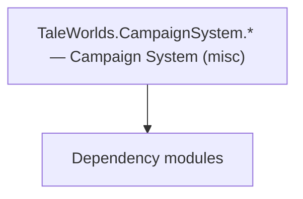

# TaleWorlds.CampaignSystem.* — Campaign System (misc)

**One-line responsibility:** This page covers all 523 business types under `TaleWorlds.CampaignSystem.* — Campaign System (misc)` as a family index, giving each type its namespace, responsibility, and typical timing so you can browse by module instead of alphabetically.

## Mental Model

This collects the remaining CampaignSystem supplement types: the campaign root, map events, scene-information popups, map notification types, character development, elections, game states, settlements, party, game menus, sieges, encyclopedia, map, tournament games, barter system, inventory, kingdom management, extensions, rosters, naval, fast mode, incidents, crafting system, save compatibility, and agent origins. They are the support and extension points of the campaign main loop and do not themselves hold complete gameplay.

## When to Use

Reach for these when you need to extend campaign components, handle elections/map events, or work with settlements/parties; extension components must provide serializable state.

## Dependencies

The types under `TaleWorlds.CampaignSystem.* — Campaign System (misc)` depend on the following modules; missing any of them causes compile- or run-time failure.

- [Campaign](../../campaign/Campaign)
- [API Overview](../../_index)

## Type Catalog

| Type | Namespace | Purpose | Timing |
| --- | --- | --- | --- |
| `ActionNotes` | TaleWorlds.CampaignSystem | A business type under this namespace that carries its derived convention responsibility. Confirm its lifecycle and owning system before calling; do not reference an unready instance at the wrong phase. World-state changes should go through the corresponding Action/Behavior, not direct field mutation. | Campaign init |
| `AIBehaviorData` | TaleWorlds.CampaignSystem | AI decision implementation that must be interruptible and serializable to support saving and undo. Search must be depth/time bounded to avoid stalls. | Campaign init |
| `Army` | TaleWorlds.CampaignSystem | A business type under this namespace that carries its derived convention responsibility. Confirm its lifecycle and owning system before calling; do not reference an unready instance at the wrong phase. World-state changes should go through the corresponding Action/Behavior, not direct field mutation. | Campaign init |
| `ArmyDispersionReason` | TaleWorlds.CampaignSystem | A business type under this namespace that carries its derived convention responsibility. Confirm its lifecycle and owning system before calling; do not reference an unready instance at the wrong phase. World-state changes should go through the corresponding Action/Behavior, not direct field mutation. | Campaign init |
| `ArmyTypes` | TaleWorlds.CampaignSystem | A business type under this namespace that carries its derived convention responsibility. Confirm its lifecycle and owning system before calling; do not reference an unready instance at the wrong phase. World-state changes should go through the corresponding Action/Behavior, not direct field mutation. | Campaign init |
| `AtmosphereGrid` | TaleWorlds.CampaignSystem | A business type under this namespace that carries its derived convention responsibility. Confirm its lifecycle and owning system before calling; do not reference an unready instance at the wrong phase. World-state changes should go through the corresponding Action/Behavior, not direct field mutation. | Campaign init |
| `BattleResultPartyData` | TaleWorlds.CampaignSystem | A business type under this namespace that carries its derived convention responsibility. Confirm its lifecycle and owning system before calling; do not reference an unready instance at the wrong phase. World-state changes should go through the corresponding Action/Behavior, not direct field mutation. | Campaign init |
| `BattleSimulation` | TaleWorlds.CampaignSystem | A business type under this namespace that carries its derived convention responsibility. Confirm its lifecycle and owning system before calling; do not reference an unready instance at the wrong phase. World-state changes should go through the corresponding Action/Behavior, not direct field mutation. | Campaign init |
| `BehaviorSaveData` | TaleWorlds.CampaignSystem | A business type under this namespace that carries its derived convention responsibility. Confirm its lifecycle and owning system before calling; do not reference an unready instance at the wrong phase. World-state changes should go through the corresponding Action/Behavior, not direct field mutation. | Campaign init |
| `BoardGameType` | TaleWorlds.CampaignSystem | A business type under this namespace that carries its derived convention responsibility. Confirm its lifecycle and owning system before calling; do not reference an unready instance at the wrong phase. World-state changes should go through the corresponding Action/Behavior, not direct field mutation. | Campaign init |
| `CampaignBehaviorBase` | TaleWorlds.CampaignSystem | Campaign-system behavior that listens to global events to drive that system’s initialization and periodic updates. It is the main entry point for mods to inject gameplay; do not mutate world state directly outside a behavior. | Campaign init |
| `CampaignCheats` | TaleWorlds.CampaignSystem | Debug cheat item triggered via console or menu for development-time effects. Production builds should disable or stub it to avoid accidentally corrupting saves. | Campaign init |
| `CampaignData` | TaleWorlds.CampaignSystem | AI decision implementation that must be interruptible and serializable to support saving and undo. Search must be depth/time bounded to avoid stalls. | Campaign init |
| `CampaignEntityComponent` | TaleWorlds.CampaignSystem | AI decision implementation that must be interruptible and serializable to support saving and undo. Search must be depth/time bounded to avoid stalls. | Campaign init |
| `CampaignEventReceiver` | TaleWorlds.CampaignSystem | AI decision implementation that must be interruptible and serializable to support saving and undo. Search must be depth/time bounded to avoid stalls. | Campaign init |
| `CampaignEvents` | TaleWorlds.CampaignSystem | AI decision implementation that must be interruptible and serializable to support saving and undo. Search must be depth/time bounded to avoid stalls. | Campaign init |
| `CampaignGameMode` | TaleWorlds.CampaignSystem | AI decision implementation that must be interruptible and serializable to support saving and undo. Search must be depth/time bounded to avoid stalls. | Campaign init |
| `CampaignGameStarter` | TaleWorlds.CampaignSystem | AI decision implementation that must be interruptible and serializable to support saving and undo. Search must be depth/time bounded to avoid stalls. | Campaign init |
| `CampaignInformationManager` | TaleWorlds.CampaignSystem | AI decision implementation that must be interruptible and serializable to support saving and undo. Search must be depth/time bounded to avoid stalls. | Campaign init |
| `CampaignObjectBase` | TaleWorlds.CampaignSystem | AI decision implementation that must be interruptible and serializable to support saving and undo. Search must be depth/time bounded to avoid stalls. | Campaign init |
| `CampaignOptions` | TaleWorlds.CampaignSystem | AI decision implementation that must be interruptible and serializable to support saving and undo. Search must be depth/time bounded to avoid stalls. | Campaign init |
| `CampaignTickCacheDataStore` | TaleWorlds.CampaignSystem | AI decision implementation that must be interruptible and serializable to support saving and undo. Search must be depth/time bounded to avoid stalls. | Campaign init |
| `CampaignTimeControlMode` | TaleWorlds.CampaignSystem | AI decision implementation that must be interruptible and serializable to support saving and undo. Search must be depth/time bounded to avoid stalls. | Campaign init |
| `CampaignTutorial` | TaleWorlds.CampaignSystem | AI decision implementation that must be interruptible and serializable to support saving and undo. Search must be depth/time bounded to avoid stalls. | Campaign init |
| `CampaignVec2` | TaleWorlds.CampaignSystem | AI decision implementation that must be interruptible and serializable to support saving and undo. Search must be depth/time bounded to avoid stalls. | Campaign init |
| `CharacterData` | TaleWorlds.CampaignSystem | A business type under this namespace that carries its derived convention responsibility. Confirm its lifecycle and owning system before calling; do not reference an unready instance at the wrong phase. World-state changes should go through the corresponding Action/Behavior, not direct field mutation. | Campaign init |
| `CharacterObject` | TaleWorlds.CampaignSystem | A business type under this namespace that carries its derived convention responsibility. Confirm its lifecycle and owning system before calling; do not reference an unready instance at the wrong phase. World-state changes should go through the corresponding Action/Behavior, not direct field mutation. | Campaign init |
| `CharacterRelationManager` | TaleWorlds.CampaignSystem | A business type under this namespace that carries its derived convention responsibility. Confirm its lifecycle and owning system before calling; do not reference an unready instance at the wrong phase. World-state changes should go through the corresponding Action/Behavior, not direct field mutation. | Campaign init |
| `CharacterRestrictionFlags` | TaleWorlds.CampaignSystem | A business type under this namespace that carries its derived convention responsibility. Confirm its lifecycle and owning system before calling; do not reference an unready instance at the wrong phase. World-state changes should go through the corresponding Action/Behavior, not direct field mutation. | Campaign init |
| `CharacterStates` | TaleWorlds.CampaignSystem | A business type under this namespace that carries its derived convention responsibility. Confirm its lifecycle and owning system before calling; do not reference an unready instance at the wrong phase. World-state changes should go through the corresponding Action/Behavior, not direct field mutation. | Campaign init |
| `Clan` | TaleWorlds.CampaignSystem | A business type under this namespace that carries its derived convention responsibility. Confirm its lifecycle and owning system before calling; do not reference an unready instance at the wrong phase. World-state changes should go through the corresponding Action/Behavior, not direct field mutation. | Campaign init |
| `Concept` | TaleWorlds.CampaignSystem | A business type under this namespace that carries its derived convention responsibility. Confirm its lifecycle and owning system before calling; do not reference an unready instance at the wrong phase. World-state changes should go through the corresponding Action/Behavior, not direct field mutation. | Campaign init |
| `ConversationContext` | TaleWorlds.CampaignSystem | Conversation-related type participating in the dialogue tree and performance. Dialogue-line changes must mind branches and localization. | Campaign init |
| `ConversationSceneData` | TaleWorlds.CampaignSystem | Conversation-related type participating in the dialogue tree and performance. Dialogue-line changes must mind branches and localization. | Campaign init |
| `CultureObject` | TaleWorlds.CampaignSystem | A business type under this namespace that carries its derived convention responsibility. Confirm its lifecycle and owning system before calling; do not reference an unready instance at the wrong phase. World-state changes should go through the corresponding Action/Behavior, not direct field mutation. | Campaign init |
| `CultureTrait` | TaleWorlds.CampaignSystem | AI decision implementation that must be interruptible and serializable to support saving and undo. Search must be depth/time bounded to avoid stalls. | Campaign init |
| `DefaultItems` | TaleWorlds.CampaignSystem | A business type under this namespace that carries its derived convention responsibility. Confirm its lifecycle and owning system before calling; do not reference an unready instance at the wrong phase. World-state changes should go through the corresponding Action/Behavior, not direct field mutation. | Campaign init |
| `DefaultPolicies` | TaleWorlds.CampaignSystem | A business type under this namespace that carries its derived convention responsibility. Confirm its lifecycle and owning system before calling; do not reference an unready instance at the wrong phase. World-state changes should go through the corresponding Action/Behavior, not direct field mutation. | Campaign init |
| `DefaultSkillEffects` | TaleWorlds.CampaignSystem | A business type under this namespace that carries its derived convention responsibility. Confirm its lifecycle and owning system before calling; do not reference an unready instance at the wrong phase. World-state changes should go through the corresponding Action/Behavior, not direct field mutation. | Campaign init |
| `DialogFlow` | TaleWorlds.CampaignSystem | A business type under this namespace that carries its derived convention responsibility. Confirm its lifecycle and owning system before calling; do not reference an unready instance at the wrong phase. World-state changes should go through the corresponding Action/Behavior, not direct field mutation. | Campaign init |
| `DialogFlowContext` | TaleWorlds.CampaignSystem | A business type under this namespace that carries its derived convention responsibility. Confirm its lifecycle and owning system before calling; do not reference an unready instance at the wrong phase. World-state changes should go through the corresponding Action/Behavior, not direct field mutation. | Campaign init |
| `DialogFlowLine` | TaleWorlds.CampaignSystem | A business type under this namespace that carries its derived convention responsibility. Confirm its lifecycle and owning system before calling; do not reference an unready instance at the wrong phase. World-state changes should go through the corresponding Action/Behavior, not direct field mutation. | Campaign init |
| `Difficulty` | TaleWorlds.CampaignSystem | A business type under this namespace that carries its derived convention responsibility. Confirm its lifecycle and owning system before calling; do not reference an unready instance at the wrong phase. World-state changes should go through the corresponding Action/Behavior, not direct field mutation. | Campaign init |
| `EncounterManager` | TaleWorlds.CampaignSystem | A business type under this namespace that carries its derived convention responsibility. Confirm its lifecycle and owning system before calling; do not reference an unready instance at the wrong phase. World-state changes should go through the corresponding Action/Behavior, not direct field mutation. | Campaign init |
| `EventHandlerRec` | TaleWorlds.CampaignSystem | Event or event handler carrying the data of something that happened once. Remember to unsubscribe on unload to avoid leaks. | Campaign init |
| `ExplainedNumber` | TaleWorlds.CampaignSystem | AI decision implementation that must be interruptible and serializable to support saving and undo. Search must be depth/time bounded to avoid stalls. | Campaign init |
| `ExplanationLine` | TaleWorlds.CampaignSystem | A business type under this namespace that carries its derived convention responsibility. Confirm its lifecycle and owning system before calling; do not reference an unready instance at the wrong phase. World-state changes should go through the corresponding Action/Behavior, not direct field mutation. | Campaign init |
| `FactionManager` | TaleWorlds.CampaignSystem | A business type under this namespace that carries its derived convention responsibility. Confirm its lifecycle and owning system before calling; do not reference an unready instance at the wrong phase. World-state changes should go through the corresponding Action/Behavior, not direct field mutation. | Campaign init |
| `FactionManagerStancesData` | TaleWorlds.CampaignSystem | A business type under this namespace that carries its derived convention responsibility. Confirm its lifecycle and owning system before calling; do not reference an unready instance at the wrong phase. World-state changes should go through the corresponding Action/Behavior, not direct field mutation. | Campaign init |
| `FinishStates` | TaleWorlds.CampaignSystem | A business type under this namespace that carries its derived convention responsibility. Confirm its lifecycle and owning system before calling; do not reference an unready instance at the wrong phase. World-state changes should go through the corresponding Action/Behavior, not direct field mutation. | Campaign init |
| `GameAccelerationMode` | TaleWorlds.CampaignSystem | A business type under this namespace that carries its derived convention responsibility. Confirm its lifecycle and owning system before calling; do not reference an unready instance at the wrong phase. World-state changes should go through the corresponding Action/Behavior, not direct field mutation. | Campaign init |
| `GameLoadingType` | TaleWorlds.CampaignSystem | A business type under this namespace that carries its derived convention responsibility. Confirm its lifecycle and owning system before calling; do not reference an unready instance at the wrong phase. World-state changes should go through the corresponding Action/Behavior, not direct field mutation. | Campaign init |
| `GameSceneDataManager` | TaleWorlds.CampaignSystem | A business type under this namespace that carries its derived convention responsibility. Confirm its lifecycle and owning system before calling; do not reference an unready instance at the wrong phase. World-state changes should go through the corresponding Action/Behavior, not direct field mutation. | Campaign init |
| `Hero` | TaleWorlds.CampaignSystem | A business type under this namespace that carries its derived convention responsibility. Confirm its lifecycle and owning system before calling; do not reference an unready instance at the wrong phase. World-state changes should go through the corresponding Action/Behavior, not direct field mutation. | Campaign init |
| `HeroCreator` | TaleWorlds.CampaignSystem | A business type under this namespace that carries its derived convention responsibility. Confirm its lifecycle and owning system before calling; do not reference an unready instance at the wrong phase. World-state changes should go through the corresponding Action/Behavior, not direct field mutation. | Campaign init |
| `HeroGetsBusyReasons` | TaleWorlds.CampaignSystem | A business type under this namespace that carries its derived convention responsibility. Confirm its lifecycle and owning system before calling; do not reference an unready instance at the wrong phase. World-state changes should go through the corresponding Action/Behavior, not direct field mutation. | Campaign init |
| `HeroRelations` | TaleWorlds.CampaignSystem | A business type under this namespace that carries its derived convention responsibility. Confirm its lifecycle and owning system before calling; do not reference an unready instance at the wrong phase. World-state changes should go through the corresponding Action/Behavior, not direct field mutation. | Campaign init |
| `IAgentBehaviorManager` | TaleWorlds.CampaignSystem | Battle agent AI behavior that makes decisions and executes actions inside a Mission. Its lifetime follows the Agent’s life and death; you must clean up after the Agent dies. | Campaign init |
| `ICampaignBehavior` | TaleWorlds.CampaignSystem | Campaign-system behavior that listens to global events to drive that system’s initialization and periodic updates. It is the main entry point for mods to inject gameplay; do not mutate world state directly outside a behavior. | Campaign init |
| `ICampaignBehaviorManager` | TaleWorlds.CampaignSystem | Campaign-system behavior that listens to global events to drive that system’s initialization and periodic updates. It is the main entry point for mods to inject gameplay; do not mutate world state directly outside a behavior. | Campaign init |
| `IFaction` | TaleWorlds.CampaignSystem | Game action that encapsulates a single state change and executes it through the Action system. You must use Apply rather than mutating fields directly, otherwise you skip event cascades and corrupt saves. | Campaign init |
| `IMainHeroVisualSupplier` | TaleWorlds.CampaignSystem | AI decision implementation that must be interruptible and serializable to support saving and undo. Search must be depth/time bounded to avoid stalls. | Campaign init |
| `IMapEventVisualCreator` | TaleWorlds.CampaignSystem | Event or event handler carrying the data of something that happened once. Remember to unsubscribe on unload to avoid leaks. | Campaign init |
| `IMbEvent` | TaleWorlds.CampaignSystem | Event or event handler carrying the data of something that happened once. Remember to unsubscribe on unload to avoid leaks. | Campaign init |
| `IMbEventBase` | TaleWorlds.CampaignSystem | Event or event handler carrying the data of something that happened once. Remember to unsubscribe on unload to avoid leaks. | Campaign init |
| `INavigationElement` | TaleWorlds.CampaignSystem | Campaign-map event / navigation element describing map topology or movement-related data structures. Changes must sync map logic and the navigation mesh. | Campaign init |
| `INavigationHandler` | TaleWorlds.CampaignSystem | A business type under this namespace that carries its derived convention responsibility. Confirm its lifecycle and owning system before calling; do not reference an unready instance at the wrong phase. World-state changes should go through the corresponding Action/Behavior, not direct field mutation. | Campaign init |
| `IRandomOwner` | TaleWorlds.CampaignSystem | A business type under this namespace that carries its derived convention responsibility. Confirm its lifecycle and owning system before calling; do not reference an unready instance at the wrong phase. World-state changes should go through the corresponding Action/Behavior, not direct field mutation. | Campaign init |
| `ISaveManager` | TaleWorlds.CampaignSystem | A business type under this namespace that carries its derived convention responsibility. Confirm its lifecycle and owning system before calling; do not reference an unready instance at the wrong phase. World-state changes should go through the corresponding Action/Behavior, not direct field mutation. | Campaign init |
| `ITrackableCampaignObject` | TaleWorlds.CampaignSystem | AI decision implementation that must be interruptible and serializable to support saving and undo. Search must be depth/time bounded to avoid stalls. | Campaign init |
| `IViewDataTracker` | TaleWorlds.CampaignSystem | A business type under this namespace that carries its derived convention responsibility. Confirm its lifecycle and owning system before calling; do not reference an unready instance at the wrong phase. World-state changes should go through the corresponding Action/Behavior, not direct field mutation. | Campaign init |
| `JournalLog` | TaleWorlds.CampaignSystem | A business type under this namespace that carries its derived convention responsibility. Confirm its lifecycle and owning system before calling; do not reference an unready instance at the wrong phase. World-state changes should go through the corresponding Action/Behavior, not direct field mutation. | Campaign init |
| `Kingdom` | TaleWorlds.CampaignSystem | A business type under this namespace that carries its derived convention responsibility. Confirm its lifecycle and owning system before calling; do not reference an unready instance at the wrong phase. World-state changes should go through the corresponding Action/Behavior, not direct field mutation. | Campaign init |
| `KingdomManager` | TaleWorlds.CampaignSystem | A business type under this namespace that carries its derived convention responsibility. Confirm its lifecycle and owning system before calling; do not reference an unready instance at the wrong phase. World-state changes should go through the corresponding Action/Behavior, not direct field mutation. | Campaign init |
| `LogType` | TaleWorlds.CampaignSystem | A business type under this namespace that carries its derived convention responsibility. Confirm its lifecycle and owning system before calling; do not reference an unready instance at the wrong phase. World-state changes should go through the corresponding Action/Behavior, not direct field mutation. | Campaign init |
| `ManagedParameters` | TaleWorlds.CampaignSystem | Parameter container carrying configuration or runtime data. Avoid holding long-lived references that hinder GC. | Campaign init |
| `ManagedParametersEnum` | TaleWorlds.CampaignSystem | Parameter container carrying configuration or runtime data. Avoid holding long-lived references that hinder GC. | Campaign init |
| `MapNavigationExtensions` | TaleWorlds.CampaignSystem | Campaign-map event / navigation element describing map topology or movement-related data structures. Changes must sync map logic and the navigation mesh. | Campaign init |
| `MapNavigationItemType` | TaleWorlds.CampaignSystem | Campaign-map event / navigation element describing map topology or movement-related data structures. Changes must sync map logic and the navigation mesh. | Campaign init |
| `MapTimeTracker` | TaleWorlds.CampaignSystem | A business type under this namespace that carries its derived convention responsibility. Confirm its lifecycle and owning system before calling; do not reference an unready instance at the wrong phase. World-state changes should go through the corresponding Action/Behavior, not direct field mutation. | Campaign init |
| `MBCampaignEvent` | TaleWorlds.CampaignSystem | AI decision implementation that must be interruptible and serializable to support saving and undo. Search must be depth/time bounded to avoid stalls. | Campaign init |
| `MbEvent` | TaleWorlds.CampaignSystem | Event or event handler carrying the data of something that happened once. Remember to unsubscribe on unload to avoid leaks. | Campaign init |
| `MeetingSceneData` | TaleWorlds.CampaignSystem | A business type under this namespace that carries its derived convention responsibility. Confirm its lifecycle and owning system before calling; do not reference an unready instance at the wrong phase. World-state changes should go through the corresponding Action/Behavior, not direct field mutation. | Campaign init |
| `NameGenerator` | TaleWorlds.CampaignSystem | A business type under this namespace that carries its derived convention responsibility. Confirm its lifecycle and owning system before calling; do not reference an unready instance at the wrong phase. World-state changes should go through the corresponding Action/Behavior, not direct field mutation. | Campaign init |
| `NavigationPermissionItem` | TaleWorlds.CampaignSystem | A business type under this namespace that carries its derived convention responsibility. Confirm its lifecycle and owning system before calling; do not reference an unready instance at the wrong phase. World-state changes should go through the corresponding Action/Behavior, not direct field mutation. | Campaign init |
| `NoticeType` | TaleWorlds.CampaignSystem | A business type under this namespace that carries its derived convention responsibility. Confirm its lifecycle and owning system before calling; do not reference an unready instance at the wrong phase. World-state changes should go through the corresponding Action/Behavior, not direct field mutation. | Campaign init |
| `Occupation` | TaleWorlds.CampaignSystem | A business type under this namespace that carries its derived convention responsibility. Confirm its lifecycle and owning system before calling; do not reference an unready instance at the wrong phase. World-state changes should go through the corresponding Action/Behavior, not direct field mutation. | Campaign init |
| `OperationType` | TaleWorlds.CampaignSystem | A business type under this namespace that carries its derived convention responsibility. Confirm its lifecycle and owning system before calling; do not reference an unready instance at the wrong phase. World-state changes should go through the corresponding Action/Behavior, not direct field mutation. | Campaign init |
| `PartyRestFlags` | TaleWorlds.CampaignSystem | A business type under this namespace that carries its derived convention responsibility. Confirm its lifecycle and owning system before calling; do not reference an unready instance at the wrong phase. World-state changes should go through the corresponding Action/Behavior, not direct field mutation. | Campaign init |
| `PartyRole` | TaleWorlds.CampaignSystem | A business type under this namespace that carries its derived convention responsibility. Confirm its lifecycle and owning system before calling; do not reference an unready instance at the wrong phase. World-state changes should go through the corresponding Action/Behavior, not direct field mutation. | Campaign init |
| `PartyThinkParams` | TaleWorlds.CampaignSystem | Parameter container carrying configuration or runtime data. Avoid holding long-lived references that hinder GC. | Campaign init |
| `PartyTypeEnum` | TaleWorlds.CampaignSystem | A business type under this namespace that carries its derived convention responsibility. Confirm its lifecycle and owning system before calling; do not reference an unready instance at the wrong phase. World-state changes should go through the corresponding Action/Behavior, not direct field mutation. | Campaign init |
| `PeriodicTicker` | TaleWorlds.CampaignSystem | A business type under this namespace that carries its derived convention responsibility. Confirm its lifecycle and owning system before calling; do not reference an unready instance at the wrong phase. World-state changes should go through the corresponding Action/Behavior, not direct field mutation. | Campaign init |
| `PlayerCaptivity` | TaleWorlds.CampaignSystem | A business type under this namespace that carries its derived convention responsibility. Confirm its lifecycle and owning system before calling; do not reference an unready instance at the wrong phase. World-state changes should go through the corresponding Action/Behavior, not direct field mutation. | Campaign init |
| `PolicyObject` | TaleWorlds.CampaignSystem | A business type under this namespace that carries its derived convention responsibility. Confirm its lifecycle and owning system before calling; do not reference an unready instance at the wrong phase. World-state changes should go through the corresponding Action/Behavior, not direct field mutation. | Campaign init |
| `PropertyObjectData` | TaleWorlds.CampaignSystem | A business type under this namespace that carries its derived convention responsibility. Confirm its lifecycle and owning system before calling; do not reference an unready instance at the wrong phase. World-state changes should go through the corresponding Action/Behavior, not direct field mutation. | Campaign init |
| `QuestBase` | TaleWorlds.CampaignSystem | A business type under this namespace that carries its derived convention responsibility. Confirm its lifecycle and owning system before calling; do not reference an unready instance at the wrong phase. World-state changes should go through the corresponding Action/Behavior, not direct field mutation. | Campaign init |
| `QuestCompleteDetails` | TaleWorlds.CampaignSystem | AI decision implementation that must be interruptible and serializable to support saving and undo. Search must be depth/time bounded to avoid stalls. | Campaign init |
| `QuestManager` | TaleWorlds.CampaignSystem | A business type under this namespace that carries its derived convention responsibility. Confirm its lifecycle and owning system before calling; do not reference an unready instance at the wrong phase. World-state changes should go through the corresponding Action/Behavior, not direct field mutation. | Campaign init |
| `QuestStates` | TaleWorlds.CampaignSystem | A business type under this namespace that carries its derived convention responsibility. Confirm its lifecycle and owning system before calling; do not reference an unready instance at the wrong phase. World-state changes should go through the corresponding Action/Behavior, not direct field mutation. | Campaign init |
| `QuestTaskBase` | TaleWorlds.CampaignSystem | Quest-stage sub-goal that defines one completion condition and settlement. Condition checks must be idempotent — repeated completion must not double-reward. | Campaign init |
| `RandomOwnerExtensions` | TaleWorlds.CampaignSystem | A business type under this namespace that carries its derived convention responsibility. Confirm its lifecycle and owning system before calling; do not reference an unready instance at the wrong phase. World-state changes should go through the corresponding Action/Behavior, not direct field mutation. | Campaign init |
| `ReferenceMBEvent` | TaleWorlds.CampaignSystem | Event or event handler carrying the data of something that happened once. Remember to unsubscribe on unload to avoid leaks. | Campaign init |
| `Romance` | TaleWorlds.CampaignSystem | A business type under this namespace that carries its derived convention responsibility. Confirm its lifecycle and owning system before calling; do not reference an unready instance at the wrong phase. World-state changes should go through the corresponding Action/Behavior, not direct field mutation. | Campaign init |
| `RomanceLevelEnum` | TaleWorlds.CampaignSystem | A business type under this namespace that carries its derived convention responsibility. Confirm its lifecycle and owning system before calling; do not reference an unready instance at the wrong phase. World-state changes should go through the corresponding Action/Behavior, not direct field mutation. | Campaign init |
| `RomanticState` | TaleWorlds.CampaignSystem | A business type under this namespace that carries its derived convention responsibility. Confirm its lifecycle and owning system before calling; do not reference an unready instance at the wrong phase. World-state changes should go through the corresponding Action/Behavior, not direct field mutation. | Campaign init |
| `SandBoxManager` | TaleWorlds.CampaignSystem | A business type under this namespace that carries its derived convention responsibility. Confirm its lifecycle and owning system before calling; do not reference an unready instance at the wrong phase. World-state changes should go through the corresponding Action/Behavior, not direct field mutation. | Campaign init |
| `SandBoxMission` | TaleWorlds.CampaignSystem | A business type under this namespace that carries its derived convention responsibility. Confirm its lifecycle and owning system before calling; do not reference an unready instance at the wrong phase. World-state changes should go through the corresponding Action/Behavior, not direct field mutation. | Campaign init |
| `SaveableCampaignTypeDefiner` | TaleWorlds.CampaignSystem | Save-type definer that declares which fields of the type enter the save. Any new field must carry a default value, otherwise old saves fail to deserialize. | Campaign init |
| `SaveHandler` | TaleWorlds.CampaignSystem | A business type under this namespace that carries its derived convention responsibility. Confirm its lifecycle and owning system before calling; do not reference an unready instance at the wrong phase. World-state changes should go through the corresponding Action/Behavior, not direct field mutation. | Campaign init |
| `SaveMode` | TaleWorlds.CampaignSystem | A business type under this namespace that carries its derived convention responsibility. Confirm its lifecycle and owning system before calling; do not reference an unready instance at the wrong phase. World-state changes should go through the corresponding Action/Behavior, not direct field mutation. | Campaign init |
| `Seasons` | TaleWorlds.CampaignSystem | A business type under this namespace that carries its derived convention responsibility. Confirm its lifecycle and owning system before calling; do not reference an unready instance at the wrong phase. World-state changes should go through the corresponding Action/Behavior, not direct field mutation. | Campaign init |
| `SettlementBusynessPriority` | TaleWorlds.CampaignSystem | A business type under this namespace that carries its derived convention responsibility. Confirm its lifecycle and owning system before calling; do not reference an unready instance at the wrong phase. World-state changes should go through the corresponding Action/Behavior, not direct field mutation. | Campaign init |
| `SingleplayerBattleSceneData` | TaleWorlds.CampaignSystem | A business type under this namespace that carries its derived convention responsibility. Confirm its lifecycle and owning system before calling; do not reference an unready instance at the wrong phase. World-state changes should go through the corresponding Action/Behavior, not direct field mutation. | Campaign init |
| `SkillEffect` | TaleWorlds.CampaignSystem | A business type under this namespace that carries its derived convention responsibility. Confirm its lifecycle and owning system before calling; do not reference an unready instance at the wrong phase. World-state changes should go through the corresponding Action/Behavior, not direct field mutation. | Campaign init |
| `SkillObjectData` | TaleWorlds.CampaignSystem | A business type under this namespace that carries its derived convention responsibility. Confirm its lifecycle and owning system before calling; do not reference an unready instance at the wrong phase. World-state changes should go through the corresponding Action/Behavior, not direct field mutation. | Campaign init |
| `StanceLink` | TaleWorlds.CampaignSystem | A business type under this namespace that carries its derived convention responsibility. Confirm its lifecycle and owning system before calling; do not reference an unready instance at the wrong phase. World-state changes should go through the corresponding Action/Behavior, not direct field mutation. | Campaign init |
| `StanceType` | TaleWorlds.CampaignSystem | A business type under this namespace that carries its derived convention responsibility. Confirm its lifecycle and owning system before calling; do not reference an unready instance at the wrong phase. World-state changes should go through the corresponding Action/Behavior, not direct field mutation. | Campaign init |
| `Track` | TaleWorlds.CampaignSystem | A business type under this namespace that carries its derived convention responsibility. Confirm its lifecycle and owning system before calling; do not reference an unready instance at the wrong phase. World-state changes should go through the corresponding Action/Behavior, not direct field mutation. | Campaign init |
| `TrackedObject` | TaleWorlds.CampaignSystem | A business type under this namespace that carries its derived convention responsibility. Confirm its lifecycle and owning system before calling; do not reference an unready instance at the wrong phase. World-state changes should go through the corresponding Action/Behavior, not direct field mutation. | Campaign init |
| `TradeRumor` | TaleWorlds.CampaignSystem | A business type under this namespace that carries its derived convention responsibility. Confirm its lifecycle and owning system before calling; do not reference an unready instance at the wrong phase. World-state changes should go through the corresponding Action/Behavior, not direct field mutation. | Campaign init |
| `TroopUpgradeTracker` | TaleWorlds.CampaignSystem | A business type under this namespace that carries its derived convention responsibility. Confirm its lifecycle and owning system before calling; do not reference an unready instance at the wrong phase. World-state changes should go through the corresponding Action/Behavior, not direct field mutation. | Campaign init |
| `VisualCreator` | TaleWorlds.CampaignSystem | A business type under this namespace that carries its derived convention responsibility. Confirm its lifecycle and owning system before calling; do not reference an unready instance at the wrong phase. World-state changes should go through the corresponding Action/Behavior, not direct field mutation. | Campaign init |
| `VisualTrackerManager` | TaleWorlds.CampaignSystem | A business type under this namespace that carries its derived convention responsibility. Confirm its lifecycle and owning system before calling; do not reference an unready instance at the wrong phase. World-state changes should go through the corresponding Action/Behavior, not direct field mutation. | Campaign init |
| `PartyAgentOrigin` | TaleWorlds.CampaignSystem.AgentOrigins | A business type under this namespace that carries its derived convention responsibility. Confirm its lifecycle and owning system before calling; do not reference an unready instance at the wrong phase. World-state changes should go through the corresponding Action/Behavior, not direct field mutation. | Campaign init |
| `PartyGroupAgentOrigin` | TaleWorlds.CampaignSystem.AgentOrigins | A business type under this namespace that carries its derived convention responsibility. Confirm its lifecycle and owning system before calling; do not reference an unready instance at the wrong phase. World-state changes should go through the corresponding Action/Behavior, not direct field mutation. | Campaign init |
| `SimpleAgentOrigin` | TaleWorlds.CampaignSystem.AgentOrigins | A business type under this namespace that carries its derived convention responsibility. Confirm its lifecycle and owning system before calling; do not reference an unready instance at the wrong phase. World-state changes should go through the corresponding Action/Behavior, not direct field mutation. | Campaign init |
| `BarterData` | TaleWorlds.CampaignSystem.BarterSystem | A business type under this namespace that carries its derived convention responsibility. Confirm its lifecycle and owning system before calling; do not reference an unready instance at the wrong phase. World-state changes should go through the corresponding Action/Behavior, not direct field mutation. | Campaign init |
| `BarterGroup` | TaleWorlds.CampaignSystem.BarterSystem | A business type under this namespace that carries its derived convention responsibility. Confirm its lifecycle and owning system before calling; do not reference an unready instance at the wrong phase. World-state changes should go through the corresponding Action/Behavior, not direct field mutation. | Campaign init |
| `BarterManager` | TaleWorlds.CampaignSystem.BarterSystem | A business type under this namespace that carries its derived convention responsibility. Confirm its lifecycle and owning system before calling; do not reference an unready instance at the wrong phase. World-state changes should go through the corresponding Action/Behavior, not direct field mutation. | Campaign init |
| `BarterResult` | TaleWorlds.CampaignSystem.BarterSystem | A business type under this namespace that carries its derived convention responsibility. Confirm its lifecycle and owning system before calling; do not reference an unready instance at the wrong phase. World-state changes should go through the corresponding Action/Behavior, not direct field mutation. | Campaign init |
| `DefaultsBarterGroup` | TaleWorlds.CampaignSystem.BarterSystem | A business type under this namespace that carries its derived convention responsibility. Confirm its lifecycle and owning system before calling; do not reference an unready instance at the wrong phase. World-state changes should go through the corresponding Action/Behavior, not direct field mutation. | Campaign init |
| `FiefBarterGroup` | TaleWorlds.CampaignSystem.BarterSystem | A business type under this namespace that carries its derived convention responsibility. Confirm its lifecycle and owning system before calling; do not reference an unready instance at the wrong phase. World-state changes should go through the corresponding Action/Behavior, not direct field mutation. | Campaign init |
| `GoldBarterGroup` | TaleWorlds.CampaignSystem.BarterSystem | A business type under this namespace that carries its derived convention responsibility. Confirm its lifecycle and owning system before calling; do not reference an unready instance at the wrong phase. World-state changes should go through the corresponding Action/Behavior, not direct field mutation. | Campaign init |
| `ItemBarterGroup` | TaleWorlds.CampaignSystem.BarterSystem | A business type under this namespace that carries its derived convention responsibility. Confirm its lifecycle and owning system before calling; do not reference an unready instance at the wrong phase. World-state changes should go through the corresponding Action/Behavior, not direct field mutation. | Campaign init |
| `OtherBarterGroup` | TaleWorlds.CampaignSystem.BarterSystem | A business type under this namespace that carries its derived convention responsibility. Confirm its lifecycle and owning system before calling; do not reference an unready instance at the wrong phase. World-state changes should go through the corresponding Action/Behavior, not direct field mutation. | Campaign init |
| `PrisonerBarterGroup` | TaleWorlds.CampaignSystem.BarterSystem | A business type under this namespace that carries its derived convention responsibility. Confirm its lifecycle and owning system before calling; do not reference an unready instance at the wrong phase. World-state changes should go through the corresponding Action/Behavior, not direct field mutation. | Campaign init |
| `Barterable` | TaleWorlds.CampaignSystem.BarterSystem.Barterables | A business type under this namespace that carries its derived convention responsibility. Confirm its lifecycle and owning system before calling; do not reference an unready instance at the wrong phase. World-state changes should go through the corresponding Action/Behavior, not direct field mutation. | Campaign init |
| `BarterSide` | TaleWorlds.CampaignSystem.BarterSystem.Barterables | A business type under this namespace that carries its derived convention responsibility. Confirm its lifecycle and owning system before calling; do not reference an unready instance at the wrong phase. World-state changes should go through the corresponding Action/Behavior, not direct field mutation. | Campaign init |
| `DeclareWarBarterable` | TaleWorlds.CampaignSystem.BarterSystem.Barterables | A business type under this namespace that carries its derived convention responsibility. Confirm its lifecycle and owning system before calling; do not reference an unready instance at the wrong phase. World-state changes should go through the corresponding Action/Behavior, not direct field mutation. | Campaign init |
| `FiefBarterable` | TaleWorlds.CampaignSystem.BarterSystem.Barterables | A business type under this namespace that carries its derived convention responsibility. Confirm its lifecycle and owning system before calling; do not reference an unready instance at the wrong phase. World-state changes should go through the corresponding Action/Behavior, not direct field mutation. | Campaign init |
| `GoldBarterable` | TaleWorlds.CampaignSystem.BarterSystem.Barterables | A business type under this namespace that carries its derived convention responsibility. Confirm its lifecycle and owning system before calling; do not reference an unready instance at the wrong phase. World-state changes should go through the corresponding Action/Behavior, not direct field mutation. | Campaign init |
| `ItemBarterable` | TaleWorlds.CampaignSystem.BarterSystem.Barterables | A business type under this namespace that carries its derived convention responsibility. Confirm its lifecycle and owning system before calling; do not reference an unready instance at the wrong phase. World-state changes should go through the corresponding Action/Behavior, not direct field mutation. | Campaign init |
| `JoinKingdomAsClanBarterable` | TaleWorlds.CampaignSystem.BarterSystem.Barterables | A business type under this namespace that carries its derived convention responsibility. Confirm its lifecycle and owning system before calling; do not reference an unready instance at the wrong phase. World-state changes should go through the corresponding Action/Behavior, not direct field mutation. | Campaign init |
| `LeaveKingdomAsClanBarterable` | TaleWorlds.CampaignSystem.BarterSystem.Barterables | A business type under this namespace that carries its derived convention responsibility. Confirm its lifecycle and owning system before calling; do not reference an unready instance at the wrong phase. World-state changes should go through the corresponding Action/Behavior, not direct field mutation. | Campaign init |
| `MarriageBarterable` | TaleWorlds.CampaignSystem.BarterSystem.Barterables | A business type under this namespace that carries its derived convention responsibility. Confirm its lifecycle and owning system before calling; do not reference an unready instance at the wrong phase. World-state changes should go through the corresponding Action/Behavior, not direct field mutation. | Campaign init |
| `MercenaryJoinKingdomBarterable` | TaleWorlds.CampaignSystem.BarterSystem.Barterables | A business type under this namespace that carries its derived convention responsibility. Confirm its lifecycle and owning system before calling; do not reference an unready instance at the wrong phase. World-state changes should go through the corresponding Action/Behavior, not direct field mutation. | Campaign init |
| `NoAttackBarterable` | TaleWorlds.CampaignSystem.BarterSystem.Barterables | A business type under this namespace that carries its derived convention responsibility. Confirm its lifecycle and owning system before calling; do not reference an unready instance at the wrong phase. World-state changes should go through the corresponding Action/Behavior, not direct field mutation. | Campaign init |
| `PeaceBarterable` | TaleWorlds.CampaignSystem.BarterSystem.Barterables | A business type under this namespace that carries its derived convention responsibility. Confirm its lifecycle and owning system before calling; do not reference an unready instance at the wrong phase. World-state changes should go through the corresponding Action/Behavior, not direct field mutation. | Campaign init |
| `SafePassageBarterable` | TaleWorlds.CampaignSystem.BarterSystem.Barterables | A business type under this namespace that carries its derived convention responsibility. Confirm its lifecycle and owning system before calling; do not reference an unready instance at the wrong phase. World-state changes should go through the corresponding Action/Behavior, not direct field mutation. | Campaign init |
| `SetPrisonerFreeBarterable` | TaleWorlds.CampaignSystem.BarterSystem.Barterables | A business type under this namespace that carries its derived convention responsibility. Confirm its lifecycle and owning system before calling; do not reference an unready instance at the wrong phase. World-state changes should go through the corresponding Action/Behavior, not direct field mutation. | Campaign init |
| `TransferPrisonerBarterable` | TaleWorlds.CampaignSystem.BarterSystem.Barterables | A business type under this namespace that carries its derived convention responsibility. Confirm its lifecycle and owning system before calling; do not reference an unready instance at the wrong phase. World-state changes should go through the corresponding Action/Behavior, not direct field mutation. | Campaign init |
| `CharacterCreationBannerEditorStage` | TaleWorlds.CampaignSystem.CharacterCreationContent | A business type under this namespace that carries its derived convention responsibility. Confirm its lifecycle and owning system before calling; do not reference an unready instance at the wrong phase. World-state changes should go through the corresponding Action/Behavior, not direct field mutation. | Campaign init |
| `CharacterCreationClanNamingStage` | TaleWorlds.CampaignSystem.CharacterCreationContent | A business type under this namespace that carries its derived convention responsibility. Confirm its lifecycle and owning system before calling; do not reference an unready instance at the wrong phase. World-state changes should go through the corresponding Action/Behavior, not direct field mutation. | Campaign init |
| `CharacterCreationContent` | TaleWorlds.CampaignSystem.CharacterCreationContent | A business type under this namespace that carries its derived convention responsibility. Confirm its lifecycle and owning system before calling; do not reference an unready instance at the wrong phase. World-state changes should go through the corresponding Action/Behavior, not direct field mutation. | Campaign init |
| `CharacterCreationCultureStage` | TaleWorlds.CampaignSystem.CharacterCreationContent | A business type under this namespace that carries its derived convention responsibility. Confirm its lifecycle and owning system before calling; do not reference an unready instance at the wrong phase. World-state changes should go through the corresponding Action/Behavior, not direct field mutation. | Campaign init |
| `CharacterCreationFaceGeneratorStage` | TaleWorlds.CampaignSystem.CharacterCreationContent | A business type under this namespace that carries its derived convention responsibility. Confirm its lifecycle and owning system before calling; do not reference an unready instance at the wrong phase. World-state changes should go through the corresponding Action/Behavior, not direct field mutation. | Campaign init |
| `CharacterCreationManager` | TaleWorlds.CampaignSystem.CharacterCreationContent | A business type under this namespace that carries its derived convention responsibility. Confirm its lifecycle and owning system before calling; do not reference an unready instance at the wrong phase. World-state changes should go through the corresponding Action/Behavior, not direct field mutation. | Campaign init |
| `CharacterCreationNarrativeStage` | TaleWorlds.CampaignSystem.CharacterCreationContent | A business type under this namespace that carries its derived convention responsibility. Confirm its lifecycle and owning system before calling; do not reference an unready instance at the wrong phase. World-state changes should go through the corresponding Action/Behavior, not direct field mutation. | Campaign init |
| `CharacterCreationOptionsStage` | TaleWorlds.CampaignSystem.CharacterCreationContent | A business type under this namespace that carries its derived convention responsibility. Confirm its lifecycle and owning system before calling; do not reference an unready instance at the wrong phase. World-state changes should go through the corresponding Action/Behavior, not direct field mutation. | Campaign init |
| `CharacterCreationReviewStage` | TaleWorlds.CampaignSystem.CharacterCreationContent | A business type under this namespace that carries its derived convention responsibility. Confirm its lifecycle and owning system before calling; do not reference an unready instance at the wrong phase. World-state changes should go through the corresponding Action/Behavior, not direct field mutation. | Campaign init |
| `CharacterCreationStageBase` | TaleWorlds.CampaignSystem.CharacterCreationContent | A business type under this namespace that carries its derived convention responsibility. Confirm its lifecycle and owning system before calling; do not reference an unready instance at the wrong phase. World-state changes should go through the corresponding Action/Behavior, not direct field mutation. | Campaign init |
| `CharacterCreationState` | TaleWorlds.CampaignSystem.CharacterCreationContent | A business type under this namespace that carries its derived convention responsibility. Confirm its lifecycle and owning system before calling; do not reference an unready instance at the wrong phase. World-state changes should go through the corresponding Action/Behavior, not direct field mutation. | Campaign init |
| `ICharacterCreationContentHandler` | TaleWorlds.CampaignSystem.CharacterCreationContent | A business type under this namespace that carries its derived convention responsibility. Confirm its lifecycle and owning system before calling; do not reference an unready instance at the wrong phase. World-state changes should go through the corresponding Action/Behavior, not direct field mutation. | Campaign init |
| `ICharacterCreationStageListener` | TaleWorlds.CampaignSystem.CharacterCreationContent | A business type under this namespace that carries its derived convention responsibility. Confirm its lifecycle and owning system before calling; do not reference an unready instance at the wrong phase. World-state changes should go through the corresponding Action/Behavior, not direct field mutation. | Campaign init |
| `ICharacterCreationStateHandler` | TaleWorlds.CampaignSystem.CharacterCreationContent | A business type under this namespace that carries its derived convention responsibility. Confirm its lifecycle and owning system before calling; do not reference an unready instance at the wrong phase. World-state changes should go through the corresponding Action/Behavior, not direct field mutation. | Campaign init |
| `NarrativeMenu` | TaleWorlds.CampaignSystem.CharacterCreationContent | A business type under this namespace that carries its derived convention responsibility. Confirm its lifecycle and owning system before calling; do not reference an unready instance at the wrong phase. World-state changes should go through the corresponding Action/Behavior, not direct field mutation. | Campaign init |
| `NarrativeMenuCharacter` | TaleWorlds.CampaignSystem.CharacterCreationContent | A business type under this namespace that carries its derived convention responsibility. Confirm its lifecycle and owning system before calling; do not reference an unready instance at the wrong phase. World-state changes should go through the corresponding Action/Behavior, not direct field mutation. | Campaign init |
| `NarrativeMenuCharacterArgs` | TaleWorlds.CampaignSystem.CharacterCreationContent | A business type under this namespace that carries its derived convention responsibility. Confirm its lifecycle and owning system before calling; do not reference an unready instance at the wrong phase. World-state changes should go through the corresponding Action/Behavior, not direct field mutation. | Campaign init |
| `NarrativeMenuOption` | TaleWorlds.CampaignSystem.CharacterCreationContent | A business type under this namespace that carries its derived convention responsibility. Confirm its lifecycle and owning system before calling; do not reference an unready instance at the wrong phase. World-state changes should go through the corresponding Action/Behavior, not direct field mutation. | Campaign init |
| `NarrativeMenuOptionArgs` | TaleWorlds.CampaignSystem.CharacterCreationContent | A business type under this namespace that carries its derived convention responsibility. Confirm its lifecycle and owning system before calling; do not reference an unready instance at the wrong phase. World-state changes should go through the corresponding Action/Behavior, not direct field mutation. | Campaign init |
| `AdditionType` | TaleWorlds.CampaignSystem.CharacterDevelopment | A business type under this namespace that carries its derived convention responsibility. Confirm its lifecycle and owning system before calling; do not reference an unready instance at the wrong phase. World-state changes should go through the corresponding Action/Behavior, not direct field mutation. | Campaign init |
| `Athletics` | TaleWorlds.CampaignSystem.CharacterDevelopment | A business type under this namespace that carries its derived convention responsibility. Confirm its lifecycle and owning system before calling; do not reference an unready instance at the wrong phase. World-state changes should go through the corresponding Action/Behavior, not direct field mutation. | Campaign init |
| `Bow` | TaleWorlds.CampaignSystem.CharacterDevelopment | A business type under this namespace that carries its derived convention responsibility. Confirm its lifecycle and owning system before calling; do not reference an unready instance at the wrong phase. World-state changes should go through the corresponding Action/Behavior, not direct field mutation. | Campaign init |
| `Charm` | TaleWorlds.CampaignSystem.CharacterDevelopment | A business type under this namespace that carries its derived convention responsibility. Confirm its lifecycle and owning system before calling; do not reference an unready instance at the wrong phase. World-state changes should go through the corresponding Action/Behavior, not direct field mutation. | Campaign init |
| `Crafting` | TaleWorlds.CampaignSystem.CharacterDevelopment | A business type under this namespace that carries its derived convention responsibility. Confirm its lifecycle and owning system before calling; do not reference an unready instance at the wrong phase. World-state changes should go through the corresponding Action/Behavior, not direct field mutation. | Campaign init |
| `Crossbow` | TaleWorlds.CampaignSystem.CharacterDevelopment | A business type under this namespace that carries its derived convention responsibility. Confirm its lifecycle and owning system before calling; do not reference an unready instance at the wrong phase. World-state changes should go through the corresponding Action/Behavior, not direct field mutation. | Campaign init |
| `DefaultCulturalFeats` | TaleWorlds.CampaignSystem.CharacterDevelopment | A business type under this namespace that carries its derived convention responsibility. Confirm its lifecycle and owning system before calling; do not reference an unready instance at the wrong phase. World-state changes should go through the corresponding Action/Behavior, not direct field mutation. | Campaign init |
| `DefaultPerks` | TaleWorlds.CampaignSystem.CharacterDevelopment | A business type under this namespace that carries its derived convention responsibility. Confirm its lifecycle and owning system before calling; do not reference an unready instance at the wrong phase. World-state changes should go through the corresponding Action/Behavior, not direct field mutation. | Campaign init |
| `DefaultSkillLevelingManager` | TaleWorlds.CampaignSystem.CharacterDevelopment | A business type under this namespace that carries its derived convention responsibility. Confirm its lifecycle and owning system before calling; do not reference an unready instance at the wrong phase. World-state changes should go through the corresponding Action/Behavior, not direct field mutation. | Campaign init |
| `DefaultTraits` | TaleWorlds.CampaignSystem.CharacterDevelopment | AI decision implementation that must be interruptible and serializable to support saving and undo. Search must be depth/time bounded to avoid stalls. | Campaign init |
| `Engineering` | TaleWorlds.CampaignSystem.CharacterDevelopment | A business type under this namespace that carries its derived convention responsibility. Confirm its lifecycle and owning system before calling; do not reference an unready instance at the wrong phase. World-state changes should go through the corresponding Action/Behavior, not direct field mutation. | Campaign init |
| `FeatObject` | TaleWorlds.CampaignSystem.CharacterDevelopment | A business type under this namespace that carries its derived convention responsibility. Confirm its lifecycle and owning system before calling; do not reference an unready instance at the wrong phase. World-state changes should go through the corresponding Action/Behavior, not direct field mutation. | Campaign init |
| `HeroDeveloper` | TaleWorlds.CampaignSystem.CharacterDevelopment | A business type under this namespace that carries its derived convention responsibility. Confirm its lifecycle and owning system before calling; do not reference an unready instance at the wrong phase. World-state changes should go through the corresponding Action/Behavior, not direct field mutation. | Campaign init |
| `ISkillLevelingManager` | TaleWorlds.CampaignSystem.CharacterDevelopment | A business type under this namespace that carries its derived convention responsibility. Confirm its lifecycle and owning system before calling; do not reference an unready instance at the wrong phase. World-state changes should go through the corresponding Action/Behavior, not direct field mutation. | Campaign init |
| `Leadership` | TaleWorlds.CampaignSystem.CharacterDevelopment | A business type under this namespace that carries its derived convention responsibility. Confirm its lifecycle and owning system before calling; do not reference an unready instance at the wrong phase. World-state changes should go through the corresponding Action/Behavior, not direct field mutation. | Campaign init |
| `Medicine` | TaleWorlds.CampaignSystem.CharacterDevelopment | A business type under this namespace that carries its derived convention responsibility. Confirm its lifecycle and owning system before calling; do not reference an unready instance at the wrong phase. World-state changes should go through the corresponding Action/Behavior, not direct field mutation. | Campaign init |
| `OneHanded` | TaleWorlds.CampaignSystem.CharacterDevelopment | A business type under this namespace that carries its derived convention responsibility. Confirm its lifecycle and owning system before calling; do not reference an unready instance at the wrong phase. World-state changes should go through the corresponding Action/Behavior, not direct field mutation. | Campaign init |
| `PerkObject` | TaleWorlds.CampaignSystem.CharacterDevelopment | A business type under this namespace that carries its derived convention responsibility. Confirm its lifecycle and owning system before calling; do not reference an unready instance at the wrong phase. World-state changes should go through the corresponding Action/Behavior, not direct field mutation. | Campaign init |
| `Polearm` | TaleWorlds.CampaignSystem.CharacterDevelopment | A business type under this namespace that carries its derived convention responsibility. Confirm its lifecycle and owning system before calling; do not reference an unready instance at the wrong phase. World-state changes should go through the corresponding Action/Behavior, not direct field mutation. | Campaign init |
| `Riding` | TaleWorlds.CampaignSystem.CharacterDevelopment | A business type under this namespace that carries its derived convention responsibility. Confirm its lifecycle and owning system before calling; do not reference an unready instance at the wrong phase. World-state changes should go through the corresponding Action/Behavior, not direct field mutation. | Campaign init |
| `Roguery` | TaleWorlds.CampaignSystem.CharacterDevelopment | A business type under this namespace that carries its derived convention responsibility. Confirm its lifecycle and owning system before calling; do not reference an unready instance at the wrong phase. World-state changes should go through the corresponding Action/Behavior, not direct field mutation. | Campaign init |
| `Scouting` | TaleWorlds.CampaignSystem.CharacterDevelopment | A business type under this namespace that carries its derived convention responsibility. Confirm its lifecycle and owning system before calling; do not reference an unready instance at the wrong phase. World-state changes should go through the corresponding Action/Behavior, not direct field mutation. | Campaign init |
| `SkillLevelingManager` | TaleWorlds.CampaignSystem.CharacterDevelopment | A business type under this namespace that carries its derived convention responsibility. Confirm its lifecycle and owning system before calling; do not reference an unready instance at the wrong phase. World-state changes should go through the corresponding Action/Behavior, not direct field mutation. | Campaign init |
| `Steward` | TaleWorlds.CampaignSystem.CharacterDevelopment | A business type under this namespace that carries its derived convention responsibility. Confirm its lifecycle and owning system before calling; do not reference an unready instance at the wrong phase. World-state changes should go through the corresponding Action/Behavior, not direct field mutation. | Campaign init |
| `Tactics` | TaleWorlds.CampaignSystem.CharacterDevelopment | A business type under this namespace that carries its derived convention responsibility. Confirm its lifecycle and owning system before calling; do not reference an unready instance at the wrong phase. World-state changes should go through the corresponding Action/Behavior, not direct field mutation. | Campaign init |
| `Throwing` | TaleWorlds.CampaignSystem.CharacterDevelopment | A business type under this namespace that carries its derived convention responsibility. Confirm its lifecycle and owning system before calling; do not reference an unready instance at the wrong phase. World-state changes should go through the corresponding Action/Behavior, not direct field mutation. | Campaign init |
| `Trade` | TaleWorlds.CampaignSystem.CharacterDevelopment | A business type under this namespace that carries its derived convention responsibility. Confirm its lifecycle and owning system before calling; do not reference an unready instance at the wrong phase. World-state changes should go through the corresponding Action/Behavior, not direct field mutation. | Campaign init |
| `TraitLevelingHelper` | TaleWorlds.CampaignSystem.CharacterDevelopment | AI decision implementation that must be interruptible and serializable to support saving and undo. Search must be depth/time bounded to avoid stalls. | Campaign init |
| `TraitObject` | TaleWorlds.CampaignSystem.CharacterDevelopment | AI decision implementation that must be interruptible and serializable to support saving and undo. Search must be depth/time bounded to avoid stalls. | Campaign init |
| `TwoHanded` | TaleWorlds.CampaignSystem.CharacterDevelopment | A business type under this namespace that carries its derived convention responsibility. Confirm its lifecycle and owning system before calling; do not reference an unready instance at the wrong phase. World-state changes should go through the corresponding Action/Behavior, not direct field mutation. | Campaign init |
| `CraftingOrder` | TaleWorlds.CampaignSystem.CraftingSystem | Battle order / formation sequence describing a unit’s formation and movement intent, interpreted and executed by the Order system. | Campaign init |
| `AcceptCallToWarAgreementDecision` | TaleWorlds.CampaignSystem.Election | A business type under this namespace that carries its derived convention responsibility. Confirm its lifecycle and owning system before calling; do not reference an unready instance at the wrong phase. World-state changes should go through the corresponding Action/Behavior, not direct field mutation. | Campaign init |
| `AcceptCallToWarAgreementDecisionOutcome` | TaleWorlds.CampaignSystem.Election | A business type under this namespace that carries its derived convention responsibility. Confirm its lifecycle and owning system before calling; do not reference an unready instance at the wrong phase. World-state changes should go through the corresponding Action/Behavior, not direct field mutation. | Campaign init |
| `ClanAsDecisionOutcome` | TaleWorlds.CampaignSystem.Election | A business type under this namespace that carries its derived convention responsibility. Confirm its lifecycle and owning system before calling; do not reference an unready instance at the wrong phase. World-state changes should go through the corresponding Action/Behavior, not direct field mutation. | Campaign init |
| `DecisionOutcome` | TaleWorlds.CampaignSystem.Election | A business type under this namespace that carries its derived convention responsibility. Confirm its lifecycle and owning system before calling; do not reference an unready instance at the wrong phase. World-state changes should go through the corresponding Action/Behavior, not direct field mutation. | Campaign init |
| `DeclareWarDecision` | TaleWorlds.CampaignSystem.Election | A business type under this namespace that carries its derived convention responsibility. Confirm its lifecycle and owning system before calling; do not reference an unready instance at the wrong phase. World-state changes should go through the corresponding Action/Behavior, not direct field mutation. | Campaign init |
| `DeclareWarDecisionOutcome` | TaleWorlds.CampaignSystem.Election | A business type under this namespace that carries its derived convention responsibility. Confirm its lifecycle and owning system before calling; do not reference an unready instance at the wrong phase. World-state changes should go through the corresponding Action/Behavior, not direct field mutation. | Campaign init |
| `ElectionOutcomeSupport` | TaleWorlds.CampaignSystem.Election | Election / voting mechanism used for collective decisions such as kingdom votes. Mind voting timing and tie handling. | Campaign init |
| `ExpelClanDecisionOutcome` | TaleWorlds.CampaignSystem.Election | A business type under this namespace that carries its derived convention responsibility. Confirm its lifecycle and owning system before calling; do not reference an unready instance at the wrong phase. World-state changes should go through the corresponding Action/Behavior, not direct field mutation. | Campaign init |
| `ExpelClanFromKingdomDecision` | TaleWorlds.CampaignSystem.Election | A business type under this namespace that carries its derived convention responsibility. Confirm its lifecycle and owning system before calling; do not reference an unready instance at the wrong phase. World-state changes should go through the corresponding Action/Behavior, not direct field mutation. | Campaign init |
| `KingdomDecision` | TaleWorlds.CampaignSystem.Election | A business type under this namespace that carries its derived convention responsibility. Confirm its lifecycle and owning system before calling; do not reference an unready instance at the wrong phase. World-state changes should go through the corresponding Action/Behavior, not direct field mutation. | Campaign init |
| `KingdomElection` | TaleWorlds.CampaignSystem.Election | Election / voting mechanism used for collective decisions such as kingdom votes. Mind voting timing and tie handling. | Campaign init |
| `KingdomPolicyDecision` | TaleWorlds.CampaignSystem.Election | A business type under this namespace that carries its derived convention responsibility. Confirm its lifecycle and owning system before calling; do not reference an unready instance at the wrong phase. World-state changes should go through the corresponding Action/Behavior, not direct field mutation. | Campaign init |
| `KingSelectionDecisionOutcome` | TaleWorlds.CampaignSystem.Election | Election / voting mechanism used for collective decisions such as kingdom votes. Mind voting timing and tie handling. | Campaign init |
| `KingSelectionKingdomDecision` | TaleWorlds.CampaignSystem.Election | Election / voting mechanism used for collective decisions such as kingdom votes. Mind voting timing and tie handling. | Campaign init |
| `MakePeaceDecisionOutcome` | TaleWorlds.CampaignSystem.Election | A business type under this namespace that carries its derived convention responsibility. Confirm its lifecycle and owning system before calling; do not reference an unready instance at the wrong phase. World-state changes should go through the corresponding Action/Behavior, not direct field mutation. | Campaign init |
| `MakePeaceKingdomDecision` | TaleWorlds.CampaignSystem.Election | A business type under this namespace that carries its derived convention responsibility. Confirm its lifecycle and owning system before calling; do not reference an unready instance at the wrong phase. World-state changes should go through the corresponding Action/Behavior, not direct field mutation. | Campaign init |
| `PolicyDecisionOutcome` | TaleWorlds.CampaignSystem.Election | A business type under this namespace that carries its derived convention responsibility. Confirm its lifecycle and owning system before calling; do not reference an unready instance at the wrong phase. World-state changes should go through the corresponding Action/Behavior, not direct field mutation. | Campaign init |
| `ProposeCallToWarAgreementDecision` | TaleWorlds.CampaignSystem.Election | A business type under this namespace that carries its derived convention responsibility. Confirm its lifecycle and owning system before calling; do not reference an unready instance at the wrong phase. World-state changes should go through the corresponding Action/Behavior, not direct field mutation. | Campaign init |
| `ProposeCallToWarAgreementDecisionOutcome` | TaleWorlds.CampaignSystem.Election | A business type under this namespace that carries its derived convention responsibility. Confirm its lifecycle and owning system before calling; do not reference an unready instance at the wrong phase. World-state changes should go through the corresponding Action/Behavior, not direct field mutation. | Campaign init |
| `SettlementClaimantDecision` | TaleWorlds.CampaignSystem.Election | AI decision implementation that must be interruptible and serializable to support saving and undo. Search must be depth/time bounded to avoid stalls. | Campaign init |
| `SettlementClaimantPreliminaryDecision` | TaleWorlds.CampaignSystem.Election | AI decision implementation that must be interruptible and serializable to support saving and undo. Search must be depth/time bounded to avoid stalls. | Campaign init |
| `SettlementClaimantPreliminaryOutcome` | TaleWorlds.CampaignSystem.Election | AI decision implementation that must be interruptible and serializable to support saving and undo. Search must be depth/time bounded to avoid stalls. | Campaign init |
| `StartAllianceDecision` | TaleWorlds.CampaignSystem.Election | A business type under this namespace that carries its derived convention responsibility. Confirm its lifecycle and owning system before calling; do not reference an unready instance at the wrong phase. World-state changes should go through the corresponding Action/Behavior, not direct field mutation. | Campaign init |
| `StartAllianceDecisionOutcome` | TaleWorlds.CampaignSystem.Election | A business type under this namespace that carries its derived convention responsibility. Confirm its lifecycle and owning system before calling; do not reference an unready instance at the wrong phase. World-state changes should go through the corresponding Action/Behavior, not direct field mutation. | Campaign init |
| `Supporter` | TaleWorlds.CampaignSystem.Election | A business type under this namespace that carries its derived convention responsibility. Confirm its lifecycle and owning system before calling; do not reference an unready instance at the wrong phase. World-state changes should go through the corresponding Action/Behavior, not direct field mutation. | Campaign init |
| `SupportStatus` | TaleWorlds.CampaignSystem.Election | A business type under this namespace that carries its derived convention responsibility. Confirm its lifecycle and owning system before calling; do not reference an unready instance at the wrong phase. World-state changes should go through the corresponding Action/Behavior, not direct field mutation. | Campaign init |
| `SupportWeights` | TaleWorlds.CampaignSystem.Election | A business type under this namespace that carries its derived convention responsibility. Confirm its lifecycle and owning system before calling; do not reference an unready instance at the wrong phase. World-state changes should go through the corresponding Action/Behavior, not direct field mutation. | Campaign init |
| `TradeAgreementDecision` | TaleWorlds.CampaignSystem.Election | A business type under this namespace that carries its derived convention responsibility. Confirm its lifecycle and owning system before calling; do not reference an unready instance at the wrong phase. World-state changes should go through the corresponding Action/Behavior, not direct field mutation. | Campaign init |
| `TradeAgreementDecisionOutcome` | TaleWorlds.CampaignSystem.Election | A business type under this namespace that carries its derived convention responsibility. Confirm its lifecycle and owning system before calling; do not reference an unready instance at the wrong phase. World-state changes should go through the corresponding Action/Behavior, not direct field mutation. | Campaign init |
| `CampaignBattleResult` | TaleWorlds.CampaignSystem.Encounters | AI decision implementation that must be interruptible and serializable to support saving and undo. Search must be depth/time bounded to avoid stalls. | Campaign init |
| `CastleEncounter` | TaleWorlds.CampaignSystem.Encounters | A business type under this namespace that carries its derived convention responsibility. Confirm its lifecycle and owning system before calling; do not reference an unready instance at the wrong phase. World-state changes should go through the corresponding Action/Behavior, not direct field mutation. | Campaign init |
| `HideoutEncounter` | TaleWorlds.CampaignSystem.Encounters | A business type under this namespace that carries its derived convention responsibility. Confirm its lifecycle and owning system before calling; do not reference an unready instance at the wrong phase. World-state changes should go through the corresponding Action/Behavior, not direct field mutation. | Campaign init |
| `PlayerEncounter` | TaleWorlds.CampaignSystem.Encounters | A business type under this namespace that carries its derived convention responsibility. Confirm its lifecycle and owning system before calling; do not reference an unready instance at the wrong phase. World-state changes should go through the corresponding Action/Behavior, not direct field mutation. | Campaign init |
| `PlayerEncounterState` | TaleWorlds.CampaignSystem.Encounters | A business type under this namespace that carries its derived convention responsibility. Confirm its lifecycle and owning system before calling; do not reference an unready instance at the wrong phase. World-state changes should go through the corresponding Action/Behavior, not direct field mutation. | Campaign init |
| `RetirementEncounter` | TaleWorlds.CampaignSystem.Encounters | A business type under this namespace that carries its derived convention responsibility. Confirm its lifecycle and owning system before calling; do not reference an unready instance at the wrong phase. World-state changes should go through the corresponding Action/Behavior, not direct field mutation. | Campaign init |
| `TownEncounter` | TaleWorlds.CampaignSystem.Encounters | A business type under this namespace that carries its derived convention responsibility. Confirm its lifecycle and owning system before calling; do not reference an unready instance at the wrong phase. World-state changes should go through the corresponding Action/Behavior, not direct field mutation. | Campaign init |
| `VillageEncounter` | TaleWorlds.CampaignSystem.Encounters | A business type under this namespace that carries its derived convention responsibility. Confirm its lifecycle and owning system before calling; do not reference an unready instance at the wrong phase. World-state changes should go through the corresponding Action/Behavior, not direct field mutation. | Campaign init |
| `EncyclopediaFilterGroup` | TaleWorlds.CampaignSystem.Encyclopedia | A business type under this namespace that carries its derived convention responsibility. Confirm its lifecycle and owning system before calling; do not reference an unready instance at the wrong phase. World-state changes should go through the corresponding Action/Behavior, not direct field mutation. | Campaign init |
| `EncyclopediaFilterItem` | TaleWorlds.CampaignSystem.Encyclopedia | A business type under this namespace that carries its derived convention responsibility. Confirm its lifecycle and owning system before calling; do not reference an unready instance at the wrong phase. World-state changes should go through the corresponding Action/Behavior, not direct field mutation. | Campaign init |
| `EncyclopediaListItem` | TaleWorlds.CampaignSystem.Encyclopedia | A business type under this namespace that carries its derived convention responsibility. Confirm its lifecycle and owning system before calling; do not reference an unready instance at the wrong phase. World-state changes should go through the corresponding Action/Behavior, not direct field mutation. | Campaign init |
| `EncyclopediaListItemComparerBase` | TaleWorlds.CampaignSystem.Encyclopedia | A business type under this namespace that carries its derived convention responsibility. Confirm its lifecycle and owning system before calling; do not reference an unready instance at the wrong phase. World-state changes should go through the corresponding Action/Behavior, not direct field mutation. | Campaign init |
| `EncyclopediaListItemNameComparer` | TaleWorlds.CampaignSystem.Encyclopedia | A business type under this namespace that carries its derived convention responsibility. Confirm its lifecycle and owning system before calling; do not reference an unready instance at the wrong phase. World-state changes should go through the corresponding Action/Behavior, not direct field mutation. | Campaign init |
| `EncyclopediaManager` | TaleWorlds.CampaignSystem.Encyclopedia | A business type under this namespace that carries its derived convention responsibility. Confirm its lifecycle and owning system before calling; do not reference an unready instance at the wrong phase. World-state changes should go through the corresponding Action/Behavior, not direct field mutation. | Campaign init |
| `EncyclopediaModel` | TaleWorlds.CampaignSystem.Encyclopedia | Domain model that aggregates rules and calculations for Behaviors to call. When you replace a model you must provide an equivalent contract; an empty replacement hands null to its dependents. | Campaign init |
| `EncyclopediaModelBase` | TaleWorlds.CampaignSystem.Encyclopedia | Domain model that aggregates rules and calculations for Behaviors to call. When you replace a model you must provide an equivalent contract; an empty replacement hands null to its dependents. | Campaign init |
| `EncyclopediaPage` | TaleWorlds.CampaignSystem.Encyclopedia | A business type under this namespace that carries its derived convention responsibility. Confirm its lifecycle and owning system before calling; do not reference an unready instance at the wrong phase. World-state changes should go through the corresponding Action/Behavior, not direct field mutation. | Campaign init |
| `EncyclopediaSortController` | TaleWorlds.CampaignSystem.Encyclopedia | A business type under this namespace that carries its derived convention responsibility. Confirm its lifecycle and owning system before calling; do not reference an unready instance at the wrong phase. World-state changes should go through the corresponding Action/Behavior, not direct field mutation. | Campaign init |
| `OverrideEncyclopediaModel` | TaleWorlds.CampaignSystem.Encyclopedia | Domain model that aggregates rules and calculations for Behaviors to call. When you replace a model you must provide an equivalent contract; an empty replacement hands null to its dependents. | Campaign init |
| `DefaultEncyclopediaClanPage` | TaleWorlds.CampaignSystem.Encyclopedia.Pages | A business type under this namespace that carries its derived convention responsibility. Confirm its lifecycle and owning system before calling; do not reference an unready instance at the wrong phase. World-state changes should go through the corresponding Action/Behavior, not direct field mutation. | Campaign init |
| `DefaultEncyclopediaConceptPage` | TaleWorlds.CampaignSystem.Encyclopedia.Pages | A business type under this namespace that carries its derived convention responsibility. Confirm its lifecycle and owning system before calling; do not reference an unready instance at the wrong phase. World-state changes should go through the corresponding Action/Behavior, not direct field mutation. | Campaign init |
| `DefaultEncyclopediaFactionPage` | TaleWorlds.CampaignSystem.Encyclopedia.Pages | A business type under this namespace that carries its derived convention responsibility. Confirm its lifecycle and owning system before calling; do not reference an unready instance at the wrong phase. World-state changes should go through the corresponding Action/Behavior, not direct field mutation. | Campaign init |
| `DefaultEncyclopediaHeroPage` | TaleWorlds.CampaignSystem.Encyclopedia.Pages | A business type under this namespace that carries its derived convention responsibility. Confirm its lifecycle and owning system before calling; do not reference an unready instance at the wrong phase. World-state changes should go through the corresponding Action/Behavior, not direct field mutation. | Campaign init |
| `DefaultEncyclopediaSettlementPage` | TaleWorlds.CampaignSystem.Encyclopedia.Pages | A business type under this namespace that carries its derived convention responsibility. Confirm its lifecycle and owning system before calling; do not reference an unready instance at the wrong phase. World-state changes should go through the corresponding Action/Behavior, not direct field mutation. | Campaign init |
| `DefaultEncyclopediaShipPage` | TaleWorlds.CampaignSystem.Encyclopedia.Pages | A business type under this namespace that carries its derived convention responsibility. Confirm its lifecycle and owning system before calling; do not reference an unready instance at the wrong phase. World-state changes should go through the corresponding Action/Behavior, not direct field mutation. | Campaign init |
| `DefaultEncyclopediaUnitPage` | TaleWorlds.CampaignSystem.Encyclopedia.Pages | A business type under this namespace that carries its derived convention responsibility. Confirm its lifecycle and owning system before calling; do not reference an unready instance at the wrong phase. World-state changes should go through the corresponding Action/Behavior, not direct field mutation. | Campaign init |
| `EncyclopediaListClanComparer` | TaleWorlds.CampaignSystem.Encyclopedia.Pages | A business type under this namespace that carries its derived convention responsibility. Confirm its lifecycle and owning system before calling; do not reference an unready instance at the wrong phase. World-state changes should go through the corresponding Action/Behavior, not direct field mutation. | Campaign init |
| `EncyclopediaListHeroComparer` | TaleWorlds.CampaignSystem.Encyclopedia.Pages | A business type under this namespace that carries its derived convention responsibility. Confirm its lifecycle and owning system before calling; do not reference an unready instance at the wrong phase. World-state changes should go through the corresponding Action/Behavior, not direct field mutation. | Campaign init |
| `EncyclopediaListKingdomComparer` | TaleWorlds.CampaignSystem.Encyclopedia.Pages | A business type under this namespace that carries its derived convention responsibility. Confirm its lifecycle and owning system before calling; do not reference an unready instance at the wrong phase. World-state changes should go through the corresponding Action/Behavior, not direct field mutation. | Campaign init |
| `EncyclopediaListSettlementComparer` | TaleWorlds.CampaignSystem.Encyclopedia.Pages | A business type under this namespace that carries its derived convention responsibility. Confirm its lifecycle and owning system before calling; do not reference an unready instance at the wrong phase. World-state changes should go through the corresponding Action/Behavior, not direct field mutation. | Campaign init |
| `EncyclopediaListShipComparer` | TaleWorlds.CampaignSystem.Encyclopedia.Pages | A business type under this namespace that carries its derived convention responsibility. Confirm its lifecycle and owning system before calling; do not reference an unready instance at the wrong phase. World-state changes should go through the corresponding Action/Behavior, not direct field mutation. | Campaign init |
| `EncyclopediaListUnitComparer` | TaleWorlds.CampaignSystem.Encyclopedia.Pages | A business type under this namespace that carries its derived convention responsibility. Confirm its lifecycle and owning system before calling; do not reference an unready instance at the wrong phase. World-state changes should go through the corresponding Action/Behavior, not direct field mutation. | Campaign init |
| `Attributes` | TaleWorlds.CampaignSystem.Extensions | A business type under this namespace that carries its derived convention responsibility. Confirm its lifecycle and owning system before calling; do not reference an unready instance at the wrong phase. World-state changes should go through the corresponding Action/Behavior, not direct field mutation. | Campaign init |
| `ItemCategories` | TaleWorlds.CampaignSystem.Extensions | A business type under this namespace that carries its derived convention responsibility. Confirm its lifecycle and owning system before calling; do not reference an unready instance at the wrong phase. World-state changes should go through the corresponding Action/Behavior, not direct field mutation. | Campaign init |
| `ItemObjectExtensions` | TaleWorlds.CampaignSystem.Extensions | A business type under this namespace that carries its derived convention responsibility. Confirm its lifecycle and owning system before calling; do not reference an unready instance at the wrong phase. World-state changes should go through the corresponding Action/Behavior, not direct field mutation. | Campaign init |
| `Items` | TaleWorlds.CampaignSystem.Extensions | A business type under this namespace that carries its derived convention responsibility. Confirm its lifecycle and owning system before calling; do not reference an unready instance at the wrong phase. World-state changes should go through the corresponding Action/Behavior, not direct field mutation. | Campaign init |
| `MBEquipmentRosterExtensions` | TaleWorlds.CampaignSystem.Extensions | A business type under this namespace that carries its derived convention responsibility. Confirm its lifecycle and owning system before calling; do not reference an unready instance at the wrong phase. World-state changes should go through the corresponding Action/Behavior, not direct field mutation. | Campaign init |
| `MetaDataExtensions` | TaleWorlds.CampaignSystem.Extensions | A business type under this namespace that carries its derived convention responsibility. Confirm its lifecycle and owning system before calling; do not reference an unready instance at the wrong phase. World-state changes should go through the corresponding Action/Behavior, not direct field mutation. | Campaign init |
| `SiegeEngineTypes` | TaleWorlds.CampaignSystem.Extensions | A business type under this namespace that carries its derived convention responsibility. Confirm its lifecycle and owning system before calling; do not reference an unready instance at the wrong phase. World-state changes should go through the corresponding Action/Behavior, not direct field mutation. | Campaign init |
| `Skills` | TaleWorlds.CampaignSystem.Extensions | A business type under this namespace that carries its derived convention responsibility. Confirm its lifecycle and owning system before calling; do not reference an unready instance at the wrong phase. World-state changes should go through the corresponding Action/Behavior, not direct field mutation. | Campaign init |
| `TextObjectExtensions` | TaleWorlds.CampaignSystem.Extensions | A business type under this namespace that carries its derived convention responsibility. Confirm its lifecycle and owning system before calling; do not reference an unready instance at the wrong phase. World-state changes should go through the corresponding Action/Behavior, not direct field mutation. | Campaign init |
| `FastModeOptionsProvider` | TaleWorlds.CampaignSystem.FastMode | Gauntlet image-source abstraction that resolves an entity/concept into an actual texture and caches it. The first frame may be empty; handle the loading state. | Campaign init |
| `FastModeSubModule` | TaleWorlds.CampaignSystem.FastMode | Module entry base class that registers behaviors and override points. Its lifetime spans the whole session; do not fetch systems that are not yet ready (e.g. before loading) at the wrong phase. | Campaign init |
| `EventType` | TaleWorlds.CampaignSystem.GameMenus | Event or event handler carrying the data of something that happened once. Remember to unsubscribe on unload to avoid leaks. | Campaign init |
| `GameMenu` | TaleWorlds.CampaignSystem.GameMenus | A business type under this namespace that carries its derived convention responsibility. Confirm its lifecycle and owning system before calling; do not reference an unready instance at the wrong phase. World-state changes should go through the corresponding Action/Behavior, not direct field mutation. | Campaign init |
| `GameMenuCallbackManager` | TaleWorlds.CampaignSystem.GameMenus | A business type under this namespace that carries its derived convention responsibility. Confirm its lifecycle and owning system before calling; do not reference an unready instance at the wrong phase. World-state changes should go through the corresponding Action/Behavior, not direct field mutation. | Campaign init |
| `GameMenuEventHandler` | TaleWorlds.CampaignSystem.GameMenus | Event or event handler carrying the data of something that happened once. Remember to unsubscribe on unload to avoid leaks. | Campaign init |
| `GameMenuInitializationHandler` | TaleWorlds.CampaignSystem.GameMenus | A business type under this namespace that carries its derived convention responsibility. Confirm its lifecycle and owning system before calling; do not reference an unready instance at the wrong phase. World-state changes should go through the corresponding Action/Behavior, not direct field mutation. | Campaign init |
| `GameMenuManager` | TaleWorlds.CampaignSystem.GameMenus | A business type under this namespace that carries its derived convention responsibility. Confirm its lifecycle and owning system before calling; do not reference an unready instance at the wrong phase. World-state changes should go through the corresponding Action/Behavior, not direct field mutation. | Campaign init |
| `GameMenuOption` | TaleWorlds.CampaignSystem.GameMenus | A business type under this namespace that carries its derived convention responsibility. Confirm its lifecycle and owning system before calling; do not reference an unready instance at the wrong phase. World-state changes should go through the corresponding Action/Behavior, not direct field mutation. | Campaign init |
| `IssueQuestFlags` | TaleWorlds.CampaignSystem.GameMenus | Issue (lord/fief affair) related type describing an accept-and-settle fief problem. Completion must be idempotent. | Campaign init |
| `LeaveType` | TaleWorlds.CampaignSystem.GameMenus | A business type under this namespace that carries its derived convention responsibility. Confirm its lifecycle and owning system before calling; do not reference an unready instance at the wrong phase. World-state changes should go through the corresponding Action/Behavior, not direct field mutation. | Campaign init |
| `MenuAndOptionType` | TaleWorlds.CampaignSystem.GameMenus | A business type under this namespace that carries its derived convention responsibility. Confirm its lifecycle and owning system before calling; do not reference an unready instance at the wrong phase. World-state changes should go through the corresponding Action/Behavior, not direct field mutation. | Campaign init |
| `MenuCallbackArgs` | TaleWorlds.CampaignSystem.GameMenus | A business type under this namespace that carries its derived convention responsibility. Confirm its lifecycle and owning system before calling; do not reference an unready instance at the wrong phase. World-state changes should go through the corresponding Action/Behavior, not direct field mutation. | Campaign init |
| `MenuFlags` | TaleWorlds.CampaignSystem.GameMenus | A business type under this namespace that carries its derived convention responsibility. Confirm its lifecycle and owning system before calling; do not reference an unready instance at the wrong phase. World-state changes should go through the corresponding Action/Behavior, not direct field mutation. | Campaign init |
| `MenuOverlayType` | TaleWorlds.CampaignSystem.GameMenus | A business type under this namespace that carries its derived convention responsibility. Confirm its lifecycle and owning system before calling; do not reference an unready instance at the wrong phase. World-state changes should go through the corresponding Action/Behavior, not direct field mutation. | Campaign init |
| `WaitMenuOption` | TaleWorlds.CampaignSystem.GameMenus | AI decision implementation that must be interruptible and serializable to support saving and undo. Search must be depth/time bounded to avoid stalls. | Campaign init |
| `DefaultEncounter` | TaleWorlds.CampaignSystem.GameMenus.GameMenuInitializationHandlers | A business type under this namespace that carries its derived convention responsibility. Confirm its lifecycle and owning system before calling; do not reference an unready instance at the wrong phase. World-state changes should go through the corresponding Action/Behavior, not direct field mutation. | Campaign init |
| `PlayerTownVisit` | TaleWorlds.CampaignSystem.GameMenus.GameMenuInitializationHandlers | A business type under this namespace that carries its derived convention responsibility. Confirm its lifecycle and owning system before calling; do not reference an unready instance at the wrong phase. World-state changes should go through the corresponding Action/Behavior, not direct field mutation. | Campaign init |
| `BannerEditorState` | TaleWorlds.CampaignSystem.GameState | A business type under this namespace that carries its derived convention responsibility. Confirm its lifecycle and owning system before calling; do not reference an unready instance at the wrong phase. World-state changes should go through the corresponding Action/Behavior, not direct field mutation. | Campaign init |
| `BarberState` | TaleWorlds.CampaignSystem.GameState | A business type under this namespace that carries its derived convention responsibility. Confirm its lifecycle and owning system before calling; do not reference an unready instance at the wrong phase. World-state changes should go through the corresponding Action/Behavior, not direct field mutation. | Campaign init |
| `CharacterDeveloperState` | TaleWorlds.CampaignSystem.GameState | A business type under this namespace that carries its derived convention responsibility. Confirm its lifecycle and owning system before calling; do not reference an unready instance at the wrong phase. World-state changes should go through the corresponding Action/Behavior, not direct field mutation. | Campaign init |
| `ClanState` | TaleWorlds.CampaignSystem.GameState | A business type under this namespace that carries its derived convention responsibility. Confirm its lifecycle and owning system before calling; do not reference an unready instance at the wrong phase. World-state changes should go through the corresponding Action/Behavior, not direct field mutation. | Campaign init |
| `CraftingState` | TaleWorlds.CampaignSystem.GameState | A business type under this namespace that carries its derived convention responsibility. Confirm its lifecycle and owning system before calling; do not reference an unready instance at the wrong phase. World-state changes should go through the corresponding Action/Behavior, not direct field mutation. | Campaign init |
| `EducationState` | TaleWorlds.CampaignSystem.GameState | A business type under this namespace that carries its derived convention responsibility. Confirm its lifecycle and owning system before calling; do not reference an unready instance at the wrong phase. World-state changes should go through the corresponding Action/Behavior, not direct field mutation. | Campaign init |
| `GameOverReason` | TaleWorlds.CampaignSystem.GameState | A business type under this namespace that carries its derived convention responsibility. Confirm its lifecycle and owning system before calling; do not reference an unready instance at the wrong phase. World-state changes should go through the corresponding Action/Behavior, not direct field mutation. | Campaign init |
| `GameOverState` | TaleWorlds.CampaignSystem.GameState | A business type under this namespace that carries its derived convention responsibility. Confirm its lifecycle and owning system before calling; do not reference an unready instance at the wrong phase. World-state changes should go through the corresponding Action/Behavior, not direct field mutation. | Campaign init |
| `IBannerEditorStateHandler` | TaleWorlds.CampaignSystem.GameState | A business type under this namespace that carries its derived convention responsibility. Confirm its lifecycle and owning system before calling; do not reference an unready instance at the wrong phase. World-state changes should go through the corresponding Action/Behavior, not direct field mutation. | Campaign init |
| `ICharacterDeveloperStateHandler` | TaleWorlds.CampaignSystem.GameState | A business type under this namespace that carries its derived convention responsibility. Confirm its lifecycle and owning system before calling; do not reference an unready instance at the wrong phase. World-state changes should go through the corresponding Action/Behavior, not direct field mutation. | Campaign init |
| `IClanStateHandler` | TaleWorlds.CampaignSystem.GameState | A business type under this namespace that carries its derived convention responsibility. Confirm its lifecycle and owning system before calling; do not reference an unready instance at the wrong phase. World-state changes should go through the corresponding Action/Behavior, not direct field mutation. | Campaign init |
| `ICraftingStateHandler` | TaleWorlds.CampaignSystem.GameState | A business type under this namespace that carries its derived convention responsibility. Confirm its lifecycle and owning system before calling; do not reference an unready instance at the wrong phase. World-state changes should go through the corresponding Action/Behavior, not direct field mutation. | Campaign init |
| `IEducationStateHandler` | TaleWorlds.CampaignSystem.GameState | A business type under this namespace that carries its derived convention responsibility. Confirm its lifecycle and owning system before calling; do not reference an unready instance at the wrong phase. World-state changes should go through the corresponding Action/Behavior, not direct field mutation. | Campaign init |
| `IGameOverStateHandler` | TaleWorlds.CampaignSystem.GameState | A business type under this namespace that carries its derived convention responsibility. Confirm its lifecycle and owning system before calling; do not reference an unready instance at the wrong phase. World-state changes should go through the corresponding Action/Behavior, not direct field mutation. | Campaign init |
| `IInventoryStateHandler` | TaleWorlds.CampaignSystem.GameState | A business type under this namespace that carries its derived convention responsibility. Confirm its lifecycle and owning system before calling; do not reference an unready instance at the wrong phase. World-state changes should go through the corresponding Action/Behavior, not direct field mutation. | Campaign init |
| `IKingdomStateHandler` | TaleWorlds.CampaignSystem.GameState | A business type under this namespace that carries its derived convention responsibility. Confirm its lifecycle and owning system before calling; do not reference an unready instance at the wrong phase. World-state changes should go through the corresponding Action/Behavior, not direct field mutation. | Campaign init |
| `IMapStateHandler` | TaleWorlds.CampaignSystem.GameState | A business type under this namespace that carries its derived convention responsibility. Confirm its lifecycle and owning system before calling; do not reference an unready instance at the wrong phase. World-state changes should go through the corresponding Action/Behavior, not direct field mutation. | Campaign init |
| `IMenuContextHandler` | TaleWorlds.CampaignSystem.GameState | A business type under this namespace that carries its derived convention responsibility. Confirm its lifecycle and owning system before calling; do not reference an unready instance at the wrong phase. World-state changes should go through the corresponding Action/Behavior, not direct field mutation. | Campaign init |
| `InventoryState` | TaleWorlds.CampaignSystem.GameState | A business type under this namespace that carries its derived convention responsibility. Confirm its lifecycle and owning system before calling; do not reference an unready instance at the wrong phase. World-state changes should go through the corresponding Action/Behavior, not direct field mutation. | Campaign init |
| `IPartyScreenLogicHandler` | TaleWorlds.CampaignSystem.GameState | A business type under this namespace that carries its derived convention responsibility. Confirm its lifecycle and owning system before calling; do not reference an unready instance at the wrong phase. World-state changes should go through the corresponding Action/Behavior, not direct field mutation. | Campaign init |
| `IPartyScreenPrisonHandler` | TaleWorlds.CampaignSystem.GameState | A business type under this namespace that carries its derived convention responsibility. Confirm its lifecycle and owning system before calling; do not reference an unready instance at the wrong phase. World-state changes should go through the corresponding Action/Behavior, not direct field mutation. | Campaign init |
| `IPartyScreenTroopHandler` | TaleWorlds.CampaignSystem.GameState | A business type under this namespace that carries its derived convention responsibility. Confirm its lifecycle and owning system before calling; do not reference an unready instance at the wrong phase. World-state changes should go through the corresponding Action/Behavior, not direct field mutation. | Campaign init |
| `IQuestsStateHandler` | TaleWorlds.CampaignSystem.GameState | A business type under this namespace that carries its derived convention responsibility. Confirm its lifecycle and owning system before calling; do not reference an unready instance at the wrong phase. World-state changes should go through the corresponding Action/Behavior, not direct field mutation. | Campaign init |
| `KingdomState` | TaleWorlds.CampaignSystem.GameState | A business type under this namespace that carries its derived convention responsibility. Confirm its lifecycle and owning system before calling; do not reference an unready instance at the wrong phase. World-state changes should go through the corresponding Action/Behavior, not direct field mutation. | Campaign init |
| `MapState` | TaleWorlds.CampaignSystem.GameState | A business type under this namespace that carries its derived convention responsibility. Confirm its lifecycle and owning system before calling; do not reference an unready instance at the wrong phase. World-state changes should go through the corresponding Action/Behavior, not direct field mutation. | Campaign init |
| `MapStateData` | TaleWorlds.CampaignSystem.GameState | A business type under this namespace that carries its derived convention responsibility. Confirm its lifecycle and owning system before calling; do not reference an unready instance at the wrong phase. World-state changes should go through the corresponding Action/Behavior, not direct field mutation. | Campaign init |
| `MenuContext` | TaleWorlds.CampaignSystem.GameState | A business type under this namespace that carries its derived convention responsibility. Confirm its lifecycle and owning system before calling; do not reference an unready instance at the wrong phase. World-state changes should go through the corresponding Action/Behavior, not direct field mutation. | Campaign init |
| `MenuContextState` | TaleWorlds.CampaignSystem.GameState | A business type under this namespace that carries its derived convention responsibility. Confirm its lifecycle and owning system before calling; do not reference an unready instance at the wrong phase. World-state changes should go through the corresponding Action/Behavior, not direct field mutation. | Campaign init |
| `PartyState` | TaleWorlds.CampaignSystem.GameState | A business type under this namespace that carries its derived convention responsibility. Confirm its lifecycle and owning system before calling; do not reference an unready instance at the wrong phase. World-state changes should go through the corresponding Action/Behavior, not direct field mutation. | Campaign init |
| `PortScreenModes` | TaleWorlds.CampaignSystem.GameState | A business type under this namespace that carries its derived convention responsibility. Confirm its lifecycle and owning system before calling; do not reference an unready instance at the wrong phase. World-state changes should go through the corresponding Action/Behavior, not direct field mutation. | Campaign init |
| `PortState` | TaleWorlds.CampaignSystem.GameState | A business type under this namespace that carries its derived convention responsibility. Confirm its lifecycle and owning system before calling; do not reference an unready instance at the wrong phase. World-state changes should go through the corresponding Action/Behavior, not direct field mutation. | Campaign init |
| `QuestsState` | TaleWorlds.CampaignSystem.GameState | A business type under this namespace that carries its derived convention responsibility. Confirm its lifecycle and owning system before calling; do not reference an unready instance at the wrong phase. World-state changes should go through the corresponding Action/Behavior, not direct field mutation. | Campaign init |
| `TutorialState` | TaleWorlds.CampaignSystem.GameState | A business type under this namespace that carries its derived convention responsibility. Confirm its lifecycle and owning system before calling; do not reference an unready instance at the wrong phase. World-state changes should go through the corresponding Action/Behavior, not direct field mutation. | Campaign init |
| `ICustomSystemManager` | TaleWorlds.CampaignSystem.Handlers | A business type under this namespace that carries its derived convention responsibility. Confirm its lifecycle and owning system before calling; do not reference an unready instance at the wrong phase. World-state changes should go through the corresponding Action/Behavior, not direct field mutation. | Campaign init |
| `Incident` | TaleWorlds.CampaignSystem.Incidents | A business type under this namespace that carries its derived convention responsibility. Confirm its lifecycle and owning system before calling; do not reference an unready instance at the wrong phase. World-state changes should go through the corresponding Action/Behavior, not direct field mutation. | Campaign init |
| `IncidentEffect` | TaleWorlds.CampaignSystem.Incidents | A business type under this namespace that carries its derived convention responsibility. Confirm its lifecycle and owning system before calling; do not reference an unready instance at the wrong phase. World-state changes should go through the corresponding Action/Behavior, not direct field mutation. | Campaign init |
| `CapacityData` | TaleWorlds.CampaignSystem.Inventory | A business type under this namespace that carries its derived convention responsibility. Confirm its lifecycle and owning system before calling; do not reference an unready instance at the wrong phase. World-state changes should go through the corresponding Action/Behavior, not direct field mutation. | Campaign init |
| `FakeInventoryListener` | TaleWorlds.CampaignSystem.Inventory | A business type under this namespace that carries its derived convention responsibility. Confirm its lifecycle and owning system before calling; do not reference an unready instance at the wrong phase. World-state changes should go through the corresponding Action/Behavior, not direct field mutation. | Campaign init |
| `InventoryListener` | TaleWorlds.CampaignSystem.Inventory | A business type under this namespace that carries its derived convention responsibility. Confirm its lifecycle and owning system before calling; do not reference an unready instance at the wrong phase. World-state changes should go through the corresponding Action/Behavior, not direct field mutation. | Campaign init |
| `InventoryLogic` | TaleWorlds.CampaignSystem.Inventory | A business type under this namespace that carries its derived convention responsibility. Confirm its lifecycle and owning system before calling; do not reference an unready instance at the wrong phase. World-state changes should go through the corresponding Action/Behavior, not direct field mutation. | Campaign init |
| `InventorySide` | TaleWorlds.CampaignSystem.Inventory | A business type under this namespace that carries its derived convention responsibility. Confirm its lifecycle and owning system before calling; do not reference an unready instance at the wrong phase. World-state changes should go through the corresponding Action/Behavior, not direct field mutation. | Campaign init |
| `InventoryTransferItemEvent` | TaleWorlds.CampaignSystem.Inventory | Event or event handler carrying the data of something that happened once. Remember to unsubscribe on unload to avoid leaks. | Campaign init |
| `IPlayerTradeBehavior` | TaleWorlds.CampaignSystem.Inventory | A business type under this namespace that carries its derived convention responsibility. Confirm its lifecycle and owning system before calling; do not reference an unready instance at the wrong phase. World-state changes should go through the corresponding Action/Behavior, not direct field mutation. | Campaign init |
| `TransferCommand` | TaleWorlds.CampaignSystem.Inventory | A business type under this namespace that carries its derived convention responsibility. Confirm its lifecycle and owning system before calling; do not reference an unready instance at the wrong phase. World-state changes should go through the corresponding Action/Behavior, not direct field mutation. | Campaign init |
| `TransferCommandResult` | TaleWorlds.CampaignSystem.Inventory | A business type under this namespace that carries its derived convention responsibility. Confirm its lifecycle and owning system before calling; do not reference an unready instance at the wrong phase. World-state changes should go through the corresponding Action/Behavior, not direct field mutation. | Campaign init |
| `TransferType` | TaleWorlds.CampaignSystem.Inventory | A business type under this namespace that carries its derived convention responsibility. Confirm its lifecycle and owning system before calling; do not reference an unready instance at the wrong phase. World-state changes should go through the corresponding Action/Behavior, not direct field mutation. | Campaign init |
| `IInteractablePoint` | TaleWorlds.CampaignSystem.Map | A business type under this namespace that carries its derived convention responsibility. Confirm its lifecycle and owning system before calling; do not reference an unready instance at the wrong phase. World-state changes should go through the corresponding Action/Behavior, not direct field mutation. | Campaign init |
| `ILocatable` | TaleWorlds.CampaignSystem.Map | A business type under this namespace that carries its derived convention responsibility. Confirm its lifecycle and owning system before calling; do not reference an unready instance at the wrong phase. World-state changes should go through the corresponding Action/Behavior, not direct field mutation. | Campaign init |
| `IMapPoint` | TaleWorlds.CampaignSystem.Map | A business type under this namespace that carries its derived convention responsibility. Confirm its lifecycle and owning system before calling; do not reference an unready instance at the wrong phase. World-state changes should go through the corresponding Action/Behavior, not direct field mutation. | Campaign init |
| `IMapScene` | TaleWorlds.CampaignSystem.Map | A business type under this namespace that carries its derived convention responsibility. Confirm its lifecycle and owning system before calling; do not reference an unready instance at the wrong phase. World-state changes should go through the corresponding Action/Behavior, not direct field mutation. | Campaign init |
| `IMapSceneCreator` | TaleWorlds.CampaignSystem.Map | A business type under this namespace that carries its derived convention responsibility. Confirm its lifecycle and owning system before calling; do not reference an unready instance at the wrong phase. World-state changes should go through the corresponding Action/Behavior, not direct field mutation. | Campaign init |
| `LocatableSearchData` | TaleWorlds.CampaignSystem.Map | A business type under this namespace that carries its derived convention responsibility. Confirm its lifecycle and owning system before calling; do not reference an unready instance at the wrong phase. World-state changes should go through the corresponding Action/Behavior, not direct field mutation. | Campaign init |
| `LocatorGrid` | TaleWorlds.CampaignSystem.Map | A business type under this namespace that carries its derived convention responsibility. Confirm its lifecycle and owning system before calling; do not reference an unready instance at the wrong phase. World-state changes should go through the corresponding Action/Behavior, not direct field mutation. | Campaign init |
| `MapMarker` | TaleWorlds.CampaignSystem.Map | A business type under this namespace that carries its derived convention responsibility. Confirm its lifecycle and owning system before calling; do not reference an unready instance at the wrong phase. World-state changes should go through the corresponding Action/Behavior, not direct field mutation. | Campaign init |
| `MapMarkerManager` | TaleWorlds.CampaignSystem.Map | A business type under this namespace that carries its derived convention responsibility. Confirm its lifecycle and owning system before calling; do not reference an unready instance at the wrong phase. World-state changes should go through the corresponding Action/Behavior, not direct field mutation. | Campaign init |
| `MapPatchData` | TaleWorlds.CampaignSystem.Map | A business type under this namespace that carries its derived convention responsibility. Confirm its lifecycle and owning system before calling; do not reference an unready instance at the wrong phase. World-state changes should go through the corresponding Action/Behavior, not direct field mutation. | Campaign init |
| `WeatherNode` | TaleWorlds.CampaignSystem.Map | A business type under this namespace that carries its derived convention responsibility. Confirm its lifecycle and owning system before calling; do not reference an unready instance at the wrong phase. World-state changes should go through the corresponding Action/Behavior, not direct field mutation. | Campaign init |
| `ISettlementDataHolder` | TaleWorlds.CampaignSystem.Map.DistanceCache | A business type under this namespace that carries its derived convention responsibility. Confirm its lifecycle and owning system before calling; do not reference an unready instance at the wrong phase. World-state changes should go through the corresponding Action/Behavior, not direct field mutation. | Campaign init |
| `NavigationCache` | TaleWorlds.CampaignSystem.Map.DistanceCache | A business type under this namespace that carries its derived convention responsibility. Confirm its lifecycle and owning system before calling; do not reference an unready instance at the wrong phase. World-state changes should go through the corresponding Action/Behavior, not direct field mutation. | Campaign init |
| `NavigationCacheElement` | TaleWorlds.CampaignSystem.Map.DistanceCache | A business type under this namespace that carries its derived convention responsibility. Confirm its lifecycle and owning system before calling; do not reference an unready instance at the wrong phase. World-state changes should go through the corresponding Action/Behavior, not direct field mutation. | Campaign init |
| `SandBoxNavigationCache` | TaleWorlds.CampaignSystem.Map.DistanceCache | A business type under this namespace that carries its derived convention responsibility. Confirm its lifecycle and owning system before calling; do not reference an unready instance at the wrong phase. World-state changes should go through the corresponding Action/Behavior, not direct field mutation. | Campaign init |
| `BattleTypes` | TaleWorlds.CampaignSystem.MapEvents | A business type under this namespace that carries its derived convention responsibility. Confirm its lifecycle and owning system before calling; do not reference an unready instance at the wrong phase. World-state changes should go through the corresponding Action/Behavior, not direct field mutation. | Campaign init |
| `BlockadeBattleMapEvent` | TaleWorlds.CampaignSystem.MapEvents | Event or event handler carrying the data of something that happened once. Remember to unsubscribe on unload to avoid leaks. | Campaign init |
| `FieldBattleEventComponent` | TaleWorlds.CampaignSystem.MapEvents | Event or event handler carrying the data of something that happened once. Remember to unsubscribe on unload to avoid leaks. | Campaign init |
| `ForceSuppliesEventComponent` | TaleWorlds.CampaignSystem.MapEvents | Event or event handler carrying the data of something that happened once. Remember to unsubscribe on unload to avoid leaks. | Campaign init |
| `ForceVolunteersEventComponent` | TaleWorlds.CampaignSystem.MapEvents | Event or event handler carrying the data of something that happened once. Remember to unsubscribe on unload to avoid leaks. | Campaign init |
| `HideoutBattleEndState` | TaleWorlds.CampaignSystem.MapEvents | A business type under this namespace that carries its derived convention responsibility. Confirm its lifecycle and owning system before calling; do not reference an unready instance at the wrong phase. World-state changes should go through the corresponding Action/Behavior, not direct field mutation. | Campaign init |
| `HideoutEventComponent` | TaleWorlds.CampaignSystem.MapEvents | Event or event handler carrying the data of something that happened once. Remember to unsubscribe on unload to avoid leaks. | Campaign init |
| `IMapEventVisual` | TaleWorlds.CampaignSystem.MapEvents | Event or event handler carrying the data of something that happened once. Remember to unsubscribe on unload to avoid leaks. | Campaign init |
| `MapEventComponent` | TaleWorlds.CampaignSystem.MapEvents | Event or event handler carrying the data of something that happened once. Remember to unsubscribe on unload to avoid leaks. | Campaign init |
| `MapEventManager` | TaleWorlds.CampaignSystem.MapEvents | Event or event handler carrying the data of something that happened once. Remember to unsubscribe on unload to avoid leaks. | Campaign init |
| `MapEventParty` | TaleWorlds.CampaignSystem.MapEvents | Event or event handler carrying the data of something that happened once. Remember to unsubscribe on unload to avoid leaks. | Campaign init |
| `MapEventSide` | TaleWorlds.CampaignSystem.MapEvents | Event or event handler carrying the data of something that happened once. Remember to unsubscribe on unload to avoid leaks. | Campaign init |
| `PowerCalculationContext` | TaleWorlds.CampaignSystem.MapEvents | A business type under this namespace that carries its derived convention responsibility. Confirm its lifecycle and owning system before calling; do not reference an unready instance at the wrong phase. World-state changes should go through the corresponding Action/Behavior, not direct field mutation. | Campaign init |
| `RaidEventComponent` | TaleWorlds.CampaignSystem.MapEvents | AI decision implementation that must be interruptible and serializable to support saving and undo. Search must be depth/time bounded to avoid stalls. | Campaign init |
| `SiegeAmbushEventComponent` | TaleWorlds.CampaignSystem.MapEvents | Event or event handler carrying the data of something that happened once. Remember to unsubscribe on unload to avoid leaks. | Campaign init |
| `AcceptCallToWarOfferMapNotification` | TaleWorlds.CampaignSystem.MapNotificationTypes | Notification item type describing the data of one map/event prompt. It only carries display data; triggering logic lives in the Behavior. | Campaign init |
| `AlleyLeaderDiedMapNotification` | TaleWorlds.CampaignSystem.MapNotificationTypes | Notification item type describing the data of one map/event prompt. It only carries display data; triggering logic lives in the Behavior. | Campaign init |
| `AlleyUnderAttackMapNotification` | TaleWorlds.CampaignSystem.MapNotificationTypes | Notification item type describing the data of one map/event prompt. It only carries display data; triggering logic lives in the Behavior. | Campaign init |
| `AllianceOfferMapNotification` | TaleWorlds.CampaignSystem.MapNotificationTypes | Notification item type describing the data of one map/event prompt. It only carries display data; triggering logic lives in the Behavior. | Campaign init |
| `ArmyCreationMapNotification` | TaleWorlds.CampaignSystem.MapNotificationTypes | Notification item type describing the data of one map/event prompt. It only carries display data; triggering logic lives in the Behavior. | Campaign init |
| `ArmyDispersionMapNotification` | TaleWorlds.CampaignSystem.MapNotificationTypes | Notification item type describing the data of one map/event prompt. It only carries display data; triggering logic lives in the Behavior. | Campaign init |
| `ChildBornMapNotification` | TaleWorlds.CampaignSystem.MapNotificationTypes | Notification item type describing the data of one map/event prompt. It only carries display data; triggering logic lives in the Behavior. | Campaign init |
| `DeathMapNotification` | TaleWorlds.CampaignSystem.MapNotificationTypes | Notification item type describing the data of one map/event prompt. It only carries display data; triggering logic lives in the Behavior. | Campaign init |
| `EducationMapNotification` | TaleWorlds.CampaignSystem.MapNotificationTypes | Notification item type describing the data of one map/event prompt. It only carries display data; triggering logic lives in the Behavior. | Campaign init |
| `HeirComeOfAgeMapNotification` | TaleWorlds.CampaignSystem.MapNotificationTypes | Notification item type describing the data of one map/event prompt. It only carries display data; triggering logic lives in the Behavior. | Campaign init |
| `KingdomDecisionMapNotification` | TaleWorlds.CampaignSystem.MapNotificationTypes | Notification item type describing the data of one map/event prompt. It only carries display data; triggering logic lives in the Behavior. | Campaign init |
| `KingdomDestroyedMapNotification` | TaleWorlds.CampaignSystem.MapNotificationTypes | Notification item type describing the data of one map/event prompt. It only carries display data; triggering logic lives in the Behavior. | Campaign init |
| `MarriageMapNotification` | TaleWorlds.CampaignSystem.MapNotificationTypes | Notification item type describing the data of one map/event prompt. It only carries display data; triggering logic lives in the Behavior. | Campaign init |
| `MarriageOfferMapNotification` | TaleWorlds.CampaignSystem.MapNotificationTypes | Notification item type describing the data of one map/event prompt. It only carries display data; triggering logic lives in the Behavior. | Campaign init |
| `MercenaryOfferMapNotification` | TaleWorlds.CampaignSystem.MapNotificationTypes | Notification item type describing the data of one map/event prompt. It only carries display data; triggering logic lives in the Behavior. | Campaign init |
| `PartyLeaderChangeNotification` | TaleWorlds.CampaignSystem.MapNotificationTypes | Notification item type describing the data of one map/event prompt. It only carries display data; triggering logic lives in the Behavior. | Campaign init |
| `PeaceMapNotification` | TaleWorlds.CampaignSystem.MapNotificationTypes | Notification item type describing the data of one map/event prompt. It only carries display data; triggering logic lives in the Behavior. | Campaign init |
| `PeaceOfferMapNotification` | TaleWorlds.CampaignSystem.MapNotificationTypes | Notification item type describing the data of one map/event prompt. It only carries display data; triggering logic lives in the Behavior. | Campaign init |
| `ProposeCallToWarOfferMapNotification` | TaleWorlds.CampaignSystem.MapNotificationTypes | Notification item type describing the data of one map/event prompt. It only carries display data; triggering logic lives in the Behavior. | Campaign init |
| `RansomOfferMapNotification` | TaleWorlds.CampaignSystem.MapNotificationTypes | Notification item type describing the data of one map/event prompt. It only carries display data; triggering logic lives in the Behavior. | Campaign init |
| `SettlementOwnerChangedMapNotification` | TaleWorlds.CampaignSystem.MapNotificationTypes | Notification item type describing the data of one map/event prompt. It only carries display data; triggering logic lives in the Behavior. | Campaign init |
| `SettlementRebellionMapNotification` | TaleWorlds.CampaignSystem.MapNotificationTypes | Notification item type describing the data of one map/event prompt. It only carries display data; triggering logic lives in the Behavior. | Campaign init |
| `SettlementUnderSiegeMapNotification` | TaleWorlds.CampaignSystem.MapNotificationTypes | Notification item type describing the data of one map/event prompt. It only carries display data; triggering logic lives in the Behavior. | Campaign init |
| `TraitChangedMapNotification` | TaleWorlds.CampaignSystem.MapNotificationTypes | AI decision implementation that must be interruptible and serializable to support saving and undo. Search must be depth/time bounded to avoid stalls. | Campaign init |
| `TributeFinishedMapNotification` | TaleWorlds.CampaignSystem.MapNotificationTypes | Notification item type describing the data of one map/event prompt. It only carries display data; triggering logic lives in the Behavior. | Campaign init |
| `VassalOfferMapNotification` | TaleWorlds.CampaignSystem.MapNotificationTypes | Notification item type describing the data of one map/event prompt. It only carries display data; triggering logic lives in the Behavior. | Campaign init |
| `WarMapNotification` | TaleWorlds.CampaignSystem.MapNotificationTypes | Notification item type describing the data of one map/event prompt. It only carries display data; triggering logic lives in the Behavior. | Campaign init |
| `AnchorPoint` | TaleWorlds.CampaignSystem.Naval | A business type under this namespace that carries its derived convention responsibility. Confirm its lifecycle and owning system before calling; do not reference an unready instance at the wrong phase. World-state changes should go through the corresponding Action/Behavior, not direct field mutation. | Campaign init |
| `DefaultFigureheads` | TaleWorlds.CampaignSystem.Naval | A business type under this namespace that carries its derived convention responsibility. Confirm its lifecycle and owning system before calling; do not reference an unready instance at the wrong phase. World-state changes should go through the corresponding Action/Behavior, not direct field mutation. | Campaign init |
| `Figurehead` | TaleWorlds.CampaignSystem.Naval | A business type under this namespace that carries its derived convention responsibility. Confirm its lifecycle and owning system before calling; do not reference an unready instance at the wrong phase. World-state changes should go through the corresponding Action/Behavior, not direct field mutation. | Campaign init |
| `Ship` | TaleWorlds.CampaignSystem.Naval | A business type under this namespace that carries its derived convention responsibility. Confirm its lifecycle and owning system before calling; do not reference an unready instance at the wrong phase. World-state changes should go through the corresponding Action/Behavior, not direct field mutation. | Campaign init |
| `AiBehavior` | TaleWorlds.CampaignSystem.Party | AI decision implementation that must be interruptible and serializable to support saving and undo. Search must be depth/time bounded to avoid stalls. | Campaign init |
| `CachedPartyVariables` | TaleWorlds.CampaignSystem.Party | A business type under this namespace that carries its derived convention responsibility. Confirm its lifecycle and owning system before calling; do not reference an unready instance at the wrong phase. World-state changes should go through the corresponding Action/Behavior, not direct field mutation. | Campaign init |
| `FleeingData` | TaleWorlds.CampaignSystem.Party | A business type under this namespace that carries its derived convention responsibility. Confirm its lifecycle and owning system before calling; do not reference an unready instance at the wrong phase. World-state changes should go through the corresponding Action/Behavior, not direct field mutation. | Campaign init |
| `MobileParty` | TaleWorlds.CampaignSystem.Party | A business type under this namespace that carries its derived convention responsibility. Confirm its lifecycle and owning system before calling; do not reference an unready instance at the wrong phase. World-state changes should go through the corresponding Action/Behavior, not direct field mutation. | Campaign init |
| `MobilePartyAi` | TaleWorlds.CampaignSystem.Party | AI decision implementation that must be interruptible and serializable to support saving and undo. Search must be depth/time bounded to avoid stalls. | Campaign init |
| `MoveModeType` | TaleWorlds.CampaignSystem.Party | A business type under this namespace that carries its derived convention responsibility. Confirm its lifecycle and owning system before calling; do not reference an unready instance at the wrong phase. World-state changes should go through the corresponding Action/Behavior, not direct field mutation. | Campaign init |
| `NavigationType` | TaleWorlds.CampaignSystem.Party | A business type under this namespace that carries its derived convention responsibility. Confirm its lifecycle and owning system before calling; do not reference an unready instance at the wrong phase. World-state changes should go through the corresponding Action/Behavior, not direct field mutation. | Campaign init |
| `PartyBase` | TaleWorlds.CampaignSystem.Party | A business type under this namespace that carries its derived convention responsibility. Confirm its lifecycle and owning system before calling; do not reference an unready instance at the wrong phase. World-state changes should go through the corresponding Action/Behavior, not direct field mutation. | Campaign init |
| `PartyCommand` | TaleWorlds.CampaignSystem.Party | A business type under this namespace that carries its derived convention responsibility. Confirm its lifecycle and owning system before calling; do not reference an unready instance at the wrong phase. World-state changes should go through the corresponding Action/Behavior, not direct field mutation. | Campaign init |
| `PartyCommandCode` | TaleWorlds.CampaignSystem.Party | A business type under this namespace that carries its derived convention responsibility. Confirm its lifecycle and owning system before calling; do not reference an unready instance at the wrong phase. World-state changes should go through the corresponding Action/Behavior, not direct field mutation. | Campaign init |
| `PartyObjective` | TaleWorlds.CampaignSystem.Party | A business type under this namespace that carries its derived convention responsibility. Confirm its lifecycle and owning system before calling; do not reference an unready instance at the wrong phase. World-state changes should go through the corresponding Action/Behavior, not direct field mutation. | Campaign init |
| `PartyRosterSide` | TaleWorlds.CampaignSystem.Party | A business type under this namespace that carries its derived convention responsibility. Confirm its lifecycle and owning system before calling; do not reference an unready instance at the wrong phase. World-state changes should go through the corresponding Action/Behavior, not direct field mutation. | Campaign init |
| `PartyScreenData` | TaleWorlds.CampaignSystem.Party | A business type under this namespace that carries its derived convention responsibility. Confirm its lifecycle and owning system before calling; do not reference an unready instance at the wrong phase. World-state changes should go through the corresponding Action/Behavior, not direct field mutation. | Campaign init |
| `PartyScreenLogic` | TaleWorlds.CampaignSystem.Party | A business type under this namespace that carries its derived convention responsibility. Confirm its lifecycle and owning system before calling; do not reference an unready instance at the wrong phase. World-state changes should go through the corresponding Action/Behavior, not direct field mutation. | Campaign init |
| `PartyScreenLogicInitializationData` | TaleWorlds.CampaignSystem.Party | A business type under this namespace that carries its derived convention responsibility. Confirm its lifecycle and owning system before calling; do not reference an unready instance at the wrong phase. World-state changes should go through the corresponding Action/Behavior, not direct field mutation. | Campaign init |
| `PartyTemplateObject` | TaleWorlds.CampaignSystem.Party | A business type under this namespace that carries its derived convention responsibility. Confirm its lifecycle and owning system before calling; do not reference an unready instance at the wrong phase. World-state changes should go through the corresponding Action/Behavior, not direct field mutation. | Campaign init |
| `PartyTemplateStack` | TaleWorlds.CampaignSystem.Party | A business type under this namespace that carries its derived convention responsibility. Confirm its lifecycle and owning system before calling; do not reference an unready instance at the wrong phase. World-state changes should go through the corresponding Action/Behavior, not direct field mutation. | Campaign init |
| `ShipTemplateStack` | TaleWorlds.CampaignSystem.Party | A business type under this namespace that carries its derived convention responsibility. Confirm its lifecycle and owning system before calling; do not reference an unready instance at the wrong phase. World-state changes should go through the corresponding Action/Behavior, not direct field mutation. | Campaign init |
| `TransferState` | TaleWorlds.CampaignSystem.Party | A business type under this namespace that carries its derived convention responsibility. Confirm its lifecycle and owning system before calling; do not reference an unready instance at the wrong phase. World-state changes should go through the corresponding Action/Behavior, not direct field mutation. | Campaign init |
| `TroopComparer` | TaleWorlds.CampaignSystem.Party | A business type under this namespace that carries its derived convention responsibility. Confirm its lifecycle and owning system before calling; do not reference an unready instance at the wrong phase. World-state changes should go through the corresponding Action/Behavior, not direct field mutation. | Campaign init |
| `TroopSortType` | TaleWorlds.CampaignSystem.Party | A business type under this namespace that carries its derived convention responsibility. Confirm its lifecycle and owning system before calling; do not reference an unready instance at the wrong phase. World-state changes should go through the corresponding Action/Behavior, not direct field mutation. | Campaign init |
| `TroopTradeDifference` | TaleWorlds.CampaignSystem.Party | A business type under this namespace that carries its derived convention responsibility. Confirm its lifecycle and owning system before calling; do not reference an unready instance at the wrong phase. World-state changes should go through the corresponding Action/Behavior, not direct field mutation. | Campaign init |
| `TroopType` | TaleWorlds.CampaignSystem.Party | A business type under this namespace that carries its derived convention responsibility. Confirm its lifecycle and owning system before calling; do not reference an unready instance at the wrong phase. World-state changes should go through the corresponding Action/Behavior, not direct field mutation. | Campaign init |
| `InitializationArgs` | TaleWorlds.CampaignSystem.Party.PartyComponents | A business type under this namespace that carries its derived convention responsibility. Confirm its lifecycle and owning system before calling; do not reference an unready instance at the wrong phase. World-state changes should go through the corresponding Action/Behavior, not direct field mutation. | Campaign init |
| `VillagerPartyComponent` | TaleWorlds.CampaignSystem.Party.PartyComponents | A business type under this namespace that carries its derived convention responsibility. Confirm its lifecycle and owning system before calling; do not reference an unready instance at the wrong phase. World-state changes should go through the corresponding Action/Behavior, not direct field mutation. | Campaign init |
| `WarPartyComponent` | TaleWorlds.CampaignSystem.Party.PartyComponents | A business type under this namespace that carries its derived convention responsibility. Confirm its lifecycle and owning system before calling; do not reference an unready instance at the wrong phase. World-state changes should go through the corresponding Action/Behavior, not direct field mutation. | Campaign init |
| `FlattenedTroopRoster` | TaleWorlds.CampaignSystem.Roster | A business type under this namespace that carries its derived convention responsibility. Confirm its lifecycle and owning system before calling; do not reference an unready instance at the wrong phase. World-state changes should go through the corresponding Action/Behavior, not direct field mutation. | Campaign init |
| `FlattenedTroopRosterElement` | TaleWorlds.CampaignSystem.Roster | A business type under this namespace that carries its derived convention responsibility. Confirm its lifecycle and owning system before calling; do not reference an unready instance at the wrong phase. World-state changes should go through the corresponding Action/Behavior, not direct field mutation. | Campaign init |
| `ItemRoster` | TaleWorlds.CampaignSystem.Roster | A business type under this namespace that carries its derived convention responsibility. Confirm its lifecycle and owning system before calling; do not reference an unready instance at the wrong phase. World-state changes should go through the corresponding Action/Behavior, not direct field mutation. | Campaign init |
| `RosterTroopState` | TaleWorlds.CampaignSystem.Roster | A business type under this namespace that carries its derived convention responsibility. Confirm its lifecycle and owning system before calling; do not reference an unready instance at the wrong phase. World-state changes should go through the corresponding Action/Behavior, not direct field mutation. | Campaign init |
| `TroopRoster` | TaleWorlds.CampaignSystem.Roster | A business type under this namespace that carries its derived convention responsibility. Confirm its lifecycle and owning system before calling; do not reference an unready instance at the wrong phase. World-state changes should go through the corresponding Action/Behavior, not direct field mutation. | Campaign init |
| `TroopRosterElement` | TaleWorlds.CampaignSystem.Roster | A business type under this namespace that carries its derived convention responsibility. Confirm its lifecycle and owning system before calling; do not reference an unready instance at the wrong phase. World-state changes should go through the corresponding Action/Behavior, not direct field mutation. | Campaign init |
| `ArmyDispersionReasonEnumResolver` | TaleWorlds.CampaignSystem.SaveCompability | A business type under this namespace that carries its derived convention responsibility. Confirm its lifecycle and owning system before calling; do not reference an unready instance at the wrong phase. World-state changes should go through the corresponding Action/Behavior, not direct field mutation. | Campaign init |
| `BattleTypeEnumResolver` | TaleWorlds.CampaignSystem.SaveCompability | A business type under this namespace that carries its derived convention responsibility. Confirm its lifecycle and owning system before calling; do not reference an unready instance at the wrong phase. World-state changes should go through the corresponding Action/Behavior, not direct field mutation. | Campaign init |
| `CharacterAttributesResolver` | TaleWorlds.CampaignSystem.SaveCompability | A business type under this namespace that carries its derived convention responsibility. Confirm its lifecycle and owning system before calling; do not reference an unready instance at the wrong phase. World-state changes should go through the corresponding Action/Behavior, not direct field mutation. | Campaign init |
| `CharacterPerksResolver` | TaleWorlds.CampaignSystem.SaveCompability | A business type under this namespace that carries its derived convention responsibility. Confirm its lifecycle and owning system before calling; do not reference an unready instance at the wrong phase. World-state changes should go through the corresponding Action/Behavior, not direct field mutation. | Campaign init |
| `CharacterTraitsResolver` | TaleWorlds.CampaignSystem.SaveCompability | AI decision implementation that must be interruptible and serializable to support saving and undo. Search must be depth/time bounded to avoid stalls. | Campaign init |
| `EndCaptivityDetailEnumResolver` | TaleWorlds.CampaignSystem.SaveCompability | AI decision implementation that must be interruptible and serializable to support saving and undo. Search must be depth/time bounded to avoid stalls. | Campaign init |
| `HeroDeveloperResolver` | TaleWorlds.CampaignSystem.SaveCompability | A business type under this namespace that carries its derived convention responsibility. Confirm its lifecycle and owning system before calling; do not reference an unready instance at the wrong phase. World-state changes should go through the corresponding Action/Behavior, not direct field mutation. | Campaign init |
| `HeroTraitDeveloperResolver` | TaleWorlds.CampaignSystem.SaveCompability | AI decision implementation that must be interruptible and serializable to support saving and undo. Search must be depth/time bounded to avoid stalls. | Campaign init |
| `AntiEmpireConspiracyBeginsSceneNotificationItem` | TaleWorlds.CampaignSystem.SceneInformationPopupTypes | Notification item type describing the data of one map/event prompt. It only carries display data; triggering logic lives in the Behavior. | Campaign init |
| `BecomeKingSceneNotificationItem` | TaleWorlds.CampaignSystem.SceneInformationPopupTypes | Notification item type describing the data of one map/event prompt. It only carries display data; triggering logic lives in the Behavior. | Campaign init |
| `CampaignSceneNotificationHelper` | TaleWorlds.CampaignSystem.SceneInformationPopupTypes | AI decision implementation that must be interruptible and serializable to support saving and undo. Search must be depth/time bounded to avoid stalls. | Campaign init |
| `ClanMemberPeaceDeathSceneNotificationItem` | TaleWorlds.CampaignSystem.SceneInformationPopupTypes | Notification item type describing the data of one map/event prompt. It only carries display data; triggering logic lives in the Behavior. | Campaign init |
| `ClanMemberWarDeathSceneNotificationItem` | TaleWorlds.CampaignSystem.SceneInformationPopupTypes | Notification item type describing the data of one map/event prompt. It only carries display data; triggering logic lives in the Behavior. | Campaign init |
| `DeathOldAgeSceneNotificationItem` | TaleWorlds.CampaignSystem.SceneInformationPopupTypes | Notification item type describing the data of one map/event prompt. It only carries display data; triggering logic lives in the Behavior. | Campaign init |
| `DeclareDragonBannerSceneNotificationItem` | TaleWorlds.CampaignSystem.SceneInformationPopupTypes | Notification item type describing the data of one map/event prompt. It only carries display data; triggering logic lives in the Behavior. | Campaign init |
| `EmpireConspiracyBeginsSceneNotificationItem` | TaleWorlds.CampaignSystem.SceneInformationPopupTypes | Notification item type describing the data of one map/event prompt. It only carries display data; triggering logic lives in the Behavior. | Campaign init |
| `EmpireConspiracySupportsSceneNotificationItemBase` | TaleWorlds.CampaignSystem.SceneInformationPopupTypes | Notification item type describing the data of one map/event prompt. It only carries display data; triggering logic lives in the Behavior. | Campaign init |
| `FindingFirstBannerPieceSceneNotificationItem` | TaleWorlds.CampaignSystem.SceneInformationPopupTypes | Notification item type describing the data of one map/event prompt. It only carries display data; triggering logic lives in the Behavior. | Campaign init |
| `FindingSecondBannerPieceSceneNotificationItem` | TaleWorlds.CampaignSystem.SceneInformationPopupTypes | Notification item type describing the data of one map/event prompt. It only carries display data; triggering logic lives in the Behavior. | Campaign init |
| `FindingThirdBannerPieceSceneNotificationItem` | TaleWorlds.CampaignSystem.SceneInformationPopupTypes | Notification item type describing the data of one map/event prompt. It only carries display data; triggering logic lives in the Behavior. | Campaign init |
| `HeirComingOfAgeFemaleSceneNotificationItem` | TaleWorlds.CampaignSystem.SceneInformationPopupTypes | Notification item type describing the data of one map/event prompt. It only carries display data; triggering logic lives in the Behavior. | Campaign init |
| `HeirComingOfAgeSceneNotificationItem` | TaleWorlds.CampaignSystem.SceneInformationPopupTypes | Notification item type describing the data of one map/event prompt. It only carries display data; triggering logic lives in the Behavior. | Campaign init |
| `HeroExecutionSceneNotificationData` | TaleWorlds.CampaignSystem.SceneInformationPopupTypes | Notification item type describing the data of one map/event prompt. It only carries display data; triggering logic lives in the Behavior. | Campaign init |
| `JoinKingdomSceneNotificationItem` | TaleWorlds.CampaignSystem.SceneInformationPopupTypes | Notification item type describing the data of one map/event prompt. It only carries display data; triggering logic lives in the Behavior. | Campaign init |
| `KingdomCreatedSceneNotificationItem` | TaleWorlds.CampaignSystem.SceneInformationPopupTypes | Notification item type describing the data of one map/event prompt. It only carries display data; triggering logic lives in the Behavior. | Campaign init |
| `KingdomDestroyedSceneNotificationItem` | TaleWorlds.CampaignSystem.SceneInformationPopupTypes | Notification item type describing the data of one map/event prompt. It only carries display data; triggering logic lives in the Behavior. | Campaign init |
| `MainHeroBattleDeathNotificationItem` | TaleWorlds.CampaignSystem.SceneInformationPopupTypes | AI decision implementation that must be interruptible and serializable to support saving and undo. Search must be depth/time bounded to avoid stalls. | Campaign init |
| `MainHeroBattleVictoryDeathNotificationItem` | TaleWorlds.CampaignSystem.SceneInformationPopupTypes | AI decision implementation that must be interruptible and serializable to support saving and undo. Search must be depth/time bounded to avoid stalls. | Campaign init |
| `MarriageSceneNotificationItem` | TaleWorlds.CampaignSystem.SceneInformationPopupTypes | Notification item type describing the data of one map/event prompt. It only carries display data; triggering logic lives in the Behavior. | Campaign init |
| `NavalDeathSceneNotificationItem` | TaleWorlds.CampaignSystem.SceneInformationPopupTypes | Notification item type describing the data of one map/event prompt. It only carries display data; triggering logic lives in the Behavior. | Campaign init |
| `NewBornFemaleHeroSceneAlternateNotificationItem` | TaleWorlds.CampaignSystem.SceneInformationPopupTypes | Notification item type describing the data of one map/event prompt. It only carries display data; triggering logic lives in the Behavior. | Campaign init |
| `NewBornFemaleHeroSceneNotificationItem` | TaleWorlds.CampaignSystem.SceneInformationPopupTypes | Notification item type describing the data of one map/event prompt. It only carries display data; triggering logic lives in the Behavior. | Campaign init |
| `NewBornSceneNotificationItem` | TaleWorlds.CampaignSystem.SceneInformationPopupTypes | Notification item type describing the data of one map/event prompt. It only carries display data; triggering logic lives in the Behavior. | Campaign init |
| `PledgeAllegianceSceneNotificationItem` | TaleWorlds.CampaignSystem.SceneInformationPopupTypes | Notification item type describing the data of one map/event prompt. It only carries display data; triggering logic lives in the Behavior. | Campaign init |
| `ProEmpireConspiracyBeginsSceneNotificationItem` | TaleWorlds.CampaignSystem.SceneInformationPopupTypes | Notification item type describing the data of one map/event prompt. It only carries display data; triggering logic lives in the Behavior. | Campaign init |
| `SupportedFactionDefeatedSceneNotificationItem` | TaleWorlds.CampaignSystem.SceneInformationPopupTypes | Notification item type describing the data of one map/event prompt. It only carries display data; triggering logic lives in the Behavior. | Campaign init |
| `Alley` | TaleWorlds.CampaignSystem.Settlements | A business type under this namespace that carries its derived convention responsibility. Confirm its lifecycle and owning system before calling; do not reference an unready instance at the wrong phase. World-state changes should go through the corresponding Action/Behavior, not direct field mutation. | Campaign init |
| `AreaState` | TaleWorlds.CampaignSystem.Settlements | A business type under this namespace that carries its derived convention responsibility. Confirm its lifecycle and owning system before calling; do not reference an unready instance at the wrong phase. World-state changes should go through the corresponding Action/Behavior, not direct field mutation. | Campaign init |
| `DefaultVillageTypes` | TaleWorlds.CampaignSystem.Settlements | A business type under this namespace that carries its derived convention responsibility. Confirm its lifecycle and owning system before calling; do not reference an unready instance at the wrong phase. World-state changes should go through the corresponding Action/Behavior, not direct field mutation. | Campaign init |
| `FakeMarketData` | TaleWorlds.CampaignSystem.Settlements | A business type under this namespace that carries its derived convention responsibility. Confirm its lifecycle and owning system before calling; do not reference an unready instance at the wrong phase. World-state changes should go through the corresponding Action/Behavior, not direct field mutation. | Campaign init |
| `Fief` | TaleWorlds.CampaignSystem.Settlements | A business type under this namespace that carries its derived convention responsibility. Confirm its lifecycle and owning system before calling; do not reference an unready instance at the wrong phase. World-state changes should go through the corresponding Action/Behavior, not direct field mutation. | Campaign init |
| `Hideout` | TaleWorlds.CampaignSystem.Settlements | A business type under this namespace that carries its derived convention responsibility. Confirm its lifecycle and owning system before calling; do not reference an unready instance at the wrong phase. World-state changes should go through the corresponding Action/Behavior, not direct field mutation. | Campaign init |
| `IMarketData` | TaleWorlds.CampaignSystem.Settlements | A business type under this namespace that carries its derived convention responsibility. Confirm its lifecycle and owning system before calling; do not reference an unready instance at the wrong phase. World-state changes should go through the corresponding Action/Behavior, not direct field mutation. | Campaign init |
| `ISpottable` | TaleWorlds.CampaignSystem.Settlements | A business type under this namespace that carries its derived convention responsibility. Confirm its lifecycle and owning system before calling; do not reference an unready instance at the wrong phase. World-state changes should go through the corresponding Action/Behavior, not direct field mutation. | Campaign init |
| `ItemData` | TaleWorlds.CampaignSystem.Settlements | A business type under this namespace that carries its derived convention responsibility. Confirm its lifecycle and owning system before calling; do not reference an unready instance at the wrong phase. World-state changes should go through the corresponding Action/Behavior, not direct field mutation. | Campaign init |
| `ProsperityLevel` | TaleWorlds.CampaignSystem.Settlements | A business type under this namespace that carries its derived convention responsibility. Confirm its lifecycle and owning system before calling; do not reference an unready instance at the wrong phase. World-state changes should go through the corresponding Action/Behavior, not direct field mutation. | Campaign init |
| `RetirementSettlementComponent` | TaleWorlds.CampaignSystem.Settlements | A business type under this namespace that carries its derived convention responsibility. Confirm its lifecycle and owning system before calling; do not reference an unready instance at the wrong phase. World-state changes should go through the corresponding Action/Behavior, not direct field mutation. | Campaign init |
| `SellLog` | TaleWorlds.CampaignSystem.Settlements | A business type under this namespace that carries its derived convention responsibility. Confirm its lifecycle and owning system before calling; do not reference an unready instance at the wrong phase. World-state changes should go through the corresponding Action/Behavior, not direct field mutation. | Campaign init |
| `Settlement` | TaleWorlds.CampaignSystem.Settlements | A business type under this namespace that carries its derived convention responsibility. Confirm its lifecycle and owning system before calling; do not reference an unready instance at the wrong phase. World-state changes should go through the corresponding Action/Behavior, not direct field mutation. | Campaign init |
| `SettlementArea` | TaleWorlds.CampaignSystem.Settlements | A business type under this namespace that carries its derived convention responsibility. Confirm its lifecycle and owning system before calling; do not reference an unready instance at the wrong phase. World-state changes should go through the corresponding Action/Behavior, not direct field mutation. | Campaign init |
| `SettlementComponent` | TaleWorlds.CampaignSystem.Settlements | A business type under this namespace that carries its derived convention responsibility. Confirm its lifecycle and owning system before calling; do not reference an unready instance at the wrong phase. World-state changes should go through the corresponding Action/Behavior, not direct field mutation. | Campaign init |
| `SiegeState` | TaleWorlds.CampaignSystem.Settlements | A business type under this namespace that carries its derived convention responsibility. Confirm its lifecycle and owning system before calling; do not reference an unready instance at the wrong phase. World-state changes should go through the corresponding Action/Behavior, not direct field mutation. | Campaign init |
| `Town` | TaleWorlds.CampaignSystem.Settlements | A business type under this namespace that carries its derived convention responsibility. Confirm its lifecycle and owning system before calling; do not reference an unready instance at the wrong phase. World-state changes should go through the corresponding Action/Behavior, not direct field mutation. | Campaign init |
| `TownMarketData` | TaleWorlds.CampaignSystem.Settlements | A business type under this namespace that carries its derived convention responsibility. Confirm its lifecycle and owning system before calling; do not reference an unready instance at the wrong phase. World-state changes should go through the corresponding Action/Behavior, not direct field mutation. | Campaign init |
| `Village` | TaleWorlds.CampaignSystem.Settlements | A business type under this namespace that carries its derived convention responsibility. Confirm its lifecycle and owning system before calling; do not reference an unready instance at the wrong phase. World-state changes should go through the corresponding Action/Behavior, not direct field mutation. | Campaign init |
| `VillageMarketData` | TaleWorlds.CampaignSystem.Settlements | A business type under this namespace that carries its derived convention responsibility. Confirm its lifecycle and owning system before calling; do not reference an unready instance at the wrong phase. World-state changes should go through the corresponding Action/Behavior, not direct field mutation. | Campaign init |
| `VillageStates` | TaleWorlds.CampaignSystem.Settlements | A business type under this namespace that carries its derived convention responsibility. Confirm its lifecycle and owning system before calling; do not reference an unready instance at the wrong phase. World-state changes should go through the corresponding Action/Behavior, not direct field mutation. | Campaign init |
| `VillageType` | TaleWorlds.CampaignSystem.Settlements | A business type under this namespace that carries its derived convention responsibility. Confirm its lifecycle and owning system before calling; do not reference an unready instance at the wrong phase. World-state changes should go through the corresponding Action/Behavior, not direct field mutation. | Campaign init |
| `Building` | TaleWorlds.CampaignSystem.Settlements.Buildings | A business type under this namespace that carries its derived convention responsibility. Confirm its lifecycle and owning system before calling; do not reference an unready instance at the wrong phase. World-state changes should go through the corresponding Action/Behavior, not direct field mutation. | Campaign init |
| `BuildingEffectEnum` | TaleWorlds.CampaignSystem.Settlements.Buildings | A business type under this namespace that carries its derived convention responsibility. Confirm its lifecycle and owning system before calling; do not reference an unready instance at the wrong phase. World-state changes should go through the corresponding Action/Behavior, not direct field mutation. | Campaign init |
| `BuildingEffectIncrementType` | TaleWorlds.CampaignSystem.Settlements.Buildings | A business type under this namespace that carries its derived convention responsibility. Confirm its lifecycle and owning system before calling; do not reference an unready instance at the wrong phase. World-state changes should go through the corresponding Action/Behavior, not direct field mutation. | Campaign init |
| `BuildingType` | TaleWorlds.CampaignSystem.Settlements.Buildings | A business type under this namespace that carries its derived convention responsibility. Confirm its lifecycle and owning system before calling; do not reference an unready instance at the wrong phase. World-state changes should go through the corresponding Action/Behavior, not direct field mutation. | Campaign init |
| `DefaultBuildingTypes` | TaleWorlds.CampaignSystem.Settlements.Buildings | A business type under this namespace that carries its derived convention responsibility. Confirm its lifecycle and owning system before calling; do not reference an unready instance at the wrong phase. World-state changes should go through the corresponding Action/Behavior, not direct field mutation. | Campaign init |
| `EffectInfo` | TaleWorlds.CampaignSystem.Settlements.Buildings | A business type under this namespace that carries its derived convention responsibility. Confirm its lifecycle and owning system before calling; do not reference an unready instance at the wrong phase. World-state changes should go through the corresponding Action/Behavior, not direct field mutation. | Campaign init |
| `CharacterRelations` | TaleWorlds.CampaignSystem.Settlements.Locations | A business type under this namespace that carries its derived convention responsibility. Confirm its lifecycle and owning system before calling; do not reference an unready instance at the wrong phase. World-state changes should go through the corresponding Action/Behavior, not direct field mutation. | Campaign init |
| `Production` | TaleWorlds.CampaignSystem.Settlements.Workshops | A business type under this namespace that carries its derived convention responsibility. Confirm its lifecycle and owning system before calling; do not reference an unready instance at the wrong phase. World-state changes should go through the corresponding Action/Behavior, not direct field mutation. | Campaign init |
| `Workshop` | TaleWorlds.CampaignSystem.Settlements.Workshops | A business type under this namespace that carries its derived convention responsibility. Confirm its lifecycle and owning system before calling; do not reference an unready instance at the wrong phase. World-state changes should go through the corresponding Action/Behavior, not direct field mutation. | Campaign init |
| `WorkshopType` | TaleWorlds.CampaignSystem.Settlements.Workshops | A business type under this namespace that carries its derived convention responsibility. Confirm its lifecycle and owning system before calling; do not reference an unready instance at the wrong phase. World-state changes should go through the corresponding Action/Behavior, not direct field mutation. | Campaign init |
| `BesiegerCamp` | TaleWorlds.CampaignSystem.Siege | A business type under this namespace that carries its derived convention responsibility. Confirm its lifecycle and owning system before calling; do not reference an unready instance at the wrong phase. World-state changes should go through the corresponding Action/Behavior, not direct field mutation. | Campaign init |
| `DefaultSiegeStrategies` | TaleWorlds.CampaignSystem.Siege | A business type under this namespace that carries its derived convention responsibility. Confirm its lifecycle and owning system before calling; do not reference an unready instance at the wrong phase. World-state changes should go through the corresponding Action/Behavior, not direct field mutation. | Campaign init |
| `ISiegeEventSide` | TaleWorlds.CampaignSystem.Siege | Event or event handler carrying the data of something that happened once. Remember to unsubscribe on unload to avoid leaks. | Campaign init |
| `ISiegeEventVisual` | TaleWorlds.CampaignSystem.Siege | Event or event handler carrying the data of something that happened once. Remember to unsubscribe on unload to avoid leaks. | Campaign init |
| `PlayerSiege` | TaleWorlds.CampaignSystem.Siege | A business type under this namespace that carries its derived convention responsibility. Confirm its lifecycle and owning system before calling; do not reference an unready instance at the wrong phase. World-state changes should go through the corresponding Action/Behavior, not direct field mutation. | Campaign init |
| `RangedSiegeEngine` | TaleWorlds.CampaignSystem.Siege | A business type under this namespace that carries its derived convention responsibility. Confirm its lifecycle and owning system before calling; do not reference an unready instance at the wrong phase. World-state changes should go through the corresponding Action/Behavior, not direct field mutation. | Campaign init |
| `RemovedSiegeEngine` | TaleWorlds.CampaignSystem.Siege | A business type under this namespace that carries its derived convention responsibility. Confirm its lifecycle and owning system before calling; do not reference an unready instance at the wrong phase. World-state changes should go through the corresponding Action/Behavior, not direct field mutation. | Campaign init |
| `SiegeBombardTargets` | TaleWorlds.CampaignSystem.Siege | A business type under this namespace that carries its derived convention responsibility. Confirm its lifecycle and owning system before calling; do not reference an unready instance at the wrong phase. World-state changes should go through the corresponding Action/Behavior, not direct field mutation. | Campaign init |
| `SiegeEngineConstructionProgress` | TaleWorlds.CampaignSystem.Siege | A business type under this namespace that carries its derived convention responsibility. Confirm its lifecycle and owning system before calling; do not reference an unready instance at the wrong phase. World-state changes should go through the corresponding Action/Behavior, not direct field mutation. | Campaign init |
| `SiegeEngineMissile` | TaleWorlds.CampaignSystem.Siege | A business type under this namespace that carries its derived convention responsibility. Confirm its lifecycle and owning system before calling; do not reference an unready instance at the wrong phase. World-state changes should go through the corresponding Action/Behavior, not direct field mutation. | Campaign init |
| `SiegeEnginesContainer` | TaleWorlds.CampaignSystem.Siege | AI decision implementation that must be interruptible and serializable to support saving and undo. Search must be depth/time bounded to avoid stalls. | Campaign init |
| `SiegeEvent` | TaleWorlds.CampaignSystem.Siege | Event or event handler carrying the data of something that happened once. Remember to unsubscribe on unload to avoid leaks. | Campaign init |
| `SiegeEventManager` | TaleWorlds.CampaignSystem.Siege | Event or event handler carrying the data of something that happened once. Remember to unsubscribe on unload to avoid leaks. | Campaign init |
| `SiegeStrategy` | TaleWorlds.CampaignSystem.Siege | A business type under this namespace that carries its derived convention responsibility. Confirm its lifecycle and owning system before calling; do not reference an unready instance at the wrong phase. World-state changes should go through the corresponding Action/Behavior, not direct field mutation. | Campaign init |
| `FightTournamentGame` | TaleWorlds.CampaignSystem.TournamentGames | Tournament-related type organizing event sign-up, brackets and reward settlement. State must be serializable. | Campaign init |
| `ITournamentManager` | TaleWorlds.CampaignSystem.TournamentGames | Tournament-related type organizing event sign-up, brackets and reward settlement. State must be serializable. | Campaign init |
| `MatchState` | TaleWorlds.CampaignSystem.TournamentGames | Tournament-related type organizing event sign-up, brackets and reward settlement. State must be serializable. | Campaign init |
| `QualificationMode` | TaleWorlds.CampaignSystem.TournamentGames | Tournament-related type organizing event sign-up, brackets and reward settlement. State must be serializable. | Campaign init |
| `TournamentCampaignBehavior` | TaleWorlds.CampaignSystem.TournamentGames | Campaign-system behavior that listens to global events to drive that system’s initialization and periodic updates. It is the main entry point for mods to inject gameplay; do not mutate world state directly outside a behavior. | Campaign init |
| `TournamentGame` | TaleWorlds.CampaignSystem.TournamentGames | Tournament-related type organizing event sign-up, brackets and reward settlement. State must be serializable. | Campaign init |
| `TournamentManager` | TaleWorlds.CampaignSystem.TournamentGames | Tournament-related type organizing event sign-up, brackets and reward settlement. State must be serializable. | Campaign init |
| `TournamentMatch` | TaleWorlds.CampaignSystem.TournamentGames | Tournament-related type organizing event sign-up, brackets and reward settlement. State must be serializable. | Campaign init |
| `TournamentParticipant` | TaleWorlds.CampaignSystem.TournamentGames | Tournament-related type organizing event sign-up, brackets and reward settlement. State must be serializable. | Campaign init |
| `TournamentRound` | TaleWorlds.CampaignSystem.TournamentGames | Tournament-related type organizing event sign-up, brackets and reward settlement. State must be serializable. | Campaign init |
| `TournamentTeam` | TaleWorlds.CampaignSystem.TournamentGames | Tournament-related type organizing event sign-up, brackets and reward settlement. State must be serializable. | Campaign init |
| `PartyGroupTroopSupplier` | TaleWorlds.CampaignSystem.TroopSuppliers | A business type under this namespace that carries its derived convention responsibility. Confirm its lifecycle and owning system before calling; do not reference an unready instance at the wrong phase. World-state changes should go through the corresponding Action/Behavior, not direct field mutation. | Campaign init |

## Risk & Boundaries

FastMode skips the presentation layer — logic must run correctly without rendering. Election/event handling must mind timing and duplicate triggers. Component state must be serializable for saves.

## See Also

- [Campaign](../../campaign/Campaign)
- [API Overview](../../_index)
