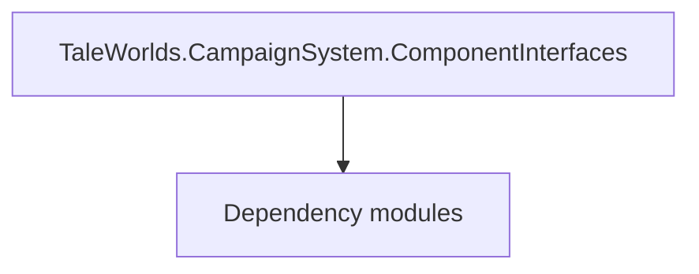

# TaleWorlds.CampaignSystem.ComponentInterfaces

**One-line responsibility:** This page covers all 138 business types under `TaleWorlds.CampaignSystem.ComponentInterfaces` as a family index, giving each type its namespace, responsibility, and typical timing so you can browse by module instead of alphabetically.

## Mental Model

ComponentInterfaces defines the swappable contracts behind campaign-system capabilities (clan member roles, election outcomes, policy effects, etc.). They let different implementations be plugged in without changing the callers, which is how the game keeps its many optional systems decoupled.

## When to Use

When you need a cross-cutting campaign capability that different modules may provide differently, implement the relevant ComponentInterface rather than hard-coding a concrete type.

## Dependencies

The types under `TaleWorlds.CampaignSystem.ComponentInterfaces` depend on the following modules; missing any of them causes compile- or run-time failure.

- [Campaign](../../campaign/Campaign)
- [API Overview](../../_index)

## Type Catalog

| Type | Namespace | Purpose | Timing |
| --- | --- | --- | --- |
| `AccessDetails` | TaleWorlds.CampaignSystem.ComponentInterfaces | AI decision implementation that must be interruptible and serializable to support saving and undo. Search must be depth/time bounded to avoid stalls. | Campaign init |
| `AccessLevel` | TaleWorlds.CampaignSystem.ComponentInterfaces | A business type under this namespace that carries its derived convention responsibility. Confirm its lifecycle and owning system before calling; do not reference an unready instance at the wrong phase. World-state changes should go through the corresponding Action/Behavior, not direct field mutation. | Campaign init |
| `AccessLimitationReason` | TaleWorlds.CampaignSystem.ComponentInterfaces | A business type under this namespace that carries its derived convention responsibility. Confirm its lifecycle and owning system before calling; do not reference an unready instance at the wrong phase. World-state changes should go through the corresponding Action/Behavior, not direct field mutation. | Campaign init |
| `AccessMethod` | TaleWorlds.CampaignSystem.ComponentInterfaces | A business type under this namespace that carries its derived convention responsibility. Confirm its lifecycle and owning system before calling; do not reference an unready instance at the wrong phase. World-state changes should go through the corresponding Action/Behavior, not direct field mutation. | Campaign init |
| `AgeModel` | TaleWorlds.CampaignSystem.ComponentInterfaces | Domain model that aggregates rules and calculations for Behaviors to call. When you replace a model you must provide an equivalent contract; an empty replacement hands null to its dependents. | Campaign init |
| `AlleyModel` | TaleWorlds.CampaignSystem.ComponentInterfaces | Domain model that aggregates rules and calculations for Behaviors to call. When you replace a model you must provide an equivalent contract; an empty replacement hands null to its dependents. | Campaign init |
| `AllianceModel` | TaleWorlds.CampaignSystem.ComponentInterfaces | Domain model that aggregates rules and calculations for Behaviors to call. When you replace a model you must provide an equivalent contract; an empty replacement hands null to its dependents. | Campaign init |
| `ArmyManagementCalculationModel` | TaleWorlds.CampaignSystem.ComponentInterfaces | Domain model that aggregates rules and calculations for Behaviors to call. When you replace a model you must provide an equivalent contract; an empty replacement hands null to its dependents. | Campaign init |
| `BanditDensityModel` | TaleWorlds.CampaignSystem.ComponentInterfaces | Domain model that aggregates rules and calculations for Behaviors to call. When you replace a model you must provide an equivalent contract; an empty replacement hands null to its dependents. | Campaign init |
| `BannerItemModel` | TaleWorlds.CampaignSystem.ComponentInterfaces | Domain model that aggregates rules and calculations for Behaviors to call. When you replace a model you must provide an equivalent contract; an empty replacement hands null to its dependents. | Campaign init |
| `BarterModel` | TaleWorlds.CampaignSystem.ComponentInterfaces | Domain model that aggregates rules and calculations for Behaviors to call. When you replace a model you must provide an equivalent contract; an empty replacement hands null to its dependents. | Campaign init |
| `BattleCaptainModel` | TaleWorlds.CampaignSystem.ComponentInterfaces | Domain model that aggregates rules and calculations for Behaviors to call. When you replace a model you must provide an equivalent contract; an empty replacement hands null to its dependents. | Campaign init |
| `BattleRewardModel` | TaleWorlds.CampaignSystem.ComponentInterfaces | Domain model that aggregates rules and calculations for Behaviors to call. When you replace a model you must provide an equivalent contract; an empty replacement hands null to its dependents. | Campaign init |
| `BodyPropertiesModel` | TaleWorlds.CampaignSystem.ComponentInterfaces | Domain model that aggregates rules and calculations for Behaviors to call. When you replace a model you must provide an equivalent contract; an empty replacement hands null to its dependents. | Campaign init |
| `BribeCalculationModel` | TaleWorlds.CampaignSystem.ComponentInterfaces | Domain model that aggregates rules and calculations for Behaviors to call. When you replace a model you must provide an equivalent contract; an empty replacement hands null to its dependents. | Campaign init |
| `BuildingConstructionModel` | TaleWorlds.CampaignSystem.ComponentInterfaces | Domain model that aggregates rules and calculations for Behaviors to call. When you replace a model you must provide an equivalent contract; an empty replacement hands null to its dependents. | Campaign init |
| `BuildingEffectModel` | TaleWorlds.CampaignSystem.ComponentInterfaces | Domain model that aggregates rules and calculations for Behaviors to call. When you replace a model you must provide an equivalent contract; an empty replacement hands null to its dependents. | Campaign init |
| `BuildingModel` | TaleWorlds.CampaignSystem.ComponentInterfaces | Domain model that aggregates rules and calculations for Behaviors to call. When you replace a model you must provide an equivalent contract; an empty replacement hands null to its dependents. | Campaign init |
| `BuildingScoreCalculationModel` | TaleWorlds.CampaignSystem.ComponentInterfaces | Domain model that aggregates rules and calculations for Behaviors to call. When you replace a model you must provide an equivalent contract; an empty replacement hands null to its dependents. | Campaign init |
| `CampaignShipDamageModel` | TaleWorlds.CampaignSystem.ComponentInterfaces | Domain model that aggregates rules and calculations for Behaviors to call. When you replace a model you must provide an equivalent contract; an empty replacement hands null to its dependents. | Campaign init |
| `CampaignShipParametersModel` | TaleWorlds.CampaignSystem.ComponentInterfaces | Domain model that aggregates rules and calculations for Behaviors to call. When you replace a model you must provide an equivalent contract; an empty replacement hands null to its dependents. | Campaign init |
| `CampaignTimeModel` | TaleWorlds.CampaignSystem.ComponentInterfaces | Domain model that aggregates rules and calculations for Behaviors to call. When you replace a model you must provide an equivalent contract; an empty replacement hands null to its dependents. | Campaign init |
| `CaravanModel` | TaleWorlds.CampaignSystem.ComponentInterfaces | Domain model that aggregates rules and calculations for Behaviors to call. When you replace a model you must provide an equivalent contract; an empty replacement hands null to its dependents. | Campaign init |
| `CharacterDevelopmentModel` | TaleWorlds.CampaignSystem.ComponentInterfaces | Domain model that aggregates rules and calculations for Behaviors to call. When you replace a model you must provide an equivalent contract; an empty replacement hands null to its dependents. | Campaign init |
| `CharacterStatsModel` | TaleWorlds.CampaignSystem.ComponentInterfaces | Domain model that aggregates rules and calculations for Behaviors to call. When you replace a model you must provide an equivalent contract; an empty replacement hands null to its dependents. | Campaign init |
| `ClanMemberPartyRoleModel` | TaleWorlds.CampaignSystem.ComponentInterfaces | Domain model that aggregates rules and calculations for Behaviors to call. When you replace a model you must provide an equivalent contract; an empty replacement hands null to its dependents. | Campaign init |
| `ClanPoliticsModel` | TaleWorlds.CampaignSystem.ComponentInterfaces | Domain model that aggregates rules and calculations for Behaviors to call. When you replace a model you must provide an equivalent contract; an empty replacement hands null to its dependents. | Campaign init |
| `ClanTierModel` | TaleWorlds.CampaignSystem.ComponentInterfaces | Domain model that aggregates rules and calculations for Behaviors to call. When you replace a model you must provide an equivalent contract; an empty replacement hands null to its dependents. | Campaign init |
| `CombatSimulationModel` | TaleWorlds.CampaignSystem.ComponentInterfaces | Domain model that aggregates rules and calculations for Behaviors to call. When you replace a model you must provide an equivalent contract; an empty replacement hands null to its dependents. | Campaign init |
| `CombatXpModel` | TaleWorlds.CampaignSystem.ComponentInterfaces | Domain model that aggregates rules and calculations for Behaviors to call. When you replace a model you must provide an equivalent contract; an empty replacement hands null to its dependents. | Campaign init |
| `CompanionHiringPriceCalculationModel` | TaleWorlds.CampaignSystem.ComponentInterfaces | Domain model that aggregates rules and calculations for Behaviors to call. When you replace a model you must provide an equivalent contract; an empty replacement hands null to its dependents. | Campaign init |
| `CrimeModel` | TaleWorlds.CampaignSystem.ComponentInterfaces | Domain model that aggregates rules and calculations for Behaviors to call. When you replace a model you must provide an equivalent contract; an empty replacement hands null to its dependents. | Campaign init |
| `CutsceneSelectionModel` | TaleWorlds.CampaignSystem.ComponentInterfaces | Domain model that aggregates rules and calculations for Behaviors to call. When you replace a model you must provide an equivalent contract; an empty replacement hands null to its dependents. | Campaign init |
| `DailyTroopXpBonusModel` | TaleWorlds.CampaignSystem.ComponentInterfaces | Domain model that aggregates rules and calculations for Behaviors to call. When you replace a model you must provide an equivalent contract; an empty replacement hands null to its dependents. | Campaign init |
| `DefectionModel` | TaleWorlds.CampaignSystem.ComponentInterfaces | Domain model that aggregates rules and calculations for Behaviors to call. When you replace a model you must provide an equivalent contract; an empty replacement hands null to its dependents. | Campaign init |
| `DelayedTeleportationModel` | TaleWorlds.CampaignSystem.ComponentInterfaces | Domain model that aggregates rules and calculations for Behaviors to call. When you replace a model you must provide an equivalent contract; an empty replacement hands null to its dependents. | Campaign init |
| `DifficultyModel` | TaleWorlds.CampaignSystem.ComponentInterfaces | Domain model that aggregates rules and calculations for Behaviors to call. When you replace a model you must provide an equivalent contract; an empty replacement hands null to its dependents. | Campaign init |
| `DiplomacyModel` | TaleWorlds.CampaignSystem.ComponentInterfaces | Domain model that aggregates rules and calculations for Behaviors to call. When you replace a model you must provide an equivalent contract; an empty replacement hands null to its dependents. | Campaign init |
| `DiplomacyStance` | TaleWorlds.CampaignSystem.ComponentInterfaces | A business type under this namespace that carries its derived convention responsibility. Confirm its lifecycle and owning system before calling; do not reference an unready instance at the wrong phase. World-state changes should go through the corresponding Action/Behavior, not direct field mutation. | Campaign init |
| `DisguiseDetectionModel` | TaleWorlds.CampaignSystem.ComponentInterfaces | Domain model that aggregates rules and calculations for Behaviors to call. When you replace a model you must provide an equivalent contract; an empty replacement hands null to its dependents. | Campaign init |
| `EmissaryModel` | TaleWorlds.CampaignSystem.ComponentInterfaces | Domain model that aggregates rules and calculations for Behaviors to call. When you replace a model you must provide an equivalent contract; an empty replacement hands null to its dependents. | Campaign init |
| `EncounterGameMenuModel` | TaleWorlds.CampaignSystem.ComponentInterfaces | Domain model that aggregates rules and calculations for Behaviors to call. When you replace a model you must provide an equivalent contract; an empty replacement hands null to its dependents. | Campaign init |
| `EncounterModel` | TaleWorlds.CampaignSystem.ComponentInterfaces | Domain model that aggregates rules and calculations for Behaviors to call. When you replace a model you must provide an equivalent contract; an empty replacement hands null to its dependents. | Campaign init |
| `EquipmentSelectionModel` | TaleWorlds.CampaignSystem.ComponentInterfaces | Domain model that aggregates rules and calculations for Behaviors to call. When you replace a model you must provide an equivalent contract; an empty replacement hands null to its dependents. | Campaign init |
| `ExecutionRelationModel` | TaleWorlds.CampaignSystem.ComponentInterfaces | Domain model that aggregates rules and calculations for Behaviors to call. When you replace a model you must provide an equivalent contract; an empty replacement hands null to its dependents. | Campaign init |
| `FleetManagementModel` | TaleWorlds.CampaignSystem.ComponentInterfaces | Domain model that aggregates rules and calculations for Behaviors to call. When you replace a model you must provide an equivalent contract; an empty replacement hands null to its dependents. | Campaign init |
| `GenericXpModel` | TaleWorlds.CampaignSystem.ComponentInterfaces | Domain model that aggregates rules and calculations for Behaviors to call. When you replace a model you must provide an equivalent contract; an empty replacement hands null to its dependents. | Campaign init |
| `HeirSelectionCalculationModel` | TaleWorlds.CampaignSystem.ComponentInterfaces | Domain model that aggregates rules and calculations for Behaviors to call. When you replace a model you must provide an equivalent contract; an empty replacement hands null to its dependents. | Campaign init |
| `HeroAgentLocationModel` | TaleWorlds.CampaignSystem.ComponentInterfaces | Domain model that aggregates rules and calculations for Behaviors to call. When you replace a model you must provide an equivalent contract; an empty replacement hands null to its dependents. | Campaign init |
| `HeroCreationModel` | TaleWorlds.CampaignSystem.ComponentInterfaces | Domain model that aggregates rules and calculations for Behaviors to call. When you replace a model you must provide an equivalent contract; an empty replacement hands null to its dependents. | Campaign init |
| `HeroDeathProbabilityCalculationModel` | TaleWorlds.CampaignSystem.ComponentInterfaces | Domain model that aggregates rules and calculations for Behaviors to call. When you replace a model you must provide an equivalent contract; an empty replacement hands null to its dependents. | Campaign init |
| `HeroLocationDetail` | TaleWorlds.CampaignSystem.ComponentInterfaces | AI decision implementation that must be interruptible and serializable to support saving and undo. Search must be depth/time bounded to avoid stalls. | Campaign init |
| `HideoutModel` | TaleWorlds.CampaignSystem.ComponentInterfaces | Domain model that aggregates rules and calculations for Behaviors to call. When you replace a model you must provide an equivalent contract; an empty replacement hands null to its dependents. | Campaign init |
| `INavigationCache` | TaleWorlds.CampaignSystem.ComponentInterfaces | A business type under this namespace that carries its derived convention responsibility. Confirm its lifecycle and owning system before calling; do not reference an unready instance at the wrong phase. World-state changes should go through the corresponding Action/Behavior, not direct field mutation. | Campaign init |
| `IncidentModel` | TaleWorlds.CampaignSystem.ComponentInterfaces | Domain model that aggregates rules and calculations for Behaviors to call. When you replace a model you must provide an equivalent contract; an empty replacement hands null to its dependents. | Campaign init |
| `InformationRestrictionModel` | TaleWorlds.CampaignSystem.ComponentInterfaces | Domain model that aggregates rules and calculations for Behaviors to call. When you replace a model you must provide an equivalent contract; an empty replacement hands null to its dependents. | Campaign init |
| `InventoryCapacityModel` | TaleWorlds.CampaignSystem.ComponentInterfaces | Domain model that aggregates rules and calculations for Behaviors to call. When you replace a model you must provide an equivalent contract; an empty replacement hands null to its dependents. | Campaign init |
| `IssueModel` | TaleWorlds.CampaignSystem.ComponentInterfaces | Domain model that aggregates rules and calculations for Behaviors to call. When you replace a model you must provide an equivalent contract; an empty replacement hands null to its dependents. | Campaign init |
| `ItemDiscardModel` | TaleWorlds.CampaignSystem.ComponentInterfaces | Domain model that aggregates rules and calculations for Behaviors to call. When you replace a model you must provide an equivalent contract; an empty replacement hands null to its dependents. | Campaign init |
| `KingdomCreationModel` | TaleWorlds.CampaignSystem.ComponentInterfaces | Domain model that aggregates rules and calculations for Behaviors to call. When you replace a model you must provide an equivalent contract; an empty replacement hands null to its dependents. | Campaign init |
| `KingdomDecisionPermissionModel` | TaleWorlds.CampaignSystem.ComponentInterfaces | Domain model that aggregates rules and calculations for Behaviors to call. When you replace a model you must provide an equivalent contract; an empty replacement hands null to its dependents. | Campaign init |
| `LimitedAccessSolution` | TaleWorlds.CampaignSystem.ComponentInterfaces | A business type under this namespace that carries its derived convention responsibility. Confirm its lifecycle and owning system before calling; do not reference an unready instance at the wrong phase. World-state changes should go through the corresponding Action/Behavior, not direct field mutation. | Campaign init |
| `LocationModel` | TaleWorlds.CampaignSystem.ComponentInterfaces | Domain model that aggregates rules and calculations for Behaviors to call. When you replace a model you must provide an equivalent contract; an empty replacement hands null to its dependents. | Campaign init |
| `MapDistanceModel` | TaleWorlds.CampaignSystem.ComponentInterfaces | Domain model that aggregates rules and calculations for Behaviors to call. When you replace a model you must provide an equivalent contract; an empty replacement hands null to its dependents. | Campaign init |
| `MapTrackModel` | TaleWorlds.CampaignSystem.ComponentInterfaces | Domain model that aggregates rules and calculations for Behaviors to call. When you replace a model you must provide an equivalent contract; an empty replacement hands null to its dependents. | Campaign init |
| `MapVisibilityModel` | TaleWorlds.CampaignSystem.ComponentInterfaces | Domain model that aggregates rules and calculations for Behaviors to call. When you replace a model you must provide an equivalent contract; an empty replacement hands null to its dependents. | Campaign init |
| `MapWeatherModel` | TaleWorlds.CampaignSystem.ComponentInterfaces | Domain model that aggregates rules and calculations for Behaviors to call. When you replace a model you must provide an equivalent contract; an empty replacement hands null to its dependents. | Campaign init |
| `MarriageModel` | TaleWorlds.CampaignSystem.ComponentInterfaces | Domain model that aggregates rules and calculations for Behaviors to call. When you replace a model you must provide an equivalent contract; an empty replacement hands null to its dependents. | Campaign init |
| `MilitaryPowerModel` | TaleWorlds.CampaignSystem.ComponentInterfaces | Domain model that aggregates rules and calculations for Behaviors to call. When you replace a model you must provide an equivalent contract; an empty replacement hands null to its dependents. | Campaign init |
| `MinorFactionsModel` | TaleWorlds.CampaignSystem.ComponentInterfaces | Domain model that aggregates rules and calculations for Behaviors to call. When you replace a model you must provide an equivalent contract; an empty replacement hands null to its dependents. | Campaign init |
| `MissionTypeEnum` | TaleWorlds.CampaignSystem.ComponentInterfaces | A business type under this namespace that carries its derived convention responsibility. Confirm its lifecycle and owning system before calling; do not reference an unready instance at the wrong phase. World-state changes should go through the corresponding Action/Behavior, not direct field mutation. | Campaign init |
| `MobilePartyAIModel` | TaleWorlds.CampaignSystem.ComponentInterfaces | Domain model that aggregates rules and calculations for Behaviors to call. When you replace a model you must provide an equivalent contract; an empty replacement hands null to its dependents. | Campaign init |
| `MobilePartyFoodConsumptionModel` | TaleWorlds.CampaignSystem.ComponentInterfaces | Domain model that aggregates rules and calculations for Behaviors to call. When you replace a model you must provide an equivalent contract; an empty replacement hands null to its dependents. | Campaign init |
| `MobilePartyMoraleModel` | TaleWorlds.CampaignSystem.ComponentInterfaces | Domain model that aggregates rules and calculations for Behaviors to call. When you replace a model you must provide an equivalent contract; an empty replacement hands null to its dependents. | Campaign init |
| `NotablePowerModel` | TaleWorlds.CampaignSystem.ComponentInterfaces | Domain model that aggregates rules and calculations for Behaviors to call. When you replace a model you must provide an equivalent contract; an empty replacement hands null to its dependents. | Campaign init |
| `NotableSpawnModel` | TaleWorlds.CampaignSystem.ComponentInterfaces | Domain model that aggregates rules and calculations for Behaviors to call. When you replace a model you must provide an equivalent contract; an empty replacement hands null to its dependents. | Campaign init |
| `PartyDesertionModel` | TaleWorlds.CampaignSystem.ComponentInterfaces | Domain model that aggregates rules and calculations for Behaviors to call. When you replace a model you must provide an equivalent contract; an empty replacement hands null to its dependents. | Campaign init |
| `PartyFoodBuyingModel` | TaleWorlds.CampaignSystem.ComponentInterfaces | Domain model that aggregates rules and calculations for Behaviors to call. When you replace a model you must provide an equivalent contract; an empty replacement hands null to its dependents. | Campaign init |
| `PartyHealingModel` | TaleWorlds.CampaignSystem.ComponentInterfaces | Domain model that aggregates rules and calculations for Behaviors to call. When you replace a model you must provide an equivalent contract; an empty replacement hands null to its dependents. | Campaign init |
| `PartyImpairmentModel` | TaleWorlds.CampaignSystem.ComponentInterfaces | Domain model that aggregates rules and calculations for Behaviors to call. When you replace a model you must provide an equivalent contract; an empty replacement hands null to its dependents. | Campaign init |
| `PartyMoraleModel` | TaleWorlds.CampaignSystem.ComponentInterfaces | Domain model that aggregates rules and calculations for Behaviors to call. When you replace a model you must provide an equivalent contract; an empty replacement hands null to its dependents. | Campaign init |
| `PartyNavigationModel` | TaleWorlds.CampaignSystem.ComponentInterfaces | Domain model that aggregates rules and calculations for Behaviors to call. When you replace a model you must provide an equivalent contract; an empty replacement hands null to its dependents. | Campaign init |
| `PartyShipLimitModel` | TaleWorlds.CampaignSystem.ComponentInterfaces | Domain model that aggregates rules and calculations for Behaviors to call. When you replace a model you must provide an equivalent contract; an empty replacement hands null to its dependents. | Campaign init |
| `PartySizeLimitModel` | TaleWorlds.CampaignSystem.ComponentInterfaces | Domain model that aggregates rules and calculations for Behaviors to call. When you replace a model you must provide an equivalent contract; an empty replacement hands null to its dependents. | Campaign init |
| `PartySpeedModel` | TaleWorlds.CampaignSystem.ComponentInterfaces | Domain model that aggregates rules and calculations for Behaviors to call. When you replace a model you must provide an equivalent contract; an empty replacement hands null to its dependents. | Campaign init |
| `PartyTradeModel` | TaleWorlds.CampaignSystem.ComponentInterfaces | Domain model that aggregates rules and calculations for Behaviors to call. When you replace a model you must provide an equivalent contract; an empty replacement hands null to its dependents. | Campaign init |
| `PartyTrainingModel` | TaleWorlds.CampaignSystem.ComponentInterfaces | Domain model that aggregates rules and calculations for Behaviors to call. When you replace a model you must provide an equivalent contract; an empty replacement hands null to its dependents. | Campaign init |
| `PartyTransitionModel` | TaleWorlds.CampaignSystem.ComponentInterfaces | Domain model that aggregates rules and calculations for Behaviors to call. When you replace a model you must provide an equivalent contract; an empty replacement hands null to its dependents. | Campaign init |
| `PartyTroopUpgradeModel` | TaleWorlds.CampaignSystem.ComponentInterfaces | Domain model that aggregates rules and calculations for Behaviors to call. When you replace a model you must provide an equivalent contract; an empty replacement hands null to its dependents. | Campaign init |
| `PartyWageModel` | TaleWorlds.CampaignSystem.ComponentInterfaces | Domain model that aggregates rules and calculations for Behaviors to call. When you replace a model you must provide an equivalent contract; an empty replacement hands null to its dependents. | Campaign init |
| `PaymentMethod` | TaleWorlds.CampaignSystem.ComponentInterfaces | A business type under this namespace that carries its derived convention responsibility. Confirm its lifecycle and owning system before calling; do not reference an unready instance at the wrong phase. World-state changes should go through the corresponding Action/Behavior, not direct field mutation. | Campaign init |
| `PersuasionModel` | TaleWorlds.CampaignSystem.ComponentInterfaces | Domain model that aggregates rules and calculations for Behaviors to call. When you replace a model you must provide an equivalent contract; an empty replacement hands null to its dependents. | Campaign init |
| `PlayerProgressionModel` | TaleWorlds.CampaignSystem.ComponentInterfaces | Domain model that aggregates rules and calculations for Behaviors to call. When you replace a model you must provide an equivalent contract; an empty replacement hands null to its dependents. | Campaign init |
| `PregnancyModel` | TaleWorlds.CampaignSystem.ComponentInterfaces | Domain model that aggregates rules and calculations for Behaviors to call. When you replace a model you must provide an equivalent contract; an empty replacement hands null to its dependents. | Campaign init |
| `PreliminaryActionObligation` | TaleWorlds.CampaignSystem.ComponentInterfaces | A business type under this namespace that carries its derived convention responsibility. Confirm its lifecycle and owning system before calling; do not reference an unready instance at the wrong phase. World-state changes should go through the corresponding Action/Behavior, not direct field mutation. | Campaign init |
| `PreliminaryActionType` | TaleWorlds.CampaignSystem.ComponentInterfaces | A business type under this namespace that carries its derived convention responsibility. Confirm its lifecycle and owning system before calling; do not reference an unready instance at the wrong phase. World-state changes should go through the corresponding Action/Behavior, not direct field mutation. | Campaign init |
| `PrisonBreakModel` | TaleWorlds.CampaignSystem.ComponentInterfaces | Domain model that aggregates rules and calculations for Behaviors to call. When you replace a model you must provide an equivalent contract; an empty replacement hands null to its dependents. | Campaign init |
| `PrisonerDonationModel` | TaleWorlds.CampaignSystem.ComponentInterfaces | Domain model that aggregates rules and calculations for Behaviors to call. When you replace a model you must provide an equivalent contract; an empty replacement hands null to its dependents. | Campaign init |
| `PrisonerRecruitmentCalculationModel` | TaleWorlds.CampaignSystem.ComponentInterfaces | Domain model that aggregates rules and calculations for Behaviors to call. When you replace a model you must provide an equivalent contract; an empty replacement hands null to its dependents. | Campaign init |
| `RaidModel` | TaleWorlds.CampaignSystem.ComponentInterfaces | Domain model that aggregates rules and calculations for Behaviors to call. When you replace a model you must provide an equivalent contract; an empty replacement hands null to its dependents. | Campaign init |
| `RansomValueCalculationModel` | TaleWorlds.CampaignSystem.ComponentInterfaces | Domain model that aggregates rules and calculations for Behaviors to call. When you replace a model you must provide an equivalent contract; an empty replacement hands null to its dependents. | Campaign init |
| `RomanceModel` | TaleWorlds.CampaignSystem.ComponentInterfaces | Domain model that aggregates rules and calculations for Behaviors to call. When you replace a model you must provide an equivalent contract; an empty replacement hands null to its dependents. | Campaign init |
| `SceneModel` | TaleWorlds.CampaignSystem.ComponentInterfaces | Domain model that aggregates rules and calculations for Behaviors to call. When you replace a model you must provide an equivalent contract; an empty replacement hands null to its dependents. | Campaign init |
| `SettlementAccessModel` | TaleWorlds.CampaignSystem.ComponentInterfaces | Domain model that aggregates rules and calculations for Behaviors to call. When you replace a model you must provide an equivalent contract; an empty replacement hands null to its dependents. | Campaign init |
| `SettlementAction` | TaleWorlds.CampaignSystem.ComponentInterfaces | Game action that encapsulates a single state change and executes it through the Action system. You must use Apply rather than mutating fields directly, otherwise you skip event cascades and corrupt saves. | Campaign init |
| `SettlementEconomyModel` | TaleWorlds.CampaignSystem.ComponentInterfaces | Domain model that aggregates rules and calculations for Behaviors to call. When you replace a model you must provide an equivalent contract; an empty replacement hands null to its dependents. | Campaign init |
| `SettlementFoodModel` | TaleWorlds.CampaignSystem.ComponentInterfaces | Domain model that aggregates rules and calculations for Behaviors to call. When you replace a model you must provide an equivalent contract; an empty replacement hands null to its dependents. | Campaign init |
| `SettlementGarrisonModel` | TaleWorlds.CampaignSystem.ComponentInterfaces | Domain model that aggregates rules and calculations for Behaviors to call. When you replace a model you must provide an equivalent contract; an empty replacement hands null to its dependents. | Campaign init |
| `SettlementMenuOverlayModel` | TaleWorlds.CampaignSystem.ComponentInterfaces | Domain model that aggregates rules and calculations for Behaviors to call. When you replace a model you must provide an equivalent contract; an empty replacement hands null to its dependents. | Campaign init |
| `SettlementMilitiaModel` | TaleWorlds.CampaignSystem.ComponentInterfaces | Domain model that aggregates rules and calculations for Behaviors to call. When you replace a model you must provide an equivalent contract; an empty replacement hands null to its dependents. | Campaign init |
| `SettlementPatrolModel` | TaleWorlds.CampaignSystem.ComponentInterfaces | Domain model that aggregates rules and calculations for Behaviors to call. When you replace a model you must provide an equivalent contract; an empty replacement hands null to its dependents. | Campaign init |
| `SettlementProsperityModel` | TaleWorlds.CampaignSystem.ComponentInterfaces | Domain model that aggregates rules and calculations for Behaviors to call. When you replace a model you must provide an equivalent contract; an empty replacement hands null to its dependents. | Campaign init |
| `SettlementTaxModel` | TaleWorlds.CampaignSystem.ComponentInterfaces | Domain model that aggregates rules and calculations for Behaviors to call. When you replace a model you must provide an equivalent contract; an empty replacement hands null to its dependents. | Campaign init |
| `SettlementValueModel` | TaleWorlds.CampaignSystem.ComponentInterfaces | Domain model that aggregates rules and calculations for Behaviors to call. When you replace a model you must provide an equivalent contract; an empty replacement hands null to its dependents. | Campaign init |
| `ShipCostModel` | TaleWorlds.CampaignSystem.ComponentInterfaces | Domain model that aggregates rules and calculations for Behaviors to call. When you replace a model you must provide an equivalent contract; an empty replacement hands null to its dependents. | Campaign init |
| `ShipStatModel` | TaleWorlds.CampaignSystem.ComponentInterfaces | Domain model that aggregates rules and calculations for Behaviors to call. When you replace a model you must provide an equivalent contract; an empty replacement hands null to its dependents. | Campaign init |
| `SiegeAction` | TaleWorlds.CampaignSystem.ComponentInterfaces | Game action that encapsulates a single state change and executes it through the Action system. You must use Apply rather than mutating fields directly, otherwise you skip event cascades and corrupt saves. | Campaign init |
| `SiegeAftermathModel` | TaleWorlds.CampaignSystem.ComponentInterfaces | Domain model that aggregates rules and calculations for Behaviors to call. When you replace a model you must provide an equivalent contract; an empty replacement hands null to its dependents. | Campaign init |
| `SiegeEventModel` | TaleWorlds.CampaignSystem.ComponentInterfaces | Domain model that aggregates rules and calculations for Behaviors to call. When you replace a model you must provide an equivalent contract; an empty replacement hands null to its dependents. | Campaign init |
| `SiegeLordsHallFightModel` | TaleWorlds.CampaignSystem.ComponentInterfaces | Domain model that aggregates rules and calculations for Behaviors to call. When you replace a model you must provide an equivalent contract; an empty replacement hands null to its dependents. | Campaign init |
| `SiegeStrategyActionModel` | TaleWorlds.CampaignSystem.ComponentInterfaces | Domain model that aggregates rules and calculations for Behaviors to call. When you replace a model you must provide an equivalent contract; an empty replacement hands null to its dependents. | Campaign init |
| `SmithingModel` | TaleWorlds.CampaignSystem.ComponentInterfaces | Domain model that aggregates rules and calculations for Behaviors to call. When you replace a model you must provide an equivalent contract; an empty replacement hands null to its dependents. | Campaign init |
| `TargetScoreCalculatingModel` | TaleWorlds.CampaignSystem.ComponentInterfaces | Domain model that aggregates rules and calculations for Behaviors to call. When you replace a model you must provide an equivalent contract; an empty replacement hands null to its dependents. | Campaign init |
| `TavernMercenaryTroopsModel` | TaleWorlds.CampaignSystem.ComponentInterfaces | Domain model that aggregates rules and calculations for Behaviors to call. When you replace a model you must provide an equivalent contract; an empty replacement hands null to its dependents. | Campaign init |
| `TournamentModel` | TaleWorlds.CampaignSystem.ComponentInterfaces | Domain model that aggregates rules and calculations for Behaviors to call. When you replace a model you must provide an equivalent contract; an empty replacement hands null to its dependents. | Campaign init |
| `TradeAgreementModel` | TaleWorlds.CampaignSystem.ComponentInterfaces | Domain model that aggregates rules and calculations for Behaviors to call. When you replace a model you must provide an equivalent contract; an empty replacement hands null to its dependents. | Campaign init |
| `TradeItemPriceFactorModel` | TaleWorlds.CampaignSystem.ComponentInterfaces | Domain model that aggregates rules and calculations for Behaviors to call. When you replace a model you must provide an equivalent contract; an empty replacement hands null to its dependents. | Campaign init |
| `TroopSacrificeModel` | TaleWorlds.CampaignSystem.ComponentInterfaces | Domain model that aggregates rules and calculations for Behaviors to call. When you replace a model you must provide an equivalent contract; an empty replacement hands null to its dependents. | Campaign init |
| `TroopSupplierProbabilityModel` | TaleWorlds.CampaignSystem.ComponentInterfaces | Domain model that aggregates rules and calculations for Behaviors to call. When you replace a model you must provide an equivalent contract; an empty replacement hands null to its dependents. | Campaign init |
| `ValuationModel` | TaleWorlds.CampaignSystem.ComponentInterfaces | Domain model that aggregates rules and calculations for Behaviors to call. When you replace a model you must provide an equivalent contract; an empty replacement hands null to its dependents. | Campaign init |
| `VassalRewardsModel` | TaleWorlds.CampaignSystem.ComponentInterfaces | Domain model that aggregates rules and calculations for Behaviors to call. When you replace a model you must provide an equivalent contract; an empty replacement hands null to its dependents. | Campaign init |
| `VillageProductionCalculatorModel` | TaleWorlds.CampaignSystem.ComponentInterfaces | Domain model that aggregates rules and calculations for Behaviors to call. When you replace a model you must provide an equivalent contract; an empty replacement hands null to its dependents. | Campaign init |
| `VoiceOverModel` | TaleWorlds.CampaignSystem.ComponentInterfaces | Domain model that aggregates rules and calculations for Behaviors to call. When you replace a model you must provide an equivalent contract; an empty replacement hands null to its dependents. | Campaign init |
| `VolunteerModel` | TaleWorlds.CampaignSystem.ComponentInterfaces | Domain model that aggregates rules and calculations for Behaviors to call. When you replace a model you must provide an equivalent contract; an empty replacement hands null to its dependents. | Campaign init |
| `WallHitPointCalculationModel` | TaleWorlds.CampaignSystem.ComponentInterfaces | Domain model that aggregates rules and calculations for Behaviors to call. When you replace a model you must provide an equivalent contract; an empty replacement hands null to its dependents. | Campaign init |
| `WeatherEvent` | TaleWorlds.CampaignSystem.ComponentInterfaces | Event or event handler carrying the data of something that happened once. Remember to unsubscribe on unload to avoid leaks. | Campaign init |
| `WeatherEventEffectOnTerrain` | TaleWorlds.CampaignSystem.ComponentInterfaces | AI decision implementation that must be interruptible and serializable to support saving and undo. Search must be depth/time bounded to avoid stalls. | Campaign init |
| `WorkshopModel` | TaleWorlds.CampaignSystem.ComponentInterfaces | Domain model that aggregates rules and calculations for Behaviors to call. When you replace a model you must provide an equivalent contract; an empty replacement hands null to its dependents. | Campaign init |

## Risk & Boundaries

Interfaces are only as good as their registered implementation; calling a capability with no implementation yields null. Keep contracts minimal and stable across save versions.

## See Also

- [Campaign](../../campaign/Campaign)
- [API Overview](../../_index)
