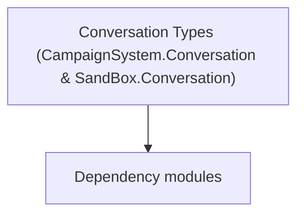

# Conversation Types (CampaignSystem.Conversation & SandBox.Conversation)

**One-line responsibility:** This page covers all 122 business types under `Conversation Types (CampaignSystem.Conversation & SandBox.Conversation)` as a family index, giving each type its namespace, responsibility, and typical timing so you can browse by module instead of alphabetically.

## Mental Model

Conversation types organize NPC interaction into branchable, localizable dialogue flows and the persuasion minigame. Conversation.Tags classify dialogue lines and Persuasion implements the barter/persuade mechanic; SandBox.Conversation adds the in-mission dialogue logic. They are triggered by MissionBehavior at the right scene.

## When to Use

To extend NPC dialogue lines or in-mission conversation performance, derive from the relevant conversation type and wire it into the conversation system. Keep branches and localization complete.

## Dependencies

The types under `Conversation Types (CampaignSystem.Conversation & SandBox.Conversation)` depend on the following modules; missing any of them causes compile- or run-time failure.

- [Campaign](../../campaign/Campaign)
- [API Overview](../../_index)

## Type Catalog

| Type | Namespace | Purpose | Timing |
| --- | --- | --- | --- |
| `ConversationMission` | SandBox.Conversation | Conversation-related type participating in the dialogue tree and performance. Dialogue-line changes must mind branches and localization. | Campaign init |
| `ConversationMissionLogic` | SandBox.Conversation.MissionLogics | Mission logic that defines the flow and win/lose conditions of that mission, assembled by the Mission on load. Win/lose resolution must be idempotent — repeated triggers must not double-settle. | On battle/mission load |
| `MissionConversationLogic` | SandBox.Conversation.MissionLogics | Mission logic that defines the flow and win/lose conditions of that mission, assembled by the Mission on load. Win/lose resolution must be idempotent — repeated triggers must not double-settle. | On battle/mission load |
| `CampaignMapConversation` | TaleWorlds.CampaignSystem.Conversation | AI decision implementation that must be interruptible and serializable to support saving and undo. Search must be depth/time bounded to avoid stalls. | Campaign init |
| `ConversationAnimationManager` | TaleWorlds.CampaignSystem.Conversation | Conversation-related type participating in the dialogue tree and performance. Dialogue-line changes must mind branches and localization. | Campaign init |
| `ConversationAnimData` | TaleWorlds.CampaignSystem.Conversation | Conversation-related type participating in the dialogue tree and performance. Dialogue-line changes must mind branches and localization. | Campaign init |
| `ConversationCharacterData` | TaleWorlds.CampaignSystem.Conversation | Conversation-related type participating in the dialogue tree and performance. Dialogue-line changes must mind branches and localization. | Campaign init |
| `ConversationHelper` | TaleWorlds.CampaignSystem.Conversation | Conversation-related type participating in the dialogue tree and performance. Dialogue-line changes must mind branches and localization. | Campaign init |
| `ConversationManager` | TaleWorlds.CampaignSystem.Conversation | Conversation-related type participating in the dialogue tree and performance. Dialogue-line changes must mind branches and localization. | Campaign init |
| `ConversationSentence` | TaleWorlds.CampaignSystem.Conversation | Conversation-related type participating in the dialogue tree and performance. Dialogue-line changes must mind branches and localization. | Campaign init |
| `ConversationSentenceOption` | TaleWorlds.CampaignSystem.Conversation | Conversation-related type participating in the dialogue tree and performance. Dialogue-line changes must mind branches and localization. | Campaign init |
| `ConversationToken` | TaleWorlds.CampaignSystem.Conversation | Conversation-related type participating in the dialogue tree and performance. Dialogue-line changes must mind branches and localization. | Campaign init |
| `ConversationTokens` | TaleWorlds.CampaignSystem.Conversation | Conversation-related type participating in the dialogue tree and performance. Dialogue-line changes must mind branches and localization. | Campaign init |
| `DialogLineFlags` | TaleWorlds.CampaignSystem.Conversation | Conversation-related type participating in the dialogue tree and performance. Dialogue-line changes must mind branches and localization. | Campaign init |
| `IConversationStateHandler` | TaleWorlds.CampaignSystem.Conversation | Conversation-related type participating in the dialogue tree and performance. Dialogue-line changes must mind branches and localization. | Campaign init |
| `MapConversationAgent` | TaleWorlds.CampaignSystem.Conversation | Conversation-related type participating in the dialogue tree and performance. Dialogue-line changes must mind branches and localization. | Campaign init |
| `TaggedString` | TaleWorlds.CampaignSystem.Conversation | Conversation-related type participating in the dialogue tree and performance. Dialogue-line changes must mind branches and localization. | Campaign init |
| `Persuasion` | TaleWorlds.CampaignSystem.Conversation.Persuasion | Conversation-related type participating in the dialogue tree and performance. Dialogue-line changes must mind branches and localization. | Campaign init |
| `PersuasionArgumentStrength` | TaleWorlds.CampaignSystem.Conversation.Persuasion | Conversation-related type participating in the dialogue tree and performance. Dialogue-line changes must mind branches and localization. | Campaign init |
| `PersuasionAttempt` | TaleWorlds.CampaignSystem.Conversation.Persuasion | Conversation-related type participating in the dialogue tree and performance. Dialogue-line changes must mind branches and localization. | Campaign init |
| `PersuasionDifficulty` | TaleWorlds.CampaignSystem.Conversation.Persuasion | Conversation-related type participating in the dialogue tree and performance. Dialogue-line changes must mind branches and localization. | Campaign init |
| `PersuasionOptionArgs` | TaleWorlds.CampaignSystem.Conversation.Persuasion | Conversation-related type participating in the dialogue tree and performance. Dialogue-line changes must mind branches and localization. | Campaign init |
| `PersuasionOptionResult` | TaleWorlds.CampaignSystem.Conversation.Persuasion | Conversation-related type participating in the dialogue tree and performance. Dialogue-line changes must mind branches and localization. | Campaign init |
| `PersuasionTask` | TaleWorlds.CampaignSystem.Conversation.Persuasion | Quest-stage sub-goal that defines one completion condition and settlement. Condition checks must be idempotent — repeated completion must not double-reward. | Campaign init |
| `TraitEffect` | TaleWorlds.CampaignSystem.Conversation.Persuasion | AI decision implementation that must be interruptible and serializable to support saving and undo. Search must be depth/time bounded to avoid stalls. | Campaign init |
| `AlliedLordTag` | TaleWorlds.CampaignSystem.Conversation.Tags | Conversation-related type participating in the dialogue tree and performance. Dialogue-line changes must mind branches and localization. | Campaign init |
| `AmoralTag` | TaleWorlds.CampaignSystem.Conversation.Tags | Conversation-related type participating in the dialogue tree and performance. Dialogue-line changes must mind branches and localization. | Campaign init |
| `AnyNotableTypeTag` | TaleWorlds.CampaignSystem.Conversation.Tags | Conversation-related type participating in the dialogue tree and performance. Dialogue-line changes must mind branches and localization. | Campaign init |
| `ArtisanNotableTypeTag` | TaleWorlds.CampaignSystem.Conversation.Tags | Conversation-related type participating in the dialogue tree and performance. Dialogue-line changes must mind branches and localization. | Campaign init |
| `AseraiTag` | TaleWorlds.CampaignSystem.Conversation.Tags | AI decision implementation that must be interruptible and serializable to support saving and undo. Search must be depth/time bounded to avoid stalls. | Campaign init |
| `AttackingTag` | TaleWorlds.CampaignSystem.Conversation.Tags | Conversation-related type participating in the dialogue tree and performance. Dialogue-line changes must mind branches and localization. | Campaign init |
| `AttractedToPlayerTag` | TaleWorlds.CampaignSystem.Conversation.Tags | Conversation-related type participating in the dialogue tree and performance. Dialogue-line changes must mind branches and localization. | Campaign init |
| `BattanianTag` | TaleWorlds.CampaignSystem.Conversation.Tags | Conversation-related type participating in the dialogue tree and performance. Dialogue-line changes must mind branches and localization. | Campaign init |
| `CalculatingTag` | TaleWorlds.CampaignSystem.Conversation.Tags | Conversation-related type participating in the dialogue tree and performance. Dialogue-line changes must mind branches and localization. | Campaign init |
| `CautiousTag` | TaleWorlds.CampaignSystem.Conversation.Tags | Conversation-related type participating in the dialogue tree and performance. Dialogue-line changes must mind branches and localization. | Campaign init |
| `ChivalrousTag` | TaleWorlds.CampaignSystem.Conversation.Tags | Conversation-related type participating in the dialogue tree and performance. Dialogue-line changes must mind branches and localization. | Campaign init |
| `CombatantTag` | TaleWorlds.CampaignSystem.Conversation.Tags | Conversation-related type participating in the dialogue tree and performance. Dialogue-line changes must mind branches and localization. | Campaign init |
| `ConversationTag` | TaleWorlds.CampaignSystem.Conversation.Tags | Conversation-related type participating in the dialogue tree and performance. Dialogue-line changes must mind branches and localization. | Campaign init |
| `ConversationTagHelper` | TaleWorlds.CampaignSystem.Conversation.Tags | Conversation-related type participating in the dialogue tree and performance. Dialogue-line changes must mind branches and localization. | Campaign init |
| `CruelTag` | TaleWorlds.CampaignSystem.Conversation.Tags | Conversation-related type participating in the dialogue tree and performance. Dialogue-line changes must mind branches and localization. | Campaign init |
| `CurrentConversationIsFirst` | TaleWorlds.CampaignSystem.Conversation.Tags | Conversation-related type participating in the dialogue tree and performance. Dialogue-line changes must mind branches and localization. | Campaign init |
| `DefaultTag` | TaleWorlds.CampaignSystem.Conversation.Tags | Conversation-related type participating in the dialogue tree and performance. Dialogue-line changes must mind branches and localization. | Campaign init |
| `DeviousTag` | TaleWorlds.CampaignSystem.Conversation.Tags | Conversation-related type participating in the dialogue tree and performance. Dialogue-line changes must mind branches and localization. | Campaign init |
| `DrinkingInTavernTag` | TaleWorlds.CampaignSystem.Conversation.Tags | Conversation-related type participating in the dialogue tree and performance. Dialogue-line changes must mind branches and localization. | Campaign init |
| `EmpireTag` | TaleWorlds.CampaignSystem.Conversation.Tags | Conversation-related type participating in the dialogue tree and performance. Dialogue-line changes must mind branches and localization. | Campaign init |
| `EngagedToPlayerTag` | TaleWorlds.CampaignSystem.Conversation.Tags | Conversation-related type participating in the dialogue tree and performance. Dialogue-line changes must mind branches and localization. | Campaign init |
| `FirstMeetingTag` | TaleWorlds.CampaignSystem.Conversation.Tags | Conversation-related type participating in the dialogue tree and performance. Dialogue-line changes must mind branches and localization. | Campaign init |
| `FriendlyRelationshipTag` | TaleWorlds.CampaignSystem.Conversation.Tags | Conversation-related type participating in the dialogue tree and performance. Dialogue-line changes must mind branches and localization. | Campaign init |
| `GangLeaderNotableTypeTag` | TaleWorlds.CampaignSystem.Conversation.Tags | Conversation-related type participating in the dialogue tree and performance. Dialogue-line changes must mind branches and localization. | Campaign init |
| `GenerosityTag` | TaleWorlds.CampaignSystem.Conversation.Tags | Conversation-related type participating in the dialogue tree and performance. Dialogue-line changes must mind branches and localization. | Campaign init |
| `HeadmanNotableTypeTag` | TaleWorlds.CampaignSystem.Conversation.Tags | Conversation-related type participating in the dialogue tree and performance. Dialogue-line changes must mind branches and localization. | Campaign init |
| `HighRegisterTag` | TaleWorlds.CampaignSystem.Conversation.Tags | Conversation-related type participating in the dialogue tree and performance. Dialogue-line changes must mind branches and localization. | Campaign init |
| `HonorTag` | TaleWorlds.CampaignSystem.Conversation.Tags | Conversation-related type participating in the dialogue tree and performance. Dialogue-line changes must mind branches and localization. | Campaign init |
| `HostileRelationshipTag` | TaleWorlds.CampaignSystem.Conversation.Tags | Conversation-related type participating in the dialogue tree and performance. Dialogue-line changes must mind branches and localization. | Campaign init |
| `ImpoliteTag` | TaleWorlds.CampaignSystem.Conversation.Tags | Conversation-related type participating in the dialogue tree and performance. Dialogue-line changes must mind branches and localization. | Campaign init |
| `ImpulsiveTag` | TaleWorlds.CampaignSystem.Conversation.Tags | Conversation-related type participating in the dialogue tree and performance. Dialogue-line changes must mind branches and localization. | Campaign init |
| `InHomeSettlementTag` | TaleWorlds.CampaignSystem.Conversation.Tags | Conversation-related type participating in the dialogue tree and performance. Dialogue-line changes must mind branches and localization. | Campaign init |
| `KhuzaitTag` | TaleWorlds.CampaignSystem.Conversation.Tags | AI decision implementation that must be interruptible and serializable to support saving and undo. Search must be depth/time bounded to avoid stalls. | Campaign init |
| `LowRegisterTag` | TaleWorlds.CampaignSystem.Conversation.Tags | Conversation-related type participating in the dialogue tree and performance. Dialogue-line changes must mind branches and localization. | Campaign init |
| `MerchantNotableTypeTag` | TaleWorlds.CampaignSystem.Conversation.Tags | Conversation-related type participating in the dialogue tree and performance. Dialogue-line changes must mind branches and localization. | Campaign init |
| `MercyTag` | TaleWorlds.CampaignSystem.Conversation.Tags | Conversation-related type participating in the dialogue tree and performance. Dialogue-line changes must mind branches and localization. | Campaign init |
| `MetBeforeTag` | TaleWorlds.CampaignSystem.Conversation.Tags | Conversation-related type participating in the dialogue tree and performance. Dialogue-line changes must mind branches and localization. | Campaign init |
| `NoConflictTag` | TaleWorlds.CampaignSystem.Conversation.Tags | Conversation-related type participating in the dialogue tree and performance. Dialogue-line changes must mind branches and localization. | Campaign init |
| `NonCombatantTag` | TaleWorlds.CampaignSystem.Conversation.Tags | Conversation-related type participating in the dialogue tree and performance. Dialogue-line changes must mind branches and localization. | Campaign init |
| `NonviolentProfessionTag` | TaleWorlds.CampaignSystem.Conversation.Tags | Conversation-related type participating in the dialogue tree and performance. Dialogue-line changes must mind branches and localization. | Campaign init |
| `NordTag` | TaleWorlds.CampaignSystem.Conversation.Tags | Conversation-related type participating in the dialogue tree and performance. Dialogue-line changes must mind branches and localization. | Campaign init |
| `NpcIsFemaleTag` | TaleWorlds.CampaignSystem.Conversation.Tags | Conversation-related type participating in the dialogue tree and performance. Dialogue-line changes must mind branches and localization. | Campaign init |
| `NPCIsInSeaTag` | TaleWorlds.CampaignSystem.Conversation.Tags | Conversation-related type participating in the dialogue tree and performance. Dialogue-line changes must mind branches and localization. | Campaign init |
| `NpcIsLiegeTag` | TaleWorlds.CampaignSystem.Conversation.Tags | Conversation-related type participating in the dialogue tree and performance. Dialogue-line changes must mind branches and localization. | Campaign init |
| `NpcIsMaleTag` | TaleWorlds.CampaignSystem.Conversation.Tags | Conversation-related type participating in the dialogue tree and performance. Dialogue-line changes must mind branches and localization. | Campaign init |
| `NpcIsNobleTag` | TaleWorlds.CampaignSystem.Conversation.Tags | Conversation-related type participating in the dialogue tree and performance. Dialogue-line changes must mind branches and localization. | Campaign init |
| `OldTag` | TaleWorlds.CampaignSystem.Conversation.Tags | Conversation-related type participating in the dialogue tree and performance. Dialogue-line changes must mind branches and localization. | Campaign init |
| `OnTheRoadTag` | TaleWorlds.CampaignSystem.Conversation.Tags | Conversation-related type participating in the dialogue tree and performance. Dialogue-line changes must mind branches and localization. | Campaign init |
| `OutlawSympathyTag` | TaleWorlds.CampaignSystem.Conversation.Tags | Conversation-related type participating in the dialogue tree and performance. Dialogue-line changes must mind branches and localization. | Campaign init |
| `PersonaCurtTag` | TaleWorlds.CampaignSystem.Conversation.Tags | Conversation-related type participating in the dialogue tree and performance. Dialogue-line changes must mind branches and localization. | Campaign init |
| `PersonaEarnestTag` | TaleWorlds.CampaignSystem.Conversation.Tags | Conversation-related type participating in the dialogue tree and performance. Dialogue-line changes must mind branches and localization. | Campaign init |
| `PersonaIronicTag` | TaleWorlds.CampaignSystem.Conversation.Tags | AI decision implementation that must be interruptible and serializable to support saving and undo. Search must be depth/time bounded to avoid stalls. | Campaign init |
| `PersonaSoftspokenTag` | TaleWorlds.CampaignSystem.Conversation.Tags | Conversation-related type participating in the dialogue tree and performance. Dialogue-line changes must mind branches and localization. | Campaign init |
| `PlayerBesiegingTag` | TaleWorlds.CampaignSystem.Conversation.Tags | Conversation-related type participating in the dialogue tree and performance. Dialogue-line changes must mind branches and localization. | Campaign init |
| `PlayerIsAffiliatedTag` | TaleWorlds.CampaignSystem.Conversation.Tags | Conversation-related type participating in the dialogue tree and performance. Dialogue-line changes must mind branches and localization. | Campaign init |
| `PlayerIsAtSeaTag` | TaleWorlds.CampaignSystem.Conversation.Tags | Conversation-related type participating in the dialogue tree and performance. Dialogue-line changes must mind branches and localization. | Campaign init |
| `PlayerIsBrotherTag` | TaleWorlds.CampaignSystem.Conversation.Tags | Conversation-related type participating in the dialogue tree and performance. Dialogue-line changes must mind branches and localization. | Campaign init |
| `PlayerIsDaughterTag` | TaleWorlds.CampaignSystem.Conversation.Tags | Conversation-related type participating in the dialogue tree and performance. Dialogue-line changes must mind branches and localization. | Campaign init |
| `PlayerIsEnemyTag` | TaleWorlds.CampaignSystem.Conversation.Tags | Conversation-related type participating in the dialogue tree and performance. Dialogue-line changes must mind branches and localization. | Campaign init |
| `PlayerIsFamousTag` | TaleWorlds.CampaignSystem.Conversation.Tags | Conversation-related type participating in the dialogue tree and performance. Dialogue-line changes must mind branches and localization. | Campaign init |
| `PlayerIsFatherTag` | TaleWorlds.CampaignSystem.Conversation.Tags | Conversation-related type participating in the dialogue tree and performance. Dialogue-line changes must mind branches and localization. | Campaign init |
| `PlayerIsFemaleTag` | TaleWorlds.CampaignSystem.Conversation.Tags | Conversation-related type participating in the dialogue tree and performance. Dialogue-line changes must mind branches and localization. | Campaign init |
| `PlayerIsKinTag` | TaleWorlds.CampaignSystem.Conversation.Tags | Conversation-related type participating in the dialogue tree and performance. Dialogue-line changes must mind branches and localization. | Campaign init |
| `PlayerIsKnownButNotFamousTag` | TaleWorlds.CampaignSystem.Conversation.Tags | Conversation-related type participating in the dialogue tree and performance. Dialogue-line changes must mind branches and localization. | Campaign init |
| `PlayerIsLiegeTag` | TaleWorlds.CampaignSystem.Conversation.Tags | Conversation-related type participating in the dialogue tree and performance. Dialogue-line changes must mind branches and localization. | Campaign init |
| `PlayerIsMaleTag` | TaleWorlds.CampaignSystem.Conversation.Tags | Conversation-related type participating in the dialogue tree and performance. Dialogue-line changes must mind branches and localization. | Campaign init |
| `PlayerIsMotherTag` | TaleWorlds.CampaignSystem.Conversation.Tags | Conversation-related type participating in the dialogue tree and performance. Dialogue-line changes must mind branches and localization. | Campaign init |
| `PlayerIsNobleTag` | TaleWorlds.CampaignSystem.Conversation.Tags | Conversation-related type participating in the dialogue tree and performance. Dialogue-line changes must mind branches and localization. | Campaign init |
| `PlayerIsRulerTag` | TaleWorlds.CampaignSystem.Conversation.Tags | Conversation-related type participating in the dialogue tree and performance. Dialogue-line changes must mind branches and localization. | Campaign init |
| `PlayerIsSisterTag` | TaleWorlds.CampaignSystem.Conversation.Tags | Conversation-related type participating in the dialogue tree and performance. Dialogue-line changes must mind branches and localization. | Campaign init |
| `PlayerIsSonTag` | TaleWorlds.CampaignSystem.Conversation.Tags | Conversation-related type participating in the dialogue tree and performance. Dialogue-line changes must mind branches and localization. | Campaign init |
| `PlayerIsSpouseTag` | TaleWorlds.CampaignSystem.Conversation.Tags | Conversation-related type participating in the dialogue tree and performance. Dialogue-line changes must mind branches and localization. | Campaign init |
| `PreacherNotableTypeTag` | TaleWorlds.CampaignSystem.Conversation.Tags | Conversation-related type participating in the dialogue tree and performance. Dialogue-line changes must mind branches and localization. | Campaign init |
| `RogueSkillsTag` | TaleWorlds.CampaignSystem.Conversation.Tags | Conversation-related type participating in the dialogue tree and performance. Dialogue-line changes must mind branches and localization. | Campaign init |
| `RomanticallyInvolvedTag` | TaleWorlds.CampaignSystem.Conversation.Tags | Conversation-related type participating in the dialogue tree and performance. Dialogue-line changes must mind branches and localization. | Campaign init |
| `SexistTag` | TaleWorlds.CampaignSystem.Conversation.Tags | Conversation-related type participating in the dialogue tree and performance. Dialogue-line changes must mind branches and localization. | Campaign init |
| `SturgianTag` | TaleWorlds.CampaignSystem.Conversation.Tags | Conversation-related type participating in the dialogue tree and performance. Dialogue-line changes must mind branches and localization. | Campaign init |
| `TribalRegisterTag` | TaleWorlds.CampaignSystem.Conversation.Tags | Conversation-related type participating in the dialogue tree and performance. Dialogue-line changes must mind branches and localization. | Campaign init |
| `UncharitableTag` | TaleWorlds.CampaignSystem.Conversation.Tags | Conversation-related type participating in the dialogue tree and performance. Dialogue-line changes must mind branches and localization. | Campaign init |
| `UnderCommandTag` | TaleWorlds.CampaignSystem.Conversation.Tags | Conversation-related type participating in the dialogue tree and performance. Dialogue-line changes must mind branches and localization. | Campaign init |
| `UngratefulTag` | TaleWorlds.CampaignSystem.Conversation.Tags | Conversation-related type participating in the dialogue tree and performance. Dialogue-line changes must mind branches and localization. | Campaign init |
| `ValorTag` | TaleWorlds.CampaignSystem.Conversation.Tags | Conversation-related type participating in the dialogue tree and performance. Dialogue-line changes must mind branches and localization. | Campaign init |
| `VlandianTag` | TaleWorlds.CampaignSystem.Conversation.Tags | Conversation-related type participating in the dialogue tree and performance. Dialogue-line changes must mind branches and localization. | Campaign init |
| `VoiceGroupPersonaCurtLowerTag` | TaleWorlds.CampaignSystem.Conversation.Tags | Conversation-related type participating in the dialogue tree and performance. Dialogue-line changes must mind branches and localization. | Campaign init |
| `VoiceGroupPersonaCurtTribalTag` | TaleWorlds.CampaignSystem.Conversation.Tags | Conversation-related type participating in the dialogue tree and performance. Dialogue-line changes must mind branches and localization. | Campaign init |
| `VoiceGroupPersonaCurtUpperTag` | TaleWorlds.CampaignSystem.Conversation.Tags | Conversation-related type participating in the dialogue tree and performance. Dialogue-line changes must mind branches and localization. | Campaign init |
| `VoiceGroupPersonaEarnestLowerTag` | TaleWorlds.CampaignSystem.Conversation.Tags | Conversation-related type participating in the dialogue tree and performance. Dialogue-line changes must mind branches and localization. | Campaign init |
| `VoiceGroupPersonaEarnestTribalTag` | TaleWorlds.CampaignSystem.Conversation.Tags | Conversation-related type participating in the dialogue tree and performance. Dialogue-line changes must mind branches and localization. | Campaign init |
| `VoiceGroupPersonaEarnestUpperTag` | TaleWorlds.CampaignSystem.Conversation.Tags | Conversation-related type participating in the dialogue tree and performance. Dialogue-line changes must mind branches and localization. | Campaign init |
| `VoiceGroupPersonaIronicLowerTag` | TaleWorlds.CampaignSystem.Conversation.Tags | AI decision implementation that must be interruptible and serializable to support saving and undo. Search must be depth/time bounded to avoid stalls. | Campaign init |
| `VoiceGroupPersonaIronicTribalTag` | TaleWorlds.CampaignSystem.Conversation.Tags | AI decision implementation that must be interruptible and serializable to support saving and undo. Search must be depth/time bounded to avoid stalls. | Campaign init |
| `VoiceGroupPersonaIronicUpperTag` | TaleWorlds.CampaignSystem.Conversation.Tags | AI decision implementation that must be interruptible and serializable to support saving and undo. Search must be depth/time bounded to avoid stalls. | Campaign init |
| `VoiceGroupPersonaSoftspokenLowerTag` | TaleWorlds.CampaignSystem.Conversation.Tags | Conversation-related type participating in the dialogue tree and performance. Dialogue-line changes must mind branches and localization. | Campaign init |
| `VoiceGroupPersonaSoftspokenTribalTag` | TaleWorlds.CampaignSystem.Conversation.Tags | Conversation-related type participating in the dialogue tree and performance. Dialogue-line changes must mind branches and localization. | Campaign init |
| `VoiceGroupPersonaSoftspokenUpperTag` | TaleWorlds.CampaignSystem.Conversation.Tags | Conversation-related type participating in the dialogue tree and performance. Dialogue-line changes must mind branches and localization. | Campaign init |
| `WandererTag` | TaleWorlds.CampaignSystem.Conversation.Tags | Conversation-related type participating in the dialogue tree and performance. Dialogue-line changes must mind branches and localization. | Campaign init |
| `WaryTag` | TaleWorlds.CampaignSystem.Conversation.Tags | Conversation-related type participating in the dialogue tree and performance. Dialogue-line changes must mind branches and localization. | Campaign init |

## Risk & Boundaries

Dialogue-line changes must close branches and stay localized. Conversation logic depends on listener registration order; if not registered, the dialogue never fires. State changes inside dialogue must go through Actions/Behaviors, not direct field writes.

## See Also

- [Campaign](../../campaign/Campaign)
- [API Overview](../../_index)
