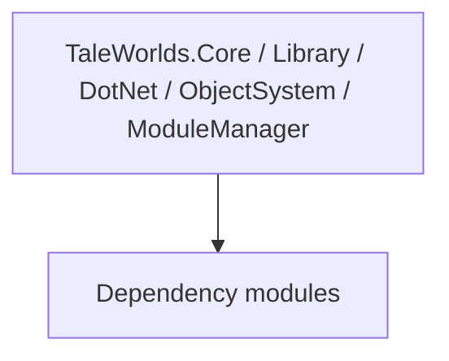

# TaleWorlds.Core / Library / DotNet / ObjectSystem / ModuleManager

**One-line responsibility:** This page covers all 520 business types under `TaleWorlds.Core / Library / DotNet / ObjectSystem / ModuleManager` as a family index, giving each type its namespace, responsibility, and typical timing so you can browse by module instead of alphabetically.

## Mental Model

TaleWorlds.Core, Library, DotNet, ObjectSystem, ModuleManager (and friends) are the lowest-level public infrastructure: math (vectors/matrices), collections, serialization primitives, generic algorithms, and engine global constants. Almost every upper namespace depends on them, yet they depend on no gameplay logic — a pure "toolbox".

## When to Use

Use these directly for general math/collection/serialization needs; do not stuff business rules into infrastructure.

## Dependencies

The types under `TaleWorlds.Core / Library / DotNet / ObjectSystem / ModuleManager` depend on the following modules; missing any of them causes compile- or run-time failure.

- [MBSubModuleBase](../../core/MBSubModuleBase)
- [API Overview](../../_index)

## Type Catalog

| Type | Namespace | Purpose | Timing |
| --- | --- | --- | --- |
| `ActionSetCode` | TaleWorlds.Core | A business type under this namespace that carries its derived convention responsibility. Confirm its lifecycle and owning system before calling; do not reference an unready instance at the wrong phase. World-state changes should go through the corresponding Action/Behavior, not direct field mutation. | Runtime |
| `AgentAttackType` | TaleWorlds.Core | A business type under this namespace that carries its derived convention responsibility. Confirm its lifecycle and owning system before calling; do not reference an unready instance at the wrong phase. World-state changes should go through the corresponding Action/Behavior, not direct field mutation. | Runtime |
| `AgentControllerType` | TaleWorlds.Core | A business type under this namespace that carries its derived convention responsibility. Confirm its lifecycle and owning system before calling; do not reference an unready instance at the wrong phase. World-state changes should go through the corresponding Action/Behavior, not direct field mutation. | Runtime |
| `AgentData` | TaleWorlds.Core | A business type under this namespace that carries its derived convention responsibility. Confirm its lifecycle and owning system before calling; do not reference an unready instance at the wrong phase. World-state changes should go through the corresponding Action/Behavior, not direct field mutation. | Runtime |
| `AgentFlag` | TaleWorlds.Core | A business type under this namespace that carries its derived convention responsibility. Confirm its lifecycle and owning system before calling; do not reference an unready instance at the wrong phase. World-state changes should go through the corresponding Action/Behavior, not direct field mutation. | Runtime |
| `AgentMovementMode` | TaleWorlds.Core | A business type under this namespace that carries its derived convention responsibility. Confirm its lifecycle and owning system before calling; do not reference an unready instance at the wrong phase. World-state changes should go through the corresponding Action/Behavior, not direct field mutation. | Runtime |
| `AgentOriginUtilities` | TaleWorlds.Core | A business type under this namespace that carries its derived convention responsibility. Confirm its lifecycle and owning system before calling; do not reference an unready instance at the wrong phase. World-state changes should go through the corresponding Action/Behavior, not direct field mutation. | Runtime |
| `AgentSaveData` | TaleWorlds.Core | A business type under this namespace that carries its derived convention responsibility. Confirm its lifecycle and owning system before calling; do not reference an unready instance at the wrong phase. World-state changes should go through the corresponding Action/Behavior, not direct field mutation. | Runtime |
| `AgentState` | TaleWorlds.Core | A business type under this namespace that carries its derived convention responsibility. Confirm its lifecycle and owning system before calling; do not reference an unready instance at the wrong phase. World-state changes should go through the corresponding Action/Behavior, not direct field mutation. | Runtime |
| `ArmorComponent` | TaleWorlds.Core | A business type under this namespace that carries its derived convention responsibility. Confirm its lifecycle and owning system before calling; do not reference an unready instance at the wrong phase. World-state changes should go through the corresponding Action/Behavior, not direct field mutation. | Runtime |
| `ArmorMaterialTypes` | TaleWorlds.Core | A business type under this namespace that carries its derived convention responsibility. Confirm its lifecycle and owning system before calling; do not reference an unready instance at the wrong phase. World-state changes should go through the corresponding Action/Behavior, not direct field mutation. | Runtime |
| `AtmosphereState` | TaleWorlds.Core | A business type under this namespace that carries its derived convention responsibility. Confirm its lifecycle and owning system before calling; do not reference an unready instance at the wrong phase. World-state changes should go through the corresponding Action/Behavior, not direct field mutation. | Runtime |
| `Banner` | TaleWorlds.Core | A business type under this namespace that carries its derived convention responsibility. Confirm its lifecycle and owning system before calling; do not reference an unready instance at the wrong phase. World-state changes should go through the corresponding Action/Behavior, not direct field mutation. | Runtime |
| `BannerColor` | TaleWorlds.Core | A business type under this namespace that carries its derived convention responsibility. Confirm its lifecycle and owning system before calling; do not reference an unready instance at the wrong phase. World-state changes should go through the corresponding Action/Behavior, not direct field mutation. | Runtime |
| `BannerComponent` | TaleWorlds.Core | A business type under this namespace that carries its derived convention responsibility. Confirm its lifecycle and owning system before calling; do not reference an unready instance at the wrong phase. World-state changes should go through the corresponding Action/Behavior, not direct field mutation. | Runtime |
| `BannerData` | TaleWorlds.Core | A business type under this namespace that carries its derived convention responsibility. Confirm its lifecycle and owning system before calling; do not reference an unready instance at the wrong phase. World-state changes should go through the corresponding Action/Behavior, not direct field mutation. | Runtime |
| `BannerEffect` | TaleWorlds.Core | A business type under this namespace that carries its derived convention responsibility. Confirm its lifecycle and owning system before calling; do not reference an unready instance at the wrong phase. World-state changes should go through the corresponding Action/Behavior, not direct field mutation. | Runtime |
| `BannerExtensions` | TaleWorlds.Core | A business type under this namespace that carries its derived convention responsibility. Confirm its lifecycle and owning system before calling; do not reference an unready instance at the wrong phase. World-state changes should go through the corresponding Action/Behavior, not direct field mutation. | Runtime |
| `BannerIconData` | TaleWorlds.Core | A business type under this namespace that carries its derived convention responsibility. Confirm its lifecycle and owning system before calling; do not reference an unready instance at the wrong phase. World-state changes should go through the corresponding Action/Behavior, not direct field mutation. | Runtime |
| `BannerIconGroup` | TaleWorlds.Core | A business type under this namespace that carries its derived convention responsibility. Confirm its lifecycle and owning system before calling; do not reference an unready instance at the wrong phase. World-state changes should go through the corresponding Action/Behavior, not direct field mutation. | Runtime |
| `BannerManager` | TaleWorlds.Core | A business type under this namespace that carries its derived convention responsibility. Confirm its lifecycle and owning system before calling; do not reference an unready instance at the wrong phase. World-state changes should go through the corresponding Action/Behavior, not direct field mutation. | Runtime |
| `BasicCharacterObject` | TaleWorlds.Core | A business type under this namespace that carries its derived convention responsibility. Confirm its lifecycle and owning system before calling; do not reference an unready instance at the wrong phase. World-state changes should go through the corresponding Action/Behavior, not direct field mutation. | Runtime |
| `BasicCultureObject` | TaleWorlds.Core | A business type under this namespace that carries its derived convention responsibility. Confirm its lifecycle and owning system before calling; do not reference an unready instance at the wrong phase. World-state changes should go through the corresponding Action/Behavior, not direct field mutation. | Runtime |
| `BasicGameModels` | TaleWorlds.Core | Domain model that aggregates rules and calculations for Behaviors to call. When you replace a model you must provide an equivalent contract; an empty replacement hands null to its dependents. | Runtime |
| `BattleSideEnum` | TaleWorlds.Core | A business type under this namespace that carries its derived convention responsibility. Confirm its lifecycle and owning system before calling; do not reference an unready instance at the wrong phase. World-state changes should go through the corresponding Action/Behavior, not direct field mutation. | Runtime |
| `BattleSideEnumExtensions` | TaleWorlds.Core | A business type under this namespace that carries its derived convention responsibility. Confirm its lifecycle and owning system before calling; do not reference an unready instance at the wrong phase. World-state changes should go through the corresponding Action/Behavior, not direct field mutation. | Runtime |
| `BattleState` | TaleWorlds.Core | A business type under this namespace that carries its derived convention responsibility. Confirm its lifecycle and owning system before calling; do not reference an unready instance at the wrong phase. World-state changes should go through the corresponding Action/Behavior, not direct field mutation. | Runtime |
| `BeardCoverTypes` | TaleWorlds.Core | A business type under this namespace that carries its derived convention responsibility. Confirm its lifecycle and owning system before calling; do not reference an unready instance at the wrong phase. World-state changes should go through the corresponding Action/Behavior, not direct field mutation. | Runtime |
| `BladeData` | TaleWorlds.Core | A business type under this namespace that carries its derived convention responsibility. Confirm its lifecycle and owning system before calling; do not reference an unready instance at the wrong phase. World-state changes should go through the corresponding Action/Behavior, not direct field mutation. | Runtime |
| `BodyDeformTypes` | TaleWorlds.Core | A business type under this namespace that carries its derived convention responsibility. Confirm its lifecycle and owning system before calling; do not reference an unready instance at the wrong phase. World-state changes should go through the corresponding Action/Behavior, not direct field mutation. | Runtime |
| `BodyMeshMaturityType` | TaleWorlds.Core | A business type under this namespace that carries its derived convention responsibility. Confirm its lifecycle and owning system before calling; do not reference an unready instance at the wrong phase. World-state changes should go through the corresponding Action/Behavior, not direct field mutation. | Runtime |
| `BodyMeshTypes` | TaleWorlds.Core | A business type under this namespace that carries its derived convention responsibility. Confirm its lifecycle and owning system before calling; do not reference an unready instance at the wrong phase. World-state changes should go through the corresponding Action/Behavior, not direct field mutation. | Runtime |
| `BodyProperties` | TaleWorlds.Core | A business type under this namespace that carries its derived convention responsibility. Confirm its lifecycle and owning system before calling; do not reference an unready instance at the wrong phase. World-state changes should go through the corresponding Action/Behavior, not direct field mutation. | Runtime |
| `BodyPropertiesJsonConverter` | TaleWorlds.Core | A business type under this namespace that carries its derived convention responsibility. Confirm its lifecycle and owning system before calling; do not reference an unready instance at the wrong phase. World-state changes should go through the corresponding Action/Behavior, not direct field mutation. | Runtime |
| `CampaignSaveMetaDataArgs` | TaleWorlds.Core | AI decision implementation that must be interruptible and serializable to support saving and undo. Search must be depth/time bounded to avoid stalls. | Runtime |
| `CharacterAttribute` | TaleWorlds.Core | A business type under this namespace that carries its derived convention responsibility. Confirm its lifecycle and owning system before calling; do not reference an unready instance at the wrong phase. World-state changes should go through the corresponding Action/Behavior, not direct field mutation. | Runtime |
| `CharacterCode` | TaleWorlds.Core | A business type under this namespace that carries its derived convention responsibility. Confirm its lifecycle and owning system before calling; do not reference an unready instance at the wrong phase. World-state changes should go through the corresponding Action/Behavior, not direct field mutation. | Runtime |
| `ChoiceTag` | TaleWorlds.Core | A business type under this namespace that carries its derived convention responsibility. Confirm its lifecycle and owning system before calling; do not reference an unready instance at the wrong phase. World-state changes should go through the corresponding Action/Behavior, not direct field mutation. | Runtime |
| `CombatStatCalculator` | TaleWorlds.Core | A business type under this namespace that carries its derived convention responsibility. Confirm its lifecycle and owning system before calling; do not reference an unready instance at the wrong phase. World-state changes should go through the corresponding Action/Behavior, not direct field mutation. | Runtime |
| `Crafting` | TaleWorlds.Core | A business type under this namespace that carries its derived convention responsibility. Confirm its lifecycle and owning system before calling; do not reference an unready instance at the wrong phase. World-state changes should go through the corresponding Action/Behavior, not direct field mutation. | Runtime |
| `CraftingMaterials` | TaleWorlds.Core | A business type under this namespace that carries its derived convention responsibility. Confirm its lifecycle and owning system before calling; do not reference an unready instance at the wrong phase. World-state changes should go through the corresponding Action/Behavior, not direct field mutation. | Runtime |
| `CraftingPiece` | TaleWorlds.Core | A business type under this namespace that carries its derived convention responsibility. Confirm its lifecycle and owning system before calling; do not reference an unready instance at the wrong phase. World-state changes should go through the corresponding Action/Behavior, not direct field mutation. | Runtime |
| `CraftingStatData` | TaleWorlds.Core | A business type under this namespace that carries its derived convention responsibility. Confirm its lifecycle and owning system before calling; do not reference an unready instance at the wrong phase. World-state changes should go through the corresponding Action/Behavior, not direct field mutation. | Runtime |
| `CraftingStatTypes` | TaleWorlds.Core | A business type under this namespace that carries its derived convention responsibility. Confirm its lifecycle and owning system before calling; do not reference an unready instance at the wrong phase. World-state changes should go through the corresponding Action/Behavior, not direct field mutation. | Runtime |
| `CraftingTemplate` | TaleWorlds.Core | A business type under this namespace that carries its derived convention responsibility. Confirm its lifecycle and owning system before calling; do not reference an unready instance at the wrong phase. World-state changes should go through the corresponding Action/Behavior, not direct field mutation. | Runtime |
| `DamageTypes` | TaleWorlds.Core | A business type under this namespace that carries its derived convention responsibility. Confirm its lifecycle and owning system before calling; do not reference an unready instance at the wrong phase. World-state changes should go through the corresponding Action/Behavior, not direct field mutation. | Runtime |
| `DefaultBannerEffects` | TaleWorlds.Core | A business type under this namespace that carries its derived convention responsibility. Confirm its lifecycle and owning system before calling; do not reference an unready instance at the wrong phase. World-state changes should go through the corresponding Action/Behavior, not direct field mutation. | Runtime |
| `DefaultCharacterAttributes` | TaleWorlds.Core | A business type under this namespace that carries its derived convention responsibility. Confirm its lifecycle and owning system before calling; do not reference an unready instance at the wrong phase. World-state changes should go through the corresponding Action/Behavior, not direct field mutation. | Runtime |
| `DefaultItemCategories` | TaleWorlds.Core | A business type under this namespace that carries its derived convention responsibility. Confirm its lifecycle and owning system before calling; do not reference an unready instance at the wrong phase. World-state changes should go through the corresponding Action/Behavior, not direct field mutation. | Runtime |
| `DefaultItemCategorySelector` | TaleWorlds.Core | Selector / list-item view-model carrying the data and highlight of one selectable option. Collection VMs should virtualize to control memory. | Runtime |
| `DefaultItemValueModel` | TaleWorlds.Core | Domain model that aggregates rules and calculations for Behaviors to call. When you replace a model you must provide an equivalent contract; an empty replacement hands null to its dependents. | Runtime |
| `DefaultRidingModel` | TaleWorlds.Core | Domain model that aggregates rules and calculations for Behaviors to call. When you replace a model you must provide an equivalent contract; an empty replacement hands null to its dependents. | Runtime |
| `DefaultSiegeEngineTypes` | TaleWorlds.Core | A business type under this namespace that carries its derived convention responsibility. Confirm its lifecycle and owning system before calling; do not reference an unready instance at the wrong phase. World-state changes should go through the corresponding Action/Behavior, not direct field mutation. | Runtime |
| `DefaultSkills` | TaleWorlds.Core | A business type under this namespace that carries its derived convention responsibility. Confirm its lifecycle and owning system before calling; do not reference an unready instance at the wrong phase. World-state changes should go through the corresponding Action/Behavior, not direct field mutation. | Runtime |
| `DeploymentFormationClass` | TaleWorlds.Core | A business type under this namespace that carries its derived convention responsibility. Confirm its lifecycle and owning system before calling; do not reference an unready instance at the wrong phase. World-state changes should go through the corresponding Action/Behavior, not direct field mutation. | Runtime |
| `DialogNotificationHandle` | TaleWorlds.Core | Notification item type describing the data of one map/event prompt. It only carries display data; triggering logic lives in the Behavior. | Runtime |
| `DrivenProperty` | TaleWorlds.Core | A business type under this namespace that carries its derived convention responsibility. Confirm its lifecycle and owning system before calling; do not reference an unready instance at the wrong phase. World-state changes should go through the corresponding Action/Behavior, not direct field mutation. | Runtime |
| `DummyCommunicator` | TaleWorlds.Core | A business type under this namespace that carries its derived convention responsibility. Confirm its lifecycle and owning system before calling; do not reference an unready instance at the wrong phase. World-state changes should go through the corresponding Action/Behavior, not direct field mutation. | Runtime |
| `DynamicBodyProperties` | TaleWorlds.Core | A business type under this namespace that carries its derived convention responsibility. Confirm its lifecycle and owning system before calling; do not reference an unready instance at the wrong phase. World-state changes should go through the corresponding Action/Behavior, not direct field mutation. | Runtime |
| `EffectIncrementType` | TaleWorlds.Core | A business type under this namespace that carries its derived convention responsibility. Confirm its lifecycle and owning system before calling; do not reference an unready instance at the wrong phase. World-state changes should go through the corresponding Action/Behavior, not direct field mutation. | Runtime |
| `EntitySystem` | TaleWorlds.Core | A business type under this namespace that carries its derived convention responsibility. Confirm its lifecycle and owning system before calling; do not reference an unready instance at the wrong phase. World-state changes should go through the corresponding Action/Behavior, not direct field mutation. | Runtime |
| `Equipment` | TaleWorlds.Core | A business type under this namespace that carries its derived convention responsibility. Confirm its lifecycle and owning system before calling; do not reference an unready instance at the wrong phase. World-state changes should go through the corresponding Action/Behavior, not direct field mutation. | Runtime |
| `EquipmentCategories` | TaleWorlds.Core | A business type under this namespace that carries its derived convention responsibility. Confirm its lifecycle and owning system before calling; do not reference an unready instance at the wrong phase. World-state changes should go through the corresponding Action/Behavior, not direct field mutation. | Runtime |
| `EquipmentElement` | TaleWorlds.Core | A business type under this namespace that carries its derived convention responsibility. Confirm its lifecycle and owning system before calling; do not reference an unready instance at the wrong phase. World-state changes should go through the corresponding Action/Behavior, not direct field mutation. | Runtime |
| `EquipmentIndex` | TaleWorlds.Core | A business type under this namespace that carries its derived convention responsibility. Confirm its lifecycle and owning system before calling; do not reference an unready instance at the wrong phase. World-state changes should go through the corresponding Action/Behavior, not direct field mutation. | Runtime |
| `EquipmentType` | TaleWorlds.Core | A business type under this namespace that carries its derived convention responsibility. Confirm its lifecycle and owning system before calling; do not reference an unready instance at the wrong phase. World-state changes should go through the corresponding Action/Behavior, not direct field mutation. | Runtime |
| `Extensions` | TaleWorlds.Core | A business type under this namespace that carries its derived convention responsibility. Confirm its lifecycle and owning system before calling; do not reference an unready instance at the wrong phase. World-state changes should go through the corresponding Action/Behavior, not direct field mutation. | Runtime |
| `FaceGen` | TaleWorlds.Core | A business type under this namespace that carries its derived convention responsibility. Confirm its lifecycle and owning system before calling; do not reference an unready instance at the wrong phase. World-state changes should go through the corresponding Action/Behavior, not direct field mutation. | Runtime |
| `FaceGeneratorStage` | TaleWorlds.Core | A business type under this namespace that carries its derived convention responsibility. Confirm its lifecycle and owning system before calling; do not reference an unready instance at the wrong phase. World-state changes should go through the corresponding Action/Behavior, not direct field mutation. | Runtime |
| `FaceGenHistory` | TaleWorlds.Core | A business type under this namespace that carries its derived convention responsibility. Confirm its lifecycle and owning system before calling; do not reference an unready instance at the wrong phase. World-state changes should go through the corresponding Action/Behavior, not direct field mutation. | Runtime |
| `FilePaths` | TaleWorlds.Core | A business type under this namespace that carries its derived convention responsibility. Confirm its lifecycle and owning system before calling; do not reference an unready instance at the wrong phase. World-state changes should go through the corresponding Action/Behavior, not direct field mutation. | Runtime |
| `ForestDensity` | TaleWorlds.Core | A business type under this namespace that carries its derived convention responsibility. Confirm its lifecycle and owning system before calling; do not reference an unready instance at the wrong phase. World-state changes should go through the corresponding Action/Behavior, not direct field mutation. | Runtime |
| `FormationClass` | TaleWorlds.Core | A business type under this namespace that carries its derived convention responsibility. Confirm its lifecycle and owning system before calling; do not reference an unready instance at the wrong phase. World-state changes should go through the corresponding Action/Behavior, not direct field mutation. | Runtime |
| `FormationClassExtensions` | TaleWorlds.Core | A business type under this namespace that carries its derived convention responsibility. Confirm its lifecycle and owning system before calling; do not reference an unready instance at the wrong phase. World-state changes should go through the corresponding Action/Behavior, not direct field mutation. | Runtime |
| `FormationFilterType` | TaleWorlds.Core | A business type under this namespace that carries its derived convention responsibility. Confirm its lifecycle and owning system before calling; do not reference an unready instance at the wrong phase. World-state changes should go through the corresponding Action/Behavior, not direct field mutation. | Runtime |
| `FormationPositionPreference` | TaleWorlds.Core | A business type under this namespace that carries its derived convention responsibility. Confirm its lifecycle and owning system before calling; do not reference an unready instance at the wrong phase. World-state changes should go through the corresponding Action/Behavior, not direct field mutation. | Runtime |
| `GameHandler` | TaleWorlds.Core | A business type under this namespace that carries its derived convention responsibility. Confirm its lifecycle and owning system before calling; do not reference an unready instance at the wrong phase. World-state changes should go through the corresponding Action/Behavior, not direct field mutation. | Runtime |
| `GameManagerBase` | TaleWorlds.Core | A business type under this namespace that carries its derived convention responsibility. Confirm its lifecycle and owning system before calling; do not reference an unready instance at the wrong phase. World-state changes should go through the corresponding Action/Behavior, not direct field mutation. | Runtime |
| `GameManagerComponent` | TaleWorlds.Core | A business type under this namespace that carries its derived convention responsibility. Confirm its lifecycle and owning system before calling; do not reference an unready instance at the wrong phase. World-state changes should go through the corresponding Action/Behavior, not direct field mutation. | Runtime |
| `GameManagerLoadingSteps` | TaleWorlds.Core | A business type under this namespace that carries its derived convention responsibility. Confirm its lifecycle and owning system before calling; do not reference an unready instance at the wrong phase. World-state changes should go through the corresponding Action/Behavior, not direct field mutation. | Runtime |
| `GameModel` | TaleWorlds.Core | Domain model that aggregates rules and calculations for Behaviors to call. When you replace a model you must provide an equivalent contract; an empty replacement hands null to its dependents. | Runtime |
| `GameModelsManager` | TaleWorlds.Core | Domain model that aggregates rules and calculations for Behaviors to call. When you replace a model you must provide an equivalent contract; an empty replacement hands null to its dependents. | Runtime |
| `GameState` | TaleWorlds.Core | A business type under this namespace that carries its derived convention responsibility. Confirm its lifecycle and owning system before calling; do not reference an unready instance at the wrong phase. World-state changes should go through the corresponding Action/Behavior, not direct field mutation. | Runtime |
| `GameStateManager` | TaleWorlds.Core | A business type under this namespace that carries its derived convention responsibility. Confirm its lifecycle and owning system before calling; do not reference an unready instance at the wrong phase. World-state changes should go through the corresponding Action/Behavior, not direct field mutation. | Runtime |
| `GameStateManagerType` | TaleWorlds.Core | A business type under this namespace that carries its derived convention responsibility. Confirm its lifecycle and owning system before calling; do not reference an unready instance at the wrong phase. World-state changes should go through the corresponding Action/Behavior, not direct field mutation. | Runtime |
| `GameText` | TaleWorlds.Core | A business type under this namespace that carries its derived convention responsibility. Confirm its lifecycle and owning system before calling; do not reference an unready instance at the wrong phase. World-state changes should go through the corresponding Action/Behavior, not direct field mutation. | Runtime |
| `GameTextHelper` | TaleWorlds.Core | Static helper utility that concentrates a cross-cutting operation (open screen, compute result, resolve entity). Call it from the correct system context; do not instantiate it as stateful. | Runtime |
| `GameTextManager` | TaleWorlds.Core | A business type under this namespace that carries its derived convention responsibility. Confirm its lifecycle and owning system before calling; do not reference an unready instance at the wrong phase. World-state changes should go through the corresponding Action/Behavior, not direct field mutation. | Runtime |
| `GameTexts` | TaleWorlds.Core | A business type under this namespace that carries its derived convention responsibility. Confirm its lifecycle and owning system before calling; do not reference an unready instance at the wrong phase. World-state changes should go through the corresponding Action/Behavior, not direct field mutation. | Runtime |
| `GameTextVariation` | TaleWorlds.Core | A business type under this namespace that carries its derived convention responsibility. Confirm its lifecycle and owning system before calling; do not reference an unready instance at the wrong phase. World-state changes should go through the corresponding Action/Behavior, not direct field mutation. | Runtime |
| `GameType` | TaleWorlds.Core | A business type under this namespace that carries its derived convention responsibility. Confirm its lifecycle and owning system before calling; do not reference an unready instance at the wrong phase. World-state changes should go through the corresponding Action/Behavior, not direct field mutation. | Runtime |
| `GameTypeLoadingStates` | TaleWorlds.Core | A business type under this namespace that carries its derived convention responsibility. Confirm its lifecycle and owning system before calling; do not reference an unready instance at the wrong phase. World-state changes should go through the corresponding Action/Behavior, not direct field mutation. | Runtime |
| `HairCoverTypes` | TaleWorlds.Core | AI decision implementation that must be interruptible and serializable to support saving and undo. Search must be depth/time bounded to avoid stalls. | Runtime |
| `HorseComponent` | TaleWorlds.Core | A business type under this namespace that carries its derived convention responsibility. Confirm its lifecycle and owning system before calling; do not reference an unready instance at the wrong phase. World-state changes should go through the corresponding Action/Behavior, not direct field mutation. | Runtime |
| `HorseHarnessCoverTypes` | TaleWorlds.Core | A business type under this namespace that carries its derived convention responsibility. Confirm its lifecycle and owning system before calling; do not reference an unready instance at the wrong phase. World-state changes should go through the corresponding Action/Behavior, not direct field mutation. | Runtime |
| `HorseTailCoverTypes` | TaleWorlds.Core | AI decision implementation that must be interruptible and serializable to support saving and undo. Search must be depth/time bounded to avoid stalls. | Runtime |
| `HumanBone` | TaleWorlds.Core | A business type under this namespace that carries its derived convention responsibility. Confirm its lifecycle and owning system before calling; do not reference an unready instance at the wrong phase. World-state changes should go through the corresponding Action/Behavior, not direct field mutation. | Runtime |
| `HyperlinkTexts` | TaleWorlds.Core | A business type under this namespace that carries its derived convention responsibility. Confirm its lifecycle and owning system before calling; do not reference an unready instance at the wrong phase. World-state changes should go through the corresponding Action/Behavior, not direct field mutation. | Runtime |
| `IAgent` | TaleWorlds.Core | A business type under this namespace that carries its derived convention responsibility. Confirm its lifecycle and owning system before calling; do not reference an unready instance at the wrong phase. World-state changes should go through the corresponding Action/Behavior, not direct field mutation. | Runtime |
| `IAgentOriginBase` | TaleWorlds.Core | A business type under this namespace that carries its derived convention responsibility. Confirm its lifecycle and owning system before calling; do not reference an unready instance at the wrong phase. World-state changes should go through the corresponding Action/Behavior, not direct field mutation. | Runtime |
| `IBannerVisual` | TaleWorlds.Core | A business type under this namespace that carries its derived convention responsibility. Confirm its lifecycle and owning system before calling; do not reference an unready instance at the wrong phase. World-state changes should go through the corresponding Action/Behavior, not direct field mutation. | Runtime |
| `IBannerVisualCreator` | TaleWorlds.Core | A business type under this namespace that carries its derived convention responsibility. Confirm its lifecycle and owning system before calling; do not reference an unready instance at the wrong phase. World-state changes should go through the corresponding Action/Behavior, not direct field mutation. | Runtime |
| `IBattleCombatant` | TaleWorlds.Core | A business type under this namespace that carries its derived convention responsibility. Confirm its lifecycle and owning system before calling; do not reference an unready instance at the wrong phase. World-state changes should go through the corresponding Action/Behavior, not direct field mutation. | Runtime |
| `IBattleObserver` | TaleWorlds.Core | A business type under this namespace that carries its derived convention responsibility. Confirm its lifecycle and owning system before calling; do not reference an unready instance at the wrong phase. World-state changes should go through the corresponding Action/Behavior, not direct field mutation. | Runtime |
| `ICameraModeLogic` | TaleWorlds.Core | Domain model that aggregates rules and calculations for Behaviors to call. When you replace a model you must provide an equivalent contract; an empty replacement hands null to its dependents. | Runtime |
| `ICharacterData` | TaleWorlds.Core | A business type under this namespace that carries its derived convention responsibility. Confirm its lifecycle and owning system before calling; do not reference an unready instance at the wrong phase. World-state changes should go through the corresponding Action/Behavior, not direct field mutation. | Runtime |
| `ICommunicator` | TaleWorlds.Core | A business type under this namespace that carries its derived convention responsibility. Confirm its lifecycle and owning system before calling; do not reference an unready instance at the wrong phase. World-state changes should go through the corresponding Action/Behavior, not direct field mutation. | Runtime |
| `IEntityComponent` | TaleWorlds.Core | A business type under this namespace that carries its derived convention responsibility. Confirm its lifecycle and owning system before calling; do not reference an unready instance at the wrong phase. World-state changes should go through the corresponding Action/Behavior, not direct field mutation. | Runtime |
| `IFaceGen` | TaleWorlds.Core | A business type under this namespace that carries its derived convention responsibility. Confirm its lifecycle and owning system before calling; do not reference an unready instance at the wrong phase. World-state changes should go through the corresponding Action/Behavior, not direct field mutation. | Runtime |
| `IFaceGeneratorCustomFilter` | TaleWorlds.Core | A business type under this namespace that carries its derived convention responsibility. Confirm its lifecycle and owning system before calling; do not reference an unready instance at the wrong phase. World-state changes should go through the corresponding Action/Behavior, not direct field mutation. | Runtime |
| `IGameStarter` | TaleWorlds.Core | A business type under this namespace that carries its derived convention responsibility. Confirm its lifecycle and owning system before calling; do not reference an unready instance at the wrong phase. World-state changes should go through the corresponding Action/Behavior, not direct field mutation. | Runtime |
| `IGameStateListener` | TaleWorlds.Core | A business type under this namespace that carries its derived convention responsibility. Confirm its lifecycle and owning system before calling; do not reference an unready instance at the wrong phase. World-state changes should go through the corresponding Action/Behavior, not direct field mutation. | Runtime |
| `IGameStateManagerListener` | TaleWorlds.Core | A business type under this namespace that carries its derived convention responsibility. Confirm its lifecycle and owning system before calling; do not reference an unready instance at the wrong phase. World-state changes should go through the corresponding Action/Behavior, not direct field mutation. | Runtime |
| `IGameStateManagerOwner` | TaleWorlds.Core | A business type under this namespace that carries its derived convention responsibility. Confirm its lifecycle and owning system before calling; do not reference an unready instance at the wrong phase. World-state changes should go through the corresponding Action/Behavior, not direct field mutation. | Runtime |
| `IInformationDataHolder` | TaleWorlds.Core | A business type under this namespace that carries its derived convention responsibility. Confirm its lifecycle and owning system before calling; do not reference an unready instance at the wrong phase. World-state changes should go through the corresponding Action/Behavior, not direct field mutation. | Runtime |
| `IManagedParametersInitializer` | TaleWorlds.Core | Parameter container carrying configuration or runtime data. Avoid holding long-lived references that hinder GC. | Runtime |
| `IMission` | TaleWorlds.Core | A business type under this namespace that carries its derived convention responsibility. Confirm its lifecycle and owning system before calling; do not reference an unready instance at the wrong phase. World-state changes should go through the corresponding Action/Behavior, not direct field mutation. | Runtime |
| `IMissionSiegeWeapon` | TaleWorlds.Core | A business type under this namespace that carries its derived convention responsibility. Confirm its lifecycle and owning system before calling; do not reference an unready instance at the wrong phase. World-state changes should go through the corresponding Action/Behavior, not direct field mutation. | Runtime |
| `IMissionTeam` | TaleWorlds.Core | A business type under this namespace that carries its derived convention responsibility. Confirm its lifecycle and owning system before calling; do not reference an unready instance at the wrong phase. World-state changes should go through the corresponding Action/Behavior, not direct field mutation. | Runtime |
| `IMissionTroopSupplier` | TaleWorlds.Core | A business type under this namespace that carries its derived convention responsibility. Confirm its lifecycle and owning system before calling; do not reference an unready instance at the wrong phase. World-state changes should go through the corresponding Action/Behavior, not direct field mutation. | Runtime |
| `IMonsterMissionData` | TaleWorlds.Core | A business type under this namespace that carries its derived convention responsibility. Confirm its lifecycle and owning system before calling; do not reference an unready instance at the wrong phase. World-state changes should go through the corresponding Action/Behavior, not direct field mutation. | Runtime |
| `IMonsterMissionDataCreator` | TaleWorlds.Core | A business type under this namespace that carries its derived convention responsibility. Confirm its lifecycle and owning system before calling; do not reference an unready instance at the wrong phase. World-state changes should go through the corresponding Action/Behavior, not direct field mutation. | Runtime |
| `IndexEntry` | TaleWorlds.Core | A business type under this namespace that carries its derived convention responsibility. Confirm its lifecycle and owning system before calling; do not reference an unready instance at the wrong phase. World-state changes should go through the corresponding Action/Behavior, not direct field mutation. | Runtime |
| `INetworkCommunication` | TaleWorlds.Core | A business type under this namespace that carries its derived convention responsibility. Confirm its lifecycle and owning system before calling; do not reference an unready instance at the wrong phase. World-state changes should go through the corresponding Action/Behavior, not direct field mutation. | Runtime |
| `InformationData` | TaleWorlds.Core | A business type under this namespace that carries its derived convention responsibility. Confirm its lifecycle and owning system before calling; do not reference an unready instance at the wrong phase. World-state changes should go through the corresponding Action/Behavior, not direct field mutation. | Runtime |
| `InitialWeaponEquipPreference` | TaleWorlds.Core | A business type under this namespace that carries its derived convention responsibility. Confirm its lifecycle and owning system before calling; do not reference an unready instance at the wrong phase. World-state changes should go through the corresponding Action/Behavior, not direct field mutation. | Runtime |
| `InquiryElement` | TaleWorlds.Core | A business type under this namespace that carries its derived convention responsibility. Confirm its lifecycle and owning system before calling; do not reference an unready instance at the wrong phase. World-state changes should go through the corresponding Action/Behavior, not direct field mutation. | Runtime |
| `IReadOnlyPropertyOwner` | TaleWorlds.Core | A business type under this namespace that carries its derived convention responsibility. Confirm its lifecycle and owning system before calling; do not reference an unready instance at the wrong phase. World-state changes should go through the corresponding Action/Behavior, not direct field mutation. | Runtime |
| `IReadOnlyPropertyOwnerF` | TaleWorlds.Core | A business type under this namespace that carries its derived convention responsibility. Confirm its lifecycle and owning system before calling; do not reference an unready instance at the wrong phase. World-state changes should go through the corresponding Action/Behavior, not direct field mutation. | Runtime |
| `ISceneNotificationContextProvider` | TaleWorlds.Core | Gauntlet image-source abstraction that resolves an entity/concept into an actual texture and caches it. The first frame may be empty; handle the loading state. | Runtime |
| `IShipOrigin` | TaleWorlds.Core | A business type under this namespace that carries its derived convention responsibility. Confirm its lifecycle and owning system before calling; do not reference an unready instance at the wrong phase. World-state changes should go through the corresponding Action/Behavior, not direct field mutation. | Runtime |
| `ItemCategory` | TaleWorlds.Core | A business type under this namespace that carries its derived convention responsibility. Confirm its lifecycle and owning system before calling; do not reference an unready instance at the wrong phase. World-state changes should go through the corresponding Action/Behavior, not direct field mutation. | Runtime |
| `ItemCategorySelector` | TaleWorlds.Core | Selector / list-item view-model carrying the data and highlight of one selectable option. Collection VMs should virtualize to control memory. | Runtime |
| `ItemComponent` | TaleWorlds.Core | A business type under this namespace that carries its derived convention responsibility. Confirm its lifecycle and owning system before calling; do not reference an unready instance at the wrong phase. World-state changes should go through the corresponding Action/Behavior, not direct field mutation. | Runtime |
| `ItemFlags` | TaleWorlds.Core | A business type under this namespace that carries its derived convention responsibility. Confirm its lifecycle and owning system before calling; do not reference an unready instance at the wrong phase. World-state changes should go through the corresponding Action/Behavior, not direct field mutation. | Runtime |
| `ItemModifier` | TaleWorlds.Core | A business type under this namespace that carries its derived convention responsibility. Confirm its lifecycle and owning system before calling; do not reference an unready instance at the wrong phase. World-state changes should go through the corresponding Action/Behavior, not direct field mutation. | Runtime |
| `ItemModifierGroup` | TaleWorlds.Core | A business type under this namespace that carries its derived convention responsibility. Confirm its lifecycle and owning system before calling; do not reference an unready instance at the wrong phase. World-state changes should go through the corresponding Action/Behavior, not direct field mutation. | Runtime |
| `ItemObject` | TaleWorlds.Core | A business type under this namespace that carries its derived convention responsibility. Confirm its lifecycle and owning system before calling; do not reference an unready instance at the wrong phase. World-state changes should go through the corresponding Action/Behavior, not direct field mutation. | Runtime |
| `ItemQuality` | TaleWorlds.Core | A business type under this namespace that carries its derived convention responsibility. Confirm its lifecycle and owning system before calling; do not reference an unready instance at the wrong phase. World-state changes should go through the corresponding Action/Behavior, not direct field mutation. | Runtime |
| `ItemRosterElement` | TaleWorlds.Core | A business type under this namespace that carries its derived convention responsibility. Confirm its lifecycle and owning system before calling; do not reference an unready instance at the wrong phase. World-state changes should go through the corresponding Action/Behavior, not direct field mutation. | Runtime |
| `ItemTiers` | TaleWorlds.Core | A business type under this namespace that carries its derived convention responsibility. Confirm its lifecycle and owning system before calling; do not reference an unready instance at the wrong phase. World-state changes should go through the corresponding Action/Behavior, not direct field mutation. | Runtime |
| `ItemTypeEnum` | TaleWorlds.Core | A business type under this namespace that carries its derived convention responsibility. Confirm its lifecycle and owning system before calling; do not reference an unready instance at the wrong phase. World-state changes should go through the corresponding Action/Behavior, not direct field mutation. | Runtime |
| `ItemUsageSetFlags` | TaleWorlds.Core | A business type under this namespace that carries its derived convention responsibility. Confirm its lifecycle and owning system before calling; do not reference an unready instance at the wrong phase. World-state changes should go through the corresponding Action/Behavior, not direct field mutation. | Runtime |
| `ItemValueModel` | TaleWorlds.Core | Domain model that aggregates rules and calculations for Behaviors to call. When you replace a model you must provide an equivalent contract; an empty replacement hands null to its dependents. | Runtime |
| `ITrackableBase` | TaleWorlds.Core | A business type under this namespace that carries its derived convention responsibility. Confirm its lifecycle and owning system before calling; do not reference an unready instance at the wrong phase. World-state changes should go through the corresponding Action/Behavior, not direct field mutation. | Runtime |
| `JobType` | TaleWorlds.Core | A business type under this namespace that carries its derived convention responsibility. Confirm its lifecycle and owning system before calling; do not reference an unready instance at the wrong phase. World-state changes should go through the corresponding Action/Behavior, not direct field mutation. | Runtime |
| `LinearFrictionTerm` | TaleWorlds.Core | A business type under this namespace that carries its derived convention responsibility. Confirm its lifecycle and owning system before calling; do not reference an unready instance at the wrong phase. World-state changes should go through the corresponding Action/Behavior, not direct field mutation. | Runtime |
| `ManagedParameters` | TaleWorlds.Core | Parameter container carrying configuration or runtime data. Avoid holding long-lived references that hinder GC. | Runtime |
| `ManagedParametersEnum` | TaleWorlds.Core | Parameter container carrying configuration or runtime data. Avoid holding long-lived references that hinder GC. | Runtime |
| `MaterialProperty` | TaleWorlds.Core | A business type under this namespace that carries its derived convention responsibility. Confirm its lifecycle and owning system before calling; do not reference an unready instance at the wrong phase. World-state changes should go through the corresponding Action/Behavior, not direct field mutation. | Runtime |
| `MBBodyProperty` | TaleWorlds.Core | A business type under this namespace that carries its derived convention responsibility. Confirm its lifecycle and owning system before calling; do not reference an unready instance at the wrong phase. World-state changes should go through the corresponding Action/Behavior, not direct field mutation. | Runtime |
| `MBCharacterSkills` | TaleWorlds.Core | A business type under this namespace that carries its derived convention responsibility. Confirm its lifecycle and owning system before calling; do not reference an unready instance at the wrong phase. World-state changes should go through the corresponding Action/Behavior, not direct field mutation. | Runtime |
| `MBEquipmentRoster` | TaleWorlds.Core | A business type under this namespace that carries its derived convention responsibility. Confirm its lifecycle and owning system before calling; do not reference an unready instance at the wrong phase. World-state changes should go through the corresponding Action/Behavior, not direct field mutation. | Runtime |
| `MBException` | TaleWorlds.Core | A business type under this namespace that carries its derived convention responsibility. Confirm its lifecycle and owning system before calling; do not reference an unready instance at the wrong phase. World-state changes should go through the corresponding Action/Behavior, not direct field mutation. | Runtime |
| `MBFastRandom` | TaleWorlds.Core | A business type under this namespace that carries its derived convention responsibility. Confirm its lifecycle and owning system before calling; do not reference an unready instance at the wrong phase. World-state changes should go through the corresponding Action/Behavior, not direct field mutation. | Runtime |
| `MBFastRandomSelector` | TaleWorlds.Core | Selector / list-item view-model carrying the data and highlight of one selectable option. Collection VMs should virtualize to control memory. | Runtime |
| `MBGameModel` | TaleWorlds.Core | Domain model that aggregates rules and calculations for Behaviors to call. When you replace a model you must provide an equivalent contract; an empty replacement hands null to its dependents. | Runtime |
| `MBHaltonColorGenerator` | TaleWorlds.Core | A business type under this namespace that carries its derived convention responsibility. Confirm its lifecycle and owning system before calling; do not reference an unready instance at the wrong phase. World-state changes should go through the corresponding Action/Behavior, not direct field mutation. | Runtime |
| `MBIllegalValueException` | TaleWorlds.Core | A business type under this namespace that carries its derived convention responsibility. Confirm its lifecycle and owning system before calling; do not reference an unready instance at the wrong phase. World-state changes should go through the corresponding Action/Behavior, not direct field mutation. | Runtime |
| `MBInformationManager` | TaleWorlds.Core | A business type under this namespace that carries its derived convention responsibility. Confirm its lifecycle and owning system before calling; do not reference an unready instance at the wrong phase. World-state changes should go through the corresponding Action/Behavior, not direct field mutation. | Runtime |
| `MBInvalidParameterException` | TaleWorlds.Core | Parameter container carrying configuration or runtime data. Avoid holding long-lived references that hinder GC. | Runtime |
| `MBMethodNameNotFoundException` | TaleWorlds.Core | A business type under this namespace that carries its derived convention responsibility. Confirm its lifecycle and owning system before calling; do not reference an unready instance at the wrong phase. World-state changes should go through the corresponding Action/Behavior, not direct field mutation. | Runtime |
| `MBMisuseException` | TaleWorlds.Core | A business type under this namespace that carries its derived convention responsibility. Confirm its lifecycle and owning system before calling; do not reference an unready instance at the wrong phase. World-state changes should go through the corresponding Action/Behavior, not direct field mutation. | Runtime |
| `MBNetwork` | TaleWorlds.Core | A business type under this namespace that carries its derived convention responsibility. Confirm its lifecycle and owning system before calling; do not reference an unready instance at the wrong phase. World-state changes should go through the corresponding Action/Behavior, not direct field mutation. | Runtime |
| `MBNetworkBitException` | TaleWorlds.Core | A business type under this namespace that carries its derived convention responsibility. Confirm its lifecycle and owning system before calling; do not reference an unready instance at the wrong phase. World-state changes should go through the corresponding Action/Behavior, not direct field mutation. | Runtime |
| `MBNotFoundException` | TaleWorlds.Core | A business type under this namespace that carries its derived convention responsibility. Confirm its lifecycle and owning system before calling; do not reference an unready instance at the wrong phase. World-state changes should go through the corresponding Action/Behavior, not direct field mutation. | Runtime |
| `MBNotNullParameterException` | TaleWorlds.Core | Parameter container carrying configuration or runtime data. Avoid holding long-lived references that hinder GC. | Runtime |
| `MBNullParameterException` | TaleWorlds.Core | Parameter container carrying configuration or runtime data. Avoid holding long-lived references that hinder GC. | Runtime |
| `MBObjectManagerExtensions` | TaleWorlds.Core | A business type under this namespace that carries its derived convention responsibility. Confirm its lifecycle and owning system before calling; do not reference an unready instance at the wrong phase. World-state changes should go through the corresponding Action/Behavior, not direct field mutation. | Runtime |
| `MBOutOfRangeException` | TaleWorlds.Core | A business type under this namespace that carries its derived convention responsibility. Confirm its lifecycle and owning system before calling; do not reference an unready instance at the wrong phase. World-state changes should go through the corresponding Action/Behavior, not direct field mutation. | Runtime |
| `MBPerlin` | TaleWorlds.Core | A business type under this namespace that carries its derived convention responsibility. Confirm its lifecycle and owning system before calling; do not reference an unready instance at the wrong phase. World-state changes should go through the corresponding Action/Behavior, not direct field mutation. | Runtime |
| `MBRandom` | TaleWorlds.Core | A business type under this namespace that carries its derived convention responsibility. Confirm its lifecycle and owning system before calling; do not reference an unready instance at the wrong phase. World-state changes should go through the corresponding Action/Behavior, not direct field mutation. | Runtime |
| `MBSaveLoad` | TaleWorlds.Core | A business type under this namespace that carries its derived convention responsibility. Confirm its lifecycle and owning system before calling; do not reference an unready instance at the wrong phase. World-state changes should go through the corresponding Action/Behavior, not direct field mutation. | Runtime |
| `MBTypeMismatchException` | TaleWorlds.Core | A business type under this namespace that carries its derived convention responsibility. Confirm its lifecycle and owning system before calling; do not reference an unready instance at the wrong phase. World-state changes should go through the corresponding Action/Behavior, not direct field mutation. | Runtime |
| `MBUnderFlowException` | TaleWorlds.Core | A business type under this namespace that carries its derived convention responsibility. Confirm its lifecycle and owning system before calling; do not reference an unready instance at the wrong phase. World-state changes should go through the corresponding Action/Behavior, not direct field mutation. | Runtime |
| `MBUnknownTypeException` | TaleWorlds.Core | A business type under this namespace that carries its derived convention responsibility. Confirm its lifecycle and owning system before calling; do not reference an unready instance at the wrong phase. World-state changes should go through the corresponding Action/Behavior, not direct field mutation. | Runtime |
| `MetaDataExtensions` | TaleWorlds.Core | A business type under this namespace that carries its derived convention responsibility. Confirm its lifecycle and owning system before calling; do not reference an unready instance at the wrong phase. World-state changes should go through the corresponding Action/Behavior, not direct field mutation. | Runtime |
| `MissionShipObject` | TaleWorlds.Core | A business type under this namespace that carries its derived convention responsibility. Confirm its lifecycle and owning system before calling; do not reference an unready instance at the wrong phase. World-state changes should go through the corresponding Action/Behavior, not direct field mutation. | Runtime |
| `MissionSiegeWeapon` | TaleWorlds.Core | A business type under this namespace that carries its derived convention responsibility. Confirm its lifecycle and owning system before calling; do not reference an unready instance at the wrong phase. World-state changes should go through the corresponding Action/Behavior, not direct field mutation. | Runtime |
| `ModuleCheckResultType` | TaleWorlds.Core | A business type under this namespace that carries its derived convention responsibility. Confirm its lifecycle and owning system before calling; do not reference an unready instance at the wrong phase. World-state changes should go through the corresponding Action/Behavior, not direct field mutation. | Runtime |
| `Monster` | TaleWorlds.Core | A business type under this namespace that carries its derived convention responsibility. Confirm its lifecycle and owning system before calling; do not reference an unready instance at the wrong phase. World-state changes should go through the corresponding Action/Behavior, not direct field mutation. | Runtime |
| `MountCreationKey` | TaleWorlds.Core | A business type under this namespace that carries its derived convention responsibility. Confirm its lifecycle and owning system before calling; do not reference an unready instance at the wrong phase. World-state changes should go through the corresponding Action/Behavior, not direct field mutation. | Runtime |
| `MultiSelectionInquiryData` | TaleWorlds.Core | Election / voting mechanism used for collective decisions such as kingdom votes. Mind voting timing and tie handling. | Runtime |
| `NotificationPriority` | TaleWorlds.Core | Notification item type describing the data of one map/event prompt. It only carries display data; triggering logic lives in the Behavior. | Runtime |
| `NotificationSceneProperties` | TaleWorlds.Core | Notification item type describing the data of one map/event prompt. It only carries display data; triggering logic lives in the Behavior. | Runtime |
| `NotificationStatus` | TaleWorlds.Core | Notification item type describing the data of one map/event prompt. It only carries display data; triggering logic lives in the Behavior. | Runtime |
| `PeerComponent` | TaleWorlds.Core | A business type under this namespace that carries its derived convention responsibility. Confirm its lifecycle and owning system before calling; do not reference an unready instance at the wrong phase. World-state changes should go through the corresponding Action/Behavior, not direct field mutation. | Runtime |
| `PieceData` | TaleWorlds.Core | A business type under this namespace that carries its derived convention responsibility. Confirm its lifecycle and owning system before calling; do not reference an unready instance at the wrong phase. World-state changes should go through the corresponding Action/Behavior, not direct field mutation. | Runtime |
| `PieceTypes` | TaleWorlds.Core | A business type under this namespace that carries its derived convention responsibility. Confirm its lifecycle and owning system before calling; do not reference an unready instance at the wrong phase. World-state changes should go through the corresponding Action/Behavior, not direct field mutation. | Runtime |
| `PlayerGameState` | TaleWorlds.Core | A business type under this namespace that carries its derived convention responsibility. Confirm its lifecycle and owning system before calling; do not reference an unready instance at the wrong phase. World-state changes should go through the corresponding Action/Behavior, not direct field mutation. | Runtime |
| `Property` | TaleWorlds.Core | A business type under this namespace that carries its derived convention responsibility. Confirm its lifecycle and owning system before calling; do not reference an unready instance at the wrong phase. World-state changes should go through the corresponding Action/Behavior, not direct field mutation. | Runtime |
| `PropertyObject` | TaleWorlds.Core | A business type under this namespace that carries its derived convention responsibility. Confirm its lifecycle and owning system before calling; do not reference an unready instance at the wrong phase. World-state changes should go through the corresponding Action/Behavior, not direct field mutation. | Runtime |
| `PropertyOwner` | TaleWorlds.Core | A business type under this namespace that carries its derived convention responsibility. Confirm its lifecycle and owning system before calling; do not reference an unready instance at the wrong phase. World-state changes should go through the corresponding Action/Behavior, not direct field mutation. | Runtime |
| `PropertyOwnerF` | TaleWorlds.Core | A business type under this namespace that carries its derived convention responsibility. Confirm its lifecycle and owning system before calling; do not reference an unready instance at the wrong phase. World-state changes should go through the corresponding Action/Behavior, not direct field mutation. | Runtime |
| `RefiningFormula` | TaleWorlds.Core | A business type under this namespace that carries its derived convention responsibility. Confirm its lifecycle and owning system before calling; do not reference an unready instance at the wrong phase. World-state changes should go through the corresponding Action/Behavior, not direct field mutation. | Runtime |
| `RelevantContextType` | TaleWorlds.Core | A business type under this namespace that carries its derived convention responsibility. Confirm its lifecycle and owning system before calling; do not reference an unready instance at the wrong phase. World-state changes should go through the corresponding Action/Behavior, not direct field mutation. | Runtime |
| `ResetAllTutorialsEvent` | TaleWorlds.Core | Event or event handler carrying the data of something that happened once. Remember to unsubscribe on unload to avoid leaks. | Runtime |
| `RidingModel` | TaleWorlds.Core | Domain model that aggregates rules and calculations for Behaviors to call. When you replace a model you must provide an equivalent contract; an empty replacement hands null to its dependents. | Runtime |
| `SaddleComponent` | TaleWorlds.Core | A business type under this namespace that carries its derived convention responsibility. Confirm its lifecycle and owning system before calling; do not reference an unready instance at the wrong phase. World-state changes should go through the corresponding Action/Behavior, not direct field mutation. | Runtime |
| `SailType` | TaleWorlds.Core | AI decision implementation that must be interruptible and serializable to support saving and undo. Search must be depth/time bounded to avoid stalls. | Runtime |
| `SaveableCoreTypeDefiner` | TaleWorlds.Core | Save-type definer that declares which fields of the type enter the save. Any new field must carry a default value, otherwise old saves fail to deserialize. | Runtime |
| `SceneNotificationCharacter` | TaleWorlds.Core | Notification item type describing the data of one map/event prompt. It only carries display data; triggering logic lives in the Behavior. | Runtime |
| `SceneNotificationData` | TaleWorlds.Core | Notification item type describing the data of one map/event prompt. It only carries display data; triggering logic lives in the Behavior. | Runtime |
| `SceneNotificationShip` | TaleWorlds.Core | Notification item type describing the data of one map/event prompt. It only carries display data; triggering logic lives in the Behavior. | Runtime |
| `ShipHull` | TaleWorlds.Core | A business type under this namespace that carries its derived convention responsibility. Confirm its lifecycle and owning system before calling; do not reference an unready instance at the wrong phase. World-state changes should go through the corresponding Action/Behavior, not direct field mutation. | Runtime |
| `ShipPhysicsReference` | TaleWorlds.Core | A business type under this namespace that carries its derived convention responsibility. Confirm its lifecycle and owning system before calling; do not reference an unready instance at the wrong phase. World-state changes should go through the corresponding Action/Behavior, not direct field mutation. | Runtime |
| `ShipSail` | TaleWorlds.Core | AI decision implementation that must be interruptible and serializable to support saving and undo. Search must be depth/time bounded to avoid stalls. | Runtime |
| `ShipSlot` | TaleWorlds.Core | A business type under this namespace that carries its derived convention responsibility. Confirm its lifecycle and owning system before calling; do not reference an unready instance at the wrong phase. World-state changes should go through the corresponding Action/Behavior, not direct field mutation. | Runtime |
| `ShipSlotAndPieceName` | TaleWorlds.Core | A business type under this namespace that carries its derived convention responsibility. Confirm its lifecycle and owning system before calling; do not reference an unready instance at the wrong phase. World-state changes should go through the corresponding Action/Behavior, not direct field mutation. | Runtime |
| `ShipType` | TaleWorlds.Core | A business type under this namespace that carries its derived convention responsibility. Confirm its lifecycle and owning system before calling; do not reference an unready instance at the wrong phase. World-state changes should go through the corresponding Action/Behavior, not direct field mutation. | Runtime |
| `ShipUpgradePiece` | TaleWorlds.Core | A business type under this namespace that carries its derived convention responsibility. Confirm its lifecycle and owning system before calling; do not reference an unready instance at the wrong phase. World-state changes should go through the corresponding Action/Behavior, not direct field mutation. | Runtime |
| `ShipVisualSlotInfo` | TaleWorlds.Core | A business type under this namespace that carries its derived convention responsibility. Confirm its lifecycle and owning system before calling; do not reference an unready instance at the wrong phase. World-state changes should go through the corresponding Action/Behavior, not direct field mutation. | Runtime |
| `SiegeEngineType` | TaleWorlds.Core | A business type under this namespace that carries its derived convention responsibility. Confirm its lifecycle and owning system before calling; do not reference an unready instance at the wrong phase. World-state changes should go through the corresponding Action/Behavior, not direct field mutation. | Runtime |
| `SkeletonScale` | TaleWorlds.Core | A business type under this namespace that carries its derived convention responsibility. Confirm its lifecycle and owning system before calling; do not reference an unready instance at the wrong phase. World-state changes should go through the corresponding Action/Behavior, not direct field mutation. | Runtime |
| `SkillObject` | TaleWorlds.Core | A business type under this namespace that carries its derived convention responsibility. Confirm its lifecycle and owning system before calling; do not reference an unready instance at the wrong phase. World-state changes should go through the corresponding Action/Behavior, not direct field mutation. | Runtime |
| `SkillType` | TaleWorlds.Core | A business type under this namespace that carries its derived convention responsibility. Confirm its lifecycle and owning system before calling; do not reference an unready instance at the wrong phase. World-state changes should go through the corresponding Action/Behavior, not direct field mutation. | Runtime |
| `SkinMask` | TaleWorlds.Core | A business type under this namespace that carries its derived convention responsibility. Confirm its lifecycle and owning system before calling; do not reference an unready instance at the wrong phase. World-state changes should go through the corresponding Action/Behavior, not direct field mutation. | Runtime |
| `SpectatorCameraTypes` | TaleWorlds.Core | A business type under this namespace that carries its derived convention responsibility. Confirm its lifecycle and owning system before calling; do not reference an unready instance at the wrong phase. World-state changes should go through the corresponding Action/Behavior, not direct field mutation. | Runtime |
| `StackArray` | TaleWorlds.Core | A business type under this namespace that carries its derived convention responsibility. Confirm its lifecycle and owning system before calling; do not reference an unready instance at the wrong phase. World-state changes should go through the corresponding Action/Behavior, not direct field mutation. | Runtime |
| `StackArray10FloatFloatTuple` | TaleWorlds.Core | A business type under this namespace that carries its derived convention responsibility. Confirm its lifecycle and owning system before calling; do not reference an unready instance at the wrong phase. World-state changes should go through the corresponding Action/Behavior, not direct field mutation. | Runtime |
| `StackArray2Bool` | TaleWorlds.Core | A business type under this namespace that carries its derived convention responsibility. Confirm its lifecycle and owning system before calling; do not reference an unready instance at the wrong phase. World-state changes should go through the corresponding Action/Behavior, not direct field mutation. | Runtime |
| `StackArray32Bool` | TaleWorlds.Core | A business type under this namespace that carries its derived convention responsibility. Confirm its lifecycle and owning system before calling; do not reference an unready instance at the wrong phase. World-state changes should go through the corresponding Action/Behavior, not direct field mutation. | Runtime |
| `StackArray3Bool` | TaleWorlds.Core | A business type under this namespace that carries its derived convention responsibility. Confirm its lifecycle and owning system before calling; do not reference an unready instance at the wrong phase. World-state changes should go through the corresponding Action/Behavior, not direct field mutation. | Runtime |
| `StackArray3Float` | TaleWorlds.Core | A business type under this namespace that carries its derived convention responsibility. Confirm its lifecycle and owning system before calling; do not reference an unready instance at the wrong phase. World-state changes should go through the corresponding Action/Behavior, not direct field mutation. | Runtime |
| `StackArray3Int` | TaleWorlds.Core | A business type under this namespace that carries its derived convention responsibility. Confirm its lifecycle and owning system before calling; do not reference an unready instance at the wrong phase. World-state changes should go through the corresponding Action/Behavior, not direct field mutation. | Runtime |
| `StackArray4Bool` | TaleWorlds.Core | A business type under this namespace that carries its derived convention responsibility. Confirm its lifecycle and owning system before calling; do not reference an unready instance at the wrong phase. World-state changes should go through the corresponding Action/Behavior, not direct field mutation. | Runtime |
| `StackArray4Int` | TaleWorlds.Core | A business type under this namespace that carries its derived convention responsibility. Confirm its lifecycle and owning system before calling; do not reference an unready instance at the wrong phase. World-state changes should go through the corresponding Action/Behavior, not direct field mutation. | Runtime |
| `StackArray5Bool` | TaleWorlds.Core | A business type under this namespace that carries its derived convention responsibility. Confirm its lifecycle and owning system before calling; do not reference an unready instance at the wrong phase. World-state changes should go through the corresponding Action/Behavior, not direct field mutation. | Runtime |
| `StackArray5Float` | TaleWorlds.Core | A business type under this namespace that carries its derived convention responsibility. Confirm its lifecycle and owning system before calling; do not reference an unready instance at the wrong phase. World-state changes should go through the corresponding Action/Behavior, not direct field mutation. | Runtime |
| `StackArray6Bool` | TaleWorlds.Core | A business type under this namespace that carries its derived convention responsibility. Confirm its lifecycle and owning system before calling; do not reference an unready instance at the wrong phase. World-state changes should go through the corresponding Action/Behavior, not direct field mutation. | Runtime |
| `StackArray7Bool` | TaleWorlds.Core | A business type under this namespace that carries its derived convention responsibility. Confirm its lifecycle and owning system before calling; do not reference an unready instance at the wrong phase. World-state changes should go through the corresponding Action/Behavior, not direct field mutation. | Runtime |
| `StackArray8Bool` | TaleWorlds.Core | A business type under this namespace that carries its derived convention responsibility. Confirm its lifecycle and owning system before calling; do not reference an unready instance at the wrong phase. World-state changes should go through the corresponding Action/Behavior, not direct field mutation. | Runtime |
| `StackArray8Int` | TaleWorlds.Core | A business type under this namespace that carries its derived convention responsibility. Confirm its lifecycle and owning system before calling; do not reference an unready instance at the wrong phase. World-state changes should go through the corresponding Action/Behavior, not direct field mutation. | Runtime |
| `State` | TaleWorlds.Core | A business type under this namespace that carries its derived convention responsibility. Confirm its lifecycle and owning system before calling; do not reference an unready instance at the wrong phase. World-state changes should go through the corresponding Action/Behavior, not direct field mutation. | Runtime |
| `StaticBodyProperties` | TaleWorlds.Core | A business type under this namespace that carries its derived convention responsibility. Confirm its lifecycle and owning system before calling; do not reference an unready instance at the wrong phase. World-state changes should go through the corresponding Action/Behavior, not direct field mutation. | Runtime |
| `StrikeType` | TaleWorlds.Core | A business type under this namespace that carries its derived convention responsibility. Confirm its lifecycle and owning system before calling; do not reference an unready instance at the wrong phase. World-state changes should go through the corresponding Action/Behavior, not direct field mutation. | Runtime |
| `TauntUsage` | TaleWorlds.Core | A business type under this namespace that carries its derived convention responsibility. Confirm its lifecycle and owning system before calling; do not reference an unready instance at the wrong phase. World-state changes should go through the corresponding Action/Behavior, not direct field mutation. | Runtime |
| `TauntUsageFlag` | TaleWorlds.Core | A business type under this namespace that carries its derived convention responsibility. Confirm its lifecycle and owning system before calling; do not reference an unready instance at the wrong phase. World-state changes should go through the corresponding Action/Behavior, not direct field mutation. | Runtime |
| `TauntUsageManager` | TaleWorlds.Core | A business type under this namespace that carries its derived convention responsibility. Confirm its lifecycle and owning system before calling; do not reference an unready instance at the wrong phase. World-state changes should go through the corresponding Action/Behavior, not direct field mutation. | Runtime |
| `TauntUsageSet` | TaleWorlds.Core | A business type under this namespace that carries its derived convention responsibility. Confirm its lifecycle and owning system before calling; do not reference an unready instance at the wrong phase. World-state changes should go through the corresponding Action/Behavior, not direct field mutation. | Runtime |
| `TeamSideEnum` | TaleWorlds.Core | A business type under this namespace that carries its derived convention responsibility. Confirm its lifecycle and owning system before calling; do not reference an unready instance at the wrong phase. World-state changes should go through the corresponding Action/Behavior, not direct field mutation. | Runtime |
| `TeamSideEnumExtensions` | TaleWorlds.Core | A business type under this namespace that carries its derived convention responsibility. Confirm its lifecycle and owning system before calling; do not reference an unready instance at the wrong phase. World-state changes should go through the corresponding Action/Behavior, not direct field mutation. | Runtime |
| `TerrainType` | TaleWorlds.Core | AI decision implementation that must be interruptible and serializable to support saving and undo. Search must be depth/time bounded to avoid stalls. | Runtime |
| `Timer` | TaleWorlds.Core | A business type under this namespace that carries its derived convention responsibility. Confirm its lifecycle and owning system before calling; do not reference an unready instance at the wrong phase. World-state changes should go through the corresponding Action/Behavior, not direct field mutation. | Runtime |
| `TradeItemComponent` | TaleWorlds.Core | A business type under this namespace that carries its derived convention responsibility. Confirm its lifecycle and owning system before calling; do not reference an unready instance at the wrong phase. World-state changes should go through the corresponding Action/Behavior, not direct field mutation. | Runtime |
| `TroopClassExtensions` | TaleWorlds.Core | A business type under this namespace that carries its derived convention responsibility. Confirm its lifecycle and owning system before calling; do not reference an unready instance at the wrong phase. World-state changes should go through the corresponding Action/Behavior, not direct field mutation. | Runtime |
| `TroopTraitsMask` | TaleWorlds.Core | AI decision implementation that must be interruptible and serializable to support saving and undo. Search must be depth/time bounded to avoid stalls. | Runtime |
| `TroopTraitsMaskExtensions` | TaleWorlds.Core | AI decision implementation that must be interruptible and serializable to support saving and undo. Search must be depth/time bounded to avoid stalls. | Runtime |
| `TroopType` | TaleWorlds.Core | A business type under this namespace that carries its derived convention responsibility. Confirm its lifecycle and owning system before calling; do not reference an unready instance at the wrong phase. World-state changes should go through the corresponding Action/Behavior, not direct field mutation. | Runtime |
| `TroopUsageFlags` | TaleWorlds.Core | A business type under this namespace that carries its derived convention responsibility. Confirm its lifecycle and owning system before calling; do not reference an unready instance at the wrong phase. World-state changes should go through the corresponding Action/Behavior, not direct field mutation. | Runtime |
| `TutorialContextChangedEvent` | TaleWorlds.Core | Event or event handler carrying the data of something that happened once. Remember to unsubscribe on unload to avoid leaks. | Runtime |
| `TutorialContexts` | TaleWorlds.Core | A business type under this namespace that carries its derived convention responsibility. Confirm its lifecycle and owning system before calling; do not reference an unready instance at the wrong phase. World-state changes should go through the corresponding Action/Behavior, not direct field mutation. | Runtime |
| `UnderwearTypes` | TaleWorlds.Core | A business type under this namespace that carries its derived convention responsibility. Confirm its lifecycle and owning system before calling; do not reference an unready instance at the wrong phase. World-state changes should go through the corresponding Action/Behavior, not direct field mutation. | Runtime |
| `UndoRedoKey` | TaleWorlds.Core | A business type under this namespace that carries its derived convention responsibility. Confirm its lifecycle and owning system before calling; do not reference an unready instance at the wrong phase. World-state changes should go through the corresponding Action/Behavior, not direct field mutation. | Runtime |
| `UniqueTroopDescriptor` | TaleWorlds.Core | A business type under this namespace that carries its derived convention responsibility. Confirm its lifecycle and owning system before calling; do not reference an unready instance at the wrong phase. World-state changes should go through the corresponding Action/Behavior, not direct field mutation. | Runtime |
| `UnitSpawnPrioritizations` | TaleWorlds.Core | Board-game piece description with attributes and movement rules. State must be fully serializable to reconstruct the match. | Runtime |
| `VirtualPlayer` | TaleWorlds.Core | A business type under this namespace that carries its derived convention responsibility. Confirm its lifecycle and owning system before calling; do not reference an unready instance at the wrong phase. World-state changes should go through the corresponding Action/Behavior, not direct field mutation. | Runtime |
| `WaitForGameState` | TaleWorlds.Core | AI decision implementation that must be interruptible and serializable to support saving and undo. Search must be depth/time bounded to avoid stalls. | Runtime |
| `WeaponClass` | TaleWorlds.Core | A business type under this namespace that carries its derived convention responsibility. Confirm its lifecycle and owning system before calling; do not reference an unready instance at the wrong phase. World-state changes should go through the corresponding Action/Behavior, not direct field mutation. | Runtime |
| `WeaponComponent` | TaleWorlds.Core | A business type under this namespace that carries its derived convention responsibility. Confirm its lifecycle and owning system before calling; do not reference an unready instance at the wrong phase. World-state changes should go through the corresponding Action/Behavior, not direct field mutation. | Runtime |
| `WeaponComponentData` | TaleWorlds.Core | A business type under this namespace that carries its derived convention responsibility. Confirm its lifecycle and owning system before calling; do not reference an unready instance at the wrong phase. World-state changes should go through the corresponding Action/Behavior, not direct field mutation. | Runtime |
| `WeaponComponentDataExtensions` | TaleWorlds.Core | A business type under this namespace that carries its derived convention responsibility. Confirm its lifecycle and owning system before calling; do not reference an unready instance at the wrong phase. World-state changes should go through the corresponding Action/Behavior, not direct field mutation. | Runtime |
| `WeaponDescription` | TaleWorlds.Core | A business type under this namespace that carries its derived convention responsibility. Confirm its lifecycle and owning system before calling; do not reference an unready instance at the wrong phase. World-state changes should go through the corresponding Action/Behavior, not direct field mutation. | Runtime |
| `WeaponDesign` | TaleWorlds.Core | A business type under this namespace that carries its derived convention responsibility. Confirm its lifecycle and owning system before calling; do not reference an unready instance at the wrong phase. World-state changes should go through the corresponding Action/Behavior, not direct field mutation. | Runtime |
| `WeaponDesignElement` | TaleWorlds.Core | A business type under this namespace that carries its derived convention responsibility. Confirm its lifecycle and owning system before calling; do not reference an unready instance at the wrong phase. World-state changes should go through the corresponding Action/Behavior, not direct field mutation. | Runtime |
| `WeaponFlags` | TaleWorlds.Core | A business type under this namespace that carries its derived convention responsibility. Confirm its lifecycle and owning system before calling; do not reference an unready instance at the wrong phase. World-state changes should go through the corresponding Action/Behavior, not direct field mutation. | Runtime |
| `WeaponTiers` | TaleWorlds.Core | A business type under this namespace that carries its derived convention responsibility. Confirm its lifecycle and owning system before calling; do not reference an unready instance at the wrong phase. World-state changes should go through the corresponding Action/Behavior, not direct field mutation. | Runtime |
| `XmlHelper` | TaleWorlds.Core | Static helper utility that concentrates a cross-cutting operation (open screen, compute result, resolve entity). Call it from the correct system context; do not instantiate it as stateful. | Runtime |
| `CallbackDebugTool` | TaleWorlds.DotNet | A business type under this namespace that carries its derived convention responsibility. Confirm its lifecycle and owning system before calling; do not reference an unready instance at the wrong phase. World-state changes should go through the corresponding Action/Behavior, not direct field mutation. | Runtime |
| `CallbackStringBufferManager` | TaleWorlds.DotNet | A business type under this namespace that carries its derived convention responsibility. Confirm its lifecycle and owning system before calling; do not reference an unready instance at the wrong phase. World-state changes should go through the corresponding Action/Behavior, not direct field mutation. | Runtime |
| `Controller` | TaleWorlds.DotNet | A business type under this namespace that carries its derived convention responsibility. Confirm its lifecycle and owning system before calling; do not reference an unready instance at the wrong phase. World-state changes should go through the corresponding Action/Behavior, not direct field mutation. | Runtime |
| `CustomEngineStructMemberData` | TaleWorlds.DotNet | A business type under this namespace that carries its derived convention responsibility. Confirm its lifecycle and owning system before calling; do not reference an unready instance at the wrong phase. World-state changes should go through the corresponding Action/Behavior, not direct field mutation. | Runtime |
| `CustomParameter` | TaleWorlds.DotNet | Parameter container carrying configuration or runtime data. Avoid holding long-lived references that hinder GC. | Runtime |
| `DefineAsEngineStruct` | TaleWorlds.DotNet | A business type under this namespace that carries its derived convention responsibility. Confirm its lifecycle and owning system before calling; do not reference an unready instance at the wrong phase. World-state changes should go through the corresponding Action/Behavior, not direct field mutation. | Runtime |
| `DefineCustomEngineStructMemberData` | TaleWorlds.DotNet | A business type under this namespace that carries its derived convention responsibility. Confirm its lifecycle and owning system before calling; do not reference an unready instance at the wrong phase. World-state changes should go through the corresponding Action/Behavior, not direct field mutation. | Runtime |
| `DotNetObject` | TaleWorlds.DotNet | A business type under this namespace that carries its derived convention responsibility. Confirm its lifecycle and owning system before calling; do not reference an unready instance at the wrong phase. World-state changes should go through the corresponding Action/Behavior, not direct field mutation. | Runtime |
| `EditableScriptComponentVariable` | TaleWorlds.DotNet | Script component attached to a scene GameObject, exposing scene state to the logic layer. Depends on scene load order; fields are null before the scene is ready. | Runtime |
| `EngineBaseClass` | TaleWorlds.DotNet | A business type under this namespace that carries its derived convention responsibility. Confirm its lifecycle and owning system before calling; do not reference an unready instance at the wrong phase. World-state changes should go through the corresponding Action/Behavior, not direct field mutation. | Runtime |
| `EngineClass` | TaleWorlds.DotNet | A business type under this namespace that carries its derived convention responsibility. Confirm its lifecycle and owning system before calling; do not reference an unready instance at the wrong phase. World-state changes should go through the corresponding Action/Behavior, not direct field mutation. | Runtime |
| `EngineClassTypeDefinition` | TaleWorlds.DotNet | A business type under this namespace that carries its derived convention responsibility. Confirm its lifecycle and owning system before calling; do not reference an unready instance at the wrong phase. World-state changes should go through the corresponding Action/Behavior, not direct field mutation. | Runtime |
| `EngineStackArray` | TaleWorlds.DotNet | A business type under this namespace that carries its derived convention responsibility. Confirm its lifecycle and owning system before calling; do not reference an unready instance at the wrong phase. World-state changes should go through the corresponding Action/Behavior, not direct field mutation. | Runtime |
| `EngineStruct` | TaleWorlds.DotNet | A business type under this namespace that carries its derived convention responsibility. Confirm its lifecycle and owning system before calling; do not reference an unready instance at the wrong phase. World-state changes should go through the corresponding Action/Behavior, not direct field mutation. | Runtime |
| `GameApplicationDomainController` | TaleWorlds.DotNet | AI decision implementation that must be interruptible and serializable to support saving and undo. Search must be depth/time bounded to avoid stalls. | Runtime |
| `ICallbackManager` | TaleWorlds.DotNet | A business type under this namespace that carries its derived convention responsibility. Confirm its lifecycle and owning system before calling; do not reference an unready instance at the wrong phase. World-state changes should go through the corresponding Action/Behavior, not direct field mutation. | Runtime |
| `ILibrarySizeChecker` | TaleWorlds.DotNet | A business type under this namespace that carries its derived convention responsibility. Confirm its lifecycle and owning system before calling; do not reference an unready instance at the wrong phase. World-state changes should go through the corresponding Action/Behavior, not direct field mutation. | Runtime |
| `IManaged` | TaleWorlds.DotNet | A business type under this namespace that carries its derived convention responsibility. Confirm its lifecycle and owning system before calling; do not reference an unready instance at the wrong phase. World-state changes should go through the corresponding Action/Behavior, not direct field mutation. | Runtime |
| `IManagedComponent` | TaleWorlds.DotNet | A business type under this namespace that carries its derived convention responsibility. Confirm its lifecycle and owning system before calling; do not reference an unready instance at the wrong phase. World-state changes should go through the corresponding Action/Behavior, not direct field mutation. | Runtime |
| `INativeArray` | TaleWorlds.DotNet | A business type under this namespace that carries its derived convention responsibility. Confirm its lifecycle and owning system before calling; do not reference an unready instance at the wrong phase. World-state changes should go through the corresponding Action/Behavior, not direct field mutation. | Runtime |
| `INativeObjectArray` | TaleWorlds.DotNet | A business type under this namespace that carries its derived convention responsibility. Confirm its lifecycle and owning system before calling; do not reference an unready instance at the wrong phase. World-state changes should go through the corresponding Action/Behavior, not direct field mutation. | Runtime |
| `INativeString` | TaleWorlds.DotNet | A business type under this namespace that carries its derived convention responsibility. Confirm its lifecycle and owning system before calling; do not reference an unready instance at the wrong phase. World-state changes should go through the corresponding Action/Behavior, not direct field mutation. | Runtime |
| `INativeStringHelper` | TaleWorlds.DotNet | Static helper utility that concentrates a cross-cutting operation (open screen, compute result, resolve entity). Call it from the correct system context; do not instantiate it as stateful. | Runtime |
| `ITelemetry` | TaleWorlds.DotNet | A business type under this namespace that carries its derived convention responsibility. Confirm its lifecycle and owning system before calling; do not reference an unready instance at the wrong phase. World-state changes should go through the corresponding Action/Behavior, not direct field mutation. | Runtime |
| `LibraryApplicationInterface` | TaleWorlds.DotNet | A business type under this namespace that carries its derived convention responsibility. Confirm its lifecycle and owning system before calling; do not reference an unready instance at the wrong phase. World-state changes should go through the corresponding Action/Behavior, not direct field mutation. | Runtime |
| `LibraryCallback` | TaleWorlds.DotNet | A business type under this namespace that carries its derived convention responsibility. Confirm its lifecycle and owning system before calling; do not reference an unready instance at the wrong phase. World-state changes should go through the corresponding Action/Behavior, not direct field mutation. | Runtime |
| `LibraryInterfaceBase` | TaleWorlds.DotNet | A business type under this namespace that carries its derived convention responsibility. Confirm its lifecycle and owning system before calling; do not reference an unready instance at the wrong phase. World-state changes should go through the corresponding Action/Behavior, not direct field mutation. | Runtime |
| `Managed` | TaleWorlds.DotNet | A business type under this namespace that carries its derived convention responsibility. Confirm its lifecycle and owning system before calling; do not reference an unready instance at the wrong phase. World-state changes should go through the corresponding Action/Behavior, not direct field mutation. | Runtime |
| `ManagedDelegate` | TaleWorlds.DotNet | A business type under this namespace that carries its derived convention responsibility. Confirm its lifecycle and owning system before calling; do not reference an unready instance at the wrong phase. World-state changes should go through the corresponding Action/Behavior, not direct field mutation. | Runtime |
| `ManagedFromNativeCallback` | TaleWorlds.DotNet | A business type under this namespace that carries its derived convention responsibility. Confirm its lifecycle and owning system before calling; do not reference an unready instance at the wrong phase. World-state changes should go through the corresponding Action/Behavior, not direct field mutation. | Runtime |
| `ManagedObject` | TaleWorlds.DotNet | A business type under this namespace that carries its derived convention responsibility. Confirm its lifecycle and owning system before calling; do not reference an unready instance at the wrong phase. World-state changes should go through the corresponding Action/Behavior, not direct field mutation. | Runtime |
| `ManagedObjectKeeper` | TaleWorlds.DotNet | A business type under this namespace that carries its derived convention responsibility. Confirm its lifecycle and owning system before calling; do not reference an unready instance at the wrong phase. World-state changes should go through the corresponding Action/Behavior, not direct field mutation. | Runtime |
| `ManagedObjectOwner` | TaleWorlds.DotNet | A business type under this namespace that carries its derived convention responsibility. Confirm its lifecycle and owning system before calling; do not reference an unready instance at the wrong phase. World-state changes should go through the corresponding Action/Behavior, not direct field mutation. | Runtime |
| `ManagedToUnmanagedScopedCallCounter` | TaleWorlds.DotNet | A business type under this namespace that carries its derived convention responsibility. Confirm its lifecycle and owning system before calling; do not reference an unready instance at the wrong phase. World-state changes should go through the corresponding Action/Behavior, not direct field mutation. | Runtime |
| `MonoNativeFunctionWrapperAttribute` | TaleWorlds.DotNet | A business type under this namespace that carries its derived convention responsibility. Confirm its lifecycle and owning system before calling; do not reference an unready instance at the wrong phase. World-state changes should go through the corresponding Action/Behavior, not direct field mutation. | Runtime |
| `MonoPInvokeCallbackAttribute` | TaleWorlds.DotNet | A business type under this namespace that carries its derived convention responsibility. Confirm its lifecycle and owning system before calling; do not reference an unready instance at the wrong phase. World-state changes should go through the corresponding Action/Behavior, not direct field mutation. | Runtime |
| `NativeArray` | TaleWorlds.DotNet | A business type under this namespace that carries its derived convention responsibility. Confirm its lifecycle and owning system before calling; do not reference an unready instance at the wrong phase. World-state changes should go through the corresponding Action/Behavior, not direct field mutation. | Runtime |
| `NativeArrayEnumerator` | TaleWorlds.DotNet | A business type under this namespace that carries its derived convention responsibility. Confirm its lifecycle and owning system before calling; do not reference an unready instance at the wrong phase. World-state changes should go through the corresponding Action/Behavior, not direct field mutation. | Runtime |
| `NativeObject` | TaleWorlds.DotNet | A business type under this namespace that carries its derived convention responsibility. Confirm its lifecycle and owning system before calling; do not reference an unready instance at the wrong phase. World-state changes should go through the corresponding Action/Behavior, not direct field mutation. | Runtime |
| `NativeObjectArray` | TaleWorlds.DotNet | A business type under this namespace that carries its derived convention responsibility. Confirm its lifecycle and owning system before calling; do not reference an unready instance at the wrong phase. World-state changes should go through the corresponding Action/Behavior, not direct field mutation. | Runtime |
| `NativeObjectKeeper` | TaleWorlds.DotNet | A business type under this namespace that carries its derived convention responsibility. Confirm its lifecycle and owning system before calling; do not reference an unready instance at the wrong phase. World-state changes should go through the corresponding Action/Behavior, not direct field mutation. | Runtime |
| `NativeObjectPointer` | TaleWorlds.DotNet | A business type under this namespace that carries its derived convention responsibility. Confirm its lifecycle and owning system before calling; do not reference an unready instance at the wrong phase. World-state changes should go through the corresponding Action/Behavior, not direct field mutation. | Runtime |
| `NativeString` | TaleWorlds.DotNet | A business type under this namespace that carries its derived convention responsibility. Confirm its lifecycle and owning system before calling; do not reference an unready instance at the wrong phase. World-state changes should go through the corresponding Action/Behavior, not direct field mutation. | Runtime |
| `NativeStringHelper` | TaleWorlds.DotNet | Static helper utility that concentrates a cross-cutting operation (open screen, compute result, resolve entity). Call it from the correct system context; do not instantiate it as stateful. | Runtime |
| `NativeTelemetryManager` | TaleWorlds.DotNet | A business type under this namespace that carries its derived convention responsibility. Confirm its lifecycle and owning system before calling; do not reference an unready instance at the wrong phase. World-state changes should go through the corresponding Action/Behavior, not direct field mutation. | Runtime |
| `ScriptComponentParams` | TaleWorlds.DotNet | Script component attached to a scene GameObject, exposing scene state to the logic layer. Depends on scene load order; fields are null before the scene is ready. | Runtime |
| `StackArray40Int` | TaleWorlds.DotNet | A business type under this namespace that carries its derived convention responsibility. Confirm its lifecycle and owning system before calling; do not reference an unready instance at the wrong phase. World-state changes should go through the corresponding Action/Behavior, not direct field mutation. | Runtime |
| `WeakNativeObjectReference` | TaleWorlds.DotNet | A business type under this namespace that carries its derived convention responsibility. Confirm its lifecycle and owning system before calling; do not reference an unready instance at the wrong phase. World-state changes should go through the corresponding Action/Behavior, not direct field mutation. | Runtime |
| `AmbientInformation` | TaleWorlds.Library | A business type under this namespace that carries its derived convention responsibility. Confirm its lifecycle and owning system before calling; do not reference an unready instance at the wrong phase. World-state changes should go through the corresponding Action/Behavior, not direct field mutation. | Runtime |
| `ApplicationPlatform` | TaleWorlds.Library | A business type under this namespace that carries its derived convention responsibility. Confirm its lifecycle and owning system before calling; do not reference an unready instance at the wrong phase. World-state changes should go through the corresponding Action/Behavior, not direct field mutation. | Runtime |
| `ApplicationVersion` | TaleWorlds.Library | A business type under this namespace that carries its derived convention responsibility. Confirm its lifecycle and owning system before calling; do not reference an unready instance at the wrong phase. World-state changes should go through the corresponding Action/Behavior, not direct field mutation. | Runtime |
| `ApplicationVersionJsonConverter` | TaleWorlds.Library | A business type under this namespace that carries its derived convention responsibility. Confirm its lifecycle and owning system before calling; do not reference an unready instance at the wrong phase. World-state changes should go through the corresponding Action/Behavior, not direct field mutation. | Runtime |
| `ApplicationVersionType` | TaleWorlds.Library | A business type under this namespace that carries its derived convention responsibility. Confirm its lifecycle and owning system before calling; do not reference an unready instance at the wrong phase. World-state changes should go through the corresponding Action/Behavior, not direct field mutation. | Runtime |
| `AreaInformation` | TaleWorlds.Library | AI decision implementation that must be interruptible and serializable to support saving and undo. Search must be depth/time bounded to avoid stalls. | Runtime |
| `AssemblyLoader` | TaleWorlds.Library | A business type under this namespace that carries its derived convention responsibility. Confirm its lifecycle and owning system before calling; do not reference an unready instance at the wrong phase. World-state changes should go through the corresponding Action/Behavior, not direct field mutation. | Runtime |
| `AssemblyLoadResult` | TaleWorlds.Library | A business type under this namespace that carries its derived convention responsibility. Confirm its lifecycle and owning system before calling; do not reference an unready instance at the wrong phase. World-state changes should go through the corresponding Action/Behavior, not direct field mutation. | Runtime |
| `AsyncRunner` | TaleWorlds.Library | A business type under this namespace that carries its derived convention responsibility. Confirm its lifecycle and owning system before calling; do not reference an unready instance at the wrong phase. World-state changes should go through the corresponding Action/Behavior, not direct field mutation. | Runtime |
| `AtmosphereInfo` | TaleWorlds.Library | A business type under this namespace that carries its derived convention responsibility. Confirm its lifecycle and owning system before calling; do not reference an unready instance at the wrong phase. World-state changes should go through the corresponding Action/Behavior, not direct field mutation. | Runtime |
| `AwaitableAsyncRunner` | TaleWorlds.Library | AI decision implementation that must be interruptible and serializable to support saving and undo. Search must be depth/time bounded to avoid stalls. | Runtime |
| `AzureDiscovery` | TaleWorlds.Library | A business type under this namespace that carries its derived convention responsibility. Confirm its lifecycle and owning system before calling; do not reference an unready instance at the wrong phase. World-state changes should go through the corresponding Action/Behavior, not direct field mutation. | Runtime |
| `BasePath` | TaleWorlds.Library | A business type under this namespace that carries its derived convention responsibility. Confirm its lifecycle and owning system before calling; do not reference an unready instance at the wrong phase. World-state changes should go through the corresponding Action/Behavior, not direct field mutation. | Runtime |
| `bin` | TaleWorlds.Library | A business type under this namespace that carries its derived convention responsibility. Confirm its lifecycle and owning system before calling; do not reference an unready instance at the wrong phase. World-state changes should go through the corresponding Action/Behavior, not direct field mutation. | Runtime |
| `BinaryReader` | TaleWorlds.Library | A business type under this namespace that carries its derived convention responsibility. Confirm its lifecycle and owning system before calling; do not reference an unready instance at the wrong phase. World-state changes should go through the corresponding Action/Behavior, not direct field mutation. | Runtime |
| `BinaryWriter` | TaleWorlds.Library | A business type under this namespace that carries its derived convention responsibility. Confirm its lifecycle and owning system before calling; do not reference an unready instance at the wrong phase. World-state changes should go through the corresponding Action/Behavior, not direct field mutation. | Runtime |
| `BindingPath` | TaleWorlds.Library | A business type under this namespace that carries its derived convention responsibility. Confirm its lifecycle and owning system before calling; do not reference an unready instance at the wrong phase. World-state changes should go through the corresponding Action/Behavior, not direct field mutation. | Runtime |
| `BuildInfo` | TaleWorlds.Library | A business type under this namespace that carries its derived convention responsibility. Confirm its lifecycle and owning system before calling; do not reference an unready instance at the wrong phase. World-state changes should go through the corresponding Action/Behavior, not direct field mutation. | Runtime |
| `CachedDataAttribute` | TaleWorlds.Library | A business type under this namespace that carries its derived convention responsibility. Confirm its lifecycle and owning system before calling; do not reference an unready instance at the wrong phase. World-state changes should go through the corresponding Action/Behavior, not direct field mutation. | Runtime |
| `ClientProfiles` | TaleWorlds.Library | A business type under this namespace that carries its derived convention responsibility. Confirm its lifecycle and owning system before calling; do not reference an unready instance at the wrong phase. World-state changes should go through the corresponding Action/Behavior, not direct field mutation. | Runtime |
| `Color` | TaleWorlds.Library | A business type under this namespace that carries its derived convention responsibility. Confirm its lifecycle and owning system before calling; do not reference an unready instance at the wrong phase. World-state changes should go through the corresponding Action/Behavior, not direct field mutation. | Runtime |
| `ColorExtensions` | TaleWorlds.Library | A business type under this namespace that carries its derived convention responsibility. Confirm its lifecycle and owning system before calling; do not reference an unready instance at the wrong phase. World-state changes should go through the corresponding Action/Behavior, not direct field mutation. | Runtime |
| `Colors` | TaleWorlds.Library | A business type under this namespace that carries its derived convention responsibility. Confirm its lifecycle and owning system before calling; do not reference an unready instance at the wrong phase. World-state changes should go through the corresponding Action/Behavior, not direct field mutation. | Runtime |
| `CommandLineArgumentFunction` | TaleWorlds.Library | A business type under this namespace that carries its derived convention responsibility. Confirm its lifecycle and owning system before calling; do not reference an unready instance at the wrong phase. World-state changes should go through the corresponding Action/Behavior, not direct field mutation. | Runtime |
| `CommandLineFunctionality` | TaleWorlds.Library | A business type under this namespace that carries its derived convention responsibility. Confirm its lifecycle and owning system before calling; do not reference an unready instance at the wrong phase. World-state changes should go through the corresponding Action/Behavior, not direct field mutation. | Runtime |
| `Common` | TaleWorlds.Library | A business type under this namespace that carries its derived convention responsibility. Confirm its lifecycle and owning system before calling; do not reference an unready instance at the wrong phase. World-state changes should go through the corresponding Action/Behavior, not direct field mutation. | Runtime |
| `ComparerType` | TaleWorlds.Library | A business type under this namespace that carries its derived convention responsibility. Confirm its lifecycle and owning system before calling; do not reference an unready instance at the wrong phase. World-state changes should go through the corresponding Action/Behavior, not direct field mutation. | Runtime |
| `ConfigurationManager` | TaleWorlds.Library | A business type under this namespace that carries its derived convention responsibility. Confirm its lifecycle and owning system before calling; do not reference an unready instance at the wrong phase. World-state changes should go through the corresponding Action/Behavior, not direct field mutation. | Runtime |
| `Corners` | TaleWorlds.Library | A business type under this namespace that carries its derived convention responsibility. Confirm its lifecycle and owning system before calling; do not reference an unready instance at the wrong phase. World-state changes should go through the corresponding Action/Behavior, not direct field mutation. | Runtime |
| `CubicBezier` | TaleWorlds.Library | A business type under this namespace that carries its derived convention responsibility. Confirm its lifecycle and owning system before calling; do not reference an unready instance at the wrong phase. World-state changes should go through the corresponding Action/Behavior, not direct field mutation. | Runtime |
| `DataSourceProperty` | TaleWorlds.Library | A business type under this namespace that carries its derived convention responsibility. Confirm its lifecycle and owning system before calling; do not reference an unready instance at the wrong phase. World-state changes should go through the corresponding Action/Behavior, not direct field mutation. | Runtime |
| `Debug` | TaleWorlds.Library | A business type under this namespace that carries its derived convention responsibility. Confirm its lifecycle and owning system before calling; do not reference an unready instance at the wrong phase. World-state changes should go through the corresponding Action/Behavior, not direct field mutation. | Runtime |
| `DebugColor` | TaleWorlds.Library | A business type under this namespace that carries its derived convention responsibility. Confirm its lifecycle and owning system before calling; do not reference an unready instance at the wrong phase. World-state changes should go through the corresponding Action/Behavior, not direct field mutation. | Runtime |
| `DebugSystemFilter` | TaleWorlds.Library | A business type under this namespace that carries its derived convention responsibility. Confirm its lifecycle and owning system before calling; do not reference an unready instance at the wrong phase. World-state changes should go through the corresponding Action/Behavior, not direct field mutation. | Runtime |
| `DebugUserFilter` | TaleWorlds.Library | A business type under this namespace that carries its derived convention responsibility. Confirm its lifecycle and owning system before calling; do not reference an unready instance at the wrong phase. World-state changes should go through the corresponding Action/Behavior, not direct field mutation. | Runtime |
| `DefaultParallelDriver` | TaleWorlds.Library | A business type under this namespace that carries its derived convention responsibility. Confirm its lifecycle and owning system before calling; do not reference an unready instance at the wrong phase. World-state changes should go through the corresponding Action/Behavior, not direct field mutation. | Runtime |
| `DiamondDebugCategory` | TaleWorlds.Library | A business type under this namespace that carries its derived convention responsibility. Confirm its lifecycle and owning system before calling; do not reference an unready instance at the wrong phase. World-state changes should go through the corresponding Action/Behavior, not direct field mutation. | Runtime |
| `DiamondDebugManager` | TaleWorlds.Library | A business type under this namespace that carries its derived convention responsibility. Confirm its lifecycle and owning system before calling; do not reference an unready instance at the wrong phase. World-state changes should go through the corresponding Action/Behavior, not direct field mutation. | Runtime |
| `EngineMethod` | TaleWorlds.Library | A business type under this namespace that carries its derived convention responsibility. Confirm its lifecycle and owning system before calling; do not reference an unready instance at the wrong phase. World-state changes should go through the corresponding Action/Behavior, not direct field mutation. | Runtime |
| `EngineType` | TaleWorlds.Library | A business type under this namespace that carries its derived convention responsibility. Confirm its lifecycle and owning system before calling; do not reference an unready instance at the wrong phase. World-state changes should go through the corresponding Action/Behavior, not direct field mutation. | Runtime |
| `EnumHelper` | TaleWorlds.Library | Static helper utility that concentrates a cross-cutting operation (open screen, compute result, resolve entity). Call it from the correct system context; do not instantiate it as stateful. | Runtime |
| `Extensions` | TaleWorlds.Library | A business type under this namespace that carries its derived convention responsibility. Confirm its lifecycle and owning system before calling; do not reference an unready instance at the wrong phase. World-state changes should go through the corresponding Action/Behavior, not direct field mutation. | Runtime |
| `FileHelper` | TaleWorlds.Library | Static helper utility that concentrates a cross-cutting operation (open screen, compute result, resolve entity). Call it from the correct system context; do not instantiate it as stateful. | Runtime |
| `FileHelperExtensions` | TaleWorlds.Library | Static helper utility that concentrates a cross-cutting operation (open screen, compute result, resolve entity). Call it from the correct system context; do not instantiate it as stateful. | Runtime |
| `FogInformation` | TaleWorlds.Library | A business type under this namespace that carries its derived convention responsibility. Confirm its lifecycle and owning system before calling; do not reference an unready instance at the wrong phase. World-state changes should go through the corresponding Action/Behavior, not direct field mutation. | Runtime |
| `GCHandleFactory` | TaleWorlds.Library | A business type under this namespace that carries its derived convention responsibility. Confirm its lifecycle and owning system before calling; do not reference an unready instance at the wrong phase. World-state changes should go through the corresponding Action/Behavior, not direct field mutation. | Runtime |
| `GenericComparer` | TaleWorlds.Library | A business type under this namespace that carries its derived convention responsibility. Confirm its lifecycle and owning system before calling; do not reference an unready instance at the wrong phase. World-state changes should go through the corresponding Action/Behavior, not direct field mutation. | Runtime |
| `HTMLDebugCategory` | TaleWorlds.Library | A business type under this namespace that carries its derived convention responsibility. Confirm its lifecycle and owning system before calling; do not reference an unready instance at the wrong phase. World-state changes should go through the corresponding Action/Behavior, not direct field mutation. | Runtime |
| `HTMLDebugData` | TaleWorlds.Library | A business type under this namespace that carries its derived convention responsibility. Confirm its lifecycle and owning system before calling; do not reference an unready instance at the wrong phase. World-state changes should go through the corresponding Action/Behavior, not direct field mutation. | Runtime |
| `HttpHelper` | TaleWorlds.Library | Static helper utility that concentrates a cross-cutting operation (open screen, compute result, resolve entity). Call it from the correct system context; do not instantiate it as stateful. | Runtime |
| `ICache` | TaleWorlds.Library | A business type under this namespace that carries its derived convention responsibility. Confirm its lifecycle and owning system before calling; do not reference an unready instance at the wrong phase. World-state changes should go through the corresponding Action/Behavior, not direct field mutation. | Runtime |
| `IConfigurationManager` | TaleWorlds.Library | A business type under this namespace that carries its derived convention responsibility. Confirm its lifecycle and owning system before calling; do not reference an unready instance at the wrong phase. World-state changes should go through the corresponding Action/Behavior, not direct field mutation. | Runtime |
| `IDebugManager` | TaleWorlds.Library | A business type under this namespace that carries its derived convention responsibility. Confirm its lifecycle and owning system before calling; do not reference an unready instance at the wrong phase. World-state changes should go through the corresponding Action/Behavior, not direct field mutation. | Runtime |
| `InformationMessage` | TaleWorlds.Library | A business type under this namespace that carries its derived convention responsibility. Confirm its lifecycle and owning system before calling; do not reference an unready instance at the wrong phase. World-state changes should go through the corresponding Action/Behavior, not direct field mutation. | Runtime |
| `InputType` | TaleWorlds.Library | A business type under this namespace that carries its derived convention responsibility. Confirm its lifecycle and owning system before calling; do not reference an unready instance at the wrong phase. World-state changes should go through the corresponding Action/Behavior, not direct field mutation. | Runtime |
| `InputUsageMask` | TaleWorlds.Library | A business type under this namespace that carries its derived convention responsibility. Confirm its lifecycle and owning system before calling; do not reference an unready instance at the wrong phase. World-state changes should go through the corresponding Action/Behavior, not direct field mutation. | Runtime |
| `InquiryData` | TaleWorlds.Library | A business type under this namespace that carries its derived convention responsibility. Confirm its lifecycle and owning system before calling; do not reference an unready instance at the wrong phase. World-state changes should go through the corresponding Action/Behavior, not direct field mutation. | Runtime |
| `IParallelDriver` | TaleWorlds.Library | A business type under this namespace that carries its derived convention responsibility. Confirm its lifecycle and owning system before calling; do not reference an unready instance at the wrong phase. World-state changes should go through the corresponding Action/Behavior, not direct field mutation. | Runtime |
| `IPlatformFileHelper` | TaleWorlds.Library | Static helper utility that concentrates a cross-cutting operation (open screen, compute result, resolve entity). Call it from the correct system context; do not instantiate it as stateful. | Runtime |
| `IReader` | TaleWorlds.Library | A business type under this namespace that carries its derived convention responsibility. Confirm its lifecycle and owning system before calling; do not reference an unready instance at the wrong phase. World-state changes should go through the corresponding Action/Behavior, not direct field mutation. | Runtime |
| `ISerializableObject` | TaleWorlds.Library | A business type under this namespace that carries its derived convention responsibility. Confirm its lifecycle and owning system before calling; do not reference an unready instance at the wrong phase. World-state changes should go through the corresponding Action/Behavior, not direct field mutation. | Runtime |
| `ITask` | TaleWorlds.Library | Quest-stage sub-goal that defines one completion condition and settlement. Condition checks must be idempotent — repeated completion must not double-reward. | Runtime |
| `ITelemetryManager` | TaleWorlds.Library | A business type under this namespace that carries its derived convention responsibility. Confirm its lifecycle and owning system before calling; do not reference an unready instance at the wrong phase. World-state changes should go through the corresponding Action/Behavior, not direct field mutation. | Runtime |
| `IViewModel` | TaleWorlds.Library | Gauntlet UI data view-model that exposes properties and commands to the interface, reacts to input and notifies refreshes. A VM is only a projection of state; commands should only trigger Actions or Behaviors. | Runtime |
| `IViewModelGetterInterface` | TaleWorlds.Library | Gauntlet UI data view-model that exposes properties and commands to the interface, reacts to input and notifies refreshes. A VM is only a projection of state; commands should only trigger Actions or Behaviors. | Runtime |
| `IViewModelSetterInterface` | TaleWorlds.Library | Gauntlet UI data view-model that exposes properties and commands to the interface, reacts to input and notifies refreshes. A VM is only a projection of state; commands should only trigger Actions or Behaviors. | Runtime |
| `IWriter` | TaleWorlds.Library | A business type under this namespace that carries its derived convention responsibility. Confirm its lifecycle and owning system before calling; do not reference an unready instance at the wrong phase. World-state changes should go through the corresponding Action/Behavior, not direct field mutation. | Runtime |
| `LineSegment2D` | TaleWorlds.Library | A business type under this namespace that carries its derived convention responsibility. Confirm its lifecycle and owning system before calling; do not reference an unready instance at the wrong phase. World-state changes should go through the corresponding Action/Behavior, not direct field mutation. | Runtime |
| `ListChangedEventArgs` | TaleWorlds.Library | Event or event handler carrying the data of something that happened once. Remember to unsubscribe on unload to avoid leaks. | Runtime |
| `ListChangedType` | TaleWorlds.Library | A business type under this namespace that carries its derived convention responsibility. Confirm its lifecycle and owning system before calling; do not reference an unready instance at the wrong phase. World-state changes should go through the corresponding Action/Behavior, not direct field mutation. | Runtime |
| `Logger` | TaleWorlds.Library | A business type under this namespace that carries its derived convention responsibility. Confirm its lifecycle and owning system before calling; do not reference an unready instance at the wrong phase. World-state changes should go through the corresponding Action/Behavior, not direct field mutation. | Runtime |
| `MachineId` | TaleWorlds.Library | A business type under this namespace that carries its derived convention responsibility. Confirm its lifecycle and owning system before calling; do not reference an unready instance at the wrong phase. World-state changes should go through the corresponding Action/Behavior, not direct field mutation. | Runtime |
| `ManagedArray` | TaleWorlds.Library | A business type under this namespace that carries its derived convention responsibility. Confirm its lifecycle and owning system before calling; do not reference an unready instance at the wrong phase. World-state changes should go through the corresponding Action/Behavior, not direct field mutation. | Runtime |
| `ManagedDllFolder` | TaleWorlds.Library | A business type under this namespace that carries its derived convention responsibility. Confirm its lifecycle and owning system before calling; do not reference an unready instance at the wrong phase. World-state changes should go through the corresponding Action/Behavior, not direct field mutation. | Runtime |
| `Mat2` | TaleWorlds.Library | A business type under this namespace that carries its derived convention responsibility. Confirm its lifecycle and owning system before calling; do not reference an unready instance at the wrong phase. World-state changes should go through the corresponding Action/Behavior, not direct field mutation. | Runtime |
| `Mat3` | TaleWorlds.Library | A business type under this namespace that carries its derived convention responsibility. Confirm its lifecycle and owning system before calling; do not reference an unready instance at the wrong phase. World-state changes should go through the corresponding Action/Behavior, not direct field mutation. | Runtime |
| `MathF` | TaleWorlds.Library | A business type under this namespace that carries its derived convention responsibility. Confirm its lifecycle and owning system before calling; do not reference an unready instance at the wrong phase. World-state changes should go through the corresponding Action/Behavior, not direct field mutation. | Runtime |
| `MatrixFrame` | TaleWorlds.Library | A business type under this namespace that carries its derived convention responsibility. Confirm its lifecycle and owning system before calling; do not reference an unready instance at the wrong phase. World-state changes should go through the corresponding Action/Behavior, not direct field mutation. | Runtime |
| `MBArrayList` | TaleWorlds.Library | A business type under this namespace that carries its derived convention responsibility. Confirm its lifecycle and owning system before calling; do not reference an unready instance at the wrong phase. World-state changes should go through the corresponding Action/Behavior, not direct field mutation. | Runtime |
| `MBBindingList` | TaleWorlds.Library | A business type under this namespace that carries its derived convention responsibility. Confirm its lifecycle and owning system before calling; do not reference an unready instance at the wrong phase. World-state changes should go through the corresponding Action/Behavior, not direct field mutation. | Runtime |
| `MBList` | TaleWorlds.Library | A business type under this namespace that carries its derived convention responsibility. Confirm its lifecycle and owning system before calling; do not reference an unready instance at the wrong phase. World-state changes should go through the corresponding Action/Behavior, not direct field mutation. | Runtime |
| `MBList2D` | TaleWorlds.Library | A business type under this namespace that carries its derived convention responsibility. Confirm its lifecycle and owning system before calling; do not reference an unready instance at the wrong phase. World-state changes should go through the corresponding Action/Behavior, not direct field mutation. | Runtime |
| `MBMath` | TaleWorlds.Library | A business type under this namespace that carries its derived convention responsibility. Confirm its lifecycle and owning system before calling; do not reference an unready instance at the wrong phase. World-state changes should go through the corresponding Action/Behavior, not direct field mutation. | Runtime |
| `MBQueue` | TaleWorlds.Library | A business type under this namespace that carries its derived convention responsibility. Confirm its lifecycle and owning system before calling; do not reference an unready instance at the wrong phase. World-state changes should go through the corresponding Action/Behavior, not direct field mutation. | Runtime |
| `MBReadOnlyDictionary` | TaleWorlds.Library | A business type under this namespace that carries its derived convention responsibility. Confirm its lifecycle and owning system before calling; do not reference an unready instance at the wrong phase. World-state changes should go through the corresponding Action/Behavior, not direct field mutation. | Runtime |
| `MBReadOnlyList` | TaleWorlds.Library | A business type under this namespace that carries its derived convention responsibility. Confirm its lifecycle and owning system before calling; do not reference an unready instance at the wrong phase. World-state changes should go through the corresponding Action/Behavior, not direct field mutation. | Runtime |
| `MBReadOnlyQueue` | TaleWorlds.Library | A business type under this namespace that carries its derived convention responsibility. Confirm its lifecycle and owning system before calling; do not reference an unready instance at the wrong phase. World-state changes should go through the corresponding Action/Behavior, not direct field mutation. | Runtime |
| `MBSortedMultiList` | TaleWorlds.Library | A business type under this namespace that carries its derived convention responsibility. Confirm its lifecycle and owning system before calling; do not reference an unready instance at the wrong phase. World-state changes should go through the corresponding Action/Behavior, not direct field mutation. | Runtime |
| `MBStringBuilder` | TaleWorlds.Library | A business type under this namespace that carries its derived convention responsibility. Confirm its lifecycle and owning system before calling; do not reference an unready instance at the wrong phase. World-state changes should go through the corresponding Action/Behavior, not direct field mutation. | Runtime |
| `MBUtil` | TaleWorlds.Library | A business type under this namespace that carries its derived convention responsibility. Confirm its lifecycle and owning system before calling; do not reference an unready instance at the wrong phase. World-state changes should go through the corresponding Action/Behavior, not direct field mutation. | Runtime |
| `MBWorkspace` | TaleWorlds.Library | A business type under this namespace that carries its derived convention responsibility. Confirm its lifecycle and owning system before calling; do not reference an unready instance at the wrong phase. World-state changes should go through the corresponding Action/Behavior, not direct field mutation. | Runtime |
| `NauticalInformation` | TaleWorlds.Library | A business type under this namespace that carries its derived convention responsibility. Confirm its lifecycle and owning system before calling; do not reference an unready instance at the wrong phase. World-state changes should go through the corresponding Action/Behavior, not direct field mutation. | Runtime |
| `NavigationPath` | TaleWorlds.Library | A business type under this namespace that carries its derived convention responsibility. Confirm its lifecycle and owning system before calling; do not reference an unready instance at the wrong phase. World-state changes should go through the corresponding Action/Behavior, not direct field mutation. | Runtime |
| `ObjectInstanceTracker` | TaleWorlds.Library | A business type under this namespace that carries its derived convention responsibility. Confirm its lifecycle and owning system before calling; do not reference an unready instance at the wrong phase. World-state changes should go through the corresponding Action/Behavior, not direct field mutation. | Runtime |
| `Oriented2DArea` | TaleWorlds.Library | A business type under this namespace that carries its derived convention responsibility. Confirm its lifecycle and owning system before calling; do not reference an unready instance at the wrong phase. World-state changes should go through the corresponding Action/Behavior, not direct field mutation. | Runtime |
| `ParameterContainer` | TaleWorlds.Library | Parameter container carrying configuration or runtime data. Avoid holding long-lived references that hinder GC. | Runtime |
| `ParameterFile` | TaleWorlds.Library | Parameter container carrying configuration or runtime data. Avoid holding long-lived references that hinder GC. | Runtime |
| `ParameterLoader` | TaleWorlds.Library | Parameter container carrying configuration or runtime data. Avoid holding long-lived references that hinder GC. | Runtime |
| `Parameters` | TaleWorlds.Library | Parameter container carrying configuration or runtime data. Avoid holding long-lived references that hinder GC. | Runtime |
| `PathFaceRecord` | TaleWorlds.Library | A business type under this namespace that carries its derived convention responsibility. Confirm its lifecycle and owning system before calling; do not reference an unready instance at the wrong phase. World-state changes should go through the corresponding Action/Behavior, not direct field mutation. | Runtime |
| `PathFinder` | TaleWorlds.Library | A business type under this namespace that carries its derived convention responsibility. Confirm its lifecycle and owning system before calling; do not reference an unready instance at the wrong phase. World-state changes should go through the corresponding Action/Behavior, not direct field mutation. | Runtime |
| `PerformanceTestBlock` | TaleWorlds.Library | A business type under this namespace that carries its derived convention responsibility. Confirm its lifecycle and owning system before calling; do not reference an unready instance at the wrong phase. World-state changes should go through the corresponding Action/Behavior, not direct field mutation. | Runtime |
| `PinnedArrayData` | TaleWorlds.Library | A business type under this namespace that carries its derived convention responsibility. Confirm its lifecycle and owning system before calling; do not reference an unready instance at the wrong phase. World-state changes should go through the corresponding Action/Behavior, not direct field mutation. | Runtime |
| `Platform` | TaleWorlds.Library | A business type under this namespace that carries its derived convention responsibility. Confirm its lifecycle and owning system before calling; do not reference an unready instance at the wrong phase. World-state changes should go through the corresponding Action/Behavior, not direct field mutation. | Runtime |
| `PlatformDirectoryPath` | TaleWorlds.Library | A business type under this namespace that carries its derived convention responsibility. Confirm its lifecycle and owning system before calling; do not reference an unready instance at the wrong phase. World-state changes should go through the corresponding Action/Behavior, not direct field mutation. | Runtime |
| `PlatformFileHelperPC` | TaleWorlds.Library | Static helper utility that concentrates a cross-cutting operation (open screen, compute result, resolve entity). Call it from the correct system context; do not instantiate it as stateful. | Runtime |
| `PlatformFilePath` | TaleWorlds.Library | A business type under this namespace that carries its derived convention responsibility. Confirm its lifecycle and owning system before calling; do not reference an unready instance at the wrong phase. World-state changes should go through the corresponding Action/Behavior, not direct field mutation. | Runtime |
| `PlatformFileType` | TaleWorlds.Library | A business type under this namespace that carries its derived convention responsibility. Confirm its lifecycle and owning system before calling; do not reference an unready instance at the wrong phase. World-state changes should go through the corresponding Action/Behavior, not direct field mutation. | Runtime |
| `PlatformInitParams` | TaleWorlds.Library | Parameter container carrying configuration or runtime data. Avoid holding long-lived references that hinder GC. | Runtime |
| `PostProcessInformation` | TaleWorlds.Library | A business type under this namespace that carries its derived convention responsibility. Confirm its lifecycle and owning system before calling; do not reference an unready instance at the wrong phase. World-state changes should go through the corresponding Action/Behavior, not direct field mutation. | Runtime |
| `PriorityQueue` | TaleWorlds.Library | A business type under this namespace that carries its derived convention responsibility. Confirm its lifecycle and owning system before calling; do not reference an unready instance at the wrong phase. World-state changes should go through the corresponding Action/Behavior, not direct field mutation. | Runtime |
| `ProfanityChechkerType` | TaleWorlds.Library | A business type under this namespace that carries its derived convention responsibility. Confirm its lifecycle and owning system before calling; do not reference an unready instance at the wrong phase. World-state changes should go through the corresponding Action/Behavior, not direct field mutation. | Runtime |
| `ProfanityChecker` | TaleWorlds.Library | A business type under this namespace that carries its derived convention responsibility. Confirm its lifecycle and owning system before calling; do not reference an unready instance at the wrong phase. World-state changes should go through the corresponding Action/Behavior, not direct field mutation. | Runtime |
| `PropertyChangedWithBoolValueEventArgs` | TaleWorlds.Library | Event or event handler carrying the data of something that happened once. Remember to unsubscribe on unload to avoid leaks. | Runtime |
| `PropertyChangedWithColorValueEventArgs` | TaleWorlds.Library | Event or event handler carrying the data of something that happened once. Remember to unsubscribe on unload to avoid leaks. | Runtime |
| `PropertyChangedWithDoubleValueEventArgs` | TaleWorlds.Library | Event or event handler carrying the data of something that happened once. Remember to unsubscribe on unload to avoid leaks. | Runtime |
| `PropertyChangedWithFloatValueEventArgs` | TaleWorlds.Library | Event or event handler carrying the data of something that happened once. Remember to unsubscribe on unload to avoid leaks. | Runtime |
| `PropertyChangedWithIntValueEventArgs` | TaleWorlds.Library | Event or event handler carrying the data of something that happened once. Remember to unsubscribe on unload to avoid leaks. | Runtime |
| `PropertyChangedWithUIntValueEventArgs` | TaleWorlds.Library | Event or event handler carrying the data of something that happened once. Remember to unsubscribe on unload to avoid leaks. | Runtime |
| `PropertyChangedWithValueEventArgs` | TaleWorlds.Library | Event or event handler carrying the data of something that happened once. Remember to unsubscribe on unload to avoid leaks. | Runtime |
| `PropertyChangedWithVec2ValueEventArgs` | TaleWorlds.Library | Event or event handler carrying the data of something that happened once. Remember to unsubscribe on unload to avoid leaks. | Runtime |
| `Quaternion` | TaleWorlds.Library | A business type under this namespace that carries its derived convention responsibility. Confirm its lifecycle and owning system before calling; do not reference an unready instance at the wrong phase. World-state changes should go through the corresponding Action/Behavior, not direct field mutation. | Runtime |
| `RainInformation` | TaleWorlds.Library | AI decision implementation that must be interruptible and serializable to support saving and undo. Search must be depth/time bounded to avoid stalls. | Runtime |
| `Ray` | TaleWorlds.Library | A business type under this namespace that carries its derived convention responsibility. Confirm its lifecycle and owning system before calling; do not reference an unready instance at the wrong phase. World-state changes should go through the corresponding Action/Behavior, not direct field mutation. | Runtime |
| `ResourceDepot` | TaleWorlds.Library | A business type under this namespace that carries its derived convention responsibility. Confirm its lifecycle and owning system before calling; do not reference an unready instance at the wrong phase. World-state changes should go through the corresponding Action/Behavior, not direct field mutation. | Runtime |
| `ResourceDepotFile` | TaleWorlds.Library | A business type under this namespace that carries its derived convention responsibility. Confirm its lifecycle and owning system before calling; do not reference an unready instance at the wrong phase. World-state changes should go through the corresponding Action/Behavior, not direct field mutation. | Runtime |
| `ResourceDepotLocation` | TaleWorlds.Library | A business type under this namespace that carries its derived convention responsibility. Confirm its lifecycle and owning system before calling; do not reference an unready instance at the wrong phase. World-state changes should go through the corresponding Action/Behavior, not direct field mutation. | Runtime |
| `Runtime` | TaleWorlds.Library | A business type under this namespace that carries its derived convention responsibility. Confirm its lifecycle and owning system before calling; do not reference an unready instance at the wrong phase. World-state changes should go through the corresponding Action/Behavior, not direct field mutation. | Runtime |
| `SaveResult` | TaleWorlds.Library | A business type under this namespace that carries its derived convention responsibility. Confirm its lifecycle and owning system before calling; do not reference an unready instance at the wrong phase. World-state changes should go through the corresponding Action/Behavior, not direct field mutation. | Runtime |
| `SaveResultWithMessage` | TaleWorlds.Library | A business type under this namespace that carries its derived convention responsibility. Confirm its lifecycle and owning system before calling; do not reference an unready instance at the wrong phase. World-state changes should go through the corresponding Action/Behavior, not direct field mutation. | Runtime |
| `ScopedTimer` | TaleWorlds.Library | A business type under this namespace that carries its derived convention responsibility. Confirm its lifecycle and owning system before calling; do not reference an unready instance at the wrong phase. World-state changes should go through the corresponding Action/Behavior, not direct field mutation. | Runtime |
| `SerialTask` | TaleWorlds.Library | Quest-stage sub-goal that defines one completion condition and settlement. Condition checks must be idempotent — repeated completion must not double-reward. | Runtime |
| `SingleThreadedSynchronizationContext` | TaleWorlds.Library | A business type under this namespace that carries its derived convention responsibility. Confirm its lifecycle and owning system before calling; do not reference an unready instance at the wrong phase. World-state changes should go through the corresponding Action/Behavior, not direct field mutation. | Runtime |
| `SingleThreadedSynchronizationContextManager` | TaleWorlds.Library | A business type under this namespace that carries its derived convention responsibility. Confirm its lifecycle and owning system before calling; do not reference an unready instance at the wrong phase. World-state changes should go through the corresponding Action/Behavior, not direct field mutation. | Runtime |
| `SkyInformation` | TaleWorlds.Library | A business type under this namespace that carries its derived convention responsibility. Confirm its lifecycle and owning system before calling; do not reference an unready instance at the wrong phase. World-state changes should go through the corresponding Action/Behavior, not direct field mutation. | Runtime |
| `SnowInformation` | TaleWorlds.Library | A business type under this namespace that carries its derived convention responsibility. Confirm its lifecycle and owning system before calling; do not reference an unready instance at the wrong phase. World-state changes should go through the corresponding Action/Behavior, not direct field mutation. | Runtime |
| `SRTHelper` | TaleWorlds.Library | Static helper utility that concentrates a cross-cutting operation (open screen, compute result, resolve entity). Call it from the correct system context; do not instantiate it as stateful. | Runtime |
| `SrtParser` | TaleWorlds.Library | A business type under this namespace that carries its derived convention responsibility. Confirm its lifecycle and owning system before calling; do not reference an unready instance at the wrong phase. World-state changes should go through the corresponding Action/Behavior, not direct field mutation. | Runtime |
| `StackArray8Vec3` | TaleWorlds.Library | A business type under this namespace that carries its derived convention responsibility. Confirm its lifecycle and owning system before calling; do not reference an unready instance at the wrong phase. World-state changes should go through the corresponding Action/Behavior, not direct field mutation. | Runtime |
| `StreamHelpers` | TaleWorlds.Library | Static helper utility that concentrates a cross-cutting operation (open screen, compute result, resolve entity). Call it from the correct system context; do not instantiate it as stateful. | Runtime |
| `StringReader` | TaleWorlds.Library | A business type under this namespace that carries its derived convention responsibility. Confirm its lifecycle and owning system before calling; do not reference an unready instance at the wrong phase. World-state changes should go through the corresponding Action/Behavior, not direct field mutation. | Runtime |
| `StringWriter` | TaleWorlds.Library | A business type under this namespace that carries its derived convention responsibility. Confirm its lifecycle and owning system before calling; do not reference an unready instance at the wrong phase. World-state changes should go through the corresponding Action/Behavior, not direct field mutation. | Runtime |
| `SubtitleItem` | TaleWorlds.Library | A business type under this namespace that carries its derived convention responsibility. Confirm its lifecycle and owning system before calling; do not reference an unready instance at the wrong phase. World-state changes should go through the corresponding Action/Behavior, not direct field mutation. | Runtime |
| `SunInformation` | TaleWorlds.Library | A business type under this namespace that carries its derived convention responsibility. Confirm its lifecycle and owning system before calling; do not reference an unready instance at the wrong phase. World-state changes should go through the corresponding Action/Behavior, not direct field mutation. | Runtime |
| `TelemetryLevelMask` | TaleWorlds.Library | A business type under this namespace that carries its derived convention responsibility. Confirm its lifecycle and owning system before calling; do not reference an unready instance at the wrong phase. World-state changes should go through the corresponding Action/Behavior, not direct field mutation. | Runtime |
| `TestCommonBase` | TaleWorlds.Library | A business type under this namespace that carries its derived convention responsibility. Confirm its lifecycle and owning system before calling; do not reference an unready instance at the wrong phase. World-state changes should go through the corresponding Action/Behavior, not direct field mutation. | Runtime |
| `TestContext` | TaleWorlds.Library | A business type under this namespace that carries its derived convention responsibility. Confirm its lifecycle and owning system before calling; do not reference an unready instance at the wrong phase. World-state changes should go through the corresponding Action/Behavior, not direct field mutation. | Runtime |
| `TextInquiryData` | TaleWorlds.Library | A business type under this namespace that carries its derived convention responsibility. Confirm its lifecycle and owning system before calling; do not reference an unready instance at the wrong phase. World-state changes should go through the corresponding Action/Behavior, not direct field mutation. | Runtime |
| `TimedDictionaryCache` | TaleWorlds.Library | A business type under this namespace that carries its derived convention responsibility. Confirm its lifecycle and owning system before calling; do not reference an unready instance at the wrong phase. World-state changes should go through the corresponding Action/Behavior, not direct field mutation. | Runtime |
| `TimeInformation` | TaleWorlds.Library | A business type under this namespace that carries its derived convention responsibility. Confirm its lifecycle and owning system before calling; do not reference an unready instance at the wrong phase. World-state changes should go through the corresponding Action/Behavior, not direct field mutation. | Runtime |
| `TooltipBaseVM` | TaleWorlds.Library | Gauntlet UI data view-model that exposes properties and commands to the interface, reacts to input and notifies refreshes. A VM is only a projection of state; commands should only trigger Actions or Behaviors. | Runtime |
| `TooltipRegistry` | TaleWorlds.Library | A business type under this namespace that carries its derived convention responsibility. Confirm its lifecycle and owning system before calling; do not reference an unready instance at the wrong phase. World-state changes should go through the corresponding Action/Behavior, not direct field mutation. | Runtime |
| `Transformation` | TaleWorlds.Library | A business type under this namespace that carries its derived convention responsibility. Confirm its lifecycle and owning system before calling; do not reference an unready instance at the wrong phase. World-state changes should go through the corresponding Action/Behavior, not direct field mutation. | Runtime |
| `TWException` | TaleWorlds.Library | A business type under this namespace that carries its derived convention responsibility. Confirm its lifecycle and owning system before calling; do not reference an unready instance at the wrong phase. World-state changes should go through the corresponding Action/Behavior, not direct field mutation. | Runtime |
| `TWParallel` | TaleWorlds.Library | A business type under this namespace that carries its derived convention responsibility. Confirm its lifecycle and owning system before calling; do not reference an unready instance at the wrong phase. World-state changes should go through the corresponding Action/Behavior, not direct field mutation. | Runtime |
| `TWSharedMutex` | TaleWorlds.Library | A business type under this namespace that carries its derived convention responsibility. Confirm its lifecycle and owning system before calling; do not reference an unready instance at the wrong phase. World-state changes should go through the corresponding Action/Behavior, not direct field mutation. | Runtime |
| `TWSharedMutexReadLock` | TaleWorlds.Library | A business type under this namespace that carries its derived convention responsibility. Confirm its lifecycle and owning system before calling; do not reference an unready instance at the wrong phase. World-state changes should go through the corresponding Action/Behavior, not direct field mutation. | Runtime |
| `TWSharedMutexWriteLock` | TaleWorlds.Library | A business type under this namespace that carries its derived convention responsibility. Confirm its lifecycle and owning system before calling; do not reference an unready instance at the wrong phase. World-state changes should go through the corresponding Action/Behavior, not direct field mutation. | Runtime |
| `TWXmlLoadException` | TaleWorlds.Library | A business type under this namespace that carries its derived convention responsibility. Confirm its lifecycle and owning system before calling; do not reference an unready instance at the wrong phase. World-state changes should go through the corresponding Action/Behavior, not direct field mutation. | Runtime |
| `UiStringHelper` | TaleWorlds.Library | Static helper utility that concentrates a cross-cutting operation (open screen, compute result, resolve entity). Call it from the correct system context; do not instantiate it as stateful. | Runtime |
| `UniqueSceneId` | TaleWorlds.Library | A business type under this namespace that carries its derived convention responsibility. Confirm its lifecycle and owning system before calling; do not reference an unready instance at the wrong phase. World-state changes should go through the corresponding Action/Behavior, not direct field mutation. | Runtime |
| `Vec2` | TaleWorlds.Library | A business type under this namespace that carries its derived convention responsibility. Confirm its lifecycle and owning system before calling; do not reference an unready instance at the wrong phase. World-state changes should go through the corresponding Action/Behavior, not direct field mutation. | Runtime |
| `Vec2i` | TaleWorlds.Library | A business type under this namespace that carries its derived convention responsibility. Confirm its lifecycle and owning system before calling; do not reference an unready instance at the wrong phase. World-state changes should go through the corresponding Action/Behavior, not direct field mutation. | Runtime |
| `Vec3` | TaleWorlds.Library | A business type under this namespace that carries its derived convention responsibility. Confirm its lifecycle and owning system before calling; do not reference an unready instance at the wrong phase. World-state changes should go through the corresponding Action/Behavior, not direct field mutation. | Runtime |
| `Vec3i` | TaleWorlds.Library | A business type under this namespace that carries its derived convention responsibility. Confirm its lifecycle and owning system before calling; do not reference an unready instance at the wrong phase. World-state changes should go through the corresponding Action/Behavior, not direct field mutation. | Runtime |
| `ViewModel` | TaleWorlds.Library | Gauntlet UI data view-model that exposes properties and commands to the interface, reacts to input and notifies refreshes. A VM is only a projection of state; commands should only trigger Actions or Behaviors. | Runtime |
| `VirtualDirectoryAttribute` | TaleWorlds.Library | A business type under this namespace that carries its derived convention responsibility. Confirm its lifecycle and owning system before calling; do not reference an unready instance at the wrong phase. World-state changes should go through the corresponding Action/Behavior, not direct field mutation. | Runtime |
| `VirtualFileAttribute` | TaleWorlds.Library | A business type under this namespace that carries its derived convention responsibility. Confirm its lifecycle and owning system before calling; do not reference an unready instance at the wrong phase. World-state changes should go through the corresponding Action/Behavior, not direct field mutation. | Runtime |
| `VirtualFolders` | TaleWorlds.Library | A business type under this namespace that carries its derived convention responsibility. Confirm its lifecycle and owning system before calling; do not reference an unready instance at the wrong phase. World-state changes should go through the corresponding Action/Behavior, not direct field mutation. | Runtime |
| `Watchdog` | TaleWorlds.Library | A business type under this namespace that carries its derived convention responsibility. Confirm its lifecycle and owning system before calling; do not reference an unready instance at the wrong phase. World-state changes should go through the corresponding Action/Behavior, not direct field mutation. | Runtime |
| `Win64_Shipping_Client` | TaleWorlds.Library | A business type under this namespace that carries its derived convention responsibility. Confirm its lifecycle and owning system before calling; do not reference an unready instance at the wrong phase. World-state changes should go through the corresponding Action/Behavior, not direct field mutation. | Runtime |
| `WindingOrder` | TaleWorlds.Library | Battle order / formation sequence describing a unit’s formation and movement intent, interpreted and executed by the Order system. | Runtime |
| `Error` | TaleWorlds.LinQuick | A business type under this namespace that carries its derived convention responsibility. Confirm its lifecycle and owning system before calling; do not reference an unready instance at the wrong phase. World-state changes should go through the corresponding Action/Behavior, not direct field mutation. | Runtime |
| `LinQuick` | TaleWorlds.LinQuick | A business type under this namespace that carries its derived convention responsibility. Confirm its lifecycle and owning system before calling; do not reference an unready instance at the wrong phase. World-state changes should go through the corresponding Action/Behavior, not direct field mutation. | Runtime |
| `Min` | TaleWorlds.LinQuick | A business type under this namespace that carries its derived convention responsibility. Confirm its lifecycle and owning system before calling; do not reference an unready instance at the wrong phase. World-state changes should go through the corresponding Action/Behavior, not direct field mutation. | Runtime |
| `DependedModule` | TaleWorlds.ModuleManager | A business type under this namespace that carries its derived convention responsibility. Confirm its lifecycle and owning system before calling; do not reference an unready instance at the wrong phase. World-state changes should go through the corresponding Action/Behavior, not direct field mutation. | Runtime |
| `Extensions` | TaleWorlds.ModuleManager | A business type under this namespace that carries its derived convention responsibility. Confirm its lifecycle and owning system before calling; do not reference an unready instance at the wrong phase. World-state changes should go through the corresponding Action/Behavior, not direct field mutation. | Runtime |
| `IPlatformModuleExtension` | TaleWorlds.ModuleManager | A business type under this namespace that carries its derived convention responsibility. Confirm its lifecycle and owning system before calling; do not reference an unready instance at the wrong phase. World-state changes should go through the corresponding Action/Behavior, not direct field mutation. | Runtime |
| `ModuleCategory` | TaleWorlds.ModuleManager | A business type under this namespace that carries its derived convention responsibility. Confirm its lifecycle and owning system before calling; do not reference an unready instance at the wrong phase. World-state changes should go through the corresponding Action/Behavior, not direct field mutation. | Runtime |
| `ModuleHelper` | TaleWorlds.ModuleManager | Static helper utility that concentrates a cross-cutting operation (open screen, compute result, resolve entity). Call it from the correct system context; do not instantiate it as stateful. | Runtime |
| `ModuleInfo` | TaleWorlds.ModuleManager | A business type under this namespace that carries its derived convention responsibility. Confirm its lifecycle and owning system before calling; do not reference an unready instance at the wrong phase. World-state changes should go through the corresponding Action/Behavior, not direct field mutation. | Runtime |
| `ModuleType` | TaleWorlds.ModuleManager | A business type under this namespace that carries its derived convention responsibility. Confirm its lifecycle and owning system before calling; do not reference an unready instance at the wrong phase. World-state changes should go through the corresponding Action/Behavior, not direct field mutation. | Runtime |
| `SubModuleInfo` | TaleWorlds.ModuleManager | A business type under this namespace that carries its derived convention responsibility. Confirm its lifecycle and owning system before calling; do not reference an unready instance at the wrong phase. World-state changes should go through the corresponding Action/Behavior, not direct field mutation. | Runtime |
| `SubModuleTags` | TaleWorlds.ModuleManager | A business type under this namespace that carries its derived convention responsibility. Confirm its lifecycle and owning system before calling; do not reference an unready instance at the wrong phase. World-state changes should go through the corresponding Action/Behavior, not direct field mutation. | Runtime |
| `IObjectManagerHandler` | TaleWorlds.ObjectSystem | A business type under this namespace that carries its derived convention responsibility. Confirm its lifecycle and owning system before calling; do not reference an unready instance at the wrong phase. World-state changes should go through the corresponding Action/Behavior, not direct field mutation. | Runtime |
| `IObjectTypeRecord` | TaleWorlds.ObjectSystem | A business type under this namespace that carries its derived convention responsibility. Confirm its lifecycle and owning system before calling; do not reference an unready instance at the wrong phase. World-state changes should go through the corresponding Action/Behavior, not direct field mutation. | Runtime |
| `MBCanNotCreatePresumedObjectException` | TaleWorlds.ObjectSystem | A business type under this namespace that carries its derived convention responsibility. Confirm its lifecycle and owning system before calling; do not reference an unready instance at the wrong phase. World-state changes should go through the corresponding Action/Behavior, not direct field mutation. | Runtime |
| `MBGUID` | TaleWorlds.ObjectSystem | A business type under this namespace that carries its derived convention responsibility. Confirm its lifecycle and owning system before calling; do not reference an unready instance at the wrong phase. World-state changes should go through the corresponding Action/Behavior, not direct field mutation. | Runtime |
| `MBGUIDBasicTypeSerializer` | TaleWorlds.ObjectSystem | A business type under this namespace that carries its derived convention responsibility. Confirm its lifecycle and owning system before calling; do not reference an unready instance at the wrong phase. World-state changes should go through the corresponding Action/Behavior, not direct field mutation. | Runtime |
| `MBIllegalRegisterException` | TaleWorlds.ObjectSystem | A business type under this namespace that carries its derived convention responsibility. Confirm its lifecycle and owning system before calling; do not reference an unready instance at the wrong phase. World-state changes should go through the corresponding Action/Behavior, not direct field mutation. | Runtime |
| `MBInvalidReferenceException` | TaleWorlds.ObjectSystem | A business type under this namespace that carries its derived convention responsibility. Confirm its lifecycle and owning system before calling; do not reference an unready instance at the wrong phase. World-state changes should go through the corresponding Action/Behavior, not direct field mutation. | Runtime |
| `MBObjectManager` | TaleWorlds.ObjectSystem | A business type under this namespace that carries its derived convention responsibility. Confirm its lifecycle and owning system before calling; do not reference an unready instance at the wrong phase. World-state changes should go through the corresponding Action/Behavior, not direct field mutation. | Runtime |
| `MbObjectXmlInformation` | TaleWorlds.ObjectSystem | A business type under this namespace that carries its derived convention responsibility. Confirm its lifecycle and owning system before calling; do not reference an unready instance at the wrong phase. World-state changes should go through the corresponding Action/Behavior, not direct field mutation. | Runtime |
| `MBOutOfRangeException` | TaleWorlds.ObjectSystem | A business type under this namespace that carries its derived convention responsibility. Confirm its lifecycle and owning system before calling; do not reference an unready instance at the wrong phase. World-state changes should go through the corresponding Action/Behavior, not direct field mutation. | Runtime |
| `MBTooManyRegisteredTypesException` | TaleWorlds.ObjectSystem | A business type under this namespace that carries its derived convention responsibility. Confirm its lifecycle and owning system before calling; do not reference an unready instance at the wrong phase. World-state changes should go through the corresponding Action/Behavior, not direct field mutation. | Runtime |
| `MBTypeMismatchException` | TaleWorlds.ObjectSystem | A business type under this namespace that carries its derived convention responsibility. Confirm its lifecycle and owning system before calling; do not reference an unready instance at the wrong phase. World-state changes should go through the corresponding Action/Behavior, not direct field mutation. | Runtime |
| `MBTypeNotRegisteredException` | TaleWorlds.ObjectSystem | A business type under this namespace that carries its derived convention responsibility. Confirm its lifecycle and owning system before calling; do not reference an unready instance at the wrong phase. World-state changes should go through the corresponding Action/Behavior, not direct field mutation. | Runtime |
| `ObjectSystemException` | TaleWorlds.ObjectSystem | A business type under this namespace that carries its derived convention responsibility. Confirm its lifecycle and owning system before calling; do not reference an unready instance at the wrong phase. World-state changes should go through the corresponding Action/Behavior, not direct field mutation. | Runtime |
| `ObjectTypeRecord` | TaleWorlds.ObjectSystem | A business type under this namespace that carries its derived convention responsibility. Confirm its lifecycle and owning system before calling; do not reference an unready instance at the wrong phase. World-state changes should go through the corresponding Action/Behavior, not direct field mutation. | Runtime |
| `SaveableObjectSystemTypeDefiner` | TaleWorlds.ObjectSystem | Save-type definer that declares which fields of the type enter the save. Any new field must carry a default value, otherwise old saves fail to deserialize. | Runtime |
| `XmlResource` | TaleWorlds.ObjectSystem | A business type under this namespace that carries its derived convention responsibility. Confirm its lifecycle and owning system before calling; do not reference an unready instance at the wrong phase. World-state changes should go through the corresponding Action/Behavior, not direct field mutation. | Runtime |
| `XsdElement` | TaleWorlds.ObjectSystem | A business type under this namespace that carries its derived convention responsibility. Confirm its lifecycle and owning system before calling; do not reference an unready instance at the wrong phase. World-state changes should go through the corresponding Action/Behavior, not direct field mutation. | Runtime |
| `MBDotNet` | TaleWorlds.Starter.Library | A business type under this namespace that carries its derived convention responsibility. Confirm its lifecycle and owning system before calling; do not reference an unready instance at the wrong phase. World-state changes should go through the corresponding Action/Behavior, not direct field mutation. | Runtime |
| `Program` | TaleWorlds.Starter.Library | A business type under this namespace that carries its derived convention responsibility. Confirm its lifecycle and owning system before calling; do not reference an unready instance at the wrong phase. World-state changes should go through the corresponding Action/Behavior, not direct field mutation. | Runtime |

## Risk & Boundaries

Infrastructure is globally depended upon, so the blast radius of any change is enormous; a breaking change ripples through every upper type. New types must be side-effect-free and unit-testable.

## See Also

- [MBSubModuleBase](../../core/MBSubModuleBase)
- [API Overview](../../_index)
