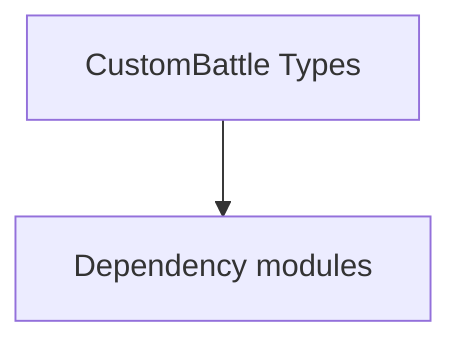

# CustomBattle Types

**One-line responsibility:** This page covers all 41 business types under `CustomBattle Types` as a family index, giving each type its namespace, responsibility, and typical timing so you can browse by module instead of alphabetically.

## Mental Model

CustomBattle implements the "custom battle" mode: players freely compose armies, pick a scene and rules for a non-story skirmish. CustomBattle is the aggregate root of a battle config, SelectionItem describes a selectable unit/formation entry, CustomBattleObjects carries the entities and parameters, and Views provide the UI layer. The cluster runs as a self-contained battle loop bridged to Mission via the battle manager.

## When to Use

To extend or add custom-battle unit selection / formation / rules, derive from the relevant SelectionItem/CustomBattleObjects; the UI layer only exposes state, writes go through the battle manager.

## Dependencies

The types under `CustomBattle Types` depend on the following modules; missing any of them causes compile- or run-time failure.

- [Mission](../../mission/Mission)
- [MBSubModuleBase](../../core/MBSubModuleBase)
- [API Overview](../../_index)

## Type Catalog

| Type | Namespace | Purpose | Timing |
| --- | --- | --- | --- |
| `ArmyCompositionGroupVM` | TaleWorlds.MountAndBlade.CustomBattle | Gauntlet UI data view-model that exposes properties and commands to the interface, reacts to input and notifies refreshes. A VM is only a projection of state; commands should only trigger Actions or Behaviors. | During custom/multiplayer session |
| `ArmyCompositionItemVM` | TaleWorlds.MountAndBlade.CustomBattle | Gauntlet UI data view-model that exposes properties and commands to the interface, reacts to input and notifies refreshes. A VM is only a projection of state; commands should only trigger Actions or Behaviors. | During custom/multiplayer session |
| `CompositionType` | TaleWorlds.MountAndBlade.CustomBattle | A business type under this namespace that carries its derived convention responsibility. Confirm its lifecycle and owning system before calling; do not reference an unready instance at the wrong phase. World-state changes should go through the corresponding Action/Behavior, not direct field mutation. | During custom/multiplayer session |
| `CPUBenchmarkMissionLogic` | TaleWorlds.MountAndBlade.CustomBattle | Mission logic that defines the flow and win/lose conditions of that mission, assembled by the Mission on load. Win/lose resolution must be idempotent — repeated triggers must not double-settle. | During custom/multiplayer session |
| `CPUBenchmarkMissionSpawnHandler` | TaleWorlds.MountAndBlade.CustomBattle | Board-game piece description with attributes and movement rules. State must be fully serializable to reconstruct the match. | During custom/multiplayer session |
| `CustomBattleSceneData` | TaleWorlds.MountAndBlade.CustomBattle | A business type under this namespace that carries its derived convention responsibility. Confirm its lifecycle and owning system before calling; do not reference an unready instance at the wrong phase. World-state changes should go through the corresponding Action/Behavior, not direct field mutation. | During custom/multiplayer session |
| `CustomBattleSceneNotificationContextProvider` | TaleWorlds.MountAndBlade.CustomBattle | Gauntlet image-source abstraction that resolves an entity/concept into an actual texture and caches it. The first frame may be empty; handle the loading state. | During custom/multiplayer session |
| `CustomBattleScreen` | TaleWorlds.MountAndBlade.CustomBattle | A business type under this namespace that carries its derived convention responsibility. Confirm its lifecycle and owning system before calling; do not reference an unready instance at the wrong phase. World-state changes should go through the corresponding Action/Behavior, not direct field mutation. | During custom/multiplayer session |
| `CustomBattleSideVM` | TaleWorlds.MountAndBlade.CustomBattle | Gauntlet UI data view-model that exposes properties and commands to the interface, reacts to input and notifies refreshes. A VM is only a projection of state; commands should only trigger Actions or Behaviors. | During custom/multiplayer session |
| `CustomBattleState` | TaleWorlds.MountAndBlade.CustomBattle | A business type under this namespace that carries its derived convention responsibility. Confirm its lifecycle and owning system before calling; do not reference an unready instance at the wrong phase. World-state changes should go through the corresponding Action/Behavior, not direct field mutation. | During custom/multiplayer session |
| `CustomBattleSubModule` | TaleWorlds.MountAndBlade.CustomBattle | A business type under this namespace that carries its derived convention responsibility. Confirm its lifecycle and owning system before calling; do not reference an unready instance at the wrong phase. World-state changes should go through the corresponding Action/Behavior, not direct field mutation. | During custom/multiplayer session |
| `CustomBattleTroopTypeVM` | TaleWorlds.MountAndBlade.CustomBattle | Gauntlet UI data view-model that exposes properties and commands to the interface, reacts to input and notifies refreshes. A VM is only a projection of state; commands should only trigger Actions or Behaviors. | During custom/multiplayer session |
| `CustomBattleViews` | TaleWorlds.MountAndBlade.CustomBattle | A business type under this namespace that carries its derived convention responsibility. Confirm its lifecycle and owning system before calling; do not reference an unready instance at the wrong phase. World-state changes should go through the corresponding Action/Behavior, not direct field mutation. | During custom/multiplayer session |
| `CustomBattleVM` | TaleWorlds.MountAndBlade.CustomBattle | Gauntlet UI data view-model that exposes properties and commands to the interface, reacts to input and notifies refreshes. A VM is only a projection of state; commands should only trigger Actions or Behaviors. | During custom/multiplayer session |
| `CustomGame` | TaleWorlds.MountAndBlade.CustomBattle | A business type under this namespace that carries its derived convention responsibility. Confirm its lifecycle and owning system before calling; do not reference an unready instance at the wrong phase. World-state changes should go through the corresponding Action/Behavior, not direct field mutation. | During custom/multiplayer session |
| `CustomGameManager` | TaleWorlds.MountAndBlade.CustomBattle | A business type under this namespace that carries its derived convention responsibility. Confirm its lifecycle and owning system before calling; do not reference an unready instance at the wrong phase. World-state changes should go through the corresponding Action/Behavior, not direct field mutation. | During custom/multiplayer session |
| `SelectionGroup` | TaleWorlds.MountAndBlade.CustomBattle | Election / voting mechanism used for collective decisions such as kingdom votes. Mind voting timing and tie handling. | During custom/multiplayer session |
| `CustomBattleCompositionData` | TaleWorlds.MountAndBlade.CustomBattle.CustomBattle | A business type under this namespace that carries its derived convention responsibility. Confirm its lifecycle and owning system before calling; do not reference an unready instance at the wrong phase. World-state changes should go through the corresponding Action/Behavior, not direct field mutation. | During custom/multiplayer session |
| `CustomBattleData` | TaleWorlds.MountAndBlade.CustomBattle.CustomBattle | A business type under this namespace that carries its derived convention responsibility. Confirm its lifecycle and owning system before calling; do not reference an unready instance at the wrong phase. World-state changes should go through the corresponding Action/Behavior, not direct field mutation. | During custom/multiplayer session |
| `CustomBattleHelper` | TaleWorlds.MountAndBlade.CustomBattle.CustomBattle | Static helper utility that concentrates a cross-cutting operation (open screen, compute result, resolve entity). Call it from the correct system context; do not instantiate it as stateful. | During custom/multiplayer session |
| `CustomBattlePlayerSide` | TaleWorlds.MountAndBlade.CustomBattle.CustomBattle | A business type under this namespace that carries its derived convention responsibility. Confirm its lifecycle and owning system before calling; do not reference an unready instance at the wrong phase. World-state changes should go through the corresponding Action/Behavior, not direct field mutation. | During custom/multiplayer session |
| `CustomBattlePlayerType` | TaleWorlds.MountAndBlade.CustomBattle.CustomBattle | A business type under this namespace that carries its derived convention responsibility. Confirm its lifecycle and owning system before calling; do not reference an unready instance at the wrong phase. World-state changes should go through the corresponding Action/Behavior, not direct field mutation. | During custom/multiplayer session |
| `CustomBattleProvider` | TaleWorlds.MountAndBlade.CustomBattle.CustomBattle | Gauntlet image-source abstraction that resolves an entity/concept into an actual texture and caches it. The first frame may be empty; handle the loading state. | During custom/multiplayer session |
| `CustomBattleSiegeMachineVM` | TaleWorlds.MountAndBlade.CustomBattle.CustomBattle | Gauntlet UI data view-model that exposes properties and commands to the interface, reacts to input and notifies refreshes. A VM is only a projection of state; commands should only trigger Actions or Behaviors. | During custom/multiplayer session |
| `CustomBattleTimeOfDay` | TaleWorlds.MountAndBlade.CustomBattle.CustomBattle | A business type under this namespace that carries its derived convention responsibility. Confirm its lifecycle and owning system before calling; do not reference an unready instance at the wrong phase. World-state changes should go through the corresponding Action/Behavior, not direct field mutation. | During custom/multiplayer session |
| `GameTypeSelectionGroupVM` | TaleWorlds.MountAndBlade.CustomBattle.CustomBattle | Gauntlet UI data view-model that exposes properties and commands to the interface, reacts to input and notifies refreshes. A VM is only a projection of state; commands should only trigger Actions or Behaviors. | During custom/multiplayer session |
| `MapSelectionGroupVM` | TaleWorlds.MountAndBlade.CustomBattle.CustomBattle | Gauntlet UI data view-model that exposes properties and commands to the interface, reacts to input and notifies refreshes. A VM is only a projection of state; commands should only trigger Actions or Behaviors. | During custom/multiplayer session |
| `TroopTypeSelectionPopUpVM` | TaleWorlds.MountAndBlade.CustomBattle.CustomBattle | Gauntlet UI data view-model that exposes properties and commands to the interface, reacts to input and notifies refreshes. A VM is only a projection of state; commands should only trigger Actions or Behaviors. | During custom/multiplayer session |
| `CharacterItemVM` | TaleWorlds.MountAndBlade.CustomBattle.CustomBattle.SelectionItem | Gauntlet UI data view-model that exposes properties and commands to the interface, reacts to input and notifies refreshes. A VM is only a projection of state; commands should only trigger Actions or Behaviors. | During custom/multiplayer session |
| `CustomBattleFactionSelectionVM` | TaleWorlds.MountAndBlade.CustomBattle.CustomBattle.SelectionItem | Gauntlet UI data view-model that exposes properties and commands to the interface, reacts to input and notifies refreshes. A VM is only a projection of state; commands should only trigger Actions or Behaviors. | During custom/multiplayer session |
| `FactionItemVM` | TaleWorlds.MountAndBlade.CustomBattle.CustomBattle.SelectionItem | Gauntlet UI data view-model that exposes properties and commands to the interface, reacts to input and notifies refreshes. A VM is only a projection of state; commands should only trigger Actions or Behaviors. | During custom/multiplayer session |
| `GameTypeItemVM` | TaleWorlds.MountAndBlade.CustomBattle.CustomBattle.SelectionItem | Gauntlet UI data view-model that exposes properties and commands to the interface, reacts to input and notifies refreshes. A VM is only a projection of state; commands should only trigger Actions or Behaviors. | During custom/multiplayer session |
| `MapItemVM` | TaleWorlds.MountAndBlade.CustomBattle.CustomBattle.SelectionItem | Gauntlet UI data view-model that exposes properties and commands to the interface, reacts to input and notifies refreshes. A VM is only a projection of state; commands should only trigger Actions or Behaviors. | During custom/multiplayer session |
| `PlayerSideItemVM` | TaleWorlds.MountAndBlade.CustomBattle.CustomBattle.SelectionItem | Gauntlet UI data view-model that exposes properties and commands to the interface, reacts to input and notifies refreshes. A VM is only a projection of state; commands should only trigger Actions or Behaviors. | During custom/multiplayer session |
| `PlayerTypeItemVM` | TaleWorlds.MountAndBlade.CustomBattle.CustomBattle.SelectionItem | Gauntlet UI data view-model that exposes properties and commands to the interface, reacts to input and notifies refreshes. A VM is only a projection of state; commands should only trigger Actions or Behaviors. | During custom/multiplayer session |
| `SceneLevelItemVM` | TaleWorlds.MountAndBlade.CustomBattle.CustomBattle.SelectionItem | Gauntlet UI data view-model that exposes properties and commands to the interface, reacts to input and notifies refreshes. A VM is only a projection of state; commands should only trigger Actions or Behaviors. | During custom/multiplayer session |
| `SeasonItemVM` | TaleWorlds.MountAndBlade.CustomBattle.CustomBattle.SelectionItem | Gauntlet UI data view-model that exposes properties and commands to the interface, reacts to input and notifies refreshes. A VM is only a projection of state; commands should only trigger Actions or Behaviors. | During custom/multiplayer session |
| `TimeOfDayItemVM` | TaleWorlds.MountAndBlade.CustomBattle.CustomBattle.SelectionItem | Gauntlet UI data view-model that exposes properties and commands to the interface, reacts to input and notifies refreshes. A VM is only a projection of state; commands should only trigger Actions or Behaviors. | During custom/multiplayer session |
| `WallHitpointItemVM` | TaleWorlds.MountAndBlade.CustomBattle.CustomBattle.SelectionItem | Gauntlet UI data view-model that exposes properties and commands to the interface, reacts to input and notifies refreshes. A VM is only a projection of state; commands should only trigger Actions or Behaviors. | During custom/multiplayer session |
| `CustomBattleBannerEffects` | TaleWorlds.MountAndBlade.CustomBattle.CustomBattleObjects | A business type under this namespace that carries its derived convention responsibility. Confirm its lifecycle and owning system before calling; do not reference an unready instance at the wrong phase. World-state changes should go through the corresponding Action/Behavior, not direct field mutation. | During custom/multiplayer session |
| `GauntletCustomBattleMissionCheatView` | TaleWorlds.MountAndBlade.CustomBattle.Views | Debug cheat item triggered via console or menu for development-time effects. Production builds should disable or stub it to avoid accidentally corrupting saves. | On UI open |

## Risk & Boundaries

Custom-battle state must be fully serializable to support mid-match saving. SelectionItem-to-entity mapping must stay consistent; referencing an unloaded unit yields null. Single/multiplayer rule branches differ — cover both.

## See Also

- [Mission](../../mission/Mission)
- [MBSubModuleBase](../../core/MBSubModuleBase)
- [API Overview](../../_index)
