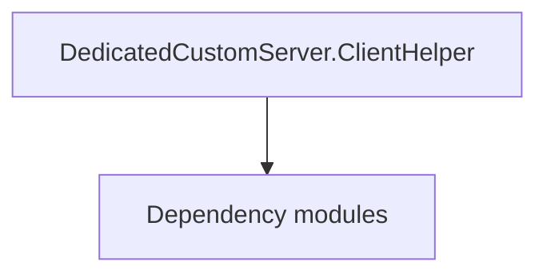

# DedicatedCustomServer.ClientHelper

**One-line responsibility:** This page covers all 6 business types under `DedicatedCustomServer.ClientHelper` as a family index, giving each type its namespace, responsibility, and typical timing so you can browse by module instead of alphabetically.

## Mental Model

DedicatedCustomServer.ClientHelper provides client-side helper types for the dedicated-server (dedicated server) scenario, bridging server-side battle/match state to the client presentation. It exists only in dedicated-server builds and the matching client session; it is the glue layer for multiplayer deployment and takes no part in single-player story.

## When to Use

When you need to bridge battle state to client presentation under dedicated-server deployment, use these helpers; single-player paths should not reference them.

## Dependencies

The types under `DedicatedCustomServer.ClientHelper` depend on the following modules; missing any of them causes compile- or run-time failure.

- [Mission](../../mission/Mission)
- [MBSubModuleBase](../../core/MBSubModuleBase)
- [API Overview](../../_index)

## Type Catalog

| Type | Namespace | Purpose | Timing |
| --- | --- | --- | --- |
| `DCSHelperMapItemVM` | TaleWorlds.MountAndBlade.DedicatedCustomServer.ClientHelper | Gauntlet UI data view-model that exposes properties and commands to the interface, reacts to input and notifies refreshes. A VM is only a projection of state; commands should only trigger Actions or Behaviors. | During custom/multiplayer session |
| `DCSHelperVM` | TaleWorlds.MountAndBlade.DedicatedCustomServer.ClientHelper | Gauntlet UI data view-model that exposes properties and commands to the interface, reacts to input and notifies refreshes. A VM is only a projection of state; commands should only trigger Actions or Behaviors. | During custom/multiplayer session |
| `DedicatedCustomServerClientHelperSubModule` | TaleWorlds.MountAndBlade.DedicatedCustomServer.ClientHelper | Module entry base class that registers behaviors and override points. Its lifetime spans the whole session; do not fetch systems that are not yet ready (e.g. before loading) at the wrong phase. | During custom/multiplayer session |
| `ModHelpers` | TaleWorlds.MountAndBlade.DedicatedCustomServer.ClientHelper | Static helper utility that concentrates a cross-cutting operation (open screen, compute result, resolve entity). Call it from the correct system context; do not instantiate it as stateful. | During custom/multiplayer session |
| `ModLogger` | TaleWorlds.MountAndBlade.DedicatedCustomServer.ClientHelper | Static helper utility that concentrates a cross-cutting operation (open screen, compute result, resolve entity). Call it from the correct system context; do not instantiate it as stateful. | During custom/multiplayer session |
| `ProgressUpdate` | TaleWorlds.MountAndBlade.DedicatedCustomServer.ClientHelper | Static helper utility that concentrates a cross-cutting operation (open screen, compute result, resolve entity). Call it from the correct system context; do not instantiate it as stateful. | During custom/multiplayer session |

## Risk & Boundaries

Valid only in dedicated-server builds; single-player/editor references yield null or errors. Cross-build references need macro guards. Client helpers hold no authoritative state — the server decides.

## See Also

- [Mission](../../mission/Mission)
- [MBSubModuleBase](../../core/MBSubModuleBase)
- [API Overview](../../_index)
