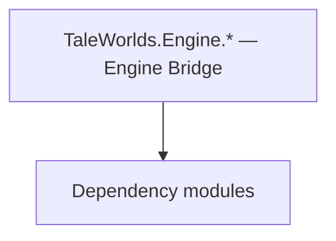

# TaleWorlds.Engine.* — Engine Bridge

**One-line responsibility:** This page covers all 203 business types under `TaleWorlds.Engine.* — Engine Bridge` as a family index, giving each type its namespace, responsibility, and typical timing so you can browse by module instead of alphabetically.

## Mental Model

TaleWorlds.Engine.* is the engine bridge layer exposing scene, rendering, physics, input, and engine options to the managed game code. It is the boundary between the native engine and the C# gameplay; mods touch it mainly through the managed wrappers and IMB* interfaces rather than the native side.

## When to Use

Reach for engine types when you need scene/rendering/input/options access; prefer the managed wrappers over native calls.

## Dependencies

The types under `TaleWorlds.Engine.* — Engine Bridge` depend on the following modules; missing any of them causes compile- or run-time failure.

- [MBSubModuleBase](../../core/MBSubModuleBase)
- [API Overview](../../_index)

## Type Catalog

| Type | Namespace | Purpose | Timing |
| --- | --- | --- | --- |
| `AnimResult` | TaleWorlds.Engine | A business type under this namespace that carries its derived convention responsibility. Confirm its lifecycle and owning system before calling; do not reference an unready instance at the wrong phase. World-state changes should go through the corresponding Action/Behavior, not direct field mutation. | Runtime |
| `ApplicationHealthChecker` | TaleWorlds.Engine | A business type under this namespace that carries its derived convention responsibility. Confirm its lifecycle and owning system before calling; do not reference an unready instance at the wrong phase. World-state changes should go through the corresponding Action/Behavior, not direct field mutation. | Runtime |
| `ApplicationInterfaceBase` | TaleWorlds.Engine | A business type under this namespace that carries its derived convention responsibility. Confirm its lifecycle and owning system before calling; do not reference an unready instance at the wrong phase. World-state changes should go through the corresponding Action/Behavior, not direct field mutation. | Runtime |
| `AsyncTask` | TaleWorlds.Engine | Quest-stage sub-goal that defines one completion condition and settlement. Condition checks must be idempotent — repeated completion must not double-reward. | Runtime |
| `BillboardType` | TaleWorlds.Engine | A business type under this namespace that carries its derived convention responsibility. Confirm its lifecycle and owning system before calling; do not reference an unready instance at the wrong phase. World-state changes should go through the corresponding Action/Behavior, not direct field mutation. | Runtime |
| `BodyFlags` | TaleWorlds.Engine | A business type under this namespace that carries its derived convention responsibility. Confirm its lifecycle and owning system before calling; do not reference an unready instance at the wrong phase. World-state changes should go through the corresponding Action/Behavior, not direct field mutation. | Runtime |
| `BoundingBox` | TaleWorlds.Engine | A business type under this namespace that carries its derived convention responsibility. Confirm its lifecycle and owning system before calling; do not reference an unready instance at the wrong phase. World-state changes should go through the corresponding Action/Behavior, not direct field mutation. | Runtime |
| `Camera` | TaleWorlds.Engine | A business type under this namespace that carries its derived convention responsibility. Confirm its lifecycle and owning system before calling; do not reference an unready instance at the wrong phase. World-state changes should go through the corresponding Action/Behavior, not direct field mutation. | Runtime |
| `CapsuleData` | TaleWorlds.Engine | A business type under this namespace that carries its derived convention responsibility. Confirm its lifecycle and owning system before calling; do not reference an unready instance at the wrong phase. World-state changes should go through the corresponding Action/Behavior, not direct field mutation. | Runtime |
| `ClothSimulatorComponent` | TaleWorlds.Engine | A business type under this namespace that carries its derived convention responsibility. Confirm its lifecycle and owning system before calling; do not reference an unready instance at the wrong phase. World-state changes should go through the corresponding Action/Behavior, not direct field mutation. | Runtime |
| `ColorStyle` | TaleWorlds.Engine | A business type under this namespace that carries its derived convention responsibility. Confirm its lifecycle and owning system before calling; do not reference an unready instance at the wrong phase. World-state changes should go through the corresponding Action/Behavior, not direct field mutation. | Runtime |
| `ComponentType` | TaleWorlds.Engine | A business type under this namespace that carries its derived convention responsibility. Confirm its lifecycle and owning system before calling; do not reference an unready instance at the wrong phase. World-state changes should go through the corresponding Action/Behavior, not direct field mutation. | Runtime |
| `CompositeComponent` | TaleWorlds.Engine | A business type under this namespace that carries its derived convention responsibility. Confirm its lifecycle and owning system before calling; do not reference an unready instance at the wrong phase. World-state changes should go through the corresponding Action/Behavior, not direct field mutation. | Runtime |
| `CrashInformation` | TaleWorlds.Engine | A business type under this namespace that carries its derived convention responsibility. Confirm its lifecycle and owning system before calling; do not reference an unready instance at the wrong phase. World-state changes should go through the corresponding Action/Behavior, not direct field mutation. | Runtime |
| `CrashInformationCollector` | TaleWorlds.Engine | A business type under this namespace that carries its derived convention responsibility. Confirm its lifecycle and owning system before calling; do not reference an unready instance at the wrong phase. World-state changes should go through the corresponding Action/Behavior, not direct field mutation. | Runtime |
| `CrashInformationProvider` | TaleWorlds.Engine | Gauntlet image-source abstraction that resolves an entity/concept into an actual texture and caches it. The first frame may be empty; handle the loading state. | Runtime |
| `Decal` | TaleWorlds.Engine | A business type under this namespace that carries its derived convention responsibility. Confirm its lifecycle and owning system before calling; do not reference an unready instance at the wrong phase. World-state changes should go through the corresponding Action/Behavior, not direct field mutation. | Runtime |
| `DecalAtlasGroup` | TaleWorlds.Engine | A business type under this namespace that carries its derived convention responsibility. Confirm its lifecycle and owning system before calling; do not reference an unready instance at the wrong phase. World-state changes should go through the corresponding Action/Behavior, not direct field mutation. | Runtime |
| `EditDataPolicy` | TaleWorlds.Engine | A business type under this namespace that carries its derived convention responsibility. Confirm its lifecycle and owning system before calling; do not reference an unready instance at the wrong phase. World-state changes should go through the corresponding Action/Behavior, not direct field mutation. | Runtime |
| `EditorVisibleScriptComponentVariable` | TaleWorlds.Engine | Script component attached to a scene GameObject, exposing scene state to the logic layer. Depends on scene load order; fields are null before the scene is ready. | Runtime |
| `EngineApplicationInterface` | TaleWorlds.Engine | A business type under this namespace that carries its derived convention responsibility. Confirm its lifecycle and owning system before calling; do not reference an unready instance at the wrong phase. World-state changes should go through the corresponding Action/Behavior, not direct field mutation. | Runtime |
| `EngineCallback` | TaleWorlds.Engine | A business type under this namespace that carries its derived convention responsibility. Confirm its lifecycle and owning system before calling; do not reference an unready instance at the wrong phase. World-state changes should go through the corresponding Action/Behavior, not direct field mutation. | Runtime |
| `EngineController` | TaleWorlds.Engine | A business type under this namespace that carries its derived convention responsibility. Confirm its lifecycle and owning system before calling; do not reference an unready instance at the wrong phase. World-state changes should go through the corresponding Action/Behavior, not direct field mutation. | Runtime |
| `EngineExtensions` | TaleWorlds.Engine | A business type under this namespace that carries its derived convention responsibility. Confirm its lifecycle and owning system before calling; do not reference an unready instance at the wrong phase. World-state changes should go through the corresponding Action/Behavior, not direct field mutation. | Runtime |
| `EngineFilePaths` | TaleWorlds.Engine | A business type under this namespace that carries its derived convention responsibility. Confirm its lifecycle and owning system before calling; do not reference an unready instance at the wrong phase. World-state changes should go through the corresponding Action/Behavior, not direct field mutation. | Runtime |
| `EngineManaged` | TaleWorlds.Engine | A business type under this namespace that carries its derived convention responsibility. Confirm its lifecycle and owning system before calling; do not reference an unready instance at the wrong phase. World-state changes should go through the corresponding Action/Behavior, not direct field mutation. | Runtime |
| `EngineRenderDisplayMode` | TaleWorlds.Engine | A business type under this namespace that carries its derived convention responsibility. Confirm its lifecycle and owning system before calling; do not reference an unready instance at the wrong phase. World-state changes should go through the corresponding Action/Behavior, not direct field mutation. | Runtime |
| `EngineScreenManager` | TaleWorlds.Engine | A business type under this namespace that carries its derived convention responsibility. Confirm its lifecycle and owning system before calling; do not reference an unready instance at the wrong phase. World-state changes should go through the corresponding Action/Behavior, not direct field mutation. | Runtime |
| `EntityFlags` | TaleWorlds.Engine | A business type under this namespace that carries its derived convention responsibility. Confirm its lifecycle and owning system before calling; do not reference an unready instance at the wrong phase. World-state changes should go through the corresponding Action/Behavior, not direct field mutation. | Runtime |
| `EntityVisibilityFlags` | TaleWorlds.Engine | A business type under this namespace that carries its derived convention responsibility. Confirm its lifecycle and owning system before calling; do not reference an unready instance at the wrong phase. World-state changes should go through the corresponding Action/Behavior, not direct field mutation. | Runtime |
| `Face` | TaleWorlds.Engine | A business type under this namespace that carries its derived convention responsibility. Confirm its lifecycle and owning system before calling; do not reference an unready instance at the wrong phase. World-state changes should go through the corresponding Action/Behavior, not direct field mutation. | Runtime |
| `FaceCorner` | TaleWorlds.Engine | A business type under this namespace that carries its derived convention responsibility. Confirm its lifecycle and owning system before calling; do not reference an unready instance at the wrong phase. World-state changes should go through the corresponding Action/Behavior, not direct field mutation. | Runtime |
| `FloaterVolumeDynamicUpAxis` | TaleWorlds.Engine | A business type under this namespace that carries its derived convention responsibility. Confirm its lifecycle and owning system before calling; do not reference an unready instance at the wrong phase. World-state changes should go through the corresponding Action/Behavior, not direct field mutation. | Runtime |
| `ForceMode` | TaleWorlds.Engine | A business type under this namespace that carries its derived convention responsibility. Confirm its lifecycle and owning system before calling; do not reference an unready instance at the wrong phase. World-state changes should go through the corresponding Action/Behavior, not direct field mutation. | Runtime |
| `FtlCapsuleData` | TaleWorlds.Engine | A business type under this namespace that carries its derived convention responsibility. Confirm its lifecycle and owning system before calling; do not reference an unready instance at the wrong phase. World-state changes should go through the corresponding Action/Behavior, not direct field mutation. | Runtime |
| `GameEntity` | TaleWorlds.Engine | A business type under this namespace that carries its derived convention responsibility. Confirm its lifecycle and owning system before calling; do not reference an unready instance at the wrong phase. World-state changes should go through the corresponding Action/Behavior, not direct field mutation. | Runtime |
| `GameEntityComponent` | TaleWorlds.Engine | A business type under this namespace that carries its derived convention responsibility. Confirm its lifecycle and owning system before calling; do not reference an unready instance at the wrong phase. World-state changes should go through the corresponding Action/Behavior, not direct field mutation. | Runtime |
| `GameEntityPhysicsExtensions` | TaleWorlds.Engine | A business type under this namespace that carries its derived convention responsibility. Confirm its lifecycle and owning system before calling; do not reference an unready instance at the wrong phase. World-state changes should go through the corresponding Action/Behavior, not direct field mutation. | Runtime |
| `GameEntityWithWorldPosition` | TaleWorlds.Engine | A business type under this namespace that carries its derived convention responsibility. Confirm its lifecycle and owning system before calling; do not reference an unready instance at the wrong phase. World-state changes should go through the corresponding Action/Behavior, not direct field mutation. | Runtime |
| `HasTableauCache` | TaleWorlds.Engine | A business type under this namespace that carries its derived convention responsibility. Confirm its lifecycle and owning system before calling; do not reference an unready instance at the wrong phase. World-state changes should go through the corresponding Action/Behavior, not direct field mutation. | Runtime |
| `Highlights` | TaleWorlds.Engine | A business type under this namespace that carries its derived convention responsibility. Confirm its lifecycle and owning system before calling; do not reference an unready instance at the wrong phase. World-state changes should go through the corresponding Action/Behavior, not direct field mutation. | Runtime |
| `IAsyncTask` | TaleWorlds.Engine | Quest-stage sub-goal that defines one completion condition and settlement. Condition checks must be idempotent — repeated completion must not double-reward. | Runtime |
| `IBodyPart` | TaleWorlds.Engine | A business type under this namespace that carries its derived convention responsibility. Confirm its lifecycle and owning system before calling; do not reference an unready instance at the wrong phase. World-state changes should go through the corresponding Action/Behavior, not direct field mutation. | Runtime |
| `ICamera` | TaleWorlds.Engine | A business type under this namespace that carries its derived convention responsibility. Confirm its lifecycle and owning system before calling; do not reference an unready instance at the wrong phase. World-state changes should go through the corresponding Action/Behavior, not direct field mutation. | Runtime |
| `IClothSimulatorComponent` | TaleWorlds.Engine | A business type under this namespace that carries its derived convention responsibility. Confirm its lifecycle and owning system before calling; do not reference an unready instance at the wrong phase. World-state changes should go through the corresponding Action/Behavior, not direct field mutation. | Runtime |
| `ICompositeComponent` | TaleWorlds.Engine | A business type under this namespace that carries its derived convention responsibility. Confirm its lifecycle and owning system before calling; do not reference an unready instance at the wrong phase. World-state changes should go through the corresponding Action/Behavior, not direct field mutation. | Runtime |
| `IConfig` | TaleWorlds.Engine | A business type under this namespace that carries its derived convention responsibility. Confirm its lifecycle and owning system before calling; do not reference an unready instance at the wrong phase. World-state changes should go through the corresponding Action/Behavior, not direct field mutation. | Runtime |
| `IDebug` | TaleWorlds.Engine | A business type under this namespace that carries its derived convention responsibility. Confirm its lifecycle and owning system before calling; do not reference an unready instance at the wrong phase. World-state changes should go through the corresponding Action/Behavior, not direct field mutation. | Runtime |
| `IDecal` | TaleWorlds.Engine | A business type under this namespace that carries its derived convention responsibility. Confirm its lifecycle and owning system before calling; do not reference an unready instance at the wrong phase. World-state changes should go through the corresponding Action/Behavior, not direct field mutation. | Runtime |
| `IEngineSizeChecker` | TaleWorlds.Engine | A business type under this namespace that carries its derived convention responsibility. Confirm its lifecycle and owning system before calling; do not reference an unready instance at the wrong phase. World-state changes should go through the corresponding Action/Behavior, not direct field mutation. | Runtime |
| `IGameEntity` | TaleWorlds.Engine | A business type under this namespace that carries its derived convention responsibility. Confirm its lifecycle and owning system before calling; do not reference an unready instance at the wrong phase. World-state changes should go through the corresponding Action/Behavior, not direct field mutation. | Runtime |
| `IGameEntityComponent` | TaleWorlds.Engine | A business type under this namespace that carries its derived convention responsibility. Confirm its lifecycle and owning system before calling; do not reference an unready instance at the wrong phase. World-state changes should go through the corresponding Action/Behavior, not direct field mutation. | Runtime |
| `IHighlights` | TaleWorlds.Engine | A business type under this namespace that carries its derived convention responsibility. Confirm its lifecycle and owning system before calling; do not reference an unready instance at the wrong phase. World-state changes should go through the corresponding Action/Behavior, not direct field mutation. | Runtime |
| `IImgui` | TaleWorlds.Engine | A business type under this namespace that carries its derived convention responsibility. Confirm its lifecycle and owning system before calling; do not reference an unready instance at the wrong phase. World-state changes should go through the corresponding Action/Behavior, not direct field mutation. | Runtime |
| `IInput` | TaleWorlds.Engine | A business type under this namespace that carries its derived convention responsibility. Confirm its lifecycle and owning system before calling; do not reference an unready instance at the wrong phase. World-state changes should go through the corresponding Action/Behavior, not direct field mutation. | Runtime |
| `ILight` | TaleWorlds.Engine | A business type under this namespace that carries its derived convention responsibility. Confirm its lifecycle and owning system before calling; do not reference an unready instance at the wrong phase. World-state changes should go through the corresponding Action/Behavior, not direct field mutation. | Runtime |
| `ILoadingWindowManager` | TaleWorlds.Engine | A business type under this namespace that carries its derived convention responsibility. Confirm its lifecycle and owning system before calling; do not reference an unready instance at the wrong phase. World-state changes should go through the corresponding Action/Behavior, not direct field mutation. | Runtime |
| `IManagedMeshEditOperations` | TaleWorlds.Engine | A business type under this namespace that carries its derived convention responsibility. Confirm its lifecycle and owning system before calling; do not reference an unready instance at the wrong phase. World-state changes should go through the corresponding Action/Behavior, not direct field mutation. | Runtime |
| `IMaterial` | TaleWorlds.Engine | A business type under this namespace that carries its derived convention responsibility. Confirm its lifecycle and owning system before calling; do not reference an unready instance at the wrong phase. World-state changes should go through the corresponding Action/Behavior, not direct field mutation. | Runtime |
| `IMesh` | TaleWorlds.Engine | A business type under this namespace that carries its derived convention responsibility. Confirm its lifecycle and owning system before calling; do not reference an unready instance at the wrong phase. World-state changes should go through the corresponding Action/Behavior, not direct field mutation. | Runtime |
| `IMeshBuilder` | TaleWorlds.Engine | A business type under this namespace that carries its derived convention responsibility. Confirm its lifecycle and owning system before calling; do not reference an unready instance at the wrong phase. World-state changes should go through the corresponding Action/Behavior, not direct field mutation. | Runtime |
| `IMetaMesh` | TaleWorlds.Engine | A business type under this namespace that carries its derived convention responsibility. Confirm its lifecycle and owning system before calling; do not reference an unready instance at the wrong phase. World-state changes should go through the corresponding Action/Behavior, not direct field mutation. | Runtime |
| `Imgui` | TaleWorlds.Engine | A business type under this namespace that carries its derived convention responsibility. Confirm its lifecycle and owning system before calling; do not reference an unready instance at the wrong phase. World-state changes should go through the corresponding Action/Behavior, not direct field mutation. | Runtime |
| `IMouseManager` | TaleWorlds.Engine | A business type under this namespace that carries its derived convention responsibility. Confirm its lifecycle and owning system before calling; do not reference an unready instance at the wrong phase. World-state changes should go through the corresponding Action/Behavior, not direct field mutation. | Runtime |
| `IMusic` | TaleWorlds.Engine | A business type under this namespace that carries its derived convention responsibility. Confirm its lifecycle and owning system before calling; do not reference an unready instance at the wrong phase. World-state changes should go through the corresponding Action/Behavior, not direct field mutation. | Runtime |
| `InputLayout` | TaleWorlds.Engine | A business type under this namespace that carries its derived convention responsibility. Confirm its lifecycle and owning system before calling; do not reference an unready instance at the wrong phase. World-state changes should go through the corresponding Action/Behavior, not direct field mutation. | Runtime |
| `Intersection` | TaleWorlds.Engine | A business type under this namespace that carries its derived convention responsibility. Confirm its lifecycle and owning system before calling; do not reference an unready instance at the wrong phase. World-state changes should go through the corresponding Action/Behavior, not direct field mutation. | Runtime |
| `IntersectionDetails` | TaleWorlds.Engine | AI decision implementation that must be interruptible and serializable to support saving and undo. Search must be depth/time bounded to avoid stalls. | Runtime |
| `IntersectionType` | TaleWorlds.Engine | A business type under this namespace that carries its derived convention responsibility. Confirm its lifecycle and owning system before calling; do not reference an unready instance at the wrong phase. World-state changes should go through the corresponding Action/Behavior, not direct field mutation. | Runtime |
| `IParticleSystem` | TaleWorlds.Engine | A business type under this namespace that carries its derived convention responsibility. Confirm its lifecycle and owning system before calling; do not reference an unready instance at the wrong phase. World-state changes should go through the corresponding Action/Behavior, not direct field mutation. | Runtime |
| `IPath` | TaleWorlds.Engine | A business type under this namespace that carries its derived convention responsibility. Confirm its lifecycle and owning system before calling; do not reference an unready instance at the wrong phase. World-state changes should go through the corresponding Action/Behavior, not direct field mutation. | Runtime |
| `IPhysicsMaterial` | TaleWorlds.Engine | A business type under this namespace that carries its derived convention responsibility. Confirm its lifecycle and owning system before calling; do not reference an unready instance at the wrong phase. World-state changes should go through the corresponding Action/Behavior, not direct field mutation. | Runtime |
| `IPhysicsShape` | TaleWorlds.Engine | A business type under this namespace that carries its derived convention responsibility. Confirm its lifecycle and owning system before calling; do not reference an unready instance at the wrong phase. World-state changes should go through the corresponding Action/Behavior, not direct field mutation. | Runtime |
| `IScene` | TaleWorlds.Engine | A business type under this namespace that carries its derived convention responsibility. Confirm its lifecycle and owning system before calling; do not reference an unready instance at the wrong phase. World-state changes should go through the corresponding Action/Behavior, not direct field mutation. | Runtime |
| `ISceneView` | TaleWorlds.Engine | A business type under this namespace that carries its derived convention responsibility. Confirm its lifecycle and owning system before calling; do not reference an unready instance at the wrong phase. World-state changes should go through the corresponding Action/Behavior, not direct field mutation. | Runtime |
| `IScreen` | TaleWorlds.Engine | A business type under this namespace that carries its derived convention responsibility. Confirm its lifecycle and owning system before calling; do not reference an unready instance at the wrong phase. World-state changes should go through the corresponding Action/Behavior, not direct field mutation. | Runtime |
| `IScriptComponent` | TaleWorlds.Engine | Script component attached to a scene GameObject, exposing scene state to the logic layer. Depends on scene load order; fields are null before the scene is ready. | Runtime |
| `IShader` | TaleWorlds.Engine | A business type under this namespace that carries its derived convention responsibility. Confirm its lifecycle and owning system before calling; do not reference an unready instance at the wrong phase. World-state changes should go through the corresponding Action/Behavior, not direct field mutation. | Runtime |
| `ISkeleton` | TaleWorlds.Engine | A business type under this namespace that carries its derived convention responsibility. Confirm its lifecycle and owning system before calling; do not reference an unready instance at the wrong phase. World-state changes should go through the corresponding Action/Behavior, not direct field mutation. | Runtime |
| `ISoundEvent` | TaleWorlds.Engine | Event or event handler carrying the data of something that happened once. Remember to unsubscribe on unload to avoid leaks. | Runtime |
| `ISoundManager` | TaleWorlds.Engine | A business type under this namespace that carries its derived convention responsibility. Confirm its lifecycle and owning system before calling; do not reference an unready instance at the wrong phase. World-state changes should go through the corresponding Action/Behavior, not direct field mutation. | Runtime |
| `ITableauView` | TaleWorlds.Engine | A business type under this namespace that carries its derived convention responsibility. Confirm its lifecycle and owning system before calling; do not reference an unready instance at the wrong phase. World-state changes should go through the corresponding Action/Behavior, not direct field mutation. | Runtime |
| `ITexture` | TaleWorlds.Engine | A business type under this namespace that carries its derived convention responsibility. Confirm its lifecycle and owning system before calling; do not reference an unready instance at the wrong phase. World-state changes should go through the corresponding Action/Behavior, not direct field mutation. | Runtime |
| `ITextureView` | TaleWorlds.Engine | A business type under this namespace that carries its derived convention responsibility. Confirm its lifecycle and owning system before calling; do not reference an unready instance at the wrong phase. World-state changes should go through the corresponding Action/Behavior, not direct field mutation. | Runtime |
| `IThumbnailCreatorView` | TaleWorlds.Engine | AI decision implementation that must be interruptible and serializable to support saving and undo. Search must be depth/time bounded to avoid stalls. | Runtime |
| `ITime` | TaleWorlds.Engine | A business type under this namespace that carries its derived convention responsibility. Confirm its lifecycle and owning system before calling; do not reference an unready instance at the wrong phase. World-state changes should go through the corresponding Action/Behavior, not direct field mutation. | Runtime |
| `ITwoDimensionView` | TaleWorlds.Engine | A business type under this namespace that carries its derived convention responsibility. Confirm its lifecycle and owning system before calling; do not reference an unready instance at the wrong phase. World-state changes should go through the corresponding Action/Behavior, not direct field mutation. | Runtime |
| `IUtil` | TaleWorlds.Engine | A business type under this namespace that carries its derived convention responsibility. Confirm its lifecycle and owning system before calling; do not reference an unready instance at the wrong phase. World-state changes should go through the corresponding Action/Behavior, not direct field mutation. | Runtime |
| `IVideoPlayerView` | TaleWorlds.Engine | A business type under this namespace that carries its derived convention responsibility. Confirm its lifecycle and owning system before calling; do not reference an unready instance at the wrong phase. World-state changes should go through the corresponding Action/Behavior, not direct field mutation. | Runtime |
| `IView` | TaleWorlds.Engine | A business type under this namespace that carries its derived convention responsibility. Confirm its lifecycle and owning system before calling; do not reference an unready instance at the wrong phase. World-state changes should go through the corresponding Action/Behavior, not direct field mutation. | Runtime |
| `Job` | TaleWorlds.Engine | A business type under this namespace that carries its derived convention responsibility. Confirm its lifecycle and owning system before calling; do not reference an unready instance at the wrong phase. World-state changes should go through the corresponding Action/Behavior, not direct field mutation. | Runtime |
| `JobManager` | TaleWorlds.Engine | A business type under this namespace that carries its derived convention responsibility. Confirm its lifecycle and owning system before calling; do not reference an unready instance at the wrong phase. World-state changes should go through the corresponding Action/Behavior, not direct field mutation. | Runtime |
| `Light` | TaleWorlds.Engine | A business type under this namespace that carries its derived convention responsibility. Confirm its lifecycle and owning system before calling; do not reference an unready instance at the wrong phase. World-state changes should go through the corresponding Action/Behavior, not direct field mutation. | Runtime |
| `LoadingWindow` | TaleWorlds.Engine | A business type under this namespace that carries its derived convention responsibility. Confirm its lifecycle and owning system before calling; do not reference an unready instance at the wrong phase. World-state changes should go through the corresponding Action/Behavior, not direct field mutation. | Runtime |
| `MainThreadPerformanceQuery` | TaleWorlds.Engine | AI decision implementation that must be interruptible and serializable to support saving and undo. Search must be depth/time bounded to avoid stalls. | Runtime |
| `ManagedExtensions` | TaleWorlds.Engine | A business type under this namespace that carries its derived convention responsibility. Confirm its lifecycle and owning system before calling; do not reference an unready instance at the wrong phase. World-state changes should go through the corresponding Action/Behavior, not direct field mutation. | Runtime |
| `ManagedMeshEditOperations` | TaleWorlds.Engine | A business type under this namespace that carries its derived convention responsibility. Confirm its lifecycle and owning system before calling; do not reference an unready instance at the wrong phase. World-state changes should go through the corresponding Action/Behavior, not direct field mutation. | Runtime |
| `ManagedScriptComponent` | TaleWorlds.Engine | Script component attached to a scene GameObject, exposing scene state to the logic layer. Depends on scene load order; fields are null before the scene is ready. | Runtime |
| `ManagedScriptHolder` | TaleWorlds.Engine | A business type under this namespace that carries its derived convention responsibility. Confirm its lifecycle and owning system before calling; do not reference an unready instance at the wrong phase. World-state changes should go through the corresponding Action/Behavior, not direct field mutation. | Runtime |
| `Material` | TaleWorlds.Engine | A business type under this namespace that carries its derived convention responsibility. Confirm its lifecycle and owning system before calling; do not reference an unready instance at the wrong phase. World-state changes should go through the corresponding Action/Behavior, not direct field mutation. | Runtime |
| `MaterialFlags` | TaleWorlds.Engine | A business type under this namespace that carries its derived convention responsibility. Confirm its lifecycle and owning system before calling; do not reference an unready instance at the wrong phase. World-state changes should go through the corresponding Action/Behavior, not direct field mutation. | Runtime |
| `MBAlphaBlendMode` | TaleWorlds.Engine | A business type under this namespace that carries its derived convention responsibility. Confirm its lifecycle and owning system before calling; do not reference an unready instance at the wrong phase. World-state changes should go through the corresponding Action/Behavior, not direct field mutation. | Runtime |
| `MBDebug` | TaleWorlds.Engine | A business type under this namespace that carries its derived convention responsibility. Confirm its lifecycle and owning system before calling; do not reference an unready instance at the wrong phase. World-state changes should go through the corresponding Action/Behavior, not direct field mutation. | Runtime |
| `MBMeshCullingMode` | TaleWorlds.Engine | A business type under this namespace that carries its derived convention responsibility. Confirm its lifecycle and owning system before calling; do not reference an unready instance at the wrong phase. World-state changes should go through the corresponding Action/Behavior, not direct field mutation. | Runtime |
| `MBMouseButtonState` | TaleWorlds.Engine | A business type under this namespace that carries its derived convention responsibility. Confirm its lifecycle and owning system before calling; do not reference an unready instance at the wrong phase. World-state changes should go through the corresponding Action/Behavior, not direct field mutation. | Runtime |
| `MBTextureType` | TaleWorlds.Engine | A business type under this namespace that carries its derived convention responsibility. Confirm its lifecycle and owning system before calling; do not reference an unready instance at the wrong phase. World-state changes should go through the corresponding Action/Behavior, not direct field mutation. | Runtime |
| `Mesh` | TaleWorlds.Engine | A business type under this namespace that carries its derived convention responsibility. Confirm its lifecycle and owning system before calling; do not reference an unready instance at the wrong phase. World-state changes should go through the corresponding Action/Behavior, not direct field mutation. | Runtime |
| `MeshBuilder` | TaleWorlds.Engine | A business type under this namespace that carries its derived convention responsibility. Confirm its lifecycle and owning system before calling; do not reference an unready instance at the wrong phase. World-state changes should go through the corresponding Action/Behavior, not direct field mutation. | Runtime |
| `MessageBoxTypeFlag` | TaleWorlds.Engine | A business type under this namespace that carries its derived convention responsibility. Confirm its lifecycle and owning system before calling; do not reference an unready instance at the wrong phase. World-state changes should go through the corresponding Action/Behavior, not direct field mutation. | Runtime |
| `MessageManagerBase` | TaleWorlds.Engine | A business type under this namespace that carries its derived convention responsibility. Confirm its lifecycle and owning system before calling; do not reference an unready instance at the wrong phase. World-state changes should go through the corresponding Action/Behavior, not direct field mutation. | Runtime |
| `MetaMesh` | TaleWorlds.Engine | A business type under this namespace that carries its derived convention responsibility. Confirm its lifecycle and owning system before calling; do not reference an unready instance at the wrong phase. World-state changes should go through the corresponding Action/Behavior, not direct field mutation. | Runtime |
| `Mobility` | TaleWorlds.Engine | A business type under this namespace that carries its derived convention responsibility. Confirm its lifecycle and owning system before calling; do not reference an unready instance at the wrong phase. World-state changes should go through the corresponding Action/Behavior, not direct field mutation. | Runtime |
| `MouseManager` | TaleWorlds.Engine | A business type under this namespace that carries its derived convention responsibility. Confirm its lifecycle and owning system before calling; do not reference an unready instance at the wrong phase. World-state changes should go through the corresponding Action/Behavior, not direct field mutation. | Runtime |
| `Music` | TaleWorlds.Engine | A business type under this namespace that carries its derived convention responsibility. Confirm its lifecycle and owning system before calling; do not reference an unready instance at the wrong phase. World-state changes should go through the corresponding Action/Behavior, not direct field mutation. | Runtime |
| `NativeConfig` | TaleWorlds.Engine | A business type under this namespace that carries its derived convention responsibility. Confirm its lifecycle and owning system before calling; do not reference an unready instance at the wrong phase. World-state changes should go through the corresponding Action/Behavior, not direct field mutation. | Runtime |
| `NativeParallelDriver` | TaleWorlds.Engine | A business type under this namespace that carries its derived convention responsibility. Confirm its lifecycle and owning system before calling; do not reference an unready instance at the wrong phase. World-state changes should go through the corresponding Action/Behavior, not direct field mutation. | Runtime |
| `NativeScriptComponent` | TaleWorlds.Engine | Script component attached to a scene GameObject, exposing scene state to the logic layer. Depends on scene load order; fields are null before the scene is ready. | Runtime |
| `ParticleSystem` | TaleWorlds.Engine | A business type under this namespace that carries its derived convention responsibility. Confirm its lifecycle and owning system before calling; do not reference an unready instance at the wrong phase. World-state changes should go through the corresponding Action/Behavior, not direct field mutation. | Runtime |
| `ParticleSystemManager` | TaleWorlds.Engine | A business type under this namespace that carries its derived convention responsibility. Confirm its lifecycle and owning system before calling; do not reference an unready instance at the wrong phase. World-state changes should go through the corresponding Action/Behavior, not direct field mutation. | Runtime |
| `Path` | TaleWorlds.Engine | A business type under this namespace that carries its derived convention responsibility. Confirm its lifecycle and owning system before calling; do not reference an unready instance at the wrong phase. World-state changes should go through the corresponding Action/Behavior, not direct field mutation. | Runtime |
| `PerformanceAnalyzer` | TaleWorlds.Engine | A business type under this namespace that carries its derived convention responsibility. Confirm its lifecycle and owning system before calling; do not reference an unready instance at the wrong phase. World-state changes should go through the corresponding Action/Behavior, not direct field mutation. | Runtime |
| `PhysicsContact` | TaleWorlds.Engine | A business type under this namespace that carries its derived convention responsibility. Confirm its lifecycle and owning system before calling; do not reference an unready instance at the wrong phase. World-state changes should go through the corresponding Action/Behavior, not direct field mutation. | Runtime |
| `PhysicsContactInfo` | TaleWorlds.Engine | A business type under this namespace that carries its derived convention responsibility. Confirm its lifecycle and owning system before calling; do not reference an unready instance at the wrong phase. World-state changes should go through the corresponding Action/Behavior, not direct field mutation. | Runtime |
| `PhysicsContactPair` | TaleWorlds.Engine | AI decision implementation that must be interruptible and serializable to support saving and undo. Search must be depth/time bounded to avoid stalls. | Runtime |
| `PhysicsEventType` | TaleWorlds.Engine | Event or event handler carrying the data of something that happened once. Remember to unsubscribe on unload to avoid leaks. | Runtime |
| `PhysicsJoint` | TaleWorlds.Engine | A business type under this namespace that carries its derived convention responsibility. Confirm its lifecycle and owning system before calling; do not reference an unready instance at the wrong phase. World-state changes should go through the corresponding Action/Behavior, not direct field mutation. | Runtime |
| `PhysicsMaterial` | TaleWorlds.Engine | A business type under this namespace that carries its derived convention responsibility. Confirm its lifecycle and owning system before calling; do not reference an unready instance at the wrong phase. World-state changes should go through the corresponding Action/Behavior, not direct field mutation. | Runtime |
| `PhysicsMaterialFlags` | TaleWorlds.Engine | A business type under this namespace that carries its derived convention responsibility. Confirm its lifecycle and owning system before calling; do not reference an unready instance at the wrong phase. World-state changes should go through the corresponding Action/Behavior, not direct field mutation. | Runtime |
| `PhysicsShape` | TaleWorlds.Engine | A business type under this namespace that carries its derived convention responsibility. Confirm its lifecycle and owning system before calling; do not reference an unready instance at the wrong phase. World-state changes should go through the corresponding Action/Behavior, not direct field mutation. | Runtime |
| `PostfxConfig` | TaleWorlds.Engine | A business type under this namespace that carries its derived convention responsibility. Confirm its lifecycle and owning system before calling; do not reference an unready instance at the wrong phase. World-state changes should go through the corresponding Action/Behavior, not direct field mutation. | Runtime |
| `RagdollState` | TaleWorlds.Engine | A business type under this namespace that carries its derived convention responsibility. Confirm its lifecycle and owning system before calling; do not reference an unready instance at the wrong phase. World-state changes should go through the corresponding Action/Behavior, not direct field mutation. | Runtime |
| `RenderTargetComponent` | TaleWorlds.Engine | A business type under this namespace that carries its derived convention responsibility. Confirm its lifecycle and owning system before calling; do not reference an unready instance at the wrong phase. World-state changes should go through the corresponding Action/Behavior, not direct field mutation. | Runtime |
| `Resource` | TaleWorlds.Engine | A business type under this namespace that carries its derived convention responsibility. Confirm its lifecycle and owning system before calling; do not reference an unready instance at the wrong phase. World-state changes should go through the corresponding Action/Behavior, not direct field mutation. | Runtime |
| `RglScriptFieldType` | TaleWorlds.Engine | A business type under this namespace that carries its derived convention responsibility. Confirm its lifecycle and owning system before calling; do not reference an unready instance at the wrong phase. World-state changes should go through the corresponding Action/Behavior, not direct field mutation. | Runtime |
| `Scene` | TaleWorlds.Engine | A business type under this namespace that carries its derived convention responsibility. Confirm its lifecycle and owning system before calling; do not reference an unready instance at the wrong phase. World-state changes should go through the corresponding Action/Behavior, not direct field mutation. | Runtime |
| `SceneInitializationData` | TaleWorlds.Engine | A business type under this namespace that carries its derived convention responsibility. Confirm its lifecycle and owning system before calling; do not reference an unready instance at the wrong phase. World-state changes should go through the corresponding Action/Behavior, not direct field mutation. | Runtime |
| `SceneProblemChecker` | TaleWorlds.Engine | A business type under this namespace that carries its derived convention responsibility. Confirm its lifecycle and owning system before calling; do not reference an unready instance at the wrong phase. World-state changes should go through the corresponding Action/Behavior, not direct field mutation. | Runtime |
| `SceneView` | TaleWorlds.Engine | A business type under this namespace that carries its derived convention responsibility. Confirm its lifecycle and owning system before calling; do not reference an unready instance at the wrong phase. World-state changes should go through the corresponding Action/Behavior, not direct field mutation. | Runtime |
| `Screen` | TaleWorlds.Engine | A business type under this namespace that carries its derived convention responsibility. Confirm its lifecycle and owning system before calling; do not reference an unready instance at the wrong phase. World-state changes should go through the corresponding Action/Behavior, not direct field mutation. | Runtime |
| `ScreenManagerEngineConnection` | TaleWorlds.Engine | A business type under this namespace that carries its derived convention responsibility. Confirm its lifecycle and owning system before calling; do not reference an unready instance at the wrong phase. World-state changes should go through the corresponding Action/Behavior, not direct field mutation. | Runtime |
| `ScriptComponent` | TaleWorlds.Engine | Script component attached to a scene GameObject, exposing scene state to the logic layer. Depends on scene load order; fields are null before the scene is ready. | Runtime |
| `ScriptComponentBehavior` | TaleWorlds.Engine | Script component attached to a scene GameObject, exposing scene state to the logic layer. Depends on scene load order; fields are null before the scene is ready. | Runtime |
| `ScriptComponentFieldHolder` | TaleWorlds.Engine | Script component attached to a scene GameObject, exposing scene state to the logic layer. Depends on scene load order; fields are null before the scene is ready. | Runtime |
| `Shader` | TaleWorlds.Engine | A business type under this namespace that carries its derived convention responsibility. Confirm its lifecycle and owning system before calling; do not reference an unready instance at the wrong phase. World-state changes should go through the corresponding Action/Behavior, not direct field mutation. | Runtime |
| `ShadowType` | TaleWorlds.Engine | A business type under this namespace that carries its derived convention responsibility. Confirm its lifecycle and owning system before calling; do not reference an unready instance at the wrong phase. World-state changes should go through the corresponding Action/Behavior, not direct field mutation. | Runtime |
| `Significance` | TaleWorlds.Engine | A business type under this namespace that carries its derived convention responsibility. Confirm its lifecycle and owning system before calling; do not reference an unready instance at the wrong phase. World-state changes should go through the corresponding Action/Behavior, not direct field mutation. | Runtime |
| `SimpleButton` | TaleWorlds.Engine | A business type under this namespace that carries its derived convention responsibility. Confirm its lifecycle and owning system before calling; do not reference an unready instance at the wrong phase. World-state changes should go through the corresponding Action/Behavior, not direct field mutation. | Runtime |
| `Skeleton` | TaleWorlds.Engine | A business type under this namespace that carries its derived convention responsibility. Confirm its lifecycle and owning system before calling; do not reference an unready instance at the wrong phase. World-state changes should go through the corresponding Action/Behavior, not direct field mutation. | Runtime |
| `SoundEvent` | TaleWorlds.Engine | Event or event handler carrying the data of something that happened once. Remember to unsubscribe on unload to avoid leaks. | Runtime |
| `SoundEventParameter` | TaleWorlds.Engine | Parameter container carrying configuration or runtime data. Avoid holding long-lived references that hinder GC. | Runtime |
| `SoundManager` | TaleWorlds.Engine | A business type under this namespace that carries its derived convention responsibility. Confirm its lifecycle and owning system before calling; do not reference an unready instance at the wrong phase. World-state changes should go through the corresponding Action/Behavior, not direct field mutation. | Runtime |
| `SphereData` | TaleWorlds.Engine | A business type under this namespace that carries its derived convention responsibility. Confirm its lifecycle and owning system before calling; do not reference an unready instance at the wrong phase. World-state changes should go through the corresponding Action/Behavior, not direct field mutation. | Runtime |
| `TableauView` | TaleWorlds.Engine | A business type under this namespace that carries its derived convention responsibility. Confirm its lifecycle and owning system before calling; do not reference an unready instance at the wrong phase. World-state changes should go through the corresponding Action/Behavior, not direct field mutation. | Runtime |
| `TextFlags` | TaleWorlds.Engine | A business type under this namespace that carries its derived convention responsibility. Confirm its lifecycle and owning system before calling; do not reference an unready instance at the wrong phase. World-state changes should go through the corresponding Action/Behavior, not direct field mutation. | Runtime |
| `Texture` | TaleWorlds.Engine | A business type under this namespace that carries its derived convention responsibility. Confirm its lifecycle and owning system before calling; do not reference an unready instance at the wrong phase. World-state changes should go through the corresponding Action/Behavior, not direct field mutation. | Runtime |
| `TextureSaveFormat` | TaleWorlds.Engine | A business type under this namespace that carries its derived convention responsibility. Confirm its lifecycle and owning system before calling; do not reference an unready instance at the wrong phase. World-state changes should go through the corresponding Action/Behavior, not direct field mutation. | Runtime |
| `TextureView` | TaleWorlds.Engine | A business type under this namespace that carries its derived convention responsibility. Confirm its lifecycle and owning system before calling; do not reference an unready instance at the wrong phase. World-state changes should go through the corresponding Action/Behavior, not direct field mutation. | Runtime |
| `ThumbnailCreatorView` | TaleWorlds.Engine | AI decision implementation that must be interruptible and serializable to support saving and undo. Search must be depth/time bounded to avoid stalls. | Runtime |
| `ThumbnailRenderRequest` | TaleWorlds.Engine | AI decision implementation that must be interruptible and serializable to support saving and undo. Search must be depth/time bounded to avoid stalls. | Runtime |
| `TickRequirement` | TaleWorlds.Engine | A business type under this namespace that carries its derived convention responsibility. Confirm its lifecycle and owning system before calling; do not reference an unready instance at the wrong phase. World-state changes should go through the corresponding Action/Behavior, not direct field mutation. | Runtime |
| `Time` | TaleWorlds.Engine | A business type under this namespace that carries its derived convention responsibility. Confirm its lifecycle and owning system before calling; do not reference an unready instance at the wrong phase. World-state changes should go through the corresponding Action/Behavior, not direct field mutation. | Runtime |
| `TransformedBoundingBoxPointsContainer` | TaleWorlds.Engine | AI decision implementation that must be interruptible and serializable to support saving and undo. Search must be depth/time bounded to avoid stalls. | Runtime |
| `TwoDimensionMeshDrawData` | TaleWorlds.Engine | A business type under this namespace that carries its derived convention responsibility. Confirm its lifecycle and owning system before calling; do not reference an unready instance at the wrong phase. World-state changes should go through the corresponding Action/Behavior, not direct field mutation. | Runtime |
| `TwoDimensionTextMeshDrawData` | TaleWorlds.Engine | A business type under this namespace that carries its derived convention responsibility. Confirm its lifecycle and owning system before calling; do not reference an unready instance at the wrong phase. World-state changes should go through the corresponding Action/Behavior, not direct field mutation. | Runtime |
| `TwoDimensionView` | TaleWorlds.Engine | A business type under this namespace that carries its derived convention responsibility. Confirm its lifecycle and owning system before calling; do not reference an unready instance at the wrong phase. World-state changes should go through the corresponding Action/Behavior, not direct field mutation. | Runtime |
| `Type` | TaleWorlds.Engine | A business type under this namespace that carries its derived convention responsibility. Confirm its lifecycle and owning system before calling; do not reference an unready instance at the wrong phase. World-state changes should go through the corresponding Action/Behavior, not direct field mutation. | Runtime |
| `UpgradeLevelMask` | TaleWorlds.Engine | A business type under this namespace that carries its derived convention responsibility. Confirm its lifecycle and owning system before calling; do not reference an unready instance at the wrong phase. World-state changes should go through the corresponding Action/Behavior, not direct field mutation. | Runtime |
| `Utilities` | TaleWorlds.Engine | A business type under this namespace that carries its derived convention responsibility. Confirm its lifecycle and owning system before calling; do not reference an unready instance at the wrong phase. World-state changes should go through the corresponding Action/Behavior, not direct field mutation. | Runtime |
| `VideoPlayerView` | TaleWorlds.Engine | A business type under this namespace that carries its derived convention responsibility. Confirm its lifecycle and owning system before calling; do not reference an unready instance at the wrong phase. World-state changes should go through the corresponding Action/Behavior, not direct field mutation. | Runtime |
| `View` | TaleWorlds.Engine | A business type under this namespace that carries its derived convention responsibility. Confirm its lifecycle and owning system before calling; do not reference an unready instance at the wrong phase. World-state changes should go through the corresponding Action/Behavior, not direct field mutation. | Runtime |
| `ViewRenderOptions` | TaleWorlds.Engine | A business type under this namespace that carries its derived convention responsibility. Confirm its lifecycle and owning system before calling; do not reference an unready instance at the wrong phase. World-state changes should go through the corresponding Action/Behavior, not direct field mutation. | Runtime |
| `VisibilityMaskFlags` | TaleWorlds.Engine | A business type under this namespace that carries its derived convention responsibility. Confirm its lifecycle and owning system before calling; do not reference an unready instance at the wrong phase. World-state changes should go through the corresponding Action/Behavior, not direct field mutation. | Runtime |
| `VolumeDataForSubmergeComputation` | TaleWorlds.Engine | A business type under this namespace that carries its derived convention responsibility. Confirm its lifecycle and owning system before calling; do not reference an unready instance at the wrong phase. World-state changes should go through the corresponding Action/Behavior, not direct field mutation. | Runtime |
| `WeakGameEntity` | TaleWorlds.Engine | A business type under this namespace that carries its derived convention responsibility. Confirm its lifecycle and owning system before calling; do not reference an unready instance at the wrong phase. World-state changes should go through the corresponding Action/Behavior, not direct field mutation. | Runtime |
| `WeakMaterial` | TaleWorlds.Engine | A business type under this namespace that carries its derived convention responsibility. Confirm its lifecycle and owning system before calling; do not reference an unready instance at the wrong phase. World-state changes should go through the corresponding Action/Behavior, not direct field mutation. | Runtime |
| `WorldFrame` | TaleWorlds.Engine | A business type under this namespace that carries its derived convention responsibility. Confirm its lifecycle and owning system before calling; do not reference an unready instance at the wrong phase. World-state changes should go through the corresponding Action/Behavior, not direct field mutation. | Runtime |
| `WorldPosition` | TaleWorlds.Engine | A business type under this namespace that carries its derived convention responsibility. Confirm its lifecycle and owning system before calling; do not reference an unready instance at the wrong phase. World-state changes should go through the corresponding Action/Behavior, not direct field mutation. | Runtime |
| `WorldPositionEnforcedCache` | TaleWorlds.Engine | A business type under this namespace that carries its derived convention responsibility. Confirm its lifecycle and owning system before calling; do not reference an unready instance at the wrong phase. World-state changes should go through the corresponding Action/Behavior, not direct field mutation. | Runtime |
| `ZValidityState` | TaleWorlds.Engine | A business type under this namespace that carries its derived convention responsibility. Confirm its lifecycle and owning system before calling; do not reference an unready instance at the wrong phase. World-state changes should go through the corresponding Action/Behavior, not direct field mutation. | Runtime |
| `EngineTexture` | TaleWorlds.Engine.GauntletUI | A business type under this namespace that carries its derived convention responsibility. Confirm its lifecycle and owning system before calling; do not reference an unready instance at the wrong phase. World-state changes should go through the corresponding Action/Behavior, not direct field mutation. | On UI open |
| `Extensions` | TaleWorlds.Engine.GauntletUI | A business type under this namespace that carries its derived convention responsibility. Confirm its lifecycle and owning system before calling; do not reference an unready instance at the wrong phase. World-state changes should go through the corresponding Action/Behavior, not direct field mutation. | On UI open |
| `GauntletLayer` | TaleWorlds.Engine.GauntletUI | A business type under this namespace that carries its derived convention responsibility. Confirm its lifecycle and owning system before calling; do not reference an unready instance at the wrong phase. World-state changes should go through the corresponding Action/Behavior, not direct field mutation. | On UI open |
| `GauntletMovieIdentifier` | TaleWorlds.Engine.GauntletUI | A business type under this namespace that carries its derived convention responsibility. Confirm its lifecycle and owning system before calling; do not reference an unready instance at the wrong phase. World-state changes should go through the corresponding Action/Behavior, not direct field mutation. | On UI open |
| `TwoDimensionEnginePlatform` | TaleWorlds.Engine.GauntletUI | A business type under this namespace that carries its derived convention responsibility. Confirm its lifecycle and owning system before calling; do not reference an unready instance at the wrong phase. World-state changes should go through the corresponding Action/Behavior, not direct field mutation. | On UI open |
| `TwoDimensionEngineResourceContext` | TaleWorlds.Engine.GauntletUI | A business type under this namespace that carries its derived convention responsibility. Confirm its lifecycle and owning system before calling; do not reference an unready instance at the wrong phase. World-state changes should go through the corresponding Action/Behavior, not direct field mutation. | On UI open |
| `UIConfig` | TaleWorlds.Engine.GauntletUI | A business type under this namespace that carries its derived convention responsibility. Confirm its lifecycle and owning system before calling; do not reference an unready instance at the wrong phase. World-state changes should go through the corresponding Action/Behavior, not direct field mutation. | On UI open |
| `UIResourceManager` | TaleWorlds.Engine.GauntletUI | A business type under this namespace that carries its derived convention responsibility. Confirm its lifecycle and owning system before calling; do not reference an unready instance at the wrong phase. World-state changes should go through the corresponding Action/Behavior, not direct field mutation. | On UI open |
| `CheatsHotKeyCategory` | TaleWorlds.Engine.InputSystem | Debug cheat item triggered via console or menu for development-time effects. Production builds should disable or stub it to avoid accidentally corrupting saves. | Runtime |
| `DebugHotKeyCategory` | TaleWorlds.Engine.InputSystem | A business type under this namespace that carries its derived convention responsibility. Confirm its lifecycle and owning system before calling; do not reference an unready instance at the wrong phase. World-state changes should go through the corresponding Action/Behavior, not direct field mutation. | Runtime |
| `EngineInputManager` | TaleWorlds.Engine.InputSystem | A business type under this namespace that carries its derived convention responsibility. Confirm its lifecycle and owning system before calling; do not reference an unready instance at the wrong phase. World-state changes should go through the corresponding Action/Behavior, not direct field mutation. | Runtime |
| `ConfigQuality` | TaleWorlds.Engine.Options | A business type under this namespace that carries its derived convention responsibility. Confirm its lifecycle and owning system before calling; do not reference an unready instance at the wrong phase. World-state changes should go through the corresponding Action/Behavior, not direct field mutation. | Runtime |
| `IBooleanOptionData` | TaleWorlds.Engine.Options | A business type under this namespace that carries its derived convention responsibility. Confirm its lifecycle and owning system before calling; do not reference an unready instance at the wrong phase. World-state changes should go through the corresponding Action/Behavior, not direct field mutation. | Runtime |
| `INumericOptionData` | TaleWorlds.Engine.Options | A business type under this namespace that carries its derived convention responsibility. Confirm its lifecycle and owning system before calling; do not reference an unready instance at the wrong phase. World-state changes should go through the corresponding Action/Behavior, not direct field mutation. | Runtime |
| `IOptionData` | TaleWorlds.Engine.Options | A business type under this namespace that carries its derived convention responsibility. Confirm its lifecycle and owning system before calling; do not reference an unready instance at the wrong phase. World-state changes should go through the corresponding Action/Behavior, not direct field mutation. | Runtime |
| `ISelectionOptionData` | TaleWorlds.Engine.Options | Election / voting mechanism used for collective decisions such as kingdom votes. Mind voting timing and tie handling. | Runtime |
| `NativeBooleanOptionData` | TaleWorlds.Engine.Options | A business type under this namespace that carries its derived convention responsibility. Confirm its lifecycle and owning system before calling; do not reference an unready instance at the wrong phase. World-state changes should go through the corresponding Action/Behavior, not direct field mutation. | Runtime |
| `NativeNumericOptionData` | TaleWorlds.Engine.Options | A business type under this namespace that carries its derived convention responsibility. Confirm its lifecycle and owning system before calling; do not reference an unready instance at the wrong phase. World-state changes should go through the corresponding Action/Behavior, not direct field mutation. | Runtime |
| `NativeOptionData` | TaleWorlds.Engine.Options | A business type under this namespace that carries its derived convention responsibility. Confirm its lifecycle and owning system before calling; do not reference an unready instance at the wrong phase. World-state changes should go through the corresponding Action/Behavior, not direct field mutation. | Runtime |
| `NativeOptions` | TaleWorlds.Engine.Options | A business type under this namespace that carries its derived convention responsibility. Confirm its lifecycle and owning system before calling; do not reference an unready instance at the wrong phase. World-state changes should go through the corresponding Action/Behavior, not direct field mutation. | Runtime |
| `NativeOptionsType` | TaleWorlds.Engine.Options | A business type under this namespace that carries its derived convention responsibility. Confirm its lifecycle and owning system before calling; do not reference an unready instance at the wrong phase. World-state changes should go through the corresponding Action/Behavior, not direct field mutation. | Runtime |
| `NativeSelectionOptionData` | TaleWorlds.Engine.Options | Election / voting mechanism used for collective decisions such as kingdom votes. Mind voting timing and tie handling. | Runtime |
| `SelectionData` | TaleWorlds.Engine.Options | Election / voting mechanism used for collective decisions such as kingdom votes. Mind voting timing and tie handling. | Runtime |
| `SceneLayer` | TaleWorlds.Engine.Screens | A business type under this namespace that carries its derived convention responsibility. Confirm its lifecycle and owning system before calling; do not reference an unready instance at the wrong phase. World-state changes should go through the corresponding Action/Behavior, not direct field mutation. | Runtime |

## Risk & Boundaries

Engine types are tied to the native engine lifecycle and platform; referencing them outside a loaded scene/engine context yields null. Mind platform guards for engine options/input.

## See Also

- [MBSubModuleBase](../../core/MBSubModuleBase)
- [API Overview](../../_index)
