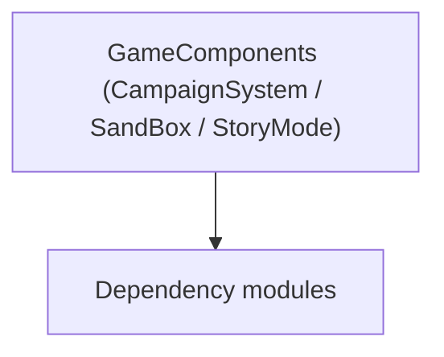

# GameComponents (CampaignSystem / SandBox / StoryMode)

**One-line responsibility:** This page covers all 166 business types under `GameComponents (CampaignSystem / SandBox / StoryMode)` as a family index, giving each type its namespace, responsibility, and typical timing so you can browse by module instead of alphabetically.

## Mental Model

GameComponents are components attached to game entities that grant a specific capability (scene object behavior, small gameplay gadgets). Composition over inheritance: components are decoupled from entities and reusable. State must be serializable.

## When to Use

To attach a reusable capability to an entity, derive from the relevant GameComponent and mount it; components should not strongly depend on each other.

## Dependencies

The types under `GameComponents (CampaignSystem / SandBox / StoryMode)` depend on the following modules; missing any of them causes compile- or run-time failure.

- [Campaign](../../campaign/Campaign)
- [API Overview](../../_index)

## Type Catalog

| Type | Namespace | Purpose | Timing |
| --- | --- | --- | --- |
| `IMissionPlayerFollowerHandler` | SandBox.GameComponents | A business type under this namespace that carries its derived convention responsibility. Confirm its lifecycle and owning system before calling; do not reference an unready instance at the wrong phase. World-state changes should go through the corresponding Action/Behavior, not direct field mutation. | Campaign init |
| `SandboxAgentApplyDamageModel` | SandBox.GameComponents | Domain model that aggregates rules and calculations for Behaviors to call. When you replace a model you must provide an equivalent contract; an empty replacement hands null to its dependents. | Campaign init |
| `SandboxAgentDecideKilledOrUnconsciousModel` | SandBox.GameComponents | Domain model that aggregates rules and calculations for Behaviors to call. When you replace a model you must provide an equivalent contract; an empty replacement hands null to its dependents. | Campaign init |
| `SandboxAgentStatCalculateModel` | SandBox.GameComponents | Domain model that aggregates rules and calculations for Behaviors to call. When you replace a model you must provide an equivalent contract; an empty replacement hands null to its dependents. | Campaign init |
| `SandboxApplyWeatherEffectsModel` | SandBox.GameComponents | Domain model that aggregates rules and calculations for Behaviors to call. When you replace a model you must provide an equivalent contract; an empty replacement hands null to its dependents. | Campaign init |
| `SandboxAutoBlockModel` | SandBox.GameComponents | Domain model that aggregates rules and calculations for Behaviors to call. When you replace a model you must provide an equivalent contract; an empty replacement hands null to its dependents. | Campaign init |
| `SandboxBattleInitializationModel` | SandBox.GameComponents | Domain model that aggregates rules and calculations for Behaviors to call. When you replace a model you must provide an equivalent contract; an empty replacement hands null to its dependents. | Campaign init |
| `SandboxBattleMoraleModel` | SandBox.GameComponents | Domain model that aggregates rules and calculations for Behaviors to call. When you replace a model you must provide an equivalent contract; an empty replacement hands null to its dependents. | Campaign init |
| `SandboxBattleSpawnModel` | SandBox.GameComponents | Domain model that aggregates rules and calculations for Behaviors to call. When you replace a model you must provide an equivalent contract; an empty replacement hands null to its dependents. | Campaign init |
| `SandboxMissionDifficultyModel` | SandBox.GameComponents | Domain model that aggregates rules and calculations for Behaviors to call. When you replace a model you must provide an equivalent contract; an empty replacement hands null to its dependents. | Campaign init |
| `SandboxStrikeMagnitudeModel` | SandBox.GameComponents | Domain model that aggregates rules and calculations for Behaviors to call. When you replace a model you must provide an equivalent contract; an empty replacement hands null to its dependents. | Campaign init |
| `StoryModeAgentDecideKilledOrUnconsciousModel` | StoryMode.GameComponents | Domain model that aggregates rules and calculations for Behaviors to call. When you replace a model you must provide an equivalent contract; an empty replacement hands null to its dependents. | During story progress |
| `StoryModeBanditDensityModel` | StoryMode.GameComponents | Domain model that aggregates rules and calculations for Behaviors to call. When you replace a model you must provide an equivalent contract; an empty replacement hands null to its dependents. | During story progress |
| `StoryModeBannerItemModel` | StoryMode.GameComponents | Domain model that aggregates rules and calculations for Behaviors to call. When you replace a model you must provide an equivalent contract; an empty replacement hands null to its dependents. | During story progress |
| `StoryModeBattleRewardModel` | StoryMode.GameComponents | Domain model that aggregates rules and calculations for Behaviors to call. When you replace a model you must provide an equivalent contract; an empty replacement hands null to its dependents. | During story progress |
| `StoryModeCombatXpModel` | StoryMode.GameComponents | Domain model that aggregates rules and calculations for Behaviors to call. When you replace a model you must provide an equivalent contract; an empty replacement hands null to its dependents. | During story progress |
| `StoryModeCutsceneSelectionModel` | StoryMode.GameComponents | Domain model that aggregates rules and calculations for Behaviors to call. When you replace a model you must provide an equivalent contract; an empty replacement hands null to its dependents. | During story progress |
| `StoryModeEncounterGameMenuModel` | StoryMode.GameComponents | Domain model that aggregates rules and calculations for Behaviors to call. When you replace a model you must provide an equivalent contract; an empty replacement hands null to its dependents. | During story progress |
| `StoryModeGenericXpModel` | StoryMode.GameComponents | Domain model that aggregates rules and calculations for Behaviors to call. When you replace a model you must provide an equivalent contract; an empty replacement hands null to its dependents. | During story progress |
| `StoryModeHeroDeathProbabilityCalculationModel` | StoryMode.GameComponents | Domain model that aggregates rules and calculations for Behaviors to call. When you replace a model you must provide an equivalent contract; an empty replacement hands null to its dependents. | During story progress |
| `StoryModeIncidentModel` | StoryMode.GameComponents | Domain model that aggregates rules and calculations for Behaviors to call. When you replace a model you must provide an equivalent contract; an empty replacement hands null to its dependents. | During story progress |
| `StoryModeKingdomDecisionPermissionModel` | StoryMode.GameComponents | Domain model that aggregates rules and calculations for Behaviors to call. When you replace a model you must provide an equivalent contract; an empty replacement hands null to its dependents. | During story progress |
| `StoryModeNotableSpawnModel` | StoryMode.GameComponents | Domain model that aggregates rules and calculations for Behaviors to call. When you replace a model you must provide an equivalent contract; an empty replacement hands null to its dependents. | During story progress |
| `StoryModePartySizeLimitModel` | StoryMode.GameComponents | Domain model that aggregates rules and calculations for Behaviors to call. When you replace a model you must provide an equivalent contract; an empty replacement hands null to its dependents. | During story progress |
| `StoryModePartyWageModel` | StoryMode.GameComponents | Domain model that aggregates rules and calculations for Behaviors to call. When you replace a model you must provide an equivalent contract; an empty replacement hands null to its dependents. | During story progress |
| `StoryModePrisonerRecruitmentCalculationModel` | StoryMode.GameComponents | Domain model that aggregates rules and calculations for Behaviors to call. When you replace a model you must provide an equivalent contract; an empty replacement hands null to its dependents. | During story progress |
| `StoryModeTargetScoreCalculatingModel` | StoryMode.GameComponents | Domain model that aggregates rules and calculations for Behaviors to call. When you replace a model you must provide an equivalent contract; an empty replacement hands null to its dependents. | During story progress |
| `StoryModeTroopSupplierProbabilityModel` | StoryMode.GameComponents | Domain model that aggregates rules and calculations for Behaviors to call. When you replace a model you must provide an equivalent contract; an empty replacement hands null to its dependents. | During story progress |
| `StoryModeVoiceOverModel` | StoryMode.GameComponents | Domain model that aggregates rules and calculations for Behaviors to call. When you replace a model you must provide an equivalent contract; an empty replacement hands null to its dependents. | During story progress |
| `AchievementsCampaignBehavior` | StoryMode.GameComponents.CampaignBehaviors | Campaign-system behavior that listens to global events to drive that system’s initialization and periodic updates. It is the main entry point for mods to inject gameplay; do not mutate world state directly outside a behavior. | Campaign init |
| `FirstPhaseCampaignBehavior` | StoryMode.GameComponents.CampaignBehaviors | Campaign-system behavior that listens to global events to drive that system’s initialization and periodic updates. It is the main entry point for mods to inject gameplay; do not mutate world state directly outside a behavior. | Campaign init |
| `LordConversationsStoryModeBehavior` | StoryMode.GameComponents.CampaignBehaviors | Campaign-system behavior that listens to global events to drive that system’s initialization and periodic updates. It is the main entry point for mods to inject gameplay; do not mutate world state directly outside a behavior. | Campaign init |
| `MainStorylineCampaignBehavior` | StoryMode.GameComponents.CampaignBehaviors | Campaign-system behavior that listens to global events to drive that system’s initialization and periodic updates. It is the main entry point for mods to inject gameplay; do not mutate world state directly outside a behavior. | Campaign init |
| `SecondPhaseCampaignBehavior` | StoryMode.GameComponents.CampaignBehaviors | Campaign-system behavior that listens to global events to drive that system’s initialization and periodic updates. It is the main entry point for mods to inject gameplay; do not mutate world state directly outside a behavior. | Campaign init |
| `StoryModeBanditSpawnCampaignBehavior` | StoryMode.GameComponents.CampaignBehaviors | Campaign-system behavior that listens to global events to drive that system’s initialization and periodic updates. It is the main entry point for mods to inject gameplay; do not mutate world state directly outside a behavior. | Campaign init |
| `StoryModeCharacterCreationCampaignBehavior` | StoryMode.GameComponents.CampaignBehaviors | Campaign-system behavior that listens to global events to drive that system’s initialization and periodic updates. It is the main entry point for mods to inject gameplay; do not mutate world state directly outside a behavior. | Campaign init |
| `StoryModeTutorialBoxCampaignBehavior` | StoryMode.GameComponents.CampaignBehaviors | Campaign-system behavior that listens to global events to drive that system’s initialization and periodic updates. It is the main entry point for mods to inject gameplay; do not mutate world state directly outside a behavior. | Campaign init |
| `ThirdPhaseCampaignBehavior` | StoryMode.GameComponents.CampaignBehaviors | Campaign-system behavior that listens to global events to drive that system’s initialization and periodic updates. It is the main entry point for mods to inject gameplay; do not mutate world state directly outside a behavior. | Campaign init |
| `TrainingFieldCampaignBehavior` | StoryMode.GameComponents.CampaignBehaviors | Campaign-system behavior that listens to global events to drive that system’s initialization and periodic updates. It is the main entry point for mods to inject gameplay; do not mutate world state directly outside a behavior. | Campaign init |
| `TutorialPhaseCampaignBehavior` | StoryMode.GameComponents.CampaignBehaviors | Campaign-system behavior that listens to global events to drive that system’s initialization and periodic updates. It is the main entry point for mods to inject gameplay; do not mutate world state directly outside a behavior. | Campaign init |
| `AlleyMemberAvailabilityDetail` | TaleWorlds.CampaignSystem.GameComponents | AI decision implementation that must be interruptible and serializable to support saving and undo. Search must be depth/time bounded to avoid stalls. | Campaign init |
| `AssetIncomeType` | TaleWorlds.CampaignSystem.GameComponents | A business type under this namespace that carries its derived convention responsibility. Confirm its lifecycle and owning system before calling; do not reference an unready instance at the wrong phase. World-state changes should go through the corresponding Action/Behavior, not direct field mutation. | Campaign init |
| `DefaultAgeModel` | TaleWorlds.CampaignSystem.GameComponents | Domain model that aggregates rules and calculations for Behaviors to call. When you replace a model you must provide an equivalent contract; an empty replacement hands null to its dependents. | Campaign init |
| `DefaultAlleyModel` | TaleWorlds.CampaignSystem.GameComponents | Domain model that aggregates rules and calculations for Behaviors to call. When you replace a model you must provide an equivalent contract; an empty replacement hands null to its dependents. | Campaign init |
| `DefaultAllianceModel` | TaleWorlds.CampaignSystem.GameComponents | Domain model that aggregates rules and calculations for Behaviors to call. When you replace a model you must provide an equivalent contract; an empty replacement hands null to its dependents. | Campaign init |
| `DefaultArmyManagementCalculationModel` | TaleWorlds.CampaignSystem.GameComponents | Domain model that aggregates rules and calculations for Behaviors to call. When you replace a model you must provide an equivalent contract; an empty replacement hands null to its dependents. | Campaign init |
| `DefaultBanditDensityModel` | TaleWorlds.CampaignSystem.GameComponents | Domain model that aggregates rules and calculations for Behaviors to call. When you replace a model you must provide an equivalent contract; an empty replacement hands null to its dependents. | Campaign init |
| `DefaultBannerItemModel` | TaleWorlds.CampaignSystem.GameComponents | Domain model that aggregates rules and calculations for Behaviors to call. When you replace a model you must provide an equivalent contract; an empty replacement hands null to its dependents. | Campaign init |
| `DefaultBarterModel` | TaleWorlds.CampaignSystem.GameComponents | Domain model that aggregates rules and calculations for Behaviors to call. When you replace a model you must provide an equivalent contract; an empty replacement hands null to its dependents. | Campaign init |
| `DefaultBattleCaptainModel` | TaleWorlds.CampaignSystem.GameComponents | Domain model that aggregates rules and calculations for Behaviors to call. When you replace a model you must provide an equivalent contract; an empty replacement hands null to its dependents. | Campaign init |
| `DefaultBattleRewardModel` | TaleWorlds.CampaignSystem.GameComponents | Domain model that aggregates rules and calculations for Behaviors to call. When you replace a model you must provide an equivalent contract; an empty replacement hands null to its dependents. | Campaign init |
| `DefaultBodyPropertiesModel` | TaleWorlds.CampaignSystem.GameComponents | Domain model that aggregates rules and calculations for Behaviors to call. When you replace a model you must provide an equivalent contract; an empty replacement hands null to its dependents. | Campaign init |
| `DefaultBribeCalculationModel` | TaleWorlds.CampaignSystem.GameComponents | Domain model that aggregates rules and calculations for Behaviors to call. When you replace a model you must provide an equivalent contract; an empty replacement hands null to its dependents. | Campaign init |
| `DefaultBuildingConstructionModel` | TaleWorlds.CampaignSystem.GameComponents | Domain model that aggregates rules and calculations for Behaviors to call. When you replace a model you must provide an equivalent contract; an empty replacement hands null to its dependents. | Campaign init |
| `DefaultBuildingEffectModel` | TaleWorlds.CampaignSystem.GameComponents | Domain model that aggregates rules and calculations for Behaviors to call. When you replace a model you must provide an equivalent contract; an empty replacement hands null to its dependents. | Campaign init |
| `DefaultBuildingModel` | TaleWorlds.CampaignSystem.GameComponents | Domain model that aggregates rules and calculations for Behaviors to call. When you replace a model you must provide an equivalent contract; an empty replacement hands null to its dependents. | Campaign init |
| `DefaultBuildingScoreCalculationModel` | TaleWorlds.CampaignSystem.GameComponents | Domain model that aggregates rules and calculations for Behaviors to call. When you replace a model you must provide an equivalent contract; an empty replacement hands null to its dependents. | Campaign init |
| `DefaultCampaignShipDamageModel` | TaleWorlds.CampaignSystem.GameComponents | Domain model that aggregates rules and calculations for Behaviors to call. When you replace a model you must provide an equivalent contract; an empty replacement hands null to its dependents. | Campaign init |
| `DefaultCampaignShipParametersModel` | TaleWorlds.CampaignSystem.GameComponents | Domain model that aggregates rules and calculations for Behaviors to call. When you replace a model you must provide an equivalent contract; an empty replacement hands null to its dependents. | Campaign init |
| `DefaultCampaignTimeModel` | TaleWorlds.CampaignSystem.GameComponents | Domain model that aggregates rules and calculations for Behaviors to call. When you replace a model you must provide an equivalent contract; an empty replacement hands null to its dependents. | Campaign init |
| `DefaultCaravanModel` | TaleWorlds.CampaignSystem.GameComponents | Domain model that aggregates rules and calculations for Behaviors to call. When you replace a model you must provide an equivalent contract; an empty replacement hands null to its dependents. | Campaign init |
| `DefaultCharacterDevelopmentModel` | TaleWorlds.CampaignSystem.GameComponents | Domain model that aggregates rules and calculations for Behaviors to call. When you replace a model you must provide an equivalent contract; an empty replacement hands null to its dependents. | Campaign init |
| `DefaultCharacterStatsModel` | TaleWorlds.CampaignSystem.GameComponents | Domain model that aggregates rules and calculations for Behaviors to call. When you replace a model you must provide an equivalent contract; an empty replacement hands null to its dependents. | Campaign init |
| `DefaultClanFinanceModel` | TaleWorlds.CampaignSystem.GameComponents | Domain model that aggregates rules and calculations for Behaviors to call. When you replace a model you must provide an equivalent contract; an empty replacement hands null to its dependents. | Campaign init |
| `DefaultClanMemberPartyRoleModel` | TaleWorlds.CampaignSystem.GameComponents | Domain model that aggregates rules and calculations for Behaviors to call. When you replace a model you must provide an equivalent contract; an empty replacement hands null to its dependents. | Campaign init |
| `DefaultClanPoliticsModel` | TaleWorlds.CampaignSystem.GameComponents | Domain model that aggregates rules and calculations for Behaviors to call. When you replace a model you must provide an equivalent contract; an empty replacement hands null to its dependents. | Campaign init |
| `DefaultClanTierModel` | TaleWorlds.CampaignSystem.GameComponents | Domain model that aggregates rules and calculations for Behaviors to call. When you replace a model you must provide an equivalent contract; an empty replacement hands null to its dependents. | Campaign init |
| `DefaultCombatSimulationModel` | TaleWorlds.CampaignSystem.GameComponents | Domain model that aggregates rules and calculations for Behaviors to call. When you replace a model you must provide an equivalent contract; an empty replacement hands null to its dependents. | Campaign init |
| `DefaultCombatXpModel` | TaleWorlds.CampaignSystem.GameComponents | Domain model that aggregates rules and calculations for Behaviors to call. When you replace a model you must provide an equivalent contract; an empty replacement hands null to its dependents. | Campaign init |
| `DefaultCompanionHiringPriceCalculationModel` | TaleWorlds.CampaignSystem.GameComponents | Domain model that aggregates rules and calculations for Behaviors to call. When you replace a model you must provide an equivalent contract; an empty replacement hands null to its dependents. | Campaign init |
| `DefaultCrimeModel` | TaleWorlds.CampaignSystem.GameComponents | Domain model that aggregates rules and calculations for Behaviors to call. When you replace a model you must provide an equivalent contract; an empty replacement hands null to its dependents. | Campaign init |
| `DefaultCutsceneSelectionModel` | TaleWorlds.CampaignSystem.GameComponents | Domain model that aggregates rules and calculations for Behaviors to call. When you replace a model you must provide an equivalent contract; an empty replacement hands null to its dependents. | Campaign init |
| `DefaultDailyTroopXpBonusModel` | TaleWorlds.CampaignSystem.GameComponents | Domain model that aggregates rules and calculations for Behaviors to call. When you replace a model you must provide an equivalent contract; an empty replacement hands null to its dependents. | Campaign init |
| `DefaultDefectionModel` | TaleWorlds.CampaignSystem.GameComponents | Domain model that aggregates rules and calculations for Behaviors to call. When you replace a model you must provide an equivalent contract; an empty replacement hands null to its dependents. | Campaign init |
| `DefaultDelayedTeleportationModel` | TaleWorlds.CampaignSystem.GameComponents | Domain model that aggregates rules and calculations for Behaviors to call. When you replace a model you must provide an equivalent contract; an empty replacement hands null to its dependents. | Campaign init |
| `DefaultDifficultyModel` | TaleWorlds.CampaignSystem.GameComponents | Domain model that aggregates rules and calculations for Behaviors to call. When you replace a model you must provide an equivalent contract; an empty replacement hands null to its dependents. | Campaign init |
| `DefaultDiplomacyModel` | TaleWorlds.CampaignSystem.GameComponents | Domain model that aggregates rules and calculations for Behaviors to call. When you replace a model you must provide an equivalent contract; an empty replacement hands null to its dependents. | Campaign init |
| `DefaultDisguiseDetectionModel` | TaleWorlds.CampaignSystem.GameComponents | Domain model that aggregates rules and calculations for Behaviors to call. When you replace a model you must provide an equivalent contract; an empty replacement hands null to its dependents. | Campaign init |
| `DefaultEmissaryModel` | TaleWorlds.CampaignSystem.GameComponents | Domain model that aggregates rules and calculations for Behaviors to call. When you replace a model you must provide an equivalent contract; an empty replacement hands null to its dependents. | Campaign init |
| `DefaultEncounterGameMenuModel` | TaleWorlds.CampaignSystem.GameComponents | Domain model that aggregates rules and calculations for Behaviors to call. When you replace a model you must provide an equivalent contract; an empty replacement hands null to its dependents. | Campaign init |
| `DefaultEncounterModel` | TaleWorlds.CampaignSystem.GameComponents | Domain model that aggregates rules and calculations for Behaviors to call. When you replace a model you must provide an equivalent contract; an empty replacement hands null to its dependents. | Campaign init |
| `DefaultEquipmentSelectionModel` | TaleWorlds.CampaignSystem.GameComponents | Domain model that aggregates rules and calculations for Behaviors to call. When you replace a model you must provide an equivalent contract; an empty replacement hands null to its dependents. | Campaign init |
| `DefaultExecutionRelationModel` | TaleWorlds.CampaignSystem.GameComponents | Domain model that aggregates rules and calculations for Behaviors to call. When you replace a model you must provide an equivalent contract; an empty replacement hands null to its dependents. | Campaign init |
| `DefaultFleetManagementModel` | TaleWorlds.CampaignSystem.GameComponents | Domain model that aggregates rules and calculations for Behaviors to call. When you replace a model you must provide an equivalent contract; an empty replacement hands null to its dependents. | Campaign init |
| `DefaultGenericXpModel` | TaleWorlds.CampaignSystem.GameComponents | Domain model that aggregates rules and calculations for Behaviors to call. When you replace a model you must provide an equivalent contract; an empty replacement hands null to its dependents. | Campaign init |
| `DefaultHeirSelectionCalculationModel` | TaleWorlds.CampaignSystem.GameComponents | Domain model that aggregates rules and calculations for Behaviors to call. When you replace a model you must provide an equivalent contract; an empty replacement hands null to its dependents. | Campaign init |
| `DefaultHeroAgentLocationModel` | TaleWorlds.CampaignSystem.GameComponents | Domain model that aggregates rules and calculations for Behaviors to call. When you replace a model you must provide an equivalent contract; an empty replacement hands null to its dependents. | Campaign init |
| `DefaultHeroCreationModel` | TaleWorlds.CampaignSystem.GameComponents | Domain model that aggregates rules and calculations for Behaviors to call. When you replace a model you must provide an equivalent contract; an empty replacement hands null to its dependents. | Campaign init |
| `DefaultHeroDeathProbabilityCalculationModel` | TaleWorlds.CampaignSystem.GameComponents | Domain model that aggregates rules and calculations for Behaviors to call. When you replace a model you must provide an equivalent contract; an empty replacement hands null to its dependents. | Campaign init |
| `DefaultHideoutModel` | TaleWorlds.CampaignSystem.GameComponents | Domain model that aggregates rules and calculations for Behaviors to call. When you replace a model you must provide an equivalent contract; an empty replacement hands null to its dependents. | Campaign init |
| `DefaultIncidentModel` | TaleWorlds.CampaignSystem.GameComponents | Domain model that aggregates rules and calculations for Behaviors to call. When you replace a model you must provide an equivalent contract; an empty replacement hands null to its dependents. | Campaign init |
| `DefaultInformationRestrictionModel` | TaleWorlds.CampaignSystem.GameComponents | Domain model that aggregates rules and calculations for Behaviors to call. When you replace a model you must provide an equivalent contract; an empty replacement hands null to its dependents. | Campaign init |
| `DefaultInventoryCapacityModel` | TaleWorlds.CampaignSystem.GameComponents | Domain model that aggregates rules and calculations for Behaviors to call. When you replace a model you must provide an equivalent contract; an empty replacement hands null to its dependents. | Campaign init |
| `DefaultIssueModel` | TaleWorlds.CampaignSystem.GameComponents | Domain model that aggregates rules and calculations for Behaviors to call. When you replace a model you must provide an equivalent contract; an empty replacement hands null to its dependents. | Campaign init |
| `DefaultItemDiscardModel` | TaleWorlds.CampaignSystem.GameComponents | Domain model that aggregates rules and calculations for Behaviors to call. When you replace a model you must provide an equivalent contract; an empty replacement hands null to its dependents. | Campaign init |
| `DefaultKingdomCreationModel` | TaleWorlds.CampaignSystem.GameComponents | Domain model that aggregates rules and calculations for Behaviors to call. When you replace a model you must provide an equivalent contract; an empty replacement hands null to its dependents. | Campaign init |
| `DefaultKingdomDecisionPermissionModel` | TaleWorlds.CampaignSystem.GameComponents | Domain model that aggregates rules and calculations for Behaviors to call. When you replace a model you must provide an equivalent contract; an empty replacement hands null to its dependents. | Campaign init |
| `DefaultLocationModel` | TaleWorlds.CampaignSystem.GameComponents | Domain model that aggregates rules and calculations for Behaviors to call. When you replace a model you must provide an equivalent contract; an empty replacement hands null to its dependents. | Campaign init |
| `DefaultMapDistanceModel` | TaleWorlds.CampaignSystem.GameComponents | Domain model that aggregates rules and calculations for Behaviors to call. When you replace a model you must provide an equivalent contract; an empty replacement hands null to its dependents. | Campaign init |
| `DefaultMapTrackModel` | TaleWorlds.CampaignSystem.GameComponents | Domain model that aggregates rules and calculations for Behaviors to call. When you replace a model you must provide an equivalent contract; an empty replacement hands null to its dependents. | Campaign init |
| `DefaultMapVisibilityModel` | TaleWorlds.CampaignSystem.GameComponents | Domain model that aggregates rules and calculations for Behaviors to call. When you replace a model you must provide an equivalent contract; an empty replacement hands null to its dependents. | Campaign init |
| `DefaultMapWeatherModel` | TaleWorlds.CampaignSystem.GameComponents | Domain model that aggregates rules and calculations for Behaviors to call. When you replace a model you must provide an equivalent contract; an empty replacement hands null to its dependents. | Campaign init |
| `DefaultMarriageModel` | TaleWorlds.CampaignSystem.GameComponents | Domain model that aggregates rules and calculations for Behaviors to call. When you replace a model you must provide an equivalent contract; an empty replacement hands null to its dependents. | Campaign init |
| `DefaultMilitaryPowerModel` | TaleWorlds.CampaignSystem.GameComponents | Domain model that aggregates rules and calculations for Behaviors to call. When you replace a model you must provide an equivalent contract; an empty replacement hands null to its dependents. | Campaign init |
| `DefaultMinorFactionsModel` | TaleWorlds.CampaignSystem.GameComponents | Domain model that aggregates rules and calculations for Behaviors to call. When you replace a model you must provide an equivalent contract; an empty replacement hands null to its dependents. | Campaign init |
| `DefaultMobilePartyAIModel` | TaleWorlds.CampaignSystem.GameComponents | Domain model that aggregates rules and calculations for Behaviors to call. When you replace a model you must provide an equivalent contract; an empty replacement hands null to its dependents. | Campaign init |
| `DefaultMobilePartyFoodConsumptionModel` | TaleWorlds.CampaignSystem.GameComponents | Domain model that aggregates rules and calculations for Behaviors to call. When you replace a model you must provide an equivalent contract; an empty replacement hands null to its dependents. | Campaign init |
| `DefaultNotablePowerModel` | TaleWorlds.CampaignSystem.GameComponents | Domain model that aggregates rules and calculations for Behaviors to call. When you replace a model you must provide an equivalent contract; an empty replacement hands null to its dependents. | Campaign init |
| `DefaultNotableSpawnModel` | TaleWorlds.CampaignSystem.GameComponents | Domain model that aggregates rules and calculations for Behaviors to call. When you replace a model you must provide an equivalent contract; an empty replacement hands null to its dependents. | Campaign init |
| `DefaultPartyDesertionModel` | TaleWorlds.CampaignSystem.GameComponents | Domain model that aggregates rules and calculations for Behaviors to call. When you replace a model you must provide an equivalent contract; an empty replacement hands null to its dependents. | Campaign init |
| `DefaultPartyFoodBuyingModel` | TaleWorlds.CampaignSystem.GameComponents | Domain model that aggregates rules and calculations for Behaviors to call. When you replace a model you must provide an equivalent contract; an empty replacement hands null to its dependents. | Campaign init |
| `DefaultPartyHealingModel` | TaleWorlds.CampaignSystem.GameComponents | Domain model that aggregates rules and calculations for Behaviors to call. When you replace a model you must provide an equivalent contract; an empty replacement hands null to its dependents. | Campaign init |
| `DefaultPartyImpairmentModel` | TaleWorlds.CampaignSystem.GameComponents | Domain model that aggregates rules and calculations for Behaviors to call. When you replace a model you must provide an equivalent contract; an empty replacement hands null to its dependents. | Campaign init |
| `DefaultPartyMoraleModel` | TaleWorlds.CampaignSystem.GameComponents | Domain model that aggregates rules and calculations for Behaviors to call. When you replace a model you must provide an equivalent contract; an empty replacement hands null to its dependents. | Campaign init |
| `DefaultPartyNavigationModel` | TaleWorlds.CampaignSystem.GameComponents | Domain model that aggregates rules and calculations for Behaviors to call. When you replace a model you must provide an equivalent contract; an empty replacement hands null to its dependents. | Campaign init |
| `DefaultPartyShipLimitModel` | TaleWorlds.CampaignSystem.GameComponents | Domain model that aggregates rules and calculations for Behaviors to call. When you replace a model you must provide an equivalent contract; an empty replacement hands null to its dependents. | Campaign init |
| `DefaultPartySizeLimitModel` | TaleWorlds.CampaignSystem.GameComponents | Domain model that aggregates rules and calculations for Behaviors to call. When you replace a model you must provide an equivalent contract; an empty replacement hands null to its dependents. | Campaign init |
| `DefaultPartySpeedCalculatingModel` | TaleWorlds.CampaignSystem.GameComponents | Domain model that aggregates rules and calculations for Behaviors to call. When you replace a model you must provide an equivalent contract; an empty replacement hands null to its dependents. | Campaign init |
| `DefaultPartyTradeModel` | TaleWorlds.CampaignSystem.GameComponents | Domain model that aggregates rules and calculations for Behaviors to call. When you replace a model you must provide an equivalent contract; an empty replacement hands null to its dependents. | Campaign init |
| `DefaultPartyTrainingModel` | TaleWorlds.CampaignSystem.GameComponents | Domain model that aggregates rules and calculations for Behaviors to call. When you replace a model you must provide an equivalent contract; an empty replacement hands null to its dependents. | Campaign init |
| `DefaultPartyTransitionModel` | TaleWorlds.CampaignSystem.GameComponents | Domain model that aggregates rules and calculations for Behaviors to call. When you replace a model you must provide an equivalent contract; an empty replacement hands null to its dependents. | Campaign init |
| `DefaultPartyTroopUpgradeModel` | TaleWorlds.CampaignSystem.GameComponents | Domain model that aggregates rules and calculations for Behaviors to call. When you replace a model you must provide an equivalent contract; an empty replacement hands null to its dependents. | Campaign init |
| `DefaultPartyWageModel` | TaleWorlds.CampaignSystem.GameComponents | Domain model that aggregates rules and calculations for Behaviors to call. When you replace a model you must provide an equivalent contract; an empty replacement hands null to its dependents. | Campaign init |
| `DefaultPersuasionModel` | TaleWorlds.CampaignSystem.GameComponents | Domain model that aggregates rules and calculations for Behaviors to call. When you replace a model you must provide an equivalent contract; an empty replacement hands null to its dependents. | Campaign init |
| `DefaultPlayerProgressionModel` | TaleWorlds.CampaignSystem.GameComponents | Domain model that aggregates rules and calculations for Behaviors to call. When you replace a model you must provide an equivalent contract; an empty replacement hands null to its dependents. | Campaign init |
| `DefaultPregnancyModel` | TaleWorlds.CampaignSystem.GameComponents | Domain model that aggregates rules and calculations for Behaviors to call. When you replace a model you must provide an equivalent contract; an empty replacement hands null to its dependents. | Campaign init |
| `DefaultPrisonBreakModel` | TaleWorlds.CampaignSystem.GameComponents | Domain model that aggregates rules and calculations for Behaviors to call. When you replace a model you must provide an equivalent contract; an empty replacement hands null to its dependents. | Campaign init |
| `DefaultPrisonerDonationModel` | TaleWorlds.CampaignSystem.GameComponents | Domain model that aggregates rules and calculations for Behaviors to call. When you replace a model you must provide an equivalent contract; an empty replacement hands null to its dependents. | Campaign init |
| `DefaultPrisonerRecruitmentCalculationModel` | TaleWorlds.CampaignSystem.GameComponents | Domain model that aggregates rules and calculations for Behaviors to call. When you replace a model you must provide an equivalent contract; an empty replacement hands null to its dependents. | Campaign init |
| `DefaultRaidModel` | TaleWorlds.CampaignSystem.GameComponents | Domain model that aggregates rules and calculations for Behaviors to call. When you replace a model you must provide an equivalent contract; an empty replacement hands null to its dependents. | Campaign init |
| `DefaultRansomValueCalculationModel` | TaleWorlds.CampaignSystem.GameComponents | Domain model that aggregates rules and calculations for Behaviors to call. When you replace a model you must provide an equivalent contract; an empty replacement hands null to its dependents. | Campaign init |
| `DefaultRomanceModel` | TaleWorlds.CampaignSystem.GameComponents | Domain model that aggregates rules and calculations for Behaviors to call. When you replace a model you must provide an equivalent contract; an empty replacement hands null to its dependents. | Campaign init |
| `DefaultSceneModel` | TaleWorlds.CampaignSystem.GameComponents | Domain model that aggregates rules and calculations for Behaviors to call. When you replace a model you must provide an equivalent contract; an empty replacement hands null to its dependents. | Campaign init |
| `DefaultSettlementAccessModel` | TaleWorlds.CampaignSystem.GameComponents | Domain model that aggregates rules and calculations for Behaviors to call. When you replace a model you must provide an equivalent contract; an empty replacement hands null to its dependents. | Campaign init |
| `DefaultSettlementEconomyModel` | TaleWorlds.CampaignSystem.GameComponents | Domain model that aggregates rules and calculations for Behaviors to call. When you replace a model you must provide an equivalent contract; an empty replacement hands null to its dependents. | Campaign init |
| `DefaultSettlementFoodModel` | TaleWorlds.CampaignSystem.GameComponents | Domain model that aggregates rules and calculations for Behaviors to call. When you replace a model you must provide an equivalent contract; an empty replacement hands null to its dependents. | Campaign init |
| `DefaultSettlementGarrisonModel` | TaleWorlds.CampaignSystem.GameComponents | Domain model that aggregates rules and calculations for Behaviors to call. When you replace a model you must provide an equivalent contract; an empty replacement hands null to its dependents. | Campaign init |
| `DefaultSettlementLoyaltyModel` | TaleWorlds.CampaignSystem.GameComponents | Domain model that aggregates rules and calculations for Behaviors to call. When you replace a model you must provide an equivalent contract; an empty replacement hands null to its dependents. | Campaign init |
| `DefaultSettlementMilitiaModel` | TaleWorlds.CampaignSystem.GameComponents | Domain model that aggregates rules and calculations for Behaviors to call. When you replace a model you must provide an equivalent contract; an empty replacement hands null to its dependents. | Campaign init |
| `DefaultSettlementPatrolModel` | TaleWorlds.CampaignSystem.GameComponents | Domain model that aggregates rules and calculations for Behaviors to call. When you replace a model you must provide an equivalent contract; an empty replacement hands null to its dependents. | Campaign init |
| `DefaultSettlementProsperityModel` | TaleWorlds.CampaignSystem.GameComponents | Domain model that aggregates rules and calculations for Behaviors to call. When you replace a model you must provide an equivalent contract; an empty replacement hands null to its dependents. | Campaign init |
| `DefaultSettlementSecurityModel` | TaleWorlds.CampaignSystem.GameComponents | Domain model that aggregates rules and calculations for Behaviors to call. When you replace a model you must provide an equivalent contract; an empty replacement hands null to its dependents. | Campaign init |
| `DefaultSettlementTaxModel` | TaleWorlds.CampaignSystem.GameComponents | Domain model that aggregates rules and calculations for Behaviors to call. When you replace a model you must provide an equivalent contract; an empty replacement hands null to its dependents. | Campaign init |
| `DefaultSettlementValueModel` | TaleWorlds.CampaignSystem.GameComponents | Domain model that aggregates rules and calculations for Behaviors to call. When you replace a model you must provide an equivalent contract; an empty replacement hands null to its dependents. | Campaign init |
| `DefaultShipCostModel` | TaleWorlds.CampaignSystem.GameComponents | Domain model that aggregates rules and calculations for Behaviors to call. When you replace a model you must provide an equivalent contract; an empty replacement hands null to its dependents. | Campaign init |
| `DefaultShipStatModel` | TaleWorlds.CampaignSystem.GameComponents | Domain model that aggregates rules and calculations for Behaviors to call. When you replace a model you must provide an equivalent contract; an empty replacement hands null to its dependents. | Campaign init |
| `DefaultSiegeAftermathModel` | TaleWorlds.CampaignSystem.GameComponents | Domain model that aggregates rules and calculations for Behaviors to call. When you replace a model you must provide an equivalent contract; an empty replacement hands null to its dependents. | Campaign init |
| `DefaultSiegeEventModel` | TaleWorlds.CampaignSystem.GameComponents | Domain model that aggregates rules and calculations for Behaviors to call. When you replace a model you must provide an equivalent contract; an empty replacement hands null to its dependents. | Campaign init |
| `DefaultSiegeLordsHallFightModel` | TaleWorlds.CampaignSystem.GameComponents | Domain model that aggregates rules and calculations for Behaviors to call. When you replace a model you must provide an equivalent contract; an empty replacement hands null to its dependents. | Campaign init |
| `DefaultSiegeStrategyActionModel` | TaleWorlds.CampaignSystem.GameComponents | Domain model that aggregates rules and calculations for Behaviors to call. When you replace a model you must provide an equivalent contract; an empty replacement hands null to its dependents. | Campaign init |
| `DefaultSmithingModel` | TaleWorlds.CampaignSystem.GameComponents | Domain model that aggregates rules and calculations for Behaviors to call. When you replace a model you must provide an equivalent contract; an empty replacement hands null to its dependents. | Campaign init |
| `DefaultTargetScoreCalculatingModel` | TaleWorlds.CampaignSystem.GameComponents | Domain model that aggregates rules and calculations for Behaviors to call. When you replace a model you must provide an equivalent contract; an empty replacement hands null to its dependents. | Campaign init |
| `DefaultTavernMercenaryTroopsModel` | TaleWorlds.CampaignSystem.GameComponents | Domain model that aggregates rules and calculations for Behaviors to call. When you replace a model you must provide an equivalent contract; an empty replacement hands null to its dependents. | Campaign init |
| `DefaultTournamentModel` | TaleWorlds.CampaignSystem.GameComponents | Domain model that aggregates rules and calculations for Behaviors to call. When you replace a model you must provide an equivalent contract; an empty replacement hands null to its dependents. | Campaign init |
| `DefaultTradeAgreementModel` | TaleWorlds.CampaignSystem.GameComponents | Domain model that aggregates rules and calculations for Behaviors to call. When you replace a model you must provide an equivalent contract; an empty replacement hands null to its dependents. | Campaign init |
| `DefaultTradeItemPriceFactorModel` | TaleWorlds.CampaignSystem.GameComponents | Domain model that aggregates rules and calculations for Behaviors to call. When you replace a model you must provide an equivalent contract; an empty replacement hands null to its dependents. | Campaign init |
| `DefaultTroopSacrificeModel` | TaleWorlds.CampaignSystem.GameComponents | Domain model that aggregates rules and calculations for Behaviors to call. When you replace a model you must provide an equivalent contract; an empty replacement hands null to its dependents. | Campaign init |
| `DefaultTroopSupplierProbabilityModel` | TaleWorlds.CampaignSystem.GameComponents | Domain model that aggregates rules and calculations for Behaviors to call. When you replace a model you must provide an equivalent contract; an empty replacement hands null to its dependents. | Campaign init |
| `DefaultValuationModel` | TaleWorlds.CampaignSystem.GameComponents | Domain model that aggregates rules and calculations for Behaviors to call. When you replace a model you must provide an equivalent contract; an empty replacement hands null to its dependents. | Campaign init |
| `DefaultVassalRewardsModel` | TaleWorlds.CampaignSystem.GameComponents | Domain model that aggregates rules and calculations for Behaviors to call. When you replace a model you must provide an equivalent contract; an empty replacement hands null to its dependents. | Campaign init |
| `DefaultVillageProductionCalculatorModel` | TaleWorlds.CampaignSystem.GameComponents | Domain model that aggregates rules and calculations for Behaviors to call. When you replace a model you must provide an equivalent contract; an empty replacement hands null to its dependents. | Campaign init |
| `DefaultVillageTradeModel` | TaleWorlds.CampaignSystem.GameComponents | Domain model that aggregates rules and calculations for Behaviors to call. When you replace a model you must provide an equivalent contract; an empty replacement hands null to its dependents. | Campaign init |
| `DefaultVoiceOverModel` | TaleWorlds.CampaignSystem.GameComponents | Domain model that aggregates rules and calculations for Behaviors to call. When you replace a model you must provide an equivalent contract; an empty replacement hands null to its dependents. | Campaign init |
| `DefaultVolunteerModel` | TaleWorlds.CampaignSystem.GameComponents | Domain model that aggregates rules and calculations for Behaviors to call. When you replace a model you must provide an equivalent contract; an empty replacement hands null to its dependents. | Campaign init |
| `DefaultWallHitPointCalculationModel` | TaleWorlds.CampaignSystem.GameComponents | Domain model that aggregates rules and calculations for Behaviors to call. When you replace a model you must provide an equivalent contract; an empty replacement hands null to its dependents. | Campaign init |
| `DefaultWorkshopModel` | TaleWorlds.CampaignSystem.GameComponents | Domain model that aggregates rules and calculations for Behaviors to call. When you replace a model you must provide an equivalent contract; an empty replacement hands null to its dependents. | Campaign init |

## Risk & Boundaries

Components depend on mount order; accessing one before it is mounted returns null. Their state must be serializable or the save cannot be restored. Release must pair with the entity lifecycle.

## See Also

- [Campaign](../../campaign/Campaign)
- [API Overview](../../_index)
