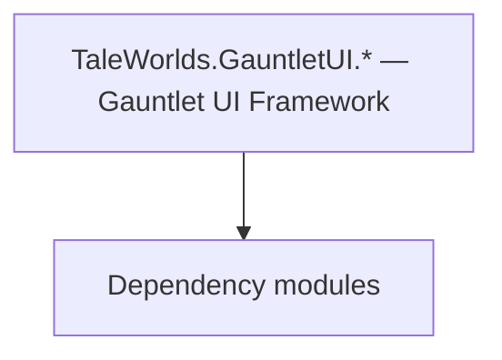

# TaleWorlds.GauntletUI.* — Gauntlet UI Framework

**One-line responsibility:** This page covers all 191 business types under `TaleWorlds.GauntletUI.* — Gauntlet UI Framework` as a family index, giving each type its namespace, responsibility, and typical timing so you can browse by module instead of alphabetically.

## Mental Model

TaleWorlds.GauntletUI.* is the Gauntlet UI framework itself: the widget base types, prefab system, extra widgets, data/binding layer, layout, gamepad navigation, and input. It is the foundation every game-specific Widget/VM is built on, independent of gameplay rules.

## When to Use

When you build or extend any Gauntlet interface, you ultimately derive from these framework base types; understand the binding and lifecycle model before subclassing.

## Dependencies

The types under `TaleWorlds.GauntletUI.* — Gauntlet UI Framework` depend on the following modules; missing any of them causes compile- or run-time failure.

- [ViewModel](../../core-extra/ViewModel)
- [MBSubModuleBase](../../core/MBSubModuleBase)
- [API Overview](../../_index)

## Type Catalog

| Type | Namespace | Purpose | Timing |
| --- | --- | --- | --- |
| `AlignmentAxis` | TaleWorlds.GauntletUI | A business type under this namespace that carries its derived convention responsibility. Confirm its lifecycle and owning system before calling; do not reference an unready instance at the wrong phase. World-state changes should go through the corresponding Action/Behavior, not direct field mutation. | On UI open |
| `AnimatedDropdownWidget` | TaleWorlds.GauntletUI | A business type under this namespace that carries its derived convention responsibility. Confirm its lifecycle and owning system before calling; do not reference an unready instance at the wrong phase. World-state changes should go through the corresponding Action/Behavior, not direct field mutation. | On UI open |
| `AnimationInterpolation` | TaleWorlds.GauntletUI | A business type under this namespace that carries its derived convention responsibility. Confirm its lifecycle and owning system before calling; do not reference an unready instance at the wrong phase. World-state changes should go through the corresponding Action/Behavior, not direct field mutation. | On UI open |
| `AudioProperty` | TaleWorlds.GauntletUI | A business type under this namespace that carries its derived convention responsibility. Confirm its lifecycle and owning system before calling; do not reference an unready instance at the wrong phase. World-state changes should go through the corresponding Action/Behavior, not direct field mutation. | On UI open |
| `Brush` | TaleWorlds.GauntletUI | A business type under this namespace that carries its derived convention responsibility. Confirm its lifecycle and owning system before calling; do not reference an unready instance at the wrong phase. World-state changes should go through the corresponding Action/Behavior, not direct field mutation. | On UI open |
| `BrushAnimation` | TaleWorlds.GauntletUI | A business type under this namespace that carries its derived convention responsibility. Confirm its lifecycle and owning system before calling; do not reference an unready instance at the wrong phase. World-state changes should go through the corresponding Action/Behavior, not direct field mutation. | On UI open |
| `BrushAnimationKeyFrame` | TaleWorlds.GauntletUI | A business type under this namespace that carries its derived convention responsibility. Confirm its lifecycle and owning system before calling; do not reference an unready instance at the wrong phase. World-state changes should go through the corresponding Action/Behavior, not direct field mutation. | On UI open |
| `BrushAnimationProperty` | TaleWorlds.GauntletUI | A business type under this namespace that carries its derived convention responsibility. Confirm its lifecycle and owning system before calling; do not reference an unready instance at the wrong phase. World-state changes should go through the corresponding Action/Behavior, not direct field mutation. | On UI open |
| `BrushAnimationPropertyType` | TaleWorlds.GauntletUI | A business type under this namespace that carries its derived convention responsibility. Confirm its lifecycle and owning system before calling; do not reference an unready instance at the wrong phase. World-state changes should go through the corresponding Action/Behavior, not direct field mutation. | On UI open |
| `BrushFactory` | TaleWorlds.GauntletUI | A business type under this namespace that carries its derived convention responsibility. Confirm its lifecycle and owning system before calling; do not reference an unready instance at the wrong phase. World-state changes should go through the corresponding Action/Behavior, not direct field mutation. | On UI open |
| `BrushLayer` | TaleWorlds.GauntletUI | A business type under this namespace that carries its derived convention responsibility. Confirm its lifecycle and owning system before calling; do not reference an unready instance at the wrong phase. World-state changes should go through the corresponding Action/Behavior, not direct field mutation. | On UI open |
| `BrushLayerAnimation` | TaleWorlds.GauntletUI | A business type under this namespace that carries its derived convention responsibility. Confirm its lifecycle and owning system before calling; do not reference an unready instance at the wrong phase. World-state changes should go through the corresponding Action/Behavior, not direct field mutation. | On UI open |
| `BrushLayerSizePolicy` | TaleWorlds.GauntletUI | A business type under this namespace that carries its derived convention responsibility. Confirm its lifecycle and owning system before calling; do not reference an unready instance at the wrong phase. World-state changes should go through the corresponding Action/Behavior, not direct field mutation. | On UI open |
| `BrushLayerState` | TaleWorlds.GauntletUI | A business type under this namespace that carries its derived convention responsibility. Confirm its lifecycle and owning system before calling; do not reference an unready instance at the wrong phase. World-state changes should go through the corresponding Action/Behavior, not direct field mutation. | On UI open |
| `BrushListPanel` | TaleWorlds.GauntletUI | A business type under this namespace that carries its derived convention responsibility. Confirm its lifecycle and owning system before calling; do not reference an unready instance at the wrong phase. World-state changes should go through the corresponding Action/Behavior, not direct field mutation. | On UI open |
| `BrushOverlayMethod` | TaleWorlds.GauntletUI | A business type under this namespace that carries its derived convention responsibility. Confirm its lifecycle and owning system before calling; do not reference an unready instance at the wrong phase. World-state changes should go through the corresponding Action/Behavior, not direct field mutation. | On UI open |
| `BrushRenderer` | TaleWorlds.GauntletUI | A business type under this namespace that carries its derived convention responsibility. Confirm its lifecycle and owning system before calling; do not reference an unready instance at the wrong phase. World-state changes should go through the corresponding Action/Behavior, not direct field mutation. | On UI open |
| `BrushRendererAnimationState` | TaleWorlds.GauntletUI | A business type under this namespace that carries its derived convention responsibility. Confirm its lifecycle and owning system before calling; do not reference an unready instance at the wrong phase. World-state changes should go through the corresponding Action/Behavior, not direct field mutation. | On UI open |
| `BrushState` | TaleWorlds.GauntletUI | A business type under this namespace that carries its derived convention responsibility. Confirm its lifecycle and owning system before calling; do not reference an unready instance at the wrong phase. World-state changes should go through the corresponding Action/Behavior, not direct field mutation. | On UI open |
| `CircleActionSelectorWidget` | TaleWorlds.GauntletUI | Selector / list-item view-model carrying the data and highlight of one selectable option. Collection VMs should virtualize to control memory. | On UI open |
| `CircleItemPlacerWidget` | TaleWorlds.GauntletUI | A business type under this namespace that carries its derived convention responsibility. Confirm its lifecycle and owning system before calling; do not reference an unready instance at the wrong phase. World-state changes should go through the corresponding Action/Behavior, not direct field mutation. | On UI open |
| `ContainerItemDescription` | TaleWorlds.GauntletUI | AI decision implementation that must be interruptible and serializable to support saving and undo. Search must be depth/time bounded to avoid stalls. | On UI open |
| `ContainerType` | TaleWorlds.GauntletUI | AI decision implementation that must be interruptible and serializable to support saving and undo. Search must be depth/time bounded to avoid stalls. | On UI open |
| `EditorAttribute` | TaleWorlds.GauntletUI | A business type under this namespace that carries its derived convention responsibility. Confirm its lifecycle and owning system before calling; do not reference an unready instance at the wrong phase. World-state changes should go through the corresponding Action/Behavior, not direct field mutation. | On UI open |
| `EmptyGamepadNavigationContext` | TaleWorlds.GauntletUI | A business type under this namespace that carries its derived convention responsibility. Confirm its lifecycle and owning system before calling; do not reference an unready instance at the wrong phase. World-state changes should go through the corresponding Action/Behavior, not direct field mutation. | On UI open |
| `EmptyWidget` | TaleWorlds.GauntletUI | A business type under this namespace that carries its derived convention responsibility. Confirm its lifecycle and owning system before calling; do not reference an unready instance at the wrong phase. World-state changes should go through the corresponding Action/Behavior, not direct field mutation. | On UI open |
| `EventManager` | TaleWorlds.GauntletUI | Event or event handler carrying the data of something that happened once. Remember to unsubscribe on unload to avoid leaks. | On UI open |
| `FontFactory` | TaleWorlds.GauntletUI | A business type under this namespace that carries its derived convention responsibility. Confirm its lifecycle and owning system before calling; do not reference an unready instance at the wrong phase. World-state changes should go through the corresponding Action/Behavior, not direct field mutation. | On UI open |
| `Function` | TaleWorlds.GauntletUI | A business type under this namespace that carries its derived convention responsibility. Confirm its lifecycle and owning system before calling; do not reference an unready instance at the wrong phase. World-state changes should go through the corresponding Action/Behavior, not direct field mutation. | On UI open |
| `GauntletEvent` | TaleWorlds.GauntletUI | Event or event handler carrying the data of something that happened once. Remember to unsubscribe on unload to avoid leaks. | On UI open |
| `GauntletExtensions` | TaleWorlds.GauntletUI | A business type under this namespace that carries its derived convention responsibility. Confirm its lifecycle and owning system before calling; do not reference an unready instance at the wrong phase. World-state changes should go through the corresponding Action/Behavior, not direct field mutation. | On UI open |
| `GauntletGamepadNavigationContext` | TaleWorlds.GauntletUI | A business type under this namespace that carries its derived convention responsibility. Confirm its lifecycle and owning system before calling; do not reference an unready instance at the wrong phase. World-state changes should go through the corresponding Action/Behavior, not direct field mutation. | On UI open |
| `GuiEventResult` | TaleWorlds.GauntletUI | Event or event handler carrying the data of something that happened once. Remember to unsubscribe on unload to avoid leaks. | On UI open |
| `GuiEventType` | TaleWorlds.GauntletUI | Event or event handler carrying the data of something that happened once. Remember to unsubscribe on unload to avoid leaks. | On UI open |
| `HorizontalAlignment` | TaleWorlds.GauntletUI | A business type under this namespace that carries its derived convention responsibility. Confirm its lifecycle and owning system before calling; do not reference an unready instance at the wrong phase. World-state changes should go through the corresponding Action/Behavior, not direct field mutation. | On UI open |
| `IBrushAnimationState` | TaleWorlds.GauntletUI | A business type under this namespace that carries its derived convention responsibility. Confirm its lifecycle and owning system before calling; do not reference an unready instance at the wrong phase. World-state changes should go through the corresponding Action/Behavior, not direct field mutation. | On UI open |
| `IBrushLayerData` | TaleWorlds.GauntletUI | A business type under this namespace that carries its derived convention responsibility. Confirm its lifecycle and owning system before calling; do not reference an unready instance at the wrong phase. World-state changes should go through the corresponding Action/Behavior, not direct field mutation. | On UI open |
| `IDataSource` | TaleWorlds.GauntletUI | A business type under this namespace that carries its derived convention responsibility. Confirm its lifecycle and owning system before calling; do not reference an unready instance at the wrong phase. World-state changes should go through the corresponding Action/Behavior, not direct field mutation. | On UI open |
| `IDropContainer` | TaleWorlds.GauntletUI | AI decision implementation that must be interruptible and serializable to support saving and undo. Search must be depth/time bounded to avoid stalls. | On UI open |
| `IGamepadNavigationContext` | TaleWorlds.GauntletUI | A business type under this namespace that carries its derived convention responsibility. Confirm its lifecycle and owning system before calling; do not reference an unready instance at the wrong phase. World-state changes should go through the corresponding Action/Behavior, not direct field mutation. | On UI open |
| `ImageFit` | TaleWorlds.GauntletUI | A business type under this namespace that carries its derived convention responsibility. Confirm its lifecycle and owning system before calling; do not reference an unready instance at the wrong phase. World-state changes should go through the corresponding Action/Behavior, not direct field mutation. | On UI open |
| `ImageFitResult` | TaleWorlds.GauntletUI | A business type under this namespace that carries its derived convention responsibility. Confirm its lifecycle and owning system before calling; do not reference an unready instance at the wrong phase. World-state changes should go through the corresponding Action/Behavior, not direct field mutation. | On UI open |
| `ImageFitTypes` | TaleWorlds.GauntletUI | A business type under this namespace that carries its derived convention responsibility. Confirm its lifecycle and owning system before calling; do not reference an unready instance at the wrong phase. World-state changes should go through the corresponding Action/Behavior, not direct field mutation. | On UI open |
| `ImageHorizontalAlignments` | TaleWorlds.GauntletUI | A business type under this namespace that carries its derived convention responsibility. Confirm its lifecycle and owning system before calling; do not reference an unready instance at the wrong phase. World-state changes should go through the corresponding Action/Behavior, not direct field mutation. | On UI open |
| `ImageVerticalAlignments` | TaleWorlds.GauntletUI | A business type under this namespace that carries its derived convention responsibility. Confirm its lifecycle and owning system before calling; do not reference an unready instance at the wrong phase. World-state changes should go through the corresponding Action/Behavior, not direct field mutation. | On UI open |
| `Language` | TaleWorlds.GauntletUI | A business type under this namespace that carries its derived convention responsibility. Confirm its lifecycle and owning system before calling; do not reference an unready instance at the wrong phase. World-state changes should go through the corresponding Action/Behavior, not direct field mutation. | On UI open |
| `MouseCursors` | TaleWorlds.GauntletUI | A business type under this namespace that carries its derived convention responsibility. Confirm its lifecycle and owning system before calling; do not reference an unready instance at the wrong phase. World-state changes should go through the corresponding Action/Behavior, not direct field mutation. | On UI open |
| `PropertyOwnerObject` | TaleWorlds.GauntletUI | A business type under this namespace that carries its derived convention responsibility. Confirm its lifecycle and owning system before calling; do not reference an unready instance at the wrong phase. World-state changes should go through the corresponding Action/Behavior, not direct field mutation. | On UI open |
| `ResourceTextureProvider` | TaleWorlds.GauntletUI | Gauntlet image-source abstraction that resolves an entity/concept into an actual texture and caches it. The first frame may be empty; handle the loading state. | On UI open |
| `SizePolicy` | TaleWorlds.GauntletUI | A business type under this namespace that carries its derived convention responsibility. Confirm its lifecycle and owning system before calling; do not reference an unready instance at the wrong phase. World-state changes should go through the corresponding Action/Behavior, not direct field mutation. | On UI open |
| `SoundProperties` | TaleWorlds.GauntletUI | A business type under this namespace that carries its derived convention responsibility. Confirm its lifecycle and owning system before calling; do not reference an unready instance at the wrong phase. World-state changes should go through the corresponding Action/Behavior, not direct field mutation. | On UI open |
| `Style` | TaleWorlds.GauntletUI | A business type under this namespace that carries its derived convention responsibility. Confirm its lifecycle and owning system before calling; do not reference an unready instance at the wrong phase. World-state changes should go through the corresponding Action/Behavior, not direct field mutation. | On UI open |
| `StyleAnimationMode` | TaleWorlds.GauntletUI | A business type under this namespace that carries its derived convention responsibility. Confirm its lifecycle and owning system before calling; do not reference an unready instance at the wrong phase. World-state changes should go through the corresponding Action/Behavior, not direct field mutation. | On UI open |
| `StyleLayer` | TaleWorlds.GauntletUI | A business type under this namespace that carries its derived convention responsibility. Confirm its lifecycle and owning system before calling; do not reference an unready instance at the wrong phase. World-state changes should go through the corresponding Action/Behavior, not direct field mutation. | On UI open |
| `TextureProvider` | TaleWorlds.GauntletUI | Gauntlet image-source abstraction that resolves an entity/concept into an actual texture and caches it. The first frame may be empty; handle the loading state. | On UI open |
| `TextureProviderFactory` | TaleWorlds.GauntletUI | Gauntlet image-source abstraction that resolves an entity/concept into an actual texture and caches it. The first frame may be empty; handle the loading state. | On UI open |
| `Type` | TaleWorlds.GauntletUI | A business type under this namespace that carries its derived convention responsibility. Confirm its lifecycle and owning system before calling; do not reference an unready instance at the wrong phase. World-state changes should go through the corresponding Action/Behavior, not direct field mutation. | On UI open |
| `UIContext` | TaleWorlds.GauntletUI | A business type under this namespace that carries its derived convention responsibility. Confirm its lifecycle and owning system before calling; do not reference an unready instance at the wrong phase. World-state changes should go through the corresponding Action/Behavior, not direct field mutation. | On UI open |
| `UpdateAction` | TaleWorlds.GauntletUI | Game action that encapsulates a single state change and executes it through the Action system. You must use Apply rather than mutating fields directly, otherwise you skip event cascades and corrupt saves. | On UI open |
| `ValueType` | TaleWorlds.GauntletUI | A business type under this namespace that carries its derived convention responsibility. Confirm its lifecycle and owning system before calling; do not reference an unready instance at the wrong phase. World-state changes should go through the corresponding Action/Behavior, not direct field mutation. | On UI open |
| `VerticalAlignment` | TaleWorlds.GauntletUI | A business type under this namespace that carries its derived convention responsibility. Confirm its lifecycle and owning system before calling; do not reference an unready instance at the wrong phase. World-state changes should go through the corresponding Action/Behavior, not direct field mutation. | On UI open |
| `VisualDefinition` | TaleWorlds.GauntletUI | A business type under this namespace that carries its derived convention responsibility. Confirm its lifecycle and owning system before calling; do not reference an unready instance at the wrong phase. World-state changes should go through the corresponding Action/Behavior, not direct field mutation. | On UI open |
| `VisualState` | TaleWorlds.GauntletUI | A business type under this namespace that carries its derived convention responsibility. Confirm its lifecycle and owning system before calling; do not reference an unready instance at the wrong phase. World-state changes should go through the corresponding Action/Behavior, not direct field mutation. | On UI open |
| `VisualStateAnimationState` | TaleWorlds.GauntletUI | A business type under this namespace that carries its derived convention responsibility. Confirm its lifecycle and owning system before calling; do not reference an unready instance at the wrong phase. World-state changes should go through the corresponding Action/Behavior, not direct field mutation. | On UI open |
| `WidgetComponent` | TaleWorlds.GauntletUI | A business type under this namespace that carries its derived convention responsibility. Confirm its lifecycle and owning system before calling; do not reference an unready instance at the wrong phase. World-state changes should go through the corresponding Action/Behavior, not direct field mutation. | On UI open |
| `WidgetContainer` | TaleWorlds.GauntletUI | AI decision implementation that must be interruptible and serializable to support saving and undo. Search must be depth/time bounded to avoid stalls. | On UI open |
| `WidgetInfo` | TaleWorlds.GauntletUI | A business type under this namespace that carries its derived convention responsibility. Confirm its lifecycle and owning system before calling; do not reference an unready instance at the wrong phase. World-state changes should go through the corresponding Action/Behavior, not direct field mutation. | On UI open |
| `AutoScrollParameters` | TaleWorlds.GauntletUI.BaseTypes | Parameter container carrying configuration or runtime data. Avoid holding long-lived references that hinder GC. | On UI open |
| `BasicContainer` | TaleWorlds.GauntletUI.BaseTypes | AI decision implementation that must be interruptible and serializable to support saving and undo. Search must be depth/time bounded to avoid stalls. | On UI open |
| `BrushWidget` | TaleWorlds.GauntletUI.BaseTypes | A business type under this namespace that carries its derived convention responsibility. Confirm its lifecycle and owning system before calling; do not reference an unready instance at the wrong phase. World-state changes should go through the corresponding Action/Behavior, not direct field mutation. | On UI open |
| `ButtonType` | TaleWorlds.GauntletUI.BaseTypes | A business type under this namespace that carries its derived convention responsibility. Confirm its lifecycle and owning system before calling; do not reference an unready instance at the wrong phase. World-state changes should go through the corresponding Action/Behavior, not direct field mutation. | On UI open |
| `ButtonWidget` | TaleWorlds.GauntletUI.BaseTypes | A business type under this namespace that carries its derived convention responsibility. Confirm its lifecycle and owning system before calling; do not reference an unready instance at the wrong phase. World-state changes should go through the corresponding Action/Behavior, not direct field mutation. | On UI open |
| `Container` | TaleWorlds.GauntletUI.BaseTypes | AI decision implementation that must be interruptible and serializable to support saving and undo. Search must be depth/time bounded to avoid stalls. | On UI open |
| `CursorMovementDirection` | TaleWorlds.GauntletUI.BaseTypes | A business type under this namespace that carries its derived convention responsibility. Confirm its lifecycle and owning system before calling; do not reference an unready instance at the wrong phase. World-state changes should go through the corresponding Action/Behavior, not direct field mutation. | On UI open |
| `DragCarrierWidget` | TaleWorlds.GauntletUI.BaseTypes | A business type under this namespace that carries its derived convention responsibility. Confirm its lifecycle and owning system before calling; do not reference an unready instance at the wrong phase. World-state changes should go through the corresponding Action/Behavior, not direct field mutation. | On UI open |
| `DropdownWidget` | TaleWorlds.GauntletUI.BaseTypes | A business type under this namespace that carries its derived convention responsibility. Confirm its lifecycle and owning system before calling; do not reference an unready instance at the wrong phase. World-state changes should go through the corresponding Action/Behavior, not direct field mutation. | On UI open |
| `EditableTextWidget` | TaleWorlds.GauntletUI.BaseTypes | A business type under this namespace that carries its derived convention responsibility. Confirm its lifecycle and owning system before calling; do not reference an unready instance at the wrong phase. World-state changes should go through the corresponding Action/Behavior, not direct field mutation. | On UI open |
| `FloatInputTextWidget` | TaleWorlds.GauntletUI.BaseTypes | A business type under this namespace that carries its derived convention responsibility. Confirm its lifecycle and owning system before calling; do not reference an unready instance at the wrong phase. World-state changes should go through the corresponding Action/Behavior, not direct field mutation. | On UI open |
| `GridWidget` | TaleWorlds.GauntletUI.BaseTypes | A business type under this namespace that carries its derived convention responsibility. Confirm its lifecycle and owning system before calling; do not reference an unready instance at the wrong phase. World-state changes should go through the corresponding Action/Behavior, not direct field mutation. | On UI open |
| `ImageSizePolicies` | TaleWorlds.GauntletUI.BaseTypes | A business type under this namespace that carries its derived convention responsibility. Confirm its lifecycle and owning system before calling; do not reference an unready instance at the wrong phase. World-state changes should go through the corresponding Action/Behavior, not direct field mutation. | On UI open |
| `ImageWidget` | TaleWorlds.GauntletUI.BaseTypes | A business type under this namespace that carries its derived convention responsibility. Confirm its lifecycle and owning system before calling; do not reference an unready instance at the wrong phase. World-state changes should go through the corresponding Action/Behavior, not direct field mutation. | On UI open |
| `IntegerInputPercentageTextWidget` | TaleWorlds.GauntletUI.BaseTypes | A business type under this namespace that carries its derived convention responsibility. Confirm its lifecycle and owning system before calling; do not reference an unready instance at the wrong phase. World-state changes should go through the corresponding Action/Behavior, not direct field mutation. | On UI open |
| `IntegerInputTextWidget` | TaleWorlds.GauntletUI.BaseTypes | A business type under this namespace that carries its derived convention responsibility. Confirm its lifecycle and owning system before calling; do not reference an unready instance at the wrong phase. World-state changes should go through the corresponding Action/Behavior, not direct field mutation. | On UI open |
| `KeyboardAction` | TaleWorlds.GauntletUI.BaseTypes | Game action that encapsulates a single state change and executes it through the Action system. You must use Apply rather than mutating fields directly, otherwise you skip event cascades and corrupt saves. | On UI open |
| `ListPanel` | TaleWorlds.GauntletUI.BaseTypes | A business type under this namespace that carries its derived convention responsibility. Confirm its lifecycle and owning system before calling; do not reference an unready instance at the wrong phase. World-state changes should go through the corresponding Action/Behavior, not direct field mutation. | On UI open |
| `MaskedTextureWidget` | TaleWorlds.GauntletUI.BaseTypes | A business type under this namespace that carries its derived convention responsibility. Confirm its lifecycle and owning system before calling; do not reference an unready instance at the wrong phase. World-state changes should go through the corresponding Action/Behavior, not direct field mutation. | On UI open |
| `MouseState` | TaleWorlds.GauntletUI.BaseTypes | A business type under this namespace that carries its derived convention responsibility. Confirm its lifecycle and owning system before calling; do not reference an unready instance at the wrong phase. World-state changes should go through the corresponding Action/Behavior, not direct field mutation. | On UI open |
| `OnlineImageTextureWidget` | TaleWorlds.GauntletUI.BaseTypes | A business type under this namespace that carries its derived convention responsibility. Confirm its lifecycle and owning system before calling; do not reference an unready instance at the wrong phase. World-state changes should go through the corresponding Action/Behavior, not direct field mutation. | On UI open |
| `RichTextWidget` | TaleWorlds.GauntletUI.BaseTypes | A business type under this namespace that carries its derived convention responsibility. Confirm its lifecycle and owning system before calling; do not reference an unready instance at the wrong phase. World-state changes should go through the corresponding Action/Behavior, not direct field mutation. | On UI open |
| `ScrollablePanel` | TaleWorlds.GauntletUI.BaseTypes | A business type under this namespace that carries its derived convention responsibility. Confirm its lifecycle and owning system before calling; do not reference an unready instance at the wrong phase. World-state changes should go through the corresponding Action/Behavior, not direct field mutation. | On UI open |
| `ScrollablePanelFixedHeaderWidget` | TaleWorlds.GauntletUI.BaseTypes | A business type under this namespace that carries its derived convention responsibility. Confirm its lifecycle and owning system before calling; do not reference an unready instance at the wrong phase. World-state changes should go through the corresponding Action/Behavior, not direct field mutation. | On UI open |
| `ScrollbarInterpolationController` | TaleWorlds.GauntletUI.BaseTypes | A business type under this namespace that carries its derived convention responsibility. Confirm its lifecycle and owning system before calling; do not reference an unready instance at the wrong phase. World-state changes should go through the corresponding Action/Behavior, not direct field mutation. | On UI open |
| `ScrollbarWidget` | TaleWorlds.GauntletUI.BaseTypes | A business type under this namespace that carries its derived convention responsibility. Confirm its lifecycle and owning system before calling; do not reference an unready instance at the wrong phase. World-state changes should go through the corresponding Action/Behavior, not direct field mutation. | On UI open |
| `SelectedStateBrushWidget` | TaleWorlds.GauntletUI.BaseTypes | A business type under this namespace that carries its derived convention responsibility. Confirm its lifecycle and owning system before calling; do not reference an unready instance at the wrong phase. World-state changes should go through the corresponding Action/Behavior, not direct field mutation. | On UI open |
| `SliderWidget` | TaleWorlds.GauntletUI.BaseTypes | A business type under this namespace that carries its derived convention responsibility. Confirm its lifecycle and owning system before calling; do not reference an unready instance at the wrong phase. World-state changes should go through the corresponding Action/Behavior, not direct field mutation. | On UI open |
| `SpriteFromTexture` | TaleWorlds.GauntletUI.BaseTypes | A business type under this namespace that carries its derived convention responsibility. Confirm its lifecycle and owning system before calling; do not reference an unready instance at the wrong phase. World-state changes should go through the corresponding Action/Behavior, not direct field mutation. | On UI open |
| `TabControl` | TaleWorlds.GauntletUI.BaseTypes | A business type under this namespace that carries its derived convention responsibility. Confirm its lifecycle and owning system before calling; do not reference an unready instance at the wrong phase. World-state changes should go through the corresponding Action/Behavior, not direct field mutation. | On UI open |
| `TabToggleWidget` | TaleWorlds.GauntletUI.BaseTypes | A business type under this namespace that carries its derived convention responsibility. Confirm its lifecycle and owning system before calling; do not reference an unready instance at the wrong phase. World-state changes should go through the corresponding Action/Behavior, not direct field mutation. | On UI open |
| `TextureWidget` | TaleWorlds.GauntletUI.BaseTypes | A business type under this namespace that carries its derived convention responsibility. Confirm its lifecycle and owning system before calling; do not reference an unready instance at the wrong phase. World-state changes should go through the corresponding Action/Behavior, not direct field mutation. | On UI open |
| `TextWidget` | TaleWorlds.GauntletUI.BaseTypes | A business type under this namespace that carries its derived convention responsibility. Confirm its lifecycle and owning system before calling; do not reference an unready instance at the wrong phase. World-state changes should go through the corresponding Action/Behavior, not direct field mutation. | On UI open |
| `Widget` | TaleWorlds.GauntletUI.BaseTypes | A business type under this namespace that carries its derived convention responsibility. Confirm its lifecycle and owning system before calling; do not reference an unready instance at the wrong phase. World-state changes should go through the corresponding Action/Behavior, not direct field mutation. | On UI open |
| `GauntletMovie` | TaleWorlds.GauntletUI.Data | A business type under this namespace that carries its derived convention responsibility. Confirm its lifecycle and owning system before calling; do not reference an unready instance at the wrong phase. World-state changes should go through the corresponding Action/Behavior, not direct field mutation. | On UI open |
| `GauntletView` | TaleWorlds.GauntletUI.Data | A business type under this namespace that carries its derived convention responsibility. Confirm its lifecycle and owning system before calling; do not reference an unready instance at the wrong phase. World-state changes should go through the corresponding Action/Behavior, not direct field mutation. | On UI open |
| `GeneratedGauntletMovie` | TaleWorlds.GauntletUI.Data | A business type under this namespace that carries its derived convention responsibility. Confirm its lifecycle and owning system before calling; do not reference an unready instance at the wrong phase. World-state changes should go through the corresponding Action/Behavior, not direct field mutation. | On UI open |
| `GeneratedWidgetData` | TaleWorlds.GauntletUI.Data | A business type under this namespace that carries its derived convention responsibility. Confirm its lifecycle and owning system before calling; do not reference an unready instance at the wrong phase. World-state changes should go through the corresponding Action/Behavior, not direct field mutation. | On UI open |
| `IGauntletMovie` | TaleWorlds.GauntletUI.Data | A business type under this namespace that carries its derived convention responsibility. Confirm its lifecycle and owning system before calling; do not reference an unready instance at the wrong phase. World-state changes should go through the corresponding Action/Behavior, not direct field mutation. | On UI open |
| `IGeneratedGauntletMovieRoot` | TaleWorlds.GauntletUI.Data | A business type under this namespace that carries its derived convention responsibility. Confirm its lifecycle and owning system before calling; do not reference an unready instance at the wrong phase. World-state changes should go through the corresponding Action/Behavior, not direct field mutation. | On UI open |
| `ItemTemplateUsage` | TaleWorlds.GauntletUI.Data | A business type under this namespace that carries its derived convention responsibility. Confirm its lifecycle and owning system before calling; do not reference an unready instance at the wrong phase. World-state changes should go through the corresponding Action/Behavior, not direct field mutation. | On UI open |
| `ItemTemplateUsageWithData` | TaleWorlds.GauntletUI.Data | A business type under this namespace that carries its derived convention responsibility. Confirm its lifecycle and owning system before calling; do not reference an unready instance at the wrong phase. World-state changes should go through the corresponding Action/Behavior, not direct field mutation. | On UI open |
| `PrefabDatabindingExtension` | TaleWorlds.GauntletUI.Data | A business type under this namespace that carries its derived convention responsibility. Confirm its lifecycle and owning system before calling; do not reference an unready instance at the wrong phase. World-state changes should go through the corresponding Action/Behavior, not direct field mutation. | On UI open |
| `ViewBindCommandInfo` | TaleWorlds.GauntletUI.Data | A business type under this namespace that carries its derived convention responsibility. Confirm its lifecycle and owning system before calling; do not reference an unready instance at the wrong phase. World-state changes should go through the corresponding Action/Behavior, not direct field mutation. | On UI open |
| `ViewBindDataInfo` | TaleWorlds.GauntletUI.Data | AI decision implementation that must be interruptible and serializable to support saving and undo. Search must be depth/time bounded to avoid stalls. | On UI open |
| `WidgetAttributeKeyTypeCommand` | TaleWorlds.GauntletUI.Data | A business type under this namespace that carries its derived convention responsibility. Confirm its lifecycle and owning system before calling; do not reference an unready instance at the wrong phase. World-state changes should go through the corresponding Action/Behavior, not direct field mutation. | On UI open |
| `WidgetAttributeKeyTypeCommandParameter` | TaleWorlds.GauntletUI.Data | Parameter container carrying configuration or runtime data. Avoid holding long-lived references that hinder GC. | On UI open |
| `WidgetAttributeKeyTypeDataSource` | TaleWorlds.GauntletUI.Data | A business type under this namespace that carries its derived convention responsibility. Confirm its lifecycle and owning system before calling; do not reference an unready instance at the wrong phase. World-state changes should go through the corresponding Action/Behavior, not direct field mutation. | On UI open |
| `WidgetAttributeValueTypeBinding` | TaleWorlds.GauntletUI.Data | A business type under this namespace that carries its derived convention responsibility. Confirm its lifecycle and owning system before calling; do not reference an unready instance at the wrong phase. World-state changes should go through the corresponding Action/Behavior, not direct field mutation. | On UI open |
| `WidgetAttributeValueTypeBindingPath` | TaleWorlds.GauntletUI.Data | A business type under this namespace that carries its derived convention responsibility. Confirm its lifecycle and owning system before calling; do not reference an unready instance at the wrong phase. World-state changes should go through the corresponding Action/Behavior, not direct field mutation. | On UI open |
| `WidgetInstantiationResultDatabindingExtension` | TaleWorlds.GauntletUI.Data | A business type under this namespace that carries its derived convention responsibility. Confirm its lifecycle and owning system before calling; do not reference an unready instance at the wrong phase. World-state changes should go through the corresponding Action/Behavior, not direct field mutation. | On UI open |
| `AnimatedNumberTextWidget` | TaleWorlds.GauntletUI.ExtraWidgets | A business type under this namespace that carries its derived convention responsibility. Confirm its lifecycle and owning system before calling; do not reference an unready instance at the wrong phase. World-state changes should go through the corresponding Action/Behavior, not direct field mutation. | On UI open |
| `CustomWidgetManager` | TaleWorlds.GauntletUI.ExtraWidgets | A business type under this namespace that carries its derived convention responsibility. Confirm its lifecycle and owning system before calling; do not reference an unready instance at the wrong phase. World-state changes should go through the corresponding Action/Behavior, not direct field mutation. | On UI open |
| `DelayedStateChanger` | TaleWorlds.GauntletUI.ExtraWidgets | A business type under this namespace that carries its derived convention responsibility. Confirm its lifecycle and owning system before calling; do not reference an unready instance at the wrong phase. World-state changes should go through the corresponding Action/Behavior, not direct field mutation. | On UI open |
| `DialogButtonsParentWidget` | TaleWorlds.GauntletUI.ExtraWidgets | A business type under this namespace that carries its derived convention responsibility. Confirm its lifecycle and owning system before calling; do not reference an unready instance at the wrong phase. World-state changes should go through the corresponding Action/Behavior, not direct field mutation. | On UI open |
| `DisabledAlphaChangerWidget` | TaleWorlds.GauntletUI.ExtraWidgets | A business type under this namespace that carries its derived convention responsibility. Confirm its lifecycle and owning system before calling; do not reference an unready instance at the wrong phase. World-state changes should go through the corresponding Action/Behavior, not direct field mutation. | On UI open |
| `FillBar` | TaleWorlds.GauntletUI.ExtraWidgets | A business type under this namespace that carries its derived convention responsibility. Confirm its lifecycle and owning system before calling; do not reference an unready instance at the wrong phase. World-state changes should go through the corresponding Action/Behavior, not direct field mutation. | On UI open |
| `FillBarHorizontalWidget` | TaleWorlds.GauntletUI.ExtraWidgets | A business type under this namespace that carries its derived convention responsibility. Confirm its lifecycle and owning system before calling; do not reference an unready instance at the wrong phase. World-state changes should go through the corresponding Action/Behavior, not direct field mutation. | On UI open |
| `FillBarVerticalClipTierColorsWidget` | TaleWorlds.GauntletUI.ExtraWidgets | A business type under this namespace that carries its derived convention responsibility. Confirm its lifecycle and owning system before calling; do not reference an unready instance at the wrong phase. World-state changes should go through the corresponding Action/Behavior, not direct field mutation. | On UI open |
| `FillBarVerticalClipWidget` | TaleWorlds.GauntletUI.ExtraWidgets | A business type under this namespace that carries its derived convention responsibility. Confirm its lifecycle and owning system before calling; do not reference an unready instance at the wrong phase. World-state changes should go through the corresponding Action/Behavior, not direct field mutation. | On UI open |
| `FillBarVerticalWidget` | TaleWorlds.GauntletUI.ExtraWidgets | A business type under this namespace that carries its derived convention responsibility. Confirm its lifecycle and owning system before calling; do not reference an unready instance at the wrong phase. World-state changes should go through the corresponding Action/Behavior, not direct field mutation. | On UI open |
| `FillBarWidget` | TaleWorlds.GauntletUI.ExtraWidgets | A business type under this namespace that carries its derived convention responsibility. Confirm its lifecycle and owning system before calling; do not reference an unready instance at the wrong phase. World-state changes should go through the corresponding Action/Behavior, not direct field mutation. | On UI open |
| `InputKeyVisualWidget` | TaleWorlds.GauntletUI.ExtraWidgets | A business type under this namespace that carries its derived convention responsibility. Confirm its lifecycle and owning system before calling; do not reference an unready instance at the wrong phase. World-state changes should go through the corresponding Action/Behavior, not direct field mutation. | On UI open |
| `MouseWidget` | TaleWorlds.GauntletUI.ExtraWidgets | A business type under this namespace that carries its derived convention responsibility. Confirm its lifecycle and owning system before calling; do not reference an unready instance at the wrong phase. World-state changes should go through the corresponding Action/Behavior, not direct field mutation. | On UI open |
| `ScrollingRichTextWidget` | TaleWorlds.GauntletUI.ExtraWidgets | A business type under this namespace that carries its derived convention responsibility. Confirm its lifecycle and owning system before calling; do not reference an unready instance at the wrong phase. World-state changes should go through the corresponding Action/Behavior, not direct field mutation. | On UI open |
| `ScrollingTextWidget` | TaleWorlds.GauntletUI.ExtraWidgets | A business type under this namespace that carries its derived convention responsibility. Confirm its lifecycle and owning system before calling; do not reference an unready instance at the wrong phase. World-state changes should go through the corresponding Action/Behavior, not direct field mutation. | On UI open |
| `SiblingIndexVisibilityWidget` | TaleWorlds.GauntletUI.ExtraWidgets | A business type under this namespace that carries its derived convention responsibility. Confirm its lifecycle and owning system before calling; do not reference an unready instance at the wrong phase. World-state changes should go through the corresponding Action/Behavior, not direct field mutation. | On UI open |
| `SmoothDecreaseIndicatorFillBar` | TaleWorlds.GauntletUI.ExtraWidgets | A business type under this namespace that carries its derived convention responsibility. Confirm its lifecycle and owning system before calling; do not reference an unready instance at the wrong phase. World-state changes should go through the corresponding Action/Behavior, not direct field mutation. | On UI open |
| `StateSyncWidget` | TaleWorlds.GauntletUI.ExtraWidgets | A business type under this namespace that carries its derived convention responsibility. Confirm its lifecycle and owning system before calling; do not reference an unready instance at the wrong phase. World-state changes should go through the corresponding Action/Behavior, not direct field mutation. | On UI open |
| `StringBasedVisibilityWidget` | TaleWorlds.GauntletUI.ExtraWidgets | A business type under this namespace that carries its derived convention responsibility. Confirm its lifecycle and owning system before calling; do not reference an unready instance at the wrong phase. World-state changes should go through the corresponding Action/Behavior, not direct field mutation. | On UI open |
| `TooltipPositioningType` | TaleWorlds.GauntletUI.ExtraWidgets | A business type under this namespace that carries its derived convention responsibility. Confirm its lifecycle and owning system before calling; do not reference an unready instance at the wrong phase. World-state changes should go through the corresponding Action/Behavior, not direct field mutation. | On UI open |
| `TooltipWidget` | TaleWorlds.GauntletUI.ExtraWidgets | A business type under this namespace that carries its derived convention responsibility. Confirm its lifecycle and owning system before calling; do not reference an unready instance at the wrong phase. World-state changes should go through the corresponding Action/Behavior, not direct field mutation. | On UI open |
| `TwoWaySliderWidget` | TaleWorlds.GauntletUI.ExtraWidgets | A business type under this namespace that carries its derived convention responsibility. Confirm its lifecycle and owning system before calling; do not reference an unready instance at the wrong phase. World-state changes should go through the corresponding Action/Behavior, not direct field mutation. | On UI open |
| `ValueBasedVisibilityWidget` | TaleWorlds.GauntletUI.ExtraWidgets | A business type under this namespace that carries its derived convention responsibility. Confirm its lifecycle and owning system before calling; do not reference an unready instance at the wrong phase. World-state changes should go through the corresponding Action/Behavior, not direct field mutation. | On UI open |
| `WatchTypes` | TaleWorlds.GauntletUI.ExtraWidgets | A business type under this namespace that carries its derived convention responsibility. Confirm its lifecycle and owning system before calling; do not reference an unready instance at the wrong phase. World-state changes should go through the corresponding Action/Behavior, not direct field mutation. | On UI open |
| `GraphLinePointWidget` | TaleWorlds.GauntletUI.ExtraWidgets.Graph | A business type under this namespace that carries its derived convention responsibility. Confirm its lifecycle and owning system before calling; do not reference an unready instance at the wrong phase. World-state changes should go through the corresponding Action/Behavior, not direct field mutation. | On UI open |
| `GraphLineWidget` | TaleWorlds.GauntletUI.ExtraWidgets.Graph | A business type under this namespace that carries its derived convention responsibility. Confirm its lifecycle and owning system before calling; do not reference an unready instance at the wrong phase. World-state changes should go through the corresponding Action/Behavior, not direct field mutation. | On UI open |
| `GraphWidget` | TaleWorlds.GauntletUI.ExtraWidgets.Graph | A business type under this namespace that carries its derived convention responsibility. Confirm its lifecycle and owning system before calling; do not reference an unready instance at the wrong phase. World-state changes should go through the corresponding Action/Behavior, not direct field mutation. | On UI open |
| `GamepadNavigationForcedScopeCollection` | TaleWorlds.GauntletUI.GamepadNavigation | A business type under this namespace that carries its derived convention responsibility. Confirm its lifecycle and owning system before calling; do not reference an unready instance at the wrong phase. World-state changes should go through the corresponding Action/Behavior, not direct field mutation. | On UI open |
| `GamepadNavigationHelper` | TaleWorlds.GauntletUI.GamepadNavigation | Static helper utility that concentrates a cross-cutting operation (open screen, compute result, resolve entity). Call it from the correct system context; do not instantiate it as stateful. | On UI open |
| `GamepadNavigationScope` | TaleWorlds.GauntletUI.GamepadNavigation | A business type under this namespace that carries its derived convention responsibility. Confirm its lifecycle and owning system before calling; do not reference an unready instance at the wrong phase. World-state changes should go through the corresponding Action/Behavior, not direct field mutation. | On UI open |
| `GamepadNavigationScopeCollection` | TaleWorlds.GauntletUI.GamepadNavigation | A business type under this namespace that carries its derived convention responsibility. Confirm its lifecycle and owning system before calling; do not reference an unready instance at the wrong phase. World-state changes should go through the corresponding Action/Behavior, not direct field mutation. | On UI open |
| `GamepadNavigationTypes` | TaleWorlds.GauntletUI.GamepadNavigation | A business type under this namespace that carries its derived convention responsibility. Confirm its lifecycle and owning system before calling; do not reference an unready instance at the wrong phase. World-state changes should go through the corresponding Action/Behavior, not direct field mutation. | On UI open |
| `GauntletGamepadNavigationManager` | TaleWorlds.GauntletUI.GamepadNavigation | A business type under this namespace that carries its derived convention responsibility. Confirm its lifecycle and owning system before calling; do not reference an unready instance at the wrong phase. World-state changes should go through the corresponding Action/Behavior, not direct field mutation. | On UI open |
| `GauntletInputContext` | TaleWorlds.GauntletUI.GauntletInput | A business type under this namespace that carries its derived convention responsibility. Confirm its lifecycle and owning system before calling; do not reference an unready instance at the wrong phase. World-state changes should go through the corresponding Action/Behavior, not direct field mutation. | On UI open |
| `IReadonlyInputContext` | TaleWorlds.GauntletUI.GauntletInput | A business type under this namespace that carries its derived convention responsibility. Confirm its lifecycle and owning system before calling; do not reference an unready instance at the wrong phase. World-state changes should go through the corresponding Action/Behavior, not direct field mutation. | On UI open |
| `DefaultLayout` | TaleWorlds.GauntletUI.Layout | A business type under this namespace that carries its derived convention responsibility. Confirm its lifecycle and owning system before calling; do not reference an unready instance at the wrong phase. World-state changes should go through the corresponding Action/Behavior, not direct field mutation. | On UI open |
| `DragCarrierLayout` | TaleWorlds.GauntletUI.Layout | A business type under this namespace that carries its derived convention responsibility. Confirm its lifecycle and owning system before calling; do not reference an unready instance at the wrong phase. World-state changes should go through the corresponding Action/Behavior, not direct field mutation. | On UI open |
| `GridDirection` | TaleWorlds.GauntletUI.Layout | A business type under this namespace that carries its derived convention responsibility. Confirm its lifecycle and owning system before calling; do not reference an unready instance at the wrong phase. World-state changes should go through the corresponding Action/Behavior, not direct field mutation. | On UI open |
| `GridHorizontalLayoutMethod` | TaleWorlds.GauntletUI.Layout | A business type under this namespace that carries its derived convention responsibility. Confirm its lifecycle and owning system before calling; do not reference an unready instance at the wrong phase. World-state changes should go through the corresponding Action/Behavior, not direct field mutation. | On UI open |
| `GridLayout` | TaleWorlds.GauntletUI.Layout | A business type under this namespace that carries its derived convention responsibility. Confirm its lifecycle and owning system before calling; do not reference an unready instance at the wrong phase. World-state changes should go through the corresponding Action/Behavior, not direct field mutation. | On UI open |
| `GridVerticalLayoutMethod` | TaleWorlds.GauntletUI.Layout | A business type under this namespace that carries its derived convention responsibility. Confirm its lifecycle and owning system before calling; do not reference an unready instance at the wrong phase. World-state changes should go through the corresponding Action/Behavior, not direct field mutation. | On UI open |
| `ILayout` | TaleWorlds.GauntletUI.Layout | A business type under this namespace that carries its derived convention responsibility. Confirm its lifecycle and owning system before calling; do not reference an unready instance at the wrong phase. World-state changes should go through the corresponding Action/Behavior, not direct field mutation. | On UI open |
| `LayoutBox` | TaleWorlds.GauntletUI.Layout | A business type under this namespace that carries its derived convention responsibility. Confirm its lifecycle and owning system before calling; do not reference an unready instance at the wrong phase. World-state changes should go through the corresponding Action/Behavior, not direct field mutation. | On UI open |
| `LayoutMethod` | TaleWorlds.GauntletUI.Layout | A business type under this namespace that carries its derived convention responsibility. Confirm its lifecycle and owning system before calling; do not reference an unready instance at the wrong phase. World-state changes should go through the corresponding Action/Behavior, not direct field mutation. | On UI open |
| `StackLayout` | TaleWorlds.GauntletUI.Layout | A business type under this namespace that carries its derived convention responsibility. Confirm its lifecycle and owning system before calling; do not reference an unready instance at the wrong phase. World-state changes should go through the corresponding Action/Behavior, not direct field mutation. | On UI open |
| `TextLayout` | TaleWorlds.GauntletUI.Layout | A business type under this namespace that carries its derived convention responsibility. Confirm its lifecycle and owning system before calling; do not reference an unready instance at the wrong phase. World-state changes should go through the corresponding Action/Behavior, not direct field mutation. | On UI open |
| `ConstantDefinition` | TaleWorlds.GauntletUI.PrefabSystem | A business type under this namespace that carries its derived convention responsibility. Confirm its lifecycle and owning system before calling; do not reference an unready instance at the wrong phase. World-state changes should go through the corresponding Action/Behavior, not direct field mutation. | On UI open |
| `ConstantDefinitionType` | TaleWorlds.GauntletUI.PrefabSystem | A business type under this namespace that carries its derived convention responsibility. Confirm its lifecycle and owning system before calling; do not reference an unready instance at the wrong phase. World-state changes should go through the corresponding Action/Behavior, not direct field mutation. | On UI open |
| `CustomWidgetType` | TaleWorlds.GauntletUI.PrefabSystem | A business type under this namespace that carries its derived convention responsibility. Confirm its lifecycle and owning system before calling; do not reference an unready instance at the wrong phase. World-state changes should go through the corresponding Action/Behavior, not direct field mutation. | On UI open |
| `GeneratedPrefabContext` | TaleWorlds.GauntletUI.PrefabSystem | A business type under this namespace that carries its derived convention responsibility. Confirm its lifecycle and owning system before calling; do not reference an unready instance at the wrong phase. World-state changes should go through the corresponding Action/Behavior, not direct field mutation. | On UI open |
| `GeneratedPrefabInstantiationResult` | TaleWorlds.GauntletUI.PrefabSystem | A business type under this namespace that carries its derived convention responsibility. Confirm its lifecycle and owning system before calling; do not reference an unready instance at the wrong phase. World-state changes should go through the corresponding Action/Behavior, not direct field mutation. | On UI open |
| `IGeneratedUIPrefabCreator` | TaleWorlds.GauntletUI.PrefabSystem | A business type under this namespace that carries its derived convention responsibility. Confirm its lifecycle and owning system before calling; do not reference an unready instance at the wrong phase. World-state changes should go through the corresponding Action/Behavior, not direct field mutation. | On UI open |
| `PrefabExtension` | TaleWorlds.GauntletUI.PrefabSystem | A business type under this namespace that carries its derived convention responsibility. Confirm its lifecycle and owning system before calling; do not reference an unready instance at the wrong phase. World-state changes should go through the corresponding Action/Behavior, not direct field mutation. | On UI open |
| `PrefabExtensionContext` | TaleWorlds.GauntletUI.PrefabSystem | A business type under this namespace that carries its derived convention responsibility. Confirm its lifecycle and owning system before calling; do not reference an unready instance at the wrong phase. World-state changes should go through the corresponding Action/Behavior, not direct field mutation. | On UI open |
| `VisualDefinitionTemplate` | TaleWorlds.GauntletUI.PrefabSystem | A business type under this namespace that carries its derived convention responsibility. Confirm its lifecycle and owning system before calling; do not reference an unready instance at the wrong phase. World-state changes should go through the corresponding Action/Behavior, not direct field mutation. | On UI open |
| `VisualStateTemplate` | TaleWorlds.GauntletUI.PrefabSystem | A business type under this namespace that carries its derived convention responsibility. Confirm its lifecycle and owning system before calling; do not reference an unready instance at the wrong phase. World-state changes should go through the corresponding Action/Behavior, not direct field mutation. | On UI open |
| `WidgetAttributeContext` | TaleWorlds.GauntletUI.PrefabSystem | A business type under this namespace that carries its derived convention responsibility. Confirm its lifecycle and owning system before calling; do not reference an unready instance at the wrong phase. World-state changes should go through the corresponding Action/Behavior, not direct field mutation. | On UI open |
| `WidgetAttributeKeyType` | TaleWorlds.GauntletUI.PrefabSystem | A business type under this namespace that carries its derived convention responsibility. Confirm its lifecycle and owning system before calling; do not reference an unready instance at the wrong phase. World-state changes should go through the corresponding Action/Behavior, not direct field mutation. | On UI open |
| `WidgetAttributeKeyTypeAttribute` | TaleWorlds.GauntletUI.PrefabSystem | A business type under this namespace that carries its derived convention responsibility. Confirm its lifecycle and owning system before calling; do not reference an unready instance at the wrong phase. World-state changes should go through the corresponding Action/Behavior, not direct field mutation. | On UI open |
| `WidgetAttributeKeyTypeId` | TaleWorlds.GauntletUI.PrefabSystem | A business type under this namespace that carries its derived convention responsibility. Confirm its lifecycle and owning system before calling; do not reference an unready instance at the wrong phase. World-state changes should go through the corresponding Action/Behavior, not direct field mutation. | On UI open |
| `WidgetAttributeKeyTypeParameter` | TaleWorlds.GauntletUI.PrefabSystem | Parameter container carrying configuration or runtime data. Avoid holding long-lived references that hinder GC. | On UI open |
| `WidgetAttributeTemplate` | TaleWorlds.GauntletUI.PrefabSystem | A business type under this namespace that carries its derived convention responsibility. Confirm its lifecycle and owning system before calling; do not reference an unready instance at the wrong phase. World-state changes should go through the corresponding Action/Behavior, not direct field mutation. | On UI open |
| `WidgetAttributeValueType` | TaleWorlds.GauntletUI.PrefabSystem | A business type under this namespace that carries its derived convention responsibility. Confirm its lifecycle and owning system before calling; do not reference an unready instance at the wrong phase. World-state changes should go through the corresponding Action/Behavior, not direct field mutation. | On UI open |
| `WidgetAttributeValueTypeConstant` | TaleWorlds.GauntletUI.PrefabSystem | A business type under this namespace that carries its derived convention responsibility. Confirm its lifecycle and owning system before calling; do not reference an unready instance at the wrong phase. World-state changes should go through the corresponding Action/Behavior, not direct field mutation. | On UI open |
| `WidgetAttributeValueTypeDefault` | TaleWorlds.GauntletUI.PrefabSystem | A business type under this namespace that carries its derived convention responsibility. Confirm its lifecycle and owning system before calling; do not reference an unready instance at the wrong phase. World-state changes should go through the corresponding Action/Behavior, not direct field mutation. | On UI open |
| `WidgetAttributeValueTypeParameter` | TaleWorlds.GauntletUI.PrefabSystem | Parameter container carrying configuration or runtime data. Avoid holding long-lived references that hinder GC. | On UI open |
| `WidgetCreationData` | TaleWorlds.GauntletUI.PrefabSystem | A business type under this namespace that carries its derived convention responsibility. Confirm its lifecycle and owning system before calling; do not reference an unready instance at the wrong phase. World-state changes should go through the corresponding Action/Behavior, not direct field mutation. | On UI open |
| `WidgetExtensions` | TaleWorlds.GauntletUI.PrefabSystem | A business type under this namespace that carries its derived convention responsibility. Confirm its lifecycle and owning system before calling; do not reference an unready instance at the wrong phase. World-state changes should go through the corresponding Action/Behavior, not direct field mutation. | On UI open |
| `WidgetFactory` | TaleWorlds.GauntletUI.PrefabSystem | A business type under this namespace that carries its derived convention responsibility. Confirm its lifecycle and owning system before calling; do not reference an unready instance at the wrong phase. World-state changes should go through the corresponding Action/Behavior, not direct field mutation. | On UI open |
| `WidgetInstantiationResult` | TaleWorlds.GauntletUI.PrefabSystem | A business type under this namespace that carries its derived convention responsibility. Confirm its lifecycle and owning system before calling; do not reference an unready instance at the wrong phase. World-state changes should go through the corresponding Action/Behavior, not direct field mutation. | On UI open |
| `WidgetInstantiationResultExtensionData` | TaleWorlds.GauntletUI.PrefabSystem | A business type under this namespace that carries its derived convention responsibility. Confirm its lifecycle and owning system before calling; do not reference an unready instance at the wrong phase. World-state changes should go through the corresponding Action/Behavior, not direct field mutation. | On UI open |
| `WidgetPrefab` | TaleWorlds.GauntletUI.PrefabSystem | A business type under this namespace that carries its derived convention responsibility. Confirm its lifecycle and owning system before calling; do not reference an unready instance at the wrong phase. World-state changes should go through the corresponding Action/Behavior, not direct field mutation. | On UI open |
| `WidgetTemplate` | TaleWorlds.GauntletUI.PrefabSystem | A business type under this namespace that carries its derived convention responsibility. Confirm its lifecycle and owning system before calling; do not reference an unready instance at the wrong phase. World-state changes should go through the corresponding Action/Behavior, not direct field mutation. | On UI open |

## Risk & Boundaries

Framework types are presentation infrastructure; do not embed gameplay rules here. Widget lifecycle must pair with its screen; leaks or double-registration break input/binding.

## See Also

- [ViewModel](../../core-extra/ViewModel)
- [MBSubModuleBase](../../core/MBSubModuleBase)
- [API Overview](../../_index)
