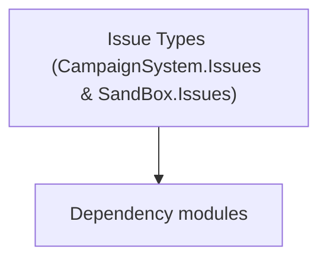

# Issue Types (CampaignSystem.Issues & SandBox.Issues)

**One-line responsibility:** This page covers all 201 business types under `Issue Types (CampaignSystem.Issues & SandBox.Issues)` as a family index, giving each type its namespace, responsibility, and typical timing so you can browse by module instead of alphabetically.

## Mental Model

Issues model the "lord/fief affairs" the player can take on and settle across the campaign map — from village needs to bandit problems. CampaignSystem.Issues holds the core issue contracts while SandBox.Issues provides concrete implementations and IssueQuestTasks are the per-issue completion steps. Issues are the canonical example of a self-contained, save-friendly quest-like workflow.

## When to Use

To add a new fief problem, implement an Issue in SandBox.Issues (or its task steps) and register it with the issue system. Completion must be idempotent.

## Dependencies

The types under `Issue Types (CampaignSystem.Issues & SandBox.Issues)` depend on the following modules; missing any of them causes compile- or run-time failure.

- [Campaign](../../campaign/Campaign)
- [API Overview](../../_index)

## Type Catalog

| Type | Namespace | Purpose | Timing |
| --- | --- | --- | --- |
| `FamilyFeudIssue` | SandBox.Issues | Issue (lord/fief affair) related type describing an accept-and-settle fief problem. Completion must be idempotent. | Campaign init |
| `FamilyFeudIssueBehavior` | SandBox.Issues | Issue (lord/fief affair) related type describing an accept-and-settle fief problem. Completion must be idempotent. | Campaign init |
| `FamilyFeudIssueMissionBehavior` | SandBox.Issues | Mission behavior that listens to mission events to drive logic; pairs with MissionLogic for presentation and interaction wiring. | Campaign init |
| `FamilyFeudIssueQuest` | SandBox.Issues | Issue (lord/fief affair) related type describing an accept-and-settle fief problem. Completion must be idempotent. | Campaign init |
| `FamilyFeudIssueTypeDefiner` | SandBox.Issues | Save-type definer that declares which fields of the type enter the save. Any new field must carry a default value, otherwise old saves fail to deserialize. | Campaign init |
| `NotableWantsDaughterFoundIssue` | SandBox.Issues | Issue (lord/fief affair) related type describing an accept-and-settle fief problem. Completion must be idempotent. | Campaign init |
| `NotableWantsDaughterFoundIssueBehavior` | SandBox.Issues | Issue (lord/fief affair) related type describing an accept-and-settle fief problem. Completion must be idempotent. | Campaign init |
| `NotableWantsDaughterFoundIssueQuest` | SandBox.Issues | Issue (lord/fief affair) related type describing an accept-and-settle fief problem. Completion must be idempotent. | Campaign init |
| `NotableWantsDaughterFoundIssueTypeDefiner` | SandBox.Issues | Save-type definer that declares which fields of the type enter the save. Any new field must carry a default value, otherwise old saves fail to deserialize. | Campaign init |
| `ProdigalSonIssue` | SandBox.Issues | Issue (lord/fief affair) related type describing an accept-and-settle fief problem. Completion must be idempotent. | Campaign init |
| `ProdigalSonIssueBehavior` | SandBox.Issues | Issue (lord/fief affair) related type describing an accept-and-settle fief problem. Completion must be idempotent. | Campaign init |
| `ProdigalSonIssueQuest` | SandBox.Issues | Issue (lord/fief affair) related type describing an accept-and-settle fief problem. Completion must be idempotent. | Campaign init |
| `ProdigalSonIssueTypeDefiner` | SandBox.Issues | Save-type definer that declares which fields of the type enter the save. Any new field must carry a default value, otherwise old saves fail to deserialize. | Campaign init |
| `RivalGangMovingInIssue` | SandBox.Issues | Issue (lord/fief affair) related type describing an accept-and-settle fief problem. Completion must be idempotent. | Campaign init |
| `RivalGangMovingInIssueBehavior` | SandBox.Issues | Issue (lord/fief affair) related type describing an accept-and-settle fief problem. Completion must be idempotent. | Campaign init |
| `RivalGangMovingInIssueQuest` | SandBox.Issues | Issue (lord/fief affair) related type describing an accept-and-settle fief problem. Completion must be idempotent. | Campaign init |
| `RivalGangMovingInIssueTypeDefiner` | SandBox.Issues | Save-type definer that declares which fields of the type enter the save. Any new field must carry a default value, otherwise old saves fail to deserialize. | Campaign init |
| `RuralNotableInnAndOutIssue` | SandBox.Issues | Issue (lord/fief affair) related type describing an accept-and-settle fief problem. Completion must be idempotent. | Campaign init |
| `RuralNotableInnAndOutIssueBehavior` | SandBox.Issues | Issue (lord/fief affair) related type describing an accept-and-settle fief problem. Completion must be idempotent. | Campaign init |
| `RuralNotableInnAndOutIssueQuest` | SandBox.Issues | Issue (lord/fief affair) related type describing an accept-and-settle fief problem. Completion must be idempotent. | Campaign init |
| `RuralNotableInnAndOutIssueTypeDefiner` | SandBox.Issues | Save-type definer that declares which fields of the type enter the save. Any new field must carry a default value, otherwise old saves fail to deserialize. | Campaign init |
| `SnareTheWealthyIssue` | SandBox.Issues | Issue (lord/fief affair) related type describing an accept-and-settle fief problem. Completion must be idempotent. | Campaign init |
| `SnareTheWealthyIssueBehavior` | SandBox.Issues | Issue (lord/fief affair) related type describing an accept-and-settle fief problem. Completion must be idempotent. | Campaign init |
| `SnareTheWealthyIssueQuest` | SandBox.Issues | Issue (lord/fief affair) related type describing an accept-and-settle fief problem. Completion must be idempotent. | Campaign init |
| `SnareTheWealthyIssueTypeDefiner` | SandBox.Issues | Save-type definer that declares which fields of the type enter the save. Any new field must carry a default value, otherwise old saves fail to deserialize. | Campaign init |
| `SnareTheWealthyQuestChoice` | SandBox.Issues | Issue (lord/fief affair) related type describing an accept-and-settle fief problem. Completion must be idempotent. | Campaign init |
| `SuspectNpc` | SandBox.Issues | Issue (lord/fief affair) related type describing an accept-and-settle fief problem. Completion must be idempotent. | Campaign init |
| `TheSpyPartyIssue` | SandBox.Issues | Issue (lord/fief affair) related type describing an accept-and-settle fief problem. Completion must be idempotent. | Campaign init |
| `TheSpyPartyIssueQuest` | SandBox.Issues | Issue (lord/fief affair) related type describing an accept-and-settle fief problem. Completion must be idempotent. | Campaign init |
| `TheSpyPartyIssueQuestBehavior` | SandBox.Issues | Issue (lord/fief affair) related type describing an accept-and-settle fief problem. Completion must be idempotent. | Campaign init |
| `TheSpyPartyIssueQuestTypeDefiner` | SandBox.Issues | Save-type definer that declares which fields of the type enter the save. Any new field must carry a default value, otherwise old saves fail to deserialize. | Campaign init |
| `ArenaDuelQuestTask` | SandBox.Issues.IssueQuestTasks | Quest-stage sub-goal that defines one completion condition and settlement. Condition checks must be idempotent — repeated completion must not double-reward. | Campaign init |
| `BeginConversationInitiatedByAIQuestTask` | SandBox.Issues.IssueQuestTasks | Quest-stage sub-goal that defines one completion condition and settlement. Condition checks must be idempotent — repeated completion must not double-reward. | Campaign init |
| `FollowAgentQuestTask` | SandBox.Issues.IssueQuestTasks | Quest-stage sub-goal that defines one completion condition and settlement. Condition checks must be idempotent — repeated completion must not double-reward. | Campaign init |
| `AlternativeSolutionScaleFlag` | TaleWorlds.CampaignSystem.Issues | Issue (lord/fief affair) related type describing an accept-and-settle fief problem. Completion must be idempotent. | Campaign init |
| `ArmyNeedsSuppliesIssue` | TaleWorlds.CampaignSystem.Issues | Issue (lord/fief affair) related type describing an accept-and-settle fief problem. Completion must be idempotent. | Campaign init |
| `ArmyNeedsSuppliesIssueBehavior` | TaleWorlds.CampaignSystem.Issues | Issue (lord/fief affair) related type describing an accept-and-settle fief problem. Completion must be idempotent. | Campaign init |
| `ArmyNeedsSuppliesIssueQuest` | TaleWorlds.CampaignSystem.Issues | Issue (lord/fief affair) related type describing an accept-and-settle fief problem. Completion must be idempotent. | Campaign init |
| `ArmyNeedsSuppliesIssueTypeDefiner` | TaleWorlds.CampaignSystem.Issues | Save-type definer that declares which fields of the type enter the save. Any new field must carry a default value, otherwise old saves fail to deserialize. | Campaign init |
| `ArtisanCantSellProductsAtAFairPriceIssue` | TaleWorlds.CampaignSystem.Issues | AI decision implementation that must be interruptible and serializable to support saving and undo. Search must be depth/time bounded to avoid stalls. | Campaign init |
| `ArtisanCantSellProductsAtAFairPriceIssueBehavior` | TaleWorlds.CampaignSystem.Issues | AI decision implementation that must be interruptible and serializable to support saving and undo. Search must be depth/time bounded to avoid stalls. | Campaign init |
| `ArtisanCantSellProductsAtAFairPriceIssueQuest` | TaleWorlds.CampaignSystem.Issues | AI decision implementation that must be interruptible and serializable to support saving and undo. Search must be depth/time bounded to avoid stalls. | Campaign init |
| `ArtisanCantSellProductsAtAFairPriceIssueTypeDefiner` | TaleWorlds.CampaignSystem.Issues | Save-type definer that declares which fields of the type enter the save. Any new field must carry a default value, otherwise old saves fail to deserialize. | Campaign init |
| `ArtisanOverpricedGoodsIssue` | TaleWorlds.CampaignSystem.Issues | Issue (lord/fief affair) related type describing an accept-and-settle fief problem. Completion must be idempotent. | Campaign init |
| `ArtisanOverpricedGoodsIssueBehavior` | TaleWorlds.CampaignSystem.Issues | Issue (lord/fief affair) related type describing an accept-and-settle fief problem. Completion must be idempotent. | Campaign init |
| `ArtisanOverpricedGoodsIssueQuest` | TaleWorlds.CampaignSystem.Issues | Issue (lord/fief affair) related type describing an accept-and-settle fief problem. Completion must be idempotent. | Campaign init |
| `ArtisanOverpricedGoodsIssueTypeDefiner` | TaleWorlds.CampaignSystem.Issues | Save-type definer that declares which fields of the type enter the save. Any new field must carry a default value, otherwise old saves fail to deserialize. | Campaign init |
| `BettingFraudIssue` | TaleWorlds.CampaignSystem.Issues | Issue (lord/fief affair) related type describing an accept-and-settle fief problem. Completion must be idempotent. | Campaign init |
| `BettingFraudIssueBehavior` | TaleWorlds.CampaignSystem.Issues | Issue (lord/fief affair) related type describing an accept-and-settle fief problem. Completion must be idempotent. | Campaign init |
| `BettingFraudIssueTypeDefiner` | TaleWorlds.CampaignSystem.Issues | Save-type definer that declares which fields of the type enter the save. Any new field must carry a default value, otherwise old saves fail to deserialize. | Campaign init |
| `BettingFraudQuest` | TaleWorlds.CampaignSystem.Issues | Issue (lord/fief affair) related type describing an accept-and-settle fief problem. Completion must be idempotent. | Campaign init |
| `CapturedByBountyHuntersIssue` | TaleWorlds.CampaignSystem.Issues | Issue (lord/fief affair) related type describing an accept-and-settle fief problem. Completion must be idempotent. | Campaign init |
| `CapturedByBountyHuntersIssueBehavior` | TaleWorlds.CampaignSystem.Issues | Issue (lord/fief affair) related type describing an accept-and-settle fief problem. Completion must be idempotent. | Campaign init |
| `CapturedByBountyHuntersIssueQuest` | TaleWorlds.CampaignSystem.Issues | Issue (lord/fief affair) related type describing an accept-and-settle fief problem. Completion must be idempotent. | Campaign init |
| `CapturedByBountyHuntersIssueTypeDefiner` | TaleWorlds.CampaignSystem.Issues | Save-type definer that declares which fields of the type enter the save. Any new field must carry a default value, otherwise old saves fail to deserialize. | Campaign init |
| `CaravanAmbushIssue` | TaleWorlds.CampaignSystem.Issues | Issue (lord/fief affair) related type describing an accept-and-settle fief problem. Completion must be idempotent. | Campaign init |
| `CaravanAmbushIssueBehavior` | TaleWorlds.CampaignSystem.Issues | Issue (lord/fief affair) related type describing an accept-and-settle fief problem. Completion must be idempotent. | Campaign init |
| `CaravanAmbushIssueQuest` | TaleWorlds.CampaignSystem.Issues | Issue (lord/fief affair) related type describing an accept-and-settle fief problem. Completion must be idempotent. | Campaign init |
| `CaravanAmbushIssueTypeDefiner` | TaleWorlds.CampaignSystem.Issues | Save-type definer that declares which fields of the type enter the save. Any new field must carry a default value, otherwise old saves fail to deserialize. | Campaign init |
| `DefaultIssueEffects` | TaleWorlds.CampaignSystem.Issues | Issue (lord/fief affair) related type describing an accept-and-settle fief problem. Completion must be idempotent. | Campaign init |
| `EscortMerchantCaravanIssue` | TaleWorlds.CampaignSystem.Issues | Issue (lord/fief affair) related type describing an accept-and-settle fief problem. Completion must be idempotent. | Campaign init |
| `EscortMerchantCaravanIssueBehavior` | TaleWorlds.CampaignSystem.Issues | Issue (lord/fief affair) related type describing an accept-and-settle fief problem. Completion must be idempotent. | Campaign init |
| `EscortMerchantCaravanIssueQuest` | TaleWorlds.CampaignSystem.Issues | Issue (lord/fief affair) related type describing an accept-and-settle fief problem. Completion must be idempotent. | Campaign init |
| `EscortMerchantCaravanIssueTypeDefiner` | TaleWorlds.CampaignSystem.Issues | Save-type definer that declares which fields of the type enter the save. Any new field must carry a default value, otherwise old saves fail to deserialize. | Campaign init |
| `ExtortionByDesertersIssue` | TaleWorlds.CampaignSystem.Issues | Issue (lord/fief affair) related type describing an accept-and-settle fief problem. Completion must be idempotent. | Campaign init |
| `ExtortionByDesertersIssueBehavior` | TaleWorlds.CampaignSystem.Issues | Issue (lord/fief affair) related type describing an accept-and-settle fief problem. Completion must be idempotent. | Campaign init |
| `ExtortionByDesertersIssueBehaviorTypeDefiner` | TaleWorlds.CampaignSystem.Issues | Save-type definer that declares which fields of the type enter the save. Any new field must carry a default value, otherwise old saves fail to deserialize. | Campaign init |
| `ExtortionByDesertersIssueQuest` | TaleWorlds.CampaignSystem.Issues | Issue (lord/fief affair) related type describing an accept-and-settle fief problem. Completion must be idempotent. | Campaign init |
| `ExtortionByDesertersQuestState` | TaleWorlds.CampaignSystem.Issues | Issue (lord/fief affair) related type describing an accept-and-settle fief problem. Completion must be idempotent. | Campaign init |
| `GangLeaderNeedsRecruitsIssue` | TaleWorlds.CampaignSystem.Issues | Issue (lord/fief affair) related type describing an accept-and-settle fief problem. Completion must be idempotent. | Campaign init |
| `GangLeaderNeedsRecruitsIssueBehavior` | TaleWorlds.CampaignSystem.Issues | Issue (lord/fief affair) related type describing an accept-and-settle fief problem. Completion must be idempotent. | Campaign init |
| `GangLeaderNeedsRecruitsIssueBehaviorTypeDefiner` | TaleWorlds.CampaignSystem.Issues | Save-type definer that declares which fields of the type enter the save. Any new field must carry a default value, otherwise old saves fail to deserialize. | Campaign init |
| `GangLeaderNeedsRecruitsIssueQuest` | TaleWorlds.CampaignSystem.Issues | Issue (lord/fief affair) related type describing an accept-and-settle fief problem. Completion must be idempotent. | Campaign init |
| `GangLeaderNeedsSpecialWeaponsIssue` | TaleWorlds.CampaignSystem.Issues | Issue (lord/fief affair) related type describing an accept-and-settle fief problem. Completion must be idempotent. | Campaign init |
| `GangLeaderNeedsSpecialWeaponsIssueBehavior` | TaleWorlds.CampaignSystem.Issues | Issue (lord/fief affair) related type describing an accept-and-settle fief problem. Completion must be idempotent. | Campaign init |
| `GangLeaderNeedsSpecialWeaponsIssueQuest` | TaleWorlds.CampaignSystem.Issues | Issue (lord/fief affair) related type describing an accept-and-settle fief problem. Completion must be idempotent. | Campaign init |
| `GangLeaderNeedsSpecialWeaponsIssueTypeDefiner` | TaleWorlds.CampaignSystem.Issues | Save-type definer that declares which fields of the type enter the save. Any new field must carry a default value, otherwise old saves fail to deserialize. | Campaign init |
| `GangLeaderNeedsToOffloadStolenGoodsIssue` | TaleWorlds.CampaignSystem.Issues | Issue (lord/fief affair) related type describing an accept-and-settle fief problem. Completion must be idempotent. | Campaign init |
| `GangLeaderNeedsToOffloadStolenGoodsIssueBehavior` | TaleWorlds.CampaignSystem.Issues | Issue (lord/fief affair) related type describing an accept-and-settle fief problem. Completion must be idempotent. | Campaign init |
| `GangLeaderNeedsToOffloadStolenGoodsIssueQuest` | TaleWorlds.CampaignSystem.Issues | Issue (lord/fief affair) related type describing an accept-and-settle fief problem. Completion must be idempotent. | Campaign init |
| `GangLeaderNeedsToOffloadStolenGoodsIssueTypeDefiner` | TaleWorlds.CampaignSystem.Issues | Save-type definer that declares which fields of the type enter the save. Any new field must carry a default value, otherwise old saves fail to deserialize. | Campaign init |
| `GangLeaderNeedsWeaponsIssue` | TaleWorlds.CampaignSystem.Issues | Issue (lord/fief affair) related type describing an accept-and-settle fief problem. Completion must be idempotent. | Campaign init |
| `GangLeaderNeedsWeaponsIssueQuest` | TaleWorlds.CampaignSystem.Issues | Issue (lord/fief affair) related type describing an accept-and-settle fief problem. Completion must be idempotent. | Campaign init |
| `GangLeaderNeedsWeaponsIssueQuestBehavior` | TaleWorlds.CampaignSystem.Issues | Issue (lord/fief affair) related type describing an accept-and-settle fief problem. Completion must be idempotent. | Campaign init |
| `GangLeaderNeedsWeaponsIssueTypeDefiner` | TaleWorlds.CampaignSystem.Issues | Save-type definer that declares which fields of the type enter the save. Any new field must carry a default value, otherwise old saves fail to deserialize. | Campaign init |
| `HeadmanNeedsGrainIssue` | TaleWorlds.CampaignSystem.Issues | AI decision implementation that must be interruptible and serializable to support saving and undo. Search must be depth/time bounded to avoid stalls. | Campaign init |
| `HeadmanNeedsGrainIssueBehavior` | TaleWorlds.CampaignSystem.Issues | AI decision implementation that must be interruptible and serializable to support saving and undo. Search must be depth/time bounded to avoid stalls. | Campaign init |
| `HeadmanNeedsGrainIssueQuest` | TaleWorlds.CampaignSystem.Issues | AI decision implementation that must be interruptible and serializable to support saving and undo. Search must be depth/time bounded to avoid stalls. | Campaign init |
| `HeadmanNeedsGrainIssueTypeDefiner` | TaleWorlds.CampaignSystem.Issues | Save-type definer that declares which fields of the type enter the save. Any new field must carry a default value, otherwise old saves fail to deserialize. | Campaign init |
| `HeadmanNeedsToDeliverAHerdIssue` | TaleWorlds.CampaignSystem.Issues | Issue (lord/fief affair) related type describing an accept-and-settle fief problem. Completion must be idempotent. | Campaign init |
| `HeadmanNeedsToDeliverAHerdIssueBehavior` | TaleWorlds.CampaignSystem.Issues | Issue (lord/fief affair) related type describing an accept-and-settle fief problem. Completion must be idempotent. | Campaign init |
| `HeadmanNeedsToDeliverAHerdIssueQuest` | TaleWorlds.CampaignSystem.Issues | Issue (lord/fief affair) related type describing an accept-and-settle fief problem. Completion must be idempotent. | Campaign init |
| `HeadmanNeedsToDeliverAHerdIssueTypeDefiner` | TaleWorlds.CampaignSystem.Issues | Save-type definer that declares which fields of the type enter the save. Any new field must carry a default value, otherwise old saves fail to deserialize. | Campaign init |
| `HeadmanVillageNeedsDraughtAnimalsIssue` | TaleWorlds.CampaignSystem.Issues | Issue (lord/fief affair) related type describing an accept-and-settle fief problem. Completion must be idempotent. | Campaign init |
| `HeadmanVillageNeedsDraughtAnimalsIssueBehavior` | TaleWorlds.CampaignSystem.Issues | Issue (lord/fief affair) related type describing an accept-and-settle fief problem. Completion must be idempotent. | Campaign init |
| `HeadmanVillageNeedsDraughtAnimalsIssueBehaviorTypeDefiner` | TaleWorlds.CampaignSystem.Issues | Save-type definer that declares which fields of the type enter the save. Any new field must carry a default value, otherwise old saves fail to deserialize. | Campaign init |
| `HeadmanVillageNeedsDraughtAnimalsIssueQuest` | TaleWorlds.CampaignSystem.Issues | Issue (lord/fief affair) related type describing an accept-and-settle fief problem. Completion must be idempotent. | Campaign init |
| `HeroRelatedIssueCoolDownData` | TaleWorlds.CampaignSystem.Issues | Issue (lord/fief affair) related type describing an accept-and-settle fief problem. Completion must be idempotent. | Campaign init |
| `IssueBase` | TaleWorlds.CampaignSystem.Issues | Issue (lord/fief affair) related type describing an accept-and-settle fief problem. Completion must be idempotent. | Campaign init |
| `IssueCoolDownData` | TaleWorlds.CampaignSystem.Issues | Issue (lord/fief affair) related type describing an accept-and-settle fief problem. Completion must be idempotent. | Campaign init |
| `IssueEffect` | TaleWorlds.CampaignSystem.Issues | Issue (lord/fief affair) related type describing an accept-and-settle fief problem. Completion must be idempotent. | Campaign init |
| `IssueFrequency` | TaleWorlds.CampaignSystem.Issues | Issue (lord/fief affair) related type describing an accept-and-settle fief problem. Completion must be idempotent. | Campaign init |
| `IssueManager` | TaleWorlds.CampaignSystem.Issues | Issue (lord/fief affair) related type describing an accept-and-settle fief problem. Completion must be idempotent. | Campaign init |
| `IssueState` | TaleWorlds.CampaignSystem.Issues | Issue (lord/fief affair) related type describing an accept-and-settle fief problem. Completion must be idempotent. | Campaign init |
| `IssueUpdateDetails` | TaleWorlds.CampaignSystem.Issues | AI decision implementation that must be interruptible and serializable to support saving and undo. Search must be depth/time bounded to avoid stalls. | Campaign init |
| `LadysKnightOutIssue` | TaleWorlds.CampaignSystem.Issues | Issue (lord/fief affair) related type describing an accept-and-settle fief problem. Completion must be idempotent. | Campaign init |
| `LadysKnightOutIssueBehavior` | TaleWorlds.CampaignSystem.Issues | Issue (lord/fief affair) related type describing an accept-and-settle fief problem. Completion must be idempotent. | Campaign init |
| `LadysKnightOutIssueQuest` | TaleWorlds.CampaignSystem.Issues | Issue (lord/fief affair) related type describing an accept-and-settle fief problem. Completion must be idempotent. | Campaign init |
| `LadysKnightOutIssueTypeDefiner` | TaleWorlds.CampaignSystem.Issues | Save-type definer that declares which fields of the type enter the save. Any new field must carry a default value, otherwise old saves fail to deserialize. | Campaign init |
| `LandLordCompanyOfTroubleIssue` | TaleWorlds.CampaignSystem.Issues | Issue (lord/fief affair) related type describing an accept-and-settle fief problem. Completion must be idempotent. | Campaign init |
| `LandLordCompanyOfTroubleIssueBehavior` | TaleWorlds.CampaignSystem.Issues | Issue (lord/fief affair) related type describing an accept-and-settle fief problem. Completion must be idempotent. | Campaign init |
| `LandLordCompanyOfTroubleIssueQuest` | TaleWorlds.CampaignSystem.Issues | Issue (lord/fief affair) related type describing an accept-and-settle fief problem. Completion must be idempotent. | Campaign init |
| `LandLordCompanyOfTroubleIssueTypeDefiner` | TaleWorlds.CampaignSystem.Issues | Save-type definer that declares which fields of the type enter the save. Any new field must carry a default value, otherwise old saves fail to deserialize. | Campaign init |
| `LandlordNeedsAccessToVillageCommonsIssue` | TaleWorlds.CampaignSystem.Issues | Issue (lord/fief affair) related type describing an accept-and-settle fief problem. Completion must be idempotent. | Campaign init |
| `LandlordNeedsAccessToVillageCommonsIssueBehavior` | TaleWorlds.CampaignSystem.Issues | Issue (lord/fief affair) related type describing an accept-and-settle fief problem. Completion must be idempotent. | Campaign init |
| `LandlordNeedsAccessToVillageCommonsIssueQuest` | TaleWorlds.CampaignSystem.Issues | Issue (lord/fief affair) related type describing an accept-and-settle fief problem. Completion must be idempotent. | Campaign init |
| `LandlordNeedsAccessToVillageCommonsIssueTypeDefiner` | TaleWorlds.CampaignSystem.Issues | Save-type definer that declares which fields of the type enter the save. Any new field must carry a default value, otherwise old saves fail to deserialize. | Campaign init |
| `LandLordNeedsManualLaborersIssue` | TaleWorlds.CampaignSystem.Issues | Issue (lord/fief affair) related type describing an accept-and-settle fief problem. Completion must be idempotent. | Campaign init |
| `LandLordNeedsManualLaborersIssueBehavior` | TaleWorlds.CampaignSystem.Issues | Issue (lord/fief affair) related type describing an accept-and-settle fief problem. Completion must be idempotent. | Campaign init |
| `LandLordNeedsManualLaborersIssueBehaviorTypeDefiner` | TaleWorlds.CampaignSystem.Issues | Save-type definer that declares which fields of the type enter the save. Any new field must carry a default value, otherwise old saves fail to deserialize. | Campaign init |
| `LandLordNeedsManualLaborersIssueQuest` | TaleWorlds.CampaignSystem.Issues | Issue (lord/fief affair) related type describing an accept-and-settle fief problem. Completion must be idempotent. | Campaign init |
| `LandLordTheArtOfTheTradeIssue` | TaleWorlds.CampaignSystem.Issues | Issue (lord/fief affair) related type describing an accept-and-settle fief problem. Completion must be idempotent. | Campaign init |
| `LandLordTheArtOfTheTradeIssueBehavior` | TaleWorlds.CampaignSystem.Issues | Issue (lord/fief affair) related type describing an accept-and-settle fief problem. Completion must be idempotent. | Campaign init |
| `LandLordTheArtOfTheTradeIssueBehaviorTypeDefiner` | TaleWorlds.CampaignSystem.Issues | Save-type definer that declares which fields of the type enter the save. Any new field must carry a default value, otherwise old saves fail to deserialize. | Campaign init |
| `LandLordTheArtOfTheTradeIssueQuest` | TaleWorlds.CampaignSystem.Issues | Issue (lord/fief affair) related type describing an accept-and-settle fief problem. Completion must be idempotent. | Campaign init |
| `LandlordTrainingForRetainersIssue` | TaleWorlds.CampaignSystem.Issues | AI decision implementation that must be interruptible and serializable to support saving and undo. Search must be depth/time bounded to avoid stalls. | Campaign init |
| `LandlordTrainingForRetainersIssueBehavior` | TaleWorlds.CampaignSystem.Issues | AI decision implementation that must be interruptible and serializable to support saving and undo. Search must be depth/time bounded to avoid stalls. | Campaign init |
| `LandlordTrainingForRetainersIssueQuest` | TaleWorlds.CampaignSystem.Issues | AI decision implementation that must be interruptible and serializable to support saving and undo. Search must be depth/time bounded to avoid stalls. | Campaign init |
| `LandlordTrainingForRetainersIssueTypeDefiner` | TaleWorlds.CampaignSystem.Issues | Save-type definer that declares which fields of the type enter the save. Any new field must carry a default value, otherwise old saves fail to deserialize. | Campaign init |
| `LesserNobleRevoltIssue` | TaleWorlds.CampaignSystem.Issues | Issue (lord/fief affair) related type describing an accept-and-settle fief problem. Completion must be idempotent. | Campaign init |
| `LesserNobleRevoltIssueBehavior` | TaleWorlds.CampaignSystem.Issues | Issue (lord/fief affair) related type describing an accept-and-settle fief problem. Completion must be idempotent. | Campaign init |
| `LesserNobleRevoltIssueBehaviorTypeDefiner` | TaleWorlds.CampaignSystem.Issues | Save-type definer that declares which fields of the type enter the save. Any new field must carry a default value, otherwise old saves fail to deserialize. | Campaign init |
| `LesserNobleRevoltIssueQuest` | TaleWorlds.CampaignSystem.Issues | Issue (lord/fief affair) related type describing an accept-and-settle fief problem. Completion must be idempotent. | Campaign init |
| `LordNeedsGarrisonTroopsIssue` | TaleWorlds.CampaignSystem.Issues | Issue (lord/fief affair) related type describing an accept-and-settle fief problem. Completion must be idempotent. | Campaign init |
| `LordNeedsGarrisonTroopsIssueQuest` | TaleWorlds.CampaignSystem.Issues | Issue (lord/fief affair) related type describing an accept-and-settle fief problem. Completion must be idempotent. | Campaign init |
| `LordNeedsGarrisonTroopsIssueQuestBehavior` | TaleWorlds.CampaignSystem.Issues | Issue (lord/fief affair) related type describing an accept-and-settle fief problem. Completion must be idempotent. | Campaign init |
| `LordNeedsGarrisonTroopsIssueQuestTypeDefiner` | TaleWorlds.CampaignSystem.Issues | Save-type definer that declares which fields of the type enter the save. Any new field must carry a default value, otherwise old saves fail to deserialize. | Campaign init |
| `LordNeedsHorsesIssue` | TaleWorlds.CampaignSystem.Issues | Issue (lord/fief affair) related type describing an accept-and-settle fief problem. Completion must be idempotent. | Campaign init |
| `LordNeedsHorsesIssueBehavior` | TaleWorlds.CampaignSystem.Issues | Issue (lord/fief affair) related type describing an accept-and-settle fief problem. Completion must be idempotent. | Campaign init |
| `LordNeedsHorsesIssueBehaviorTypeDefiner` | TaleWorlds.CampaignSystem.Issues | Save-type definer that declares which fields of the type enter the save. Any new field must carry a default value, otherwise old saves fail to deserialize. | Campaign init |
| `LordNeedsHorsesIssueQuest` | TaleWorlds.CampaignSystem.Issues | Issue (lord/fief affair) related type describing an accept-and-settle fief problem. Completion must be idempotent. | Campaign init |
| `LordsNeedsTutorIssue` | TaleWorlds.CampaignSystem.Issues | Issue (lord/fief affair) related type describing an accept-and-settle fief problem. Completion must be idempotent. | Campaign init |
| `LordsNeedsTutorIssueBehavior` | TaleWorlds.CampaignSystem.Issues | Issue (lord/fief affair) related type describing an accept-and-settle fief problem. Completion must be idempotent. | Campaign init |
| `LordsNeedsTutorIssueQuest` | TaleWorlds.CampaignSystem.Issues | Issue (lord/fief affair) related type describing an accept-and-settle fief problem. Completion must be idempotent. | Campaign init |
| `LordsNeedsTutorIssueTypeDefiner` | TaleWorlds.CampaignSystem.Issues | Save-type definer that declares which fields of the type enter the save. Any new field must carry a default value, otherwise old saves fail to deserialize. | Campaign init |
| `LordWantsRivalCapturedIssue` | TaleWorlds.CampaignSystem.Issues | Issue (lord/fief affair) related type describing an accept-and-settle fief problem. Completion must be idempotent. | Campaign init |
| `LordWantsRivalCapturedIssueBehavior` | TaleWorlds.CampaignSystem.Issues | Issue (lord/fief affair) related type describing an accept-and-settle fief problem. Completion must be idempotent. | Campaign init |
| `LordWantsRivalCapturedIssueQuest` | TaleWorlds.CampaignSystem.Issues | Issue (lord/fief affair) related type describing an accept-and-settle fief problem. Completion must be idempotent. | Campaign init |
| `LordWantsRivalCapturedIssueTypeDefiner` | TaleWorlds.CampaignSystem.Issues | Save-type definer that declares which fields of the type enter the save. Any new field must carry a default value, otherwise old saves fail to deserialize. | Campaign init |
| `MerchantArmyOfPoachersIssue` | TaleWorlds.CampaignSystem.Issues | Issue (lord/fief affair) related type describing an accept-and-settle fief problem. Completion must be idempotent. | Campaign init |
| `MerchantArmyOfPoachersIssueBehavior` | TaleWorlds.CampaignSystem.Issues | Issue (lord/fief affair) related type describing an accept-and-settle fief problem. Completion must be idempotent. | Campaign init |
| `MerchantArmyOfPoachersIssueBehaviorTypeDefiner` | TaleWorlds.CampaignSystem.Issues | Save-type definer that declares which fields of the type enter the save. Any new field must carry a default value, otherwise old saves fail to deserialize. | Campaign init |
| `MerchantArmyOfPoachersIssueQuest` | TaleWorlds.CampaignSystem.Issues | Issue (lord/fief affair) related type describing an accept-and-settle fief problem. Completion must be idempotent. | Campaign init |
| `MerchantNeedsHelpWithOutlawsIssue` | TaleWorlds.CampaignSystem.Issues | Issue (lord/fief affair) related type describing an accept-and-settle fief problem. Completion must be idempotent. | Campaign init |
| `MerchantNeedsHelpWithOutlawsIssueQuest` | TaleWorlds.CampaignSystem.Issues | Issue (lord/fief affair) related type describing an accept-and-settle fief problem. Completion must be idempotent. | Campaign init |
| `MerchantNeedsHelpWithOutlawsIssueQuestBehavior` | TaleWorlds.CampaignSystem.Issues | Issue (lord/fief affair) related type describing an accept-and-settle fief problem. Completion must be idempotent. | Campaign init |
| `MerchantNeedsHelpWithOutlawsIssueTypeDefiner` | TaleWorlds.CampaignSystem.Issues | Save-type definer that declares which fields of the type enter the save. Any new field must carry a default value, otherwise old saves fail to deserialize. | Campaign init |
| `NearbyBanditBaseIssue` | TaleWorlds.CampaignSystem.Issues | Issue (lord/fief affair) related type describing an accept-and-settle fief problem. Completion must be idempotent. | Campaign init |
| `NearbyBanditBaseIssueBehavior` | TaleWorlds.CampaignSystem.Issues | Issue (lord/fief affair) related type describing an accept-and-settle fief problem. Completion must be idempotent. | Campaign init |
| `NearbyBanditBaseIssueQuest` | TaleWorlds.CampaignSystem.Issues | Issue (lord/fief affair) related type describing an accept-and-settle fief problem. Completion must be idempotent. | Campaign init |
| `NearbyBanditBaseIssueTypeDefiner` | TaleWorlds.CampaignSystem.Issues | Save-type definer that declares which fields of the type enter the save. Any new field must carry a default value, otherwise old saves fail to deserialize. | Campaign init |
| `PotentialIssueData` | TaleWorlds.CampaignSystem.Issues | Issue (lord/fief affair) related type describing an accept-and-settle fief problem. Completion must be idempotent. | Campaign init |
| `PreconditionFlags` | TaleWorlds.CampaignSystem.Issues | Issue (lord/fief affair) related type describing an accept-and-settle fief problem. Completion must be idempotent. | Campaign init |
| `QuestSettlement` | TaleWorlds.CampaignSystem.Issues | Issue (lord/fief affair) related type describing an accept-and-settle fief problem. Completion must be idempotent. | Campaign init |
| `RaidAnEnemyTerritoryIssue` | TaleWorlds.CampaignSystem.Issues | AI decision implementation that must be interruptible and serializable to support saving and undo. Search must be depth/time bounded to avoid stalls. | Campaign init |
| `RaidAnEnemyTerritoryIssueBehavior` | TaleWorlds.CampaignSystem.Issues | AI decision implementation that must be interruptible and serializable to support saving and undo. Search must be depth/time bounded to avoid stalls. | Campaign init |
| `RaidAnEnemyTerritoryIssueTypeDefiner` | TaleWorlds.CampaignSystem.Issues | Save-type definer that declares which fields of the type enter the save. Any new field must carry a default value, otherwise old saves fail to deserialize. | Campaign init |
| `RaidAnEnemyTerritoryQuest` | TaleWorlds.CampaignSystem.Issues | AI decision implementation that must be interruptible and serializable to support saving and undo. Search must be depth/time bounded to avoid stalls. | Campaign init |
| `RevenueFarmingIssue` | TaleWorlds.CampaignSystem.Issues | Issue (lord/fief affair) related type describing an accept-and-settle fief problem. Completion must be idempotent. | Campaign init |
| `RevenueFarmingIssueBehavior` | TaleWorlds.CampaignSystem.Issues | Issue (lord/fief affair) related type describing an accept-and-settle fief problem. Completion must be idempotent. | Campaign init |
| `RevenueFarmingIssueBehaviorTypeDefiner` | TaleWorlds.CampaignSystem.Issues | Save-type definer that declares which fields of the type enter the save. Any new field must carry a default value, otherwise old saves fail to deserialize. | Campaign init |
| `RevenueFarmingIssueQuest` | TaleWorlds.CampaignSystem.Issues | Issue (lord/fief affair) related type describing an accept-and-settle fief problem. Completion must be idempotent. | Campaign init |
| `RevenueVillage` | TaleWorlds.CampaignSystem.Issues | Issue (lord/fief affair) related type describing an accept-and-settle fief problem. Completion must be idempotent. | Campaign init |
| `ScoutEnemyGarrisonsIssue` | TaleWorlds.CampaignSystem.Issues | Issue (lord/fief affair) related type describing an accept-and-settle fief problem. Completion must be idempotent. | Campaign init |
| `ScoutEnemyGarrisonsIssueBehavior` | TaleWorlds.CampaignSystem.Issues | Issue (lord/fief affair) related type describing an accept-and-settle fief problem. Completion must be idempotent. | Campaign init |
| `ScoutEnemyGarrisonsIssueTypeDefiner` | TaleWorlds.CampaignSystem.Issues | Save-type definer that declares which fields of the type enter the save. Any new field must carry a default value, otherwise old saves fail to deserialize. | Campaign init |
| `ScoutEnemyGarrisonsQuest` | TaleWorlds.CampaignSystem.Issues | Issue (lord/fief affair) related type describing an accept-and-settle fief problem. Completion must be idempotent. | Campaign init |
| `SmugglersIssue` | TaleWorlds.CampaignSystem.Issues | Issue (lord/fief affair) related type describing an accept-and-settle fief problem. Completion must be idempotent. | Campaign init |
| `SmugglersIssueBehavior` | TaleWorlds.CampaignSystem.Issues | Issue (lord/fief affair) related type describing an accept-and-settle fief problem. Completion must be idempotent. | Campaign init |
| `SmugglersIssueQuest` | TaleWorlds.CampaignSystem.Issues | Issue (lord/fief affair) related type describing an accept-and-settle fief problem. Completion must be idempotent. | Campaign init |
| `SmugglersIssueTypeDefiner` | TaleWorlds.CampaignSystem.Issues | Save-type definer that declares which fields of the type enter the save. Any new field must carry a default value, otherwise old saves fail to deserialize. | Campaign init |
| `TheConquestOfSettlementIssue` | TaleWorlds.CampaignSystem.Issues | Issue (lord/fief affair) related type describing an accept-and-settle fief problem. Completion must be idempotent. | Campaign init |
| `TheConquestOfSettlementIssueBehavior` | TaleWorlds.CampaignSystem.Issues | Issue (lord/fief affair) related type describing an accept-and-settle fief problem. Completion must be idempotent. | Campaign init |
| `TheConquestOfSettlementIssueQuest` | TaleWorlds.CampaignSystem.Issues | Issue (lord/fief affair) related type describing an accept-and-settle fief problem. Completion must be idempotent. | Campaign init |
| `TheConquestOfSettlementIssueTypeDefiner` | TaleWorlds.CampaignSystem.Issues | Save-type definer that declares which fields of the type enter the save. Any new field must carry a default value, otherwise old saves fail to deserialize. | Campaign init |
| `VillageEvent` | TaleWorlds.CampaignSystem.Issues | Event or event handler carrying the data of something that happened once. Remember to unsubscribe on unload to avoid leaks. | Campaign init |
| `VillageEventOptionData` | TaleWorlds.CampaignSystem.Issues | Event or event handler carrying the data of something that happened once. Remember to unsubscribe on unload to avoid leaks. | Campaign init |
| `VillageNeedsCraftingMaterialsIssue` | TaleWorlds.CampaignSystem.Issues | Issue (lord/fief affair) related type describing an accept-and-settle fief problem. Completion must be idempotent. | Campaign init |
| `VillageNeedsCraftingMaterialsIssueBehavior` | TaleWorlds.CampaignSystem.Issues | Issue (lord/fief affair) related type describing an accept-and-settle fief problem. Completion must be idempotent. | Campaign init |
| `VillageNeedsCraftingMaterialsIssueQuest` | TaleWorlds.CampaignSystem.Issues | Issue (lord/fief affair) related type describing an accept-and-settle fief problem. Completion must be idempotent. | Campaign init |
| `VillageNeedsCraftingMaterialsIssueTypeDefiner` | TaleWorlds.CampaignSystem.Issues | Save-type definer that declares which fields of the type enter the save. Any new field must carry a default value, otherwise old saves fail to deserialize. | Campaign init |
| `VillageNeedsToolsIssue` | TaleWorlds.CampaignSystem.Issues | Issue (lord/fief affair) related type describing an accept-and-settle fief problem. Completion must be idempotent. | Campaign init |
| `VillageNeedsToolsIssueBehavior` | TaleWorlds.CampaignSystem.Issues | Issue (lord/fief affair) related type describing an accept-and-settle fief problem. Completion must be idempotent. | Campaign init |
| `VillageNeedsToolsIssueQuest` | TaleWorlds.CampaignSystem.Issues | Issue (lord/fief affair) related type describing an accept-and-settle fief problem. Completion must be idempotent. | Campaign init |
| `VillageNeedsToolsIssueTypeDefiner` | TaleWorlds.CampaignSystem.Issues | Save-type definer that declares which fields of the type enter the save. Any new field must carry a default value, otherwise old saves fail to deserialize. | Campaign init |
| `CaptureAndBringNpcTask` | TaleWorlds.CampaignSystem.Issues.IssueQuestTasks | Quest-stage sub-goal that defines one completion condition and settlement. Condition checks must be idempotent — repeated completion must not double-reward. | Campaign init |
| `ChangeCommonAreaOwnerQuestTask` | TaleWorlds.CampaignSystem.Issues.IssueQuestTasks | Quest-stage sub-goal that defines one completion condition and settlement. Condition checks must be idempotent — repeated completion must not double-reward. | Campaign init |
| `ChangeSettlementOwnerTask` | TaleWorlds.CampaignSystem.Issues.IssueQuestTasks | Quest-stage sub-goal that defines one completion condition and settlement. Condition checks must be idempotent — repeated completion must not double-reward. | Campaign init |
| `DefeatPartyQuestTask` | TaleWorlds.CampaignSystem.Issues.IssueQuestTasks | Quest-stage sub-goal that defines one completion condition and settlement. Condition checks must be idempotent — repeated completion must not double-reward. | Campaign init |
| `RaidVillageQuestTask` | TaleWorlds.CampaignSystem.Issues.IssueQuestTasks | Quest-stage sub-goal that defines one completion condition and settlement. Condition checks must be idempotent — repeated completion must not double-reward. | Campaign init |
| `TalkToNpcQuestTask` | TaleWorlds.CampaignSystem.Issues.IssueQuestTasks | Quest-stage sub-goal that defines one completion condition and settlement. Condition checks must be idempotent — repeated completion must not double-reward. | Campaign init |

## Risk & Boundaries

Issue step completion must be idempotent; repeated triggers double-reward or desync state. New fields must carry a default value for save compatibility.

## See Also

- [Campaign](../../campaign/Campaign)
- [API Overview](../../_index)
