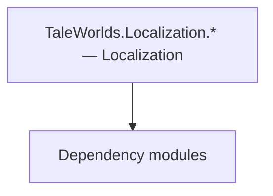

# TaleWorlds.Localization.* — Localization

**One-line responsibility:** This page covers all 53 business types under `TaleWorlds.Localization.* — Localization` as a family index, giving each type its namespace, responsibility, and typical timing so you can browse by module instead of alphabetically.

## Mental Model

TaleWorlds.Localization.* is the localization system: text processing, expression evaluation, and language processors that turn game strings into localized output. It is pure text infrastructure consumed by every UI string.

## When to Use

Use these when you need to format, localize, or evaluate UI/expressions; do not put gameplay rules here.

## Dependencies

The types under `TaleWorlds.Localization.* — Localization` depend on the following modules; missing any of them causes compile- or run-time failure.

- [API Overview](../../_index)

## Type Catalog

| Type | Namespace | Purpose | Timing |
| --- | --- | --- | --- |
| `DateRange` | TaleWorlds.Localization | A business type under this namespace that carries its derived convention responsibility. Confirm its lifecycle and owning system before calling; do not reference an unready instance at the wrong phase. World-state changes should go through the corresponding Action/Behavior, not direct field mutation. | Runtime |
| `LanguageData` | TaleWorlds.Localization | A business type under this namespace that carries its derived convention responsibility. Confirm its lifecycle and owning system before calling; do not reference an unready instance at the wrong phase. World-state changes should go through the corresponding Action/Behavior, not direct field mutation. | Runtime |
| `LocalizationException` | TaleWorlds.Localization | A business type under this namespace that carries its derived convention responsibility. Confirm its lifecycle and owning system before calling; do not reference an unready instance at the wrong phase. World-state changes should go through the corresponding Action/Behavior, not direct field mutation. | Runtime |
| `LocalizedTextManager` | TaleWorlds.Localization | A business type under this namespace that carries its derived convention responsibility. Confirm its lifecycle and owning system before calling; do not reference an unready instance at the wrong phase. World-state changes should go through the corresponding Action/Behavior, not direct field mutation. | Runtime |
| `LocalizedVoiceManager` | TaleWorlds.Localization | A business type under this namespace that carries its derived convention responsibility. Confirm its lifecycle and owning system before calling; do not reference an unready instance at the wrong phase. World-state changes should go through the corresponding Action/Behavior, not direct field mutation. | Runtime |
| `MBTextManager` | TaleWorlds.Localization | A business type under this namespace that carries its derived convention responsibility. Confirm its lifecycle and owning system before calling; do not reference an unready instance at the wrong phase. World-state changes should go through the corresponding Action/Behavior, not direct field mutation. | Runtime |
| `SaveableLocalizationTypeDefiner` | TaleWorlds.Localization | Save-type definer that declares which fields of the type enter the save. Any new field must carry a default value, otherwise old saves fail to deserialize. | Runtime |
| `TextObject` | TaleWorlds.Localization | A business type under this namespace that carries its derived convention responsibility. Confirm its lifecycle and owning system before calling; do not reference an unready instance at the wrong phase. World-state changes should go through the corresponding Action/Behavior, not direct field mutation. | Runtime |
| `VoiceObject` | TaleWorlds.Localization | A business type under this namespace that carries its derived convention responsibility. Confirm its lifecycle and owning system before calling; do not reference an unready instance at the wrong phase. World-state changes should go through the corresponding Action/Behavior, not direct field mutation. | Runtime |
| `ArithmeticExpression` | TaleWorlds.Localization.Expressions | A business type under this namespace that carries its derived convention responsibility. Confirm its lifecycle and owning system before calling; do not reference an unready instance at the wrong phase. World-state changes should go through the corresponding Action/Behavior, not direct field mutation. | Runtime |
| `ArithmeticOperation` | TaleWorlds.Localization.Expressions | A business type under this namespace that carries its derived convention responsibility. Confirm its lifecycle and owning system before calling; do not reference an unready instance at the wrong phase. World-state changes should go through the corresponding Action/Behavior, not direct field mutation. | Runtime |
| `ArrayReference` | TaleWorlds.Localization.Expressions | A business type under this namespace that carries its derived convention responsibility. Confirm its lifecycle and owning system before calling; do not reference an unready instance at the wrong phase. World-state changes should go through the corresponding Action/Behavior, not direct field mutation. | Runtime |
| `BooleanOperation` | TaleWorlds.Localization.Expressions | A business type under this namespace that carries its derived convention responsibility. Confirm its lifecycle and owning system before calling; do not reference an unready instance at the wrong phase. World-state changes should go through the corresponding Action/Behavior, not direct field mutation. | Runtime |
| `ComparisonExpression` | TaleWorlds.Localization.Expressions | A business type under this namespace that carries its derived convention responsibility. Confirm its lifecycle and owning system before calling; do not reference an unready instance at the wrong phase. World-state changes should go through the corresponding Action/Behavior, not direct field mutation. | Runtime |
| `ComparisonOperation` | TaleWorlds.Localization.Expressions | A business type under this namespace that carries its derived convention responsibility. Confirm its lifecycle and owning system before calling; do not reference an unready instance at the wrong phase. World-state changes should go through the corresponding Action/Behavior, not direct field mutation. | Runtime |
| `ConditionExpression` | TaleWorlds.Localization.Expressions | A business type under this namespace that carries its derived convention responsibility. Confirm its lifecycle and owning system before calling; do not reference an unready instance at the wrong phase. World-state changes should go through the corresponding Action/Behavior, not direct field mutation. | Runtime |
| `FieldExpression` | TaleWorlds.Localization.Expressions | A business type under this namespace that carries its derived convention responsibility. Confirm its lifecycle and owning system before calling; do not reference an unready instance at the wrong phase. World-state changes should go through the corresponding Action/Behavior, not direct field mutation. | Runtime |
| `FunctionCall` | TaleWorlds.Localization.Expressions | A business type under this namespace that carries its derived convention responsibility. Confirm its lifecycle and owning system before calling; do not reference an unready instance at the wrong phase. World-state changes should go through the corresponding Action/Behavior, not direct field mutation. | Runtime |
| `LangaugeMarkerExpression` | TaleWorlds.Localization.Expressions | A business type under this namespace that carries its derived convention responsibility. Confirm its lifecycle and owning system before calling; do not reference an unready instance at the wrong phase. World-state changes should go through the corresponding Action/Behavior, not direct field mutation. | Runtime |
| `MarkerOccuranceTextExpression` | TaleWorlds.Localization.Expressions | A business type under this namespace that carries its derived convention responsibility. Confirm its lifecycle and owning system before calling; do not reference an unready instance at the wrong phase. World-state changes should go through the corresponding Action/Behavior, not direct field mutation. | Runtime |
| `MultiStatement` | TaleWorlds.Localization.Expressions | A business type under this namespace that carries its derived convention responsibility. Confirm its lifecycle and owning system before calling; do not reference an unready instance at the wrong phase. World-state changes should go through the corresponding Action/Behavior, not direct field mutation. | Runtime |
| `NumeralExpression` | TaleWorlds.Localization.Expressions | A business type under this namespace that carries its derived convention responsibility. Confirm its lifecycle and owning system before calling; do not reference an unready instance at the wrong phase. World-state changes should go through the corresponding Action/Behavior, not direct field mutation. | Runtime |
| `ParameterWithAttributeExpression` | TaleWorlds.Localization.Expressions | Parameter container carrying configuration or runtime data. Avoid holding long-lived references that hinder GC. | Runtime |
| `ParanthesisExpression` | TaleWorlds.Localization.Expressions | A business type under this namespace that carries its derived convention responsibility. Confirm its lifecycle and owning system before calling; do not reference an unready instance at the wrong phase. World-state changes should go through the corresponding Action/Behavior, not direct field mutation. | Runtime |
| `QualifiedIdentifierExpression` | TaleWorlds.Localization.Expressions | A business type under this namespace that carries its derived convention responsibility. Confirm its lifecycle and owning system before calling; do not reference an unready instance at the wrong phase. World-state changes should go through the corresponding Action/Behavior, not direct field mutation. | Runtime |
| `SelectionExpression` | TaleWorlds.Localization.Expressions | Election / voting mechanism used for collective decisions such as kingdom votes. Mind voting timing and tie handling. | Runtime |
| `SimpleExpression` | TaleWorlds.Localization.Expressions | A business type under this namespace that carries its derived convention responsibility. Confirm its lifecycle and owning system before calling; do not reference an unready instance at the wrong phase. World-state changes should go through the corresponding Action/Behavior, not direct field mutation. | Runtime |
| `SimpleNumberExpression` | TaleWorlds.Localization.Expressions | A business type under this namespace that carries its derived convention responsibility. Confirm its lifecycle and owning system before calling; do not reference an unready instance at the wrong phase. World-state changes should go through the corresponding Action/Behavior, not direct field mutation. | Runtime |
| `SimpleText` | TaleWorlds.Localization.Expressions | A business type under this namespace that carries its derived convention responsibility. Confirm its lifecycle and owning system before calling; do not reference an unready instance at the wrong phase. World-state changes should go through the corresponding Action/Behavior, not direct field mutation. | Runtime |
| `SimpleToken` | TaleWorlds.Localization.Expressions | A business type under this namespace that carries its derived convention responsibility. Confirm its lifecycle and owning system before calling; do not reference an unready instance at the wrong phase. World-state changes should go through the corresponding Action/Behavior, not direct field mutation. | Runtime |
| `StartsWithExpression` | TaleWorlds.Localization.Expressions | A business type under this namespace that carries its derived convention responsibility. Confirm its lifecycle and owning system before calling; do not reference an unready instance at the wrong phase. World-state changes should go through the corresponding Action/Behavior, not direct field mutation. | Runtime |
| `TextExpression` | TaleWorlds.Localization.Expressions | A business type under this namespace that carries its derived convention responsibility. Confirm its lifecycle and owning system before calling; do not reference an unready instance at the wrong phase. World-state changes should go through the corresponding Action/Behavior, not direct field mutation. | Runtime |
| `TextIdExpression` | TaleWorlds.Localization.Expressions | A business type under this namespace that carries its derived convention responsibility. Confirm its lifecycle and owning system before calling; do not reference an unready instance at the wrong phase. World-state changes should go through the corresponding Action/Behavior, not direct field mutation. | Runtime |
| `VariableExpression` | TaleWorlds.Localization.Expressions | A business type under this namespace that carries its derived convention responsibility. Confirm its lifecycle and owning system before calling; do not reference an unready instance at the wrong phase. World-state changes should go through the corresponding Action/Behavior, not direct field mutation. | Runtime |
| `CaseInsensitiveComparer` | TaleWorlds.Localization.TextProcessor | A business type under this namespace that carries its derived convention responsibility. Confirm its lifecycle and owning system before calling; do not reference an unready instance at the wrong phase. World-state changes should go through the corresponding Action/Behavior, not direct field mutation. | Runtime |
| `DefaultTextProcessor` | TaleWorlds.Localization.TextProcessor | A business type under this namespace that carries its derived convention responsibility. Confirm its lifecycle and owning system before calling; do not reference an unready instance at the wrong phase. World-state changes should go through the corresponding Action/Behavior, not direct field mutation. | Runtime |
| `LanguageSpecificTextProcessor` | TaleWorlds.Localization.TextProcessor | A business type under this namespace that carries its derived convention responsibility. Confirm its lifecycle and owning system before calling; do not reference an unready instance at the wrong phase. World-state changes should go through the corresponding Action/Behavior, not direct field mutation. | Runtime |
| `MBTextModel` | TaleWorlds.Localization.TextProcessor | Domain model that aggregates rules and calculations for Behaviors to call. When you replace a model you must provide an equivalent contract; an empty replacement hands null to its dependents. | Runtime |
| `MBTextParser` | TaleWorlds.Localization.TextProcessor | A business type under this namespace that carries its derived convention responsibility. Confirm its lifecycle and owning system before calling; do not reference an unready instance at the wrong phase. World-state changes should go through the corresponding Action/Behavior, not direct field mutation. | Runtime |
| `MBTextToken` | TaleWorlds.Localization.TextProcessor | A business type under this namespace that carries its derived convention responsibility. Confirm its lifecycle and owning system before calling; do not reference an unready instance at the wrong phase. World-state changes should go through the corresponding Action/Behavior, not direct field mutation. | Runtime |
| `TextGrammarProcessor` | TaleWorlds.Localization.TextProcessor | A business type under this namespace that carries its derived convention responsibility. Confirm its lifecycle and owning system before calling; do not reference an unready instance at the wrong phase. World-state changes should go through the corresponding Action/Behavior, not direct field mutation. | Runtime |
| `TextProcessingContext` | TaleWorlds.Localization.TextProcessor | A business type under this namespace that carries its derived convention responsibility. Confirm its lifecycle and owning system before calling; do not reference an unready instance at the wrong phase. World-state changes should go through the corresponding Action/Behavior, not direct field mutation. | Runtime |
| `TokenDefinition` | TaleWorlds.Localization.TextProcessor | A business type under this namespace that carries its derived convention responsibility. Confirm its lifecycle and owning system before calling; do not reference an unready instance at the wrong phase. World-state changes should go through the corresponding Action/Behavior, not direct field mutation. | Runtime |
| `Tokenizer` | TaleWorlds.Localization.TextProcessor | A business type under this namespace that carries its derived convention responsibility. Confirm its lifecycle and owning system before calling; do not reference an unready instance at the wrong phase. World-state changes should go through the corresponding Action/Behavior, not direct field mutation. | Runtime |
| `TokenType` | TaleWorlds.Localization.TextProcessor | A business type under this namespace that carries its derived convention responsibility. Confirm its lifecycle and owning system before calling; do not reference an unready instance at the wrong phase. World-state changes should go through the corresponding Action/Behavior, not direct field mutation. | Runtime |
| `EnglishTextProcessor` | TaleWorlds.Localization.TextProcessor.LanguageProcessors | A business type under this namespace that carries its derived convention responsibility. Confirm its lifecycle and owning system before calling; do not reference an unready instance at the wrong phase. World-state changes should go through the corresponding Action/Behavior, not direct field mutation. | Runtime |
| `FrenchTextProcessor` | TaleWorlds.Localization.TextProcessor.LanguageProcessors | A business type under this namespace that carries its derived convention responsibility. Confirm its lifecycle and owning system before calling; do not reference an unready instance at the wrong phase. World-state changes should go through the corresponding Action/Behavior, not direct field mutation. | Runtime |
| `GermanTextProcessor` | TaleWorlds.Localization.TextProcessor.LanguageProcessors | A business type under this namespace that carries its derived convention responsibility. Confirm its lifecycle and owning system before calling; do not reference an unready instance at the wrong phase. World-state changes should go through the corresponding Action/Behavior, not direct field mutation. | Runtime |
| `ItalianTextProcessor` | TaleWorlds.Localization.TextProcessor.LanguageProcessors | A business type under this namespace that carries its derived convention responsibility. Confirm its lifecycle and owning system before calling; do not reference an unready instance at the wrong phase. World-state changes should go through the corresponding Action/Behavior, not direct field mutation. | Runtime |
| `PolishTextProcessor` | TaleWorlds.Localization.TextProcessor.LanguageProcessors | A business type under this namespace that carries its derived convention responsibility. Confirm its lifecycle and owning system before calling; do not reference an unready instance at the wrong phase. World-state changes should go through the corresponding Action/Behavior, not direct field mutation. | Runtime |
| `RussianTextProcessor` | TaleWorlds.Localization.TextProcessor.LanguageProcessors | A business type under this namespace that carries its derived convention responsibility. Confirm its lifecycle and owning system before calling; do not reference an unready instance at the wrong phase. World-state changes should go through the corresponding Action/Behavior, not direct field mutation. | Runtime |
| `SpanishTextProcessor` | TaleWorlds.Localization.TextProcessor.LanguageProcessors | A business type under this namespace that carries its derived convention responsibility. Confirm its lifecycle and owning system before calling; do not reference an unready instance at the wrong phase. World-state changes should go through the corresponding Action/Behavior, not direct field mutation. | Runtime |
| `TurkishTextProcessor` | TaleWorlds.Localization.TextProcessor.LanguageProcessors | A business type under this namespace that carries its derived convention responsibility. Confirm its lifecycle and owning system before calling; do not reference an unready instance at the wrong phase. World-state changes should go through the corresponding Action/Behavior, not direct field mutation. | Runtime |

## Risk & Boundaries

Localization is global and performance-sensitive (called per string); keep processors lightweight. Missing language data yields empty strings — guard displays.

## See Also

- [API Overview](../../_index)
