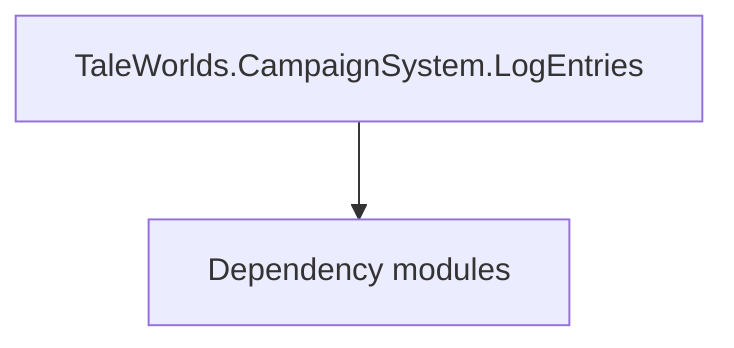

# TaleWorlds.CampaignSystem.LogEntries

**One-line responsibility:** This page covers all 56 business types under `TaleWorlds.CampaignSystem.LogEntries` as a family index, giving each type its namespace, responsibility, and typical timing so you can browse by module instead of alphabetically.

## Mental Model

LogEntries are the structured records shown in the campaign log (battles, marriages, policy changes, etc.). They are pure display data produced by Behaviors/Actions and carry no rules; the triggering logic lives elsewhere.

## When to Use

When an Action or Behavior should leave a traceable record in the player’s log, emit the corresponding LogEntry.

## Dependencies

The types under `TaleWorlds.CampaignSystem.LogEntries` depend on the following modules; missing any of them causes compile- or run-time failure.

- [Campaign](../../campaign/Campaign)
- [API Overview](../../_index)

## Type Catalog

| Type | Namespace | Purpose | Timing |
| --- | --- | --- | --- |
| `ArmyCreationLogEntry` | TaleWorlds.CampaignSystem.LogEntries | A business type under this namespace that carries its derived convention responsibility. Confirm its lifecycle and owning system before calling; do not reference an unready instance at the wrong phase. World-state changes should go through the corresponding Action/Behavior, not direct field mutation. | Campaign init |
| `ArmyDispersionLogEntry` | TaleWorlds.CampaignSystem.LogEntries | A business type under this namespace that carries its derived convention responsibility. Confirm its lifecycle and owning system before calling; do not reference an unready instance at the wrong phase. World-state changes should go through the corresponding Action/Behavior, not direct field mutation. | Campaign init |
| `BattleStartedLogEntry` | TaleWorlds.CampaignSystem.LogEntries | A business type under this namespace that carries its derived convention responsibility. Confirm its lifecycle and owning system before calling; do not reference an unready instance at the wrong phase. World-state changes should go through the corresponding Action/Behavior, not direct field mutation. | Campaign init |
| `BesiegeSettlementLogEntry` | TaleWorlds.CampaignSystem.LogEntries | A business type under this namespace that carries its derived convention responsibility. Confirm its lifecycle and owning system before calling; do not reference an unready instance at the wrong phase. World-state changes should go through the corresponding Action/Behavior, not direct field mutation. | Campaign init |
| `ChangeAlleyOwnerLogEntry` | TaleWorlds.CampaignSystem.LogEntries | A business type under this namespace that carries its derived convention responsibility. Confirm its lifecycle and owning system before calling; do not reference an unready instance at the wrong phase. World-state changes should go through the corresponding Action/Behavior, not direct field mutation. | Campaign init |
| `ChangeRomanticStateLogEntry` | TaleWorlds.CampaignSystem.LogEntries | A business type under this namespace that carries its derived convention responsibility. Confirm its lifecycle and owning system before calling; do not reference an unready instance at the wrong phase. World-state changes should go through the corresponding Action/Behavior, not direct field mutation. | Campaign init |
| `ChangeSettlementOwnerLogEntry` | TaleWorlds.CampaignSystem.LogEntries | A business type under this namespace that carries its derived convention responsibility. Confirm its lifecycle and owning system before calling; do not reference an unready instance at the wrong phase. World-state changes should go through the corresponding Action/Behavior, not direct field mutation. | Campaign init |
| `CharacterBecameFugitiveLogEntry` | TaleWorlds.CampaignSystem.LogEntries | A business type under this namespace that carries its derived convention responsibility. Confirm its lifecycle and owning system before calling; do not reference an unready instance at the wrong phase. World-state changes should go through the corresponding Action/Behavior, not direct field mutation. | Campaign init |
| `CharacterBornLogEntry` | TaleWorlds.CampaignSystem.LogEntries | A business type under this namespace that carries its derived convention responsibility. Confirm its lifecycle and owning system before calling; do not reference an unready instance at the wrong phase. World-state changes should go through the corresponding Action/Behavior, not direct field mutation. | Campaign init |
| `CharacterInsultedLogEntry` | TaleWorlds.CampaignSystem.LogEntries | A business type under this namespace that carries its derived convention responsibility. Confirm its lifecycle and owning system before calling; do not reference an unready instance at the wrong phase. World-state changes should go through the corresponding Action/Behavior, not direct field mutation. | Campaign init |
| `CharacterKilledLogEntry` | TaleWorlds.CampaignSystem.LogEntries | A business type under this namespace that carries its derived convention responsibility. Confirm its lifecycle and owning system before calling; do not reference an unready instance at the wrong phase. World-state changes should go through the corresponding Action/Behavior, not direct field mutation. | Campaign init |
| `CharacterMarriedLogEntry` | TaleWorlds.CampaignSystem.LogEntries | A business type under this namespace that carries its derived convention responsibility. Confirm its lifecycle and owning system before calling; do not reference an unready instance at the wrong phase. World-state changes should go through the corresponding Action/Behavior, not direct field mutation. | Campaign init |
| `ChatNotificationType` | TaleWorlds.CampaignSystem.LogEntries | Notification item type describing the data of one map/event prompt. It only carries display data; triggering logic lives in the Behavior. | Campaign init |
| `ChildbirthLogEntry` | TaleWorlds.CampaignSystem.LogEntries | A business type under this namespace that carries its derived convention responsibility. Confirm its lifecycle and owning system before calling; do not reference an unready instance at the wrong phase. World-state changes should go through the corresponding Action/Behavior, not direct field mutation. | Campaign init |
| `ClanChangeKingdomLogEntry` | TaleWorlds.CampaignSystem.LogEntries | A business type under this namespace that carries its derived convention responsibility. Confirm its lifecycle and owning system before calling; do not reference an unready instance at the wrong phase. World-state changes should go through the corresponding Action/Behavior, not direct field mutation. | Campaign init |
| `ClanDestroyedLogEntry` | TaleWorlds.CampaignSystem.LogEntries | A business type under this namespace that carries its derived convention responsibility. Confirm its lifecycle and owning system before calling; do not reference an unready instance at the wrong phase. World-state changes should go through the corresponding Action/Behavior, not direct field mutation. | Campaign init |
| `ClanLeaderChangedLogEntry` | TaleWorlds.CampaignSystem.LogEntries | A business type under this namespace that carries its derived convention responsibility. Confirm its lifecycle and owning system before calling; do not reference an unready instance at the wrong phase. World-state changes should go through the corresponding Action/Behavior, not direct field mutation. | Campaign init |
| `CommonAreaFightLogEntry` | TaleWorlds.CampaignSystem.LogEntries | A business type under this namespace that carries its derived convention responsibility. Confirm its lifecycle and owning system before calling; do not reference an unready instance at the wrong phase. World-state changes should go through the corresponding Action/Behavior, not direct field mutation. | Campaign init |
| `DeclareWarLogEntry` | TaleWorlds.CampaignSystem.LogEntries | A business type under this namespace that carries its derived convention responsibility. Confirm its lifecycle and owning system before calling; do not reference an unready instance at the wrong phase. World-state changes should go through the corresponding Action/Behavior, not direct field mutation. | Campaign init |
| `DefeatCharacterLogEntry` | TaleWorlds.CampaignSystem.LogEntries | A business type under this namespace that carries its derived convention responsibility. Confirm its lifecycle and owning system before calling; do not reference an unready instance at the wrong phase. World-state changes should go through the corresponding Action/Behavior, not direct field mutation. | Campaign init |
| `DestroyMobilePartyLogEntry` | TaleWorlds.CampaignSystem.LogEntries | A business type under this namespace that carries its derived convention responsibility. Confirm its lifecycle and owning system before calling; do not reference an unready instance at the wrong phase. World-state changes should go through the corresponding Action/Behavior, not direct field mutation. | Campaign init |
| `EndAllianceLogEntry` | TaleWorlds.CampaignSystem.LogEntries | A business type under this namespace that carries its derived convention responsibility. Confirm its lifecycle and owning system before calling; do not reference an unready instance at the wrong phase. World-state changes should go through the corresponding Action/Behavior, not direct field mutation. | Campaign init |
| `EndCallToWarAgreementLogEntry` | TaleWorlds.CampaignSystem.LogEntries | A business type under this namespace that carries its derived convention responsibility. Confirm its lifecycle and owning system before calling; do not reference an unready instance at the wrong phase. World-state changes should go through the corresponding Action/Behavior, not direct field mutation. | Campaign init |
| `EndCaptivityLogEntry` | TaleWorlds.CampaignSystem.LogEntries | A business type under this namespace that carries its derived convention responsibility. Confirm its lifecycle and owning system before calling; do not reference an unready instance at the wrong phase. World-state changes should go through the corresponding Action/Behavior, not direct field mutation. | Campaign init |
| `GatherArmyLogEntry` | TaleWorlds.CampaignSystem.LogEntries | A business type under this namespace that carries its derived convention responsibility. Confirm its lifecycle and owning system before calling; do not reference an unready instance at the wrong phase. World-state changes should go through the corresponding Action/Behavior, not direct field mutation. | Campaign init |
| `IChatNotification` | TaleWorlds.CampaignSystem.LogEntries | Notification item type describing the data of one map/event prompt. It only carries display data; triggering logic lives in the Behavior. | Campaign init |
| `IEncyclopediaLog` | TaleWorlds.CampaignSystem.LogEntries | A business type under this namespace that carries its derived convention responsibility. Confirm its lifecycle and owning system before calling; do not reference an unready instance at the wrong phase. World-state changes should go through the corresponding Action/Behavior, not direct field mutation. | Campaign init |
| `ImportanceEnum` | TaleWorlds.CampaignSystem.LogEntries | A business type under this namespace that carries its derived convention responsibility. Confirm its lifecycle and owning system before calling; do not reference an unready instance at the wrong phase. World-state changes should go through the corresponding Action/Behavior, not direct field mutation. | Campaign init |
| `IssueQuestLogEntry` | TaleWorlds.CampaignSystem.LogEntries | Issue (lord/fief affair) related type describing an accept-and-settle fief problem. Completion must be idempotent. | Campaign init |
| `IssueQuestStartLogEntry` | TaleWorlds.CampaignSystem.LogEntries | Issue (lord/fief affair) related type describing an accept-and-settle fief problem. Completion must be idempotent. | Campaign init |
| `IWarLog` | TaleWorlds.CampaignSystem.LogEntries | A business type under this namespace that carries its derived convention responsibility. Confirm its lifecycle and owning system before calling; do not reference an unready instance at the wrong phase. World-state changes should go through the corresponding Action/Behavior, not direct field mutation. | Campaign init |
| `JournalLogEntry` | TaleWorlds.CampaignSystem.LogEntries | A business type under this namespace that carries its derived convention responsibility. Confirm its lifecycle and owning system before calling; do not reference an unready instance at the wrong phase. World-state changes should go through the corresponding Action/Behavior, not direct field mutation. | Campaign init |
| `KingdomDecisionAddedLogEntry` | TaleWorlds.CampaignSystem.LogEntries | A business type under this namespace that carries its derived convention responsibility. Confirm its lifecycle and owning system before calling; do not reference an unready instance at the wrong phase. World-state changes should go through the corresponding Action/Behavior, not direct field mutation. | Campaign init |
| `KingdomDecisionConcludedLogEntry` | TaleWorlds.CampaignSystem.LogEntries | A business type under this namespace that carries its derived convention responsibility. Confirm its lifecycle and owning system before calling; do not reference an unready instance at the wrong phase. World-state changes should go through the corresponding Action/Behavior, not direct field mutation. | Campaign init |
| `KingdomDestroyedLogEntry` | TaleWorlds.CampaignSystem.LogEntries | A business type under this namespace that carries its derived convention responsibility. Confirm its lifecycle and owning system before calling; do not reference an unready instance at the wrong phase. World-state changes should go through the corresponding Action/Behavior, not direct field mutation. | Campaign init |
| `LogEntry` | TaleWorlds.CampaignSystem.LogEntries | A business type under this namespace that carries its derived convention responsibility. Confirm its lifecycle and owning system before calling; do not reference an unready instance at the wrong phase. World-state changes should go through the corresponding Action/Behavior, not direct field mutation. | Campaign init |
| `LogEntryHistory` | TaleWorlds.CampaignSystem.LogEntries | A business type under this namespace that carries its derived convention responsibility. Confirm its lifecycle and owning system before calling; do not reference an unready instance at the wrong phase. World-state changes should go through the corresponding Action/Behavior, not direct field mutation. | Campaign init |
| `MakePeaceLogEntry` | TaleWorlds.CampaignSystem.LogEntries | A business type under this namespace that carries its derived convention responsibility. Confirm its lifecycle and owning system before calling; do not reference an unready instance at the wrong phase. World-state changes should go through the corresponding Action/Behavior, not direct field mutation. | Campaign init |
| `MercenaryClanChangedKingdomLogEntry` | TaleWorlds.CampaignSystem.LogEntries | A business type under this namespace that carries its derived convention responsibility. Confirm its lifecycle and owning system before calling; do not reference an unready instance at the wrong phase. World-state changes should go through the corresponding Action/Behavior, not direct field mutation. | Campaign init |
| `OverruleInfluenceLogEntry` | TaleWorlds.CampaignSystem.LogEntries | A business type under this namespace that carries its derived convention responsibility. Confirm its lifecycle and owning system before calling; do not reference an unready instance at the wrong phase. World-state changes should go through the corresponding Action/Behavior, not direct field mutation. | Campaign init |
| `PlayerAttackAlleyLogEntry` | TaleWorlds.CampaignSystem.LogEntries | A business type under this namespace that carries its derived convention responsibility. Confirm its lifecycle and owning system before calling; do not reference an unready instance at the wrong phase. World-state changes should go through the corresponding Action/Behavior, not direct field mutation. | Campaign init |
| `PlayerBattleEndedLogEntry` | TaleWorlds.CampaignSystem.LogEntries | A business type under this namespace that carries its derived convention responsibility. Confirm its lifecycle and owning system before calling; do not reference an unready instance at the wrong phase. World-state changes should go through the corresponding Action/Behavior, not direct field mutation. | Campaign init |
| `PlayerCharacterChangedLogEntry` | TaleWorlds.CampaignSystem.LogEntries | A business type under this namespace that carries its derived convention responsibility. Confirm its lifecycle and owning system before calling; do not reference an unready instance at the wrong phase. World-state changes should go through the corresponding Action/Behavior, not direct field mutation. | Campaign init |
| `PlayerMeetLordLogEntry` | TaleWorlds.CampaignSystem.LogEntries | A business type under this namespace that carries its derived convention responsibility. Confirm its lifecycle and owning system before calling; do not reference an unready instance at the wrong phase. World-state changes should go through the corresponding Action/Behavior, not direct field mutation. | Campaign init |
| `PlayerReputationChangesLogEntry` | TaleWorlds.CampaignSystem.LogEntries | A business type under this namespace that carries its derived convention responsibility. Confirm its lifecycle and owning system before calling; do not reference an unready instance at the wrong phase. World-state changes should go through the corresponding Action/Behavior, not direct field mutation. | Campaign init |
| `PlayerRetiredLogEntry` | TaleWorlds.CampaignSystem.LogEntries | A business type under this namespace that carries its derived convention responsibility. Confirm its lifecycle and owning system before calling; do not reference an unready instance at the wrong phase. World-state changes should go through the corresponding Action/Behavior, not direct field mutation. | Campaign init |
| `PregnancyLogEntry` | TaleWorlds.CampaignSystem.LogEntries | A business type under this namespace that carries its derived convention responsibility. Confirm its lifecycle and owning system before calling; do not reference an unready instance at the wrong phase. World-state changes should go through the corresponding Action/Behavior, not direct field mutation. | Campaign init |
| `RebellionStartedLogEntry` | TaleWorlds.CampaignSystem.LogEntries | A business type under this namespace that carries its derived convention responsibility. Confirm its lifecycle and owning system before calling; do not reference an unready instance at the wrong phase. World-state changes should go through the corresponding Action/Behavior, not direct field mutation. | Campaign init |
| `SettlementClaimedLogEntry` | TaleWorlds.CampaignSystem.LogEntries | AI decision implementation that must be interruptible and serializable to support saving and undo. Search must be depth/time bounded to avoid stalls. | Campaign init |
| `SiegeAftermathLogEntry` | TaleWorlds.CampaignSystem.LogEntries | A business type under this namespace that carries its derived convention responsibility. Confirm its lifecycle and owning system before calling; do not reference an unready instance at the wrong phase. World-state changes should go through the corresponding Action/Behavior, not direct field mutation. | Campaign init |
| `StartAllianceLogEntry` | TaleWorlds.CampaignSystem.LogEntries | A business type under this namespace that carries its derived convention responsibility. Confirm its lifecycle and owning system before calling; do not reference an unready instance at the wrong phase. World-state changes should go through the corresponding Action/Behavior, not direct field mutation. | Campaign init |
| `StartCallToWarAgreementLogEntry` | TaleWorlds.CampaignSystem.LogEntries | A business type under this namespace that carries its derived convention responsibility. Confirm its lifecycle and owning system before calling; do not reference an unready instance at the wrong phase. World-state changes should go through the corresponding Action/Behavior, not direct field mutation. | Campaign init |
| `TakePrisonerLogEntry` | TaleWorlds.CampaignSystem.LogEntries | A business type under this namespace that carries its derived convention responsibility. Confirm its lifecycle and owning system before calling; do not reference an unready instance at the wrong phase. World-state changes should go through the corresponding Action/Behavior, not direct field mutation. | Campaign init |
| `TournamentWonLogEntry` | TaleWorlds.CampaignSystem.LogEntries | Tournament-related type organizing event sign-up, brackets and reward settlement. State must be serializable. | Campaign init |
| `TradeAgreementLogEntry` | TaleWorlds.CampaignSystem.LogEntries | A business type under this namespace that carries its derived convention responsibility. Confirm its lifecycle and owning system before calling; do not reference an unready instance at the wrong phase. World-state changes should go through the corresponding Action/Behavior, not direct field mutation. | Campaign init |
| `VillageStateChangedLogEntry` | TaleWorlds.CampaignSystem.LogEntries | A business type under this namespace that carries its derived convention responsibility. Confirm its lifecycle and owning system before calling; do not reference an unready instance at the wrong phase. World-state changes should go through the corresponding Action/Behavior, not direct field mutation. | Campaign init |

## Risk & Boundaries

LogEntries are display-only; do not put gameplay state or logic inside them. They must be serializable so the log survives saves.

## See Also

- [Campaign](../../campaign/Campaign)
- [API Overview](../../_index)
