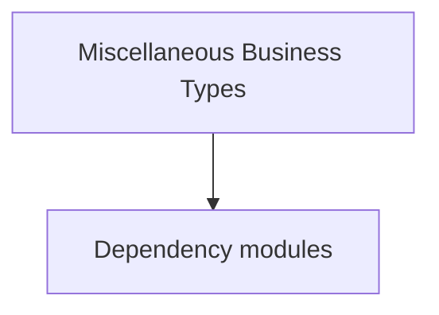

# Miscellaneous Business Types

**One-line responsibility:** This page covers all 267 business types under `Miscellaneous Business Types` as a family index, giving each type its namespace, responsibility, and typical timing so you can browse by module instead of alphabetically.

## Mental Model

This page covers the scattered business types not grouped into a dedicated topic. They belong to different subsystems (views, UI, missions, platform) and each carries its derived convention responsibility. Confirm the owning system’s lifecycle and dependencies before use; do not reference an unready instance at the wrong phase, and route world-state changes through the corresponding Action/Behavior rather than direct field mutation.

## When to Use

Locate the concrete subsystem by type name and namespace, then use it from there; core gameplay rules still live in the Campaign/Mission subsystems.

## Dependencies

The types under `Miscellaneous Business Types` depend on the following modules; missing any of them causes compile- or run-time failure.

- [Campaign](../../campaign/Campaign)
- [Mission](../../mission/Mission)
- [API Overview](../../_index)

## Type Catalog

| Type | Namespace | Purpose | Timing |
| --- | --- | --- | --- |
| `PreloadState` | Sandbox.View.GameStates | A business type under this namespace that carries its derived convention responsibility. Confirm its lifecycle and owning system before calling; do not reference an unready instance at the wrong phase. World-state changes should go through the corresponding Action/Behavior, not direct field mutation. | Campaign init |
| `Extensions` | StoryMode.Extensions | A business type under this namespace that carries its derived convention responsibility. Confirm its lifecycle and owning system before calling; do not reference an unready instance at the wrong phase. World-state changes should go through the corresponding Action/Behavior, not direct field mutation. | During story progress |
| `MetaDataExtensions` | StoryMode.Extensions | A business type under this namespace that carries its derived convention responsibility. Confirm its lifecycle and owning system before calling; do not reference an unready instance at the wrong phase. World-state changes should go through the corresponding Action/Behavior, not direct field mutation. | During story progress |
| `StoryModeGauntletUISubModule` | StoryMode.GauntletUI | Module entry base class that registers behaviors and override points. Its lifetime spans the whole session; do not fetch systems that are not yet ready (e.g. before loading) at the wrong phase. | On UI open |
| `GauntletStoryModeMapCheatsView` | StoryMode.GauntletUI.Map | Debug cheat item triggered via console or menu for development-time effects. Production builds should disable or stub it to avoid accidentally corrupting saves. | On UI open |
| `MissionGauntletTrainingFieldObjectiveView` | StoryMode.GauntletUI.Missions | Battle-scene visual view that subscribes to Mission events and refreshes the presentation layer (camera, VFX, HUD overlays) from game state every tick. Views read state and never write rules. | On battle/mission load |
| `DelayedAction` | StoryMode.Missions | Game action that encapsulates a single state change and executes it through the Action system. You must use Apply rather than mutating fields directly, otherwise you skip event cascades and corrupt saves. | On battle/mission load |
| `MouseObjectives` | StoryMode.Missions | A business type under this namespace that carries its derived convention responsibility. Confirm its lifecycle and owning system before calling; do not reference an unready instance at the wrong phase. World-state changes should go through the corresponding Action/Behavior, not direct field mutation. | On battle/mission load |
| `ObjectivePerformingType` | StoryMode.Missions | A business type under this namespace that carries its derived convention responsibility. Confirm its lifecycle and owning system before calling; do not reference an unready instance at the wrong phase. World-state changes should go through the corresponding Action/Behavior, not direct field mutation. | On battle/mission load |
| `StoryModeMissions` | StoryMode.Missions | A business type under this namespace that carries its derived convention responsibility. Confirm its lifecycle and owning system before calling; do not reference an unready instance at the wrong phase. World-state changes should go through the corresponding Action/Behavior, not direct field mutation. | On battle/mission load |
| `TrainingFieldMissionController` | StoryMode.Missions | Mission logic that defines the flow and win/lose conditions of that mission, assembled by the Mission on load. Win/lose resolution must be idempotent — repeated triggers must not double-settle. | On battle/mission load |
| `TutorialObjective` | StoryMode.Missions | A business type under this namespace that carries its derived convention responsibility. Confirm its lifecycle and owning system before calling; do not reference an unready instance at the wrong phase. World-state changes should go through the corresponding Action/Behavior, not direct field mutation. | On battle/mission load |
| `StoryModeBannerEffects` | StoryMode.StoryModeObjects | A business type under this namespace that carries its derived convention responsibility. Confirm its lifecycle and owning system before calling; do not reference an unready instance at the wrong phase. World-state changes should go through the corresponding Action/Behavior, not direct field mutation. | During story progress |
| `StoryModeHeroes` | StoryMode.StoryModeObjects | A business type under this namespace that carries its derived convention responsibility. Confirm its lifecycle and owning system before calling; do not reference an unready instance at the wrong phase. World-state changes should go through the corresponding Action/Behavior, not direct field mutation. | During story progress |
| `FirstPhase` | StoryMode.StoryModePhases | A business type under this namespace that carries its derived convention responsibility. Confirm its lifecycle and owning system before calling; do not reference an unready instance at the wrong phase. World-state changes should go through the corresponding Action/Behavior, not direct field mutation. | During story progress |
| `SecondPhase` | StoryMode.StoryModePhases | A business type under this namespace that carries its derived convention responsibility. Confirm its lifecycle and owning system before calling; do not reference an unready instance at the wrong phase. World-state changes should go through the corresponding Action/Behavior, not direct field mutation. | During story progress |
| `ThirdPhase` | StoryMode.StoryModePhases | A business type under this namespace that carries its derived convention responsibility. Confirm its lifecycle and owning system before calling; do not reference an unready instance at the wrong phase. World-state changes should go through the corresponding Action/Behavior, not direct field mutation. | During story progress |
| `TutorialPhase` | StoryMode.StoryModePhases | A business type under this namespace that carries its derived convention responsibility. Confirm its lifecycle and owning system before calling; do not reference an unready instance at the wrong phase. World-state changes should go through the corresponding Action/Behavior, not direct field mutation. | During story progress |
| `TutorialQuestPhase` | StoryMode.StoryModePhases | A business type under this namespace that carries its derived convention responsibility. Confirm its lifecycle and owning system before calling; do not reference an unready instance at the wrong phase. World-state changes should go through the corresponding Action/Behavior, not direct field mutation. | During story progress |
| `StoryModeViewCreator` | StoryMode.View | A business type under this namespace that carries its derived convention responsibility. Confirm its lifecycle and owning system before calling; do not reference an unready instance at the wrong phase. World-state changes should go through the corresponding Action/Behavior, not direct field mutation. | On UI open |
| `StoryModeViewSubModule` | StoryMode.View | Module entry base class that registers behaviors and override points. Its lifetime spans the whole session; do not fetch systems that are not yet ready (e.g. before loading) at the wrong phase. | On UI open |
| `StealthTutorialMarkerProvider` | StoryMode.View.MarkerProviders | Gauntlet image-source abstraction that resolves an entity/concept into an actual texture and caches it. The first frame may be empty; handle the loading state. | On UI open |
| `MissionTrainingFieldObjectiveView` | StoryMode.View.Missions | Battle-scene visual view that subscribes to Mission events and refreshes the presentation layer (camera, VFX, HUD overlays) from game state every tick. Views read state and never write rules. | On battle/mission load |
| `StealthTutorialView` | StoryMode.View.Missions | Battle-scene visual view that subscribes to Mission events and refreshes the presentation layer (camera, VFX, HUD overlays) from game state every tick. Views read state and never write rules. | On battle/mission load |
| `StoryModeMissionViews` | StoryMode.View.Missions | Battle-scene visual view that subscribes to Mission events and refreshes the presentation layer (camera, VFX, HUD overlays) from game state every tick. Views read state and never write rules. | On battle/mission load |
| `StoryModePermissionsSystem` | StoryMode.View.Permissions | A business type under this namespace that carries its derived convention responsibility. Confirm its lifecycle and owning system before calling; do not reference an unready instance at the wrong phase. World-state changes should go through the corresponding Action/Behavior, not direct field mutation. | On battle/mission load |
| `ConspiracyQuestMapNotificationItemVM` | StoryMode.ViewModelCollection.Map | Gauntlet UI data view-model that exposes properties and commands to the interface, reacts to input and notifies refreshes. A VM is only a projection of state; commands should only trigger Actions or Behaviors. | On UI open |
| `ControllerStickInput` | StoryMode.ViewModelCollection.Missions | A business type under this namespace that carries its derived convention responsibility. Confirm its lifecycle and owning system before calling; do not reference an unready instance at the wrong phase. World-state changes should go through the corresponding Action/Behavior, not direct field mutation. | On battle/mission load |
| `InputTypes` | StoryMode.ViewModelCollection.Missions | A business type under this namespace that carries its derived convention responsibility. Confirm its lifecycle and owning system before calling; do not reference an unready instance at the wrong phase. World-state changes should go through the corresponding Action/Behavior, not direct field mutation. | On battle/mission load |
| `KeyInput` | StoryMode.ViewModelCollection.Missions | A business type under this namespace that carries its derived convention responsibility. Confirm its lifecycle and owning system before calling; do not reference an unready instance at the wrong phase. World-state changes should go through the corresponding Action/Behavior, not direct field mutation. | On battle/mission load |
| `MouseAndClickInput` | StoryMode.ViewModelCollection.Missions | A business type under this namespace that carries its derived convention responsibility. Confirm its lifecycle and owning system before calling; do not reference an unready instance at the wrong phase. World-state changes should go through the corresponding Action/Behavior, not direct field mutation. | On battle/mission load |
| `MouseClickTypes` | StoryMode.ViewModelCollection.Missions | A business type under this namespace that carries its derived convention responsibility. Confirm its lifecycle and owning system before calling; do not reference an unready instance at the wrong phase. World-state changes should go through the corresponding Action/Behavior, not direct field mutation. | On battle/mission load |
| `MovementTypes` | StoryMode.ViewModelCollection.Missions | A business type under this namespace that carries its derived convention responsibility. Confirm its lifecycle and owning system before calling; do not reference an unready instance at the wrong phase. World-state changes should go through the corresponding Action/Behavior, not direct field mutation. | On battle/mission load |
| `TrainingFieldObjectiveItemVM` | StoryMode.ViewModelCollection.Missions | Gauntlet UI data view-model that exposes properties and commands to the interface, reacts to input and notifies refreshes. A VM is only a projection of state; commands should only trigger Actions or Behaviors. | On battle/mission load |
| `TrainingFieldObjectivesVM` | StoryMode.ViewModelCollection.Missions | Gauntlet UI data view-model that exposes properties and commands to the interface, reacts to input and notifies refreshes. A VM is only a projection of state; commands should only trigger Actions or Behaviors. | On battle/mission load |
| `TrainingObjectiveKeyVM` | StoryMode.ViewModelCollection.Missions | Gauntlet UI data view-model that exposes properties and commands to the interface, reacts to input and notifies refreshes. A VM is only a projection of state; commands should only trigger Actions or Behaviors. | On battle/mission load |
| `BannerImageIdentifier` | TaleWorlds.Core.ImageIdentifiers | A business type under this namespace that carries its derived convention responsibility. Confirm its lifecycle and owning system before calling; do not reference an unready instance at the wrong phase. World-state changes should go through the corresponding Action/Behavior, not direct field mutation. | Runtime |
| `CharacterImageIdentifier` | TaleWorlds.Core.ImageIdentifiers | A business type under this namespace that carries its derived convention responsibility. Confirm its lifecycle and owning system before calling; do not reference an unready instance at the wrong phase. World-state changes should go through the corresponding Action/Behavior, not direct field mutation. | Runtime |
| `CraftingPieceImageIdentifier` | TaleWorlds.Core.ImageIdentifiers | A business type under this namespace that carries its derived convention responsibility. Confirm its lifecycle and owning system before calling; do not reference an unready instance at the wrong phase. World-state changes should go through the corresponding Action/Behavior, not direct field mutation. | Runtime |
| `EmptyImageIdentifier` | TaleWorlds.Core.ImageIdentifiers | A business type under this namespace that carries its derived convention responsibility. Confirm its lifecycle and owning system before calling; do not reference an unready instance at the wrong phase. World-state changes should go through the corresponding Action/Behavior, not direct field mutation. | Runtime |
| `ImageIdentifier` | TaleWorlds.Core.ImageIdentifiers | A business type under this namespace that carries its derived convention responsibility. Confirm its lifecycle and owning system before calling; do not reference an unready instance at the wrong phase. World-state changes should go through the corresponding Action/Behavior, not direct field mutation. | Runtime |
| `ItemImageIdentifier` | TaleWorlds.Core.ImageIdentifiers | A business type under this namespace that carries its derived convention responsibility. Confirm its lifecycle and owning system before calling; do not reference an unready instance at the wrong phase. World-state changes should go through the corresponding Action/Behavior, not direct field mutation. | Runtime |
| `PlayerAvatarImageIdentifier` | TaleWorlds.Core.ImageIdentifiers | A business type under this namespace that carries its derived convention responsibility. Confirm its lifecycle and owning system before calling; do not reference an unready instance at the wrong phase. World-state changes should go through the corresponding Action/Behavior, not direct field mutation. | Runtime |
| `CharacterSkillsResolver` | TaleWorlds.Core.SaveCompability | A business type under this namespace that carries its derived convention responsibility. Confirm its lifecycle and owning system before calling; do not reference an unready instance at the wrong phase. World-state changes should go through the corresponding Action/Behavior, not direct field mutation. | Runtime |
| `BattleResultVM` | TaleWorlds.Core.ViewModelCollection | Gauntlet UI data view-model that exposes properties and commands to the interface, reacts to input and notifies refreshes. A VM is only a projection of state; commands should only trigger Actions or Behaviors. | On UI open |
| `CharacterEquipmentItemVM` | TaleWorlds.Core.ViewModelCollection | Gauntlet UI data view-model that exposes properties and commands to the interface, reacts to input and notifies refreshes. A VM is only a projection of state; commands should only trigger Actions or Behaviors. | On UI open |
| `CharacterViewModel` | TaleWorlds.Core.ViewModelCollection | Gauntlet UI data view-model that exposes properties and commands to the interface, reacts to input and notifies refreshes. A VM is only a projection of state; commands should only trigger Actions or Behaviors. | On UI open |
| `CharacterWithActionViewModel` | TaleWorlds.Core.ViewModelCollection | Gauntlet UI data view-model that exposes properties and commands to the interface, reacts to input and notifies refreshes. A VM is only a projection of state; commands should only trigger Actions or Behaviors. | On UI open |
| `CraftingItemViewModel` | TaleWorlds.Core.ViewModelCollection | Gauntlet UI data view-model that exposes properties and commands to the interface, reacts to input and notifies refreshes. A VM is only a projection of state; commands should only trigger Actions or Behaviors. | On UI open |
| `ItemCollectionElementViewModel` | TaleWorlds.Core.ViewModelCollection | Gauntlet UI data view-model that exposes properties and commands to the interface, reacts to input and notifies refreshes. A VM is only a projection of state; commands should only trigger Actions or Behaviors. | On UI open |
| `ItemVM` | TaleWorlds.Core.ViewModelCollection | Gauntlet UI data view-model that exposes properties and commands to the interface, reacts to input and notifies refreshes. A VM is only a projection of state; commands should only trigger Actions or Behaviors. | On UI open |
| `PowerLevelComparer` | TaleWorlds.Core.ViewModelCollection | A business type under this namespace that carries its derived convention responsibility. Confirm its lifecycle and owning system before calling; do not reference an unready instance at the wrong phase. World-state changes should go through the corresponding Action/Behavior, not direct field mutation. | On UI open |
| `StanceTypes` | TaleWorlds.Core.ViewModelCollection | A business type under this namespace that carries its derived convention responsibility. Confirm its lifecycle and owning system before calling; do not reference an unready instance at the wrong phase. World-state changes should go through the corresponding Action/Behavior, not direct field mutation. | On UI open |
| `BannerColorVM` | TaleWorlds.Core.ViewModelCollection.BannerEditor | Gauntlet UI data view-model that exposes properties and commands to the interface, reacts to input and notifies refreshes. A VM is only a projection of state; commands should only trigger Actions or Behaviors. | On UI open |
| `BannerIconVM` | TaleWorlds.Core.ViewModelCollection.BannerEditor | Gauntlet UI data view-model that exposes properties and commands to the interface, reacts to input and notifies refreshes. A VM is only a projection of state; commands should only trigger Actions or Behaviors. | On UI open |
| `BannerViewModel` | TaleWorlds.Core.ViewModelCollection.BannerEditor | Gauntlet UI data view-model that exposes properties and commands to the interface, reacts to input and notifies refreshes. A VM is only a projection of state; commands should only trigger Actions or Behaviors. | On UI open |
| `BindingListFloatItem` | TaleWorlds.Core.ViewModelCollection.Generic | A business type under this namespace that carries its derived convention responsibility. Confirm its lifecycle and owning system before calling; do not reference an unready instance at the wrong phase. World-state changes should go through the corresponding Action/Behavior, not direct field mutation. | On UI open |
| `BindingListStringItem` | TaleWorlds.Core.ViewModelCollection.Generic | A business type under this namespace that carries its derived convention responsibility. Confirm its lifecycle and owning system before calling; do not reference an unready instance at the wrong phase. World-state changes should go through the corresponding Action/Behavior, not direct field mutation. | On UI open |
| `BoolItemWithActionVM` | TaleWorlds.Core.ViewModelCollection.Generic | Gauntlet UI data view-model that exposes properties and commands to the interface, reacts to input and notifies refreshes. A VM is only a projection of state; commands should only trigger Actions or Behaviors. | On UI open |
| `StringItemWithActionVM` | TaleWorlds.Core.ViewModelCollection.Generic | Gauntlet UI data view-model that exposes properties and commands to the interface, reacts to input and notifies refreshes. A VM is only a projection of state; commands should only trigger Actions or Behaviors. | On UI open |
| `StringItemWithEnabledAndHintVM` | TaleWorlds.Core.ViewModelCollection.Generic | Gauntlet UI data view-model that exposes properties and commands to the interface, reacts to input and notifies refreshes. A VM is only a projection of state; commands should only trigger Actions or Behaviors. | On UI open |
| `StringItemWithHintVM` | TaleWorlds.Core.ViewModelCollection.Generic | Gauntlet UI data view-model that exposes properties and commands to the interface, reacts to input and notifies refreshes. A VM is only a projection of state; commands should only trigger Actions or Behaviors. | On UI open |
| `StringPairItemVM` | TaleWorlds.Core.ViewModelCollection.Generic | Gauntlet UI data view-model that exposes properties and commands to the interface, reacts to input and notifies refreshes. A VM is only a projection of state; commands should only trigger Actions or Behaviors. | On UI open |
| `StringPairItemWithActionVM` | TaleWorlds.Core.ViewModelCollection.Generic | Gauntlet UI data view-model that exposes properties and commands to the interface, reacts to input and notifies refreshes. A VM is only a projection of state; commands should only trigger Actions or Behaviors. | On UI open |
| `BannerImageIdentifierVM` | TaleWorlds.Core.ViewModelCollection.ImageIdentifiers | Gauntlet UI data view-model that exposes properties and commands to the interface, reacts to input and notifies refreshes. A VM is only a projection of state; commands should only trigger Actions or Behaviors. | On UI open |
| `CharacterImageIdentifierVM` | TaleWorlds.Core.ViewModelCollection.ImageIdentifiers | Gauntlet UI data view-model that exposes properties and commands to the interface, reacts to input and notifies refreshes. A VM is only a projection of state; commands should only trigger Actions or Behaviors. | On UI open |
| `CraftingPieceImageIdentifierVM` | TaleWorlds.Core.ViewModelCollection.ImageIdentifiers | Gauntlet UI data view-model that exposes properties and commands to the interface, reacts to input and notifies refreshes. A VM is only a projection of state; commands should only trigger Actions or Behaviors. | On UI open |
| `GenericImageIdentifierVM` | TaleWorlds.Core.ViewModelCollection.ImageIdentifiers | Gauntlet UI data view-model that exposes properties and commands to the interface, reacts to input and notifies refreshes. A VM is only a projection of state; commands should only trigger Actions or Behaviors. | On UI open |
| `ImageIdentifierVM` | TaleWorlds.Core.ViewModelCollection.ImageIdentifiers | Gauntlet UI data view-model that exposes properties and commands to the interface, reacts to input and notifies refreshes. A VM is only a projection of state; commands should only trigger Actions or Behaviors. | On UI open |
| `ItemImageIdentifierVM` | TaleWorlds.Core.ViewModelCollection.ImageIdentifiers | Gauntlet UI data view-model that exposes properties and commands to the interface, reacts to input and notifies refreshes. A VM is only a projection of state; commands should only trigger Actions or Behaviors. | On UI open |
| `PlayerAvatarImageIdentifierVM` | TaleWorlds.Core.ViewModelCollection.ImageIdentifiers | Gauntlet UI data view-model that exposes properties and commands to the interface, reacts to input and notifies refreshes. A VM is only a projection of state; commands should only trigger Actions or Behaviors. | On UI open |
| `BasicTooltipViewModel` | TaleWorlds.Core.ViewModelCollection.Information | Gauntlet UI data view-model that exposes properties and commands to the interface, reacts to input and notifies refreshes. A VM is only a projection of state; commands should only trigger Actions or Behaviors. | On UI open |
| `GameNotificationItemVM` | TaleWorlds.Core.ViewModelCollection.Information | Gauntlet UI data view-model that exposes properties and commands to the interface, reacts to input and notifies refreshes. A VM is only a projection of state; commands should only trigger Actions or Behaviors. | On UI open |
| `GameNotificationVM` | TaleWorlds.Core.ViewModelCollection.Information | Gauntlet UI data view-model that exposes properties and commands to the interface, reacts to input and notifies refreshes. A VM is only a projection of state; commands should only trigger Actions or Behaviors. | On UI open |
| `HintViewModel` | TaleWorlds.Core.ViewModelCollection.Information | Gauntlet UI data view-model that exposes properties and commands to the interface, reacts to input and notifies refreshes. A VM is only a projection of state; commands should only trigger Actions or Behaviors. | On UI open |
| `HintVM` | TaleWorlds.Core.ViewModelCollection.Information | Gauntlet UI data view-model that exposes properties and commands to the interface, reacts to input and notifies refreshes. A VM is only a projection of state; commands should only trigger Actions or Behaviors. | On UI open |
| `InquiryElementVM` | TaleWorlds.Core.ViewModelCollection.Information | Gauntlet UI data view-model that exposes properties and commands to the interface, reacts to input and notifies refreshes. A VM is only a projection of state; commands should only trigger Actions or Behaviors. | On UI open |
| `PropertyBasedTooltipVM` | TaleWorlds.Core.ViewModelCollection.Information | Gauntlet UI data view-model that exposes properties and commands to the interface, reacts to input and notifies refreshes. A VM is only a projection of state; commands should only trigger Actions or Behaviors. | On UI open |
| `SceneNotificationVM` | TaleWorlds.Core.ViewModelCollection.Information | Gauntlet UI data view-model that exposes properties and commands to the interface, reacts to input and notifies refreshes. A VM is only a projection of state; commands should only trigger Actions or Behaviors. | On UI open |
| `TooltipMode` | TaleWorlds.Core.ViewModelCollection.Information | A business type under this namespace that carries its derived convention responsibility. Confirm its lifecycle and owning system before calling; do not reference an unready instance at the wrong phase. World-state changes should go through the corresponding Action/Behavior, not direct field mutation. | On UI open |
| `TooltipProperty` | TaleWorlds.Core.ViewModelCollection.Information | A business type under this namespace that carries its derived convention responsibility. Confirm its lifecycle and owning system before calling; do not reference an unready instance at the wrong phase. World-state changes should go through the corresponding Action/Behavior, not direct field mutation. | On UI open |
| `TooltipPropertyFlags` | TaleWorlds.Core.ViewModelCollection.Information | A business type under this namespace that carries its derived convention responsibility. Confirm its lifecycle and owning system before calling; do not reference an unready instance at the wrong phase. World-state changes should go through the corresponding Action/Behavior, not direct field mutation. | On UI open |
| `RundownLineVM` | TaleWorlds.Core.ViewModelCollection.Information.RundownTooltip | Gauntlet UI data view-model that exposes properties and commands to the interface, reacts to input and notifies refreshes. A VM is only a projection of state; commands should only trigger Actions or Behaviors. | On UI open |
| `RundownTooltipVM` | TaleWorlds.Core.ViewModelCollection.Information.RundownTooltip | Gauntlet UI data view-model that exposes properties and commands to the interface, reacts to input and notifies refreshes. A VM is only a projection of state; commands should only trigger Actions or Behaviors. | On UI open |
| `ValueCategorization` | TaleWorlds.Core.ViewModelCollection.Information.RundownTooltip | A business type under this namespace that carries its derived convention responsibility. Confirm its lifecycle and owning system before calling; do not reference an unready instance at the wrong phase. World-state changes should go through the corresponding Action/Behavior, not direct field mutation. | On UI open |
| `SelectorItemVM` | TaleWorlds.Core.ViewModelCollection.Selector | Gauntlet UI data view-model that exposes properties and commands to the interface, reacts to input and notifies refreshes. A VM is only a projection of state; commands should only trigger Actions or Behaviors. | On UI open |
| `SelectorVM` | TaleWorlds.Core.ViewModelCollection.Selector | Gauntlet UI data view-model that exposes properties and commands to the interface, reacts to input and notifies refreshes. A VM is only a projection of state; commands should only trigger Actions or Behaviors. | On UI open |
| `ElementNotificationVM` | TaleWorlds.Core.ViewModelCollection.Tutorial | Gauntlet UI data view-model that exposes properties and commands to the interface, reacts to input and notifies refreshes. A VM is only a projection of state; commands should only trigger Actions or Behaviors. | On UI open |
| `TutorialNotificationElementChangeEvent` | TaleWorlds.Core.ViewModelCollection.Tutorial | Notification item type describing the data of one map/event prompt. It only carries display data; triggering logic lives in the Behavior. | On UI open |
| `ClassCode` | TaleWorlds.Library.CodeGeneration | A business type under this namespace that carries its derived convention responsibility. Confirm its lifecycle and owning system before calling; do not reference an unready instance at the wrong phase. World-state changes should go through the corresponding Action/Behavior, not direct field mutation. | Runtime |
| `ClassCodeAccessModifier` | TaleWorlds.Library.CodeGeneration | A business type under this namespace that carries its derived convention responsibility. Confirm its lifecycle and owning system before calling; do not reference an unready instance at the wrong phase. World-state changes should go through the corresponding Action/Behavior, not direct field mutation. | Runtime |
| `CodeBlock` | TaleWorlds.Library.CodeGeneration | A business type under this namespace that carries its derived convention responsibility. Confirm its lifecycle and owning system before calling; do not reference an unready instance at the wrong phase. World-state changes should go through the corresponding Action/Behavior, not direct field mutation. | Runtime |
| `CodeGenerationContext` | TaleWorlds.Library.CodeGeneration | A business type under this namespace that carries its derived convention responsibility. Confirm its lifecycle and owning system before calling; do not reference an unready instance at the wrong phase. World-state changes should go through the corresponding Action/Behavior, not direct field mutation. | Runtime |
| `CodeGenerationFile` | TaleWorlds.Library.CodeGeneration | A business type under this namespace that carries its derived convention responsibility. Confirm its lifecycle and owning system before calling; do not reference an unready instance at the wrong phase. World-state changes should go through the corresponding Action/Behavior, not direct field mutation. | Runtime |
| `CommentSection` | TaleWorlds.Library.CodeGeneration | A business type under this namespace that carries its derived convention responsibility. Confirm its lifecycle and owning system before calling; do not reference an unready instance at the wrong phase. World-state changes should go through the corresponding Action/Behavior, not direct field mutation. | Runtime |
| `ConstructorCode` | TaleWorlds.Library.CodeGeneration | A business type under this namespace that carries its derived convention responsibility. Confirm its lifecycle and owning system before calling; do not reference an unready instance at the wrong phase. World-state changes should go through the corresponding Action/Behavior, not direct field mutation. | Runtime |
| `MethodCode` | TaleWorlds.Library.CodeGeneration | A business type under this namespace that carries its derived convention responsibility. Confirm its lifecycle and owning system before calling; do not reference an unready instance at the wrong phase. World-state changes should go through the corresponding Action/Behavior, not direct field mutation. | Runtime |
| `MethodCodeAccessModifier` | TaleWorlds.Library.CodeGeneration | A business type under this namespace that carries its derived convention responsibility. Confirm its lifecycle and owning system before calling; do not reference an unready instance at the wrong phase. World-state changes should go through the corresponding Action/Behavior, not direct field mutation. | Runtime |
| `MethodCodePolymorphismInfo` | TaleWorlds.Library.CodeGeneration | A business type under this namespace that carries its derived convention responsibility. Confirm its lifecycle and owning system before calling; do not reference an unready instance at the wrong phase. World-state changes should go through the corresponding Action/Behavior, not direct field mutation. | Runtime |
| `NamespaceCode` | TaleWorlds.Library.CodeGeneration | A business type under this namespace that carries its derived convention responsibility. Confirm its lifecycle and owning system before calling; do not reference an unready instance at the wrong phase. World-state changes should go through the corresponding Action/Behavior, not direct field mutation. | Runtime |
| `VariableCode` | TaleWorlds.Library.CodeGeneration | A business type under this namespace that carries its derived convention responsibility. Confirm its lifecycle and owning system before calling; do not reference an unready instance at the wrong phase. World-state changes should go through the corresponding Action/Behavior, not direct field mutation. | Runtime |
| `VariableCodeAccessModifier` | TaleWorlds.Library.CodeGeneration | A business type under this namespace that carries its derived convention responsibility. Confirm its lifecycle and owning system before calling; do not reference an unready instance at the wrong phase. World-state changes should go through the corresponding Action/Behavior, not direct field mutation. | Runtime |
| `DictionaryByType` | TaleWorlds.Library.EventSystem | A business type under this namespace that carries its derived convention responsibility. Confirm its lifecycle and owning system before calling; do not reference an unready instance at the wrong phase. World-state changes should go through the corresponding Action/Behavior, not direct field mutation. | Runtime |
| `EventBase` | TaleWorlds.Library.EventSystem | Event or event handler carrying the data of something that happened once. Remember to unsubscribe on unload to avoid leaks. | Runtime |
| `EventManager` | TaleWorlds.Library.EventSystem | Event or event handler carrying the data of something that happened once. Remember to unsubscribe on unload to avoid leaks. | Runtime |
| `GraphLinePointVM` | TaleWorlds.Library.Graph | Gauntlet UI data view-model that exposes properties and commands to the interface, reacts to input and notifies refreshes. A VM is only a projection of state; commands should only trigger Actions or Behaviors. | Runtime |
| `GraphLineVM` | TaleWorlds.Library.Graph | Gauntlet UI data view-model that exposes properties and commands to the interface, reacts to input and notifies refreshes. A VM is only a projection of state; commands should only trigger Actions or Behaviors. | Runtime |
| `GraphVM` | TaleWorlds.Library.Graph | Gauntlet UI data view-model that exposes properties and commands to the interface, reacts to input and notifies refreshes. A VM is only a projection of state; commands should only trigger Actions or Behaviors. | Runtime |
| `DotNetHttpDriver` | TaleWorlds.Library.Http | A business type under this namespace that carries its derived convention responsibility. Confirm its lifecycle and owning system before calling; do not reference an unready instance at the wrong phase. World-state changes should go through the corresponding Action/Behavior, not direct field mutation. | Runtime |
| `HttpDriverManager` | TaleWorlds.Library.Http | A business type under this namespace that carries its derived convention responsibility. Confirm its lifecycle and owning system before calling; do not reference an unready instance at the wrong phase. World-state changes should go through the corresponding Action/Behavior, not direct field mutation. | Runtime |
| `HttpGetRequest` | TaleWorlds.Library.Http | A business type under this namespace that carries its derived convention responsibility. Confirm its lifecycle and owning system before calling; do not reference an unready instance at the wrong phase. World-state changes should go through the corresponding Action/Behavior, not direct field mutation. | Runtime |
| `HttpPostRequest` | TaleWorlds.Library.Http | A business type under this namespace that carries its derived convention responsibility. Confirm its lifecycle and owning system before calling; do not reference an unready instance at the wrong phase. World-state changes should go through the corresponding Action/Behavior, not direct field mutation. | Runtime |
| `HttpRequestTaskState` | TaleWorlds.Library.Http | Quest-stage sub-goal that defines one completion condition and settlement. Condition checks must be idempotent — repeated completion must not double-reward. | Runtime |
| `IHttpDriver` | TaleWorlds.Library.Http | A business type under this namespace that carries its derived convention responsibility. Confirm its lifecycle and owning system before calling; do not reference an unready instance at the wrong phase. World-state changes should go through the corresponding Action/Behavior, not direct field mutation. | Runtime |
| `IHttpRequestTask` | TaleWorlds.Library.Http | Quest-stage sub-goal that defines one completion condition and settlement. Condition checks must be idempotent — repeated completion must not double-reward. | Runtime |
| `TooltipTriggerVM` | TaleWorlds.Library.Information | Gauntlet UI data view-model that exposes properties and commands to the interface, reacts to input and notifies refreshes. A VM is only a projection of state; commands should only trigger Actions or Behaviors. | Runtime |
| `NewsItem` | TaleWorlds.Library.NewsManager | A business type under this namespace that carries its derived convention responsibility. Confirm its lifecycle and owning system before calling; do not reference an unready instance at the wrong phase. World-state changes should go through the corresponding Action/Behavior, not direct field mutation. | Runtime |
| `NewsManager` | TaleWorlds.Library.NewsManager | A business type under this namespace that carries its derived convention responsibility. Confirm its lifecycle and owning system before calling; do not reference an unready instance at the wrong phase. World-state changes should go through the corresponding Action/Behavior, not direct field mutation. | Runtime |
| `NewsType` | TaleWorlds.Library.NewsManager | A business type under this namespace that carries its derived convention responsibility. Confirm its lifecycle and owning system before calling; do not reference an unready instance at the wrong phase. World-state changes should go through the corresponding Action/Behavior, not direct field mutation. | Runtime |
| `NewsTypes` | TaleWorlds.Library.NewsManager | A business type under this namespace that carries its derived convention responsibility. Confirm its lifecycle and owning system before calling; do not reference an unready instance at the wrong phase. World-state changes should go through the corresponding Action/Behavior, not direct field mutation. | Runtime |
| `SiegeWeaponAutoDeployer` | TaleWorlds.MountAndBlade.AI | A business type under this namespace that carries its derived convention responsibility. Confirm its lifecycle and owning system before calling; do not reference an unready instance at the wrong phase. World-state changes should go through the corresponding Action/Behavior, not direct field mutation. | Runtime |
| `ScriptedMovementComponent` | TaleWorlds.MountAndBlade.AI.AgentComponents | A business type under this namespace that carries its derived convention responsibility. Confirm its lifecycle and owning system before calling; do not reference an unready instance at the wrong phase. World-state changes should go through the corresponding Action/Behavior, not direct field mutation. | Runtime |
| `AgentApplyDamageModel` | TaleWorlds.MountAndBlade.ComponentInterfaces | Domain model that aggregates rules and calculations for Behaviors to call. When you replace a model you must provide an equivalent contract; an empty replacement hands null to its dependents. | Runtime |
| `AgentDecideKilledOrUnconsciousModel` | TaleWorlds.MountAndBlade.ComponentInterfaces | Domain model that aggregates rules and calculations for Behaviors to call. When you replace a model you must provide an equivalent contract; an empty replacement hands null to its dependents. | Runtime |
| `ApplyWeatherEffectsModel` | TaleWorlds.MountAndBlade.ComponentInterfaces | Domain model that aggregates rules and calculations for Behaviors to call. When you replace a model you must provide an equivalent contract; an empty replacement hands null to its dependents. | Runtime |
| `ArrangementPosition` | TaleWorlds.MountAndBlade.ComponentInterfaces | A business type under this namespace that carries its derived convention responsibility. Confirm its lifecycle and owning system before calling; do not reference an unready instance at the wrong phase. World-state changes should go through the corresponding Action/Behavior, not direct field mutation. | Runtime |
| `AutoBlockModel` | TaleWorlds.MountAndBlade.ComponentInterfaces | Domain model that aggregates rules and calculations for Behaviors to call. When you replace a model you must provide an equivalent contract; an empty replacement hands null to its dependents. | Runtime |
| `BattleBannerBearersModel` | TaleWorlds.MountAndBlade.ComponentInterfaces | Domain model that aggregates rules and calculations for Behaviors to call. When you replace a model you must provide an equivalent contract; an empty replacement hands null to its dependents. | Runtime |
| `BattleInitializationModel` | TaleWorlds.MountAndBlade.ComponentInterfaces | Domain model that aggregates rules and calculations for Behaviors to call. When you replace a model you must provide an equivalent contract; an empty replacement hands null to its dependents. | Runtime |
| `BattleMoraleModel` | TaleWorlds.MountAndBlade.ComponentInterfaces | Domain model that aggregates rules and calculations for Behaviors to call. When you replace a model you must provide an equivalent contract; an empty replacement hands null to its dependents. | Runtime |
| `BattleSpawnModel` | TaleWorlds.MountAndBlade.ComponentInterfaces | Domain model that aggregates rules and calculations for Behaviors to call. When you replace a model you must provide an equivalent contract; an empty replacement hands null to its dependents. | Runtime |
| `DefaultSiegeEngineCalculationModel` | TaleWorlds.MountAndBlade.ComponentInterfaces | Domain model that aggregates rules and calculations for Behaviors to call. When you replace a model you must provide an equivalent contract; an empty replacement hands null to its dependents. | Runtime |
| `FormationArrangementModel` | TaleWorlds.MountAndBlade.ComponentInterfaces | Domain model that aggregates rules and calculations for Behaviors to call. When you replace a model you must provide an equivalent contract; an empty replacement hands null to its dependents. | Runtime |
| `ItemPickupModel` | TaleWorlds.MountAndBlade.ComponentInterfaces | Domain model that aggregates rules and calculations for Behaviors to call. When you replace a model you must provide an equivalent contract; an empty replacement hands null to its dependents. | Runtime |
| `MissionDifficultyModel` | TaleWorlds.MountAndBlade.ComponentInterfaces | Domain model that aggregates rules and calculations for Behaviors to call. When you replace a model you must provide an equivalent contract; an empty replacement hands null to its dependents. | Runtime |
| `MissionShipParametersModel` | TaleWorlds.MountAndBlade.ComponentInterfaces | Domain model that aggregates rules and calculations for Behaviors to call. When you replace a model you must provide an equivalent contract; an empty replacement hands null to its dependents. | Runtime |
| `MissionSiegeEngineCalculationModel` | TaleWorlds.MountAndBlade.ComponentInterfaces | Domain model that aggregates rules and calculations for Behaviors to call. When you replace a model you must provide an equivalent contract; an empty replacement hands null to its dependents. | Runtime |
| `StrikeMagnitudeCalculationModel` | TaleWorlds.MountAndBlade.ComponentInterfaces | Domain model that aggregates rules and calculations for Behaviors to call. When you replace a model you must provide an equivalent contract; an empty replacement hands null to its dependents. | Runtime |
| `FindMostDangerousThreat` | TaleWorlds.MountAndBlade.DividableTasks | A business type under this namespace that carries its derived convention responsibility. Confirm its lifecycle and owning system before calling; do not reference an unready instance at the wrong phase. World-state changes should go through the corresponding Action/Behavior, not direct field mutation. | Runtime |
| `FormationSearchThreatTask` | TaleWorlds.MountAndBlade.DividableTasks | Quest-stage sub-goal that defines one completion condition and settlement. Condition checks must be idempotent — repeated completion must not double-reward. | Runtime |
| `OrderOfBattleHotKeyCategory` | TaleWorlds.MountAndBlade.GameKeyCategory | Battle order / formation sequence describing a unit’s formation and movement intent, interpreted and executed by the Order system. | Runtime |
| `PhotoModeHotKeyCategory` | TaleWorlds.MountAndBlade.GameKeyCategory | A business type under this namespace that carries its derived convention responsibility. Confirm its lifecycle and owning system before calling; do not reference an unready instance at the wrong phase. World-state changes should go through the corresponding Action/Behavior, not direct field mutation. | Runtime |
| `Buttons` | TaleWorlds.MountAndBlade.Launcher.Library | A business type under this namespace that carries its derived convention responsibility. Confirm its lifecycle and owning system before calling; do not reference an unready instance at the wrong phase. World-state changes should go through the corresponding Action/Behavior, not direct field mutation. | Runtime |
| `DependentVersionMissmatchItem` | TaleWorlds.MountAndBlade.Launcher.Library | A business type under this namespace that carries its derived convention responsibility. Confirm its lifecycle and owning system before calling; do not reference an unready instance at the wrong phase. World-state changes should go through the corresponding Action/Behavior, not direct field mutation. | Runtime |
| `DLLResult` | TaleWorlds.MountAndBlade.Launcher.Library | A business type under this namespace that carries its derived convention responsibility. Confirm its lifecycle and owning system before calling; do not reference an unready instance at the wrong phase. World-state changes should go through the corresponding Action/Behavior, not direct field mutation. | Runtime |
| `Icon` | TaleWorlds.MountAndBlade.Launcher.Library | A business type under this namespace that carries its derived convention responsibility. Confirm its lifecycle and owning system before calling; do not reference an unready instance at the wrong phase. World-state changes should go through the corresponding Action/Behavior, not direct field mutation. | Runtime |
| `LauncherConfirmStartVM` | TaleWorlds.MountAndBlade.Launcher.Library | Gauntlet UI data view-model that exposes properties and commands to the interface, reacts to input and notifies refreshes. A VM is only a projection of state; commands should only trigger Actions or Behaviors. | Runtime |
| `LauncherDebugManager` | TaleWorlds.MountAndBlade.Launcher.Library | A business type under this namespace that carries its derived convention responsibility. Confirm its lifecycle and owning system before calling; do not reference an unready instance at the wrong phase. World-state changes should go through the corresponding Action/Behavior, not direct field mutation. | Runtime |
| `LauncherDLLData` | TaleWorlds.MountAndBlade.Launcher.Library | A business type under this namespace that carries its derived convention responsibility. Confirm its lifecycle and owning system before calling; do not reference an unready instance at the wrong phase. World-state changes should go through the corresponding Action/Behavior, not direct field mutation. | Runtime |
| `LauncherHintVM` | TaleWorlds.MountAndBlade.Launcher.Library | Gauntlet UI data view-model that exposes properties and commands to the interface, reacts to input and notifies refreshes. A VM is only a projection of state; commands should only trigger Actions or Behaviors. | Runtime |
| `LauncherInformationVM` | TaleWorlds.MountAndBlade.Launcher.Library | Gauntlet UI data view-model that exposes properties and commands to the interface, reacts to input and notifies refreshes. A VM is only a projection of state; commands should only trigger Actions or Behaviors. | Runtime |
| `LauncherModsDLLManager` | TaleWorlds.MountAndBlade.Launcher.Library | A business type under this namespace that carries its derived convention responsibility. Confirm its lifecycle and owning system before calling; do not reference an unready instance at the wrong phase. World-state changes should go through the corresponding Action/Behavior, not direct field mutation. | Runtime |
| `LauncherModsVM` | TaleWorlds.MountAndBlade.Launcher.Library | Gauntlet UI data view-model that exposes properties and commands to the interface, reacts to input and notifies refreshes. A VM is only a projection of state; commands should only trigger Actions or Behaviors. | Runtime |
| `LauncherModuleVM` | TaleWorlds.MountAndBlade.Launcher.Library | Gauntlet UI data view-model that exposes properties and commands to the interface, reacts to input and notifies refreshes. A VM is only a projection of state; commands should only trigger Actions or Behaviors. | Runtime |
| `LauncherNewsItemVM` | TaleWorlds.MountAndBlade.Launcher.Library | Gauntlet UI data view-model that exposes properties and commands to the interface, reacts to input and notifies refreshes. A VM is only a projection of state; commands should only trigger Actions or Behaviors. | Runtime |
| `LauncherNewsVM` | TaleWorlds.MountAndBlade.Launcher.Library | Gauntlet UI data view-model that exposes properties and commands to the interface, reacts to input and notifies refreshes. A VM is only a projection of state; commands should only trigger Actions or Behaviors. | Runtime |
| `LauncherOnlineImageTextureProvider` | TaleWorlds.MountAndBlade.Launcher.Library | Gauntlet image-source abstraction that resolves an entity/concept into an actual texture and caches it. The first frame may be empty; handle the loading state. | Runtime |
| `LauncherPlatform` | TaleWorlds.MountAndBlade.Launcher.Library | A business type under this namespace that carries its derived convention responsibility. Confirm its lifecycle and owning system before calling; do not reference an unready instance at the wrong phase. World-state changes should go through the corresponding Action/Behavior, not direct field mutation. | Runtime |
| `LauncherPlatformType` | TaleWorlds.MountAndBlade.Launcher.Library | A business type under this namespace that carries its derived convention responsibility. Confirm its lifecycle and owning system before calling; do not reference an unready instance at the wrong phase. World-state changes should go through the corresponding Action/Behavior, not direct field mutation. | Runtime |
| `LauncherSubModule` | TaleWorlds.MountAndBlade.Launcher.Library | A business type under this namespace that carries its derived convention responsibility. Confirm its lifecycle and owning system before calling; do not reference an unready instance at the wrong phase. World-state changes should go through the corresponding Action/Behavior, not direct field mutation. | Runtime |
| `LauncherUI` | TaleWorlds.MountAndBlade.Launcher.Library | A business type under this namespace that carries its derived convention responsibility. Confirm its lifecycle and owning system before calling; do not reference an unready instance at the wrong phase. World-state changes should go through the corresponding Action/Behavior, not direct field mutation. | Runtime |
| `LauncherVM` | TaleWorlds.MountAndBlade.Launcher.Library | Gauntlet UI data view-model that exposes properties and commands to the interface, reacts to input and notifies refreshes. A VM is only a projection of state; commands should only trigger Actions or Behaviors. | Runtime |
| `NativeMessageBox` | TaleWorlds.MountAndBlade.Launcher.Library | A business type under this namespace that carries its derived convention responsibility. Confirm its lifecycle and owning system before calling; do not reference an unready instance at the wrong phase. World-state changes should go through the corresponding Action/Behavior, not direct field mutation. | Runtime |
| `Program` | TaleWorlds.MountAndBlade.Launcher.Library | A business type under this namespace that carries its derived convention responsibility. Confirm its lifecycle and owning system before calling; do not reference an unready instance at the wrong phase. World-state changes should go through the corresponding Action/Behavior, not direct field mutation. | Runtime |
| `Result` | TaleWorlds.MountAndBlade.Launcher.Library | A business type under this namespace that carries its derived convention responsibility. Confirm its lifecycle and owning system before calling; do not reference an unready instance at the wrong phase. World-state changes should go through the corresponding Action/Behavior, not direct field mutation. | Runtime |
| `ResultData` | TaleWorlds.MountAndBlade.Launcher.Library | A business type under this namespace that carries its derived convention responsibility. Confirm its lifecycle and owning system before calling; do not reference an unready instance at the wrong phase. World-state changes should go through the corresponding Action/Behavior, not direct field mutation. | Runtime |
| `StandaloneUIDomain` | TaleWorlds.MountAndBlade.Launcher.Library | AI decision implementation that must be interruptible and serializable to support saving and undo. Search must be depth/time bounded to avoid stalls. | Runtime |
| `ImageSizePolicies` | TaleWorlds.MountAndBlade.Launcher.Library.CustomWidgets | A business type under this namespace that carries its derived convention responsibility. Confirm its lifecycle and owning system before calling; do not reference an unready instance at the wrong phase. World-state changes should go through the corresponding Action/Behavior, not direct field mutation. | Runtime |
| `LauncherBoolBrushWidget` | TaleWorlds.MountAndBlade.Launcher.Library.CustomWidgets | A business type under this namespace that carries its derived convention responsibility. Confirm its lifecycle and owning system before calling; do not reference an unready instance at the wrong phase. World-state changes should go through the corresponding Action/Behavior, not direct field mutation. | Runtime |
| `LauncherCircleLoadingAnimWidget` | TaleWorlds.MountAndBlade.Launcher.Library.CustomWidgets | A business type under this namespace that carries its derived convention responsibility. Confirm its lifecycle and owning system before calling; do not reference an unready instance at the wrong phase. World-state changes should go through the corresponding Action/Behavior, not direct field mutation. | Runtime |
| `LauncherDragWindowAreaWidget` | TaleWorlds.MountAndBlade.Launcher.Library.CustomWidgets | A business type under this namespace that carries its derived convention responsibility. Confirm its lifecycle and owning system before calling; do not reference an unready instance at the wrong phase. World-state changes should go through the corresponding Action/Behavior, not direct field mutation. | Runtime |
| `LauncherHintTriggerWidget` | TaleWorlds.MountAndBlade.Launcher.Library.CustomWidgets | A business type under this namespace that carries its derived convention responsibility. Confirm its lifecycle and owning system before calling; do not reference an unready instance at the wrong phase. World-state changes should go through the corresponding Action/Behavior, not direct field mutation. | Runtime |
| `LauncherHintWidget` | TaleWorlds.MountAndBlade.Launcher.Library.CustomWidgets | A business type under this namespace that carries its derived convention responsibility. Confirm its lifecycle and owning system before calling; do not reference an unready instance at the wrong phase. World-state changes should go through the corresponding Action/Behavior, not direct field mutation. | Runtime |
| `LauncherNewsWidget` | TaleWorlds.MountAndBlade.Launcher.Library.CustomWidgets | A business type under this namespace that carries its derived convention responsibility. Confirm its lifecycle and owning system before calling; do not reference an unready instance at the wrong phase. World-state changes should go through the corresponding Action/Behavior, not direct field mutation. | Runtime |
| `LauncherOnlineImageTextureWidget` | TaleWorlds.MountAndBlade.Launcher.Library.CustomWidgets | A business type under this namespace that carries its derived convention responsibility. Confirm its lifecycle and owning system before calling; do not reference an unready instance at the wrong phase. World-state changes should go through the corresponding Action/Behavior, not direct field mutation. | Runtime |
| `LauncherRandomImageWidget` | TaleWorlds.MountAndBlade.Launcher.Library.CustomWidgets | A business type under this namespace that carries its derived convention responsibility. Confirm its lifecycle and owning system before calling; do not reference an unready instance at the wrong phase. World-state changes should go through the corresponding Action/Behavior, not direct field mutation. | Runtime |
| `VisualState` | TaleWorlds.MountAndBlade.Launcher.Library.CustomWidgets | A business type under this namespace that carries its derived convention responsibility. Confirm its lifecycle and owning system before calling; do not reference an unready instance at the wrong phase. World-state changes should go through the corresponding Action/Behavior, not direct field mutation. | Runtime |
| `DLLCheckData` | TaleWorlds.MountAndBlade.Launcher.Library.UserDatas | A business type under this namespace that carries its derived convention responsibility. Confirm its lifecycle and owning system before calling; do not reference an unready instance at the wrong phase. World-state changes should go through the corresponding Action/Behavior, not direct field mutation. | Runtime |
| `DLLCheckDataCollection` | TaleWorlds.MountAndBlade.Launcher.Library.UserDatas | A business type under this namespace that carries its derived convention responsibility. Confirm its lifecycle and owning system before calling; do not reference an unready instance at the wrong phase. World-state changes should go through the corresponding Action/Behavior, not direct field mutation. | Runtime |
| `GameType` | TaleWorlds.MountAndBlade.Launcher.Library.UserDatas | A business type under this namespace that carries its derived convention responsibility. Confirm its lifecycle and owning system before calling; do not reference an unready instance at the wrong phase. World-state changes should go through the corresponding Action/Behavior, not direct field mutation. | Runtime |
| `UserData` | TaleWorlds.MountAndBlade.Launcher.Library.UserDatas | A business type under this namespace that carries its derived convention responsibility. Confirm its lifecycle and owning system before calling; do not reference an unready instance at the wrong phase. World-state changes should go through the corresponding Action/Behavior, not direct field mutation. | Runtime |
| `UserDataManager` | TaleWorlds.MountAndBlade.Launcher.Library.UserDatas | A business type under this namespace that carries its derived convention responsibility. Confirm its lifecycle and owning system before calling; do not reference an unready instance at the wrong phase. World-state changes should go through the corresponding Action/Behavior, not direct field mutation. | Runtime |
| `UserGameTypeData` | TaleWorlds.MountAndBlade.Launcher.Library.UserDatas | A business type under this namespace that carries its derived convention responsibility. Confirm its lifecycle and owning system before calling; do not reference an unready instance at the wrong phase. World-state changes should go through the corresponding Action/Behavior, not direct field mutation. | Runtime |
| `UserModData` | TaleWorlds.MountAndBlade.Launcher.Library.UserDatas | A business type under this namespace that carries its derived convention responsibility. Confirm its lifecycle and owning system before calling; do not reference an unready instance at the wrong phase. World-state changes should go through the corresponding Action/Behavior, not direct field mutation. | Runtime |
| `SteamLauncherModuleExtension` | TaleWorlds.MountAndBlade.Launcher.Steam | A business type under this namespace that carries its derived convention responsibility. Confirm its lifecycle and owning system before calling; do not reference an unready instance at the wrong phase. World-state changes should go through the corresponding Action/Behavior, not direct field mutation. | Runtime |
| `DuelMissionRepresentative` | TaleWorlds.MountAndBlade.MissionRepresentatives | A business type under this namespace that carries its derived convention responsibility. Confirm its lifecycle and owning system before calling; do not reference an unready instance at the wrong phase. World-state changes should go through the corresponding Action/Behavior, not direct field mutation. | On battle/mission load |
| `FFAMissionRepresentative` | TaleWorlds.MountAndBlade.MissionRepresentatives | A business type under this namespace that carries its derived convention responsibility. Confirm its lifecycle and owning system before calling; do not reference an unready instance at the wrong phase. World-state changes should go through the corresponding Action/Behavior, not direct field mutation. | On battle/mission load |
| `FlagDominationMissionRepresentative` | TaleWorlds.MountAndBlade.MissionRepresentatives | A business type under this namespace that carries its derived convention responsibility. Confirm its lifecycle and owning system before calling; do not reference an unready instance at the wrong phase. World-state changes should go through the corresponding Action/Behavior, not direct field mutation. | On battle/mission load |
| `SiegeMissionRepresentative` | TaleWorlds.MountAndBlade.MissionRepresentatives | A business type under this namespace that carries its derived convention responsibility. Confirm its lifecycle and owning system before calling; do not reference an unready instance at the wrong phase. World-state changes should go through the corresponding Action/Behavior, not direct field mutation. | On battle/mission load |
| `TeamDeathmatchMissionRepresentative` | TaleWorlds.MountAndBlade.MissionRepresentatives | A business type under this namespace that carries its derived convention responsibility. Confirm its lifecycle and owning system before calling; do not reference an unready instance at the wrong phase. World-state changes should go through the corresponding Action/Behavior, not direct field mutation. | On battle/mission load |
| `BattleDeploymentHandler` | TaleWorlds.MountAndBlade.Missions.Handlers | A business type under this namespace that carries its derived convention responsibility. Confirm its lifecycle and owning system before calling; do not reference an unready instance at the wrong phase. World-state changes should go through the corresponding Action/Behavior, not direct field mutation. | On battle/mission load |
| `SiegeDeploymentHandler` | TaleWorlds.MountAndBlade.Missions.Handlers | A business type under this namespace that carries its derived convention responsibility. Confirm its lifecycle and owning system before calling; do not reference an unready instance at the wrong phase. World-state changes should go through the corresponding Action/Behavior, not direct field mutation. | On battle/mission load |
| `MissionHint` | TaleWorlds.MountAndBlade.Missions.Hints | A business type under this namespace that carries its derived convention responsibility. Confirm its lifecycle and owning system before calling; do not reference an unready instance at the wrong phase. World-state changes should go through the corresponding Action/Behavior, not direct field mutation. | On battle/mission load |
| `MissionHintLogic` | TaleWorlds.MountAndBlade.Missions.MissionLogics | A business type under this namespace that carries its derived convention responsibility. Confirm its lifecycle and owning system before calling; do not reference an unready instance at the wrong phase. World-state changes should go through the corresponding Action/Behavior, not direct field mutation. | On battle/mission load |
| `MissionObjectiveLogic` | TaleWorlds.MountAndBlade.Missions.MissionLogics | A business type under this namespace that carries its derived convention responsibility. Confirm its lifecycle and owning system before calling; do not reference an unready instance at the wrong phase. World-state changes should go through the corresponding Action/Behavior, not direct field mutation. | On battle/mission load |
| `MultiplayerBattleColors` | TaleWorlds.MountAndBlade.Missions.Multiplayer | A business type under this namespace that carries its derived convention responsibility. Confirm its lifecycle and owning system before calling; do not reference an unready instance at the wrong phase. World-state changes should go through the corresponding Action/Behavior, not direct field mutation. | On battle/mission load |
| `MultiplayerCultureColorInfo` | TaleWorlds.MountAndBlade.Missions.Multiplayer | A business type under this namespace that carries its derived convention responsibility. Confirm its lifecycle and owning system before calling; do not reference an unready instance at the wrong phase. World-state changes should go through the corresponding Action/Behavior, not direct field mutation. | On battle/mission load |
| `GenericMissionObjective` | TaleWorlds.MountAndBlade.Missions.Objectives | A business type under this namespace that carries its derived convention responsibility. Confirm its lifecycle and owning system before calling; do not reference an unready instance at the wrong phase. World-state changes should go through the corresponding Action/Behavior, not direct field mutation. | On battle/mission load |
| `GenericMissionObjectiveBuilder` | TaleWorlds.MountAndBlade.Missions.Objectives | A business type under this namespace that carries its derived convention responsibility. Confirm its lifecycle and owning system before calling; do not reference an unready instance at the wrong phase. World-state changes should go through the corresponding Action/Behavior, not direct field mutation. | On battle/mission load |
| `GenericMissionObjectiveTarget` | TaleWorlds.MountAndBlade.Missions.Objectives | A business type under this namespace that carries its derived convention responsibility. Confirm its lifecycle and owning system before calling; do not reference an unready instance at the wrong phase. World-state changes should go through the corresponding Action/Behavior, not direct field mutation. | On battle/mission load |
| `GenericMissionObjectiveTargetBuilder` | TaleWorlds.MountAndBlade.Missions.Objectives | A business type under this namespace that carries its derived convention responsibility. Confirm its lifecycle and owning system before calling; do not reference an unready instance at the wrong phase. World-state changes should go through the corresponding Action/Behavior, not direct field mutation. | On battle/mission load |
| `MissionObjective` | TaleWorlds.MountAndBlade.Missions.Objectives | A business type under this namespace that carries its derived convention responsibility. Confirm its lifecycle and owning system before calling; do not reference an unready instance at the wrong phase. World-state changes should go through the corresponding Action/Behavior, not direct field mutation. | On battle/mission load |
| `MissionObjectiveProgressInfo` | TaleWorlds.MountAndBlade.Missions.Objectives | A business type under this namespace that carries its derived convention responsibility. Confirm its lifecycle and owning system before calling; do not reference an unready instance at the wrong phase. World-state changes should go through the corresponding Action/Behavior, not direct field mutation. | On battle/mission load |
| `MissionObjectiveTarget` | TaleWorlds.MountAndBlade.Missions.Objectives | A business type under this namespace that carries its derived convention responsibility. Confirm its lifecycle and owning system before calling; do not reference an unready instance at the wrong phase. World-state changes should go through the corresponding Action/Behavior, not direct field mutation. | On battle/mission load |
| `CustomBattleMissionSpawnHandler` | TaleWorlds.MountAndBlade.MissionSpawnHandlers | Board-game piece description with attributes and movement rules. State must be fully serializable to reconstruct the match. | On battle/mission load |
| `CustomMissionSpawnHandler` | TaleWorlds.MountAndBlade.MissionSpawnHandlers | Board-game piece description with attributes and movement rules. State must be fully serializable to reconstruct the match. | On battle/mission load |
| `CustomSallyOutMissionController` | TaleWorlds.MountAndBlade.MissionSpawnHandlers | A business type under this namespace that carries its derived convention responsibility. Confirm its lifecycle and owning system before calling; do not reference an unready instance at the wrong phase. World-state changes should go through the corresponding Action/Behavior, not direct field mutation. | On battle/mission load |
| `CustomSiegeMissionSpawnHandler` | TaleWorlds.MountAndBlade.MissionSpawnHandlers | Board-game piece description with attributes and movement rules. State must be fully serializable to reconstruct the match. | On battle/mission load |
| `AnimalSpawnSettings` | TaleWorlds.MountAndBlade.Objects | Board-game piece description with attributes and movement rules. State must be fully serializable to reconstruct the match. | Runtime |
| `AreaMarker` | TaleWorlds.MountAndBlade.Objects | A business type under this namespace that carries its derived convention responsibility. Confirm its lifecycle and owning system before calling; do not reference an unready instance at the wrong phase. World-state changes should go through the corresponding Action/Behavior, not direct field mutation. | Runtime |
| `FightAreaMarker` | TaleWorlds.MountAndBlade.Objects | A business type under this namespace that carries its derived convention responsibility. Confirm its lifecycle and owning system before calling; do not reference an unready instance at the wrong phase. World-state changes should go through the corresponding Action/Behavior, not direct field mutation. | Runtime |
| `FlagCapturePoint` | TaleWorlds.MountAndBlade.Objects | A business type under this namespace that carries its derived convention responsibility. Confirm its lifecycle and owning system before calling; do not reference an unready instance at the wrong phase. World-state changes should go through the corresponding Action/Behavior, not direct field mutation. | Runtime |
| `GenericMissionEvent` | TaleWorlds.MountAndBlade.Objects | Event or event handler carrying the data of something that happened once. Remember to unsubscribe on unload to avoid leaks. | Runtime |
| `GenericMissionEventScript` | TaleWorlds.MountAndBlade.Objects | Event or event handler carrying the data of something that happened once. Remember to unsubscribe on unload to avoid leaks. | Runtime |
| `ShipVisual` | TaleWorlds.MountAndBlade.Objects | A business type under this namespace that carries its derived convention responsibility. Confirm its lifecycle and owning system before calling; do not reference an unready instance at the wrong phase. World-state changes should go through the corresponding Action/Behavior, not direct field mutation. | Runtime |
| `StealthBox` | TaleWorlds.MountAndBlade.Objects | A business type under this namespace that carries its derived convention responsibility. Confirm its lifecycle and owning system before calling; do not reference an unready instance at the wrong phase. World-state changes should go through the corresponding Action/Behavior, not direct field mutation. | Runtime |
| `BallistaSpawner` | TaleWorlds.MountAndBlade.Objects.Siege | Board-game piece description with attributes and movement rules. State must be fully serializable to reconstruct the match. | Runtime |
| `BatteringRamSpawner` | TaleWorlds.MountAndBlade.Objects.Siege | Board-game piece description with attributes and movement rules. State must be fully serializable to reconstruct the match. | Runtime |
| `FireTrebuchet` | TaleWorlds.MountAndBlade.Objects.Siege | A business type under this namespace that carries its derived convention responsibility. Confirm its lifecycle and owning system before calling; do not reference an unready instance at the wrong phase. World-state changes should go through the corresponding Action/Behavior, not direct field mutation. | Runtime |
| `ISpawnable` | TaleWorlds.MountAndBlade.Objects.Siege | Board-game piece description with attributes and movement rules. State must be fully serializable to reconstruct the match. | Runtime |
| `MangonelSpawner` | TaleWorlds.MountAndBlade.Objects.Siege | Board-game piece description with attributes and movement rules. State must be fully serializable to reconstruct the match. | Runtime |
| `MultiplayerBallistaSpawner` | TaleWorlds.MountAndBlade.Objects.Siege | Board-game piece description with attributes and movement rules. State must be fully serializable to reconstruct the match. | Runtime |
| `MultiplayerBatteringRamSpawner` | TaleWorlds.MountAndBlade.Objects.Siege | Board-game piece description with attributes and movement rules. State must be fully serializable to reconstruct the match. | Runtime |
| `MultiplayerFireBallistaSpawner` | TaleWorlds.MountAndBlade.Objects.Siege | Board-game piece description with attributes and movement rules. State must be fully serializable to reconstruct the match. | Runtime |
| `MultiplayerFireMangonelSpawner` | TaleWorlds.MountAndBlade.Objects.Siege | Board-game piece description with attributes and movement rules. State must be fully serializable to reconstruct the match. | Runtime |
| `MultiplayerFireTrebuchetSpawner` | TaleWorlds.MountAndBlade.Objects.Siege | Board-game piece description with attributes and movement rules. State must be fully serializable to reconstruct the match. | Runtime |
| `MultiplayerMangonelSpawner` | TaleWorlds.MountAndBlade.Objects.Siege | Board-game piece description with attributes and movement rules. State must be fully serializable to reconstruct the match. | Runtime |
| `MultiplayerSiegeTowerSpawner` | TaleWorlds.MountAndBlade.Objects.Siege | Board-game piece description with attributes and movement rules. State must be fully serializable to reconstruct the match. | Runtime |
| `MultiplayerTrebuchetSpawner` | TaleWorlds.MountAndBlade.Objects.Siege | Board-game piece description with attributes and movement rules. State must be fully serializable to reconstruct the match. | Runtime |
| `SiegeLadderSpawner` | TaleWorlds.MountAndBlade.Objects.Siege | Board-game piece description with attributes and movement rules. State must be fully serializable to reconstruct the match. | Runtime |
| `SiegeTowerSpawner` | TaleWorlds.MountAndBlade.Objects.Siege | Board-game piece description with attributes and movement rules. State must be fully serializable to reconstruct the match. | Runtime |
| `SpawnerBase` | TaleWorlds.MountAndBlade.Objects.Siege | Board-game piece description with attributes and movement rules. State must be fully serializable to reconstruct the match. | Runtime |
| `SpawnerPermissionField` | TaleWorlds.MountAndBlade.Objects.Siege | Board-game piece description with attributes and movement rules. State must be fully serializable to reconstruct the match. | Runtime |
| `AmmoBarrelBase` | TaleWorlds.MountAndBlade.Objects.Usables | A business type under this namespace that carries its derived convention responsibility. Confirm its lifecycle and owning system before calling; do not reference an unready instance at the wrong phase. World-state changes should go through the corresponding Action/Behavior, not direct field mutation. | Runtime |
| `ArrowBarrel` | TaleWorlds.MountAndBlade.Objects.Usables | A business type under this namespace that carries its derived convention responsibility. Confirm its lifecycle and owning system before calling; do not reference an unready instance at the wrong phase. World-state changes should go through the corresponding Action/Behavior, not direct field mutation. | Runtime |
| `ClimbingMachine` | TaleWorlds.MountAndBlade.Objects.Usables | A business type under this namespace that carries its derived convention responsibility. Confirm its lifecycle and owning system before calling; do not reference an unready instance at the wrong phase. World-state changes should go through the corresponding Action/Behavior, not direct field mutation. | Runtime |
| `EventTriggeringUsableMachine` | TaleWorlds.MountAndBlade.Objects.Usables | Scene usable object that triggers an action or menu when the player interacts with it. Interaction must be idempotent and its state must be serializable to support saving. | Runtime |
| `JavelinBarrel` | TaleWorlds.MountAndBlade.Objects.Usables | A business type under this namespace that carries its derived convention responsibility. Confirm its lifecycle and owning system before calling; do not reference an unready instance at the wrong phase. World-state changes should go through the corresponding Action/Behavior, not direct field mutation. | Runtime |
| `RemoveExtraWeaponOnStopUsageComponent` | TaleWorlds.MountAndBlade.Objects.Usables | A business type under this namespace that carries its derived convention responsibility. Confirm its lifecycle and owning system before calling; do not reference an unready instance at the wrong phase. World-state changes should go through the corresponding Action/Behavior, not direct field mutation. | Runtime |
| `SiegeMachineStonePile` | TaleWorlds.MountAndBlade.Objects.Usables | A business type under this namespace that carries its derived convention responsibility. Confirm its lifecycle and owning system before calling; do not reference an unready instance at the wrong phase. World-state changes should go through the corresponding Action/Behavior, not direct field mutation. | Runtime |
| `ActionOptionData` | TaleWorlds.MountAndBlade.Options | A business type under this namespace that carries its derived convention responsibility. Confirm its lifecycle and owning system before calling; do not reference an unready instance at the wrong phase. World-state changes should go through the corresponding Action/Behavior, not direct field mutation. | Runtime |
| `OptionCategory` | TaleWorlds.MountAndBlade.Options | A business type under this namespace that carries its derived convention responsibility. Confirm its lifecycle and owning system before calling; do not reference an unready instance at the wrong phase. World-state changes should go through the corresponding Action/Behavior, not direct field mutation. | Runtime |
| `OptionGroup` | TaleWorlds.MountAndBlade.Options | A business type under this namespace that carries its derived convention responsibility. Confirm its lifecycle and owning system before calling; do not reference an unready instance at the wrong phase. World-state changes should go through the corresponding Action/Behavior, not direct field mutation. | Runtime |
| `OptionsProvider` | TaleWorlds.MountAndBlade.Options | Gauntlet image-source abstraction that resolves an entity/concept into an actual texture and caches it. The first frame may be empty; handle the loading state. | Runtime |
| `ManagedBooleanOptionData` | TaleWorlds.MountAndBlade.Options.ManagedOptions | A business type under this namespace that carries its derived convention responsibility. Confirm its lifecycle and owning system before calling; do not reference an unready instance at the wrong phase. World-state changes should go through the corresponding Action/Behavior, not direct field mutation. | Runtime |
| `ManagedNumericOptionData` | TaleWorlds.MountAndBlade.Options.ManagedOptions | A business type under this namespace that carries its derived convention responsibility. Confirm its lifecycle and owning system before calling; do not reference an unready instance at the wrong phase. World-state changes should go through the corresponding Action/Behavior, not direct field mutation. | Runtime |
| `ManagedOptionData` | TaleWorlds.MountAndBlade.Options.ManagedOptions | A business type under this namespace that carries its derived convention responsibility. Confirm its lifecycle and owning system before calling; do not reference an unready instance at the wrong phase. World-state changes should go through the corresponding Action/Behavior, not direct field mutation. | Runtime |
| `ManagedSelectionOptionData` | TaleWorlds.MountAndBlade.Options.ManagedOptions | Election / voting mechanism used for collective decisions such as kingdom votes. Mind voting timing and tie handling. | Runtime |
| `BattleSpawnLogic` | TaleWorlds.MountAndBlade.Source.Missions | Board-game piece description with attributes and movement rules. State must be fully serializable to reconstruct the match. | On battle/mission load |
| `CaravanBattleMissionHandler` | TaleWorlds.MountAndBlade.Source.Missions | A business type under this namespace that carries its derived convention responsibility. Confirm its lifecycle and owning system before calling; do not reference an unready instance at the wrong phase. World-state changes should go through the corresponding Action/Behavior, not direct field mutation. | On battle/mission load |
| `DebugAgentTeleporterMissionController` | TaleWorlds.MountAndBlade.Source.Missions | A business type under this namespace that carries its derived convention responsibility. Confirm its lifecycle and owning system before calling; do not reference an unready instance at the wrong phase. World-state changes should go through the corresponding Action/Behavior, not direct field mutation. | On battle/mission load |
| `DebugObjectDestroyerMissionController` | TaleWorlds.MountAndBlade.Source.Missions | A business type under this namespace that carries its derived convention responsibility. Confirm its lifecycle and owning system before calling; do not reference an unready instance at the wrong phase. World-state changes should go through the corresponding Action/Behavior, not direct field mutation. | On battle/mission load |
| `EquipmentTestMissionController` | TaleWorlds.MountAndBlade.Source.Missions | A business type under this namespace that carries its derived convention responsibility. Confirm its lifecycle and owning system before calling; do not reference an unready instance at the wrong phase. World-state changes should go through the corresponding Action/Behavior, not direct field mutation. | On battle/mission load |
| `HideoutPhasedMissionController` | TaleWorlds.MountAndBlade.Source.Missions | A business type under this namespace that carries its derived convention responsibility. Confirm its lifecycle and owning system before calling; do not reference an unready instance at the wrong phase. World-state changes should go through the corresponding Action/Behavior, not direct field mutation. | On battle/mission load |
| `MissionOptionsComponent` | TaleWorlds.MountAndBlade.Source.Missions | A business type under this namespace that carries its derived convention responsibility. Confirm its lifecycle and owning system before calling; do not reference an unready instance at the wrong phase. World-state changes should go through the corresponding Action/Behavior, not direct field mutation. | On battle/mission load |
| `SimpleMountedPlayerMissionController` | TaleWorlds.MountAndBlade.Source.Missions | A business type under this namespace that carries its derived convention responsibility. Confirm its lifecycle and owning system before calling; do not reference an unready instance at the wrong phase. World-state changes should go through the corresponding Action/Behavior, not direct field mutation. | On battle/mission load |
| `BasicMissionHandler` | TaleWorlds.MountAndBlade.Source.Missions.Handlers | A business type under this namespace that carries its derived convention responsibility. Confirm its lifecycle and owning system before calling; do not reference an unready instance at the wrong phase. World-state changes should go through the corresponding Action/Behavior, not direct field mutation. | On battle/mission load |
| `IBoardGameHandler` | TaleWorlds.MountAndBlade.Source.Missions.Handlers | A business type under this namespace that carries its derived convention responsibility. Confirm its lifecycle and owning system before calling; do not reference an unready instance at the wrong phase. World-state changes should go through the corresponding Action/Behavior, not direct field mutation. | On battle/mission load |
| `LordsHallFightMissionController` | TaleWorlds.MountAndBlade.Source.Missions.Handlers | A business type under this namespace that carries its derived convention responsibility. Confirm its lifecycle and owning system before calling; do not reference an unready instance at the wrong phase. World-state changes should go through the corresponding Action/Behavior, not direct field mutation. | On battle/mission load |
| `MissionFacialAnimationHandler` | TaleWorlds.MountAndBlade.Source.Missions.Handlers | A business type under this namespace that carries its derived convention responsibility. Confirm its lifecycle and owning system before calling; do not reference an unready instance at the wrong phase. World-state changes should go through the corresponding Action/Behavior, not direct field mutation. | On battle/mission load |
| `AgentMoraleInteractionLogic` | TaleWorlds.MountAndBlade.Source.Missions.Handlers.Logic | A business type under this namespace that carries its derived convention responsibility. Confirm its lifecycle and owning system before calling; do not reference an unready instance at the wrong phase. World-state changes should go through the corresponding Action/Behavior, not direct field mutation. | On battle/mission load |
| `AmmoSupplyLogic` | TaleWorlds.MountAndBlade.Source.Missions.Handlers.Logic | A business type under this namespace that carries its derived convention responsibility. Confirm its lifecycle and owning system before calling; do not reference an unready instance at the wrong phase. World-state changes should go through the corresponding Action/Behavior, not direct field mutation. | On battle/mission load |
| `BattleMissionAgentInteractionLogic` | TaleWorlds.MountAndBlade.Source.Missions.Handlers.Logic | A business type under this namespace that carries its derived convention responsibility. Confirm its lifecycle and owning system before calling; do not reference an unready instance at the wrong phase. World-state changes should go through the corresponding Action/Behavior, not direct field mutation. | On battle/mission load |
| `NavigationMeshDeactivator` | TaleWorlds.MountAndBlade.Source.Objects | A business type under this namespace that carries its derived convention responsibility. Confirm its lifecycle and owning system before calling; do not reference an unready instance at the wrong phase. World-state changes should go through the corresponding Action/Behavior, not direct field mutation. | Runtime |
| `SceneLeveler` | TaleWorlds.MountAndBlade.Source.Objects | A business type under this namespace that carries its derived convention responsibility. Confirm its lifecycle and owning system before calling; do not reference an unready instance at the wrong phase. World-state changes should go through the corresponding Action/Behavior, not direct field mutation. | Runtime |
| `AgentPathNavMeshChecker` | TaleWorlds.MountAndBlade.Source.Objects.Siege | A business type under this namespace that carries its derived convention responsibility. Confirm its lifecycle and owning system before calling; do not reference an unready instance at the wrong phase. World-state changes should go through the corresponding Action/Behavior, not direct field mutation. | Runtime |
| `Direction` | TaleWorlds.MountAndBlade.Source.Objects.Siege | A business type under this namespace that carries its derived convention responsibility. Confirm its lifecycle and owning system before calling; do not reference an unready instance at the wrong phase. World-state changes should go through the corresponding Action/Behavior, not direct field mutation. | Runtime |

## Risk & Boundaries

Scattered types have varied lifecycles; confirm the owning system and load phase before referencing. Cross-build/cross-platform types need macro guards. Route state changes through Actions/Behaviors to avoid skipping event cascades and corrupting saves.

## See Also

- [Campaign](../../campaign/Campaign)
- [Mission](../../mission/Mission)
- [API Overview](../../_index)
