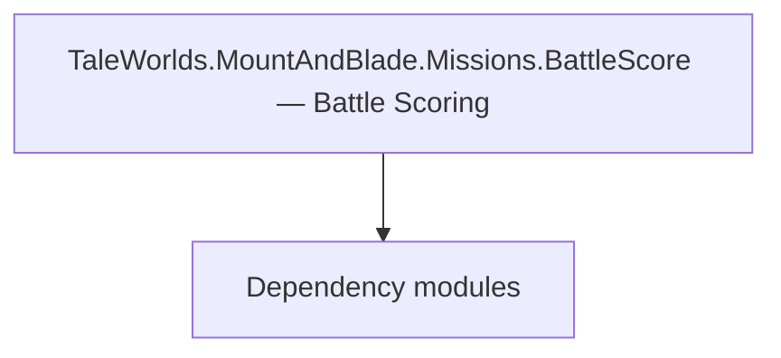

# TaleWorlds.MountAndBlade.Missions.BattleScore — Battle Scoring

**One-line responsibility:** This page covers all 8 business types under `TaleWorlds.MountAndBlade.Missions.BattleScore — Battle Scoring` as a family index, giving each type its namespace, responsibility, and typical timing so you can browse by module instead of alphabetically.

## Mental Model

Missions.BattleScore provides the data and rule structures for battle scoring: tallying and settling a battle’s performance score (kills, wounds, objectives). Scoring must be reentrant for use in post-battle rewards and statistics, decoupled from the actual win/lose outcome.

## When to Use

To customize battle-score statistics or read battle results, use these scoring types; do not mix aggressive state changes into scoring.

## Dependencies

The types under `TaleWorlds.MountAndBlade.Missions.BattleScore — Battle Scoring` depend on the following modules; missing any of them causes compile- or run-time failure.

- [Mission](../../mission/Mission)
- [API Overview](../../_index)

## Type Catalog

| Type | Namespace | Purpose | Timing |
| --- | --- | --- | --- |
| `SandboxMissionBattleScoreContext` | SandBox.Missions.BattleScore | Battle scoring rule/data that tallies and settles combat performance score. Scoring must be reentrant to avoid mid-flight recomputation drift. | On battle/mission load |
| `SandboxSimulationBattleScoreContext` | SandBox.Missions.BattleScore | Battle scoring rule/data that tallies and settles combat performance score. Scoring must be reentrant to avoid mid-flight recomputation drift. | On battle/mission load |
| `AgentList` | TaleWorlds.MountAndBlade.Missions | A business type under this namespace that carries its derived convention responsibility. Confirm its lifecycle and owning system before calling; do not reference an unready instance at the wrong phase. World-state changes should go through the corresponding Action/Behavior, not direct field mutation. | On battle/mission load |
| `AgentReadOnlyList` | TaleWorlds.MountAndBlade.Missions | A business type under this namespace that carries its derived convention responsibility. Confirm its lifecycle and owning system before calling; do not reference an unready instance at the wrong phase. World-state changes should go through the corresponding Action/Behavior, not direct field mutation. | On battle/mission load |
| `IMissionSiegeWeaponsController` | TaleWorlds.MountAndBlade.Missions | A business type under this namespace that carries its derived convention responsibility. Confirm its lifecycle and owning system before calling; do not reference an unready instance at the wrong phase. World-state changes should go through the corresponding Action/Behavior, not direct field mutation. | On battle/mission load |
| `MissionSiegeWeaponsController` | TaleWorlds.MountAndBlade.Missions | A business type under this namespace that carries its derived convention responsibility. Confirm its lifecycle and owning system before calling; do not reference an unready instance at the wrong phase. World-state changes should go through the corresponding Action/Behavior, not direct field mutation. | On battle/mission load |
| `BattleScoreContext` | TaleWorlds.MountAndBlade.Missions.BattleScore | Battle scoring rule/data that tallies and settles combat performance score. Scoring must be reentrant to avoid mid-flight recomputation drift. | On battle/mission load |
| `CustomBattleScoreContext` | TaleWorlds.MountAndBlade.Missions.BattleScore | Battle scoring rule/data that tallies and settles combat performance score. Scoring must be reentrant to avoid mid-flight recomputation drift. | On battle/mission load |

## Risk & Boundaries

Scoring must stay stable and reentrant before battle end; mid-flight recomputation drifts. Scoring data must be serializable to support post-battle settlement and replay.

## See Also

- [Mission](../../mission/Mission)
- [API Overview](../../_index)
