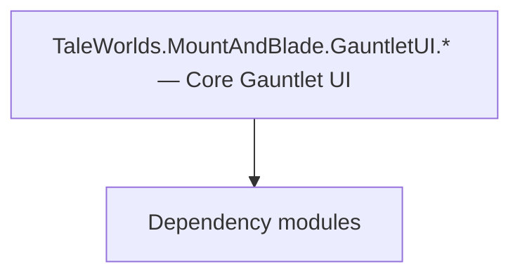

# TaleWorlds.MountAndBlade.GauntletUI.* — Core Gauntlet UI

**One-line responsibility:** This page covers all 489 business types under `TaleWorlds.MountAndBlade.GauntletUI.* — Core Gauntlet UI` as a family index, giving each type its namespace, responsibility, and typical timing so you can browse by module instead of alphabetically.

## Mental Model

TaleWorlds.MountAndBlade.GauntletUI.* is the core Gauntlet UI layer: widgets (hundreds of specialized controls), texture providers, body generator, scene notifications, and mission UI. It projects logic state into clickable, bindable interface elements and is the main entry point for player interaction with the strategic/social layer. The UI layer only exposes state; interaction is surfaced to logic via events.

## When to Use

To customize a core interface (clan, kingdom, crafting, encyclopedia, lobby, menus), inherit the relevant Widget/VM and open it from a MissionBehavior/logic layer. Commands only trigger Actions/Behaviors.

## Dependencies

The types under `TaleWorlds.MountAndBlade.GauntletUI.* — Core Gauntlet UI` depend on the following modules; missing any of them causes compile- or run-time failure.

- [ViewModel](../../core-extra/ViewModel)
- [Campaign](../../campaign/Campaign)
- [API Overview](../../_index)

## Type Catalog

| Type | Namespace | Purpose | Timing |
| --- | --- | --- | --- |
| `ChatLineData` | TaleWorlds.MountAndBlade.GauntletUI | A business type under this namespace that carries its derived convention responsibility. Confirm its lifecycle and owning system before calling; do not reference an unready instance at the wrong phase. World-state changes should go through the corresponding Action/Behavior, not direct field mutation. | On UI open |
| `ChatLogMessageManager` | TaleWorlds.MountAndBlade.GauntletUI | A business type under this namespace that carries its derived convention responsibility. Confirm its lifecycle and owning system before calling; do not reference an unready instance at the wrong phase. World-state changes should go through the corresponding Action/Behavior, not direct field mutation. | On UI open |
| `DebugStatsVM` | TaleWorlds.MountAndBlade.GauntletUI | Gauntlet UI data view-model that exposes properties and commands to the interface, reacts to input and notifies refreshes. A VM is only a projection of state; commands should only trigger Actions or Behaviors. | On UI open |
| `GamepadCursorViewModel` | TaleWorlds.MountAndBlade.GauntletUI | Gauntlet UI data view-model that exposes properties and commands to the interface, reacts to input and notifies refreshes. A VM is only a projection of state; commands should only trigger Actions or Behaviors. | On UI open |
| `GauntletBannerBuilderScreen` | TaleWorlds.MountAndBlade.GauntletUI | A business type under this namespace that carries its derived convention responsibility. Confirm its lifecycle and owning system before calling; do not reference an unready instance at the wrong phase. World-state changes should go through the corresponding Action/Behavior, not direct field mutation. | On UI open |
| `GauntletCameraFadeView` | TaleWorlds.MountAndBlade.GauntletUI | A business type under this namespace that carries its derived convention responsibility. Confirm its lifecycle and owning system before calling; do not reference an unready instance at the wrong phase. World-state changes should go through the corresponding Action/Behavior, not direct field mutation. | On UI open |
| `GauntletChatLogView` | TaleWorlds.MountAndBlade.GauntletUI | A business type under this namespace that carries its derived convention responsibility. Confirm its lifecycle and owning system before calling; do not reference an unready instance at the wrong phase. World-state changes should go through the corresponding Action/Behavior, not direct field mutation. | On UI open |
| `GauntletCreditsScreen` | TaleWorlds.MountAndBlade.GauntletUI | A business type under this namespace that carries its derived convention responsibility. Confirm its lifecycle and owning system before calling; do not reference an unready instance at the wrong phase. World-state changes should go through the corresponding Action/Behavior, not direct field mutation. | On UI open |
| `GauntletDebugStats` | TaleWorlds.MountAndBlade.GauntletUI | A business type under this namespace that carries its derived convention responsibility. Confirm its lifecycle and owning system before calling; do not reference an unready instance at the wrong phase. World-state changes should go through the corresponding Action/Behavior, not direct field mutation. | On UI open |
| `GauntletDefaultLoadingWindowManager` | TaleWorlds.MountAndBlade.GauntletUI | A business type under this namespace that carries its derived convention responsibility. Confirm its lifecycle and owning system before calling; do not reference an unready instance at the wrong phase. World-state changes should go through the corresponding Action/Behavior, not direct field mutation. | On UI open |
| `GauntletFullScreenNoticeView` | TaleWorlds.MountAndBlade.GauntletUI | A business type under this namespace that carries its derived convention responsibility. Confirm its lifecycle and owning system before calling; do not reference an unready instance at the wrong phase. World-state changes should go through the corresponding Action/Behavior, not direct field mutation. | On UI open |
| `GauntletGameNotification` | TaleWorlds.MountAndBlade.GauntletUI | Notification item type describing the data of one map/event prompt. It only carries display data; triggering logic lives in the Behavior. | On UI open |
| `GauntletGamepadCursor` | TaleWorlds.MountAndBlade.GauntletUI | A business type under this namespace that carries its derived convention responsibility. Confirm its lifecycle and owning system before calling; do not reference an unready instance at the wrong phase. World-state changes should go through the corresponding Action/Behavior, not direct field mutation. | On UI open |
| `GauntletGameVersionView` | TaleWorlds.MountAndBlade.GauntletUI | A business type under this namespace that carries its derived convention responsibility. Confirm its lifecycle and owning system before calling; do not reference an unready instance at the wrong phase. World-state changes should go through the corresponding Action/Behavior, not direct field mutation. | On UI open |
| `GauntletInformationView` | TaleWorlds.MountAndBlade.GauntletUI | A business type under this namespace that carries its derived convention responsibility. Confirm its lifecycle and owning system before calling; do not reference an unready instance at the wrong phase. World-state changes should go through the corresponding Action/Behavior, not direct field mutation. | On UI open |
| `GauntletInitialScreen` | TaleWorlds.MountAndBlade.GauntletUI | A business type under this namespace that carries its derived convention responsibility. Confirm its lifecycle and owning system before calling; do not reference an unready instance at the wrong phase. World-state changes should go through the corresponding Action/Behavior, not direct field mutation. | On UI open |
| `GauntletOptionsScreen` | TaleWorlds.MountAndBlade.GauntletUI | A business type under this namespace that carries its derived convention responsibility. Confirm its lifecycle and owning system before calling; do not reference an unready instance at the wrong phase. World-state changes should go through the corresponding Action/Behavior, not direct field mutation. | On UI open |
| `GauntletOrderUIHandler` | TaleWorlds.MountAndBlade.GauntletUI | Battle order / formation sequence describing a unit’s formation and movement intent, interpreted and executed by the Order system. | On UI open |
| `GauntletProfileSelectionScreen` | TaleWorlds.MountAndBlade.GauntletUI | Election / voting mechanism used for collective decisions such as kingdom votes. Mind voting timing and tie handling. | On UI open |
| `GauntletQueryManager` | TaleWorlds.MountAndBlade.GauntletUI | A business type under this namespace that carries its derived convention responsibility. Confirm its lifecycle and owning system before calling; do not reference an unready instance at the wrong phase. World-state changes should go through the corresponding Action/Behavior, not direct field mutation. | On UI open |
| `GauntletUISubModule` | TaleWorlds.MountAndBlade.GauntletUI | A business type under this namespace that carries its derived convention responsibility. Confirm its lifecycle and owning system before calling; do not reference an unready instance at the wrong phase. World-state changes should go through the corresponding Action/Behavior, not direct field mutation. | On UI open |
| `GauntletVideoPlaybackScreen` | TaleWorlds.MountAndBlade.GauntletUI | A business type under this namespace that carries its derived convention responsibility. Confirm its lifecycle and owning system before calling; do not reference an unready instance at the wrong phase. World-state changes should go through the corresponding Action/Behavior, not direct field mutation. | On UI open |
| `KeybindingPopup` | TaleWorlds.MountAndBlade.GauntletUI | A business type under this namespace that carries its derived convention responsibility. Confirm its lifecycle and owning system before calling; do not reference an unready instance at the wrong phase. World-state changes should go through the corresponding Action/Behavior, not direct field mutation. | On UI open |
| `KeybindingPopupVM` | TaleWorlds.MountAndBlade.GauntletUI | Gauntlet UI data view-model that exposes properties and commands to the interface, reacts to input and notifies refreshes. A VM is only a projection of state; commands should only trigger Actions or Behaviors. | On UI open |
| `LoadingWindowViewModel` | TaleWorlds.MountAndBlade.GauntletUI | Gauntlet UI data view-model that exposes properties and commands to the interface, reacts to input and notifies refreshes. A VM is only a projection of state; commands should only trigger Actions or Behaviors. | On UI open |
| `BodyGeneratorView` | TaleWorlds.MountAndBlade.GauntletUI.BodyGenerator | A business type under this namespace that carries its derived convention responsibility. Confirm its lifecycle and owning system before calling; do not reference an unready instance at the wrong phase. World-state changes should go through the corresponding Action/Behavior, not direct field mutation. | On UI open |
| `GauntletBodyGeneratorScreen` | TaleWorlds.MountAndBlade.GauntletUI.BodyGenerator | Interface screen / layer base class that hosts Gauntlet UI display and input. Commands only trigger Actions or Behaviors and never mutate state directly. | On UI open |
| `MissionGauntletAgentStatus` | TaleWorlds.MountAndBlade.GauntletUI.Mission | A business type under this namespace that carries its derived convention responsibility. Confirm its lifecycle and owning system before calling; do not reference an unready instance at the wrong phase. World-state changes should go through the corresponding Action/Behavior, not direct field mutation. | On battle/mission load |
| `MissionGauntletBoundaryCrossingView` | TaleWorlds.MountAndBlade.GauntletUI.Mission | A business type under this namespace that carries its derived convention responsibility. Confirm its lifecycle and owning system before calling; do not reference an unready instance at the wrong phase. World-state changes should go through the corresponding Action/Behavior, not direct field mutation. | On battle/mission load |
| `MissionGauntletCategoryLoadManager` | TaleWorlds.MountAndBlade.GauntletUI.Mission | Battle-scene visual view that subscribes to Mission events and refreshes the presentation layer (camera, VFX, HUD overlays) from game state every tick. Views read state and never write rules. | On battle/mission load |
| `MissionGauntletCrosshair` | TaleWorlds.MountAndBlade.GauntletUI.Mission | AI decision implementation that must be interruptible and serializable to support saving and undo. Search must be depth/time bounded to avoid stalls. | On battle/mission load |
| `MissionGauntletEscapeMenuBase` | TaleWorlds.MountAndBlade.GauntletUI.Mission | A business type under this namespace that carries its derived convention responsibility. Confirm its lifecycle and owning system before calling; do not reference an unready instance at the wrong phase. World-state changes should go through the corresponding Action/Behavior, not direct field mutation. | On battle/mission load |
| `MissionGauntletMainAgentCheerControllerView` | TaleWorlds.MountAndBlade.GauntletUI.Mission | Battle-scene visual view that subscribes to Mission events and refreshes the presentation layer (camera, VFX, HUD overlays) from game state every tick. Views read state and never write rules. | On battle/mission load |
| `MissionGauntletMainAgentControlModeView` | TaleWorlds.MountAndBlade.GauntletUI.Mission | Battle-scene visual view that subscribes to Mission events and refreshes the presentation layer (camera, VFX, HUD overlays) from game state every tick. Views read state and never write rules. | On battle/mission load |
| `MissionGauntletMainAgentEquipDropView` | TaleWorlds.MountAndBlade.GauntletUI.Mission | Battle-scene visual view that subscribes to Mission events and refreshes the presentation layer (camera, VFX, HUD overlays) from game state every tick. Views read state and never write rules. | On battle/mission load |
| `MissionGauntletMainAgentEquipmentControllerView` | TaleWorlds.MountAndBlade.GauntletUI.Mission | Battle-scene visual view that subscribes to Mission events and refreshes the presentation layer (camera, VFX, HUD overlays) from game state every tick. Views read state and never write rules. | On battle/mission load |
| `MissionGauntletOptionsUIHandler` | TaleWorlds.MountAndBlade.GauntletUI.Mission | Battle-scene visual view that subscribes to Mission events and refreshes the presentation layer (camera, VFX, HUD overlays) from game state every tick. Views read state and never write rules. | On battle/mission load |
| `MissionGauntletAgentLockVisualizerView` | TaleWorlds.MountAndBlade.GauntletUI.Mission.Singleplayer | A business type under this namespace that carries its derived convention responsibility. Confirm its lifecycle and owning system before calling; do not reference an unready instance at the wrong phase. World-state changes should go through the corresponding Action/Behavior, not direct field mutation. | On battle/mission load |
| `MissionGauntletBattleScore` | TaleWorlds.MountAndBlade.GauntletUI.Mission.Singleplayer | Battle-scene visual view that subscribes to Mission events and refreshes the presentation layer (camera, VFX, HUD overlays) from game state every tick. Views read state and never write rules. | On battle/mission load |
| `MissionGauntletFormationMarker` | TaleWorlds.MountAndBlade.GauntletUI.Mission.Singleplayer | A business type under this namespace that carries its derived convention responsibility. Confirm its lifecycle and owning system before calling; do not reference an unready instance at the wrong phase. World-state changes should go through the corresponding Action/Behavior, not direct field mutation. | On battle/mission load |
| `MissionGauntletKillNotificationSingleplayerUIHandler` | TaleWorlds.MountAndBlade.GauntletUI.Mission.Singleplayer | Notification item type describing the data of one map/event prompt. It only carries display data; triggering logic lives in the Behavior. | On battle/mission load |
| `MissionGauntletLeaveView` | TaleWorlds.MountAndBlade.GauntletUI.Mission.Singleplayer | Battle-scene visual view that subscribes to Mission events and refreshes the presentation layer (camera, VFX, HUD overlays) from game state every tick. Views read state and never write rules. | On battle/mission load |
| `MissionGauntletOrderOfBattleUIHandler` | TaleWorlds.MountAndBlade.GauntletUI.Mission.Singleplayer | Battle-scene visual view that subscribes to Mission events and refreshes the presentation layer (camera, VFX, HUD overlays) from game state every tick. Views read state and never write rules. | On battle/mission load |
| `MissionGauntletPhotoMode` | TaleWorlds.MountAndBlade.GauntletUI.Mission.Singleplayer | Battle-scene visual view that subscribes to Mission events and refreshes the presentation layer (camera, VFX, HUD overlays) from game state every tick. Views read state and never write rules. | On battle/mission load |
| `MissionGauntletSiegeEngineMarker` | TaleWorlds.MountAndBlade.GauntletUI.Mission.Singleplayer | A business type under this namespace that carries its derived convention responsibility. Confirm its lifecycle and owning system before calling; do not reference an unready instance at the wrong phase. World-state changes should go through the corresponding Action/Behavior, not direct field mutation. | On battle/mission load |
| `MissionGauntletSingleplayerEscapeMenu` | TaleWorlds.MountAndBlade.GauntletUI.Mission.Singleplayer | A business type under this namespace that carries its derived convention responsibility. Confirm its lifecycle and owning system before calling; do not reference an unready instance at the wrong phase. World-state changes should go through the corresponding Action/Behavior, not direct field mutation. | On battle/mission load |
| `MissionGauntletSingleplayerOrderUIHandler` | TaleWorlds.MountAndBlade.GauntletUI.Mission.Singleplayer | Battle order / formation sequence describing a unit’s formation and movement intent, interpreted and executed by the Order system. | On battle/mission load |
| `MissionGauntletSpectatorControl` | TaleWorlds.MountAndBlade.GauntletUI.Mission.Singleplayer | Battle-scene visual view that subscribes to Mission events and refreshes the presentation layer (camera, VFX, HUD overlays) from game state every tick. Views read state and never write rules. | On battle/mission load |
| `GauntletSceneNotification` | TaleWorlds.MountAndBlade.GauntletUI.SceneNotification | Notification item type describing the data of one map/event prompt. It only carries display data; triggering logic lives in the Behavior. | On UI open |
| `NativeSceneNotificationContextProvider` | TaleWorlds.MountAndBlade.GauntletUI.SceneNotification | Gauntlet image-source abstraction that resolves an entity/concept into an actual texture and caches it. The first frame may be empty; handle the loading state. | On UI open |
| `BannerTableauTextureProvider` | TaleWorlds.MountAndBlade.GauntletUI.TextureProviders | Gauntlet image-source abstraction that resolves an entity/concept into an actual texture and caches it. The first frame may be empty; handle the loading state. | On UI open |
| `BrightnessDemoTextureProvider` | TaleWorlds.MountAndBlade.GauntletUI.TextureProviders | Gauntlet image-source abstraction that resolves an entity/concept into an actual texture and caches it. The first frame may be empty; handle the loading state. | On UI open |
| `CharacterTableauTextureProvider` | TaleWorlds.MountAndBlade.GauntletUI.TextureProviders | Gauntlet image-source abstraction that resolves an entity/concept into an actual texture and caches it. The first frame may be empty; handle the loading state. | On UI open |
| `ItemTableauTextureProvider` | TaleWorlds.MountAndBlade.GauntletUI.TextureProviders | Gauntlet image-source abstraction that resolves an entity/concept into an actual texture and caches it. The first frame may be empty; handle the loading state. | On UI open |
| `OnlineImageTextureProvider` | TaleWorlds.MountAndBlade.GauntletUI.TextureProviders | Gauntlet image-source abstraction that resolves an entity/concept into an actual texture and caches it. The first frame may be empty; handle the loading state. | On UI open |
| `SaveLoadHeroTableauTextureProvider` | TaleWorlds.MountAndBlade.GauntletUI.TextureProviders | Gauntlet image-source abstraction that resolves an entity/concept into an actual texture and caches it. The first frame may be empty; handle the loading state. | On UI open |
| `SceneTextureProvider` | TaleWorlds.MountAndBlade.GauntletUI.TextureProviders | Gauntlet image-source abstraction that resolves an entity/concept into an actual texture and caches it. The first frame may be empty; handle the loading state. | On UI open |
| `BannerImageTextureProvider` | TaleWorlds.MountAndBlade.GauntletUI.TextureProviders.ImageIdentifiers | Gauntlet image-source abstraction that resolves an entity/concept into an actual texture and caches it. The first frame may be empty; handle the loading state. | On UI open |
| `CharacterImageTextureProvider` | TaleWorlds.MountAndBlade.GauntletUI.TextureProviders.ImageIdentifiers | Gauntlet image-source abstraction that resolves an entity/concept into an actual texture and caches it. The first frame may be empty; handle the loading state. | On UI open |
| `CraftingPieceImageTextureProvider` | TaleWorlds.MountAndBlade.GauntletUI.TextureProviders.ImageIdentifiers | Gauntlet image-source abstraction that resolves an entity/concept into an actual texture and caches it. The first frame may be empty; handle the loading state. | On UI open |
| `ImageIdentifierTextureProvider` | TaleWorlds.MountAndBlade.GauntletUI.TextureProviders.ImageIdentifiers | Gauntlet image-source abstraction that resolves an entity/concept into an actual texture and caches it. The first frame may be empty; handle the loading state. | On UI open |
| `ItemImageTextureProvider` | TaleWorlds.MountAndBlade.GauntletUI.TextureProviders.ImageIdentifiers | Gauntlet image-source abstraction that resolves an entity/concept into an actual texture and caches it. The first frame may be empty; handle the loading state. | On UI open |
| `PlayerAvatarImageTextureProvider` | TaleWorlds.MountAndBlade.GauntletUI.TextureProviders.ImageIdentifiers | Gauntlet image-source abstraction that resolves an entity/concept into an actual texture and caches it. The first frame may be empty; handle the loading state. | On UI open |
| `AutoHideRichTextWidget` | TaleWorlds.MountAndBlade.GauntletUI.Widgets | A business type under this namespace that carries its derived convention responsibility. Confirm its lifecycle and owning system before calling; do not reference an unready instance at the wrong phase. World-state changes should go through the corresponding Action/Behavior, not direct field mutation. | On UI open |
| `AutoHideTextWidget` | TaleWorlds.MountAndBlade.GauntletUI.Widgets | A business type under this namespace that carries its derived convention responsibility. Confirm its lifecycle and owning system before calling; do not reference an unready instance at the wrong phase. World-state changes should go through the corresponding Action/Behavior, not direct field mutation. | On UI open |
| `AutoHideZeroTextWidget` | TaleWorlds.MountAndBlade.GauntletUI.Widgets | A business type under this namespace that carries its derived convention responsibility. Confirm its lifecycle and owning system before calling; do not reference an unready instance at the wrong phase. World-state changes should go through the corresponding Action/Behavior, not direct field mutation. | On UI open |
| `BannerlordCustomWidgetManager` | TaleWorlds.MountAndBlade.GauntletUI.Widgets | A business type under this namespace that carries its derived convention responsibility. Confirm its lifecycle and owning system before calling; do not reference an unready instance at the wrong phase. World-state changes should go through the corresponding Action/Behavior, not direct field mutation. | On UI open |
| `BannerTableauWidget` | TaleWorlds.MountAndBlade.GauntletUI.Widgets | A business type under this namespace that carries its derived convention responsibility. Confirm its lifecycle and owning system before calling; do not reference an unready instance at the wrong phase. World-state changes should go through the corresponding Action/Behavior, not direct field mutation. | On UI open |
| `BoolBrushChangerBrushWidget` | TaleWorlds.MountAndBlade.GauntletUI.Widgets | A business type under this namespace that carries its derived convention responsibility. Confirm its lifecycle and owning system before calling; do not reference an unready instance at the wrong phase. World-state changes should go through the corresponding Action/Behavior, not direct field mutation. | On UI open |
| `BoolStateChangerWidget` | TaleWorlds.MountAndBlade.GauntletUI.Widgets | A business type under this namespace that carries its derived convention responsibility. Confirm its lifecycle and owning system before calling; do not reference an unready instance at the wrong phase. World-state changes should go through the corresponding Action/Behavior, not direct field mutation. | On UI open |
| `BrightnessDemoWidget` | TaleWorlds.MountAndBlade.GauntletUI.Widgets | A business type under this namespace that carries its derived convention responsibility. Confirm its lifecycle and owning system before calling; do not reference an unready instance at the wrong phase. World-state changes should go through the corresponding Action/Behavior, not direct field mutation. | On UI open |
| `ChangeAmountTextWidget` | TaleWorlds.MountAndBlade.GauntletUI.Widgets | A business type under this namespace that carries its derived convention responsibility. Confirm its lifecycle and owning system before calling; do not reference an unready instance at the wrong phase. World-state changes should go through the corresponding Action/Behavior, not direct field mutation. | On UI open |
| `CharacterTableauWidget` | TaleWorlds.MountAndBlade.GauntletUI.Widgets | A business type under this namespace that carries its derived convention responsibility. Confirm its lifecycle and owning system before calling; do not reference an unready instance at the wrong phase. World-state changes should go through the corresponding Action/Behavior, not direct field mutation. | On UI open |
| `CircleLoadingAnimWidget` | TaleWorlds.MountAndBlade.GauntletUI.Widgets | A business type under this namespace that carries its derived convention responsibility. Confirm its lifecycle and owning system before calling; do not reference an unready instance at the wrong phase. World-state changes should go through the corresponding Action/Behavior, not direct field mutation. | On UI open |
| `CircularAutoScrollablePanelWidget` | TaleWorlds.MountAndBlade.GauntletUI.Widgets | A business type under this namespace that carries its derived convention responsibility. Confirm its lifecycle and owning system before calling; do not reference an unready instance at the wrong phase. World-state changes should go through the corresponding Action/Behavior, not direct field mutation. | On UI open |
| `ClickableCharacterTableauWidget` | TaleWorlds.MountAndBlade.GauntletUI.Widgets | A business type under this namespace that carries its derived convention responsibility. Confirm its lifecycle and owning system before calling; do not reference an unready instance at the wrong phase. World-state changes should go through the corresponding Action/Behavior, not direct field mutation. | On UI open |
| `ColorButtonWidget` | TaleWorlds.MountAndBlade.GauntletUI.Widgets | A business type under this namespace that carries its derived convention responsibility. Confirm its lifecycle and owning system before calling; do not reference an unready instance at the wrong phase. World-state changes should go through the corresponding Action/Behavior, not direct field mutation. | On UI open |
| `ComparisonTypes` | TaleWorlds.MountAndBlade.GauntletUI.Widgets | A business type under this namespace that carries its derived convention responsibility. Confirm its lifecycle and owning system before calling; do not reference an unready instance at the wrong phase. World-state changes should go through the corresponding Action/Behavior, not direct field mutation. | On UI open |
| `ContainerDirections` | TaleWorlds.MountAndBlade.GauntletUI.Widgets | AI decision implementation that must be interruptible and serializable to support saving and undo. Search must be depth/time bounded to avoid stalls. | On UI open |
| `ContainerPageControlButtonListWidget` | TaleWorlds.MountAndBlade.GauntletUI.Widgets | AI decision implementation that must be interruptible and serializable to support saving and undo. Search must be depth/time bounded to avoid stalls. | On UI open |
| `ContainerPageControlWidget` | TaleWorlds.MountAndBlade.GauntletUI.Widgets | AI decision implementation that must be interruptible and serializable to support saving and undo. Search must be depth/time bounded to avoid stalls. | On UI open |
| `ContextMenuBrushWidget` | TaleWorlds.MountAndBlade.GauntletUI.Widgets | A business type under this namespace that carries its derived convention responsibility. Confirm its lifecycle and owning system before calling; do not reference an unready instance at the wrong phase. World-state changes should go through the corresponding Action/Behavior, not direct field mutation. | On UI open |
| `ContextMenuItemWidget` | TaleWorlds.MountAndBlade.GauntletUI.Widgets | A business type under this namespace that carries its derived convention responsibility. Confirm its lifecycle and owning system before calling; do not reference an unready instance at the wrong phase. World-state changes should go through the corresponding Action/Behavior, not direct field mutation. | On UI open |
| `CounterTextBrushWidget` | TaleWorlds.MountAndBlade.GauntletUI.Widgets | A business type under this namespace that carries its derived convention responsibility. Confirm its lifecycle and owning system before calling; do not reference an unready instance at the wrong phase. World-state changes should go through the corresponding Action/Behavior, not direct field mutation. | On UI open |
| `DebugValueUpdateSlider` | TaleWorlds.MountAndBlade.GauntletUI.Widgets | A business type under this namespace that carries its derived convention responsibility. Confirm its lifecycle and owning system before calling; do not reference an unready instance at the wrong phase. World-state changes should go through the corresponding Action/Behavior, not direct field mutation. | On UI open |
| `DefaultLayerSpriteChangerBrushWidget` | TaleWorlds.MountAndBlade.GauntletUI.Widgets | A business type under this namespace that carries its derived convention responsibility. Confirm its lifecycle and owning system before calling; do not reference an unready instance at the wrong phase. World-state changes should go through the corresponding Action/Behavior, not direct field mutation. | On UI open |
| `DemoTypes` | TaleWorlds.MountAndBlade.GauntletUI.Widgets | A business type under this namespace that carries its derived convention responsibility. Confirm its lifecycle and owning system before calling; do not reference an unready instance at the wrong phase. World-state changes should go through the corresponding Action/Behavior, not direct field mutation. | On UI open |
| `Dimensions` | TaleWorlds.MountAndBlade.GauntletUI.Widgets | A business type under this namespace that carries its derived convention responsibility. Confirm its lifecycle and owning system before calling; do not reference an unready instance at the wrong phase. World-state changes should go through the corresponding Action/Behavior, not direct field mutation. | On UI open |
| `DimensionSyncWidget` | TaleWorlds.MountAndBlade.GauntletUI.Widgets | A business type under this namespace that carries its derived convention responsibility. Confirm its lifecycle and owning system before calling; do not reference an unready instance at the wrong phase. World-state changes should go through the corresponding Action/Behavior, not direct field mutation. | On UI open |
| `DiscreteScrollablePanel` | TaleWorlds.MountAndBlade.GauntletUI.Widgets | A business type under this namespace that carries its derived convention responsibility. Confirm its lifecycle and owning system before calling; do not reference an unready instance at the wrong phase. World-state changes should go through the corresponding Action/Behavior, not direct field mutation. | On UI open |
| `DoubleTabControlListPanel` | TaleWorlds.MountAndBlade.GauntletUI.Widgets | A business type under this namespace that carries its derived convention responsibility. Confirm its lifecycle and owning system before calling; do not reference an unready instance at the wrong phase. World-state changes should go through the corresponding Action/Behavior, not direct field mutation. | On UI open |
| `DropdownButtonWidget` | TaleWorlds.MountAndBlade.GauntletUI.Widgets | A business type under this namespace that carries its derived convention responsibility. Confirm its lifecycle and owning system before calling; do not reference an unready instance at the wrong phase. World-state changes should go through the corresponding Action/Behavior, not direct field mutation. | On UI open |
| `EncyclopediaTroopScrollablePanel` | TaleWorlds.MountAndBlade.GauntletUI.Widgets | A business type under this namespace that carries its derived convention responsibility. Confirm its lifecycle and owning system before calling; do not reference an unready instance at the wrong phase. World-state changes should go through the corresponding Action/Behavior, not direct field mutation. | On UI open |
| `EquipmentTypeVisualBrushWidget` | TaleWorlds.MountAndBlade.GauntletUI.Widgets | A business type under this namespace that carries its derived convention responsibility. Confirm its lifecycle and owning system before calling; do not reference an unready instance at the wrong phase. World-state changes should go through the corresponding Action/Behavior, not direct field mutation. | On UI open |
| `FiefProfitTypeVisualBrushWidget` | TaleWorlds.MountAndBlade.GauntletUI.Widgets | A business type under this namespace that carries its derived convention responsibility. Confirm its lifecycle and owning system before calling; do not reference an unready instance at the wrong phase. World-state changes should go through the corresponding Action/Behavior, not direct field mutation. | On UI open |
| `FiefStatTypeVisualBrushWidget` | TaleWorlds.MountAndBlade.GauntletUI.Widgets | A business type under this namespace that carries its derived convention responsibility. Confirm its lifecycle and owning system before calling; do not reference an unready instance at the wrong phase. World-state changes should go through the corresponding Action/Behavior, not direct field mutation. | On UI open |
| `FloatComparedStateChangerTextWidget` | TaleWorlds.MountAndBlade.GauntletUI.Widgets | A business type under this namespace that carries its derived convention responsibility. Confirm its lifecycle and owning system before calling; do not reference an unready instance at the wrong phase. World-state changes should go through the corresponding Action/Behavior, not direct field mutation. | On UI open |
| `GameMenuItemWidget` | TaleWorlds.MountAndBlade.GauntletUI.Widgets | A business type under this namespace that carries its derived convention responsibility. Confirm its lifecycle and owning system before calling; do not reference an unready instance at the wrong phase. World-state changes should go through the corresponding Action/Behavior, not direct field mutation. | On UI open |
| `GamepadCursorMarkerWidget` | TaleWorlds.MountAndBlade.GauntletUI.Widgets | A business type under this namespace that carries its derived convention responsibility. Confirm its lifecycle and owning system before calling; do not reference an unready instance at the wrong phase. World-state changes should go through the corresponding Action/Behavior, not direct field mutation. | On UI open |
| `GamepadCursorParentWidget` | TaleWorlds.MountAndBlade.GauntletUI.Widgets | A business type under this namespace that carries its derived convention responsibility. Confirm its lifecycle and owning system before calling; do not reference an unready instance at the wrong phase. World-state changes should go through the corresponding Action/Behavior, not direct field mutation. | On UI open |
| `GamepadCursorWidget` | TaleWorlds.MountAndBlade.GauntletUI.Widgets | A business type under this namespace that carries its derived convention responsibility. Confirm its lifecycle and owning system before calling; do not reference an unready instance at the wrong phase. World-state changes should go through the corresponding Action/Behavior, not direct field mutation. | On UI open |
| `HintWidget` | TaleWorlds.MountAndBlade.GauntletUI.Widgets | A business type under this namespace that carries its derived convention responsibility. Confirm its lifecycle and owning system before calling; do not reference an unready instance at the wrong phase. World-state changes should go through the corresponding Action/Behavior, not direct field mutation. | On UI open |
| `HoverToggleWidget` | TaleWorlds.MountAndBlade.GauntletUI.Widgets | A business type under this namespace that carries its derived convention responsibility. Confirm its lifecycle and owning system before calling; do not reference an unready instance at the wrong phase. World-state changes should go through the corresponding Action/Behavior, not direct field mutation. | On UI open |
| `IconBrushWidget` | TaleWorlds.MountAndBlade.GauntletUI.Widgets | A business type under this namespace that carries its derived convention responsibility. Confirm its lifecycle and owning system before calling; do not reference an unready instance at the wrong phase. World-state changes should go through the corresponding Action/Behavior, not direct field mutation. | On UI open |
| `IconOffsetButtonWidget` | TaleWorlds.MountAndBlade.GauntletUI.Widgets | A business type under this namespace that carries its derived convention responsibility. Confirm its lifecycle and owning system before calling; do not reference an unready instance at the wrong phase. World-state changes should go through the corresponding Action/Behavior, not direct field mutation. | On UI open |
| `ImageIdentifierWidget` | TaleWorlds.MountAndBlade.GauntletUI.Widgets | A business type under this namespace that carries its derived convention responsibility. Confirm its lifecycle and owning system before calling; do not reference an unready instance at the wrong phase. World-state changes should go through the corresponding Action/Behavior, not direct field mutation. | On UI open |
| `InitialMenuAnimControllerWidget` | TaleWorlds.MountAndBlade.GauntletUI.Widgets | A business type under this namespace that carries its derived convention responsibility. Confirm its lifecycle and owning system before calling; do not reference an unready instance at the wrong phase. World-state changes should go through the corresponding Action/Behavior, not direct field mutation. | On UI open |
| `IntComparedStateChangerTextWidget` | TaleWorlds.MountAndBlade.GauntletUI.Widgets | A business type under this namespace that carries its derived convention responsibility. Confirm its lifecycle and owning system before calling; do not reference an unready instance at the wrong phase. World-state changes should go through the corresponding Action/Behavior, not direct field mutation. | On UI open |
| `ItemTableauWidget` | TaleWorlds.MountAndBlade.GauntletUI.Widgets | A business type under this namespace that carries its derived convention responsibility. Confirm its lifecycle and owning system before calling; do not reference an unready instance at the wrong phase. World-state changes should go through the corresponding Action/Behavior, not direct field mutation. | On UI open |
| `ItemTypeVisualBrushWidget` | TaleWorlds.MountAndBlade.GauntletUI.Widgets | A business type under this namespace that carries its derived convention responsibility. Confirm its lifecycle and owning system before calling; do not reference an unready instance at the wrong phase. World-state changes should go through the corresponding Action/Behavior, not direct field mutation. | On UI open |
| `ListPanelDropdownWidget` | TaleWorlds.MountAndBlade.GauntletUI.Widgets | A business type under this namespace that carries its derived convention responsibility. Confirm its lifecycle and owning system before calling; do not reference an unready instance at the wrong phase. World-state changes should go through the corresponding Action/Behavior, not direct field mutation. | On UI open |
| `NavigatableGridWidget` | TaleWorlds.MountAndBlade.GauntletUI.Widgets | A business type under this namespace that carries its derived convention responsibility. Confirm its lifecycle and owning system before calling; do not reference an unready instance at the wrong phase. World-state changes should go through the corresponding Action/Behavior, not direct field mutation. | On UI open |
| `NavigatableListPanel` | TaleWorlds.MountAndBlade.GauntletUI.Widgets | A business type under this namespace that carries its derived convention responsibility. Confirm its lifecycle and owning system before calling; do not reference an unready instance at the wrong phase. World-state changes should go through the corresponding Action/Behavior, not direct field mutation. | On UI open |
| `NavigationAutoScrollWidget` | TaleWorlds.MountAndBlade.GauntletUI.Widgets | A business type under this namespace that carries its derived convention responsibility. Confirm its lifecycle and owning system before calling; do not reference an unready instance at the wrong phase. World-state changes should go through the corresponding Action/Behavior, not direct field mutation. | On UI open |
| `NavigationForcedScopeCollectionTargeter` | TaleWorlds.MountAndBlade.GauntletUI.Widgets | A business type under this namespace that carries its derived convention responsibility. Confirm its lifecycle and owning system before calling; do not reference an unready instance at the wrong phase. World-state changes should go through the corresponding Action/Behavior, not direct field mutation. | On UI open |
| `NavigationScopeTargeter` | TaleWorlds.MountAndBlade.GauntletUI.Widgets | A business type under this namespace that carries its derived convention responsibility. Confirm its lifecycle and owning system before calling; do not reference an unready instance at the wrong phase. World-state changes should go through the corresponding Action/Behavior, not direct field mutation. | On UI open |
| `NavigationTargetSwitcher` | TaleWorlds.MountAndBlade.GauntletUI.Widgets | A business type under this namespace that carries its derived convention responsibility. Confirm its lifecycle and owning system before calling; do not reference an unready instance at the wrong phase. World-state changes should go through the corresponding Action/Behavior, not direct field mutation. | On UI open |
| `NumericUpDownWidget` | TaleWorlds.MountAndBlade.GauntletUI.Widgets | A business type under this namespace that carries its derived convention responsibility. Confirm its lifecycle and owning system before calling; do not reference an unready instance at the wrong phase. World-state changes should go through the corresponding Action/Behavior, not direct field mutation. | On UI open |
| `PaginatedScrollablePanel` | TaleWorlds.MountAndBlade.GauntletUI.Widgets | A business type under this namespace that carries its derived convention responsibility. Confirm its lifecycle and owning system before calling; do not reference an unready instance at the wrong phase. World-state changes should go through the corresponding Action/Behavior, not direct field mutation. | On UI open |
| `ParallaxContainerWidget` | TaleWorlds.MountAndBlade.GauntletUI.Widgets | AI decision implementation that must be interruptible and serializable to support saving and undo. Search must be depth/time bounded to avoid stalls. | On UI open |
| `ParallaxItemBrushWidget` | TaleWorlds.MountAndBlade.GauntletUI.Widgets | A business type under this namespace that carries its derived convention responsibility. Confirm its lifecycle and owning system before calling; do not reference an unready instance at the wrong phase. World-state changes should go through the corresponding Action/Behavior, not direct field mutation. | On UI open |
| `ParallaxMovementDirection` | TaleWorlds.MountAndBlade.GauntletUI.Widgets | A business type under this namespace that carries its derived convention responsibility. Confirm its lifecycle and owning system before calling; do not reference an unready instance at the wrong phase. World-state changes should go through the corresponding Action/Behavior, not direct field mutation. | On UI open |
| `RadioContainerWidget` | TaleWorlds.MountAndBlade.GauntletUI.Widgets | AI decision implementation that must be interruptible and serializable to support saving and undo. Search must be depth/time bounded to avoid stalls. | On UI open |
| `RainbowRichTextWidget` | TaleWorlds.MountAndBlade.GauntletUI.Widgets | AI decision implementation that must be interruptible and serializable to support saving and undo. Search must be depth/time bounded to avoid stalls. | On UI open |
| `RelationTextWidget` | TaleWorlds.MountAndBlade.GauntletUI.Widgets | A business type under this namespace that carries its derived convention responsibility. Confirm its lifecycle and owning system before calling; do not reference an unready instance at the wrong phase. World-state changes should go through the corresponding Action/Behavior, not direct field mutation. | On UI open |
| `SceneNotificationDescriptionTextWidget` | TaleWorlds.MountAndBlade.GauntletUI.Widgets | Notification item type describing the data of one map/event prompt. It only carries display data; triggering logic lives in the Behavior. | On UI open |
| `SceneWidget` | TaleWorlds.MountAndBlade.GauntletUI.Widgets | A business type under this namespace that carries its derived convention responsibility. Confirm its lifecycle and owning system before calling; do not reference an unready instance at the wrong phase. World-state changes should go through the corresponding Action/Behavior, not direct field mutation. | On UI open |
| `ScoreboardAnimatedTextWidget` | TaleWorlds.MountAndBlade.GauntletUI.Widgets | A business type under this namespace that carries its derived convention responsibility. Confirm its lifecycle and owning system before calling; do not reference an unready instance at the wrong phase. World-state changes should go through the corresponding Action/Behavior, not direct field mutation. | On UI open |
| `ScreenBackgroundBrushWidget` | TaleWorlds.MountAndBlade.GauntletUI.Widgets | A business type under this namespace that carries its derived convention responsibility. Confirm its lifecycle and owning system before calling; do not reference an unready instance at the wrong phase. World-state changes should go through the corresponding Action/Behavior, not direct field mutation. | On UI open |
| `ScrollMovementType` | TaleWorlds.MountAndBlade.GauntletUI.Widgets | A business type under this namespace that carries its derived convention responsibility. Confirm its lifecycle and owning system before calling; do not reference an unready instance at the wrong phase. World-state changes should go through the corresponding Action/Behavior, not direct field mutation. | On UI open |
| `SelectorWidget` | TaleWorlds.MountAndBlade.GauntletUI.Widgets | Selector / list-item view-model carrying the data and highlight of one selectable option. Collection VMs should virtualize to control memory. | On UI open |
| `SettlementStatTextWidget` | TaleWorlds.MountAndBlade.GauntletUI.Widgets | A business type under this namespace that carries its derived convention responsibility. Confirm its lifecycle and owning system before calling; do not reference an unready instance at the wrong phase. World-state changes should go through the corresponding Action/Behavior, not direct field mutation. | On UI open |
| `ShipThumbnailWidget` | TaleWorlds.MountAndBlade.GauntletUI.Widgets | AI decision implementation that must be interruptible and serializable to support saving and undo. Search must be depth/time bounded to avoid stalls. | On UI open |
| `SkillIconVisualWidget` | TaleWorlds.MountAndBlade.GauntletUI.Widgets | A business type under this namespace that carries its derived convention responsibility. Confirm its lifecycle and owning system before calling; do not reference an unready instance at the wrong phase. World-state changes should go through the corresponding Action/Behavior, not direct field mutation. | On UI open |
| `SortButtonWidget` | TaleWorlds.MountAndBlade.GauntletUI.Widgets | A business type under this namespace that carries its derived convention responsibility. Confirm its lifecycle and owning system before calling; do not reference an unready instance at the wrong phase. World-state changes should go through the corresponding Action/Behavior, not direct field mutation. | On UI open |
| `State` | TaleWorlds.MountAndBlade.GauntletUI.Widgets | A business type under this namespace that carries its derived convention responsibility. Confirm its lifecycle and owning system before calling; do not reference an unready instance at the wrong phase. World-state changes should go through the corresponding Action/Behavior, not direct field mutation. | On UI open |
| `TabControlWidget` | TaleWorlds.MountAndBlade.GauntletUI.Widgets | A business type under this namespace that carries its derived convention responsibility. Confirm its lifecycle and owning system before calling; do not reference an unready instance at the wrong phase. World-state changes should go through the corresponding Action/Behavior, not direct field mutation. | On UI open |
| `ToggleButtonWidget` | TaleWorlds.MountAndBlade.GauntletUI.Widgets | A business type under this namespace that carries its derived convention responsibility. Confirm its lifecycle and owning system before calling; do not reference an unready instance at the wrong phase. World-state changes should go through the corresponding Action/Behavior, not direct field mutation. | On UI open |
| `ToggleStateButtonWidget` | TaleWorlds.MountAndBlade.GauntletUI.Widgets | A business type under this namespace that carries its derived convention responsibility. Confirm its lifecycle and owning system before calling; do not reference an unready instance at the wrong phase. World-state changes should go through the corresponding Action/Behavior, not direct field mutation. | On UI open |
| `ValueComparisonStateChangerWidget` | TaleWorlds.MountAndBlade.GauntletUI.Widgets | A business type under this namespace that carries its derived convention responsibility. Confirm its lifecycle and owning system before calling; do not reference an unready instance at the wrong phase. World-state changes should go through the corresponding Action/Behavior, not direct field mutation. | On UI open |
| `VisualState` | TaleWorlds.MountAndBlade.GauntletUI.Widgets | A business type under this namespace that carries its derived convention responsibility. Confirm its lifecycle and owning system before calling; do not reference an unready instance at the wrong phase. World-state changes should go through the corresponding Action/Behavior, not direct field mutation. | On UI open |
| `WarningTextWidget` | TaleWorlds.MountAndBlade.GauntletUI.Widgets | A business type under this namespace that carries its derived convention responsibility. Confirm its lifecycle and owning system before calling; do not reference an unready instance at the wrong phase. World-state changes should go through the corresponding Action/Behavior, not direct field mutation. | On UI open |
| `WatchTypes` | TaleWorlds.MountAndBlade.GauntletUI.Widgets | A business type under this namespace that carries its derived convention responsibility. Confirm its lifecycle and owning system before calling; do not reference an unready instance at the wrong phase. World-state changes should go through the corresponding Action/Behavior, not direct field mutation. | On UI open |
| `BannerBuilderEditableAreaWidget` | TaleWorlds.MountAndBlade.GauntletUI.Widgets.BannerBuilder | A business type under this namespace that carries its derived convention responsibility. Confirm its lifecycle and owning system before calling; do not reference an unready instance at the wrong phase. World-state changes should go through the corresponding Action/Behavior, not direct field mutation. | On UI open |
| `BarterItemCountControlButtonWidget` | TaleWorlds.MountAndBlade.GauntletUI.Widgets.Barter | A business type under this namespace that carries its derived convention responsibility. Confirm its lifecycle and owning system before calling; do not reference an unready instance at the wrong phase. World-state changes should go through the corresponding Action/Behavior, not direct field mutation. | On UI open |
| `BarterItemCountTextWidget` | TaleWorlds.MountAndBlade.GauntletUI.Widgets.Barter | A business type under this namespace that carries its derived convention responsibility. Confirm its lifecycle and owning system before calling; do not reference an unready instance at the wrong phase. World-state changes should go through the corresponding Action/Behavior, not direct field mutation. | On UI open |
| `BarterItemVisualBrushWidget` | TaleWorlds.MountAndBlade.GauntletUI.Widgets.Barter | A business type under this namespace that carries its derived convention responsibility. Confirm its lifecycle and owning system before calling; do not reference an unready instance at the wrong phase. World-state changes should go through the corresponding Action/Behavior, not direct field mutation. | On UI open |
| `BarterTupleItemButtonWidget` | TaleWorlds.MountAndBlade.GauntletUI.Widgets.Barter | A business type under this namespace that carries its derived convention responsibility. Confirm its lifecycle and owning system before calling; do not reference an unready instance at the wrong phase. World-state changes should go through the corresponding Action/Behavior, not direct field mutation. | On UI open |
| `BoardGameInstructionVisualWidget` | TaleWorlds.MountAndBlade.GauntletUI.Widgets.BoardGame | A business type under this namespace that carries its derived convention responsibility. Confirm its lifecycle and owning system before calling; do not reference an unready instance at the wrong phase. World-state changes should go through the corresponding Action/Behavior, not direct field mutation. | On UI open |
| `CharacterCreationNarrativeStageScreenWidget` | TaleWorlds.MountAndBlade.GauntletUI.Widgets.CharacterCreation | A business type under this namespace that carries its derived convention responsibility. Confirm its lifecycle and owning system before calling; do not reference an unready instance at the wrong phase. World-state changes should go through the corresponding Action/Behavior, not direct field mutation. | On UI open |
| `CharacterCreationStageSelectionBarListPanel` | TaleWorlds.MountAndBlade.GauntletUI.Widgets.CharacterCreation | Election / voting mechanism used for collective decisions such as kingdom votes. Mind voting timing and tie handling. | On UI open |
| `CharacterCreationBackgroundGradientBrushWidget` | TaleWorlds.MountAndBlade.GauntletUI.Widgets.CharacterCreation.Culture | A business type under this namespace that carries its derived convention responsibility. Confirm its lifecycle and owning system before calling; do not reference an unready instance at the wrong phase. World-state changes should go through the corresponding Action/Behavior, not direct field mutation. | On UI open |
| `CharacterCreationCultureVisualBrushWidget` | TaleWorlds.MountAndBlade.GauntletUI.Widgets.CharacterCreation.Culture | A business type under this namespace that carries its derived convention responsibility. Confirm its lifecycle and owning system before calling; do not reference an unready instance at the wrong phase. World-state changes should go through the corresponding Action/Behavior, not direct field mutation. | On UI open |
| `CharacterCreationFirstStageFadeOutWidget` | TaleWorlds.MountAndBlade.GauntletUI.Widgets.CharacterCreation.Culture | A business type under this namespace that carries its derived convention responsibility. Confirm its lifecycle and owning system before calling; do not reference an unready instance at the wrong phase. World-state changes should go through the corresponding Action/Behavior, not direct field mutation. | On UI open |
| `CharacterCreationOptionsItemWidget` | TaleWorlds.MountAndBlade.GauntletUI.Widgets.CharacterCreation.Options | A business type under this namespace that carries its derived convention responsibility. Confirm its lifecycle and owning system before calling; do not reference an unready instance at the wrong phase. World-state changes should go through the corresponding Action/Behavior, not direct field mutation. | On UI open |
| `AnimState` | TaleWorlds.MountAndBlade.GauntletUI.Widgets.CharacterDeveloper | A business type under this namespace that carries its derived convention responsibility. Confirm its lifecycle and owning system before calling; do not reference an unready instance at the wrong phase. World-state changes should go through the corresponding Action/Behavior, not direct field mutation. | On UI open |
| `CharacterDeveloperAttributeInspectionPopupWidget` | TaleWorlds.MountAndBlade.GauntletUI.Widgets.CharacterDeveloper | A business type under this namespace that carries its derived convention responsibility. Confirm its lifecycle and owning system before calling; do not reference an unready instance at the wrong phase. World-state changes should go through the corresponding Action/Behavior, not direct field mutation. | On UI open |
| `CharacterDeveloperPerksContainerWidget` | TaleWorlds.MountAndBlade.GauntletUI.Widgets.CharacterDeveloper | AI decision implementation that must be interruptible and serializable to support saving and undo. Search must be depth/time bounded to avoid stalls. | On UI open |
| `CharacterDeveloperPerkSelectionItemButtonWidget` | TaleWorlds.MountAndBlade.GauntletUI.Widgets.CharacterDeveloper | Election / voting mechanism used for collective decisions such as kingdom votes. Mind voting timing and tie handling. | On UI open |
| `CharacterDeveloperPerkSelectionWidget` | TaleWorlds.MountAndBlade.GauntletUI.Widgets.CharacterDeveloper | Election / voting mechanism used for collective decisions such as kingdom votes. Mind voting timing and tie handling. | On UI open |
| `CharacterDeveloperSkillVerticalSeperatorWidget` | TaleWorlds.MountAndBlade.GauntletUI.Widgets.CharacterDeveloper | A business type under this namespace that carries its derived convention responsibility. Confirm its lifecycle and owning system before calling; do not reference an unready instance at the wrong phase. World-state changes should go through the corresponding Action/Behavior, not direct field mutation. | On UI open |
| `PerkItemButtonWidget` | TaleWorlds.MountAndBlade.GauntletUI.Widgets.CharacterDeveloper | A business type under this namespace that carries its derived convention responsibility. Confirm its lifecycle and owning system before calling; do not reference an unready instance at the wrong phase. World-state changes should go through the corresponding Action/Behavior, not direct field mutation. | On UI open |
| `PerkSelectionBarWidget` | TaleWorlds.MountAndBlade.GauntletUI.Widgets.CharacterDeveloper | Election / voting mechanism used for collective decisions such as kingdom votes. Mind voting timing and tie handling. | On UI open |
| `SkillGridItemButtonWidget` | TaleWorlds.MountAndBlade.GauntletUI.Widgets.CharacterDeveloper | A business type under this namespace that carries its derived convention responsibility. Confirm its lifecycle and owning system before calling; do not reference an unready instance at the wrong phase. World-state changes should go through the corresponding Action/Behavior, not direct field mutation. | On UI open |
| `SkillPointsContainerListPanel` | TaleWorlds.MountAndBlade.GauntletUI.Widgets.CharacterDeveloper | AI decision implementation that must be interruptible and serializable to support saving and undo. Search must be depth/time bounded to avoid stalls. | On UI open |
| `SkillProgressFillBarWidget` | TaleWorlds.MountAndBlade.GauntletUI.Widgets.CharacterDeveloper | A business type under this namespace that carries its derived convention responsibility. Confirm its lifecycle and owning system before calling; do not reference an unready instance at the wrong phase. World-state changes should go through the corresponding Action/Behavior, not direct field mutation. | On UI open |
| `ChatCollapsableListPanel` | TaleWorlds.MountAndBlade.GauntletUI.Widgets.Chat | A business type under this namespace that carries its derived convention responsibility. Confirm its lifecycle and owning system before calling; do not reference an unready instance at the wrong phase. World-state changes should go through the corresponding Action/Behavior, not direct field mutation. | On UI open |
| `ChatLogItemWidget` | TaleWorlds.MountAndBlade.GauntletUI.Widgets.Chat | A business type under this namespace that carries its derived convention responsibility. Confirm its lifecycle and owning system before calling; do not reference an unready instance at the wrong phase. World-state changes should go through the corresponding Action/Behavior, not direct field mutation. | On UI open |
| `ChatLogWidget` | TaleWorlds.MountAndBlade.GauntletUI.Widgets.Chat | A business type under this namespace that carries its derived convention responsibility. Confirm its lifecycle and owning system before calling; do not reference an unready instance at the wrong phase. World-state changes should go through the corresponding Action/Behavior, not direct field mutation. | On UI open |
| `ChatMultiLineElement` | TaleWorlds.MountAndBlade.GauntletUI.Widgets.Chat | A business type under this namespace that carries its derived convention responsibility. Confirm its lifecycle and owning system before calling; do not reference an unready instance at the wrong phase. World-state changes should go through the corresponding Action/Behavior, not direct field mutation. | On UI open |
| `ClanFinancePaymentSliderWidget` | TaleWorlds.MountAndBlade.GauntletUI.Widgets.Clan | A business type under this namespace that carries its derived convention responsibility. Confirm its lifecycle and owning system before calling; do not reference an unready instance at the wrong phase. World-state changes should go through the corresponding Action/Behavior, not direct field mutation. | On UI open |
| `ClanFinanceTextWidget` | TaleWorlds.MountAndBlade.GauntletUI.Widgets.Clan | A business type under this namespace that carries its derived convention responsibility. Confirm its lifecycle and owning system before calling; do not reference an unready instance at the wrong phase. World-state changes should go through the corresponding Action/Behavior, not direct field mutation. | On UI open |
| `ClanLordStatusWidget` | TaleWorlds.MountAndBlade.GauntletUI.Widgets.Clan | A business type under this namespace that carries its derived convention responsibility. Confirm its lifecycle and owning system before calling; do not reference an unready instance at the wrong phase. World-state changes should go through the corresponding Action/Behavior, not direct field mutation. | On UI open |
| `ClanPartyRoleSelectionPopupWidget` | TaleWorlds.MountAndBlade.GauntletUI.Widgets.Clan | Election / voting mechanism used for collective decisions such as kingdom votes. Mind voting timing and tie handling. | On UI open |
| `ClanPartyRoleSelectionToggleWidget` | TaleWorlds.MountAndBlade.GauntletUI.Widgets.Clan | Election / voting mechanism used for collective decisions such as kingdom votes. Mind voting timing and tie handling. | On UI open |
| `ClanScreenWidget` | TaleWorlds.MountAndBlade.GauntletUI.Widgets.Clan | A business type under this namespace that carries its derived convention responsibility. Confirm its lifecycle and owning system before calling; do not reference an unready instance at the wrong phase. World-state changes should go through the corresponding Action/Behavior, not direct field mutation. | On UI open |
| `ClanWorkshopTypeVisualBrushWidget` | TaleWorlds.MountAndBlade.GauntletUI.Widgets.Clan | A business type under this namespace that carries its derived convention responsibility. Confirm its lifecycle and owning system before calling; do not reference an unready instance at the wrong phase. World-state changes should go through the corresponding Action/Behavior, not direct field mutation. | On UI open |
| `ConversationItemImageWidget` | TaleWorlds.MountAndBlade.GauntletUI.Widgets.Conversation | Conversation-related type participating in the dialogue tree and performance. Dialogue-line changes must mind branches and localization. | On UI open |
| `ConversationNameButtonWidget` | TaleWorlds.MountAndBlade.GauntletUI.Widgets.Conversation | Conversation-related type participating in the dialogue tree and performance. Dialogue-line changes must mind branches and localization. | On UI open |
| `ConversationOptionListPanel` | TaleWorlds.MountAndBlade.GauntletUI.Widgets.Conversation | Conversation-related type participating in the dialogue tree and performance. Dialogue-line changes must mind branches and localization. | On UI open |
| `ConversationPersuasionProgressRichTextWidget` | TaleWorlds.MountAndBlade.GauntletUI.Widgets.Conversation | Conversation-related type participating in the dialogue tree and performance. Dialogue-line changes must mind branches and localization. | On UI open |
| `ConversationScreenButtonWidget` | TaleWorlds.MountAndBlade.GauntletUI.Widgets.Conversation | Conversation-related type participating in the dialogue tree and performance. Dialogue-line changes must mind branches and localization. | On UI open |
| `PersuasionResultChanceContainerListPanel` | TaleWorlds.MountAndBlade.GauntletUI.Widgets.Conversation | AI decision implementation that must be interruptible and serializable to support saving and undo. Search must be depth/time bounded to avoid stalls. | On UI open |
| `CardSelectionPopupButtonWidget` | TaleWorlds.MountAndBlade.GauntletUI.Widgets.Crafting | Election / voting mechanism used for collective decisions such as kingdom votes. Mind voting timing and tie handling. | On UI open |
| `CraftedWeaponDesignResultListPanel` | TaleWorlds.MountAndBlade.GauntletUI.Widgets.Crafting | A business type under this namespace that carries its derived convention responsibility. Confirm its lifecycle and owning system before calling; do not reference an unready instance at the wrong phase. World-state changes should go through the corresponding Action/Behavior, not direct field mutation. | On UI open |
| `CraftingCardHighlightBrushWidget` | TaleWorlds.MountAndBlade.GauntletUI.Widgets.Crafting | A business type under this namespace that carries its derived convention responsibility. Confirm its lifecycle and owning system before calling; do not reference an unready instance at the wrong phase. World-state changes should go through the corresponding Action/Behavior, not direct field mutation. | On UI open |
| `CraftingDifficultyBarParentWidget` | TaleWorlds.MountAndBlade.GauntletUI.Widgets.Crafting | A business type under this namespace that carries its derived convention responsibility. Confirm its lifecycle and owning system before calling; do not reference an unready instance at the wrong phase. World-state changes should go through the corresponding Action/Behavior, not direct field mutation. | On UI open |
| `CraftingItemStatSliderWidget` | TaleWorlds.MountAndBlade.GauntletUI.Widgets.Crafting | A business type under this namespace that carries its derived convention responsibility. Confirm its lifecycle and owning system before calling; do not reference an unready instance at the wrong phase. World-state changes should go through the corresponding Action/Behavior, not direct field mutation. | On UI open |
| `CraftingMaterialVisualBrushWidget` | TaleWorlds.MountAndBlade.GauntletUI.Widgets.Crafting | A business type under this namespace that carries its derived convention responsibility. Confirm its lifecycle and owning system before calling; do not reference an unready instance at the wrong phase. World-state changes should go through the corresponding Action/Behavior, not direct field mutation. | On UI open |
| `CraftingPieceItemButtonWidget` | TaleWorlds.MountAndBlade.GauntletUI.Widgets.Crafting | A business type under this namespace that carries its derived convention responsibility. Confirm its lifecycle and owning system before calling; do not reference an unready instance at the wrong phase. World-state changes should go through the corresponding Action/Behavior, not direct field mutation. | On UI open |
| `CraftingPieceItemImageWidget` | TaleWorlds.MountAndBlade.GauntletUI.Widgets.Crafting | A business type under this namespace that carries its derived convention responsibility. Confirm its lifecycle and owning system before calling; do not reference an unready instance at the wrong phase. World-state changes should go through the corresponding Action/Behavior, not direct field mutation. | On UI open |
| `CraftingPieceTypeSelectorButtonWidget` | TaleWorlds.MountAndBlade.GauntletUI.Widgets.Crafting | Selector / list-item view-model carrying the data and highlight of one selectable option. Collection VMs should virtualize to control memory. | On UI open |
| `CraftingScreenWidget` | TaleWorlds.MountAndBlade.GauntletUI.Widgets.Crafting | A business type under this namespace that carries its derived convention responsibility. Confirm its lifecycle and owning system before calling; do not reference an unready instance at the wrong phase. World-state changes should go through the corresponding Action/Behavior, not direct field mutation. | On UI open |
| `CraftingWeaponTypeIconWidget` | TaleWorlds.MountAndBlade.GauntletUI.Widgets.Crafting | A business type under this namespace that carries its derived convention responsibility. Confirm its lifecycle and owning system before calling; do not reference an unready instance at the wrong phase. World-state changes should go through the corresponding Action/Behavior, not direct field mutation. | On UI open |
| `CreditsItemWidget` | TaleWorlds.MountAndBlade.GauntletUI.Widgets.Credits | A business type under this namespace that carries its derived convention responsibility. Confirm its lifecycle and owning system before calling; do not reference an unready instance at the wrong phase. World-state changes should go through the corresponding Action/Behavior, not direct field mutation. | On UI open |
| `CreditsTextWidget` | TaleWorlds.MountAndBlade.GauntletUI.Widgets.Credits | A business type under this namespace that carries its derived convention responsibility. Confirm its lifecycle and owning system before calling; do not reference an unready instance at the wrong phase. World-state changes should go through the corresponding Action/Behavior, not direct field mutation. | On UI open |
| `CreditsWidget` | TaleWorlds.MountAndBlade.GauntletUI.Widgets.Credits | A business type under this namespace that carries its derived convention responsibility. Confirm its lifecycle and owning system before calling; do not reference an unready instance at the wrong phase. World-state changes should go through the corresponding Action/Behavior, not direct field mutation. | On UI open |
| `CustomBattleSliderLockButtonWidget` | TaleWorlds.MountAndBlade.GauntletUI.Widgets.CustomBattle | A business type under this namespace that carries its derived convention responsibility. Confirm its lifecycle and owning system before calling; do not reference an unready instance at the wrong phase. World-state changes should go through the corresponding Action/Behavior, not direct field mutation. | On UI open |
| `EncyclopediaCharacterTableauWidget` | TaleWorlds.MountAndBlade.GauntletUI.Widgets.Encyclopedia | A business type under this namespace that carries its derived convention responsibility. Confirm its lifecycle and owning system before calling; do not reference an unready instance at the wrong phase. World-state changes should go through the corresponding Action/Behavior, not direct field mutation. | On UI open |
| `EncyclopediaDividerButtonWidget` | TaleWorlds.MountAndBlade.GauntletUI.Widgets.Encyclopedia | A business type under this namespace that carries its derived convention responsibility. Confirm its lifecycle and owning system before calling; do not reference an unready instance at the wrong phase. World-state changes should go through the corresponding Action/Behavior, not direct field mutation. | On UI open |
| `EncyclopediaFilterListItemButtonWidget` | TaleWorlds.MountAndBlade.GauntletUI.Widgets.Encyclopedia | A business type under this namespace that carries its derived convention responsibility. Confirm its lifecycle and owning system before calling; do not reference an unready instance at the wrong phase. World-state changes should go through the corresponding Action/Behavior, not direct field mutation. | On UI open |
| `EncyclopediaHeroTraitVisualWidget` | TaleWorlds.MountAndBlade.GauntletUI.Widgets.Encyclopedia | AI decision implementation that must be interruptible and serializable to support saving and undo. Search must be depth/time bounded to avoid stalls. | On UI open |
| `EncyclopediaListItemButtonWidget` | TaleWorlds.MountAndBlade.GauntletUI.Widgets.Encyclopedia | A business type under this namespace that carries its derived convention responsibility. Confirm its lifecycle and owning system before calling; do not reference an unready instance at the wrong phase. World-state changes should go through the corresponding Action/Behavior, not direct field mutation. | On UI open |
| `EncyclopediaListWidget` | TaleWorlds.MountAndBlade.GauntletUI.Widgets.Encyclopedia | A business type under this namespace that carries its derived convention responsibility. Confirm its lifecycle and owning system before calling; do not reference an unready instance at the wrong phase. World-state changes should go through the corresponding Action/Behavior, not direct field mutation. | On UI open |
| `EncyclopediaSearchBarBrushWidget` | TaleWorlds.MountAndBlade.GauntletUI.Widgets.Encyclopedia | A business type under this namespace that carries its derived convention responsibility. Confirm its lifecycle and owning system before calling; do not reference an unready instance at the wrong phase. World-state changes should go through the corresponding Action/Behavior, not direct field mutation. | On UI open |
| `EncyclopediaUnitTreeNodeItemBrushWidget` | TaleWorlds.MountAndBlade.GauntletUI.Widgets.Encyclopedia | A business type under this namespace that carries its derived convention responsibility. Confirm its lifecycle and owning system before calling; do not reference an unready instance at the wrong phase. World-state changes should go through the corresponding Action/Behavior, not direct field mutation. | On UI open |
| `EscapeMenuButtonWidget` | TaleWorlds.MountAndBlade.GauntletUI.Widgets.EscapeMenu | A business type under this namespace that carries its derived convention responsibility. Confirm its lifecycle and owning system before calling; do not reference an unready instance at the wrong phase. World-state changes should go through the corresponding Action/Behavior, not direct field mutation. | On UI open |
| `GameMenuTroopSelectionItemButtonWidget` | TaleWorlds.MountAndBlade.GauntletUI.Widgets.GameMenu | Election / voting mechanism used for collective decisions such as kingdom votes. Mind voting timing and tie handling. | On UI open |
| `GameMenuWidget` | TaleWorlds.MountAndBlade.GauntletUI.Widgets.GameMenu | A business type under this namespace that carries its derived convention responsibility. Confirm its lifecycle and owning system before calling; do not reference an unready instance at the wrong phase. World-state changes should go through the corresponding Action/Behavior, not direct field mutation. | On UI open |
| `SettlementMenuPartyCharacterListsButtonWidget` | TaleWorlds.MountAndBlade.GauntletUI.Widgets.GameMenu | A business type under this namespace that carries its derived convention responsibility. Confirm its lifecycle and owning system before calling; do not reference an unready instance at the wrong phase. World-state changes should go through the corresponding Action/Behavior, not direct field mutation. | On UI open |
| `GameOverCategoryButtonWidget` | TaleWorlds.MountAndBlade.GauntletUI.Widgets.GameOver | A business type under this namespace that carries its derived convention responsibility. Confirm its lifecycle and owning system before calling; do not reference an unready instance at the wrong phase. World-state changes should go through the corresponding Action/Behavior, not direct field mutation. | On UI open |
| `GameOverCategoryIconBrushWidget` | TaleWorlds.MountAndBlade.GauntletUI.Widgets.GameOver | A business type under this namespace that carries its derived convention responsibility. Confirm its lifecycle and owning system before calling; do not reference an unready instance at the wrong phase. World-state changes should go through the corresponding Action/Behavior, not direct field mutation. | On UI open |
| `GameOverScreenWidget` | TaleWorlds.MountAndBlade.GauntletUI.Widgets.GameOver | A business type under this namespace that carries its derived convention responsibility. Confirm its lifecycle and owning system before calling; do not reference an unready instance at the wrong phase. World-state changes should go through the corresponding Action/Behavior, not direct field mutation. | On UI open |
| `BoostCohesionPopupWidget` | TaleWorlds.MountAndBlade.GauntletUI.Widgets.GatherArmy | A business type under this namespace that carries its derived convention responsibility. Confirm its lifecycle and owning system before calling; do not reference an unready instance at the wrong phase. World-state changes should go through the corresponding Action/Behavior, not direct field mutation. | On UI open |
| `BoostItemButtonWidget` | TaleWorlds.MountAndBlade.GauntletUI.Widgets.GatherArmy | A business type under this namespace that carries its derived convention responsibility. Confirm its lifecycle and owning system before calling; do not reference an unready instance at the wrong phase. World-state changes should go through the corresponding Action/Behavior, not direct field mutation. | On UI open |
| `GatherArmyTupleButtonWidget` | TaleWorlds.MountAndBlade.GauntletUI.Widgets.GatherArmy | A business type under this namespace that carries its derived convention responsibility. Confirm its lifecycle and owning system before calling; do not reference an unready instance at the wrong phase. World-state changes should go through the corresponding Action/Behavior, not direct field mutation. | On UI open |
| `GameNotificationWidget` | TaleWorlds.MountAndBlade.GauntletUI.Widgets.Information | Notification item type describing the data of one map/event prompt. It only carries display data; triggering logic lives in the Behavior. | On UI open |
| `MultiSelectionElementsWidget` | TaleWorlds.MountAndBlade.GauntletUI.Widgets.Information | Election / voting mechanism used for collective decisions such as kingdom votes. Mind voting timing and tie handling. | On UI open |
| `PropertyBasedTooltipWidget` | TaleWorlds.MountAndBlade.GauntletUI.Widgets.Information | A business type under this namespace that carries its derived convention responsibility. Confirm its lifecycle and owning system before calling; do not reference an unready instance at the wrong phase. World-state changes should go through the corresponding Action/Behavior, not direct field mutation. | On UI open |
| `TooltipPropertyFlags` | TaleWorlds.MountAndBlade.GauntletUI.Widgets.Information | A business type under this namespace that carries its derived convention responsibility. Confirm its lifecycle and owning system before calling; do not reference an unready instance at the wrong phase. World-state changes should go through the corresponding Action/Behavior, not direct field mutation. | On UI open |
| `TooltipPropertyWidget` | TaleWorlds.MountAndBlade.GauntletUI.Widgets.Information | A business type under this namespace that carries its derived convention responsibility. Confirm its lifecycle and owning system before calling; do not reference an unready instance at the wrong phase. World-state changes should go through the corresponding Action/Behavior, not direct field mutation. | On UI open |
| `RundownColumnDividerCollectionWidget` | TaleWorlds.MountAndBlade.GauntletUI.Widgets.Information.RundownTooltip | A business type under this namespace that carries its derived convention responsibility. Confirm its lifecycle and owning system before calling; do not reference an unready instance at the wrong phase. World-state changes should go through the corresponding Action/Behavior, not direct field mutation. | On UI open |
| `RundownLineWidget` | TaleWorlds.MountAndBlade.GauntletUI.Widgets.Information.RundownTooltip | A business type under this namespace that carries its derived convention responsibility. Confirm its lifecycle and owning system before calling; do not reference an unready instance at the wrong phase. World-state changes should go through the corresponding Action/Behavior, not direct field mutation. | On UI open |
| `RundownTooltipWidget` | TaleWorlds.MountAndBlade.GauntletUI.Widgets.Information.RundownTooltip | A business type under this namespace that carries its derived convention responsibility. Confirm its lifecycle and owning system before calling; do not reference an unready instance at the wrong phase. World-state changes should go through the corresponding Action/Behavior, not direct field mutation. | On UI open |
| `InventoryAlternativeUsageContainer` | TaleWorlds.MountAndBlade.GauntletUI.Widgets.Inventory | AI decision implementation that must be interruptible and serializable to support saving and undo. Search must be depth/time bounded to avoid stalls. | On UI open |
| `InventoryArmorAnimationTextWidget` | TaleWorlds.MountAndBlade.GauntletUI.Widgets.Inventory | A business type under this namespace that carries its derived convention responsibility. Confirm its lifecycle and owning system before calling; do not reference an unready instance at the wrong phase. World-state changes should go through the corresponding Action/Behavior, not direct field mutation. | On UI open |
| `InventoryCenterPanelWidget` | TaleWorlds.MountAndBlade.GauntletUI.Widgets.Inventory | A business type under this namespace that carries its derived convention responsibility. Confirm its lifecycle and owning system before calling; do not reference an unready instance at the wrong phase. World-state changes should go through the corresponding Action/Behavior, not direct field mutation. | On UI open |
| `InventoryEquippedItemControlsBrushWidget` | TaleWorlds.MountAndBlade.GauntletUI.Widgets.Inventory | A business type under this namespace that carries its derived convention responsibility. Confirm its lifecycle and owning system before calling; do not reference an unready instance at the wrong phase. World-state changes should go through the corresponding Action/Behavior, not direct field mutation. | On UI open |
| `InventoryEquippedItemSlotWidget` | TaleWorlds.MountAndBlade.GauntletUI.Widgets.Inventory | A business type under this namespace that carries its derived convention responsibility. Confirm its lifecycle and owning system before calling; do not reference an unready instance at the wrong phase. World-state changes should go through the corresponding Action/Behavior, not direct field mutation. | On UI open |
| `InventoryImageIdentifierWidget` | TaleWorlds.MountAndBlade.GauntletUI.Widgets.Inventory | A business type under this namespace that carries its derived convention responsibility. Confirm its lifecycle and owning system before calling; do not reference an unready instance at the wrong phase. World-state changes should go through the corresponding Action/Behavior, not direct field mutation. | On UI open |
| `InventoryItemButtonWidget` | TaleWorlds.MountAndBlade.GauntletUI.Widgets.Inventory | A business type under this namespace that carries its derived convention responsibility. Confirm its lifecycle and owning system before calling; do not reference an unready instance at the wrong phase. World-state changes should go through the corresponding Action/Behavior, not direct field mutation. | On UI open |
| `InventoryItemPreviewWidget` | TaleWorlds.MountAndBlade.GauntletUI.Widgets.Inventory | A business type under this namespace that carries its derived convention responsibility. Confirm its lifecycle and owning system before calling; do not reference an unready instance at the wrong phase. World-state changes should go through the corresponding Action/Behavior, not direct field mutation. | On UI open |
| `InventoryItemTupleWidget` | TaleWorlds.MountAndBlade.GauntletUI.Widgets.Inventory | A business type under this namespace that carries its derived convention responsibility. Confirm its lifecycle and owning system before calling; do not reference an unready instance at the wrong phase. World-state changes should go through the corresponding Action/Behavior, not direct field mutation. | On UI open |
| `InventoryItemValueTextWidget` | TaleWorlds.MountAndBlade.GauntletUI.Widgets.Inventory | A business type under this namespace that carries its derived convention responsibility. Confirm its lifecycle and owning system before calling; do not reference an unready instance at the wrong phase. World-state changes should go through the corresponding Action/Behavior, not direct field mutation. | On UI open |
| `InventoryListPanel` | TaleWorlds.MountAndBlade.GauntletUI.Widgets.Inventory | A business type under this namespace that carries its derived convention responsibility. Confirm its lifecycle and owning system before calling; do not reference an unready instance at the wrong phase. World-state changes should go through the corresponding Action/Behavior, not direct field mutation. | On UI open |
| `InventoryScreenWidget` | TaleWorlds.MountAndBlade.GauntletUI.Widgets.Inventory | A business type under this namespace that carries its derived convention responsibility. Confirm its lifecycle and owning system before calling; do not reference an unready instance at the wrong phase. World-state changes should go through the corresponding Action/Behavior, not direct field mutation. | On UI open |
| `InventoryTupleExtensionControlsWidget` | TaleWorlds.MountAndBlade.GauntletUI.Widgets.Inventory | A business type under this namespace that carries its derived convention responsibility. Confirm its lifecycle and owning system before calling; do not reference an unready instance at the wrong phase. World-state changes should go through the corresponding Action/Behavior, not direct field mutation. | On UI open |
| `InventoryTwoWaySliderWidget` | TaleWorlds.MountAndBlade.GauntletUI.Widgets.Inventory | A business type under this namespace that carries its derived convention responsibility. Confirm its lifecycle and owning system before calling; do not reference an unready instance at the wrong phase. World-state changes should go through the corresponding Action/Behavior, not direct field mutation. | On UI open |
| `DecisionSupporterGridWidget` | TaleWorlds.MountAndBlade.GauntletUI.Widgets.Kingdom | A business type under this namespace that carries its derived convention responsibility. Confirm its lifecycle and owning system before calling; do not reference an unready instance at the wrong phase. World-state changes should go through the corresponding Action/Behavior, not direct field mutation. | On UI open |
| `DecisionSupportStrengthListPanel` | TaleWorlds.MountAndBlade.GauntletUI.Widgets.Kingdom | A business type under this namespace that carries its derived convention responsibility. Confirm its lifecycle and owning system before calling; do not reference an unready instance at the wrong phase. World-state changes should go through the corresponding Action/Behavior, not direct field mutation. | On UI open |
| `KingdomCardItemContainerWidget` | TaleWorlds.MountAndBlade.GauntletUI.Widgets.Kingdom | AI decision implementation that must be interruptible and serializable to support saving and undo. Search must be depth/time bounded to avoid stalls. | On UI open |
| `KingdomClanTypeVisualBrushWidget` | TaleWorlds.MountAndBlade.GauntletUI.Widgets.Kingdom | A business type under this namespace that carries its derived convention responsibility. Confirm its lifecycle and owning system before calling; do not reference an unready instance at the wrong phase. World-state changes should go through the corresponding Action/Behavior, not direct field mutation. | On UI open |
| `KingdomDecisionFactionTypeVisualBrushWidget` | TaleWorlds.MountAndBlade.GauntletUI.Widgets.Kingdom | A business type under this namespace that carries its derived convention responsibility. Confirm its lifecycle and owning system before calling; do not reference an unready instance at the wrong phase. World-state changes should go through the corresponding Action/Behavior, not direct field mutation. | On UI open |
| `KingdomDecisionOptionWidget` | TaleWorlds.MountAndBlade.GauntletUI.Widgets.Kingdom | A business type under this namespace that carries its derived convention responsibility. Confirm its lifecycle and owning system before calling; do not reference an unready instance at the wrong phase. World-state changes should go through the corresponding Action/Behavior, not direct field mutation. | On UI open |
| `KingdomDecisionPopupWidget` | TaleWorlds.MountAndBlade.GauntletUI.Widgets.Kingdom | A business type under this namespace that carries its derived convention responsibility. Confirm its lifecycle and owning system before calling; do not reference an unready instance at the wrong phase. World-state changes should go through the corresponding Action/Behavior, not direct field mutation. | On UI open |
| `KingdomTabControlListPanel` | TaleWorlds.MountAndBlade.GauntletUI.Widgets.Kingdom | A business type under this namespace that carries its derived convention responsibility. Confirm its lifecycle and owning system before calling; do not reference an unready instance at the wrong phase. World-state changes should go through the corresponding Action/Behavior, not direct field mutation. | On UI open |
| `LoadingWindowWidget` | TaleWorlds.MountAndBlade.GauntletUI.Widgets.Loading | A business type under this namespace that carries its derived convention responsibility. Confirm its lifecycle and owning system before calling; do not reference an unready instance at the wrong phase. World-state changes should go through the corresponding Action/Behavior, not direct field mutation. | On UI open |
| `MapAnchorTrackerWidget` | TaleWorlds.MountAndBlade.GauntletUI.Widgets.Map | A business type under this namespace that carries its derived convention responsibility. Confirm its lifecycle and owning system before calling; do not reference an unready instance at the wrong phase. World-state changes should go through the corresponding Action/Behavior, not direct field mutation. | On UI open |
| `MapEventVisualBrushWidget` | TaleWorlds.MountAndBlade.GauntletUI.Widgets.Map | Event or event handler carrying the data of something that happened once. Remember to unsubscribe on unload to avoid leaks. | On UI open |
| `MobilePartyTrackerItemWidget` | TaleWorlds.MountAndBlade.GauntletUI.Widgets.Map | A business type under this namespace that carries its derived convention responsibility. Confirm its lifecycle and owning system before calling; do not reference an unready instance at the wrong phase. World-state changes should go through the corresponding Action/Behavior, not direct field mutation. | On UI open |
| `AnimState` | TaleWorlds.MountAndBlade.GauntletUI.Widgets.Map.MapBar | A business type under this namespace that carries its derived convention responsibility. Confirm its lifecycle and owning system before calling; do not reference an unready instance at the wrong phase. World-state changes should go through the corresponding Action/Behavior, not direct field mutation. | On UI open |
| `MapBarCustomValueTextWidget` | TaleWorlds.MountAndBlade.GauntletUI.Widgets.Map.MapBar | A business type under this namespace that carries its derived convention responsibility. Confirm its lifecycle and owning system before calling; do not reference an unready instance at the wrong phase. World-state changes should go through the corresponding Action/Behavior, not direct field mutation. | On UI open |
| `MapBarGatherArmyBrushWidget` | TaleWorlds.MountAndBlade.GauntletUI.Widgets.Map.MapBar | A business type under this namespace that carries its derived convention responsibility. Confirm its lifecycle and owning system before calling; do not reference an unready instance at the wrong phase. World-state changes should go through the corresponding Action/Behavior, not direct field mutation. | On UI open |
| `MapBarTextWidget` | TaleWorlds.MountAndBlade.GauntletUI.Widgets.Map.MapBar | A business type under this namespace that carries its derived convention responsibility. Confirm its lifecycle and owning system before calling; do not reference an unready instance at the wrong phase. World-state changes should go through the corresponding Action/Behavior, not direct field mutation. | On UI open |
| `MapBarUnreadBrushWidget` | TaleWorlds.MountAndBlade.GauntletUI.Widgets.Map.MapBar | A business type under this namespace that carries its derived convention responsibility. Confirm its lifecycle and owning system before calling; do not reference an unready instance at the wrong phase. World-state changes should go through the corresponding Action/Behavior, not direct field mutation. | On UI open |
| `MapCurrentTimeVisualWidget` | TaleWorlds.MountAndBlade.GauntletUI.Widgets.Map.MapBar | A business type under this namespace that carries its derived convention responsibility. Confirm its lifecycle and owning system before calling; do not reference an unready instance at the wrong phase. World-state changes should go through the corresponding Action/Behavior, not direct field mutation. | On UI open |
| `MapInfoBarWidget` | TaleWorlds.MountAndBlade.GauntletUI.Widgets.Map.MapBar | A business type under this namespace that carries its derived convention responsibility. Confirm its lifecycle and owning system before calling; do not reference an unready instance at the wrong phase. World-state changes should go through the corresponding Action/Behavior, not direct field mutation. | On UI open |
| `MapConversationScreenButtonWidget` | TaleWorlds.MountAndBlade.GauntletUI.Widgets.Map.MapConversation | Conversation-related type participating in the dialogue tree and performance. Dialogue-line changes must mind branches and localization. | On UI open |
| `MapConversationTableauWidget` | TaleWorlds.MountAndBlade.GauntletUI.Widgets.Map.MapConversation | Conversation-related type participating in the dialogue tree and performance. Dialogue-line changes must mind branches and localization. | On UI open |
| `MapEventVisualItemWidget` | TaleWorlds.MountAndBlade.GauntletUI.Widgets.Map.MapEvents | Event or event handler carrying the data of something that happened once. Remember to unsubscribe on unload to avoid leaks. | On UI open |
| `ArmyOverlayCohesionFillBarWidget` | TaleWorlds.MountAndBlade.GauntletUI.Widgets.Map.Menu.Overlay | A business type under this namespace that carries its derived convention responsibility. Confirm its lifecycle and owning system before calling; do not reference an unready instance at the wrong phase. World-state changes should go through the corresponding Action/Behavior, not direct field mutation. | On UI open |
| `ShopVisualIconBrushWidget` | TaleWorlds.MountAndBlade.GauntletUI.Widgets.Map.Menu.TownManagement | A business type under this namespace that carries its derived convention responsibility. Confirm its lifecycle and owning system before calling; do not reference an unready instance at the wrong phase. World-state changes should go through the corresponding Action/Behavior, not direct field mutation. | On UI open |
| `VillageTypeVisualIconBrushWidget` | TaleWorlds.MountAndBlade.GauntletUI.Widgets.Map.Menu.TownManagement | A business type under this namespace that carries its derived convention responsibility. Confirm its lifecycle and owning system before calling; do not reference an unready instance at the wrong phase. World-state changes should go through the corresponding Action/Behavior, not direct field mutation. | On UI open |
| `MapNotificationContainerWidget` | TaleWorlds.MountAndBlade.GauntletUI.Widgets.Map.Notification | AI decision implementation that must be interruptible and serializable to support saving and undo. Search must be depth/time bounded to avoid stalls. | On UI open |
| `MapNotificationItemWidget` | TaleWorlds.MountAndBlade.GauntletUI.Widgets.Map.Notification | Notification item type describing the data of one map/event prompt. It only carries display data; triggering logic lives in the Behavior. | On UI open |
| `MapParleyAnimationParentBrushWidget` | TaleWorlds.MountAndBlade.GauntletUI.Widgets.Map.Parley | A business type under this namespace that carries its derived convention responsibility. Confirm its lifecycle and owning system before calling; do not reference an unready instance at the wrong phase. World-state changes should go through the corresponding Action/Behavior, not direct field mutation. | On UI open |
| `AnimState` | TaleWorlds.MountAndBlade.GauntletUI.Widgets.Map.Siege | A business type under this namespace that carries its derived convention responsibility. Confirm its lifecycle and owning system before calling; do not reference an unready instance at the wrong phase. World-state changes should go through the corresponding Action/Behavior, not direct field mutation. | On UI open |
| `MapSiegeConstructionControllerWidget` | TaleWorlds.MountAndBlade.GauntletUI.Widgets.Map.Siege | A business type under this namespace that carries its derived convention responsibility. Confirm its lifecycle and owning system before calling; do not reference an unready instance at the wrong phase. World-state changes should go through the corresponding Action/Behavior, not direct field mutation. | On UI open |
| `MapSiegeMachineButtonWidget` | TaleWorlds.MountAndBlade.GauntletUI.Widgets.Map.Siege | A business type under this namespace that carries its derived convention responsibility. Confirm its lifecycle and owning system before calling; do not reference an unready instance at the wrong phase. World-state changes should go through the corresponding Action/Behavior, not direct field mutation. | On UI open |
| `MapSiegePOIBrushWidget` | TaleWorlds.MountAndBlade.GauntletUI.Widgets.Map.Siege | A business type under this namespace that carries its derived convention responsibility. Confirm its lifecycle and owning system before calling; do not reference an unready instance at the wrong phase. World-state changes should go through the corresponding Action/Behavior, not direct field mutation. | On UI open |
| `MapSiegeQueueIndexTextWidget` | TaleWorlds.MountAndBlade.GauntletUI.Widgets.Map.Siege | A business type under this namespace that carries its derived convention responsibility. Confirm its lifecycle and owning system before calling; do not reference an unready instance at the wrong phase. World-state changes should go through the corresponding Action/Behavior, not direct field mutation. | On UI open |
| `MapSiegeScreenWidget` | TaleWorlds.MountAndBlade.GauntletUI.Widgets.Map.Siege | A business type under this namespace that carries its derived convention responsibility. Confirm its lifecycle and owning system before calling; do not reference an unready instance at the wrong phase. World-state changes should go through the corresponding Action/Behavior, not direct field mutation. | On UI open |
| `MapTimeImageBrushWidget` | TaleWorlds.MountAndBlade.GauntletUI.Widgets.MapBar | A business type under this namespace that carries its derived convention responsibility. Confirm its lifecycle and owning system before calling; do not reference an unready instance at the wrong phase. World-state changes should go through the corresponding Action/Behavior, not direct field mutation. | On UI open |
| `ArmyOverlayWidget` | TaleWorlds.MountAndBlade.GauntletUI.Widgets.Menu.Overlay | A business type under this namespace that carries its derived convention responsibility. Confirm its lifecycle and owning system before calling; do not reference an unready instance at the wrong phase. World-state changes should go through the corresponding Action/Behavior, not direct field mutation. | On UI open |
| `GameMenuPartyItemButtonWidget` | TaleWorlds.MountAndBlade.GauntletUI.Widgets.Menu.Overlay | A business type under this namespace that carries its derived convention responsibility. Confirm its lifecycle and owning system before calling; do not reference an unready instance at the wrong phase. World-state changes should go through the corresponding Action/Behavior, not direct field mutation. | On UI open |
| `OverlayBaseWidget` | TaleWorlds.MountAndBlade.GauntletUI.Widgets.Menu.Overlay | A business type under this namespace that carries its derived convention responsibility. Confirm its lifecycle and owning system before calling; do not reference an unready instance at the wrong phase. World-state changes should go through the corresponding Action/Behavior, not direct field mutation. | On UI open |
| `OverlayPopupWidget` | TaleWorlds.MountAndBlade.GauntletUI.Widgets.Menu.Overlay | A business type under this namespace that carries its derived convention responsibility. Confirm its lifecycle and owning system before calling; do not reference an unready instance at the wrong phase. World-state changes should go through the corresponding Action/Behavior, not direct field mutation. | On UI open |
| `PowerLevelComparerWidget` | TaleWorlds.MountAndBlade.GauntletUI.Widgets.Menu.Overlay | A business type under this namespace that carries its derived convention responsibility. Confirm its lifecycle and owning system before calling; do not reference an unready instance at the wrong phase. World-state changes should go through the corresponding Action/Behavior, not direct field mutation. | On UI open |
| `SettlementOverlayWallIconBrushWidget` | TaleWorlds.MountAndBlade.GauntletUI.Widgets.Menu.Overlay | A business type under this namespace that carries its derived convention responsibility. Confirm its lifecycle and owning system before calling; do not reference an unready instance at the wrong phase. World-state changes should go through the corresponding Action/Behavior, not direct field mutation. | On UI open |
| `SettlementOverlayWidget` | TaleWorlds.MountAndBlade.GauntletUI.Widgets.Menu.Overlay | A business type under this namespace that carries its derived convention responsibility. Confirm its lifecycle and owning system before calling; do not reference an unready instance at the wrong phase. World-state changes should go through the corresponding Action/Behavior, not direct field mutation. | On UI open |
| `RecruitTroopPanelButtonWidget` | TaleWorlds.MountAndBlade.GauntletUI.Widgets.Menu.Recruitment | A business type under this namespace that carries its derived convention responsibility. Confirm its lifecycle and owning system before calling; do not reference an unready instance at the wrong phase. World-state changes should go through the corresponding Action/Behavior, not direct field mutation. | On UI open |
| `AnimState` | TaleWorlds.MountAndBlade.GauntletUI.Widgets.Menu.TownManagement | A business type under this namespace that carries its derived convention responsibility. Confirm its lifecycle and owning system before calling; do not reference an unready instance at the wrong phase. World-state changes should go through the corresponding Action/Behavior, not direct field mutation. | On UI open |
| `AutoClosePopupClosingWidget` | TaleWorlds.MountAndBlade.GauntletUI.Widgets.Menu.TownManagement | A business type under this namespace that carries its derived convention responsibility. Confirm its lifecycle and owning system before calling; do not reference an unready instance at the wrong phase. World-state changes should go through the corresponding Action/Behavior, not direct field mutation. | On UI open |
| `AutoClosePopupWidget` | TaleWorlds.MountAndBlade.GauntletUI.Widgets.Menu.TownManagement | A business type under this namespace that carries its derived convention responsibility. Confirm its lifecycle and owning system before calling; do not reference an unready instance at the wrong phase. World-state changes should go through the corresponding Action/Behavior, not direct field mutation. | On UI open |
| `DescriptionItemVisualBrushWidget` | TaleWorlds.MountAndBlade.GauntletUI.Widgets.Menu.TownManagement | A business type under this namespace that carries its derived convention responsibility. Confirm its lifecycle and owning system before calling; do not reference an unready instance at the wrong phase. World-state changes should go through the corresponding Action/Behavior, not direct field mutation. | On UI open |
| `DevelopmentItemButtonWidget` | TaleWorlds.MountAndBlade.GauntletUI.Widgets.Menu.TownManagement | A business type under this namespace that carries its derived convention responsibility. Confirm its lifecycle and owning system before calling; do not reference an unready instance at the wrong phase. World-state changes should go through the corresponding Action/Behavior, not direct field mutation. | On UI open |
| `DevelopmentItemVisualButtonWidget` | TaleWorlds.MountAndBlade.GauntletUI.Widgets.Menu.TownManagement | A business type under this namespace that carries its derived convention responsibility. Confirm its lifecycle and owning system before calling; do not reference an unready instance at the wrong phase. World-state changes should go through the corresponding Action/Behavior, not direct field mutation. | On UI open |
| `DevelopmentNameTextWidget` | TaleWorlds.MountAndBlade.GauntletUI.Widgets.Menu.TownManagement | A business type under this namespace that carries its derived convention responsibility. Confirm its lifecycle and owning system before calling; do not reference an unready instance at the wrong phase. World-state changes should go through the corresponding Action/Behavior, not direct field mutation. | On UI open |
| `DevelopmentQueueVisualIconWidget` | TaleWorlds.MountAndBlade.GauntletUI.Widgets.Menu.TownManagement | A business type under this namespace that carries its derived convention responsibility. Confirm its lifecycle and owning system before calling; do not reference an unready instance at the wrong phase. World-state changes should go through the corresponding Action/Behavior, not direct field mutation. | On UI open |
| `DevelopmentRingVisualButtonWidget` | TaleWorlds.MountAndBlade.GauntletUI.Widgets.Menu.TownManagement | A business type under this namespace that carries its derived convention responsibility. Confirm its lifecycle and owning system before calling; do not reference an unready instance at the wrong phase. World-state changes should go through the corresponding Action/Behavior, not direct field mutation. | On UI open |
| `SliderPopupWidget` | TaleWorlds.MountAndBlade.GauntletUI.Widgets.Menu.TownManagement | A business type under this namespace that carries its derived convention responsibility. Confirm its lifecycle and owning system before calling; do not reference an unready instance at the wrong phase. World-state changes should go through the corresponding Action/Behavior, not direct field mutation. | On UI open |
| `AgentAlarmStateWidget` | TaleWorlds.MountAndBlade.GauntletUI.Widgets.Mission | A business type under this namespace that carries its derived convention responsibility. Confirm its lifecycle and owning system before calling; do not reference an unready instance at the wrong phase. World-state changes should go through the corresponding Action/Behavior, not direct field mutation. | On battle/mission load |
| `AgentAmmoTextWidget` | TaleWorlds.MountAndBlade.GauntletUI.Widgets.Mission | A business type under this namespace that carries its derived convention responsibility. Confirm its lifecycle and owning system before calling; do not reference an unready instance at the wrong phase. World-state changes should go through the corresponding Action/Behavior, not direct field mutation. | On battle/mission load |
| `AgentHealthWidget` | TaleWorlds.MountAndBlade.GauntletUI.Widgets.Mission | A business type under this namespace that carries its derived convention responsibility. Confirm its lifecycle and owning system before calling; do not reference an unready instance at the wrong phase. World-state changes should go through the corresponding Action/Behavior, not direct field mutation. | On battle/mission load |
| `AgentLockVisualBrushWidget` | TaleWorlds.MountAndBlade.GauntletUI.Widgets.Mission | A business type under this namespace that carries its derived convention responsibility. Confirm its lifecycle and owning system before calling; do not reference an unready instance at the wrong phase. World-state changes should go through the corresponding Action/Behavior, not direct field mutation. | On battle/mission load |
| `AgentWeaponPassiveUsageVisualBrushWidget` | TaleWorlds.MountAndBlade.GauntletUI.Widgets.Mission | A business type under this namespace that carries its derived convention responsibility. Confirm its lifecycle and owning system before calling; do not reference an unready instance at the wrong phase. World-state changes should go through the corresponding Action/Behavior, not direct field mutation. | On battle/mission load |
| `CompassElementWidget` | TaleWorlds.MountAndBlade.GauntletUI.Widgets.Mission | A business type under this namespace that carries its derived convention responsibility. Confirm its lifecycle and owning system before calling; do not reference an unready instance at the wrong phase. World-state changes should go through the corresponding Action/Behavior, not direct field mutation. | On battle/mission load |
| `CompassMarkerTextWidget` | TaleWorlds.MountAndBlade.GauntletUI.Widgets.Mission | A business type under this namespace that carries its derived convention responsibility. Confirm its lifecycle and owning system before calling; do not reference an unready instance at the wrong phase. World-state changes should go through the corresponding Action/Behavior, not direct field mutation. | On battle/mission load |
| `CompassWidget` | TaleWorlds.MountAndBlade.GauntletUI.Widgets.Mission | A business type under this namespace that carries its derived convention responsibility. Confirm its lifecycle and owning system before calling; do not reference an unready instance at the wrong phase. World-state changes should go through the corresponding Action/Behavior, not direct field mutation. | On battle/mission load |
| `CrosshairWidget` | TaleWorlds.MountAndBlade.GauntletUI.Widgets.Mission | AI decision implementation that must be interruptible and serializable to support saving and undo. Search must be depth/time bounded to avoid stalls. | On battle/mission load |
| `DisguiseMarkerAlternativeBrushWidget` | TaleWorlds.MountAndBlade.GauntletUI.Widgets.Mission | A business type under this namespace that carries its derived convention responsibility. Confirm its lifecycle and owning system before calling; do not reference an unready instance at the wrong phase. World-state changes should go through the corresponding Action/Behavior, not direct field mutation. | On battle/mission load |
| `DisguiseMarkerBrushWidget` | TaleWorlds.MountAndBlade.GauntletUI.Widgets.Mission | A business type under this namespace that carries its derived convention responsibility. Confirm its lifecycle and owning system before calling; do not reference an unready instance at the wrong phase. World-state changes should go through the corresponding Action/Behavior, not direct field mutation. | On battle/mission load |
| `FormationFocusedMarkerWidget` | TaleWorlds.MountAndBlade.GauntletUI.Widgets.Mission | A business type under this namespace that carries its derived convention responsibility. Confirm its lifecycle and owning system before calling; do not reference an unready instance at the wrong phase. World-state changes should go through the corresponding Action/Behavior, not direct field mutation. | On battle/mission load |
| `FormationMarkerListPanel` | TaleWorlds.MountAndBlade.GauntletUI.Widgets.Mission | A business type under this namespace that carries its derived convention responsibility. Confirm its lifecycle and owning system before calling; do not reference an unready instance at the wrong phase. World-state changes should go through the corresponding Action/Behavior, not direct field mutation. | On battle/mission load |
| `FormationMarkerTeamTypeBrushWidget` | TaleWorlds.MountAndBlade.GauntletUI.Widgets.Mission | A business type under this namespace that carries its derived convention responsibility. Confirm its lifecycle and owning system before calling; do not reference an unready instance at the wrong phase. World-state changes should go through the corresponding Action/Behavior, not direct field mutation. | On battle/mission load |
| `HealthDropData` | TaleWorlds.MountAndBlade.GauntletUI.Widgets.Mission | A business type under this namespace that carries its derived convention responsibility. Confirm its lifecycle and owning system before calling; do not reference an unready instance at the wrong phase. World-state changes should go through the corresponding Action/Behavior, not direct field mutation. | On battle/mission load |
| `MissionLeaveBarSliderWidget` | TaleWorlds.MountAndBlade.GauntletUI.Widgets.Mission | A business type under this namespace that carries its derived convention responsibility. Confirm its lifecycle and owning system before calling; do not reference an unready instance at the wrong phase. World-state changes should go through the corresponding Action/Behavior, not direct field mutation. | On battle/mission load |
| `MissionSiegeEngineMarkerWidget` | TaleWorlds.MountAndBlade.GauntletUI.Widgets.Mission | A business type under this namespace that carries its derived convention responsibility. Confirm its lifecycle and owning system before calling; do not reference an unready instance at the wrong phase. World-state changes should go through the corresponding Action/Behavior, not direct field mutation. | On battle/mission load |
| `ReloadBarHeightAdjustmentWidget` | TaleWorlds.MountAndBlade.GauntletUI.Widgets.Mission | A business type under this namespace that carries its derived convention responsibility. Confirm its lifecycle and owning system before calling; do not reference an unready instance at the wrong phase. World-state changes should go through the corresponding Action/Behavior, not direct field mutation. | On battle/mission load |
| `TakenDamageItemBrushWidget` | TaleWorlds.MountAndBlade.GauntletUI.Widgets.Mission | A business type under this namespace that carries its derived convention responsibility. Confirm its lifecycle and owning system before calling; do not reference an unready instance at the wrong phase. World-state changes should go through the corresponding Action/Behavior, not direct field mutation. | On battle/mission load |
| `PersuasionChanceVisualListPanel` | TaleWorlds.MountAndBlade.GauntletUI.Widgets.Mission.Conversation | Conversation-related type participating in the dialogue tree and performance. Dialogue-line changes must mind branches and localization. | On battle/mission load |
| `MissionAgentDamageFeedItemWidget` | TaleWorlds.MountAndBlade.GauntletUI.Widgets.Mission.DamageFeed | A business type under this namespace that carries its derived convention responsibility. Confirm its lifecycle and owning system before calling; do not reference an unready instance at the wrong phase. World-state changes should go through the corresponding Action/Behavior, not direct field mutation. | On battle/mission load |
| `MissionAgentDamageFeedWidget` | TaleWorlds.MountAndBlade.GauntletUI.Widgets.Mission.DamageFeed | A business type under this namespace that carries its derived convention responsibility. Confirm its lifecycle and owning system before calling; do not reference an unready instance at the wrong phase. World-state changes should go through the corresponding Action/Behavior, not direct field mutation. | On battle/mission load |
| `MissionSuspicionFillerBrushWidget` | TaleWorlds.MountAndBlade.GauntletUI.Widgets.Mission.Disguise | A business type under this namespace that carries its derived convention responsibility. Confirm its lifecycle and owning system before calling; do not reference an unready instance at the wrong phase. World-state changes should go through the corresponding Action/Behavior, not direct field mutation. | On battle/mission load |
| `MissionMarkerType` | TaleWorlds.MountAndBlade.GauntletUI.Widgets.Mission.FlagMarker | A business type under this namespace that carries its derived convention responsibility. Confirm its lifecycle and owning system before calling; do not reference an unready instance at the wrong phase. World-state changes should go through the corresponding Action/Behavior, not direct field mutation. | On battle/mission load |
| `MultiplayerMissionMarkerListPanel` | TaleWorlds.MountAndBlade.GauntletUI.Widgets.Mission.FlagMarker | A business type under this namespace that carries its derived convention responsibility. Confirm its lifecycle and owning system before calling; do not reference an unready instance at the wrong phase. World-state changes should go through the corresponding Action/Behavior, not direct field mutation. | On battle/mission load |
| `SiegeEngineVisualWidget` | TaleWorlds.MountAndBlade.GauntletUI.Widgets.Mission.FlagMarker | A business type under this namespace that carries its derived convention responsibility. Confirm its lifecycle and owning system before calling; do not reference an unready instance at the wrong phase. World-state changes should go through the corresponding Action/Behavior, not direct field mutation. | On battle/mission load |
| `SingleplayerGeneralKillFeedItemWidget` | TaleWorlds.MountAndBlade.GauntletUI.Widgets.Mission.KillFeed.General | A business type under this namespace that carries its derived convention responsibility. Confirm its lifecycle and owning system before calling; do not reference an unready instance at the wrong phase. World-state changes should go through the corresponding Action/Behavior, not direct field mutation. | On battle/mission load |
| `SingleplayerGeneralKillFeedWidget` | TaleWorlds.MountAndBlade.GauntletUI.Widgets.Mission.KillFeed.General | A business type under this namespace that carries its derived convention responsibility. Confirm its lifecycle and owning system before calling; do not reference an unready instance at the wrong phase. World-state changes should go through the corresponding Action/Behavior, not direct field mutation. | On battle/mission load |
| `SingleplayerPersonalKillFeedItemWidget` | TaleWorlds.MountAndBlade.GauntletUI.Widgets.Mission.KillFeed.Personal | A business type under this namespace that carries its derived convention responsibility. Confirm its lifecycle and owning system before calling; do not reference an unready instance at the wrong phase. World-state changes should go through the corresponding Action/Behavior, not direct field mutation. | On battle/mission load |
| `SingleplayerPersonalKillFeedWidget` | TaleWorlds.MountAndBlade.GauntletUI.Widgets.Mission.KillFeed.Personal | A business type under this namespace that carries its derived convention responsibility. Confirm its lifecycle and owning system before calling; do not reference an unready instance at the wrong phase. World-state changes should go through the corresponding Action/Behavior, not direct field mutation. | On battle/mission load |
| `MainAgentControlModeParentWidget` | TaleWorlds.MountAndBlade.GauntletUI.Widgets.Mission.MainAgentControlMode | AI decision implementation that must be interruptible and serializable to support saving and undo. Search must be depth/time bounded to avoid stalls. | On battle/mission load |
| `AlwaysVisibleNameMarkerListPanel` | TaleWorlds.MountAndBlade.GauntletUI.Widgets.Mission.NameMarker | A business type under this namespace that carries its derived convention responsibility. Confirm its lifecycle and owning system before calling; do not reference an unready instance at the wrong phase. World-state changes should go through the corresponding Action/Behavior, not direct field mutation. | On battle/mission load |
| `DuelTargetMarkerListPanel` | TaleWorlds.MountAndBlade.GauntletUI.Widgets.Mission.NameMarker | A business type under this namespace that carries its derived convention responsibility. Confirm its lifecycle and owning system before calling; do not reference an unready instance at the wrong phase. World-state changes should go through the corresponding Action/Behavior, not direct field mutation. | On battle/mission load |
| `MarkerRect` | TaleWorlds.MountAndBlade.GauntletUI.Widgets.Mission.NameMarker | A business type under this namespace that carries its derived convention responsibility. Confirm its lifecycle and owning system before calling; do not reference an unready instance at the wrong phase. World-state changes should go through the corresponding Action/Behavior, not direct field mutation. | On battle/mission load |
| `NameMarkerListPanel` | TaleWorlds.MountAndBlade.GauntletUI.Widgets.Mission.NameMarker | A business type under this namespace that carries its derived convention responsibility. Confirm its lifecycle and owning system before calling; do not reference an unready instance at the wrong phase. World-state changes should go through the corresponding Action/Behavior, not direct field mutation. | On battle/mission load |
| `NameMarkerScreenWidget` | TaleWorlds.MountAndBlade.GauntletUI.Widgets.Mission.NameMarker | A business type under this namespace that carries its derived convention responsibility. Confirm its lifecycle and owning system before calling; do not reference an unready instance at the wrong phase. World-state changes should go through the corresponding Action/Behavior, not direct field mutation. | On battle/mission load |
| `ObjectiveMarkersParentWidget` | TaleWorlds.MountAndBlade.GauntletUI.Widgets.Mission.NameMarker | A business type under this namespace that carries its derived convention responsibility. Confirm its lifecycle and owning system before calling; do not reference an unready instance at the wrong phase. World-state changes should go through the corresponding Action/Behavior, not direct field mutation. | On battle/mission load |
| `ObjectiveMarkerWidget` | TaleWorlds.MountAndBlade.GauntletUI.Widgets.Mission.NameMarker | A business type under this namespace that carries its derived convention responsibility. Confirm its lifecycle and owning system before calling; do not reference an unready instance at the wrong phase. World-state changes should go through the corresponding Action/Behavior, not direct field mutation. | On battle/mission load |
| `OrderFormationClassVisualBrushWidget` | TaleWorlds.MountAndBlade.GauntletUI.Widgets.Mission.Order | Battle order / formation sequence describing a unit’s formation and movement intent, interpreted and executed by the Order system. | On battle/mission load |
| `OrderOfBattleFormationClassBrushWidget` | TaleWorlds.MountAndBlade.GauntletUI.Widgets.Mission.OrderOfBattle | Battle order / formation sequence describing a unit’s formation and movement intent, interpreted and executed by the Order system. | On battle/mission load |
| `OrderOfBattleFormationClassContainerWidget` | TaleWorlds.MountAndBlade.GauntletUI.Widgets.Mission.OrderOfBattle | AI decision implementation that must be interruptible and serializable to support saving and undo. Search must be depth/time bounded to avoid stalls. | On battle/mission load |
| `OrderOfBattleFormationClassDropdownListButtonWidget` | TaleWorlds.MountAndBlade.GauntletUI.Widgets.Mission.OrderOfBattle | Battle order / formation sequence describing a unit’s formation and movement intent, interpreted and executed by the Order system. | On battle/mission load |
| `OrderOfBattleFormationClassLockBrushWidget` | TaleWorlds.MountAndBlade.GauntletUI.Widgets.Mission.OrderOfBattle | Battle order / formation sequence describing a unit’s formation and movement intent, interpreted and executed by the Order system. | On battle/mission load |
| `OrderOfBattleFormationFilterVisualBrushWidget` | TaleWorlds.MountAndBlade.GauntletUI.Widgets.Mission.OrderOfBattle | Battle order / formation sequence describing a unit’s formation and movement intent, interpreted and executed by the Order system. | On battle/mission load |
| `OrderOfBattleFormationItemListPanel` | TaleWorlds.MountAndBlade.GauntletUI.Widgets.Mission.OrderOfBattle | Battle order / formation sequence describing a unit’s formation and movement intent, interpreted and executed by the Order system. | On battle/mission load |
| `OrderOfBattleFormationMarkerBrushWidget` | TaleWorlds.MountAndBlade.GauntletUI.Widgets.Mission.OrderOfBattle | Battle order / formation sequence describing a unit’s formation and movement intent, interpreted and executed by the Order system. | On battle/mission load |
| `OrderOfBattleHeroButtonWidget` | TaleWorlds.MountAndBlade.GauntletUI.Widgets.Mission.OrderOfBattle | Battle order / formation sequence describing a unit’s formation and movement intent, interpreted and executed by the Order system. | On battle/mission load |
| `OrderOfBattleHeroDragWidget` | TaleWorlds.MountAndBlade.GauntletUI.Widgets.Mission.OrderOfBattle | Battle order / formation sequence describing a unit’s formation and movement intent, interpreted and executed by the Order system. | On battle/mission load |
| `OrderOfBattleHeroDropWidget` | TaleWorlds.MountAndBlade.GauntletUI.Widgets.Mission.OrderOfBattle | Battle order / formation sequence describing a unit’s formation and movement intent, interpreted and executed by the Order system. | On battle/mission load |
| `OrderOfBattleScreenWidget` | TaleWorlds.MountAndBlade.GauntletUI.Widgets.Mission.OrderOfBattle | Battle order / formation sequence describing a unit’s formation and movement intent, interpreted and executed by the Order system. | On battle/mission load |
| `MissionRadialButtonWidget` | TaleWorlds.MountAndBlade.GauntletUI.Widgets.Mission.Radial | A business type under this namespace that carries its derived convention responsibility. Confirm its lifecycle and owning system before calling; do not reference an unready instance at the wrong phase. World-state changes should go through the corresponding Action/Behavior, not direct field mutation. | On battle/mission load |
| `MissionRadialCircleActionSelectorWidget` | TaleWorlds.MountAndBlade.GauntletUI.Widgets.Mission.Radial | Selector / list-item view-model carrying the data and highlight of one selectable option. Collection VMs should virtualize to control memory. | On battle/mission load |
| `MaterialValueOffsetImageWidget` | TaleWorlds.MountAndBlade.GauntletUI.Widgets.Multiplayer | A business type under this namespace that carries its derived convention responsibility. Confirm its lifecycle and owning system before calling; do not reference an unready instance at the wrong phase. World-state changes should go through the corresponding Action/Behavior, not direct field mutation. | On UI open |
| `MaterialValueOffsetTextWidget` | TaleWorlds.MountAndBlade.GauntletUI.Widgets.Multiplayer | A business type under this namespace that carries its derived convention responsibility. Confirm its lifecycle and owning system before calling; do not reference an unready instance at the wrong phase. World-state changes should go through the corresponding Action/Behavior, not direct field mutation. | On UI open |
| `MultiplayerBattleResultColorizedWidget` | TaleWorlds.MountAndBlade.GauntletUI.Widgets.Multiplayer | A business type under this namespace that carries its derived convention responsibility. Confirm its lifecycle and owning system before calling; do not reference an unready instance at the wrong phase. World-state changes should go through the corresponding Action/Behavior, not direct field mutation. | On UI open |
| `MultiplayerEndOfBattleScreenWidget` | TaleWorlds.MountAndBlade.GauntletUI.Widgets.Multiplayer | A business type under this namespace that carries its derived convention responsibility. Confirm its lifecycle and owning system before calling; do not reference an unready instance at the wrong phase. World-state changes should go through the corresponding Action/Behavior, not direct field mutation. | On UI open |
| `MultiplayerEndOfRoundPanelBrushWidget` | TaleWorlds.MountAndBlade.GauntletUI.Widgets.Multiplayer | A business type under this namespace that carries its derived convention responsibility. Confirm its lifecycle and owning system before calling; do not reference an unready instance at the wrong phase. World-state changes should go through the corresponding Action/Behavior, not direct field mutation. | On UI open |
| `MultiplayerFactionBannerWidget` | TaleWorlds.MountAndBlade.GauntletUI.Widgets.Multiplayer | A business type under this namespace that carries its derived convention responsibility. Confirm its lifecycle and owning system before calling; do not reference an unready instance at the wrong phase. World-state changes should go through the corresponding Action/Behavior, not direct field mutation. | On UI open |
| `MultiplayerIntermissionNextMapImageWidget` | TaleWorlds.MountAndBlade.GauntletUI.Widgets.Multiplayer | A business type under this namespace that carries its derived convention responsibility. Confirm its lifecycle and owning system before calling; do not reference an unready instance at the wrong phase. World-state changes should go through the corresponding Action/Behavior, not direct field mutation. | On UI open |
| `MultiplayerItemTabButtonWidget` | TaleWorlds.MountAndBlade.GauntletUI.Widgets.Multiplayer | A business type under this namespace that carries its derived convention responsibility. Confirm its lifecycle and owning system before calling; do not reference an unready instance at the wrong phase. World-state changes should go through the corresponding Action/Behavior, not direct field mutation. | On UI open |
| `MultiplayerPlayerBadgeVisualWidget` | TaleWorlds.MountAndBlade.GauntletUI.Widgets.Multiplayer | A business type under this namespace that carries its derived convention responsibility. Confirm its lifecycle and owning system before calling; do not reference an unready instance at the wrong phase. World-state changes should go through the corresponding Action/Behavior, not direct field mutation. | On UI open |
| `MultiplayerPollProgressionWidget` | TaleWorlds.MountAndBlade.GauntletUI.Widgets.Multiplayer | A business type under this namespace that carries its derived convention responsibility. Confirm its lifecycle and owning system before calling; do not reference an unready instance at the wrong phase. World-state changes should go through the corresponding Action/Behavior, not direct field mutation. | On UI open |
| `MultiplayerTeamPlayerAvatarButtonWidget` | TaleWorlds.MountAndBlade.GauntletUI.Widgets.Multiplayer | A business type under this namespace that carries its derived convention responsibility. Confirm its lifecycle and owning system before calling; do not reference an unready instance at the wrong phase. World-state changes should go through the corresponding Action/Behavior, not direct field mutation. | On UI open |
| `MultiplayerTroopTypeIconWidget` | TaleWorlds.MountAndBlade.GauntletUI.Widgets.Multiplayer | A business type under this namespace that carries its derived convention responsibility. Confirm its lifecycle and owning system before calling; do not reference an unready instance at the wrong phase. World-state changes should go through the corresponding Action/Behavior, not direct field mutation. | On UI open |
| `MultiplayerAdminMessageItemWidget` | TaleWorlds.MountAndBlade.GauntletUI.Widgets.Multiplayer.AdminMessage | A business type under this namespace that carries its derived convention responsibility. Confirm its lifecycle and owning system before calling; do not reference an unready instance at the wrong phase. World-state changes should go through the corresponding Action/Behavior, not direct field mutation. | On UI open |
| `MultiplayerAdminMessageWidget` | TaleWorlds.MountAndBlade.GauntletUI.Widgets.Multiplayer.AdminMessage | A business type under this namespace that carries its derived convention responsibility. Confirm its lifecycle and owning system before calling; do not reference an unready instance at the wrong phase. World-state changes should go through the corresponding Action/Behavior, not direct field mutation. | On UI open |
| `ClassLoadoutAlternativeUsageItemTabButtonWidget` | TaleWorlds.MountAndBlade.GauntletUI.Widgets.Multiplayer.ClassLoadout | A business type under this namespace that carries its derived convention responsibility. Confirm its lifecycle and owning system before calling; do not reference an unready instance at the wrong phase. World-state changes should go through the corresponding Action/Behavior, not direct field mutation. | On UI open |
| `ClassLoadoutTroopTupleCultureColorBrushWidget` | TaleWorlds.MountAndBlade.GauntletUI.Widgets.Multiplayer.ClassLoadout | A business type under this namespace that carries its derived convention responsibility. Confirm its lifecycle and owning system before calling; do not reference an unready instance at the wrong phase. World-state changes should go through the corresponding Action/Behavior, not direct field mutation. | On UI open |
| `MultiplayerClassLoadoutItemTabControllerButtonWidget` | TaleWorlds.MountAndBlade.GauntletUI.Widgets.Multiplayer.ClassLoadout | A business type under this namespace that carries its derived convention responsibility. Confirm its lifecycle and owning system before calling; do not reference an unready instance at the wrong phase. World-state changes should go through the corresponding Action/Behavior, not direct field mutation. | On UI open |
| `MultiplayerClassLoadoutItemTabListPanel` | TaleWorlds.MountAndBlade.GauntletUI.Widgets.Multiplayer.ClassLoadout | A business type under this namespace that carries its derived convention responsibility. Confirm its lifecycle and owning system before calling; do not reference an unready instance at the wrong phase. World-state changes should go through the corresponding Action/Behavior, not direct field mutation. | On UI open |
| `MultiplayerClassLoadoutTroopCardBrushWidget` | TaleWorlds.MountAndBlade.GauntletUI.Widgets.Multiplayer.ClassLoadout | A business type under this namespace that carries its derived convention responsibility. Confirm its lifecycle and owning system before calling; do not reference an unready instance at the wrong phase. World-state changes should go through the corresponding Action/Behavior, not direct field mutation. | On UI open |
| `MultiplayerClassLoadoutTroopInfoBrushWidget` | TaleWorlds.MountAndBlade.GauntletUI.Widgets.Multiplayer.ClassLoadout | A business type under this namespace that carries its derived convention responsibility. Confirm its lifecycle and owning system before calling; do not reference an unready instance at the wrong phase. World-state changes should go through the corresponding Action/Behavior, not direct field mutation. | On UI open |
| `MultiplayerClassLoadoutTroopSubclassButtonWidget` | TaleWorlds.MountAndBlade.GauntletUI.Widgets.Multiplayer.ClassLoadout | A business type under this namespace that carries its derived convention responsibility. Confirm its lifecycle and owning system before calling; do not reference an unready instance at the wrong phase. World-state changes should go through the corresponding Action/Behavior, not direct field mutation. | On UI open |
| `MultiplayerClassLoadoutTroopTupleVisualWidget` | TaleWorlds.MountAndBlade.GauntletUI.Widgets.Multiplayer.ClassLoadout | A business type under this namespace that carries its derived convention responsibility. Confirm its lifecycle and owning system before calling; do not reference an unready instance at the wrong phase. World-state changes should go through the corresponding Action/Behavior, not direct field mutation. | On UI open |
| `DuelArenaFlagVisualBrushWidget` | TaleWorlds.MountAndBlade.GauntletUI.Widgets.Multiplayer.HUD | A business type under this namespace that carries its derived convention responsibility. Confirm its lifecycle and owning system before calling; do not reference an unready instance at the wrong phase. World-state changes should go through the corresponding Action/Behavior, not direct field mutation. | On UI open |
| `HUDExtensionBrushWidget` | TaleWorlds.MountAndBlade.GauntletUI.Widgets.Multiplayer.HUD | A business type under this namespace that carries its derived convention responsibility. Confirm its lifecycle and owning system before calling; do not reference an unready instance at the wrong phase. World-state changes should go through the corresponding Action/Behavior, not direct field mutation. | On UI open |
| `MoraleArrowBrushWidget` | TaleWorlds.MountAndBlade.GauntletUI.Widgets.Multiplayer.HUD | A business type under this namespace that carries its derived convention responsibility. Confirm its lifecycle and owning system before calling; do not reference an unready instance at the wrong phase. World-state changes should go through the corresponding Action/Behavior, not direct field mutation. | On UI open |
| `MoraleWidget` | TaleWorlds.MountAndBlade.GauntletUI.Widgets.Multiplayer.HUD | A business type under this namespace that carries its derived convention responsibility. Confirm its lifecycle and owning system before calling; do not reference an unready instance at the wrong phase. World-state changes should go through the corresponding Action/Behavior, not direct field mutation. | On UI open |
| `MultiplayerDeathCardWidget` | TaleWorlds.MountAndBlade.GauntletUI.Widgets.Multiplayer.HUD | A business type under this namespace that carries its derived convention responsibility. Confirm its lifecycle and owning system before calling; do not reference an unready instance at the wrong phase. World-state changes should go through the corresponding Action/Behavior, not direct field mutation. | On UI open |
| `ServerStatusItemBrushWidget` | TaleWorlds.MountAndBlade.GauntletUI.Widgets.Multiplayer.HUD | A business type under this namespace that carries its derived convention responsibility. Confirm its lifecycle and owning system before calling; do not reference an unready instance at the wrong phase. World-state changes should go through the corresponding Action/Behavior, not direct field mutation. | On UI open |
| `MultiplayerDuelKillFeedItemWidget` | TaleWorlds.MountAndBlade.GauntletUI.Widgets.Multiplayer.KillFeed | A business type under this namespace that carries its derived convention responsibility. Confirm its lifecycle and owning system before calling; do not reference an unready instance at the wrong phase. World-state changes should go through the corresponding Action/Behavior, not direct field mutation. | On UI open |
| `MultiplayerGeneralKillFeedItemWidget` | TaleWorlds.MountAndBlade.GauntletUI.Widgets.Multiplayer.KillFeed | A business type under this namespace that carries its derived convention responsibility. Confirm its lifecycle and owning system before calling; do not reference an unready instance at the wrong phase. World-state changes should go through the corresponding Action/Behavior, not direct field mutation. | On UI open |
| `MultiplayerGeneralKillFeedWidget` | TaleWorlds.MountAndBlade.GauntletUI.Widgets.Multiplayer.KillFeed | A business type under this namespace that carries its derived convention responsibility. Confirm its lifecycle and owning system before calling; do not reference an unready instance at the wrong phase. World-state changes should go through the corresponding Action/Behavior, not direct field mutation. | On UI open |
| `MultiplayerPersonalKillFeedItemWidget` | TaleWorlds.MountAndBlade.GauntletUI.Widgets.Multiplayer.KillFeed | A business type under this namespace that carries its derived convention responsibility. Confirm its lifecycle and owning system before calling; do not reference an unready instance at the wrong phase. World-state changes should go through the corresponding Action/Behavior, not direct field mutation. | On UI open |
| `MultiplayerPersonalKillFeedWidget` | TaleWorlds.MountAndBlade.GauntletUI.Widgets.Multiplayer.KillFeed | A business type under this namespace that carries its derived convention responsibility. Confirm its lifecycle and owning system before calling; do not reference an unready instance at the wrong phase. World-state changes should go through the corresponding Action/Behavior, not direct field mutation. | On UI open |
| `MultiplayerLobbyAfterBattleExperiencePanelWidget` | TaleWorlds.MountAndBlade.GauntletUI.Widgets.Multiplayer.Lobby | A business type under this namespace that carries its derived convention responsibility. Confirm its lifecycle and owning system before calling; do not reference an unready instance at the wrong phase. World-state changes should go through the corresponding Action/Behavior, not direct field mutation. | On UI open |
| `MultiplayerLobbyAfterBattlePopupWidget` | TaleWorlds.MountAndBlade.GauntletUI.Widgets.Multiplayer.Lobby | A business type under this namespace that carries its derived convention responsibility. Confirm its lifecycle and owning system before calling; do not reference an unready instance at the wrong phase. World-state changes should go through the corresponding Action/Behavior, not direct field mutation. | On UI open |
| `MultiplayerLobbyAnimatedRankChangeWidget` | TaleWorlds.MountAndBlade.GauntletUI.Widgets.Multiplayer.Lobby | A business type under this namespace that carries its derived convention responsibility. Confirm its lifecycle and owning system before calling; do not reference an unready instance at the wrong phase. World-state changes should go through the corresponding Action/Behavior, not direct field mutation. | On UI open |
| `MultiplayerLobbyBadgeButtonWidget` | TaleWorlds.MountAndBlade.GauntletUI.Widgets.Multiplayer.Lobby | A business type under this namespace that carries its derived convention responsibility. Confirm its lifecycle and owning system before calling; do not reference an unready instance at the wrong phase. World-state changes should go through the corresponding Action/Behavior, not direct field mutation. | On UI open |
| `MultiplayerLobbyBadgeProgressInformationWidget` | TaleWorlds.MountAndBlade.GauntletUI.Widgets.Multiplayer.Lobby | A business type under this namespace that carries its derived convention responsibility. Confirm its lifecycle and owning system before calling; do not reference an unready instance at the wrong phase. World-state changes should go through the corresponding Action/Behavior, not direct field mutation. | On UI open |
| `MultiplayerLobbyBattleRewardWidget` | TaleWorlds.MountAndBlade.GauntletUI.Widgets.Multiplayer.Lobby | A business type under this namespace that carries its derived convention responsibility. Confirm its lifecycle and owning system before calling; do not reference an unready instance at the wrong phase. World-state changes should go through the corresponding Action/Behavior, not direct field mutation. | On UI open |
| `MultiplayerLobbyCosmeticAnimationControllerWidget` | TaleWorlds.MountAndBlade.GauntletUI.Widgets.Multiplayer.Lobby | A business type under this namespace that carries its derived convention responsibility. Confirm its lifecycle and owning system before calling; do not reference an unready instance at the wrong phase. World-state changes should go through the corresponding Action/Behavior, not direct field mutation. | On UI open |
| `MultiplayerLobbyCosmeticAnimationPartWidget` | TaleWorlds.MountAndBlade.GauntletUI.Widgets.Multiplayer.Lobby | A business type under this namespace that carries its derived convention responsibility. Confirm its lifecycle and owning system before calling; do not reference an unready instance at the wrong phase. World-state changes should go through the corresponding Action/Behavior, not direct field mutation. | On UI open |
| `MultiplayerLobbyCustomServerScreenWidget` | TaleWorlds.MountAndBlade.GauntletUI.Widgets.Multiplayer.Lobby | A business type under this namespace that carries its derived convention responsibility. Confirm its lifecycle and owning system before calling; do not reference an unready instance at the wrong phase. World-state changes should go through the corresponding Action/Behavior, not direct field mutation. | On UI open |
| `MultiplayerLobbyGameTypeCardButtonWidget` | TaleWorlds.MountAndBlade.GauntletUI.Widgets.Multiplayer.Lobby | A business type under this namespace that carries its derived convention responsibility. Confirm its lifecycle and owning system before calling; do not reference an unready instance at the wrong phase. World-state changes should go through the corresponding Action/Behavior, not direct field mutation. | On UI open |
| `MultiplayerLobbyGameTypeCardListPanel` | TaleWorlds.MountAndBlade.GauntletUI.Widgets.Multiplayer.Lobby | A business type under this namespace that carries its derived convention responsibility. Confirm its lifecycle and owning system before calling; do not reference an unready instance at the wrong phase. World-state changes should go through the corresponding Action/Behavior, not direct field mutation. | On UI open |
| `MultiplayerLobbyGameTypeItemButtonWidget` | TaleWorlds.MountAndBlade.GauntletUI.Widgets.Multiplayer.Lobby | A business type under this namespace that carries its derived convention responsibility. Confirm its lifecycle and owning system before calling; do not reference an unready instance at the wrong phase. World-state changes should go through the corresponding Action/Behavior, not direct field mutation. | On UI open |
| `MultiplayerLobbyHomeScreenWidget` | TaleWorlds.MountAndBlade.GauntletUI.Widgets.Multiplayer.Lobby | A business type under this namespace that carries its derived convention responsibility. Confirm its lifecycle and owning system before calling; do not reference an unready instance at the wrong phase. World-state changes should go through the corresponding Action/Behavior, not direct field mutation. | On UI open |
| `MultiplayerLobbyMaskedIntTextWidget` | TaleWorlds.MountAndBlade.GauntletUI.Widgets.Multiplayer.Lobby | A business type under this namespace that carries its derived convention responsibility. Confirm its lifecycle and owning system before calling; do not reference an unready instance at the wrong phase. World-state changes should go through the corresponding Action/Behavior, not direct field mutation. | On UI open |
| `MultiplayerLobbyMenuWidget` | TaleWorlds.MountAndBlade.GauntletUI.Widgets.Multiplayer.Lobby | A business type under this namespace that carries its derived convention responsibility. Confirm its lifecycle and owning system before calling; do not reference an unready instance at the wrong phase. World-state changes should go through the corresponding Action/Behavior, not direct field mutation. | On UI open |
| `MultiplayerLobbyProfileScreenWidget` | TaleWorlds.MountAndBlade.GauntletUI.Widgets.Multiplayer.Lobby | A business type under this namespace that carries its derived convention responsibility. Confirm its lifecycle and owning system before calling; do not reference an unready instance at the wrong phase. World-state changes should go through the corresponding Action/Behavior, not direct field mutation. | On UI open |
| `MultiplayerLobbyRankItemButtonWidget` | TaleWorlds.MountAndBlade.GauntletUI.Widgets.Multiplayer.Lobby | A business type under this namespace that carries its derived convention responsibility. Confirm its lifecycle and owning system before calling; do not reference an unready instance at the wrong phase. World-state changes should go through the corresponding Action/Behavior, not direct field mutation. | On UI open |
| `MultiplayerLobbyScreenWidget` | TaleWorlds.MountAndBlade.GauntletUI.Widgets.Multiplayer.Lobby | A business type under this namespace that carries its derived convention responsibility. Confirm its lifecycle and owning system before calling; do not reference an unready instance at the wrong phase. World-state changes should go through the corresponding Action/Behavior, not direct field mutation. | On UI open |
| `MultiplayerArmoryCosmeticCategoryButtonWidget` | TaleWorlds.MountAndBlade.GauntletUI.Widgets.Multiplayer.Lobby.Armory | A business type under this namespace that carries its derived convention responsibility. Confirm its lifecycle and owning system before calling; do not reference an unready instance at the wrong phase. World-state changes should go through the corresponding Action/Behavior, not direct field mutation. | On UI open |
| `MultiplayerArmoryCosmeticsSectionWidget` | TaleWorlds.MountAndBlade.GauntletUI.Widgets.Multiplayer.Lobby.Armory | A business type under this namespace that carries its derived convention responsibility. Confirm its lifecycle and owning system before calling; do not reference an unready instance at the wrong phase. World-state changes should go through the corresponding Action/Behavior, not direct field mutation. | On UI open |
| `MultiplayerArmoryPageWidget` | TaleWorlds.MountAndBlade.GauntletUI.Widgets.Multiplayer.Lobby.Armory | A business type under this namespace that carries its derived convention responsibility. Confirm its lifecycle and owning system before calling; do not reference an unready instance at the wrong phase. World-state changes should go through the corresponding Action/Behavior, not direct field mutation. | On UI open |
| `MultiplayerLobbyArmoryCosmeticItemBrushWidget` | TaleWorlds.MountAndBlade.GauntletUI.Widgets.Multiplayer.Lobby.Armory | A business type under this namespace that carries its derived convention responsibility. Confirm its lifecycle and owning system before calling; do not reference an unready instance at the wrong phase. World-state changes should go through the corresponding Action/Behavior, not direct field mutation. | On UI open |
| `MultiplayerLobbyArmoryCosmeticItemButtonWidget` | TaleWorlds.MountAndBlade.GauntletUI.Widgets.Multiplayer.Lobby.Armory | A business type under this namespace that carries its derived convention responsibility. Confirm its lifecycle and owning system before calling; do not reference an unready instance at the wrong phase. World-state changes should go through the corresponding Action/Behavior, not direct field mutation. | On UI open |
| `MultiplayerLobbyArmoryCosmeticObtainPopupWidget` | TaleWorlds.MountAndBlade.GauntletUI.Widgets.Multiplayer.Lobby.Armory | AI decision implementation that must be interruptible and serializable to support saving and undo. Search must be depth/time bounded to avoid stalls. | On UI open |
| `MultiplayerLobbyArmoryCosmeticTierVisualBrushWidget` | TaleWorlds.MountAndBlade.GauntletUI.Widgets.Multiplayer.Lobby.Armory | A business type under this namespace that carries its derived convention responsibility. Confirm its lifecycle and owning system before calling; do not reference an unready instance at the wrong phase. World-state changes should go through the corresponding Action/Behavior, not direct field mutation. | On UI open |
| `MultiplayerLobbyClassFilterClassItemWidget` | TaleWorlds.MountAndBlade.GauntletUI.Widgets.Multiplayer.Lobby.Armory | A business type under this namespace that carries its derived convention responsibility. Confirm its lifecycle and owning system before calling; do not reference an unready instance at the wrong phase. World-state changes should go through the corresponding Action/Behavior, not direct field mutation. | On UI open |
| `MultiplayerLobbyClassFilterFactionItemButtonWidget` | TaleWorlds.MountAndBlade.GauntletUI.Widgets.Multiplayer.Lobby.Armory | A business type under this namespace that carries its derived convention responsibility. Confirm its lifecycle and owning system before calling; do not reference an unready instance at the wrong phase. World-state changes should go through the corresponding Action/Behavior, not direct field mutation. | On UI open |
| `TauntCircleActionSelectorWidget` | TaleWorlds.MountAndBlade.GauntletUI.Widgets.Multiplayer.Lobby.Armory | Selector / list-item view-model carrying the data and highlight of one selectable option. Collection VMs should virtualize to control memory. | On UI open |
| `MultiplayerLobbyClanMemberRankVisualBrushWidget` | TaleWorlds.MountAndBlade.GauntletUI.Widgets.Multiplayer.Lobby.Clan | A business type under this namespace that carries its derived convention responsibility. Confirm its lifecycle and owning system before calling; do not reference an unready instance at the wrong phase. World-state changes should go through the corresponding Action/Behavior, not direct field mutation. | On UI open |
| `MultiplayerLobbyFriendGroupToggleWidget` | TaleWorlds.MountAndBlade.GauntletUI.Widgets.Multiplayer.Lobby.Friend | A business type under this namespace that carries its derived convention responsibility. Confirm its lifecycle and owning system before calling; do not reference an unready instance at the wrong phase. World-state changes should go through the corresponding Action/Behavior, not direct field mutation. | On UI open |
| `MultiplayerLobbyFriendGroupWidget` | TaleWorlds.MountAndBlade.GauntletUI.Widgets.Multiplayer.Lobby.Friend | A business type under this namespace that carries its derived convention responsibility. Confirm its lifecycle and owning system before calling; do not reference an unready instance at the wrong phase. World-state changes should go through the corresponding Action/Behavior, not direct field mutation. | On UI open |
| `MultiplayerLobbyFriendsPanelWidget` | TaleWorlds.MountAndBlade.GauntletUI.Widgets.Multiplayer.Lobby.Friend | A business type under this namespace that carries its derived convention responsibility. Confirm its lifecycle and owning system before calling; do not reference an unready instance at the wrong phase. World-state changes should go through the corresponding Action/Behavior, not direct field mutation. | On UI open |
| `MultiplayerLobbyAnnouncementIconBrushWidget` | TaleWorlds.MountAndBlade.GauntletUI.Widgets.Multiplayer.Lobby.Home | A business type under this namespace that carries its derived convention responsibility. Confirm its lifecycle and owning system before calling; do not reference an unready instance at the wrong phase. World-state changes should go through the corresponding Action/Behavior, not direct field mutation. | On UI open |
| `MultiplayerLobbyMatchmakingRegionConnectionQualityTextWidget` | TaleWorlds.MountAndBlade.GauntletUI.Widgets.Multiplayer.Lobby.Matchmaking | A business type under this namespace that carries its derived convention responsibility. Confirm its lifecycle and owning system before calling; do not reference an unready instance at the wrong phase. World-state changes should go through the corresponding Action/Behavior, not direct field mutation. | On UI open |
| `MultiplayerLobbyMatchmakingScreenWidget` | TaleWorlds.MountAndBlade.GauntletUI.Widgets.Multiplayer.Lobby.Matchmaking | A business type under this namespace that carries its derived convention responsibility. Confirm its lifecycle and owning system before calling; do not reference an unready instance at the wrong phase. World-state changes should go through the corresponding Action/Behavior, not direct field mutation. | On UI open |
| `MultiplayerPerkContainerPanelWidget` | TaleWorlds.MountAndBlade.GauntletUI.Widgets.Multiplayer.Perks | AI decision implementation that must be interruptible and serializable to support saving and undo. Search must be depth/time bounded to avoid stalls. | On UI open |
| `MultiplayerPerkItemToggleWidget` | TaleWorlds.MountAndBlade.GauntletUI.Widgets.Multiplayer.Perks | A business type under this namespace that carries its derived convention responsibility. Confirm its lifecycle and owning system before calling; do not reference an unready instance at the wrong phase. World-state changes should go through the corresponding Action/Behavior, not direct field mutation. | On UI open |
| `MultiplayerPerkPopupWidget` | TaleWorlds.MountAndBlade.GauntletUI.Widgets.Multiplayer.Perks | A business type under this namespace that carries its derived convention responsibility. Confirm its lifecycle and owning system before calling; do not reference an unready instance at the wrong phase. World-state changes should go through the corresponding Action/Behavior, not direct field mutation. | On UI open |
| `MultiplayerScoreboardAnimatedFillBarWidget` | TaleWorlds.MountAndBlade.GauntletUI.Widgets.Multiplayer.Scoreboard | A business type under this namespace that carries its derived convention responsibility. Confirm its lifecycle and owning system before calling; do not reference an unready instance at the wrong phase. World-state changes should go through the corresponding Action/Behavior, not direct field mutation. | On UI open |
| `MultiplayerScoreboardEndOfBattlePanelWidget` | TaleWorlds.MountAndBlade.GauntletUI.Widgets.Multiplayer.Scoreboard | A business type under this namespace that carries its derived convention responsibility. Confirm its lifecycle and owning system before calling; do not reference an unready instance at the wrong phase. World-state changes should go through the corresponding Action/Behavior, not direct field mutation. | On UI open |
| `MultiplayerScoreboardScreenWidget` | TaleWorlds.MountAndBlade.GauntletUI.Widgets.Multiplayer.Scoreboard | A business type under this namespace that carries its derived convention responsibility. Confirm its lifecycle and owning system before calling; do not reference an unready instance at the wrong phase. World-state changes should go through the corresponding Action/Behavior, not direct field mutation. | On UI open |
| `MultiplayerScoreboardSideWidget` | TaleWorlds.MountAndBlade.GauntletUI.Widgets.Multiplayer.Scoreboard | A business type under this namespace that carries its derived convention responsibility. Confirm its lifecycle and owning system before calling; do not reference an unready instance at the wrong phase. World-state changes should go through the corresponding Action/Behavior, not direct field mutation. | On UI open |
| `MultiplayerScoreboardStatsListPanel` | TaleWorlds.MountAndBlade.GauntletUI.Widgets.Multiplayer.Scoreboard | A business type under this namespace that carries its derived convention responsibility. Confirm its lifecycle and owning system before calling; do not reference an unready instance at the wrong phase. World-state changes should go through the corresponding Action/Behavior, not direct field mutation. | On UI open |
| `MultiplayerScoreboardStatsParentWidget` | TaleWorlds.MountAndBlade.GauntletUI.Widgets.Multiplayer.Scoreboard | A business type under this namespace that carries its derived convention responsibility. Confirm its lifecycle and owning system before calling; do not reference an unready instance at the wrong phase. World-state changes should go through the corresponding Action/Behavior, not direct field mutation. | On UI open |
| `MultiplayerScoreboardStripedBackgroundWidget` | TaleWorlds.MountAndBlade.GauntletUI.Widgets.Multiplayer.Scoreboard | A business type under this namespace that carries its derived convention responsibility. Confirm its lifecycle and owning system before calling; do not reference an unready instance at the wrong phase. World-state changes should go through the corresponding Action/Behavior, not direct field mutation. | On UI open |
| `PartyNameplateWidget` | TaleWorlds.MountAndBlade.GauntletUI.Widgets.Nameplate | A business type under this namespace that carries its derived convention responsibility. Confirm its lifecycle and owning system before calling; do not reference an unready instance at the wrong phase. World-state changes should go through the corresponding Action/Behavior, not direct field mutation. | On UI open |
| `PartyPlayerNameplateWidget` | TaleWorlds.MountAndBlade.GauntletUI.Widgets.Nameplate | A business type under this namespace that carries its derived convention responsibility. Confirm its lifecycle and owning system before calling; do not reference an unready instance at the wrong phase. World-state changes should go through the corresponding Action/Behavior, not direct field mutation. | On UI open |
| `SettlementNameplateEventVisualBrushWidget` | TaleWorlds.MountAndBlade.GauntletUI.Widgets.Nameplate | Event or event handler carrying the data of something that happened once. Remember to unsubscribe on unload to avoid leaks. | On UI open |
| `SettlementNameplateItemWidget` | TaleWorlds.MountAndBlade.GauntletUI.Widgets.Nameplate | A business type under this namespace that carries its derived convention responsibility. Confirm its lifecycle and owning system before calling; do not reference an unready instance at the wrong phase. World-state changes should go through the corresponding Action/Behavior, not direct field mutation. | On UI open |
| `SettlementNameplateManagerWidget` | TaleWorlds.MountAndBlade.GauntletUI.Widgets.Nameplate | A business type under this namespace that carries its derived convention responsibility. Confirm its lifecycle and owning system before calling; do not reference an unready instance at the wrong phase. World-state changes should go through the corresponding Action/Behavior, not direct field mutation. | On UI open |
| `SettlementNameplateWidget` | TaleWorlds.MountAndBlade.GauntletUI.Widgets.Nameplate | A business type under this namespace that carries its derived convention responsibility. Confirm its lifecycle and owning system before calling; do not reference an unready instance at the wrong phase. World-state changes should go through the corresponding Action/Behavior, not direct field mutation. | On UI open |
| `TutorialAnimState` | TaleWorlds.MountAndBlade.GauntletUI.Widgets.Nameplate | A business type under this namespace that carries its derived convention responsibility. Confirm its lifecycle and owning system before calling; do not reference an unready instance at the wrong phase. World-state changes should go through the corresponding Action/Behavior, not direct field mutation. | On UI open |
| `NameplateNotificationListPanel` | TaleWorlds.MountAndBlade.GauntletUI.Widgets.Nameplate.Notifications | Notification item type describing the data of one map/event prompt. It only carries display data; triggering logic lives in the Behavior. | On UI open |
| `OptionsBrightnessImageSliderWidget` | TaleWorlds.MountAndBlade.GauntletUI.Widgets.Options | A business type under this namespace that carries its derived convention responsibility. Confirm its lifecycle and owning system before calling; do not reference an unready instance at the wrong phase. World-state changes should go through the corresponding Action/Behavior, not direct field mutation. | On UI open |
| `OptionsItemWidget` | TaleWorlds.MountAndBlade.GauntletUI.Widgets.Options | A business type under this namespace that carries its derived convention responsibility. Confirm its lifecycle and owning system before calling; do not reference an unready instance at the wrong phase. World-state changes should go through the corresponding Action/Behavior, not direct field mutation. | On UI open |
| `OptionsKeyItemListPanel` | TaleWorlds.MountAndBlade.GauntletUI.Widgets.Options | A business type under this namespace that carries its derived convention responsibility. Confirm its lifecycle and owning system before calling; do not reference an unready instance at the wrong phase. World-state changes should go through the corresponding Action/Behavior, not direct field mutation. | On UI open |
| `OptionsScreenWidget` | TaleWorlds.MountAndBlade.GauntletUI.Widgets.Options | A business type under this namespace that carries its derived convention responsibility. Confirm its lifecycle and owning system before calling; do not reference an unready instance at the wrong phase. World-state changes should go through the corresponding Action/Behavior, not direct field mutation. | On UI open |
| `OptionsGamepadCategoryWidget` | TaleWorlds.MountAndBlade.GauntletUI.Widgets.Options.Gamepad | A business type under this namespace that carries its derived convention responsibility. Confirm its lifecycle and owning system before calling; do not reference an unready instance at the wrong phase. World-state changes should go through the corresponding Action/Behavior, not direct field mutation. | On UI open |
| `OptionsGamepadKeyLocationWidget` | TaleWorlds.MountAndBlade.GauntletUI.Widgets.Options.Gamepad | A business type under this namespace that carries its derived convention responsibility. Confirm its lifecycle and owning system before calling; do not reference an unready instance at the wrong phase. World-state changes should go through the corresponding Action/Behavior, not direct field mutation. | On UI open |
| `OptionsGamepadOptionItemListPanel` | TaleWorlds.MountAndBlade.GauntletUI.Widgets.Options.Gamepad | A business type under this namespace that carries its derived convention responsibility. Confirm its lifecycle and owning system before calling; do not reference an unready instance at the wrong phase. World-state changes should go through the corresponding Action/Behavior, not direct field mutation. | On UI open |
| `OptionsGamepadVisualWidget` | TaleWorlds.MountAndBlade.GauntletUI.Widgets.Options.Gamepad | A business type under this namespace that carries its derived convention responsibility. Confirm its lifecycle and owning system before calling; do not reference an unready instance at the wrong phase. World-state changes should go through the corresponding Action/Behavior, not direct field mutation. | On UI open |
| `OrderCircleActionSelectorParentWidget` | TaleWorlds.MountAndBlade.GauntletUI.Widgets.Order | Battle order / formation sequence describing a unit’s formation and movement intent, interpreted and executed by the Order system. | On UI open |
| `OrderItemButtonWidget` | TaleWorlds.MountAndBlade.GauntletUI.Widgets.Order | Battle order / formation sequence describing a unit’s formation and movement intent, interpreted and executed by the Order system. | On UI open |
| `OrderSiegeDeploymentItemButtonWidget` | TaleWorlds.MountAndBlade.GauntletUI.Widgets.Order | Battle order / formation sequence describing a unit’s formation and movement intent, interpreted and executed by the Order system. | On UI open |
| `OrderSiegeDeploymentScreenWidget` | TaleWorlds.MountAndBlade.GauntletUI.Widgets.Order | Battle order / formation sequence describing a unit’s formation and movement intent, interpreted and executed by the Order system. | On UI open |
| `OrderSiegeMachineItemButtonWidget` | TaleWorlds.MountAndBlade.GauntletUI.Widgets.Order | Battle order / formation sequence describing a unit’s formation and movement intent, interpreted and executed by the Order system. | On UI open |
| `OrderTroopItemBrushWidget` | TaleWorlds.MountAndBlade.GauntletUI.Widgets.Order | Battle order / formation sequence describing a unit’s formation and movement intent, interpreted and executed by the Order system. | On UI open |
| `PartyFormationDropdownWidget` | TaleWorlds.MountAndBlade.GauntletUI.Widgets.Party | A business type under this namespace that carries its derived convention responsibility. Confirm its lifecycle and owning system before calling; do not reference an unready instance at the wrong phase. World-state changes should go through the corresponding Action/Behavior, not direct field mutation. | On UI open |
| `PartyHeaderToggleWidget` | TaleWorlds.MountAndBlade.GauntletUI.Widgets.Party | A business type under this namespace that carries its derived convention responsibility. Confirm its lifecycle and owning system before calling; do not reference an unready instance at the wrong phase. World-state changes should go through the corresponding Action/Behavior, not direct field mutation. | On UI open |
| `PartyHealthFillBarWidget` | TaleWorlds.MountAndBlade.GauntletUI.Widgets.Party | A business type under this namespace that carries its derived convention responsibility. Confirm its lifecycle and owning system before calling; do not reference an unready instance at the wrong phase. World-state changes should go through the corresponding Action/Behavior, not direct field mutation. | On UI open |
| `PartyListPanel` | TaleWorlds.MountAndBlade.GauntletUI.Widgets.Party | A business type under this namespace that carries its derived convention responsibility. Confirm its lifecycle and owning system before calling; do not reference an unready instance at the wrong phase. World-state changes should go through the corresponding Action/Behavior, not direct field mutation. | On UI open |
| `PartyManageTroopPopupWidget` | TaleWorlds.MountAndBlade.GauntletUI.Widgets.Party | A business type under this namespace that carries its derived convention responsibility. Confirm its lifecycle and owning system before calling; do not reference an unready instance at the wrong phase. World-state changes should go through the corresponding Action/Behavior, not direct field mutation. | On UI open |
| `PartyQuestProgressWidget` | TaleWorlds.MountAndBlade.GauntletUI.Widgets.Party | A business type under this namespace that carries its derived convention responsibility. Confirm its lifecycle and owning system before calling; do not reference an unready instance at the wrong phase. World-state changes should go through the corresponding Action/Behavior, not direct field mutation. | On UI open |
| `PartyScreenWidget` | TaleWorlds.MountAndBlade.GauntletUI.Widgets.Party | A business type under this namespace that carries its derived convention responsibility. Confirm its lifecycle and owning system before calling; do not reference an unready instance at the wrong phase. World-state changes should go through the corresponding Action/Behavior, not direct field mutation. | On UI open |
| `PartyTroopManagementItemButtonWidget` | TaleWorlds.MountAndBlade.GauntletUI.Widgets.Party | A business type under this namespace that carries its derived convention responsibility. Confirm its lifecycle and owning system before calling; do not reference an unready instance at the wrong phase. World-state changes should go through the corresponding Action/Behavior, not direct field mutation. | On UI open |
| `PartyTroopTupleButtonWidget` | TaleWorlds.MountAndBlade.GauntletUI.Widgets.Party | A business type under this namespace that carries its derived convention responsibility. Confirm its lifecycle and owning system before calling; do not reference an unready instance at the wrong phase. World-state changes should go through the corresponding Action/Behavior, not direct field mutation. | On UI open |
| `PartyUpgradeButtonWidget` | TaleWorlds.MountAndBlade.GauntletUI.Widgets.Party | A business type under this namespace that carries its derived convention responsibility. Confirm its lifecycle and owning system before calling; do not reference an unready instance at the wrong phase. World-state changes should go through the corresponding Action/Behavior, not direct field mutation. | On UI open |
| `PartyUpgradeCostRichTextWidget` | TaleWorlds.MountAndBlade.GauntletUI.Widgets.Party | A business type under this namespace that carries its derived convention responsibility. Confirm its lifecycle and owning system before calling; do not reference an unready instance at the wrong phase. World-state changes should go through the corresponding Action/Behavior, not direct field mutation. | On UI open |
| `PartyUpgradeRequirementWidget` | TaleWorlds.MountAndBlade.GauntletUI.Widgets.Party | A business type under this namespace that carries its derived convention responsibility. Confirm its lifecycle and owning system before calling; do not reference an unready instance at the wrong phase. World-state changes should go through the corresponding Action/Behavior, not direct field mutation. | On UI open |
| `PartyUpgradesContainerWidget` | TaleWorlds.MountAndBlade.GauntletUI.Widgets.Party | AI decision implementation that must be interruptible and serializable to support saving and undo. Search must be depth/time bounded to avoid stalls. | On UI open |
| `SingleQueryParentWidget` | TaleWorlds.MountAndBlade.GauntletUI.Widgets.Popup | A business type under this namespace that carries its derived convention responsibility. Confirm its lifecycle and owning system before calling; do not reference an unready instance at the wrong phase. World-state changes should go through the corresponding Action/Behavior, not direct field mutation. | On UI open |
| `TextQueryParentWidget` | TaleWorlds.MountAndBlade.GauntletUI.Widgets.Popup | A business type under this namespace that carries its derived convention responsibility. Confirm its lifecycle and owning system before calling; do not reference an unready instance at the wrong phase. World-state changes should go through the corresponding Action/Behavior, not direct field mutation. | On UI open |
| `QuestItemButtonWidget` | TaleWorlds.MountAndBlade.GauntletUI.Widgets.Quest | A business type under this namespace that carries its derived convention responsibility. Confirm its lifecycle and owning system before calling; do not reference an unready instance at the wrong phase. World-state changes should go through the corresponding Action/Behavior, not direct field mutation. | On UI open |
| `QuestMarkerBrushWidget` | TaleWorlds.MountAndBlade.GauntletUI.Widgets.Quest | A business type under this namespace that carries its derived convention responsibility. Confirm its lifecycle and owning system before calling; do not reference an unready instance at the wrong phase. World-state changes should go through the corresponding Action/Behavior, not direct field mutation. | On UI open |
| `QuestProgressVisualWidget` | TaleWorlds.MountAndBlade.GauntletUI.Widgets.Quest | A business type under this namespace that carries its derived convention responsibility. Confirm its lifecycle and owning system before calling; do not reference an unready instance at the wrong phase. World-state changes should go through the corresponding Action/Behavior, not direct field mutation. | On UI open |
| `QuestStageItemWidget` | TaleWorlds.MountAndBlade.GauntletUI.Widgets.Quest | A business type under this namespace that carries its derived convention responsibility. Confirm its lifecycle and owning system before calling; do not reference an unready instance at the wrong phase. World-state changes should go through the corresponding Action/Behavior, not direct field mutation. | On UI open |
| `SaveLoadHeroTableauWidget` | TaleWorlds.MountAndBlade.GauntletUI.Widgets.SaveLoad | A business type under this namespace that carries its derived convention responsibility. Confirm its lifecycle and owning system before calling; do not reference an unready instance at the wrong phase. World-state changes should go through the corresponding Action/Behavior, not direct field mutation. | On UI open |
| `SaveLoadMainHeroVisualWidget` | TaleWorlds.MountAndBlade.GauntletUI.Widgets.SaveLoad | AI decision implementation that must be interruptible and serializable to support saving and undo. Search must be depth/time bounded to avoid stalls. | On UI open |
| `ScoreboardBattleResultTitleBackgroundWidget` | TaleWorlds.MountAndBlade.GauntletUI.Widgets.Scoreboard | A business type under this namespace that carries its derived convention responsibility. Confirm its lifecycle and owning system before calling; do not reference an unready instance at the wrong phase. World-state changes should go through the corresponding Action/Behavior, not direct field mutation. | On UI open |
| `ScoreboardBattleRewardsWidget` | TaleWorlds.MountAndBlade.GauntletUI.Widgets.Scoreboard | A business type under this namespace that carries its derived convention responsibility. Confirm its lifecycle and owning system before calling; do not reference an unready instance at the wrong phase. World-state changes should go through the corresponding Action/Behavior, not direct field mutation. | On UI open |
| `ScoreboardGainedSkillsListPanel` | TaleWorlds.MountAndBlade.GauntletUI.Widgets.Scoreboard | AI decision implementation that must be interruptible and serializable to support saving and undo. Search must be depth/time bounded to avoid stalls. | On UI open |
| `ScoreboardScreenWidget` | TaleWorlds.MountAndBlade.GauntletUI.Widgets.Scoreboard | A business type under this namespace that carries its derived convention responsibility. Confirm its lifecycle and owning system before calling; do not reference an unready instance at the wrong phase. World-state changes should go through the corresponding Action/Behavior, not direct field mutation. | On UI open |
| `ScoreboardShipsNavigatableGridWidget` | TaleWorlds.MountAndBlade.GauntletUI.Widgets.Scoreboard | A business type under this namespace that carries its derived convention responsibility. Confirm its lifecycle and owning system before calling; do not reference an unready instance at the wrong phase. World-state changes should go through the corresponding Action/Behavior, not direct field mutation. | On UI open |
| `ScoreboardSideMoraleListPanel` | TaleWorlds.MountAndBlade.GauntletUI.Widgets.Scoreboard | A business type under this namespace that carries its derived convention responsibility. Confirm its lifecycle and owning system before calling; do not reference an unready instance at the wrong phase. World-state changes should go through the corresponding Action/Behavior, not direct field mutation. | On UI open |
| `ScoreboardSkillItemHoverToggleWidget` | TaleWorlds.MountAndBlade.GauntletUI.Widgets.Scoreboard | A business type under this namespace that carries its derived convention responsibility. Confirm its lifecycle and owning system before calling; do not reference an unready instance at the wrong phase. World-state changes should go through the corresponding Action/Behavior, not direct field mutation. | On UI open |
| `TournamentMatchWidget` | TaleWorlds.MountAndBlade.GauntletUI.Widgets.Tournament | Tournament-related type organizing event sign-up, brackets and reward settlement. State must be serializable. | On UI open |
| `TournamentParticipantBrushWidget` | TaleWorlds.MountAndBlade.GauntletUI.Widgets.Tournament | Tournament-related type organizing event sign-up, brackets and reward settlement. State must be serializable. | On UI open |
| `TournamentScreenWidget` | TaleWorlds.MountAndBlade.GauntletUI.Widgets.Tournament | Tournament-related type organizing event sign-up, brackets and reward settlement. State must be serializable. | On UI open |
| `AnimState` | TaleWorlds.MountAndBlade.GauntletUI.Widgets.Tutorial | A business type under this namespace that carries its derived convention responsibility. Confirm its lifecycle and owning system before calling; do not reference an unready instance at the wrong phase. World-state changes should go through the corresponding Action/Behavior, not direct field mutation. | On UI open |
| `AnimTypes` | TaleWorlds.MountAndBlade.GauntletUI.Widgets.Tutorial | A business type under this namespace that carries its derived convention responsibility. Confirm its lifecycle and owning system before calling; do not reference an unready instance at the wrong phase. World-state changes should go through the corresponding Action/Behavior, not direct field mutation. | On UI open |
| `ElementNotificationWidget` | TaleWorlds.MountAndBlade.GauntletUI.Widgets.Tutorial | Notification item type describing the data of one map/event prompt. It only carries display data; triggering logic lives in the Behavior. | On UI open |
| `HighlightElementToggledEvent` | TaleWorlds.MountAndBlade.GauntletUI.Widgets.Tutorial | Event or event handler carrying the data of something that happened once. Remember to unsubscribe on unload to avoid leaks. | On UI open |
| `InputTypes` | TaleWorlds.MountAndBlade.GauntletUI.Widgets.Tutorial | A business type under this namespace that carries its derived convention responsibility. Confirm its lifecycle and owning system before calling; do not reference an unready instance at the wrong phase. World-state changes should go through the corresponding Action/Behavior, not direct field mutation. | On UI open |
| `MovementTypes` | TaleWorlds.MountAndBlade.GauntletUI.Widgets.Tutorial | A business type under this namespace that carries its derived convention responsibility. Confirm its lifecycle and owning system before calling; do not reference an unready instance at the wrong phase. World-state changes should go through the corresponding Action/Behavior, not direct field mutation. | On UI open |
| `StickAnimStage` | TaleWorlds.MountAndBlade.GauntletUI.Widgets.Tutorial | A business type under this namespace that carries its derived convention responsibility. Confirm its lifecycle and owning system before calling; do not reference an unready instance at the wrong phase. World-state changes should go through the corresponding Action/Behavior, not direct field mutation. | On UI open |
| `TutorialArrowWidget` | TaleWorlds.MountAndBlade.GauntletUI.Widgets.Tutorial | A business type under this namespace that carries its derived convention responsibility. Confirm its lifecycle and owning system before calling; do not reference an unready instance at the wrong phase. World-state changes should go through the corresponding Action/Behavior, not direct field mutation. | On UI open |
| `TutorialDirectionArrowWidget` | TaleWorlds.MountAndBlade.GauntletUI.Widgets.Tutorial | A business type under this namespace that carries its derived convention responsibility. Confirm its lifecycle and owning system before calling; do not reference an unready instance at the wrong phase. World-state changes should go through the corresponding Action/Behavior, not direct field mutation. | On UI open |
| `TutorialHighlightItemBrushWidget` | TaleWorlds.MountAndBlade.GauntletUI.Widgets.Tutorial | A business type under this namespace that carries its derived convention responsibility. Confirm its lifecycle and owning system before calling; do not reference an unready instance at the wrong phase. World-state changes should go through the corresponding Action/Behavior, not direct field mutation. | On UI open |
| `TutorialObjectiveItemWidget` | TaleWorlds.MountAndBlade.GauntletUI.Widgets.Tutorial | A business type under this namespace that carries its derived convention responsibility. Confirm its lifecycle and owning system before calling; do not reference an unready instance at the wrong phase. World-state changes should go through the corresponding Action/Behavior, not direct field mutation. | On UI open |
| `TutorialObjectiveMouseParentWidget` | TaleWorlds.MountAndBlade.GauntletUI.Widgets.Tutorial | A business type under this namespace that carries its derived convention responsibility. Confirm its lifecycle and owning system before calling; do not reference an unready instance at the wrong phase. World-state changes should go through the corresponding Action/Behavior, not direct field mutation. | On UI open |
| `TutorialObjectiveStickParentWidget` | TaleWorlds.MountAndBlade.GauntletUI.Widgets.Tutorial | A business type under this namespace that carries its derived convention responsibility. Confirm its lifecycle and owning system before calling; do not reference an unready instance at the wrong phase. World-state changes should go through the corresponding Action/Behavior, not direct field mutation. | On UI open |
| `TutorialPanelImageWidget` | TaleWorlds.MountAndBlade.GauntletUI.Widgets.Tutorial | A business type under this namespace that carries its derived convention responsibility. Confirm its lifecycle and owning system before calling; do not reference an unready instance at the wrong phase. World-state changes should go through the corresponding Action/Behavior, not direct field mutation. | On UI open |
| `TutorialScreenWidget` | TaleWorlds.MountAndBlade.GauntletUI.Widgets.Tutorial | A business type under this namespace that carries its derived convention responsibility. Confirm its lifecycle and owning system before calling; do not reference an unready instance at the wrong phase. World-state changes should go through the corresponding Action/Behavior, not direct field mutation. | On UI open |

## Risk & Boundaries

The UI layer reads logic state; writes must go through the logic layer to avoid state divergence. Throttle frequent property refreshes. Mind namespace spelling (a historical "Sandobx" typo page exists); reference by the actual namespace.

## See Also

- [ViewModel](../../core-extra/ViewModel)
- [Campaign](../../campaign/Campaign)
- [API Overview](../../_index)
