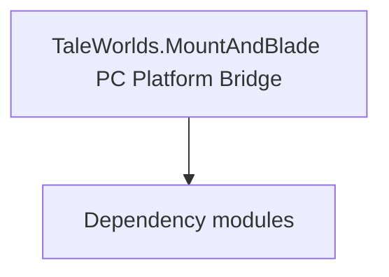

# TaleWorlds.MountAndBlade PC Platform Bridge

**One-line responsibility:** This page covers all 1 business types under `TaleWorlds.MountAndBlade PC Platform Bridge` as a family index, giving each type its namespace, responsibility, and typical timing so you can browse by module instead of alphabetically.

## Mental Model

Platform.PC is the PC platform bridge that maps engine calls for platform capabilities (save path, input, system dialogs, file pickers) to concrete PC implementations. It is part of the platform abstraction so upper logic does not depend on a specific OS; mods should always go through the abstraction, never write PC-specific Win32/file code, or other-platform builds break.

## When to Use

When you need a platform capability (e.g. resolve the save directory, pop a system dialog), use the platform abstraction rather than platform-specific code.

## Dependencies

The types under `TaleWorlds.MountAndBlade PC Platform Bridge` depend on the following modules; missing any of them causes compile- or run-time failure.

- [MBSubModuleBase](../../core/MBSubModuleBase)
- [SaveManager](../../save-system/SaveManager)
- [API Overview](../../_index)

## Type Catalog

| Type | Namespace | Purpose | Timing |
| --- | --- | --- | --- |
| `PlatformPCSubModule` | TaleWorlds.MountAndBlade.Platform.PC | Module entry base class that registers behaviors and override points. Its lifetime spans the whole session; do not fetch systems that are not yet ready (e.g. before loading) at the wrong phase. | Runtime |

## Risk & Boundaries

Platform bridges are valid only on PC builds; cross-platform (console/cloud) references need macro guards or the platform abstraction interface, otherwise other-platform builds fail.

## See Also

- [MBSubModuleBase](../../core/MBSubModuleBase)
- [SaveManager](../../save-system/SaveManager)
- [API Overview](../../_index)
