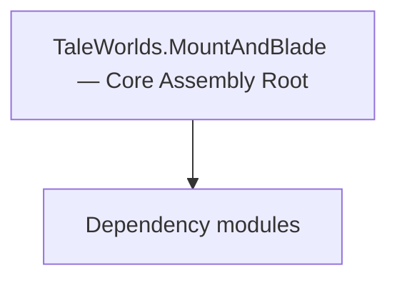

# TaleWorlds.MountAndBlade — Core Assembly Root

**One-line responsibility:** This page covers all 777 business types under `TaleWorlds.MountAndBlade — Core Assembly Root` as a family index, giving each type its namespace, responsibility, and typical timing so you can browse by module instead of alphabetically.

## Mental Model

TaleWorlds.MountAndBlade is the root namespace of the Mount & Blade core assembly, collecting global types that do not belong to a more specific subsystem (Campaign/Mission/View/UI): order systems (Order/VisualOrder), battle scoring (BattleScore), platform bridges (Platform.PC), and dedicated-server client helpers. It is the glue between engine and gameplay and holds no core gameplay rules itself.

## When to Use

Reach for these types when you need orders, battle scoring, or platform bridging. Do not treat the root as a gameplay-rule library; those live in Campaign/Mission subsystems.

## Dependencies

The types under `TaleWorlds.MountAndBlade — Core Assembly Root` depend on the following modules; missing any of them causes compile- or run-time failure.

- [Campaign](../../campaign/Campaign)
- [Mission](../../mission/Mission)
- [API Overview](../../_index)

## Type Catalog

| Type | Namespace | Purpose | Timing |
| --- | --- | --- | --- |
| `ActionCodeType` | TaleWorlds.MountAndBlade | A business type under this namespace that carries its derived convention responsibility. Confirm its lifecycle and owning system before calling; do not reference an unready instance at the wrong phase. World-state changes should go through the corresponding Action/Behavior, not direct field mutation. | Runtime |
| `ActionIndexCache` | TaleWorlds.MountAndBlade | A business type under this namespace that carries its derived convention responsibility. Confirm its lifecycle and owning system before calling; do not reference an unready instance at the wrong phase. World-state changes should go through the corresponding Action/Behavior, not direct field mutation. | Runtime |
| `ActionStage` | TaleWorlds.MountAndBlade | A business type under this namespace that carries its derived convention responsibility. Confirm its lifecycle and owning system before calling; do not reference an unready instance at the wrong phase. World-state changes should go through the corresponding Action/Behavior, not direct field mutation. | Runtime |
| `AddPlayersResult` | TaleWorlds.MountAndBlade | A business type under this namespace that carries its derived convention responsibility. Confirm its lifecycle and owning system before calling; do not reference an unready instance at the wrong phase. World-state changes should go through the corresponding Action/Behavior, not direct field mutation. | Runtime |
| `AgentBuildData` | TaleWorlds.MountAndBlade | A business type under this namespace that carries its derived convention responsibility. Confirm its lifecycle and owning system before calling; do not reference an unready instance at the wrong phase. World-state changes should go through the corresponding Action/Behavior, not direct field mutation. | Runtime |
| `AgentCapsuleData` | TaleWorlds.MountAndBlade | A business type under this namespace that carries its derived convention responsibility. Confirm its lifecycle and owning system before calling; do not reference an unready instance at the wrong phase. World-state changes should go through the corresponding Action/Behavior, not direct field mutation. | Runtime |
| `AgentCommonAILogic` | TaleWorlds.MountAndBlade | AI decision implementation that must be interruptible and serializable to support saving and undo. Search must be depth/time bounded to avoid stalls. | Runtime |
| `AgentComponent` | TaleWorlds.MountAndBlade | A business type under this namespace that carries its derived convention responsibility. Confirm its lifecycle and owning system before calling; do not reference an unready instance at the wrong phase. World-state changes should go through the corresponding Action/Behavior, not direct field mutation. | Runtime |
| `AgentComponentExtensions` | TaleWorlds.MountAndBlade | A business type under this namespace that carries its derived convention responsibility. Confirm its lifecycle and owning system before calling; do not reference an unready instance at the wrong phase. World-state changes should go through the corresponding Action/Behavior, not direct field mutation. | Runtime |
| `AgentController` | TaleWorlds.MountAndBlade | A business type under this namespace that carries its derived convention responsibility. Confirm its lifecycle and owning system before calling; do not reference an unready instance at the wrong phase. World-state changes should go through the corresponding Action/Behavior, not direct field mutation. | Runtime |
| `AgentCreationResult` | TaleWorlds.MountAndBlade | A business type under this namespace that carries its derived convention responsibility. Confirm its lifecycle and owning system before calling; do not reference an unready instance at the wrong phase. World-state changes should go through the corresponding Action/Behavior, not direct field mutation. | Runtime |
| `AgentDrivenProperties` | TaleWorlds.MountAndBlade | A business type under this namespace that carries its derived convention responsibility. Confirm its lifecycle and owning system before calling; do not reference an unready instance at the wrong phase. World-state changes should go through the corresponding Action/Behavior, not direct field mutation. | Runtime |
| `AgentHelper` | TaleWorlds.MountAndBlade | Static helper utility that concentrates a cross-cutting operation (open screen, compute result, resolve entity). Call it from the correct system context; do not instantiate it as stateful. | Runtime |
| `AgentHumanAILogic` | TaleWorlds.MountAndBlade | AI decision implementation that must be interruptible and serializable to support saving and undo. Search must be depth/time bounded to avoid stalls. | Runtime |
| `AgentLastHitInfo` | TaleWorlds.MountAndBlade | A business type under this namespace that carries its derived convention responsibility. Confirm its lifecycle and owning system before calling; do not reference an unready instance at the wrong phase. World-state changes should go through the corresponding Action/Behavior, not direct field mutation. | Runtime |
| `AgentMovementLockedState` | TaleWorlds.MountAndBlade | A business type under this namespace that carries its derived convention responsibility. Confirm its lifecycle and owning system before calling; do not reference an unready instance at the wrong phase. World-state changes should go through the corresponding Action/Behavior, not direct field mutation. | Runtime |
| `AgentPropertiesModifiers` | TaleWorlds.MountAndBlade | A business type under this namespace that carries its derived convention responsibility. Confirm its lifecycle and owning system before calling; do not reference an unready instance at the wrong phase. World-state changes should go through the corresponding Action/Behavior, not direct field mutation. | Runtime |
| `AgentProximityMap` | TaleWorlds.MountAndBlade | A business type under this namespace that carries its derived convention responsibility. Confirm its lifecycle and owning system before calling; do not reference an unready instance at the wrong phase. World-state changes should go through the corresponding Action/Behavior, not direct field mutation. | Runtime |
| `AgentSpawnData` | TaleWorlds.MountAndBlade | Board-game piece description with attributes and movement rules. State must be fully serializable to reconstruct the match. | Runtime |
| `AgentStatCalculateModel` | TaleWorlds.MountAndBlade | Domain model that aggregates rules and calculations for Behaviors to call. When you replace a model you must provide an equivalent contract; an empty replacement hands null to its dependents. | Runtime |
| `AgentVictoryLogic` | TaleWorlds.MountAndBlade | A business type under this namespace that carries its derived convention responsibility. Confirm its lifecycle and owning system before calling; do not reference an unready instance at the wrong phase. World-state changes should go through the corresponding Action/Behavior, not direct field mutation. | Runtime |
| `AgentVisualHolder` | TaleWorlds.MountAndBlade | A business type under this namespace that carries its derived convention responsibility. Confirm its lifecycle and owning system before calling; do not reference an unready instance at the wrong phase. World-state changes should go through the corresponding Action/Behavior, not direct field mutation. | Runtime |
| `AgentVisualsData` | TaleWorlds.MountAndBlade | A business type under this namespace that carries its derived convention responsibility. Confirm its lifecycle and owning system before calling; do not reference an unready instance at the wrong phase. World-state changes should go through the corresponding Action/Behavior, not direct field mutation. | Runtime |
| `AIScriptedFrameFlags` | TaleWorlds.MountAndBlade | AI decision implementation that must be interruptible and serializable to support saving and undo. Search must be depth/time bounded to avoid stalls. | Runtime |
| `AISimpleBehaviorKind` | TaleWorlds.MountAndBlade | AI decision implementation that must be interruptible and serializable to support saving and undo. Search must be depth/time bounded to avoid stalls. | Runtime |
| `AISpecialCombatModeFlags` | TaleWorlds.MountAndBlade | AI decision implementation that must be interruptible and serializable to support saving and undo. Search must be depth/time bounded to avoid stalls. | Runtime |
| `AIStateFlag` | TaleWorlds.MountAndBlade | AI decision implementation that must be interruptible and serializable to support saving and undo. Search must be depth/time bounded to avoid stalls. | Runtime |
| `AITargetVisibilityState` | TaleWorlds.MountAndBlade | AI decision implementation that must be interruptible and serializable to support saving and undo. Search must be depth/time bounded to avoid stalls. | Runtime |
| `AnimatedFlag` | TaleWorlds.MountAndBlade | A business type under this namespace that carries its derived convention responsibility. Confirm its lifecycle and owning system before calling; do not reference an unready instance at the wrong phase. World-state changes should go through the corresponding Action/Behavior, not direct field mutation. | Runtime |
| `AnimationSystemBoneData` | TaleWorlds.MountAndBlade | A business type under this namespace that carries its derived convention responsibility. Confirm its lifecycle and owning system before calling; do not reference an unready instance at the wrong phase. World-state changes should go through the corresponding Action/Behavior, not direct field mutation. | Runtime |
| `AnimationSystemBoneDataBiped` | TaleWorlds.MountAndBlade | A business type under this namespace that carries its derived convention responsibility. Confirm its lifecycle and owning system before calling; do not reference an unready instance at the wrong phase. World-state changes should go through the corresponding Action/Behavior, not direct field mutation. | Runtime |
| `AnimationSystemBoneDataQuadruped` | TaleWorlds.MountAndBlade | A business type under this namespace that carries its derived convention responsibility. Confirm its lifecycle and owning system before calling; do not reference an unready instance at the wrong phase. World-state changes should go through the corresponding Action/Behavior, not direct field mutation. | Runtime |
| `AnimationSystemData` | TaleWorlds.MountAndBlade | A business type under this namespace that carries its derived convention responsibility. Confirm its lifecycle and owning system before calling; do not reference an unready instance at the wrong phase. World-state changes should go through the corresponding Action/Behavior, not direct field mutation. | Runtime |
| `AnimationSystemDataQuadruped` | TaleWorlds.MountAndBlade | A business type under this namespace that carries its derived convention responsibility. Confirm its lifecycle and owning system before calling; do not reference an unready instance at the wrong phase. World-state changes should go through the corresponding Action/Behavior, not direct field mutation. | Runtime |
| `AnimFlags` | TaleWorlds.MountAndBlade | A business type under this namespace that carries its derived convention responsibility. Confirm its lifecycle and owning system before calling; do not reference an unready instance at the wrong phase. World-state changes should go through the corresponding Action/Behavior, not direct field mutation. | Runtime |
| `ArcherPosition` | TaleWorlds.MountAndBlade | A business type under this namespace that carries its derived convention responsibility. Confirm its lifecycle and owning system before calling; do not reference an unready instance at the wrong phase. World-state changes should go through the corresponding Action/Behavior, not direct field mutation. | Runtime |
| `ArmyManagementHotkeyCategory` | TaleWorlds.MountAndBlade | A business type under this namespace that carries its derived convention responsibility. Confirm its lifecycle and owning system before calling; do not reference an unready instance at the wrong phase. World-state changes should go through the corresponding Action/Behavior, not direct field mutation. | Runtime |
| `ArrangementOrder` | TaleWorlds.MountAndBlade | Battle order / formation sequence describing a unit’s formation and movement intent, interpreted and executed by the Order system. | Runtime |
| `ArrangementOrderEnum` | TaleWorlds.MountAndBlade | Battle order / formation sequence describing a unit’s formation and movement intent, interpreted and executed by the Order system. | Runtime |
| `AssignPlayerRoleInTeamMissionController` | TaleWorlds.MountAndBlade | A business type under this namespace that carries its derived convention responsibility. Confirm its lifecycle and owning system before calling; do not reference an unready instance at the wrong phase. World-state changes should go through the corresponding Action/Behavior, not direct field mutation. | Runtime |
| `AttackCollisionData` | TaleWorlds.MountAndBlade | A business type under this namespace that carries its derived convention responsibility. Confirm its lifecycle and owning system before calling; do not reference an unready instance at the wrong phase. World-state changes should go through the corresponding Action/Behavior, not direct field mutation. | Runtime |
| `AttackEntityOrderSecondaryDetachment` | TaleWorlds.MountAndBlade | Battle order / formation sequence describing a unit’s formation and movement intent, interpreted and executed by the Order system. | Runtime |
| `AttackInformation` | TaleWorlds.MountAndBlade | A business type under this namespace that carries its derived convention responsibility. Confirm its lifecycle and owning system before calling; do not reference an unready instance at the wrong phase. World-state changes should go through the corresponding Action/Behavior, not direct field mutation. | Runtime |
| `Axis` | TaleWorlds.MountAndBlade | A business type under this namespace that carries its derived convention responsibility. Confirm its lifecycle and owning system before calling; do not reference an unready instance at the wrong phase. World-state changes should go through the corresponding Action/Behavior, not direct field mutation. | Runtime |
| `Ballista` | TaleWorlds.MountAndBlade | A business type under this namespace that carries its derived convention responsibility. Confirm its lifecycle and owning system before calling; do not reference an unready instance at the wrong phase. World-state changes should go through the corresponding Action/Behavior, not direct field mutation. | Runtime |
| `BallistaAI` | TaleWorlds.MountAndBlade | AI decision implementation that must be interruptible and serializable to support saving and undo. Search must be depth/time bounded to avoid stalls. | Runtime |
| `BannerBearerLogic` | TaleWorlds.MountAndBlade | A business type under this namespace that carries its derived convention responsibility. Confirm its lifecycle and owning system before calling; do not reference an unready instance at the wrong phase. World-state changes should go through the corresponding Action/Behavior, not direct field mutation. | Runtime |
| `BannerBuilderState` | TaleWorlds.MountAndBlade | A business type under this namespace that carries its derived convention responsibility. Confirm its lifecycle and owning system before calling; do not reference an unready instance at the wrong phase. World-state changes should go through the corresponding Action/Behavior, not direct field mutation. | Runtime |
| `BannerInstance` | TaleWorlds.MountAndBlade | A business type under this namespace that carries its derived convention responsibility. Confirm its lifecycle and owning system before calling; do not reference an unready instance at the wrong phase. World-state changes should go through the corresponding Action/Behavior, not direct field mutation. | Runtime |
| `BannerlordConfig` | TaleWorlds.MountAndBlade | A business type under this namespace that carries its derived convention responsibility. Confirm its lifecycle and owning system before calling; do not reference an unready instance at the wrong phase. World-state changes should go through the corresponding Action/Behavior, not direct field mutation. | Runtime |
| `BannerlordFriendListService` | TaleWorlds.MountAndBlade | A business type under this namespace that carries its derived convention responsibility. Confirm its lifecycle and owning system before calling; do not reference an unready instance at the wrong phase. World-state changes should go through the corresponding Action/Behavior, not direct field mutation. | Runtime |
| `BannerlordMissions` | TaleWorlds.MountAndBlade | A business type under this namespace that carries its derived convention responsibility. Confirm its lifecycle and owning system before calling; do not reference an unready instance at the wrong phase. World-state changes should go through the corresponding Action/Behavior, not direct field mutation. | Runtime |
| `BannerlordNetwork` | TaleWorlds.MountAndBlade | A business type under this namespace that carries its derived convention responsibility. Confirm its lifecycle and owning system before calling; do not reference an unready instance at the wrong phase. World-state changes should go through the corresponding Action/Behavior, not direct field mutation. | Runtime |
| `BannerlordTableauManager` | TaleWorlds.MountAndBlade | A business type under this namespace that carries its derived convention responsibility. Confirm its lifecycle and owning system before calling; do not reference an unready instance at the wrong phase. World-state changes should go through the corresponding Action/Behavior, not direct field mutation. | Runtime |
| `BannerState` | TaleWorlds.MountAndBlade | A business type under this namespace that carries its derived convention responsibility. Confirm its lifecycle and owning system before calling; do not reference an unready instance at the wrong phase. World-state changes should go through the corresponding Action/Behavior, not direct field mutation. | Runtime |
| `BaseNetworkComponentData` | TaleWorlds.MountAndBlade | A business type under this namespace that carries its derived convention responsibility. Confirm its lifecycle and owning system before calling; do not reference an unready instance at the wrong phase. World-state changes should go through the corresponding Action/Behavior, not direct field mutation. | Runtime |
| `BaseSynchedMissionObjectReadableRecord` | TaleWorlds.MountAndBlade | A business type under this namespace that carries its derived convention responsibility. Confirm its lifecycle and owning system before calling; do not reference an unready instance at the wrong phase. World-state changes should go through the corresponding Action/Behavior, not direct field mutation. | Runtime |
| `BasicBattleAgentOrigin` | TaleWorlds.MountAndBlade | A business type under this namespace that carries its derived convention responsibility. Confirm its lifecycle and owning system before calling; do not reference an unready instance at the wrong phase. World-state changes should go through the corresponding Action/Behavior, not direct field mutation. | Runtime |
| `BasicGameStarter` | TaleWorlds.MountAndBlade | A business type under this namespace that carries its derived convention responsibility. Confirm its lifecycle and owning system before calling; do not reference an unready instance at the wrong phase. World-state changes should go through the corresponding Action/Behavior, not direct field mutation. | Runtime |
| `BasicLeaveMissionLogic` | TaleWorlds.MountAndBlade | Mission logic that defines the flow and win/lose conditions of that mission, assembled by the Mission on load. Win/lose resolution must be idempotent — repeated triggers must not double-settle. | Runtime |
| `BatteringRam` | TaleWorlds.MountAndBlade | A business type under this namespace that carries its derived convention responsibility. Confirm its lifecycle and owning system before calling; do not reference an unready instance at the wrong phase. World-state changes should go through the corresponding Action/Behavior, not direct field mutation. | Runtime |
| `BatteringRamAI` | TaleWorlds.MountAndBlade | AI decision implementation that must be interruptible and serializable to support saving and undo. Search must be depth/time bounded to avoid stalls. | Runtime |
| `BatteringRamRecord` | TaleWorlds.MountAndBlade | A business type under this namespace that carries its derived convention responsibility. Confirm its lifecycle and owning system before calling; do not reference an unready instance at the wrong phase. World-state changes should go through the corresponding Action/Behavior, not direct field mutation. | Runtime |
| `BattleDeploymentMissionController` | TaleWorlds.MountAndBlade | A business type under this namespace that carries its derived convention responsibility. Confirm its lifecycle and owning system before calling; do not reference an unready instance at the wrong phase. World-state changes should go through the corresponding Action/Behavior, not direct field mutation. | Runtime |
| `BattleEndLogic` | TaleWorlds.MountAndBlade | A business type under this namespace that carries its derived convention responsibility. Confirm its lifecycle and owning system before calling; do not reference an unready instance at the wrong phase. World-state changes should go through the corresponding Action/Behavior, not direct field mutation. | Runtime |
| `BattleHighlightsController` | TaleWorlds.MountAndBlade | A business type under this namespace that carries its derived convention responsibility. Confirm its lifecycle and owning system before calling; do not reference an unready instance at the wrong phase. World-state changes should go through the corresponding Action/Behavior, not direct field mutation. | Runtime |
| `BattleMissionStarterLogic` | TaleWorlds.MountAndBlade | A business type under this namespace that carries its derived convention responsibility. Confirm its lifecycle and owning system before calling; do not reference an unready instance at the wrong phase. World-state changes should go through the corresponding Action/Behavior, not direct field mutation. | Runtime |
| `BattleObserverMissionLogic` | TaleWorlds.MountAndBlade | Mission logic that defines the flow and win/lose conditions of that mission, assembled by the Mission on load. Win/lose resolution must be idempotent — repeated triggers must not double-settle. | Runtime |
| `BattlePowerCalculationLogic` | TaleWorlds.MountAndBlade | A business type under this namespace that carries its derived convention responsibility. Confirm its lifecycle and owning system before calling; do not reference an unready instance at the wrong phase. World-state changes should go through the corresponding Action/Behavior, not direct field mutation. | Runtime |
| `BattleReinforcementsSpawnController` | TaleWorlds.MountAndBlade | Board-game piece description with attributes and movement rules. State must be fully serializable to reconstruct the match. | Runtime |
| `BattleSideSpawnPathSelector` | TaleWorlds.MountAndBlade | Board-game piece description with attributes and movement rules. State must be fully serializable to reconstruct the match. | Runtime |
| `BattleSizeQualifier` | TaleWorlds.MountAndBlade | A business type under this namespace that carries its derived convention responsibility. Confirm its lifecycle and owning system before calling; do not reference an unready instance at the wrong phase. World-state changes should go through the corresponding Action/Behavior, not direct field mutation. | Runtime |
| `BattleSizeType` | TaleWorlds.MountAndBlade | A business type under this namespace that carries its derived convention responsibility. Confirm its lifecycle and owning system before calling; do not reference an unready instance at the wrong phase. World-state changes should go through the corresponding Action/Behavior, not direct field mutation. | Runtime |
| `BattleSpawnFrameBehavior` | TaleWorlds.MountAndBlade | Board-game piece description with attributes and movement rules. State must be fully serializable to reconstruct the match. | Runtime |
| `BattleSpawnPathSelector` | TaleWorlds.MountAndBlade | Board-game piece description with attributes and movement rules. State must be fully serializable to reconstruct the match. | Runtime |
| `BattleViewModel` | TaleWorlds.MountAndBlade | Gauntlet UI data view-model that exposes properties and commands to the interface, reacts to input and notifies refreshes. A VM is only a projection of state; commands should only trigger Actions or Behaviors. | Runtime |
| `BehaviorAdvance` | TaleWorlds.MountAndBlade | A business type under this namespace that carries its derived convention responsibility. Confirm its lifecycle and owning system before calling; do not reference an unready instance at the wrong phase. World-state changes should go through the corresponding Action/Behavior, not direct field mutation. | Runtime |
| `BehaviorAssaultWalls` | TaleWorlds.MountAndBlade | A business type under this namespace that carries its derived convention responsibility. Confirm its lifecycle and owning system before calling; do not reference an unready instance at the wrong phase. World-state changes should go through the corresponding Action/Behavior, not direct field mutation. | Runtime |
| `BehaviorCautiousAdvance` | TaleWorlds.MountAndBlade | A business type under this namespace that carries its derived convention responsibility. Confirm its lifecycle and owning system before calling; do not reference an unready instance at the wrong phase. World-state changes should go through the corresponding Action/Behavior, not direct field mutation. | Runtime |
| `BehaviorCavalryScreen` | TaleWorlds.MountAndBlade | A business type under this namespace that carries its derived convention responsibility. Confirm its lifecycle and owning system before calling; do not reference an unready instance at the wrong phase. World-state changes should go through the corresponding Action/Behavior, not direct field mutation. | Runtime |
| `BehaviorCharge` | TaleWorlds.MountAndBlade | A business type under this namespace that carries its derived convention responsibility. Confirm its lifecycle and owning system before calling; do not reference an unready instance at the wrong phase. World-state changes should go through the corresponding Action/Behavior, not direct field mutation. | Runtime |
| `BehaviorComponent` | TaleWorlds.MountAndBlade | A business type under this namespace that carries its derived convention responsibility. Confirm its lifecycle and owning system before calling; do not reference an unready instance at the wrong phase. World-state changes should go through the corresponding Action/Behavior, not direct field mutation. | Runtime |
| `BehaviorData` | TaleWorlds.MountAndBlade | A business type under this namespace that carries its derived convention responsibility. Confirm its lifecycle and owning system before calling; do not reference an unready instance at the wrong phase. World-state changes should go through the corresponding Action/Behavior, not direct field mutation. | Runtime |
| `BehaviorDefend` | TaleWorlds.MountAndBlade | A business type under this namespace that carries its derived convention responsibility. Confirm its lifecycle and owning system before calling; do not reference an unready instance at the wrong phase. World-state changes should go through the corresponding Action/Behavior, not direct field mutation. | Runtime |
| `BehaviorDefendCastleKeyPosition` | TaleWorlds.MountAndBlade | A business type under this namespace that carries its derived convention responsibility. Confirm its lifecycle and owning system before calling; do not reference an unready instance at the wrong phase. World-state changes should go through the corresponding Action/Behavior, not direct field mutation. | Runtime |
| `BehaviorDefendKeyPosition` | TaleWorlds.MountAndBlade | A business type under this namespace that carries its derived convention responsibility. Confirm its lifecycle and owning system before calling; do not reference an unready instance at the wrong phase. World-state changes should go through the corresponding Action/Behavior, not direct field mutation. | Runtime |
| `BehaviorDefendSiegeWeapon` | TaleWorlds.MountAndBlade | A business type under this namespace that carries its derived convention responsibility. Confirm its lifecycle and owning system before calling; do not reference an unready instance at the wrong phase. World-state changes should go through the corresponding Action/Behavior, not direct field mutation. | Runtime |
| `BehaviorDefensiveRing` | TaleWorlds.MountAndBlade | A business type under this namespace that carries its derived convention responsibility. Confirm its lifecycle and owning system before calling; do not reference an unready instance at the wrong phase. World-state changes should go through the corresponding Action/Behavior, not direct field mutation. | Runtime |
| `BehaviorDestroySiegeWeapons` | TaleWorlds.MountAndBlade | A business type under this namespace that carries its derived convention responsibility. Confirm its lifecycle and owning system before calling; do not reference an unready instance at the wrong phase. World-state changes should go through the corresponding Action/Behavior, not direct field mutation. | Runtime |
| `BehaviorEliminateEnemyInsideCastle` | TaleWorlds.MountAndBlade | A business type under this namespace that carries its derived convention responsibility. Confirm its lifecycle and owning system before calling; do not reference an unready instance at the wrong phase. World-state changes should go through the corresponding Action/Behavior, not direct field mutation. | Runtime |
| `BehaviorFireFromInfantryCover` | TaleWorlds.MountAndBlade | A business type under this namespace that carries its derived convention responsibility. Confirm its lifecycle and owning system before calling; do not reference an unready instance at the wrong phase. World-state changes should go through the corresponding Action/Behavior, not direct field mutation. | Runtime |
| `BehaviorFlank` | TaleWorlds.MountAndBlade | A business type under this namespace that carries its derived convention responsibility. Confirm its lifecycle and owning system before calling; do not reference an unready instance at the wrong phase. World-state changes should go through the corresponding Action/Behavior, not direct field mutation. | Runtime |
| `BehaviorGeneral` | TaleWorlds.MountAndBlade | A business type under this namespace that carries its derived convention responsibility. Confirm its lifecycle and owning system before calling; do not reference an unready instance at the wrong phase. World-state changes should go through the corresponding Action/Behavior, not direct field mutation. | Runtime |
| `BehaviorHoldHighGround` | TaleWorlds.MountAndBlade | A business type under this namespace that carries its derived convention responsibility. Confirm its lifecycle and owning system before calling; do not reference an unready instance at the wrong phase. World-state changes should go through the corresponding Action/Behavior, not direct field mutation. | Runtime |
| `BehaviorHorseArcherSkirmish` | TaleWorlds.MountAndBlade | A business type under this namespace that carries its derived convention responsibility. Confirm its lifecycle and owning system before calling; do not reference an unready instance at the wrong phase. World-state changes should go through the corresponding Action/Behavior, not direct field mutation. | Runtime |
| `BehaviorMountedSkirmish` | TaleWorlds.MountAndBlade | A business type under this namespace that carries its derived convention responsibility. Confirm its lifecycle and owning system before calling; do not reference an unready instance at the wrong phase. World-state changes should go through the corresponding Action/Behavior, not direct field mutation. | Runtime |
| `BehaviorProtectFlank` | TaleWorlds.MountAndBlade | A business type under this namespace that carries its derived convention responsibility. Confirm its lifecycle and owning system before calling; do not reference an unready instance at the wrong phase. World-state changes should go through the corresponding Action/Behavior, not direct field mutation. | Runtime |
| `BehaviorProtectGeneral` | TaleWorlds.MountAndBlade | A business type under this namespace that carries its derived convention responsibility. Confirm its lifecycle and owning system before calling; do not reference an unready instance at the wrong phase. World-state changes should go through the corresponding Action/Behavior, not direct field mutation. | Runtime |
| `BehaviorPullBack` | TaleWorlds.MountAndBlade | A business type under this namespace that carries its derived convention responsibility. Confirm its lifecycle and owning system before calling; do not reference an unready instance at the wrong phase. World-state changes should go through the corresponding Action/Behavior, not direct field mutation. | Runtime |
| `BehaviorRegroup` | TaleWorlds.MountAndBlade | A business type under this namespace that carries its derived convention responsibility. Confirm its lifecycle and owning system before calling; do not reference an unready instance at the wrong phase. World-state changes should go through the corresponding Action/Behavior, not direct field mutation. | Runtime |
| `BehaviorReserve` | TaleWorlds.MountAndBlade | A business type under this namespace that carries its derived convention responsibility. Confirm its lifecycle and owning system before calling; do not reference an unready instance at the wrong phase. World-state changes should go through the corresponding Action/Behavior, not direct field mutation. | Runtime |
| `BehaviorRetakeCastleKeyPosition` | TaleWorlds.MountAndBlade | A business type under this namespace that carries its derived convention responsibility. Confirm its lifecycle and owning system before calling; do not reference an unready instance at the wrong phase. World-state changes should go through the corresponding Action/Behavior, not direct field mutation. | Runtime |
| `BehaviorRetreat` | TaleWorlds.MountAndBlade | A business type under this namespace that carries its derived convention responsibility. Confirm its lifecycle and owning system before calling; do not reference an unready instance at the wrong phase. World-state changes should go through the corresponding Action/Behavior, not direct field mutation. | Runtime |
| `BehaviorRetreatToCastle` | TaleWorlds.MountAndBlade | A business type under this namespace that carries its derived convention responsibility. Confirm its lifecycle and owning system before calling; do not reference an unready instance at the wrong phase. World-state changes should go through the corresponding Action/Behavior, not direct field mutation. | Runtime |
| `BehaviorRetreatToKeep` | TaleWorlds.MountAndBlade | A business type under this namespace that carries its derived convention responsibility. Confirm its lifecycle and owning system before calling; do not reference an unready instance at the wrong phase. World-state changes should go through the corresponding Action/Behavior, not direct field mutation. | Runtime |
| `BehaviorSallyOut` | TaleWorlds.MountAndBlade | A business type under this namespace that carries its derived convention responsibility. Confirm its lifecycle and owning system before calling; do not reference an unready instance at the wrong phase. World-state changes should go through the corresponding Action/Behavior, not direct field mutation. | Runtime |
| `BehaviorScreenedSkirmish` | TaleWorlds.MountAndBlade | A business type under this namespace that carries its derived convention responsibility. Confirm its lifecycle and owning system before calling; do not reference an unready instance at the wrong phase. World-state changes should go through the corresponding Action/Behavior, not direct field mutation. | Runtime |
| `BehaviorSergeantMPInfantry` | TaleWorlds.MountAndBlade | A business type under this namespace that carries its derived convention responsibility. Confirm its lifecycle and owning system before calling; do not reference an unready instance at the wrong phase. World-state changes should go through the corresponding Action/Behavior, not direct field mutation. | Runtime |
| `BehaviorSergeantMPLastFlagLastStand` | TaleWorlds.MountAndBlade | A business type under this namespace that carries its derived convention responsibility. Confirm its lifecycle and owning system before calling; do not reference an unready instance at the wrong phase. World-state changes should go through the corresponding Action/Behavior, not direct field mutation. | Runtime |
| `BehaviorSergeantMPMounted` | TaleWorlds.MountAndBlade | A business type under this namespace that carries its derived convention responsibility. Confirm its lifecycle and owning system before calling; do not reference an unready instance at the wrong phase. World-state changes should go through the corresponding Action/Behavior, not direct field mutation. | Runtime |
| `BehaviorSergeantMPMountedRanged` | TaleWorlds.MountAndBlade | A business type under this namespace that carries its derived convention responsibility. Confirm its lifecycle and owning system before calling; do not reference an unready instance at the wrong phase. World-state changes should go through the corresponding Action/Behavior, not direct field mutation. | Runtime |
| `BehaviorSergeantMPRanged` | TaleWorlds.MountAndBlade | A business type under this namespace that carries its derived convention responsibility. Confirm its lifecycle and owning system before calling; do not reference an unready instance at the wrong phase. World-state changes should go through the corresponding Action/Behavior, not direct field mutation. | Runtime |
| `BehaviorShootFromCastleWalls` | TaleWorlds.MountAndBlade | A business type under this namespace that carries its derived convention responsibility. Confirm its lifecycle and owning system before calling; do not reference an unready instance at the wrong phase. World-state changes should go through the corresponding Action/Behavior, not direct field mutation. | Runtime |
| `BehaviorShootFromCliff` | TaleWorlds.MountAndBlade | A business type under this namespace that carries its derived convention responsibility. Confirm its lifecycle and owning system before calling; do not reference an unready instance at the wrong phase. World-state changes should go through the corresponding Action/Behavior, not direct field mutation. | Runtime |
| `BehaviorShootFromSiegeTower` | TaleWorlds.MountAndBlade | A business type under this namespace that carries its derived convention responsibility. Confirm its lifecycle and owning system before calling; do not reference an unready instance at the wrong phase. World-state changes should go through the corresponding Action/Behavior, not direct field mutation. | Runtime |
| `BehaviorSide` | TaleWorlds.MountAndBlade | A business type under this namespace that carries its derived convention responsibility. Confirm its lifecycle and owning system before calling; do not reference an unready instance at the wrong phase. World-state changes should go through the corresponding Action/Behavior, not direct field mutation. | Runtime |
| `BehaviorSkirmish` | TaleWorlds.MountAndBlade | A business type under this namespace that carries its derived convention responsibility. Confirm its lifecycle and owning system before calling; do not reference an unready instance at the wrong phase. World-state changes should go through the corresponding Action/Behavior, not direct field mutation. | Runtime |
| `BehaviorSkirmishBehindFormation` | TaleWorlds.MountAndBlade | A business type under this namespace that carries its derived convention responsibility. Confirm its lifecycle and owning system before calling; do not reference an unready instance at the wrong phase. World-state changes should go through the corresponding Action/Behavior, not direct field mutation. | Runtime |
| `BehaviorSkirmishLine` | TaleWorlds.MountAndBlade | A business type under this namespace that carries its derived convention responsibility. Confirm its lifecycle and owning system before calling; do not reference an unready instance at the wrong phase. World-state changes should go through the corresponding Action/Behavior, not direct field mutation. | Runtime |
| `BehaviorSparseSkirmish` | TaleWorlds.MountAndBlade | A business type under this namespace that carries its derived convention responsibility. Confirm its lifecycle and owning system before calling; do not reference an unready instance at the wrong phase. World-state changes should go through the corresponding Action/Behavior, not direct field mutation. | Runtime |
| `BehaviorStop` | TaleWorlds.MountAndBlade | A business type under this namespace that carries its derived convention responsibility. Confirm its lifecycle and owning system before calling; do not reference an unready instance at the wrong phase. World-state changes should go through the corresponding Action/Behavior, not direct field mutation. | Runtime |
| `BehaviorTacticalCharge` | TaleWorlds.MountAndBlade | A business type under this namespace that carries its derived convention responsibility. Confirm its lifecycle and owning system before calling; do not reference an unready instance at the wrong phase. World-state changes should go through the corresponding Action/Behavior, not direct field mutation. | Runtime |
| `BehaviorUseMurderHole` | TaleWorlds.MountAndBlade | A business type under this namespace that carries its derived convention responsibility. Confirm its lifecycle and owning system before calling; do not reference an unready instance at the wrong phase. World-state changes should go through the corresponding Action/Behavior, not direct field mutation. | Runtime |
| `BehaviorUseSiegeMachines` | TaleWorlds.MountAndBlade | A business type under this namespace that carries its derived convention responsibility. Confirm its lifecycle and owning system before calling; do not reference an unready instance at the wrong phase. World-state changes should go through the corresponding Action/Behavior, not direct field mutation. | Runtime |
| `BehaviorValues` | TaleWorlds.MountAndBlade | A business type under this namespace that carries its derived convention responsibility. Confirm its lifecycle and owning system before calling; do not reference an unready instance at the wrong phase. World-state changes should go through the corresponding Action/Behavior, not direct field mutation. | Runtime |
| `BehaviorValueSet` | TaleWorlds.MountAndBlade | A business type under this namespace that carries its derived convention responsibility. Confirm its lifecycle and owning system before calling; do not reference an unready instance at the wrong phase. World-state changes should go through the corresponding Action/Behavior, not direct field mutation. | Runtime |
| `BehaviorVanguard` | TaleWorlds.MountAndBlade | A business type under this namespace that carries its derived convention responsibility. Confirm its lifecycle and owning system before calling; do not reference an unready instance at the wrong phase. World-state changes should go through the corresponding Action/Behavior, not direct field mutation. | Runtime |
| `BehaviorWaitForLadders` | TaleWorlds.MountAndBlade | AI decision implementation that must be interruptible and serializable to support saving and undo. Search must be depth/time bounded to avoid stalls. | Runtime |
| `Bird` | TaleWorlds.MountAndBlade | A business type under this namespace that carries its derived convention responsibility. Confirm its lifecycle and owning system before calling; do not reference an unready instance at the wrong phase. World-state changes should go through the corresponding Action/Behavior, not direct field mutation. | Runtime |
| `Blow` | TaleWorlds.MountAndBlade | A business type under this namespace that carries its derived convention responsibility. Confirm its lifecycle and owning system before calling; do not reference an unready instance at the wrong phase. World-state changes should go through the corresponding Action/Behavior, not direct field mutation. | Runtime |
| `BlowFlags` | TaleWorlds.MountAndBlade | A business type under this namespace that carries its derived convention responsibility. Confirm its lifecycle and owning system before calling; do not reference an unready instance at the wrong phase. World-state changes should go through the corresponding Action/Behavior, not direct field mutation. | Runtime |
| `BlowWeaponRecord` | TaleWorlds.MountAndBlade | A business type under this namespace that carries its derived convention responsibility. Confirm its lifecycle and owning system before calling; do not reference an unready instance at the wrong phase. World-state changes should go through the corresponding Action/Behavior, not direct field mutation. | Runtime |
| `BoardGameHotkeyCategory` | TaleWorlds.MountAndBlade | A business type under this namespace that carries its derived convention responsibility. Confirm its lifecycle and owning system before calling; do not reference an unready instance at the wrong phase. World-state changes should go through the corresponding Action/Behavior, not direct field mutation. | Runtime |
| `BodyGenerator` | TaleWorlds.MountAndBlade | A business type under this namespace that carries its derived convention responsibility. Confirm its lifecycle and owning system before calling; do not reference an unready instance at the wrong phase. World-state changes should go through the corresponding Action/Behavior, not direct field mutation. | Runtime |
| `BodyMeshTypes` | TaleWorlds.MountAndBlade | A business type under this namespace that carries its derived convention responsibility. Confirm its lifecycle and owning system before calling; do not reference an unready instance at the wrong phase. World-state changes should go through the corresponding Action/Behavior, not direct field mutation. | Runtime |
| `BoneBodyPartType` | TaleWorlds.MountAndBlade | A business type under this namespace that carries its derived convention responsibility. Confirm its lifecycle and owning system before calling; do not reference an unready instance at the wrong phase. World-state changes should go through the corresponding Action/Behavior, not direct field mutation. | Runtime |
| `BoneBodyTypeData` | TaleWorlds.MountAndBlade | A business type under this namespace that carries its derived convention responsibility. Confirm its lifecycle and owning system before calling; do not reference an unready instance at the wrong phase. World-state changes should go through the corresponding Action/Behavior, not direct field mutation. | Runtime |
| `BotData` | TaleWorlds.MountAndBlade | A business type under this namespace that carries its derived convention responsibility. Confirm its lifecycle and owning system before calling; do not reference an unready instance at the wrong phase. World-state changes should go through the corresponding Action/Behavior, not direct field mutation. | Runtime |
| `BoundaryWallView` | TaleWorlds.MountAndBlade | A business type under this namespace that carries its derived convention responsibility. Confirm its lifecycle and owning system before calling; do not reference an unready instance at the wrong phase. World-state changes should go through the corresponding Action/Behavior, not direct field mutation. | Runtime |
| `CachedBool` | TaleWorlds.MountAndBlade | A business type under this namespace that carries its derived convention responsibility. Confirm its lifecycle and owning system before calling; do not reference an unready instance at the wrong phase. World-state changes should go through the corresponding Action/Behavior, not direct field mutation. | Runtime |
| `CachedFloat` | TaleWorlds.MountAndBlade | A business type under this namespace that carries its derived convention responsibility. Confirm its lifecycle and owning system before calling; do not reference an unready instance at the wrong phase. World-state changes should go through the corresponding Action/Behavior, not direct field mutation. | Runtime |
| `CameraDisplay` | TaleWorlds.MountAndBlade | A business type under this namespace that carries its derived convention responsibility. Confirm its lifecycle and owning system before calling; do not reference an unready instance at the wrong phase. World-state changes should go through the corresponding Action/Behavior, not direct field mutation. | Runtime |
| `CameraState` | TaleWorlds.MountAndBlade | A business type under this namespace that carries its derived convention responsibility. Confirm its lifecycle and owning system before calling; do not reference an unready instance at the wrong phase. World-state changes should go through the corresponding Action/Behavior, not direct field mutation. | Runtime |
| `CaptureTheFlagCapturePoint` | TaleWorlds.MountAndBlade | A business type under this namespace that carries its derived convention responsibility. Confirm its lifecycle and owning system before calling; do not reference an unready instance at the wrong phase. World-state changes should go through the corresponding Action/Behavior, not direct field mutation. | Runtime |
| `CaptureTheFlagCaptureResultEnum` | TaleWorlds.MountAndBlade | A business type under this namespace that carries its derived convention responsibility. Confirm its lifecycle and owning system before calling; do not reference an unready instance at the wrong phase. World-state changes should go through the corresponding Action/Behavior, not direct field mutation. | Runtime |
| `CaptureTheFlagFlagDirection` | TaleWorlds.MountAndBlade | A business type under this namespace that carries its derived convention responsibility. Confirm its lifecycle and owning system before calling; do not reference an unready instance at the wrong phase. World-state changes should go through the corresponding Action/Behavior, not direct field mutation. | Runtime |
| `CastleGate` | TaleWorlds.MountAndBlade | A business type under this namespace that carries its derived convention responsibility. Confirm its lifecycle and owning system before calling; do not reference an unready instance at the wrong phase. World-state changes should go through the corresponding Action/Behavior, not direct field mutation. | Runtime |
| `CastleGateAI` | TaleWorlds.MountAndBlade | AI decision implementation that must be interruptible and serializable to support saving and undo. Search must be depth/time bounded to avoid stalls. | Runtime |
| `CasualtyHandler` | TaleWorlds.MountAndBlade | A business type under this namespace that carries its derived convention responsibility. Confirm its lifecycle and owning system before calling; do not reference an unready instance at the wrong phase. World-state changes should go through the corresponding Action/Behavior, not direct field mutation. | Runtime |
| `ChatBox` | TaleWorlds.MountAndBlade | A business type under this namespace that carries its derived convention responsibility. Confirm its lifecycle and owning system before calling; do not reference an unready instance at the wrong phase. World-state changes should go through the corresponding Action/Behavior, not direct field mutation. | Runtime |
| `ChatLogHotKeyCategory` | TaleWorlds.MountAndBlade | A business type under this namespace that carries its derived convention responsibility. Confirm its lifecycle and owning system before calling; do not reference an unready instance at the wrong phase. World-state changes should go through the corresponding Action/Behavior, not direct field mutation. | Runtime |
| `ChatType` | TaleWorlds.MountAndBlade | A business type under this namespace that carries its derived convention responsibility. Confirm its lifecycle and owning system before calling; do not reference an unready instance at the wrong phase. World-state changes should go through the corresponding Action/Behavior, not direct field mutation. | Runtime |
| `CheerActionGroupEnum` | TaleWorlds.MountAndBlade | A business type under this namespace that carries its derived convention responsibility. Confirm its lifecycle and owning system before calling; do not reference an unready instance at the wrong phase. World-state changes should go through the corresponding Action/Behavior, not direct field mutation. | Runtime |
| `CheerReactionTimeSettings` | TaleWorlds.MountAndBlade | A business type under this namespace that carries its derived convention responsibility. Confirm its lifecycle and owning system before calling; do not reference an unready instance at the wrong phase. World-state changes should go through the corresponding Action/Behavior, not direct field mutation. | Runtime |
| `CircularFormation` | TaleWorlds.MountAndBlade | A business type under this namespace that carries its derived convention responsibility. Confirm its lifecycle and owning system before calling; do not reference an unready instance at the wrong phase. World-state changes should go through the corresponding Action/Behavior, not direct field mutation. | Runtime |
| `CircularSchiltronFormation` | TaleWorlds.MountAndBlade | A business type under this namespace that carries its derived convention responsibility. Confirm its lifecycle and owning system before calling; do not reference an unready instance at the wrong phase. World-state changes should go through the corresponding Action/Behavior, not direct field mutation. | Runtime |
| `ClanFriendListService` | TaleWorlds.MountAndBlade | A business type under this namespace that carries its derived convention responsibility. Confirm its lifecycle and owning system before calling; do not reference an unready instance at the wrong phase. World-state changes should go through the corresponding Action/Behavior, not direct field mutation. | Runtime |
| `ClearHandInverseKinematicsOnStopUsageComponent` | TaleWorlds.MountAndBlade | A business type under this namespace that carries its derived convention responsibility. Confirm its lifecycle and owning system before calling; do not reference an unready instance at the wrong phase. World-state changes should go through the corresponding Action/Behavior, not direct field mutation. | Runtime |
| `ClimbingMachineDetachment` | TaleWorlds.MountAndBlade | A business type under this namespace that carries its derived convention responsibility. Confirm its lifecycle and owning system before calling; do not reference an unready instance at the wrong phase. World-state changes should go through the corresponding Action/Behavior, not direct field mutation. | Runtime |
| `ColorAssigner` | TaleWorlds.MountAndBlade | A business type under this namespace that carries its derived convention responsibility. Confirm its lifecycle and owning system before calling; do not reference an unready instance at the wrong phase. World-state changes should go through the corresponding Action/Behavior, not direct field mutation. | Runtime |
| `ColumnFormation` | TaleWorlds.MountAndBlade | A business type under this namespace that carries its derived convention responsibility. Confirm its lifecycle and owning system before calling; do not reference an unready instance at the wrong phase. World-state changes should go through the corresponding Action/Behavior, not direct field mutation. | Runtime |
| `CombatCollisionResult` | TaleWorlds.MountAndBlade | A business type under this namespace that carries its derived convention responsibility. Confirm its lifecycle and owning system before calling; do not reference an unready instance at the wrong phase. World-state changes should go through the corresponding Action/Behavior, not direct field mutation. | Runtime |
| `CombatHitResultFlags` | TaleWorlds.MountAndBlade | A business type under this namespace that carries its derived convention responsibility. Confirm its lifecycle and owning system before calling; do not reference an unready instance at the wrong phase. World-state changes should go through the corresponding Action/Behavior, not direct field mutation. | Runtime |
| `CombatHotKeyCategory` | TaleWorlds.MountAndBlade | A business type under this namespace that carries its derived convention responsibility. Confirm its lifecycle and owning system before calling; do not reference an unready instance at the wrong phase. World-state changes should go through the corresponding Action/Behavior, not direct field mutation. | Runtime |
| `CombatLogColor` | TaleWorlds.MountAndBlade | A business type under this namespace that carries its derived convention responsibility. Confirm its lifecycle and owning system before calling; do not reference an unready instance at the wrong phase. World-state changes should go through the corresponding Action/Behavior, not direct field mutation. | Runtime |
| `CombatLogData` | TaleWorlds.MountAndBlade | A business type under this namespace that carries its derived convention responsibility. Confirm its lifecycle and owning system before calling; do not reference an unready instance at the wrong phase. World-state changes should go through the corresponding Action/Behavior, not direct field mutation. | Runtime |
| `CombatLogManager` | TaleWorlds.MountAndBlade | A business type under this namespace that carries its derived convention responsibility. Confirm its lifecycle and owning system before calling; do not reference an unready instance at the wrong phase. World-state changes should go through the corresponding Action/Behavior, not direct field mutation. | Runtime |
| `CombatSoundContainer` | TaleWorlds.MountAndBlade | AI decision implementation that must be interruptible and serializable to support saving and undo. Search must be depth/time bounded to avoid stalls. | Runtime |
| `CombatVoiceNetworkPredictionType` | TaleWorlds.MountAndBlade | A business type under this namespace that carries its derived convention responsibility. Confirm its lifecycle and owning system before calling; do not reference an unready instance at the wrong phase. World-state changes should go through the corresponding Action/Behavior, not direct field mutation. | Runtime |
| `CommonAIComponent` | TaleWorlds.MountAndBlade | AI decision implementation that must be interruptible and serializable to support saving and undo. Search must be depth/time bounded to avoid stalls. | Runtime |
| `CommunityClient` | TaleWorlds.MountAndBlade | A business type under this namespace that carries its derived convention responsibility. Confirm its lifecycle and owning system before calling; do not reference an unready instance at the wrong phase. World-state changes should go through the corresponding Action/Behavior, not direct field mutation. | Runtime |
| `CommunityGameJoinData` | TaleWorlds.MountAndBlade | A business type under this namespace that carries its derived convention responsibility. Confirm its lifecycle and owning system before calling; do not reference an unready instance at the wrong phase. World-state changes should go through the corresponding Action/Behavior, not direct field mutation. | Runtime |
| `CompassItemUpdateParams` | TaleWorlds.MountAndBlade | Parameter container carrying configuration or runtime data. Avoid holding long-lived references that hinder GC. | Runtime |
| `CompassMarker` | TaleWorlds.MountAndBlade | A business type under this namespace that carries its derived convention responsibility. Confirm its lifecycle and owning system before calling; do not reference an unready instance at the wrong phase. World-state changes should go through the corresponding Action/Behavior, not direct field mutation. | Runtime |
| `CompressionBasic` | TaleWorlds.MountAndBlade | A business type under this namespace that carries its derived convention responsibility. Confirm its lifecycle and owning system before calling; do not reference an unready instance at the wrong phase. World-state changes should go through the corresponding Action/Behavior, not direct field mutation. | Runtime |
| `CompressionInfo` | TaleWorlds.MountAndBlade | A business type under this namespace that carries its derived convention responsibility. Confirm its lifecycle and owning system before calling; do not reference an unready instance at the wrong phase. World-state changes should go through the corresponding Action/Behavior, not direct field mutation. | Runtime |
| `CompressionMatchmaker` | TaleWorlds.MountAndBlade | A business type under this namespace that carries its derived convention responsibility. Confirm its lifecycle and owning system before calling; do not reference an unready instance at the wrong phase. World-state changes should go through the corresponding Action/Behavior, not direct field mutation. | Runtime |
| `CompressionMission` | TaleWorlds.MountAndBlade | A business type under this namespace that carries its derived convention responsibility. Confirm its lifecycle and owning system before calling; do not reference an unready instance at the wrong phase. World-state changes should go through the corresponding Action/Behavior, not direct field mutation. | Runtime |
| `ConditionalEffectContainer` | TaleWorlds.MountAndBlade | AI decision implementation that must be interruptible and serializable to support saving and undo. Search must be depth/time bounded to avoid stalls. | Runtime |
| `ConsoleCommandMethod` | TaleWorlds.MountAndBlade | A business type under this namespace that carries its derived convention responsibility. Confirm its lifecycle and owning system before calling; do not reference an unready instance at the wrong phase. World-state changes should go through the corresponding Action/Behavior, not direct field mutation. | Runtime |
| `ConsoleMatchStartEndHandler` | TaleWorlds.MountAndBlade | A business type under this namespace that carries its derived convention responsibility. Confirm its lifecycle and owning system before calling; do not reference an unready instance at the wrong phase. World-state changes should go through the corresponding Action/Behavior, not direct field mutation. | Runtime |
| `ConsolesModuleExtension` | TaleWorlds.MountAndBlade | A business type under this namespace that carries its derived convention responsibility. Confirm its lifecycle and owning system before calling; do not reference an unready instance at the wrong phase. World-state changes should go through the corresponding Action/Behavior, not direct field mutation. | Runtime |
| `ConversationHotKeyCategory` | TaleWorlds.MountAndBlade | Conversation-related type participating in the dialogue tree and performance. Dialogue-line changes must mind branches and localization. | Runtime |
| `CoreManaged` | TaleWorlds.MountAndBlade | A business type under this namespace that carries its derived convention responsibility. Confirm its lifecycle and owning system before calling; do not reference an unready instance at the wrong phase. World-state changes should go through the corresponding Action/Behavior, not direct field mutation. | Runtime |
| `CosmeticsManagerHelper` | TaleWorlds.MountAndBlade | Static helper utility that concentrates a cross-cutting operation (open screen, compute result, resolve entity). Call it from the correct system context; do not instantiate it as stateful. | Runtime |
| `CraftingHotkeyCategory` | TaleWorlds.MountAndBlade | A business type under this namespace that carries its derived convention responsibility. Confirm its lifecycle and owning system before calling; do not reference an unready instance at the wrong phase. World-state changes should go through the corresponding Action/Behavior, not direct field mutation. | Runtime |
| `CreationType` | TaleWorlds.MountAndBlade | A business type under this namespace that carries its derived convention responsibility. Confirm its lifecycle and owning system before calling; do not reference an unready instance at the wrong phase. World-state changes should go through the corresponding Action/Behavior, not direct field mutation. | Runtime |
| `CrushThroughState` | TaleWorlds.MountAndBlade | A business type under this namespace that carries its derived convention responsibility. Confirm its lifecycle and owning system before calling; do not reference an unready instance at the wrong phase. World-state changes should go through the corresponding Action/Behavior, not direct field mutation. | Runtime |
| `CultureVoteTypes` | TaleWorlds.MountAndBlade | A business type under this namespace that carries its derived convention responsibility. Confirm its lifecycle and owning system before calling; do not reference an unready instance at the wrong phase. World-state changes should go through the corresponding Action/Behavior, not direct field mutation. | Runtime |
| `CustomAgentApplyDamageModel` | TaleWorlds.MountAndBlade | Domain model that aggregates rules and calculations for Behaviors to call. When you replace a model you must provide an equivalent contract; an empty replacement hands null to its dependents. | Runtime |
| `CustomBattleAgentLogic` | TaleWorlds.MountAndBlade | A business type under this namespace that carries its derived convention responsibility. Confirm its lifecycle and owning system before calling; do not reference an unready instance at the wrong phase. World-state changes should go through the corresponding Action/Behavior, not direct field mutation. | Runtime |
| `CustomBattleAgentOrigin` | TaleWorlds.MountAndBlade | A business type under this namespace that carries its derived convention responsibility. Confirm its lifecycle and owning system before calling; do not reference an unready instance at the wrong phase. World-state changes should go through the corresponding Action/Behavior, not direct field mutation. | Runtime |
| `CustomBattleAgentStatCalculateModel` | TaleWorlds.MountAndBlade | Domain model that aggregates rules and calculations for Behaviors to call. When you replace a model you must provide an equivalent contract; an empty replacement hands null to its dependents. | Runtime |
| `CustomBattleApplyWeatherEffectsModel` | TaleWorlds.MountAndBlade | Domain model that aggregates rules and calculations for Behaviors to call. When you replace a model you must provide an equivalent contract; an empty replacement hands null to its dependents. | Runtime |
| `CustomBattleAutoBlockModel` | TaleWorlds.MountAndBlade | Domain model that aggregates rules and calculations for Behaviors to call. When you replace a model you must provide an equivalent contract; an empty replacement hands null to its dependents. | Runtime |
| `CustomBattleBannerBearersModel` | TaleWorlds.MountAndBlade | Domain model that aggregates rules and calculations for Behaviors to call. When you replace a model you must provide an equivalent contract; an empty replacement hands null to its dependents. | Runtime |
| `CustomBattleCombatant` | TaleWorlds.MountAndBlade | A business type under this namespace that carries its derived convention responsibility. Confirm its lifecycle and owning system before calling; do not reference an unready instance at the wrong phase. World-state changes should go through the corresponding Action/Behavior, not direct field mutation. | Runtime |
| `CustomBattleInitializationModel` | TaleWorlds.MountAndBlade | Domain model that aggregates rules and calculations for Behaviors to call. When you replace a model you must provide an equivalent contract; an empty replacement hands null to its dependents. | Runtime |
| `CustomBattleMoraleModel` | TaleWorlds.MountAndBlade | Domain model that aggregates rules and calculations for Behaviors to call. When you replace a model you must provide an equivalent contract; an empty replacement hands null to its dependents. | Runtime |
| `CustomBattleSpawnModel` | TaleWorlds.MountAndBlade | Domain model that aggregates rules and calculations for Behaviors to call. When you replace a model you must provide an equivalent contract; an empty replacement hands null to its dependents. | Runtime |
| `CustomBattleTroopSupplier` | TaleWorlds.MountAndBlade | A business type under this namespace that carries its derived convention responsibility. Confirm its lifecycle and owning system before calling; do not reference an unready instance at the wrong phase. World-state changes should go through the corresponding Action/Behavior, not direct field mutation. | Runtime |
| `CustomGameBannedPlayerManager` | TaleWorlds.MountAndBlade | A business type under this namespace that carries its derived convention responsibility. Confirm its lifecycle and owning system before calling; do not reference an unready instance at the wrong phase. World-state changes should go through the corresponding Action/Behavior, not direct field mutation. | Runtime |
| `CustomGameUsableMap` | TaleWorlds.MountAndBlade | Scene usable object that triggers an action or menu when the player interacts with it. Interaction must be idempotent and its state must be serializable to support saving. | Runtime |
| `CustomServerAction` | TaleWorlds.MountAndBlade | Game action that encapsulates a single state change and executes it through the Action system. You must use Apply rather than mutating fields directly, otherwise you skip event cascades and corrupt saves. | Runtime |
| `DamageParticleModel` | TaleWorlds.MountAndBlade | Domain model that aggregates rules and calculations for Behaviors to call. When you replace a model you must provide an equivalent contract; an empty replacement hands null to its dependents. | Runtime |
| `DebugAgentScaleOnNetworkTestComponent` | TaleWorlds.MountAndBlade | A business type under this namespace that carries its derived convention responsibility. Confirm its lifecycle and owning system before calling; do not reference an unready instance at the wrong phase. World-state changes should go through the corresponding Action/Behavior, not direct field mutation. | Runtime |
| `DebugExtensions` | TaleWorlds.MountAndBlade | A business type under this namespace that carries its derived convention responsibility. Confirm its lifecycle and owning system before calling; do not reference an unready instance at the wrong phase. World-state changes should go through the corresponding Action/Behavior, not direct field mutation. | Runtime |
| `DebugNetworkPacketStatisticsStruct` | TaleWorlds.MountAndBlade | A business type under this namespace that carries its derived convention responsibility. Confirm its lifecycle and owning system before calling; do not reference an unready instance at the wrong phase. World-state changes should go through the corresponding Action/Behavior, not direct field mutation. | Runtime |
| `DebugNetworkPositionCompressionStatisticsStruct` | TaleWorlds.MountAndBlade | A business type under this namespace that carries its derived convention responsibility. Confirm its lifecycle and owning system before calling; do not reference an unready instance at the wrong phase. World-state changes should go through the corresponding Action/Behavior, not direct field mutation. | Runtime |
| `DebugSiegeBehavior` | TaleWorlds.MountAndBlade | A business type under this namespace that carries its derived convention responsibility. Confirm its lifecycle and owning system before calling; do not reference an unready instance at the wrong phase. World-state changes should go through the corresponding Action/Behavior, not direct field mutation. | Runtime |
| `DebugStateAttacker` | TaleWorlds.MountAndBlade | A business type under this namespace that carries its derived convention responsibility. Confirm its lifecycle and owning system before calling; do not reference an unready instance at the wrong phase. World-state changes should go through the corresponding Action/Behavior, not direct field mutation. | Runtime |
| `DebugStateDefender` | TaleWorlds.MountAndBlade | A business type under this namespace that carries its derived convention responsibility. Confirm its lifecycle and owning system before calling; do not reference an unready instance at the wrong phase. World-state changes should go through the corresponding Action/Behavior, not direct field mutation. | Runtime |
| `DedicatedServerConsoleCommandManager` | TaleWorlds.MountAndBlade | A business type under this namespace that carries its derived convention responsibility. Confirm its lifecycle and owning system before calling; do not reference an unready instance at the wrong phase. World-state changes should go through the corresponding Action/Behavior, not direct field mutation. | Runtime |
| `DedicatedServerType` | TaleWorlds.MountAndBlade | A business type under this namespace that carries its derived convention responsibility. Confirm its lifecycle and owning system before calling; do not reference an unready instance at the wrong phase. World-state changes should go through the corresponding Action/Behavior, not direct field mutation. | Runtime |
| `DefaultAgentDecideKilledOrUnconsciousModel` | TaleWorlds.MountAndBlade | Domain model that aggregates rules and calculations for Behaviors to call. When you replace a model you must provide an equivalent contract; an empty replacement hands null to its dependents. | Runtime |
| `DefaultBattleMissionAgentSpawnLogic` | TaleWorlds.MountAndBlade | Board-game piece description with attributes and movement rules. State must be fully serializable to reconstruct the match. | Runtime |
| `DefaultDamageParticleModel` | TaleWorlds.MountAndBlade | Domain model that aggregates rules and calculations for Behaviors to call. When you replace a model you must provide an equivalent contract; an empty replacement hands null to its dependents. | Runtime |
| `DefaultDeploymentPlan` | TaleWorlds.MountAndBlade | A business type under this namespace that carries its derived convention responsibility. Confirm its lifecycle and owning system before calling; do not reference an unready instance at the wrong phase. World-state changes should go through the corresponding Action/Behavior, not direct field mutation. | Runtime |
| `DefaultFormationArrangementModel` | TaleWorlds.MountAndBlade | Domain model that aggregates rules and calculations for Behaviors to call. When you replace a model you must provide an equivalent contract; an empty replacement hands null to its dependents. | Runtime |
| `DefaultFormationDeploymentPlan` | TaleWorlds.MountAndBlade | A business type under this namespace that carries its derived convention responsibility. Confirm its lifecycle and owning system before calling; do not reference an unready instance at the wrong phase. World-state changes should go through the corresponding Action/Behavior, not direct field mutation. | Runtime |
| `DefaultItemPickupModel` | TaleWorlds.MountAndBlade | Domain model that aggregates rules and calculations for Behaviors to call. When you replace a model you must provide an equivalent contract; an empty replacement hands null to its dependents. | Runtime |
| `DefaultMissionDeploymentPlan` | TaleWorlds.MountAndBlade | A business type under this namespace that carries its derived convention responsibility. Confirm its lifecycle and owning system before calling; do not reference an unready instance at the wrong phase. World-state changes should go through the corresponding Action/Behavior, not direct field mutation. | Runtime |
| `DefaultMissionDifficultyModel` | TaleWorlds.MountAndBlade | Domain model that aggregates rules and calculations for Behaviors to call. When you replace a model you must provide an equivalent contract; an empty replacement hands null to its dependents. | Runtime |
| `DefaultStrikeMagnitudeModel` | TaleWorlds.MountAndBlade | Domain model that aggregates rules and calculations for Behaviors to call. When you replace a model you must provide an equivalent contract; an empty replacement hands null to its dependents. | Runtime |
| `DefaultTacticalDecisionCodes` | TaleWorlds.MountAndBlade | A business type under this namespace that carries its derived convention responsibility. Confirm its lifecycle and owning system before calling; do not reference an unready instance at the wrong phase. World-state changes should go through the corresponding Action/Behavior, not direct field mutation. | Runtime |
| `DefaultTeamDeploymentPlan` | TaleWorlds.MountAndBlade | A business type under this namespace that carries its derived convention responsibility. Confirm its lifecycle and owning system before calling; do not reference an unready instance at the wrong phase. World-state changes should go through the corresponding Action/Behavior, not direct field mutation. | Runtime |
| `DefencePoint` | TaleWorlds.MountAndBlade | A business type under this namespace that carries its derived convention responsibility. Confirm its lifecycle and owning system before calling; do not reference an unready instance at the wrong phase. World-state changes should go through the corresponding Action/Behavior, not direct field mutation. | Runtime |
| `DefineGameNetworkMessageType` | TaleWorlds.MountAndBlade | A business type under this namespace that carries its derived convention responsibility. Confirm its lifecycle and owning system before calling; do not reference an unready instance at the wrong phase. World-state changes should go through the corresponding Action/Behavior, not direct field mutation. | Runtime |
| `DefineGameNetworkMessageTypeForMod` | TaleWorlds.MountAndBlade | A business type under this namespace that carries its derived convention responsibility. Confirm its lifecycle and owning system before calling; do not reference an unready instance at the wrong phase. World-state changes should go through the corresponding Action/Behavior, not direct field mutation. | Runtime |
| `DefineSynchedMissionObjectType` | TaleWorlds.MountAndBlade | A business type under this namespace that carries its derived convention responsibility. Confirm its lifecycle and owning system before calling; do not reference an unready instance at the wrong phase. World-state changes should go through the corresponding Action/Behavior, not direct field mutation. | Runtime |
| `DefineSynchedMissionObjectTypeForMod` | TaleWorlds.MountAndBlade | A business type under this namespace that carries its derived convention responsibility. Confirm its lifecycle and owning system before calling; do not reference an unready instance at the wrong phase. World-state changes should go through the corresponding Action/Behavior, not direct field mutation. | Runtime |
| `DeformKeyData` | TaleWorlds.MountAndBlade | A business type under this namespace that carries its derived convention responsibility. Confirm its lifecycle and owning system before calling; do not reference an unready instance at the wrong phase. World-state changes should go through the corresponding Action/Behavior, not direct field mutation. | Runtime |
| `DeploymentHandler` | TaleWorlds.MountAndBlade | A business type under this namespace that carries its derived convention responsibility. Confirm its lifecycle and owning system before calling; do not reference an unready instance at the wrong phase. World-state changes should go through the corresponding Action/Behavior, not direct field mutation. | Runtime |
| `DeploymentMissionController` | TaleWorlds.MountAndBlade | A business type under this namespace that carries its derived convention responsibility. Confirm its lifecycle and owning system before calling; do not reference an unready instance at the wrong phase. World-state changes should go through the corresponding Action/Behavior, not direct field mutation. | Runtime |
| `DeploymentOrderComparer` | TaleWorlds.MountAndBlade | Battle order / formation sequence describing a unit’s formation and movement intent, interpreted and executed by the Order system. | Runtime |
| `DeploymentPoint` | TaleWorlds.MountAndBlade | A business type under this namespace that carries its derived convention responsibility. Confirm its lifecycle and owning system before calling; do not reference an unready instance at the wrong phase. World-state changes should go through the corresponding Action/Behavior, not direct field mutation. | Runtime |
| `DeploymentPointState` | TaleWorlds.MountAndBlade | A business type under this namespace that carries its derived convention responsibility. Confirm its lifecycle and owning system before calling; do not reference an unready instance at the wrong phase. World-state changes should go through the corresponding Action/Behavior, not direct field mutation. | Runtime |
| `DeploymentPointType` | TaleWorlds.MountAndBlade | A business type under this namespace that carries its derived convention responsibility. Confirm its lifecycle and owning system before calling; do not reference an unready instance at the wrong phase. World-state changes should go through the corresponding Action/Behavior, not direct field mutation. | Runtime |
| `DestructableComponent` | TaleWorlds.MountAndBlade | A business type under this namespace that carries its derived convention responsibility. Confirm its lifecycle and owning system before calling; do not reference an unready instance at the wrong phase. World-state changes should go through the corresponding Action/Behavior, not direct field mutation. | Runtime |
| `DestructableComponentRecord` | TaleWorlds.MountAndBlade | A business type under this namespace that carries its derived convention responsibility. Confirm its lifecycle and owning system before calling; do not reference an unready instance at the wrong phase. World-state changes should go through the corresponding Action/Behavior, not direct field mutation. | Runtime |
| `DestructableMissionObject` | TaleWorlds.MountAndBlade | A business type under this namespace that carries its derived convention responsibility. Confirm its lifecycle and owning system before calling; do not reference an unready instance at the wrong phase. World-state changes should go through the corresponding Action/Behavior, not direct field mutation. | Runtime |
| `DestructedPrefabInfoMissionObject` | TaleWorlds.MountAndBlade | A business type under this namespace that carries its derived convention responsibility. Confirm its lifecycle and owning system before calling; do not reference an unready instance at the wrong phase. World-state changes should go through the corresponding Action/Behavior, not direct field mutation. | Runtime |
| `DetachmentData` | TaleWorlds.MountAndBlade | A business type under this namespace that carries its derived convention responsibility. Confirm its lifecycle and owning system before calling; do not reference an unready instance at the wrong phase. World-state changes should go through the corresponding Action/Behavior, not direct field mutation. | Runtime |
| `DetachmentManager` | TaleWorlds.MountAndBlade | A business type under this namespace that carries its derived convention responsibility. Confirm its lifecycle and owning system before calling; do not reference an unready instance at the wrong phase. World-state changes should go through the corresponding Action/Behavior, not direct field mutation. | Runtime |
| `DividableTask` | TaleWorlds.MountAndBlade | Quest-stage sub-goal that defines one completion condition and settlement. Condition checks must be idempotent — repeated completion must not double-reward. | Runtime |
| `DoorOwnership` | TaleWorlds.MountAndBlade | A business type under this namespace that carries its derived convention responsibility. Confirm its lifecycle and owning system before calling; do not reference an unready instance at the wrong phase. World-state changes should go through the corresponding Action/Behavior, not direct field mutation. | Runtime |
| `DropExtraWeaponOnStopUsageComponent` | TaleWorlds.MountAndBlade | A business type under this namespace that carries its derived convention responsibility. Confirm its lifecycle and owning system before calling; do not reference an unready instance at the wrong phase. World-state changes should go through the corresponding Action/Behavior, not direct field mutation. | Runtime |
| `DuelSpawnFrameBehavior` | TaleWorlds.MountAndBlade | Board-game piece description with attributes and movement rules. State must be fully serializable to reconstruct the match. | Runtime |
| `DuelSpawningBehavior` | TaleWorlds.MountAndBlade | Board-game piece description with attributes and movement rules. State must be fully serializable to reconstruct the match. | Runtime |
| `DuelZoneLandmark` | TaleWorlds.MountAndBlade | A business type under this namespace that carries its derived convention responsibility. Confirm its lifecycle and owning system before calling; do not reference an unready instance at the wrong phase. World-state changes should go through the corresponding Action/Behavior, not direct field mutation. | Runtime |
| `DynamicallyCreatedEntity` | TaleWorlds.MountAndBlade | A business type under this namespace that carries its derived convention responsibility. Confirm its lifecycle and owning system before calling; do not reference an unready instance at the wrong phase. World-state changes should go through the corresponding Action/Behavior, not direct field mutation. | Runtime |
| `DynamicNavmeshLocalIds` | TaleWorlds.MountAndBlade | A business type under this namespace that carries its derived convention responsibility. Confirm its lifecycle and owning system before calling; do not reference an unready instance at the wrong phase. World-state changes should go through the corresponding Action/Behavior, not direct field mutation. | Runtime |
| `EditorGame` | TaleWorlds.MountAndBlade | A business type under this namespace that carries its derived convention responsibility. Confirm its lifecycle and owning system before calling; do not reference an unready instance at the wrong phase. World-state changes should go through the corresponding Action/Behavior, not direct field mutation. | Runtime |
| `EditorGameManager` | TaleWorlds.MountAndBlade | A business type under this namespace that carries its derived convention responsibility. Confirm its lifecycle and owning system before calling; do not reference an unready instance at the wrong phase. World-state changes should go through the corresponding Action/Behavior, not direct field mutation. | Runtime |
| `EditorState` | TaleWorlds.MountAndBlade | A business type under this namespace that carries its derived convention responsibility. Confirm its lifecycle and owning system before calling; do not reference an unready instance at the wrong phase. World-state changes should go through the corresponding Action/Behavior, not direct field mutation. | Runtime |
| `EquipmentControllerLeaveLogic` | TaleWorlds.MountAndBlade | A business type under this namespace that carries its derived convention responsibility. Confirm its lifecycle and owning system before calling; do not reference an unready instance at the wrong phase. World-state changes should go through the corresponding Action/Behavior, not direct field mutation. | Runtime |
| `EventBroadcastFlags` | TaleWorlds.MountAndBlade | Event or event handler carrying the data of something that happened once. Remember to unsubscribe on unload to avoid leaks. | Runtime |
| `EventControlFlag` | TaleWorlds.MountAndBlade | Event or event handler carrying the data of something that happened once. Remember to unsubscribe on unload to avoid leaks. | Runtime |
| `ExitDoor` | TaleWorlds.MountAndBlade | A business type under this namespace that carries its derived convention responsibility. Confirm its lifecycle and owning system before calling; do not reference an unready instance at the wrong phase. World-state changes should go through the corresponding Action/Behavior, not direct field mutation. | Runtime |
| `ExitResult` | TaleWorlds.MountAndBlade | A business type under this namespace that carries its derived convention responsibility. Confirm its lifecycle and owning system before calling; do not reference an unready instance at the wrong phase. World-state changes should go through the corresponding Action/Behavior, not direct field mutation. | Runtime |
| `FaceGen` | TaleWorlds.MountAndBlade | A business type under this namespace that carries its derived convention responsibility. Confirm its lifecycle and owning system before calling; do not reference an unready instance at the wrong phase. World-state changes should go through the corresponding Action/Behavior, not direct field mutation. | Runtime |
| `FaceGenerationParams` | TaleWorlds.MountAndBlade | Parameter container carrying configuration or runtime data. Avoid holding long-lived references that hinder GC. | Runtime |
| `FaceGenHotkeyCategory` | TaleWorlds.MountAndBlade | A business type under this namespace that carries its derived convention responsibility. Confirm its lifecycle and owning system before calling; do not reference an unready instance at the wrong phase. World-state changes should go through the corresponding Action/Behavior, not direct field mutation. | Runtime |
| `FacialAnimChannel` | TaleWorlds.MountAndBlade | A business type under this namespace that carries its derived convention responsibility. Confirm its lifecycle and owning system before calling; do not reference an unready instance at the wrong phase. World-state changes should go through the corresponding Action/Behavior, not direct field mutation. | Runtime |
| `FacingOrder` | TaleWorlds.MountAndBlade | Battle order / formation sequence describing a unit’s formation and movement intent, interpreted and executed by the Order system. | Runtime |
| `FacingOrderEnum` | TaleWorlds.MountAndBlade | Battle order / formation sequence describing a unit’s formation and movement intent, interpreted and executed by the Order system. | Runtime |
| `FactoredNumber` | TaleWorlds.MountAndBlade | A business type under this namespace that carries its derived convention responsibility. Confirm its lifecycle and owning system before calling; do not reference an unready instance at the wrong phase. World-state changes should go through the corresponding Action/Behavior, not direct field mutation. | Runtime |
| `FFASpawnFrameBehavior` | TaleWorlds.MountAndBlade | Board-game piece description with attributes and movement rules. State must be fully serializable to reconstruct the match. | Runtime |
| `FireBallista` | TaleWorlds.MountAndBlade | A business type under this namespace that carries its derived convention responsibility. Confirm its lifecycle and owning system before calling; do not reference an unready instance at the wrong phase. World-state changes should go through the corresponding Action/Behavior, not direct field mutation. | Runtime |
| `FireMangonel` | TaleWorlds.MountAndBlade | A business type under this namespace that carries its derived convention responsibility. Confirm its lifecycle and owning system before calling; do not reference an unready instance at the wrong phase. World-state changes should go through the corresponding Action/Behavior, not direct field mutation. | Runtime |
| `FiringFocus` | TaleWorlds.MountAndBlade | A business type under this namespace that carries its derived convention responsibility. Confirm its lifecycle and owning system before calling; do not reference an unready instance at the wrong phase. World-state changes should go through the corresponding Action/Behavior, not direct field mutation. | Runtime |
| `FiringOrder` | TaleWorlds.MountAndBlade | Battle order / formation sequence describing a unit’s formation and movement intent, interpreted and executed by the Order system. | Runtime |
| `FlagDominationSpawnFrameBehavior` | TaleWorlds.MountAndBlade | Board-game piece description with attributes and movement rules. State must be fully serializable to reconstruct the match. | Runtime |
| `FlagDominationSpawningBehavior` | TaleWorlds.MountAndBlade | Board-game piece description with attributes and movement rules. State must be fully serializable to reconstruct the match. | Runtime |
| `FleePosition` | TaleWorlds.MountAndBlade | A business type under this namespace that carries its derived convention responsibility. Confirm its lifecycle and owning system before calling; do not reference an unready instance at the wrong phase. World-state changes should go through the corresponding Action/Behavior, not direct field mutation. | Runtime |
| `Float` | TaleWorlds.MountAndBlade | A business type under this namespace that carries its derived convention responsibility. Confirm its lifecycle and owning system before calling; do not reference an unready instance at the wrong phase. World-state changes should go through the corresponding Action/Behavior, not direct field mutation. | Runtime |
| `FocusableObjectInformation` | TaleWorlds.MountAndBlade | Scene usable object that triggers an action or menu when the player interacts with it. Interaction must be idempotent and its state must be serializable to support saving. | Runtime |
| `FocusableObjectType` | TaleWorlds.MountAndBlade | Scene usable object that triggers an action or menu when the player interacts with it. Interaction must be idempotent and its state must be serializable to support saving. | Runtime |
| `ForceUseState` | TaleWorlds.MountAndBlade | A business type under this namespace that carries its derived convention responsibility. Confirm its lifecycle and owning system before calling; do not reference an unready instance at the wrong phase. World-state changes should go through the corresponding Action/Behavior, not direct field mutation. | Runtime |
| `Formation` | TaleWorlds.MountAndBlade | A business type under this namespace that carries its derived convention responsibility. Confirm its lifecycle and owning system before calling; do not reference an unready instance at the wrong phase. World-state changes should go through the corresponding Action/Behavior, not direct field mutation. | Runtime |
| `FormationAI` | TaleWorlds.MountAndBlade | AI decision implementation that must be interruptible and serializable to support saving and undo. Search must be depth/time bounded to avoid stalls. | Runtime |
| `FormationDeploymentFlank` | TaleWorlds.MountAndBlade | A business type under this namespace that carries its derived convention responsibility. Confirm its lifecycle and owning system before calling; do not reference an unready instance at the wrong phase. World-state changes should go through the corresponding Action/Behavior, not direct field mutation. | Runtime |
| `FormationDeploymentOrder` | TaleWorlds.MountAndBlade | Battle order / formation sequence describing a unit’s formation and movement intent, interpreted and executed by the Order system. | Runtime |
| `FormationExtensions` | TaleWorlds.MountAndBlade | A business type under this namespace that carries its derived convention responsibility. Confirm its lifecycle and owning system before calling; do not reference an unready instance at the wrong phase. World-state changes should go through the corresponding Action/Behavior, not direct field mutation. | Runtime |
| `FormationIntegrityDataGroup` | TaleWorlds.MountAndBlade | A business type under this namespace that carries its derived convention responsibility. Confirm its lifecycle and owning system before calling; do not reference an unready instance at the wrong phase. World-state changes should go through the corresponding Action/Behavior, not direct field mutation. | Runtime |
| `FormationPocket` | TaleWorlds.MountAndBlade | A business type under this namespace that carries its derived convention responsibility. Confirm its lifecycle and owning system before calling; do not reference an unready instance at the wrong phase. World-state changes should go through the corresponding Action/Behavior, not direct field mutation. | Runtime |
| `FormationQuerySystem` | TaleWorlds.MountAndBlade | A business type under this namespace that carries its derived convention responsibility. Confirm its lifecycle and owning system before calling; do not reference an unready instance at the wrong phase. World-state changes should go through the corresponding Action/Behavior, not direct field mutation. | Runtime |
| `FormationSceneSpawnEntry` | TaleWorlds.MountAndBlade | Board-game piece description with attributes and movement rules. State must be fully serializable to reconstruct the match. | Runtime |
| `FormOrder` | TaleWorlds.MountAndBlade | Battle order / formation sequence describing a unit’s formation and movement intent, interpreted and executed by the Order system. | Runtime |
| `FormOrderEnum` | TaleWorlds.MountAndBlade | Battle order / formation sequence describing a unit’s formation and movement intent, interpreted and executed by the Order system. | Runtime |
| `GameEntityExtensions` | TaleWorlds.MountAndBlade | A business type under this namespace that carries its derived convention responsibility. Confirm its lifecycle and owning system before calling; do not reference an unready instance at the wrong phase. World-state changes should go through the corresponding Action/Behavior, not direct field mutation. | Runtime |
| `GameKeyDefinition` | TaleWorlds.MountAndBlade | A business type under this namespace that carries its derived convention responsibility. Confirm its lifecycle and owning system before calling; do not reference an unready instance at the wrong phase. World-state changes should go through the corresponding Action/Behavior, not direct field mutation. | Runtime |
| `GameKeyMainCategories` | TaleWorlds.MountAndBlade | AI decision implementation that must be interruptible and serializable to support saving and undo. Search must be depth/time bounded to avoid stalls. | Runtime |
| `GameKeyTextExtensions` | TaleWorlds.MountAndBlade | A business type under this namespace that carries its derived convention responsibility. Confirm its lifecycle and owning system before calling; do not reference an unready instance at the wrong phase. World-state changes should go through the corresponding Action/Behavior, not direct field mutation. | Runtime |
| `GameLoadingState` | TaleWorlds.MountAndBlade | A business type under this namespace that carries its derived convention responsibility. Confirm its lifecycle and owning system before calling; do not reference an unready instance at the wrong phase. World-state changes should go through the corresponding Action/Behavior, not direct field mutation. | Runtime |
| `GameNetwork` | TaleWorlds.MountAndBlade | A business type under this namespace that carries its derived convention responsibility. Confirm its lifecycle and owning system before calling; do not reference an unready instance at the wrong phase. World-state changes should go through the corresponding Action/Behavior, not direct field mutation. | Runtime |
| `GameNetworkHandler` | TaleWorlds.MountAndBlade | A business type under this namespace that carries its derived convention responsibility. Confirm its lifecycle and owning system before calling; do not reference an unready instance at the wrong phase. World-state changes should go through the corresponding Action/Behavior, not direct field mutation. | Runtime |
| `GameNetworkMessageSendType` | TaleWorlds.MountAndBlade | A business type under this namespace that carries its derived convention responsibility. Confirm its lifecycle and owning system before calling; do not reference an unready instance at the wrong phase. World-state changes should go through the corresponding Action/Behavior, not direct field mutation. | Runtime |
| `GameStartupInfo` | TaleWorlds.MountAndBlade | A business type under this namespace that carries its derived convention responsibility. Confirm its lifecycle and owning system before calling; do not reference an unready instance at the wrong phase. World-state changes should go through the corresponding Action/Behavior, not direct field mutation. | Runtime |
| `GameStartupType` | TaleWorlds.MountAndBlade | A business type under this namespace that carries its derived convention responsibility. Confirm its lifecycle and owning system before calling; do not reference an unready instance at the wrong phase. World-state changes should go through the corresponding Action/Behavior, not direct field mutation. | Runtime |
| `GameType` | TaleWorlds.MountAndBlade | A business type under this namespace that carries its derived convention responsibility. Confirm its lifecycle and owning system before calling; do not reference an unready instance at the wrong phase. World-state changes should go through the corresponding Action/Behavior, not direct field mutation. | Runtime |
| `GateState` | TaleWorlds.MountAndBlade | A business type under this namespace that carries its derived convention responsibility. Confirm its lifecycle and owning system before calling; do not reference an unready instance at the wrong phase. World-state changes should go through the corresponding Action/Behavior, not direct field mutation. | Runtime |
| `GeneralsAndCaptainsAssignmentLogic` | TaleWorlds.MountAndBlade | AI decision implementation that must be interruptible and serializable to support saving and undo. Search must be depth/time bounded to avoid stalls. | Runtime |
| `GenerationType` | TaleWorlds.MountAndBlade | A business type under this namespace that carries its derived convention responsibility. Confirm its lifecycle and owning system before calling; do not reference an unready instance at the wrong phase. World-state changes should go through the corresponding Action/Behavior, not direct field mutation. | Runtime |
| `GenericCampaignPanelsGameKeyCategory` | TaleWorlds.MountAndBlade | AI decision implementation that must be interruptible and serializable to support saving and undo. Search must be depth/time bounded to avoid stalls. | Runtime |
| `GenericGameKeyContext` | TaleWorlds.MountAndBlade | A business type under this namespace that carries its derived convention responsibility. Confirm its lifecycle and owning system before calling; do not reference an unready instance at the wrong phase. World-state changes should go through the corresponding Action/Behavior, not direct field mutation. | Runtime |
| `GenericPanelGameKeyCategory` | TaleWorlds.MountAndBlade | A business type under this namespace that carries its derived convention responsibility. Confirm its lifecycle and owning system before calling; do not reference an unready instance at the wrong phase. World-state changes should go through the corresponding Action/Behavior, not direct field mutation. | Runtime |
| `GoldGainFlags` | TaleWorlds.MountAndBlade | AI decision implementation that must be interruptible and serializable to support saving and undo. Search must be depth/time bounded to avoid stalls. | Runtime |
| `GuardMode` | TaleWorlds.MountAndBlade | A business type under this namespace that carries its derived convention responsibility. Confirm its lifecycle and owning system before calling; do not reference an unready instance at the wrong phase. World-state changes should go through the corresponding Action/Behavior, not direct field mutation. | Runtime |
| `HandIndex` | TaleWorlds.MountAndBlade | A business type under this namespace that carries its derived convention responsibility. Confirm its lifecycle and owning system before calling; do not reference an unready instance at the wrong phase. World-state changes should go through the corresponding Action/Behavior, not direct field mutation. | Runtime |
| `HideoutSpawnPointGroup` | TaleWorlds.MountAndBlade | Board-game piece description with attributes and movement rules. State must be fully serializable to reconstruct the match. | Runtime |
| `Highlight` | TaleWorlds.MountAndBlade | A business type under this namespace that carries its derived convention responsibility. Confirm its lifecycle and owning system before calling; do not reference an unready instance at the wrong phase. World-state changes should go through the corresponding Action/Behavior, not direct field mutation. | Runtime |
| `HighlightsController` | TaleWorlds.MountAndBlade | A business type under this namespace that carries its derived convention responsibility. Confirm its lifecycle and owning system before calling; do not reference an unready instance at the wrong phase. World-state changes should go through the corresponding Action/Behavior, not direct field mutation. | Runtime |
| `HighlightType` | TaleWorlds.MountAndBlade | A business type under this namespace that carries its derived convention responsibility. Confirm its lifecycle and owning system before calling; do not reference an unready instance at the wrong phase. World-state changes should go through the corresponding Action/Behavior, not direct field mutation. | Runtime |
| `HitParticleResultData` | TaleWorlds.MountAndBlade | A business type under this namespace that carries its derived convention responsibility. Confirm its lifecycle and owning system before calling; do not reference an unready instance at the wrong phase. World-state changes should go through the corresponding Action/Behavior, not direct field mutation. | Runtime |
| `Hitter` | TaleWorlds.MountAndBlade | A business type under this namespace that carries its derived convention responsibility. Confirm its lifecycle and owning system before calling; do not reference an unready instance at the wrong phase. World-state changes should go through the corresponding Action/Behavior, not direct field mutation. | Runtime |
| `HitType` | TaleWorlds.MountAndBlade | A business type under this namespace that carries its derived convention responsibility. Confirm its lifecycle and owning system before calling; do not reference an unready instance at the wrong phase. World-state changes should go through the corresponding Action/Behavior, not direct field mutation. | Runtime |
| `HumanAIComponent` | TaleWorlds.MountAndBlade | AI decision implementation that must be interruptible and serializable to support saving and undo. Search must be depth/time bounded to avoid stalls. | Runtime |
| `HumanWalkingMovementMode` | TaleWorlds.MountAndBlade | A business type under this namespace that carries its derived convention responsibility. Confirm its lifecycle and owning system before calling; do not reference an unready instance at the wrong phase. World-state changes should go through the corresponding Action/Behavior, not direct field mutation. | Runtime |
| `IAgentStateDecider` | TaleWorlds.MountAndBlade | A business type under this namespace that carries its derived convention responsibility. Confirm its lifecycle and owning system before calling; do not reference an unready instance at the wrong phase. World-state changes should go through the corresponding Action/Behavior, not direct field mutation. | Runtime |
| `IAgentVisual` | TaleWorlds.MountAndBlade | A business type under this namespace that carries its derived convention responsibility. Confirm its lifecycle and owning system before calling; do not reference an unready instance at the wrong phase. World-state changes should go through the corresponding Action/Behavior, not direct field mutation. | Runtime |
| `IAgentVisualCreator` | TaleWorlds.MountAndBlade | A business type under this namespace that carries its derived convention responsibility. Confirm its lifecycle and owning system before calling; do not reference an unready instance at the wrong phase. World-state changes should go through the corresponding Action/Behavior, not direct field mutation. | Runtime |
| `IAnalyticsFlagInfo` | TaleWorlds.MountAndBlade | A business type under this namespace that carries its derived convention responsibility. Confirm its lifecycle and owning system before calling; do not reference an unready instance at the wrong phase. World-state changes should go through the corresponding Action/Behavior, not direct field mutation. | Runtime |
| `IBattleEndLogic` | TaleWorlds.MountAndBlade | A business type under this namespace that carries its derived convention responsibility. Confirm its lifecycle and owning system before calling; do not reference an unready instance at the wrong phase. World-state changes should go through the corresponding Action/Behavior, not direct field mutation. | Runtime |
| `IBattleMissionAgentSpawnLogic` | TaleWorlds.MountAndBlade | Board-game piece description with attributes and movement rules. State must be fully serializable to reconstruct the match. | Runtime |
| `IBattlePowerCalculationLogic` | TaleWorlds.MountAndBlade | A business type under this namespace that carries its derived convention responsibility. Confirm its lifecycle and owning system before calling; do not reference an unready instance at the wrong phase. World-state changes should go through the corresponding Action/Behavior, not direct field mutation. | Runtime |
| `ICastleKeyPosition` | TaleWorlds.MountAndBlade | A business type under this namespace that carries its derived convention responsibility. Confirm its lifecycle and owning system before calling; do not reference an unready instance at the wrong phase. World-state changes should go through the corresponding Action/Behavior, not direct field mutation. | Runtime |
| `IChatHandler` | TaleWorlds.MountAndBlade | A business type under this namespace that carries its derived convention responsibility. Confirm its lifecycle and owning system before calling; do not reference an unready instance at the wrong phase. World-state changes should go through the corresponding Action/Behavior, not direct field mutation. | Runtime |
| `ICommanderInfo` | TaleWorlds.MountAndBlade | A business type under this namespace that carries its derived convention responsibility. Confirm its lifecycle and owning system before calling; do not reference an unready instance at the wrong phase. World-state changes should go through the corresponding Action/Behavior, not direct field mutation. | Runtime |
| `ICommunityClientHandler` | TaleWorlds.MountAndBlade | A business type under this namespace that carries its derived convention responsibility. Confirm its lifecycle and owning system before calling; do not reference an unready instance at the wrong phase. World-state changes should go through the corresponding Action/Behavior, not direct field mutation. | Runtime |
| `ICustomReinforcementSpawnTimer` | TaleWorlds.MountAndBlade | Board-game piece description with attributes and movement rules. State must be fully serializable to reconstruct the match. | Runtime |
| `IDetachment` | TaleWorlds.MountAndBlade | A business type under this namespace that carries its derived convention responsibility. Confirm its lifecycle and owning system before calling; do not reference an unready instance at the wrong phase. World-state changes should go through the corresponding Action/Behavior, not direct field mutation. | Runtime |
| `IEditorMissionTester` | TaleWorlds.MountAndBlade | A business type under this namespace that carries its derived convention responsibility. Confirm its lifecycle and owning system before calling; do not reference an unready instance at the wrong phase. World-state changes should go through the corresponding Action/Behavior, not direct field mutation. | Runtime |
| `IFaceGeneratorHandler` | TaleWorlds.MountAndBlade | A business type under this namespace that carries its derived convention responsibility. Confirm its lifecycle and owning system before calling; do not reference an unready instance at the wrong phase. World-state changes should go through the corresponding Action/Behavior, not direct field mutation. | Runtime |
| `IFlagRemoved` | TaleWorlds.MountAndBlade | A business type under this namespace that carries its derived convention responsibility. Confirm its lifecycle and owning system before calling; do not reference an unready instance at the wrong phase. World-state changes should go through the corresponding Action/Behavior, not direct field mutation. | Runtime |
| `IFocusable` | TaleWorlds.MountAndBlade | Scene usable object that triggers an action or menu when the player interacts with it. Interaction must be idempotent and its state must be serializable to support saving. | Runtime |
| `IFormation` | TaleWorlds.MountAndBlade | A business type under this namespace that carries its derived convention responsibility. Confirm its lifecycle and owning system before calling; do not reference an unready instance at the wrong phase. World-state changes should go through the corresponding Action/Behavior, not direct field mutation. | Runtime |
| `IFormationArrangement` | TaleWorlds.MountAndBlade | A business type under this namespace that carries its derived convention responsibility. Confirm its lifecycle and owning system before calling; do not reference an unready instance at the wrong phase. World-state changes should go through the corresponding Action/Behavior, not direct field mutation. | Runtime |
| `IFormationDeploymentPlan` | TaleWorlds.MountAndBlade | A business type under this namespace that carries its derived convention responsibility. Confirm its lifecycle and owning system before calling; do not reference an unready instance at the wrong phase. World-state changes should go through the corresponding Action/Behavior, not direct field mutation. | Runtime |
| `IFormationUnit` | TaleWorlds.MountAndBlade | A business type under this namespace that carries its derived convention responsibility. Confirm its lifecycle and owning system before calling; do not reference an unready instance at the wrong phase. World-state changes should go through the corresponding Action/Behavior, not direct field mutation. | Runtime |
| `IGameNetworkHandler` | TaleWorlds.MountAndBlade | A business type under this namespace that carries its derived convention responsibility. Confirm its lifecycle and owning system before calling; do not reference an unready instance at the wrong phase. World-state changes should go through the corresponding Action/Behavior, not direct field mutation. | Runtime |
| `ILobbyStateHandler` | TaleWorlds.MountAndBlade | A business type under this namespace that carries its derived convention responsibility. Confirm its lifecycle and owning system before calling; do not reference an unready instance at the wrong phase. World-state changes should go through the corresponding Action/Behavior, not direct field mutation. | Runtime |
| `IMissionAgentSpawnLogic` | TaleWorlds.MountAndBlade | Board-game piece description with attributes and movement rules. State must be fully serializable to reconstruct the match. | Runtime |
| `IMissionDeploymentPlan` | TaleWorlds.MountAndBlade | A business type under this namespace that carries its derived convention responsibility. Confirm its lifecycle and owning system before calling; do not reference an unready instance at the wrong phase. World-state changes should go through the corresponding Action/Behavior, not direct field mutation. | Runtime |
| `IMissionListener` | TaleWorlds.MountAndBlade | A business type under this namespace that carries its derived convention responsibility. Confirm its lifecycle and owning system before calling; do not reference an unready instance at the wrong phase. World-state changes should go through the corresponding Action/Behavior, not direct field mutation. | Runtime |
| `IMissionSystemHandler` | TaleWorlds.MountAndBlade | A business type under this namespace that carries its derived convention responsibility. Confirm its lifecycle and owning system before calling; do not reference an unready instance at the wrong phase. World-state changes should go through the corresponding Action/Behavior, not direct field mutation. | Runtime |
| `IMoveableSiegeWeapon` | TaleWorlds.MountAndBlade | A business type under this namespace that carries its derived convention responsibility. Confirm its lifecycle and owning system before calling; do not reference an unready instance at the wrong phase. World-state changes should go through the corresponding Action/Behavior, not direct field mutation. | Runtime |
| `ImpactSoundModifier` | TaleWorlds.MountAndBlade | A business type under this namespace that carries its derived convention responsibility. Confirm its lifecycle and owning system before calling; do not reference an unready instance at the wrong phase. World-state changes should go through the corresponding Action/Behavior, not direct field mutation. | Runtime |
| `IMusicHandler` | TaleWorlds.MountAndBlade | A business type under this namespace that carries its derived convention responsibility. Confirm its lifecycle and owning system before calling; do not reference an unready instance at the wrong phase. World-state changes should go through the corresponding Action/Behavior, not direct field mutation. | Runtime |
| `IncrementalTimer` | TaleWorlds.MountAndBlade | A business type under this namespace that carries its derived convention responsibility. Confirm its lifecycle and owning system before calling; do not reference an unready instance at the wrong phase. World-state changes should go through the corresponding Action/Behavior, not direct field mutation. | Runtime |
| `InitialSpawnMethod` | TaleWorlds.MountAndBlade | Board-game piece description with attributes and movement rules. State must be fully serializable to reconstruct the match. | Runtime |
| `InitialState` | TaleWorlds.MountAndBlade | A business type under this namespace that carries its derived convention responsibility. Confirm its lifecycle and owning system before calling; do not reference an unready instance at the wrong phase. World-state changes should go through the corresponding Action/Behavior, not direct field mutation. | Runtime |
| `InitialStateOption` | TaleWorlds.MountAndBlade | A business type under this namespace that carries its derived convention responsibility. Confirm its lifecycle and owning system before calling; do not reference an unready instance at the wrong phase. World-state changes should go through the corresponding Action/Behavior, not direct field mutation. | Runtime |
| `Integer` | TaleWorlds.MountAndBlade | A business type under this namespace that carries its derived convention responsibility. Confirm its lifecycle and owning system before calling; do not reference an unready instance at the wrong phase. World-state changes should go through the corresponding Action/Behavior, not direct field mutation. | Runtime |
| `IntermissionVoteItem` | TaleWorlds.MountAndBlade | A business type under this namespace that carries its derived convention responsibility. Confirm its lifecycle and owning system before calling; do not reference an unready instance at the wrong phase. World-state changes should go through the corresponding Action/Behavior, not direct field mutation. | Runtime |
| `IntermissionVoteItemListExtensions` | TaleWorlds.MountAndBlade | A business type under this namespace that carries its derived convention responsibility. Confirm its lifecycle and owning system before calling; do not reference an unready instance at the wrong phase. World-state changes should go through the corresponding Action/Behavior, not direct field mutation. | Runtime |
| `InventoryHotKeyCategory` | TaleWorlds.MountAndBlade | A business type under this namespace that carries its derived convention responsibility. Confirm its lifecycle and owning system before calling; do not reference an unready instance at the wrong phase. World-state changes should go through the corresponding Action/Behavior, not direct field mutation. | Runtime |
| `IOnSpawnPerkEffect` | TaleWorlds.MountAndBlade | Board-game piece description with attributes and movement rules. State must be fully serializable to reconstruct the match. | Runtime |
| `IOrderable` | TaleWorlds.MountAndBlade | Battle order / formation sequence describing a unit’s formation and movement intent, interpreted and executed by the Order system. | Runtime |
| `IOrderableWithInteractionArea` | TaleWorlds.MountAndBlade | Battle order / formation sequence describing a unit’s formation and movement intent, interpreted and executed by the Order system. | Runtime |
| `IPathHolder` | TaleWorlds.MountAndBlade | A business type under this namespace that carries its derived convention responsibility. Confirm its lifecycle and owning system before calling; do not reference an unready instance at the wrong phase. World-state changes should go through the corresponding Action/Behavior, not direct field mutation. | Runtime |
| `IPlayerInputEffector` | TaleWorlds.MountAndBlade | A business type under this namespace that carries its derived convention responsibility. Confirm its lifecycle and owning system before calling; do not reference an unready instance at the wrong phase. World-state changes should go through the corresponding Action/Behavior, not direct field mutation. | Runtime |
| `IPointDefendable` | TaleWorlds.MountAndBlade | A business type under this namespace that carries its derived convention responsibility. Confirm its lifecycle and owning system before calling; do not reference an unready instance at the wrong phase. World-state changes should go through the corresponding Action/Behavior, not direct field mutation. | Runtime |
| `IPrimarySiegeWeapon` | TaleWorlds.MountAndBlade | A business type under this namespace that carries its derived convention responsibility. Confirm its lifecycle and owning system before calling; do not reference an unready instance at the wrong phase. World-state changes should go through the corresponding Action/Behavior, not direct field mutation. | Runtime |
| `IQueryData` | TaleWorlds.MountAndBlade | A business type under this namespace that carries its derived convention responsibility. Confirm its lifecycle and owning system before calling; do not reference an unready instance at the wrong phase. World-state changes should go through the corresponding Action/Behavior, not direct field mutation. | Runtime |
| `IReadOnlyPerkObject` | TaleWorlds.MountAndBlade | A business type under this namespace that carries its derived convention responsibility. Confirm its lifecycle and owning system before calling; do not reference an unready instance at the wrong phase. World-state changes should go through the corresponding Action/Behavior, not direct field mutation. | Runtime |
| `IRoundComponent` | TaleWorlds.MountAndBlade | A business type under this namespace that carries its derived convention responsibility. Confirm its lifecycle and owning system before calling; do not reference an unready instance at the wrong phase. World-state changes should go through the corresponding Action/Behavior, not direct field mutation. | Runtime |
| `IScoreboardData` | TaleWorlds.MountAndBlade | A business type under this namespace that carries its derived convention responsibility. Confirm its lifecycle and owning system before calling; do not reference an unready instance at the wrong phase. World-state changes should go through the corresponding Action/Behavior, not direct field mutation. | Runtime |
| `IScreenFadeHandler` | TaleWorlds.MountAndBlade | A business type under this namespace that carries its derived convention responsibility. Confirm its lifecycle and owning system before calling; do not reference an unready instance at the wrong phase. World-state changes should go through the corresponding Action/Behavior, not direct field mutation. | Runtime |
| `ISynchedMissionObjectReadableRecord` | TaleWorlds.MountAndBlade | A business type under this namespace that carries its derived convention responsibility. Confirm its lifecycle and owning system before calling; do not reference an unready instance at the wrong phase. World-state changes should go through the corresponding Action/Behavior, not direct field mutation. | Runtime |
| `ITargetable` | TaleWorlds.MountAndBlade | A business type under this namespace that carries its derived convention responsibility. Confirm its lifecycle and owning system before calling; do not reference an unready instance at the wrong phase. World-state changes should go through the corresponding Action/Behavior, not direct field mutation. | Runtime |
| `ITeamDeploymentPlan` | TaleWorlds.MountAndBlade | A business type under this namespace that carries its derived convention responsibility. Confirm its lifecycle and owning system before calling; do not reference an unready instance at the wrong phase. World-state changes should go through the corresponding Action/Behavior, not direct field mutation. | Runtime |
| `ItemCollectionElementMissionExtensions` | TaleWorlds.MountAndBlade | A business type under this namespace that carries its derived convention responsibility. Confirm its lifecycle and owning system before calling; do not reference an unready instance at the wrong phase. World-state changes should go through the corresponding Action/Behavior, not direct field mutation. | Runtime |
| `ItemPhysicsSoundContainer` | TaleWorlds.MountAndBlade | AI decision implementation that must be interruptible and serializable to support saving and undo. Search must be depth/time bounded to avoid stalls. | Runtime |
| `IUdpNetworkHandler` | TaleWorlds.MountAndBlade | A business type under this namespace that carries its derived convention responsibility. Confirm its lifecycle and owning system before calling; do not reference an unready instance at the wrong phase. World-state changes should go through the corresponding Action/Behavior, not direct field mutation. | Runtime |
| `IUsable` | TaleWorlds.MountAndBlade | Scene usable object that triggers an action or menu when the player interacts with it. Interaction must be idempotent and its state must be serializable to support saving. | Runtime |
| `IVehicleHandler` | TaleWorlds.MountAndBlade | A business type under this namespace that carries its derived convention responsibility. Confirm its lifecycle and owning system before calling; do not reference an unready instance at the wrong phase. World-state changes should go through the corresponding Action/Behavior, not direct field mutation. | Runtime |
| `IVisible` | TaleWorlds.MountAndBlade | A business type under this namespace that carries its derived convention responsibility. Confirm its lifecycle and owning system before calling; do not reference an unready instance at the wrong phase. World-state changes should go through the corresponding Action/Behavior, not direct field mutation. | Runtime |
| `KillInfo` | TaleWorlds.MountAndBlade | A business type under this namespace that carries its derived convention responsibility. Confirm its lifecycle and owning system before calling; do not reference an unready instance at the wrong phase. World-state changes should go through the corresponding Action/Behavior, not direct field mutation. | Runtime |
| `KillingBlow` | TaleWorlds.MountAndBlade | A business type under this namespace that carries its derived convention responsibility. Confirm its lifecycle and owning system before calling; do not reference an unready instance at the wrong phase. World-state changes should go through the corresponding Action/Behavior, not direct field mutation. | Runtime |
| `LadderAnimationState` | TaleWorlds.MountAndBlade | A business type under this namespace that carries its derived convention responsibility. Confirm its lifecycle and owning system before calling; do not reference an unready instance at the wrong phase. World-state changes should go through the corresponding Action/Behavior, not direct field mutation. | Runtime |
| `LadderQueueManager` | TaleWorlds.MountAndBlade | A business type under this namespace that carries its derived convention responsibility. Confirm its lifecycle and owning system before calling; do not reference an unready instance at the wrong phase. World-state changes should go through the corresponding Action/Behavior, not direct field mutation. | Runtime |
| `LadderState` | TaleWorlds.MountAndBlade | A business type under this namespace that carries its derived convention responsibility. Confirm its lifecycle and owning system before calling; do not reference an unready instance at the wrong phase. World-state changes should go through the corresponding Action/Behavior, not direct field mutation. | Runtime |
| `LaneDefenseStates` | TaleWorlds.MountAndBlade | A business type under this namespace that carries its derived convention responsibility. Confirm its lifecycle and owning system before calling; do not reference an unready instance at the wrong phase. World-state changes should go through the corresponding Action/Behavior, not direct field mutation. | Runtime |
| `LaneStateEnum` | TaleWorlds.MountAndBlade | A business type under this namespace that carries its derived convention responsibility. Confirm its lifecycle and owning system before calling; do not reference an unready instance at the wrong phase. World-state changes should go through the corresponding Action/Behavior, not direct field mutation. | Runtime |
| `LightCycle` | TaleWorlds.MountAndBlade | A business type under this namespace that carries its derived convention responsibility. Confirm its lifecycle and owning system before calling; do not reference an unready instance at the wrong phase. World-state changes should go through the corresponding Action/Behavior, not direct field mutation. | Runtime |
| `Lightning` | TaleWorlds.MountAndBlade | A business type under this namespace that carries its derived convention responsibility. Confirm its lifecycle and owning system before calling; do not reference an unready instance at the wrong phase. World-state changes should go through the corresponding Action/Behavior, not direct field mutation. | Runtime |
| `LineFormation` | TaleWorlds.MountAndBlade | A business type under this namespace that carries its derived convention responsibility. Confirm its lifecycle and owning system before calling; do not reference an unready instance at the wrong phase. World-state changes should go through the corresponding Action/Behavior, not direct field mutation. | Runtime |
| `LongInteger` | TaleWorlds.MountAndBlade | A business type under this namespace that carries its derived convention responsibility. Confirm its lifecycle and owning system before calling; do not reference an unready instance at the wrong phase. World-state changes should go through the corresponding Action/Behavior, not direct field mutation. | Runtime |
| `ManagedOptions` | TaleWorlds.MountAndBlade | A business type under this namespace that carries its derived convention responsibility. Confirm its lifecycle and owning system before calling; do not reference an unready instance at the wrong phase. World-state changes should go through the corresponding Action/Behavior, not direct field mutation. | Runtime |
| `ManagedOptionsType` | TaleWorlds.MountAndBlade | A business type under this namespace that carries its derived convention responsibility. Confirm its lifecycle and owning system before calling; do not reference an unready instance at the wrong phase. World-state changes should go through the corresponding Action/Behavior, not direct field mutation. | Runtime |
| `Mangonel` | TaleWorlds.MountAndBlade | A business type under this namespace that carries its derived convention responsibility. Confirm its lifecycle and owning system before calling; do not reference an unready instance at the wrong phase. World-state changes should go through the corresponding Action/Behavior, not direct field mutation. | Runtime |
| `MangonelAI` | TaleWorlds.MountAndBlade | AI decision implementation that must be interruptible and serializable to support saving and undo. Search must be depth/time bounded to avoid stalls. | Runtime |
| `MapAtmosphereProbe` | TaleWorlds.MountAndBlade | A business type under this namespace that carries its derived convention responsibility. Confirm its lifecycle and owning system before calling; do not reference an unready instance at the wrong phase. World-state changes should go through the corresponding Action/Behavior, not direct field mutation. | Runtime |
| `MapHotKeyCategory` | TaleWorlds.MountAndBlade | A business type under this namespace that carries its derived convention responsibility. Confirm its lifecycle and owning system before calling; do not reference an unready instance at the wrong phase. World-state changes should go through the corresponding Action/Behavior, not direct field mutation. | Runtime |
| `MapNotificationHotKeyCategory` | TaleWorlds.MountAndBlade | Notification item type describing the data of one map/event prompt. It only carries display data; triggering logic lives in the Behavior. | Runtime |
| `Markable` | TaleWorlds.MountAndBlade | A business type under this namespace that carries its derived convention responsibility. Confirm its lifecycle and owning system before calling; do not reference an unready instance at the wrong phase. World-state changes should go through the corresponding Action/Behavior, not direct field mutation. | Runtime |
| `MBActionSet` | TaleWorlds.MountAndBlade | A business type under this namespace that carries its derived convention responsibility. Confirm its lifecycle and owning system before calling; do not reference an unready instance at the wrong phase. World-state changes should go through the corresponding Action/Behavior, not direct field mutation. | Runtime |
| `MBAgentRendererSceneController` | TaleWorlds.MountAndBlade | A business type under this namespace that carries its derived convention responsibility. Confirm its lifecycle and owning system before calling; do not reference an unready instance at the wrong phase. World-state changes should go through the corresponding Action/Behavior, not direct field mutation. | Runtime |
| `MBAgentVisuals` | TaleWorlds.MountAndBlade | A business type under this namespace that carries its derived convention responsibility. Confirm its lifecycle and owning system before calling; do not reference an unready instance at the wrong phase. World-state changes should go through the corresponding Action/Behavior, not direct field mutation. | Runtime |
| `MBAnimation` | TaleWorlds.MountAndBlade | A business type under this namespace that carries its derived convention responsibility. Confirm its lifecycle and owning system before calling; do not reference an unready instance at the wrong phase. World-state changes should go through the corresponding Action/Behavior, not direct field mutation. | Runtime |
| `MBAPI` | TaleWorlds.MountAndBlade | A business type under this namespace that carries its derived convention responsibility. Confirm its lifecycle and owning system before calling; do not reference an unready instance at the wrong phase. World-state changes should go through the corresponding Action/Behavior, not direct field mutation. | Runtime |
| `MBBodyProperties` | TaleWorlds.MountAndBlade | A business type under this namespace that carries its derived convention responsibility. Confirm its lifecycle and owning system before calling; do not reference an unready instance at the wrong phase. World-state changes should go through the corresponding Action/Behavior, not direct field mutation. | Runtime |
| `MBBoundaryCollection` | TaleWorlds.MountAndBlade | A business type under this namespace that carries its derived convention responsibility. Confirm its lifecycle and owning system before calling; do not reference an unready instance at the wrong phase. World-state changes should go through the corresponding Action/Behavior, not direct field mutation. | Runtime |
| `MBCallback` | TaleWorlds.MountAndBlade | A business type under this namespace that carries its derived convention responsibility. Confirm its lifecycle and owning system before calling; do not reference an unready instance at the wrong phase. World-state changes should go through the corresponding Action/Behavior, not direct field mutation. | Runtime |
| `MBCommon` | TaleWorlds.MountAndBlade | A business type under this namespace that carries its derived convention responsibility. Confirm its lifecycle and owning system before calling; do not reference an unready instance at the wrong phase. World-state changes should go through the corresponding Action/Behavior, not direct field mutation. | Runtime |
| `MBDebugManager` | TaleWorlds.MountAndBlade | A business type under this namespace that carries its derived convention responsibility. Confirm its lifecycle and owning system before calling; do not reference an unready instance at the wrong phase. World-state changes should go through the corresponding Action/Behavior, not direct field mutation. | Runtime |
| `MBEditor` | TaleWorlds.MountAndBlade | A business type under this namespace that carries its derived convention responsibility. Confirm its lifecycle and owning system before calling; do not reference an unready instance at the wrong phase. World-state changes should go through the corresponding Action/Behavior, not direct field mutation. | Runtime |
| `MBEquipmentMissionExtensions` | TaleWorlds.MountAndBlade | A business type under this namespace that carries its derived convention responsibility. Confirm its lifecycle and owning system before calling; do not reference an unready instance at the wrong phase. World-state changes should go through the corresponding Action/Behavior, not direct field mutation. | Runtime |
| `MBExtensions` | TaleWorlds.MountAndBlade | A business type under this namespace that carries its derived convention responsibility. Confirm its lifecycle and owning system before calling; do not reference an unready instance at the wrong phase. World-state changes should go through the corresponding Action/Behavior, not direct field mutation. | Runtime |
| `MBGameManager` | TaleWorlds.MountAndBlade | A business type under this namespace that carries its derived convention responsibility. Confirm its lifecycle and owning system before calling; do not reference an unready instance at the wrong phase. World-state changes should go through the corresponding Action/Behavior, not direct field mutation. | Runtime |
| `MBGlobals` | TaleWorlds.MountAndBlade | A business type under this namespace that carries its derived convention responsibility. Confirm its lifecycle and owning system before calling; do not reference an unready instance at the wrong phase. World-state changes should go through the corresponding Action/Behavior, not direct field mutation. | Runtime |
| `MBInitialScreenBase` | TaleWorlds.MountAndBlade | A business type under this namespace that carries its derived convention responsibility. Confirm its lifecycle and owning system before calling; do not reference an unready instance at the wrong phase. World-state changes should go through the corresponding Action/Behavior, not direct field mutation. | Runtime |
| `MBItem` | TaleWorlds.MountAndBlade | A business type under this namespace that carries its derived convention responsibility. Confirm its lifecycle and owning system before calling; do not reference an unready instance at the wrong phase. World-state changes should go through the corresponding Action/Behavior, not direct field mutation. | Runtime |
| `MBMapScene` | TaleWorlds.MountAndBlade | A business type under this namespace that carries its derived convention responsibility. Confirm its lifecycle and owning system before calling; do not reference an unready instance at the wrong phase. World-state changes should go through the corresponding Action/Behavior, not direct field mutation. | Runtime |
| `MBMissile` | TaleWorlds.MountAndBlade | A business type under this namespace that carries its derived convention responsibility. Confirm its lifecycle and owning system before calling; do not reference an unready instance at the wrong phase. World-state changes should go through the corresponding Action/Behavior, not direct field mutation. | Runtime |
| `MBMultiplayerData` | TaleWorlds.MountAndBlade | A business type under this namespace that carries its derived convention responsibility. Confirm its lifecycle and owning system before calling; do not reference an unready instance at the wrong phase. World-state changes should go through the corresponding Action/Behavior, not direct field mutation. | Runtime |
| `MBMusicManager` | TaleWorlds.MountAndBlade | A business type under this namespace that carries its derived convention responsibility. Confirm its lifecycle and owning system before calling; do not reference an unready instance at the wrong phase. World-state changes should go through the corresponding Action/Behavior, not direct field mutation. | Runtime |
| `MBMusicTrack` | TaleWorlds.MountAndBlade | A business type under this namespace that carries its derived convention responsibility. Confirm its lifecycle and owning system before calling; do not reference an unready instance at the wrong phase. World-state changes should go through the corresponding Action/Behavior, not direct field mutation. | Runtime |
| `MBNetworkPeer` | TaleWorlds.MountAndBlade | A business type under this namespace that carries its derived convention responsibility. Confirm its lifecycle and owning system before calling; do not reference an unready instance at the wrong phase. World-state changes should go through the corresponding Action/Behavior, not direct field mutation. | Runtime |
| `MBParticleSystem` | TaleWorlds.MountAndBlade | A business type under this namespace that carries its derived convention responsibility. Confirm its lifecycle and owning system before calling; do not reference an unready instance at the wrong phase. World-state changes should go through the corresponding Action/Behavior, not direct field mutation. | Runtime |
| `MBProfileSelectionScreenBase` | TaleWorlds.MountAndBlade | Election / voting mechanism used for collective decisions such as kingdom votes. Mind voting timing and tie handling. | Runtime |
| `MBSceneUtilities` | TaleWorlds.MountAndBlade | A business type under this namespace that carries its derived convention responsibility. Confirm its lifecycle and owning system before calling; do not reference an unready instance at the wrong phase. World-state changes should go through the corresponding Action/Behavior, not direct field mutation. | Runtime |
| `MBSkeletonExtensions` | TaleWorlds.MountAndBlade | A business type under this namespace that carries its derived convention responsibility. Confirm its lifecycle and owning system before calling; do not reference an unready instance at the wrong phase. World-state changes should go through the corresponding Action/Behavior, not direct field mutation. | Runtime |
| `MBSoundEvent` | TaleWorlds.MountAndBlade | Event or event handler carrying the data of something that happened once. Remember to unsubscribe on unload to avoid leaks. | Runtime |
| `MBSoundTrack` | TaleWorlds.MountAndBlade | A business type under this namespace that carries its derived convention responsibility. Confirm its lifecycle and owning system before calling; do not reference an unready instance at the wrong phase. World-state changes should go through the corresponding Action/Behavior, not direct field mutation. | Runtime |
| `MBTeam` | TaleWorlds.MountAndBlade | A business type under this namespace that carries its derived convention responsibility. Confirm its lifecycle and owning system before calling; do not reference an unready instance at the wrong phase. World-state changes should go through the corresponding Action/Behavior, not direct field mutation. | Runtime |
| `MBTestRun` | TaleWorlds.MountAndBlade | A business type under this namespace that carries its derived convention responsibility. Confirm its lifecycle and owning system before calling; do not reference an unready instance at the wrong phase. World-state changes should go through the corresponding Action/Behavior, not direct field mutation. | Runtime |
| `MBUnusedResourceManager` | TaleWorlds.MountAndBlade | A business type under this namespace that carries its derived convention responsibility. Confirm its lifecycle and owning system before calling; do not reference an unready instance at the wrong phase. World-state changes should go through the corresponding Action/Behavior, not direct field mutation. | Runtime |
| `MBWindowManager` | TaleWorlds.MountAndBlade | A business type under this namespace that carries its derived convention responsibility. Confirm its lifecycle and owning system before calling; do not reference an unready instance at the wrong phase. World-state changes should go through the corresponding Action/Behavior, not direct field mutation. | Runtime |
| `MeleeCollisionReaction` | TaleWorlds.MountAndBlade | Game action that encapsulates a single state change and executes it through the Action system. You must use Apply rather than mutating fields directly, otherwise you skip event cascades and corrupt saves. | Runtime |
| `MessageManager` | TaleWorlds.MountAndBlade | A business type under this namespace that carries its derived convention responsibility. Confirm its lifecycle and owning system before calling; do not reference an unready instance at the wrong phase. World-state changes should go through the corresponding Action/Behavior, not direct field mutation. | Runtime |
| `MiscSoundContainer` | TaleWorlds.MountAndBlade | AI decision implementation that must be interruptible and serializable to support saving and undo. Search must be depth/time bounded to avoid stalls. | Runtime |
| `Missile` | TaleWorlds.MountAndBlade | A business type under this namespace that carries its derived convention responsibility. Confirm its lifecycle and owning system before calling; do not reference an unready instance at the wrong phase. World-state changes should go through the corresponding Action/Behavior, not direct field mutation. | Runtime |
| `MissileCollisionReaction` | TaleWorlds.MountAndBlade | Game action that encapsulates a single state change and executes it through the Action system. You must use Apply rather than mutating fields directly, otherwise you skip event cascades and corrupt saves. | Runtime |
| `MissionAgentPanicHandler` | TaleWorlds.MountAndBlade | A business type under this namespace that carries its derived convention responsibility. Confirm its lifecycle and owning system before calling; do not reference an unready instance at the wrong phase. World-state changes should go through the corresponding Action/Behavior, not direct field mutation. | Runtime |
| `MissionBattleSchedulerClientComponent` | TaleWorlds.MountAndBlade | A business type under this namespace that carries its derived convention responsibility. Confirm its lifecycle and owning system before calling; do not reference an unready instance at the wrong phase. World-state changes should go through the corresponding Action/Behavior, not direct field mutation. | Runtime |
| `MissionBattleSideSpawnContext` | TaleWorlds.MountAndBlade | Board-game piece description with attributes and movement rules. State must be fully serializable to reconstruct the match. | Runtime |
| `MissionBehaviorType` | TaleWorlds.MountAndBlade | Mission behavior that listens to mission events to drive logic; pairs with MissionLogic for presentation and interaction wiring. | Runtime |
| `MissionBoundaryCrossingHandler` | TaleWorlds.MountAndBlade | A business type under this namespace that carries its derived convention responsibility. Confirm its lifecycle and owning system before calling; do not reference an unready instance at the wrong phase. World-state changes should go through the corresponding Action/Behavior, not direct field mutation. | Runtime |
| `MissionBoundaryPlacer` | TaleWorlds.MountAndBlade | A business type under this namespace that carries its derived convention responsibility. Confirm its lifecycle and owning system before calling; do not reference an unready instance at the wrong phase. World-state changes should go through the corresponding Action/Behavior, not direct field mutation. | Runtime |
| `MissionCombatantsLogic` | TaleWorlds.MountAndBlade | A business type under this namespace that carries its derived convention responsibility. Confirm its lifecycle and owning system before calling; do not reference an unready instance at the wrong phase. World-state changes should go through the corresponding Action/Behavior, not direct field mutation. | Runtime |
| `MissionCombatMechanicsHelper` | TaleWorlds.MountAndBlade | Static helper utility that concentrates a cross-cutting operation (open screen, compute result, resolve entity). Call it from the correct system context; do not instantiate it as stateful. | Runtime |
| `MissionCombatType` | TaleWorlds.MountAndBlade | A business type under this namespace that carries its derived convention responsibility. Confirm its lifecycle and owning system before calling; do not reference an unready instance at the wrong phase. World-state changes should go through the corresponding Action/Behavior, not direct field mutation. | Runtime |
| `MissionCommunityClientComponent` | TaleWorlds.MountAndBlade | A business type under this namespace that carries its derived convention responsibility. Confirm its lifecycle and owning system before calling; do not reference an unready instance at the wrong phase. World-state changes should go through the corresponding Action/Behavior, not direct field mutation. | Runtime |
| `MissionCustomGameClientComponent` | TaleWorlds.MountAndBlade | A business type under this namespace that carries its derived convention responsibility. Confirm its lifecycle and owning system before calling; do not reference an unready instance at the wrong phase. World-state changes should go through the corresponding Action/Behavior, not direct field mutation. | Runtime |
| `MissionDeploymentPlanningLogic` | TaleWorlds.MountAndBlade | A business type under this namespace that carries its derived convention responsibility. Confirm its lifecycle and owning system before calling; do not reference an unready instance at the wrong phase. World-state changes should go through the corresponding Action/Behavior, not direct field mutation. | Runtime |
| `MissionEquipment` | TaleWorlds.MountAndBlade | A business type under this namespace that carries its derived convention responsibility. Confirm its lifecycle and owning system before calling; do not reference an unready instance at the wrong phase. World-state changes should go through the corresponding Action/Behavior, not direct field mutation. | Runtime |
| `MissionFocusableObjectInformationProvider` | TaleWorlds.MountAndBlade | Scene usable object that triggers an action or menu when the player interacts with it. Interaction must be idempotent and its state must be serializable to support saving. | Runtime |
| `MissionFormationSpawnData` | TaleWorlds.MountAndBlade | Board-game piece description with attributes and movement rules. State must be fully serializable to reconstruct the match. | Runtime |
| `MissionGameModels` | TaleWorlds.MountAndBlade | Domain model that aggregates rules and calculations for Behaviors to call. When you replace a model you must provide an equivalent contract; an empty replacement hands null to its dependents. | Runtime |
| `MissionHardBorderPlacer` | TaleWorlds.MountAndBlade | Battle order / formation sequence describing a unit’s formation and movement intent, interpreted and executed by the Order system. | Runtime |
| `MissionInfo` | TaleWorlds.MountAndBlade | A business type under this namespace that carries its derived convention responsibility. Confirm its lifecycle and owning system before calling; do not reference an unready instance at the wrong phase. World-state changes should go through the corresponding Action/Behavior, not direct field mutation. | Runtime |
| `MissionLobbyComponent` | TaleWorlds.MountAndBlade | A business type under this namespace that carries its derived convention responsibility. Confirm its lifecycle and owning system before calling; do not reference an unready instance at the wrong phase. World-state changes should go through the corresponding Action/Behavior, not direct field mutation. | Runtime |
| `MissionLobbyEquipmentNetworkComponent` | TaleWorlds.MountAndBlade | A business type under this namespace that carries its derived convention responsibility. Confirm its lifecycle and owning system before calling; do not reference an unready instance at the wrong phase. World-state changes should go through the corresponding Action/Behavior, not direct field mutation. | Runtime |
| `MissionMatchHistoryComponent` | TaleWorlds.MountAndBlade | A business type under this namespace that carries its derived convention responsibility. Confirm its lifecycle and owning system before calling; do not reference an unready instance at the wrong phase. World-state changes should go through the corresponding Action/Behavior, not direct field mutation. | Runtime |
| `MissionMethod` | TaleWorlds.MountAndBlade | A business type under this namespace that carries its derived convention responsibility. Confirm its lifecycle and owning system before calling; do not reference an unready instance at the wrong phase. World-state changes should go through the corresponding Action/Behavior, not direct field mutation. | Runtime |
| `MissionMultiplayerDuel` | TaleWorlds.MountAndBlade | A business type under this namespace that carries its derived convention responsibility. Confirm its lifecycle and owning system before calling; do not reference an unready instance at the wrong phase. World-state changes should go through the corresponding Action/Behavior, not direct field mutation. | Runtime |
| `MissionMultiplayerFlagDomination` | TaleWorlds.MountAndBlade | A business type under this namespace that carries its derived convention responsibility. Confirm its lifecycle and owning system before calling; do not reference an unready instance at the wrong phase. World-state changes should go through the corresponding Action/Behavior, not direct field mutation. | Runtime |
| `MissionMultiplayerGameModeBase` | TaleWorlds.MountAndBlade | A business type under this namespace that carries its derived convention responsibility. Confirm its lifecycle and owning system before calling; do not reference an unready instance at the wrong phase. World-state changes should go through the corresponding Action/Behavior, not direct field mutation. | Runtime |
| `MissionMultiplayerGameModeBaseClient` | TaleWorlds.MountAndBlade | A business type under this namespace that carries its derived convention responsibility. Confirm its lifecycle and owning system before calling; do not reference an unready instance at the wrong phase. World-state changes should go through the corresponding Action/Behavior, not direct field mutation. | Runtime |
| `MissionMultiplayerGameModeDuelClient` | TaleWorlds.MountAndBlade | A business type under this namespace that carries its derived convention responsibility. Confirm its lifecycle and owning system before calling; do not reference an unready instance at the wrong phase. World-state changes should go through the corresponding Action/Behavior, not direct field mutation. | Runtime |
| `MissionMultiplayerGameModeFlagDominationClient` | TaleWorlds.MountAndBlade | A business type under this namespace that carries its derived convention responsibility. Confirm its lifecycle and owning system before calling; do not reference an unready instance at the wrong phase. World-state changes should go through the corresponding Action/Behavior, not direct field mutation. | Runtime |
| `MissionMultiplayerSiege` | TaleWorlds.MountAndBlade | A business type under this namespace that carries its derived convention responsibility. Confirm its lifecycle and owning system before calling; do not reference an unready instance at the wrong phase. World-state changes should go through the corresponding Action/Behavior, not direct field mutation. | Runtime |
| `MissionMultiplayerSiegeClient` | TaleWorlds.MountAndBlade | A business type under this namespace that carries its derived convention responsibility. Confirm its lifecycle and owning system before calling; do not reference an unready instance at the wrong phase. World-state changes should go through the corresponding Action/Behavior, not direct field mutation. | Runtime |
| `MissionMultiplayerTeamDeathmatch` | TaleWorlds.MountAndBlade | A business type under this namespace that carries its derived convention responsibility. Confirm its lifecycle and owning system before calling; do not reference an unready instance at the wrong phase. World-state changes should go through the corresponding Action/Behavior, not direct field mutation. | Runtime |
| `MissionMultiplayerTeamDeathmatchClient` | TaleWorlds.MountAndBlade | A business type under this namespace that carries its derived convention responsibility. Confirm its lifecycle and owning system before calling; do not reference an unready instance at the wrong phase. World-state changes should go through the corresponding Action/Behavior, not direct field mutation. | Runtime |
| `MissionNetworkComponent` | TaleWorlds.MountAndBlade | A business type under this namespace that carries its derived convention responsibility. Confirm its lifecycle and owning system before calling; do not reference an unready instance at the wrong phase. World-state changes should go through the corresponding Action/Behavior, not direct field mutation. | Runtime |
| `MissionNetworkHelper` | TaleWorlds.MountAndBlade | Static helper utility that concentrates a cross-cutting operation (open screen, compute result, resolve entity). Call it from the correct system context; do not instantiate it as stateful. | Runtime |
| `MissionOrderHotkeyCategory` | TaleWorlds.MountAndBlade | Battle order / formation sequence describing a unit’s formation and movement intent, interpreted and executed by the Order system. | Runtime |
| `MissionPeer` | TaleWorlds.MountAndBlade | A business type under this namespace that carries its derived convention responsibility. Confirm its lifecycle and owning system before calling; do not reference an unready instance at the wrong phase. World-state changes should go through the corresponding Action/Behavior, not direct field mutation. | Runtime |
| `MissionQuestConversationHandler` | TaleWorlds.MountAndBlade | Conversation-related type participating in the dialogue tree and performance. Dialogue-line changes must mind branches and localization. | Runtime |
| `MissionRecentPlayersComponent` | TaleWorlds.MountAndBlade | A business type under this namespace that carries its derived convention responsibility. Confirm its lifecycle and owning system before calling; do not reference an unready instance at the wrong phase. World-state changes should go through the corresponding Action/Behavior, not direct field mutation. | Runtime |
| `MissionRecorder` | TaleWorlds.MountAndBlade | Battle order / formation sequence describing a unit’s formation and movement intent, interpreted and executed by the Order system. | Runtime |
| `MissionReinforcementsHelper` | TaleWorlds.MountAndBlade | Static helper utility that concentrates a cross-cutting operation (open screen, compute result, resolve entity). Call it from the correct system context; do not instantiate it as stateful. | Runtime |
| `MissionRepresentativeBase` | TaleWorlds.MountAndBlade | A business type under this namespace that carries its derived convention responsibility. Confirm its lifecycle and owning system before calling; do not reference an unready instance at the wrong phase. World-state changes should go through the corresponding Action/Behavior, not direct field mutation. | Runtime |
| `MissionScoreboardComponent` | TaleWorlds.MountAndBlade | A business type under this namespace that carries its derived convention responsibility. Confirm its lifecycle and owning system before calling; do not reference an unready instance at the wrong phase. World-state changes should go through the corresponding Action/Behavior, not direct field mutation. | Runtime |
| `MissionScoreboardSide` | TaleWorlds.MountAndBlade | A business type under this namespace that carries its derived convention responsibility. Confirm its lifecycle and owning system before calling; do not reference an unready instance at the wrong phase. World-state changes should go through the corresponding Action/Behavior, not direct field mutation. | Runtime |
| `MissionSiegeEnginesLogic` | TaleWorlds.MountAndBlade | A business type under this namespace that carries its derived convention responsibility. Confirm its lifecycle and owning system before calling; do not reference an unready instance at the wrong phase. World-state changes should go through the corresponding Action/Behavior, not direct field mutation. | Runtime |
| `MissionSpawnPhase` | TaleWorlds.MountAndBlade | Board-game piece description with attributes and movement rules. State must be fully serializable to reconstruct the match. | Runtime |
| `MissionSpawnSettings` | TaleWorlds.MountAndBlade | Board-game piece description with attributes and movement rules. State must be fully serializable to reconstruct the match. | Runtime |
| `MissionTeamAITypeEnum` | TaleWorlds.MountAndBlade | AI decision implementation that must be interruptible and serializable to support saving and undo. Search must be depth/time bounded to avoid stalls. | Runtime |
| `MissionTickAction` | TaleWorlds.MountAndBlade | Game action that encapsulates a single state change and executes it through the Action system. You must use Apply rather than mutating fields directly, otherwise you skip event cascades and corrupt saves. | Runtime |
| `MissionWeapon` | TaleWorlds.MountAndBlade | A business type under this namespace that carries its derived convention responsibility. Confirm its lifecycle and owning system before calling; do not reference an unready instance at the wrong phase. World-state changes should go through the corresponding Action/Behavior, not direct field mutation. | Runtime |
| `Module` | TaleWorlds.MountAndBlade | A business type under this namespace that carries its derived convention responsibility. Confirm its lifecycle and owning system before calling; do not reference an unready instance at the wrong phase. World-state changes should go through the corresponding Action/Behavior, not direct field mutation. | Runtime |
| `ModuleExtensions` | TaleWorlds.MountAndBlade | A business type under this namespace that carries its derived convention responsibility. Confirm its lifecycle and owning system before calling; do not reference an unready instance at the wrong phase. World-state changes should go through the corresponding Action/Behavior, not direct field mutation. | Runtime |
| `ModuleNetworkData` | TaleWorlds.MountAndBlade | A business type under this namespace that carries its derived convention responsibility. Confirm its lifecycle and owning system before calling; do not reference an unready instance at the wrong phase. World-state changes should go through the corresponding Action/Behavior, not direct field mutation. | Runtime |
| `MonsterExtensions` | TaleWorlds.MountAndBlade | A business type under this namespace that carries its derived convention responsibility. Confirm its lifecycle and owning system before calling; do not reference an unready instance at the wrong phase. World-state changes should go through the corresponding Action/Behavior, not direct field mutation. | Runtime |
| `MonsterMissionData` | TaleWorlds.MountAndBlade | A business type under this namespace that carries its derived convention responsibility. Confirm its lifecycle and owning system before calling; do not reference an unready instance at the wrong phase. World-state changes should go through the corresponding Action/Behavior, not direct field mutation. | Runtime |
| `MonsterMissionDataCreator` | TaleWorlds.MountAndBlade | A business type under this namespace that carries its derived convention responsibility. Confirm its lifecycle and owning system before calling; do not reference an unready instance at the wrong phase. World-state changes should go through the corresponding Action/Behavior, not direct field mutation. | Runtime |
| `MortalityState` | TaleWorlds.MountAndBlade | A business type under this namespace that carries its derived convention responsibility. Confirm its lifecycle and owning system before calling; do not reference an unready instance at the wrong phase. World-state changes should go through the corresponding Action/Behavior, not direct field mutation. | Runtime |
| `MovementBehaviorType` | TaleWorlds.MountAndBlade | A business type under this namespace that carries its derived convention responsibility. Confirm its lifecycle and owning system before calling; do not reference an unready instance at the wrong phase. World-state changes should go through the corresponding Action/Behavior, not direct field mutation. | Runtime |
| `MovementControlFlag` | TaleWorlds.MountAndBlade | A business type under this namespace that carries its derived convention responsibility. Confirm its lifecycle and owning system before calling; do not reference an unready instance at the wrong phase. World-state changes should go through the corresponding Action/Behavior, not direct field mutation. | Runtime |
| `MovementOrder` | TaleWorlds.MountAndBlade | Battle order / formation sequence describing a unit’s formation and movement intent, interpreted and executed by the Order system. | Runtime |
| `MovementOrderEnum` | TaleWorlds.MountAndBlade | Battle order / formation sequence describing a unit’s formation and movement intent, interpreted and executed by the Order system. | Runtime |
| `MovementPath` | TaleWorlds.MountAndBlade | A business type under this namespace that carries its derived convention responsibility. Confirm its lifecycle and owning system before calling; do not reference an unready instance at the wrong phase. World-state changes should go through the corresponding Action/Behavior, not direct field mutation. | Runtime |
| `MovementStateEnum` | TaleWorlds.MountAndBlade | A business type under this namespace that carries its derived convention responsibility. Confirm its lifecycle and owning system before calling; do not reference an unready instance at the wrong phase. World-state changes should go through the corresponding Action/Behavior, not direct field mutation. | Runtime |
| `Mover` | TaleWorlds.MountAndBlade | A business type under this namespace that carries its derived convention responsibility. Confirm its lifecycle and owning system before calling; do not reference an unready instance at the wrong phase. World-state changes should go through the corresponding Action/Behavior, not direct field mutation. | Runtime |
| `MPCombatPerkEffect` | TaleWorlds.MountAndBlade | A business type under this namespace that carries its derived convention responsibility. Confirm its lifecycle and owning system before calling; do not reference an unready instance at the wrong phase. World-state changes should go through the corresponding Action/Behavior, not direct field mutation. | Runtime |
| `MPCombatPerkHandler` | TaleWorlds.MountAndBlade | A business type under this namespace that carries its derived convention responsibility. Confirm its lifecycle and owning system before calling; do not reference an unready instance at the wrong phase. World-state changes should go through the corresponding Action/Behavior, not direct field mutation. | Runtime |
| `MPConditionalEffect` | TaleWorlds.MountAndBlade | A business type under this namespace that carries its derived convention responsibility. Confirm its lifecycle and owning system before calling; do not reference an unready instance at the wrong phase. World-state changes should go through the corresponding Action/Behavior, not direct field mutation. | Runtime |
| `MPHeroClass` | TaleWorlds.MountAndBlade | A business type under this namespace that carries its derived convention responsibility. Confirm its lifecycle and owning system before calling; do not reference an unready instance at the wrong phase. World-state changes should go through the corresponding Action/Behavior, not direct field mutation. | Runtime |
| `MPHeroClassGroup` | TaleWorlds.MountAndBlade | A business type under this namespace that carries its derived convention responsibility. Confirm its lifecycle and owning system before calling; do not reference an unready instance at the wrong phase. World-state changes should go through the corresponding Action/Behavior, not direct field mutation. | Runtime |
| `MPOnSpawnPerkEffect` | TaleWorlds.MountAndBlade | Board-game piece description with attributes and movement rules. State must be fully serializable to reconstruct the match. | Runtime |
| `MPOnSpawnPerkEffectBase` | TaleWorlds.MountAndBlade | Board-game piece description with attributes and movement rules. State must be fully serializable to reconstruct the match. | Runtime |
| `MPOnSpawnPerkHandler` | TaleWorlds.MountAndBlade | Board-game piece description with attributes and movement rules. State must be fully serializable to reconstruct the match. | Runtime |
| `MPPerkCondition` | TaleWorlds.MountAndBlade | A business type under this namespace that carries its derived convention responsibility. Confirm its lifecycle and owning system before calling; do not reference an unready instance at the wrong phase. World-state changes should go through the corresponding Action/Behavior, not direct field mutation. | Runtime |
| `MPPerkEffect` | TaleWorlds.MountAndBlade | A business type under this namespace that carries its derived convention responsibility. Confirm its lifecycle and owning system before calling; do not reference an unready instance at the wrong phase. World-state changes should go through the corresponding Action/Behavior, not direct field mutation. | Runtime |
| `MPPerkEffectBase` | TaleWorlds.MountAndBlade | A business type under this namespace that carries its derived convention responsibility. Confirm its lifecycle and owning system before calling; do not reference an unready instance at the wrong phase. World-state changes should go through the corresponding Action/Behavior, not direct field mutation. | Runtime |
| `MPPerkHandler` | TaleWorlds.MountAndBlade | A business type under this namespace that carries its derived convention responsibility. Confirm its lifecycle and owning system before calling; do not reference an unready instance at the wrong phase. World-state changes should go through the corresponding Action/Behavior, not direct field mutation. | Runtime |
| `MPPerkObject` | TaleWorlds.MountAndBlade | A business type under this namespace that carries its derived convention responsibility. Confirm its lifecycle and owning system before calling; do not reference an unready instance at the wrong phase. World-state changes should go through the corresponding Action/Behavior, not direct field mutation. | Runtime |
| `MPPerksAgentComponent` | TaleWorlds.MountAndBlade | A business type under this namespace that carries its derived convention responsibility. Confirm its lifecycle and owning system before calling; do not reference an unready instance at the wrong phase. World-state changes should go through the corresponding Action/Behavior, not direct field mutation. | Runtime |
| `MPPerkSelection` | TaleWorlds.MountAndBlade | Election / voting mechanism used for collective decisions such as kingdom votes. Mind voting timing and tie handling. | Runtime |
| `MPPerkSelectionManager` | TaleWorlds.MountAndBlade | Election / voting mechanism used for collective decisions such as kingdom votes. Mind voting timing and tie handling. | Runtime |
| `MPRandomOnSpawnPerkEffect` | TaleWorlds.MountAndBlade | Board-game piece description with attributes and movement rules. State must be fully serializable to reconstruct the match. | Runtime |
| `MultiplayerAchievementComponent` | TaleWorlds.MountAndBlade | Mission logic that defines the flow and win/lose conditions of that mission, assembled by the Mission on load. Win/lose resolution must be idempotent — repeated triggers must not double-settle. | Runtime |
| `MultiplayerAdminComponent` | TaleWorlds.MountAndBlade | A business type under this namespace that carries its derived convention responsibility. Confirm its lifecycle and owning system before calling; do not reference an unready instance at the wrong phase. World-state changes should go through the corresponding Action/Behavior, not direct field mutation. | Runtime |
| `MultiplayerAgentApplyDamageModel` | TaleWorlds.MountAndBlade | Domain model that aggregates rules and calculations for Behaviors to call. When you replace a model you must provide an equivalent contract; an empty replacement hands null to its dependents. | Runtime |
| `MultiplayerAgentStatCalculateModel` | TaleWorlds.MountAndBlade | Domain model that aggregates rules and calculations for Behaviors to call. When you replace a model you must provide an equivalent contract; an empty replacement hands null to its dependents. | Runtime |
| `MultiplayerBattleBannerBearersModel` | TaleWorlds.MountAndBlade | Domain model that aggregates rules and calculations for Behaviors to call. When you replace a model you must provide an equivalent contract; an empty replacement hands null to its dependents. | Runtime |
| `MultiplayerBattleInitializationModel` | TaleWorlds.MountAndBlade | Domain model that aggregates rules and calculations for Behaviors to call. When you replace a model you must provide an equivalent contract; an empty replacement hands null to its dependents. | Runtime |
| `MultiplayerBattleMoraleModel` | TaleWorlds.MountAndBlade | Domain model that aggregates rules and calculations for Behaviors to call. When you replace a model you must provide an equivalent contract; an empty replacement hands null to its dependents. | Runtime |
| `MultiplayerBattleSpawnModel` | TaleWorlds.MountAndBlade | Domain model that aggregates rules and calculations for Behaviors to call. When you replace a model you must provide an equivalent contract; an empty replacement hands null to its dependents. | Runtime |
| `MultiplayerClassDivisions` | TaleWorlds.MountAndBlade | A business type under this namespace that carries its derived convention responsibility. Confirm its lifecycle and owning system before calling; do not reference an unready instance at the wrong phase. World-state changes should go through the corresponding Action/Behavior, not direct field mutation. | Runtime |
| `MultiplayerData` | TaleWorlds.MountAndBlade | A business type under this namespace that carries its derived convention responsibility. Confirm its lifecycle and owning system before calling; do not reference an unready instance at the wrong phase. World-state changes should go through the corresponding Action/Behavior, not direct field mutation. | Runtime |
| `MultiplayerGame` | TaleWorlds.MountAndBlade | A business type under this namespace that carries its derived convention responsibility. Confirm its lifecycle and owning system before calling; do not reference an unready instance at the wrong phase. World-state changes should go through the corresponding Action/Behavior, not direct field mutation. | Runtime |
| `MultiplayerGameLogger` | TaleWorlds.MountAndBlade | A business type under this namespace that carries its derived convention responsibility. Confirm its lifecycle and owning system before calling; do not reference an unready instance at the wrong phase. World-state changes should go through the corresponding Action/Behavior, not direct field mutation. | Runtime |
| `MultiplayerGameManager` | TaleWorlds.MountAndBlade | A business type under this namespace that carries its derived convention responsibility. Confirm its lifecycle and owning system before calling; do not reference an unready instance at the wrong phase. World-state changes should go through the corresponding Action/Behavior, not direct field mutation. | Runtime |
| `MultiplayerGameMode` | TaleWorlds.MountAndBlade | A business type under this namespace that carries its derived convention responsibility. Confirm its lifecycle and owning system before calling; do not reference an unready instance at the wrong phase. World-state changes should go through the corresponding Action/Behavior, not direct field mutation. | Runtime |
| `MultiplayerGameNotificationsComponent` | TaleWorlds.MountAndBlade | Notification item type describing the data of one map/event prompt. It only carries display data; triggering logic lives in the Behavior. | Runtime |
| `MultiplayerGameState` | TaleWorlds.MountAndBlade | A business type under this namespace that carries its derived convention responsibility. Confirm its lifecycle and owning system before calling; do not reference an unready instance at the wrong phase. World-state changes should go through the corresponding Action/Behavior, not direct field mutation. | Runtime |
| `MultiplayerGameType` | TaleWorlds.MountAndBlade | A business type under this namespace that carries its derived convention responsibility. Confirm its lifecycle and owning system before calling; do not reference an unready instance at the wrong phase. World-state changes should go through the corresponding Action/Behavior, not direct field mutation. | Runtime |
| `MultiplayerGameTypeInfo` | TaleWorlds.MountAndBlade | A business type under this namespace that carries its derived convention responsibility. Confirm its lifecycle and owning system before calling; do not reference an unready instance at the wrong phase. World-state changes should go through the corresponding Action/Behavior, not direct field mutation. | Runtime |
| `MultiplayerGameTypes` | TaleWorlds.MountAndBlade | A business type under this namespace that carries its derived convention responsibility. Confirm its lifecycle and owning system before calling; do not reference an unready instance at the wrong phase. World-state changes should go through the corresponding Action/Behavior, not direct field mutation. | Runtime |
| `MultiplayerGlobalMutedPlayersManager` | TaleWorlds.MountAndBlade | A business type under this namespace that carries its derived convention responsibility. Confirm its lifecycle and owning system before calling; do not reference an unready instance at the wrong phase. World-state changes should go through the corresponding Action/Behavior, not direct field mutation. | Runtime |
| `MultiplayerHotkeyCategory` | TaleWorlds.MountAndBlade | A business type under this namespace that carries its derived convention responsibility. Confirm its lifecycle and owning system before calling; do not reference an unready instance at the wrong phase. World-state changes should go through the corresponding Action/Behavior, not direct field mutation. | Runtime |
| `MultiplayerInfo` | TaleWorlds.MountAndBlade | A business type under this namespace that carries its derived convention responsibility. Confirm its lifecycle and owning system before calling; do not reference an unready instance at the wrong phase. World-state changes should go through the corresponding Action/Behavior, not direct field mutation. | Runtime |
| `MultiplayerIntermissionState` | TaleWorlds.MountAndBlade | A business type under this namespace that carries its derived convention responsibility. Confirm its lifecycle and owning system before calling; do not reference an unready instance at the wrong phase. World-state changes should go through the corresponding Action/Behavior, not direct field mutation. | Runtime |
| `MultiplayerIntermissionVotingManager` | TaleWorlds.MountAndBlade | A business type under this namespace that carries its derived convention responsibility. Confirm its lifecycle and owning system before calling; do not reference an unready instance at the wrong phase. World-state changes should go through the corresponding Action/Behavior, not direct field mutation. | Runtime |
| `MultiplayerMessageFilter` | TaleWorlds.MountAndBlade | A business type under this namespace that carries its derived convention responsibility. Confirm its lifecycle and owning system before calling; do not reference an unready instance at the wrong phase. World-state changes should go through the corresponding Action/Behavior, not direct field mutation. | Runtime |
| `MultiplayerMissionAgentVisualSpawnComponent` | TaleWorlds.MountAndBlade | Board-game piece description with attributes and movement rules. State must be fully serializable to reconstruct the match. | Runtime |
| `MultiplayerOption` | TaleWorlds.MountAndBlade | A business type under this namespace that carries its derived convention responsibility. Confirm its lifecycle and owning system before calling; do not reference an unready instance at the wrong phase. World-state changes should go through the corresponding Action/Behavior, not direct field mutation. | Runtime |
| `MultiplayerOptions` | TaleWorlds.MountAndBlade | A business type under this namespace that carries its derived convention responsibility. Confirm its lifecycle and owning system before calling; do not reference an unready instance at the wrong phase. World-state changes should go through the corresponding Action/Behavior, not direct field mutation. | Runtime |
| `MultiplayerOptionsAccessMode` | TaleWorlds.MountAndBlade | A business type under this namespace that carries its derived convention responsibility. Confirm its lifecycle and owning system before calling; do not reference an unready instance at the wrong phase. World-state changes should go through the corresponding Action/Behavior, not direct field mutation. | Runtime |
| `MultiplayerOptionsExtensions` | TaleWorlds.MountAndBlade | A business type under this namespace that carries its derived convention responsibility. Confirm its lifecycle and owning system before calling; do not reference an unready instance at the wrong phase. World-state changes should go through the corresponding Action/Behavior, not direct field mutation. | Runtime |
| `MultiplayerOptionsProperty` | TaleWorlds.MountAndBlade | A business type under this namespace that carries its derived convention responsibility. Confirm its lifecycle and owning system before calling; do not reference an unready instance at the wrong phase. World-state changes should go through the corresponding Action/Behavior, not direct field mutation. | Runtime |
| `MultiplayerPermissionHandler` | TaleWorlds.MountAndBlade | A business type under this namespace that carries its derived convention responsibility. Confirm its lifecycle and owning system before calling; do not reference an unready instance at the wrong phase. World-state changes should go through the corresponding Action/Behavior, not direct field mutation. | Runtime |
| `MultiplayerPollComponent` | TaleWorlds.MountAndBlade | A business type under this namespace that carries its derived convention responsibility. Confirm its lifecycle and owning system before calling; do not reference an unready instance at the wrong phase. World-state changes should go through the corresponding Action/Behavior, not direct field mutation. | Runtime |
| `MultiplayerPollRejectReason` | TaleWorlds.MountAndBlade | A business type under this namespace that carries its derived convention responsibility. Confirm its lifecycle and owning system before calling; do not reference an unready instance at the wrong phase. World-state changes should go through the corresponding Action/Behavior, not direct field mutation. | Runtime |
| `MultiplayerPreloadHelper` | TaleWorlds.MountAndBlade | Static helper utility that concentrates a cross-cutting operation (open screen, compute result, resolve entity). Call it from the correct system context; do not instantiate it as stateful. | Runtime |
| `MultiplayerRidingModel` | TaleWorlds.MountAndBlade | Domain model that aggregates rules and calculations for Behaviors to call. When you replace a model you must provide an equivalent contract; an empty replacement hands null to its dependents. | Runtime |
| `MultiplayerRoundComponent` | TaleWorlds.MountAndBlade | A business type under this namespace that carries its derived convention responsibility. Confirm its lifecycle and owning system before calling; do not reference an unready instance at the wrong phase. World-state changes should go through the corresponding Action/Behavior, not direct field mutation. | Runtime |
| `MultiplayerRoundController` | TaleWorlds.MountAndBlade | A business type under this namespace that carries its derived convention responsibility. Confirm its lifecycle and owning system before calling; do not reference an unready instance at the wrong phase. World-state changes should go through the corresponding Action/Behavior, not direct field mutation. | Runtime |
| `MultiplayerRoundState` | TaleWorlds.MountAndBlade | A business type under this namespace that carries its derived convention responsibility. Confirm its lifecycle and owning system before calling; do not reference an unready instance at the wrong phase. World-state changes should go through the corresponding Action/Behavior, not direct field mutation. | Runtime |
| `MultiplayerSceneValidator` | TaleWorlds.MountAndBlade | A business type under this namespace that carries its derived convention responsibility. Confirm its lifecycle and owning system before calling; do not reference an unready instance at the wrong phase. World-state changes should go through the corresponding Action/Behavior, not direct field mutation. | Runtime |
| `MultiplayerStarter` | TaleWorlds.MountAndBlade | A business type under this namespace that carries its derived convention responsibility. Confirm its lifecycle and owning system before calling; do not reference an unready instance at the wrong phase. World-state changes should go through the corresponding Action/Behavior, not direct field mutation. | Runtime |
| `MultiplayerStrikeMagnitudeModel` | TaleWorlds.MountAndBlade | Domain model that aggregates rules and calculations for Behaviors to call. When you replace a model you must provide an equivalent contract; an empty replacement hands null to its dependents. | Runtime |
| `MultiplayerTeamSelectComponent` | TaleWorlds.MountAndBlade | A business type under this namespace that carries its derived convention responsibility. Confirm its lifecycle and owning system before calling; do not reference an unready instance at the wrong phase. World-state changes should go through the corresponding Action/Behavior, not direct field mutation. | Runtime |
| `MultiplayerWarmupComponent` | TaleWorlds.MountAndBlade | A business type under this namespace that carries its derived convention responsibility. Confirm its lifecycle and owning system before calling; do not reference an unready instance at the wrong phase. World-state changes should go through the corresponding Action/Behavior, not direct field mutation. | Runtime |
| `MusicMode` | TaleWorlds.MountAndBlade | A business type under this namespace that carries its derived convention responsibility. Confirm its lifecycle and owning system before calling; do not reference an unready instance at the wrong phase. World-state changes should go through the corresponding Action/Behavior, not direct field mutation. | Runtime |
| `MusicParameters` | TaleWorlds.MountAndBlade | Parameter container carrying configuration or runtime data. Avoid holding long-lived references that hinder GC. | Runtime |
| `MusicTheme` | TaleWorlds.MountAndBlade | A business type under this namespace that carries its derived convention responsibility. Confirm its lifecycle and owning system before calling; do not reference an unready instance at the wrong phase. World-state changes should go through the corresponding Action/Behavior, not direct field mutation. | Runtime |
| `NavigationData` | TaleWorlds.MountAndBlade | A business type under this namespace that carries its derived convention responsibility. Confirm its lifecycle and owning system before calling; do not reference an unready instance at the wrong phase. World-state changes should go through the corresponding Action/Behavior, not direct field mutation. | Runtime |
| `NetworkCommunication` | TaleWorlds.MountAndBlade | A business type under this namespace that carries its derived convention responsibility. Confirm its lifecycle and owning system before calling; do not reference an unready instance at the wrong phase. World-state changes should go through the corresponding Action/Behavior, not direct field mutation. | Runtime |
| `NetworkCommunicator` | TaleWorlds.MountAndBlade | A business type under this namespace that carries its derived convention responsibility. Confirm its lifecycle and owning system before calling; do not reference an unready instance at the wrong phase. World-state changes should go through the corresponding Action/Behavior, not direct field mutation. | Runtime |
| `NetworkMain` | TaleWorlds.MountAndBlade | AI decision implementation that must be interruptible and serializable to support saving and undo. Search must be depth/time bounded to avoid stalls. | Runtime |
| `NetworkMessageHandlerRegisterer` | TaleWorlds.MountAndBlade | A business type under this namespace that carries its derived convention responsibility. Confirm its lifecycle and owning system before calling; do not reference an unready instance at the wrong phase. World-state changes should go through the corresponding Action/Behavior, not direct field mutation. | Runtime |
| `NetworkMessageHandlerRegistererContainer` | TaleWorlds.MountAndBlade | AI decision implementation that must be interruptible and serializable to support saving and undo. Search must be depth/time bounded to avoid stalls. | Runtime |
| `NetworkStatusReplicationComponent` | TaleWorlds.MountAndBlade | A business type under this namespace that carries its derived convention responsibility. Confirm its lifecycle and owning system before calling; do not reference an unready instance at the wrong phase. World-state changes should go through the corresponding Action/Behavior, not direct field mutation. | Runtime |
| `NotificationProperty` | TaleWorlds.MountAndBlade | Notification item type describing the data of one map/event prompt. It only carries display data; triggering logic lives in the Behavior. | Runtime |
| `OnPlatformRequestedMultiplayerJob` | TaleWorlds.MountAndBlade | A business type under this namespace that carries its derived convention responsibility. Confirm its lifecycle and owning system before calling; do not reference an unready instance at the wrong phase. World-state changes should go through the corresponding Action/Behavior, not direct field mutation. | Runtime |
| `OnSessionInvitationAcceptedJob` | TaleWorlds.MountAndBlade | A business type under this namespace that carries its derived convention responsibility. Confirm its lifecycle and owning system before calling; do not reference an unready instance at the wrong phase. World-state changes should go through the corresponding Action/Behavior, not direct field mutation. | Runtime |
| `OptionsCategory` | TaleWorlds.MountAndBlade | A business type under this namespace that carries its derived convention responsibility. Confirm its lifecycle and owning system before calling; do not reference an unready instance at the wrong phase. World-state changes should go through the corresponding Action/Behavior, not direct field mutation. | Runtime |
| `OptionType` | TaleWorlds.MountAndBlade | A business type under this namespace that carries its derived convention responsibility. Confirm its lifecycle and owning system before calling; do not reference an unready instance at the wrong phase. World-state changes should go through the corresponding Action/Behavior, not direct field mutation. | Runtime |
| `OptionValueType` | TaleWorlds.MountAndBlade | A business type under this namespace that carries its derived convention responsibility. Confirm its lifecycle and owning system before calling; do not reference an unready instance at the wrong phase. World-state changes should go through the corresponding Action/Behavior, not direct field mutation. | Runtime |
| `OrderComponent` | TaleWorlds.MountAndBlade | Battle order / formation sequence describing a unit’s formation and movement intent, interpreted and executed by the Order system. | Runtime |
| `OrderController` | TaleWorlds.MountAndBlade | Battle order / formation sequence describing a unit’s formation and movement intent, interpreted and executed by the Order system. | Runtime |
| `OrderOfBattleFormationExtensions` | TaleWorlds.MountAndBlade | Battle order / formation sequence describing a unit’s formation and movement intent, interpreted and executed by the Order system. | Runtime |
| `OrderType` | TaleWorlds.MountAndBlade | Battle order / formation sequence describing a unit’s formation and movement intent, interpreted and executed by the Order system. | Runtime |
| `OverrideStrikeAndDeathActionDuringUsageComponent` | TaleWorlds.MountAndBlade | A business type under this namespace that carries its derived convention responsibility. Confirm its lifecycle and owning system before calling; do not reference an unready instance at the wrong phase. World-state changes should go through the corresponding Action/Behavior, not direct field mutation. | Runtime |
| `PartyHotKeyCategory` | TaleWorlds.MountAndBlade | A business type under this namespace that carries its derived convention responsibility. Confirm its lifecycle and owning system before calling; do not reference an unready instance at the wrong phase. World-state changes should go through the corresponding Action/Behavior, not direct field mutation. | Runtime |
| `PathLastNodeFixer` | TaleWorlds.MountAndBlade | A business type under this namespace that carries its derived convention responsibility. Confirm its lifecycle and owning system before calling; do not reference an unready instance at the wrong phase. World-state changes should go through the corresponding Action/Behavior, not direct field mutation. | Runtime |
| `PathTracker` | TaleWorlds.MountAndBlade | A business type under this namespace that carries its derived convention responsibility. Confirm its lifecycle and owning system before calling; do not reference an unready instance at the wrong phase. World-state changes should go through the corresponding Action/Behavior, not direct field mutation. | Runtime |
| `PeerExtensions` | TaleWorlds.MountAndBlade | A business type under this namespace that carries its derived convention responsibility. Confirm its lifecycle and owning system before calling; do not reference an unready instance at the wrong phase. World-state changes should go through the corresponding Action/Behavior, not direct field mutation. | Runtime |
| `PeerVisualsHolder` | TaleWorlds.MountAndBlade | A business type under this namespace that carries its derived convention responsibility. Confirm its lifecycle and owning system before calling; do not reference an unready instance at the wrong phase. World-state changes should go through the corresponding Action/Behavior, not direct field mutation. | Runtime |
| `PerkEventFlags` | TaleWorlds.MountAndBlade | Event or event handler carrying the data of something that happened once. Remember to unsubscribe on unload to avoid leaks. | Runtime |
| `Permission` | TaleWorlds.MountAndBlade | A business type under this namespace that carries its derived convention responsibility. Confirm its lifecycle and owning system before calling; do not reference an unready instance at the wrong phase. World-state changes should go through the corresponding Action/Behavior, not direct field mutation. | Runtime |
| `PermissionType` | TaleWorlds.MountAndBlade | A business type under this namespace that carries its derived convention responsibility. Confirm its lifecycle and owning system before calling; do not reference an unready instance at the wrong phase. World-state changes should go through the corresponding Action/Behavior, not direct field mutation. | Runtime |
| `PlayerConnectionInfo` | TaleWorlds.MountAndBlade | A business type under this namespace that carries its derived convention responsibility. Confirm its lifecycle and owning system before calling; do not reference an unready instance at the wrong phase. World-state changes should go through the corresponding Action/Behavior, not direct field mutation. | Runtime |
| `PlayerTypes` | TaleWorlds.MountAndBlade | A business type under this namespace that carries its derived convention responsibility. Confirm its lifecycle and owning system before calling; do not reference an unready instance at the wrong phase. World-state changes should go through the corresponding Action/Behavior, not direct field mutation. | Runtime |
| `PollHotkeyCategory` | TaleWorlds.MountAndBlade | A business type under this namespace that carries its derived convention responsibility. Confirm its lifecycle and owning system before calling; do not reference an unready instance at the wrong phase. World-state changes should go through the corresponding Action/Behavior, not direct field mutation. | Runtime |
| `ProfileSelectionState` | TaleWorlds.MountAndBlade | Election / voting mechanism used for collective decisions such as kingdom votes. Mind voting timing and tie handling. | Runtime |
| `ProximityMapSearchStruct` | TaleWorlds.MountAndBlade | A business type under this namespace that carries its derived convention responsibility. Confirm its lifecycle and owning system before calling; do not reference an unready instance at the wrong phase. World-state changes should go through the corresponding Action/Behavior, not direct field mutation. | Runtime |
| `ProximityMapSearchStructInternal` | TaleWorlds.MountAndBlade | A business type under this namespace that carries its derived convention responsibility. Confirm its lifecycle and owning system before calling; do not reference an unready instance at the wrong phase. World-state changes should go through the corresponding Action/Behavior, not direct field mutation. | Runtime |
| `QueryData` | TaleWorlds.MountAndBlade | A business type under this namespace that carries its derived convention responsibility. Confirm its lifecycle and owning system before calling; do not reference an unready instance at the wrong phase. World-state changes should go through the corresponding Action/Behavior, not direct field mutation. | Runtime |
| `QueryLibrary` | TaleWorlds.MountAndBlade | A business type under this namespace that carries its derived convention responsibility. Confirm its lifecycle and owning system before calling; do not reference an unready instance at the wrong phase. World-state changes should go through the corresponding Action/Behavior, not direct field mutation. | Runtime |
| `RamState` | TaleWorlds.MountAndBlade | A business type under this namespace that carries its derived convention responsibility. Confirm its lifecycle and owning system before calling; do not reference an unready instance at the wrong phase. World-state changes should go through the corresponding Action/Behavior, not direct field mutation. | Runtime |
| `RandomParticleSpawner` | TaleWorlds.MountAndBlade | Board-game piece description with attributes and movement rules. State must be fully serializable to reconstruct the match. | Runtime |
| `RandomTimer` | TaleWorlds.MountAndBlade | A business type under this namespace that carries its derived convention responsibility. Confirm its lifecycle and owning system before calling; do not reference an unready instance at the wrong phase. World-state changes should go through the corresponding Action/Behavior, not direct field mutation. | Runtime |
| `RangedSiegeWeapon` | TaleWorlds.MountAndBlade | A business type under this namespace that carries its derived convention responsibility. Confirm its lifecycle and owning system before calling; do not reference an unready instance at the wrong phase. World-state changes should go through the corresponding Action/Behavior, not direct field mutation. | Runtime |
| `RangedSiegeWeaponAi` | TaleWorlds.MountAndBlade | AI decision implementation that must be interruptible and serializable to support saving and undo. Search must be depth/time bounded to avoid stalls. | Runtime |
| `RangedSiegeWeaponRecord` | TaleWorlds.MountAndBlade | A business type under this namespace that carries its derived convention responsibility. Confirm its lifecycle and owning system before calling; do not reference an unready instance at the wrong phase. World-state changes should go through the corresponding Action/Behavior, not direct field mutation. | Runtime |
| `RangedWeaponUsageOrderEnum` | TaleWorlds.MountAndBlade | Battle order / formation sequence describing a unit’s formation and movement intent, interpreted and executed by the Order system. | Runtime |
| `RecentPlayersFriendListService` | TaleWorlds.MountAndBlade | A business type under this namespace that carries its derived convention responsibility. Confirm its lifecycle and owning system before calling; do not reference an unready instance at the wrong phase. World-state changes should go through the corresponding Action/Behavior, not direct field mutation. | Runtime |
| `RecordMissionLogic` | TaleWorlds.MountAndBlade | Mission logic that defines the flow and win/lose conditions of that mission, assembled by the Mission on load. Win/lose resolution must be idempotent — repeated triggers must not double-settle. | Runtime |
| `RectilinearSchiltronFormation` | TaleWorlds.MountAndBlade | A business type under this namespace that carries its derived convention responsibility. Confirm its lifecycle and owning system before calling; do not reference an unready instance at the wrong phase. World-state changes should go through the corresponding Action/Behavior, not direct field mutation. | Runtime |
| `RegisterMode` | TaleWorlds.MountAndBlade | A business type under this namespace that carries its derived convention responsibility. Confirm its lifecycle and owning system before calling; do not reference an unready instance at the wrong phase. World-state changes should go through the corresponding Action/Behavior, not direct field mutation. | Runtime |
| `ReinforcementFormationData` | TaleWorlds.MountAndBlade | A business type under this namespace that carries its derived convention responsibility. Confirm its lifecycle and owning system before calling; do not reference an unready instance at the wrong phase. World-state changes should go through the corresponding Action/Behavior, not direct field mutation. | Runtime |
| `ReinforcementFormationPreferenceComparer` | TaleWorlds.MountAndBlade | A business type under this namespace that carries its derived convention responsibility. Confirm its lifecycle and owning system before calling; do not reference an unready instance at the wrong phase. World-state changes should go through the corresponding Action/Behavior, not direct field mutation. | Runtime |
| `ReinforcementFormationPriority` | TaleWorlds.MountAndBlade | A business type under this namespace that carries its derived convention responsibility. Confirm its lifecycle and owning system before calling; do not reference an unready instance at the wrong phase. World-state changes should go through the corresponding Action/Behavior, not direct field mutation. | Runtime |
| `ReinforcementSpawnMethod` | TaleWorlds.MountAndBlade | Board-game piece description with attributes and movement rules. State must be fully serializable to reconstruct the match. | Runtime |
| `ReinforcementTimingMethod` | TaleWorlds.MountAndBlade | A business type under this namespace that carries its derived convention responsibility. Confirm its lifecycle and owning system before calling; do not reference an unready instance at the wrong phase. World-state changes should go through the corresponding Action/Behavior, not direct field mutation. | Runtime |
| `ReplayMissionLogic` | TaleWorlds.MountAndBlade | Mission logic that defines the flow and win/lose conditions of that mission, assembled by the Mission on load. Win/lose resolution must be idempotent — repeated triggers must not double-settle. | Runtime |
| `ReplicationOccurrence` | TaleWorlds.MountAndBlade | A business type under this namespace that carries its derived convention responsibility. Confirm its lifecycle and owning system before calling; do not reference an unready instance at the wrong phase. World-state changes should go through the corresponding Action/Behavior, not direct field mutation. | Runtime |
| `ResetAnimationOnStopUsageComponent` | TaleWorlds.MountAndBlade | A business type under this namespace that carries its derived convention responsibility. Confirm its lifecycle and owning system before calling; do not reference an unready instance at the wrong phase. World-state changes should go through the corresponding Action/Behavior, not direct field mutation. | Runtime |
| `ResetGravityExclusionAndEntityAttachmentOnStopUsageComponent` | TaleWorlds.MountAndBlade | A business type under this namespace that carries its derived convention responsibility. Confirm its lifecycle and owning system before calling; do not reference an unready instance at the wrong phase. World-state changes should go through the corresponding Action/Behavior, not direct field mutation. | Runtime |
| `RestrictedAccess` | TaleWorlds.MountAndBlade | A business type under this namespace that carries its derived convention responsibility. Confirm its lifecycle and owning system before calling; do not reference an unready instance at the wrong phase. World-state changes should go through the corresponding Action/Behavior, not direct field mutation. | Runtime |
| `RetreatPositionCacheSystem` | TaleWorlds.MountAndBlade | A business type under this namespace that carries its derived convention responsibility. Confirm its lifecycle and owning system before calling; do not reference an unready instance at the wrong phase. World-state changes should go through the corresponding Action/Behavior, not direct field mutation. | Runtime |
| `RidingOrder` | TaleWorlds.MountAndBlade | Battle order / formation sequence describing a unit’s formation and movement intent, interpreted and executed by the Order system. | Runtime |
| `RidingOrderEnum` | TaleWorlds.MountAndBlade | Battle order / formation sequence describing a unit’s formation and movement intent, interpreted and executed by the Order system. | Runtime |
| `RoadPoint` | TaleWorlds.MountAndBlade | A business type under this namespace that carries its derived convention responsibility. Confirm its lifecycle and owning system before calling; do not reference an unready instance at the wrong phase. World-state changes should go through the corresponding Action/Behavior, not direct field mutation. | Runtime |
| `RoadStart` | TaleWorlds.MountAndBlade | A business type under this namespace that carries its derived convention responsibility. Confirm its lifecycle and owning system before calling; do not reference an unready instance at the wrong phase. World-state changes should go through the corresponding Action/Behavior, not direct field mutation. | Runtime |
| `RoundEndReason` | TaleWorlds.MountAndBlade | A business type under this namespace that carries its derived convention responsibility. Confirm its lifecycle and owning system before calling; do not reference an unready instance at the wrong phase. World-state changes should go through the corresponding Action/Behavior, not direct field mutation. | Runtime |
| `RoundStateExtensions` | TaleWorlds.MountAndBlade | A business type under this namespace that carries its derived convention responsibility. Confirm its lifecycle and owning system before calling; do not reference an unready instance at the wrong phase. World-state changes should go through the corresponding Action/Behavior, not direct field mutation. | Runtime |
| `SallyOutEndLogic` | TaleWorlds.MountAndBlade | A business type under this namespace that carries its derived convention responsibility. Confirm its lifecycle and owning system before calling; do not reference an unready instance at the wrong phase. World-state changes should go through the corresponding Action/Behavior, not direct field mutation. | Runtime |
| `SallyOutMissionController` | TaleWorlds.MountAndBlade | A business type under this namespace that carries its derived convention responsibility. Confirm its lifecycle and owning system before calling; do not reference an unready instance at the wrong phase. World-state changes should go through the corresponding Action/Behavior, not direct field mutation. | Runtime |
| `SallyOutMissionNotificationsHandler` | TaleWorlds.MountAndBlade | Notification item type describing the data of one map/event prompt. It only carries display data; triggering logic lives in the Behavior. | Runtime |
| `SallyOutReinforcementSpawnTimer` | TaleWorlds.MountAndBlade | Board-game piece description with attributes and movement rules. State must be fully serializable to reconstruct the match. | Runtime |
| `SceneProblemsLogger` | TaleWorlds.MountAndBlade | A business type under this namespace that carries its derived convention responsibility. Confirm its lifecycle and owning system before calling; do not reference an unready instance at the wrong phase. World-state changes should go through the corresponding Action/Behavior, not direct field mutation. | Runtime |
| `ScenePropDecal` | TaleWorlds.MountAndBlade | A business type under this namespace that carries its derived convention responsibility. Confirm its lifecycle and owning system before calling; do not reference an unready instance at the wrong phase. World-state changes should go through the corresponding Action/Behavior, not direct field mutation. | Runtime |
| `ScenePropNegativeLight` | TaleWorlds.MountAndBlade | A business type under this namespace that carries its derived convention responsibility. Confirm its lifecycle and owning system before calling; do not reference an unready instance at the wrong phase. World-state changes should go through the corresponding Action/Behavior, not direct field mutation. | Runtime |
| `ScenePropPositiveLight` | TaleWorlds.MountAndBlade | A business type under this namespace that carries its derived convention responsibility. Confirm its lifecycle and owning system before calling; do not reference an unready instance at the wrong phase. World-state changes should go through the corresponding Action/Behavior, not direct field mutation. | Runtime |
| `ScoreboardHeader` | TaleWorlds.MountAndBlade | A business type under this namespace that carries its derived convention responsibility. Confirm its lifecycle and owning system before calling; do not reference an unready instance at the wrong phase. World-state changes should go through the corresponding Action/Behavior, not direct field mutation. | Runtime |
| `ScoreboardHotKeyCategory` | TaleWorlds.MountAndBlade | A business type under this namespace that carries its derived convention responsibility. Confirm its lifecycle and owning system before calling; do not reference an unready instance at the wrong phase. World-state changes should go through the corresponding Action/Behavior, not direct field mutation. | Runtime |
| `ScreenFadeController` | TaleWorlds.MountAndBlade | A business type under this namespace that carries its derived convention responsibility. Confirm its lifecycle and owning system before calling; do not reference an unready instance at the wrong phase. World-state changes should go through the corresponding Action/Behavior, not direct field mutation. | Runtime |
| `ScreenFadeState` | TaleWorlds.MountAndBlade | A business type under this namespace that carries its derived convention responsibility. Confirm its lifecycle and owning system before calling; do not reference an unready instance at the wrong phase. World-state changes should go through the corresponding Action/Behavior, not direct field mutation. | Runtime |
| `ScriptingInterfaceBase` | TaleWorlds.MountAndBlade | A business type under this namespace that carries its derived convention responsibility. Confirm its lifecycle and owning system before calling; do not reference an unready instance at the wrong phase. World-state changes should go through the corresponding Action/Behavior, not direct field mutation. | Runtime |
| `SearchDirection` | TaleWorlds.MountAndBlade | A business type under this namespace that carries its derived convention responsibility. Confirm its lifecycle and owning system before calling; do not reference an unready instance at the wrong phase. World-state changes should go through the corresponding Action/Behavior, not direct field mutation. | Runtime |
| `Side` | TaleWorlds.MountAndBlade | A business type under this namespace that carries its derived convention responsibility. Confirm its lifecycle and owning system before calling; do not reference an unready instance at the wrong phase. World-state changes should go through the corresponding Action/Behavior, not direct field mutation. | Runtime |
| `SiegeDeploymentMissionController` | TaleWorlds.MountAndBlade | A business type under this namespace that carries its derived convention responsibility. Confirm its lifecycle and owning system before calling; do not reference an unready instance at the wrong phase. World-state changes should go through the corresponding Action/Behavior, not direct field mutation. | Runtime |
| `SiegeLadder` | TaleWorlds.MountAndBlade | A business type under this namespace that carries its derived convention responsibility. Confirm its lifecycle and owning system before calling; do not reference an unready instance at the wrong phase. World-state changes should go through the corresponding Action/Behavior, not direct field mutation. | Runtime |
| `SiegeLadderAI` | TaleWorlds.MountAndBlade | AI decision implementation that must be interruptible and serializable to support saving and undo. Search must be depth/time bounded to avoid stalls. | Runtime |
| `SiegeLadderRecord` | TaleWorlds.MountAndBlade | A business type under this namespace that carries its derived convention responsibility. Confirm its lifecycle and owning system before calling; do not reference an unready instance at the wrong phase. World-state changes should go through the corresponding Action/Behavior, not direct field mutation. | Runtime |
| `SiegeLane` | TaleWorlds.MountAndBlade | A business type under this namespace that carries its derived convention responsibility. Confirm its lifecycle and owning system before calling; do not reference an unready instance at the wrong phase. World-state changes should go through the corresponding Action/Behavior, not direct field mutation. | Runtime |
| `SiegeMissionPreparationHandler` | TaleWorlds.MountAndBlade | A business type under this namespace that carries its derived convention responsibility. Confirm its lifecycle and owning system before calling; do not reference an unready instance at the wrong phase. World-state changes should go through the corresponding Action/Behavior, not direct field mutation. | Runtime |
| `SiegeQuerySystem` | TaleWorlds.MountAndBlade | A business type under this namespace that carries its derived convention responsibility. Confirm its lifecycle and owning system before calling; do not reference an unready instance at the wrong phase. World-state changes should go through the corresponding Action/Behavior, not direct field mutation. | Runtime |
| `SiegeSpawnFrameBehavior` | TaleWorlds.MountAndBlade | Board-game piece description with attributes and movement rules. State must be fully serializable to reconstruct the match. | Runtime |
| `SiegeSpawningBehavior` | TaleWorlds.MountAndBlade | Board-game piece description with attributes and movement rules. State must be fully serializable to reconstruct the match. | Runtime |
| `SiegeTower` | TaleWorlds.MountAndBlade | A business type under this namespace that carries its derived convention responsibility. Confirm its lifecycle and owning system before calling; do not reference an unready instance at the wrong phase. World-state changes should go through the corresponding Action/Behavior, not direct field mutation. | Runtime |
| `SiegeTowerAI` | TaleWorlds.MountAndBlade | AI decision implementation that must be interruptible and serializable to support saving and undo. Search must be depth/time bounded to avoid stalls. | Runtime |
| `SiegeTowerRecord` | TaleWorlds.MountAndBlade | A business type under this namespace that carries its derived convention responsibility. Confirm its lifecycle and owning system before calling; do not reference an unready instance at the wrong phase. World-state changes should go through the corresponding Action/Behavior, not direct field mutation. | Runtime |
| `SiegeWeapon` | TaleWorlds.MountAndBlade | A business type under this namespace that carries its derived convention responsibility. Confirm its lifecycle and owning system before calling; do not reference an unready instance at the wrong phase. World-state changes should go through the corresponding Action/Behavior, not direct field mutation. | Runtime |
| `SiegeWeaponController` | TaleWorlds.MountAndBlade | A business type under this namespace that carries its derived convention responsibility. Confirm its lifecycle and owning system before calling; do not reference an unready instance at the wrong phase. World-state changes should go through the corresponding Action/Behavior, not direct field mutation. | Runtime |
| `SiegeWeaponMovementComponent` | TaleWorlds.MountAndBlade | A business type under this namespace that carries its derived convention responsibility. Confirm its lifecycle and owning system before calling; do not reference an unready instance at the wrong phase. World-state changes should go through the corresponding Action/Behavior, not direct field mutation. | Runtime |
| `SiegeWeaponOrderType` | TaleWorlds.MountAndBlade | Battle order / formation sequence describing a unit’s formation and movement intent, interpreted and executed by the Order system. | Runtime |
| `SkeinFormation` | TaleWorlds.MountAndBlade | A business type under this namespace that carries its derived convention responsibility. Confirm its lifecycle and owning system before calling; do not reference an unready instance at the wrong phase. World-state changes should go through the corresponding Action/Behavior, not direct field mutation. | Runtime |
| `SkeletonModelBoundsRecFlags` | TaleWorlds.MountAndBlade | Domain model that aggregates rules and calculations for Behaviors to call. When you replace a model you must provide an equivalent contract; an empty replacement hands null to its dependents. | Runtime |
| `SkeletonType` | TaleWorlds.MountAndBlade | A business type under this namespace that carries its derived convention responsibility. Confirm its lifecycle and owning system before calling; do not reference an unready instance at the wrong phase. World-state changes should go through the corresponding Action/Behavior, not direct field mutation. | Runtime |
| `SkinGenerationParams` | TaleWorlds.MountAndBlade | Parameter container carrying configuration or runtime data. Avoid holding long-lived references that hinder GC. | Runtime |
| `SkinVoiceManager` | TaleWorlds.MountAndBlade | A business type under this namespace that carries its derived convention responsibility. Confirm its lifecycle and owning system before calling; do not reference an unready instance at the wrong phase. World-state changes should go through the corresponding Action/Behavior, not direct field mutation. | Runtime |
| `SkinVoiceType` | TaleWorlds.MountAndBlade | A business type under this namespace that carries its derived convention responsibility. Confirm its lifecycle and owning system before calling; do not reference an unready instance at the wrong phase. World-state changes should go through the corresponding Action/Behavior, not direct field mutation. | Runtime |
| `SnapMethod` | TaleWorlds.MountAndBlade | A business type under this namespace that carries its derived convention responsibility. Confirm its lifecycle and owning system before calling; do not reference an unready instance at the wrong phase. World-state changes should go through the corresponding Action/Behavior, not direct field mutation. | Runtime |
| `SoundPlayer` | TaleWorlds.MountAndBlade | A business type under this namespace that carries its derived convention responsibility. Confirm its lifecycle and owning system before calling; do not reference an unready instance at the wrong phase. World-state changes should go through the corresponding Action/Behavior, not direct field mutation. | Runtime |
| `SpawnComponent` | TaleWorlds.MountAndBlade | Board-game piece description with attributes and movement rules. State must be fully serializable to reconstruct the match. | Runtime |
| `SpawnedItemEntity` | TaleWorlds.MountAndBlade | Board-game piece description with attributes and movement rules. State must be fully serializable to reconstruct the match. | Runtime |
| `SpawnerEntityEditorHelper` | TaleWorlds.MountAndBlade | Board-game piece description with attributes and movement rules. State must be fully serializable to reconstruct the match. | Runtime |
| `SpawnerEntityMissionHelper` | TaleWorlds.MountAndBlade | Board-game piece description with attributes and movement rules. State must be fully serializable to reconstruct the match. | Runtime |
| `SpawnFrameBehaviorBase` | TaleWorlds.MountAndBlade | Board-game piece description with attributes and movement rules. State must be fully serializable to reconstruct the match. | Runtime |
| `SpawningBehaviorBase` | TaleWorlds.MountAndBlade | Board-game piece description with attributes and movement rules. State must be fully serializable to reconstruct the match. | Runtime |
| `SpawnPathData` | TaleWorlds.MountAndBlade | Board-game piece description with attributes and movement rules. State must be fully serializable to reconstruct the match. | Runtime |
| `SpectatorData` | TaleWorlds.MountAndBlade | A business type under this namespace that carries its derived convention responsibility. Confirm its lifecycle and owning system before calling; do not reference an unready instance at the wrong phase. World-state changes should go through the corresponding Action/Behavior, not direct field mutation. | Runtime |
| `SquareFormation` | TaleWorlds.MountAndBlade | A business type under this namespace that carries its derived convention responsibility. Confirm its lifecycle and owning system before calling; do not reference an unready instance at the wrong phase. World-state changes should go through the corresponding Action/Behavior, not direct field mutation. | Runtime |
| `StackArray8Agent` | TaleWorlds.MountAndBlade | A business type under this namespace that carries its derived convention responsibility. Confirm its lifecycle and owning system before calling; do not reference an unready instance at the wrong phase. World-state changes should go through the corresponding Action/Behavior, not direct field mutation. | Runtime |
| `StackArray8StandingPoint` | TaleWorlds.MountAndBlade | A business type under this namespace that carries its derived convention responsibility. Confirm its lifecycle and owning system before calling; do not reference an unready instance at the wrong phase. World-state changes should go through the corresponding Action/Behavior, not direct field mutation. | Runtime |
| `StackArray8ThrowingPoint` | TaleWorlds.MountAndBlade | A business type under this namespace that carries its derived convention responsibility. Confirm its lifecycle and owning system before calling; do not reference an unready instance at the wrong phase. World-state changes should go through the corresponding Action/Behavior, not direct field mutation. | Runtime |
| `State` | TaleWorlds.MountAndBlade | A business type under this namespace that carries its derived convention responsibility. Confirm its lifecycle and owning system before calling; do not reference an unready instance at the wrong phase. World-state changes should go through the corresponding Action/Behavior, not direct field mutation. | Runtime |
| `StonePile` | TaleWorlds.MountAndBlade | A business type under this namespace that carries its derived convention responsibility. Confirm its lifecycle and owning system before calling; do not reference an unready instance at the wrong phase. World-state changes should go through the corresponding Action/Behavior, not direct field mutation. | Runtime |
| `StonePileAI` | TaleWorlds.MountAndBlade | AI decision implementation that must be interruptible and serializable to support saving and undo. Search must be depth/time bounded to avoid stalls. | Runtime |
| `StonePileRecord` | TaleWorlds.MountAndBlade | A business type under this namespace that carries its derived convention responsibility. Confirm its lifecycle and owning system before calling; do not reference an unready instance at the wrong phase. World-state changes should go through the corresponding Action/Behavior, not direct field mutation. | Runtime |
| `StopUsingGameObjectFlags` | TaleWorlds.MountAndBlade | A business type under this namespace that carries its derived convention responsibility. Confirm its lifecycle and owning system before calling; do not reference an unready instance at the wrong phase. World-state changes should go through the corresponding Action/Behavior, not direct field mutation. | Runtime |
| `StrategicArea` | TaleWorlds.MountAndBlade | A business type under this namespace that carries its derived convention responsibility. Confirm its lifecycle and owning system before calling; do not reference an unready instance at the wrong phase. World-state changes should go through the corresponding Action/Behavior, not direct field mutation. | Runtime |
| `SynchFlags` | TaleWorlds.MountAndBlade | A business type under this namespace that carries its derived convention responsibility. Confirm its lifecycle and owning system before calling; do not reference an unready instance at the wrong phase. World-state changes should go through the corresponding Action/Behavior, not direct field mutation. | Runtime |
| `TacticalDecision` | TaleWorlds.MountAndBlade | A business type under this namespace that carries its derived convention responsibility. Confirm its lifecycle and owning system before calling; do not reference an unready instance at the wrong phase. World-state changes should go through the corresponding Action/Behavior, not direct field mutation. | Runtime |
| `TacticalPosition` | TaleWorlds.MountAndBlade | A business type under this namespace that carries its derived convention responsibility. Confirm its lifecycle and owning system before calling; do not reference an unready instance at the wrong phase. World-state changes should go through the corresponding Action/Behavior, not direct field mutation. | Runtime |
| `TacticalPositionTypeEnum` | TaleWorlds.MountAndBlade | A business type under this namespace that carries its derived convention responsibility. Confirm its lifecycle and owning system before calling; do not reference an unready instance at the wrong phase. World-state changes should go through the corresponding Action/Behavior, not direct field mutation. | Runtime |
| `TacticalRegion` | TaleWorlds.MountAndBlade | A business type under this namespace that carries its derived convention responsibility. Confirm its lifecycle and owning system before calling; do not reference an unready instance at the wrong phase. World-state changes should go through the corresponding Action/Behavior, not direct field mutation. | Runtime |
| `TacticalRegionTypeEnum` | TaleWorlds.MountAndBlade | A business type under this namespace that carries its derived convention responsibility. Confirm its lifecycle and owning system before calling; do not reference an unready instance at the wrong phase. World-state changes should go through the corresponding Action/Behavior, not direct field mutation. | Runtime |
| `TacticBreachWalls` | TaleWorlds.MountAndBlade | A business type under this namespace that carries its derived convention responsibility. Confirm its lifecycle and owning system before calling; do not reference an unready instance at the wrong phase. World-state changes should go through the corresponding Action/Behavior, not direct field mutation. | Runtime |
| `TacticCharge` | TaleWorlds.MountAndBlade | A business type under this namespace that carries its derived convention responsibility. Confirm its lifecycle and owning system before calling; do not reference an unready instance at the wrong phase. World-state changes should go through the corresponding Action/Behavior, not direct field mutation. | Runtime |
| `TacticComponent` | TaleWorlds.MountAndBlade | A business type under this namespace that carries its derived convention responsibility. Confirm its lifecycle and owning system before calling; do not reference an unready instance at the wrong phase. World-state changes should go through the corresponding Action/Behavior, not direct field mutation. | Runtime |
| `TacticCoordinatedRetreat` | TaleWorlds.MountAndBlade | A business type under this namespace that carries its derived convention responsibility. Confirm its lifecycle and owning system before calling; do not reference an unready instance at the wrong phase. World-state changes should go through the corresponding Action/Behavior, not direct field mutation. | Runtime |
| `TacticDefendCastle` | TaleWorlds.MountAndBlade | A business type under this namespace that carries its derived convention responsibility. Confirm its lifecycle and owning system before calling; do not reference an unready instance at the wrong phase. World-state changes should go through the corresponding Action/Behavior, not direct field mutation. | Runtime |
| `TacticDefensiveEngagement` | TaleWorlds.MountAndBlade | A business type under this namespace that carries its derived convention responsibility. Confirm its lifecycle and owning system before calling; do not reference an unready instance at the wrong phase. World-state changes should go through the corresponding Action/Behavior, not direct field mutation. | Runtime |
| `TacticDefensiveLine` | TaleWorlds.MountAndBlade | A business type under this namespace that carries its derived convention responsibility. Confirm its lifecycle and owning system before calling; do not reference an unready instance at the wrong phase. World-state changes should go through the corresponding Action/Behavior, not direct field mutation. | Runtime |
| `TacticDefensiveRing` | TaleWorlds.MountAndBlade | A business type under this namespace that carries its derived convention responsibility. Confirm its lifecycle and owning system before calling; do not reference an unready instance at the wrong phase. World-state changes should go through the corresponding Action/Behavior, not direct field mutation. | Runtime |
| `TacticFrontalCavalryCharge` | TaleWorlds.MountAndBlade | A business type under this namespace that carries its derived convention responsibility. Confirm its lifecycle and owning system before calling; do not reference an unready instance at the wrong phase. World-state changes should go through the corresponding Action/Behavior, not direct field mutation. | Runtime |
| `TacticFullScaleAttack` | TaleWorlds.MountAndBlade | A business type under this namespace that carries its derived convention responsibility. Confirm its lifecycle and owning system before calling; do not reference an unready instance at the wrong phase. World-state changes should go through the corresponding Action/Behavior, not direct field mutation. | Runtime |
| `TacticHoldChokePoint` | TaleWorlds.MountAndBlade | A business type under this namespace that carries its derived convention responsibility. Confirm its lifecycle and owning system before calling; do not reference an unready instance at the wrong phase. World-state changes should go through the corresponding Action/Behavior, not direct field mutation. | Runtime |
| `TacticOption` | TaleWorlds.MountAndBlade | A business type under this namespace that carries its derived convention responsibility. Confirm its lifecycle and owning system before calling; do not reference an unready instance at the wrong phase. World-state changes should go through the corresponding Action/Behavior, not direct field mutation. | Runtime |
| `TacticPerimeterDefense` | TaleWorlds.MountAndBlade | A business type under this namespace that carries its derived convention responsibility. Confirm its lifecycle and owning system before calling; do not reference an unready instance at the wrong phase. World-state changes should go through the corresponding Action/Behavior, not direct field mutation. | Runtime |
| `TacticRangedHarrassmentOffensive` | TaleWorlds.MountAndBlade | A business type under this namespace that carries its derived convention responsibility. Confirm its lifecycle and owning system before calling; do not reference an unready instance at the wrong phase. World-state changes should go through the corresponding Action/Behavior, not direct field mutation. | Runtime |
| `TacticSallyOutDefense` | TaleWorlds.MountAndBlade | A business type under this namespace that carries its derived convention responsibility. Confirm its lifecycle and owning system before calling; do not reference an unready instance at the wrong phase. World-state changes should go through the corresponding Action/Behavior, not direct field mutation. | Runtime |
| `TacticSallyOutHitAndRun` | TaleWorlds.MountAndBlade | A business type under this namespace that carries its derived convention responsibility. Confirm its lifecycle and owning system before calling; do not reference an unready instance at the wrong phase. World-state changes should go through the corresponding Action/Behavior, not direct field mutation. | Runtime |
| `TacticSergeantMPBotTactic` | TaleWorlds.MountAndBlade | A business type under this namespace that carries its derived convention responsibility. Confirm its lifecycle and owning system before calling; do not reference an unready instance at the wrong phase. World-state changes should go through the corresponding Action/Behavior, not direct field mutation. | Runtime |
| `TacticState` | TaleWorlds.MountAndBlade | A business type under this namespace that carries its derived convention responsibility. Confirm its lifecycle and owning system before calling; do not reference an unready instance at the wrong phase. World-state changes should go through the corresponding Action/Behavior, not direct field mutation. | Runtime |
| `TacticStop` | TaleWorlds.MountAndBlade | A business type under this namespace that carries its derived convention responsibility. Confirm its lifecycle and owning system before calling; do not reference an unready instance at the wrong phase. World-state changes should go through the corresponding Action/Behavior, not direct field mutation. | Runtime |
| `Target` | TaleWorlds.MountAndBlade | A business type under this namespace that carries its derived convention responsibility. Confirm its lifecycle and owning system before calling; do not reference an unready instance at the wrong phase. World-state changes should go through the corresponding Action/Behavior, not direct field mutation. | Runtime |
| `TargetFlags` | TaleWorlds.MountAndBlade | A business type under this namespace that carries its derived convention responsibility. Confirm its lifecycle and owning system before calling; do not reference an unready instance at the wrong phase. World-state changes should go through the corresponding Action/Behavior, not direct field mutation. | Runtime |
| `TargetIconType` | TaleWorlds.MountAndBlade | A business type under this namespace that carries its derived convention responsibility. Confirm its lifecycle and owning system before calling; do not reference an unready instance at the wrong phase. World-state changes should go through the corresponding Action/Behavior, not direct field mutation. | Runtime |
| `Team` | TaleWorlds.MountAndBlade | A business type under this namespace that carries its derived convention responsibility. Confirm its lifecycle and owning system before calling; do not reference an unready instance at the wrong phase. World-state changes should go through the corresponding Action/Behavior, not direct field mutation. | Runtime |
| `TeamAIComponent` | TaleWorlds.MountAndBlade | AI decision implementation that must be interruptible and serializable to support saving and undo. Search must be depth/time bounded to avoid stalls. | Runtime |
| `TeamAIGeneral` | TaleWorlds.MountAndBlade | AI decision implementation that must be interruptible and serializable to support saving and undo. Search must be depth/time bounded to avoid stalls. | Runtime |
| `TeamAiMultiplayerSiegeAttacker` | TaleWorlds.MountAndBlade | AI decision implementation that must be interruptible and serializable to support saving and undo. Search must be depth/time bounded to avoid stalls. | Runtime |
| `TeamAiMultiplayerSiegeDefender` | TaleWorlds.MountAndBlade | AI decision implementation that must be interruptible and serializable to support saving and undo. Search must be depth/time bounded to avoid stalls. | Runtime |
| `TeamAISallyOutAttacker` | TaleWorlds.MountAndBlade | AI decision implementation that must be interruptible and serializable to support saving and undo. Search must be depth/time bounded to avoid stalls. | Runtime |
| `TeamAISallyOutDefender` | TaleWorlds.MountAndBlade | AI decision implementation that must be interruptible and serializable to support saving and undo. Search must be depth/time bounded to avoid stalls. | Runtime |
| `TeamAISiegeAttacker` | TaleWorlds.MountAndBlade | AI decision implementation that must be interruptible and serializable to support saving and undo. Search must be depth/time bounded to avoid stalls. | Runtime |
| `TeamAISiegeComponent` | TaleWorlds.MountAndBlade | AI decision implementation that must be interruptible and serializable to support saving and undo. Search must be depth/time bounded to avoid stalls. | Runtime |
| `TeamAISiegeDefender` | TaleWorlds.MountAndBlade | AI decision implementation that must be interruptible and serializable to support saving and undo. Search must be depth/time bounded to avoid stalls. | Runtime |
| `TeamCollection` | TaleWorlds.MountAndBlade | A business type under this namespace that carries its derived convention responsibility. Confirm its lifecycle and owning system before calling; do not reference an unready instance at the wrong phase. World-state changes should go through the corresponding Action/Behavior, not direct field mutation. | Runtime |
| `TeamDeathmatchSpawnFrameBehavior` | TaleWorlds.MountAndBlade | Board-game piece description with attributes and movement rules. State must be fully serializable to reconstruct the match. | Runtime |
| `TeamDeathmatchSpawningBehavior` | TaleWorlds.MountAndBlade | Board-game piece description with attributes and movement rules. State must be fully serializable to reconstruct the match. | Runtime |
| `TeammateColorsExtensions` | TaleWorlds.MountAndBlade | A business type under this namespace that carries its derived convention responsibility. Confirm its lifecycle and owning system before calling; do not reference an unready instance at the wrong phase. World-state changes should go through the corresponding Action/Behavior, not direct field mutation. | Runtime |
| `TeamQuerySystem` | TaleWorlds.MountAndBlade | A business type under this namespace that carries its derived convention responsibility. Confirm its lifecycle and owning system before calling; do not reference an unready instance at the wrong phase. World-state changes should go through the corresponding Action/Behavior, not direct field mutation. | Runtime |
| `TerrainTypeSoundSlot` | TaleWorlds.MountAndBlade | AI decision implementation that must be interruptible and serializable to support saving and undo. Search must be depth/time bounded to avoid stalls. | Runtime |
| `TestScript` | TaleWorlds.MountAndBlade | A business type under this namespace that carries its derived convention responsibility. Confirm its lifecycle and owning system before calling; do not reference an unready instance at the wrong phase. World-state changes should go through the corresponding Action/Behavior, not direct field mutation. | Runtime |
| `Threat` | TaleWorlds.MountAndBlade | A business type under this namespace that carries its derived convention responsibility. Confirm its lifecycle and owning system before calling; do not reference an unready instance at the wrong phase. World-state changes should go through the corresponding Action/Behavior, not direct field mutation. | Runtime |
| `ThreatSeeker` | TaleWorlds.MountAndBlade | A business type under this namespace that carries its derived convention responsibility. Confirm its lifecycle and owning system before calling; do not reference an unready instance at the wrong phase. World-state changes should go through the corresponding Action/Behavior, not direct field mutation. | Runtime |
| `TimeSpeedRequest` | TaleWorlds.MountAndBlade | A business type under this namespace that carries its derived convention responsibility. Confirm its lifecycle and owning system before calling; do not reference an unready instance at the wrong phase. World-state changes should go through the corresponding Action/Behavior, not direct field mutation. | Runtime |
| `TimeType` | TaleWorlds.MountAndBlade | A business type under this namespace that carries its derived convention responsibility. Confirm its lifecycle and owning system before calling; do not reference an unready instance at the wrong phase. World-state changes should go through the corresponding Action/Behavior, not direct field mutation. | Runtime |
| `TrainingIcon` | TaleWorlds.MountAndBlade | AI decision implementation that must be interruptible and serializable to support saving and undo. Search must be depth/time bounded to avoid stalls. | Runtime |
| `TrainingType` | TaleWorlds.MountAndBlade | AI decision implementation that must be interruptible and serializable to support saving and undo. Search must be depth/time bounded to avoid stalls. | Runtime |
| `TrajectoryVisualizer` | TaleWorlds.MountAndBlade | A business type under this namespace that carries its derived convention responsibility. Confirm its lifecycle and owning system before calling; do not reference an unready instance at the wrong phase. World-state changes should go through the corresponding Action/Behavior, not direct field mutation. | Runtime |
| `TransposedLineFormation` | TaleWorlds.MountAndBlade | A business type under this namespace that carries its derived convention responsibility. Confirm its lifecycle and owning system before calling; do not reference an unready instance at the wrong phase. World-state changes should go through the corresponding Action/Behavior, not direct field mutation. | Runtime |
| `Trebuchet` | TaleWorlds.MountAndBlade | A business type under this namespace that carries its derived convention responsibility. Confirm its lifecycle and owning system before calling; do not reference an unready instance at the wrong phase. World-state changes should go through the corresponding Action/Behavior, not direct field mutation. | Runtime |
| `TrebuchetAI` | TaleWorlds.MountAndBlade | AI decision implementation that must be interruptible and serializable to support saving and undo. Search must be depth/time bounded to avoid stalls. | Runtime |
| `TrebuchetSpawner` | TaleWorlds.MountAndBlade | Board-game piece description with attributes and movement rules. State must be fully serializable to reconstruct the match. | Runtime |
| `TroopFilteringUtilities` | TaleWorlds.MountAndBlade | A business type under this namespace that carries its derived convention responsibility. Confirm its lifecycle and owning system before calling; do not reference an unready instance at the wrong phase. World-state changes should go through the corresponding Action/Behavior, not direct field mutation. | Runtime |
| `TroopMissionInfo` | TaleWorlds.MountAndBlade | A business type under this namespace that carries its derived convention responsibility. Confirm its lifecycle and owning system before calling; do not reference an unready instance at the wrong phase. World-state changes should go through the corresponding Action/Behavior, not direct field mutation. | Runtime |
| `TutorialArea` | TaleWorlds.MountAndBlade | A business type under this namespace that carries its derived convention responsibility. Confirm its lifecycle and owning system before calling; do not reference an unready instance at the wrong phase. World-state changes should go through the corresponding Action/Behavior, not direct field mutation. | Runtime |
| `Type` | TaleWorlds.MountAndBlade | A business type under this namespace that carries its derived convention responsibility. Confirm its lifecycle and owning system before calling; do not reference an unready instance at the wrong phase. World-state changes should go through the corresponding Action/Behavior, not direct field mutation. | Runtime |
| `UdpNetworkComponent` | TaleWorlds.MountAndBlade | A business type under this namespace that carries its derived convention responsibility. Confirm its lifecycle and owning system before calling; do not reference an unready instance at the wrong phase. World-state changes should go through the corresponding Action/Behavior, not direct field mutation. | Runtime |
| `UnderAttackType` | TaleWorlds.MountAndBlade | A business type under this namespace that carries its derived convention responsibility. Confirm its lifecycle and owning system before calling; do not reference an unready instance at the wrong phase. World-state changes should go through the corresponding Action/Behavior, not direct field mutation. | Runtime |
| `UnsignedInteger` | TaleWorlds.MountAndBlade | A business type under this namespace that carries its derived convention responsibility. Confirm its lifecycle and owning system before calling; do not reference an unready instance at the wrong phase. World-state changes should go through the corresponding Action/Behavior, not direct field mutation. | Runtime |
| `UnsignedLongInteger` | TaleWorlds.MountAndBlade | A business type under this namespace that carries its derived convention responsibility. Confirm its lifecycle and owning system before calling; do not reference an unready instance at the wrong phase. World-state changes should go through the corresponding Action/Behavior, not direct field mutation. | Runtime |
| `UnspecifiedDedicatedServerState` | TaleWorlds.MountAndBlade | A business type under this namespace that carries its derived convention responsibility. Confirm its lifecycle and owning system before calling; do not reference an unready instance at the wrong phase. World-state changes should go through the corresponding Action/Behavior, not direct field mutation. | Runtime |
| `UsableGameObjectGroup` | TaleWorlds.MountAndBlade | Scene usable object that triggers an action or menu when the player interacts with it. Interaction must be idempotent and its state must be serializable to support saving. | Runtime |
| `UsableMissionObjectRecord` | TaleWorlds.MountAndBlade | Scene usable object that triggers an action or menu when the player interacts with it. Interaction must be idempotent and its state must be serializable to support saving. | Runtime |
| `UsableObjectInterestKind` | TaleWorlds.MountAndBlade | Scene usable object that triggers an action or menu when the player interacts with it. Interaction must be idempotent and its state must be serializable to support saving. | Runtime |
| `UsageDirection` | TaleWorlds.MountAndBlade | A business type under this namespace that carries its derived convention responsibility. Confirm its lifecycle and owning system before calling; do not reference an unready instance at the wrong phase. World-state changes should go through the corresponding Action/Behavior, not direct field mutation. | Runtime |
| `VertexAnimator` | TaleWorlds.MountAndBlade | A business type under this namespace that carries its derived convention responsibility. Confirm its lifecycle and owning system before calling; do not reference an unready instance at the wrong phase. World-state changes should go through the corresponding Action/Behavior, not direct field mutation. | Runtime |
| `VertexAnimatorRecord` | TaleWorlds.MountAndBlade | A business type under this namespace that carries its derived convention responsibility. Confirm its lifecycle and owning system before calling; do not reference an unready instance at the wrong phase. World-state changes should go through the corresponding Action/Behavior, not direct field mutation. | Runtime |
| `VictoryComponent` | TaleWorlds.MountAndBlade | A business type under this namespace that carries its derived convention responsibility. Confirm its lifecycle and owning system before calling; do not reference an unready instance at the wrong phase. World-state changes should go through the corresponding Action/Behavior, not direct field mutation. | Runtime |
| `VideoPlaybackState` | TaleWorlds.MountAndBlade | A business type under this namespace that carries its derived convention responsibility. Confirm its lifecycle and owning system before calling; do not reference an unready instance at the wrong phase. World-state changes should go through the corresponding Action/Behavior, not direct field mutation. | Runtime |
| `ViewCreatorModule` | TaleWorlds.MountAndBlade | A business type under this namespace that carries its derived convention responsibility. Confirm its lifecycle and owning system before calling; do not reference an unready instance at the wrong phase. World-state changes should go through the corresponding Action/Behavior, not direct field mutation. | Runtime |
| `ViewMethod` | TaleWorlds.MountAndBlade | A business type under this namespace that carries its derived convention responsibility. Confirm its lifecycle and owning system before calling; do not reference an unready instance at the wrong phase. World-state changes should go through the corresponding Action/Behavior, not direct field mutation. | Runtime |
| `VisualShipFactory` | TaleWorlds.MountAndBlade | A business type under this namespace that carries its derived convention responsibility. Confirm its lifecycle and owning system before calling; do not reference an unready instance at the wrong phase. World-state changes should go through the corresponding Action/Behavior, not direct field mutation. | Runtime |
| `VoiceChatHandler` | TaleWorlds.MountAndBlade | A business type under this namespace that carries its derived convention responsibility. Confirm its lifecycle and owning system before calling; do not reference an unready instance at the wrong phase. World-state changes should go through the corresponding Action/Behavior, not direct field mutation. | Runtime |
| `VoiceType` | TaleWorlds.MountAndBlade | A business type under this namespace that carries its derived convention responsibility. Confirm its lifecycle and owning system before calling; do not reference an unready instance at the wrong phase. World-state changes should go through the corresponding Action/Behavior, not direct field mutation. | Runtime |
| `VolumeBox` | TaleWorlds.MountAndBlade | A business type under this namespace that carries its derived convention responsibility. Confirm its lifecycle and owning system before calling; do not reference an unready instance at the wrong phase. World-state changes should go through the corresponding Action/Behavior, not direct field mutation. | Runtime |
| `WallSegment` | TaleWorlds.MountAndBlade | A business type under this namespace that carries its derived convention responsibility. Confirm its lifecycle and owning system before calling; do not reference an unready instance at the wrong phase. World-state changes should go through the corresponding Action/Behavior, not direct field mutation. | Runtime |
| `WarmupSpawningBehavior` | TaleWorlds.MountAndBlade | Board-game piece description with attributes and movement rules. State must be fully serializable to reconstruct the match. | Runtime |
| `WarmupStates` | TaleWorlds.MountAndBlade | A business type under this namespace that carries its derived convention responsibility. Confirm its lifecycle and owning system before calling; do not reference an unready instance at the wrong phase. World-state changes should go through the corresponding Action/Behavior, not direct field mutation. | Runtime |
| `WatchState` | TaleWorlds.MountAndBlade | A business type under this namespace that carries its derived convention responsibility. Confirm its lifecycle and owning system before calling; do not reference an unready instance at the wrong phase. World-state changes should go through the corresponding Action/Behavior, not direct field mutation. | Runtime |
| `WaterPathPoint` | TaleWorlds.MountAndBlade | A business type under this namespace that carries its derived convention responsibility. Confirm its lifecycle and owning system before calling; do not reference an unready instance at the wrong phase. World-state changes should go through the corresponding Action/Behavior, not direct field mutation. | Runtime |
| `WaveFloater` | TaleWorlds.MountAndBlade | A business type under this namespace that carries its derived convention responsibility. Confirm its lifecycle and owning system before calling; do not reference an unready instance at the wrong phase. World-state changes should go through the corresponding Action/Behavior, not direct field mutation. | Runtime |
| `WeaponComponentMissionExtensions` | TaleWorlds.MountAndBlade | A business type under this namespace that carries its derived convention responsibility. Confirm its lifecycle and owning system before calling; do not reference an unready instance at the wrong phase. World-state changes should go through the corresponding Action/Behavior, not direct field mutation. | Runtime |
| `WeaponData` | TaleWorlds.MountAndBlade | A business type under this namespace that carries its derived convention responsibility. Confirm its lifecycle and owning system before calling; do not reference an unready instance at the wrong phase. World-state changes should go through the corresponding Action/Behavior, not direct field mutation. | Runtime |
| `WeaponInfo` | TaleWorlds.MountAndBlade | A business type under this namespace that carries its derived convention responsibility. Confirm its lifecycle and owning system before calling; do not reference an unready instance at the wrong phase. World-state changes should go through the corresponding Action/Behavior, not direct field mutation. | Runtime |
| `WeaponSpawner` | TaleWorlds.MountAndBlade | Board-game piece description with attributes and movement rules. State must be fully serializable to reconstruct the match. | Runtime |
| `WeaponSpawnFlags` | TaleWorlds.MountAndBlade | Board-game piece description with attributes and movement rules. State must be fully serializable to reconstruct the match. | Runtime |
| `WeaponState` | TaleWorlds.MountAndBlade | A business type under this namespace that carries its derived convention responsibility. Confirm its lifecycle and owning system before calling; do not reference an unready instance at the wrong phase. World-state changes should go through the corresponding Action/Behavior, not direct field mutation. | Runtime |
| `WeaponStatsData` | TaleWorlds.MountAndBlade | A business type under this namespace that carries its derived convention responsibility. Confirm its lifecycle and owning system before calling; do not reference an unready instance at the wrong phase. World-state changes should go through the corresponding Action/Behavior, not direct field mutation. | Runtime |
| `WeaponWieldActionType` | TaleWorlds.MountAndBlade | A business type under this namespace that carries its derived convention responsibility. Confirm its lifecycle and owning system before calling; do not reference an unready instance at the wrong phase. World-state changes should go through the corresponding Action/Behavior, not direct field mutation. | Runtime |
| `WedgeFormation` | TaleWorlds.MountAndBlade | A business type under this namespace that carries its derived convention responsibility. Confirm its lifecycle and owning system before calling; do not reference an unready instance at the wrong phase. World-state changes should go through the corresponding Action/Behavior, not direct field mutation. | Runtime |
| `WindMill` | TaleWorlds.MountAndBlade | A business type under this namespace that carries its derived convention responsibility. Confirm its lifecycle and owning system before calling; do not reference an unready instance at the wrong phase. World-state changes should go through the corresponding Action/Behavior, not direct field mutation. | Runtime |
| `XmlInformationType` | TaleWorlds.MountAndBlade | A business type under this namespace that carries its derived convention responsibility. Confirm its lifecycle and owning system before calling; do not reference an unready instance at the wrong phase. World-state changes should go through the corresponding Action/Behavior, not direct field mutation. | Runtime |

## Risk & Boundaries

Root types are shared across campaign and battle and live for the whole session. Platform bridges are usually valid only on the matching platform build; cross-platform references need macro guards. Order/scoring state is owned by the upper system — do not `new` it and detach it from management or it will never be ticked or saved.

## See Also

- [Campaign](../../campaign/Campaign)
- [Mission](../../mission/Mission)
- [API Overview](../../_index)
