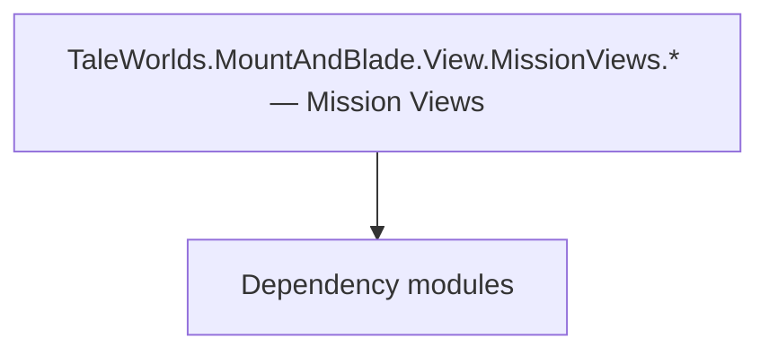

# TaleWorlds.MountAndBlade.View.MissionViews.* — Mission Views

**One-line responsibility:** This page covers all 67 business types under `TaleWorlds.MountAndBlade.View.MissionViews.* — Mission Views` as a family index, giving each type its namespace, responsibility, and typical timing so you can browse by module instead of alphabetically.

## Mental Model

MissionViews are the battle/scene visualization views derived from MissionView: agent markers, siege weapons, order visualizations, and sound views. Each subscribes to Mission events and refreshes the presentation from game state every frame. They are read-only projections.

## When to Use

To add a new battle-scene visualization, derive from MissionView and register it from a MissionBehavior; keep it read-only.

## Dependencies

The types under `TaleWorlds.MountAndBlade.View.MissionViews.* — Mission Views` depend on the following modules; missing any of them causes compile- or run-time failure.

- [Mission](../../mission/Mission)
- [API Overview](../../_index)

## Type Catalog

| Type | Namespace | Purpose | Timing |
| --- | --- | --- | --- |
| `MissionAgentContourControllerView` | TaleWorlds.MountAndBlade.View.MissionViews | A business type under this namespace that carries its derived convention responsibility. Confirm its lifecycle and owning system before calling; do not reference an unready instance at the wrong phase. World-state changes should go through the corresponding Action/Behavior, not direct field mutation. | On battle/mission load |
| `MissionAgentLabelView` | TaleWorlds.MountAndBlade.View.MissionViews | A business type under this namespace that carries its derived convention responsibility. Confirm its lifecycle and owning system before calling; do not reference an unready instance at the wrong phase. World-state changes should go through the corresponding Action/Behavior, not direct field mutation. | On battle/mission load |
| `MissionAgentStatusUIHandler` | TaleWorlds.MountAndBlade.View.MissionViews | A business type under this namespace that carries its derived convention responsibility. Confirm its lifecycle and owning system before calling; do not reference an unready instance at the wrong phase. World-state changes should go through the corresponding Action/Behavior, not direct field mutation. | On battle/mission load |
| `MissionBattleUIBaseView` | TaleWorlds.MountAndBlade.View.MissionViews | A business type under this namespace that carries its derived convention responsibility. Confirm its lifecycle and owning system before calling; do not reference an unready instance at the wrong phase. World-state changes should go through the corresponding Action/Behavior, not direct field mutation. | On battle/mission load |
| `MissionBoundaryCrossingView` | TaleWorlds.MountAndBlade.View.MissionViews | A business type under this namespace that carries its derived convention responsibility. Confirm its lifecycle and owning system before calling; do not reference an unready instance at the wrong phase. World-state changes should go through the corresponding Action/Behavior, not direct field mutation. | On battle/mission load |
| `MissionBoundaryWallView` | TaleWorlds.MountAndBlade.View.MissionViews | A business type under this namespace that carries its derived convention responsibility. Confirm its lifecycle and owning system before calling; do not reference an unready instance at the wrong phase. World-state changes should go through the corresponding Action/Behavior, not direct field mutation. | On battle/mission load |
| `MissionCheatView` | TaleWorlds.MountAndBlade.View.MissionViews | Debug cheat item triggered via console or menu for development-time effects. Production builds should disable or stub it to avoid accidentally corrupting saves. | On battle/mission load |
| `MissionCrosshair` | TaleWorlds.MountAndBlade.View.MissionViews | AI decision implementation that must be interruptible and serializable to support saving and undo. Search must be depth/time bounded to avoid stalls. | On battle/mission load |
| `MissionEscapeMenuView` | TaleWorlds.MountAndBlade.View.MissionViews | Menu interface view that organizes menu items and navigation. Interaction is surfaced via events; rules are not written in the view. | On battle/mission load |
| `MissionFaceCacheView` | TaleWorlds.MountAndBlade.View.MissionViews | A business type under this namespace that carries its derived convention responsibility. Confirm its lifecycle and owning system before calling; do not reference an unready instance at the wrong phase. World-state changes should go through the corresponding Action/Behavior, not direct field mutation. | On battle/mission load |
| `MissionFormationTargetSelectionHandler` | TaleWorlds.MountAndBlade.View.MissionViews | Election / voting mechanism used for collective decisions such as kingdom votes. Mind voting timing and tie handling. | On battle/mission load |
| `MissionGamepadEffectsView` | TaleWorlds.MountAndBlade.View.MissionViews | A business type under this namespace that carries its derived convention responsibility. Confirm its lifecycle and owning system before calling; do not reference an unready instance at the wrong phase. World-state changes should go through the corresponding Action/Behavior, not direct field mutation. | On battle/mission load |
| `MissionHintView` | TaleWorlds.MountAndBlade.View.MissionViews | A business type under this namespace that carries its derived convention responsibility. Confirm its lifecycle and owning system before calling; do not reference an unready instance at the wrong phase. World-state changes should go through the corresponding Action/Behavior, not direct field mutation. | On battle/mission load |
| `MissionItemContourControllerView` | TaleWorlds.MountAndBlade.View.MissionViews | A business type under this namespace that carries its derived convention responsibility. Confirm its lifecycle and owning system before calling; do not reference an unready instance at the wrong phase. World-state changes should go through the corresponding Action/Behavior, not direct field mutation. | On battle/mission load |
| `MissionMainAgentCheerBarkControllerView` | TaleWorlds.MountAndBlade.View.MissionViews | AI decision implementation that must be interruptible and serializable to support saving and undo. Search must be depth/time bounded to avoid stalls. | On battle/mission load |
| `MissionMainAgentController` | TaleWorlds.MountAndBlade.View.MissionViews | AI decision implementation that must be interruptible and serializable to support saving and undo. Search must be depth/time bounded to avoid stalls. | On battle/mission load |
| `MissionMainAgentControlModeView` | TaleWorlds.MountAndBlade.View.MissionViews | AI decision implementation that must be interruptible and serializable to support saving and undo. Search must be depth/time bounded to avoid stalls. | On battle/mission load |
| `MissionMainAgentEquipDropView` | TaleWorlds.MountAndBlade.View.MissionViews | AI decision implementation that must be interruptible and serializable to support saving and undo. Search must be depth/time bounded to avoid stalls. | On battle/mission load |
| `MissionMainAgentEquipmentControllerView` | TaleWorlds.MountAndBlade.View.MissionViews | AI decision implementation that must be interruptible and serializable to support saving and undo. Search must be depth/time bounded to avoid stalls. | On battle/mission load |
| `MissionMainAgentInteractionComponent` | TaleWorlds.MountAndBlade.View.MissionViews | AI decision implementation that must be interruptible and serializable to support saving and undo. Search must be depth/time bounded to avoid stalls. | On battle/mission load |
| `MissionObjectiveView` | TaleWorlds.MountAndBlade.View.MissionViews | A business type under this namespace that carries its derived convention responsibility. Confirm its lifecycle and owning system before calling; do not reference an unready instance at the wrong phase. World-state changes should go through the corresponding Action/Behavior, not direct field mutation. | On battle/mission load |
| `MissionOptionsUIHandler` | TaleWorlds.MountAndBlade.View.MissionViews | A business type under this namespace that carries its derived convention responsibility. Confirm its lifecycle and owning system before calling; do not reference an unready instance at the wrong phase. World-state changes should go through the corresponding Action/Behavior, not direct field mutation. | On battle/mission load |
| `MissionPlayerMovementFlagsChangeEvent` | TaleWorlds.MountAndBlade.View.MissionViews | Event or event handler carrying the data of something that happened once. Remember to unsubscribe on unload to avoid leaks. | On battle/mission load |
| `MissionViewsContainer` | TaleWorlds.MountAndBlade.View.MissionViews | Battle-scene visual view that subscribes to Mission events and refreshes the presentation layer (camera, VFX, HUD overlays) from game state every tick. Views read state and never write rules. | On battle/mission load |
| `OverrideMainAgentControlFlag` | TaleWorlds.MountAndBlade.View.MissionViews | AI decision implementation that must be interruptible and serializable to support saving and undo. Search must be depth/time bounded to avoid stalls. | On battle/mission load |
| `ReplayCaptureLogic` | TaleWorlds.MountAndBlade.View.MissionViews | A business type under this namespace that carries its derived convention responsibility. Confirm its lifecycle and owning system before calling; do not reference an unready instance at the wrong phase. World-state changes should go through the corresponding Action/Behavior, not direct field mutation. | On battle/mission load |
| `ReplayMissionView` | TaleWorlds.MountAndBlade.View.MissionViews | Battle-scene visual view that subscribes to Mission events and refreshes the presentation layer (camera, VFX, HUD overlays) from game state every tick. Views read state and never write rules. | On battle/mission load |
| `SpectatorCameraView` | TaleWorlds.MountAndBlade.View.MissionViews | A business type under this namespace that carries its derived convention responsibility. Confirm its lifecycle and owning system before calling; do not reference an unready instance at the wrong phase. World-state changes should go through the corresponding Action/Behavior, not direct field mutation. | On battle/mission load |
| `CursorState` | TaleWorlds.MountAndBlade.View.MissionViews.Order | A business type under this namespace that carries its derived convention responsibility. Confirm its lifecycle and owning system before calling; do not reference an unready instance at the wrong phase. World-state changes should go through the corresponding Action/Behavior, not direct field mutation. | On battle/mission load |
| `OrderFlag` | TaleWorlds.MountAndBlade.View.MissionViews.Order | Battle order / formation sequence describing a unit’s formation and movement intent, interpreted and executed by the Order system. | On battle/mission load |
| `OrderTroopPlacer` | TaleWorlds.MountAndBlade.View.MissionViews.Order | Battle-scene visual view that subscribes to Mission events and refreshes the presentation layer (camera, VFX, HUD overlays) from game state every tick. Views read state and never write rules. | On battle/mission load |
| `BallistaView` | TaleWorlds.MountAndBlade.View.MissionViews.SiegeWeapon | A business type under this namespace that carries its derived convention responsibility. Confirm its lifecycle and owning system before calling; do not reference an unready instance at the wrong phase. World-state changes should go through the corresponding Action/Behavior, not direct field mutation. | On battle/mission load |
| `BricoleView` | TaleWorlds.MountAndBlade.View.MissionViews.SiegeWeapon | A business type under this namespace that carries its derived convention responsibility. Confirm its lifecycle and owning system before calling; do not reference an unready instance at the wrong phase. World-state changes should go through the corresponding Action/Behavior, not direct field mutation. | On battle/mission load |
| `MangonelView` | TaleWorlds.MountAndBlade.View.MissionViews.SiegeWeapon | A business type under this namespace that carries its derived convention responsibility. Confirm its lifecycle and owning system before calling; do not reference an unready instance at the wrong phase. World-state changes should go through the corresponding Action/Behavior, not direct field mutation. | On battle/mission load |
| `RangedSiegeWeaponView` | TaleWorlds.MountAndBlade.View.MissionViews.SiegeWeapon | Scene usable object that triggers an action or menu when the player interacts with it. Interaction must be idempotent and its state must be serializable to support saving. | On battle/mission load |
| `RangedSiegeWeaponViewController` | TaleWorlds.MountAndBlade.View.MissionViews.SiegeWeapon | Battle-scene visual view that subscribes to Mission events and refreshes the presentation layer (camera, VFX, HUD overlays) from game state every tick. Views read state and never write rules. | On battle/mission load |
| `TrebuchetView` | TaleWorlds.MountAndBlade.View.MissionViews.SiegeWeapon | A business type under this namespace that carries its derived convention responsibility. Confirm its lifecycle and owning system before calling; do not reference an unready instance at the wrong phase. World-state changes should go through the corresponding Action/Behavior, not direct field mutation. | On battle/mission load |
| `BarterView` | TaleWorlds.MountAndBlade.View.MissionViews.Singleplayer | Battle-scene visual view that subscribes to Mission events and refreshes the presentation layer (camera, VFX, HUD overlays) from game state every tick. Views read state and never write rules. | On battle/mission load |
| `BoardGameView` | TaleWorlds.MountAndBlade.View.MissionViews.Singleplayer | Battle-scene visual view that subscribes to Mission events and refreshes the presentation layer (camera, VFX, HUD overlays) from game state every tick. Views read state and never write rules. | On battle/mission load |
| `DeploymentMissionView` | TaleWorlds.MountAndBlade.View.MissionViews.Singleplayer | Battle-scene visual view that subscribes to Mission events and refreshes the presentation layer (camera, VFX, HUD overlays) from game state every tick. Views read state and never write rules. | On battle/mission load |
| `DeploymentView` | TaleWorlds.MountAndBlade.View.MissionViews.Singleplayer | Battle-scene visual view that subscribes to Mission events and refreshes the presentation layer (camera, VFX, HUD overlays) from game state every tick. Views read state and never write rules. | On battle/mission load |
| `DeploymentVisualizationPreference` | TaleWorlds.MountAndBlade.View.MissionViews.Singleplayer | A business type under this namespace that carries its derived convention responsibility. Confirm its lifecycle and owning system before calling; do not reference an unready instance at the wrong phase. World-state changes should go through the corresponding Action/Behavior, not direct field mutation. | On battle/mission load |
| `FaceGeneratorMissionView` | TaleWorlds.MountAndBlade.View.MissionViews.Singleplayer | Battle-scene visual view that subscribes to Mission events and refreshes the presentation layer (camera, VFX, HUD overlays) from game state every tick. Views read state and never write rules. | On battle/mission load |
| `FormationIndicatorMissionView` | TaleWorlds.MountAndBlade.View.MissionViews.Singleplayer | Battle-scene visual view that subscribes to Mission events and refreshes the presentation layer (camera, VFX, HUD overlays) from game state every tick. Views read state and never write rules. | On battle/mission load |
| `Indicator` | TaleWorlds.MountAndBlade.View.MissionViews.Singleplayer | A business type under this namespace that carries its derived convention responsibility. Confirm its lifecycle and owning system before calling; do not reference an unready instance at the wrong phase. World-state changes should go through the corresponding Action/Behavior, not direct field mutation. | On battle/mission load |
| `MissionAgentLockVisualizerView` | TaleWorlds.MountAndBlade.View.MissionViews.Singleplayer | Battle-scene visual view that subscribes to Mission events and refreshes the presentation layer (camera, VFX, HUD overlays) from game state every tick. Views read state and never write rules. | On battle/mission load |
| `MissionBattleScoreUIHandler` | TaleWorlds.MountAndBlade.View.MissionViews.Singleplayer | Battle-scene visual view that subscribes to Mission events and refreshes the presentation layer (camera, VFX, HUD overlays) from game state every tick. Views read state and never write rules. | On battle/mission load |
| `MissionConversationView` | TaleWorlds.MountAndBlade.View.MissionViews.Singleplayer | Battle-scene visual view that subscribes to Mission events and refreshes the presentation layer (camera, VFX, HUD overlays) from game state every tick. Views read state and never write rules. | On battle/mission load |
| `MissionCustomBattlePreloadView` | TaleWorlds.MountAndBlade.View.MissionViews.Singleplayer | Battle-scene visual view that subscribes to Mission events and refreshes the presentation layer (camera, VFX, HUD overlays) from game state every tick. Views read state and never write rules. | On battle/mission load |
| `MissionDeploymentBoundaryMarker` | TaleWorlds.MountAndBlade.View.MissionViews.Singleplayer | Battle-scene visual view that subscribes to Mission events and refreshes the presentation layer (camera, VFX, HUD overlays) from game state every tick. Views read state and never write rules. | On battle/mission load |
| `MissionEntitySelectionUIHandler` | TaleWorlds.MountAndBlade.View.MissionViews.Singleplayer | Battle-scene visual view that subscribes to Mission events and refreshes the presentation layer (camera, VFX, HUD overlays) from game state every tick. Views read state and never write rules. | On battle/mission load |
| `MissionFormationMarkerUIHandler` | TaleWorlds.MountAndBlade.View.MissionViews.Singleplayer | Battle-scene visual view that subscribes to Mission events and refreshes the presentation layer (camera, VFX, HUD overlays) from game state every tick. Views read state and never write rules. | On battle/mission load |
| `MissionLeaveView` | TaleWorlds.MountAndBlade.View.MissionViews.Singleplayer | Battle-scene visual view that subscribes to Mission events and refreshes the presentation layer (camera, VFX, HUD overlays) from game state every tick. Views read state and never write rules. | On battle/mission load |
| `MissionMessageUIHandler` | TaleWorlds.MountAndBlade.View.MissionViews.Singleplayer | Battle-scene visual view that subscribes to Mission events and refreshes the presentation layer (camera, VFX, HUD overlays) from game state every tick. Views read state and never write rules. | On battle/mission load |
| `MissionOrderOfBattleUIHandler` | TaleWorlds.MountAndBlade.View.MissionViews.Singleplayer | Battle-scene visual view that subscribes to Mission events and refreshes the presentation layer (camera, VFX, HUD overlays) from game state every tick. Views read state and never write rules. | On battle/mission load |
| `MissionOrderUIHandler` | TaleWorlds.MountAndBlade.View.MissionViews.Singleplayer | Battle-scene visual view that subscribes to Mission events and refreshes the presentation layer (camera, VFX, HUD overlays) from game state every tick. Views read state and never write rules. | On battle/mission load |
| `MissionScoreUIHandler` | TaleWorlds.MountAndBlade.View.MissionViews.Singleplayer | Battle-scene visual view that subscribes to Mission events and refreshes the presentation layer (camera, VFX, HUD overlays) from game state every tick. Views read state and never write rules. | On battle/mission load |
| `MissionSiegeEngineMarkerView` | TaleWorlds.MountAndBlade.View.MissionViews.Singleplayer | Battle-scene visual view that subscribes to Mission events and refreshes the presentation layer (camera, VFX, HUD overlays) from game state every tick. Views read state and never write rules. | On battle/mission load |
| `MissionSingleplayerEscapeMenu` | TaleWorlds.MountAndBlade.View.MissionViews.Singleplayer | Battle-scene visual view that subscribes to Mission events and refreshes the presentation layer (camera, VFX, HUD overlays) from game state every tick. Views read state and never write rules. | On battle/mission load |
| `MissionSingleplayerKillNotificationUIHandler` | TaleWorlds.MountAndBlade.View.MissionViews.Singleplayer | Battle-scene visual view that subscribes to Mission events and refreshes the presentation layer (camera, VFX, HUD overlays) from game state every tick. Views read state and never write rules. | On battle/mission load |
| `MissionSpectatorControlView` | TaleWorlds.MountAndBlade.View.MissionViews.Singleplayer | Battle-scene visual view that subscribes to Mission events and refreshes the presentation layer (camera, VFX, HUD overlays) from game state every tick. Views read state and never write rules. | On battle/mission load |
| `PhotoModeView` | TaleWorlds.MountAndBlade.View.MissionViews.Singleplayer | Battle-scene visual view that subscribes to Mission events and refreshes the presentation layer (camera, VFX, HUD overlays) from game state every tick. Views read state and never write rules. | On battle/mission load |
| `SiegeDeploymentVisualizationMissionView` | TaleWorlds.MountAndBlade.View.MissionViews.Singleplayer | Battle-scene visual view that subscribes to Mission events and refreshes the presentation layer (camera, VFX, HUD overlays) from game state every tick. Views read state and never write rules. | On battle/mission load |
| `TutorialMissionViews` | TaleWorlds.MountAndBlade.View.MissionViews.Singleplayer | Battle-scene visual view that subscribes to Mission events and refreshes the presentation layer (camera, VFX, HUD overlays) from game state every tick. Views read state and never write rules. | On battle/mission load |
| `MusicBattleMissionView` | TaleWorlds.MountAndBlade.View.MissionViews.Sound | Battle-scene visual view that subscribes to Mission events and refreshes the presentation layer (camera, VFX, HUD overlays) from game state every tick. Views read state and never write rules. | On battle/mission load |
| `MusicSilencedMissionView` | TaleWorlds.MountAndBlade.View.MissionViews.Sound | Battle-scene visual view that subscribes to Mission events and refreshes the presentation layer (camera, VFX, HUD overlays) from game state every tick. Views read state and never write rules. | On battle/mission load |
| `MusicStealthMissionView` | TaleWorlds.MountAndBlade.View.MissionViews.Sound | Battle-scene visual view that subscribes to Mission events and refreshes the presentation layer (camera, VFX, HUD overlays) from game state every tick. Views read state and never write rules. | On battle/mission load |

## Risk & Boundaries

MissionViews run on the hot path; avoid allocations per frame. They are tied to Mission lifetime and must be torn down on mission end to avoid dangling references.

## See Also

- [Mission](../../mission/Mission)
- [API Overview](../../_index)
