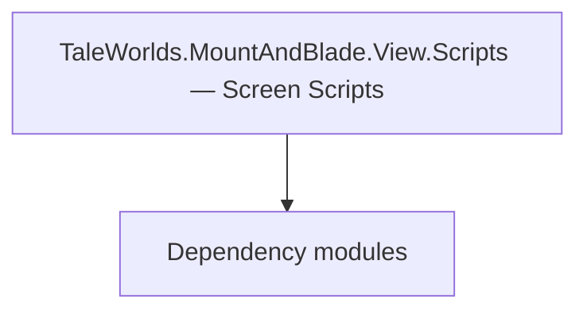

# TaleWorlds.MountAndBlade.View.Scripts — Screen Scripts

**One-line responsibility:** This page covers all 14 business types under `TaleWorlds.MountAndBlade.View.Scripts — Screen Scripts` as a family index, giving each type its namespace, responsibility, and typical timing so you can browse by module instead of alphabetically.

## Mental Model

View.Scripts and View.Screens hold screen-level script hooks and screen scaffolding that host Gauntlet UI or drive scene-level presentation outside missions. They are thin presentation coordinators.

## When to Use

Use these when you need a screen-level script hook or a screen scaffold that is not a full Mission. Keep rules out of the view.

## Dependencies

The types under `TaleWorlds.MountAndBlade.View.Scripts — Screen Scripts` depend on the following modules; missing any of them causes compile- or run-time failure.

- [MBSubModuleBase](../../core/MBSubModuleBase)
- [API Overview](../../_index)

## Type Catalog

| Type | Namespace | Purpose | Timing |
| --- | --- | --- | --- |
| `MultiThreadedStressTestsScreen` | TaleWorlds.MountAndBlade.View.Screens.Scripts | Interface screen / layer base class that hosts Gauntlet UI display and input. Commands only trigger Actions or Behaviors and never mutate state directly. | On UI open |
| `MultiThreadedTestFunctions` | TaleWorlds.MountAndBlade.View.Screens.Scripts | A business type under this namespace that carries its derived convention responsibility. Confirm its lifecycle and owning system before calling; do not reference an unready instance at the wrong phase. World-state changes should go through the corresponding Action/Behavior, not direct field mutation. | On UI open |
| `BodyPartIndex` | TaleWorlds.MountAndBlade.View.Scripts | A business type under this namespace that carries its derived convention responsibility. Confirm its lifecycle and owning system before calling; do not reference an unready instance at the wrong phase. World-state changes should go through the corresponding Action/Behavior, not direct field mutation. | On UI open |
| `CharacterDebugSpawner` | TaleWorlds.MountAndBlade.View.Scripts | Script component attached to a scene GameObject, exposing scene state to the logic layer. Depends on scene load order; fields are null before the scene is ready. | On UI open |
| `CharacterSpawner` | TaleWorlds.MountAndBlade.View.Scripts | Script component attached to a scene GameObject, exposing scene state to the logic layer. Depends on scene load order; fields are null before the scene is ready. | On UI open |
| `HandMorphTest` | TaleWorlds.MountAndBlade.View.Scripts | Script component attached to a scene GameObject, exposing scene state to the logic layer. Depends on scene load order; fields are null before the scene is ready. | On UI open |
| `HandPose` | TaleWorlds.MountAndBlade.View.Scripts | Script component attached to a scene GameObject, exposing scene state to the logic layer. Depends on scene load order; fields are null before the scene is ready. | On UI open |
| `InterpolationType` | TaleWorlds.MountAndBlade.View.Scripts | A business type under this namespace that carries its derived convention responsibility. Confirm its lifecycle and owning system before calling; do not reference an unready instance at the wrong phase. World-state changes should go through the corresponding Action/Behavior, not direct field mutation. | On UI open |
| `MapColorGradeManager` | TaleWorlds.MountAndBlade.View.Scripts | Script component attached to a scene GameObject, exposing scene state to the logic layer. Depends on scene load order; fields are null before the scene is ready. | On UI open |
| `PathAnimationState` | TaleWorlds.MountAndBlade.View.Scripts | A business type under this namespace that carries its derived convention responsibility. Confirm its lifecycle and owning system before calling; do not reference an unready instance at the wrong phase. World-state changes should go through the corresponding Action/Behavior, not direct field mutation. | On UI open |
| `PopupSceneCameraPath` | TaleWorlds.MountAndBlade.View.Scripts | Script component attached to a scene GameObject, exposing scene state to the logic layer. Depends on scene load order; fields are null before the scene is ready. | On UI open |
| `PopupSceneSequence` | TaleWorlds.MountAndBlade.View.Scripts | Script component attached to a scene GameObject, exposing scene state to the logic layer. Depends on scene load order; fields are null before the scene is ready. | On UI open |
| `PopupSceneSwitchCameraSequence` | TaleWorlds.MountAndBlade.View.Scripts | A business type under this namespace that carries its derived convention responsibility. Confirm its lifecycle and owning system before calling; do not reference an unready instance at the wrong phase. World-state changes should go through the corresponding Action/Behavior, not direct field mutation. | On UI open |
| `PopupSceneSwitchItemSequence` | TaleWorlds.MountAndBlade.View.Scripts | A business type under this namespace that carries its derived convention responsibility. Confirm its lifecycle and owning system before calling; do not reference an unready instance at the wrong phase. World-state changes should go through the corresponding Action/Behavior, not direct field mutation. | On UI open |

## Risk & Boundaries

Screen scripts depend on the screen lifecycle; referencing them after the screen closes yields null. Do not store gameplay state here.

## See Also

- [MBSubModuleBase](../../core/MBSubModuleBase)
- [API Overview](../../_index)
