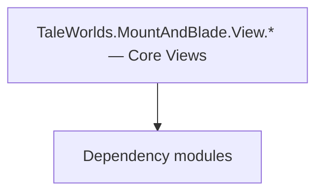

# TaleWorlds.MountAndBlade.View.* — Core Views

**One-line responsibility:** This page covers all 103 business types under `TaleWorlds.MountAndBlade.View.* — Core Views` as a family index, giving each type its namespace, responsibility, and typical timing so you can browse by module instead of alphabetically.

## Mental Model

TaleWorlds.MountAndBlade.View.* holds the remaining core view types (scene notifications, custom-battle views, visual order sets, screen scripts). They follow the MissionView/ScriptComponent pattern but focus on specific presentations: SceneNotification projects a scene event into a HUD prompt, VisualOrders describe formation-order visualization, Screens.Scripts provide screen-level script hooks. Views only read state, never write rules.

## When to Use

To customize battle HUD prompts, formation-order visualization, or screen-level scripts, derive from the relevant type and register it via MissionBehavior. Commands only trigger logic.

## Dependencies

The types under `TaleWorlds.MountAndBlade.View.* — Core Views` depend on the following modules; missing any of them causes compile- or run-time failure.

- [Mission](../../mission/Mission)
- [MBSubModuleBase](../../core/MBSubModuleBase)
- [API Overview](../../_index)

## Type Catalog

| Type | Namespace | Purpose | Timing |
| --- | --- | --- | --- |
| `AgentVisuals` | TaleWorlds.MountAndBlade.View | A business type under this namespace that carries its derived convention responsibility. Confirm its lifecycle and owning system before calling; do not reference an unready instance at the wrong phase. World-state changes should go through the corresponding Action/Behavior, not direct field mutation. | On UI open |
| `AgentVisualsCreator` | TaleWorlds.MountAndBlade.View | A business type under this namespace that carries its derived convention responsibility. Confirm its lifecycle and owning system before calling; do not reference an unready instance at the wrong phase. World-state changes should go through the corresponding Action/Behavior, not direct field mutation. | On UI open |
| `BannerVisual` | TaleWorlds.MountAndBlade.View | A business type under this namespace that carries its derived convention responsibility. Confirm its lifecycle and owning system before calling; do not reference an unready instance at the wrong phase. World-state changes should go through the corresponding Action/Behavior, not direct field mutation. | On UI open |
| `BannerVisualCreator` | TaleWorlds.MountAndBlade.View | A business type under this namespace that carries its derived convention responsibility. Confirm its lifecycle and owning system before calling; do not reference an unready instance at the wrong phase. World-state changes should go through the corresponding Action/Behavior, not direct field mutation. | On UI open |
| `BannerVisualExtensions` | TaleWorlds.MountAndBlade.View | A business type under this namespace that carries its derived convention responsibility. Confirm its lifecycle and owning system before calling; do not reference an unready instance at the wrong phase. World-state changes should go through the corresponding Action/Behavior, not direct field mutation. | On UI open |
| `CampaignSounds` | TaleWorlds.MountAndBlade.View | AI decision implementation that must be interruptible and serializable to support saving and undo. Search must be depth/time bounded to avoid stalls. | On UI open |
| `ConversationTagView` | TaleWorlds.MountAndBlade.View | Conversation-related type participating in the dialogue tree and performance. Dialogue-line changes must mind branches and localization. | On UI open |
| `CraftedDataView` | TaleWorlds.MountAndBlade.View | A business type under this namespace that carries its derived convention responsibility. Confirm its lifecycle and owning system before calling; do not reference an unready instance at the wrong phase. World-state changes should go through the corresponding Action/Behavior, not direct field mutation. | On UI open |
| `CraftedDataViewManager` | TaleWorlds.MountAndBlade.View | A business type under this namespace that carries its derived convention responsibility. Confirm its lifecycle and owning system before calling; do not reference an unready instance at the wrong phase. World-state changes should go through the corresponding Action/Behavior, not direct field mutation. | On UI open |
| `CraftingPieceCollectionElementViewExtensions` | TaleWorlds.MountAndBlade.View | A business type under this namespace that carries its derived convention responsibility. Confirm its lifecycle and owning system before calling; do not reference an unready instance at the wrong phase. World-state changes should go through the corresponding Action/Behavior, not direct field mutation. | On UI open |
| `CraftingSounds` | TaleWorlds.MountAndBlade.View | A business type under this namespace that carries its derived convention responsibility. Confirm its lifecycle and owning system before calling; do not reference an unready instance at the wrong phase. World-state changes should go through the corresponding Action/Behavior, not direct field mutation. | On UI open |
| `DefaultSounds` | TaleWorlds.MountAndBlade.View | A business type under this namespace that carries its derived convention responsibility. Confirm its lifecycle and owning system before calling; do not reference an unready instance at the wrong phase. World-state changes should go through the corresponding Action/Behavior, not direct field mutation. | On UI open |
| `DefaultView` | TaleWorlds.MountAndBlade.View | A business type under this namespace that carries its derived convention responsibility. Confirm its lifecycle and owning system before calling; do not reference an unready instance at the wrong phase. World-state changes should go through the corresponding Action/Behavior, not direct field mutation. | On UI open |
| `DLCInstallationQueryView` | TaleWorlds.MountAndBlade.View | A business type under this namespace that carries its derived convention responsibility. Confirm its lifecycle and owning system before calling; do not reference an unready instance at the wrong phase. World-state changes should go through the corresponding Action/Behavior, not direct field mutation. | On UI open |
| `EndgameSounds` | TaleWorlds.MountAndBlade.View | A business type under this namespace that carries its derived convention responsibility. Confirm its lifecycle and owning system before calling; do not reference an unready instance at the wrong phase. World-state changes should go through the corresponding Action/Behavior, not direct field mutation. | On UI open |
| `IChatLogHandlerScreen` | TaleWorlds.MountAndBlade.View | A business type under this namespace that carries its derived convention responsibility. Confirm its lifecycle and owning system before calling; do not reference an unready instance at the wrong phase. World-state changes should go through the corresponding Action/Behavior, not direct field mutation. | On UI open |
| `InventorySounds` | TaleWorlds.MountAndBlade.View | A business type under this namespace that carries its derived convention responsibility. Confirm its lifecycle and owning system before calling; do not reference an unready instance at the wrong phase. World-state changes should go through the corresponding Action/Behavior, not direct field mutation. | On UI open |
| `ISiegeDeploymentView` | TaleWorlds.MountAndBlade.View | A business type under this namespace that carries its derived convention responsibility. Confirm its lifecycle and owning system before calling; do not reference an unready instance at the wrong phase. World-state changes should go through the corresponding Action/Behavior, not direct field mutation. | On UI open |
| `ItemCollectionElementViewExtensions` | TaleWorlds.MountAndBlade.View | A business type under this namespace that carries its derived convention responsibility. Confirm its lifecycle and owning system before calling; do not reference an unready instance at the wrong phase. World-state changes should go through the corresponding Action/Behavior, not direct field mutation. | On UI open |
| `ItemObjectViewExtensions` | TaleWorlds.MountAndBlade.View | A business type under this namespace that carries its derived convention responsibility. Confirm its lifecycle and owning system before calling; do not reference an unready instance at the wrong phase. World-state changes should go through the corresponding Action/Behavior, not direct field mutation. | On UI open |
| `ItemVisualizer` | TaleWorlds.MountAndBlade.View | A business type under this namespace that carries its derived convention responsibility. Confirm its lifecycle and owning system before calling; do not reference an unready instance at the wrong phase. World-state changes should go through the corresponding Action/Behavior, not direct field mutation. | On UI open |
| `KingdomSounds` | TaleWorlds.MountAndBlade.View | A business type under this namespace that carries its derived convention responsibility. Confirm its lifecycle and owning system before calling; do not reference an unready instance at the wrong phase. World-state changes should go through the corresponding Action/Behavior, not direct field mutation. | On UI open |
| `MissionPlayerToggledOrderViewEvent` | TaleWorlds.MountAndBlade.View | Battle order / formation sequence describing a unit’s formation and movement intent, interpreted and executed by the Order system. | On UI open |
| `MissionSounds` | TaleWorlds.MountAndBlade.View | A business type under this namespace that carries its derived convention responsibility. Confirm its lifecycle and owning system before calling; do not reference an unready instance at the wrong phase. World-state changes should go through the corresponding Action/Behavior, not direct field mutation. | On UI open |
| `MountVisualCreationOutput` | TaleWorlds.MountAndBlade.View | A business type under this namespace that carries its derived convention responsibility. Confirm its lifecycle and owning system before calling; do not reference an unready instance at the wrong phase. World-state changes should go through the corresponding Action/Behavior, not direct field mutation. | On UI open |
| `MountVisualCreator` | TaleWorlds.MountAndBlade.View | A business type under this namespace that carries its derived convention responsibility. Confirm its lifecycle and owning system before calling; do not reference an unready instance at the wrong phase. World-state changes should go through the corresponding Action/Behavior, not direct field mutation. | On UI open |
| `MultiplayerSounds` | TaleWorlds.MountAndBlade.View | A business type under this namespace that carries its derived convention responsibility. Confirm its lifecycle and owning system before calling; do not reference an unready instance at the wrong phase. World-state changes should go through the corresponding Action/Behavior, not direct field mutation. | On UI open |
| `NotificationSounds` | TaleWorlds.MountAndBlade.View | Notification item type describing the data of one map/event prompt. It only carries display data; triggering logic lives in the Behavior. | On UI open |
| `OrderOfBattleSounds` | TaleWorlds.MountAndBlade.View | Battle order / formation sequence describing a unit’s formation and movement intent, interpreted and executed by the Order system. | On UI open |
| `OverrideView` | TaleWorlds.MountAndBlade.View | A business type under this namespace that carries its derived convention responsibility. Confirm its lifecycle and owning system before calling; do not reference an unready instance at the wrong phase. World-state changes should go through the corresponding Action/Behavior, not direct field mutation. | On UI open |
| `PanelSounds` | TaleWorlds.MountAndBlade.View | A business type under this namespace that carries its derived convention responsibility. Confirm its lifecycle and owning system before calling; do not reference an unready instance at the wrong phase. World-state changes should go through the corresponding Action/Behavior, not direct field mutation. | On UI open |
| `PartySounds` | TaleWorlds.MountAndBlade.View | A business type under this namespace that carries its derived convention responsibility. Confirm its lifecycle and owning system before calling; do not reference an unready instance at the wrong phase. World-state changes should go through the corresponding Action/Behavior, not direct field mutation. | On UI open |
| `PopupSceneEmissionHandler` | TaleWorlds.MountAndBlade.View | A business type under this namespace that carries its derived convention responsibility. Confirm its lifecycle and owning system before calling; do not reference an unready instance at the wrong phase. World-state changes should go through the corresponding Action/Behavior, not direct field mutation. | On UI open |
| `PopupSceneSkeletonAnimationScript` | TaleWorlds.MountAndBlade.View | A business type under this namespace that carries its derived convention responsibility. Confirm its lifecycle and owning system before calling; do not reference an unready instance at the wrong phase. World-state changes should go through the corresponding Action/Behavior, not direct field mutation. | On UI open |
| `PopupSceneSpawnPoint` | TaleWorlds.MountAndBlade.View | Board-game piece description with attributes and movement rules. State must be fully serializable to reconstruct the match. | On UI open |
| `PortSounds` | TaleWorlds.MountAndBlade.View | A business type under this namespace that carries its derived convention responsibility. Confirm its lifecycle and owning system before calling; do not reference an unready instance at the wrong phase. World-state changes should go through the corresponding Action/Behavior, not direct field mutation. | On UI open |
| `PreloadHelper` | TaleWorlds.MountAndBlade.View | Static helper utility that concentrates a cross-cutting operation (open screen, compute result, resolve entity). Call it from the correct system context; do not instantiate it as stateful. | On UI open |
| `SiegeSounds` | TaleWorlds.MountAndBlade.View | A business type under this namespace that carries its derived convention responsibility. Confirm its lifecycle and owning system before calling; do not reference an unready instance at the wrong phase. World-state changes should go through the corresponding Action/Behavior, not direct field mutation. | On UI open |
| `SimpleSceneTestWithMission` | TaleWorlds.MountAndBlade.View | A business type under this namespace that carries its derived convention responsibility. Confirm its lifecycle and owning system before calling; do not reference an unready instance at the wrong phase. World-state changes should go through the corresponding Action/Behavior, not direct field mutation. | On UI open |
| `UISoundsHelper` | TaleWorlds.MountAndBlade.View | Static helper utility that concentrates a cross-cutting operation (open screen, compute result, resolve entity). Call it from the correct system context; do not instantiate it as stateful. | On UI open |
| `ViewCreator` | TaleWorlds.MountAndBlade.View | A business type under this namespace that carries its derived convention responsibility. Confirm its lifecycle and owning system before calling; do not reference an unready instance at the wrong phase. World-state changes should go through the corresponding Action/Behavior, not direct field mutation. | On UI open |
| `ViewCreatorManager` | TaleWorlds.MountAndBlade.View | A business type under this namespace that carries its derived convention responsibility. Confirm its lifecycle and owning system before calling; do not reference an unready instance at the wrong phase. World-state changes should go through the corresponding Action/Behavior, not direct field mutation. | On UI open |
| `ViewSubModule` | TaleWorlds.MountAndBlade.View | A business type under this namespace that carries its derived convention responsibility. Confirm its lifecycle and owning system before calling; do not reference an unready instance at the wrong phase. World-state changes should go through the corresponding Action/Behavior, not direct field mutation. | On UI open |
| `WeaponComponentViewExtensions` | TaleWorlds.MountAndBlade.View | A business type under this namespace that carries its derived convention responsibility. Confirm its lifecycle and owning system before calling; do not reference an unready instance at the wrong phase. World-state changes should go through the corresponding Action/Behavior, not direct field mutation. | On UI open |
| `CustomBattleFactory` | TaleWorlds.MountAndBlade.View.CustomBattle | A business type under this namespace that carries its derived convention responsibility. Confirm its lifecycle and owning system before calling; do not reference an unready instance at the wrong phase. World-state changes should go through the corresponding Action/Behavior, not direct field mutation. | On UI open |
| `ICustomBattleProvider` | TaleWorlds.MountAndBlade.View.CustomBattle | Gauntlet image-source abstraction that resolves an entity/concept into an actual texture and caches it. The first frame may be empty; handle the loading state. | On UI open |
| `PopupSceneBanner` | TaleWorlds.MountAndBlade.View.SceneNotification | Script component attached to a scene GameObject, exposing scene state to the logic layer. Depends on scene load order; fields are null before the scene is ready. | On UI open |
| `PopupSceneShipSpawnPoint` | TaleWorlds.MountAndBlade.View.SceneNotification | Script component attached to a scene GameObject, exposing scene state to the logic layer. Depends on scene load order; fields are null before the scene is ready. | On UI open |
| `BannerBuilderScreen` | TaleWorlds.MountAndBlade.View.Screens | A business type under this namespace that carries its derived convention responsibility. Confirm its lifecycle and owning system before calling; do not reference an unready instance at the wrong phase. World-state changes should go through the corresponding Action/Behavior, not direct field mutation. | On UI open |
| `BenchmarkScreen` | TaleWorlds.MountAndBlade.View.Screens | A business type under this namespace that carries its derived convention responsibility. Confirm its lifecycle and owning system before calling; do not reference an unready instance at the wrong phase. World-state changes should go through the corresponding Action/Behavior, not direct field mutation. | On UI open |
| `CameraPoint` | TaleWorlds.MountAndBlade.View.Screens | A business type under this namespace that carries its derived convention responsibility. Confirm its lifecycle and owning system before calling; do not reference an unready instance at the wrong phase. World-state changes should go through the corresponding Action/Behavior, not direct field mutation. | On UI open |
| `CameraPointTestType` | TaleWorlds.MountAndBlade.View.Screens | A business type under this namespace that carries its derived convention responsibility. Confirm its lifecycle and owning system before calling; do not reference an unready instance at the wrong phase. World-state changes should go through the corresponding Action/Behavior, not direct field mutation. | On UI open |
| `CreditsScreen` | TaleWorlds.MountAndBlade.View.Screens | A business type under this namespace that carries its derived convention responsibility. Confirm its lifecycle and owning system before calling; do not reference an unready instance at the wrong phase. World-state changes should go through the corresponding Action/Behavior, not direct field mutation. | On UI open |
| `FaceGeneratorScreen` | TaleWorlds.MountAndBlade.View.Screens | A business type under this namespace that carries its derived convention responsibility. Confirm its lifecycle and owning system before calling; do not reference an unready instance at the wrong phase. World-state changes should go through the corresponding Action/Behavior, not direct field mutation. | On UI open |
| `GameLoadingScreen` | TaleWorlds.MountAndBlade.View.Screens | A business type under this namespace that carries its derived convention responsibility. Confirm its lifecycle and owning system before calling; do not reference an unready instance at the wrong phase. World-state changes should go through the corresponding Action/Behavior, not direct field mutation. | On UI open |
| `GameStateScreen` | TaleWorlds.MountAndBlade.View.Screens | A business type under this namespace that carries its derived convention responsibility. Confirm its lifecycle and owning system before calling; do not reference an unready instance at the wrong phase. World-state changes should go through the corresponding Action/Behavior, not direct field mutation. | On UI open |
| `GameStateScreenManager` | TaleWorlds.MountAndBlade.View.Screens | A business type under this namespace that carries its derived convention responsibility. Confirm its lifecycle and owning system before calling; do not reference an unready instance at the wrong phase. World-state changes should go through the corresponding Action/Behavior, not direct field mutation. | On UI open |
| `IFaceGeneratorScreen` | TaleWorlds.MountAndBlade.View.Screens | A business type under this namespace that carries its derived convention responsibility. Confirm its lifecycle and owning system before calling; do not reference an unready instance at the wrong phase. World-state changes should go through the corresponding Action/Behavior, not direct field mutation. | On UI open |
| `MissionScreen` | TaleWorlds.MountAndBlade.View.Screens | A business type under this namespace that carries its derived convention responsibility. Confirm its lifecycle and owning system before calling; do not reference an unready instance at the wrong phase. World-state changes should go through the corresponding Action/Behavior, not direct field mutation. | On UI open |
| `OptionsScreen` | TaleWorlds.MountAndBlade.View.Screens | A business type under this namespace that carries its derived convention responsibility. Confirm its lifecycle and owning system before calling; do not reference an unready instance at the wrong phase. World-state changes should go through the corresponding Action/Behavior, not direct field mutation. | On UI open |
| `SceneEditorLayer` | TaleWorlds.MountAndBlade.View.Screens | A business type under this namespace that carries its derived convention responsibility. Confirm its lifecycle and owning system before calling; do not reference an unready instance at the wrong phase. World-state changes should go through the corresponding Action/Behavior, not direct field mutation. | On UI open |
| `SceneEditorScreen` | TaleWorlds.MountAndBlade.View.Screens | A business type under this namespace that carries its derived convention responsibility. Confirm its lifecycle and owning system before calling; do not reference an unready instance at the wrong phase. World-state changes should go through the corresponding Action/Behavior, not direct field mutation. | On UI open |
| `VideoPlaybackScreen` | TaleWorlds.MountAndBlade.View.Screens | A business type under this namespace that carries its derived convention responsibility. Confirm its lifecycle and owning system before calling; do not reference an unready instance at the wrong phase. World-state changes should go through the corresponding Action/Behavior, not direct field mutation. | On UI open |
| `VisualTestsScreen` | TaleWorlds.MountAndBlade.View.Screens | A business type under this namespace that carries its derived convention responsibility. Confirm its lifecycle and owning system before calling; do not reference an unready instance at the wrong phase. World-state changes should go through the corresponding Action/Behavior, not direct field mutation. | On UI open |
| `BannerTableau` | TaleWorlds.MountAndBlade.View.Tableaus | A business type under this namespace that carries its derived convention responsibility. Confirm its lifecycle and owning system before calling; do not reference an unready instance at the wrong phase. World-state changes should go through the corresponding Action/Behavior, not direct field mutation. | On UI open |
| `BannerTextureCreator` | TaleWorlds.MountAndBlade.View.Tableaus | A business type under this namespace that carries its derived convention responsibility. Confirm its lifecycle and owning system before calling; do not reference an unready instance at the wrong phase. World-state changes should go through the corresponding Action/Behavior, not direct field mutation. | On UI open |
| `BannerThumbnailCreationBaseData` | TaleWorlds.MountAndBlade.View.Tableaus | AI decision implementation that must be interruptible and serializable to support saving and undo. Search must be depth/time bounded to avoid stalls. | On UI open |
| `BasicCharacterTableau` | TaleWorlds.MountAndBlade.View.Tableaus | A business type under this namespace that carries its derived convention responsibility. Confirm its lifecycle and owning system before calling; do not reference an unready instance at the wrong phase. World-state changes should go through the corresponding Action/Behavior, not direct field mutation. | On UI open |
| `BrightnessDemoTableau` | TaleWorlds.MountAndBlade.View.Tableaus | A business type under this namespace that carries its derived convention responsibility. Confirm its lifecycle and owning system before calling; do not reference an unready instance at the wrong phase. World-state changes should go through the corresponding Action/Behavior, not direct field mutation. | On UI open |
| `CharacterTableau` | TaleWorlds.MountAndBlade.View.Tableaus | A business type under this namespace that carries its derived convention responsibility. Confirm its lifecycle and owning system before calling; do not reference an unready instance at the wrong phase. World-state changes should go through the corresponding Action/Behavior, not direct field mutation. | On UI open |
| `ItemTableau` | TaleWorlds.MountAndBlade.View.Tableaus | A business type under this namespace that carries its derived convention responsibility. Confirm its lifecycle and owning system before calling; do not reference an unready instance at the wrong phase. World-state changes should go through the corresponding Action/Behavior, not direct field mutation. | On UI open |
| `RenderCallbackCollection` | TaleWorlds.MountAndBlade.View.Tableaus | A business type under this namespace that carries its derived convention responsibility. Confirm its lifecycle and owning system before calling; do not reference an unready instance at the wrong phase. World-state changes should go through the corresponding Action/Behavior, not direct field mutation. | On UI open |
| `SceneTableau` | TaleWorlds.MountAndBlade.View.Tableaus | A business type under this namespace that carries its derived convention responsibility. Confirm its lifecycle and owning system before calling; do not reference an unready instance at the wrong phase. World-state changes should go through the corresponding Action/Behavior, not direct field mutation. | On UI open |
| `ThumbnailCacheManager` | TaleWorlds.MountAndBlade.View.Tableaus | AI decision implementation that must be interruptible and serializable to support saving and undo. Search must be depth/time bounded to avoid stalls. | On UI open |
| `ThumbnailDebugUtility` | TaleWorlds.MountAndBlade.View.Tableaus | AI decision implementation that must be interruptible and serializable to support saving and undo. Search must be depth/time bounded to avoid stalls. | On UI open |
| `Alignment` | TaleWorlds.MountAndBlade.View.Tableaus.Thumbnails | A business type under this namespace that carries its derived convention responsibility. Confirm its lifecycle and owning system before calling; do not reference an unready instance at the wrong phase. World-state changes should go through the corresponding Action/Behavior, not direct field mutation. | On UI open |
| `AvatarThumbnailCache` | TaleWorlds.MountAndBlade.View.Tableaus.Thumbnails | AI decision implementation that must be interruptible and serializable to support saving and undo. Search must be depth/time bounded to avoid stalls. | On UI open |
| `AvatarThumbnailCreationData` | TaleWorlds.MountAndBlade.View.Tableaus.Thumbnails | AI decision implementation that must be interruptible and serializable to support saving and undo. Search must be depth/time bounded to avoid stalls. | On UI open |
| `BannerDebugInfo` | TaleWorlds.MountAndBlade.View.Tableaus.Thumbnails | A business type under this namespace that carries its derived convention responsibility. Confirm its lifecycle and owning system before calling; do not reference an unready instance at the wrong phase. World-state changes should go through the corresponding Action/Behavior, not direct field mutation. | On UI open |
| `BannerEditorTextureCache` | TaleWorlds.MountAndBlade.View.Tableaus.Thumbnails | A business type under this namespace that carries its derived convention responsibility. Confirm its lifecycle and owning system before calling; do not reference an unready instance at the wrong phase. World-state changes should go through the corresponding Action/Behavior, not direct field mutation. | On UI open |
| `BannerEditorTextureCreationData` | TaleWorlds.MountAndBlade.View.Tableaus.Thumbnails | A business type under this namespace that carries its derived convention responsibility. Confirm its lifecycle and owning system before calling; do not reference an unready instance at the wrong phase. World-state changes should go through the corresponding Action/Behavior, not direct field mutation. | On UI open |
| `BannerPersistentTextureCache` | TaleWorlds.MountAndBlade.View.Tableaus.Thumbnails | A business type under this namespace that carries its derived convention responsibility. Confirm its lifecycle and owning system before calling; do not reference an unready instance at the wrong phase. World-state changes should go through the corresponding Action/Behavior, not direct field mutation. | On UI open |
| `BannerTextureCreationData` | TaleWorlds.MountAndBlade.View.Tableaus.Thumbnails | A business type under this namespace that carries its derived convention responsibility. Confirm its lifecycle and owning system before calling; do not reference an unready instance at the wrong phase. World-state changes should go through the corresponding Action/Behavior, not direct field mutation. | On UI open |
| `BannerThumbnailCache` | TaleWorlds.MountAndBlade.View.Tableaus.Thumbnails | AI decision implementation that must be interruptible and serializable to support saving and undo. Search must be depth/time bounded to avoid stalls. | On UI open |
| `BannerThumbnailCreationData` | TaleWorlds.MountAndBlade.View.Tableaus.Thumbnails | AI decision implementation that must be interruptible and serializable to support saving and undo. Search must be depth/time bounded to avoid stalls. | On UI open |
| `CharacterThumbnailCache` | TaleWorlds.MountAndBlade.View.Tableaus.Thumbnails | AI decision implementation that must be interruptible and serializable to support saving and undo. Search must be depth/time bounded to avoid stalls. | On UI open |
| `CharacterThumbnailCreationData` | TaleWorlds.MountAndBlade.View.Tableaus.Thumbnails | AI decision implementation that must be interruptible and serializable to support saving and undo. Search must be depth/time bounded to avoid stalls. | On UI open |
| `CraftingPieceCreationData` | TaleWorlds.MountAndBlade.View.Tableaus.Thumbnails | A business type under this namespace that carries its derived convention responsibility. Confirm its lifecycle and owning system before calling; do not reference an unready instance at the wrong phase. World-state changes should go through the corresponding Action/Behavior, not direct field mutation. | On UI open |
| `CraftingPieceThumbnailCache` | TaleWorlds.MountAndBlade.View.Tableaus.Thumbnails | AI decision implementation that must be interruptible and serializable to support saving and undo. Search must be depth/time bounded to avoid stalls. | On UI open |
| `ItemThumbnailCache` | TaleWorlds.MountAndBlade.View.Tableaus.Thumbnails | AI decision implementation that must be interruptible and serializable to support saving and undo. Search must be depth/time bounded to avoid stalls. | On UI open |
| `ItemThumbnailCreationData` | TaleWorlds.MountAndBlade.View.Tableaus.Thumbnails | AI decision implementation that must be interruptible and serializable to support saving and undo. Search must be depth/time bounded to avoid stalls. | On UI open |
| `IThumbnailCache` | TaleWorlds.MountAndBlade.View.Tableaus.Thumbnails | AI decision implementation that must be interruptible and serializable to support saving and undo. Search must be depth/time bounded to avoid stalls. | On UI open |
| `NodeComparer` | TaleWorlds.MountAndBlade.View.Tableaus.Thumbnails | A business type under this namespace that carries its derived convention responsibility. Confirm its lifecycle and owning system before calling; do not reference an unready instance at the wrong phase. World-state changes should go through the corresponding Action/Behavior, not direct field mutation. | On UI open |
| `SourceTypes` | TaleWorlds.MountAndBlade.View.Tableaus.Thumbnails | A business type under this namespace that carries its derived convention responsibility. Confirm its lifecycle and owning system before calling; do not reference an unready instance at the wrong phase. World-state changes should go through the corresponding Action/Behavior, not direct field mutation. | On UI open |
| `TextureCreationInfo` | TaleWorlds.MountAndBlade.View.Tableaus.Thumbnails | A business type under this namespace that carries its derived convention responsibility. Confirm its lifecycle and owning system before calling; do not reference an unready instance at the wrong phase. World-state changes should go through the corresponding Action/Behavior, not direct field mutation. | On UI open |
| `ThumbnailCache` | TaleWorlds.MountAndBlade.View.Tableaus.Thumbnails | AI decision implementation that must be interruptible and serializable to support saving and undo. Search must be depth/time bounded to avoid stalls. | On UI open |
| `ThumbnailCacheNode` | TaleWorlds.MountAndBlade.View.Tableaus.Thumbnails | AI decision implementation that must be interruptible and serializable to support saving and undo. Search must be depth/time bounded to avoid stalls. | On UI open |
| `ThumbnailCreationData` | TaleWorlds.MountAndBlade.View.Tableaus.Thumbnails | AI decision implementation that must be interruptible and serializable to support saving and undo. Search must be depth/time bounded to avoid stalls. | On UI open |
| `DefaultVisualOrderProvider` | TaleWorlds.MountAndBlade.View.VisualOrders | Battle order / formation sequence describing a unit’s formation and movement intent, interpreted and executed by the Order system. | On UI open |
| `SingleVisualOrder` | TaleWorlds.MountAndBlade.View.VisualOrders.Orders | Battle order / formation sequence describing a unit’s formation and movement intent, interpreted and executed by the Order system. | On UI open |
| `ToggleFacingVisualOrder` | TaleWorlds.MountAndBlade.View.VisualOrders.Orders.ToggleOrders | Battle order / formation sequence describing a unit’s formation and movement intent, interpreted and executed by the Order system. | On UI open |
| `GenericVisualOrderSet` | TaleWorlds.MountAndBlade.View.VisualOrders.OrderSets | Battle order / formation sequence describing a unit’s formation and movement intent, interpreted and executed by the Order system. | On UI open |
| `SingleVisualOrderSet` | TaleWorlds.MountAndBlade.View.VisualOrders.OrderSets | Battle order / formation sequence describing a unit’s formation and movement intent, interpreted and executed by the Order system. | On UI open |

## Risk & Boundaries

Views present, they do not decide. Heavy work in OnMissionTick drops frames. The same-named view may have different base classes across single/multiplayer branches; confirm the base before reuse.

## See Also

- [Mission](../../mission/Mission)
- [MBSubModuleBase](../../core/MBSubModuleBase)
- [API Overview](../../_index)
