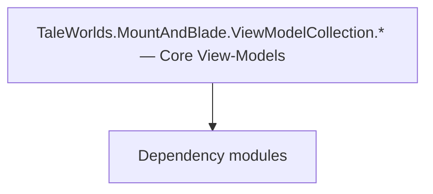

# TaleWorlds.MountAndBlade.ViewModelCollection.* — Core View-Models

**One-line responsibility:** This page covers all 169 business types under `TaleWorlds.MountAndBlade.ViewModelCollection.* — Core View-Models` as a family index, giving each type its namespace, responsibility, and typical timing so you can browse by module instead of alphabetically.

## Mental Model

TaleWorlds.MountAndBlade.ViewModelCollection.* holds the core view-models that project battle and menu logic state into bindable UI data: order/formation VMs, scoreboard, HUD, game options, initial menu, face generator, banner builder, and more. A VM is only a state projection; commands should only trigger Actions/Behaviors.

## When to Use

To customize a battle command panel or a menu, inherit the relevant VM; interaction commands only trigger logic, never mutate game state directly in the VM.

## Dependencies

The types under `TaleWorlds.MountAndBlade.ViewModelCollection.* — Core View-Models` depend on the following modules; missing any of them causes compile- or run-time failure.

- [ViewModel](../../core-extra/ViewModel)
- [MBSubModuleBase](../../core/MBSubModuleBase)
- [API Overview](../../_index)

## Type Catalog

| Type | Namespace | Purpose | Timing |
| --- | --- | --- | --- |
| `BoundaryCrossingVM` | TaleWorlds.MountAndBlade.ViewModelCollection | Gauntlet UI data view-model that exposes properties and commands to the interface, reacts to input and notifies refreshes. A VM is only a projection of state; commands should only trigger Actions or Behaviors. | On UI open |
| `FullScreenNoticeVM` | TaleWorlds.MountAndBlade.ViewModelCollection | Gauntlet UI data view-model that exposes properties and commands to the interface, reacts to input and notifies refreshes. A VM is only a projection of state; commands should only trigger Actions or Behaviors. | On UI open |
| `GameVersionVM` | TaleWorlds.MountAndBlade.ViewModelCollection | Gauntlet UI data view-model that exposes properties and commands to the interface, reacts to input and notifies refreshes. A VM is only a projection of state; commands should only trigger Actions or Behaviors. | On UI open |
| `IMissionScreen` | TaleWorlds.MountAndBlade.ViewModelCollection | A business type under this namespace that carries its derived convention responsibility. Confirm its lifecycle and owning system before calling; do not reference an unready instance at the wrong phase. World-state changes should go through the corresponding Action/Behavior, not direct field mutation. | On UI open |
| `MissionAgentStatusVM` | TaleWorlds.MountAndBlade.ViewModelCollection | Gauntlet UI data view-model that exposes properties and commands to the interface, reacts to input and notifies refreshes. A VM is only a projection of state; commands should only trigger Actions or Behaviors. | On UI open |
| `MissionLeaveVM` | TaleWorlds.MountAndBlade.ViewModelCollection | Gauntlet UI data view-model that exposes properties and commands to the interface, reacts to input and notifies refreshes. A VM is only a projection of state; commands should only trigger Actions or Behaviors. | On UI open |
| `PhotoModeValueOptionVM` | TaleWorlds.MountAndBlade.ViewModelCollection | Gauntlet UI data view-model that exposes properties and commands to the interface, reacts to input and notifies refreshes. A VM is only a projection of state; commands should only trigger Actions or Behaviors. | On UI open |
| `PhotoModeVM` | TaleWorlds.MountAndBlade.ViewModelCollection | Gauntlet UI data view-model that exposes properties and commands to the interface, reacts to input and notifies refreshes. A VM is only a projection of state; commands should only trigger Actions or Behaviors. | On UI open |
| `BannerBuilderCategoryVM` | TaleWorlds.MountAndBlade.ViewModelCollection.BannerBuilder | Gauntlet UI data view-model that exposes properties and commands to the interface, reacts to input and notifies refreshes. A VM is only a projection of state; commands should only trigger Actions or Behaviors. | On UI open |
| `BannerBuilderColorItemVM` | TaleWorlds.MountAndBlade.ViewModelCollection.BannerBuilder | Gauntlet UI data view-model that exposes properties and commands to the interface, reacts to input and notifies refreshes. A VM is only a projection of state; commands should only trigger Actions or Behaviors. | On UI open |
| `BannerBuilderColorSelectionVM` | TaleWorlds.MountAndBlade.ViewModelCollection.BannerBuilder | Gauntlet UI data view-model that exposes properties and commands to the interface, reacts to input and notifies refreshes. A VM is only a projection of state; commands should only trigger Actions or Behaviors. | On UI open |
| `BannerBuilderItemVM` | TaleWorlds.MountAndBlade.ViewModelCollection.BannerBuilder | Gauntlet UI data view-model that exposes properties and commands to the interface, reacts to input and notifies refreshes. A VM is only a projection of state; commands should only trigger Actions or Behaviors. | On UI open |
| `BannerBuilderLayerVM` | TaleWorlds.MountAndBlade.ViewModelCollection.BannerBuilder | Gauntlet UI data view-model that exposes properties and commands to the interface, reacts to input and notifies refreshes. A VM is only a projection of state; commands should only trigger Actions or Behaviors. | On UI open |
| `BannerBuilderVM` | TaleWorlds.MountAndBlade.ViewModelCollection.BannerBuilder | Gauntlet UI data view-model that exposes properties and commands to the interface, reacts to input and notifies refreshes. A VM is only a projection of state; commands should only trigger Actions or Behaviors. | On UI open |
| `CreditsItemVM` | TaleWorlds.MountAndBlade.ViewModelCollection.Credits | Gauntlet UI data view-model that exposes properties and commands to the interface, reacts to input and notifies refreshes. A VM is only a projection of state; commands should only trigger Actions or Behaviors. | On UI open |
| `CreditsVM` | TaleWorlds.MountAndBlade.ViewModelCollection.Credits | Gauntlet UI data view-model that exposes properties and commands to the interface, reacts to input and notifies refreshes. A VM is only a projection of state; commands should only trigger Actions or Behaviors. | On UI open |
| `EscapeMenuItemVM` | TaleWorlds.MountAndBlade.ViewModelCollection.EscapeMenu | Gauntlet UI data view-model that exposes properties and commands to the interface, reacts to input and notifies refreshes. A VM is only a projection of state; commands should only trigger Actions or Behaviors. | On UI open |
| `EscapeMenuVM` | TaleWorlds.MountAndBlade.ViewModelCollection.EscapeMenu | Gauntlet UI data view-model that exposes properties and commands to the interface, reacts to input and notifies refreshes. A VM is only a projection of state; commands should only trigger Actions or Behaviors. | On UI open |
| `GameTipsVM` | TaleWorlds.MountAndBlade.ViewModelCollection.EscapeMenu | Gauntlet UI data view-model that exposes properties and commands to the interface, reacts to input and notifies refreshes. A VM is only a projection of state; commands should only trigger Actions or Behaviors. | On UI open |
| `FacegenListItemVM` | TaleWorlds.MountAndBlade.ViewModelCollection.FaceGenerator | Gauntlet UI data view-model that exposes properties and commands to the interface, reacts to input and notifies refreshes. A VM is only a projection of state; commands should only trigger Actions or Behaviors. | On UI open |
| `FaceGenPropertyVM` | TaleWorlds.MountAndBlade.ViewModelCollection.FaceGenerator | Gauntlet UI data view-model that exposes properties and commands to the interface, reacts to input and notifies refreshes. A VM is only a projection of state; commands should only trigger Actions or Behaviors. | On UI open |
| `FaceGenTabs` | TaleWorlds.MountAndBlade.ViewModelCollection.FaceGenerator | A business type under this namespace that carries its derived convention responsibility. Confirm its lifecycle and owning system before calling; do not reference an unready instance at the wrong phase. World-state changes should go through the corresponding Action/Behavior, not direct field mutation. | On UI open |
| `FaceGenVM` | TaleWorlds.MountAndBlade.ViewModelCollection.FaceGenerator | Gauntlet UI data view-model that exposes properties and commands to the interface, reacts to input and notifies refreshes. A VM is only a projection of state; commands should only trigger Actions or Behaviors. | On UI open |
| `GenderBasedSelectedValue` | TaleWorlds.MountAndBlade.ViewModelCollection.FaceGenerator | A business type under this namespace that carries its derived convention responsibility. Confirm its lifecycle and owning system before calling; do not reference an unready instance at the wrong phase. World-state changes should go through the corresponding Action/Behavior, not direct field mutation. | On UI open |
| `Presets` | TaleWorlds.MountAndBlade.ViewModelCollection.FaceGenerator | A business type under this namespace that carries its derived convention responsibility. Confirm its lifecycle and owning system before calling; do not reference an unready instance at the wrong phase. World-state changes should go through the corresponding Action/Behavior, not direct field mutation. | On UI open |
| `ActionOptionDataVM` | TaleWorlds.MountAndBlade.ViewModelCollection.GameOptions | Gauntlet UI data view-model that exposes properties and commands to the interface, reacts to input and notifies refreshes. A VM is only a projection of state; commands should only trigger Actions or Behaviors. | On UI open |
| `BooleanOptionDataVM` | TaleWorlds.MountAndBlade.ViewModelCollection.GameOptions | Gauntlet UI data view-model that exposes properties and commands to the interface, reacts to input and notifies refreshes. A VM is only a projection of state; commands should only trigger Actions or Behaviors. | On UI open |
| `BrightnessOptionVM` | TaleWorlds.MountAndBlade.ViewModelCollection.GameOptions | Gauntlet UI data view-model that exposes properties and commands to the interface, reacts to input and notifies refreshes. A VM is only a projection of state; commands should only trigger Actions or Behaviors. | On UI open |
| `ExposureOptionVM` | TaleWorlds.MountAndBlade.ViewModelCollection.GameOptions | Gauntlet UI data view-model that exposes properties and commands to the interface, reacts to input and notifies refreshes. A VM is only a projection of state; commands should only trigger Actions or Behaviors. | On UI open |
| `GenericOptionDataVM` | TaleWorlds.MountAndBlade.ViewModelCollection.GameOptions | Gauntlet UI data view-model that exposes properties and commands to the interface, reacts to input and notifies refreshes. A VM is only a projection of state; commands should only trigger Actions or Behaviors. | On UI open |
| `GroupedOptionCategoryVM` | TaleWorlds.MountAndBlade.ViewModelCollection.GameOptions | Gauntlet UI data view-model that exposes properties and commands to the interface, reacts to input and notifies refreshes. A VM is only a projection of state; commands should only trigger Actions or Behaviors. | On UI open |
| `KeyOptionVM` | TaleWorlds.MountAndBlade.ViewModelCollection.GameOptions | Gauntlet UI data view-model that exposes properties and commands to the interface, reacts to input and notifies refreshes. A VM is only a projection of state; commands should only trigger Actions or Behaviors. | On UI open |
| `MPOptionsVM` | TaleWorlds.MountAndBlade.ViewModelCollection.GameOptions | Gauntlet UI data view-model that exposes properties and commands to the interface, reacts to input and notifies refreshes. A VM is only a projection of state; commands should only trigger Actions or Behaviors. | On UI open |
| `NumericOptionDataVM` | TaleWorlds.MountAndBlade.ViewModelCollection.GameOptions | Gauntlet UI data view-model that exposes properties and commands to the interface, reacts to input and notifies refreshes. A VM is only a projection of state; commands should only trigger Actions or Behaviors. | On UI open |
| `OptionGroupVM` | TaleWorlds.MountAndBlade.ViewModelCollection.GameOptions | Gauntlet UI data view-model that exposes properties and commands to the interface, reacts to input and notifies refreshes. A VM is only a projection of state; commands should only trigger Actions or Behaviors. | On UI open |
| `OptionsDataType` | TaleWorlds.MountAndBlade.ViewModelCollection.GameOptions | A business type under this namespace that carries its derived convention responsibility. Confirm its lifecycle and owning system before calling; do not reference an unready instance at the wrong phase. World-state changes should go through the corresponding Action/Behavior, not direct field mutation. | On UI open |
| `OptionsMode` | TaleWorlds.MountAndBlade.ViewModelCollection.GameOptions | A business type under this namespace that carries its derived convention responsibility. Confirm its lifecycle and owning system before calling; do not reference an unready instance at the wrong phase. World-state changes should go through the corresponding Action/Behavior, not direct field mutation. | On UI open |
| `OptionsVM` | TaleWorlds.MountAndBlade.ViewModelCollection.GameOptions | Gauntlet UI data view-model that exposes properties and commands to the interface, reacts to input and notifies refreshes. A VM is only a projection of state; commands should only trigger Actions or Behaviors. | On UI open |
| `StringOptionDataVM` | TaleWorlds.MountAndBlade.ViewModelCollection.GameOptions | Gauntlet UI data view-model that exposes properties and commands to the interface, reacts to input and notifies refreshes. A VM is only a projection of state; commands should only trigger Actions or Behaviors. | On UI open |
| `AuxiliaryKeyGroupVM` | TaleWorlds.MountAndBlade.ViewModelCollection.GameOptions.AuxiliaryKeys | Gauntlet UI data view-model that exposes properties and commands to the interface, reacts to input and notifies refreshes. A VM is only a projection of state; commands should only trigger Actions or Behaviors. | On UI open |
| `AuxiliaryKeyOptionVM` | TaleWorlds.MountAndBlade.ViewModelCollection.GameOptions.AuxiliaryKeys | Gauntlet UI data view-model that exposes properties and commands to the interface, reacts to input and notifies refreshes. A VM is only a projection of state; commands should only trigger Actions or Behaviors. | On UI open |
| `GameKeyGroupVM` | TaleWorlds.MountAndBlade.ViewModelCollection.GameOptions.GameKeys | Gauntlet UI data view-model that exposes properties and commands to the interface, reacts to input and notifies refreshes. A VM is only a projection of state; commands should only trigger Actions or Behaviors. | On UI open |
| `GameKeyOptionCategoryVM` | TaleWorlds.MountAndBlade.ViewModelCollection.GameOptions.GameKeys | Gauntlet UI data view-model that exposes properties and commands to the interface, reacts to input and notifies refreshes. A VM is only a projection of state; commands should only trigger Actions or Behaviors. | On UI open |
| `GameKeyOptionVM` | TaleWorlds.MountAndBlade.ViewModelCollection.GameOptions.GameKeys | Gauntlet UI data view-model that exposes properties and commands to the interface, reacts to input and notifies refreshes. A VM is only a projection of state; commands should only trigger Actions or Behaviors. | On UI open |
| `GamepadOptionCategoryVM` | TaleWorlds.MountAndBlade.ViewModelCollection.GameOptions.GamepadOptions | Gauntlet UI data view-model that exposes properties and commands to the interface, reacts to input and notifies refreshes. A VM is only a projection of state; commands should only trigger Actions or Behaviors. | On UI open |
| `GamepadOptionKeyItemVM` | TaleWorlds.MountAndBlade.ViewModelCollection.GameOptions.GamepadOptions | Gauntlet UI data view-model that exposes properties and commands to the interface, reacts to input and notifies refreshes. A VM is only a projection of state; commands should only trigger Actions or Behaviors. | On UI open |
| `CheerBarkNodeItemVM` | TaleWorlds.MountAndBlade.ViewModelCollection.HUD | Gauntlet UI data view-model that exposes properties and commands to the interface, reacts to input and notifies refreshes. A VM is only a projection of state; commands should only trigger Actions or Behaviors. | On UI open |
| `ControllerEquippedItemVM` | TaleWorlds.MountAndBlade.ViewModelCollection.HUD | Gauntlet UI data view-model that exposes properties and commands to the interface, reacts to input and notifies refreshes. A VM is only a projection of state; commands should only trigger Actions or Behaviors. | On UI open |
| `CrosshairVM` | TaleWorlds.MountAndBlade.ViewModelCollection.HUD | Gauntlet UI data view-model that exposes properties and commands to the interface, reacts to input and notifies refreshes. A VM is only a projection of state; commands should only trigger Actions or Behaviors. | On UI open |
| `EquipmentActionItemVM` | TaleWorlds.MountAndBlade.ViewModelCollection.HUD | Gauntlet UI data view-model that exposes properties and commands to the interface, reacts to input and notifies refreshes. A VM is only a projection of state; commands should only trigger Actions or Behaviors. | On UI open |
| `ItemGroup` | TaleWorlds.MountAndBlade.ViewModelCollection.HUD | A business type under this namespace that carries its derived convention responsibility. Confirm its lifecycle and owning system before calling; do not reference an unready instance at the wrong phase. World-state changes should go through the corresponding Action/Behavior, not direct field mutation. | On UI open |
| `LockStates` | TaleWorlds.MountAndBlade.ViewModelCollection.HUD | A business type under this namespace that carries its derived convention responsibility. Confirm its lifecycle and owning system before calling; do not reference an unready instance at the wrong phase. World-state changes should go through the corresponding Action/Behavior, not direct field mutation. | On UI open |
| `MissionAgentLockItemVM` | TaleWorlds.MountAndBlade.ViewModelCollection.HUD | Gauntlet UI data view-model that exposes properties and commands to the interface, reacts to input and notifies refreshes. A VM is only a projection of state; commands should only trigger Actions or Behaviors. | On UI open |
| `MissionAgentLockVisualizerVM` | TaleWorlds.MountAndBlade.ViewModelCollection.HUD | Gauntlet UI data view-model that exposes properties and commands to the interface, reacts to input and notifies refreshes. A VM is only a projection of state; commands should only trigger Actions or Behaviors. | On UI open |
| `MissionAgentTakenDamageItemVM` | TaleWorlds.MountAndBlade.ViewModelCollection.HUD | Gauntlet UI data view-model that exposes properties and commands to the interface, reacts to input and notifies refreshes. A VM is only a projection of state; commands should only trigger Actions or Behaviors. | On UI open |
| `MissionAgentTakenDamageVM` | TaleWorlds.MountAndBlade.ViewModelCollection.HUD | Gauntlet UI data view-model that exposes properties and commands to the interface, reacts to input and notifies refreshes. A VM is only a projection of state; commands should only trigger Actions or Behaviors. | On UI open |
| `MissionMainAgentCheerBarkControllerVM` | TaleWorlds.MountAndBlade.ViewModelCollection.HUD | Gauntlet UI data view-model that exposes properties and commands to the interface, reacts to input and notifies refreshes. A VM is only a projection of state; commands should only trigger Actions or Behaviors. | On UI open |
| `MissionMainAgentControllerEquipDropVM` | TaleWorlds.MountAndBlade.ViewModelCollection.HUD | Gauntlet UI data view-model that exposes properties and commands to the interface, reacts to input and notifies refreshes. A VM is only a projection of state; commands should only trigger Actions or Behaviors. | On UI open |
| `MissionMainAgentEquipmentControllerVM` | TaleWorlds.MountAndBlade.ViewModelCollection.HUD | Gauntlet UI data view-model that exposes properties and commands to the interface, reacts to input and notifies refreshes. A VM is only a projection of state; commands should only trigger Actions or Behaviors. | On UI open |
| `MissionSpectatorControlVM` | TaleWorlds.MountAndBlade.ViewModelCollection.HUD | Gauntlet UI data view-model that exposes properties and commands to the interface, reacts to input and notifies refreshes. A VM is only a projection of state; commands should only trigger Actions or Behaviors. | On UI open |
| `ReloadPhaseItemVM` | TaleWorlds.MountAndBlade.ViewModelCollection.HUD | Gauntlet UI data view-model that exposes properties and commands to the interface, reacts to input and notifies refreshes. A VM is only a projection of state; commands should only trigger Actions or Behaviors. | On UI open |
| `CompassMarkerVM` | TaleWorlds.MountAndBlade.ViewModelCollection.HUD.Compass | Gauntlet UI data view-model that exposes properties and commands to the interface, reacts to input and notifies refreshes. A VM is only a projection of state; commands should only trigger Actions or Behaviors. | On UI open |
| `CompassTargetVM` | TaleWorlds.MountAndBlade.ViewModelCollection.HUD.Compass | Gauntlet UI data view-model that exposes properties and commands to the interface, reacts to input and notifies refreshes. A VM is only a projection of state; commands should only trigger Actions or Behaviors. | On UI open |
| `MissionAgentDamageFeedItemVM` | TaleWorlds.MountAndBlade.ViewModelCollection.HUD.DamageFeed | Gauntlet UI data view-model that exposes properties and commands to the interface, reacts to input and notifies refreshes. A VM is only a projection of state; commands should only trigger Actions or Behaviors. | On UI open |
| `MissionAgentDamageFeedVM` | TaleWorlds.MountAndBlade.ViewModelCollection.HUD.DamageFeed | Gauntlet UI data view-model that exposes properties and commands to the interface, reacts to input and notifies refreshes. A VM is only a projection of state; commands should only trigger Actions or Behaviors. | On UI open |
| `FormationMarkerDistanceComparer` | TaleWorlds.MountAndBlade.ViewModelCollection.HUD.FormationMarker | A business type under this namespace that carries its derived convention responsibility. Confirm its lifecycle and owning system before calling; do not reference an unready instance at the wrong phase. World-state changes should go through the corresponding Action/Behavior, not direct field mutation. | On UI open |
| `MissionFormationMarkerTargetVM` | TaleWorlds.MountAndBlade.ViewModelCollection.HUD.FormationMarker | Gauntlet UI data view-model that exposes properties and commands to the interface, reacts to input and notifies refreshes. A VM is only a projection of state; commands should only trigger Actions or Behaviors. | On UI open |
| `MissionFormationMarkerVM` | TaleWorlds.MountAndBlade.ViewModelCollection.HUD.FormationMarker | Gauntlet UI data view-model that exposes properties and commands to the interface, reacts to input and notifies refreshes. A VM is only a projection of state; commands should only trigger Actions or Behaviors. | On UI open |
| `MissionSiegeEngineMarkerTargetVM` | TaleWorlds.MountAndBlade.ViewModelCollection.HUD.FormationMarker | Gauntlet UI data view-model that exposes properties and commands to the interface, reacts to input and notifies refreshes. A VM is only a projection of state; commands should only trigger Actions or Behaviors. | On UI open |
| `MissionSiegeEngineMarkerVM` | TaleWorlds.MountAndBlade.ViewModelCollection.HUD.FormationMarker | Gauntlet UI data view-model that exposes properties and commands to the interface, reacts to input and notifies refreshes. A VM is only a projection of state; commands should only trigger Actions or Behaviors. | On UI open |
| `SiegeEngineMarkerDistanceComparer` | TaleWorlds.MountAndBlade.ViewModelCollection.HUD.FormationMarker | A business type under this namespace that carries its derived convention responsibility. Confirm its lifecycle and owning system before calling; do not reference an unready instance at the wrong phase. World-state changes should go through the corresponding Action/Behavior, not direct field mutation. | On UI open |
| `TeamTypes` | TaleWorlds.MountAndBlade.ViewModelCollection.HUD.FormationMarker | A business type under this namespace that carries its derived convention responsibility. Confirm its lifecycle and owning system before calling; do not reference an unready instance at the wrong phase. World-state changes should go through the corresponding Action/Behavior, not direct field mutation. | On UI open |
| `SPKillFeedVM` | TaleWorlds.MountAndBlade.ViewModelCollection.HUD.KillFeed | Gauntlet UI data view-model that exposes properties and commands to the interface, reacts to input and notifies refreshes. A VM is only a projection of state; commands should only trigger Actions or Behaviors. | On UI open |
| `SPGeneralKillNotificationItemVM` | TaleWorlds.MountAndBlade.ViewModelCollection.HUD.KillFeed.General | Gauntlet UI data view-model that exposes properties and commands to the interface, reacts to input and notifies refreshes. A VM is only a projection of state; commands should only trigger Actions or Behaviors. | On UI open |
| `SPGeneralKillNotificationVM` | TaleWorlds.MountAndBlade.ViewModelCollection.HUD.KillFeed.General | Gauntlet UI data view-model that exposes properties and commands to the interface, reacts to input and notifies refreshes. A VM is only a projection of state; commands should only trigger Actions or Behaviors. | On UI open |
| `SPPersonalKillNotificationItemVM` | TaleWorlds.MountAndBlade.ViewModelCollection.HUD.KillFeed.Personal | Gauntlet UI data view-model that exposes properties and commands to the interface, reacts to input and notifies refreshes. A VM is only a projection of state; commands should only trigger Actions or Behaviors. | On UI open |
| `SPPersonalKillNotificationVM` | TaleWorlds.MountAndBlade.ViewModelCollection.HUD.KillFeed.Personal | Gauntlet UI data view-model that exposes properties and commands to the interface, reacts to input and notifies refreshes. A VM is only a projection of state; commands should only trigger Actions or Behaviors. | On UI open |
| `MissionMainAgentWalkModeControllerVM` | TaleWorlds.MountAndBlade.ViewModelCollection.HUD.WalkMode | Gauntlet UI data view-model that exposes properties and commands to the interface, reacts to input and notifies refreshes. A VM is only a projection of state; commands should only trigger Actions or Behaviors. | On UI open |
| `WalkModeItemVM` | TaleWorlds.MountAndBlade.ViewModelCollection.HUD.WalkMode | Gauntlet UI data view-model that exposes properties and commands to the interface, reacts to input and notifies refreshes. A VM is only a projection of state; commands should only trigger Actions or Behaviors. | On UI open |
| `InitialMenuAnnouncementVM` | TaleWorlds.MountAndBlade.ViewModelCollection.InitialMenu | Gauntlet UI data view-model that exposes properties and commands to the interface, reacts to input and notifies refreshes. A VM is only a projection of state; commands should only trigger Actions or Behaviors. | On UI open |
| `InitialMenuOptionVM` | TaleWorlds.MountAndBlade.ViewModelCollection.InitialMenu | Gauntlet UI data view-model that exposes properties and commands to the interface, reacts to input and notifies refreshes. A VM is only a projection of state; commands should only trigger Actions or Behaviors. | On UI open |
| `InitialMenuVM` | TaleWorlds.MountAndBlade.ViewModelCollection.InitialMenu | Gauntlet UI data view-model that exposes properties and commands to the interface, reacts to input and notifies refreshes. A VM is only a projection of state; commands should only trigger Actions or Behaviors. | On UI open |
| `InputKeyItemVM` | TaleWorlds.MountAndBlade.ViewModelCollection.Input | Gauntlet UI data view-model that exposes properties and commands to the interface, reacts to input and notifies refreshes. A VM is only a projection of state; commands should only trigger Actions or Behaviors. | On UI open |
| `MultiSelectionQueryPopUpVM` | TaleWorlds.MountAndBlade.ViewModelCollection.Inquiries | Gauntlet UI data view-model that exposes properties and commands to the interface, reacts to input and notifies refreshes. A VM is only a projection of state; commands should only trigger Actions or Behaviors. | On UI open |
| `PopUpBaseVM` | TaleWorlds.MountAndBlade.ViewModelCollection.Inquiries | Gauntlet UI data view-model that exposes properties and commands to the interface, reacts to input and notifies refreshes. A VM is only a projection of state; commands should only trigger Actions or Behaviors. | On UI open |
| `SingleQueryPopUpVM` | TaleWorlds.MountAndBlade.ViewModelCollection.Inquiries | Gauntlet UI data view-model that exposes properties and commands to the interface, reacts to input and notifies refreshes. A VM is only a projection of state; commands should only trigger Actions or Behaviors. | On UI open |
| `TextQueryPopUpVM` | TaleWorlds.MountAndBlade.ViewModelCollection.Inquiries | Gauntlet UI data view-model that exposes properties and commands to the interface, reacts to input and notifies refreshes. A VM is only a projection of state; commands should only trigger Actions or Behaviors. | On UI open |
| `AgentInteractionInterfaceVM` | TaleWorlds.MountAndBlade.ViewModelCollection.Missions.Interaction | Gauntlet UI data view-model that exposes properties and commands to the interface, reacts to input and notifies refreshes. A VM is only a projection of state; commands should only trigger Actions or Behaviors. | On battle/mission load |
| `IInteractionInterfaceHandler` | TaleWorlds.MountAndBlade.ViewModelCollection.Missions.Interaction | A business type under this namespace that carries its derived convention responsibility. Confirm its lifecycle and owning system before calling; do not reference an unready instance at the wrong phase. World-state changes should go through the corresponding Action/Behavior, not direct field mutation. | On battle/mission load |
| `MissionGenericInteractionItemVM` | TaleWorlds.MountAndBlade.ViewModelCollection.Missions.Interaction.InteractionItems | Gauntlet UI data view-model that exposes properties and commands to the interface, reacts to input and notifies refreshes. A VM is only a projection of state; commands should only trigger Actions or Behaviors. | On battle/mission load |
| `MissionHintInteractionItemVM` | TaleWorlds.MountAndBlade.ViewModelCollection.Missions.Interaction.InteractionItems | Gauntlet UI data view-model that exposes properties and commands to the interface, reacts to input and notifies refreshes. A VM is only a projection of state; commands should only trigger Actions or Behaviors. | On battle/mission load |
| `MissionInteractionItemBaseVM` | TaleWorlds.MountAndBlade.ViewModelCollection.Missions.Interaction.InteractionItems | Gauntlet UI data view-model that exposes properties and commands to the interface, reacts to input and notifies refreshes. A VM is only a projection of state; commands should only trigger Actions or Behaviors. | On battle/mission load |
| `MissionPrimaryInteractionItemVM` | TaleWorlds.MountAndBlade.ViewModelCollection.Missions.Interaction.InteractionItems | Gauntlet UI data view-model that exposes properties and commands to the interface, reacts to input and notifies refreshes. A VM is only a projection of state; commands should only trigger Actions or Behaviors. | On battle/mission load |
| `MissionObjectiveMarkersVM` | TaleWorlds.MountAndBlade.ViewModelCollection.Missions.Objective | Gauntlet UI data view-model that exposes properties and commands to the interface, reacts to input and notifies refreshes. A VM is only a projection of state; commands should only trigger Actions or Behaviors. | On battle/mission load |
| `MissionObjectiveMarkerVM` | TaleWorlds.MountAndBlade.ViewModelCollection.Missions.Objective | Gauntlet UI data view-model that exposes properties and commands to the interface, reacts to input and notifies refreshes. A VM is only a projection of state; commands should only trigger Actions or Behaviors. | On battle/mission load |
| `MissionObjectiveVM` | TaleWorlds.MountAndBlade.ViewModelCollection.Missions.Objective | Gauntlet UI data view-model that exposes properties and commands to the interface, reacts to input and notifies refreshes. A VM is only a projection of state; commands should only trigger Actions or Behaviors. | On battle/mission load |
| `MPChatLineVM` | TaleWorlds.MountAndBlade.ViewModelCollection.Multiplayer | Gauntlet UI data view-model that exposes properties and commands to the interface, reacts to input and notifies refreshes. A VM is only a projection of state; commands should only trigger Actions or Behaviors. | On UI open |
| `MPChatVM` | TaleWorlds.MountAndBlade.ViewModelCollection.Multiplayer | Gauntlet UI data view-model that exposes properties and commands to the interface, reacts to input and notifies refreshes. A VM is only a projection of state; commands should only trigger Actions or Behaviors. | On UI open |
| `ClassConfiguration` | TaleWorlds.MountAndBlade.ViewModelCollection.Order | A business type under this namespace that carries its derived convention responsibility. Confirm its lifecycle and owning system before calling; do not reference an unready instance at the wrong phase. World-state changes should go through the corresponding Action/Behavior, not direct field mutation. | On UI open |
| `CursorStates` | TaleWorlds.MountAndBlade.ViewModelCollection.Order | A business type under this namespace that carries its derived convention responsibility. Confirm its lifecycle and owning system before calling; do not reference an unready instance at the wrong phase. World-state changes should go through the corresponding Action/Behavior, not direct field mutation. | On UI open |
| `DeploymentSiegeMachineVM` | TaleWorlds.MountAndBlade.ViewModelCollection.Order | Gauntlet UI data view-model that exposes properties and commands to the interface, reacts to input and notifies refreshes. A VM is only a projection of state; commands should only trigger Actions or Behaviors. | On UI open |
| `FormationConfiguration` | TaleWorlds.MountAndBlade.ViewModelCollection.Order | A business type under this namespace that carries its derived convention responsibility. Confirm its lifecycle and owning system before calling; do not reference an unready instance at the wrong phase. World-state changes should go through the corresponding Action/Behavior, not direct field mutation. | On UI open |
| `MissionOrderCallbacks` | TaleWorlds.MountAndBlade.ViewModelCollection.Order | Battle order / formation sequence describing a unit’s formation and movement intent, interpreted and executed by the Order system. | On UI open |
| `MissionOrderDeploymentControllerVM` | TaleWorlds.MountAndBlade.ViewModelCollection.Order | Gauntlet UI data view-model that exposes properties and commands to the interface, reacts to input and notifies refreshes. A VM is only a projection of state; commands should only trigger Actions or Behaviors. | On UI open |
| `MissionOrderTroopControllerVM` | TaleWorlds.MountAndBlade.ViewModelCollection.Order | Gauntlet UI data view-model that exposes properties and commands to the interface, reacts to input and notifies refreshes. A VM is only a projection of state; commands should only trigger Actions or Behaviors. | On UI open |
| `MissionOrderVM` | TaleWorlds.MountAndBlade.ViewModelCollection.Order | Gauntlet UI data view-model that exposes properties and commands to the interface, reacts to input and notifies refreshes. A VM is only a projection of state; commands should only trigger Actions or Behaviors. | On UI open |
| `OrderItemBaseVM` | TaleWorlds.MountAndBlade.ViewModelCollection.Order | Gauntlet UI data view-model that exposes properties and commands to the interface, reacts to input and notifies refreshes. A VM is only a projection of state; commands should only trigger Actions or Behaviors. | On UI open |
| `OrderItemVM` | TaleWorlds.MountAndBlade.ViewModelCollection.Order | Gauntlet UI data view-model that exposes properties and commands to the interface, reacts to input and notifies refreshes. A VM is only a projection of state; commands should only trigger Actions or Behaviors. | On UI open |
| `OrderSetVM` | TaleWorlds.MountAndBlade.ViewModelCollection.Order | Gauntlet UI data view-model that exposes properties and commands to the interface, reacts to input and notifies refreshes. A VM is only a projection of state; commands should only trigger Actions or Behaviors. | On UI open |
| `OrderSiegeMachineVM` | TaleWorlds.MountAndBlade.ViewModelCollection.Order | Gauntlet UI data view-model that exposes properties and commands to the interface, reacts to input and notifies refreshes. A VM is only a projection of state; commands should only trigger Actions or Behaviors. | On UI open |
| `OrderSubjectVM` | TaleWorlds.MountAndBlade.ViewModelCollection.Order | Gauntlet UI data view-model that exposes properties and commands to the interface, reacts to input and notifies refreshes. A VM is only a projection of state; commands should only trigger Actions or Behaviors. | On UI open |
| `OrderTargets` | TaleWorlds.MountAndBlade.ViewModelCollection.Order | Battle order / formation sequence describing a unit’s formation and movement intent, interpreted and executed by the Order system. | On UI open |
| `OrderTroopItemFilterVM` | TaleWorlds.MountAndBlade.ViewModelCollection.Order | Gauntlet UI data view-model that exposes properties and commands to the interface, reacts to input and notifies refreshes. A VM is only a projection of state; commands should only trigger Actions or Behaviors. | On UI open |
| `OrderTroopItemFormationClassVM` | TaleWorlds.MountAndBlade.ViewModelCollection.Order | Gauntlet UI data view-model that exposes properties and commands to the interface, reacts to input and notifies refreshes. A VM is only a projection of state; commands should only trigger Actions or Behaviors. | On UI open |
| `OrderTroopItemVM` | TaleWorlds.MountAndBlade.ViewModelCollection.Order | Gauntlet UI data view-model that exposes properties and commands to the interface, reacts to input and notifies refreshes. A VM is only a projection of state; commands should only trigger Actions or Behaviors. | On UI open |
| `TroopItemFormationIndexComparer` | TaleWorlds.MountAndBlade.ViewModelCollection.Order | A business type under this namespace that carries its derived convention responsibility. Confirm its lifecycle and owning system before calling; do not reference an unready instance at the wrong phase. World-state changes should go through the corresponding Action/Behavior, not direct field mutation. | On UI open |
| `ActionVisualOrder` | TaleWorlds.MountAndBlade.ViewModelCollection.Order.Visual | Battle order / formation sequence describing a unit’s formation and movement intent, interpreted and executed by the Order system. | On UI open |
| `OrderState` | TaleWorlds.MountAndBlade.ViewModelCollection.Order.Visual | Battle order / formation sequence describing a unit’s formation and movement intent, interpreted and executed by the Order system. | On UI open |
| `ReturnVisualOrder` | TaleWorlds.MountAndBlade.ViewModelCollection.Order.Visual | Battle order / formation sequence describing a unit’s formation and movement intent, interpreted and executed by the Order system. | On UI open |
| `TransferTroopsVisualOrder` | TaleWorlds.MountAndBlade.ViewModelCollection.Order.Visual | Battle order / formation sequence describing a unit’s formation and movement intent, interpreted and executed by the Order system. | On UI open |
| `VisualOrder` | TaleWorlds.MountAndBlade.ViewModelCollection.Order.Visual | Battle order / formation sequence describing a unit’s formation and movement intent, interpreted and executed by the Order system. | On UI open |
| `VisualOrderExecutionParameters` | TaleWorlds.MountAndBlade.ViewModelCollection.Order.Visual | Parameter container carrying configuration or runtime data. Avoid holding long-lived references that hinder GC. | On UI open |
| `VisualOrderFactory` | TaleWorlds.MountAndBlade.ViewModelCollection.Order.Visual | Battle order / formation sequence describing a unit’s formation and movement intent, interpreted and executed by the Order system. | On UI open |
| `VisualOrderHelper` | TaleWorlds.MountAndBlade.ViewModelCollection.Order.Visual | Battle order / formation sequence describing a unit’s formation and movement intent, interpreted and executed by the Order system. | On UI open |
| `VisualOrderProvider` | TaleWorlds.MountAndBlade.ViewModelCollection.Order.Visual | Battle order / formation sequence describing a unit’s formation and movement intent, interpreted and executed by the Order system. | On UI open |
| `VisualOrderSet` | TaleWorlds.MountAndBlade.ViewModelCollection.Order.Visual | Battle order / formation sequence describing a unit’s formation and movement intent, interpreted and executed by the Order system. | On UI open |
| `ArrangementVisualOrder` | TaleWorlds.MountAndBlade.ViewModelCollection.Order.Visual.Default.Orders.FormOrders | Battle order / formation sequence describing a unit’s formation and movement intent, interpreted and executed by the Order system. | On UI open |
| `AdvanceVisualOrder` | TaleWorlds.MountAndBlade.ViewModelCollection.Order.Visual.Default.Orders.MovementOrders | Battle order / formation sequence describing a unit’s formation and movement intent, interpreted and executed by the Order system. | On UI open |
| `ChargeVisualOrder` | TaleWorlds.MountAndBlade.ViewModelCollection.Order.Visual.Default.Orders.MovementOrders | Battle order / formation sequence describing a unit’s formation and movement intent, interpreted and executed by the Order system. | On UI open |
| `FallbackVisualOrder` | TaleWorlds.MountAndBlade.ViewModelCollection.Order.Visual.Default.Orders.MovementOrders | Battle order / formation sequence describing a unit’s formation and movement intent, interpreted and executed by the Order system. | On UI open |
| `FollowMeVisualOrder` | TaleWorlds.MountAndBlade.ViewModelCollection.Order.Visual.Default.Orders.MovementOrders | Battle order / formation sequence describing a unit’s formation and movement intent, interpreted and executed by the Order system. | On UI open |
| `MoveVisualOrder` | TaleWorlds.MountAndBlade.ViewModelCollection.Order.Visual.Default.Orders.MovementOrders | Battle order / formation sequence describing a unit’s formation and movement intent, interpreted and executed by the Order system. | On UI open |
| `RetreatVisualOrder` | TaleWorlds.MountAndBlade.ViewModelCollection.Order.Visual.Default.Orders.MovementOrders | Battle order / formation sequence describing a unit’s formation and movement intent, interpreted and executed by the Order system. | On UI open |
| `StopVisualOrder` | TaleWorlds.MountAndBlade.ViewModelCollection.Order.Visual.Default.Orders.MovementOrders | Battle order / formation sequence describing a unit’s formation and movement intent, interpreted and executed by the Order system. | On UI open |
| `GenericToggleVisualOrder` | TaleWorlds.MountAndBlade.ViewModelCollection.Order.Visual.Default.Orders.ToggleOrders | Battle order / formation sequence describing a unit’s formation and movement intent, interpreted and executed by the Order system. | On UI open |
| `OrderOfBattleFormationClassChangedEvent` | TaleWorlds.MountAndBlade.ViewModelCollection.OrderOfBattle | Battle order / formation sequence describing a unit’s formation and movement intent, interpreted and executed by the Order system. | On UI open |
| `OrderOfBattleFormationClassSelectorItemVM` | TaleWorlds.MountAndBlade.ViewModelCollection.OrderOfBattle | Gauntlet UI data view-model that exposes properties and commands to the interface, reacts to input and notifies refreshes. A VM is only a projection of state; commands should only trigger Actions or Behaviors. | On UI open |
| `OrderOfBattleFormationClassVM` | TaleWorlds.MountAndBlade.ViewModelCollection.OrderOfBattle | Gauntlet UI data view-model that exposes properties and commands to the interface, reacts to input and notifies refreshes. A VM is only a projection of state; commands should only trigger Actions or Behaviors. | On UI open |
| `OrderOfBattleFormationFilterSelectorItemComparer` | TaleWorlds.MountAndBlade.ViewModelCollection.OrderOfBattle | Battle order / formation sequence describing a unit’s formation and movement intent, interpreted and executed by the Order system. | On UI open |
| `OrderOfBattleFormationFilterSelectorItemVM` | TaleWorlds.MountAndBlade.ViewModelCollection.OrderOfBattle | Gauntlet UI data view-model that exposes properties and commands to the interface, reacts to input and notifies refreshes. A VM is only a projection of state; commands should only trigger Actions or Behaviors. | On UI open |
| `OrderOfBattleFormationItemVM` | TaleWorlds.MountAndBlade.ViewModelCollection.OrderOfBattle | Gauntlet UI data view-model that exposes properties and commands to the interface, reacts to input and notifies refreshes. A VM is only a projection of state; commands should only trigger Actions or Behaviors. | On UI open |
| `OrderOfBattleFormationWeightChangedEvent` | TaleWorlds.MountAndBlade.ViewModelCollection.OrderOfBattle | Battle order / formation sequence describing a unit’s formation and movement intent, interpreted and executed by the Order system. | On UI open |
| `OrderOfBattleHeroAssignedToFormationEvent` | TaleWorlds.MountAndBlade.ViewModelCollection.OrderOfBattle | Battle order / formation sequence describing a unit’s formation and movement intent, interpreted and executed by the Order system. | On UI open |
| `OrderOfBattleHeroItemVM` | TaleWorlds.MountAndBlade.ViewModelCollection.OrderOfBattle | Gauntlet UI data view-model that exposes properties and commands to the interface, reacts to input and notifies refreshes. A VM is only a projection of state; commands should only trigger Actions or Behaviors. | On UI open |
| `OrderOfBattleUIHelper` | TaleWorlds.MountAndBlade.ViewModelCollection.OrderOfBattle | Battle order / formation sequence describing a unit’s formation and movement intent, interpreted and executed by the Order system. | On UI open |
| `OrderOfBattleVM` | TaleWorlds.MountAndBlade.ViewModelCollection.OrderOfBattle | Gauntlet UI data view-model that exposes properties and commands to the interface, reacts to input and notifies refreshes. A VM is only a projection of state; commands should only trigger Actions or Behaviors. | On UI open |
| `ProfileSelectionVM` | TaleWorlds.MountAndBlade.ViewModelCollection.ProfileSelection | Gauntlet UI data view-model that exposes properties and commands to the interface, reacts to input and notifies refreshes. A VM is only a projection of state; commands should only trigger Actions or Behaviors. | On UI open |
| `BattleResultType` | TaleWorlds.MountAndBlade.ViewModelCollection.Scoreboard | A business type under this namespace that carries its derived convention responsibility. Confirm its lifecycle and owning system before calling; do not reference an unready instance at the wrong phase. World-state changes should go through the corresponding Action/Behavior, not direct field mutation. | On UI open |
| `Categories` | TaleWorlds.MountAndBlade.ViewModelCollection.Scoreboard | A business type under this namespace that carries its derived convention responsibility. Confirm its lifecycle and owning system before calling; do not reference an unready instance at the wrong phase. World-state changes should go through the corresponding Action/Behavior, not direct field mutation. | On UI open |
| `CustomBattleScoreboardVM` | TaleWorlds.MountAndBlade.ViewModelCollection.Scoreboard | Gauntlet UI data view-model that exposes properties and commands to the interface, reacts to input and notifies refreshes. A VM is only a projection of state; commands should only trigger Actions or Behaviors. | On UI open |
| `ItemDeadComparer` | TaleWorlds.MountAndBlade.ViewModelCollection.Scoreboard | A business type under this namespace that carries its derived convention responsibility. Confirm its lifecycle and owning system before calling; do not reference an unready instance at the wrong phase. World-state changes should go through the corresponding Action/Behavior, not direct field mutation. | On UI open |
| `ItemKillComparer` | TaleWorlds.MountAndBlade.ViewModelCollection.Scoreboard | A business type under this namespace that carries its derived convention responsibility. Confirm its lifecycle and owning system before calling; do not reference an unready instance at the wrong phase. World-state changes should go through the corresponding Action/Behavior, not direct field mutation. | On UI open |
| `ItemMemberComparer` | TaleWorlds.MountAndBlade.ViewModelCollection.Scoreboard | A business type under this namespace that carries its derived convention responsibility. Confirm its lifecycle and owning system before calling; do not reference an unready instance at the wrong phase. World-state changes should go through the corresponding Action/Behavior, not direct field mutation. | On UI open |
| `ItemRemainingComparer` | TaleWorlds.MountAndBlade.ViewModelCollection.Scoreboard | AI decision implementation that must be interruptible and serializable to support saving and undo. Search must be depth/time bounded to avoid stalls. | On UI open |
| `ItemRoutedComparer` | TaleWorlds.MountAndBlade.ViewModelCollection.Scoreboard | A business type under this namespace that carries its derived convention responsibility. Confirm its lifecycle and owning system before calling; do not reference an unready instance at the wrong phase. World-state changes should go through the corresponding Action/Behavior, not direct field mutation. | On UI open |
| `ItemUpgradeComparer` | TaleWorlds.MountAndBlade.ViewModelCollection.Scoreboard | A business type under this namespace that carries its derived convention responsibility. Confirm its lifecycle and owning system before calling; do not reference an unready instance at the wrong phase. World-state changes should go through the corresponding Action/Behavior, not direct field mutation. | On UI open |
| `ItemWoundedComparer` | TaleWorlds.MountAndBlade.ViewModelCollection.Scoreboard | A business type under this namespace that carries its derived convention responsibility. Confirm its lifecycle and owning system before calling; do not reference an unready instance at the wrong phase. World-state changes should go through the corresponding Action/Behavior, not direct field mutation. | On UI open |
| `MouseState` | TaleWorlds.MountAndBlade.ViewModelCollection.Scoreboard | A business type under this namespace that carries its derived convention responsibility. Confirm its lifecycle and owning system before calling; do not reference an unready instance at the wrong phase. World-state changes should go through the corresponding Action/Behavior, not direct field mutation. | On UI open |
| `ScoreboardBaseVM` | TaleWorlds.MountAndBlade.ViewModelCollection.Scoreboard | Gauntlet UI data view-model that exposes properties and commands to the interface, reacts to input and notifies refreshes. A VM is only a projection of state; commands should only trigger Actions or Behaviors. | On UI open |
| `ScoreboardHotkeys` | TaleWorlds.MountAndBlade.ViewModelCollection.Scoreboard | A business type under this namespace that carries its derived convention responsibility. Confirm its lifecycle and owning system before calling; do not reference an unready instance at the wrong phase. World-state changes should go through the corresponding Action/Behavior, not direct field mutation. | On UI open |
| `ScoreboardUnitItemComparerBase` | TaleWorlds.MountAndBlade.ViewModelCollection.Scoreboard | A business type under this namespace that carries its derived convention responsibility. Confirm its lifecycle and owning system before calling; do not reference an unready instance at the wrong phase. World-state changes should go through the corresponding Action/Behavior, not direct field mutation. | On UI open |
| `SPScoreboardPartyVM` | TaleWorlds.MountAndBlade.ViewModelCollection.Scoreboard | Gauntlet UI data view-model that exposes properties and commands to the interface, reacts to input and notifies refreshes. A VM is only a projection of state; commands should only trigger Actions or Behaviors. | On UI open |
| `SPScoreboardShipVM` | TaleWorlds.MountAndBlade.ViewModelCollection.Scoreboard | Gauntlet UI data view-model that exposes properties and commands to the interface, reacts to input and notifies refreshes. A VM is only a projection of state; commands should only trigger Actions or Behaviors. | On UI open |
| `SPScoreboardSideVM` | TaleWorlds.MountAndBlade.ViewModelCollection.Scoreboard | Gauntlet UI data view-model that exposes properties and commands to the interface, reacts to input and notifies refreshes. A VM is only a projection of state; commands should only trigger Actions or Behaviors. | On UI open |
| `SPScoreboardSkillItemVM` | TaleWorlds.MountAndBlade.ViewModelCollection.Scoreboard | Gauntlet UI data view-model that exposes properties and commands to the interface, reacts to input and notifies refreshes. A VM is only a projection of state; commands should only trigger Actions or Behaviors. | On UI open |
| `SPScoreboardSortControllerVM` | TaleWorlds.MountAndBlade.ViewModelCollection.Scoreboard | Gauntlet UI data view-model that exposes properties and commands to the interface, reacts to input and notifies refreshes. A VM is only a projection of state; commands should only trigger Actions or Behaviors. | On UI open |
| `SPScoreboardStatsVM` | TaleWorlds.MountAndBlade.ViewModelCollection.Scoreboard | Gauntlet UI data view-model that exposes properties and commands to the interface, reacts to input and notifies refreshes. A VM is only a projection of state; commands should only trigger Actions or Behaviors. | On UI open |
| `SPScoreboardUnitVM` | TaleWorlds.MountAndBlade.ViewModelCollection.Scoreboard | Gauntlet UI data view-model that exposes properties and commands to the interface, reacts to input and notifies refreshes. A VM is only a projection of state; commands should only trigger Actions or Behaviors. | On UI open |
| `VideoPlaybackVM` | TaleWorlds.MountAndBlade.ViewModelCollection.VideoPlayback | Gauntlet UI data view-model that exposes properties and commands to the interface, reacts to input and notifies refreshes. A VM is only a projection of state; commands should only trigger Actions or Behaviors. | On UI open |

## Risk & Boundaries

VMs hold no rules; mutating state in a VM breaks the single source of truth. Throttle frequent property refreshes to avoid per-frame GC pressure.

## See Also

- [ViewModel](../../core-extra/ViewModel)
- [MBSubModuleBase](../../core/MBSubModuleBase)
- [API Overview](../../_index)
