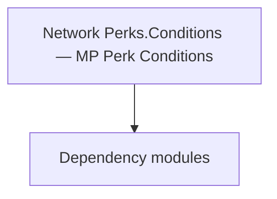

# Network Perks.Conditions — MP Perk Conditions

**One-line responsibility:** This page covers all 13 business types under `Network Perks.Conditions — MP Perk Conditions` as a family index, giving each type its namespace, responsibility, and typical timing so you can browse by module instead of alphabetically.

## Mental Model

Perks.Conditions is the multiplayer perk "activation condition" set: each MPPerkCondition subclass judges whether a perk is satisfied in the current battle context (specific weapon/troop/terrain). Conditions only judge, never mutate; the perk system evaluates them before settling bonuses. They are decoupled from the single-player perk system and built for MP balance.

## When to Use

To add or adjust a multiplayer perk trigger condition, inherit MPPerkCondition and register it in the perk definition. Conditions must be pure and reentrant.

## Dependencies

The types under `Network Perks.Conditions — MP Perk Conditions` depend on the following modules; missing any of them causes compile- or run-time failure.

- [Mission](../../mission/Mission)
- [API Overview](../../_index)

## Type Catalog

| Type | Namespace | Purpose | Timing |
| --- | --- | --- | --- |
| `AgentStatusCondition` | TaleWorlds.MountAndBlade.Network.Gameplay.Perks.Conditions | A business type under this namespace that carries its derived convention responsibility. Confirm its lifecycle and owning system before calling; do not reference an unready instance at the wrong phase. World-state changes should go through the corresponding Action/Behavior, not direct field mutation. | During custom/multiplayer session |
| `BannerBearerCondition` | TaleWorlds.MountAndBlade.Network.Gameplay.Perks.Conditions | A business type under this namespace that carries its derived convention responsibility. Confirm its lifecycle and owning system before calling; do not reference an unready instance at the wrong phase. World-state changes should go through the corresponding Action/Behavior, not direct field mutation. | During custom/multiplayer session |
| `ClosestFlagCondition` | TaleWorlds.MountAndBlade.Network.Gameplay.Perks.Conditions | A business type under this namespace that carries its derived convention responsibility. Confirm its lifecycle and owning system before calling; do not reference an unready instance at the wrong phase. World-state changes should go through the corresponding Action/Behavior, not direct field mutation. | During custom/multiplayer session |
| `ControllerCondition` | TaleWorlds.MountAndBlade.Network.Gameplay.Perks.Conditions | A business type under this namespace that carries its derived convention responsibility. Confirm its lifecycle and owning system before calling; do not reference an unready instance at the wrong phase. World-state changes should go through the corresponding Action/Behavior, not direct field mutation. | During custom/multiplayer session |
| `FlagDominationStatusCondition` | TaleWorlds.MountAndBlade.Network.Gameplay.Perks.Conditions | A business type under this namespace that carries its derived convention responsibility. Confirm its lifecycle and owning system before calling; do not reference an unready instance at the wrong phase. World-state changes should go through the corresponding Action/Behavior, not direct field mutation. | During custom/multiplayer session |
| `HealthCondition` | TaleWorlds.MountAndBlade.Network.Gameplay.Perks.Conditions | A business type under this namespace that carries its derived convention responsibility. Confirm its lifecycle and owning system before calling; do not reference an unready instance at the wrong phase. World-state changes should go through the corresponding Action/Behavior, not direct field mutation. | During custom/multiplayer session |
| `LastManStandingCondition` | TaleWorlds.MountAndBlade.Network.Gameplay.Perks.Conditions | A business type under this namespace that carries its derived convention responsibility. Confirm its lifecycle and owning system before calling; do not reference an unready instance at the wrong phase. World-state changes should go through the corresponding Action/Behavior, not direct field mutation. | During custom/multiplayer session |
| `LastRemainingFlagCondition` | TaleWorlds.MountAndBlade.Network.Gameplay.Perks.Conditions | AI decision implementation that must be interruptible and serializable to support saving and undo. Search must be depth/time bounded to avoid stalls. | During custom/multiplayer session |
| `MoraleCondition` | TaleWorlds.MountAndBlade.Network.Gameplay.Perks.Conditions | A business type under this namespace that carries its derived convention responsibility. Confirm its lifecycle and owning system before calling; do not reference an unready instance at the wrong phase. World-state changes should go through the corresponding Action/Behavior, not direct field mutation. | During custom/multiplayer session |
| `MountHealthCondition` | TaleWorlds.MountAndBlade.Network.Gameplay.Perks.Conditions | A business type under this namespace that carries its derived convention responsibility. Confirm its lifecycle and owning system before calling; do not reference an unready instance at the wrong phase. World-state changes should go through the corresponding Action/Behavior, not direct field mutation. | During custom/multiplayer session |
| `OwnedFlagCountCondition` | TaleWorlds.MountAndBlade.Network.Gameplay.Perks.Conditions | A business type under this namespace that carries its derived convention responsibility. Confirm its lifecycle and owning system before calling; do not reference an unready instance at the wrong phase. World-state changes should go through the corresponding Action/Behavior, not direct field mutation. | During custom/multiplayer session |
| `TroopCountCondition` | TaleWorlds.MountAndBlade.Network.Gameplay.Perks.Conditions | A business type under this namespace that carries its derived convention responsibility. Confirm its lifecycle and owning system before calling; do not reference an unready instance at the wrong phase. World-state changes should go through the corresponding Action/Behavior, not direct field mutation. | During custom/multiplayer session |
| `TroopRoleCondition` | TaleWorlds.MountAndBlade.Network.Gameplay.Perks.Conditions | A business type under this namespace that carries its derived convention responsibility. Confirm its lifecycle and owning system before calling; do not reference an unready instance at the wrong phase. World-state changes should go through the corresponding Action/Behavior, not direct field mutation. | During custom/multiplayer session |

## Risk & Boundaries

Conditions are called on the battle hot path; keep them lightweight and never mutate state inside. MP conditions depend on the networked context and may never fire on offline/single-player paths — cover that in tests.

## See Also

- [Mission](../../mission/Mission)
- [API Overview](../../_index)
