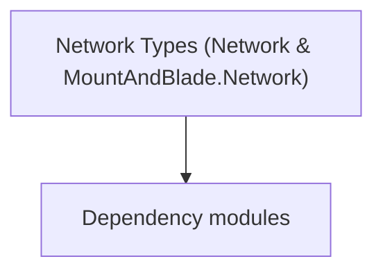

# Network Types (Network & MountAndBlade.Network)

**One-line responsibility:** This page covers all 75 business types under `Network Types (Network & MountAndBlade.Network)` as a family index, giving each type its namespace, responsibility, and typical timing so you can browse by module instead of alphabetically.

## Mental Model

Network types cover the multiplayer/networking layer: messages, network gameplay perks (effects/conditions), and the client/server plumbing. They are primarily relevant to custom and multiplayer sessions and are largely decoupled from single-player gameplay.

## When to Use

Use these when building or extending multiplayer/custom-battle networking (perk effects, messages). Single-player paths generally do not need them.

## Dependencies

The types under `Network Types (Network & MountAndBlade.Network)` depend on the following modules; missing any of them causes compile- or run-time failure.

- [Mission](../../mission/Mission)
- [API Overview](../../_index)

## Type Catalog

| Type | Namespace | Purpose | Timing |
| --- | --- | --- | --- |
| `DebugNetworkEventStatistics` | TaleWorlds.MountAndBlade.Network | Event or event handler carrying the data of something that happened once. Remember to unsubscribe on unload to avoid leaks. | During custom/multiplayer session |
| `PerSecondEventData` | TaleWorlds.MountAndBlade.Network | Event or event handler carrying the data of something that happened once. Remember to unsubscribe on unload to avoid leaks. | During custom/multiplayer session |
| `TotalEventData` | TaleWorlds.MountAndBlade.Network | Event or event handler carrying the data of something that happened once. Remember to unsubscribe on unload to avoid leaks. | During custom/multiplayer session |
| `PerkAssemblyCollection` | TaleWorlds.MountAndBlade.Network.Gameplay.Perks | A business type under this namespace that carries its derived convention responsibility. Confirm its lifecycle and owning system before calling; do not reference an unready instance at the wrong phase. World-state changes should go through the corresponding Action/Behavior, not direct field mutation. | During custom/multiplayer session |
| `AlternativeAttackDamageEffect` | TaleWorlds.MountAndBlade.Network.Gameplay.Perks.Effects | A business type under this namespace that carries its derived convention responsibility. Confirm its lifecycle and owning system before calling; do not reference an unready instance at the wrong phase. World-state changes should go through the corresponding Action/Behavior, not direct field mutation. | During custom/multiplayer session |
| `AlternativeEquipmentEffect` | TaleWorlds.MountAndBlade.Network.Gameplay.Perks.Effects | A business type under this namespace that carries its derived convention responsibility. Confirm its lifecycle and owning system before calling; do not reference an unready instance at the wrong phase. World-state changes should go through the corresponding Action/Behavior, not direct field mutation. | During custom/multiplayer session |
| `ArmorEffect` | TaleWorlds.MountAndBlade.Network.Gameplay.Perks.Effects | A business type under this namespace that carries its derived convention responsibility. Confirm its lifecycle and owning system before calling; do not reference an unready instance at the wrong phase. World-state changes should go through the corresponding Action/Behavior, not direct field mutation. | During custom/multiplayer session |
| `DamageEffect` | TaleWorlds.MountAndBlade.Network.Gameplay.Perks.Effects | A business type under this namespace that carries its derived convention responsibility. Confirm its lifecycle and owning system before calling; do not reference an unready instance at the wrong phase. World-state changes should go through the corresponding Action/Behavior, not direct field mutation. | During custom/multiplayer session |
| `DamageInterruptionThresholdEffect` | TaleWorlds.MountAndBlade.Network.Gameplay.Perks.Effects | A business type under this namespace that carries its derived convention responsibility. Confirm its lifecycle and owning system before calling; do not reference an unready instance at the wrong phase. World-state changes should go through the corresponding Action/Behavior, not direct field mutation. | During custom/multiplayer session |
| `DamageTakenEffect` | TaleWorlds.MountAndBlade.Network.Gameplay.Perks.Effects | A business type under this namespace that carries its derived convention responsibility. Confirm its lifecycle and owning system before calling; do not reference an unready instance at the wrong phase. World-state changes should go through the corresponding Action/Behavior, not direct field mutation. | During custom/multiplayer session |
| `DrivenPropertyEffect` | TaleWorlds.MountAndBlade.Network.Gameplay.Perks.Effects | A business type under this namespace that carries its derived convention responsibility. Confirm its lifecycle and owning system before calling; do not reference an unready instance at the wrong phase. World-state changes should go through the corresponding Action/Behavior, not direct field mutation. | During custom/multiplayer session |
| `DrivenPropertyOnSpawnEffect` | TaleWorlds.MountAndBlade.Network.Gameplay.Perks.Effects | Board-game piece description with attributes and movement rules. State must be fully serializable to reconstruct the match. | During custom/multiplayer session |
| `EncumbranceEffect` | TaleWorlds.MountAndBlade.Network.Gameplay.Perks.Effects | A business type under this namespace that carries its derived convention responsibility. Confirm its lifecycle and owning system before calling; do not reference an unready instance at the wrong phase. World-state changes should go through the corresponding Action/Behavior, not direct field mutation. | During custom/multiplayer session |
| `GoldGainOnAssistEffect` | TaleWorlds.MountAndBlade.Network.Gameplay.Perks.Effects | AI decision implementation that must be interruptible and serializable to support saving and undo. Search must be depth/time bounded to avoid stalls. | During custom/multiplayer session |
| `GoldGainOnKillEffect` | TaleWorlds.MountAndBlade.Network.Gameplay.Perks.Effects | AI decision implementation that must be interruptible and serializable to support saving and undo. Search must be depth/time bounded to avoid stalls. | During custom/multiplayer session |
| `GoldRecoveryEffect` | TaleWorlds.MountAndBlade.Network.Gameplay.Perks.Effects | A business type under this namespace that carries its derived convention responsibility. Confirm its lifecycle and owning system before calling; do not reference an unready instance at the wrong phase. World-state changes should go through the corresponding Action/Behavior, not direct field mutation. | During custom/multiplayer session |
| `HealthRecoveryEffect` | TaleWorlds.MountAndBlade.Network.Gameplay.Perks.Effects | A business type under this namespace that carries its derived convention responsibility. Confirm its lifecycle and owning system before calling; do not reference an unready instance at the wrong phase. World-state changes should go through the corresponding Action/Behavior, not direct field mutation. | During custom/multiplayer session |
| `HitpointsEffect` | TaleWorlds.MountAndBlade.Network.Gameplay.Perks.Effects | A business type under this namespace that carries its derived convention responsibility. Confirm its lifecycle and owning system before calling; do not reference an unready instance at the wrong phase. World-state changes should go through the corresponding Action/Behavior, not direct field mutation. | During custom/multiplayer session |
| `MountDamageEffect` | TaleWorlds.MountAndBlade.Network.Gameplay.Perks.Effects | A business type under this namespace that carries its derived convention responsibility. Confirm its lifecycle and owning system before calling; do not reference an unready instance at the wrong phase. World-state changes should go through the corresponding Action/Behavior, not direct field mutation. | During custom/multiplayer session |
| `MountDamageTakenEffect` | TaleWorlds.MountAndBlade.Network.Gameplay.Perks.Effects | A business type under this namespace that carries its derived convention responsibility. Confirm its lifecycle and owning system before calling; do not reference an unready instance at the wrong phase. World-state changes should go through the corresponding Action/Behavior, not direct field mutation. | During custom/multiplayer session |
| `MountHealthRecoveryEffect` | TaleWorlds.MountAndBlade.Network.Gameplay.Perks.Effects | A business type under this namespace that carries its derived convention responsibility. Confirm its lifecycle and owning system before calling; do not reference an unready instance at the wrong phase. World-state changes should go through the corresponding Action/Behavior, not direct field mutation. | During custom/multiplayer session |
| `MountManeuverEffect` | TaleWorlds.MountAndBlade.Network.Gameplay.Perks.Effects | A business type under this namespace that carries its derived convention responsibility. Confirm its lifecycle and owning system before calling; do not reference an unready instance at the wrong phase. World-state changes should go through the corresponding Action/Behavior, not direct field mutation. | During custom/multiplayer session |
| `MountSpeedEffect` | TaleWorlds.MountAndBlade.Network.Gameplay.Perks.Effects | A business type under this namespace that carries its derived convention responsibility. Confirm its lifecycle and owning system before calling; do not reference an unready instance at the wrong phase. World-state changes should go through the corresponding Action/Behavior, not direct field mutation. | During custom/multiplayer session |
| `RandomEquipmentEffect` | TaleWorlds.MountAndBlade.Network.Gameplay.Perks.Effects | A business type under this namespace that carries its derived convention responsibility. Confirm its lifecycle and owning system before calling; do not reference an unready instance at the wrong phase. World-state changes should go through the corresponding Action/Behavior, not direct field mutation. | During custom/multiplayer session |
| `RangedAccuracyEffect` | TaleWorlds.MountAndBlade.Network.Gameplay.Perks.Effects | A business type under this namespace that carries its derived convention responsibility. Confirm its lifecycle and owning system before calling; do not reference an unready instance at the wrong phase. World-state changes should go through the corresponding Action/Behavior, not direct field mutation. | During custom/multiplayer session |
| `RangedHeadShotDamageEffect` | TaleWorlds.MountAndBlade.Network.Gameplay.Perks.Effects | A business type under this namespace that carries its derived convention responsibility. Confirm its lifecycle and owning system before calling; do not reference an unready instance at the wrong phase. World-state changes should go through the corresponding Action/Behavior, not direct field mutation. | During custom/multiplayer session |
| `RewardGoldOnAssistEffect` | TaleWorlds.MountAndBlade.Network.Gameplay.Perks.Effects | A business type under this namespace that carries its derived convention responsibility. Confirm its lifecycle and owning system before calling; do not reference an unready instance at the wrong phase. World-state changes should go through the corresponding Action/Behavior, not direct field mutation. | During custom/multiplayer session |
| `RewardGoldOnDeathEffect` | TaleWorlds.MountAndBlade.Network.Gameplay.Perks.Effects | A business type under this namespace that carries its derived convention responsibility. Confirm its lifecycle and owning system before calling; do not reference an unready instance at the wrong phase. World-state changes should go through the corresponding Action/Behavior, not direct field mutation. | During custom/multiplayer session |
| `ShieldDamageEffect` | TaleWorlds.MountAndBlade.Network.Gameplay.Perks.Effects | A business type under this namespace that carries its derived convention responsibility. Confirm its lifecycle and owning system before calling; do not reference an unready instance at the wrong phase. World-state changes should go through the corresponding Action/Behavior, not direct field mutation. | During custom/multiplayer session |
| `ShieldDamageTakenEffect` | TaleWorlds.MountAndBlade.Network.Gameplay.Perks.Effects | A business type under this namespace that carries its derived convention responsibility. Confirm its lifecycle and owning system before calling; do not reference an unready instance at the wrong phase. World-state changes should go through the corresponding Action/Behavior, not direct field mutation. | During custom/multiplayer session |
| `SpeedBonusEffect` | TaleWorlds.MountAndBlade.Network.Gameplay.Perks.Effects | A business type under this namespace that carries its derived convention responsibility. Confirm its lifecycle and owning system before calling; do not reference an unready instance at the wrong phase. World-state changes should go through the corresponding Action/Behavior, not direct field mutation. | During custom/multiplayer session |
| `ThrowingWeaponDamageEffect` | TaleWorlds.MountAndBlade.Network.Gameplay.Perks.Effects | A business type under this namespace that carries its derived convention responsibility. Confirm its lifecycle and owning system before calling; do not reference an unready instance at the wrong phase. World-state changes should go through the corresponding Action/Behavior, not direct field mutation. | During custom/multiplayer session |
| `ThrowingWeaponSpeedEffect` | TaleWorlds.MountAndBlade.Network.Gameplay.Perks.Effects | A business type under this namespace that carries its derived convention responsibility. Confirm its lifecycle and owning system before calling; do not reference an unready instance at the wrong phase. World-state changes should go through the corresponding Action/Behavior, not direct field mutation. | During custom/multiplayer session |
| `TroopCountEffect` | TaleWorlds.MountAndBlade.Network.Gameplay.Perks.Effects | A business type under this namespace that carries its derived convention responsibility. Confirm its lifecycle and owning system before calling; do not reference an unready instance at the wrong phase. World-state changes should go through the corresponding Action/Behavior, not direct field mutation. | During custom/multiplayer session |
| `CreatePlayer` | TaleWorlds.MountAndBlade.Network.Messages | A business type under this namespace that carries its derived convention responsibility. Confirm its lifecycle and owning system before calling; do not reference an unready instance at the wrong phase. World-state changes should go through the corresponding Action/Behavior, not direct field mutation. | During custom/multiplayer session |
| `DeletePlayer` | TaleWorlds.MountAndBlade.Network.Messages | A business type under this namespace that carries its derived convention responsibility. Confirm its lifecycle and owning system before calling; do not reference an unready instance at the wrong phase. World-state changes should go through the corresponding Action/Behavior, not direct field mutation. | During custom/multiplayer session |
| `GameNetworkMessage` | TaleWorlds.MountAndBlade.Network.Messages | A business type under this namespace that carries its derived convention responsibility. Confirm its lifecycle and owning system before calling; do not reference an unready instance at the wrong phase. World-state changes should go through the corresponding Action/Behavior, not direct field mutation. | During custom/multiplayer session |
| `Authorize` | TaleWorlds.Network | A business type under this namespace that carries its derived convention responsibility. Confirm its lifecycle and owning system before calling; do not reference an unready instance at the wrong phase. World-state changes should go through the corresponding Action/Behavior, not direct field mutation. | During custom/multiplayer session |
| `ClientsideSession` | TaleWorlds.Network | A business type under this namespace that carries its derived convention responsibility. Confirm its lifecycle and owning system before calling; do not reference an unready instance at the wrong phase. World-state changes should go through the corresponding Action/Behavior, not direct field mutation. | During custom/multiplayer session |
| `ClientWebSocketHandler` | TaleWorlds.Network | A business type under this namespace that carries its derived convention responsibility. Confirm its lifecycle and owning system before calling; do not reference an unready instance at the wrong phase. World-state changes should go through the corresponding Action/Behavior, not direct field mutation. | During custom/multiplayer session |
| `ConnectionState` | TaleWorlds.Network | A business type under this namespace that carries its derived convention responsibility. Confirm its lifecycle and owning system before calling; do not reference an unready instance at the wrong phase. World-state changes should go through the corresponding Action/Behavior, not direct field mutation. | During custom/multiplayer session |
| `Coroutine` | TaleWorlds.Network | A business type under this namespace that carries its derived convention responsibility. Confirm its lifecycle and owning system before calling; do not reference an unready instance at the wrong phase. World-state changes should go through the corresponding Action/Behavior, not direct field mutation. | During custom/multiplayer session |
| `CoroutineManager` | TaleWorlds.Network | A business type under this namespace that carries its derived convention responsibility. Confirm its lifecycle and owning system before calling; do not reference an unready instance at the wrong phase. World-state changes should go through the corresponding Action/Behavior, not direct field mutation. | During custom/multiplayer session |
| `CoroutineState` | TaleWorlds.Network | A business type under this namespace that carries its derived convention responsibility. Confirm its lifecycle and owning system before calling; do not reference an unready instance at the wrong phase. World-state changes should go through the corresponding Action/Behavior, not direct field mutation. | During custom/multiplayer session |
| `IMessageProxyClient` | TaleWorlds.Network | A business type under this namespace that carries its derived convention responsibility. Confirm its lifecycle and owning system before calling; do not reference an unready instance at the wrong phase. World-state changes should go through the corresponding Action/Behavior, not direct field mutation. | During custom/multiplayer session |
| `IncomingServerSessionMessage` | TaleWorlds.Network | A business type under this namespace that carries its derived convention responsibility. Confirm its lifecycle and owning system before calling; do not reference an unready instance at the wrong phase. World-state changes should go through the corresponding Action/Behavior, not direct field mutation. | During custom/multiplayer session |
| `INetworkMessageReader` | TaleWorlds.Network | A business type under this namespace that carries its derived convention responsibility. Confirm its lifecycle and owning system before calling; do not reference an unready instance at the wrong phase. World-state changes should go through the corresponding Action/Behavior, not direct field mutation. | During custom/multiplayer session |
| `INetworkMessageWriter` | TaleWorlds.Network | A business type under this namespace that carries its derived convention responsibility. Confirm its lifecycle and owning system before calling; do not reference an unready instance at the wrong phase. World-state changes should go through the corresponding Action/Behavior, not direct field mutation. | During custom/multiplayer session |
| `INetworkSerializable` | TaleWorlds.Network | A business type under this namespace that carries its derived convention responsibility. Confirm its lifecycle and owning system before calling; do not reference an unready instance at the wrong phase. World-state changes should go through the corresponding Action/Behavior, not direct field mutation. | During custom/multiplayer session |
| `JsonSocketMessage` | TaleWorlds.Network | A business type under this namespace that carries its derived convention responsibility. Confirm its lifecycle and owning system before calling; do not reference an unready instance at the wrong phase. World-state changes should go through the corresponding Action/Behavior, not direct field mutation. | During custom/multiplayer session |
| `MessageBuffer` | TaleWorlds.Network | A business type under this namespace that carries its derived convention responsibility. Confirm its lifecycle and owning system before calling; do not reference an unready instance at the wrong phase. World-state changes should go through the corresponding Action/Behavior, not direct field mutation. | During custom/multiplayer session |
| `MessageContract` | TaleWorlds.Network | A business type under this namespace that carries its derived convention responsibility. Confirm its lifecycle and owning system before calling; do not reference an unready instance at the wrong phase. World-state changes should go through the corresponding Action/Behavior, not direct field mutation. | During custom/multiplayer session |
| `MessageContractCreator` | TaleWorlds.Network | A business type under this namespace that carries its derived convention responsibility. Confirm its lifecycle and owning system before calling; do not reference an unready instance at the wrong phase. World-state changes should go through the corresponding Action/Behavior, not direct field mutation. | During custom/multiplayer session |
| `MessageContractHandler` | TaleWorlds.Network | A business type under this namespace that carries its derived convention responsibility. Confirm its lifecycle and owning system before calling; do not reference an unready instance at the wrong phase. World-state changes should go through the corresponding Action/Behavior, not direct field mutation. | During custom/multiplayer session |
| `MessageContractHandlerManager` | TaleWorlds.Network | A business type under this namespace that carries its derived convention responsibility. Confirm its lifecycle and owning system before calling; do not reference an unready instance at the wrong phase. World-state changes should go through the corresponding Action/Behavior, not direct field mutation. | During custom/multiplayer session |
| `MessageId` | TaleWorlds.Network | A business type under this namespace that carries its derived convention responsibility. Confirm its lifecycle and owning system before calling; do not reference an unready instance at the wrong phase. World-state changes should go through the corresponding Action/Behavior, not direct field mutation. | During custom/multiplayer session |
| `MessageInfo` | TaleWorlds.Network | A business type under this namespace that carries its derived convention responsibility. Confirm its lifecycle and owning system before calling; do not reference an unready instance at the wrong phase. World-state changes should go through the corresponding Action/Behavior, not direct field mutation. | During custom/multiplayer session |
| `MessageProxy` | TaleWorlds.Network | A business type under this namespace that carries its derived convention responsibility. Confirm its lifecycle and owning system before calling; do not reference an unready instance at the wrong phase. World-state changes should go through the corresponding Action/Behavior, not direct field mutation. | During custom/multiplayer session |
| `MessageServiceConnection` | TaleWorlds.Network | A business type under this namespace that carries its derived convention responsibility. Confirm its lifecycle and owning system before calling; do not reference an unready instance at the wrong phase. World-state changes should go through the corresponding Action/Behavior, not direct field mutation. | During custom/multiplayer session |
| `MessageTypes` | TaleWorlds.Network | A business type under this namespace that carries its derived convention responsibility. Confirm its lifecycle and owning system before calling; do not reference an unready instance at the wrong phase. World-state changes should go through the corresponding Action/Behavior, not direct field mutation. | During custom/multiplayer session |
| `NetworkMessage` | TaleWorlds.Network | A business type under this namespace that carries its derived convention responsibility. Confirm its lifecycle and owning system before calling; do not reference an unready instance at the wrong phase. World-state changes should go through the corresponding Action/Behavior, not direct field mutation. | During custom/multiplayer session |
| `NetworkSession` | TaleWorlds.Network | A business type under this namespace that carries its derived convention responsibility. Confirm its lifecycle and owning system before calling; do not reference an unready instance at the wrong phase. World-state changes should go through the corresponding Action/Behavior, not direct field mutation. | During custom/multiplayer session |
| `PostBoxId` | TaleWorlds.Network | A business type under this namespace that carries its derived convention responsibility. Confirm its lifecycle and owning system before calling; do not reference an unready instance at the wrong phase. World-state changes should go through the corresponding Action/Behavior, not direct field mutation. | During custom/multiplayer session |
| `RESTClient` | TaleWorlds.Network | A business type under this namespace that carries its derived convention responsibility. Confirm its lifecycle and owning system before calling; do not reference an unready instance at the wrong phase. World-state changes should go through the corresponding Action/Behavior, not direct field mutation. | During custom/multiplayer session |
| `ServersideSession` | TaleWorlds.Network | A business type under this namespace that carries its derived convention responsibility. Confirm its lifecycle and owning system before calling; do not reference an unready instance at the wrong phase. World-state changes should go through the corresponding Action/Behavior, not direct field mutation. | During custom/multiplayer session |
| `ServersideSessionManager` | TaleWorlds.Network | A business type under this namespace that carries its derived convention responsibility. Confirm its lifecycle and owning system before calling; do not reference an unready instance at the wrong phase. World-state changes should go through the corresponding Action/Behavior, not direct field mutation. | During custom/multiplayer session |
| `ServiceException` | TaleWorlds.Network | A business type under this namespace that carries its derived convention responsibility. Confirm its lifecycle and owning system before calling; do not reference an unready instance at the wrong phase. World-state changes should go through the corresponding Action/Behavior, not direct field mutation. | During custom/multiplayer session |
| `ServiceExceptionModel` | TaleWorlds.Network | Domain model that aggregates rules and calculations for Behaviors to call. When you replace a model you must provide an equivalent contract; an empty replacement hands null to its dependents. | During custom/multiplayer session |
| `TcpSocket` | TaleWorlds.Network | A business type under this namespace that carries its derived convention responsibility. Confirm its lifecycle and owning system before calling; do not reference an unready instance at the wrong phase. World-state changes should go through the corresponding Action/Behavior, not direct field mutation. | During custom/multiplayer session |
| `TcpStatus` | TaleWorlds.Network | A business type under this namespace that carries its derived convention responsibility. Confirm its lifecycle and owning system before calling; do not reference an unready instance at the wrong phase. World-state changes should go through the corresponding Action/Behavior, not direct field mutation. | During custom/multiplayer session |
| `ThreadType` | TaleWorlds.Network | A business type under this namespace that carries its derived convention responsibility. Confirm its lifecycle and owning system before calling; do not reference an unready instance at the wrong phase. World-state changes should go through the corresponding Action/Behavior, not direct field mutation. | During custom/multiplayer session |
| `TickManager` | TaleWorlds.Network | A business type under this namespace that carries its derived convention responsibility. Confirm its lifecycle and owning system before calling; do not reference an unready instance at the wrong phase. World-state changes should go through the corresponding Action/Behavior, not direct field mutation. | During custom/multiplayer session |
| `WaitForSpecialCase` | TaleWorlds.Network | AI decision implementation that must be interruptible and serializable to support saving and undo. Search must be depth/time bounded to avoid stalls. | During custom/multiplayer session |
| `WaitForTicks` | TaleWorlds.Network | AI decision implementation that must be interruptible and serializable to support saving and undo. Search must be depth/time bounded to avoid stalls. | During custom/multiplayer session |
| `WebSocketMessage` | TaleWorlds.Network | A business type under this namespace that carries its derived convention responsibility. Confirm its lifecycle and owning system before calling; do not reference an unready instance at the wrong phase. World-state changes should go through the corresponding Action/Behavior, not direct field mutation. | During custom/multiplayer session |

## Risk & Boundaries

Network types depend on the networked session context; many never fire offline. Perk effects/conditions are evaluated on the hot path — keep them lightweight and pure. Watch single/multiplayer rule branches.

## See Also

- [Mission](../../mission/Mission)
- [API Overview](../../_index)
