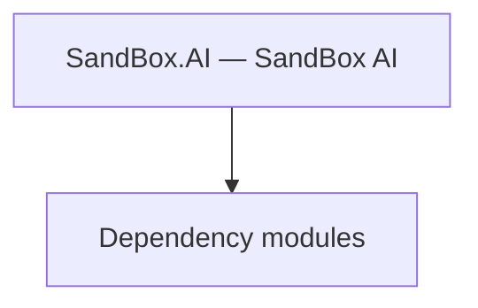

# SandBox.AI — SandBox AI

**One-line responsibility:** This page covers all 3 business types under `SandBox.AI — SandBox AI` as a family index, giving each type its namespace, responsibility, and typical timing so you can browse by module instead of alphabetically.

## Mental Model

SandBox.AI is the SandBox module’s AI-related types (e.g. AgentBehaviorManager coordinating battle-agent behavior assembly). It decouples AI behavior registration/management from concrete decision implementations — the "behavior assembly hub" used by Mission on load to attach agent logic.

## When to Use

To centrally manage battle AI behaviors or add an agent decision, use the coordinating types here; behavior implementations must be serializable and interruptible.

## Dependencies

The types under `SandBox.AI — SandBox AI` depend on the following modules; missing any of them causes compile- or run-time failure.

- [Mission](../../mission/Mission)
- [API Overview](../../_index)

## Type Catalog

| Type | Namespace | Purpose | Timing |
| --- | --- | --- | --- |
| `AgentBehaviorManager` | SandBox.AI | Battle agent AI behavior that makes decisions and executes actions inside a Mission. Its lifetime follows the Agent’s life and death; you must clean up after the Agent dies. | Campaign init |
| `PassageAI` | SandBox.AI | Scene usable object that triggers an action or menu when the player interacts with it. Interaction must be idempotent and its state must be serializable to support saving. | Campaign init |
| `UsablePlaceAI` | SandBox.AI | Scene usable object that triggers an action or menu when the player interacts with it. Interaction must be idempotent and its state must be serializable to support saving. | Campaign init |

## Risk & Boundaries

AI assembly depends on Mission load order; referencing it before ready yields null. Bound search depth/timeout to avoid stalls. After an Agent dies its behavior must be cleaned up or dangling references crash.

## See Also

- [Mission](../../mission/Mission)
- [API Overview](../../_index)
