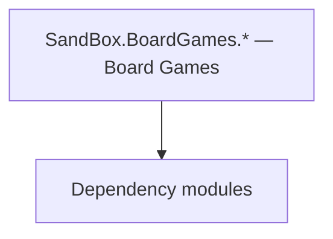

# SandBox.BoardGames.* — Board Games

**One-line responsibility:** This page covers all 43 business types under `SandBox.BoardGames.* — Board Games` as a family index, giving each type its namespace, responsibility, and typical timing so you can browse by module instead of alphabetically.

## Mental Model

SandBox.BoardGames.* implements the playable board-game minigames (e.g. tavern games): the board, pawns, tiles, AI opponents, mission logics, and objects. It is a self-contained turn-based subsystem with its own serialization so a match can be saved and resumed.

## When to Use

To add a board-game variant or AI, derive from the relevant type and register it with the board-game manager; turns must be deterministic and serializable.

## Dependencies

The types under `SandBox.BoardGames.* — Board Games` depend on the following modules; missing any of them causes compile- or run-time failure.

- [Campaign](../../campaign/Campaign)
- [Mission](../../mission/Mission)
- [API Overview](../../_index)

## Type Catalog

| Type | Namespace | Purpose | Timing |
| --- | --- | --- | --- |
| `BarrierInfo` | SandBox.BoardGames | A business type under this namespace that carries its derived convention responsibility. Confirm its lifecycle and owning system before calling; do not reference an unready instance at the wrong phase. World-state changes should go through the corresponding Action/Behavior, not direct field mutation. | Campaign init |
| `BoardGameBaghChal` | SandBox.BoardGames | A business type under this namespace that carries its derived convention responsibility. Confirm its lifecycle and owning system before calling; do not reference an unready instance at the wrong phase. World-state changes should go through the corresponding Action/Behavior, not direct field mutation. | Campaign init |
| `BoardGameBase` | SandBox.BoardGames | A business type under this namespace that carries its derived convention responsibility. Confirm its lifecycle and owning system before calling; do not reference an unready instance at the wrong phase. World-state changes should go through the corresponding Action/Behavior, not direct field mutation. | Campaign init |
| `BoardGameKonane` | SandBox.BoardGames | A business type under this namespace that carries its derived convention responsibility. Confirm its lifecycle and owning system before calling; do not reference an unready instance at the wrong phase. World-state changes should go through the corresponding Action/Behavior, not direct field mutation. | Campaign init |
| `BoardGameMuTorere` | SandBox.BoardGames | A business type under this namespace that carries its derived convention responsibility. Confirm its lifecycle and owning system before calling; do not reference an unready instance at the wrong phase. World-state changes should go through the corresponding Action/Behavior, not direct field mutation. | Campaign init |
| `BoardGamePuluc` | SandBox.BoardGames | A business type under this namespace that carries its derived convention responsibility. Confirm its lifecycle and owning system before calling; do not reference an unready instance at the wrong phase. World-state changes should go through the corresponding Action/Behavior, not direct field mutation. | Campaign init |
| `BoardGameSeega` | SandBox.BoardGames | A business type under this namespace that carries its derived convention responsibility. Confirm its lifecycle and owning system before calling; do not reference an unready instance at the wrong phase. World-state changes should go through the corresponding Action/Behavior, not direct field mutation. | Campaign init |
| `BoardGameSide` | SandBox.BoardGames | A business type under this namespace that carries its derived convention responsibility. Confirm its lifecycle and owning system before calling; do not reference an unready instance at the wrong phase. World-state changes should go through the corresponding Action/Behavior, not direct field mutation. | Campaign init |
| `BoardGameTablut` | SandBox.BoardGames | A business type under this namespace that carries its derived convention responsibility. Confirm its lifecycle and owning system before calling; do not reference an unready instance at the wrong phase. World-state changes should go through the corresponding Action/Behavior, not direct field mutation. | Campaign init |
| `BoardInformation` | SandBox.BoardGames | A business type under this namespace that carries its derived convention responsibility. Confirm its lifecycle and owning system before calling; do not reference an unready instance at the wrong phase. World-state changes should go through the corresponding Action/Behavior, not direct field mutation. | Campaign init |
| `CapturedPawnsPool` | SandBox.BoardGames | Board-game piece description with attributes and movement rules. State must be fully serializable to reconstruct the match. | Campaign init |
| `GameOverEnum` | SandBox.BoardGames | A business type under this namespace that carries its derived convention responsibility. Confirm its lifecycle and owning system before calling; do not reference an unready instance at the wrong phase. World-state changes should go through the corresponding Action/Behavior, not direct field mutation. | Campaign init |
| `Move` | SandBox.BoardGames | A business type under this namespace that carries its derived convention responsibility. Confirm its lifecycle and owning system before calling; do not reference an unready instance at the wrong phase. World-state changes should go through the corresponding Action/Behavior, not direct field mutation. | Campaign init |
| `PawnInformation` | SandBox.BoardGames | Board-game piece description with attributes and movement rules. State must be fully serializable to reconstruct the match. | Campaign init |
| `PlayerTurn` | SandBox.BoardGames | A business type under this namespace that carries its derived convention responsibility. Confirm its lifecycle and owning system before calling; do not reference an unready instance at the wrong phase. World-state changes should go through the corresponding Action/Behavior, not direct field mutation. | Campaign init |
| `State` | SandBox.BoardGames | A business type under this namespace that carries its derived convention responsibility. Confirm its lifecycle and owning system before calling; do not reference an unready instance at the wrong phase. World-state changes should go through the corresponding Action/Behavior, not direct field mutation. | Campaign init |
| `TileBaseInformation` | SandBox.BoardGames | A business type under this namespace that carries its derived convention responsibility. Confirm its lifecycle and owning system before calling; do not reference an unready instance at the wrong phase. World-state changes should go through the corresponding Action/Behavior, not direct field mutation. | Campaign init |
| `AIState` | SandBox.BoardGames.AI | AI decision implementation that must be interruptible and serializable to support saving and undo. Search must be depth/time bounded to avoid stalls. | Campaign init |
| `BoardGameAIBaghChal` | SandBox.BoardGames.AI | AI decision implementation that must be interruptible and serializable to support saving and undo. Search must be depth/time bounded to avoid stalls. | Campaign init |
| `BoardGameAIBase` | SandBox.BoardGames.AI | AI decision implementation that must be interruptible and serializable to support saving and undo. Search must be depth/time bounded to avoid stalls. | Campaign init |
| `BoardGameAIKonane` | SandBox.BoardGames.AI | AI decision implementation that must be interruptible and serializable to support saving and undo. Search must be depth/time bounded to avoid stalls. | Campaign init |
| `BoardGameAIMuTorere` | SandBox.BoardGames.AI | AI decision implementation that must be interruptible and serializable to support saving and undo. Search must be depth/time bounded to avoid stalls. | Campaign init |
| `BoardGameAIPuluc` | SandBox.BoardGames.AI | AI decision implementation that must be interruptible and serializable to support saving and undo. Search must be depth/time bounded to avoid stalls. | Campaign init |
| `BoardGameAISeega` | SandBox.BoardGames.AI | AI decision implementation that must be interruptible and serializable to support saving and undo. Search must be depth/time bounded to avoid stalls. | Campaign init |
| `BoardGameAITablut` | SandBox.BoardGames.AI | AI decision implementation that must be interruptible and serializable to support saving and undo. Search must be depth/time bounded to avoid stalls. | Campaign init |
| `TreeNodeTablut` | SandBox.BoardGames.AI | A business type under this namespace that carries its derived convention responsibility. Confirm its lifecycle and owning system before calling; do not reference an unready instance at the wrong phase. World-state changes should go through the corresponding Action/Behavior, not direct field mutation. | Campaign init |
| `MissionBoardGameDebugHandler` | SandBox.BoardGames.MissionLogics | Mission logic that defines the flow and win/lose conditions of that mission, assembled by the Mission on load. Win/lose resolution must be idempotent — repeated triggers must not double-settle. | On battle/mission load |
| `MissionBoardGameLogic` | SandBox.BoardGames.MissionLogics | Mission logic that defines the flow and win/lose conditions of that mission, assembled by the Mission on load. Win/lose resolution must be idempotent — repeated triggers must not double-settle. | On battle/mission load |
| `BoardGameDecal` | SandBox.BoardGames.Objects | Script component attached to a scene GameObject, exposing scene state to the logic layer. Depends on scene load order; fields are null before the scene is ready. | Campaign init |
| `Tile` | SandBox.BoardGames.Objects | Script component attached to a scene GameObject, exposing scene state to the logic layer. Depends on scene load order; fields are null before the scene is ready. | Campaign init |
| `MovementState` | SandBox.BoardGames.Pawns | A business type under this namespace that carries its derived convention responsibility. Confirm its lifecycle and owning system before calling; do not reference an unready instance at the wrong phase. World-state changes should go through the corresponding Action/Behavior, not direct field mutation. | Campaign init |
| `PawnBaghChal` | SandBox.BoardGames.Pawns | Board-game piece description with attributes and movement rules. State must be fully serializable to reconstruct the match. | Campaign init |
| `PawnBase` | SandBox.BoardGames.Pawns | Board-game piece description with attributes and movement rules. State must be fully serializable to reconstruct the match. | Campaign init |
| `PawnKonane` | SandBox.BoardGames.Pawns | Board-game piece description with attributes and movement rules. State must be fully serializable to reconstruct the match. | Campaign init |
| `PawnMuTorere` | SandBox.BoardGames.Pawns | Board-game piece description with attributes and movement rules. State must be fully serializable to reconstruct the match. | Campaign init |
| `PawnPuluc` | SandBox.BoardGames.Pawns | Board-game piece description with attributes and movement rules. State must be fully serializable to reconstruct the match. | Campaign init |
| `PawnSeega` | SandBox.BoardGames.Pawns | Board-game piece description with attributes and movement rules. State must be fully serializable to reconstruct the match. | Campaign init |
| `PawnTablut` | SandBox.BoardGames.Pawns | Board-game piece description with attributes and movement rules. State must be fully serializable to reconstruct the match. | Campaign init |
| `Tile1D` | SandBox.BoardGames.Tiles | A business type under this namespace that carries its derived convention responsibility. Confirm its lifecycle and owning system before calling; do not reference an unready instance at the wrong phase. World-state changes should go through the corresponding Action/Behavior, not direct field mutation. | Campaign init |
| `Tile2D` | SandBox.BoardGames.Tiles | A business type under this namespace that carries its derived convention responsibility. Confirm its lifecycle and owning system before calling; do not reference an unready instance at the wrong phase. World-state changes should go through the corresponding Action/Behavior, not direct field mutation. | Campaign init |
| `TileBase` | SandBox.BoardGames.Tiles | A business type under this namespace that carries its derived convention responsibility. Confirm its lifecycle and owning system before calling; do not reference an unready instance at the wrong phase. World-state changes should go through the corresponding Action/Behavior, not direct field mutation. | Campaign init |
| `TileMuTorere` | SandBox.BoardGames.Tiles | A business type under this namespace that carries its derived convention responsibility. Confirm its lifecycle and owning system before calling; do not reference an unready instance at the wrong phase. World-state changes should go through the corresponding Action/Behavior, not direct field mutation. | Campaign init |
| `TilePuluc` | SandBox.BoardGames.Tiles | A business type under this namespace that carries its derived convention responsibility. Confirm its lifecycle and owning system before calling; do not reference an unready instance at the wrong phase. World-state changes should go through the corresponding Action/Behavior, not direct field mutation. | Campaign init |

## Risk & Boundaries

Board-game state must be fully serializable to reconstruct the match. AI must be interruptible and bounded. Pawns/tiles hold the full match state — keep it consistent.

## See Also

- [Campaign](../../campaign/Campaign)
- [Mission](../../mission/Mission)
- [API Overview](../../_index)
