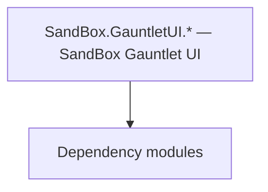

# SandBox.GauntletUI.* — SandBox Gauntlet UI

**One-line responsibility:** This page covers all 78 business types under `SandBox.GauntletUI.* — SandBox Gauntlet UI` as a family index, giving each type its namespace, responsibility, and typical timing so you can browse by module instead of alphabetically.

## Mental Model

SandBox.GauntletUI.* is the SandBox module’s Gauntlet UI layer: town/tavern/character-creation/encyclopedia/banner-editor/tutorial interfaces and their widgets/VMs. It projects SandBox logic state into clickable, bindable interface elements and is the main entry point for player interaction with the strategic/social layer; the UI layer only exposes state, interaction is surfaced to logic via events.

## When to Use

To customize a SandBox interface (town/tavern/character-creation/encyclopedia/tutorial), inherit the relevant Widget/VM and open it from a MissionBehavior/logic layer. Commands only trigger Actions/Behaviors.

## Dependencies

The types under `SandBox.GauntletUI.* — SandBox Gauntlet UI` depend on the following modules; missing any of them causes compile- or run-time failure.

- [ViewModel](../../core-extra/ViewModel)
- [Campaign](../../campaign/Campaign)
- [API Overview](../../_index)

## Type Catalog

| Type | Namespace | Purpose | Timing |
| --- | --- | --- | --- |
| `GauntletBarberScreen` | SandBox.GauntletUI | Interface screen / layer base class that hosts Gauntlet UI display and input. Commands only trigger Actions or Behaviors and never mutate state directly. | Campaign init |
| `GauntletCharacterDeveloperScreen` | SandBox.GauntletUI | Interface screen / layer base class that hosts Gauntlet UI display and input. Commands only trigger Actions or Behaviors and never mutate state directly. | Campaign init |
| `GauntletClanScreen` | SandBox.GauntletUI | Interface screen / layer base class that hosts Gauntlet UI display and input. Commands only trigger Actions or Behaviors and never mutate state directly. | Campaign init |
| `GauntletCraftingScreen` | SandBox.GauntletUI | Interface screen / layer base class that hosts Gauntlet UI display and input. Commands only trigger Actions or Behaviors and never mutate state directly. | Campaign init |
| `GauntletEducationScreen` | SandBox.GauntletUI | Interface screen / layer base class that hosts Gauntlet UI display and input. Commands only trigger Actions or Behaviors and never mutate state directly. | Campaign init |
| `GauntletGameOverScreen` | SandBox.GauntletUI | Interface screen / layer base class that hosts Gauntlet UI display and input. Commands only trigger Actions or Behaviors and never mutate state directly. | Campaign init |
| `GauntletInventoryScreen` | SandBox.GauntletUI | Interface screen / layer base class that hosts Gauntlet UI display and input. Commands only trigger Actions or Behaviors and never mutate state directly. | Campaign init |
| `GauntletKingdomScreen` | SandBox.GauntletUI | Interface screen / layer base class that hosts Gauntlet UI display and input. Commands only trigger Actions or Behaviors and never mutate state directly. | Campaign init |
| `GauntletPartyScreen` | SandBox.GauntletUI | Interface screen / layer base class that hosts Gauntlet UI display and input. Commands only trigger Actions or Behaviors and never mutate state directly. | Campaign init |
| `GauntletQuestsScreen` | SandBox.GauntletUI | Interface screen / layer base class that hosts Gauntlet UI display and input. Commands only trigger Actions or Behaviors and never mutate state directly. | Campaign init |
| `GauntletSaveLoadScreen` | SandBox.GauntletUI | Interface screen / layer base class that hosts Gauntlet UI display and input. Commands only trigger Actions or Behaviors and never mutate state directly. | Campaign init |
| `MapConversationTextureProvider` | SandBox.GauntletUI | Gauntlet image-source abstraction that resolves an entity/concept into an actual texture and caches it. The first frame may be empty; handle the loading state. | Campaign init |
| `SandBoxGauntletGameNotification` | SandBox.GauntletUI | Notification item type describing the data of one map/event prompt. It only carries display data; triggering logic lives in the Behavior. | Campaign init |
| `SandBoxGauntletUISubModule` | SandBox.GauntletUI | Module entry base class that registers behaviors and override points. Its lifetime spans the whole session; do not fetch systems that are not yet ready (e.g. before loading) at the wrong phase. | Campaign init |
| `SandboxSceneNotificationContextProvider` | SandBox.GauntletUI | Gauntlet image-source abstraction that resolves an entity/concept into an actual texture and caches it. The first frame may be empty; handle the loading state. | Campaign init |
| `BannerEditorView` | SandBox.GauntletUI.BannerEditor | A business type under this namespace that carries its derived convention responsibility. Confirm its lifecycle and owning system before calling; do not reference an unready instance at the wrong phase. World-state changes should go through the corresponding Action/Behavior, not direct field mutation. | Campaign init |
| `GauntletBannerEditorScreen` | SandBox.GauntletUI.BannerEditor | Interface screen / layer base class that hosts Gauntlet UI display and input. Commands only trigger Actions or Behaviors and never mutate state directly. | Campaign init |
| `CharacterCreationBannerEditorView` | SandBox.GauntletUI.CharacterCreation | A business type under this namespace that carries its derived convention responsibility. Confirm its lifecycle and owning system before calling; do not reference an unready instance at the wrong phase. World-state changes should go through the corresponding Action/Behavior, not direct field mutation. | Campaign init |
| `CharacterCreationClanNamingStageView` | SandBox.GauntletUI.CharacterCreation | A business type under this namespace that carries its derived convention responsibility. Confirm its lifecycle and owning system before calling; do not reference an unready instance at the wrong phase. World-state changes should go through the corresponding Action/Behavior, not direct field mutation. | Campaign init |
| `CharacterCreationCultureStageView` | SandBox.GauntletUI.CharacterCreation | A business type under this namespace that carries its derived convention responsibility. Confirm its lifecycle and owning system before calling; do not reference an unready instance at the wrong phase. World-state changes should go through the corresponding Action/Behavior, not direct field mutation. | Campaign init |
| `CharacterCreationFaceGeneratorView` | SandBox.GauntletUI.CharacterCreation | A business type under this namespace that carries its derived convention responsibility. Confirm its lifecycle and owning system before calling; do not reference an unready instance at the wrong phase. World-state changes should go through the corresponding Action/Behavior, not direct field mutation. | Campaign init |
| `CharacterCreationNarrativeStageView` | SandBox.GauntletUI.CharacterCreation | A business type under this namespace that carries its derived convention responsibility. Confirm its lifecycle and owning system before calling; do not reference an unready instance at the wrong phase. World-state changes should go through the corresponding Action/Behavior, not direct field mutation. | Campaign init |
| `CharacterCreationOptionsStageView` | SandBox.GauntletUI.CharacterCreation | A business type under this namespace that carries its derived convention responsibility. Confirm its lifecycle and owning system before calling; do not reference an unready instance at the wrong phase. World-state changes should go through the corresponding Action/Behavior, not direct field mutation. | Campaign init |
| `CharacterCreationReviewStageView` | SandBox.GauntletUI.CharacterCreation | A business type under this namespace that carries its derived convention responsibility. Confirm its lifecycle and owning system before calling; do not reference an unready instance at the wrong phase. World-state changes should go through the corresponding Action/Behavior, not direct field mutation. | Campaign init |
| `EncyclopediaData` | SandBox.GauntletUI.Encyclopedia | A business type under this namespace that carries its derived convention responsibility. Confirm its lifecycle and owning system before calling; do not reference an unready instance at the wrong phase. World-state changes should go through the corresponding Action/Behavior, not direct field mutation. | Campaign init |
| `EncyclopediaListViewDataController` | SandBox.GauntletUI.Encyclopedia | A business type under this namespace that carries its derived convention responsibility. Confirm its lifecycle and owning system before calling; do not reference an unready instance at the wrong phase. World-state changes should go through the corresponding Action/Behavior, not direct field mutation. | Campaign init |
| `GauntletMapEncyclopediaView` | SandBox.GauntletUI.Encyclopedia | A business type under this namespace that carries its derived convention responsibility. Confirm its lifecycle and owning system before calling; do not reference an unready instance at the wrong phase. World-state changes should go through the corresponding Action/Behavior, not direct field mutation. | Campaign init |
| `GauntletHeirSelectionPopupView` | SandBox.GauntletUI.Map | Election / voting mechanism used for collective decisions such as kingdom votes. Mind voting timing and tie handling. | Campaign init |
| `GauntletMapBarGlobalLayer` | SandBox.GauntletUI.Map | A business type under this namespace that carries its derived convention responsibility. Confirm its lifecycle and owning system before calling; do not reference an unready instance at the wrong phase. World-state changes should go through the corresponding Action/Behavior, not direct field mutation. | Campaign init |
| `GauntletMapBarView` | SandBox.GauntletUI.Map | A business type under this namespace that carries its derived convention responsibility. Confirm its lifecycle and owning system before calling; do not reference an unready instance at the wrong phase. World-state changes should go through the corresponding Action/Behavior, not direct field mutation. | Campaign init |
| `GauntletMapBasicView` | SandBox.GauntletUI.Map | A business type under this namespace that carries its derived convention responsibility. Confirm its lifecycle and owning system before calling; do not reference an unready instance at the wrong phase. World-state changes should go through the corresponding Action/Behavior, not direct field mutation. | Campaign init |
| `GauntletMapBattleSimulationView` | SandBox.GauntletUI.Map | A business type under this namespace that carries its derived convention responsibility. Confirm its lifecycle and owning system before calling; do not reference an unready instance at the wrong phase. World-state changes should go through the corresponding Action/Behavior, not direct field mutation. | Campaign init |
| `GauntletMapCampaignOptionsView` | SandBox.GauntletUI.Map | AI decision implementation that must be interruptible and serializable to support saving and undo. Search must be depth/time bounded to avoid stalls. | Campaign init |
| `GauntletMapCheatsView` | SandBox.GauntletUI.Map | Debug cheat item triggered via console or menu for development-time effects. Production builds should disable or stub it to avoid accidentally corrupting saves. | Campaign init |
| `GauntletMapConversationBarterView` | SandBox.GauntletUI.Map | Conversation-related type participating in the dialogue tree and performance. Dialogue-line changes must mind branches and localization. | Campaign init |
| `GauntletMapConversationView` | SandBox.GauntletUI.Map | Conversation-related type participating in the dialogue tree and performance. Dialogue-line changes must mind branches and localization. | Campaign init |
| `GauntletMapEscapeMenuView` | SandBox.GauntletUI.Map | Menu interface view that organizes menu items and navigation. Interaction is surfaced via events; rules are not written in the view. | Campaign init |
| `GauntletMapEventVisual` | SandBox.GauntletUI.Map | Event or event handler carrying the data of something that happened once. Remember to unsubscribe on unload to avoid leaks. | Campaign init |
| `GauntletMapEventVisualCreator` | SandBox.GauntletUI.Map | Event or event handler carrying the data of something that happened once. Remember to unsubscribe on unload to avoid leaks. | Campaign init |
| `GauntletMapEventVisualsView` | SandBox.GauntletUI.Map | Event or event handler carrying the data of something that happened once. Remember to unsubscribe on unload to avoid leaks. | Campaign init |
| `GauntletMapIncidentView` | SandBox.GauntletUI.Map | A business type under this namespace that carries its derived convention responsibility. Confirm its lifecycle and owning system before calling; do not reference an unready instance at the wrong phase. World-state changes should go through the corresponding Action/Behavior, not direct field mutation. | Campaign init |
| `GauntletMapNotificationView` | SandBox.GauntletUI.Map | Notification item type describing the data of one map/event prompt. It only carries display data; triggering logic lives in the Behavior. | Campaign init |
| `GauntletMapOverlayView` | SandBox.GauntletUI.Map | A business type under this namespace that carries its derived convention responsibility. Confirm its lifecycle and owning system before calling; do not reference an unready instance at the wrong phase. World-state changes should go through the corresponding Action/Behavior, not direct field mutation. | Campaign init |
| `GauntletMapParleyAnimationView` | SandBox.GauntletUI.Map | A business type under this namespace that carries its derived convention responsibility. Confirm its lifecycle and owning system before calling; do not reference an unready instance at the wrong phase. World-state changes should go through the corresponding Action/Behavior, not direct field mutation. | Campaign init |
| `GauntletMapPartyNameplateView` | SandBox.GauntletUI.Map | A business type under this namespace that carries its derived convention responsibility. Confirm its lifecycle and owning system before calling; do not reference an unready instance at the wrong phase. World-state changes should go through the corresponding Action/Behavior, not direct field mutation. | Campaign init |
| `GauntletMapReadyView` | SandBox.GauntletUI.Map | A business type under this namespace that carries its derived convention responsibility. Confirm its lifecycle and owning system before calling; do not reference an unready instance at the wrong phase. World-state changes should go through the corresponding Action/Behavior, not direct field mutation. | Campaign init |
| `GauntletMapSaveView` | SandBox.GauntletUI.Map | A business type under this namespace that carries its derived convention responsibility. Confirm its lifecycle and owning system before calling; do not reference an unready instance at the wrong phase. World-state changes should go through the corresponding Action/Behavior, not direct field mutation. | Campaign init |
| `GauntletMapSettlementNameplateView` | SandBox.GauntletUI.Map | A business type under this namespace that carries its derived convention responsibility. Confirm its lifecycle and owning system before calling; do not reference an unready instance at the wrong phase. World-state changes should go through the corresponding Action/Behavior, not direct field mutation. | Campaign init |
| `GauntletMapSiegeOverlayView` | SandBox.GauntletUI.Map | A business type under this namespace that carries its derived convention responsibility. Confirm its lifecycle and owning system before calling; do not reference an unready instance at the wrong phase. World-state changes should go through the corresponding Action/Behavior, not direct field mutation. | Campaign init |
| `GauntletMapTrackersView` | SandBox.GauntletUI.Map | A business type under this namespace that carries its derived convention responsibility. Confirm its lifecycle and owning system before calling; do not reference an unready instance at the wrong phase. World-state changes should go through the corresponding Action/Behavior, not direct field mutation. | Campaign init |
| `GauntletMarriageOfferPopupView` | SandBox.GauntletUI.Map | A business type under this namespace that carries its derived convention responsibility. Confirm its lifecycle and owning system before calling; do not reference an unready instance at the wrong phase. World-state changes should go through the corresponding Action/Behavior, not direct field mutation. | Campaign init |
| `IGauntletMapEventVisualHandler` | SandBox.GauntletUI.Map | Event or event handler carrying the data of something that happened once. Remember to unsubscribe on unload to avoid leaks. | Campaign init |
| `GauntletMenuBackground` | SandBox.GauntletUI.Menu | A business type under this namespace that carries its derived convention responsibility. Confirm its lifecycle and owning system before calling; do not reference an unready instance at the wrong phase. World-state changes should go through the corresponding Action/Behavior, not direct field mutation. | Campaign init |
| `GauntletMenuBaseView` | SandBox.GauntletUI.Menu | A business type under this namespace that carries its derived convention responsibility. Confirm its lifecycle and owning system before calling; do not reference an unready instance at the wrong phase. World-state changes should go through the corresponding Action/Behavior, not direct field mutation. | Campaign init |
| `GauntletMenuOverlayBaseView` | SandBox.GauntletUI.Menu | A business type under this namespace that carries its derived convention responsibility. Confirm its lifecycle and owning system before calling; do not reference an unready instance at the wrong phase. World-state changes should go through the corresponding Action/Behavior, not direct field mutation. | Campaign init |
| `GauntletMenuRecruitVolunteersView` | SandBox.GauntletUI.Menu | A business type under this namespace that carries its derived convention responsibility. Confirm its lifecycle and owning system before calling; do not reference an unready instance at the wrong phase. World-state changes should go through the corresponding Action/Behavior, not direct field mutation. | Campaign init |
| `GauntletMenuTournamentLeaderboardView` | SandBox.GauntletUI.Menu | Tournament-related type organizing event sign-up, brackets and reward settlement. State must be serializable. | Campaign init |
| `GauntletMenuTownManagementView` | SandBox.GauntletUI.Menu | A business type under this namespace that carries its derived convention responsibility. Confirm its lifecycle and owning system before calling; do not reference an unready instance at the wrong phase. World-state changes should go through the corresponding Action/Behavior, not direct field mutation. | Campaign init |
| `GauntletMenuTroopSelectionView` | SandBox.GauntletUI.Menu | Election / voting mechanism used for collective decisions such as kingdom votes. Mind voting timing and tie handling. | Campaign init |
| `MissionGauntletAgentAlarmStateView` | SandBox.GauntletUI.Missions | A business type under this namespace that carries its derived convention responsibility. Confirm its lifecycle and owning system before calling; do not reference an unready instance at the wrong phase. World-state changes should go through the corresponding Action/Behavior, not direct field mutation. | On battle/mission load |
| `MissionGauntletArenaPracticeFightView` | SandBox.GauntletUI.Missions | Battle-scene visual view that subscribes to Mission events and refreshes the presentation layer (camera, VFX, HUD overlays) from game state every tick. Views read state and never write rules. | On battle/mission load |
| `MissionGauntletBarterView` | SandBox.GauntletUI.Missions | Battle-scene visual view that subscribes to Mission events and refreshes the presentation layer (camera, VFX, HUD overlays) from game state every tick. Views read state and never write rules. | On battle/mission load |
| `MissionGauntletBoardGameView` | SandBox.GauntletUI.Missions | Battle-scene visual view that subscribes to Mission events and refreshes the presentation layer (camera, VFX, HUD overlays) from game state every tick. Views read state and never write rules. | On battle/mission load |
| `MissionGauntletCheatView` | SandBox.GauntletUI.Missions | Debug cheat item triggered via console or menu for development-time effects. Production builds should disable or stub it to avoid accidentally corrupting saves. | On battle/mission load |
| `MissionGauntletConversationView` | SandBox.GauntletUI.Missions | Battle-scene visual view that subscribes to Mission events and refreshes the presentation layer (camera, VFX, HUD overlays) from game state every tick. Views read state and never write rules. | On battle/mission load |
| `MissionGauntletEavesdroppingCameraView` | SandBox.GauntletUI.Missions | A business type under this namespace that carries its derived convention responsibility. Confirm its lifecycle and owning system before calling; do not reference an unready instance at the wrong phase. World-state changes should go through the corresponding Action/Behavior, not direct field mutation. | On battle/mission load |
| `MissionGauntletHideoutAmbushCinematicView` | SandBox.GauntletUI.Missions | A business type under this namespace that carries its derived convention responsibility. Confirm its lifecycle and owning system before calling; do not reference an unready instance at the wrong phase. World-state changes should go through the corresponding Action/Behavior, not direct field mutation. | On battle/mission load |
| `MissionGauntletNameMarkerView` | SandBox.GauntletUI.Missions | A business type under this namespace that carries its derived convention responsibility. Confirm its lifecycle and owning system before calling; do not reference an unready instance at the wrong phase. World-state changes should go through the corresponding Action/Behavior, not direct field mutation. | On battle/mission load |
| `MissionGauntletObjectiveView` | SandBox.GauntletUI.Missions | A business type under this namespace that carries its derived convention responsibility. Confirm its lifecycle and owning system before calling; do not reference an unready instance at the wrong phase. World-state changes should go through the corresponding Action/Behavior, not direct field mutation. | On battle/mission load |
| `MissionGauntletQuestBarView` | SandBox.GauntletUI.Missions | A business type under this namespace that carries its derived convention responsibility. Confirm its lifecycle and owning system before calling; do not reference an unready instance at the wrong phase. World-state changes should go through the corresponding Action/Behavior, not direct field mutation. | On battle/mission load |
| `MissionGauntletStealthFailCounterView` | SandBox.GauntletUI.Missions | AI decision implementation that must be interruptible and serializable to support saving and undo. Search must be depth/time bounded to avoid stalls. | On battle/mission load |
| `MissionGauntletStoryModeCheatView` | SandBox.GauntletUI.Missions | Debug cheat item triggered via console or menu for development-time effects. Production builds should disable or stub it to avoid accidentally corrupting saves. | On battle/mission load |
| `MissionGauntletTournamentView` | SandBox.GauntletUI.Missions | Battle-scene visual view that subscribes to Mission events and refreshes the presentation layer (camera, VFX, HUD overlays) from game state every tick. Views read state and never write rules. | On battle/mission load |
| `GauntletTutorialSystem` | SandBox.GauntletUI.Tutorial | A business type under this namespace that carries its derived convention responsibility. Confirm its lifecycle and owning system before calling; do not reference an unready instance at the wrong phase. World-state changes should go through the corresponding Action/Behavior, not direct field mutation. | Campaign init |
| `TutorialAttribute` | SandBox.GauntletUI.Tutorial | A business type under this namespace that carries its derived convention responsibility. Confirm its lifecycle and owning system before calling; do not reference an unready instance at the wrong phase. World-state changes should go through the corresponding Action/Behavior, not direct field mutation. | Campaign init |
| `TutorialHelper` | SandBox.GauntletUI.Tutorial | Static helper utility that concentrates a cross-cutting operation (open screen, compute result, resolve entity). Call it from the correct system context; do not instantiate it as stateful. | Campaign init |
| `TutorialItemBase` | SandBox.GauntletUI.Tutorial | A business type under this namespace that carries its derived convention responsibility. Confirm its lifecycle and owning system before calling; do not reference an unready instance at the wrong phase. World-state changes should go through the corresponding Action/Behavior, not direct field mutation. | Campaign init |
| `GauntletMainAgentDetectionView` | Sandobx.GauntletUI.Missions | AI decision implementation that must be interruptible and serializable to support saving and undo. Search must be depth/time bounded to avoid stalls. | On battle/mission load |

## Risk & Boundaries

The UI layer reads logic state; writes must go through the logic layer to avoid state divergence. Throttle frequent refreshes. Mind namespace spelling (a historical "Sandobx" typo page exists); reference by the actual namespace.

## See Also

- [ViewModel](../../core-extra/ViewModel)
- [Campaign](../../campaign/Campaign)
- [API Overview](../../_index)
