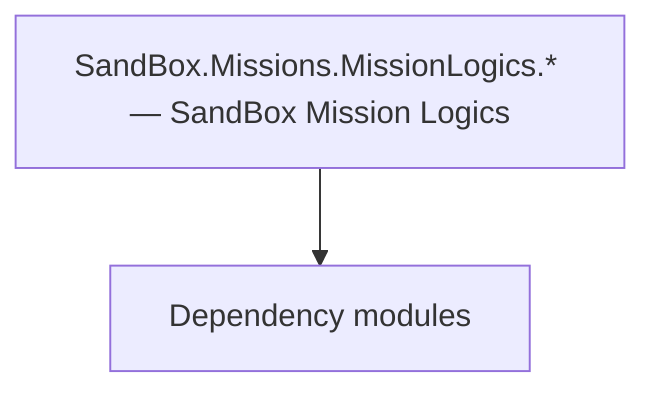

# SandBox.Missions.MissionLogics.* — SandBox Mission Logics

**One-line responsibility:** This page covers all 73 business types under `SandBox.Missions.MissionLogics.* — SandBox Mission Logics` as a family index, giving each type its namespace, responsibility, and typical timing so you can browse by module instead of alphabetically.

## Mental Model

SandBox.Missions.MissionLogics.* implements the mission logic for each SandBox gameplay: Hideout (bandit lair, with Objectives sub-goals), Arena, Towns, and others. Each MissionLogic subclass defines that gameplay’s flow and win/lose conditions, assembled by the relevant Mission on load; logic and presentation are bridged via MissionBehavior.

## When to Use

To extend a SandBox gameplay (hideout/arena/town) flow, inherit the relevant MissionLogic and register it with the Mission; win/lose and settlement must be idempotent.

## Dependencies

The types under `SandBox.Missions.MissionLogics.* — SandBox Mission Logics` depend on the following modules; missing any of them causes compile- or run-time failure.

- [Mission](../../mission/Mission)
- [API Overview](../../_index)

## Type Catalog

| Type | Namespace | Purpose | Timing |
| --- | --- | --- | --- |
| `AgentTrackTypes` | SandBox.Missions.MissionLogics | A business type under this namespace that carries its derived convention responsibility. Confirm its lifecycle and owning system before calling; do not reference an unready instance at the wrong phase. World-state changes should go through the corresponding Action/Behavior, not direct field mutation. | On battle/mission load |
| `BattleAgentLogic` | SandBox.Missions.MissionLogics | A business type under this namespace that carries its derived convention responsibility. Confirm its lifecycle and owning system before calling; do not reference an unready instance at the wrong phase. World-state changes should go through the corresponding Action/Behavior, not direct field mutation. | On battle/mission load |
| `BattleSurgeonLogic` | SandBox.Missions.MissionLogics | A business type under this namespace that carries its derived convention responsibility. Confirm its lifecycle and owning system before calling; do not reference an unready instance at the wrong phase. World-state changes should go through the corresponding Action/Behavior, not direct field mutation. | On battle/mission load |
| `CampaignSiegeStateHandler` | SandBox.Missions.MissionLogics | AI decision implementation that must be interruptible and serializable to support saving and undo. Search must be depth/time bounded to avoid stalls. | On battle/mission load |
| `CombatMissionWithDialogueController` | SandBox.Missions.MissionLogics | A business type under this namespace that carries its derived convention responsibility. Confirm its lifecycle and owning system before calling; do not reference an unready instance at the wrong phase. World-state changes should go through the corresponding Action/Behavior, not direct field mutation. | On battle/mission load |
| `CorpseDraggingMissionLogic` | SandBox.Missions.MissionLogics | Mission logic that defines the flow and win/lose conditions of that mission, assembled by the Mission on load. Win/lose resolution must be idempotent — repeated triggers must not double-settle. | On battle/mission load |
| `CrossRoadScoreData` | SandBox.Missions.MissionLogics | A business type under this namespace that carries its derived convention responsibility. Confirm its lifecycle and owning system before calling; do not reference an unready instance at the wrong phase. World-state changes should go through the corresponding Action/Behavior, not direct field mutation. | On battle/mission load |
| `DisguiseMissionLogic` | SandBox.Missions.MissionLogics | Mission logic that defines the flow and win/lose conditions of that mission, assembled by the Mission on load. Win/lose resolution must be idempotent — repeated triggers must not double-settle. | On battle/mission load |
| `EnemyAgentAIDeactivationMissionLogic` | SandBox.Missions.MissionLogics | Mission logic that defines the flow and win/lose conditions of that mission, assembled by the Mission on load. Win/lose resolution must be idempotent — repeated triggers must not double-settle. | On battle/mission load |
| `HeroSkillHandler` | SandBox.Missions.MissionLogics | A business type under this namespace that carries its derived convention responsibility. Confirm its lifecycle and owning system before calling; do not reference an unready instance at the wrong phase. World-state changes should go through the corresponding Action/Behavior, not direct field mutation. | On battle/mission load |
| `HouseMissionController` | SandBox.Missions.MissionLogics | A business type under this namespace that carries its derived convention responsibility. Confirm its lifecycle and owning system before calling; do not reference an unready instance at the wrong phase. World-state changes should go through the corresponding Action/Behavior, not direct field mutation. | On battle/mission load |
| `IMissionProgressTracker` | SandBox.Missions.MissionLogics | A business type under this namespace that carries its derived convention responsibility. Confirm its lifecycle and owning system before calling; do not reference an unready instance at the wrong phase. World-state changes should go through the corresponding Action/Behavior, not direct field mutation. | On battle/mission load |
| `IndoorMissionController` | SandBox.Missions.MissionLogics | A business type under this namespace that carries its derived convention responsibility. Confirm its lifecycle and owning system before calling; do not reference an unready instance at the wrong phase. World-state changes should go through the corresponding Action/Behavior, not direct field mutation. | On battle/mission load |
| `ItemCatalogController` | SandBox.Missions.MissionLogics | A business type under this namespace that carries its derived convention responsibility. Confirm its lifecycle and owning system before calling; do not reference an unready instance at the wrong phase. World-state changes should go through the corresponding Action/Behavior, not direct field mutation. | On battle/mission load |
| `LeaveMissionLogic` | SandBox.Missions.MissionLogics | Mission logic that defines the flow and win/lose conditions of that mission, assembled by the Mission on load. Win/lose resolution must be idempotent — repeated triggers must not double-settle. | On battle/mission load |
| `LocationCharacterAgentSpawnedMissionEvent` | SandBox.Missions.MissionLogics | Board-game piece description with attributes and movement rules. State must be fully serializable to reconstruct the match. | On battle/mission load |
| `LocationItemSpawnHandler` | SandBox.Missions.MissionLogics | Board-game piece description with attributes and movement rules. State must be fully serializable to reconstruct the match. | On battle/mission load |
| `LookBackPointData` | SandBox.Missions.MissionLogics | A business type under this namespace that carries its derived convention responsibility. Confirm its lifecycle and owning system before calling; do not reference an unready instance at the wrong phase. World-state changes should go through the corresponding Action/Behavior, not direct field mutation. | On battle/mission load |
| `MissionAgentLookHandler` | SandBox.Missions.MissionLogics | A business type under this namespace that carries its derived convention responsibility. Confirm its lifecycle and owning system before calling; do not reference an unready instance at the wrong phase. World-state changes should go through the corresponding Action/Behavior, not direct field mutation. | On battle/mission load |
| `MissionAlleyHandler` | SandBox.Missions.MissionLogics | A business type under this namespace that carries its derived convention responsibility. Confirm its lifecycle and owning system before calling; do not reference an unready instance at the wrong phase. World-state changes should go through the corresponding Action/Behavior, not direct field mutation. | On battle/mission load |
| `MissionBasicTeamLogic` | SandBox.Missions.MissionLogics | A business type under this namespace that carries its derived convention responsibility. Confirm its lifecycle and owning system before calling; do not reference an unready instance at the wrong phase. World-state changes should go through the corresponding Action/Behavior, not direct field mutation. | On battle/mission load |
| `MissionCaravanOrVillagerTacticsHandler` | SandBox.Missions.MissionLogics | A business type under this namespace that carries its derived convention responsibility. Confirm its lifecycle and owning system before calling; do not reference an unready instance at the wrong phase. World-state changes should go through the corresponding Action/Behavior, not direct field mutation. | On battle/mission load |
| `MissionCrimeHandler` | SandBox.Missions.MissionLogics | A business type under this namespace that carries its derived convention responsibility. Confirm its lifecycle and owning system before calling; do not reference an unready instance at the wrong phase. World-state changes should go through the corresponding Action/Behavior, not direct field mutation. | On battle/mission load |
| `MissionFightHandler` | SandBox.Missions.MissionLogics | A business type under this namespace that carries its derived convention responsibility. Confirm its lifecycle and owning system before calling; do not reference an unready instance at the wrong phase. World-state changes should go through the corresponding Action/Behavior, not direct field mutation. | On battle/mission load |
| `MissionPathGenerationLogic` | SandBox.Missions.MissionLogics | A business type under this namespace that carries its derived convention responsibility. Confirm its lifecycle and owning system before calling; do not reference an unready instance at the wrong phase. World-state changes should go through the corresponding Action/Behavior, not direct field mutation. | On battle/mission load |
| `MissionSettlementPrepareLogic` | SandBox.Missions.MissionLogics | A business type under this namespace that carries its derived convention responsibility. Confirm its lifecycle and owning system before calling; do not reference an unready instance at the wrong phase. World-state changes should go through the corresponding Action/Behavior, not direct field mutation. | On battle/mission load |
| `MountAgentLogic` | SandBox.Missions.MissionLogics | A business type under this namespace that carries its derived convention responsibility. Confirm its lifecycle and owning system before calling; do not reference an unready instance at the wrong phase. World-state changes should go through the corresponding Action/Behavior, not direct field mutation. | On battle/mission load |
| `NavigationPathData` | SandBox.Missions.MissionLogics | A business type under this namespace that carries its derived convention responsibility. Confirm its lifecycle and owning system before calling; do not reference an unready instance at the wrong phase. World-state changes should go through the corresponding Action/Behavior, not direct field mutation. | On battle/mission load |
| `PointOfInterestBaseData` | SandBox.Missions.MissionLogics | A business type under this namespace that carries its derived convention responsibility. Confirm its lifecycle and owning system before calling; do not reference an unready instance at the wrong phase. World-state changes should go through the corresponding Action/Behavior, not direct field mutation. | On battle/mission load |
| `PointOfInterests` | SandBox.Missions.MissionLogics | A business type under this namespace that carries its derived convention responsibility. Confirm its lifecycle and owning system before calling; do not reference an unready instance at the wrong phase. World-state changes should go through the corresponding Action/Behavior, not direct field mutation. | On battle/mission load |
| `PointOfInterestScorePair` | SandBox.Missions.MissionLogics | AI decision implementation that must be interruptible and serializable to support saving and undo. Search must be depth/time bounded to avoid stalls. | On battle/mission load |
| `RetirementMissionLogic` | SandBox.Missions.MissionLogics | Mission logic that defines the flow and win/lose conditions of that mission, assembled by the Mission on load. Win/lose resolution must be idempotent — repeated triggers must not double-settle. | On battle/mission load |
| `SandBoxBattleMissionSpawnHandler` | SandBox.Missions.MissionLogics | Board-game piece description with attributes and movement rules. State must be fully serializable to reconstruct the match. | On battle/mission load |
| `SandboxGeneralsAndCaptainsAssignmentLogic` | SandBox.Missions.MissionLogics | AI decision implementation that must be interruptible and serializable to support saving and undo. Search must be depth/time bounded to avoid stalls. | On battle/mission load |
| `SandboxHighlightsController` | SandBox.Missions.MissionLogics | A business type under this namespace that carries its derived convention responsibility. Confirm its lifecycle and owning system before calling; do not reference an unready instance at the wrong phase. World-state changes should go through the corresponding Action/Behavior, not direct field mutation. | On battle/mission load |
| `SandBoxMissionHandler` | SandBox.Missions.MissionLogics | A business type under this namespace that carries its derived convention responsibility. Confirm its lifecycle and owning system before calling; do not reference an unready instance at the wrong phase. World-state changes should go through the corresponding Action/Behavior, not direct field mutation. | On battle/mission load |
| `SandBoxMissionSpawnHandler` | SandBox.Missions.MissionLogics | Board-game piece description with attributes and movement rules. State must be fully serializable to reconstruct the match. | On battle/mission load |
| `SandBoxSallyOutMissionController` | SandBox.Missions.MissionLogics | A business type under this namespace that carries its derived convention responsibility. Confirm its lifecycle and owning system before calling; do not reference an unready instance at the wrong phase. World-state changes should go through the corresponding Action/Behavior, not direct field mutation. | On battle/mission load |
| `SandBoxSiegeMissionSpawnHandler` | SandBox.Missions.MissionLogics | Board-game piece description with attributes and movement rules. State must be fully serializable to reconstruct the match. | On battle/mission load |
| `SearchBodyMissionHandler` | SandBox.Missions.MissionLogics | A business type under this namespace that carries its derived convention responsibility. Confirm its lifecycle and owning system before calling; do not reference an unready instance at the wrong phase. World-state changes should go through the corresponding Action/Behavior, not direct field mutation. | On battle/mission load |
| `ShadowingAgentOffenseInfo` | SandBox.Missions.MissionLogics | A business type under this namespace that carries its derived convention responsibility. Confirm its lifecycle and owning system before calling; do not reference an unready instance at the wrong phase. World-state changes should go through the corresponding Action/Behavior, not direct field mutation. | On battle/mission load |
| `StandingGuardSpawnData` | SandBox.Missions.MissionLogics | Board-game piece description with attributes and movement rules. State must be fully serializable to reconstruct the match. | On battle/mission load |
| `StealthAreaData` | SandBox.Missions.MissionLogics | A business type under this namespace that carries its derived convention responsibility. Confirm its lifecycle and owning system before calling; do not reference an unready instance at the wrong phase. World-state changes should go through the corresponding Action/Behavior, not direct field mutation. | On battle/mission load |
| `StealthAreaMissionLogic` | SandBox.Missions.MissionLogics | Mission logic that defines the flow and win/lose conditions of that mission, assembled by the Mission on load. Win/lose resolution must be idempotent — repeated triggers must not double-settle. | On battle/mission load |
| `StealthMissionController` | SandBox.Missions.MissionLogics | A business type under this namespace that carries its derived convention responsibility. Confirm its lifecycle and owning system before calling; do not reference an unready instance at the wrong phase. World-state changes should go through the corresponding Action/Behavior, not direct field mutation. | On battle/mission load |
| `StealthOffenseTypes` | SandBox.Missions.MissionLogics | A business type under this namespace that carries its derived convention responsibility. Confirm its lifecycle and owning system before calling; do not reference an unready instance at the wrong phase. World-state changes should go through the corresponding Action/Behavior, not direct field mutation. | On battle/mission load |
| `StealthPatrolPointMissionLogic` | SandBox.Missions.MissionLogics | Mission logic that defines the flow and win/lose conditions of that mission, assembled by the Mission on load. Win/lose resolution must be idempotent — repeated triggers must not double-settle. | On battle/mission load |
| `UsableMachineData` | SandBox.Missions.MissionLogics | Scene usable object that triggers an action or menu when the player interacts with it. Interaction must be idempotent and its state must be serializable to support saving. | On battle/mission load |
| `VillageMissionController` | SandBox.Missions.MissionLogics | A business type under this namespace that carries its derived convention responsibility. Confirm its lifecycle and owning system before calling; do not reference an unready instance at the wrong phase. World-state changes should go through the corresponding Action/Behavior, not direct field mutation. | On battle/mission load |
| `VisitPointNodeScoreData` | SandBox.Missions.MissionLogics | A business type under this namespace that carries its derived convention responsibility. Confirm its lifecycle and owning system before calling; do not reference an unready instance at the wrong phase. World-state changes should go through the corresponding Action/Behavior, not direct field mutation. | On battle/mission load |
| `VisualTrackerMissionBehavior` | SandBox.Missions.MissionLogics | Mission behavior that listens to mission events to drive logic; pairs with MissionLogic for presentation and interaction wiring. | On battle/mission load |
| `WhileEnteringSettlementBattleMissionController` | SandBox.Missions.MissionLogics | A business type under this namespace that carries its derived convention responsibility. Confirm its lifecycle and owning system before calling; do not reference an unready instance at the wrong phase. World-state changes should go through the corresponding Action/Behavior, not direct field mutation. | On battle/mission load |
| `ArenaAgentStateDeciderLogic` | SandBox.Missions.MissionLogics.Arena | Mission logic that defines the flow and win/lose conditions of that mission, assembled by the Mission on load. Win/lose resolution must be idempotent — repeated triggers must not double-settle. | On battle/mission load |
| `ArenaDuelMissionBehavior` | SandBox.Missions.MissionLogics.Arena | Mission logic that defines the flow and win/lose conditions of that mission, assembled by the Mission on load. Win/lose resolution must be idempotent — repeated triggers must not double-settle. | On battle/mission load |
| `ArenaDuelMissionController` | SandBox.Missions.MissionLogics.Arena | Mission logic that defines the flow and win/lose conditions of that mission, assembled by the Mission on load. Win/lose resolution must be idempotent — repeated triggers must not double-settle. | On battle/mission load |
| `ArenaPracticeFightMissionController` | SandBox.Missions.MissionLogics.Arena | Mission logic that defines the flow and win/lose conditions of that mission, assembled by the Mission on load. Win/lose resolution must be idempotent — repeated triggers must not double-settle. | On battle/mission load |
| `HideoutAgentType` | SandBox.Missions.MissionLogics.Hideout | A business type under this namespace that carries its derived convention responsibility. Confirm its lifecycle and owning system before calling; do not reference an unready instance at the wrong phase. World-state changes should go through the corresponding Action/Behavior, not direct field mutation. | On battle/mission load |
| `HideoutAmbushBossFightCinematicController` | SandBox.Missions.MissionLogics.Hideout | Mission logic that defines the flow and win/lose conditions of that mission, assembled by the Mission on load. Win/lose resolution must be idempotent — repeated triggers must not double-settle. | On battle/mission load |
| `HideoutAmbushMissionController` | SandBox.Missions.MissionLogics.Hideout | Mission logic that defines the flow and win/lose conditions of that mission, assembled by the Mission on load. Win/lose resolution must be idempotent — repeated triggers must not double-settle. | On battle/mission load |
| `HideoutCinematicAgentInfo` | SandBox.Missions.MissionLogics.Hideout | A business type under this namespace that carries its derived convention responsibility. Confirm its lifecycle and owning system before calling; do not reference an unready instance at the wrong phase. World-state changes should go through the corresponding Action/Behavior, not direct field mutation. | On battle/mission load |
| `HideoutCinematicController` | SandBox.Missions.MissionLogics.Hideout | Mission logic that defines the flow and win/lose conditions of that mission, assembled by the Mission on load. Win/lose resolution must be idempotent — repeated triggers must not double-settle. | On battle/mission load |
| `HideoutCinematicState` | SandBox.Missions.MissionLogics.Hideout | A business type under this namespace that carries its derived convention responsibility. Confirm its lifecycle and owning system before calling; do not reference an unready instance at the wrong phase. World-state changes should go through the corresponding Action/Behavior, not direct field mutation. | On battle/mission load |
| `HideoutMissionController` | SandBox.Missions.MissionLogics.Hideout | Mission logic that defines the flow and win/lose conditions of that mission, assembled by the Mission on load. Win/lose resolution must be idempotent — repeated triggers must not double-settle. | On battle/mission load |
| `HideoutPostCinematicPhase` | SandBox.Missions.MissionLogics.Hideout | A business type under this namespace that carries its derived convention responsibility. Confirm its lifecycle and owning system before calling; do not reference an unready instance at the wrong phase. World-state changes should go through the corresponding Action/Behavior, not direct field mutation. | On battle/mission load |
| `HideoutPreCinematicPhase` | SandBox.Missions.MissionLogics.Hideout | A business type under this namespace that carries its derived convention responsibility. Confirm its lifecycle and owning system before calling; do not reference an unready instance at the wrong phase. World-state changes should go through the corresponding Action/Behavior, not direct field mutation. | On battle/mission load |
| `TroopData` | SandBox.Missions.MissionLogics.Hideout | A business type under this namespace that carries its derived convention responsibility. Confirm its lifecycle and owning system before calling; do not reference an unready instance at the wrong phase. World-state changes should go through the corresponding Action/Behavior, not direct field mutation. | On battle/mission load |
| `ClearTheMainCampObjective` | SandBox.Missions.MissionLogics.Hideout.Objectives | AI decision implementation that must be interruptible and serializable to support saving and undo. Search must be depth/time bounded to avoid stalls. | On battle/mission load |
| `DefeatHideoutBossObjective` | SandBox.Missions.MissionLogics.Hideout.Objectives | A business type under this namespace that carries its derived convention responsibility. Confirm its lifecycle and owning system before calling; do not reference an unready instance at the wrong phase. World-state changes should go through the corresponding Action/Behavior, not direct field mutation. | On battle/mission load |
| `LocateTheMainCampObjective` | SandBox.Missions.MissionLogics.Hideout.Objectives | AI decision implementation that must be interruptible and serializable to support saving and undo. Search must be depth/time bounded to avoid stalls. | On battle/mission load |
| `AlleyFightMissionHandler` | SandBox.Missions.MissionLogics.Towns | Mission logic that defines the flow and win/lose conditions of that mission, assembled by the Mission on load. Win/lose resolution must be idempotent — repeated triggers must not double-settle. | On battle/mission load |
| `PrisonBreakMissionController` | SandBox.Missions.MissionLogics.Towns | Mission logic that defines the flow and win/lose conditions of that mission, assembled by the Mission on load. Win/lose resolution must be idempotent — repeated triggers must not double-settle. | On battle/mission load |
| `TownCenterMissionController` | SandBox.Missions.MissionLogics.Towns | Mission logic that defines the flow and win/lose conditions of that mission, assembled by the Mission on load. Win/lose resolution must be idempotent — repeated triggers must not double-settle. | On battle/mission load |
| `WorkshopMissionHandler` | SandBox.Missions.MissionLogics.Towns | Mission logic that defines the flow and win/lose conditions of that mission, assembled by the Mission on load. Win/lose resolution must be idempotent — repeated triggers must not double-settle. | On battle/mission load |

## Risk & Boundaries

Mission logic depends on scene and listener registration order; events are lost if not ready. Sub-goals (Objectives) must complete idempotently — no double settlement. State must be serializable for mid-match saves.

## See Also

- [Mission](../../mission/Mission)
- [API Overview](../../_index)
