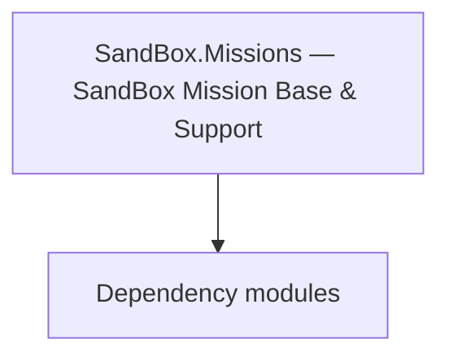

# SandBox.Missions — SandBox Mission Base & Support

**One-line responsibility:** This page covers all 35 business types under `SandBox.Missions — SandBox Mission Base & Support` as a family index, giving each type its namespace, responsibility, and typical timing so you can browse by module instead of alphabetically.

## Mental Model

SandBox.Missions is the base and support layer of the SandBox mission system: the Mission base, battle score, mission events, conversation mission logics, and agent behaviors. They define mission lifecycle, event flow, and agent collaboration — the skeleton of Mission gameplay logic.

## When to Use

To extend SandBox mission flow/events/conversation logic or add an agent behavior, derive from the relevant type and assemble it on Mission load; win/lose must be idempotent.

## Dependencies

The types under `SandBox.Missions — SandBox Mission Base & Support` depend on the following modules; missing any of them causes compile- or run-time failure.

- [Mission](../../mission/Mission)
- [API Overview](../../_index)

## Type Catalog

| Type | Namespace | Purpose | Timing |
| --- | --- | --- | --- |
| `CameraJumpScript` | SandBox.Missions | Script component attached to a scene GameObject, exposing scene state to the logic layer. Depends on scene load order; fields are null before the scene is ready. | On battle/mission load |
| `ChangeLightIntensityScript` | SandBox.Missions | Script component attached to a scene GameObject, exposing scene state to the logic layer. Depends on scene load order; fields are null before the scene is ready. | On battle/mission load |
| `CheckpointLoadedMissionEvent` | SandBox.Missions | Event or event handler carrying the data of something that happened once. Remember to unsubscribe on unload to avoid leaks. | On battle/mission load |
| `CheckpointMissionLogic` | SandBox.Missions | Mission logic that defines the flow and win/lose conditions of that mission, assembled by the Mission on load. Win/lose resolution must be idempotent — repeated triggers must not double-settle. | On battle/mission load |
| `CivilianPortShipSpawnMissionLogic` | SandBox.Missions | Mission logic that defines the flow and win/lose conditions of that mission, assembled by the Mission on load. Win/lose resolution must be idempotent — repeated triggers must not double-settle. | On battle/mission load |
| `CoverAnimalAgentComponent` | SandBox.Missions | A business type under this namespace that carries its derived convention responsibility. Confirm its lifecycle and owning system before calling; do not reference an unready instance at the wrong phase. World-state changes should go through the corresponding Action/Behavior, not direct field mutation. | On battle/mission load |
| `EavesdroppingMissionLogic` | SandBox.Missions | Mission logic that defines the flow and win/lose conditions of that mission, assembled by the Mission on load. Win/lose resolution must be idempotent — repeated triggers must not double-settle. | On battle/mission load |
| `EavesdropSound` | SandBox.Missions | A business type under this namespace that carries its derived convention responsibility. Confirm its lifecycle and owning system before calling; do not reference an unready instance at the wrong phase. World-state changes should go through the corresponding Action/Behavior, not direct field mutation. | On battle/mission load |
| `OnStealthMissionCounterFailedEvent` | SandBox.Missions | AI decision implementation that must be interruptible and serializable to support saving and undo. Search must be depth/time bounded to avoid stalls. | On battle/mission load |
| `RotateObjectScript` | SandBox.Missions | Script component attached to a scene GameObject, exposing scene state to the logic layer. Depends on scene load order; fields are null before the scene is ready. | On battle/mission load |
| `SabotageMissionController` | SandBox.Missions | Mission logic that defines the flow and win/lose conditions of that mission, assembled by the Mission on load. Win/lose resolution must be idempotent — repeated triggers must not double-settle. | On battle/mission load |
| `StealthFailCounterMissionLogic` | SandBox.Missions | Mission logic that defines the flow and win/lose conditions of that mission, assembled by the Mission on load. Win/lose resolution must be idempotent — repeated triggers must not double-settle. | On battle/mission load |
| `AgentBehavior` | SandBox.Missions.AgentBehaviors | Battle agent AI behavior that makes decisions and executes actions inside a Mission. Its lifetime follows the Agent’s life and death; you must clean up after the Agent dies. | On battle/mission load |
| `AgentBehaviorGroup` | SandBox.Missions.AgentBehaviors | Battle agent AI behavior that makes decisions and executes actions inside a Mission. Its lifetime follows the Agent’s life and death; you must clean up after the Agent dies. | On battle/mission load |
| `AlarmedBehaviorGroup` | SandBox.Missions.AgentBehaviors | A business type under this namespace that carries its derived convention responsibility. Confirm its lifecycle and owning system before calling; do not reference an unready instance at the wrong phase. World-state changes should go through the corresponding Action/Behavior, not direct field mutation. | On battle/mission load |
| `BehaviorSets` | SandBox.Missions.AgentBehaviors | A business type under this namespace that carries its derived convention responsibility. Confirm its lifecycle and owning system before calling; do not reference an unready instance at the wrong phase. World-state changes should go through the corresponding Action/Behavior, not direct field mutation. | On battle/mission load |
| `CautiousBehavior` | SandBox.Missions.AgentBehaviors | A business type under this namespace that carries its derived convention responsibility. Confirm its lifecycle and owning system before calling; do not reference an unready instance at the wrong phase. World-state changes should go through the corresponding Action/Behavior, not direct field mutation. | On battle/mission load |
| `ChangeLocationBehavior` | SandBox.Missions.AgentBehaviors | A business type under this namespace that carries its derived convention responsibility. Confirm its lifecycle and owning system before calling; do not reference an unready instance at the wrong phase. World-state changes should go through the corresponding Action/Behavior, not direct field mutation. | On battle/mission load |
| `DailyBehaviorGroup` | SandBox.Missions.AgentBehaviors | AI decision implementation that must be interruptible and serializable to support saving and undo. Search must be depth/time bounded to avoid stalls. | On battle/mission load |
| `EscortAgentBehavior` | SandBox.Missions.AgentBehaviors | Battle agent AI behavior that makes decisions and executes actions inside a Mission. Its lifetime follows the Agent’s life and death; you must clean up after the Agent dies. | On battle/mission load |
| `FightBehavior` | SandBox.Missions.AgentBehaviors | A business type under this namespace that carries its derived convention responsibility. Confirm its lifecycle and owning system before calling; do not reference an unready instance at the wrong phase. World-state changes should go through the corresponding Action/Behavior, not direct field mutation. | On battle/mission load |
| `FleeBehavior` | SandBox.Missions.AgentBehaviors | A business type under this namespace that carries its derived convention responsibility. Confirm its lifecycle and owning system before calling; do not reference an unready instance at the wrong phase. World-state changes should go through the corresponding Action/Behavior, not direct field mutation. | On battle/mission load |
| `FollowAgentBehavior` | SandBox.Missions.AgentBehaviors | Battle agent AI behavior that makes decisions and executes actions inside a Mission. Its lifetime follows the Agent’s life and death; you must clean up after the Agent dies. | On battle/mission load |
| `IdleAgentBehavior` | SandBox.Missions.AgentBehaviors | Battle agent AI behavior that makes decisions and executes actions inside a Mission. Its lifetime follows the Agent’s life and death; you must clean up after the Agent dies. | On battle/mission load |
| `InterruptingBehaviorGroup` | SandBox.Missions.AgentBehaviors | A business type under this namespace that carries its derived convention responsibility. Confirm its lifecycle and owning system before calling; do not reference an unready instance at the wrong phase. World-state changes should go through the corresponding Action/Behavior, not direct field mutation. | On battle/mission load |
| `NotableSpawnPointHandler` | SandBox.Missions.AgentBehaviors | Board-game piece description with attributes and movement rules. State must be fully serializable to reconstruct the match. | On battle/mission load |
| `PatrolAgentBehavior` | SandBox.Missions.AgentBehaviors | Battle agent AI behavior that makes decisions and executes actions inside a Mission. Its lifetime follows the Agent’s life and death; you must clean up after the Agent dies. | On battle/mission load |
| `PatrollingGuardBehavior` | SandBox.Missions.AgentBehaviors | A business type under this namespace that carries its derived convention responsibility. Confirm its lifecycle and owning system before calling; do not reference an unready instance at the wrong phase. World-state changes should go through the corresponding Action/Behavior, not direct field mutation. | On battle/mission load |
| `ScriptBehavior` | SandBox.Missions.AgentBehaviors | A business type under this namespace that carries its derived convention responsibility. Confirm its lifecycle and owning system before calling; do not reference an unready instance at the wrong phase. World-state changes should go through the corresponding Action/Behavior, not direct field mutation. | On battle/mission load |
| `StandGuardBehavior` | SandBox.Missions.AgentBehaviors | A business type under this namespace that carries its derived convention responsibility. Confirm its lifecycle and owning system before calling; do not reference an unready instance at the wrong phase. World-state changes should go through the corresponding Action/Behavior, not direct field mutation. | On battle/mission load |
| `TalkBehavior` | SandBox.Missions.AgentBehaviors | A business type under this namespace that carries its derived convention responsibility. Confirm its lifecycle and owning system before calling; do not reference an unready instance at the wrong phase. World-state changes should go through the corresponding Action/Behavior, not direct field mutation. | On battle/mission load |
| `WalkingBehavior` | SandBox.Missions.AgentBehaviors | A business type under this namespace that carries its derived convention responsibility. Confirm its lifecycle and owning system before calling; do not reference an unready instance at the wrong phase. World-state changes should go through the corresponding Action/Behavior, not direct field mutation. | On battle/mission load |
| `MissionAIActivationDeactivationEventListenerLogic` | SandBox.Missions.MissionEvents | Mission logic that defines the flow and win/lose conditions of that mission, assembled by the Mission on load. Win/lose resolution must be idempotent — repeated triggers must not double-settle. | On battle/mission load |
| `OpenInventoryWithGivenItemsEventListenerLogic` | SandBox.Missions.MissionEvents | Mission logic that defines the flow and win/lose conditions of that mission, assembled by the Mission on load. Win/lose resolution must be idempotent — repeated triggers must not double-settle. | On battle/mission load |
| `ShowQuickInformationEventListenerLogic` | SandBox.Missions.MissionEvents | Mission logic that defines the flow and win/lose conditions of that mission, assembled by the Mission on load. Win/lose resolution must be idempotent — repeated triggers must not double-settle. | On battle/mission load |

## Risk & Boundaries

Mission logic depends on Mission load and listener registration order; events are lost if not ready. Agent behaviors must be cleaned up after the Agent dies or dangling references crash. Score/event data must be serializable.

## See Also

- [Mission](../../mission/Mission)
- [API Overview](../../_index)
