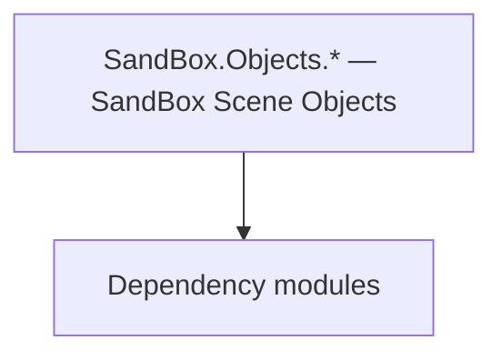

# SandBox.Objects.* — SandBox Scene Objects

**One-line responsibility:** This page covers all 37 business types under `SandBox.Objects.* — SandBox Scene Objects` as a family index, giving each type its namespace, responsibility, and typical timing so you can browse by module instead of alphabetically.

## Mental Model

SandBox.Objects.* holds scene-placeable objects and usables: usables (interactable props), animation points, area markers, cinematics. These are the physical/scripted building blocks mods place in scenes; interaction must be idempotent and state serializable.

## When to Use

To add a new interactable prop or scene marker, derive from the relevant Usable/object type and place it in the scene; wire interaction through the behavior layer.

## Dependencies

The types under `SandBox.Objects.* — SandBox Scene Objects` depend on the following modules; missing any of them causes compile- or run-time failure.

- [Mission](../../mission/Mission)
- [Campaign](../../campaign/Campaign)
- [API Overview](../../_index)

## Type Catalog

| Type | Namespace | Purpose | Timing |
| --- | --- | --- | --- |
| `CheckpointArea` | SandBox.Objects | A business type under this namespace that carries its derived convention responsibility. Confirm its lifecycle and owning system before calling; do not reference an unready instance at the wrong phase. World-state changes should go through the corresponding Action/Behavior, not direct field mutation. | Campaign init |
| `DefaultMusicInstrumentData` | SandBox.Objects | A business type under this namespace that carries its derived convention responsibility. Confirm its lifecycle and owning system before calling; do not reference an unready instance at the wrong phase. World-state changes should go through the corresponding Action/Behavior, not direct field mutation. | Campaign init |
| `DynamicPatrolAreaParent` | SandBox.Objects | A business type under this namespace that carries its derived convention responsibility. Confirm its lifecycle and owning system before calling; do not reference an unready instance at the wrong phase. World-state changes should go through the corresponding Action/Behavior, not direct field mutation. | Campaign init |
| `GenericMissionEventBox` | SandBox.Objects | Event or event handler carrying the data of something that happened once. Remember to unsubscribe on unload to avoid leaks. | Campaign init |
| `GroupSpawnPoint` | SandBox.Objects | Scene usable object that triggers an action or menu when the player interacts with it. Interaction must be idempotent and its state must be serializable to support saving. | Campaign init |
| `InstrumentData` | SandBox.Objects | A business type under this namespace that carries its derived convention responsibility. Confirm its lifecycle and owning system before calling; do not reference an unready instance at the wrong phase. World-state changes should go through the corresponding Action/Behavior, not direct field mutation. | Campaign init |
| `PassageUsePoint` | SandBox.Objects | A business type under this namespace that carries its derived convention responsibility. Confirm its lifecycle and owning system before calling; do not reference an unready instance at the wrong phase. World-state changes should go through the corresponding Action/Behavior, not direct field mutation. | Campaign init |
| `PatrolPoint` | SandBox.Objects | A business type under this namespace that carries its derived convention responsibility. Confirm its lifecycle and owning system before calling; do not reference an unready instance at the wrong phase. World-state changes should go through the corresponding Action/Behavior, not direct field mutation. | Campaign init |
| `SettlementMusicData` | SandBox.Objects | A business type under this namespace that carries its derived convention responsibility. Confirm its lifecycle and owning system before calling; do not reference an unready instance at the wrong phase. World-state changes should go through the corresponding Action/Behavior, not direct field mutation. | Campaign init |
| `StealthIndoorLightingArea` | SandBox.Objects | A business type under this namespace that carries its derived convention responsibility. Confirm its lifecycle and owning system before calling; do not reference an unready instance at the wrong phase. World-state changes should go through the corresponding Action/Behavior, not direct field mutation. | Campaign init |
| `StealthZone` | SandBox.Objects | A business type under this namespace that carries its derived convention responsibility. Confirm its lifecycle and owning system before calling; do not reference an unready instance at the wrong phase. World-state changes should go through the corresponding Action/Behavior, not direct field mutation. | Campaign init |
| `TeleportType` | SandBox.Objects | A business type under this namespace that carries its derived convention responsibility. Confirm its lifecycle and owning system before calling; do not reference an unready instance at the wrong phase. World-state changes should go through the corresponding Action/Behavior, not direct field mutation. | Campaign init |
| `TeleportUsePoint` | SandBox.Objects | A business type under this namespace that carries its derived convention responsibility. Confirm its lifecycle and owning system before calling; do not reference an unready instance at the wrong phase. World-state changes should go through the corresponding Action/Behavior, not direct field mutation. | Campaign init |
| `AnimationPoint` | SandBox.Objects.AnimationPoints | A business type under this namespace that carries its derived convention responsibility. Confirm its lifecycle and owning system before calling; do not reference an unready instance at the wrong phase. World-state changes should go through the corresponding Action/Behavior, not direct field mutation. | Campaign init |
| `ChairUsePoint` | SandBox.Objects.AnimationPoints | AI decision implementation that must be interruptible and serializable to support saving and undo. Search must be depth/time bounded to avoid stalls. | Campaign init |
| `DynamicObjectAnimationPoint` | SandBox.Objects.AnimationPoints | A business type under this namespace that carries its derived convention responsibility. Confirm its lifecycle and owning system before calling; do not reference an unready instance at the wrong phase. World-state changes should go through the corresponding Action/Behavior, not direct field mutation. | Campaign init |
| `ItemForBone` | SandBox.Objects.AnimationPoints | A business type under this namespace that carries its derived convention responsibility. Confirm its lifecycle and owning system before calling; do not reference an unready instance at the wrong phase. World-state changes should go through the corresponding Action/Behavior, not direct field mutation. | Campaign init |
| `PlayMusicPoint` | SandBox.Objects.AnimationPoints | A business type under this namespace that carries its derived convention responsibility. Confirm its lifecycle and owning system before calling; do not reference an unready instance at the wrong phase. World-state changes should go through the corresponding Action/Behavior, not direct field mutation. | Campaign init |
| `AnimatedBasicAreaIndicator` | SandBox.Objects.AreaMarkers | AI decision implementation that must be interruptible and serializable to support saving and undo. Search must be depth/time bounded to avoid stalls. | Campaign init |
| `BasicAreaIndicator` | SandBox.Objects.AreaMarkers | AI decision implementation that must be interruptible and serializable to support saving and undo. Search must be depth/time bounded to avoid stalls. | Campaign init |
| `CommonAreaMarker` | SandBox.Objects.AreaMarkers | A business type under this namespace that carries its derived convention responsibility. Confirm its lifecycle and owning system before calling; do not reference an unready instance at the wrong phase. World-state changes should go through the corresponding Action/Behavior, not direct field mutation. | Campaign init |
| `StealthAreaMarker` | SandBox.Objects.AreaMarkers | A business type under this namespace that carries its derived convention responsibility. Confirm its lifecycle and owning system before calling; do not reference an unready instance at the wrong phase. World-state changes should go through the corresponding Action/Behavior, not direct field mutation. | Campaign init |
| `WorkshopAreaMarker` | SandBox.Objects.AreaMarkers | A business type under this namespace that carries its derived convention responsibility. Confirm its lifecycle and owning system before calling; do not reference an unready instance at the wrong phase. World-state changes should go through the corresponding Action/Behavior, not direct field mutation. | Campaign init |
| `CinematicBurningArrow` | SandBox.Objects.Cinematics | Script component attached to a scene GameObject, exposing scene state to the logic layer. Depends on scene load order; fields are null before the scene is ready. | Campaign init |
| `HideoutBossFightBehavior` | SandBox.Objects.Cinematics | Script component attached to a scene GameObject, exposing scene state to the logic layer. Depends on scene load order; fields are null before the scene is ready. | Campaign init |
| `SkeletonAnimatedCamera` | SandBox.Objects.Cinematics | Script component attached to a scene GameObject, exposing scene state to the logic layer. Depends on scene load order; fields are null before the scene is ready. | Campaign init |
| `Chair` | SandBox.Objects.Usables | Scene usable object that triggers an action or menu when the player interacts with it. Interaction must be idempotent and its state must be serializable to support saving. | Campaign init |
| `CheckpointUsePoint` | SandBox.Objects.Usables | Scene usable object that triggers an action or menu when the player interacts with it. Interaction must be idempotent and its state must be serializable to support saving. | Campaign init |
| `DisguiseMissionUsePoint` | SandBox.Objects.Usables | Scene usable object that triggers an action or menu when the player interacts with it. Interaction must be idempotent and its state must be serializable to support saving. | Campaign init |
| `MusicianGroup` | SandBox.Objects.Usables | Scene usable object that triggers an action or menu when the player interacts with it. Interaction must be idempotent and its state must be serializable to support saving. | Campaign init |
| `Passage` | SandBox.Objects.Usables | Scene usable object that triggers an action or menu when the player interacts with it. Interaction must be idempotent and its state must be serializable to support saving. | Campaign init |
| `PatrolArea` | SandBox.Objects.Usables | Scene usable object that triggers an action or menu when the player interacts with it. Interaction must be idempotent and its state must be serializable to support saving. | Campaign init |
| `ShadowingSecureZoneUsePoint` | SandBox.Objects.Usables | Scene usable object that triggers an action or menu when the player interacts with it. Interaction must be idempotent and its state must be serializable to support saving. | Campaign init |
| `SittableType` | SandBox.Objects.Usables | A business type under this namespace that carries its derived convention responsibility. Confirm its lifecycle and owning system before calling; do not reference an unready instance at the wrong phase. World-state changes should go through the corresponding Action/Behavior, not direct field mutation. | Campaign init |
| `SmithingMachine` | SandBox.Objects.Usables | Scene usable object that triggers an action or menu when the player interacts with it. Interaction must be idempotent and its state must be serializable to support saving. | Campaign init |
| `StealthAreaUsePoint` | SandBox.Objects.Usables | Scene usable object that triggers an action or menu when the player interacts with it. Interaction must be idempotent and its state must be serializable to support saving. | Campaign init |
| `UsablePlace` | SandBox.Objects.Usables | Scene usable object that triggers an action or menu when the player interacts with it. Interaction must be idempotent and its state must be serializable to support saving. | Campaign init |

## Risk & Boundaries

Usable interaction must be idempotent; state must be serializable for saves. Scene objects depend on scene load order; fields are null before the scene is ready.

## See Also

- [Mission](../../mission/Mission)
- [Campaign](../../campaign/Campaign)
- [API Overview](../../_index)
