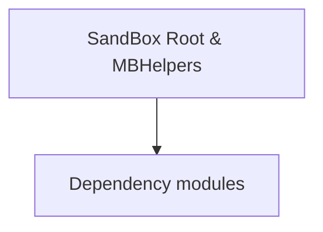

# SandBox Root & MBHelpers

**One-line responsibility:** This page covers all 66 business types under `SandBox Root & MBHelpers` as a family index, giving each type its namespace, responsibility, and typical timing so you can browse by module instead of alphabetically.

## Mental Model

This covers the SandBox root namespace plus the static helper bundles (Helpers, MBHelpers) that concentrate cross-cutting operations: opening screens, computing results, resolving entities (InventoryScreenHelper, SettlementHelper, HeroHelper, …). Helpers are stateless utilities called from the correct system context — never instantiate them as stateful objects.

## When to Use

Use the SandBox root types and helpers where a cross-cutting operation or a small shared utility is needed; call helpers from the right system phase.

## Dependencies

The types under `SandBox Root & MBHelpers` depend on the following modules; missing any of them causes compile- or run-time failure.

- [Campaign](../../campaign/Campaign)
- [Mission](../../mission/Mission)
- [API Overview](../../_index)

## Type Catalog

| Type | Namespace | Purpose | Timing |
| --- | --- | --- | --- |
| `AIDifficulty` | Helpers | AI decision implementation that must be interruptible and serializable to support saving and undo. Search must be depth/time bounded to avoid stalls. | Runtime |
| `AiHelper` | Helpers | AI decision implementation that must be interruptible and serializable to support saving and undo. Search must be depth/time bounded to avoid stalls. | Runtime |
| `BoardGameState` | Helpers | Static helper utility that concentrates a cross-cutting operation (open screen, compute result, resolve entity). Call it from the correct system context; do not instantiate it as stateful. | Runtime |
| `BuildingHelper` | Helpers | Static helper utility that concentrates a cross-cutting operation (open screen, compute result, resolve entity). Call it from the correct system context; do not instantiate it as stateful. | Runtime |
| `DiplomacyHelper` | Helpers | Static helper utility that concentrates a cross-cutting operation (open screen, compute result, resolve entity). Call it from the correct system context; do not instantiate it as stateful. | Runtime |
| `EmbarkDisembarkData` | Helpers | Static helper utility that concentrates a cross-cutting operation (open screen, compute result, resolve entity). Call it from the correct system context; do not instantiate it as stateful. | Runtime |
| `EquipmentHelper` | Helpers | Static helper utility that concentrates a cross-cutting operation (open screen, compute result, resolve entity). Call it from the correct system context; do not instantiate it as stateful. | Runtime |
| `FactionHelper` | Helpers | Static helper utility that concentrates a cross-cutting operation (open screen, compute result, resolve entity). Call it from the correct system context; do not instantiate it as stateful. | Runtime |
| `HeroHelper` | Helpers | Static helper utility that concentrates a cross-cutting operation (open screen, compute result, resolve entity). Call it from the correct system context; do not instantiate it as stateful. | Runtime |
| `IncidentHelper` | Helpers | Static helper utility that concentrates a cross-cutting operation (open screen, compute result, resolve entity). Call it from the correct system context; do not instantiate it as stateful. | Runtime |
| `InventoryScreenHelper` | Helpers | Static helper utility that concentrates a cross-cutting operation (open screen, compute result, resolve entity). Call it from the correct system context; do not instantiate it as stateful. | Runtime |
| `ItemHelper` | Helpers | Static helper utility that concentrates a cross-cutting operation (open screen, compute result, resolve entity). Call it from the correct system context; do not instantiate it as stateful. | Runtime |
| `MenuHelper` | Helpers | Static helper utility that concentrates a cross-cutting operation (open screen, compute result, resolve entity). Call it from the correct system context; do not instantiate it as stateful. | Runtime |
| `MobilePartyHelper` | Helpers | Static helper utility that concentrates a cross-cutting operation (open screen, compute result, resolve entity). Call it from the correct system context; do not instantiate it as stateful. | Runtime |
| `NavigationHelper` | Helpers | Static helper utility that concentrates a cross-cutting operation (open screen, compute result, resolve entity). Call it from the correct system context; do not instantiate it as stateful. | Runtime |
| `PartyBaseHelper` | Helpers | Static helper utility that concentrates a cross-cutting operation (open screen, compute result, resolve entity). Call it from the correct system context; do not instantiate it as stateful. | Runtime |
| `PartyScreenHelper` | Helpers | Static helper utility that concentrates a cross-cutting operation (open screen, compute result, resolve entity). Call it from the correct system context; do not instantiate it as stateful. | Runtime |
| `PerkHelper` | Helpers | Static helper utility that concentrates a cross-cutting operation (open screen, compute result, resolve entity). Call it from the correct system context; do not instantiate it as stateful. | Runtime |
| `PersuasionHelper` | Helpers | Static helper utility that concentrates a cross-cutting operation (open screen, compute result, resolve entity). Call it from the correct system context; do not instantiate it as stateful. | Runtime |
| `PortStateHelper` | Helpers | Static helper utility that concentrates a cross-cutting operation (open screen, compute result, resolve entity). Call it from the correct system context; do not instantiate it as stateful. | Runtime |
| `SettlementHelper` | Helpers | Static helper utility that concentrates a cross-cutting operation (open screen, compute result, resolve entity). Call it from the correct system context; do not instantiate it as stateful. | Runtime |
| `ShipHelper` | Helpers | Static helper utility that concentrates a cross-cutting operation (open screen, compute result, resolve entity). Call it from the correct system context; do not instantiate it as stateful. | Runtime |
| `SkillHelper` | Helpers | Static helper utility that concentrates a cross-cutting operation (open screen, compute result, resolve entity). Call it from the correct system context; do not instantiate it as stateful. | Runtime |
| `TeleportationHelper` | Helpers | Static helper utility that concentrates a cross-cutting operation (open screen, compute result, resolve entity). Call it from the correct system context; do not instantiate it as stateful. | Runtime |
| `BannerHelper` | MBHelpers | Static helper utility that concentrates a cross-cutting operation (open screen, compute result, resolve entity). Call it from the correct system context; do not instantiate it as stateful. | Runtime |
| `Add1000GoldCheat` | SandBox | Debug cheat item triggered via console or menu for development-time effects. Production builds should disable or stub it to avoid accidentally corrupting saves. | Campaign init |
| `Add100InfluenceCheat` | SandBox | Debug cheat item triggered via console or menu for development-time effects. Production builds should disable or stub it to avoid accidentally corrupting saves. | Campaign init |
| `Add100RenownCheat` | SandBox | Debug cheat item triggered via console or menu for development-time effects. Production builds should disable or stub it to avoid accidentally corrupting saves. | Campaign init |
| `AddCraftingMaterialsCheat` | SandBox | Debug cheat item triggered via console or menu for development-time effects. Production builds should disable or stub it to avoid accidentally corrupting saves. | Campaign init |
| `AgentNavigator` | SandBox | A business type under this namespace that carries its derived convention responsibility. Confirm its lifecycle and owning system before calling; do not reference an unready instance at the wrong phase. World-state changes should go through the corresponding Action/Behavior, not direct field mutation. | Campaign init |
| `BoostSkillCheatGroup` | SandBox | Debug cheat item triggered via console or menu for development-time effects. Production builds should disable or stub it to avoid accidentally corrupting saves. | Campaign init |
| `BoostSkillCheeat` | SandBox | Debug cheat item triggered via console or menu for development-time effects. Production builds should disable or stub it to avoid accidentally corrupting saves. | Campaign init |
| `CampaignAgentComponent` | SandBox | AI decision implementation that must be interruptible and serializable to support saving and undo. Search must be depth/time bounded to avoid stalls. | Campaign init |
| `CampaignMapSiegePrefabEntityCache` | SandBox | Script component attached to a scene GameObject, exposing scene state to the logic layer. Depends on scene load order; fields are null before the scene is ready. | Campaign init |
| `CompleteBuildingProjectCheat` | SandBox | Debug cheat item triggered via console or menu for development-time effects. Production builds should disable or stub it to avoid accidentally corrupting saves. | Campaign init |
| `EditorSceneMissionManager` | SandBox | A business type under this namespace that carries its derived convention responsibility. Confirm its lifecycle and owning system before calling; do not reference an unready instance at the wrong phase. World-state changes should go through the corresponding Action/Behavior, not direct field mutation. | Campaign init |
| `FillCraftingStaminaCheat` | SandBox | Debug cheat item triggered via console or menu for development-time effects. Production builds should disable or stub it to avoid accidentally corrupting saves. | Campaign init |
| `GameplayCheatBase` | SandBox | Debug cheat item triggered via console or menu for development-time effects. Production builds should disable or stub it to avoid accidentally corrupting saves. | Campaign init |
| `GameplayCheatGroup` | SandBox | Debug cheat item triggered via console or menu for development-time effects. Production builds should disable or stub it to avoid accidentally corrupting saves. | Campaign init |
| `GameplayCheatItem` | SandBox | Debug cheat item triggered via console or menu for development-time effects. Production builds should disable or stub it to avoid accidentally corrupting saves. | Campaign init |
| `GameplayCheatsManager` | SandBox | Debug cheat item triggered via console or menu for development-time effects. Production builds should disable or stub it to avoid accidentally corrupting saves. | Campaign init |
| `Give10GrainCheat` | SandBox | Debug cheat item triggered via console or menu for development-time effects. Production builds should disable or stub it to avoid accidentally corrupting saves. | Campaign init |
| `Give10WarhorsesCheat` | SandBox | Debug cheat item triggered via console or menu for development-time effects. Production builds should disable or stub it to avoid accidentally corrupting saves. | Campaign init |
| `Give5TroopsToPlayerCheat` | SandBox | Debug cheat item triggered via console or menu for development-time effects. Production builds should disable or stub it to avoid accidentally corrupting saves. | Campaign init |
| `HealMainHeroCheat` | SandBox | Debug cheat item triggered via console or menu for development-time effects. Production builds should disable or stub it to avoid accidentally corrupting saves. | Campaign init |
| `HealPlayerPartyCheat` | SandBox | Debug cheat item triggered via console or menu for development-time effects. Production builds should disable or stub it to avoid accidentally corrupting saves. | Campaign init |
| `LocationCharacterMissionExtensions` | SandBox | A business type under this namespace that carries its derived convention responsibility. Confirm its lifecycle and owning system before calling; do not reference an unready instance at the wrong phase. World-state changes should go through the corresponding Action/Behavior, not direct field mutation. | Campaign init |
| `MapScene` | SandBox | A business type under this namespace that carries its derived convention responsibility. Confirm its lifecycle and owning system before calling; do not reference an unready instance at the wrong phase. World-state changes should go through the corresponding Action/Behavior, not direct field mutation. | Campaign init |
| `MapSceneCreator` | SandBox | A business type under this namespace that carries its derived convention responsibility. Confirm its lifecycle and owning system before calling; do not reference an unready instance at the wrong phase. World-state changes should go through the corresponding Action/Behavior, not direct field mutation. | Campaign init |
| `MapSceneHelper` | SandBox | Static helper utility that concentrates a cross-cutting operation (open screen, compute result, resolve entity). Call it from the correct system context; do not instantiate it as stateful. | Campaign init |
| `MissionHelper` | SandBox | Static helper utility that concentrates a cross-cutting operation (open screen, compute result, resolve entity). Call it from the correct system context; do not instantiate it as stateful. | Campaign init |
| `ModuleCheckResult` | SandBox | A business type under this namespace that carries its derived convention responsibility. Confirm its lifecycle and owning system before calling; do not reference an unready instance at the wrong phase. World-state changes should go through the corresponding Action/Behavior, not direct field mutation. | Campaign init |
| `MultiplayerItemTestMissionController` | SandBox | A business type under this namespace that carries its derived convention responsibility. Confirm its lifecycle and owning system before calling; do not reference an unready instance at the wrong phase. World-state changes should go through the corresponding Action/Behavior, not direct field mutation. | Campaign init |
| `NavigationState` | SandBox | A business type under this namespace that carries its derived convention responsibility. Confirm its lifecycle and owning system before calling; do not reference an unready instance at the wrong phase. World-state changes should go through the corresponding Action/Behavior, not direct field mutation. | Campaign init |
| `SandboxBattleBannerBearersModel` | SandBox | Domain model that aggregates rules and calculations for Behaviors to call. When you replace a model you must provide an equivalent contract; an empty replacement hands null to its dependents. | Campaign init |
| `SandBoxEditorMissionTester` | SandBox | A business type under this namespace that carries its derived convention responsibility. Confirm its lifecycle and owning system before calling; do not reference an unready instance at the wrong phase. World-state changes should go through the corresponding Action/Behavior, not direct field mutation. | Campaign init |
| `SandBoxGameManager` | SandBox | A business type under this namespace that carries its derived convention responsibility. Confirm its lifecycle and owning system before calling; do not reference an unready instance at the wrong phase. World-state changes should go through the corresponding Action/Behavior, not direct field mutation. | Campaign init |
| `SandBoxHelpers` | SandBox | Static helper utility that concentrates a cross-cutting operation (open screen, compute result, resolve entity). Call it from the correct system context; do not instantiate it as stateful. | Campaign init |
| `SandBoxSaveHelper` | SandBox | Static helper utility that concentrates a cross-cutting operation (open screen, compute result, resolve entity). Call it from the correct system context; do not instantiate it as stateful. | Campaign init |
| `SandBoxSaveManager` | SandBox | A business type under this namespace that carries its derived convention responsibility. Confirm its lifecycle and owning system before calling; do not reference an unready instance at the wrong phase. World-state changes should go through the corresponding Action/Behavior, not direct field mutation. | Campaign init |
| `SandBoxSubModule` | SandBox | A business type under this namespace that carries its derived convention responsibility. Confirm its lifecycle and owning system before calling; do not reference an unready instance at the wrong phase. World-state changes should go through the corresponding Action/Behavior, not direct field mutation. | Campaign init |
| `SaveableSandBoxTypeDefiner` | SandBox | Save-type definer that declares which fields of the type enter the save. Any new field must carry a default value, otherwise old saves fail to deserialize. | Campaign init |
| `SaveHelperState` | SandBox | Static helper utility that concentrates a cross-cutting operation (open screen, compute result, resolve entity). Call it from the correct system context; do not instantiate it as stateful. | Campaign init |
| `UnlockAllCraftingRecipesCheat` | SandBox | Debug cheat item triggered via console or menu for development-time effects. Production builds should disable or stub it to avoid accidentally corrupting saves. | Campaign init |
| `UnlockFogOfWarCheat` | SandBox | Debug cheat item triggered via console or menu for development-time effects. Production builds should disable or stub it to avoid accidentally corrupting saves. | Campaign init |
| `WoundAllEnemiesCheat` | SandBox | Debug cheat item triggered via console or menu for development-time effects. Production builds should disable or stub it to avoid accidentally corrupting saves. | Campaign init |

## Risk & Boundaries

Helpers are stateless; do not store per-instance state in them. SandBox root types follow their owning system’s lifecycle — reference only when ready. World changes should go through Actions/Behaviors.

## See Also

- [Campaign](../../campaign/Campaign)
- [Mission](../../mission/Mission)
- [API Overview](../../_index)
