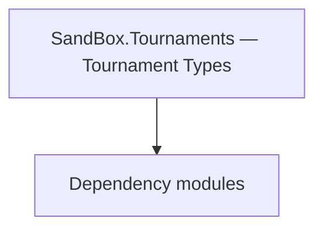

# SandBox.Tournaments — Tournament Types

**One-line responsibility:** This page covers all 12 business types under `SandBox.Tournaments — Tournament Types` as a family index, giving each type its namespace, responsibility, and typical timing so you can browse by module instead of alphabetically.

## Mental Model

SandBox.Tournaments implements the in-game tournament system: Tournaments is the flow aggregate, MissionLogics drive the match, AgentControllers control the participating AI. Together they organize sign-up, brackets, matches, and reward settlement; state must be serializable.

## When to Use

To extend or add a tournament stage/match/AI opponent, derive from the relevant type and register it with the tournament manager; flow must be idempotent.

## Dependencies

The types under `SandBox.Tournaments — Tournament Types` depend on the following modules; missing any of them causes compile- or run-time failure.

- [Campaign](../../campaign/Campaign)
- [Mission](../../mission/Mission)
- [API Overview](../../_index)

## Type Catalog

| Type | Namespace | Purpose | Timing |
| --- | --- | --- | --- |
| `ITournamentGameBehavior` | SandBox.Tournaments | Tournament-related type organizing event sign-up, brackets and reward settlement. State must be serializable. | Campaign init |
| `TournamentMissionStarter` | SandBox.Tournaments | Tournament-related type organizing event sign-up, brackets and reward settlement. State must be serializable. | Campaign init |
| `ArcheryTournamentAgentController` | SandBox.Tournaments.AgentControllers | Tournament-related type organizing event sign-up, brackets and reward settlement. State must be serializable. | Campaign init |
| `JoustingAgentController` | SandBox.Tournaments.AgentControllers | Tournament-related type organizing event sign-up, brackets and reward settlement. State must be serializable. | Campaign init |
| `JoustingAgentState` | SandBox.Tournaments.AgentControllers | Tournament-related type organizing event sign-up, brackets and reward settlement. State must be serializable. | Campaign init |
| `TownHorseRaceAgentController` | SandBox.Tournaments.AgentControllers | Tournament-related type organizing event sign-up, brackets and reward settlement. State must be serializable. | Campaign init |
| `CheckPoint` | SandBox.Tournaments.MissionLogics | Tournament-related type organizing event sign-up, brackets and reward settlement. State must be serializable. | On battle/mission load |
| `TournamentArcheryMissionController` | SandBox.Tournaments.MissionLogics | Mission logic that defines the flow and win/lose conditions of that mission, assembled by the Mission on load. Win/lose resolution must be idempotent — repeated triggers must not double-settle. | On battle/mission load |
| `TournamentBehavior` | SandBox.Tournaments.MissionLogics | Mission logic that defines the flow and win/lose conditions of that mission, assembled by the Mission on load. Win/lose resolution must be idempotent — repeated triggers must not double-settle. | On battle/mission load |
| `TournamentFightMissionController` | SandBox.Tournaments.MissionLogics | Mission logic that defines the flow and win/lose conditions of that mission, assembled by the Mission on load. Win/lose resolution must be idempotent — repeated triggers must not double-settle. | On battle/mission load |
| `TournamentJoustingMissionController` | SandBox.Tournaments.MissionLogics | Mission logic that defines the flow and win/lose conditions of that mission, assembled by the Mission on load. Win/lose resolution must be idempotent — repeated triggers must not double-settle. | On battle/mission load |
| `TownHorseRaceMissionController` | SandBox.Tournaments.MissionLogics | Mission logic that defines the flow and win/lose conditions of that mission, assembled by the Mission on load. Win/lose resolution must be idempotent — repeated triggers must not double-settle. | On battle/mission load |

## Risk & Boundaries

Tournament state must be serializable to support saves. AgentControllers follow the participating unit’s life/death — clean up after an Agent dies. Brackets and reward settlement must avoid duplicate triggers.

## See Also

- [Campaign](../../campaign/Campaign)
- [Mission](../../mission/Mission)
- [API Overview](../../_index)
