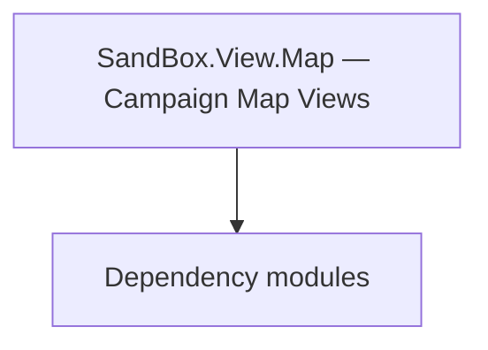

# SandBox.View.Map — Campaign Map Views

**One-line responsibility:** This page covers all 64 business types under `SandBox.View.Map — Campaign Map Views` as a family index, giving each type its namespace, responsibility, and typical timing so you can browse by module instead of alphabetically.

## Mental Model

SandBox.View.Map.* is the campaign-map visualization layer: map visuals and managers, map navigation elements, and navigation components. It projects the strategic map state into scene presentation; views only read state, never write rules, keeping them decoupled from logic.

## When to Use

To customize map elements, navigation, or map overlays, inherit the relevant view and register it from a MissionBehavior/logic layer; writes go through the logic layer.

## Dependencies

The types under `SandBox.View.Map — Campaign Map Views` depend on the following modules; missing any of them causes compile- or run-time failure.

- [Mission](../../mission/Mission)
- [ViewModel](../../core-extra/ViewModel)
- [API Overview](../../_index)

## Type Catalog

| Type | Namespace | Purpose | Timing |
| --- | --- | --- | --- |
| `BattleSimulationMapView` | SandBox.View.Map | A business type under this namespace that carries its derived convention responsibility. Confirm its lifecycle and owning system before calling; do not reference an unready instance at the wrong phase. World-state changes should go through the corresponding Action/Behavior, not direct field mutation. | Campaign init |
| `BlockadePositionScript` | SandBox.View.Map | A business type under this namespace that carries its derived convention responsibility. Confirm its lifecycle and owning system before calling; do not reference an unready instance at the wrong phase. World-state changes should go through the corresponding Action/Behavior, not direct field mutation. | Campaign init |
| `CameraFollowMode` | SandBox.View.Map | A business type under this namespace that carries its derived convention responsibility. Confirm its lifecycle and owning system before calling; do not reference an unready instance at the wrong phase. World-state changes should go through the corresponding Action/Behavior, not direct field mutation. | Campaign init |
| `CampaignEntityVisualComponent` | SandBox.View.Map | AI decision implementation that must be interruptible and serializable to support saving and undo. Search must be depth/time bounded to avoid stalls. | Campaign init |
| `ConversationPlayArgs` | SandBox.View.Map | Conversation-related type participating in the dialogue tree and performance. Dialogue-line changes must mind branches and localization. | Campaign init |
| `DecalEntity` | SandBox.View.Map | A business type under this namespace that carries its derived convention responsibility. Confirm its lifecycle and owning system before calling; do not reference an unready instance at the wrong phase. World-state changes should go through the corresponding Action/Behavior, not direct field mutation. | Campaign init |
| `DefaultMapConversationDataProvider` | SandBox.View.Map | Gauntlet image-source abstraction that resolves an entity/concept into an actual texture and caches it. The first frame may be empty; handle the loading state. | Campaign init |
| `HeirSelectionPopupView` | SandBox.View.Map | Election / voting mechanism used for collective decisions such as kingdom votes. Mind voting timing and tie handling. | Campaign init |
| `IMapConversationDataProvider` | SandBox.View.Map | Gauntlet image-source abstraction that resolves an entity/concept into an actual texture and caches it. The first frame may be empty; handle the loading state. | Campaign init |
| `InputInformation` | SandBox.View.Map | A business type under this namespace that carries its derived convention responsibility. Confirm its lifecycle and owning system before calling; do not reference an unready instance at the wrong phase. World-state changes should go through the corresponding Action/Behavior, not direct field mutation. | Campaign init |
| `MainMapCameraMoveEvent` | SandBox.View.Map | AI decision implementation that must be interruptible and serializable to support saving and undo. Search must be depth/time bounded to avoid stalls. | Campaign init |
| `MapBarView` | SandBox.View.Map | A business type under this namespace that carries its derived convention responsibility. Confirm its lifecycle and owning system before calling; do not reference an unready instance at the wrong phase. World-state changes should go through the corresponding Action/Behavior, not direct field mutation. | Campaign init |
| `MapBasicView` | SandBox.View.Map | A business type under this namespace that carries its derived convention responsibility. Confirm its lifecycle and owning system before calling; do not reference an unready instance at the wrong phase. World-state changes should go through the corresponding Action/Behavior, not direct field mutation. | Campaign init |
| `MapCameraView` | SandBox.View.Map | A business type under this namespace that carries its derived convention responsibility. Confirm its lifecycle and owning system before calling; do not reference an unready instance at the wrong phase. World-state changes should go through the corresponding Action/Behavior, not direct field mutation. | Campaign init |
| `MapCampaignOptionsView` | SandBox.View.Map | AI decision implementation that must be interruptible and serializable to support saving and undo. Search must be depth/time bounded to avoid stalls. | Campaign init |
| `MapCheatsView` | SandBox.View.Map | Debug cheat item triggered via console or menu for development-time effects. Production builds should disable or stub it to avoid accidentally corrupting saves. | Campaign init |
| `MapConversationMission` | SandBox.View.Map | Conversation-related type participating in the dialogue tree and performance. Dialogue-line changes must mind branches and localization. | Campaign init |
| `MapConversationTableau` | SandBox.View.Map | Conversation-related type participating in the dialogue tree and performance. Dialogue-line changes must mind branches and localization. | Campaign init |
| `MapConversationTableauData` | SandBox.View.Map | Conversation-related type participating in the dialogue tree and performance. Dialogue-line changes must mind branches and localization. | Campaign init |
| `MapConversationView` | SandBox.View.Map | Conversation-related type participating in the dialogue tree and performance. Dialogue-line changes must mind branches and localization. | Campaign init |
| `MapCursor` | SandBox.View.Map | A business type under this namespace that carries its derived convention responsibility. Confirm its lifecycle and owning system before calling; do not reference an unready instance at the wrong phase. World-state changes should go through the corresponding Action/Behavior, not direct field mutation. | Campaign init |
| `MapEncyclopediaView` | SandBox.View.Map | A business type under this namespace that carries its derived convention responsibility. Confirm its lifecycle and owning system before calling; do not reference an unready instance at the wrong phase. World-state changes should go through the corresponding Action/Behavior, not direct field mutation. | Campaign init |
| `MapEscapeMenuView` | SandBox.View.Map | Menu interface view that organizes menu items and navigation. Interaction is surfaced via events; rules are not written in the view. | Campaign init |
| `MapEventVisualsView` | SandBox.View.Map | Event or event handler carrying the data of something that happened once. Remember to unsubscribe on unload to avoid leaks. | Campaign init |
| `MapGamepadEffectsView` | SandBox.View.Map | A business type under this namespace that carries its derived convention responsibility. Confirm its lifecycle and owning system before calling; do not reference an unready instance at the wrong phase. World-state changes should go through the corresponding Action/Behavior, not direct field mutation. | Campaign init |
| `MapIncidentView` | SandBox.View.Map | A business type under this namespace that carries its derived convention responsibility. Confirm its lifecycle and owning system before calling; do not reference an unready instance at the wrong phase. World-state changes should go through the corresponding Action/Behavior, not direct field mutation. | Campaign init |
| `MapNotificationView` | SandBox.View.Map | Notification item type describing the data of one map/event prompt. It only carries display data; triggering logic lives in the Behavior. | Campaign init |
| `MapOverlayType` | SandBox.View.Map | A business type under this namespace that carries its derived convention responsibility. Confirm its lifecycle and owning system before calling; do not reference an unready instance at the wrong phase. World-state changes should go through the corresponding Action/Behavior, not direct field mutation. | Campaign init |
| `MapOverlayView` | SandBox.View.Map | A business type under this namespace that carries its derived convention responsibility. Confirm its lifecycle and owning system before calling; do not reference an unready instance at the wrong phase. World-state changes should go through the corresponding Action/Behavior, not direct field mutation. | Campaign init |
| `MapParleyAnimationView` | SandBox.View.Map | A business type under this namespace that carries its derived convention responsibility. Confirm its lifecycle and owning system before calling; do not reference an unready instance at the wrong phase. World-state changes should go through the corresponding Action/Behavior, not direct field mutation. | Campaign init |
| `MapPartyNameplateView` | SandBox.View.Map | A business type under this namespace that carries its derived convention responsibility. Confirm its lifecycle and owning system before calling; do not reference an unready instance at the wrong phase. World-state changes should go through the corresponding Action/Behavior, not direct field mutation. | Campaign init |
| `MapReadyView` | SandBox.View.Map | A business type under this namespace that carries its derived convention responsibility. Confirm its lifecycle and owning system before calling; do not reference an unready instance at the wrong phase. World-state changes should go through the corresponding Action/Behavior, not direct field mutation. | Campaign init |
| `MapSaveView` | SandBox.View.Map | A business type under this namespace that carries its derived convention responsibility. Confirm its lifecycle and owning system before calling; do not reference an unready instance at the wrong phase. World-state changes should go through the corresponding Action/Behavior, not direct field mutation. | Campaign init |
| `MapScreen` | SandBox.View.Map | A business type under this namespace that carries its derived convention responsibility. Confirm its lifecycle and owning system before calling; do not reference an unready instance at the wrong phase. World-state changes should go through the corresponding Action/Behavior, not direct field mutation. | Campaign init |
| `MapSettlementNameplateView` | SandBox.View.Map | A business type under this namespace that carries its derived convention responsibility. Confirm its lifecycle and owning system before calling; do not reference an unready instance at the wrong phase. World-state changes should go through the corresponding Action/Behavior, not direct field mutation. | Campaign init |
| `MapSiegeOverlayView` | SandBox.View.Map | A business type under this namespace that carries its derived convention responsibility. Confirm its lifecycle and owning system before calling; do not reference an unready instance at the wrong phase. World-state changes should go through the corresponding Action/Behavior, not direct field mutation. | Campaign init |
| `MapTrackersView` | SandBox.View.Map | A business type under this namespace that carries its derived convention responsibility. Confirm its lifecycle and owning system before calling; do not reference an unready instance at the wrong phase. World-state changes should go through the corresponding Action/Behavior, not direct field mutation. | Campaign init |
| `MapView` | SandBox.View.Map | A business type under this namespace that carries its derived convention responsibility. Confirm its lifecycle and owning system before calling; do not reference an unready instance at the wrong phase. World-state changes should go through the corresponding Action/Behavior, not direct field mutation. | Campaign init |
| `MapViewsContainer` | SandBox.View.Map | AI decision implementation that must be interruptible and serializable to support saving and undo. Search must be depth/time bounded to avoid stalls. | Campaign init |
| `MarriageOfferPopupView` | SandBox.View.Map | A business type under this namespace that carries its derived convention responsibility. Confirm its lifecycle and owning system before calling; do not reference an unready instance at the wrong phase. World-state changes should go through the corresponding Action/Behavior, not direct field mutation. | Campaign init |
| `SettlementPositionScript` | SandBox.View.Map | A business type under this namespace that carries its derived convention responsibility. Confirm its lifecycle and owning system before calling; do not reference an unready instance at the wrong phase. World-state changes should go through the corresponding Action/Behavior, not direct field mutation. | Campaign init |
| `SnowAndRainTextureDefiner` | SandBox.View.Map | AI decision implementation that must be interruptible and serializable to support saving and undo. Search must be depth/time bounded to avoid stalls. | Campaign init |
| `EntityVisualManagerBase` | SandBox.View.Map.Managers | A business type under this namespace that carries its derived convention responsibility. Confirm its lifecycle and owning system before calling; do not reference an unready instance at the wrong phase. World-state changes should go through the corresponding Action/Behavior, not direct field mutation. | Campaign init |
| `MapAudioManager` | SandBox.View.Map.Managers | A business type under this namespace that carries its derived convention responsibility. Confirm its lifecycle and owning system before calling; do not reference an unready instance at the wrong phase. World-state changes should go through the corresponding Action/Behavior, not direct field mutation. | Campaign init |
| `MapTracksVisualManager` | SandBox.View.Map.Managers | A business type under this namespace that carries its derived convention responsibility. Confirm its lifecycle and owning system before calling; do not reference an unready instance at the wrong phase. World-state changes should go through the corresponding Action/Behavior, not direct field mutation. | Campaign init |
| `MapWeatherVisualManager` | SandBox.View.Map.Managers | A business type under this namespace that carries its derived convention responsibility. Confirm its lifecycle and owning system before calling; do not reference an unready instance at the wrong phase. World-state changes should go through the corresponding Action/Behavior, not direct field mutation. | Campaign init |
| `MobilePartyVisualManager` | SandBox.View.Map.Managers | A business type under this namespace that carries its derived convention responsibility. Confirm its lifecycle and owning system before calling; do not reference an unready instance at the wrong phase. World-state changes should go through the corresponding Action/Behavior, not direct field mutation. | Campaign init |
| `SettlementVisualManager` | SandBox.View.Map.Managers | A business type under this namespace that carries its derived convention responsibility. Confirm its lifecycle and owning system before calling; do not reference an unready instance at the wrong phase. World-state changes should go through the corresponding Action/Behavior, not direct field mutation. | Campaign init |
| `MapNavigationElementBase` | SandBox.View.Map.Navigation | Campaign-map event / navigation element describing map topology or movement-related data structures. Changes must sync map logic and the navigation mesh. | Campaign init |
| `MapNavigationHandler` | SandBox.View.Map.Navigation | Campaign-map event / navigation element describing map topology or movement-related data structures. Changes must sync map logic and the navigation mesh. | Campaign init |
| `MapNavigationHelper` | SandBox.View.Map.Navigation | Campaign-map event / navigation element describing map topology or movement-related data structures. Changes must sync map logic and the navigation mesh. | Campaign init |
| `CharacterDeveloperNavigationElement` | SandBox.View.Map.Navigation.NavigationElements | Campaign-map event / navigation element describing map topology or movement-related data structures. Changes must sync map logic and the navigation mesh. | Campaign init |
| `ClanNavigationElement` | SandBox.View.Map.Navigation.NavigationElements | Campaign-map event / navigation element describing map topology or movement-related data structures. Changes must sync map logic and the navigation mesh. | Campaign init |
| `ClanScreenPermissionEvent` | SandBox.View.Map.Navigation.NavigationElements | Event or event handler carrying the data of something that happened once. Remember to unsubscribe on unload to avoid leaks. | Campaign init |
| `EscapeMenuNavigationElement` | SandBox.View.Map.Navigation.NavigationElements | Campaign-map event / navigation element describing map topology or movement-related data structures. Changes must sync map logic and the navigation mesh. | Campaign init |
| `InventoryNavigationElement` | SandBox.View.Map.Navigation.NavigationElements | Campaign-map event / navigation element describing map topology or movement-related data structures. Changes must sync map logic and the navigation mesh. | Campaign init |
| `KingdomNavigationElement` | SandBox.View.Map.Navigation.NavigationElements | Campaign-map event / navigation element describing map topology or movement-related data structures. Changes must sync map logic and the navigation mesh. | Campaign init |
| `PartyNavigationElement` | SandBox.View.Map.Navigation.NavigationElements | Campaign-map event / navigation element describing map topology or movement-related data structures. Changes must sync map logic and the navigation mesh. | Campaign init |
| `QuestsNavigationElement` | SandBox.View.Map.Navigation.NavigationElements | Campaign-map event / navigation element describing map topology or movement-related data structures. Changes must sync map logic and the navigation mesh. | Campaign init |
| `MapEntityVisual` | SandBox.View.Map.Visuals | A business type under this namespace that carries its derived convention responsibility. Confirm its lifecycle and owning system before calling; do not reference an unready instance at the wrong phase. World-state changes should go through the corresponding Action/Behavior, not direct field mutation. | Campaign init |
| `MapWeatherVisual` | SandBox.View.Map.Visuals | A business type under this namespace that carries its derived convention responsibility. Confirm its lifecycle and owning system before calling; do not reference an unready instance at the wrong phase. World-state changes should go through the corresponding Action/Behavior, not direct field mutation. | Campaign init |
| `MobilePartyVisual` | SandBox.View.Map.Visuals | A business type under this namespace that carries its derived convention responsibility. Confirm its lifecycle and owning system before calling; do not reference an unready instance at the wrong phase. World-state changes should go through the corresponding Action/Behavior, not direct field mutation. | Campaign init |
| `SettlementVisual` | SandBox.View.Map.Visuals | A business type under this namespace that carries its derived convention responsibility. Confirm its lifecycle and owning system before calling; do not reference an unready instance at the wrong phase. World-state changes should go through the corresponding Action/Behavior, not direct field mutation. | Campaign init |
| `TrackVisual` | SandBox.View.Map.Visuals | A business type under this namespace that carries its derived convention responsibility. Confirm its lifecycle and owning system before calling; do not reference an unready instance at the wrong phase. World-state changes should go through the corresponding Action/Behavior, not direct field mutation. | Campaign init |

## Risk & Boundaries

Views present, they do not decide; heavy work on the per-frame hot path drops frames. Map elements are numerous — virtualize bindings to control memory. Confirm the actual namespace for same-named views across branches.

## See Also

- [Mission](../../mission/Mission)
- [ViewModel](../../core-extra/ViewModel)
- [API Overview](../../_index)
