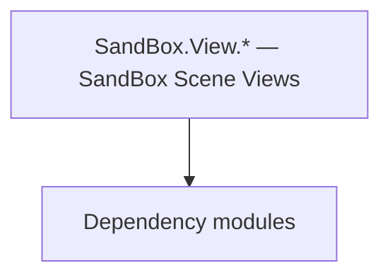

# SandBox.View.* — SandBox Scene Views

**One-line responsibility:** This page covers all 66 business types under `SandBox.View.* — SandBox Scene Views` as a family index, giving each type its namespace, responsibility, and typical timing so you can browse by module instead of alphabetically.

## Mental Model

SandBox.View.* is the SandBox module’s scene view layer: character creation views, conversation views, order providers, overlays, and mission views (tournaments, name markers, sand-box, sound components). It projects game state into scene presentation; views read state and never write rules.

## When to Use

To customize character creation, conversation, or scene overlays, inherit the relevant view and register it from a MissionBehavior/logic layer; writes go through the logic layer.

## Dependencies

The types under `SandBox.View.* — SandBox Scene Views` depend on the following modules; missing any of them causes compile- or run-time failure.

- [Mission](../../mission/Mission)
- [ViewModel](../../core-extra/ViewModel)
- [API Overview](../../_index)

## Type Catalog

| Type | Namespace | Purpose | Timing |
| --- | --- | --- | --- |
| `CampaignMusicHandler` | SandBox.View | AI decision implementation that must be interruptible and serializable to support saving and undo. Search must be depth/time bounded to avoid stalls. | Campaign init |
| `IChangeableScreen` | SandBox.View | A business type under this namespace that carries its derived convention responsibility. Confirm its lifecycle and owning system before calling; do not reference an unready instance at the wrong phase. World-state changes should go through the corresponding Action/Behavior, not direct field mutation. | Campaign init |
| `MainHeroSaveVisualSupplier` | SandBox.View | AI decision implementation that must be interruptible and serializable to support saving and undo. Search must be depth/time bounded to avoid stalls. | Campaign init |
| `PreloadScreen` | SandBox.View | Interface screen / layer base class that hosts Gauntlet UI display and input. Commands only trigger Actions or Behaviors and never mutate state directly. | Campaign init |
| `SandboxView` | SandBox.View | A business type under this namespace that carries its derived convention responsibility. Confirm its lifecycle and owning system before calling; do not reference an unready instance at the wrong phase. World-state changes should go through the corresponding Action/Behavior, not direct field mutation. | Campaign init |
| `SandBoxViewCheats` | SandBox.View | Debug cheat item triggered via console or menu for development-time effects. Production builds should disable or stub it to avoid accidentally corrupting saves. | Campaign init |
| `SandBoxViewCreator` | SandBox.View | A business type under this namespace that carries its derived convention responsibility. Confirm its lifecycle and owning system before calling; do not reference an unready instance at the wrong phase. World-state changes should go through the corresponding Action/Behavior, not direct field mutation. | Campaign init |
| `SandBoxViewSubModule` | SandBox.View | Module entry base class that registers behaviors and override points. Its lifetime spans the whole session; do not fetch systems that are not yet ready (e.g. before loading) at the wrong phase. | Campaign init |
| `SandBoxViewVisualManager` | SandBox.View | A business type under this namespace that carries its derived convention responsibility. Confirm its lifecycle and owning system before calling; do not reference an unready instance at the wrong phase. World-state changes should go through the corresponding Action/Behavior, not direct field mutation. | Campaign init |
| `SaveLoadScreen` | SandBox.View | Interface screen / layer base class that hosts Gauntlet UI display and input. Commands only trigger Actions or Behaviors and never mutate state directly. | Campaign init |
| `CharacterCreationScreen` | SandBox.View.CharacterCreation | Interface screen / layer base class that hosts Gauntlet UI display and input. Commands only trigger Actions or Behaviors and never mutate state directly. | Campaign init |
| `CharacterCreationStageViewAttribute` | SandBox.View.CharacterCreation | A business type under this namespace that carries its derived convention responsibility. Confirm its lifecycle and owning system before calling; do not reference an unready instance at the wrong phase. World-state changes should go through the corresponding Action/Behavior, not direct field mutation. | Campaign init |
| `CharacterCreationStageViewBase` | SandBox.View.CharacterCreation | A business type under this namespace that carries its derived convention responsibility. Confirm its lifecycle and owning system before calling; do not reference an unready instance at the wrong phase. World-state changes should go through the corresponding Action/Behavior, not direct field mutation. | Campaign init |
| `ConversationViewEventHandler` | SandBox.View.Conversation | Event or event handler carrying the data of something that happened once. Remember to unsubscribe on unload to avoid leaks. | Campaign init |
| `ConversationViewManager` | SandBox.View.Conversation | Conversation-related type participating in the dialogue tree and performance. Dialogue-line changes must mind branches and localization. | Campaign init |
| `EventType` | SandBox.View.Conversation | Event or event handler carrying the data of something that happened once. Remember to unsubscribe on unload to avoid leaks. | Campaign init |
| `MenuBackgroundView` | SandBox.View.Menu | A business type under this namespace that carries its derived convention responsibility. Confirm its lifecycle and owning system before calling; do not reference an unready instance at the wrong phase. World-state changes should go through the corresponding Action/Behavior, not direct field mutation. | Campaign init |
| `MenuBaseView` | SandBox.View.Menu | A business type under this namespace that carries its derived convention responsibility. Confirm its lifecycle and owning system before calling; do not reference an unready instance at the wrong phase. World-state changes should go through the corresponding Action/Behavior, not direct field mutation. | Campaign init |
| `MenuOverlayBaseView` | SandBox.View.Menu | A business type under this namespace that carries its derived convention responsibility. Confirm its lifecycle and owning system before calling; do not reference an unready instance at the wrong phase. World-state changes should go through the corresponding Action/Behavior, not direct field mutation. | Campaign init |
| `MenuRecruitVolunteersView` | SandBox.View.Menu | A business type under this namespace that carries its derived convention responsibility. Confirm its lifecycle and owning system before calling; do not reference an unready instance at the wrong phase. World-state changes should go through the corresponding Action/Behavior, not direct field mutation. | Campaign init |
| `MenuTournamentLeaderboardView` | SandBox.View.Menu | Tournament-related type organizing event sign-up, brackets and reward settlement. State must be serializable. | Campaign init |
| `MenuTownManagementView` | SandBox.View.Menu | A business type under this namespace that carries its derived convention responsibility. Confirm its lifecycle and owning system before calling; do not reference an unready instance at the wrong phase. World-state changes should go through the corresponding Action/Behavior, not direct field mutation. | Campaign init |
| `MenuTroopSelectionView` | SandBox.View.Menu | Election / voting mechanism used for collective decisions such as kingdom votes. Mind voting timing and tie handling. | Campaign init |
| `MenuView` | SandBox.View.Menu | Menu interface view that organizes menu items and navigation. Interaction is surfaced via events; rules are not written in the view. | Campaign init |
| `MenuViewContext` | SandBox.View.Menu | Menu interface view that organizes menu items and navigation. Interaction is surfaced via events; rules are not written in the view. | Campaign init |
| `TutorialScreen` | SandBox.View.Menu | Interface screen / layer base class that hosts Gauntlet UI display and input. Commands only trigger Actions or Behaviors and never mutate state directly. | Campaign init |
| `EavesdroppingMissionCameraView` | SandBox.View.Missions | Battle-scene visual view that subscribes to Mission events and refreshes the presentation layer (camera, VFX, HUD overlays) from game state every tick. Views read state and never write rules. | On battle/mission load |
| `GenderEnum` | SandBox.View.Missions | A business type under this namespace that carries its derived convention responsibility. Confirm its lifecycle and owning system before calling; do not reference an unready instance at the wrong phase. World-state changes should go through the corresponding Action/Behavior, not direct field mutation. | On battle/mission load |
| `MissionAgentAlarmStateView` | SandBox.View.Missions | Battle-scene visual view that subscribes to Mission events and refreshes the presentation layer (camera, VFX, HUD overlays) from game state every tick. Views read state and never write rules. | On battle/mission load |
| `MissionArenaPracticeFightView` | SandBox.View.Missions | Battle-scene visual view that subscribes to Mission events and refreshes the presentation layer (camera, VFX, HUD overlays) from game state every tick. Views read state and never write rules. | On battle/mission load |
| `MissionAudienceHandler` | SandBox.View.Missions | Battle-scene visual view that subscribes to Mission events and refreshes the presentation layer (camera, VFX, HUD overlays) from game state every tick. Views read state and never write rules. | On battle/mission load |
| `MissionCampaignBattleSpectatorView` | SandBox.View.Missions | Battle-scene visual view that subscribes to Mission events and refreshes the presentation layer (camera, VFX, HUD overlays) from game state every tick. Views read state and never write rules. | On battle/mission load |
| `MissionCampaignView` | SandBox.View.Missions | Battle-scene visual view that subscribes to Mission events and refreshes the presentation layer (camera, VFX, HUD overlays) from game state every tick. Views read state and never write rules. | On battle/mission load |
| `MissionConversationCameraView` | SandBox.View.Missions | Battle-scene visual view that subscribes to Mission events and refreshes the presentation layer (camera, VFX, HUD overlays) from game state every tick. Views read state and never write rules. | On battle/mission load |
| `MissionConversationPrepareView` | SandBox.View.Missions | Battle-scene visual view that subscribes to Mission events and refreshes the presentation layer (camera, VFX, HUD overlays) from game state every tick. Views read state and never write rules. | On battle/mission load |
| `MissionCustomCameraView` | SandBox.View.Missions | Battle-scene visual view that subscribes to Mission events and refreshes the presentation layer (camera, VFX, HUD overlays) from game state every tick. Views read state and never write rules. | On battle/mission load |
| `MissionEquipItemToolView` | SandBox.View.Missions | Battle-scene visual view that subscribes to Mission events and refreshes the presentation layer (camera, VFX, HUD overlays) from game state every tick. Views read state and never write rules. | On battle/mission load |
| `MissionHideoutAmbushBossFightCinematicView` | SandBox.View.Missions | Battle-scene visual view that subscribes to Mission events and refreshes the presentation layer (camera, VFX, HUD overlays) from game state every tick. Views read state and never write rules. | On battle/mission load |
| `MissionHideoutAmbushCinematicView` | SandBox.View.Missions | Battle-scene visual view that subscribes to Mission events and refreshes the presentation layer (camera, VFX, HUD overlays) from game state every tick. Views read state and never write rules. | On battle/mission load |
| `MissionHideoutCinematicView` | SandBox.View.Missions | Battle-scene visual view that subscribes to Mission events and refreshes the presentation layer (camera, VFX, HUD overlays) from game state every tick. Views read state and never write rules. | On battle/mission load |
| `MissionItemCalatogView` | SandBox.View.Missions | Battle-scene visual view that subscribes to Mission events and refreshes the presentation layer (camera, VFX, HUD overlays) from game state every tick. Views read state and never write rules. | On battle/mission load |
| `MissionMainAgentDetectionView` | SandBox.View.Missions | Battle-scene visual view that subscribes to Mission events and refreshes the presentation layer (camera, VFX, HUD overlays) from game state every tick. Views read state and never write rules. | On battle/mission load |
| `MissionPreloadView` | SandBox.View.Missions | Battle-scene visual view that subscribes to Mission events and refreshes the presentation layer (camera, VFX, HUD overlays) from game state every tick. Views read state and never write rules. | On battle/mission load |
| `MissionQuestBarView` | SandBox.View.Missions | Battle-scene visual view that subscribes to Mission events and refreshes the presentation layer (camera, VFX, HUD overlays) from game state every tick. Views read state and never write rules. | On battle/mission load |
| `MissionSettlementPrepareView` | SandBox.View.Missions | Battle-scene visual view that subscribes to Mission events and refreshes the presentation layer (camera, VFX, HUD overlays) from game state every tick. Views read state and never write rules. | On battle/mission load |
| `MissionSingleplayerViewHandler` | SandBox.View.Missions | Battle-scene visual view that subscribes to Mission events and refreshes the presentation layer (camera, VFX, HUD overlays) from game state every tick. Views read state and never write rules. | On battle/mission load |
| `MissionSoundParametersView` | SandBox.View.Missions | Battle-scene visual view that subscribes to Mission events and refreshes the presentation layer (camera, VFX, HUD overlays) from game state every tick. Views read state and never write rules. | On battle/mission load |
| `MissionStealthFailCounterView` | SandBox.View.Missions | Battle-scene visual view that subscribes to Mission events and refreshes the presentation layer (camera, VFX, HUD overlays) from game state every tick. Views read state and never write rules. | On battle/mission load |
| `OtherMissionViews` | SandBox.View.Missions | Battle-scene visual view that subscribes to Mission events and refreshes the presentation layer (camera, VFX, HUD overlays) from game state every tick. Views read state and never write rules. | On battle/mission load |
| `SandBoxMissionViews` | SandBox.View.Missions | Battle-scene visual view that subscribes to Mission events and refreshes the presentation layer (camera, VFX, HUD overlays) from game state every tick. Views read state and never write rules. | On battle/mission load |
| `SoundParameterMissionCulture` | SandBox.View.Missions | Parameter container carrying configuration or runtime data. Avoid holding long-lived references that hinder GC. | On battle/mission load |
| `StealthMissionUIHandler` | SandBox.View.Missions | Battle-scene visual view that subscribes to Mission events and refreshes the presentation layer (camera, VFX, HUD overlays) from game state every tick. Views read state and never write rules. | On battle/mission load |
| `DefaultMissionNameMarkerHandler` | SandBox.View.Missions.NameMarkers | A business type under this namespace that carries its derived convention responsibility. Confirm its lifecycle and owning system before calling; do not reference an unready instance at the wrong phase. World-state changes should go through the corresponding Action/Behavior, not direct field mutation. | On battle/mission load |
| `MissionNameMarkerUIHandler` | SandBox.View.Missions.NameMarkers | A business type under this namespace that carries its derived convention responsibility. Confirm its lifecycle and owning system before calling; do not reference an unready instance at the wrong phase. World-state changes should go through the corresponding Action/Behavior, not direct field mutation. | On battle/mission load |
| `StealthNameMarkerProvider` | SandBox.View.Missions.NameMarkers | Gauntlet image-source abstraction that resolves an entity/concept into an actual texture and caches it. The first frame may be empty; handle the loading state. | On battle/mission load |
| `SceneType` | SandBox.View.Missions.SandBox | A business type under this namespace that carries its derived convention responsibility. Confirm its lifecycle and owning system before calling; do not reference an unready instance at the wrong phase. World-state changes should go through the corresponding Action/Behavior, not direct field mutation. | On battle/mission load |
| `SpawnPointDebugView` | SandBox.View.Missions.SandBox | Script component attached to a scene GameObject, exposing scene state to the logic layer. Depends on scene load order; fields are null before the scene is ready. | On battle/mission load |
| `SpawnPointUnits` | SandBox.View.Missions.SandBox | Board-game piece description with attributes and movement rules. State must be fully serializable to reconstruct the match. | On battle/mission load |
| `MusicArenaPracticeMissionView` | SandBox.View.Missions.Sound.Components | Battle-scene visual view that subscribes to Mission events and refreshes the presentation layer (camera, VFX, HUD overlays) from game state every tick. Views read state and never write rules. | On battle/mission load |
| `MusicTournamentMissionView` | SandBox.View.Missions.Sound.Components | Battle-scene visual view that subscribes to Mission events and refreshes the presentation layer (camera, VFX, HUD overlays) from game state every tick. Views read state and never write rules. | On battle/mission load |
| `ArenaPreloadView` | SandBox.View.Missions.Tournaments | Battle-scene visual view that subscribes to Mission events and refreshes the presentation layer (camera, VFX, HUD overlays) from game state every tick. Views read state and never write rules. | On battle/mission load |
| `MissionTournamentJoustingView` | SandBox.View.Missions.Tournaments | Battle-scene visual view that subscribes to Mission events and refreshes the presentation layer (camera, VFX, HUD overlays) from game state every tick. Views read state and never write rules. | On battle/mission load |
| `MissionTournamentView` | SandBox.View.Missions.Tournaments | Battle-scene visual view that subscribes to Mission events and refreshes the presentation layer (camera, VFX, HUD overlays) from game state every tick. Views read state and never write rules. | On battle/mission load |
| `TournamentMissionViews` | SandBox.View.Missions.Tournaments | Battle-scene visual view that subscribes to Mission events and refreshes the presentation layer (camera, VFX, HUD overlays) from game state every tick. Views read state and never write rules. | On battle/mission load |
| `HideoutVisualOrderProvider` | SandBox.View.OrderProviders | Battle order / formation sequence describing a unit’s formation and movement intent, interpreted and executed by the Order system. | Campaign init |
| `DefaultGameMenuOverlayProvider` | SandBox.View.Overlay | Gauntlet image-source abstraction that resolves an entity/concept into an actual texture and caches it. The first frame may be empty; handle the loading state. | Campaign init |

## Risk & Boundaries

Views present, they do not decide; heavy per-frame work drops frames. Confirm the namespace for same-named views across single/multiplayer branches before referencing.

## See Also

- [Mission](../../mission/Mission)
- [ViewModel](../../core-extra/ViewModel)
- [API Overview](../../_index)
