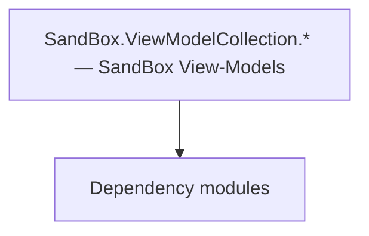

# SandBox.ViewModelCollection.* — SandBox View-Models

**One-line responsibility:** This page covers all 111 business types under `SandBox.ViewModelCollection.* — SandBox View-Models` as a family index, giving each type its namespace, responsibility, and typical timing so you can browse by module instead of alphabetically.

## Mental Model

SandBox.ViewModelCollection.* is the SandBox module’s view-model set covering map (MapSiege/Map.Tracker/Map.Cheat/Map.Incidents/Map), missions (Missions/NameMarker/MainAgentDetection/NameMarker.Targets/Targets.Hideout), nameplate notifications, save/load, game over, tournaments, board games, tutorials, and input. They project SandBox subsystem state into bindable UI data; VMs are only projections, commands only trigger Actions/Behaviors.

## When to Use

To customize data for any SandBox interface, derive from the relevant ViewModelCollection VM; collection VMs should virtualize. Commands only trigger logic.

## Dependencies

The types under `SandBox.ViewModelCollection.* — SandBox View-Models` depend on the following modules; missing any of them causes compile- or run-time failure.

- [ViewModel](../../core-extra/ViewModel)
- [Campaign](../../campaign/Campaign)
- [API Overview](../../_index)

## Type Catalog

| Type | Namespace | Purpose | Timing |
| --- | --- | --- | --- |
| `MapEventVisualTypes` | SandBox.ViewModelCollection | Event or event handler carrying the data of something that happened once. Remember to unsubscribe on unload to avoid leaks. | Campaign init |
| `PerkObjectComparer` | SandBox.ViewModelCollection | A business type under this namespace that carries its derived convention responsibility. Confirm its lifecycle and owning system before calling; do not reference an unready instance at the wrong phase. World-state changes should go through the corresponding Action/Behavior, not direct field mutation. | Campaign init |
| `SandBoxUIHelper` | SandBox.ViewModelCollection | Static helper utility that concentrates a cross-cutting operation (open screen, compute result, resolve entity). Call it from the correct system context; do not instantiate it as stateful. | Campaign init |
| `SortState` | SandBox.ViewModelCollection | A business type under this namespace that carries its derived convention responsibility. Confirm its lifecycle and owning system before calling; do not reference an unready instance at the wrong phase. World-state changes should go through the corresponding Action/Behavior, not direct field mutation. | Campaign init |
| `SPOrderOfBattleVM` | SandBox.ViewModelCollection | Gauntlet UI data view-model that exposes properties and commands to the interface, reacts to input and notifies refreshes. A VM is only a projection of state; commands should only trigger Actions or Behaviors. | Campaign init |
| `SPScoreboardVM` | SandBox.ViewModelCollection | Gauntlet UI data view-model that exposes properties and commands to the interface, reacts to input and notifies refreshes. A VM is only a projection of state; commands should only trigger Actions or Behaviors. | Campaign init |
| `TournamentRewardVM` | SandBox.ViewModelCollection | Gauntlet UI data view-model that exposes properties and commands to the interface, reacts to input and notifies refreshes. A VM is only a projection of state; commands should only trigger Actions or Behaviors. | Campaign init |
| `BoardGameInstructionsVM` | SandBox.ViewModelCollection.BoardGame | Gauntlet UI data view-model that exposes properties and commands to the interface, reacts to input and notifies refreshes. A VM is only a projection of state; commands should only trigger Actions or Behaviors. | Campaign init |
| `BoardGameInstructionVM` | SandBox.ViewModelCollection.BoardGame | Gauntlet UI data view-model that exposes properties and commands to the interface, reacts to input and notifies refreshes. A VM is only a projection of state; commands should only trigger Actions or Behaviors. | Campaign init |
| `BoardGameVM` | SandBox.ViewModelCollection.BoardGame | Gauntlet UI data view-model that exposes properties and commands to the interface, reacts to input and notifies refreshes. A VM is only a projection of state; commands should only trigger Actions or Behaviors. | Campaign init |
| `GameOverStatCategoryVM` | SandBox.ViewModelCollection.GameOver | Gauntlet UI data view-model that exposes properties and commands to the interface, reacts to input and notifies refreshes. A VM is only a projection of state; commands should only trigger Actions or Behaviors. | Campaign init |
| `GameOverStatItemVM` | SandBox.ViewModelCollection.GameOver | Gauntlet UI data view-model that exposes properties and commands to the interface, reacts to input and notifies refreshes. A VM is only a projection of state; commands should only trigger Actions or Behaviors. | Campaign init |
| `GameOverStatsProvider` | SandBox.ViewModelCollection.GameOver | Gauntlet image-source abstraction that resolves an entity/concept into an actual texture and caches it. The first frame may be empty; handle the loading state. | Campaign init |
| `GameOverVM` | SandBox.ViewModelCollection.GameOver | Gauntlet UI data view-model that exposes properties and commands to the interface, reacts to input and notifies refreshes. A VM is only a projection of state; commands should only trigger Actions or Behaviors. | Campaign init |
| `StatCategory` | SandBox.ViewModelCollection.GameOver | A business type under this namespace that carries its derived convention responsibility. Confirm its lifecycle and owning system before calling; do not reference an unready instance at the wrong phase. World-state changes should go through the corresponding Action/Behavior, not direct field mutation. | Campaign init |
| `StatItem` | SandBox.ViewModelCollection.GameOver | A business type under this namespace that carries its derived convention responsibility. Confirm its lifecycle and owning system before calling; do not reference an unready instance at the wrong phase. World-state changes should go through the corresponding Action/Behavior, not direct field mutation. | Campaign init |
| `StatType` | SandBox.ViewModelCollection.GameOver | A business type under this namespace that carries its derived convention responsibility. Confirm its lifecycle and owning system before calling; do not reference an unready instance at the wrong phase. World-state changes should go through the corresponding Action/Behavior, not direct field mutation. | Campaign init |
| `InputKeyItemVM` | SandBox.ViewModelCollection.Input | Gauntlet UI data view-model that exposes properties and commands to the interface, reacts to input and notifies refreshes. A VM is only a projection of state; commands should only trigger Actions or Behaviors. | Campaign init |
| `MapEventVisualItemVM` | SandBox.ViewModelCollection.Map | Gauntlet UI data view-model that exposes properties and commands to the interface, reacts to input and notifies refreshes. A VM is only a projection of state; commands should only trigger Actions or Behaviors. | Campaign init |
| `MapEventVisualsVM` | SandBox.ViewModelCollection.Map | Gauntlet UI data view-model that exposes properties and commands to the interface, reacts to input and notifies refreshes. A VM is only a projection of state; commands should only trigger Actions or Behaviors. | Campaign init |
| `CheatActionItemVM` | SandBox.ViewModelCollection.Map.Cheat | Gauntlet UI data view-model that exposes properties and commands to the interface, reacts to input and notifies refreshes. A VM is only a projection of state; commands should only trigger Actions or Behaviors. | Campaign init |
| `CheatGroupItemVM` | SandBox.ViewModelCollection.Map.Cheat | Gauntlet UI data view-model that exposes properties and commands to the interface, reacts to input and notifies refreshes. A VM is only a projection of state; commands should only trigger Actions or Behaviors. | Campaign init |
| `CheatItemBaseVM` | SandBox.ViewModelCollection.Map.Cheat | Gauntlet UI data view-model that exposes properties and commands to the interface, reacts to input and notifies refreshes. A VM is only a projection of state; commands should only trigger Actions or Behaviors. | Campaign init |
| `GameplayCheatsVM` | SandBox.ViewModelCollection.Map.Cheat | Gauntlet UI data view-model that exposes properties and commands to the interface, reacts to input and notifies refreshes. A VM is only a projection of state; commands should only trigger Actions or Behaviors. | Campaign init |
| `MapIncidentOptionVM` | SandBox.ViewModelCollection.Map.Incidents | Gauntlet UI data view-model that exposes properties and commands to the interface, reacts to input and notifies refreshes. A VM is only a projection of state; commands should only trigger Actions or Behaviors. | Campaign init |
| `MapIncidentVM` | SandBox.ViewModelCollection.Map.Incidents | Gauntlet UI data view-model that exposes properties and commands to the interface, reacts to input and notifies refreshes. A VM is only a projection of state; commands should only trigger Actions or Behaviors. | Campaign init |
| `MapArmyTrackItemVM` | SandBox.ViewModelCollection.Map.Tracker | Gauntlet UI data view-model that exposes properties and commands to the interface, reacts to input and notifies refreshes. A VM is only a projection of state; commands should only trigger Actions or Behaviors. | Campaign init |
| `MapMarkerTrackerItemVM` | SandBox.ViewModelCollection.Map.Tracker | Gauntlet UI data view-model that exposes properties and commands to the interface, reacts to input and notifies refreshes. A VM is only a projection of state; commands should only trigger Actions or Behaviors. | Campaign init |
| `MapMobilePartyTrackItemVM` | SandBox.ViewModelCollection.Map.Tracker | Gauntlet UI data view-model that exposes properties and commands to the interface, reacts to input and notifies refreshes. A VM is only a projection of state; commands should only trigger Actions or Behaviors. | Campaign init |
| `MapTrackerCollectionVM` | SandBox.ViewModelCollection.Map.Tracker | Gauntlet UI data view-model that exposes properties and commands to the interface, reacts to input and notifies refreshes. A VM is only a projection of state; commands should only trigger Actions or Behaviors. | Campaign init |
| `MapTrackerProvider` | SandBox.ViewModelCollection.Map.Tracker | Gauntlet image-source abstraction that resolves an entity/concept into an actual texture and caches it. The first frame may be empty; handle the loading state. | Campaign init |
| `MachineTypes` | SandBox.ViewModelCollection.MapSiege | A business type under this namespace that carries its derived convention responsibility. Confirm its lifecycle and owning system before calling; do not reference an unready instance at the wrong phase. World-state changes should go through the corresponding Action/Behavior, not direct field mutation. | Campaign init |
| `MapSiegePOIVM` | SandBox.ViewModelCollection.MapSiege | Gauntlet UI data view-model that exposes properties and commands to the interface, reacts to input and notifies refreshes. A VM is only a projection of state; commands should only trigger Actions or Behaviors. | Campaign init |
| `MapSiegeProductionMachineVM` | SandBox.ViewModelCollection.MapSiege | Gauntlet UI data view-model that exposes properties and commands to the interface, reacts to input and notifies refreshes. A VM is only a projection of state; commands should only trigger Actions or Behaviors. | Campaign init |
| `MapSiegeProductionVM` | SandBox.ViewModelCollection.MapSiege | Gauntlet UI data view-model that exposes properties and commands to the interface, reacts to input and notifies refreshes. A VM is only a projection of state; commands should only trigger Actions or Behaviors. | Campaign init |
| `MapSiegeVM` | SandBox.ViewModelCollection.MapSiege | Gauntlet UI data view-model that exposes properties and commands to the interface, reacts to input and notifies refreshes. A VM is only a projection of state; commands should only trigger Actions or Behaviors. | Campaign init |
| `PlayerStartEngineConstructionEvent` | SandBox.ViewModelCollection.MapSiege | Event or event handler carrying the data of something that happened once. Remember to unsubscribe on unload to avoid leaks. | Campaign init |
| `POIType` | SandBox.ViewModelCollection.MapSiege | A business type under this namespace that carries its derived convention responsibility. Confirm its lifecycle and owning system before calling; do not reference an unready instance at the wrong phase. World-state changes should go through the corresponding Action/Behavior, not direct field mutation. | Campaign init |
| `SiegePOIDistanceComparer` | SandBox.ViewModelCollection.MapSiege | A business type under this namespace that carries its derived convention responsibility. Confirm its lifecycle and owning system before calling; do not reference an unready instance at the wrong phase. World-state changes should go through the corresponding Action/Behavior, not direct field mutation. | Campaign init |
| `MissionAgentAlarmStateVM` | SandBox.ViewModelCollection.Missions | Gauntlet UI data view-model that exposes properties and commands to the interface, reacts to input and notifies refreshes. A VM is only a projection of state; commands should only trigger Actions or Behaviors. | On battle/mission load |
| `MissionAgentAlarmTargetVM` | SandBox.ViewModelCollection.Missions | Gauntlet UI data view-model that exposes properties and commands to the interface, reacts to input and notifies refreshes. A VM is only a projection of state; commands should only trigger Actions or Behaviors. | On battle/mission load |
| `MissionArenaPracticeFightVM` | SandBox.ViewModelCollection.Missions | Gauntlet UI data view-model that exposes properties and commands to the interface, reacts to input and notifies refreshes. A VM is only a projection of state; commands should only trigger Actions or Behaviors. | On battle/mission load |
| `MissionQuestBarVM` | SandBox.ViewModelCollection.Missions | Gauntlet UI data view-model that exposes properties and commands to the interface, reacts to input and notifies refreshes. A VM is only a projection of state; commands should only trigger Actions or Behaviors. | On battle/mission load |
| `AgentAlarmStateEnum` | SandBox.ViewModelCollection.Missions.MainAgentDetection | A business type under this namespace that carries its derived convention responsibility. Confirm its lifecycle and owning system before calling; do not reference an unready instance at the wrong phase. World-state changes should go through the corresponding Action/Behavior, not direct field mutation. | On battle/mission load |
| `AgentStealthOffenseType` | SandBox.ViewModelCollection.Missions.MainAgentDetection | A business type under this namespace that carries its derived convention responsibility. Confirm its lifecycle and owning system before calling; do not reference an unready instance at the wrong phase. World-state changes should go through the corresponding Action/Behavior, not direct field mutation. | On battle/mission load |
| `MainAgentDetectionVM` | SandBox.ViewModelCollection.Missions.MainAgentDetection | Gauntlet UI data view-model that exposes properties and commands to the interface, reacts to input and notifies refreshes. A VM is only a projection of state; commands should only trigger Actions or Behaviors. | On battle/mission load |
| `MissionDisguiseMarkerItemVM` | SandBox.ViewModelCollection.Missions.MainAgentDetection | Gauntlet UI data view-model that exposes properties and commands to the interface, reacts to input and notifies refreshes. A VM is only a projection of state; commands should only trigger Actions or Behaviors. | On battle/mission load |
| `MissionDisguiseMarkersVM` | SandBox.ViewModelCollection.Missions.MainAgentDetection | Gauntlet UI data view-model that exposes properties and commands to the interface, reacts to input and notifies refreshes. A VM is only a projection of state; commands should only trigger Actions or Behaviors. | On battle/mission load |
| `MissionLosingTargetVM` | SandBox.ViewModelCollection.Missions.MainAgentDetection | Gauntlet UI data view-model that exposes properties and commands to the interface, reacts to input and notifies refreshes. A VM is only a projection of state; commands should only trigger Actions or Behaviors. | On battle/mission load |
| `INameMarkerProviderContext` | SandBox.ViewModelCollection.Missions.NameMarker | Gauntlet image-source abstraction that resolves an entity/concept into an actual texture and caches it. The first frame may be empty; handle the loading state. | On battle/mission load |
| `MissionNameMarkerFactory` | SandBox.ViewModelCollection.Missions.NameMarker | A business type under this namespace that carries its derived convention responsibility. Confirm its lifecycle and owning system before calling; do not reference an unready instance at the wrong phase. World-state changes should go through the corresponding Action/Behavior, not direct field mutation. | On battle/mission load |
| `MissionNameMarkerHelper` | SandBox.ViewModelCollection.Missions.NameMarker | Static helper utility that concentrates a cross-cutting operation (open screen, compute result, resolve entity). Call it from the correct system context; do not instantiate it as stateful. | On battle/mission load |
| `MissionNameMarkerProvider` | SandBox.ViewModelCollection.Missions.NameMarker | Gauntlet image-source abstraction that resolves an entity/concept into an actual texture and caches it. The first frame may be empty; handle the loading state. | On battle/mission load |
| `MissionNameMarkerTargetBaseVM` | SandBox.ViewModelCollection.Missions.NameMarker | Gauntlet UI data view-model that exposes properties and commands to the interface, reacts to input and notifies refreshes. A VM is only a projection of state; commands should only trigger Actions or Behaviors. | On battle/mission load |
| `MissionNameMarkerTargetVM` | SandBox.ViewModelCollection.Missions.NameMarker | Gauntlet UI data view-model that exposes properties and commands to the interface, reacts to input and notifies refreshes. A VM is only a projection of state; commands should only trigger Actions or Behaviors. | On battle/mission load |
| `MissionNameMarkerToggleEvent` | SandBox.ViewModelCollection.Missions.NameMarker | Event or event handler carrying the data of something that happened once. Remember to unsubscribe on unload to avoid leaks. | On battle/mission load |
| `MissionNameMarkerVM` | SandBox.ViewModelCollection.Missions.NameMarker | Gauntlet UI data view-model that exposes properties and commands to the interface, reacts to input and notifies refreshes. A VM is only a projection of state; commands should only trigger Actions or Behaviors. | On battle/mission load |
| `MissionAgentMarkerTargetVM` | SandBox.ViewModelCollection.Missions.NameMarker.Targets | Gauntlet UI data view-model that exposes properties and commands to the interface, reacts to input and notifies refreshes. A VM is only a projection of state; commands should only trigger Actions or Behaviors. | On battle/mission load |
| `MissionAnimatedBasicAreaIndicatorMarkerTargetVM` | SandBox.ViewModelCollection.Missions.NameMarker.Targets | Gauntlet UI data view-model that exposes properties and commands to the interface, reacts to input and notifies refreshes. A VM is only a projection of state; commands should only trigger Actions or Behaviors. | On battle/mission load |
| `MissionBasicAreaIndicatorMarkerTargetVM` | SandBox.ViewModelCollection.Missions.NameMarker.Targets | Gauntlet UI data view-model that exposes properties and commands to the interface, reacts to input and notifies refreshes. A VM is only a projection of state; commands should only trigger Actions or Behaviors. | On battle/mission load |
| `MissionCommonAreaMarkerTargetVM` | SandBox.ViewModelCollection.Missions.NameMarker.Targets | Gauntlet UI data view-model that exposes properties and commands to the interface, reacts to input and notifies refreshes. A VM is only a projection of state; commands should only trigger Actions or Behaviors. | On battle/mission load |
| `MissionGenericMarkerTargetVM` | SandBox.ViewModelCollection.Missions.NameMarker.Targets | Gauntlet UI data view-model that exposes properties and commands to the interface, reacts to input and notifies refreshes. A VM is only a projection of state; commands should only trigger Actions or Behaviors. | On battle/mission load |
| `MissionPassageUsePointNameMarkerTargetVM` | SandBox.ViewModelCollection.Missions.NameMarker.Targets | Gauntlet UI data view-model that exposes properties and commands to the interface, reacts to input and notifies refreshes. A VM is only a projection of state; commands should only trigger Actions or Behaviors. | On battle/mission load |
| `MissionWorkshopNameMarkerTargetVM` | SandBox.ViewModelCollection.Missions.NameMarker.Targets | Gauntlet UI data view-model that exposes properties and commands to the interface, reacts to input and notifies refreshes. A VM is only a projection of state; commands should only trigger Actions or Behaviors. | On battle/mission load |
| `MissionStealthAreaNameMarkerTargetVM` | SandBox.ViewModelCollection.Missions.NameMarker.Targets.Hideout | Gauntlet UI data view-model that exposes properties and commands to the interface, reacts to input and notifies refreshes. A VM is only a projection of state; commands should only trigger Actions or Behaviors. | On battle/mission load |
| `MissionStealthAreaUsePointNameMarkerTargetVM` | SandBox.ViewModelCollection.Missions.NameMarker.Targets.Hideout | Gauntlet UI data view-model that exposes properties and commands to the interface, reacts to input and notifies refreshes. A VM is only a projection of state; commands should only trigger Actions or Behaviors. | On battle/mission load |
| `MissionStealthFailCounterVM` | SandBox.ViewModelCollection.Missions.NameMarker.Targets.Hideout | Gauntlet UI data view-model that exposes properties and commands to the interface, reacts to input and notifies refreshes. A VM is only a projection of state; commands should only trigger Actions or Behaviors. | On battle/mission load |
| `MissionStealthSentryNameMarkerTargetVM` | SandBox.ViewModelCollection.Missions.NameMarker.Targets.Hideout | Gauntlet UI data view-model that exposes properties and commands to the interface, reacts to input and notifies refreshes. A VM is only a projection of state; commands should only trigger Actions or Behaviors. | On battle/mission load |
| `IssueTypes` | SandBox.ViewModelCollection.Nameplate | Issue (lord/fief affair) related type describing an accept-and-settle fief problem. Completion must be idempotent. | Campaign init |
| `MainQuestTypes` | SandBox.ViewModelCollection.Nameplate | AI decision implementation that must be interruptible and serializable to support saving and undo. Search must be depth/time bounded to avoid stalls. | Campaign init |
| `NameplateSize` | SandBox.ViewModelCollection.Nameplate | A business type under this namespace that carries its derived convention responsibility. Confirm its lifecycle and owning system before calling; do not reference an unready instance at the wrong phase. World-state changes should go through the corresponding Action/Behavior, not direct field mutation. | Campaign init |
| `NameplateVM` | SandBox.ViewModelCollection.Nameplate | Gauntlet UI data view-model that exposes properties and commands to the interface, reacts to input and notifies refreshes. A VM is only a projection of state; commands should only trigger Actions or Behaviors. | Campaign init |
| `PartyMarkerItemComparer` | SandBox.ViewModelCollection.Nameplate | A business type under this namespace that carries its derived convention responsibility. Confirm its lifecycle and owning system before calling; do not reference an unready instance at the wrong phase. World-state changes should go through the corresponding Action/Behavior, not direct field mutation. | Campaign init |
| `PartyNameplatesVM` | SandBox.ViewModelCollection.Nameplate | Gauntlet UI data view-model that exposes properties and commands to the interface, reacts to input and notifies refreshes. A VM is only a projection of state; commands should only trigger Actions or Behaviors. | Campaign init |
| `PartyNameplateVM` | SandBox.ViewModelCollection.Nameplate | Gauntlet UI data view-model that exposes properties and commands to the interface, reacts to input and notifies refreshes. A VM is only a projection of state; commands should only trigger Actions or Behaviors. | Campaign init |
| `PartyPlayerNameplateVM` | SandBox.ViewModelCollection.Nameplate | Gauntlet UI data view-model that exposes properties and commands to the interface, reacts to input and notifies refreshes. A VM is only a projection of state; commands should only trigger Actions or Behaviors. | Campaign init |
| `RelationType` | SandBox.ViewModelCollection.Nameplate | A business type under this namespace that carries its derived convention responsibility. Confirm its lifecycle and owning system before calling; do not reference an unready instance at the wrong phase. World-state changes should go through the corresponding Action/Behavior, not direct field mutation. | Campaign init |
| `SettlementEventType` | SandBox.ViewModelCollection.Nameplate | Event or event handler carrying the data of something that happened once. Remember to unsubscribe on unload to avoid leaks. | Campaign init |
| `SettlementNameplateEventItemVM` | SandBox.ViewModelCollection.Nameplate | Gauntlet UI data view-model that exposes properties and commands to the interface, reacts to input and notifies refreshes. A VM is only a projection of state; commands should only trigger Actions or Behaviors. | Campaign init |
| `SettlementNameplateEventsVM` | SandBox.ViewModelCollection.Nameplate | Gauntlet UI data view-model that exposes properties and commands to the interface, reacts to input and notifies refreshes. A VM is only a projection of state; commands should only trigger Actions or Behaviors. | Campaign init |
| `SettlementNameplatePartyMarkerItemVM` | SandBox.ViewModelCollection.Nameplate | Gauntlet UI data view-model that exposes properties and commands to the interface, reacts to input and notifies refreshes. A VM is only a projection of state; commands should only trigger Actions or Behaviors. | Campaign init |
| `SettlementNameplatePartyMarkersVM` | SandBox.ViewModelCollection.Nameplate | Gauntlet UI data view-model that exposes properties and commands to the interface, reacts to input and notifies refreshes. A VM is only a projection of state; commands should only trigger Actions or Behaviors. | Campaign init |
| `SettlementNameplatesVM` | SandBox.ViewModelCollection.Nameplate | Gauntlet UI data view-model that exposes properties and commands to the interface, reacts to input and notifies refreshes. A VM is only a projection of state; commands should only trigger Actions or Behaviors. | Campaign init |
| `SettlementNameplateVM` | SandBox.ViewModelCollection.Nameplate | Gauntlet UI data view-model that exposes properties and commands to the interface, reacts to input and notifies refreshes. A VM is only a projection of state; commands should only trigger Actions or Behaviors. | Campaign init |
| `Type` | SandBox.ViewModelCollection.Nameplate | A business type under this namespace that carries its derived convention responsibility. Confirm its lifecycle and owning system before calling; do not reference an unready instance at the wrong phase. World-state changes should go through the corresponding Action/Behavior, not direct field mutation. | Campaign init |
| `SettlementNotificationItemBaseVM` | SandBox.ViewModelCollection.Nameplate.NameplateNotifications | Gauntlet UI data view-model that exposes properties and commands to the interface, reacts to input and notifies refreshes. A VM is only a projection of state; commands should only trigger Actions or Behaviors. | Campaign init |
| `CaravanTransactionNotificationItemVM` | SandBox.ViewModelCollection.Nameplate.NameplateNotifications.SettlementNotificationTypes | Gauntlet UI data view-model that exposes properties and commands to the interface, reacts to input and notifies refreshes. A VM is only a projection of state; commands should only trigger Actions or Behaviors. | Campaign init |
| `IssueSolvedByLordNotificationItemVM` | SandBox.ViewModelCollection.Nameplate.NameplateNotifications.SettlementNotificationTypes | Gauntlet UI data view-model that exposes properties and commands to the interface, reacts to input and notifies refreshes. A VM is only a projection of state; commands should only trigger Actions or Behaviors. | Campaign init |
| `ItemSoldNotificationItemVM` | SandBox.ViewModelCollection.Nameplate.NameplateNotifications.SettlementNotificationTypes | Gauntlet UI data view-model that exposes properties and commands to the interface, reacts to input and notifies refreshes. A VM is only a projection of state; commands should only trigger Actions or Behaviors. | Campaign init |
| `PrisonerSoldNotificationItemVM` | SandBox.ViewModelCollection.Nameplate.NameplateNotifications.SettlementNotificationTypes | Gauntlet UI data view-model that exposes properties and commands to the interface, reacts to input and notifies refreshes. A VM is only a projection of state; commands should only trigger Actions or Behaviors. | Campaign init |
| `SettlementNameplateNotificationsVM` | SandBox.ViewModelCollection.Nameplate.NameplateNotifications.SettlementNotificationTypes | Gauntlet UI data view-model that exposes properties and commands to the interface, reacts to input and notifies refreshes. A VM is only a projection of state; commands should only trigger Actions or Behaviors. | Campaign init |
| `ShipSoldNotificationItemVM` | SandBox.ViewModelCollection.Nameplate.NameplateNotifications.SettlementNotificationTypes | Gauntlet UI data view-model that exposes properties and commands to the interface, reacts to input and notifies refreshes. A VM is only a projection of state; commands should only trigger Actions or Behaviors. | Campaign init |
| `TroopGivenToSettlementNotificationItemVM` | SandBox.ViewModelCollection.Nameplate.NameplateNotifications.SettlementNotificationTypes | Gauntlet UI data view-model that exposes properties and commands to the interface, reacts to input and notifies refreshes. A VM is only a projection of state; commands should only trigger Actions or Behaviors. | Campaign init |
| `TroopRecruitmentNotificationItemVM` | SandBox.ViewModelCollection.Nameplate.NameplateNotifications.SettlementNotificationTypes | Gauntlet UI data view-model that exposes properties and commands to the interface, reacts to input and notifies refreshes. A VM is only a projection of state; commands should only trigger Actions or Behaviors. | Campaign init |
| `MapSaveVM` | SandBox.ViewModelCollection.SaveLoad | Gauntlet UI data view-model that exposes properties and commands to the interface, reacts to input and notifies refreshes. A VM is only a projection of state; commands should only trigger Actions or Behaviors. | Campaign init |
| `SavedGameGroupVM` | SandBox.ViewModelCollection.SaveLoad | Gauntlet UI data view-model that exposes properties and commands to the interface, reacts to input and notifies refreshes. A VM is only a projection of state; commands should only trigger Actions or Behaviors. | Campaign init |
| `SavedGameModuleInfoVM` | SandBox.ViewModelCollection.SaveLoad | Gauntlet UI data view-model that exposes properties and commands to the interface, reacts to input and notifies refreshes. A VM is only a projection of state; commands should only trigger Actions or Behaviors. | Campaign init |
| `SavedGameProperty` | SandBox.ViewModelCollection.SaveLoad | A business type under this namespace that carries its derived convention responsibility. Confirm its lifecycle and owning system before calling; do not reference an unready instance at the wrong phase. World-state changes should go through the corresponding Action/Behavior, not direct field mutation. | Campaign init |
| `SavedGamePropertyVM` | SandBox.ViewModelCollection.SaveLoad | Gauntlet UI data view-model that exposes properties and commands to the interface, reacts to input and notifies refreshes. A VM is only a projection of state; commands should only trigger Actions or Behaviors. | Campaign init |
| `SavedGameVM` | SandBox.ViewModelCollection.SaveLoad | Gauntlet UI data view-model that exposes properties and commands to the interface, reacts to input and notifies refreshes. A VM is only a projection of state; commands should only trigger Actions or Behaviors. | Campaign init |
| `SaveLoadVM` | SandBox.ViewModelCollection.SaveLoad | Gauntlet UI data view-model that exposes properties and commands to the interface, reacts to input and notifies refreshes. A VM is only a projection of state; commands should only trigger Actions or Behaviors. | Campaign init |
| `TournamentMatchState` | SandBox.ViewModelCollection.Tournament | Tournament-related type organizing event sign-up, brackets and reward settlement. State must be serializable. | Campaign init |
| `TournamentMatchVM` | SandBox.ViewModelCollection.Tournament | Gauntlet UI data view-model that exposes properties and commands to the interface, reacts to input and notifies refreshes. A VM is only a projection of state; commands should only trigger Actions or Behaviors. | Campaign init |
| `TournamentParticipantVM` | SandBox.ViewModelCollection.Tournament | Gauntlet UI data view-model that exposes properties and commands to the interface, reacts to input and notifies refreshes. A VM is only a projection of state; commands should only trigger Actions or Behaviors. | Campaign init |
| `TournamentPlayerState` | SandBox.ViewModelCollection.Tournament | Tournament-related type organizing event sign-up, brackets and reward settlement. State must be serializable. | Campaign init |
| `TournamentRoundVM` | SandBox.ViewModelCollection.Tournament | Gauntlet UI data view-model that exposes properties and commands to the interface, reacts to input and notifies refreshes. A VM is only a projection of state; commands should only trigger Actions or Behaviors. | Campaign init |
| `TournamentTeamVM` | SandBox.ViewModelCollection.Tournament | Gauntlet UI data view-model that exposes properties and commands to the interface, reacts to input and notifies refreshes. A VM is only a projection of state; commands should only trigger Actions or Behaviors. | Campaign init |
| `TournamentVM` | SandBox.ViewModelCollection.Tournament | Gauntlet UI data view-model that exposes properties and commands to the interface, reacts to input and notifies refreshes. A VM is only a projection of state; commands should only trigger Actions or Behaviors. | Campaign init |
| `ItemPlacements` | SandBox.ViewModelCollection.Tutorial | A business type under this namespace that carries its derived convention responsibility. Confirm its lifecycle and owning system before calling; do not reference an unready instance at the wrong phase. World-state changes should go through the corresponding Action/Behavior, not direct field mutation. | Campaign init |
| `TutorialItemVM` | SandBox.ViewModelCollection.Tutorial | Gauntlet UI data view-model that exposes properties and commands to the interface, reacts to input and notifies refreshes. A VM is only a projection of state; commands should only trigger Actions or Behaviors. | Campaign init |
| `TutorialVM` | SandBox.ViewModelCollection.Tutorial | Gauntlet UI data view-model that exposes properties and commands to the interface, reacts to input and notifies refreshes. A VM is only a projection of state; commands should only trigger Actions or Behaviors. | Campaign init |

## Risk & Boundaries

VMs hold no rules; mutating state in a VM breaks the single source of truth. Map/nameplate elements bound per-item need virtualization and on-demand loading. Throttle refreshes to avoid per-frame GC.

## See Also

- [ViewModel](../../core-extra/ViewModel)
- [Campaign](../../campaign/Campaign)
- [API Overview](../../_index)
