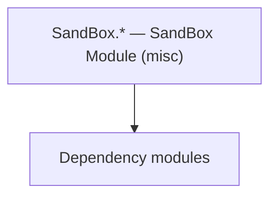

# SandBox.* — SandBox Module (misc)

**One-line responsibility:** This page covers all 28 business types under `SandBox.* — SandBox Module (misc)` as a family index, giving each type its namespace, responsibility, and typical timing so you can browse by module instead of alphabetically.

## Mental Model

This collects the remaining SandBox module types not covered by a dedicated group above: the SandBox root, AI, board games, objects, views, mission logics, tournaments, and various gameplay helpers. They are the concrete gameplay implementations of the SandBox module layered on top of the core Campaign/Mission systems.

## When to Use

Reach for these SandBox types to extend concrete gameplay (props, missions, tournaments, AI, helpers); keep world mutations inside Actions.

## Dependencies

The types under `SandBox.* — SandBox Module (misc)` depend on the following modules; missing any of them causes compile- or run-time failure.

- [Campaign](../../campaign/Campaign)
- [Mission](../../mission/Mission)
- [API Overview](../../_index)

## Type Catalog

| Type | Namespace | Purpose | Timing |
| --- | --- | --- | --- |
| `AlleyCampaignBehavior` | SandBox.CampaignBehaviors | Campaign-system behavior that listens to global events to drive that system’s initialization and periodic updates. It is the main entry point for mods to inject gameplay; do not mutate world state directly outside a behavior. | Campaign init |
| `AlleyCampaignBehaviorTypeDefiner` | SandBox.CampaignBehaviors | Campaign-system behavior that listens to global events to drive that system’s initialization and periodic updates. It is the main entry point for mods to inject gameplay; do not mutate world state directly outside a behavior. | Campaign init |
| `ArenaMasterCampaignBehavior` | SandBox.CampaignBehaviors | Campaign-system behavior that listens to global events to drive that system’s initialization and periodic updates. It is the main entry point for mods to inject gameplay; do not mutate world state directly outside a behavior. | Campaign init |
| `BarberCampaignBehavior` | SandBox.CampaignBehaviors | Campaign-system behavior that listens to global events to drive that system’s initialization and periodic updates. It is the main entry point for mods to inject gameplay; do not mutate world state directly outside a behavior. | Campaign init |
| `BoardGameCampaignBehavior` | SandBox.CampaignBehaviors | Campaign-system behavior that listens to global events to drive that system’s initialization and periodic updates. It is the main entry point for mods to inject gameplay; do not mutate world state directly outside a behavior. | Campaign init |
| `CheckpointCampaignBehavior` | SandBox.CampaignBehaviors | Campaign-system behavior that listens to global events to drive that system’s initialization and periodic updates. It is the main entry point for mods to inject gameplay; do not mutate world state directly outside a behavior. | Campaign init |
| `ClanMemberRolesCampaignBehavior` | SandBox.CampaignBehaviors | Campaign-system behavior that listens to global events to drive that system’s initialization and periodic updates. It is the main entry point for mods to inject gameplay; do not mutate world state directly outside a behavior. | Campaign init |
| `CommonTownsfolkCampaignBehavior` | SandBox.CampaignBehaviors | Campaign-system behavior that listens to global events to drive that system’s initialization and periodic updates. It is the main entry point for mods to inject gameplay; do not mutate world state directly outside a behavior. | Campaign init |
| `CommonVillagersCampaignBehavior` | SandBox.CampaignBehaviors | Campaign-system behavior that listens to global events to drive that system’s initialization and periodic updates. It is the main entry point for mods to inject gameplay; do not mutate world state directly outside a behavior. | Campaign init |
| `CompanionDismissCampaignBehavior` | SandBox.CampaignBehaviors | Campaign-system behavior that listens to global events to drive that system’s initialization and periodic updates. It is the main entry point for mods to inject gameplay; do not mutate world state directly outside a behavior. | Campaign init |
| `ConversationAnimationToolCampaignBehavior` | SandBox.CampaignBehaviors | Campaign-system behavior that listens to global events to drive that system’s initialization and periodic updates. It is the main entry point for mods to inject gameplay; do not mutate world state directly outside a behavior. | Campaign init |
| `DefaultCutscenesCampaignBehavior` | SandBox.CampaignBehaviors | Campaign-system behavior that listens to global events to drive that system’s initialization and periodic updates. It is the main entry point for mods to inject gameplay; do not mutate world state directly outside a behavior. | Campaign init |
| `DefaultNotificationsCampaignBehavior` | SandBox.CampaignBehaviors | Campaign-system behavior that listens to global events to drive that system’s initialization and periodic updates. It is the main entry point for mods to inject gameplay; do not mutate world state directly outside a behavior. | Campaign init |
| `DumpIntegrityCampaignBehavior` | SandBox.CampaignBehaviors | Campaign-system behavior that listens to global events to drive that system’s initialization and periodic updates. It is the main entry point for mods to inject gameplay; do not mutate world state directly outside a behavior. | Campaign init |
| `GuardsCampaignBehavior` | SandBox.CampaignBehaviors | Campaign-system behavior that listens to global events to drive that system’s initialization and periodic updates. It is the main entry point for mods to inject gameplay; do not mutate world state directly outside a behavior. | Campaign init |
| `HeirSelectionCampaignBehavior` | SandBox.CampaignBehaviors | Campaign-system behavior that listens to global events to drive that system’s initialization and periodic updates. It is the main entry point for mods to inject gameplay; do not mutate world state directly outside a behavior. | Campaign init |
| `HideoutConversationsCampaignBehavior` | SandBox.CampaignBehaviors | Campaign-system behavior that listens to global events to drive that system’s initialization and periodic updates. It is the main entry point for mods to inject gameplay; do not mutate world state directly outside a behavior. | Campaign init |
| `PlayerAlleyData` | SandBox.CampaignBehaviors | A business type under this namespace that carries its derived convention responsibility. Confirm its lifecycle and owning system before calling; do not reference an unready instance at the wrong phase. World-state changes should go through the corresponding Action/Behavior, not direct field mutation. | Campaign init |
| `PrisonBreakCampaignBehavior` | SandBox.CampaignBehaviors | Campaign-system behavior that listens to global events to drive that system’s initialization and periodic updates. It is the main entry point for mods to inject gameplay; do not mutate world state directly outside a behavior. | Campaign init |
| `RecruitmentAgentSpawnBehavior` | SandBox.CampaignBehaviors | Board-game piece description with attributes and movement rules. State must be fully serializable to reconstruct the match. | Campaign init |
| `RetirementCampaignBehavior` | SandBox.CampaignBehaviors | Campaign-system behavior that listens to global events to drive that system’s initialization and periodic updates. It is the main entry point for mods to inject gameplay; do not mutate world state directly outside a behavior. | Campaign init |
| `SettlementMusiciansCampaignBehavior` | SandBox.CampaignBehaviors | Campaign-system behavior that listens to global events to drive that system’s initialization and periodic updates. It is the main entry point for mods to inject gameplay; do not mutate world state directly outside a behavior. | Campaign init |
| `StatisticsCampaignBehavior` | SandBox.CampaignBehaviors | Campaign-system behavior that listens to global events to drive that system’s initialization and periodic updates. It is the main entry point for mods to inject gameplay; do not mutate world state directly outside a behavior. | Campaign init |
| `StealthCharactersCampaignBehavior` | SandBox.CampaignBehaviors | Campaign-system behavior that listens to global events to drive that system’s initialization and periodic updates. It is the main entry point for mods to inject gameplay; do not mutate world state directly outside a behavior. | Campaign init |
| `TavernEmployeesCampaignBehavior` | SandBox.CampaignBehaviors | Campaign-system behavior that listens to global events to drive that system’s initialization and periodic updates. It is the main entry point for mods to inject gameplay; do not mutate world state directly outside a behavior. | Campaign init |
| `TownMerchantsCampaignBehavior` | SandBox.CampaignBehaviors | Campaign-system behavior that listens to global events to drive that system’s initialization and periodic updates. It is the main entry point for mods to inject gameplay; do not mutate world state directly outside a behavior. | Campaign init |
| `TradersCampaignBehavior` | SandBox.CampaignBehaviors | Campaign-system behavior that listens to global events to drive that system’s initialization and periodic updates. It is the main entry point for mods to inject gameplay; do not mutate world state directly outside a behavior. | Campaign init |
| `BoardGameAgentBehavior` | SandBox.Source.Missions.AgentBehaviors | Battle agent AI behavior that makes decisions and executes actions inside a Mission. Its lifetime follows the Agent’s life and death; you must clean up after the Agent dies. | On battle/mission load |

## Risk & Boundaries

SandBox types follow their owning system’s lifecycle; reference only when ready. Scene objects depend on load order; missions depend on listener registration. World changes go through Actions/Behaviors.

## See Also

- [Campaign](../../campaign/Campaign)
- [Mission](../../mission/Mission)
- [API Overview](../../_index)
