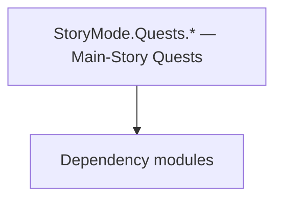

# StoryMode.Quests.* — Main-Story Quests

**One-line responsibility:** This page covers all 38 business types under `StoryMode.Quests.* — Main-Story Quests` as a family index, giving each type its namespace, responsibility, and typical timing so you can browse by module instead of alphabetically.

## Mental Model

StoryMode.Quests.* implements the quest types of the main story (StoryMode): the phased quest chains (FirstPhase/SecondPhase/ThirdPhase, ConspiracyQuests, TutorialPhase, PlayerClanQuests) and QuestTasks. They drive narrative progression in cooperation with CampaignBehavior and settle through events, not by writing rules directly.

## When to Use

To extend or add a main-story quest stage, derive from the relevant quest type and register it with the QuestManager; quest flow is driven via events and Behaviors.

## Dependencies

The types under `StoryMode.Quests.* — Main-Story Quests` depend on the following modules; missing any of them causes compile- or run-time failure.

- [Campaign](../../campaign/Campaign)
- [API Overview](../../_index)

## Type Catalog

| Type | Namespace | Purpose | Timing |
| --- | --- | --- | --- |
| `ArzagosBannerPieceQuest` | StoryMode.Quests.FirstPhase | A business type under this namespace that carries its derived convention responsibility. Confirm its lifecycle and owning system before calling; do not reference an unready instance at the wrong phase. World-state changes should go through the corresponding Action/Behavior, not direct field mutation. | During story progress |
| `AssembleTheBannerQuest` | StoryMode.Quests.FirstPhase | A business type under this namespace that carries its derived convention responsibility. Confirm its lifecycle and owning system before calling; do not reference an unready instance at the wrong phase. World-state changes should go through the corresponding Action/Behavior, not direct field mutation. | During story progress |
| `BannerInvestigationQuest` | StoryMode.Quests.FirstPhase | A business type under this namespace that carries its derived convention responsibility. Confirm its lifecycle and owning system before calling; do not reference an unready instance at the wrong phase. World-state changes should go through the corresponding Action/Behavior, not direct field mutation. | During story progress |
| `CreateKingdomQuest` | StoryMode.Quests.FirstPhase | A business type under this namespace that carries its derived convention responsibility. Confirm its lifecycle and owning system before calling; do not reference an unready instance at the wrong phase. World-state changes should go through the corresponding Action/Behavior, not direct field mutation. | During story progress |
| `HideoutBattleEndState` | StoryMode.Quests.FirstPhase | A business type under this namespace that carries its derived convention responsibility. Confirm its lifecycle and owning system before calling; do not reference an unready instance at the wrong phase. World-state changes should go through the corresponding Action/Behavior, not direct field mutation. | During story progress |
| `IstianasBannerPieceQuest` | StoryMode.Quests.FirstPhase | A business type under this namespace that carries its derived convention responsibility. Confirm its lifecycle and owning system before calling; do not reference an unready instance at the wrong phase. World-state changes should go through the corresponding Action/Behavior, not direct field mutation. | During story progress |
| `MeetWithArzagosQuest` | StoryMode.Quests.FirstPhase | A business type under this namespace that carries its derived convention responsibility. Confirm its lifecycle and owning system before calling; do not reference an unready instance at the wrong phase. World-state changes should go through the corresponding Action/Behavior, not direct field mutation. | During story progress |
| `MeetWithIstianaQuest` | StoryMode.Quests.FirstPhase | A business type under this namespace that carries its derived convention responsibility. Confirm its lifecycle and owning system before calling; do not reference an unready instance at the wrong phase. World-state changes should go through the corresponding Action/Behavior, not direct field mutation. | During story progress |
| `SupportKingdomQuest` | StoryMode.Quests.FirstPhase | A business type under this namespace that carries its derived convention responsibility. Confirm its lifecycle and owning system before calling; do not reference an unready instance at the wrong phase. World-state changes should go through the corresponding Action/Behavior, not direct field mutation. | During story progress |
| `RebuildPlayerClanQuest` | StoryMode.Quests.PlayerClanQuests | A business type under this namespace that carries its derived convention responsibility. Confirm its lifecycle and owning system before calling; do not reference an unready instance at the wrong phase. World-state changes should go through the corresponding Action/Behavior, not direct field mutation. | During story progress |
| `RebuildPlayerClanQuestBehaviorTypeDefiner` | StoryMode.Quests.PlayerClanQuests | Save-type definer that declares which fields of the type enter the save. Any new field must carry a default value, otherwise old saves fail to deserialize. | During story progress |
| `RescueFamilyQuest` | StoryMode.Quests.PlayerClanQuests | A business type under this namespace that carries its derived convention responsibility. Confirm its lifecycle and owning system before calling; do not reference an unready instance at the wrong phase. World-state changes should go through the corresponding Action/Behavior, not direct field mutation. | During story progress |
| `RescueFamilyQuestBehavior` | StoryMode.Quests.PlayerClanQuests | Campaign-system behavior that listens to global events to drive that system’s initialization and periodic updates. It is the main entry point for mods to inject gameplay; do not mutate world state directly outside a behavior. | During story progress |
| `PurchaseItemTutorialQuestTask` | StoryMode.Quests.QuestTasks | Quest-stage sub-goal that defines one completion condition and settlement. Condition checks must be idempotent — repeated completion must not double-reward. | During story progress |
| `RecruitTroopTutorialQuestTask` | StoryMode.Quests.QuestTasks | Quest-stage sub-goal that defines one completion condition and settlement. Condition checks must be idempotent — repeated completion must not double-reward. | During story progress |
| `AssembleEmpireQuest` | StoryMode.Quests.SecondPhase | A business type under this namespace that carries its derived convention responsibility. Confirm its lifecycle and owning system before calling; do not reference an unready instance at the wrong phase. World-state changes should go through the corresponding Action/Behavior, not direct field mutation. | During story progress |
| `AssembleEmpireQuestBehavior` | StoryMode.Quests.SecondPhase | Campaign-system behavior that listens to global events to drive that system’s initialization and periodic updates. It is the main entry point for mods to inject gameplay; do not mutate world state directly outside a behavior. | During story progress |
| `AssembleEmpireQuestBehaviorTypeDefiner` | StoryMode.Quests.SecondPhase | Save-type definer that declares which fields of the type enter the save. Any new field must carry a default value, otherwise old saves fail to deserialize. | During story progress |
| `ConspiracyProgressQuest` | StoryMode.Quests.SecondPhase | A business type under this namespace that carries its derived convention responsibility. Confirm its lifecycle and owning system before calling; do not reference an unready instance at the wrong phase. World-state changes should go through the corresponding Action/Behavior, not direct field mutation. | During story progress |
| `ConspiracyQuestBase` | StoryMode.Quests.SecondPhase | A business type under this namespace that carries its derived convention responsibility. Confirm its lifecycle and owning system before calling; do not reference an unready instance at the wrong phase. World-state changes should go through the corresponding Action/Behavior, not direct field mutation. | During story progress |
| `WeakenEmpireQuest` | StoryMode.Quests.SecondPhase | A business type under this namespace that carries its derived convention responsibility. Confirm its lifecycle and owning system before calling; do not reference an unready instance at the wrong phase. World-state changes should go through the corresponding Action/Behavior, not direct field mutation. | During story progress |
| `WeakenEmpireQuestBehavior` | StoryMode.Quests.SecondPhase | Campaign-system behavior that listens to global events to drive that system’s initialization and periodic updates. It is the main entry point for mods to inject gameplay; do not mutate world state directly outside a behavior. | During story progress |
| `WeakenEmpireQuestBehaviorTypeDefiner` | StoryMode.Quests.SecondPhase | Save-type definer that declares which fields of the type enter the save. Any new field must carry a default value, otherwise old saves fail to deserialize. | During story progress |
| `ConspiracyBaseOfOperationsDiscoveredConspiracyQuest` | StoryMode.Quests.SecondPhase.ConspiracyQuests | A business type under this namespace that carries its derived convention responsibility. Confirm its lifecycle and owning system before calling; do not reference an unready instance at the wrong phase. World-state changes should go through the corresponding Action/Behavior, not direct field mutation. | During story progress |
| `DestroyRaidersConspiracyQuest` | StoryMode.Quests.SecondPhase.ConspiracyQuests | AI decision implementation that must be interruptible and serializable to support saving and undo. Search must be depth/time bounded to avoid stalls. | During story progress |
| `DisruptSupplyLinesConspiracyQuest` | StoryMode.Quests.SecondPhase.ConspiracyQuests | A business type under this namespace that carries its derived convention responsibility. Confirm its lifecycle and owning system before calling; do not reference an unready instance at the wrong phase. World-state changes should go through the corresponding Action/Behavior, not direct field mutation. | During story progress |
| `DefeatTheConspiracyQuest` | StoryMode.Quests.ThirdPhase | A business type under this namespace that carries its derived convention responsibility. Confirm its lifecycle and owning system before calling; do not reference an unready instance at the wrong phase. World-state changes should go through the corresponding Action/Behavior, not direct field mutation. | During story progress |
| `DefeatTheConspiracyQuestBehavior` | StoryMode.Quests.ThirdPhase | Campaign-system behavior that listens to global events to drive that system’s initialization and periodic updates. It is the main entry point for mods to inject gameplay; do not mutate world state directly outside a behavior. | During story progress |
| `DefeatTheConspiracyQuestBehaviorTypeDefiner` | StoryMode.Quests.ThirdPhase | Save-type definer that declares which fields of the type enter the save. Any new field must carry a default value, otherwise old saves fail to deserialize. | During story progress |
| `OppositionData` | StoryMode.Quests.ThirdPhase | A business type under this namespace that carries its derived convention responsibility. Confirm its lifecycle and owning system before calling; do not reference an unready instance at the wrong phase. World-state changes should go through the corresponding Action/Behavior, not direct field mutation. | During story progress |
| `FindHideoutTutorialQuest` | StoryMode.Quests.TutorialPhase | A business type under this namespace that carries its derived convention responsibility. Confirm its lifecycle and owning system before calling; do not reference an unready instance at the wrong phase. World-state changes should go through the corresponding Action/Behavior, not direct field mutation. | During story progress |
| `HideoutBattleEndState` | StoryMode.Quests.TutorialPhase | A business type under this namespace that carries its derived convention responsibility. Confirm its lifecycle and owning system before calling; do not reference an unready instance at the wrong phase. World-state changes should go through the corresponding Action/Behavior, not direct field mutation. | During story progress |
| `LocateAndRescueTravellerTutorialQuest` | StoryMode.Quests.TutorialPhase | A business type under this namespace that carries its derived convention responsibility. Confirm its lifecycle and owning system before calling; do not reference an unready instance at the wrong phase. World-state changes should go through the corresponding Action/Behavior, not direct field mutation. | During story progress |
| `PurchaseGrainTutorialQuest` | StoryMode.Quests.TutorialPhase | AI decision implementation that must be interruptible and serializable to support saving and undo. Search must be depth/time bounded to avoid stalls. | During story progress |
| `RecruitTroopsTutorialQuest` | StoryMode.Quests.TutorialPhase | A business type under this namespace that carries its derived convention responsibility. Confirm its lifecycle and owning system before calling; do not reference an unready instance at the wrong phase. World-state changes should go through the corresponding Action/Behavior, not direct field mutation. | During story progress |
| `TalkToTheHeadmanTutorialQuest` | StoryMode.Quests.TutorialPhase | A business type under this namespace that carries its derived convention responsibility. Confirm its lifecycle and owning system before calling; do not reference an unready instance at the wrong phase. World-state changes should go through the corresponding Action/Behavior, not direct field mutation. | During story progress |
| `TravelToVillageTutorialQuest` | StoryMode.Quests.TutorialPhase | A business type under this namespace that carries its derived convention responsibility. Confirm its lifecycle and owning system before calling; do not reference an unready instance at the wrong phase. World-state changes should go through the corresponding Action/Behavior, not direct field mutation. | During story progress |
| `VillagersInNeed` | StoryMode.Quests.TutorialPhase | A business type under this namespace that carries its derived convention responsibility. Confirm its lifecycle and owning system before calling; do not reference an unready instance at the wrong phase. World-state changes should go through the corresponding Action/Behavior, not direct field mutation. | During story progress |

## Risk & Boundaries

Quest condition checks must be idempotent; repeated triggers double-reward or desync state. Cross-stage quests must stay save-compatible — new fields need default values or old saves fail to deserialize.

## See Also

- [Campaign](../../campaign/Campaign)
- [API Overview](../../_index)
