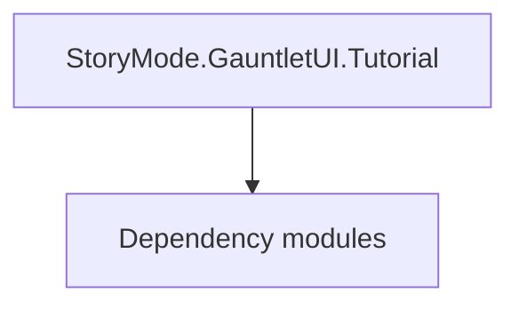

# StoryMode.GauntletUI.Tutorial

**One-line responsibility:** This page covers all 69 business types under `StoryMode.GauntletUI.Tutorial` as a family index, giving each type its namespace, responsibility, and typical timing so you can browse by module instead of alphabetically.

## Mental Model

StoryMode.GauntletUI.Tutorial is the tutorial UI layer of the StoryMode (main story) module: the widgets/VMs that drive the scripted onboarding flow. It presents tutorial steps and surfaces completion to the logic layer.

## When to Use

To customize or extend the main-story tutorial UI, derive from the relevant tutorial Widget/VM and open it from the tutorial controller.

## Dependencies

The types under `StoryMode.GauntletUI.Tutorial` depend on the following modules; missing any of them causes compile- or run-time failure.

- [ViewModel](../../core-extra/ViewModel)
- [Campaign](../../campaign/Campaign)
- [API Overview](../../_index)

## Type Catalog

| Type | Namespace | Purpose | Timing |
| --- | --- | --- | --- |
| `ArmyCohesionStep1Tutorial` | StoryMode.GauntletUI.Tutorial | A business type under this namespace that carries its derived convention responsibility. Confirm its lifecycle and owning system before calling; do not reference an unready instance at the wrong phase. World-state changes should go through the corresponding Action/Behavior, not direct field mutation. | On UI open |
| `ArmyCohesionStep2Tutorial` | StoryMode.GauntletUI.Tutorial | A business type under this namespace that carries its derived convention responsibility. Confirm its lifecycle and owning system before calling; do not reference an unready instance at the wrong phase. World-state changes should go through the corresponding Action/Behavior, not direct field mutation. | On UI open |
| `AssignRolesTutorial` | StoryMode.GauntletUI.Tutorial | A business type under this namespace that carries its derived convention responsibility. Confirm its lifecycle and owning system before calling; do not reference an unready instance at the wrong phase. World-state changes should go through the corresponding Action/Behavior, not direct field mutation. | On UI open |
| `BombardmentStep1Tutorial` | StoryMode.GauntletUI.Tutorial | A business type under this namespace that carries its derived convention responsibility. Confirm its lifecycle and owning system before calling; do not reference an unready instance at the wrong phase. World-state changes should go through the corresponding Action/Behavior, not direct field mutation. | On UI open |
| `BuyingFoodStep1Tutorial` | StoryMode.GauntletUI.Tutorial | A business type under this namespace that carries its derived convention responsibility. Confirm its lifecycle and owning system before calling; do not reference an unready instance at the wrong phase. World-state changes should go through the corresponding Action/Behavior, not direct field mutation. | On UI open |
| `BuyingFoodStep2Tutorial` | StoryMode.GauntletUI.Tutorial | A business type under this namespace that carries its derived convention responsibility. Confirm its lifecycle and owning system before calling; do not reference an unready instance at the wrong phase. World-state changes should go through the corresponding Action/Behavior, not direct field mutation. | On UI open |
| `BuyingFoodStep3Tutorial` | StoryMode.GauntletUI.Tutorial | A business type under this namespace that carries its derived convention responsibility. Confirm its lifecycle and owning system before calling; do not reference an unready instance at the wrong phase. World-state changes should go through the corresponding Action/Behavior, not direct field mutation. | On UI open |
| `ChoosingPerkUpgradesStep1Tutorial` | StoryMode.GauntletUI.Tutorial | A business type under this namespace that carries its derived convention responsibility. Confirm its lifecycle and owning system before calling; do not reference an unready instance at the wrong phase. World-state changes should go through the corresponding Action/Behavior, not direct field mutation. | On UI open |
| `ChoosingPerkUpgradesStep2Tutorial` | StoryMode.GauntletUI.Tutorial | A business type under this namespace that carries its derived convention responsibility. Confirm its lifecycle and owning system before calling; do not reference an unready instance at the wrong phase. World-state changes should go through the corresponding Action/Behavior, not direct field mutation. | On UI open |
| `ChoosingPerkUpgradesStep3Tutorial` | StoryMode.GauntletUI.Tutorial | A business type under this namespace that carries its derived convention responsibility. Confirm its lifecycle and owning system before calling; do not reference an unready instance at the wrong phase. World-state changes should go through the corresponding Action/Behavior, not direct field mutation. | On UI open |
| `ChoosingSkillFocusStep1Tutorial` | StoryMode.GauntletUI.Tutorial | A business type under this namespace that carries its derived convention responsibility. Confirm its lifecycle and owning system before calling; do not reference an unready instance at the wrong phase. World-state changes should go through the corresponding Action/Behavior, not direct field mutation. | On UI open |
| `ChoosingSkillFocusStep2Tutorial` | StoryMode.GauntletUI.Tutorial | A business type under this namespace that carries its derived convention responsibility. Confirm its lifecycle and owning system before calling; do not reference an unready instance at the wrong phase. World-state changes should go through the corresponding Action/Behavior, not direct field mutation. | On UI open |
| `CraftingOrdersTutorial` | StoryMode.GauntletUI.Tutorial | Battle order / formation sequence describing a unit’s formation and movement intent, interpreted and executed by the Order system. | On UI open |
| `CraftingStep1Tutorial` | StoryMode.GauntletUI.Tutorial | A business type under this namespace that carries its derived convention responsibility. Confirm its lifecycle and owning system before calling; do not reference an unready instance at the wrong phase. World-state changes should go through the corresponding Action/Behavior, not direct field mutation. | On UI open |
| `CreateArmyStep1Tutorial` | StoryMode.GauntletUI.Tutorial | A business type under this namespace that carries its derived convention responsibility. Confirm its lifecycle and owning system before calling; do not reference an unready instance at the wrong phase. World-state changes should go through the corresponding Action/Behavior, not direct field mutation. | On UI open |
| `CreateArmyStep2Tutorial` | StoryMode.GauntletUI.Tutorial | A business type under this namespace that carries its derived convention responsibility. Confirm its lifecycle and owning system before calling; do not reference an unready instance at the wrong phase. World-state changes should go through the corresponding Action/Behavior, not direct field mutation. | On UI open |
| `CreateArmyStep3Tutorial` | StoryMode.GauntletUI.Tutorial | A business type under this namespace that carries its derived convention responsibility. Confirm its lifecycle and owning system before calling; do not reference an unready instance at the wrong phase. World-state changes should go through the corresponding Action/Behavior, not direct field mutation. | On UI open |
| `CrimeTutorial` | StoryMode.GauntletUI.Tutorial | A business type under this namespace that carries its derived convention responsibility. Confirm its lifecycle and owning system before calling; do not reference an unready instance at the wrong phase. World-state changes should go through the corresponding Action/Behavior, not direct field mutation. | On UI open |
| `EncyclopediaClansTutorial` | StoryMode.GauntletUI.Tutorial | A business type under this namespace that carries its derived convention responsibility. Confirm its lifecycle and owning system before calling; do not reference an unready instance at the wrong phase. World-state changes should go through the corresponding Action/Behavior, not direct field mutation. | On UI open |
| `EncyclopediaConceptsTutorial` | StoryMode.GauntletUI.Tutorial | A business type under this namespace that carries its derived convention responsibility. Confirm its lifecycle and owning system before calling; do not reference an unready instance at the wrong phase. World-state changes should go through the corresponding Action/Behavior, not direct field mutation. | On UI open |
| `EncyclopediaFiltersTutorial` | StoryMode.GauntletUI.Tutorial | A business type under this namespace that carries its derived convention responsibility. Confirm its lifecycle and owning system before calling; do not reference an unready instance at the wrong phase. World-state changes should go through the corresponding Action/Behavior, not direct field mutation. | On UI open |
| `EncyclopediaFogOfWarTutorial` | StoryMode.GauntletUI.Tutorial | A business type under this namespace that carries its derived convention responsibility. Confirm its lifecycle and owning system before calling; do not reference an unready instance at the wrong phase. World-state changes should go through the corresponding Action/Behavior, not direct field mutation. | On UI open |
| `EncyclopediaHomeTutorial` | StoryMode.GauntletUI.Tutorial | A business type under this namespace that carries its derived convention responsibility. Confirm its lifecycle and owning system before calling; do not reference an unready instance at the wrong phase. World-state changes should go through the corresponding Action/Behavior, not direct field mutation. | On UI open |
| `EncyclopediaKingdomsTutorial` | StoryMode.GauntletUI.Tutorial | A business type under this namespace that carries its derived convention responsibility. Confirm its lifecycle and owning system before calling; do not reference an unready instance at the wrong phase. World-state changes should go through the corresponding Action/Behavior, not direct field mutation. | On UI open |
| `EncyclopediaPageTutorialBase` | StoryMode.GauntletUI.Tutorial | A business type under this namespace that carries its derived convention responsibility. Confirm its lifecycle and owning system before calling; do not reference an unready instance at the wrong phase. World-state changes should go through the corresponding Action/Behavior, not direct field mutation. | On UI open |
| `EncyclopediaSearchTutorial` | StoryMode.GauntletUI.Tutorial | A business type under this namespace that carries its derived convention responsibility. Confirm its lifecycle and owning system before calling; do not reference an unready instance at the wrong phase. World-state changes should go through the corresponding Action/Behavior, not direct field mutation. | On UI open |
| `EncyclopediaSettlementsTutorial` | StoryMode.GauntletUI.Tutorial | A business type under this namespace that carries its derived convention responsibility. Confirm its lifecycle and owning system before calling; do not reference an unready instance at the wrong phase. World-state changes should go through the corresponding Action/Behavior, not direct field mutation. | On UI open |
| `EncyclopediaSortTutorial` | StoryMode.GauntletUI.Tutorial | A business type under this namespace that carries its derived convention responsibility. Confirm its lifecycle and owning system before calling; do not reference an unready instance at the wrong phase. World-state changes should go through the corresponding Action/Behavior, not direct field mutation. | On UI open |
| `EncyclopediaTrackTutorial` | StoryMode.GauntletUI.Tutorial | A business type under this namespace that carries its derived convention responsibility. Confirm its lifecycle and owning system before calling; do not reference an unready instance at the wrong phase. World-state changes should go through the corresponding Action/Behavior, not direct field mutation. | On UI open |
| `EncyclopediaTroopsTutorial` | StoryMode.GauntletUI.Tutorial | A business type under this namespace that carries its derived convention responsibility. Confirm its lifecycle and owning system before calling; do not reference an unready instance at the wrong phase. World-state changes should go through the corresponding Action/Behavior, not direct field mutation. | On UI open |
| `EnterVillageTutorial` | StoryMode.GauntletUI.Tutorial | A business type under this namespace that carries its derived convention responsibility. Confirm its lifecycle and owning system before calling; do not reference an unready instance at the wrong phase. World-state changes should go through the corresponding Action/Behavior, not direct field mutation. | On UI open |
| `EquipmentSetsTutorial` | StoryMode.GauntletUI.Tutorial | A business type under this namespace that carries its derived convention responsibility. Confirm its lifecycle and owning system before calling; do not reference an unready instance at the wrong phase. World-state changes should go through the corresponding Action/Behavior, not direct field mutation. | On UI open |
| `GettingCompanionsStep1Tutorial` | StoryMode.GauntletUI.Tutorial | A business type under this namespace that carries its derived convention responsibility. Confirm its lifecycle and owning system before calling; do not reference an unready instance at the wrong phase. World-state changes should go through the corresponding Action/Behavior, not direct field mutation. | On UI open |
| `GettingCompanionsStep2Tutorial` | StoryMode.GauntletUI.Tutorial | A business type under this namespace that carries its derived convention responsibility. Confirm its lifecycle and owning system before calling; do not reference an unready instance at the wrong phase. World-state changes should go through the corresponding Action/Behavior, not direct field mutation. | On UI open |
| `GettingCompanionsStep3Tutorial` | StoryMode.GauntletUI.Tutorial | A business type under this namespace that carries its derived convention responsibility. Confirm its lifecycle and owning system before calling; do not reference an unready instance at the wrong phase. World-state changes should go through the corresponding Action/Behavior, not direct field mutation. | On UI open |
| `InventoryBannerItemTutorial` | StoryMode.GauntletUI.Tutorial | A business type under this namespace that carries its derived convention responsibility. Confirm its lifecycle and owning system before calling; do not reference an unready instance at the wrong phase. World-state changes should go through the corresponding Action/Behavior, not direct field mutation. | On UI open |
| `KingdomDecisionVotingTutorial` | StoryMode.GauntletUI.Tutorial | A business type under this namespace that carries its derived convention responsibility. Confirm its lifecycle and owning system before calling; do not reference an unready instance at the wrong phase. World-state changes should go through the corresponding Action/Behavior, not direct field mutation. | On UI open |
| `MovementInMissionTutorial` | StoryMode.GauntletUI.Tutorial | A business type under this namespace that carries its derived convention responsibility. Confirm its lifecycle and owning system before calling; do not reference an unready instance at the wrong phase. World-state changes should go through the corresponding Action/Behavior, not direct field mutation. | On UI open |
| `NavigateOnMapTutorialStep1` | StoryMode.GauntletUI.Tutorial | A business type under this namespace that carries its derived convention responsibility. Confirm its lifecycle and owning system before calling; do not reference an unready instance at the wrong phase. World-state changes should go through the corresponding Action/Behavior, not direct field mutation. | On UI open |
| `NavigateOnMapTutorialStep2` | StoryMode.GauntletUI.Tutorial | A business type under this namespace that carries its derived convention responsibility. Confirm its lifecycle and owning system before calling; do not reference an unready instance at the wrong phase. World-state changes should go through the corresponding Action/Behavior, not direct field mutation. | On UI open |
| `OrderHideoutTutorial` | StoryMode.GauntletUI.Tutorial | Battle order / formation sequence describing a unit’s formation and movement intent, interpreted and executed by the Order system. | On UI open |
| `OrderOfBattleTutorialStep1Tutorial` | StoryMode.GauntletUI.Tutorial | Battle order / formation sequence describing a unit’s formation and movement intent, interpreted and executed by the Order system. | On UI open |
| `OrderOfBattleTutorialStep2Tutorial` | StoryMode.GauntletUI.Tutorial | Battle order / formation sequence describing a unit’s formation and movement intent, interpreted and executed by the Order system. | On UI open |
| `OrderOfBattleTutorialStep3Tutorial` | StoryMode.GauntletUI.Tutorial | Battle order / formation sequence describing a unit’s formation and movement intent, interpreted and executed by the Order system. | On UI open |
| `OrderTutorialStep1` | StoryMode.GauntletUI.Tutorial | Battle order / formation sequence describing a unit’s formation and movement intent, interpreted and executed by the Order system. | On UI open |
| `OrderTutorialStep2` | StoryMode.GauntletUI.Tutorial | Battle order / formation sequence describing a unit’s formation and movement intent, interpreted and executed by the Order system. | On UI open |
| `PartySpeedTutorial` | StoryMode.GauntletUI.Tutorial | A business type under this namespace that carries its derived convention responsibility. Confirm its lifecycle and owning system before calling; do not reference an unready instance at the wrong phase. World-state changes should go through the corresponding Action/Behavior, not direct field mutation. | On UI open |
| `PressLeaveToReturnFromMissionTutorial1` | StoryMode.GauntletUI.Tutorial | A business type under this namespace that carries its derived convention responsibility. Confirm its lifecycle and owning system before calling; do not reference an unready instance at the wrong phase. World-state changes should go through the corresponding Action/Behavior, not direct field mutation. | On UI open |
| `PressLeaveToReturnFromMissionTutorial2` | StoryMode.GauntletUI.Tutorial | A business type under this namespace that carries its derived convention responsibility. Confirm its lifecycle and owning system before calling; do not reference an unready instance at the wrong phase. World-state changes should go through the corresponding Action/Behavior, not direct field mutation. | On UI open |
| `QuestScreenTutorial` | StoryMode.GauntletUI.Tutorial | A business type under this namespace that carries its derived convention responsibility. Confirm its lifecycle and owning system before calling; do not reference an unready instance at the wrong phase. World-state changes should go through the corresponding Action/Behavior, not direct field mutation. | On UI open |
| `RaidVillageStep1Tutorial` | StoryMode.GauntletUI.Tutorial | AI decision implementation that must be interruptible and serializable to support saving and undo. Search must be depth/time bounded to avoid stalls. | On UI open |
| `RansomingPrisonersStep1Tutorial` | StoryMode.GauntletUI.Tutorial | A business type under this namespace that carries its derived convention responsibility. Confirm its lifecycle and owning system before calling; do not reference an unready instance at the wrong phase. World-state changes should go through the corresponding Action/Behavior, not direct field mutation. | On UI open |
| `RansomingPrisonersStep2Tutorial` | StoryMode.GauntletUI.Tutorial | A business type under this namespace that carries its derived convention responsibility. Confirm its lifecycle and owning system before calling; do not reference an unready instance at the wrong phase. World-state changes should go through the corresponding Action/Behavior, not direct field mutation. | On UI open |
| `RecruitmentStep1Tutorial` | StoryMode.GauntletUI.Tutorial | A business type under this namespace that carries its derived convention responsibility. Confirm its lifecycle and owning system before calling; do not reference an unready instance at the wrong phase. World-state changes should go through the corresponding Action/Behavior, not direct field mutation. | On UI open |
| `RecruitmentStep2Tutorial` | StoryMode.GauntletUI.Tutorial | A business type under this namespace that carries its derived convention responsibility. Confirm its lifecycle and owning system before calling; do not reference an unready instance at the wrong phase. World-state changes should go through the corresponding Action/Behavior, not direct field mutation. | On UI open |
| `SeeMarkersInMissionTutorial` | StoryMode.GauntletUI.Tutorial | A business type under this namespace that carries its derived convention responsibility. Confirm its lifecycle and owning system before calling; do not reference an unready instance at the wrong phase. World-state changes should go through the corresponding Action/Behavior, not direct field mutation. | On UI open |
| `StealthCrouchTutorial` | StoryMode.GauntletUI.Tutorial | A business type under this namespace that carries its derived convention responsibility. Confirm its lifecycle and owning system before calling; do not reference an unready instance at the wrong phase. World-state changes should go through the corresponding Action/Behavior, not direct field mutation. | On UI open |
| `StealthDarkZoneTutorial` | StoryMode.GauntletUI.Tutorial | A business type under this namespace that carries its derived convention responsibility. Confirm its lifecycle and owning system before calling; do not reference an unready instance at the wrong phase. World-state changes should go through the corresponding Action/Behavior, not direct field mutation. | On UI open |
| `StealthDistractionTutorial` | StoryMode.GauntletUI.Tutorial | A business type under this namespace that carries its derived convention responsibility. Confirm its lifecycle and owning system before calling; do not reference an unready instance at the wrong phase. World-state changes should go through the corresponding Action/Behavior, not direct field mutation. | On UI open |
| `StealthHideCorpseTutorial` | StoryMode.GauntletUI.Tutorial | A business type under this namespace that carries its derived convention responsibility. Confirm its lifecycle and owning system before calling; do not reference an unready instance at the wrong phase. World-state changes should go through the corresponding Action/Behavior, not direct field mutation. | On UI open |
| `StealthHideInBushesTutorial` | StoryMode.GauntletUI.Tutorial | A business type under this namespace that carries its derived convention responsibility. Confirm its lifecycle and owning system before calling; do not reference an unready instance at the wrong phase. World-state changes should go through the corresponding Action/Behavior, not direct field mutation. | On UI open |
| `StealthStealthKillTutorial` | StoryMode.GauntletUI.Tutorial | A business type under this namespace that carries its derived convention responsibility. Confirm its lifecycle and owning system before calling; do not reference an unready instance at the wrong phase. World-state changes should go through the corresponding Action/Behavior, not direct field mutation. | On UI open |
| `StealthWalkSlowTutorial` | StoryMode.GauntletUI.Tutorial | A business type under this namespace that carries its derived convention responsibility. Confirm its lifecycle and owning system before calling; do not reference an unready instance at the wrong phase. World-state changes should go through the corresponding Action/Behavior, not direct field mutation. | On UI open |
| `TakingPrisonersTutorial` | StoryMode.GauntletUI.Tutorial | A business type under this namespace that carries its derived convention responsibility. Confirm its lifecycle and owning system before calling; do not reference an unready instance at the wrong phase. World-state changes should go through the corresponding Action/Behavior, not direct field mutation. | On UI open |
| `TalkToNotableTutorialStep1` | StoryMode.GauntletUI.Tutorial | A business type under this namespace that carries its derived convention responsibility. Confirm its lifecycle and owning system before calling; do not reference an unready instance at the wrong phase. World-state changes should go through the corresponding Action/Behavior, not direct field mutation. | On UI open |
| `TalkToNotableTutorialStep2` | StoryMode.GauntletUI.Tutorial | A business type under this namespace that carries its derived convention responsibility. Confirm its lifecycle and owning system before calling; do not reference an unready instance at the wrong phase. World-state changes should go through the corresponding Action/Behavior, not direct field mutation. | On UI open |
| `UpgradingTroopsStep1Tutorial` | StoryMode.GauntletUI.Tutorial | A business type under this namespace that carries its derived convention responsibility. Confirm its lifecycle and owning system before calling; do not reference an unready instance at the wrong phase. World-state changes should go through the corresponding Action/Behavior, not direct field mutation. | On UI open |
| `UpgradingTroopsStep2Tutorial` | StoryMode.GauntletUI.Tutorial | A business type under this namespace that carries its derived convention responsibility. Confirm its lifecycle and owning system before calling; do not reference an unready instance at the wrong phase. World-state changes should go through the corresponding Action/Behavior, not direct field mutation. | On UI open |
| `UpgradingTroopsStep3Tutorial` | StoryMode.GauntletUI.Tutorial | A business type under this namespace that carries its derived convention responsibility. Confirm its lifecycle and owning system before calling; do not reference an unready instance at the wrong phase. World-state changes should go through the corresponding Action/Behavior, not direct field mutation. | On UI open |

## Risk & Boundaries

Tutorial UI must stay in sync with the tutorial controller’s step state; desync breaks onboarding. Keep logic out of the view.

## See Also

- [ViewModel](../../core-extra/ViewModel)
- [Campaign](../../campaign/Campaign)
- [API Overview](../../_index)
