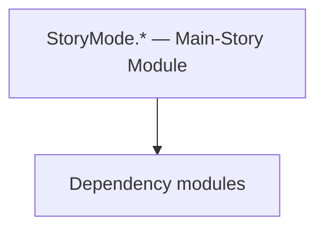

# StoryMode.* — Main-Story Module

**One-line responsibility:** This page covers all 19 business types under `StoryMode.* — Main-Story Module` as a family index, giving each type its namespace, responsibility, and typical timing so you can browse by module instead of alphabetically.

## Mental Model

StoryMode.* is the main-story (campaign narrative) module: story phases, quest/view/view-model collections, game components/campaign behaviors, extensions, and story objects. It cooperates with CampaignBehavior to drive the narrative but does not write rules directly; quest flow is via events and Behaviors.

## When to Use

To extend main-story progression (phases, behaviors, views), derive from the relevant StoryMode type and register it with the story manager/QuestManager.

## Dependencies

The types under `StoryMode.* — Main-Story Module` depend on the following modules; missing any of them causes compile- or run-time failure.

- [Campaign](../../campaign/Campaign)
- [API Overview](../../_index)

## Type Catalog

| Type | Namespace | Purpose | Timing |
| --- | --- | --- | --- |
| `CampaignStoryMode` | StoryMode | AI decision implementation that must be interruptible and serializable to support saving and undo. Search must be depth/time bounded to avoid stalls. | During story progress |
| `ConspiracyQuestMapNotification` | StoryMode | Notification item type describing the data of one map/event prompt. It only carries display data; triggering logic lives in the Behavior. | During story progress |
| `IsArzagosTag` | StoryMode | A business type under this namespace that carries its derived convention responsibility. Confirm its lifecycle and owning system before calling; do not reference an unready instance at the wrong phase. World-state changes should go through the corresponding Action/Behavior, not direct field mutation. | During story progress |
| `IsIstianaTag` | StoryMode | A business type under this namespace that carries its derived convention responsibility. Confirm its lifecycle and owning system before calling; do not reference an unready instance at the wrong phase. World-state changes should go through the corresponding Action/Behavior, not direct field mutation. | During story progress |
| `IsStoryModeMentorTag` | StoryMode | A business type under this namespace that carries its derived convention responsibility. Confirm its lifecycle and owning system before calling; do not reference an unready instance at the wrong phase. World-state changes should go through the corresponding Action/Behavior, not direct field mutation. | During story progress |
| `MainStoryLine` | StoryMode | AI decision implementation that must be interruptible and serializable to support saving and undo. Search must be depth/time bounded to avoid stalls. | During story progress |
| `MainStoryLineSide` | StoryMode | AI decision implementation that must be interruptible and serializable to support saving and undo. Search must be depth/time bounded to avoid stalls. | During story progress |
| `SaveableStoryModeTypeDefiner` | StoryMode | Save-type definer that declares which fields of the type enter the save. Any new field must carry a default value, otherwise old saves fail to deserialize. | During story progress |
| `StoryModeCheats` | StoryMode | Debug cheat item triggered via console or menu for development-time effects. Production builds should disable or stub it to avoid accidentally corrupting saves. | During story progress |
| `StoryModeData` | StoryMode | A business type under this namespace that carries its derived convention responsibility. Confirm its lifecycle and owning system before calling; do not reference an unready instance at the wrong phase. World-state changes should go through the corresponding Action/Behavior, not direct field mutation. | During story progress |
| `StoryModeEvents` | StoryMode | Event or event handler carrying the data of something that happened once. Remember to unsubscribe on unload to avoid leaks. | During story progress |
| `StoryModeHelpers` | StoryMode | Static helper utility that concentrates a cross-cutting operation (open screen, compute result, resolve entity). Call it from the correct system context; do not instantiate it as stateful. | During story progress |
| `StoryModeManager` | StoryMode | A business type under this namespace that carries its derived convention responsibility. Confirm its lifecycle and owning system before calling; do not reference an unready instance at the wrong phase. World-state changes should go through the corresponding Action/Behavior, not direct field mutation. | During story progress |
| `StoryModeQuestBase` | StoryMode | A business type under this namespace that carries its derived convention responsibility. Confirm its lifecycle and owning system before calling; do not reference an unready instance at the wrong phase. World-state changes should go through the corresponding Action/Behavior, not direct field mutation. | During story progress |
| `StoryModeSubModule` | StoryMode | Module entry base class that registers behaviors and override points. Its lifetime spans the whole session; do not fetch systems that are not yet ready (e.g. before loading) at the wrong phase. | During story progress |
| `TrainingField` | StoryMode | AI decision implementation that must be interruptible and serializable to support saving and undo. Search must be depth/time bounded to avoid stalls. | During story progress |
| `TrainingFieldEncounter` | StoryMode | AI decision implementation that must be interruptible and serializable to support saving and undo. Search must be depth/time bounded to avoid stalls. | During story progress |
| `MissionState` | Storymode.Missions | A business type under this namespace that carries its derived convention responsibility. Confirm its lifecycle and owning system before calling; do not reference an unready instance at the wrong phase. World-state changes should go through the corresponding Action/Behavior, not direct field mutation. | On battle/mission load |
| `SneakIntoTheVillaMissionController` | Storymode.Missions | Mission logic that defines the flow and win/lose conditions of that mission, assembled by the Mission on load. Win/lose resolution must be idempotent — repeated triggers must not double-settle. | On battle/mission load |

## Risk & Boundaries

Story condition checks must be idempotent; repeated triggers double-reward or desync. New fields need default values for save compatibility. Mind the "Storymode" vs "StoryMode" namespace spelling in legacy pages.

## See Also

- [Campaign](../../campaign/Campaign)
- [API Overview](../../_index)
