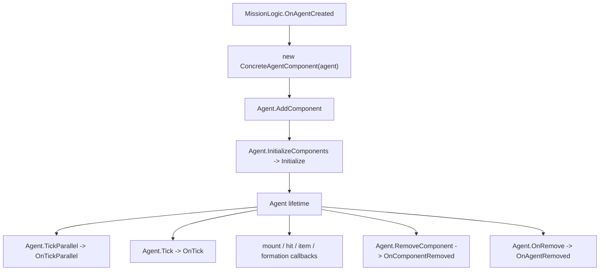

# AgentComponent

**Namespace:** `TaleWorlds.MountAndBlade`  
**Module:** `TaleWorlds.MountAndBlade`  
**Type:** `public abstract class AgentComponent`  
**Base:** none  
**Source:** `bin/TaleWorlds.MountAndBlade/TaleWorlds.MountAndBlade/AgentComponent.cs`

## One-sentence responsibility

`AgentComponent` is the Mission-time extension point for behavior owned by one live `Agent`; the `Agent` owns the component list and forwards lifecycle, tick, combat, equipment, mount, formation, and removal callbacks to each component.

## Mental model: a per-Agent callback slot

This is not a global service, a `MissionBehavior`, or a save object. A Mission-side logic creates a concrete component with an `Agent`, calls `Agent.AddComponent`, and the Agent later calls `Initialize` after its components have been assembled. During the Agent lifetime, `Agent.TickParallel` and `Agent.Tick` dispatch the two tick lanes, while native and Mission callbacks dispatch the event methods. `Agent.OnRemove` ends the component's useful lifetime by calling `OnAgentRemoved`.

The base class stores the owning `Agent` in a protected field. The component is therefore a short-lived child of the Agent, not an independent owner of the Agent or Mission. `Agent.GetComponent<T>()` reads the first matching component; `Agent.Components` exposes the read-only component list used by systems such as `CommonAIComponent`.



## When to use and when not to use

**Use it when:**

- one Agent needs state or callbacks that should disappear with that Agent;
- a Mission feature needs a per-Agent hook for mount changes, item pickup, weapon durability, morale contribution, AI input, formation changes, or Agent removal;
- a Mission logic can create the component at `OnAgentCreated`, or an already-running Mission can attach it with `Mission.AddMissionBehavior` and `Agent.AddComponent`.

**Do not use it when:**

- the behavior belongs to the whole scene; derive from [`MissionBehavior`](../mission/MissionBehavior) or [`MissionLogic`](./MissionLogic);
- the state must survive a save or a new Mission; store stable campaign data in a [`CampaignBehaviorBase`](../campaign/CampaignBehaviorBase) and `SyncData`;
- the work is a global module or campaign hook; use [`MBSubModuleBase`](../core/MBSubModuleBase) or a Campaign event;
- the callback only needs to observe an Agent death from outside that Agent; use [`MissionBehavior.OnAgentRemoved`](../mission/MissionBehavior) so the callback receives the affector, `AgentState`, and `KillingBlow`.

Adding a component does not make it a `MissionBehavior`, does not call `Initialize` immediately, and does not deduplicate the component type. If a mod adds two instances of the same concrete type, `GetComponent<T>()` returns only the first one while both instances receive forwarded callbacks.

## Dependencies and callback boundaries

**Upstream**

- [`Agent`](../mission/Agent) owns `_components`, adds and removes components, and forwards callbacks.
- [`Mission`](../mission/Mission) owns the scene and supplies the phase in which Agents are created, ticked, mounted, hit, and removed.
- [`MissionLogic`](./MissionLogic) or another [`MissionBehavior`](../mission/MissionBehavior) is the normal registration boundary.

**Downstream**

- [`CommonAIComponent`](./CommonAIComponent) consumes `GetMoraleAddition`, runs AI morale and retreat logic, and cleans mount reservations during removal.
- [`HumanAIComponent`](./HumanAIComponent) uses tick, retreat, mount, and removal callbacks for human AI and mount reservations.
- [`CampaignAgentComponent`](../campaign-ext/CampaignAgentComponent) uses `OnTick`, `OnStopUsingGameObject`, and the morale hooks to bridge Campaign/Sandbox behavior into a Mission Agent.
- [`MPPerksAgentComponent`](./MPPerksAgentComponent) uses mount, pickup, weapon-drop, and removal callbacks to maintain perk subscriptions.
- [`VictoryComponent`](./VictoryComponent) is a short-lived Agent component created by `AgentVictoryLogic`; its timer is checked by the owning Mission logic.
- [`ScriptedMovementComponent`](./ScriptedMovementComponent) keeps a Mission-local target and updates scripted movement from `OnTick`.

There is no save or event-dispatch contract on `AgentComponent` itself. A derived component may subscribe to an Agent event in its constructor, but it must unsubscribe in `OnAgentRemoved` or `OnComponentRemoved` according to the owner that can release it. Do not assume that the base class will unregister anything for you.

## Registration and lifetime

### Protected constructor

`protected AgentComponent(Agent agent)` stores the owning Agent. A mod creates a concrete subclass, not the abstract base. The constructor runs before the component is in `Agent.Components`, so do not expect another component to have already initialized or do work that requires the Agent's fully built Mission state.

### `Agent.AddComponent`

`Agent.AddComponent(AgentComponent)` appends the instance to the component list. The source only updates the special `CommonAIComponent` and `HumanAIComponent` references when those exact derived types are added; it does not call `Initialize` or reject duplicates. Engine and Mission logic use this path for AI, perk, victory, and scripted-movement components.

### `Initialize()`

The default implementation is empty. `Agent.InitializeComponents()` calls it once for every component after the component list has been assembled. Use it for initialization that requires the Agent's completed build, not for subscribing to a lifetime that may be torn down by a constructor failure.

### `Agent.GetComponent<T>()` and `Agent.Components`

`GetComponent<T>()` returns the first component assignable to `T`, or `null`; `Components` is the read-only list. Use the typed lookup for an optional component and check for `null`. Use the list only when an aggregate contract is intentional, as `CommonAIComponent.Initialize` does when summing every component's morale addition.

### `Agent.RemoveComponent`

`Agent.RemoveComponent(component)` removes the exact instance and then calls that instance's `OnComponentRemoved`. It does not call `OnAgentRemoved`. Controller-change logic uses this boundary when an Agent stops being AI-controlled. Cleanup must therefore be safe both for explicit component removal and for whole-Agent removal.

## Callback members by phase

The base implementations are no-ops except for `GetMoraleAddition`, which returns `0f`, and `GetMoraleDecreaseConstant`, which returns `1f`. Override only the callbacks the component owns; keep each callback cheap because many are called for every live Agent or every frame.

### Initialization and tick

| Member | Use and side effect | Timing boundary |
| --- | --- | --- |
| `Initialize()` | Build per-Agent caches or subscribe to resources that are valid after component assembly. | Called by `Agent.InitializeComponents`; it is not called by `AddComponent`. |
| `OnTick(float dt)` | Run ordinary Mission-thread per-frame work owned by this Agent. `ScriptedMovementComponent` updates its target and movement here. | The Agent must be active and the Mission tick must still be valid. Do not use it for Campaign save mutations. |
| `OnTickParallel(float dt)` | Run work intended for the Agent's parallel tick lane, such as `CommonAIComponent` morale recovery and retreat checks. | Treat the callback as a parallel boundary: avoid UI access, Campaign singleton mutation, and unsynchronized shared mod state. |

### Morale and combat

| Member | Use and side effect | Timing boundary |
| --- | --- | --- |
| `GetMoraleAddition()` | Return this component's additive contribution to initial morale. `CommonAIComponent.Initialize` sums all component results before applying `BattleMoraleModel`. | Return a value only; do not write morale from this query. The default is `0f`. |
| `GetMoraleDecreaseConstant()` | Supply a component-specific morale decrease factor, as `CampaignAgentComponent` does for siege attacker/defender context. | It is a rule input, not an instruction to mutate morale. The default is `1f`; the active owner and MapEvent must be valid when the override reads them. |
| `OnHit(Agent affectorAgent, int damage, in MissionWeapon affectorWeapon, in Blow b, in AttackCollisionData collisionData)` | React to a hit while the combat data is available. `CommonAIComponent` uses damage on an unmounted AI horse to trigger panic. | Keep the callback local and cheap. Do not retain the `in` value or infer a completed death from a hit. |
| `OnDisciplineChanged()` | Refresh component state when the Agent's discipline value changes. | The Agent remains the owner; this callback is not a Campaign event. |

### Equipment, mounts, and scene interaction

| Member | Use and side effect | Timing boundary |
| --- | --- | --- |
| `OnItemPickup(SpawnedItemEntity item)` | Observe an item pickup; `MPPerksAgentComponent` checks whether the picked weapon is a banner and raises a perk event. | The item is a Mission object. Read it immediately and do not save the native entity reference. |
| `OnWeaponDrop(MissionWeapon droppedWeapon)` | Observe a weapon drop; perk components use it to detect a dropped banner. | The weapon is a value passed from the current equipment operation. Do not treat the callback as a roster mutation API. |
| `OnWeaponHPChanged(ItemObject item, int hitPoints)` | React when `Agent.ChangeWeaponHitPoints` writes a slot's durability. | The `ItemObject` belongs to the current equipment graph; do not use this callback to bypass equipment or network synchronization. |
| `OnStopUsingGameObject()` | Release component state after the Agent stops using a usable object. `CampaignAgentComponent` forwards the boundary to its `AgentNavigator` for AI Agents. | The Mission object may already be in its stop-using cleanup path; avoid starting a second interaction. |
| `OnMount(Agent mount)` | Update state when this Agent mounts; perk components subscribe to the mount's health and Human AI adjusts movement constraints. | The `mount` is live for this callback only. Unsubscribe mount events when the rider or mount is removed. |
| `OnDismount(Agent mount)` | Reverse mount-side subscriptions or movement adjustments. | `mount` may be in a removal transition; use current state and do not retain it across Missions. |
| `OnRetreating()` | Adjust per-Agent behavior when retreat begins; Human AI reduces its speed limit here. | This is a Mission transition, not a request to start retreat. Use the Agent/common AI contract to initiate retreat. |
| `OnAgentTeleported()` | Rebuild transient spatial state after the Agent is teleported. | Re-read position and scene handles after the callback; cached native positions can be stale. |
| `OnFormationSet()` | Reconcile component state after the Agent is assigned to a Formation. | The Formation callback is dispatched after the formation assignment; it can be `null` in later removal paths, so do not assume permanent membership. |

### AI input and teardown

| Member | Use and side effect | Timing boundary |
| --- | --- | --- |
| `OnAIInputSet(ref Agent.EventControlFlag eventFlag, ref Agent.MovementControlFlag movementFlag, ref Vec2 inputVector)` | Inspect or adjust the AI control values before the Agent applies them. | The `ref` values are the current frame's control contract. Keep changes narrow and avoid calling UI or Campaign code from this path. |
| `OnAgentRemoved()` | Release subscriptions and per-Agent references when `Agent.OnRemove` removes the Agent from Mission participation. | It is later than some Team/Formation cleanup and earlier than the native object becoming unusable; copy stable IDs if needed, then stop using the Agent. |
| `OnComponentRemoved()` | Release resources when this exact component is removed through `Agent.RemoveComponent`. | It is not an Agent death callback. Make cleanup idempotent if the same resource can also be released from `OnAgentRemoved`. |

## Real registration and lookup example

The following uses the real Mission path: a `MissionLogic` receives `OnAgentCreated`, attaches a concrete component with `Agent.AddComponent`, and later reads it with `Agent.GetComponent<T>()`. `Mission.Current.AddMissionBehavior` is the dynamic attachment path when a Mission is already open; a Mission factory may instead include the logic in its starting behavior array.

```csharp
using TaleWorlds.MountAndBlade;

public sealed class PickupAuditComponent : AgentComponent
{
    private bool _removed;

    public PickupAuditComponent(Agent agent)
        : base(agent)
    {
    }

    public override void OnItemPickup(SpawnedItemEntity item)
    {
        if (_removed || item == null)
        {
            return;
        }

        // Copy only stable data here; do not retain the native item entity.
        string itemId = item.WeaponCopy.Item?.StringId;
        _ = itemId;
    }

    public override void OnAgentRemoved()
    {
        _removed = true;
    }

    public override void OnComponentRemoved()
    {
        _removed = true;
    }
}

public sealed class PickupAuditLogic : MissionLogic
{
    public override void OnAgentCreated(Agent agent)
    {
        base.OnAgentCreated(agent);
        if (agent.IsHuman && agent.GetComponent<PickupAuditComponent>() == null)
        {
            agent.AddComponent(new PickupAuditComponent(agent));
        }

        PickupAuditComponent component = agent.GetComponent<PickupAuditComponent>();
        _ = component;
    }
}

// Run only while a Mission is live.
Mission.Current.AddMissionBehavior(new PickupAuditLogic());
```

The duplicate check in the example is deliberate: `AddComponent` itself does not enforce one instance per type. If the component is attached after existing Agents have been created, enumerate the current Mission Agents and attach it explicitly; future Agents will arrive through `OnAgentCreated`. Remove the component with `Agent.RemoveComponent` when its feature ends so `OnComponentRemoved` releases the feature before the Agent disappears.

## Risks and crash/save boundaries

- **Wrong lifetime:** `AgentComponent` is not a save participant. Persist a stable character or roster identity in a Campaign behavior and reacquire the current Agent in a later Mission; never serialize the protected Agent reference.
- **Wrong phase:** constructors, `Initialize`, ordinary ticks, and removal callbacks have different guarantees. `Mission.Current`, `Agent.Mission`, `Team`, `Formation`, mount, and native scene handles can be unavailable or already in cleanup depending on the callback.
- **Stale Agent or mount references:** after `OnAgentRemoved`, `OnAgentDeleted`, or Mission finalization, native Agent references must not be used by delayed tasks, static caches, or the next Mission. Unsubscribe mount and Agent events during teardown.
- **Explicit removal is different:** `RemoveComponent` calls `OnComponentRemoved`, not `OnAgentRemoved`. If cleanup exists in only one method, controller changes or feature toggles can leak subscriptions.
- **Parallel tick misuse:** `OnTickParallel` must not touch UI, perform unsynchronized writes to shared Campaign state, or call code that assumes the main Mission thread. Keep it to thread-safe calculations and component-local state.
- **Duplicate components:** because `AddComponent` appends blindly, adding the same derived type twice can double-count morale, process events twice, and make `GetComponent<T>()` return an instance different from the one the caller expected.
- **Native object retention:** `SpawnedItemEntity`, `MissionWeapon` context, `Agent`, `Formation`, and usable scene objects are Mission-time data. Copy stable primitive or string IDs before teardown; do not carry native handles into save/load or a later Mission.
- **Cross-layer mutation:** an Agent callback is not an Action or Campaign event boundary. Do not change party ownership, relations, gold, or save data from a component callback merely because an Agent event occurred.

## Version note

This page follows the v1.4.5 `TaleWorlds.MountAndBlade.AgentComponent` and `Agent` sources. The component pattern exists in earlier versions, but derived component sets, callback ordering, AI logic, and `Agent` construction paths can differ; re-check the target version before relying on a callback or a special `Agent` property.

## See also and bidirectional navigation

- **↑ Parent:** [Mission extension API](../)
- **↔ Siblings:** [Agent](../mission/Agent) · [Mission](../mission/Mission) · [MissionBehavior](../mission/MissionBehavior) · [MissionLogic](./MissionLogic)
- **Derived components:** [CommonAIComponent](./CommonAIComponent) · [HumanAIComponent](./HumanAIComponent) · [CampaignAgentComponent](../campaign-ext/CampaignAgentComponent) · [MPPerksAgentComponent](./MPPerksAgentComponent)
- **Related lifecycle:** [MissionObject](./MissionObject) · [AgentNavigator](../gameplay/AgentNavigator) · [AgentComponentExtensions](./AgentComponentExtensions)
- **Architecture:** [Crash boundaries](../../architecture/crash-boundary) · [SDK overview](../../architecture/sdk-overview)
